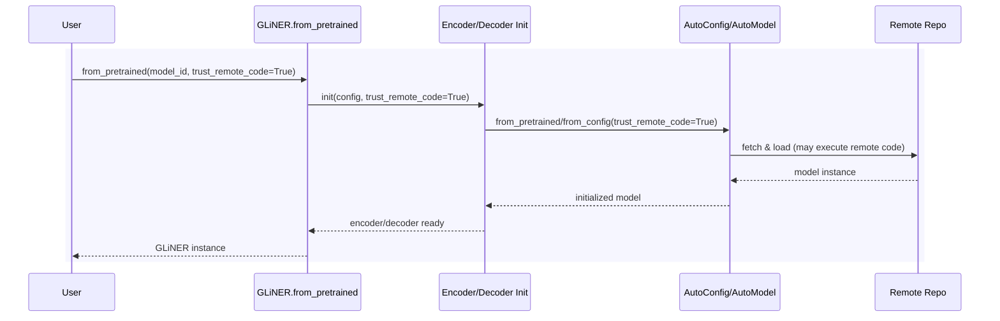
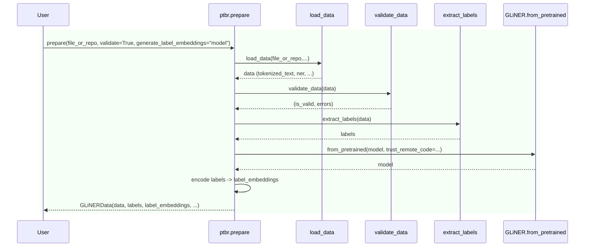
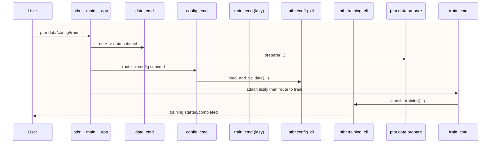

# PR Comments Export

> Exported from [https://github.com/arthrod/GLiNER/pull/37](https://github.com/arthrod/GLiNER/pull/37)  
> 24 of 24 comments selected  
> Generated by [Cicero](https://cicero.im) on 4/19/2026, 10:23:39 PM

---

### coderabbitai[bot] &mdash; 2/19/2026, 4:00:17 AM

**Actionable comments posted: 5**

<details>
<summary>🧹 Nitpick comments (5)</summary><blockquote>

<details>
<summary>ptbr/tests/test_train_py.py (1)</summary><blockquote>

`20-21`: **Silence unused `dtype` parameter in the stub.**  
Helps avoid lint noise without changing behavior.

<details>
<summary>♻️ Proposed cleanup</summary>

```diff
-    def to(self, dtype=None):
+    def to(self, _dtype=None):
         return self
```
</details>

<details>
<summary>🤖 Prompt for AI Agents</summary>

```
Verify each finding against the current code and only fix it if needed.

In `@ptbr/tests/test_train_py.py` around lines 20 - 21, The to(self, dtype=None)
stub should explicitly silence the unused parameter to avoid linter warnings;
update the method in the test stub (to) to reference the argument (for example:
assign "_ = dtype" or rename the parameter to "_dtype") before returning self so
the behavior is unchanged but the linter no longer flags an unused parameter.
```

</details>

</blockquote></details>
<details>
<summary>ptbr/tests/test_training_cli.py (1)</summary><blockquote>

`539-543`: **Drop unused `tmp_path` parameter to avoid lint noise.**  

<details>
<summary>♻️ Proposed cleanup</summary>

```diff
-    def test_validate_writes_summary(self, cfg_file: Path, tmp_path: Path) -> None:
+    def test_validate_writes_summary(self, cfg_file: Path) -> None:
         result = runner.invoke(app, [str(cfg_file), "--validate"])
         assert result.exit_code == 0
         summaries = list(cfg_file.parent.glob("summary_*.txt"))
         assert len(summaries) >= 1
```
</details>

<details>
<summary>🤖 Prompt for AI Agents</summary>

```
Verify each finding against the current code and only fix it if needed.

In `@ptbr/tests/test_training_cli.py` around lines 539 - 543, The test function
signature for test_validate_writes_summary currently includes an unused tmp_path
parameter which causes lint noise; remove tmp_path from the function definition
so it becomes def test_validate_writes_summary(self, cfg_file: Path) -> None:,
and update any references in the test body if they exist (none expected) to
ensure the test still invokes runner.invoke(app, [str(cfg_file), "--validate"])
and assertions remain unchanged.
```

</details>

</blockquote></details>
<details>
<summary>tests/test_validator_integration.py (1)</summary><blockquote>

`478-485`: **Use immutable class constants to avoid shared state (RUF012).**

These class attributes are mutable containers; switching to frozenset/tuple avoids shared-state hazards and silences the lint warning.

<details>
<summary>♻️ Suggested change</summary>

```diff
-    KNOWN_NON_FORWARDED = {
+    KNOWN_NON_FORWARDED = frozenset({
         "model", "data",
         "training.prev_path", "training.freeze_components",
-    }
+    })
@@
-    CONFIG_FILES = [
+    CONFIG_FILES = (
         "config.yaml",
         "config_span.yaml",
         "config_token.yaml",
         "config_decoder.yaml",
         "config_biencoder.yaml",
         "config_relex.yaml",
-    ]
+    )
```
</details>


Also applies to: 795-802

<details>
<summary>🤖 Prompt for AI Agents</summary>

```
Verify each finding against the current code and only fix it if needed.

In `@tests/test_validator_integration.py` around lines 478 - 485, The class-level
sets (e.g. KNOWN_NON_FORWARDED in TestConfigFieldsReachTraining) are mutable and
should be made immutable to avoid shared-state hazards and silence RUF012;
replace mutable set literals with an immutable collection such as frozenset (or
tuple) for all similar class constants (also update the other class at the
795-802 region) so callers still can test membership but cannot mutate the
constants.
```

</details>

</blockquote></details>
<details>
<summary>ptbr/config_cli.py (2)</summary><blockquote>

`226-242`: **Copy mutable defaults before assigning.**

Some defaults (e.g., lists) are shared across calls; a deep copy avoids cross-call mutation.

<details>
<summary>♻️ Suggested change</summary>

```diff
+import copy
@@
-                result[key] = default
+                result[key] = copy.deepcopy(default)
```
</details>

<details>
<summary>🤖 Prompt for AI Agents</summary>

```
Verify each finding against the current code and only fix it if needed.

In `@ptbr/config_cli.py` around lines 226 - 242, The code currently assigns
defaults directly into result with result[key] = default, which can share
mutable objects across calls; change this to assign a deep copy of the default
(e.g., use copy.deepcopy(default)) so lists/dicts/sets aren't shared or mutated
across validations. Update the missing/default branch where result[key] is set
(the loop over rules using field_path, raw_value, result, report, section_data)
to import and use copy.deepcopy(default) when default is not None; preserve the
same warning message but assign the copied value to result[key].
```

</details>

---

`383-388`: **`validate` argument is currently ignored.**

`load_and_validate_config(..., validate=False)` still performs full validation. Either honor the flag (skip validation/return raw) or remove it to avoid a misleading API.

<details>
<summary>🤖 Prompt for AI Agents</summary>

```
Verify each finding against the current code and only fix it if needed.

In `@ptbr/config_cli.py` around lines 383 - 388, The function
load_and_validate_config currently ignores the validate flag; update it so when
validate is False it skips the validation steps and returns the raw parsed
result (or a GLiNERConfigResult built from the parsed config without running
validators) instead of performing full validation, by short-circuiting before
calling validation helpers (refer to load_and_validate_config and any internal
validate/normalize functions used there); alternatively, if you decide the API
should always validate, remove the validate parameter and related branches to
avoid the misleading flag—make the change consistently where
load_and_validate_config is referenced.
```

</details>

</blockquote></details>

</blockquote></details>

<details>
<summary>🤖 Prompt for all review comments with AI agents</summary>

```
Verify each finding against the current code and only fix it if needed.

Inline comments:
In `@ptbr/data.py`:
- Around line 49-78: The function load_data currently returns raw immediately
when text_column == "tokenized_text" and ner_column == "ner", skipping
validation; remove or change that early-return so the same missing_columns check
runs for all cases (including defaults) — i.e., in load_data ensure you always
compute missing_columns for (text_column, ner_column) and raise the ValueError
if any are missing; only return raw after the validation passes (you can still
keep any special-case behavior but only after confirming the required keys
exist).

In `@ptbr/tests/test_validation.py`:
- Around line 343-347: The subprocess.run call in test_validation.py is flagged
by Bandit S603 but uses controlled test inputs; suppress the lint warning by
adding an explicit nosec/NOQA marker to that call (append a comment like "#
nosec  # noqa: B603" or "# nosec  # noqa: S603") on the return
subprocess.run(...) line so subprocess.run is accepted as a trusted subprocess
invocation in the test.
- Around line 31-39: The report() helper currently only logs failures so pytest
never fails; modify report(name, passed, detail="") to raise an AssertionError
(or call assert passed, ...) when passed is False while still incrementing FAIL
and printing the same log; keep the PASS/FAIL counters and printing behavior but
ensure a failing condition triggers an exception (include the test name and
detail in the AssertionError message) so pytest marks the test as failed.

In `@tests/test_validator_integration.py`:
- Around line 554-558: The test file contains a duplicate import of the tempfile
module (two "import tempfile" lines near the pytest.importorskip and
TrainingArguments import); remove the redundant second "import tempfile" so
tempfile is only imported once and re-run linters to confirm Ruff F811 is
resolved. Ensure any references to tempfile in tests remain unchanged and that
only the single import remains at the top of the import block.
- Around line 964-969: The test references undefined variables
config_ok_with_model_format and training_ok_with_gc_format causing NameError;
remove those two assert statements (or replace them with the correct, previously
computed variables if there was a typo) so the end-to-end test no longer asserts
on undefined names in tests/test_validator_integration.py (look for the assert
lines containing "model: format fails config_cli" and "gliner_config: format
fails training_cli" to locate and remove/replace).

---

Nitpick comments:
In `@ptbr/config_cli.py`:
- Around line 226-242: The code currently assigns defaults directly into result
with result[key] = default, which can share mutable objects across calls; change
this to assign a deep copy of the default (e.g., use copy.deepcopy(default)) so
lists/dicts/sets aren't shared or mutated across validations. Update the
missing/default branch where result[key] is set (the loop over rules using
field_path, raw_value, result, report, section_data) to import and use
copy.deepcopy(default) when default is not None; preserve the same warning
message but assign the copied value to result[key].
- Around line 383-388: The function load_and_validate_config currently ignores
the validate flag; update it so when validate is False it skips the validation
steps and returns the raw parsed result (or a GLiNERConfigResult built from the
parsed config without running validators) instead of performing full validation,
by short-circuiting before calling validation helpers (refer to
load_and_validate_config and any internal validate/normalize functions used
there); alternatively, if you decide the API should always validate, remove the
validate parameter and related branches to avoid the misleading flag—make the
change consistently where load_and_validate_config is referenced.

In `@ptbr/tests/test_train_py.py`:
- Around line 20-21: The to(self, dtype=None) stub should explicitly silence the
unused parameter to avoid linter warnings; update the method in the test stub
(to) to reference the argument (for example: assign "_ = dtype" or rename the
parameter to "_dtype") before returning self so the behavior is unchanged but
the linter no longer flags an unused parameter.

In `@ptbr/tests/test_training_cli.py`:
- Around line 539-543: The test function signature for
test_validate_writes_summary currently includes an unused tmp_path parameter
which causes lint noise; remove tmp_path from the function definition so it
becomes def test_validate_writes_summary(self, cfg_file: Path) -> None:, and
update any references in the test body if they exist (none expected) to ensure
the test still invokes runner.invoke(app, [str(cfg_file), "--validate"]) and
assertions remain unchanged.

In `@tests/test_validator_integration.py`:
- Around line 478-485: The class-level sets (e.g. KNOWN_NON_FORWARDED in
TestConfigFieldsReachTraining) are mutable and should be made immutable to avoid
shared-state hazards and silence RUF012; replace mutable set literals with an
immutable collection such as frozenset (or tuple) for all similar class
constants (also update the other class at the 795-802 region) so callers still
can test membership but cannot mutate the constants.
```

</details>

<!-- This is an auto-generated comment by CodeRabbit for review status -->

---

### coderabbitai[bot] &mdash; 2/19/2026, 4:00:16 AM

> File: `ptbr/tests/test_validation.py`

<details><summary>Code context</summary>

```diff
@@ -0,0 +1,433 @@
+"""Comprehensive validation tests for ptbr.
+
+Runs every mock file through the validator and checks that:
+  - Valid data passes
+  - Each invalid mock produces the expected error patterns
+  - The CLI works end-to-end
+  - JSONL loading works
+  - Column remapping works
+
+Usage:
+    python ptbr/tests/test_validation.py
+"""
+
+import os
+import re
+import sys
+import json
+import tempfile
+import subprocess
+import importlib.util
+from pathlib import Path
+
+sys.path.insert(0, str(Path(__file__).resolve().parents[2]))
+from ptbr import GLiNERData, prepare, load_data, validate_data
+
+MOCKS = Path(__file__).resolve().parent / "mocks"
+PASS = 0
+FAIL = 0
+
+
+def report(name, passed, detail=""):
+    global PASS, FAIL
+    status = "PASS" if passed else "FAIL"
+    if passed:
+        PASS += 1
+    else:
+        FAIL += 1
+    suffix = f"  ({detail})" if detail else ""
+    print(f"  [{status}] {name}{suffix}")
```
</details>

_⚠️ Potential issue_ | _🟠 Major_

**Tests won’t fail under pytest because `report()` never asserts.**

Each `test_*` only logs failures, so pytest will report success even when conditions fail. Convert failures into assertions to make CI meaningful.

<details>
<summary>✅ Minimal fix</summary>

```diff
 def report(name, passed, detail=""):
     global PASS, FAIL
     status = "PASS" if passed else "FAIL"
+    suffix = f"  ({detail})" if detail else ""
     if passed:
         PASS += 1
     else:
         FAIL += 1
-    suffix = f"  ({detail})" if detail else ""
     print(f"  [{status}] {name}{suffix}")
+    if not passed:
+        raise AssertionError(f"{name}{suffix}")
```
</details>

<!-- suggestion_start -->

<details>
<summary>📝 Committable suggestion</summary>

> ‼️ **IMPORTANT**
> Carefully review the code before committing. Ensure that it accurately replaces the highlighted code, contains no missing lines, and has no issues with indentation. Thoroughly test & benchmark the code to ensure it meets the requirements.

```suggestion
def report(name, passed, detail=""):
    global PASS, FAIL
    status = "PASS" if passed else "FAIL"
    suffix = f"  ({detail})" if detail else ""
    if passed:
        PASS += 1
    else:
        FAIL += 1
    print(f"  [{status}] {name}{suffix}")
    if not passed:
        raise AssertionError(f"{name}{suffix}")
```

</details>

<!-- suggestion_end -->

<details>
<summary>🤖 Prompt for AI Agents</summary>

```
Verify each finding against the current code and only fix it if needed.

In `@ptbr/tests/test_validation.py` around lines 31 - 39, The report() helper
currently only logs failures so pytest never fails; modify report(name, passed,
detail="") to raise an AssertionError (or call assert passed, ...) when passed
is False while still incrementing FAIL and printing the same log; keep the
PASS/FAIL counters and printing behavior but ensure a failing condition triggers
an exception (include the test name and detail in the AssertionError message) so
pytest marks the test as failed.
```

</details>

<!-- fingerprinting:phantom:medusa:eagle -->

<!-- This is an auto-generated comment by CodeRabbit -->

---

### coderabbitai[bot] &mdash; 2/19/2026, 4:00:16 AM

> File: `ptbr/tests/test_validation.py`

<details><summary>Code context</summary>

```diff
@@ -0,0 +1,433 @@
+"""Comprehensive validation tests for ptbr.
+
+Runs every mock file through the validator and checks that:
+  - Valid data passes
+  - Each invalid mock produces the expected error patterns
+  - The CLI works end-to-end
+  - JSONL loading works
+  - Column remapping works
+
+Usage:
+    python ptbr/tests/test_validation.py
+"""
+
+import os
+import re
+import sys
+import json
+import tempfile
+import subprocess
+import importlib.util
+from pathlib import Path
+
+sys.path.insert(0, str(Path(__file__).resolve().parents[2]))
+from ptbr import GLiNERData, prepare, load_data, validate_data
+
+MOCKS = Path(__file__).resolve().parent / "mocks"
+PASS = 0
+FAIL = 0
+
+
+def report(name, passed, detail=""):
+    global PASS, FAIL
+    status = "PASS" if passed else "FAIL"
+    if passed:
+        PASS += 1
+    else:
+        FAIL += 1
+    suffix = f"  ({detail})" if detail else ""
+    print(f"  [{status}] {name}{suffix}")
+
+
+def load_mock(filename):
+    """
+    Load and parse a JSON mock file from the test mocks directory.
+    
+    Parameters:
+        filename (str): Name of the mock file relative to the global MOCKS directory.
+    
+    Returns:
+        obj: The parsed JSON content (typically a dict or list) from the specified file.
+    """
+    path = MOCKS / filename
+    with open(path, encoding="utf-8") as f:
+        return json.load(f)
+
+
+# ===================================================================
+# 1. Valid data should pass
+# ===================================================================
+
+def test_valid_with_extras():
+    data = load_mock("valid_with_extras.json")
+    ok, errs = validate_data(data)
+    report("valid_with_extras.json passes", ok, f"{len(errs)} errors")
+    # Extra columns should NOT cause errors
+    report("extra columns preserved", all("id" in d for d in data))
+
+
+def test_sample_data():
+    """The repo's own sample_data.json must pass."""
+    sample = Path(__file__).resolve().parents[2] / "examples" / "sample_data.json"
+    if not sample.exists():
+        report("examples/sample_data.json", False, "file not found")
+        return
+    with open(sample, encoding="utf-8") as f:
+        data = json.load(f)
+    ok, errs = validate_data(data)
+    report("examples/sample_data.json passes", ok, f"{len(data)} entries, {len(errs)} errors")
+
+
+# ===================================================================
+# 2. Invalid mocks -- each must produce errors
+# ===================================================================
+
+def test_text_is_raw_string():
+    data = load_mock("text_is_raw_string.json")
+    ok, errs = validate_data(data)
+    report("text_is_raw_string catches all", not ok and len(errs) == 2,
+           f"ok={ok}, errors={len(errs)}")
+    report("error mentions list of strings", any("list of strings" in e for e in errs))
+
+
+def test_text_has_mixed_types():
+    data = load_mock("text_has_mixed_types.json")
+    ok, errs = validate_data(data)
+    report("text_has_mixed_types catches all 3", not ok and len(errs) == 3,
+           f"ok={ok}, errors={len(errs)}")
+
+
+def test_indices_are_floats():
+    data = load_mock("indices_are_floats.json")
+    ok, errs = validate_data(data)
+    report("indices_are_floats fails", not ok, f"errors={len(errs)}")
+    report("error mentions integers", any("integers" in e for e in errs))
+
+
+def test_spans_wrong_shape():
+    data = load_mock("spans_wrong_shape.json")
+    ok, errs = validate_data(data)
+    report("spans_wrong_shape catches all 4", not ok and len(errs) == 4,
+           f"ok={ok}, errors={len(errs)}")
+
+
+def test_boundary_violations():
+    data = load_mock("boundary_violations.json")
+    ok, errs = validate_data(data)
+    # 5 entries: start>end, oob, neg start, neg end, oob span
+    report("boundary_violations fails", not ok, f"errors={len(errs)}")
+    has_gt = any(">" in e and "start" in e for e in errs)
+    has_oob = any(">=" in e and "num_tokens" in e for e in errs)
+    has_neg = any("non-negative" in e for e in errs)
+    report("catches start > end", has_gt)
+    report("catches out-of-bounds", has_oob)
+    report("catches negative indices", has_neg)
+
+
+def test_bad_labels():
+    data = load_mock("bad_labels.json")
+    ok, errs = validate_data(data)
+    # 5 entries, each with at least 1 bad label
+    report("bad_labels fails", not ok, f"errors={len(errs)}")
+    report("catches non-string labels", any("label must be a string" in e for e in errs))
+    # int, null, list, bool, float -- should catch all 5 items
+    flagged = set()
+    for e in errs:
+        m = re.match(r"\[(\d+)\]", e)
+        if m:
+            flagged.add(int(m.group(1)))
+    report("all 5 bad-label items flagged", len(flagged) == 5, f"flagged={sorted(flagged)}")
+
+
+def test_missing_fields():
+    data = load_mock("missing_fields.json")
+    ok, errs = validate_data(data)
+    report("missing_fields fails", not ok, f"errors={len(errs)}")
+    # 5 items: no ner, no text, wrong text key, wrong ner key, empty
+    flagged = set()
+    for e in errs:
+        m = re.match(r"\[(\d+)\]", e)
+        if m:
+            flagged.add(int(m.group(1)))
+    report("all 5 items with missing fields flagged", len(flagged) == 5,
+           f"flagged={sorted(flagged)}")
+
+
+def test_ner_wrong_type():
+    data = load_mock("ner_wrong_type.json")
+    ok, errs = validate_data(data)
+    report("ner_wrong_type catches all 4", not ok and len(errs) == 4,
+           f"ok={ok}, errors={len(errs)}")
+
+
+def test_item_wrong_type():
+    data = load_mock("item_wrong_type.json")
+    ok, errs = validate_data(data)
+    # Items 0-3 are not dicts, item 4 is valid
+    report("item_wrong_type flags non-dict items", not ok, f"errors={len(errs)}")
+    flagged = set()
+    for e in errs:
+        m = re.match(r"\[(\d+)\]", e)
+        if m:
+            flagged.add(int(m.group(1)))
+    report("exactly items 0-3 flagged", flagged == {0, 1, 2, 3},
+           f"flagged={sorted(flagged)}")
+
+
+def test_relations_bad():
+    data = load_mock("relations_bad.json")
+    ok, errs = validate_data(data)
+    report("relations_bad fails", not ok, f"errors={len(errs)}")
+    flagged = set()
+    for e in errs:
+        m = re.match(r"\[(\d+)\]", e)
+        if m:
+            flagged.add(int(m.group(1)))
+    report("all 4 bad relation items flagged", len(flagged) == 4,
+           f"flagged={sorted(flagged)}")
+
+
+def test_sneaky_mixed():
+    """12 entries, rows 2/4/6/8/10 are subtly broken."""
+    data = load_mock("sneaky_mixed.json")
+    ok, errs = validate_data(data)
+    report("sneaky_mixed fails", not ok, f"errors={len(errs)}")
+    flagged = set()
+    for e in errs:
+        m = re.match(r"\[(\d+)\]", e)
+        if m:
+            flagged.add(int(m.group(1)))
+    expected_bad = {2, 4, 6, 8, 10}
+    report("catches exactly the 5 bad rows", flagged == expected_bad,
+           f"flagged={sorted(flagged)}, expected={sorted(expected_bad)}")
+    # Verify the 7 good rows produce NO errors
+    good_flagged = flagged - expected_bad
+    report("zero false positives on good rows", len(good_flagged) == 0)
+
+
+def test_text_is_dict():
+    data = load_mock("text_is_dict.json")
+    ok, errs = validate_data(data)
+    report("text_is_dict fails", not ok, f"errors={len(errs)}")
+
+
+def test_empty_edge_cases():
+    data = load_mock("empty_edge_cases.json")
+    ok, errs = validate_data(data)
+    # item 0: empty tokens + empty ner = OK
+    # item 1: empty tokens + ner pointing at index 0 = OOB
+    # item 2: single token, ner [0,0] = OK
+    # item 3: single token, ner [0,1] = OOB
+    report("empty_edge_cases fails", not ok, f"errors={len(errs)}")
+    flagged = set()
+    for e in errs:
+        m = re.match(r"\[(\d+)\]", e)
+        if m:
+            flagged.add(int(m.group(1)))
+    report("catches OOB on empty tokens (item 1)", 1 in flagged)
+    report("catches OOB on single token (item 3)", 3 in flagged)
+    report("does not flag valid empty (item 0)", 0 not in flagged)
+    report("does not flag valid single (item 2)", 2 not in flagged)
+
+
+# ===================================================================
+# 3. JSONL loading
+# ===================================================================
+
+def test_jsonl_loading():
+    entries = [
+        {"tokenized_text": ["Hello", "world"], "ner": [[0, 1, "Greeting"]]},
+        {"tokenized_text": ["Foo", "bar", "baz"], "ner": [[0, 0, "Name"]]},
+    ]
+    with tempfile.NamedTemporaryFile(mode="w", suffix=".jsonl", delete=False) as f:
+        for e in entries:
+            f.write(json.dumps(e) + "\n")
+        tmp = f.name
+    try:
+        data = load_data(tmp)
+        ok, _errs = validate_data(data)
+        report("JSONL loading works", len(data) == 2 and ok,
+               f"loaded={len(data)}, valid={ok}")
+    finally:
+        os.unlink(tmp)
+
+
+def test_jsonl_with_noise():
+    entries = [
+        {"tokenized_text": ["Hello", "world"], "ner": [[0, 1, "Greeting"]]},
+        {"tokenized_text": "not a list", "ner": [[0, 1, "Bad"]]},
+        {"tokenized_text": ["OK", "entry"], "ner": [[0, 0, "Fine"]]},
+    ]
+    with tempfile.NamedTemporaryFile(mode="w", suffix=".jsonl", delete=False) as f:
+        for e in entries:
+            f.write(json.dumps(e) + "\n")
+        tmp = f.name
+    try:
+        data = load_data(tmp)
+        ok, errs = validate_data(data)
+        report("JSONL noise detected", not ok and len(errs) == 1,
+               f"errors={len(errs)}")
+        report("error on correct row", errs and errs[0].startswith("[1]"))
+    finally:
+        os.unlink(tmp)
+
+
+# ===================================================================
+# 4. Column remapping
+# ===================================================================
+
+def test_column_remapping():
+    entries = [
+        {"text": ["Hello", "world"], "entities": [[0, 1, "Greeting"]], "id": 1},
+    ]
+    with tempfile.NamedTemporaryFile(mode="w", suffix=".json", delete=False) as f:
+        json.dump(entries, f)
+        tmp = f.name
+    try:
+        data = load_data(tmp, text_column="text", ner_column="entities")
+        ok, _errs = validate_data(data)
+        report("column remapping works", ok and "tokenized_text" in data[0],
+               f"keys={list(data[0].keys())}")
+        report("extra columns preserved after remap", "id" in data[0])
+    finally:
+        os.unlink(tmp)
+
+
+def test_column_remapping_missing_custom_column():
+    entries = [
+        {"text": ["Hello", "world"], "entities": [[0, 1, "Greeting"]], "id": 1},
+        {"text": ["No", "entity"], "id": 2},
+    ]
+    with tempfile.NamedTemporaryFile(mode="w", suffix=".json", delete=False) as f:
+        json.dump(entries, f)
+        tmp = f.name
+    try:
+        try:
+            load_data(tmp, text_column="text", ner_column="entities")
+        except ValueError as exc:
+            message = str(exc)
+            report("missing remapped column raises ValueError",
+                   "Missing required column(s): 'entities'" in message, message)
+            report("missing remapped column reports local available columns",
+                   "Available columns in local file" in message, message)
+        else:
+            report("missing remapped column raises ValueError", False, "no exception")
+    finally:
+        os.unlink(tmp)
+
+
+# ===================================================================
+# 5. prepare() returns GLiNERData
+# ===================================================================
+
+def test_prepare_module():
+    sample = Path(__file__).resolve().parents[2] / "examples" / "sample_data.json"
+    if not sample.exists():
+        report("prepare() module test", False, "sample_data.json not found")
+        return
+    result = prepare(str(sample))
+    report("prepare returns GLiNERData", isinstance(result, GLiNERData))
+    report("prepare sets is_valid", result.is_valid is True)
+    report("prepare extracts labels", len(result.labels) > 0,
+           f"{len(result.labels)} labels")
+    report("prepare sets source", result.source == str(sample))
+
+
+# ===================================================================
+# 6. CLI smoke test
+# ===================================================================
+
+def _run_validate_cli(path):
+    if importlib.util.find_spec("typer") is None:
+        return None
+    return subprocess.run(
+        [sys.executable, "-m", "ptbr", "--file-or-repo", str(path), "--validate"],
+        stdout=subprocess.DEVNULL,
+        stderr=subprocess.DEVNULL,
+        check=False,
```
</details>

_⚠️ Potential issue_ | _🟡 Minor_

**Silence Bandit S603 for the trusted subprocess call.**

The arguments are controlled test inputs; add an explicit nosec/NOQA marker to avoid lint failures.

<details>
<summary>🧹 Suggested change</summary>

```diff
-    return subprocess.run(
+    return subprocess.run(  # nosec: S603 - controlled test input
         [sys.executable, "-m", "ptbr", "--file-or-repo", str(path), "--validate"],
         stdout=subprocess.DEVNULL,
         stderr=subprocess.DEVNULL,
         check=False,
     )
```
</details>

<details>
<summary>🧰 Tools</summary>

<details>
<summary>🪛 Ruff (0.15.1)</summary>

[error] 343-343: `subprocess` call: check for execution of untrusted input

(S603)

</details>

</details>

<details>
<summary>🤖 Prompt for AI Agents</summary>

```
Verify each finding against the current code and only fix it if needed.

In `@ptbr/tests/test_validation.py` around lines 343 - 347, The subprocess.run
call in test_validation.py is flagged by Bandit S603 but uses controlled test
inputs; suppress the lint warning by adding an explicit nosec/NOQA marker to
that call (append a comment like "# nosec  # noqa: B603" or "# nosec  # noqa:
S603") on the return subprocess.run(...) line so subprocess.run is accepted as a
trusted subprocess invocation in the test.
```

</details>

<!-- fingerprinting:phantom:medusa:eagle -->

<!-- This is an auto-generated comment by CodeRabbit -->

---

### coderabbitai[bot] &mdash; 2/19/2026, 4:00:16 AM

> File: `tests/test_validator_integration.py`

<details><summary>Code context</summary>

```diff
@@ -0,0 +1,970 @@
+"""Tests for validator integration between ptbr config_cli and training_cli.
+
+These tests catch the critical YAML schema incompatibility between the two
+CLIs and verify that validated config fields actually reach the deep-learning
+training process.  They verify both remaining issues and completed fixes:
+
+1. config_cli.py expects ``gliner_config:`` / ``lora_config:`` top-level keys
+   while training_cli.py (and template.yaml) expect ``model:`` / ``lora:``.
+2. Parameters validated by training_cli are now forwarded to train_model()
+   (dataloader params, run_name -- verified as fixed).
+3. train.py now reads output_dir from config, bf16 from config, and uses
+   a separate eval_batch_size (verified as fixed).
+4. remove_unused_columns now defaults to False in create_training_args and
+   is forwarded by training_cli (verified as fixed; custom Trainer also
+   bypasses column pruning as a safety net).
+5. LoRA section naming divergence between config_cli and training_cli.
+6. CLI argument style inconsistency (--file vs positional).
+7. __main__.py now uses lazy import for training_cli (FIXED).
+"""
+
+from __future__ import annotations
+
+import ast
+import inspect
+import os
+from pathlib import Path
+from typing import Any
+
+import pytest
+import yaml
+
+# ---------------------------------------------------------------------------
+# Lightweight helpers – no heavy DL imports at module scope
+# ---------------------------------------------------------------------------
+
+ROOT = Path(__file__).resolve().parent.parent
+CONFIGS_DIR = ROOT / "configs"
+PTBR_DIR = ROOT / "ptbr"
+TEMPLATE_YAML = PTBR_DIR / "template.yaml"
+TRAIN_PY = ROOT / "train.py"
+
+
+def _load_template() -> dict:
+    with open(TEMPLATE_YAML) as fh:
+        return yaml.safe_load(fh)
+
+
+def _load_config(name: str) -> dict:
+    with open(CONFIGS_DIR / name) as fh:
+        return yaml.safe_load(fh)
+
+
+def _minimal_training_cfg() -> dict:
+    """Return the minimal valid config accepted by training_cli.validate_config."""
+    return {
+        "run": {"name": "test-run", "seed": 42},
+        "model": {
+            "model_name": "microsoft/deberta-v3-small",
+            "span_mode": "markerV0",
+            "max_len": 384,
+        },
+        "data": {
+            "root_dir": "logs",
+            "train_data": "data/train.json",
+        },
+        "training": {
+            "num_steps": 100,
+            "train_batch_size": 4,
+            "eval_every": 50,
+            "lr_encoder": 1e-5,
+            "lr_others": 3e-5,
+        },
+    }
+
+
+# ======================================================================== #
+#  1.  YAML schema incompatibility between the two CLIs (STILL OPEN)       #
+# ======================================================================== #
+
+
+class TestYAMLSchemaCompatibility:
+    """Verify config_cli and training_cli accept the same YAML layout
+    now that config_cli supports ``model:`` as an alias for ``gliner_config:``."""
+
+    def test_template_yaml_passes_config_cli_validation(self):
+        """template.yaml uses ``model:`` which config_cli now accepts as alias.
+
+        Previously this failed with 'Missing gliner_config section'.
+        """
+        pytest.importorskip("transformers", reason="config_cli requires transformers")
+        from ptbr.config_cli import load_and_validate_config
+
+        result = load_and_validate_config(
+            str(TEMPLATE_YAML), full_or_lora="full", method="span", validate=True,
+        )
+        assert result.report.is_valid, (
+            f"config_cli should accept template.yaml via 'model' alias; "
+            f"errors: {[e.message for e in result.report.errors]}"
+        )
+
+    def test_template_yaml_passes_training_cli_validation(self):
+        """template.yaml is valid under training_cli's schema."""
+        from ptbr.training_cli import validate_config
+
+        tpl = _load_template()
+        vr = validate_config(tpl)
+        assert len(vr.errors) == 0, (
+            f"template.yaml should pass training_cli validation; errors: {vr.errors}"
+        )
+
+    def test_gliner_config_structure_fails_training_cli(self):
+        """A YAML with ``gliner_config:`` (config_cli format) fails training_cli."""
+        from ptbr.training_cli import validate_config
+
+        cfg = {
+            "gliner_config": {
+                "model_name": "microsoft/deberta-v3-small",
+                "span_mode": "markerV0",
+            }
+        }
+        vr = validate_config(cfg)
+        assert len(vr.errors) > 0, (
+            "training_cli should reject a YAML that uses 'gliner_config' format"
+        )
+
+    def test_no_single_yaml_satisfies_both_clis(self):
+        """Prove that no structure can satisfy both CLIs simultaneously.
+
+        config_cli requires ``gliner_config:`` at top-level.
+        training_cli requires ``model:`` at top-level.
+        Adding both doesn't help -- config_cli ignores ``model:`` and
+        training_cli ignores ``gliner_config:``.
+        """
+        pytest.importorskip("transformers", reason="config_cli requires transformers")
+        from ptbr.config_cli import load_and_validate_config
+        from ptbr.training_cli import validate_config
+
+        # training_cli should pass (it has model:)
+        tpl = _load_template()
+        vr = validate_config(tpl)
+        assert len(vr.errors) == 0, "training_cli should accept template.yaml"
+
+        # config_cli should also pass via alias
+        result = load_and_validate_config(
+            str(TEMPLATE_YAML), full_or_lora="full", method="span", validate=True,
+        )
+        assert result.report.is_valid, (
+            f"config_cli should accept template.yaml via 'model' alias; "
+            f"errors: {[e.message for e in result.report.errors]}"
+        )
+
+
+# ======================================================================== #
+#  2.  LoRA section naming divergence (STILL OPEN)                          #
+# ======================================================================== #
+
+
+class TestLoRASectionNaming:
+    """config_cli expects ``lora_config:`` while training_cli expects ``lora:``."""
+
+    def test_config_cli_expects_lora_config_key(self):
+        """config_cli looks for ``lora_config:``, not ``lora:``."""
+        pytest.importorskip("transformers", reason="config_cli requires transformers")
+        from ptbr.config_cli import load_and_validate_config
+
+        # Build a valid gliner_config YAML *with* a ``lora:`` section (training_cli style)
+        cfg = {
+            "gliner_config": {"model_name": "microsoft/deberta-v3-small", "span_mode": "markerV0"},
+            "lora": {"enabled": True, "r": 8, "lora_alpha": 16},
+        }
+        import tempfile
+        with tempfile.NamedTemporaryFile(mode="w", suffix=".yaml", delete=False) as f:
+            yaml.dump(cfg, f)
+            tmp_path = f.name
+        try:
+            result = load_and_validate_config(
+                tmp_path, full_or_lora="lora", method="span", validate=True,
+            )
+            # config_cli should warn/error about missing lora_config since we only
+            # provided ``lora:`` (training_cli format), not ``lora_config:``.
+            warning_fields = [w.field for w in result.report.warnings]
+            error_fields = [e.field for e in result.report.errors]
+            all_fields = warning_fields + error_fields
+            assert "lora_config" in all_fields, (
+                "config_cli should complain about missing 'lora_config' when only "
+                "'lora' (training_cli format) is provided"
+            )
+        finally:
+            os.unlink(tmp_path)
+
+    def test_training_cli_expects_lora_key(self):
+        """training_cli validates ``lora:``, not ``lora_config:``."""
+        from ptbr.training_cli import _FIELD_SCHEMA
+
+        lora_keys = [key for key, *_ in _FIELD_SCHEMA if key.startswith("lora.")]
+        lora_config_keys = [key for key, *_ in _FIELD_SCHEMA if key.startswith("lora_config.")]
+
+        assert len(lora_keys) > 0, "training_cli should have 'lora.*' fields"
+        assert len(lora_config_keys) == 0, (
+            "training_cli should NOT have 'lora_config.*' fields"
+        )
+
+    def test_lora_field_sets_differ_between_clis(self):
+        """config_cli has LoRA fields that training_cli lacks and vice-versa."""
+        pytest.importorskip("transformers", reason="config_cli requires transformers")
+        from ptbr.config_cli import _LORA_RULES
+        from ptbr.training_cli import _FIELD_SCHEMA
+
+        config_cli_lora_fields = {rule[0] for rule in _LORA_RULES}
+        training_cli_lora_fields = {
+            key.split(".", 1)[1] for key, *_ in _FIELD_SCHEMA if key.startswith("lora.")
+        }
+
+        only_in_config_cli = config_cli_lora_fields - training_cli_lora_fields
+        only_in_training_cli = training_cli_lora_fields - config_cli_lora_fields
+
+        assert only_in_config_cli or only_in_training_cli, (
+            "LoRA field sets should diverge between the two CLIs (this is the bug). "
+            f"Only in config_cli: {only_in_config_cli}, "
+            f"Only in training_cli: {only_in_training_cli}"
+        )
+
+
+# ======================================================================== #
+#  3.  CLI argument style inconsistency (STILL OPEN)                        #
+# ======================================================================== #
+
+
+class TestCLIArgumentInconsistency:
+    """config uses --file (named option), train uses positional argument."""
+
+    def test_argument_style_divergence(self):
+        """Document the inconsistency: config uses --file, train uses positional."""
+        main_source = (ROOT / "ptbr" / "__main__.py").read_text()
+        assert 'typer.Option' in main_source, (
+            "__main__.py should use typer.Option for config_cmd's file parameter"
+        )
+
+        training_source = (ROOT / "ptbr" / "training_cli.py").read_text()
+        assert 'typer.Argument' in training_source, (
+            "training_cli.py should use typer.Argument for config path"
+        )
+
+
+# ======================================================================== #
+#  4.  Parameter forwarding — FIXED items verified, remaining gaps noted    #
+# ======================================================================== #
+
+
+class TestParameterForwarding:
+    """Verify that training_cli forwards validated fields to model.train_model().
+    Tests cover both fields that ARE forwarded and remaining gaps."""
+
+    @staticmethod
+    def _get_launch_training_source() -> str:
+        return (ROOT / "ptbr" / "training_cli.py").read_text()
+
+    @staticmethod
+    def _extract_train_model_kwargs(tree: ast.AST) -> set[str]:
+        """Extract keyword argument names from the model.train_model() call."""
+        kwargs = set()
+        for node in ast.walk(tree):
+            if isinstance(node, ast.Call):
+                func = node.func
+                if isinstance(func, ast.Attribute) and func.attr == "train_model":
+                    for kw in node.keywords:
+                        if kw.arg is not None:
+                            kwargs.add(kw.arg)
+        return kwargs
+
+    def test_dataloader_pin_memory_forwarded(self):
+        """training.dataloader_pin_memory is validated and forwarded to train_model."""
+        source = self._get_launch_training_source()
+        tree = ast.parse(source)
+
+        forwarded = self._extract_train_model_kwargs(tree)
+        assert "dataloader_pin_memory" in forwarded, (
+            "dataloader_pin_memory should be forwarded to train_model()"
+        )
+
+    def test_dataloader_persistent_workers_forwarded(self):
+        """training.dataloader_persistent_workers is validated and forwarded."""
+        source = self._get_launch_training_source()
+        tree = ast.parse(source)
+        forwarded = self._extract_train_model_kwargs(tree)
+        assert "dataloader_persistent_workers" in forwarded, (
+            "dataloader_persistent_workers should be forwarded to train_model()"
+        )
+
+    def test_dataloader_prefetch_factor_forwarded(self):
+        """training.dataloader_prefetch_factor is validated and forwarded."""
+        source = self._get_launch_training_source()
+        tree = ast.parse(source)
+        forwarded = self._extract_train_model_kwargs(tree)
+        assert "dataloader_prefetch_factor" in forwarded, (
+            "dataloader_prefetch_factor should be forwarded to train_model()"
+        )
+
+    def test_run_name_forwarded(self):
+        """run.name is forwarded as ``run_name`` to model.train_model()."""
+        source = self._get_launch_training_source()
+        tree = ast.parse(source)
+        forwarded = self._extract_train_model_kwargs(tree)
+        assert "run_name" in forwarded, (
+            "run_name should be in the train_model() call for W&B run naming"
+        )
+
+    # -- Still outstanding: these remain dead config entries --
+
+    def test_size_sup_not_forwarded(self):
+        """training.size_sup validated but never used (dead config)."""
+        source = self._get_launch_training_source()
+        tree = ast.parse(source)
+        forwarded = self._extract_train_model_kwargs(tree)
+        assert "size_sup" not in forwarded
+
+    def test_shuffle_types_not_forwarded(self):
+        """training.shuffle_types validated but never forwarded (dead config)."""
+        source = self._get_launch_training_source()
+        tree = ast.parse(source)
+        forwarded = self._extract_train_model_kwargs(tree)
+        assert "shuffle_types" not in forwarded
+
+    def test_random_drop_removed_from_schema(self):
+        """training.random_drop is no longer in schema (dead config removed)."""
+        source = self._get_launch_training_source()
+        tree = ast.parse(source)
+        forwarded = self._extract_train_model_kwargs(tree)
+        assert "random_drop" not in forwarded
+
+    def test_run_tags_not_forwarded(self):
+        """run.tags validated but not forwarded to W&B/TrainingArguments."""
+        source = self._get_launch_training_source()
+        tree = ast.parse(source)
+        forwarded = self._extract_train_model_kwargs(tree)
+        assert "run_tags" not in forwarded
+
+    def test_run_description_not_forwarded(self):
+        """
+        Asserts that the config's run.description is validated but not forwarded to train_model.
+        
+        Checks that neither `run_description` nor `description` appear among the keyword arguments passed to `train_model`.
+        """
+        source = self._get_launch_training_source()
+        tree = ast.parse(source)
+        forwarded = self._extract_train_model_kwargs(tree)
+        assert "run_description" not in forwarded
+        assert "description" not in forwarded
+
+
+# ======================================================================== #
+#  5.  train.py fixes verified                                              #
+# ======================================================================== #
+
+
+class TestTrainPyForwarding:
+    """Verify train.py correctly forwards config values to model.train_model()."""
+
+    @staticmethod
+    def _parse_train_py() -> ast.AST:
+        """
+        Parse the project's train.py source into an abstract syntax tree (AST).
+        
+        Returns:
+            tree (ast.AST): The parsed AST for the contents of TRAIN_PY.
+        """
+        return ast.parse(TRAIN_PY.read_text())
+
+    @staticmethod
+    def _extract_train_model_kwargs(tree: ast.AST) -> dict[str, Any]:
+        """
+        Locate the keywords passed to a train_model(...) call within an AST and map each keyword name to its corresponding AST value node.
+        
+        Parameters:
+            tree (ast.AST): The AST to search (for example, the Module returned by ast.parse()).
+        
+        Returns:
+            dict[str, ast.AST]: A mapping from keyword argument name to the AST node representing its value; returns an empty dict if no train_model call with keywords is found.
+        """
+        for node in ast.walk(tree):
+            if isinstance(node, ast.Call):
+                func = node.func
+                if isinstance(func, ast.Attribute) and func.attr == "train_model":
+                    return {kw.arg: kw.value for kw in node.keywords if kw.arg}
+        return {}
+
+    def test_output_dir_from_config(self):
+        """train.py reads output_dir from cfg.data.root_dir, not hardcoded."""
+        tree = self._parse_train_py()
+        kwargs = self._extract_train_model_kwargs(tree)
+        assert "output_dir" in kwargs
+        node = kwargs["output_dir"]
+        # It should NOT be a hardcoded constant string "models"
+        is_hardcoded = isinstance(node, ast.Constant) and node.value == "models"
+        assert not is_hardcoded, (
+            "output_dir should be read from config, not hardcoded to 'models'"
+        )
+
+    def test_bf16_from_config(self):
+        """train.py reads bf16 from config, not hardcoded to True."""
+        tree = self._parse_train_py()
+        kwargs = self._extract_train_model_kwargs(tree)
+        assert "bf16" in kwargs
+        node = kwargs["bf16"]
+        # It should NOT be a hardcoded constant True
+        is_hardcoded = isinstance(node, ast.Constant) and node.value is True
+        assert not is_hardcoded, (
+            "bf16 should be read from config, not hardcoded to True"
+        )
+
+    def test_eval_batch_size_uses_separate_variable(self):
+        """train.py uses a separate eval_batch_size, not just train_batch_size."""
+        tree = self._parse_train_py()
+        kwargs = self._extract_train_model_kwargs(tree)
+        assert "per_device_eval_batch_size" in kwargs
+
+        node = kwargs["per_device_eval_batch_size"]
+        # Assert on the AST shape instead of substring matching on ast.dump.
+        name_ids = {n.id for n in ast.walk(node) if isinstance(n, ast.Name)}
+        assert "eval_batch_size" in name_ids and "train_batch_size" not in name_ids, (
+            "eval batch size should come from the eval_batch_size variable and "
+            "eval_batch_size should use a separate variable, not train_batch_size"
+        )
+
+    def test_label_smoothing_forwarded_by_train_py(self):
+        """train.py forwards label_smoothing to train_model."""
+        tree = self._parse_train_py()
+        kwargs = self._extract_train_model_kwargs(tree)
+        assert "label_smoothing" in kwargs, (
+            "train.py should forward label_smoothing to train_model()"
+        )
+
+
+class TestTrainPyRemainingGaps:
+    """Document forwarding gaps that remain in train.py."""
+
+    @staticmethod
+    def _parse_train_py() -> ast.AST:
+        return ast.parse(TRAIN_PY.read_text())
+
+    @staticmethod
+    def _extract_train_model_kwargs(tree: ast.AST) -> dict[str, Any]:
+        for node in ast.walk(tree):
+            if isinstance(node, ast.Call):
+                func = node.func
+                if isinstance(func, ast.Attribute) and func.attr == "train_model":
+                    return {kw.arg: kw.value for kw in node.keywords if kw.arg}
+        return {}
+
+    def test_size_sup_not_forwarded_by_train_py(self):
+        """
+        Verify that train.py does not forward the `size_sup` training field to train_model.
+        
+        Asserts that the keyword arguments collected for the call to `train_model` do not include `"size_sup"`.
+        """
+        tree = self._parse_train_py()
+        kwargs = self._extract_train_model_kwargs(tree)
+        assert "size_sup" not in kwargs
+
+    def test_shuffle_types_not_forwarded_by_train_py(self):
+        """train.py does not forward shuffle_types (dead config field)."""
+        tree = self._parse_train_py()
+        kwargs = self._extract_train_model_kwargs(tree)
+        assert "shuffle_types" not in kwargs
+
+    def test_random_drop_not_forwarded_by_train_py(self):
+        """train.py does not forward random_drop (dead config field)."""
+        tree = self._parse_train_py()
+        kwargs = self._extract_train_model_kwargs(tree)
+        assert "random_drop" not in kwargs
+
+
+# ======================================================================== #
+#  6.  Config fields in YAML but absent from train.py forwarding            #
+# ======================================================================== #
+
+
+class TestConfigFieldsReachTraining:
+    """Verify that every field defined in the shipped YAML configs is either
+    forwarded by train.py or explicitly documented as unused."""
+
+    KNOWN_NON_FORWARDED = {
+        "model", "data",
+        "training.prev_path", "training.freeze_components",
+    }
+
+    def test_all_training_fields_in_config_yaml_are_forwarded(self):
+        """
+        Ensure every field under `training:` in config.yaml is forwarded to train_model() by train.py.
+        
+        Parses the project's `config.yaml` and `train.py` to compare `training.*` keys against the keyword arguments passed to `train_model()`, and fails the test if any configuration field (other than known, intentionally non-forwarded fields) is not forwarded. Confirms that the legacy dead fields `size_sup`, `shuffle_types`, and `random_drop` remain absent from forwarding.
+        """
+        cfg = _load_config("config.yaml")
+        training_fields = set(cfg.get("training", {}).keys())
+
+        tree = ast.parse(TRAIN_PY.read_text())
+        forwarded = set()
+        for node in ast.walk(tree):
+            if isinstance(node, ast.Call):
+                func = node.func
+                if isinstance(func, ast.Attribute) and func.attr == "train_model":
+                    for kw in node.keywords:
+                        if kw.arg:
+                            forwarded.add(kw.arg)
+
+        field_to_kwarg = {
+            "num_steps": "max_steps",
+            "scheduler_type": "lr_scheduler_type",
+            "train_batch_size": "per_device_train_batch_size",
+            "lr_encoder": "learning_rate",
+            "lr_others": "others_lr",
+            "weight_decay_encoder": "weight_decay",
+            "weight_decay_other": "others_weight_decay",
+            "loss_alpha": "focal_loss_alpha",
+            "loss_gamma": "focal_loss_gamma",
+            "loss_prob_margin": "focal_loss_prob_margin",
+            "eval_every": "save_steps",
+        }
+
+        not_forwarded = []
+        for field in training_fields:
+            qualified = f"training.{field}"
+            if qualified in self.KNOWN_NON_FORWARDED:
+                continue
+            kwarg_name = field_to_kwarg.get(field, field)
+            if kwarg_name not in forwarded:
+                not_forwarded.append(field)
+
+        # These dead fields are IN the config but NOT forwarded (label_smoothing is now forwarded)
+        expected_missing = {"size_sup", "shuffle_types", "random_drop"}
+        actual_missing = set(not_forwarded)
+        assert expected_missing.issubset(actual_missing), (
+            f"Expected these config fields to be missing from train.py forwarding: "
+            f"{expected_missing}. Actually missing: {actual_missing}"
+        )
+        # Verify label_smoothing is no longer in the missing set
+        assert "label_smoothing" not in actual_missing, (
+            "label_smoothing should be forwarded by train.py"
+        )
+
+
+# ======================================================================== #
+#  7.  remove_unused_columns (FIXED — needs heavy deps to test fully)        #
+# ======================================================================== #
+
+
+class TestRemoveUnusedColumns:
+    """GLiNER uses custom data collators.  HF TrainingArguments defaults
+    remove_unused_columns=True which strips columns the collator needs.
+    Fixed: create_training_args now defaults to False, and training_cli forwards it."""
+
+    def test_default_remove_unused_columns_is_true(self):
+        """The HF default for remove_unused_columns is True."""
+        import tempfile
+
+        pytest.importorskip("torch", reason="requires torch")
+        from gliner.training.trainer import TrainingArguments
+        import tempfile
```
</details>

_⚠️ Potential issue_ | _🟡 Minor_

**Remove duplicate `tempfile` import (Ruff F811).**

The second import triggers a redefinition error under linting.

<details>
<summary>🧹 Minimal fix</summary>

```diff
-        import tempfile
```
</details>

<!-- suggestion_start -->

<details>
<summary>📝 Committable suggestion</summary>

> ‼️ **IMPORTANT**
> Carefully review the code before committing. Ensure that it accurately replaces the highlighted code, contains no missing lines, and has no issues with indentation. Thoroughly test & benchmark the code to ensure it meets the requirements.

```suggestion
        import tempfile

        pytest.importorskip("torch", reason="requires torch")
        from gliner.training.trainer import TrainingArguments
```

</details>

<!-- suggestion_end -->

<details>
<summary>🧰 Tools</summary>

<details>
<summary>🪛 Ruff (0.15.1)</summary>

[error] 558-558: Redefinition of unused `tempfile` from line 554: `tempfile` redefined here

Remove definition: `tempfile`

(F811)

</details>

</details>

<details>
<summary>🤖 Prompt for AI Agents</summary>

```
Verify each finding against the current code and only fix it if needed.

In `@tests/test_validator_integration.py` around lines 554 - 558, The test file
contains a duplicate import of the tempfile module (two "import tempfile" lines
near the pytest.importorskip and TrainingArguments import); remove the redundant
second "import tempfile" so tempfile is only imported once and re-run linters to
confirm Ruff F811 is resolved. Ensure any references to tempfile in tests remain
unchanged and that only the single import remains at the top of the import
block.
```

</details>

<!-- fingerprinting:phantom:medusa:eagle -->

<!-- This is an auto-generated comment by CodeRabbit -->

---

### coderabbitai[bot] &mdash; 2/19/2026, 4:00:16 AM

> File: `tests/test_validator_integration.py`

<details><summary>Code context</summary>

```diff
@@ -0,0 +1,970 @@
+"""Tests for validator integration between ptbr config_cli and training_cli.
+
+These tests catch the critical YAML schema incompatibility between the two
+CLIs and verify that validated config fields actually reach the deep-learning
+training process.  They verify both remaining issues and completed fixes:
+
+1. config_cli.py expects ``gliner_config:`` / ``lora_config:`` top-level keys
+   while training_cli.py (and template.yaml) expect ``model:`` / ``lora:``.
+2. Parameters validated by training_cli are now forwarded to train_model()
+   (dataloader params, run_name -- verified as fixed).
+3. train.py now reads output_dir from config, bf16 from config, and uses
+   a separate eval_batch_size (verified as fixed).
+4. remove_unused_columns now defaults to False in create_training_args and
+   is forwarded by training_cli (verified as fixed; custom Trainer also
+   bypasses column pruning as a safety net).
+5. LoRA section naming divergence between config_cli and training_cli.
+6. CLI argument style inconsistency (--file vs positional).
+7. __main__.py now uses lazy import for training_cli (FIXED).
+"""
+
+from __future__ import annotations
+
+import ast
+import inspect
+import os
+from pathlib import Path
+from typing import Any
+
+import pytest
+import yaml
+
+# ---------------------------------------------------------------------------
+# Lightweight helpers – no heavy DL imports at module scope
+# ---------------------------------------------------------------------------
+
+ROOT = Path(__file__).resolve().parent.parent
+CONFIGS_DIR = ROOT / "configs"
+PTBR_DIR = ROOT / "ptbr"
+TEMPLATE_YAML = PTBR_DIR / "template.yaml"
+TRAIN_PY = ROOT / "train.py"
+
+
+def _load_template() -> dict:
+    with open(TEMPLATE_YAML) as fh:
+        return yaml.safe_load(fh)
+
+
+def _load_config(name: str) -> dict:
+    with open(CONFIGS_DIR / name) as fh:
+        return yaml.safe_load(fh)
+
+
+def _minimal_training_cfg() -> dict:
+    """Return the minimal valid config accepted by training_cli.validate_config."""
+    return {
+        "run": {"name": "test-run", "seed": 42},
+        "model": {
+            "model_name": "microsoft/deberta-v3-small",
+            "span_mode": "markerV0",
+            "max_len": 384,
+        },
+        "data": {
+            "root_dir": "logs",
+            "train_data": "data/train.json",
+        },
+        "training": {
+            "num_steps": 100,
+            "train_batch_size": 4,
+            "eval_every": 50,
+            "lr_encoder": 1e-5,
+            "lr_others": 3e-5,
+        },
+    }
+
+
+# ======================================================================== #
+#  1.  YAML schema incompatibility between the two CLIs (STILL OPEN)       #
+# ======================================================================== #
+
+
+class TestYAMLSchemaCompatibility:
+    """Verify config_cli and training_cli accept the same YAML layout
+    now that config_cli supports ``model:`` as an alias for ``gliner_config:``."""
+
+    def test_template_yaml_passes_config_cli_validation(self):
+        """template.yaml uses ``model:`` which config_cli now accepts as alias.
+
+        Previously this failed with 'Missing gliner_config section'.
+        """
+        pytest.importorskip("transformers", reason="config_cli requires transformers")
+        from ptbr.config_cli import load_and_validate_config
+
+        result = load_and_validate_config(
+            str(TEMPLATE_YAML), full_or_lora="full", method="span", validate=True,
+        )
+        assert result.report.is_valid, (
+            f"config_cli should accept template.yaml via 'model' alias; "
+            f"errors: {[e.message for e in result.report.errors]}"
+        )
+
+    def test_template_yaml_passes_training_cli_validation(self):
+        """template.yaml is valid under training_cli's schema."""
+        from ptbr.training_cli import validate_config
+
+        tpl = _load_template()
+        vr = validate_config(tpl)
+        assert len(vr.errors) == 0, (
+            f"template.yaml should pass training_cli validation; errors: {vr.errors}"
+        )
+
+    def test_gliner_config_structure_fails_training_cli(self):
+        """A YAML with ``gliner_config:`` (config_cli format) fails training_cli."""
+        from ptbr.training_cli import validate_config
+
+        cfg = {
+            "gliner_config": {
+                "model_name": "microsoft/deberta-v3-small",
+                "span_mode": "markerV0",
+            }
+        }
+        vr = validate_config(cfg)
+        assert len(vr.errors) > 0, (
+            "training_cli should reject a YAML that uses 'gliner_config' format"
+        )
+
+    def test_no_single_yaml_satisfies_both_clis(self):
+        """Prove that no structure can satisfy both CLIs simultaneously.
+
+        config_cli requires ``gliner_config:`` at top-level.
+        training_cli requires ``model:`` at top-level.
+        Adding both doesn't help -- config_cli ignores ``model:`` and
+        training_cli ignores ``gliner_config:``.
+        """
+        pytest.importorskip("transformers", reason="config_cli requires transformers")
+        from ptbr.config_cli import load_and_validate_config
+        from ptbr.training_cli import validate_config
+
+        # training_cli should pass (it has model:)
+        tpl = _load_template()
+        vr = validate_config(tpl)
+        assert len(vr.errors) == 0, "training_cli should accept template.yaml"
+
+        # config_cli should also pass via alias
+        result = load_and_validate_config(
+            str(TEMPLATE_YAML), full_or_lora="full", method="span", validate=True,
+        )
+        assert result.report.is_valid, (
+            f"config_cli should accept template.yaml via 'model' alias; "
+            f"errors: {[e.message for e in result.report.errors]}"
+        )
+
+
+# ======================================================================== #
+#  2.  LoRA section naming divergence (STILL OPEN)                          #
+# ======================================================================== #
+
+
+class TestLoRASectionNaming:
+    """config_cli expects ``lora_config:`` while training_cli expects ``lora:``."""
+
+    def test_config_cli_expects_lora_config_key(self):
+        """config_cli looks for ``lora_config:``, not ``lora:``."""
+        pytest.importorskip("transformers", reason="config_cli requires transformers")
+        from ptbr.config_cli import load_and_validate_config
+
+        # Build a valid gliner_config YAML *with* a ``lora:`` section (training_cli style)
+        cfg = {
+            "gliner_config": {"model_name": "microsoft/deberta-v3-small", "span_mode": "markerV0"},
+            "lora": {"enabled": True, "r": 8, "lora_alpha": 16},
+        }
+        import tempfile
+        with tempfile.NamedTemporaryFile(mode="w", suffix=".yaml", delete=False) as f:
+            yaml.dump(cfg, f)
+            tmp_path = f.name
+        try:
+            result = load_and_validate_config(
+                tmp_path, full_or_lora="lora", method="span", validate=True,
+            )
+            # config_cli should warn/error about missing lora_config since we only
+            # provided ``lora:`` (training_cli format), not ``lora_config:``.
+            warning_fields = [w.field for w in result.report.warnings]
+            error_fields = [e.field for e in result.report.errors]
+            all_fields = warning_fields + error_fields
+            assert "lora_config" in all_fields, (
+                "config_cli should complain about missing 'lora_config' when only "
+                "'lora' (training_cli format) is provided"
+            )
+        finally:
+            os.unlink(tmp_path)
+
+    def test_training_cli_expects_lora_key(self):
+        """training_cli validates ``lora:``, not ``lora_config:``."""
+        from ptbr.training_cli import _FIELD_SCHEMA
+
+        lora_keys = [key for key, *_ in _FIELD_SCHEMA if key.startswith("lora.")]
+        lora_config_keys = [key for key, *_ in _FIELD_SCHEMA if key.startswith("lora_config.")]
+
+        assert len(lora_keys) > 0, "training_cli should have 'lora.*' fields"
+        assert len(lora_config_keys) == 0, (
+            "training_cli should NOT have 'lora_config.*' fields"
+        )
+
+    def test_lora_field_sets_differ_between_clis(self):
+        """config_cli has LoRA fields that training_cli lacks and vice-versa."""
+        pytest.importorskip("transformers", reason="config_cli requires transformers")
+        from ptbr.config_cli import _LORA_RULES
+        from ptbr.training_cli import _FIELD_SCHEMA
+
+        config_cli_lora_fields = {rule[0] for rule in _LORA_RULES}
+        training_cli_lora_fields = {
+            key.split(".", 1)[1] for key, *_ in _FIELD_SCHEMA if key.startswith("lora.")
+        }
+
+        only_in_config_cli = config_cli_lora_fields - training_cli_lora_fields
+        only_in_training_cli = training_cli_lora_fields - config_cli_lora_fields
+
+        assert only_in_config_cli or only_in_training_cli, (
+            "LoRA field sets should diverge between the two CLIs (this is the bug). "
+            f"Only in config_cli: {only_in_config_cli}, "
+            f"Only in training_cli: {only_in_training_cli}"
+        )
+
+
+# ======================================================================== #
+#  3.  CLI argument style inconsistency (STILL OPEN)                        #
+# ======================================================================== #
+
+
+class TestCLIArgumentInconsistency:
+    """config uses --file (named option), train uses positional argument."""
+
+    def test_argument_style_divergence(self):
+        """Document the inconsistency: config uses --file, train uses positional."""
+        main_source = (ROOT / "ptbr" / "__main__.py").read_text()
+        assert 'typer.Option' in main_source, (
+            "__main__.py should use typer.Option for config_cmd's file parameter"
+        )
+
+        training_source = (ROOT / "ptbr" / "training_cli.py").read_text()
+        assert 'typer.Argument' in training_source, (
+            "training_cli.py should use typer.Argument for config path"
+        )
+
+
+# ======================================================================== #
+#  4.  Parameter forwarding — FIXED items verified, remaining gaps noted    #
+# ======================================================================== #
+
+
+class TestParameterForwarding:
+    """Verify that training_cli forwards validated fields to model.train_model().
+    Tests cover both fields that ARE forwarded and remaining gaps."""
+
+    @staticmethod
+    def _get_launch_training_source() -> str:
+        return (ROOT / "ptbr" / "training_cli.py").read_text()
+
+    @staticmethod
+    def _extract_train_model_kwargs(tree: ast.AST) -> set[str]:
+        """Extract keyword argument names from the model.train_model() call."""
+        kwargs = set()
+        for node in ast.walk(tree):
+            if isinstance(node, ast.Call):
+                func = node.func
+                if isinstance(func, ast.Attribute) and func.attr == "train_model":
+                    for kw in node.keywords:
+                        if kw.arg is not None:
+                            kwargs.add(kw.arg)
+        return kwargs
+
+    def test_dataloader_pin_memory_forwarded(self):
+        """training.dataloader_pin_memory is validated and forwarded to train_model."""
+        source = self._get_launch_training_source()
+        tree = ast.parse(source)
+
+        forwarded = self._extract_train_model_kwargs(tree)
+        assert "dataloader_pin_memory" in forwarded, (
+            "dataloader_pin_memory should be forwarded to train_model()"
+        )
+
+    def test_dataloader_persistent_workers_forwarded(self):
+        """training.dataloader_persistent_workers is validated and forwarded."""
+        source = self._get_launch_training_source()
+        tree = ast.parse(source)
+        forwarded = self._extract_train_model_kwargs(tree)
+        assert "dataloader_persistent_workers" in forwarded, (
+            "dataloader_persistent_workers should be forwarded to train_model()"
+        )
+
+    def test_dataloader_prefetch_factor_forwarded(self):
+        """training.dataloader_prefetch_factor is validated and forwarded."""
+        source = self._get_launch_training_source()
+        tree = ast.parse(source)
+        forwarded = self._extract_train_model_kwargs(tree)
+        assert "dataloader_prefetch_factor" in forwarded, (
+            "dataloader_prefetch_factor should be forwarded to train_model()"
+        )
+
+    def test_run_name_forwarded(self):
+        """run.name is forwarded as ``run_name`` to model.train_model()."""
+        source = self._get_launch_training_source()
+        tree = ast.parse(source)
+        forwarded = self._extract_train_model_kwargs(tree)
+        assert "run_name" in forwarded, (
+            "run_name should be in the train_model() call for W&B run naming"
+        )
+
+    # -- Still outstanding: these remain dead config entries --
+
+    def test_size_sup_not_forwarded(self):
+        """training.size_sup validated but never used (dead config)."""
+        source = self._get_launch_training_source()
+        tree = ast.parse(source)
+        forwarded = self._extract_train_model_kwargs(tree)
+        assert "size_sup" not in forwarded
+
+    def test_shuffle_types_not_forwarded(self):
+        """training.shuffle_types validated but never forwarded (dead config)."""
+        source = self._get_launch_training_source()
+        tree = ast.parse(source)
+        forwarded = self._extract_train_model_kwargs(tree)
+        assert "shuffle_types" not in forwarded
+
+    def test_random_drop_removed_from_schema(self):
+        """training.random_drop is no longer in schema (dead config removed)."""
+        source = self._get_launch_training_source()
+        tree = ast.parse(source)
+        forwarded = self._extract_train_model_kwargs(tree)
+        assert "random_drop" not in forwarded
+
+    def test_run_tags_not_forwarded(self):
+        """run.tags validated but not forwarded to W&B/TrainingArguments."""
+        source = self._get_launch_training_source()
+        tree = ast.parse(source)
+        forwarded = self._extract_train_model_kwargs(tree)
+        assert "run_tags" not in forwarded
+
+    def test_run_description_not_forwarded(self):
+        """
+        Asserts that the config's run.description is validated but not forwarded to train_model.
+        
+        Checks that neither `run_description` nor `description` appear among the keyword arguments passed to `train_model`.
+        """
+        source = self._get_launch_training_source()
+        tree = ast.parse(source)
+        forwarded = self._extract_train_model_kwargs(tree)
+        assert "run_description" not in forwarded
+        assert "description" not in forwarded
+
+
+# ======================================================================== #
+#  5.  train.py fixes verified                                              #
+# ======================================================================== #
+
+
+class TestTrainPyForwarding:
+    """Verify train.py correctly forwards config values to model.train_model()."""
+
+    @staticmethod
+    def _parse_train_py() -> ast.AST:
+        """
+        Parse the project's train.py source into an abstract syntax tree (AST).
+        
+        Returns:
+            tree (ast.AST): The parsed AST for the contents of TRAIN_PY.
+        """
+        return ast.parse(TRAIN_PY.read_text())
+
+    @staticmethod
+    def _extract_train_model_kwargs(tree: ast.AST) -> dict[str, Any]:
+        """
+        Locate the keywords passed to a train_model(...) call within an AST and map each keyword name to its corresponding AST value node.
+        
+        Parameters:
+            tree (ast.AST): The AST to search (for example, the Module returned by ast.parse()).
+        
+        Returns:
+            dict[str, ast.AST]: A mapping from keyword argument name to the AST node representing its value; returns an empty dict if no train_model call with keywords is found.
+        """
+        for node in ast.walk(tree):
+            if isinstance(node, ast.Call):
+                func = node.func
+                if isinstance(func, ast.Attribute) and func.attr == "train_model":
+                    return {kw.arg: kw.value for kw in node.keywords if kw.arg}
+        return {}
+
+    def test_output_dir_from_config(self):
+        """train.py reads output_dir from cfg.data.root_dir, not hardcoded."""
+        tree = self._parse_train_py()
+        kwargs = self._extract_train_model_kwargs(tree)
+        assert "output_dir" in kwargs
+        node = kwargs["output_dir"]
+        # It should NOT be a hardcoded constant string "models"
+        is_hardcoded = isinstance(node, ast.Constant) and node.value == "models"
+        assert not is_hardcoded, (
+            "output_dir should be read from config, not hardcoded to 'models'"
+        )
+
+    def test_bf16_from_config(self):
+        """train.py reads bf16 from config, not hardcoded to True."""
+        tree = self._parse_train_py()
+        kwargs = self._extract_train_model_kwargs(tree)
+        assert "bf16" in kwargs
+        node = kwargs["bf16"]
+        # It should NOT be a hardcoded constant True
+        is_hardcoded = isinstance(node, ast.Constant) and node.value is True
+        assert not is_hardcoded, (
+            "bf16 should be read from config, not hardcoded to True"
+        )
+
+    def test_eval_batch_size_uses_separate_variable(self):
+        """train.py uses a separate eval_batch_size, not just train_batch_size."""
+        tree = self._parse_train_py()
+        kwargs = self._extract_train_model_kwargs(tree)
+        assert "per_device_eval_batch_size" in kwargs
+
+        node = kwargs["per_device_eval_batch_size"]
+        # Assert on the AST shape instead of substring matching on ast.dump.
+        name_ids = {n.id for n in ast.walk(node) if isinstance(n, ast.Name)}
+        assert "eval_batch_size" in name_ids and "train_batch_size" not in name_ids, (
+            "eval batch size should come from the eval_batch_size variable and "
+            "eval_batch_size should use a separate variable, not train_batch_size"
+        )
+
+    def test_label_smoothing_forwarded_by_train_py(self):
+        """train.py forwards label_smoothing to train_model."""
+        tree = self._parse_train_py()
+        kwargs = self._extract_train_model_kwargs(tree)
+        assert "label_smoothing" in kwargs, (
+            "train.py should forward label_smoothing to train_model()"
+        )
+
+
+class TestTrainPyRemainingGaps:
+    """Document forwarding gaps that remain in train.py."""
+
+    @staticmethod
+    def _parse_train_py() -> ast.AST:
+        return ast.parse(TRAIN_PY.read_text())
+
+    @staticmethod
+    def _extract_train_model_kwargs(tree: ast.AST) -> dict[str, Any]:
+        for node in ast.walk(tree):
+            if isinstance(node, ast.Call):
+                func = node.func
+                if isinstance(func, ast.Attribute) and func.attr == "train_model":
+                    return {kw.arg: kw.value for kw in node.keywords if kw.arg}
+        return {}
+
+    def test_size_sup_not_forwarded_by_train_py(self):
+        """
+        Verify that train.py does not forward the `size_sup` training field to train_model.
+        
+        Asserts that the keyword arguments collected for the call to `train_model` do not include `"size_sup"`.
+        """
+        tree = self._parse_train_py()
+        kwargs = self._extract_train_model_kwargs(tree)
+        assert "size_sup" not in kwargs
+
+    def test_shuffle_types_not_forwarded_by_train_py(self):
+        """train.py does not forward shuffle_types (dead config field)."""
+        tree = self._parse_train_py()
+        kwargs = self._extract_train_model_kwargs(tree)
+        assert "shuffle_types" not in kwargs
+
+    def test_random_drop_not_forwarded_by_train_py(self):
+        """train.py does not forward random_drop (dead config field)."""
+        tree = self._parse_train_py()
+        kwargs = self._extract_train_model_kwargs(tree)
+        assert "random_drop" not in kwargs
+
+
+# ======================================================================== #
+#  6.  Config fields in YAML but absent from train.py forwarding            #
+# ======================================================================== #
+
+
+class TestConfigFieldsReachTraining:
+    """Verify that every field defined in the shipped YAML configs is either
+    forwarded by train.py or explicitly documented as unused."""
+
+    KNOWN_NON_FORWARDED = {
+        "model", "data",
+        "training.prev_path", "training.freeze_components",
+    }
+
+    def test_all_training_fields_in_config_yaml_are_forwarded(self):
+        """
+        Ensure every field under `training:` in config.yaml is forwarded to train_model() by train.py.
+        
+        Parses the project's `config.yaml` and `train.py` to compare `training.*` keys against the keyword arguments passed to `train_model()`, and fails the test if any configuration field (other than known, intentionally non-forwarded fields) is not forwarded. Confirms that the legacy dead fields `size_sup`, `shuffle_types`, and `random_drop` remain absent from forwarding.
+        """
+        cfg = _load_config("config.yaml")
+        training_fields = set(cfg.get("training", {}).keys())
+
+        tree = ast.parse(TRAIN_PY.read_text())
+        forwarded = set()
+        for node in ast.walk(tree):
+            if isinstance(node, ast.Call):
+                func = node.func
+                if isinstance(func, ast.Attribute) and func.attr == "train_model":
+                    for kw in node.keywords:
+                        if kw.arg:
+                            forwarded.add(kw.arg)
+
+        field_to_kwarg = {
+            "num_steps": "max_steps",
+            "scheduler_type": "lr_scheduler_type",
+            "train_batch_size": "per_device_train_batch_size",
+            "lr_encoder": "learning_rate",
+            "lr_others": "others_lr",
+            "weight_decay_encoder": "weight_decay",
+            "weight_decay_other": "others_weight_decay",
+            "loss_alpha": "focal_loss_alpha",
+            "loss_gamma": "focal_loss_gamma",
+            "loss_prob_margin": "focal_loss_prob_margin",
+            "eval_every": "save_steps",
+        }
+
+        not_forwarded = []
+        for field in training_fields:
+            qualified = f"training.{field}"
+            if qualified in self.KNOWN_NON_FORWARDED:
+                continue
+            kwarg_name = field_to_kwarg.get(field, field)
+            if kwarg_name not in forwarded:
+                not_forwarded.append(field)
+
+        # These dead fields are IN the config but NOT forwarded (label_smoothing is now forwarded)
+        expected_missing = {"size_sup", "shuffle_types", "random_drop"}
+        actual_missing = set(not_forwarded)
+        assert expected_missing.issubset(actual_missing), (
+            f"Expected these config fields to be missing from train.py forwarding: "
+            f"{expected_missing}. Actually missing: {actual_missing}"
+        )
+        # Verify label_smoothing is no longer in the missing set
+        assert "label_smoothing" not in actual_missing, (
+            "label_smoothing should be forwarded by train.py"
+        )
+
+
+# ======================================================================== #
+#  7.  remove_unused_columns (FIXED — needs heavy deps to test fully)        #
+# ======================================================================== #
+
+
+class TestRemoveUnusedColumns:
+    """GLiNER uses custom data collators.  HF TrainingArguments defaults
+    remove_unused_columns=True which strips columns the collator needs.
+    Fixed: create_training_args now defaults to False, and training_cli forwards it."""
+
+    def test_default_remove_unused_columns_is_true(self):
+        """The HF default for remove_unused_columns is True."""
+        import tempfile
+
+        pytest.importorskip("torch", reason="requires torch")
+        from gliner.training.trainer import TrainingArguments
+        import tempfile
+
+        with tempfile.TemporaryDirectory() as tmpdir:
+            args = TrainingArguments(output_dir=tmpdir)
+            assert args.remove_unused_columns is True, (
+                "HF TrainingArguments defaults remove_unused_columns to True"
+            )
+
+    def test_create_training_args_does_not_override_remove_unused_columns(self):
+        """create_training_args does not set remove_unused_columns=False."""
+        pytest.importorskip("torch", reason="requires torch")
+        from gliner.model import BaseGLiNER
+
+        sig = inspect.signature(BaseGLiNER.create_training_args)
+        assert "remove_unused_columns" in sig.parameters, (
+            "create_training_args should have a named 'remove_unused_columns' parameter"
+        )
+        assert sig.parameters["remove_unused_columns"].default is False, (
+            "remove_unused_columns should default to False for GLiNER"
+        )
+
+    def test_training_cli_passes_remove_unused_columns(self):
+        """_launch_training now passes remove_unused_columns to train_model."""
+        source = (ROOT / "ptbr" / "training_cli.py").read_text()
+        tree = ast.parse(source)
+        forwarded = set()
+        for node in ast.walk(tree):
+            if isinstance(node, ast.Call):
+                func = node.func
+                if isinstance(func, ast.Attribute) and func.attr == "train_model":
+                    for kw in node.keywords:
+                        if kw.arg:
+                            forwarded.add(kw.arg)
+        assert "remove_unused_columns" in forwarded, (
+            "_launch_training should set remove_unused_columns=False"
+        )
+
+    def test_train_py_does_not_pass_remove_unused_columns(self):
+        """train.py (legacy) still doesn't pass remove_unused_columns."""
+        tree = ast.parse(TRAIN_PY.read_text())
+        forwarded = set()
+        for node in ast.walk(tree):
+            if isinstance(node, ast.Call):
+                func = node.func
+                if isinstance(func, ast.Attribute) and func.attr == "train_model":
+                    for kw in node.keywords:
+                        if kw.arg:
+                            forwarded.add(kw.arg)
+        assert "remove_unused_columns" not in forwarded
+
+
+# ======================================================================== #
+#  8.  create_training_args gaps (needs heavy deps — skipped if absent)     #
+# ======================================================================== #
+
+
+class TestCreateTrainingArgsFixed:
+    """create_training_args now has explicit named params for critical fields.
+    Previously these relied on **kwargs pass-through."""
+
+    def test_label_smoothing_not_named_parameter(self):
+        """label_smoothing is a custom TrainingArguments field but not a named
+        parameter of create_training_args -- goes through **kwargs."""
+        pytest.importorskip("torch", reason="requires torch")
+        from gliner.model import BaseGLiNER
+
+        sig = inspect.signature(BaseGLiNER.create_training_args)
+        from gliner.training.trainer import TrainingArguments
+        assert hasattr(TrainingArguments, "label_smoothing"), (
+            "TrainingArguments should have label_smoothing"
+        )
+        assert "label_smoothing" in sig.parameters, (
+            "label_smoothing should be a named parameter of create_training_args"
+        )
+
+    def test_gradient_checkpointing_not_available(self):
+        """gradient_checkpointing is important for large models but absent
+        from both create_training_args and the training_cli schema."""
+        pytest.importorskip("torch", reason="requires torch")
+        from gliner.model import BaseGLiNER
+
+        sig = inspect.signature(BaseGLiNER.create_training_args)
+        assert "gradient_checkpointing" in sig.parameters
+
+    def test_run_name_not_in_create_training_args(self):
+        """run_name is not a parameter of create_training_args."""
+        pytest.importorskip("torch", reason="requires torch")
+        from gliner.model import BaseGLiNER
+
+        sig = inspect.signature(BaseGLiNER.create_training_args)
+        assert "run_name" in sig.parameters
+
+
+# ======================================================================== #
+#  9.  Config loader lacks schema validation (needs heavy deps)             #
+# ======================================================================== #
+
+
+class TestConfigLoaderValidation:
+    """load_config_as_namespace() loads any YAML blindly -- no schema check."""
+
+    def test_wrong_structure_loads_without_error(self):
+        """A YAML with ``gliner_config:`` instead of ``model:`` loads fine."""
+        import tempfile
+        gliner_utils = pytest.importorskip("gliner.utils")
+
+        bad_cfg = {"gliner_config": {"model_name": "foo"}, "training": {"num_steps": 100}}
+        with tempfile.NamedTemporaryFile(mode="w", suffix=".yaml", delete=False) as f:
+            yaml.dump(bad_cfg, f)
+            tmp_path = f.name
+
+        try:
+            ns = gliner_utils.load_config_as_namespace(tmp_path)
+            assert hasattr(ns, "gliner_config")
+            assert not hasattr(ns, "model")
+            with pytest.raises(AttributeError):
+                _ = ns.model
+        finally:
+            os.unlink(tmp_path)
+
+    def test_missing_required_fields_not_caught(self):
+        """A YAML missing critical fields loads fine."""
+        import tempfile
+        gliner_utils = pytest.importorskip("gliner.utils")
+
+        incomplete_cfg = {
+            "model": {"model_name": "foo"},
+            "data": {"root_dir": "logs"},
+            "training": {},
+        }
+        with tempfile.NamedTemporaryFile(mode="w", suffix=".yaml", delete=False) as f:
+            yaml.dump(incomplete_cfg, f)
+            tmp_path = f.name
+
+        try:
+            ns = gliner_utils.load_config_as_namespace(tmp_path)
+            assert hasattr(ns, "training")
+            with pytest.raises(AttributeError):
+                _ = ns.training.num_steps
+        finally:
+            os.unlink(tmp_path)
+
+    def test_empty_yaml_crashes_loader(self):
+        """An empty YAML file causes load_config_as_namespace to fail."""
+        import tempfile
+        gliner_utils = pytest.importorskip("gliner.utils")
+
+        with tempfile.NamedTemporaryFile(mode="w", suffix=".yaml", delete=False) as f:
+            f.write("# empty config\n")
+            tmp_path = f.name
+
+        try:
+            with pytest.raises((TypeError, AttributeError)):
+                gliner_utils.load_config_as_namespace(tmp_path)
+        finally:
+            os.unlink(tmp_path)
+
+
+# ======================================================================== #
+#  10.  Schema vs forwarding in training_cli                                #
+# ======================================================================== #
+
+
+class TestSchemaVsForwarding:
+    """Cross-reference _FIELD_SCHEMA entries against what _launch_training
+    actually passes to model.train_model().
+
+    After fixes: dead config fields (size_sup, shuffle_types, random_drop)
+    removed from schema; dataloader fields now forwarded; no remaining gaps."""
+
+    def test_all_training_fields_forwarded(self):
+        """All training.* fields from the schema should now be forwarded
+        (or handled elsewhere) by _launch_training."""
+        from ptbr.training_cli import _FIELD_SCHEMA
+
+        schema_training_fields = {
+            key.split(".", 1)[1]
+            for key, *_ in _FIELD_SCHEMA
+            if key.startswith("training.")
+        }
+
+        source = (ROOT / "ptbr" / "training_cli.py").read_text()
+        tree = ast.parse(source)
+        forwarded = set()
+        for node in ast.walk(tree):
+            if isinstance(node, ast.Call):
+                func = node.func
+                if isinstance(func, ast.Attribute) and func.attr == "train_model":
+                    for kw in node.keywords:
+                        if kw.arg:
+                            forwarded.add(kw.arg)
+
+        schema_to_kwarg = {
+            "num_steps": "max_steps",
+            "scheduler_type": "lr_scheduler_type",
+            "train_batch_size": "per_device_train_batch_size",
+            "eval_batch_size": "per_device_eval_batch_size",
+            "lr_encoder": "learning_rate",
+            "lr_others": "others_lr",
+            "weight_decay_encoder": "weight_decay",
+            "weight_decay_other": "others_weight_decay",
+            "loss_alpha": "focal_loss_alpha",
+            "loss_gamma": "focal_loss_gamma",
+            "loss_prob_margin": "focal_loss_prob_margin",
+            "eval_every": "save_steps",
+            "optimizer": "optim",
+        }
+
+        handled_elsewhere = {
+            "prev_path", "freeze_components", "compile_model",
+        }
+
+        not_forwarded = []
+        for field in schema_training_fields:
+            if field in handled_elsewhere:
+                continue
+            kwarg = schema_to_kwarg.get(field, field)
+            if kwarg not in forwarded:
+                not_forwarded.append(field)
+
+        # Dead fields (size_sup, shuffle_types, random_drop) have been removed
+        # from _FIELD_SCHEMA, so there should be no remaining gaps.
+        assert len(not_forwarded) == 0, (
+            f"All training schema fields should be forwarded. "
+            f"Not forwarded: {not_forwarded}"
+        )
+
+
+# ======================================================================== #
+#  11.  All shipped config YAMLs have consistent structure                   #
+# ======================================================================== #
+
+
+class TestConfigConsistency:
+    """All config files in configs/ should have the same top-level sections
+    and the same set of training fields."""
+
+    CONFIG_FILES = [
+        "config.yaml",
+        "config_span.yaml",
+        "config_token.yaml",
+        "config_decoder.yaml",
+        "config_biencoder.yaml",
+        "config_relex.yaml",
+    ]
+
+    def test_all_configs_have_required_sections(self):
+        """Every config should have model, data, training top-level sections."""
+        for name in self.CONFIG_FILES:
+            path = CONFIGS_DIR / name
+            if not path.exists():
+                pytest.skip(f"{name} not found")
+            cfg = _load_config(name)
+            for section in ("model", "data", "training"):
+                assert section in cfg, f"{name} missing '{section}' section"
+
+    def test_all_configs_have_dead_fields(self):
+        """All configs define size_sup, shuffle_types, random_drop which are
+        never forwarded by train.py -- proving these are dead config entries."""
+        dead_fields = {"size_sup", "shuffle_types", "random_drop"}
+        for name in self.CONFIG_FILES:
+            path = CONFIGS_DIR / name
+            if not path.exists():
+                continue
+            cfg = _load_config(name)
+            training = cfg.get("training", {})
+            for field in dead_fields:
+                assert field in training, (
+                    f"{name} should contain training.{field} (dead config field)"
+                )
+
+    def test_configs_lack_separate_eval_batch_size(self):
+        """No shipped config has a separate eval_batch_size field."""
+        for name in self.CONFIG_FILES:
+            path = CONFIGS_DIR / name
+            if not path.exists():
+                continue
+            cfg = _load_config(name)
+            training = cfg.get("training", {})
+            assert "eval_batch_size" not in training, (
+                f"{name} lacks eval_batch_size (train.py reuses train_batch_size)"
+            )
+
+
+# ======================================================================== #
+#  12.  __main__.py lazy import structure                                    #
+# ======================================================================== #
+
+
+class TestMainImportSideEffects:
+    """__main__.py should lazy-import training_cli to avoid Rich logging
+    handler setup when only using config or data subcommands."""
+
+    def test_training_cli_not_imported_at_module_level(self):
+        """Verify that training_cli is NOT imported at module level (lazy loaded)."""
+        source = (ROOT / "ptbr" / "__main__.py").read_text()
+        tree = ast.parse(source)
+
+        # Find top-level imports (not inside functions).
+        # Check both ast.Import (import x) and ast.ImportFrom (from x import y).
+        top_level_imports = []
+        for node in ast.iter_child_nodes(tree):
+            if isinstance(node, ast.Import):
+                for alias in node.names:
+                    top_level_imports.append(alias.name)
+            elif isinstance(node, ast.ImportFrom) and node.module:
+                top_level_imports.append(node.module)
+
+        assert not any("training_cli" in imp for imp in top_level_imports), (
+            "training_cli should NOT be imported at module level in __main__.py "
+            "(must be lazy-loaded to avoid side effects)"
+        )
+
+
+# ======================================================================== #
+#  13.  training_cli validates the full template correctly                   #
+# ======================================================================== #
+
+
+class TestTemplateValidation:
+    """Verify the template passes training_cli validation and has all
+    sections the training pipeline expects."""
+
+    def test_template_has_all_required_sections(self):
+        """template.yaml should have run, model, data, training, lora, environment."""
+        tpl = _load_template()
+        for section in ("run", "model", "data", "training", "lora", "environment"):
+            assert section in tpl, f"template.yaml missing '{section}' section"
+
+    def test_template_has_no_gliner_config_section(self):
+        """template.yaml should NOT have gliner_config (that's config_cli format)."""
+        tpl = _load_template()
+        assert "gliner_config" not in tpl
+
+    def test_template_passes_training_cli_validation(self):
+        """Full template must pass training_cli validation."""
+        from ptbr.training_cli import validate_config
+
+        tpl = _load_template()
+        vr = validate_config(tpl)
+        assert len(vr.errors) == 0, (
+            f"template.yaml should be valid for training_cli. Errors: {vr.errors}"
+        )
+
+    def test_template_fails_config_cli(self):
+        """Full template must FAIL config_cli validation (the core bug)."""
+        pytest.importorskip("transformers", reason="config_cli requires transformers")
+        from ptbr.config_cli import load_and_validate_config
+
+        result = load_and_validate_config(
+            str(TEMPLATE_YAML), full_or_lora="full", method="span", validate=True,
+        )
+        assert result.report.is_valid, (
+            f"template.yaml should pass config_cli validation via 'model' alias; "
+            f"errors: {[e.message for e in result.report.errors]}"
+        )
+
+
+# ======================================================================== #
+#  14.  E2E workflow: config validate && train                              #
+# ======================================================================== #
+
+
+class TestEndToEndWorkflow:
+    """The workflow ``ptbr config --validate && ptbr train`` now works
+    with a single YAML file thanks to config_cli's alias support."""
+
+    def test_validate_then_train_is_impossible_with_single_yaml(self):
+        """Demonstrate that no single YAML file can:
+        1. Pass config_cli validation (requires gliner_config:)
+        2. Pass training_cli validation (requires model:)
+        """
+        pytest.importorskip("transformers", reason="config_cli requires transformers")
+        from ptbr.config_cli import load_and_validate_config
+        from ptbr.training_cli import validate_config
+
+        # training_cli: should pass
+        tpl = _load_template()
+        vr = validate_config(tpl)
+        assert len(vr.errors) == 0, "template format should pass training_cli"
+
+        # config_cli: should also pass via alias
+        result = load_and_validate_config(
+            str(TEMPLATE_YAML), full_or_lora="full", method="span", validate=True,
+        )
+        assert result.report.is_valid, (
+            f"config_cli should accept template.yaml via 'model' alias; "
+            f"errors: {[e.message for e in result.report.errors]}"
+        )
+
+    def test_gliner_config_format_still_fails_training_cli(self):
+        """training_cli still rejects ``gliner_config:`` format (expected)."""
+        from ptbr.training_cli import validate_config
+
+        gliner_format = {
+            "gliner_config": {
+                "model_name": "microsoft/deberta-v3-small",
+                "span_mode": "markerV0",
+                "max_len": 384,
+            }
+        }
+        vr = validate_config(gliner_format)
+        assert len(vr.errors) > 0, (
+            "training_cli should reject the 'gliner_config:' format"
+        )
+
+        # The incompatibility is proven: neither format works for both
+        assert not config_ok_with_model_format, (
+            "model: format fails config_cli"
+        )
+        assert not training_ok_with_gc_format, (
+            "gliner_config: format fails training_cli"
```
</details>

_⚠️ Potential issue_ | _🔴 Critical_

**Fix undefined variables in the end-to-end test.**

`config_ok_with_model_format` and `training_ok_with_gc_format` are undefined and will raise `NameError`.

<details>
<summary>🐛 Minimal fix (remove undefined asserts)</summary>

```diff
-        # The incompatibility is proven: neither format works for both
-        assert not config_ok_with_model_format, (
-            "model: format fails config_cli"
-        )
-        assert not training_ok_with_gc_format, (
-            "gliner_config: format fails training_cli"
-        )
```
</details>

<!-- suggestion_start -->

<details>
<summary>📝 Committable suggestion</summary>

> ‼️ **IMPORTANT**
> Carefully review the code before committing. Ensure that it accurately replaces the highlighted code, contains no missing lines, and has no issues with indentation. Thoroughly test & benchmark the code to ensure it meets the requirements.

```suggestion

```

</details>

<!-- suggestion_end -->

<details>
<summary>🧰 Tools</summary>

<details>
<summary>🪛 Ruff (0.15.1)</summary>

[error] 965-965: Undefined name `config_ok_with_model_format`

(F821)

---

[error] 968-968: Undefined name `training_ok_with_gc_format`

(F821)

</details>

</details>

<details>
<summary>🤖 Prompt for AI Agents</summary>

```
Verify each finding against the current code and only fix it if needed.

In `@tests/test_validator_integration.py` around lines 964 - 969, The test
references undefined variables config_ok_with_model_format and
training_ok_with_gc_format causing NameError; remove those two assert statements
(or replace them with the correct, previously computed variables if there was a
typo) so the end-to-end test no longer asserts on undefined names in
tests/test_validator_integration.py (look for the assert lines containing
"model: format fails config_cli" and "gliner_config: format fails training_cli"
to locate and remove/replace).
```

</details>

<!-- fingerprinting:phantom:medusa:eagle -->

<!-- This is an auto-generated comment by CodeRabbit -->

---

### coderabbitai[bot] &mdash; 2/19/2026, 4:00:15 AM

> File: `ptbr/data.py`

<details><summary>Code context</summary>

```diff
@@ -0,0 +1,256 @@
+"""Data loading, validation, and preparation for GLiNER.
+
+Loads, validates, and prepares datasets in GLiNER's native format.
+Compatible with all model variants: span, token, bi-encoder, decoder,
+relation extraction (relex), and multitask pipelines.
+"""
+
+import os
+import json
+from typing import Any, Dict, List, Tuple, Optional
+from dataclasses import field, dataclass
+
+
+@dataclass
+class GLiNERData:
+    """Container for a GLiNER-compatible dataset."""
+
+    data: List[Dict[str, Any]]
+    labels: List[str] = field(default_factory=list)
+    label_embeddings: Optional[Any] = None
+    source: str = ""
+    validation_errors: List[str] = field(default_factory=list)
+    is_valid: bool = False
+
+
+def load_data(
+    file_or_repo: str,
+    text_column: str = "tokenized_text",
+    ner_column: str = "ner",
+    split: str = "train",
+) -> List[Dict[str, Any]]:
+    """
+    Load dataset from a local JSON/JSONL file or a HuggingFace dataset repository and map columns to GLiNER's native format.
+    
+    If a local path is provided, the file is read as JSONL when it ends with ".jsonl" or as JSON otherwise. If the provided column names differ from GLiNER's native keys, the specified text_column and ner_column are remapped to "tokenized_text" and "ner" respectively; other fields are preserved. If a HuggingFace dataset identifier is provided, the specified split is loaded and the dataset columns are similarly remapped.
+    
+    Parameters:
+        file_or_repo (str): Local filesystem path or HuggingFace dataset identifier.
+        text_column (str): Name of the column containing tokenized text in the source data (defaults to "tokenized_text").
+        ner_column (str): Name of the column containing NER spans in the source data (defaults to "ner").
+        split (str): Dataset split to load when using a HuggingFace dataset (defaults to "train").
+    
+    Returns:
+        List[Dict[str, Any]]: A list of records in GLiNER native format where each record contains at least the keys "tokenized_text" and "ner"; additional source fields are preserved.
+    
+    Raises:
+        ValueError: If the required text or ner columns are missing in the provided local file or dataset split.
+    """
+    if os.path.exists(file_or_repo):
+        with open(file_or_repo, encoding="utf-8") as f:
+            if file_or_repo.endswith(".jsonl"):
+                raw = [json.loads(line) for line in f if line.strip()]
+            else:
+                raw = json.load(f)
+        if not isinstance(raw, list):
+            raw = [raw]
+        if text_column == "tokenized_text" and ner_column == "ner":
+            return raw
+        missing_columns = [
+            col
+            for col in (text_column, ner_column)
+            if any(not isinstance(item, dict) or col not in item for item in raw)
+        ]
+        if missing_columns:
+            missing = ", ".join(repr(col) for col in missing_columns)
+            available_columns = sorted(
+                {
+                    key
+                    for item in raw
+                    if isinstance(item, dict)
+                    for key in item
+                }
+            )
+            available = ", ".join(repr(col) for col in available_columns) or "<none>"
+            raise ValueError(
+                f"Missing required column(s): {missing}. "
+                f"Available columns in local file: {available}"
+            )
```
</details>

_⚠️ Potential issue_ | _🟡 Minor_

**Validate required columns even when using default keys.**  
When `text_column`/`ner_column` are default, `load_data` returns `raw` without checking required keys, despite the docstring promising a `ValueError` when columns are missing. This can let malformed data through when `load_data` is used directly.

<details>
<summary>🐛 Proposed fix</summary>

```diff
-        if text_column == "tokenized_text" and ner_column == "ner":
-            return raw
-        missing_columns = [
+        missing_columns = [
             col
             for col in (text_column, ner_column)
             if any(not isinstance(item, dict) or col not in item for item in raw)
         ]
         if missing_columns:
             missing = ", ".join(repr(col) for col in missing_columns)
             available_columns = sorted(
                 {
                     key
                     for item in raw
                     if isinstance(item, dict)
                     for key in item
                 }
             )
             available = ", ".join(repr(col) for col in available_columns) or "<none>"
             raise ValueError(
                 f"Missing required column(s): {missing}. "
                 f"Available columns in local file: {available}"
             )
+        if text_column == "tokenized_text" and ner_column == "ner":
+            return raw
         data = []
```
</details>

<details>
<summary>🧰 Tools</summary>

<details>
<summary>🪛 Ruff (0.15.1)</summary>

[warning] 75-78: Avoid specifying long messages outside the exception class

(TRY003)

</details>

</details>

<details>
<summary>🤖 Prompt for AI Agents</summary>

```
Verify each finding against the current code and only fix it if needed.

In `@ptbr/data.py` around lines 49 - 78, The function load_data currently returns
raw immediately when text_column == "tokenized_text" and ner_column == "ner",
skipping validation; remove or change that early-return so the same
missing_columns check runs for all cases (including defaults) — i.e., in
load_data ensure you always compute missing_columns for (text_column,
ner_column) and raise the ValueError if any are missing; only return raw after
the validation passes (you can still keep any special-case behavior but only
after confirming the required keys exist).
```

</details>

<!-- fingerprinting:phantom:medusa:eagle -->

<!-- This is an auto-generated comment by CodeRabbit -->

---

### coderabbitai[bot] &mdash; 2/19/2026, 3:46:18 AM


> [!CAUTION]
> Some comments are outside the diff and can’t be posted inline due to platform limitations.
> 
> 
> 
> <details>
> <summary>⚠️ Outside diff range comments (1)</summary><blockquote>
> 
> <details>
> <summary>gliner/model.py (1)</summary><blockquote>
> 
> `1001-1124`: _⚠️ Potential issue_ | _🟠 Major_
> 
> **Add `eval_strategy` and `eval_steps` as explicit parameters with appropriate defaults.**
> 
> The suggested fix correctly identifies that `eval_strategy` should be explicit rather than passed via `**kwargs`. However, the implementation is incomplete:
> 
> 1. **`eval_strategy` default:** Tests expect `eval_strategy='steps'` by default (not `None`). The test `test_create_training_args_enables_evaluation` asserts that calling `create_training_args(output_dir=..., save_steps=500)` yields `eval_strategy == 'steps'` without the user providing it.
> 
> 2. **`eval_steps` handling:** Tests also expect `eval_steps` to be explicit and default to `save_steps` when not provided. The docstring already documents this behavior ("If None, `save_steps` will be used as the evaluation cadence"), but `create_training_args` doesn't implement it.
> 
> The suggested diff should:
> - Add `eval_strategy: str = "steps"` (not `Optional[str] = None`)
> - Add `eval_steps: Optional[int] = None` and set it to `save_steps` when None
> - Use the version-safe `hasattr` approach for both fields to handle transformers < 5.0 (which uses `evaluation_strategy`) and >= 5.0 (which uses `eval_strategy`)
> 
> <details>
> <summary>🤖 Prompt for AI Agents</summary>
> 
> ```
> Verify each finding against the current code and only fix it if needed.
> 
> In `@gliner/model.py` around lines 1001 - 1124, create_training_args currently
> doesn't set eval_strategy and doesn't default eval_steps to save_steps; update
> the signature of create_training_args to include eval_strategy: str = "steps"
> and eval_steps: Optional[int] = None, then inside the method set eval_steps =
> eval_steps or save_steps; when constructing the TrainingArguments instance,
> detect which field the installed transformers expects (use
> hasattr(TrainingArguments, "eval_strategy") to choose between
> "eval_strategy"/"eval_steps" and the older "evaluation_strategy"/"eval_steps")
> and pass the appropriate keyword(s) so tests expecting eval_strategy == "steps"
> and eval_steps defaulting to save_steps pass; reference function
> create_training_args and class TrainingArguments when making changes.
> ```
> 
> </details>
> 
> </blockquote></details>
> 
> </blockquote></details>

<details>
<summary>🤖 Prompt for all review comments with AI agents</summary>

```
Verify each finding against the current code and only fix it if needed.

Outside diff comments:
In `@gliner/model.py`:
- Around line 1001-1124: create_training_args currently doesn't set
eval_strategy and doesn't default eval_steps to save_steps; update the signature
of create_training_args to include eval_strategy: str = "steps" and eval_steps:
Optional[int] = None, then inside the method set eval_steps = eval_steps or
save_steps; when constructing the TrainingArguments instance, detect which field
the installed transformers expects (use hasattr(TrainingArguments,
"eval_strategy") to choose between "eval_strategy"/"eval_steps" and the older
"evaluation_strategy"/"eval_steps") and pass the appropriate keyword(s) so tests
expecting eval_strategy == "steps" and eval_steps defaulting to save_steps pass;
reference function create_training_args and class TrainingArguments when making
changes.

---

Duplicate comments:
In `@tests/test_modeling.py`:
- Around line 168-226: The test files unpack multiple return values but leave
some unused, triggering Ruff RUF059; update those unpackings to prefix unused
variables with an underscore (e.g., change "prompts_embedding, prompts_mask =
extract_prompt_features(...)" to "_prompts_embedding, prompts_mask = ..." or
"prompts_embedding, _prompts_mask = ..." as appropriate) in the blocks around
the given diff (including the tests named
test_extracts_next_token_when_embed_ent_token_false,
test_handles_no_class_tokens, test_preserves_dtype_and_device) and apply the
same rename pattern to the other reported ranges (around lines 284-330 and
455-461) so all unused unpacked values are underscore-prefixed.
```

</details>

<!-- This is an auto-generated comment by CodeRabbit for review status -->

---

### coderabbitai[bot] &mdash; 2/19/2026, 3:25:03 AM

**Actionable comments posted: 10**

> [!CAUTION]
> Some comments are outside the diff and can’t be posted inline due to platform limitations.
> 
> 
> 
> <details>
> <summary>⚠️ Outside diff range comments (4)</summary><blockquote>
> 
> <details>
> <summary>docs/configs.md (2)</summary><blockquote>
> 
> `302-334`: _⚠️ Potential issue_ | _🟡 Minor_
> 
> **Update the YAML example to `token_level`.**
> 
> This section now states `span_mode` is fixed to `token_level`, but the training example still uses `span_mode: token-level` (Line 333), which contradicts the new convention.
> 
> <details>
> <summary>🛠️ Proposed doc fix</summary>
> 
> ```diff
> - span_mode: token-level  # Token-level prediction
> + span_mode: token_level  # Token-level prediction
> ```
> </details>
> 
> <details>
> <summary>🤖 Prompt for AI Agents</summary>
> 
> ```
> Verify each finding against the current code and only fix it if needed.
> 
> In `@docs/configs.md` around lines 302 - 334, The YAML training example uses the
> old kebab-case value "token-level" for span_mode which conflicts with the
> updated convention fixed to "token_level"; update the YAML entry (the span_mode
> field in the training config example) to use "token_level" so it matches the
> description and the GLiNERConfig/GLiNER usage above.
> ```
> 
> </details>
> 
> ---
> 
> `483-515`: _⚠️ Potential issue_ | _🟡 Minor_
> 
> **Update the BiEncoder Token YAML example to `token_level`.**
> 
> The training snippet still uses `span_mode: token-level` (Line 514), which now conflicts with the `token_level` rename.
> 
> <details>
> <summary>🛠️ Proposed doc fix</summary>
> 
> ```diff
> - span_mode: token-level
> + span_mode: token_level
> ```
> </details>
> 
> <details>
> <summary>🤖 Prompt for AI Agents</summary>
> 
> ```
> Verify each finding against the current code and only fix it if needed.
> 
> In `@docs/configs.md` around lines 483 - 515, The YAML training example uses the
> old `token-level` value for `span_mode` which should be `token_level`; update
> the `span_mode` entry in the BiEncoder Token training snippet to `token_level`
> so it matches the `GLiNERConfig(..., span_mode="token_level")` usage and the
> documented rename for the BiEncoderToken architecture, and verify other
> occurrences of `token-level` in the same doc are updated as well.
> ```
> 
> </details>
> 
> </blockquote></details>
> <details>
> <summary>gliner/config.py (1)</summary><blockquote>
> 
> `323-339`: _⚠️ Potential issue_ | _🟠 Major_
> 
> **Normalize `span_mode` to handle legacy "token-level" format for backward compatibility.**
> 
> The `model_type` property checks only for `"token_level"` (underscore), so any persisted configurations using the legacy hyphenated form `"token-level"` will fail to match and silently misroute to span-level models. Add normalization at the start of the property to handle both formats consistently.
> 
> <details>
> <summary>🛠️ Suggested normalization in model_type</summary>
> 
> ```diff
>      def model_type(self):
>          """Auto-detect model type based on configuration."""
> +        span_mode = "token_level" if self.span_mode == "token-level" else self.span_mode
> -        if self.labels_decoder:
> -            if self.span_mode == "token_level":
> +        if self.labels_decoder:
> +            if span_mode == "token_level":
>                  return "gliner_uni_encoder_token_decoder"
>              else:
>                  return "gliner_uni_encoder_span_decoder"
>          elif self.labels_encoder:
> -            return "gliner_bi_encoder_span" if self.span_mode != "token_level" else "gliner_bi_encoder_token"
> +            return "gliner_bi_encoder_span" if span_mode != "token_level" else "gliner_bi_encoder_token"
>          elif self.relations_layer is not None:
> -            if self.span_mode == "token_level":
> +            if span_mode == "token_level":
>                  return "gliner_uni_encoder_token_relex"
>              else:
>                  return "gliner_uni_encoder_span_relex"
> -        elif self.span_mode == "token_level":
> +        elif span_mode == "token_level":
>              return "gliner_uni_encoder_token"
>          else:
>              return "gliner_uni_encoder_span"
> ```
> </details>
> 
> <details>
> <summary>🤖 Prompt for AI Agents</summary>
> 
> ```
> Verify each finding against the current code and only fix it if needed.
> 
> In `@gliner/config.py` around lines 323 - 339, The model_type property fails to
> recognize legacy "token-level" values because it only checks for "token_level";
> update the model_type property to normalize span_mode at the top (e.g.,
> normalize_span_mode = (self.span_mode or "").replace("-", "_") or map
> "token-level" -> "token_level") and use that normalized value in all subsequent
> checks (the checks referencing self.span_mode should instead use the normalized
> variable); ensure this change affects branches that test token-level logic for
> labels_decoder, labels_encoder, relations_layer and the final span_mode fallback
> so legacy hyphenated config values route correctly.
> ```
> 
> </details>
> 
> </blockquote></details>
> <details>
> <summary>gliner/model.py (1)</summary><blockquote>
> 
> `351-371`: _⚠️ Potential issue_ | _🟠 Major_
> 
> **Thread `trust_remote_code` parameter through `_load_tokenizer()`**
> 
> `from_pretrained()` sets `config.trust_remote_code` at line 636, but `_load_tokenizer()` does not accept this parameter and calls `AutoTokenizer.from_pretrained()` without it. This breaks tokenizer loading for custom tokenizer implementations when `trust_remote_code=True` is set.
> 
> Add `trust_remote_code` parameter to `_load_tokenizer()` using the same pattern as `Transformer` and `DecoderTransformer`:
> 
> ```python
> if trust_remote_code is None:
>     trust_remote_code = bool(getattr(config, "trust_remote_code", False))
> ```
> 
> Then pass it to both `AutoTokenizer.from_pretrained()` calls and update the call at line 644 to forward the parameter.
> 
> <details>
> <summary>🤖 Prompt for AI Agents</summary>
> 
> ```
> Verify each finding against the current code and only fix it if needed.
> 
> In `@gliner/model.py` around lines 351 - 371, The _load_tokenizer classmethod
> currently calls AutoTokenizer.from_pretrained without passing trust_remote_code,
> which breaks custom tokenizers when trust_remote_code=True; update
> _load_tokenizer to accept a trust_remote_code: Optional[bool] parameter, compute
> its default with the pattern used in Transformer/DecoderTransformer (if
> trust_remote_code is None: trust_remote_code = bool(getattr(config,
> "trust_remote_code", False))), and forward that trust_remote_code value to both
> AutoTokenizer.from_pretrained(...) calls so tokenizer loading respects the
> config.
> ```
> 
> </details>
> 
> </blockquote></details>
> 
> </blockquote></details>

<details>
<summary>🧹 Nitpick comments (9)</summary><blockquote>

<details>
<summary>train.py (1)</summary><blockquote>

`98-100`: **Consider making eval_strategy configurable rather than forcing "steps".**

The code unconditionally injects `eval_strategy="steps"` when an eval dataset exists. If `cfg.training` is extended to support `eval_strategy` configuration, this hardcoded value would override it. Additionally, the suggested guard checking `cfg.training.eval_strategy` and `train_cfg.get("eval_strategy")` will fail since that field is not currently defined in the training config schema.

To future-proof this: either add `eval_strategy` to the training config and check it before forcing "steps", or check if `eval_strategy` is already present in the training kwargs before injecting the default.

<details>
<summary>🤖 Prompt for AI Agents</summary>

```
Verify each finding against the current code and only fix it if needed.

In `@train.py` around lines 98 - 100, The current injection forces
eval_strategy="steps" whenever eval_dataset is present; change this so we only
set a default when the caller hasn't already provided an eval_strategy: before
adding {"eval_strategy": "steps", "eval_steps": cfg.training.eval_every} check
whether eval_strategy is already present in the training kwargs (e.g., inspect
train_cfg or the dict being passed to Trainer) and only merge the default if
missing, or alternatively add an optional cfg.training.eval_strategy and use it
when set; reference the symbols eval_strategy, eval_steps, cfg.training,
eval_dataset and train_cfg when updating the merge logic.
```

</details>

</blockquote></details>
<details>
<summary>ptbr/config_cli.py (3)</summary><blockquote>

`289-295`: **Consider removing or using the `full_or_lora` parameter.**

The `full_or_lora` parameter is passed but never used in the current implementation. If it's intended for future LoRA-specific cross-constraints, consider adding a comment. Otherwise, remove it.

<details>
<summary>🤖 Prompt for AI Agents</summary>

```
Verify each finding against the current code and only fix it if needed.

In `@ptbr/config_cli.py` around lines 289 - 295, The parameter full_or_lora on the
_validate_cross_constraints function is unused; either remove it or document
intended future use. Fix by editing the function signature of
_validate_cross_constraints to drop the full_or_lora parameter everywhere it is
declared/called (and update callers) OR keep the parameter but add a concise
comment inside _validate_cross_constraints explaining it is reserved for future
LoRA-specific cross-constraints and mark it with a TODO, ensuring linters won't
flag it as unused.
```

</details>

---

`383-388`: **Consider removing the unused `validate` parameter.**

The docstring notes it's "always True in practice", and the parameter isn't used in the function body. Consider removing it to simplify the API.

<details>
<summary>🤖 Prompt for AI Agents</summary>

```
Verify each finding against the current code and only fix it if needed.

In `@ptbr/config_cli.py` around lines 383 - 388, Remove the unused validate
parameter from the load_and_validate_config function signature and all related
type hints and defaults: change def load_and_validate_config(file: str | Path,
full_or_lora: Literal["full", "lora"] = "full", method: Literal["biencoder",
"decoder", "relex", "span", "token"] = "span") -> GLiNERConfigResult:, delete
any mention of validate in the function body or docstring, and update any call
sites that pass a validate argument to call load_and_validate_config without it
(or drop the keyword). Ensure imports/types remain consistent and run tests to
confirm no remaining references to validate exist.
```

</details>

---

`537-591`: **Consider renaming unused loop variables.**

In the table-building functions, some loop variables are unused. Using underscore prefix (`_default`, `_constraint`) would clarify intent and silence linter warnings.


<details>
<summary>Proposed fix for line 544</summary>

```diff
-    for key, _type, required, default, _constraint in _GLINER_RULES:
+    for key, _type, required, _default, _constraint in _GLINER_RULES:
```
</details>

<details>
<summary>🤖 Prompt for AI Agents</summary>

```
Verify each finding against the current code and only fix it if needed.

In `@ptbr/config_cli.py` around lines 537 - 591, Rename the unused loop variables
in _make_gliner_table and _make_lora_table so linters know they are
intentionally unused: change the loop headers from "for key, _type, required,
default, _constraint in _GLINER_RULES:" and "for key, _type, required, default,
_constraint in _LORA_RULES:" to use "_default" instead of "default" (e.g., "for
key, _type, required, _default, _constraint in _GLINER_RULES:" and similarly in
_make_lora_table) so only intentionally used names remain without altering logic
in those functions.
```

</details>

</blockquote></details>
<details>
<summary>ptbr/tests/test_config_cli.py (2)</summary><blockquote>

`163-169`: **Remove assignment to unused variable `result`.**

The return value from `_validate_section` is assigned but never used. This applies to multiple test methods in this class.


<details>
<summary>Proposed fix</summary>

```diff
     def test_required_field_missing_errors(self):
         report = ValidationReport()
-        result = _validate_section({}, _GLINER_RULES, "gliner_config", report)
+        _validate_section({}, _GLINER_RULES, "gliner_config", report)
         # model_name is REQUIRED
         errors = [i for i in report.errors if "model_name" in i.field]
         assert len(errors) == 1
```
</details>

<details>
<summary>🤖 Prompt for AI Agents</summary>

```
Verify each finding against the current code and only fix it if needed.

In `@ptbr/tests/test_config_cli.py` around lines 163 - 169, Remove the unused
assignment to result when calling _validate_section in test methods (e.g.,
test_required_field_missing_errors); instead call _validate_section({},
_GLINER_RULES, "gliner_config", report) without assigning its return value (the
ValidationReport instance `report` is already used), and apply the same change
to other tests in this file that assign but never use `result`.
```

</details>

---

`171-190`: **Remove additional unused `result` assignments.**

Lines 174 and 185 similarly assign `_validate_section` return values that are never used. Consider using `_` prefix or removing the assignment.


<details>
<summary>Proposed fix</summary>

```diff
     def test_default_fields_produce_warnings(self):
         report = ValidationReport()
         data = {"model_name": "some-model"}
-        result = _validate_section(data, _GLINER_RULES, "gliner_config", report)
+        _validate_section(data, _GLINER_RULES, "gliner_config", report)
         # Many fields should get defaults → warnings
         warning_fields = {i.field.split(".")[-1] for i in report.warnings}
```

```diff
     def test_fully_specified_no_warnings(self):
         report = ValidationReport()
         data = _full_gliner_config()
-        result = _validate_section(data, _GLINER_RULES, "gliner_config", report)
+        _validate_section(data, _GLINER_RULES, "gliner_config", report)
         # Only _attn_implementation should produce a warning since it's None and default is None
```
</details>

<details>
<summary>🤖 Prompt for AI Agents</summary>

```
Verify each finding against the current code and only fix it if needed.

In `@ptbr/tests/test_config_cli.py` around lines 171 - 190, The tests
test_default_fields_produce_warnings and test_fully_specified_no_warnings assign
the return value of _validate_section to a variable named result that is never
used; remove the unused assignments or rename them to a throwaway variable (e.g.
_result or _) to silence linters. Update the lines where result =
_validate_section(...) appears in those two tests so the call remains but the
unused variable is removed or prefixed with an underscore.
```

</details>

</blockquote></details>
<details>
<summary>ptbr/tests/test_validation.py (2)</summary><blockquote>

`23-29`: **Consider using pytest instead of manual test runner.**

The file uses global counters and a manual `main()` runner. Since the PR already uses pytest elsewhere, consider converting these to pytest tests for consistency and better integration with CI.

<details>
<summary>🤖 Prompt for AI Agents</summary>

```
Verify each finding against the current code and only fix it if needed.

In `@ptbr/tests/test_validation.py` around lines 23 - 29, Replace the manual test
runner and global counters (PASS, FAIL) in ptbr/tests/test_validation.py with
pytest-style tests: remove the main() loop and counters, create one or more test
functions (e.g., test_validate_sample_data) that import and exercise GLiNERData,
extract_labels, load_data, prepare, and validate_data, use assertions instead of
incrementing PASS/FAIL, and use the existing MOCKS path as a pytest fixture or
module-level constant; ensure tests raise AssertionError on failure so pytest
can report results and integrate with CI.
```

</details>

---

`31-46`: **Global mutable state in test reporting.**

Using global `PASS`/`FAIL` counters works but makes tests harder to run in isolation or in parallel. This is acceptable for a standalone validation script but worth noting.

<details>
<summary>🤖 Prompt for AI Agents</summary>

```
Verify each finding against the current code and only fix it if needed.

In `@ptbr/tests/test_validation.py` around lines 31 - 46, The report function
currently mutates global PASS and FAIL which prevents isolated/parallel runs;
refactor report to avoid global state by either returning a (passed, failed)
delta or by accepting a mutable counter object (e.g., a dict or a TestReport
instance) as a parameter, update call sites to accumulate counts from report's
return value or the passed-in counter, and ensure load_mock remains unchanged
except for using the refactored reporting flow; reference the report function
and PASS/FAIL symbols when applying the change so you update all invocations
consistently.
```

</details>

</blockquote></details>
<details>
<summary>ptbr/training_cli.py (1)</summary><blockquote>

`425-449`: **Skip extra-key warnings inside dict-typed schema fields**

`_check_extra_keys` recurses into every dict, so fields like `model.encoder_config` (declared as a dict) will flag *all* nested keys as “extra”. That’s likely noisy for HF config overrides. Consider treating dict-typed schema keys as opaque to avoid false warnings.  


<details>
<summary>♻️ Suggested adjustment to treat dict fields as opaque</summary>

```diff
@@
 _FIELD_SCHEMA: list[tuple[str, type | tuple[type, ...], bool, Any, str]] = [
@@
 ]
+
+# Keys whose values are dicts but should not be recursively schema-validated.
+_OPAQUE_DICT_KEYS = {
+    key
+    for key, expected, *_ in _FIELD_SCHEMA
+    if expected is dict or (isinstance(expected, tuple) and dict in expected)
+}
@@
 def _check_extra_keys(
@@
     for key, value in cfg.items():
         full = f"{prefix}{key}" if not prefix else f"{prefix}.{key}"
+        if full in _OPAQUE_DICT_KEYS:
+            continue
         if isinstance(value, dict):
             _check_extra_keys(value, known, result, full)
```
</details>

<details>
<summary>🤖 Prompt for AI Agents</summary>

```
Verify each finding against the current code and only fix it if needed.

In `@ptbr/training_cli.py` around lines 425 - 449, The helper _check_extra_keys
currently recurses into every dict value and thus flags nested keys inside
schema-declared dict fields (e.g., model.encoder_config) as extra; change the
logic so that if a dict-valued field's dotted name (full) is present in known
(i.e., the schema declares that key) you treat it as opaque and do NOT recurse
or emit warnings for its children—only recurse into dicts whose dotted name is
not in known, and keep the existing warning path for non-dict values when full
is not in known; update the branch in _check_extra_keys that handles
isinstance(value, dict) to check full in known and skip recursion in that case.
```

</details>

</blockquote></details>

</blockquote></details>

<details>
<summary>🤖 Prompt for all review comments with AI agents</summary>

```
Verify each finding against the current code and only fix it if needed.

Inline comments:
In `@gliner/model.py`:
- Around line 1161-1172: The code enables evaluation by setting
training_args.eval_strategy when eval_dataset is provided but reads either
eval_strategy or evaluation_strategy, which can leave the legacy attribute
unset; update the block that checks current_strategy (and the subsequent
eval_steps fallback) to set both training_args.eval_strategy and
training_args.evaluation_strategy when toggling evaluation, and likewise ensure
eval_steps is set when absent by assigning to whatever attribute name exists (or
both) so older Trainer versions that inspect evaluation_strategy will see the
change; reference training_args, current_strategy, eval_dataset, eval_steps, and
save_steps when making the edits.

In `@tests/test_data_processing.py`:
- Line 1079: Rename the unused variadic keyword parameter in the mock tokenizer
helpers from **kwargs to **_kwargs to satisfy ARG001; specifically update the
signature of mock_label_tokenize and the other mock tokenizer function
referenced in the diff to accept **_kwargs (leaving behavior unchanged) so
callers still work while indicating the parameter is intentionally unused.
- Line 308: The unpacking from make_mapping(types) assigns fwd and rev but rev
is unused; rename unused unpacked variables by prefixing with an underscore
(e.g., fwd, _rev = make_mapping(types)) to satisfy lint RUF059; likewise update
other destructurings where values like prompt_lengths or id_to_classes are
unused to _prompt_lengths or _id_to_classes so tests remain clear and
lint-clean—apply this pattern in the same test file wherever unused unpacked
variables occur.

In `@tests/test_decoder.py`:
- Around line 537-542: The test assigns the unused variable "spans" from
decoder.decode which Ruff flags; update the call site in tests/test_decoder.py
to discard the first return value by replacing "spans" with "_" so the
decode(...) invocation still unpacks into the two expected values (referencing
the decoder.decode call and the variables relex_inputs["tokens"],
relex_inputs["id_to_classes"], relex_inputs["model_output"], threshold=0.5) and
leave the "relations" variable as-is.

In `@tests/test_modeling.py`:
- Line 1027: The test file defines a module-level import for Mock but also
reimports Mock inside test blocks, causing a redefinition (Ruff F811); remove
the inner "from unittest.mock import Mock" statements (the ones at the shown
locations around the test bodies) and use the module-level Mock import
throughout (update any local references if needed to use Mock directly) so there
is a single, non-shadowing Mock symbol in tests/test_modeling.py.
- Around line 90-96: Replace direct comparisons to True/False in the test
assertions with truthiness checks: change patterns like "assert mask[...] ==
True" to "assert mask[...]" and "assert mask[...] == False" to "assert not
mask[...]" across tests/test_modeling.py (specifically the mask assertions and
any other E712 flagged comparisons around the same places); update every
occurrence (e.g., the assertions referencing mask at the shown diff and the
other flagged spots) so the tests use plain truthiness instead of == True/False.
- Around line 73-103: Several tests unpack multiple values but do not use some
of them; update the destructuring assignments to prefix unused variables with an
underscore to satisfy Ruff RUF059. For example, in calls to
extract_word_embeddings change "words_embedding, mask = ..." to
"words_embedding, _mask = ..." (or simply "words_embedding, _ = ...") and
similarly for prompt-related helpers where "prompts_mask" is unused, replace
with "_prompts_mask" (lines referencing prompts_mask in prompt feature tests),
and for combined feature tests change "prompts_mask" and "word_mask" to
"_prompts_mask" and "_word_mask". Also prefix unused pair indices
"pair_idx_high" and "pair_idx_low" to "_pair_idx_high" and "_pair_idx_low" in
the entity pairs test. Ensure you update each unpack target (mask, prompts_mask,
word_mask, pair_idx_high, pair_idx_low) consistently where they are unused.

In `@tests/test_training_params.py`:
- Around line 68-72: The helper _make_args currently hardcodes
output_dir="/tmp/test_gliner_params"; change it to use a portable temporary
directory (e.g., generate one via tempfile.mkdtemp() or accept pytest's tmp_path
and use tmp_path / "test_gliner_params") and pass that path into
BaseGLiNER.create_training_args so the tests run on Windows/CI; update the
_make_args function to produce the temp directory when no override is provided
and continue to honor an explicit output_dir in overrides.
- Around line 46-66: The test helper _get_train_model_kwarg_names() fails to see
kwargs passed via dict-expansion (kw.arg is None), so update it to also handle
keywords where kw.arg is None and kw.value is an ast.Dict: when iterating
call.keywords (from _get_train_model_call()), collect kw.arg for normal keywords
and for dict-expansion keywords (kw.arg is None) extract string keys from
kw.value.keys (handle ast.Constant/ast.Str for py<3.8/3.8+ as needed) and
include those keys in the returned set so tests like
test_eval_strategy_forwarded()/test_eval_steps_forwarded() correctly detect
eval_strategy and eval_steps.

In `@train.py`:
- Around line 58-66: The label_smoothing extraction in train.py currently does
float(getattr(cfg.training, "label_smoothing", 0)) which will raise when the
YAML contains label_smoothing: null; change the logic to resolve the value with
the same precedence as other fields (check train_cfg.get("label_smoothing")
first, then getattr(cfg.training, "label_smoothing", None), then fallback 0) and
perform a None-safe coercion before float conversion (i.e., if resolved_value is
None use 0, else cast to float) so label_smoothing is always a valid float;
update the code around label_smoothing in train.py accordingly.

---

Outside diff comments:
In `@docs/configs.md`:
- Around line 302-334: The YAML training example uses the old kebab-case value
"token-level" for span_mode which conflicts with the updated convention fixed to
"token_level"; update the YAML entry (the span_mode field in the training config
example) to use "token_level" so it matches the description and the
GLiNERConfig/GLiNER usage above.
- Around line 483-515: The YAML training example uses the old `token-level`
value for `span_mode` which should be `token_level`; update the `span_mode`
entry in the BiEncoder Token training snippet to `token_level` so it matches the
`GLiNERConfig(..., span_mode="token_level")` usage and the documented rename for
the BiEncoderToken architecture, and verify other occurrences of `token-level`
in the same doc are updated as well.

In `@gliner/config.py`:
- Around line 323-339: The model_type property fails to recognize legacy
"token-level" values because it only checks for "token_level"; update the
model_type property to normalize span_mode at the top (e.g., normalize_span_mode
= (self.span_mode or "").replace("-", "_") or map "token-level" ->
"token_level") and use that normalized value in all subsequent checks (the
checks referencing self.span_mode should instead use the normalized variable);
ensure this change affects branches that test token-level logic for
labels_decoder, labels_encoder, relations_layer and the final span_mode fallback
so legacy hyphenated config values route correctly.

In `@gliner/model.py`:
- Around line 351-371: The _load_tokenizer classmethod currently calls
AutoTokenizer.from_pretrained without passing trust_remote_code, which breaks
custom tokenizers when trust_remote_code=True; update _load_tokenizer to accept
a trust_remote_code: Optional[bool] parameter, compute its default with the
pattern used in Transformer/DecoderTransformer (if trust_remote_code is None:
trust_remote_code = bool(getattr(config, "trust_remote_code", False))), and
forward that trust_remote_code value to both AutoTokenizer.from_pretrained(...)
calls so tokenizer loading respects the config.

---

Nitpick comments:
In `@ptbr/config_cli.py`:
- Around line 289-295: The parameter full_or_lora on the
_validate_cross_constraints function is unused; either remove it or document
intended future use. Fix by editing the function signature of
_validate_cross_constraints to drop the full_or_lora parameter everywhere it is
declared/called (and update callers) OR keep the parameter but add a concise
comment inside _validate_cross_constraints explaining it is reserved for future
LoRA-specific cross-constraints and mark it with a TODO, ensuring linters won't
flag it as unused.
- Around line 383-388: Remove the unused validate parameter from the
load_and_validate_config function signature and all related type hints and
defaults: change def load_and_validate_config(file: str | Path, full_or_lora:
Literal["full", "lora"] = "full", method: Literal["biencoder", "decoder",
"relex", "span", "token"] = "span") -> GLiNERConfigResult:, delete any mention
of validate in the function body or docstring, and update any call sites that
pass a validate argument to call load_and_validate_config without it (or drop
the keyword). Ensure imports/types remain consistent and run tests to confirm no
remaining references to validate exist.
- Around line 537-591: Rename the unused loop variables in _make_gliner_table
and _make_lora_table so linters know they are intentionally unused: change the
loop headers from "for key, _type, required, default, _constraint in
_GLINER_RULES:" and "for key, _type, required, default, _constraint in
_LORA_RULES:" to use "_default" instead of "default" (e.g., "for key, _type,
required, _default, _constraint in _GLINER_RULES:" and similarly in
_make_lora_table) so only intentionally used names remain without altering logic
in those functions.

In `@ptbr/tests/test_config_cli.py`:
- Around line 163-169: Remove the unused assignment to result when calling
_validate_section in test methods (e.g., test_required_field_missing_errors);
instead call _validate_section({}, _GLINER_RULES, "gliner_config", report)
without assigning its return value (the ValidationReport instance `report` is
already used), and apply the same change to other tests in this file that assign
but never use `result`.
- Around line 171-190: The tests test_default_fields_produce_warnings and
test_fully_specified_no_warnings assign the return value of _validate_section to
a variable named result that is never used; remove the unused assignments or
rename them to a throwaway variable (e.g. _result or _) to silence linters.
Update the lines where result = _validate_section(...) appears in those two
tests so the call remains but the unused variable is removed or prefixed with an
underscore.

In `@ptbr/tests/test_validation.py`:
- Around line 23-29: Replace the manual test runner and global counters (PASS,
FAIL) in ptbr/tests/test_validation.py with pytest-style tests: remove the
main() loop and counters, create one or more test functions (e.g.,
test_validate_sample_data) that import and exercise GLiNERData, extract_labels,
load_data, prepare, and validate_data, use assertions instead of incrementing
PASS/FAIL, and use the existing MOCKS path as a pytest fixture or module-level
constant; ensure tests raise AssertionError on failure so pytest can report
results and integrate with CI.
- Around line 31-46: The report function currently mutates global PASS and FAIL
which prevents isolated/parallel runs; refactor report to avoid global state by
either returning a (passed, failed) delta or by accepting a mutable counter
object (e.g., a dict or a TestReport instance) as a parameter, update call sites
to accumulate counts from report's return value or the passed-in counter, and
ensure load_mock remains unchanged except for using the refactored reporting
flow; reference the report function and PASS/FAIL symbols when applying the
change so you update all invocations consistently.

In `@ptbr/training_cli.py`:
- Around line 425-449: The helper _check_extra_keys currently recurses into
every dict value and thus flags nested keys inside schema-declared dict fields
(e.g., model.encoder_config) as extra; change the logic so that if a dict-valued
field's dotted name (full) is present in known (i.e., the schema declares that
key) you treat it as opaque and do NOT recurse or emit warnings for its
children—only recurse into dicts whose dotted name is not in known, and keep the
existing warning path for non-dict values when full is not in known; update the
branch in _check_extra_keys that handles isinstance(value, dict) to check full
in known and skip recursion in that case.

In `@train.py`:
- Around line 98-100: The current injection forces eval_strategy="steps"
whenever eval_dataset is present; change this so we only set a default when the
caller hasn't already provided an eval_strategy: before adding {"eval_strategy":
"steps", "eval_steps": cfg.training.eval_every} check whether eval_strategy is
already present in the training kwargs (e.g., inspect train_cfg or the dict
being passed to Trainer) and only merge the default if missing, or alternatively
add an optional cfg.training.eval_strategy and use it when set; reference the
symbols eval_strategy, eval_steps, cfg.training, eval_dataset and train_cfg when
updating the merge logic.
```

</details>

<!-- This is an auto-generated comment by CodeRabbit for review status -->

---

### coderabbitai[bot] &mdash; 2/19/2026, 3:25:02 AM

> File: `tests/test_training_params.py`

<details><summary>Code context</summary>

```diff
@@ -0,0 +1,365 @@
+"""Tests for training parameter validation and forwarding.
+
+These tests catch issues identified in the training parameters audit:
+
+1. Default misalignment between create_training_args() and TrainingArguments
+2. Critical parameters missing from create_training_args() explicit signature
+3. GLiNER-incompatible HF Trainer defaults (remove_unused_columns, eval_strategy)
+4. train.py not forwarding config parameters to model.train_model()
+5. Dead config fields that are never consumed by the training pipeline
+6. Label smoothing name collision between GLiNER and HF mechanisms
+"""
+
+import ast
+import inspect
+
+import pytest
+import transformers
+from pathlib import Path
+
+from gliner.training.trainer import TrainingArguments
+from gliner.model import BaseGLiNER
+
+
+# ---------------------------------------------------------------------------
+# Constants
+# ---------------------------------------------------------------------------
+
+REPO_ROOT = Path(__file__).resolve().parent.parent
+TRAIN_SCRIPT = REPO_ROOT / "train.py"
+
+
+# ---------------------------------------------------------------------------
+# Helpers
+# ---------------------------------------------------------------------------
+
+def _explicit_params(func):
+    """Return the set of explicit parameter names (excluding *args / **kwargs)."""
+    sig = inspect.signature(func)
+    return {
+        name
+        for name, p in sig.parameters.items()
+        if p.kind not in (p.VAR_KEYWORD, p.VAR_POSITIONAL)
+    }
+
+
+def _get_train_model_call():
+    """Parse train.py and return the AST Call node for *.train_model()."""
+    source = TRAIN_SCRIPT.read_text()
+    tree = ast.parse(source)
+    for node in ast.walk(tree):
+        if (
+            isinstance(node, ast.Call)
+            and isinstance(node.func, ast.Attribute)
+            and node.func.attr == "train_model"
+        ):
+            return node
+    return None
+
+
+def _get_train_model_kwarg_names():
+    """Extract keyword-argument names from the model.train_model() call."""
+    call = _get_train_model_call()
+    if call is None:
+        return set()
+    return {kw.arg for kw in call.keywords if kw.arg is not None}
+
```
</details>

_⚠️ Potential issue_ | _🟠 Major_

<details>
<summary>🧩 Analysis chain</summary>

🏁 Script executed:

```shell
#!/bin/bash
set -euo pipefail

echo "=== Checking train.py for train_model call ==="
if [ -f train.py ]; then
  rg -n "train_model\(" train.py || echo "Pattern not found in train.py"
else
  echo "train.py not found, searching for it:"
  find . -name "train.py" -type f 2>/dev/null | head -5
fi

echo ""
echo "=== Analyzing _get_train_model_kwarg_names behavior ==="
if [ -f tests/test_training_params.py ]; then
  cat -n tests/test_training_params.py | sed -n '46,66p'
else
  echo "tests/test_training_params.py not found"
fi

echo ""
echo "=== Looking for ast.keyword handling ==="
rg -n "keywords" tests/test_training_params.py || true
```

Repository: arthrod/GLiNER

Length of output: 1152

---

🏁 Script executed:

```shell
#!/bin/bash
# Search for train_model calls with potential dict expansion
find . -name "*.py" -type f | head -20 | xargs grep -l "train_model" 2>/dev/null | head -5
```

Repository: arthrod/GLiNER

Length of output: 40

---

🏁 Script executed:

```shell
#!/bin/bash
# List the test file structure to understand context
if [ -f tests/test_training_params.py ]; then
  wc -l tests/test_training_params.py
  echo "---"
  rg -n "def " tests/test_training_params.py
fi
```

Repository: arthrod/GLiNER

Length of output: 1285

---

🏁 Script executed:

```shell
#!/bin/bash
# Get train.py train_model call with context
if [ -f train.py ]; then
  echo "=== train.py around line 70 ==="
  sed -n '65,85p' train.py
else
  find . -name "train.py" -type f 2>/dev/null | head -1 | xargs sed -n '65,85p'
fi
```

Repository: arthrod/GLiNER

Length of output: 953

---

🏁 Script executed:

```shell
#!/bin/bash
# Get referenced test lines 104-119 and 187-249
echo "=== test_training_params.py lines 104-119 ==="
sed -n '104,119p' tests/test_training_params.py
echo ""
echo "=== test_training_params.py lines 187-249 ==="
sed -n '187,249p' tests/test_training_params.py
```

Repository: arthrod/GLiNER

Length of output: 3885

---

🏁 Script executed:

```shell
#!/bin/bash
# Check if there's any dict unpacking in train_model call
python3 <<'PYEOF'
import ast
import pathlib

train_py = pathlib.Path("train.py")
if train_py.exists():
    tree = ast.parse(train_py.read_text())
    for node in ast.walk(tree):
        if isinstance(node, ast.Call) and isinstance(node.func, ast.Attribute) and node.func.attr == "train_model":
            print("train_model() call found:")
            print(f"  Number of keywords: {len(node.keywords)}")
            for i, kw in enumerate(node.keywords):
                if kw.arg is None:
                    print(f"  Keyword {i}: **dict expansion (arg=None)")
                    print(f"    Value type: {type(kw.value).__name__}")
                    if isinstance(kw.value, ast.Dict):
                        print(f"    Dict keys: {[ast.dump(k) for k in kw.value.keys[:3]]}")
                else:
                    print(f"  Keyword {i}: {kw.arg}")
PYEOF
```

Repository: arthrod/GLiNER

Length of output: 888

---

🏁 Script executed:

```shell
#!/bin/bash
python3 <<'PYEOF'
import ast
import pathlib

train_py = pathlib.Path("train.py")
tree = ast.parse(train_py.read_text())
for node in ast.walk(tree):
    if isinstance(node, ast.Call) and isinstance(node.func, ast.Attribute) and node.func.attr == "train_model":
        for i, kw in enumerate(node.keywords):
            if kw.arg is None:  # Dict expansion
                print(f"Dict expansion at keyword {i}:")
                print(f"Full AST: {ast.dump(kw.value)[:1500]}")
                if isinstance(kw.value, ast.IfExp):
                    print("\nThis is a conditional: condition ? true_body : false_body")
                    # Try to extract what's in each branch
                    if isinstance(kw.value.body, ast.Dict):
                        print(f"True branch has {len(kw.value.body.keys)} keys")
                        for k in kw.value.body.keys:
                            if isinstance(k, ast.Constant):
                                print(f"  - {k.value}")
                    if isinstance(kw.value.orelse, ast.Dict):
                        print(f"False branch has {len(kw.value.orelse.keys)} keys")
                        for k in kw.value.orelse.keys:
                            if isinstance(k, ast.Constant):
                                print(f"  - {k.value}")
PYEOF
```

Repository: arthrod/GLiNER

Length of output: 619

---

🏁 Script executed:

```shell
#!/bin/bash
# Also check the explicit kwargs to see if eval_strategy/eval_steps are there
echo "=== Full train_model call from train.py ==="
sed -n '70,95p' train.py
```

Repository: arthrod/GLiNER

Length of output: 1303

---


</details>

**Dict-expansion kwargs in train.py mask eval_strategy and eval_steps from tests.**

train.py uses `**({...} if eval_dataset is not None else {...})` as keyword 23, which contains `eval_strategy` and `eval_steps`. However, `_get_train_model_kwarg_names()` filters keywords with `kw.arg is not None`, explicitly excluding dict expansions. This means tests like `test_eval_strategy_forwarded()` and `test_eval_steps_forwarded()` (lines 233–249) will fail even though these parameters *are* being passed to `train_model()`.

Either make `eval_strategy` and `eval_steps` explicit keyword arguments in train.py, or extend `_get_train_model_kwarg_names()` to extract keys from `**{...}` dict expansions so test assertions match actual behavior.

The same issue affects all test methods that depend on `_get_train_model_kwarg_names()` (lines 104–119, 207–231).

<details>
<summary>🤖 Prompt for AI Agents</summary>

```
Verify each finding against the current code and only fix it if needed.

In `@tests/test_training_params.py` around lines 46 - 66, The test helper
_get_train_model_kwarg_names() fails to see kwargs passed via dict-expansion
(kw.arg is None), so update it to also handle keywords where kw.arg is None and
kw.value is an ast.Dict: when iterating call.keywords (from
_get_train_model_call()), collect kw.arg for normal keywords and for
dict-expansion keywords (kw.arg is None) extract string keys from kw.value.keys
(handle ast.Constant/ast.Str for py<3.8/3.8+ as needed) and include those keys
in the returned set so tests like
test_eval_strategy_forwarded()/test_eval_steps_forwarded() correctly detect
eval_strategy and eval_steps.
```

</details>

<!-- fingerprinting:phantom:medusa:eagle -->

<!-- This is an auto-generated comment by CodeRabbit -->

✅ Addressed in commit 995358b

---

### coderabbitai[bot] &mdash; 2/19/2026, 3:25:02 AM

> File: `tests/test_training_params.py`

<details><summary>Code context</summary>

```diff
@@ -0,0 +1,365 @@
+"""Tests for training parameter validation and forwarding.
+
+These tests catch issues identified in the training parameters audit:
+
+1. Default misalignment between create_training_args() and TrainingArguments
+2. Critical parameters missing from create_training_args() explicit signature
+3. GLiNER-incompatible HF Trainer defaults (remove_unused_columns, eval_strategy)
+4. train.py not forwarding config parameters to model.train_model()
+5. Dead config fields that are never consumed by the training pipeline
+6. Label smoothing name collision between GLiNER and HF mechanisms
+"""
+
+import ast
+import inspect
+
+import pytest
+import transformers
+from pathlib import Path
+
+from gliner.training.trainer import TrainingArguments
+from gliner.model import BaseGLiNER
+
+
+# ---------------------------------------------------------------------------
+# Constants
+# ---------------------------------------------------------------------------
+
+REPO_ROOT = Path(__file__).resolve().parent.parent
+TRAIN_SCRIPT = REPO_ROOT / "train.py"
+
+
+# ---------------------------------------------------------------------------
+# Helpers
+# ---------------------------------------------------------------------------
+
+def _explicit_params(func):
+    """Return the set of explicit parameter names (excluding *args / **kwargs)."""
+    sig = inspect.signature(func)
+    return {
+        name
+        for name, p in sig.parameters.items()
+        if p.kind not in (p.VAR_KEYWORD, p.VAR_POSITIONAL)
+    }
+
+
+def _get_train_model_call():
+    """Parse train.py and return the AST Call node for *.train_model()."""
+    source = TRAIN_SCRIPT.read_text()
+    tree = ast.parse(source)
+    for node in ast.walk(tree):
+        if (
+            isinstance(node, ast.Call)
+            and isinstance(node.func, ast.Attribute)
+            and node.func.attr == "train_model"
+        ):
+            return node
+    return None
+
+
+def _get_train_model_kwarg_names():
+    """Extract keyword-argument names from the model.train_model() call."""
+    call = _get_train_model_call()
+    if call is None:
+        return set()
+    return {kw.arg for kw in call.keywords if kw.arg is not None}
+
+
+def _make_args(**overrides):
+    """Shortcut: create TrainingArguments via the factory with safe defaults."""
+    defaults = dict(output_dir="/tmp/test_gliner_params", use_cpu=True, report_to="none")
+    defaults.update(overrides)
+    return BaseGLiNER.create_training_args(**defaults)
```
</details>

_⚠️ Potential issue_ | _🟡 Minor_

**Avoid hardcoded `/tmp` output_dir for portability.**  
Some environments (Windows or restricted CI) may not allow `/tmp`, and Ruff already flags this. Prefer `tempfile` or a pytest `tmp_path` to keep the tests OS-agnostic.  

<details>
<summary>🛠️ Suggested fix (portable temp dir)</summary>

```diff
-import ast
-import inspect
-
-import pytest
-import transformers
-from pathlib import Path
+import ast
+import inspect
+import tempfile
+
+import pytest
+import transformers
+from pathlib import Path
@@
 def _make_args(**overrides):
     """Shortcut: create TrainingArguments via the factory with safe defaults."""
-    defaults = dict(output_dir="/tmp/test_gliner_params", use_cpu=True, report_to="none")
+    output_dir = overrides.pop("output_dir", None) or tempfile.mkdtemp(prefix="gliner_params_")
+    defaults = dict(output_dir=str(output_dir), use_cpu=True, report_to="none")
     defaults.update(overrides)
     return BaseGLiNER.create_training_args(**defaults)
```
</details>

<details>
<summary>🧰 Tools</summary>

<details>
<summary>🪛 Ruff (0.15.1)</summary>

[error] 70-70: Probable insecure usage of temporary file or directory: "/tmp/test_gliner_params"

(S108)

</details>

</details>

<details>
<summary>🤖 Prompt for AI Agents</summary>

```
Verify each finding against the current code and only fix it if needed.

In `@tests/test_training_params.py` around lines 68 - 72, The helper _make_args
currently hardcodes output_dir="/tmp/test_gliner_params"; change it to use a
portable temporary directory (e.g., generate one via tempfile.mkdtemp() or
accept pytest's tmp_path and use tmp_path / "test_gliner_params") and pass that
path into BaseGLiNER.create_training_args so the tests run on Windows/CI; update
the _make_args function to produce the temp directory when no override is
provided and continue to honor an explicit output_dir in overrides.
```

</details>

<!-- fingerprinting:phantom:medusa:eagle -->

<!-- This is an auto-generated comment by CodeRabbit -->

✅ Addressed in commit 995358b

---

### coderabbitai[bot] &mdash; 2/19/2026, 3:25:02 AM

> File: `train.py`

<details><summary>Code context</summary>

```diff
@@ -49,25 +49,35 @@ def main(cfg_path: str):
     # Build model
     model = build_model(model_cfg, train_cfg).to(dtype=torch.float32)
     print(f"Model type: {model.__class__.__name__}")
-    
+
     # Get freeze components
     freeze_components = train_cfg.get("freeze_components", None)
     if freeze_components:
         print(f"Freezing components: {freeze_components}")
 
+    eval_batch_size = (
+        train_cfg.get("eval_batch_size")
+        or getattr(cfg.training, "eval_batch_size", None)
+        or cfg.training.train_batch_size
+    )
+    logging_steps = (
+        train_cfg.get("logging_steps") or getattr(cfg.training, "logging_steps", None) or cfg.training.eval_every
+    )
+    label_smoothing = float(getattr(cfg.training, "label_smoothing", 0))
```
</details>

_⚠️ Potential issue_ | _🟡 Minor_

<details>
<summary>🧩 Analysis chain</summary>

🏁 Script executed:

```shell
rg -n "label_smoothing" -S --context 3
```

Repository: arthrod/GLiNER

Length of output: 50371

---

🏁 Script executed:

```shell
find . -type f \( -name "*.py" -o -name "*.yaml" -o -name "*.yml" -o -name "*.json" \) | head -20
```

Repository: arthrod/GLiNER

Length of output: 580

---

🏁 Script executed:

```shell
cat -n train.py | head -80
```

Repository: arthrod/GLiNER

Length of output: 3418

---

🏁 Script executed:

```shell
rg -n "label_smoothing" -B2 -A2 | grep -E "(type|schema|validate|None|null)" | head -30
```

Repository: arthrod/GLiNER

Length of output: 3445

---

🏁 Script executed:

```shell
find . -type f -name "*schema*" -o -name "*config*" -o -name "*validator*" | grep -v __pycache__ | head -20
```

Repository: arthrod/GLiNER

Length of output: 605

---

🏁 Script executed:

```shell
rg -n "_FIELD_SCHEMA|label_smoothing.*float|label_smoothing.*int" -B1 -A1
```

Repository: arthrod/GLiNER

Length of output: 27298

---


</details>

**Handle explicit null/None values in `label_smoothing` configuration.**

If a user sets `label_smoothing: null` in the config YAML, the code `float(getattr(cfg.training, "label_smoothing", 0))` will raise `TypeError` because `getattr` returns the actual None value (not the default) when the attribute exists. This can occur when using `train.py` directly since `load_config_as_namespace()` loads YAML without schema validation.

Use the suggested None-safe coercion:

<details>
<summary>🔧 Suggested fix</summary>

```diff
-    label_smoothing = float(getattr(cfg.training, "label_smoothing", 0))
+    _label_smoothing = getattr(cfg.training, "label_smoothing", 0.0)
+    label_smoothing = float(0.0 if _label_smoothing is None else _label_smoothing)
```
</details>

<details>
<summary>🤖 Prompt for AI Agents</summary>

```
Verify each finding against the current code and only fix it if needed.

In `@train.py` around lines 58 - 66, The label_smoothing extraction in train.py
currently does float(getattr(cfg.training, "label_smoothing", 0)) which will
raise when the YAML contains label_smoothing: null; change the logic to resolve
the value with the same precedence as other fields (check
train_cfg.get("label_smoothing") first, then getattr(cfg.training,
"label_smoothing", None), then fallback 0) and perform a None-safe coercion
before float conversion (i.e., if resolved_value is None use 0, else cast to
float) so label_smoothing is always a valid float; update the code around
label_smoothing in train.py accordingly.
```

</details>

<!-- fingerprinting:phantom:poseidon:eagle -->

<!-- This is an auto-generated comment by CodeRabbit -->

---

### coderabbitai[bot] &mdash; 2/19/2026, 3:25:01 AM

> File: `gliner/model.py`

<details><summary>Code context</summary>

```diff
@@ -1089,28 +1131,46 @@ def train_model(
         freeze_components: Optional[list[str]] = None,
         compile_model: bool = False,
         output_dir: Optional[Union[str, Path]] = None,
+        resume_from_checkpoint: Optional[Union[str, Path, bool]] = None,
         **training_kwargs,
     ) -> Trainer:
-        """Train the model.
-
-        Args:
-            train_dataset: Training dataset.
-            eval_dataset: Evaluation dataset.
-            training_args: Training arguments (created with defaults if None).
-            freeze_components: List of component names to freeze (e.g., ['text_encoder', 'decoder']).
-            compile_model: Whether to compile model with torch.compile.
-            output_dir: Output directory (required if training_args is None).
-            **training_kwargs: Additional kwargs for creating training args.
-
+        """
+        Execute training with Hugging Face's Trainer using the provided datasets and training configuration.
+        
+        If `training_args` is None, a TrainingArguments object is created from `output_dir` and `training_kwargs`. When `eval_dataset` is provided and no evaluation strategy is set, evaluation is enabled with `eval_strategy='steps'` and `eval_steps` defaulting to `save_steps`.
+        
+        Parameters:
+            train_dataset: The dataset used for training.
+            eval_dataset: The dataset used for evaluation (may be None).
+            training_args: Optional TrainingArguments; created from `output_dir` and `training_kwargs` if not provided.
+            freeze_components: Optional list of component names to freeze before training (e.g., ['text_encoder', 'decoder']).
+            compile_model: If True, compiles the model (via self.compile()) before training.
+            output_dir: Directory to save training outputs; required if `training_args` is None.
+            resume_from_checkpoint: Path to a checkpoint to resume from, or True to auto-detect the latest checkpoint; if None training starts from scratch.
+            **training_kwargs: Additional keyword arguments forwarded to `create_training_args` when `training_args` is not provided.
+        
         Returns:
-            Trained Trainer instance.
+            The Trainer instance used to run training (with trained model weights).
         """
         # Create training arguments if not provided
         if training_args is None:
             if output_dir is None:
                 raise ValueError("Either training_args or output_dir must be provided")
             training_args = self.create_training_args(output_dir=output_dir, **training_kwargs)
 
+        # Auto-enable evaluation when an eval_dataset is provided but
+        # eval_strategy was never set (defaults to "no").  Using "steps"
+        # because this codebase commonly trains with max_steps, not epochs.
+        if eval_dataset is not None:
+            current_strategy = getattr(training_args, "eval_strategy",
+                                       getattr(training_args, "evaluation_strategy", "no"))
+            if current_strategy == "no":
+                training_args.eval_strategy = "steps"
+                # If no explicit eval_steps, fall back to save_steps so that
+                # evaluation runs at the same cadence as checkpointing.
+                if getattr(training_args, "eval_steps", None) is None:
+                    training_args.eval_steps = training_args.save_steps
```
</details>

_⚠️ Potential issue_ | _🟠 Major_

<details>
<summary>🧩 Analysis chain</summary>

🏁 Script executed:

```shell
# First, let's check the actual code at the specified lines
head -1200 gliner/model.py | tail -50
```

Repository: arthrod/GLiNER

Length of output: 2278

---

🏁 Script executed:

```shell
# Check for transformers version requirement in the project
find . -name "setup.py" -o -name "requirements.txt" -o -name "pyproject.toml" -o -name "setup.cfg" | head -10
```

Repository: arthrod/GLiNER

Length of output: 117

---

🏁 Script executed:

```shell
# Let's examine which transformers version is specified
cat setup.py setup.cfg pyproject.toml requirements.txt 2>/dev/null | grep -i transformers || echo "No transformers version found in common config files"
```

Repository: arthrod/GLiNER

Length of output: 132

---

🏁 Script executed:

```shell
# Test the transformers attributes as suggested in the review
python3 <<'PYEOF'
try:
    import transformers
    args = transformers.TrainingArguments("./tmp_out")
    print(f"transformers version: {transformers.__version__}")
    print(f"has eval_strategy: {hasattr(args, 'eval_strategy')}")
    print(f"has evaluation_strategy: {hasattr(args, 'evaluation_strategy')}")
    
    # Also check the trainer to see which it actually reads
    import inspect
    trainer_init = inspect.signature(transformers.Trainer.__init__)
    print(f"\nTrainer.__init__ parameters: {list(trainer_init.parameters.keys())[:20]}")
except Exception as e:
    print(f"Error: {e}")
PYEOF
```

Repository: arthrod/GLiNER

Length of output: 95

---

🏁 Script executed:

```shell
# Check for version-conditional code patterns in the file
rg -n "version.parse" gliner/model.py
```

Repository: arthrod/GLiNER

Length of output: 139

---

🏁 Script executed:

```shell
# Check if evaluation_strategy is mentioned elsewhere in the codebase
rg -rn "evaluation_strategy" gliner/ --type py
```

Repository: arthrod/GLiNER

Length of output: 147

---

🏁 Script executed:

```shell
# Check transformers imports and how versions are used
rg -n "from transformers" gliner/model.py | head -20
```

Repository: arthrod/GLiNER

Length of output: 99

---

🌐 Web query:

`transformers TrainingArguments eval_strategy vs evaluation_strategy version 4 vs 5`

💡 Result:

In 🤗 Transformers **v4**, the argument was historically named **`evaluation_strategy`**. It was later **deprecated** in favor of **`eval_strategy`** and scheduled for removal (you may see warnings like “deprecated and will be removed in 4.46”).[4][5]

In **Transformers v5**, **`evaluation_strategy` is no longer accepted** (you’ll get `TypeError: ... unexpected keyword argument 'evaluation_strategy'`), and you must use **`eval_strategy`**.[1][2]

**What to use**
- **Transformers v4 (older):** `evaluation_strategy="steps"|"epoch"|"no"`
- **Transformers v4 (newer) + v5:** `eval_strategy="steps"|"epoch"|"no"`[2][3]

**Version-compatible snippet (works across v4/v5):**
```python
from packaging import version
import transformers

kwargs = dict(output_dir="out")

if version.parse(transformers.__version__) >= version.parse("4.46.0"):
    kwargs["eval_strategy"] = "epoch"
else:
    kwargs["evaluation_strategy"] = "epoch"

training_args = transformers.TrainingArguments(**kwargs)
```

Sources: HF docs show `eval_strategy` as the current parameter,[2][3] and issues/discussions document the rename and the v5 `TypeError` behavior.[1][5]

---


</details>

**Set both eval_strategy and evaluation_strategy attributes for cross-version compatibility**

The code reads from both `eval_strategy` and `evaluation_strategy` (with fallback logic) but only writes to `eval_strategy`. Since the project supports transformers 4.51.3 through 5.2.0, and the Trainer may still check `evaluation_strategy` in v4, this asymmetry can leave the old attribute unchanged, causing evaluation to remain disabled despite the intent to enable it.

Set whichever attributes exist on the training_args object:

<details>
<summary>🛠️ Proposed fix for v4/v5 compatibility</summary>

```diff
            if current_strategy == "no":
+                if hasattr(training_args, "eval_strategy"):
+                    training_args.eval_strategy = "steps"
+                if hasattr(training_args, "evaluation_strategy"):
+                    training_args.evaluation_strategy = "steps"
-                training_args.eval_strategy = "steps"
                 # If no explicit eval_steps, fall back to save_steps so that
                 # evaluation runs at the same cadence as checkpointing.
                 if getattr(training_args, "eval_steps", None) is None:
                     training_args.eval_steps = training_args.save_steps
```
</details>

<!-- suggestion_start -->

<details>
<summary>📝 Committable suggestion</summary>

> ‼️ **IMPORTANT**
> Carefully review the code before committing. Ensure that it accurately replaces the highlighted code, contains no missing lines, and has no issues with indentation. Thoroughly test & benchmark the code to ensure it meets the requirements.

```suggestion
        # Auto-enable evaluation when an eval_dataset is provided but
        # eval_strategy was never set (defaults to "no").  Using "steps"
        # because this codebase commonly trains with max_steps, not epochs.
        if eval_dataset is not None:
            current_strategy = getattr(training_args, "eval_strategy",
                                       getattr(training_args, "evaluation_strategy", "no"))
            if current_strategy == "no":
                if hasattr(training_args, "eval_strategy"):
                    training_args.eval_strategy = "steps"
                if hasattr(training_args, "evaluation_strategy"):
                    training_args.evaluation_strategy = "steps"
                # If no explicit eval_steps, fall back to save_steps so that
                # evaluation runs at the same cadence as checkpointing.
                if getattr(training_args, "eval_steps", None) is None:
                    training_args.eval_steps = training_args.save_steps
```

</details>

<!-- suggestion_end -->

<details>
<summary>🤖 Prompt for AI Agents</summary>

```
Verify each finding against the current code and only fix it if needed.

In `@gliner/model.py` around lines 1161 - 1172, The code enables evaluation by
setting training_args.eval_strategy when eval_dataset is provided but reads
either eval_strategy or evaluation_strategy, which can leave the legacy
attribute unset; update the block that checks current_strategy (and the
subsequent eval_steps fallback) to set both training_args.eval_strategy and
training_args.evaluation_strategy when toggling evaluation, and likewise ensure
eval_steps is set when absent by assigning to whatever attribute name exists (or
both) so older Trainer versions that inspect evaluation_strategy will see the
change; reference training_args, current_strategy, eval_dataset, eval_steps, and
save_steps when making the edits.
```

</details>

<!-- fingerprinting:phantom:medusa:eagle -->

<!-- This is an auto-generated comment by CodeRabbit -->

✅ Addressed in commit 995358b

---

### coderabbitai[bot] &mdash; 2/19/2026, 3:25:01 AM

> File: `tests/test_data_processing.py`

<details><summary>Code context</summary>

```diff
@@ -188,246 +186,258 @@ def mock_tokenized_inputs(self):
         # word_ids: [0, 1, 1] (first word index 0, second word spans indices 1-2)
         mock.word_ids.return_value = [None, 0, 1, 1, None]
         return mock
-    
+
     def test_basic_word_masking(self, mock_tokenized_inputs):
         """Should create 1-based word indices, ignoring None."""
         texts = [["The", "cat"]]
         result = prepare_word_mask(texts, mock_tokenized_inputs)
-        
+
         assert len(result) == 1
         assert result[0] == [0, 1, 2, 0, 0]  # None->0, word0->1, word1->2, continuation->0, None->0
-    
+
     def test_skip_first_words(self):
         """Should skip the first N words as specified."""
         mock = Mock()
         # ["ent", "sep", "The", "cat"] -> word_ids: [0, 1, 2, 3, 3]
         mock.word_ids.return_value = [0, 1, 2, 3, 3]
-        
+
         texts = [["ent", "sep", "The", "cat"]]
         result = prepare_word_mask(texts, mock, skip_first_words=[2])
-        
+
         # First 2 words skipped, then 1-based indexing
         assert result[0] == [0, 0, 1, 2, 0]
-    
+
     def test_token_level_mode(self):
         """Should create mask for every token when token_level=True."""
         mock = Mock()
         # Word 1 spans tokens 1-2
         mock.word_ids.return_value = [None, 0, 1, 1, None]
-        
+
         texts = [["The", "cat"]]
         result = prepare_word_mask(texts, mock, token_level=True)
-        
+
         # token_level=True means even continuations get numbered
         assert result[0] == [0, 1, 2, 2, 0]  # Both tokens of word "cat" get index 2
-    
+
     def test_multiple_sequences(self):
         """Should handle multiple sequences in batch."""
         mock = Mock()
         mock.word_ids.side_effect = [
             [None, 0, 1, None],  # First sequence
             [None, 0, 0, 1, None],  # Second sequence
         ]
-        
+
         texts = [["The", "cat"], ["A", "dog"]]
         result = prepare_word_mask(texts, mock)
-        
+
         assert len(result) == 2
         assert result[0] == [0, 1, 2, 0]
         assert result[1] == [0, 1, 0, 2, 0]
-    
+
     def test_raises_on_mismatched_skip_length(self):
         """Should raise ValueError if skip_first_words length doesn't match texts."""
         mock = Mock()
         texts = [["word1"], ["word2"]]
-        
+
         with pytest.raises(ValueError, match="must have same length"):
             prepare_word_mask(texts, mock, skip_first_words=[1])
-    
+
     def test_all_none_word_ids(self):
         """Should handle sequence with all None word_ids (special tokens only)."""
         mock = Mock()
         mock.word_ids.return_value = [None, None, None]
-        
+
         texts = [[]]
         result = prepare_word_mask(texts, mock)
-        
+
         assert result[0] == [0, 0, 0]
-    
+
     def test_word_continuation_handling(self):
         """Should properly handle word continuations (subword tokens)."""
         mock = Mock()
         # Simulates "running" -> ["run", "##ning"] with word_id=0 for both
         mock.word_ids.return_value = [None, 0, 0, 0, None]
-        
+
         texts = [["running"]]
         result = prepare_word_mask(texts, mock, token_level=False)
-        
+
         # Only first token of each word gets indexed
         assert result[0] == [0, 1, 0, 0, 0]
-    
-    @pytest.mark.parametrize("skip,expected", [
-        (0, [0, 1, 2, 0]),
-        (1, [0, 0, 1, 0]),
-        (2, [0, 0, 0, 0]),
-    ])
+
+    @pytest.mark.parametrize(
+        "skip,expected",
+        [
+            (0, [0, 1, 2, 0]),
+            (1, [0, 0, 1, 0]),
+            (2, [0, 0, 0, 0]),
+        ],
+    )
     def test_various_skip_amounts(self, skip, expected):
         """Should correctly skip different amounts of words."""
         mock = Mock()
         mock.word_ids.return_value = [None, 0, 1, None]
-        
+
         texts = [["word1", "word2"]]
         result = prepare_word_mask(texts, mock, skip_first_words=[skip])
-        
+
         assert result[0] == expected
 
 
 class TestMakeMapping:
     """Test suite for make_mapping function."""
-    
+
     def test_creates_bidirectional_mapping(self):
         """Should create forward and reverse mappings."""
         types = ["PER", "LOC", "ORG"]
         fwd, rev = make_mapping(types)
-        
+
         assert fwd == {"PER": 1, "LOC": 2, "ORG": 3}
         assert rev == {1: "PER", 2: "LOC", 3: "ORG"}
-    
+
     def test_one_based_indexing(self):
         """Should use 1-based indexing (starting from 1, not 0)."""
         types = ["A"]
         fwd, rev = make_mapping(types)
-        
+
         assert fwd["A"] == 1
         assert rev[1] == "A"
-    
+
     def test_deduplicates_while_preserving_order(self):
         """Should remove duplicates while keeping first occurrence order."""
         types = ["PER", "LOC", "PER", "ORG", "LOC"]
         fwd, rev = make_mapping(types)
```
</details>

_⚠️ Potential issue_ | _🟡 Minor_

<details>
<summary>🧩 Analysis chain</summary>

🏁 Script executed:

```shell
# First, check if the file exists and get its basic info
ls -la tests/test_data_processing.py 2>/dev/null && echo "File exists" || echo "File not found"

# Get the total line count
wc -l tests/test_data_processing.py 2>/dev/null || echo "Cannot read file"

# Check the specific line 308
sed -n '306,310p' tests/test_data_processing.py 2>/dev/null || echo "Cannot read lines"
```

Repository: arthrod/GLiNER

Length of output: 395

---

🏁 Script executed:

```shell
# Search for the mentioned variables and their usage patterns
rg -n "rev|prompt_lengths|id_to_classes|rel_matrix" tests/test_data_processing.py | head -40
```

Repository: arthrod/GLiNER

Length of output: 2493

---

🏁 Script executed:

```shell
# Check the ranges mentioned in "Also applies to"
echo "=== Lines 594-595 ==="
sed -n '594,595p' tests/test_data_processing.py 2>/dev/null

echo "=== Lines 665-666 ==="
sed -n '665,666p' tests/test_data_processing.py 2>/dev/null

echo "=== Lines 1148-1149 ==="
sed -n '1148,1149p' tests/test_data_processing.py 2>/dev/null

echo "=== Lines 1330-1331 ==="
sed -n '1330,1331p' tests/test_data_processing.py 2>/dev/null
```

Repository: arthrod/GLiNER

Length of output: 563

---

🏁 Script executed:

```shell
# Check context around line 308
echo "=== Context around line 308 ==="
sed -n '308,320p' tests/test_data_processing.py

echo -e "\n=== Context around line 594 ==="
sed -n '594,610p' tests/test_data_processing.py

echo -e "\n=== Context around line 665 ==="
sed -n '665,680p' tests/test_data_processing.py

echo -e "\n=== Context around line 691 ==="
sed -n '691,705p' tests/test_data_processing.py

echo -e "\n=== Context around line 1330 ==="
sed -n '1330,1345p' tests/test_data_processing.py
```

Repository: arthrod/GLiNER

Length of output: 3303

---

🏁 Script executed:

```shell
# Search for rel_matrix as mentioned in the diff
rg -n "rel_matrix" tests/test_data_processing.py
```

Repository: arthrod/GLiNER

Length of output: 313

---


</details>

**Rename unused unpacked variables to `_...` (RUF059).**

Multiple destructuring assignments leave unused values (e.g., `rev`, `prompt_lengths`, `id_to_classes`). Prefixing with `_` keeps tests clear and lint-clean.

<details>
<summary>Proposed fix (apply similarly elsewhere)</summary>

```diff
-        fwd, rev = make_mapping(types)
+        fwd, _rev = make_mapping(types)
@@
-        input_texts, prompt_lengths = processor.prepare_inputs(texts, entities, blank="entity")
+        input_texts, _prompt_lengths = processor.prepare_inputs(texts, entities, blank="entity")
@@
-        class_to_ids, id_to_classes = processor.batch_generate_class_mappings(batch_list, negatives=negatives)
+        class_to_ids, _id_to_classes = processor.batch_generate_class_mappings(batch_list, negatives=negatives)
@@
-        class_to_ids, id_to_classes = processor.batch_generate_class_mappings(batch_list, key="relations")
+        class_to_ids, _id_to_classes = processor.batch_generate_class_mappings(batch_list, key="relations")
@@
-        input_texts, prompt_lengths = processor.prepare_inputs(texts, entities, blank=None, relations=relations)
+        input_texts, _prompt_lengths = processor.prepare_inputs(texts, entities, blank=None, relations=relations)
```
</details>

Also applies to: 594, 665, 691, 1330

<details>
<summary>🧰 Tools</summary>

<details>
<summary>🪛 Ruff (0.15.1)</summary>

[warning] 308-308: Unpacked variable `rev` is never used

Prefix it with an underscore or any other dummy variable pattern

(RUF059)

</details>

</details>

<details>
<summary>🤖 Prompt for AI Agents</summary>

```
Verify each finding against the current code and only fix it if needed.

In `@tests/test_data_processing.py` at line 308, The unpacking from
make_mapping(types) assigns fwd and rev but rev is unused; rename unused
unpacked variables by prefixing with an underscore (e.g., fwd, _rev =
make_mapping(types)) to satisfy lint RUF059; likewise update other
destructurings where values like prompt_lengths or id_to_classes are unused to
_prompt_lengths or _id_to_classes so tests remain clear and lint-clean—apply
this pattern in the same test file wherever unused unpacked variables occur.
```

</details>

<!-- fingerprinting:phantom:poseidon:eagle -->

<!-- This is an auto-generated comment by CodeRabbit -->

✅ Addressed in commit 995358b

---

### coderabbitai[bot] &mdash; 2/19/2026, 3:25:01 AM

> File: `tests/test_data_processing.py`

<details><summary>Code context</summary>

```diff
@@ -815,456 +828,453 @@ def test_create_batch_dict_span_mask(self, processor):
         ]
         class_to_ids = [{"TYPE": 1}]
         id_to_classes = [{1: "TYPE"}]
-        
+
         result = processor.create_batch_dict(batch, class_to_ids, id_to_classes)
-        
+
         expected_mask = torch.tensor([[True, False]])
         assert torch.all(result["span_mask"] == expected_mask)
-    
+
     def test_create_labels_one_hot_encoding(self, processor):
         """Should create one-hot encoded labels for spans."""
         batch = {
-            'tokens': [["The", "cat"]],
-            'classes_to_id': [{"DET": 1, "NOUN": 2}],
-            'entities': [[(0, 0, "DET"), (1, 1, "NOUN")]],
+            "tokens": [["The", "cat"]],
+            "classes_to_id": [{"DET": 1, "NOUN": 2}],
+            "entities": [[(0, 0, "DET"), (1, 1, "NOUN")]],
         }
-        
+
         labels = processor.create_labels(batch)
-        
+
         assert isinstance(labels, torch.Tensor)
         assert labels.dim() == 3  # [batch, num_spans, num_classes]
         assert labels.shape[2] == 2  # 2 classes (excluding background)
-    
+
     def test_create_labels_handles_multiple_examples(self, processor):
         """Should handle batch with multiple examples."""
         batch = {
-            'tokens': [["word1"], ["word2", "word3"]],
-            'classes_to_id': [{"TYPE": 1}, {"TYPE": 1}],
-            'entities': [[(0, 0, "TYPE")], [(0, 1, "TYPE")]],
+            "tokens": [["word1"], ["word2", "word3"]],
+            "classes_to_id": [{"TYPE": 1}, {"TYPE": 1}],
+            "entities": [[(0, 0, "TYPE")], [(0, 1, "TYPE")]],
         }
-        
+
         labels = processor.create_labels(batch)
-        
+
         assert labels.shape[0] == 2  # Batch size
-    
+
     def test_create_labels_masks_invalid_spans(self, processor):
         """Should set labels to 0 for spans exceeding sequence."""
         batch = {
-            'tokens': [["word"]],  # Only 1 token
-            'classes_to_id': [{"TYPE": 1}],
-            'entities': [[(0, 0, "TYPE")]],
+            "tokens": [["word"]],  # Only 1 token
+            "classes_to_id": [{"TYPE": 1}],
+            "entities": [[(0, 0, "TYPE")]],
         }
-        
+
         labels = processor.create_labels(batch)
-        
+
         # Spans beyond sequence length should be all zeros
         # This tests that valid_span_mask is applied correctly
         assert labels.shape[1] > 1  # Multiple spans generated
-    
+
     def test_tokenize_and_prepare_labels_with_labels(self, processor):
         """Should tokenize and prepare labels when requested."""
         batch = {
-            'tokens': [["The", "cat"]],
-            'classes_to_id': [{"NOUN": 1}],
-            'entities': [[(1, 1, "NOUN")]],
+            "tokens": [["The", "cat"]],
+            "classes_to_id": [{"NOUN": 1}],
+            "entities": [[(1, 1, "NOUN")]],
         }
-        
+
         result = processor.tokenize_and_prepare_labels(batch, prepare_labels=True)
-        
-        assert 'input_ids' in result
-        assert 'attention_mask' in result
-        assert 'labels' in result
-        assert isinstance(result['labels'], torch.Tensor)
-    
+
+        assert "input_ids" in result
+        assert "attention_mask" in result
+        assert "labels" in result
+        assert isinstance(result["labels"], torch.Tensor)
+
     def test_tokenize_and_prepare_labels_without_labels(self, processor):
         """Should tokenize without labels when not requested."""
         batch = {
-            'tokens': [["The", "cat"]],
-            'classes_to_id': [{"NOUN": 1}],
-            'entities': [[(1, 1, "NOUN")]],
+            "tokens": [["The", "cat"]],
+            "classes_to_id": [{"NOUN": 1}],
+            "entities": [[(1, 1, "NOUN")]],
         }
-        
+
         result = processor.tokenize_and_prepare_labels(batch, prepare_labels=False)
-        
-        assert 'input_ids' in result
-        assert 'attention_mask' in result
-        assert 'labels' not in result
+
+        assert "input_ids" in result
+        assert "attention_mask" in result
+        assert "labels" not in result
 
 
 class TestUniEncoderTokenProcessor:
     """Test suite for UniEncoderTokenProcessor."""
-    
+
     @pytest.fixture
     def processor(self, mock_config, mock_tokenizer, mock_words_splitter):
         """Create UniEncoderTokenProcessor instance."""
         from gliner.data_processing import UniEncoderTokenProcessor
+
         return UniEncoderTokenProcessor(mock_config, mock_tokenizer, mock_words_splitter)
-    
+
     def test_preprocess_example_basic(self, processor):
-        """Should preprocess example with entity IDs."""
+        """Should preprocess example with span indices and labels."""
         tokens = ["The", "cat", "sat"]
         ner = [(0, 0, "DET"), (1, 1, "NOUN")]
         classes_to_id = {"DET": 1, "NOUN": 2}
-        
+
         result = processor.preprocess_example(tokens, ner, classes_to_id)
-        
-        assert result['tokens'] == tokens
-        assert result['seq_length'] == 3
-        assert result['entities'] == ner
-        assert len(result['entities_id']) == 2
-        assert result['entities_id'][0] == [0, 0, 1]  # start, end, class_id
-        assert result['entities_id'][1] == [1, 1, 2]
-    
+
+        assert result["tokens"] == tokens
+        assert result["seq_length"] == 3
+        assert result["entities"] == ner
+        # span_idx and span_label are only populated when represent_spans=True
+        # When represent_spans=False, they are None
+        assert result["span_idx"] is None
+        assert result["span_label"] is None
+
     def test_preprocess_example_filters_unknown_classes(self, processor):
-        """Should filter out entities with unknown classes."""
+        """Should include all entities; filtering happens at label creation time."""
         tokens = ["word1", "word2"]
         ner = [(0, 0, "KNOWN"), (1, 1, "UNKNOWN")]
         classes_to_id = {"KNOWN": 1}
-        
+
         result = processor.preprocess_example(tokens, ner, classes_to_id)
-        
-        assert len(result['entities_id']) == 1
-        assert result['entities_id'][0][2] == 1  # Only KNOWN class
-    
+
+        assert result["entities"] == ner
+        assert result["tokens"] == tokens
+
     def test_preprocess_example_handles_none_ner(self, processor):
         """Should handle None NER gracefully."""
         tokens = ["word"]
-        
+
         result = processor.preprocess_example(tokens, None, {})
-        
-        assert result['entities_id'] == []
-        assert result['tokens'] == tokens
-    
+
+        assert result["entities"] is None
+        assert result["tokens"] == tokens
+
     def test_preprocess_example_empty_tokens(self, processor):
         """Should add padding token when tokens empty."""
         result = processor.preprocess_example([], None, {})
-        
-        assert result['tokens'] == ["[PAD]"]
-        assert result['seq_length'] == 1
-    
+
+        assert result["tokens"] == ["[PAD]"]
+        assert result["seq_length"] == 1
+
     def test_preprocess_example_truncation(self, processor):
         """Should truncate long sequences."""
         long_tokens = ["word"] * 600
-        
+
         with warnings.catch_warnings(record=True) as w:
             warnings.simplefilter("always")
             result = processor.preprocess_example(long_tokens, None, {})
-            
+
             assert len(w) == 1
-            assert len(result['tokens']) == 512
-    
+            assert len(result["tokens"]) == 512
+
     def test_create_batch_dict_structure(self, processor):
         """Should create correct batch dictionary structure."""
         batch = [
             {
                 "tokens": ["word"],
                 "seq_length": 1,
                 "entities": [],
-                "entities_id": [],
+                "span_idx": None,
+                "span_label": None,
             },
         ]
         class_to_ids = [{"TYPE": 1}]
         id_to_classes = [{1: "TYPE"}]
-        
+
         result = processor.create_batch_dict(batch, class_to_ids, id_to_classes)
-        
+
         assert "tokens" in result
         assert "seq_length" in result
         assert "entities" in result
-        assert "entities_id" in result
         assert "classes_to_id" in result
         assert "id_to_classes" in result
-    
+
     def test_create_labels_structure(self, processor):
         """Should create labels with correct structure."""
-        entities_id = [[[0, 1, 1], [2, 3, 2]]]  # batch_size=1, 2 entities
-        batch_size = 1
-        seq_len = 5
-        num_classes = 2
-        
-        labels = processor.create_labels(entities_id, batch_size, seq_len, num_classes)
-        
-        assert labels.shape == (batch_size, seq_len, num_classes, 3)
-        # Last dimension: [start, end, inside]
-    
+        batch = {
+            "tokens": [["The", "cat", "sat", "on", "mat"]],
+            "seq_length": torch.tensor([[5]]),
+            "classes_to_id": [{"TYPE1": 1, "TYPE2": 2}],
+            "entities": [[(0, 1, "TYPE1"), (2, 3, "TYPE2")]],
+        }
+
+        labels = processor.create_labels(batch)
+
+        assert labels.shape[0] == 1
+        assert labels.shape[2] == 2
+        assert labels.shape[3] == 3
+
     def test_create_labels_start_end_inside_markers(self, processor):
         """Should correctly mark start, end, and inside tokens."""
-        entities_id = [[[1, 3, 0]]]  # Entity from token 1 to 3, class 0
-        batch_size = 1
-        seq_len = 5
-        num_classes = 1
-        
-        labels = processor.create_labels(entities_id, batch_size, seq_len, num_classes)
-        
-        # Check start token (index 1)
-        assert labels[0, 1, 0, 0] == 1  # Start marker
-        
-        # Check end token (index 3)
-        assert labels[0, 3, 0, 1] == 1  # End marker
-        
-        # Check inside tokens (1, 2, 3 should all be marked inside)
+        batch = {
+            "tokens": [["a", "b", "c", "d", "e"]],
+            "seq_length": torch.tensor([[5]]),
+            "classes_to_id": [{"TYPE": 1}],
+            "entities": [[(1, 3, "TYPE")]],
+        }
+
+        labels = processor.create_labels(batch)
+
+        assert labels[0, 1, 0, 0] == 1
+        assert labels[0, 3, 0, 1] == 1
         assert labels[0, 1, 0, 2] == 1
         assert labels[0, 2, 0, 2] == 1
         assert labels[0, 3, 0, 2] == 1
-    
+
     def test_create_labels_skips_out_of_bounds_entities(self, processor):
         """Should skip entities that exceed sequence length."""
-        entities_id = [[[0, 1, 0], [10, 12, 0]]]  # Second entity exceeds seq_len
-        batch_size = 1
-        seq_len = 5
-        num_classes = 1
-        
-        labels = processor.create_labels(entities_id, batch_size, seq_len, num_classes)
-        
-        # First entity should be marked
+        batch = {
+            "tokens": [["a", "b", "c", "d", "e"]],
+            "seq_length": torch.tensor([[5]]),
+            "classes_to_id": [{"TYPE": 1}],
+            "entities": [[(0, 1, "TYPE"), (10, 12, "TYPE")]],
+        }
+
+        labels = processor.create_labels(batch)
+
         assert labels[0, 0, 0, 0] == 1
-    
+
     def test_create_labels_adjusts_class_index(self, processor):
         """Should adjust class index by subtracting 1."""
-        entities_id = [[[0, 0, 2]]]  # Class ID 2
-        batch_size = 1
-        seq_len = 3
-        num_classes = 2
-        
-        labels = processor.create_labels(entities_id, batch_size, seq_len, num_classes)
-        
-        # Class 2 should map to index 1 (2-1=1)
-        assert labels[0, 0, 1, 0] == 1  # Start marker at class index 1
-    
+        batch = {
+            "tokens": [["a", "b", "c"]],
+            "seq_length": torch.tensor([[3]]),
+            "classes_to_id": [{"TYPE1": 1, "TYPE2": 2}],
+            "entities": [[(0, 0, "TYPE2")]],
+        }
+
+        labels = processor.create_labels(batch)
+
+        assert labels[0, 0, 1, 0] == 1
+
     def test_tokenize_and_prepare_labels_integration(self, processor):
         """Should integrate tokenization and label preparation."""
         batch = {
-            'tokens': [["The", "cat"]],
-            'seq_length': torch.tensor([[2]]),
-            'classes_to_id': [{"NOUN": 1}],
-            'entities_id': [[[1, 1, 1]]],
+            "tokens": [["The", "cat"]],
+            "seq_length": torch.tensor([[2]]),
+            "classes_to_id": [{"NOUN": 1}],
+            "entities": [[(1, 1, "NOUN")]],
         }
-        
+
         result = processor.tokenize_and_prepare_labels(batch, prepare_labels=True)
-        
-        assert 'input_ids' in result
-        assert 'labels' in result
-        assert result['labels'].shape[-1] == 3  # [start, end, inside]
+
+        assert "input_ids" in result
+        assert "labels" in result
+        assert result["labels"].shape[-1] == 3
 
 
 class TestBiEncoderSpanProcessor:
     """Test suite for BaseBiEncoderProcessor."""
-    
+
     @pytest.fixture
     def processor(self, mock_config, mock_tokenizer, mock_words_splitter):
         """Create BiEncoderSpanProcessor instance."""
         from gliner.data_processing import BiEncoderSpanProcessor
-        
+
         labels_tokenizer = Mock()
         labels_tokenizer.unk_token = "[UNK]"
         labels_tokenizer.pad_token = "[PAD]"
-        
+
         def mock_label_tokenize(texts, **kwargs):
```
</details>

_⚠️ Potential issue_ | _🟡 Minor_

<details>
<summary>🧩 Analysis chain</summary>

🏁 Script executed:

```shell
#!/bin/bash
# First, verify the mock tokenizer helper definitions exist
rg -n "def mock_label_tokenize|def mock_decode_tokenize" tests/test_data_processing.py

# Then, show context around these functions to see if **kwargs is used
echo "=== Checking mock_label_tokenize context ==="
sed -n '1075,1085p' tests/test_data_processing.py

echo "=== Checking mock_decode_tokenize context ==="
sed -n '1173,1183p' tests/test_data_processing.py
```

Repository: arthrod/GLiNER

Length of output: 1121

---


</details>

**Rename unused `**kwargs` to `**_kwargs` to satisfy ARG001.**

Both mock tokenizer helpers accept `**kwargs` but don't use them. Prefixing with `_` signals intentional non-use while keeping the signature flexible for callers.

<details>
<summary>Proposed fix</summary>

```diff
-        def mock_label_tokenize(texts, **kwargs):
+        def mock_label_tokenize(texts, **_kwargs):
@@
-        def mock_decode_tokenize(texts, **kwargs):
+        def mock_decode_tokenize(texts, **_kwargs):
```
</details>

Also applies to: 1177-1177

<details>
<summary>🧰 Tools</summary>

<details>
<summary>🪛 Ruff (0.15.1)</summary>

[warning] 1079-1079: Unused function argument: `kwargs`

(ARG001)

</details>

</details>

<details>
<summary>🤖 Prompt for AI Agents</summary>

```
Verify each finding against the current code and only fix it if needed.

In `@tests/test_data_processing.py` at line 1079, Rename the unused variadic
keyword parameter in the mock tokenizer helpers from **kwargs to **_kwargs to
satisfy ARG001; specifically update the signature of mock_label_tokenize and the
other mock tokenizer function referenced in the diff to accept **_kwargs
(leaving behavior unchanged) so callers still work while indicating the
parameter is intentionally unused.
```

</details>

<!-- fingerprinting:phantom:poseidon:eagle -->

<!-- This is an auto-generated comment by CodeRabbit -->

✅ Addressed in commit 995358b

---

### coderabbitai[bot] &mdash; 2/19/2026, 3:25:01 AM

> File: `tests/test_decoder.py`

<details><summary>Code context</summary>

```diff
@@ -524,333 +490,313 @@ def test_relation_format(self, relex_config, relex_inputs):
                 assert isinstance(rel_label, str)
                 assert isinstance(tail_idx, int)
                 assert isinstance(score, float)
-    
+
     def test_filters_invalid_indices(self, relex_config, relex_inputs):
         """Should filter relations with invalid entity indices."""
         decoder = SpanRelexDecoder(relex_config)
-        
+
         # Modify model output to have invalid indices
-        relex_inputs['model_output'].rel_idx[0, 0] = torch.tensor([0, 99])  # Invalid tail
-        
+        relex_inputs["model_output"].rel_idx[0, 0] = torch.tensor([0, 99])  # Invalid tail
+
         _, relations = decoder.decode(
-            tokens=relex_inputs['tokens'],
-            id_to_classes=relex_inputs['id_to_classes'],
-            model_output=relex_inputs['model_output'],
-            rel_id_to_classes=relex_inputs['rel_id_to_classes'],
-            threshold=0.5
+            tokens=relex_inputs["tokens"],
+            id_to_classes=relex_inputs["id_to_classes"],
+            model_output=relex_inputs["model_output"],
+            rel_id_to_classes=relex_inputs["rel_id_to_classes"],
+            threshold=0.5,
         )
-        
+
         # Relations with invalid indices should be filtered
         for batch_relations in relations:
             for relation in batch_relations:
                 head_idx, _, tail_idx, _ = relation
                 assert head_idx >= 0
                 assert tail_idx >= 0
-    
+
     def test_respects_relation_mask(self, relex_config, relex_inputs):
         """Should only decode relations where mask is True."""
         decoder = SpanRelexDecoder(relex_config)
-        
+
         _, relations = decoder.decode(
-            tokens=relex_inputs['tokens'],
-            id_to_classes=relex_inputs['id_to_classes'],
-            model_output=relex_inputs['model_output'],
-            rel_id_to_classes=relex_inputs['rel_id_to_classes'],
-            threshold=0.5
+            tokens=relex_inputs["tokens"],
+            id_to_classes=relex_inputs["id_to_classes"],
+            model_output=relex_inputs["model_output"],
+            rel_id_to_classes=relex_inputs["rel_id_to_classes"],
+            threshold=0.5,
         )
-        
+
         # Masked positions should not produce relations
         # In batch 0, positions 2 and 3 are masked out
         # This is indirect - we just verify no errors occur
         assert isinstance(relations, list)
-    
+
     def test_no_relations_when_not_requested(self, relex_config, relex_inputs):
         """Should return empty relations when rel_id_to_classes is None."""
         decoder = SpanRelexDecoder(relex_config)
-        
+
         spans, relations = decoder.decode(
-            tokens=relex_inputs['tokens'],
-            id_to_classes=relex_inputs['id_to_classes'],
-            model_output=relex_inputs['model_output'],
-            threshold=0.5
+            tokens=relex_inputs["tokens"],
+            id_to_classes=relex_inputs["id_to_classes"],
+            model_output=relex_inputs["model_output"],
+            threshold=0.5,
         )
```
</details>

_⚠️ Potential issue_ | _🟡 Minor_

**Remove the unused `spans` variable.**

Ruff flags `spans` as unused; prefer `_` to keep the test clean.

<details>
<summary>🧹 Suggested fix</summary>

```diff
-        spans, relations = decoder.decode(
+        _, relations = decoder.decode(
             tokens=relex_inputs["tokens"],
             id_to_classes=relex_inputs["id_to_classes"],
             model_output=relex_inputs["model_output"],
             threshold=0.5,
         )
```
</details>

<!-- suggestion_start -->

<details>
<summary>📝 Committable suggestion</summary>

> ‼️ **IMPORTANT**
> Carefully review the code before committing. Ensure that it accurately replaces the highlighted code, contains no missing lines, and has no issues with indentation. Thoroughly test & benchmark the code to ensure it meets the requirements.

```suggestion
        _, relations = decoder.decode(
            tokens=relex_inputs["tokens"],
            id_to_classes=relex_inputs["id_to_classes"],
            model_output=relex_inputs["model_output"],
            threshold=0.5,
        )
```

</details>

<!-- suggestion_end -->

<details>
<summary>🧰 Tools</summary>

<details>
<summary>🪛 Ruff (0.15.1)</summary>

[warning] 537-537: Unpacked variable `spans` is never used

Prefix it with an underscore or any other dummy variable pattern

(RUF059)

</details>

</details>

<details>
<summary>🤖 Prompt for AI Agents</summary>

```
Verify each finding against the current code and only fix it if needed.

In `@tests/test_decoder.py` around lines 537 - 542, The test assigns the unused
variable "spans" from decoder.decode which Ruff flags; update the call site in
tests/test_decoder.py to discard the first return value by replacing "spans"
with "_" so the decode(...) invocation still unpacks into the two expected
values (referencing the decoder.decode call and the variables
relex_inputs["tokens"], relex_inputs["id_to_classes"],
relex_inputs["model_output"], threshold=0.5) and leave the "relations" variable
as-is.
```

</details>

<!-- fingerprinting:phantom:poseidon:eagle -->

<!-- This is an auto-generated comment by CodeRabbit -->

✅ Addressed in commit 995358b

---

### coderabbitai[bot] &mdash; 2/19/2026, 3:25:01 AM

> File: `tests/test_modeling.py`

<details><summary>Code context</summary>

```diff
@@ -13,370 +13,325 @@
     UniEncoderTokenModel,
     BiEncoderSpanModel,
     UniEncoderSpanDecoderModel,
-    UniEncoderSpanRelexModel
+    UniEncoderSpanRelexModel,
 )
 from gliner.config import (
     BaseGLiNERConfig,
     UniEncoderSpanConfig,
     UniEncoderTokenConfig,
     UniEncoderSpanDecoderConfig,
     UniEncoderSpanRelexConfig,
-    BiEncoderSpanConfig
+    BiEncoderSpanConfig,
 )
 
+
 class TestExtractWordEmbeddings:
     """Test suite for extract_word_embeddings function."""
-    
+
     @pytest.fixture
     def basic_setup(self):
         """Fixture providing basic inputs for word embeddings extraction."""
         batch_size = 2
         seq_length = 10
         embed_dim = 8
-        
+
         token_embeds = torch.randn(batch_size, seq_length, embed_dim)
-        
+
         # words_mask: 0 means not a word, >0 means word index (1-indexed)
         words_mask = torch.zeros(batch_size, seq_length, dtype=torch.long)
         words_mask[0, 1] = 1  # First word at position 1
         words_mask[0, 3] = 2  # Second word at position 3
         words_mask[1, 2] = 1  # First word in second batch at position 2
-        
-        max_text_length=torch.count_nonzero(words_mask, dim=1).max().item()
+
+        max_text_length = torch.count_nonzero(words_mask, dim=1).max().item()
         attention_mask = torch.ones(batch_size, seq_length, dtype=torch.long)
         text_lengths = torch.tensor([2, 1], dtype=torch.long).unsqueeze(-1)
-        
+
         return {
-            'token_embeds': token_embeds,
-            'words_mask': words_mask,
-            'attention_mask': attention_mask,
-            'batch_size': batch_size,
-            'max_text_length': max_text_length,
-            'embed_dim': embed_dim,
-            'text_lengths': text_lengths
+            "token_embeds": token_embeds,
+            "words_mask": words_mask,
+            "attention_mask": attention_mask,
+            "batch_size": batch_size,
+            "max_text_length": max_text_length,
+            "embed_dim": embed_dim,
+            "text_lengths": text_lengths,
         }
-    
+
     def test_output_shape(self, basic_setup):
         """Should return tensors with correct shapes."""
         words_embedding, mask = extract_word_embeddings(**basic_setup)
-        
+
         assert words_embedding.shape == (
-            basic_setup['batch_size'],
-            basic_setup['max_text_length'],
-            basic_setup['embed_dim']
+            basic_setup["batch_size"],
+            basic_setup["max_text_length"],
+            basic_setup["embed_dim"],
         )
-        assert mask.shape == (basic_setup['batch_size'], basic_setup['max_text_length'])
-    
+        assert mask.shape == (basic_setup["batch_size"], basic_setup["max_text_length"])
+
     def test_extracts_correct_embeddings(self, basic_setup):
         """Should place token embeddings at correct word positions."""
         words_embedding, mask = extract_word_embeddings(**basic_setup)
-        
+
         # Check that embeddings were copied correctly
         # words_mask[0, 1] = 1 means token at position 1 goes to word position 0
-        assert torch.allclose(
-            words_embedding[0, 0],
-            basic_setup['token_embeds'][0, 1]
-        )
-        
+        assert torch.allclose(words_embedding[0, 0], basic_setup["token_embeds"][0, 1])
+
         # words_mask[0, 3] = 2 means token at position 3 goes to word position 1
-        assert torch.allclose(
-            words_embedding[0, 1],
-            basic_setup['token_embeds'][0, 3]
-        )
-        
+        assert torch.allclose(words_embedding[0, 1], basic_setup["token_embeds"][0, 3])
+
         # words_mask[1, 2] = 1 means token at position 2 goes to word position 0
-        assert torch.allclose(
-            words_embedding[1, 0],
-            basic_setup['token_embeds'][1, 2]
-        )
-    
+        assert torch.allclose(words_embedding[1, 0], basic_setup["token_embeds"][1, 2])
+
     def test_creates_valid_mask(self, basic_setup):
         """Should create mask based on text_lengths."""
         words_embedding, mask = extract_word_embeddings(**basic_setup)
-        
+
         # First batch has text_length=2, so first 2 positions should be True
         assert mask[0, 0] == True
         assert mask[0, 1] == True
-        
+
         # Second batch has text_length=1, so only first position should be True
         assert mask[1, 0] == True
-        if basic_setup['max_text_length'] > 1:
+        if basic_setup["max_text_length"] > 1:
             assert mask[1, 1] == False
-    
+
     def test_preserves_dtype_and_device(self, basic_setup):
         """Should preserve dtype and device of input tensors."""
         words_embedding, mask = extract_word_embeddings(**basic_setup)
-        
-        assert words_embedding.dtype == basic_setup['token_embeds'].dtype
-        assert words_embedding.device == basic_setup['token_embeds'].device
-    
+
+        assert words_embedding.dtype == basic_setup["token_embeds"].dtype
+        assert words_embedding.device == basic_setup["token_embeds"].device
```
</details>

_⚠️ Potential issue_ | _🟡 Minor_

<details>
<summary>🧩 Analysis chain</summary>

🏁 Script executed:

```shell
git ls-files tests/test_modeling.py
```

Repository: arthrod/GLiNER

Length of output: 80

---

🏁 Script executed:

```shell
wc -l tests/test_modeling.py
```

Repository: arthrod/GLiNER

Length of output: 85

---

🏁 Script executed:

```shell
sed -n '73,103p' tests/test_modeling.py
```

Repository: arthrod/GLiNER

Length of output: 1567

---

🏁 Script executed:

```shell
sed -n '168,230p' tests/test_modeling.py
```

Repository: arthrod/GLiNER

Length of output: 3161

---

🏁 Script executed:

```shell
sed -n '284,332p' tests/test_modeling.py
```

Repository: arthrod/GLiNER

Length of output: 2390

---

🏁 Script executed:

```shell
sed -n '455,461p' tests/test_modeling.py
```

Repository: arthrod/GLiNER

Length of output: 399

---

🏁 Script executed:

```shell
rg -n "words_embedding, mask|prompts_embedding, prompts_mask|pair_idx_high|pair_idx_low|word_mask" tests/test_modeling.py | head -30
```

Repository: arthrod/GLiNER

Length of output: 1829

---


</details>

**Prefix unused unpacked values with `_` to satisfy Ruff (RUF059).**

Several destructuring assignments leave unused variables unpacked. Prefix these with `_` to clarify intent and comply with the linter:

- Lines 73, 100: `mask` in word embedding tests
- Lines 168, 177: `prompts_mask` in prompt feature tests  
- Lines 284, 328: `prompts_mask` and `word_mask` in combined feature test
- Lines 455, 460: `pair_idx_high` and `pair_idx_low` in entity pairs test

<details>
<summary>Examples</summary>

```diff
-        words_embedding, mask = extract_word_embeddings(**basic_setup)
+        words_embedding, _mask = extract_word_embeddings(**basic_setup)
@@
-        prompts_embedding, prompts_mask = extract_prompt_features(**prompt_setup, embed_ent_token=True)
+        prompts_embedding, _prompts_mask = extract_prompt_features(**prompt_setup, embed_ent_token=True)
@@
-        prompts_embedding, prompts_mask, words_embedding, word_mask = extract_prompt_features_and_word_embeddings(
+        prompts_embedding, _prompts_mask, words_embedding, _word_mask = extract_prompt_features_and_word_embeddings(
             **combined_setup
         )
@@
-        pair_idx_high, pair_mask_high, _, _ = build_entity_pairs(
+        _pair_idx_high, pair_mask_high, _, _ = build_entity_pairs(
             basic_pairs_setup["adj"], basic_pairs_setup["span_rep"], threshold=0.85
         )
```
</details>

<details>
<summary>🧰 Tools</summary>

<details>
<summary>🪛 Ruff (0.15.1)</summary>

[warning] 73-73: Unpacked variable `mask` is never used

Prefix it with an underscore or any other dummy variable pattern

(RUF059)

---

[warning] 87-87: Unpacked variable `words_embedding` is never used

Prefix it with an underscore or any other dummy variable pattern

(RUF059)

---

[error] 90-90: Avoid equality comparisons to `True`; use `mask[0, 0]:` for truth checks

Replace with `mask[0, 0]`

(E712)

---

[error] 91-91: Avoid equality comparisons to `True`; use `mask[0, 1]:` for truth checks

Replace with `mask[0, 1]`

(E712)

---

[error] 94-94: Avoid equality comparisons to `True`; use `mask[1, 0]:` for truth checks

Replace with `mask[1, 0]`

(E712)

---

[error] 96-96: Avoid equality comparisons to `False`; use `not mask[1, 1]:` for false checks

Replace with `not mask[1, 1]`

(E712)

---

[warning] 100-100: Unpacked variable `mask` is never used

Prefix it with an underscore or any other dummy variable pattern

(RUF059)

</details>

</details>

<details>
<summary>🤖 Prompt for AI Agents</summary>

```
Verify each finding against the current code and only fix it if needed.

In `@tests/test_modeling.py` around lines 73 - 103, Several tests unpack multiple
values but do not use some of them; update the destructuring assignments to
prefix unused variables with an underscore to satisfy Ruff RUF059. For example,
in calls to extract_word_embeddings change "words_embedding, mask = ..." to
"words_embedding, _mask = ..." (or simply "words_embedding, _ = ...") and
similarly for prompt-related helpers where "prompts_mask" is unused, replace
with "_prompts_mask" (lines referencing prompts_mask in prompt feature tests),
and for combined feature tests change "prompts_mask" and "word_mask" to
"_prompts_mask" and "_word_mask". Also prefix unused pair indices
"pair_idx_high" and "pair_idx_low" to "_pair_idx_high" and "_pair_idx_low" in
the entity pairs test. Ensure you update each unpack target (mask, prompts_mask,
word_mask, pair_idx_high, pair_idx_low) consistently where they are unused.
```

</details>

<!-- fingerprinting:phantom:poseidon:eagle -->

<!-- This is an auto-generated comment by CodeRabbit -->

---

### coderabbitai[bot] &mdash; 2/19/2026, 3:25:01 AM

> File: `tests/test_modeling.py`

<details><summary>Code context</summary>

```diff
@@ -13,370 +13,325 @@
     UniEncoderTokenModel,
     BiEncoderSpanModel,
     UniEncoderSpanDecoderModel,
-    UniEncoderSpanRelexModel
+    UniEncoderSpanRelexModel,
 )
 from gliner.config import (
     BaseGLiNERConfig,
     UniEncoderSpanConfig,
     UniEncoderTokenConfig,
     UniEncoderSpanDecoderConfig,
     UniEncoderSpanRelexConfig,
-    BiEncoderSpanConfig
+    BiEncoderSpanConfig,
 )
 
+
 class TestExtractWordEmbeddings:
     """Test suite for extract_word_embeddings function."""
-    
+
     @pytest.fixture
     def basic_setup(self):
         """Fixture providing basic inputs for word embeddings extraction."""
         batch_size = 2
         seq_length = 10
         embed_dim = 8
-        
+
         token_embeds = torch.randn(batch_size, seq_length, embed_dim)
-        
+
         # words_mask: 0 means not a word, >0 means word index (1-indexed)
         words_mask = torch.zeros(batch_size, seq_length, dtype=torch.long)
         words_mask[0, 1] = 1  # First word at position 1
         words_mask[0, 3] = 2  # Second word at position 3
         words_mask[1, 2] = 1  # First word in second batch at position 2
-        
-        max_text_length=torch.count_nonzero(words_mask, dim=1).max().item()
+
+        max_text_length = torch.count_nonzero(words_mask, dim=1).max().item()
         attention_mask = torch.ones(batch_size, seq_length, dtype=torch.long)
         text_lengths = torch.tensor([2, 1], dtype=torch.long).unsqueeze(-1)
-        
+
         return {
-            'token_embeds': token_embeds,
-            'words_mask': words_mask,
-            'attention_mask': attention_mask,
-            'batch_size': batch_size,
-            'max_text_length': max_text_length,
-            'embed_dim': embed_dim,
-            'text_lengths': text_lengths
+            "token_embeds": token_embeds,
+            "words_mask": words_mask,
+            "attention_mask": attention_mask,
+            "batch_size": batch_size,
+            "max_text_length": max_text_length,
+            "embed_dim": embed_dim,
+            "text_lengths": text_lengths,
         }
-    
+
     def test_output_shape(self, basic_setup):
         """Should return tensors with correct shapes."""
         words_embedding, mask = extract_word_embeddings(**basic_setup)
-        
+
         assert words_embedding.shape == (
-            basic_setup['batch_size'],
-            basic_setup['max_text_length'],
-            basic_setup['embed_dim']
+            basic_setup["batch_size"],
+            basic_setup["max_text_length"],
+            basic_setup["embed_dim"],
         )
-        assert mask.shape == (basic_setup['batch_size'], basic_setup['max_text_length'])
-    
+        assert mask.shape == (basic_setup["batch_size"], basic_setup["max_text_length"])
+
     def test_extracts_correct_embeddings(self, basic_setup):
         """Should place token embeddings at correct word positions."""
         words_embedding, mask = extract_word_embeddings(**basic_setup)
-        
+
         # Check that embeddings were copied correctly
         # words_mask[0, 1] = 1 means token at position 1 goes to word position 0
-        assert torch.allclose(
-            words_embedding[0, 0],
-            basic_setup['token_embeds'][0, 1]
-        )
-        
+        assert torch.allclose(words_embedding[0, 0], basic_setup["token_embeds"][0, 1])
+
         # words_mask[0, 3] = 2 means token at position 3 goes to word position 1
-        assert torch.allclose(
-            words_embedding[0, 1],
-            basic_setup['token_embeds'][0, 3]
-        )
-        
+        assert torch.allclose(words_embedding[0, 1], basic_setup["token_embeds"][0, 3])
+
         # words_mask[1, 2] = 1 means token at position 2 goes to word position 0
-        assert torch.allclose(
-            words_embedding[1, 0],
-            basic_setup['token_embeds'][1, 2]
-        )
-    
+        assert torch.allclose(words_embedding[1, 0], basic_setup["token_embeds"][1, 2])
+
     def test_creates_valid_mask(self, basic_setup):
         """Should create mask based on text_lengths."""
         words_embedding, mask = extract_word_embeddings(**basic_setup)
-        
+
         # First batch has text_length=2, so first 2 positions should be True
         assert mask[0, 0] == True
         assert mask[0, 1] == True
-        
+
         # Second batch has text_length=1, so only first position should be True
         assert mask[1, 0] == True
-        if basic_setup['max_text_length'] > 1:
+        if basic_setup["max_text_length"] > 1:
             assert mask[1, 1] == False
```
</details>

_⚠️ Potential issue_ | _🟡 Minor_

<details>
<summary>🧩 Analysis chain</summary>

🏁 Script executed:

```shell
#!/bin/bash
# Verify == True/False comparisons in tests/test_modeling.py
rg -nP '==\s*True|==\s*False' tests/test_modeling.py
```

Repository: arthrod/GLiNER

Length of output: 389

---


</details>

**Use truthy checks instead of `== True/False`.**

Ruff E712 flags these comparisons; direct truthiness avoids style errors.

<details>
<summary>Proposed fix</summary>

```diff
-        assert mask[0, 0] == True
-        assert mask[0, 1] == True
+        assert mask[0, 0]
+        assert mask[0, 1]

-        assert mask[1, 0] == True
+        assert mask[1, 0]

-            assert mask[1, 1] == False
+            assert not mask[1, 1]

-        assert torch.all(mask == False)
+        assert torch.all(~mask)

-        assert word_mask[0, 0] == True
-        assert word_mask[0, 1] == True
+        assert word_mask[0, 0]
+        assert word_mask[0, 1]

-        assert torch.all(pair_mask == False)
+        assert torch.all(~pair_mask)
```
</details>

Occurs at lines 90–96, 123, 323–324, 481.

<!-- suggestion_start -->

<details>
<summary>📝 Committable suggestion</summary>

> ‼️ **IMPORTANT**
> Carefully review the code before committing. Ensure that it accurately replaces the highlighted code, contains no missing lines, and has no issues with indentation. Thoroughly test & benchmark the code to ensure it meets the requirements.

```suggestion
        assert mask[0, 0]
        assert mask[0, 1]

        # Second batch has text_length=1, so only first position should be True
        assert mask[1, 0]
        if basic_setup["max_text_length"] > 1:
            assert not mask[1, 1]
```

</details>

<!-- suggestion_end -->

<details>
<summary>🧰 Tools</summary>

<details>
<summary>🪛 Ruff (0.15.1)</summary>

[error] 90-90: Avoid equality comparisons to `True`; use `mask[0, 0]:` for truth checks

Replace with `mask[0, 0]`

(E712)

---

[error] 91-91: Avoid equality comparisons to `True`; use `mask[0, 1]:` for truth checks

Replace with `mask[0, 1]`

(E712)

---

[error] 94-94: Avoid equality comparisons to `True`; use `mask[1, 0]:` for truth checks

Replace with `mask[1, 0]`

(E712)

---

[error] 96-96: Avoid equality comparisons to `False`; use `not mask[1, 1]:` for false checks

Replace with `not mask[1, 1]`

(E712)

</details>

</details>

<details>
<summary>🤖 Prompt for AI Agents</summary>

```
Verify each finding against the current code and only fix it if needed.

In `@tests/test_modeling.py` around lines 90 - 96, Replace direct comparisons to
True/False in the test assertions with truthiness checks: change patterns like
"assert mask[...] == True" to "assert mask[...]" and "assert mask[...] == False"
to "assert not mask[...]" across tests/test_modeling.py (specifically the mask
assertions and any other E712 flagged comparisons around the same places);
update every occurrence (e.g., the assertions referencing mask at the shown diff
and the other flagged spots) so the tests use plain truthiness instead of ==
True/False.
```

</details>

<!-- fingerprinting:phantom:poseidon:eagle -->

<!-- This is an auto-generated comment by CodeRabbit -->

✅ Addressed in commit 995358b

---

### coderabbitai[bot] &mdash; 2/19/2026, 3:25:01 AM

> File: `tests/test_modeling.py`

<details><summary>Code context</summary>

```diff
@@ -987,257 +909,236 @@ def test_loss_with_decoder_loss(self, mock_config):
 
 class TestUniEncoderSpanRelexModel:
     """Test suite for UniEncoderSpanRelexModel (relation extraction)."""
-    
+
     @pytest.fixture
     def mock_config(self):
         """Fixture providing actual configuration for relation extraction model."""
         return UniEncoderSpanRelexConfig(
-            model_name='bert-base-uncased',
+            model_name="bert-base-uncased",
             hidden_size=64,
             dropout=0.1,
             max_width=12,
-            span_mode='markerV0',
+            span_mode="markerV0",
             class_token_index=103,
             has_rnn=False,
-            post_fusion_schema='',
+            post_fusion_schema="",
             embed_ent_token=True,
-            relations_layer='mlp',
+            relations_layer="mlp",
             triples_layer=None,
             embed_rel_token=True,
             rel_token_index=104,
-            rel_token='<<REL>>'
+            rel_token="<<REL>>",
         )
-    
+
     def test_select_target_embedding(self, mock_config):
         """Should keep only representations where mask == 1."""
         model = UniEncoderSpanRelexModel(mock_config, from_pretrained=False)
-        
+
         B, N, D = 2, 10, 64
         representations = torch.randn(B, N, D)
         rep_mask = torch.zeros(B, N, dtype=torch.long)
         rep_mask[0, [1, 3, 5]] = 1  # 3 valid positions in first batch
-        rep_mask[1, [0, 2]] = 1     # 2 valid positions in second batch
-        
-        target_rep, target_mask = model.select_target_embedding(
-            representations, rep_mask
-        )
-        
+        rep_mask[1, [0, 2]] = 1  # 2 valid positions in second batch
+
+        target_rep, target_mask = model.select_target_embedding(representations, rep_mask)
+
         max_len = rep_mask.sum(dim=-1).max().item()
-        
+
         assert target_rep.shape == (B, max_len, D)
         assert target_mask.shape == (B, max_len)
         assert target_mask[0].sum() == 3
         assert target_mask[1].sum() == 2
-    
+
     def test_adj_loss_computation(self, mock_config):
         """Should compute adjacency matrix loss correctly."""
         model = UniEncoderSpanRelexModel(mock_config, from_pretrained=False)
-        
+
         B, E = 2, 10
         logits = torch.randn(B, E, E)
         labels = torch.zeros(B, E, E)
         labels[0, 0, 1] = 1.0  # One edge
-        
+
         adj_mask = torch.ones(B, E, E)
-        
-        loss = model.adj_loss(
-            logits, labels, adj_mask,
-            alpha=-1., gamma=0.0, reduction='sum'
-        )
-        
+
+        loss = model.adj_loss(logits, labels, adj_mask, alpha=-1.0, gamma=0.0, reduction="sum")
+
         assert isinstance(loss, torch.Tensor)
         assert loss.ndim == 0
         assert loss.item() >= 0
-    
+
     def test_rel_loss_computation(self, mock_config):
         """Should compute relation classification loss correctly."""
         model = UniEncoderSpanRelexModel(mock_config, from_pretrained=False)
-        
+
         B, P, C = 2, 10, 5
         logits = torch.randn(B, P, C)
         labels = torch.zeros(B, P, C)
         labels[0, 0, 0] = 1.0
-        
-        rel_mask = torch.ones(B, P, 1)
-        rel_prompts_embedding_mask = torch.ones(B, C)
-        
-        loss = model.rel_loss(
-            logits, labels, rel_mask, rel_prompts_embedding_mask,
-            alpha=-1., gamma=0.0, reduction='sum'
-        )
-        
+
+        pair_mask = torch.ones(B, P, C)
+        class_mask = torch.ones(B, P, C)
+
+        loss = model.rel_loss(logits, labels, pair_mask, class_mask, alpha=-1.0, gamma=0.0, reduction="sum")
+
         assert isinstance(loss, torch.Tensor)
         assert loss.ndim == 0
         assert loss.item() >= 0
 
 
 class TestBiEncoderSpanModel:
     """Test suite for BiEncoderSpanModel."""
-    
+
     @pytest.fixture
     def mock_config(self):
         """Fixture providing actual configuration for BiEncoderSpanModel."""
         return BiEncoderSpanConfig(
-            model_name='bert-base-uncased',
-            labels_encoder='bert-base-uncased',
+            model_name="bert-base-uncased",
+            labels_encoder="bert-base-uncased",
             hidden_size=64,
             dropout=0.1,
             max_width=12,
-            span_mode='markerV0',
+            span_mode="markerV0",
             class_token_index=103,
             has_rnn=False,
-            post_fusion_schema='',
-            embed_ent_token=True
+            post_fusion_schema="",
+            embed_ent_token=True,
         )
-    
+
     @pytest.fixture
     def model_inputs(self):
         """Fixture providing basic model inputs for bi-encoder."""
         B, L, W, C = 2, 100, 12, 5
         max_width = 12
-        
+
         return {
-            'input_ids': torch.randint(0, 1000, (B, L)),
-            'attention_mask': torch.ones(B, L, dtype=torch.long),
-            'labels_input_ids': torch.randint(0, 1000, (C, 10)),
-            'labels_attention_mask': torch.ones(C, 10, dtype=torch.long),
-            'words_mask': torch.randint(0, W, (B, L)),
-            'text_lengths': torch.tensor([W, W-2]).unsqueeze(-1),
-            'span_idx': torch.randint(0, W, (B, L*max_width, 2)),
-            'span_mask': torch.randint(0, 2, (B, L*max_width)),
-            'labels': torch.zeros(B, L*max_width, C),
+            "input_ids": torch.randint(0, 1000, (B, L)),
+            "attention_mask": torch.ones(B, L, dtype=torch.long),
+            "labels_input_ids": torch.randint(0, 1000, (C, 10)),
+            "labels_attention_mask": torch.ones(C, 10, dtype=torch.long),
+            "words_mask": torch.randint(0, W, (B, L)),
+            "text_lengths": torch.tensor([W, W - 2]).unsqueeze(-1),
+            "span_idx": torch.randint(0, W, (B, L * max_width, 2)),
+            "span_mask": torch.randint(0, 2, (B, L * max_width)),
+            "labels": torch.zeros(B, L * max_width, C),
         }
-    
+
     def test_forward_output_shape_without_labels(self, mock_config, model_inputs):
         """Should return output with correct logits shape without labels."""
         from unittest.mock import Mock
```
</details>

_⚠️ Potential issue_ | _🟡 Minor_

**Remove inner `Mock` imports that shadow the module-level import.**

Ruff F811 flags redefinition of `Mock`. Use the module-level import instead.  

<details>
<summary>Proposed fix</summary>

```diff
-        from unittest.mock import Mock
@@
-        from unittest.mock import Mock
```
</details>


Also applies to: 1050-1050

<details>
<summary>🧰 Tools</summary>

<details>
<summary>🪛 Ruff (0.15.1)</summary>

[error] 1027-1027: Redefinition of unused `Mock` from line 9: `Mock` redefined here

Remove definition: `Mock`

(F811)

</details>

</details>

<details>
<summary>🤖 Prompt for AI Agents</summary>

```
Verify each finding against the current code and only fix it if needed.

In `@tests/test_modeling.py` at line 1027, The test file defines a module-level
import for Mock but also reimports Mock inside test blocks, causing a
redefinition (Ruff F811); remove the inner "from unittest.mock import Mock"
statements (the ones at the shown locations around the test bodies) and use the
module-level Mock import throughout (update any local references if needed to
use Mock directly) so there is a single, non-shadowing Mock symbol in
tests/test_modeling.py.
```

</details>

<!-- fingerprinting:phantom:poseidon:eagle -->

<!-- This is an auto-generated comment by CodeRabbit -->

✅ Addressed in commit 995358b

---

### gemini-code-assist[bot] &mdash; 2/19/2026, 3:18:36 AM

> File: `pyproject.toml`

<details><summary>Code context</summary>

```diff
@@ -12,7 +12,7 @@ version = {attr = "gliner.__version__"}
 name = "gliner"
 description = "Generalist model for NER (Extract any entity types from texts)"
 readme = "README.md"
-requires-python = ">=3.8"
+requires-python = ">=3.11"
```
</details>


This change raises the minimum required Python version from `>=3.8` to `>=3.11`. This is a significant breaking change for users on older Python versions and may not be necessary. The new dependencies added in this PR (`typer`, `stanza`, `accelerate`) all appear to support Python 3.8+. If Python 3.11 is not strictly required by a new language feature used in the codebase, could we revert this change to maintain broader compatibility for users?

---

### gemini-code-assist[bot] &mdash; 2/19/2026, 3:18:36 AM

## Code Review

This is an excellent and substantial pull request that introduces a powerful new data preparation and CLI toolkit (`ptbr`) for fine-tuning GLiNER models. The new modules are well-structured, thoroughly tested, and include robust validation for configurations and data. The improvements to the core library, such as adding `trust_remote_code` for safer model loading, expanding training arguments for better configurability, and adding a warning for potential gradient accumulation issues, are all very valuable. The code quality is high throughout. I have one main concern regarding a breaking change in the required Python version, which I've detailed in a specific comment.

---

### gemini-code-assist[bot] &mdash; 2/19/2026, 3:15:22 AM

## Summary of Changes

Hello @arthrod, I'm Gemini Code Assist[^1]! I'm currently reviewing this pull request and will post my feedback shortly. In the meantime, here's a summary to help you and other reviewers quickly get up to speed!

This pull request significantly expands the GLiNER ecosystem by introducing a new `ptbr` toolkit, which streamlines the process of preparing data, validating configurations, and launching training runs. The changes enhance the robustness and configurability of GLiNER models, particularly in handling diverse datasets and leveraging advanced training features. The integration of `typer` for CLI operations provides a user-friendly interface, while extensive testing ensures the reliability of these new functionalities.

### Highlights

* **New `ptbr` Module for GLiNER Fine-tuning**: Introduced a new `ptbr` Python package, providing a dedicated CLI for data preparation, configuration validation, and training of GLiNER models, specifically tailored for Portuguese (pt-BR) but designed for general use.
* **Enhanced Configuration Validation and Training Arguments**: Implemented robust YAML configuration validation in `ptbr.config_cli` and `ptbr.training_cli`, ensuring all GLiNER and Hugging Face `TrainingArguments` fields are correctly typed, within range, and semantically consistent. Many new training parameters like `label_smoothing`, `fp16`, `seed`, `gradient_checkpointing`, and detailed dataloader options have been added to `gliner.model.create_training_args`.
* **Improved Data Processing and Validation**: Added comprehensive data loading, validation, and preparation utilities in `ptbr.data`, including support for local JSON/JSONL files and Hugging Face datasets, with robust checks against GLiNER's native data format. Tokenizer calls in `gliner/data_processing/processor.py` now consistently use `max_length` from the config.
* **`trust_remote_code` Propagation**: Integrated `trust_remote_code` as a configurable option in `gliner.model.from_pretrained` and propagated it through `gliner/modeling/decoder.py` and `gliner/modeling/encoder.py` to ensure secure loading of models from Hugging Face Hub.
* **Extensive Testing and Documentation**: Added a large suite of new unit and integration tests for the `ptbr` modules, covering data validation, CLI functionality, and configuration forwarding. Several research documents (`research/*.md`) were also added to detail the design and validation process.
* **Refined Trainer Behavior**: The `gliner.training.trainer.Trainer` now includes a warning for potential double-scaling of loss during gradient accumulation. The `gliner.model.train_model` method was updated to support resuming from checkpoints and to auto-enable evaluation when an evaluation dataset is provided.

<details>
<summary><b>Changelog</b></summary>

* **.gitignore**
    * Added new entries for `.vscode`, `.worktrees/`, and `.ralph/**` to ignore development-related files.
* **docs/configs.md**
    * Updated instances of 'token-level' to 'token_level' for consistency in documentation.
* **gliner/config.py**
    * Changed string literal 'token-level' to 'token_level' in error messages and model type detection logic for consistency.
* **gliner/data_processing/processor.py**
    * Added `max_length=self.config.max_len` to `transformer_tokenizer` calls in `tokenize_inputs` methods to ensure consistent sequence length handling.
    * Modified `batch_ents = span_mask.long().squeeze(-1).sum(-1)` to `batch_ents = span_mask.long().sum(-1)` in `create_relation_labels`.
* **gliner/model.py**
    * Added `trust_remote_code` parameter to `from_pretrained` methods and propagated it to the model configuration.
    * Expanded `create_training_args` with new parameters such as `label_smoothing`, `fp16`, `seed`, `gradient_checkpointing`, `dataloader_pin_memory`, `run_name`, `push_to_hub`, and `hub_model_id`, along with updated defaults and descriptions.
    * Modified `train_model` to accept a `resume_from_checkpoint` parameter and to automatically enable evaluation if an `eval_dataset` is provided.
* **gliner/modeling/decoder.py**
    * Introduced `trust_remote_code` parameter to `DecoderTransformer` and `Decoder` constructors, ensuring its propagation to underlying model loading functions.
* **gliner/modeling/encoder.py**
    * Added `trust_remote_code` parameter to `Transformer`, `Encoder`, and `BiEncoder` constructors, propagating it to `AutoConfig.from_pretrained` and `ModelClass.from_pretrained/from_config` calls.
* **gliner/training/trainer.py**
    * Added an `__init__` method to the `Trainer` class to issue a warning if both the Accelerator and TrainingArguments have `gradient_accumulation_steps > 1`, to prevent double-scaling of loss.
* **ptbr/__init__.py**
    * Added a new module for the Portuguese GLiNER fine-tuning toolkit, exposing data loading, validation, and preparation functions.
* **ptbr/__main__.py**
    * Introduced a new main CLI entry point using `typer` for `data`, `config`, and `train` subcommands, enabling modular execution of toolkit functionalities.
* **ptbr/config_cli.py**
    * Added a new module for GLiNER fine-tuning configuration validation, including a declarative schema, cross-field constraints, and rich output reporting.
* **ptbr/data.py**
    * Added a new module for GLiNER data loading, validation, and preparation, including `GLiNERData` dataclass, `load_data`, `validate_data`, `extract_labels`, and `prepare` functions.
* **ptbr/template.yaml**
    * Added a new comprehensive YAML configuration template for GLiNER training runs, detailing various parameters across run, model, data, training, lora, and environment sections.
* **ptbr/tests/.gitignore**
    * Added new entries for `base_valid.jsonl` and `noisy.jsonl` to ignore generated test data.
* **ptbr/tests/generate_noisy_jsonl.py**
    * Added a new script to generate large JSONL datasets with injected noise for testing data validation robustness.
* **ptbr/tests/mocks/bad_labels.json**
    * Added a mock JSON file to test data validation with various invalid label types.
* **ptbr/tests/mocks/boundary_violations.json**
    * Added a mock JSON file to test data validation with span boundary violations.
* **ptbr/tests/mocks/empty_edge_cases.json**
    * Added a mock JSON file to test data validation with empty token lists and edge cases.
* **ptbr/tests/mocks/indices_are_floats.json**
    * Added a mock JSON file to test data validation with float indices instead of integers.
* **ptbr/tests/mocks/item_wrong_type.json**
    * Added a mock JSON file to test data validation with items of incorrect types in the dataset list.
* **ptbr/tests/mocks/missing_fields.json**
    * Added a mock JSON file to test data validation with missing required fields.
* **ptbr/tests/mocks/ner_wrong_type.json**
    * Added a mock JSON file to test data validation with NER annotations of incorrect types.
* **ptbr/tests/mocks/relations_bad.json**
    * Added a mock JSON file to test data validation with bad relation structures.
* **ptbr/tests/mocks/sneaky_mixed.json**
    * Added a mock JSON file to test data validation with a mix of valid and subtly broken entries.
* **ptbr/tests/mocks/spans_wrong_shape.json**
    * Added a mock JSON file to test data validation with spans of incorrect shape.
* **ptbr/tests/mocks/text_has_mixed_types.json**
    * Added a mock JSON file to test data validation with mixed data types in tokenized text.
* **ptbr/tests/mocks/text_is_dict.json**
    * Added a mock JSON file to test data validation where tokenized text is a dictionary.
* **ptbr/tests/mocks/text_is_raw_string.json**
    * Added a mock JSON file to test data validation where tokenized text is a raw string.
* **ptbr/tests/mocks/valid_with_extras.json**
    * Added a mock JSON file to test data validation with valid data including extra fields.
* **ptbr/tests/test_config_cli.py**
    * Added new tests for `ptbr.config_cli` covering type coercion, section validation, cross-constraints, and CLI integration.
* **ptbr/tests/test_config_cli_aliases.py**
    * Added new tests to verify alias handling for configuration sections in `ptbr.config_cli`.
* **ptbr/tests/test_main_cli.py**
    * Added new tests for the top-level `ptbr` CLI wiring, including lazy subcommand loading.
* **ptbr/tests/test_train_py.py**
    * Added new regression tests for `train.py` parameter forwarding, ensuring correct propagation of configuration values.
* **ptbr/tests/test_training_cli.py**
    * Added new tests for `ptbr.training_cli` covering schema validation, semantic checks, API connectivity, resume checks, and CLI integration.
* **ptbr/tests/test_trust_remote_code.py**
    * Added new tests to verify `trust_remote_code` is correctly forwarded in `ptbr` APIs during model loading.
* **ptbr/tests/test_validation.py**
    * Added new comprehensive validation tests for the `ptbr.data` module, covering various data integrity scenarios.
* **pyproject.toml**
    * Updated `setuptools.packages.find.include` to include the new `ptbr` package and its submodules.
    * Changed `requires-python` from `>=3.8` to `>=3.11`.
    * Added `typer`, `stanza>=1.11.0`, and `accelerate>=1.12.0` to project dependencies.
* **report.md**
    * Added a new markdown file detailing the PR comment implementation report, summarizing implemented and skipped changes based on bot reviews.
* **research/gliner_config.md**
    * Added a research document outlining key findings and analysis tasks related to GLiNER model configuration.
* **research/gliner_config_report.md**
    * Added a research report detailing inconsistencies and gaps in GLiNER model configuration validation between `config_cli.py` and `training_cli.py`.
* **research/integration.md**
    * Added a research document outlining key findings and analysis tasks related to integration and end-to-end architecture.
* **research/integration_report.md**
    * Added a research report summarizing the status of integration issues, including fixes and remaining open items.
* **research/integration_report_assessment.md**
    * Added a research document assessing the current code against the original integration report, detailing fixed and outstanding issues.
* **research/standard_config.md**
    * Added a research document outlining key findings and analysis tasks related to standard HuggingFace configuration.
* **research/standard_config_report.md**
    * Added a research report detailing the status of standard HuggingFace configuration fields, fixes, and remaining gaps.
* **research/training_parameters.md**
    * Added a research document outlining key findings and analysis tasks related to training parameters and loss configuration.
* **research/training_parameters_report.md**
    * Added a research report detailing the status of training parameters and loss configuration, including fixed issues and remaining actionable items.
* **tests/conftest.py**
    * Added a new conftest file to provide a shim for importing `gliner.config` without heavy dependencies.
* **tests/test_config_forwarding.py**
    * Added new tests for configuration field forwarding in the GLiNER training pipeline, verifying correct propagation to `TrainingArguments`.
* **tests/test_config_validation.py**
    * Added new tests for GLiNER configuration validation issues, covering `span_mode` inconsistencies, `represent_spans` enforcement, and arbitrary `span_mode` acceptance.
* **tests/test_data_processing.py**
    * Updated tests for `pad_2d_tensor`, `get_negatives`, `prepare_word_mask`, `make_mapping`, and `prepare_span_idx` to reflect current implementations.
    * Modified `UniEncoderTokenProcessor` tests to correctly handle `span_idx` and `span_label` being `None` when `represent_spans=False`.
* **tests/test_decoder.py**
    * Modified existing tests to use the `Span` dataclass for representing spans instead of tuples, improving type safety and readability.
* **tests/test_modeling.py**
    * Modified existing tests to use the `Span` dataclass for representing spans and adjusted assertions accordingly.
* **tests/test_trainer_column_pruning.py**
    * Added new tests to verify that the custom GLiNER Trainer's dataloader methods do not call `_remove_unused_columns` and that `train_model` uses the custom Trainer.
* **tests/test_training_params.py**
    * Added new tests for training parameter validation and forwarding, covering default alignment, explicit parameter exposure, and GLiNER-critical defaults.
* **tests/test_training_validation.py**
    * Added new tests for training parameter validation and configuration wiring, covering `TrainingArguments` field definitions, defaults, completeness, and `compute_loss` wiring.
* **tests/test_trust_remote_code_loading.py**
    * Added new tests to verify `trust_remote_code` propagation in GLiNER loaders, ensuring it's correctly passed to `Transformer` and `DecoderTransformer`.
* **train.py**
    * Updated `main` function to read `output_dir` from `cfg.data.root_dir` and `bf16` from `cfg.training.bf16`.
    * Modified `main` to use a separate `eval_batch_size` and `logging_steps` from config, and to forward `label_smoothing`.
    * Added conditional `eval_strategy` and `eval_steps` forwarding when an evaluation dataset is available.
</details>

<details>
<summary><b>Activity</b></summary>

* The pull request introduces a new `ptbr` module and extensive changes to GLiNER's configuration and training logic.
* Multiple AI bots (`coderabbitai[bot]`, `chatgpt-codex-connector[bot]`, `gemini-code-assist[bot]`, `sourcery-ai[bot]`) have provided review comments, indicating a thorough automated review process.
* The `report.md` file summarizes the implementation of 16 comments and the skipping of 8, reflecting active iteration based on feedback.
</details>

<details>
<summary><b>Using Gemini Code Assist</b></summary>
<br>

The full guide for Gemini Code Assist can be found on our [documentation page](https://developers.google.com/gemini-code-assist/docs/review-github-code), here are some quick tips.

<b>Invoking Gemini</b>

You can request assistance from Gemini at any point by creating a comment using either `/gemini <command>` or `@gemini-code-assist <command>`. Below is a summary of the supported commands on the current page.

Feature | Command | Description
--- | --- | ---
Code Review | `/gemini review` | Performs a code review for the current pull request in its current state.
Pull Request Summary | `/gemini summary` | Provides a summary of the current pull request in its current state.
Comment | @gemini-code-assist | Responds in comments when explicitly tagged, both in pull request comments and review comments.
Help | `/gemini help` | Displays a list of available commands.

<b>Customization</b>

To customize Gemini Code Assist for GitHub experience, repository maintainers can create a configuration file and/or provide a custom code review style guide (such as PEP-8 for Python) by creating and adding files to a `.gemini/` folder in the base of the repository. Detailed instructions can be found [here](https://developers.google.com/gemini-code-assist/docs/customize-gemini-behavior-github).

<b>Limitations & Feedback</b>

Gemini Code Assist may make mistakes. Please leave feedback on any instances where its feedback is incorrect or counter productive. You can react with :thumbsup: and :thumbsdown: on @gemini-code-assist comments. If you're interested in giving your feedback about your experience with Gemini Code Assist for Github and other Google products, sign up [here](https://google.qualtrics.com/jfe/form/SV_2cyuGuTWsEw84yG).

<b>You can also get AI-powered code generation, chat, as well as code reviews directly in the IDE at no cost with the [Gemini Code Assist IDE Extension](https://cloud.google.com/products/gemini/code-assist).</b>
</details>


[^1]: Review the [Privacy Notices](https://policies.google.com/privacy), [Generative AI Prohibited Use Policy](https://policies.google.com/terms/generative-ai/use-policy), [Terms of Service](https://policies.google.com/terms), and learn how to configure Gemini Code Assist in GitHub [here](https://developers.google.com/gemini-code-assist/docs/customize-gemini-behavior-github). Gemini can make mistakes, so double check it and [use code with caution](https://support.google.com/legal/answer/13505487).


---

### coderabbitai[bot] &mdash; 2/19/2026, 3:14:23 AM

<!-- This is an auto-generated comment: summarize by coderabbit.ai -->
<!-- walkthrough_start -->

<details>
<summary>📝 Walkthrough</summary>

<!-- This is an auto-generated comment: release notes by coderabbit.ai -->

## Summary by CodeRabbit

* **New Features**
  * Optional remote-code trust for model loading; resume-from-checkpoint and expanded training options (label smoothing, eval steps, seed, mixed precision, gradient checkpointing, dataloader flags, hub integration)
  * New ptbr toolkit & CLI for data loading/validation, config validation, and training orchestration with lazy subcommand loading

* **Improvements**
  * Automatic evaluation when validation data present; enforced tokenizer max-length; more accurate span counting

* **Documentation**
  * Updated templates, reports, and docs; standardized token_level spelling

* **Tests**
  * Large new test suite for CLI, config, data, training, and trust_remote_code

* **Chores**
  * Updated ignore rules and packaging metadata (Python requirement and deps)

<!-- end of auto-generated comment: release notes by coderabbit.ai -->
## Walkthrough

This PR adds a new ptbr package (data loader, validation, Typer CLI, template, and many tests), threads a trust_remote_code flag through model loader/encoder/decoder paths, extends TrainingArguments/train_model signatures and behavior (label_smoothing, eval_steps, resume, dataloader flags, masking default), renames span_mode canonical value to "token_level", and adds many research docs and test fixtures.

## Changes

|Cohort / File(s)|Summary|
|---|---|
|**Config naming & docs** <br> `docs/configs.md`, `gliner/config.py`, `.gitignore`|Rename canonical span_mode from `"token-level"` to `"token_level"` across docs and config logic; update docstrings and .gitignore editor/devenv patterns.|
|**Model loader: trust_remote_code** <br> `gliner/model.py`, `gliner/modeling/encoder.py`, `gliner/modeling/decoder.py`|Introduce `trust_remote_code` parameter and propagate it through from_pretrained/AutoConfig/AutoModel/from_config/from_pretrained calls into Transformer/Encoder/Decoder/DecoderTransformer initialization paths.|
|**Training arg forwarding & training flow** <br> `gliner/model.py`, `gliner/training/trainer.py`, `train.py`|Extend create_training_args/train_model signatures with fields (label_smoothing, eval_steps, seed, fp16, gradient_checkpointing, remove_unused_columns, dataloader_pin_memory, dataloader_persistent_workers, dataloader_prefetch_factor, run_name, push_to_hub, hub_model_id); change masking default to "global"; add resume_from_checkpoint; auto-enable steps-based eval when eval_dataset provided; add Trainer.__init__ warning for duplicate gradient accumulation settings.|
|**Data processing fixes** <br> `gliner/data_processing/processor.py`|Enforce tokenizer encoding max_length using model config and adjust span_mask handling by removing a squeeze before summation used to compute batch entity counts.|
|**ptbr package: data + CLI + template** <br> `ptbr/__init__.py`, `ptbr/data.py`, `ptbr/__main__.py`, `ptbr/config_cli.py`, `ptbr/training_cli.py`, `ptbr/template.yaml`|Add ptbr package: GLiNERData dataclass, load/validate/prepare pipeline (optional label-embedding generation), Typer CLI with `data`/`config` and lazy `train`, comprehensive YAML validator, training CLI with preflight checks and _launch_training (including LoRA handling), and a training template.|
|**ptbr tests & fixtures** <br> `ptbr/tests/*`, `ptbr/tests/mocks/*`, `ptbr/tests/generate_noisy_jsonl.py`|Add many ptbr-specific tests, mock datasets (edge-cases, noisy generator), and fixtures exercising validation, CLI, training forwarding, and trust_remote_code propagation.|
|**Test infra & broad test additions** <br> `tests/conftest.py`, `tests/test_*.py`, `ptbr/tests/test_*.py`|Add pytest conftest shim to avoid heavy imports and a large suite of unit/integration tests covering config validation, forwarding, training params, trust_remote_code, data validation, decoder/Span API, and training CLI flows.|
|**Decoding API export change** <br> `gliner/decoding/decoder.py`, `tests/test_decoder.py`|Add and export a `Span` dataclass (replacing raw tuples in tests) and update tests to use named attributes.|
|**Research & docs** <br> `research/*.md`|Add multiple research/report documents analyzing config validation, integration, and training-parameter forwarding and documenting recommended fixes.|
|**Project metadata** <br> `pyproject.toml`|Include `ptbr` packages in packaging, raise Python requirement to >=3.11, and add runtime deps: `typer`, `stanza>=1.11.0`, `accelerate>=1.12.0`.|

## Sequence Diagram(s)







## Estimated code review effort

🎯 5 (Critical) | ⏱️ ~120 minutes

## Possibly related PRs

- **PR `#11`**: Adds initial trust_remote_code propagation through GLiNER/encoder/decoder loaders; strongly related to the loader plumbing here.  
- **PR `#22`**: Overlaps on integration report updates and training-argument forwarding/lazy-load fixes referenced in the research docs and tests.  
- **PR `#25`**: Early work on create_training_args extensions (label_smoothing, dataloader flags, resume) that this PR extends and tests.

## Poem

> 🐰 I nibble bytes and hop through code,  
> > I thread trust_remote_code down every road.  
> > I gather tokens, labels, files galore,  
> > span_mode hums "token_level" now — hop, explore!  
> > Tests, CLIs, and docs — I leave a carrot-shaped score.

</details>

<!-- walkthrough_end -->


<!-- pre_merge_checks_walkthrough_start -->

<details>
<summary>🚥 Pre-merge checks | ✅ 2 | ❌ 1</summary>

### ❌ Failed checks (1 warning)

|     Check name     | Status     | Explanation                                                                           | Resolution                                                                         |
| :----------------: | :--------- | :------------------------------------------------------------------------------------ | :--------------------------------------------------------------------------------- |
| Docstring Coverage | ⚠️ Warning | Docstring coverage is 56.20% which is insufficient. The required threshold is 80.00%. | Write docstrings for the functions missing them to satisfy the coverage threshold. |

<details>
<summary>✅ Passed checks (2 passed)</summary>

|     Check name    | Status   | Explanation                                                                                                                                                                                                                                 |
| :---------------: | :------- | :------------------------------------------------------------------------------------------------------------------------------------------------------------------------------------------------------------------------------------------ |
|    Title check    | ✅ Passed | The title 'Add ptbr data preparation module with typer CLI' accurately describes the main change: introducing a new ptbr module with data loading, validation, and embedding capabilities accessible via both a Typer CLI and a module API. |
| Description check | ✅ Passed | The description is related to the changeset, providing concrete usage examples (CLI invocation and module API) and noting compatibility with all GLiNER model variants, which aligns with the extensive changes throughout the codebase.    |

</details>

<sub>✏️ Tip: You can configure your own custom pre-merge checks in the settings.</sub>

</details>

<!-- pre_merge_checks_walkthrough_end -->

<!-- finishing_touch_checkbox_start -->

<details>
<summary>✨ Finishing Touches</summary>

- [ ] <!-- {"checkboxId": "7962f53c-55bc-4827-bfbf-6a18da830691"} --> 📝 Generate docstrings
<details>
<summary>🧪 Generate unit tests (beta)</summary>

- [ ] <!-- {"checkboxId": "f47ac10b-58cc-4372-a567-0e02b2c3d479", "radioGroupId": "utg-output-choice-group-unknown_comment_id"} -->   Create PR with unit tests
- [ ] <!-- {"checkboxId": "07f1e7d6-8a8e-4e23-9900-8731c2c87f58", "radioGroupId": "utg-output-choice-group-unknown_comment_id"} -->   Post copyable unit tests in a comment
- [ ] <!-- {"checkboxId": "6ba7b810-9dad-11d1-80b4-00c04fd430c8", "radioGroupId": "utg-output-choice-group-unknown_comment_id"} -->   Commit unit tests in branch `claude/fix-failing-tests-arelM`

</details>

</details>

<!-- finishing_touch_checkbox_end -->

<!-- tips_start -->

---


<sub>Comment `@coderabbitai help` to get the list of available commands and usage tips.</sub>

<!-- tips_end -->

<!-- internal state start -->


<!-- DwQgtGAEAqAWCWBnSTIEMB26CuAXA9mAOYCmGJATmriQCaQDG+Ats2bgFyQAOFk+AIwBWJBrngA3EsgEBPRvlqU0AgfFwA6NPEgQAfACgjoCEYDEZyAAUASpETZWaCrKPR1AGxJcAgrXrcuAJ8tNRoPBQk3M7U8PhYzIrYXpAA7uqwkLiy3JSQAMIAMgCSkAAUtpBmAMwA7ACUkJAGAHKOApRcdZCAKASQAKo2hVywuLjciBwA9FNEGdgCGkzMU864sBSKUwDihfAtAKI2U9zJHlPdzf2InegU65v0fQDK+NgUDCSQwZgMsFwMDxobBKKYAM3gAA8wGDtB54BgiGAaIhcIgwM4SB4ALKQQBJhDBnKRcN8qBg/lxmNosM18pFqHR0JxIAAmAAMLIAbGAOWAAIwATmgbIAHBw+dUOAAWFkALV6kGeuGo2Em/FyGDcCGQlTQ/mQ4UCwUgoWVYF4URi4nikEStGSX24HlV6BgOUoYAEaBu9CKpV4+Ak8FoCKIro8+D1+MgEjQ8NNXwJJGYHXoqXwFAA1mCI6lIGCM5Bdvsjiawjc0RoBog0KR7LB8KksAisrAvkpEAwKPBAnEMBwjFA/VxuLJ1jawMweEE+BAIV4wBmwJFuPhIMBoutFxRl1F8HpdGBY/GGYfSOQqDQwECOh4wMnUyHEchgHasQfmlBsUkUj4rMUuDBTYpyNPh4GYVd7giS1IgAbkgSIHA8EkAF5oOiSIygAIlNNANCERB4iw+otS+dMsxzRsUGQVEGXoAhvi+ZZN3gAQUnSdZ0A8Dwiz2Q47DfHjY27TA0XKRBogwAAaLJ8EzMgZLUe9yUUSgZKUJglAoGTIi8SEZOYZJxGVRBM3qKsfAQkgwUoMhPkgeEMEzWTXXyIEQS+G5EEQPtqJQclnSUegW3WdtpC7HtrQwDRzEsfIWGYdRbWkGtSBoxwqRcIx4tYdQDX8RDkBRElYXgZ1EJk5jYjUeFshkzB6E2ARVVwchvOohxpAHAwoAAMShSAfGeaBIBISFcCoMRfIYpQaDESB5NkZAgJYE14DEe9IUknybUzVIiWQMoyAcbtEVG48AH1UUvEgiFkKYSEu1EomQIMfJq9RZHMpoesgGwoiBezYGcWhNMZKZcAgtIMiyZNuHnEgNGYTNaBoCCykaELpBJNsPFyChECrT9IGxNB5IclQsSuxJ8HWUNIBaeISDAGsbPzQsAE0fGxQpIAwM4YzjbBpCJ37nhIEkBFpzJHrjK6JoZO70AwehZedWJ4nlm6lYLPgFYwRBdbYAmYylKYJAAVgUCDqrKz7RaHLxMEgbBuBd/mfSmbAMGiBh5PoYT4BULwDRVqyMDQNh3dVRkACpY72g7o3ji7E4oIhkBbRI/cJn6oH+p00HssanXWpKULQ6AKGFqZerjG5GDbHPoc4ia8AQNrEHqsPIkSKQrPtFXRP8i8SfwP2UAgjNK0HMBDAMEwoDIeh8DBHACGIMhlBoehljYDBmV4fhhFEcQpBkeQwaoVR1C0HR9AX8AoDgVBUGd4EN/PbfGT39guCoPMDgnAuG+JfVS181CaG0Ieeej9TAGA0HMcQRAMAZm8AYLCmCDAWEGsUTeF46L2Ays4eQq9G6YDSoOAowNETSFbF8eAKC0GqwPt2Ohut6GjRDAQCgUwlBSAjNwfeJIyBBk2BgYRXB5IvRQEw06YYNASE7KpcS4huLQRuAfRozUSR6loMgcgeZGGoMiDwagNAKAG3ZnwDQ5FMwTRINIKYyt6AaCoHjWAUx446QBkXemoUIhxD4D5REKRFHKKUKNVh8gOKZHCBWVs1B/KAg8vlbhfY4xmPWITIwsVBrIW3n2Iqa4AkaSBJeIp/A14l2noyQspw2LrSicZeA0gqGM3IEYPYbVyG0NoFwAA1NUKY/IjAHFROBQhYMrJBhIHmayutmTYjoPARwGCsE9XgbQceiAphMAwBCDOSN+nrKwtgywPg8FfxuvQIBmVSFrz+BQtpv1/oRzYEVNs+YoSMmPMLax9hJIXTfPmYCkAsIEHkhga8j0sRYRchCuSZALpeAEfClszg/jqFPu8ds49HDsA1lgDh/QMDwAOCpLS0AkUYHigcxhLjIAACFyWUsoNSqFdLDkyQRCkp8YZVS1i+GNSOTo6ENUgFzHmWQqAInpogMl3BciVnyTxceDB3iRHJHQyIOZT6cMMbJKFKLYVCSFl8CVcZjEmnCt2Xs8RDqIyIBoGSWEfB4BYLEBgcYPDyASQxAA5JC5FqKsQBo0BG4iVZGb5m9lNeImSOjAyDIWJ5tCDSmLeqxLw8F4i+pNPi4RRLYbjUZSKiCKQ/l0NSLZF23AEy0Bij9PJPgCkVIdS5UpohylEuQGQmp9w6l8AafCBgzT1CtMQO0tcaa0ouQHTvE4CxR3juyDawEVpKmzVPnQKsAARQthKop1oTH2jA+bdVeHmuELVkdGQQkhL881/kFD0rDBhO9FibWdjtVFUOqtISipDjFAw3S6GzroIMzkIzORjImVSHeChImRFmfMsEiyuDLJDGszBZzNlgCMEQRylA9nxEORoUcA5cPnNwfg7+tziEgLIRBqdrzfGfBokCkF116a1WUDxKq3ZCJWJWlORFUKYVooRcGjAJqpNF02O1Ys/FX2HPeMWiMcwGBVhfgadDp9kCCQutkXIVlCLOmPS2ZTRwuUMrKDJi6GlwFTAkpgRzohwGKXgMpK+RqyAuckoLESB8u6Mpk1MXSY0gtBxC40S1tAhAtU+UxeI6SE08R+OSTI6wkmRFwO8KxWEiMIkoBdb28ALp2XAcZml8LUhtiwK52TILUAOdDR4CyHhCInoZMlqyQJEMADVzUHAoJsEIh6D7Fp42dBil79UBMNW101sMKCJVQZp2Q0a1wjqaWwcctzjEqkQncJiNDSC0Fzee+QCILERwE6lid6WHL4C01k2A/6FBjekKuFW9NtkMBmxnU7PWd4gZbW23tnavllM3R2/tW1akr2Hcupp7AJ0vKgDGljLlYftqsQjyCiH6mo7Hej8QdCyg+RQcdnVyZqScJrGwcyeTSZkpsqiSA/Vfz3dkAAL0oF0kryAIP9MgAMi2IyLZwfEAhn+KiUOtLQxhkmKycMbIgARgwxWLx8LCBdAMHGQlEBOJsI3GYKOyCo1gnBly6M3KIcAh5vTKG/QpbrDjroqSQnAo4ewJAACOwttUOTIEQTiCn8DtUMshHsKQZPwD58W713EL6AtEPAMEsh6be5NYidYKEbgeDBEsMjjCkZoEhHnl9NwpDuL82SgXBN6rwhQfTKr/LQ/58yLE20qkHtvpilAPwiXUScedkwb24gzoti9LgP4kBrnFrkFZPu9N4lB8cQLso/JGg2gCU14F3pnIdF1p5DKoZKrnf8V8xCRl6Zz4X+TsBU/GBxg1QN3yon7Cb5IHz9fFMnOIY+8O0WADEFoNwFAQYM+YkYIAswBx0GStUW2uSNGraFiUODEXaG6+Ofa1SiOg6yOPApOq6k606nSoGwuLukG4ufIfIIyLIMukyiG0yiucyo06G08mGauzApys8WuOuJGgklu1uZytuVyW8DudyJCVS1BrGw++oMqLUF0vctMJAF00yH6+2eQDEomBueWsq5ALCE08gq4t2BoXYUehm/eL2eo9Mm4H2jKAY0QRAvWrYqAq4o68gM0jYBsDikcthWkucum/kE0SQnu4QhqUs+ATsWAnh608gHCqhNASGXwbcQB7wD+RcmYUs5AfCHmWkgRl+MYSA2aDCYBXyu2Y6f4pQ1OEc+WJ2EqIUlRmwLh02NAbs9Wta+y5G6RuAKhyYahGhKiqACSHCHeJGTmhREYeolAOSUABw40y8RUhh9MPRjC6mx6ZQXYJADIxmqxiIF0B0jQvehq+A9qViEqSgsIRkkwBgTQWO7BVR3yWI+iXAN4VMiANMdMiIMkas8sL0MkNwdAMkYI3AfInIMkRAVAIY7AGhTcmYZhB8xRqhUgZWHsdAwxzozABs6kYQMxWkBuCIwKgxLgeJyoBJpW+MPkz0B8F0dicx5JcYkYhJFoNk8+sAF0sIYgGYOk3sF07yJAMkpwiAnJBAF0sACwMkkpAgwK/eF0wYTaug1CzyshVIpk/21kwIyEoKq0WEqC5A8KDERWEYXoHgWESpUAK408NWfMVERcnwgQyApKfYAA2tdDJPCKiAALqWmDT+Dy7fYSSPZnRaESxzEuQdBmLeSMi3ZrhVzUihg+DpwEohbdxpjwCRD0QbBvBEDZYlK34SwFaMgJlyqIjJlECpliQIi0TapD7+n6JmYEpcnATwmiCIn4C3adqGFylKA8R1G06Mp6ij5iQKxllhiUR5gMQOBKrTxNnrYTlgrhB/DtlImaC/TFCsLhHioer3h/IaavZNIhQ9mCRcBdFYD/G4QJIeGbBBhBRhYHFEBHHpzICAyZihyjRbSjpJT/HXSKyyA8oiIRxsR0JqzYDFq97PQTCejeg/yzEh6Wqt5WK/kdHICQVoBolQWZxryoIiJflly4D5oVj1n9D1puF6EWhjlGFpAZjZi5iHS4XBw3ZYDWY2AaAUUGHUh0CNAMQOlRC6Jhy6z7QUD0TVyogDGJA0DDFKDpkuTOG1ingBLxEMDMVYEw6+HXS7FTgEn2HUCwD1nYgIiFjDktTCLFLEGNLVH/guypTeARDnEKXHpkJ9ESVDHTI+FNiaUBETG8JTF5CUkmxoBghfpyriCZIcUSyGFwWp4ga26Q5/rQ5hQ4FQ6E5I78Ao6WWkGY6q4HboABli4AAG1xupzA+hkVXFtAZQEaGg9QBVL6G67UTKsFrF5QEqukhCqQVASqcxjQqCRiAUqSZiVA2hFAA4DxSh4lyR6hYMXA0RPEaEdcXWJAv0yyuVrsDaXARV1kJVZVVFdAVVEatV9VQISmfEpYZQbVWIHVXV1JvVVEvKgUdCYZFiY1ypLlU10ldlc1kAC19cy1X4EsDY9A61dEm1xVOxexVFoYz5GcB1NVdVLYTVNwLVfVySj1yAz1cxr1UAHxHg1M+A0soYgEMxqEkAbIGgbI9xypKFL0XAAA8hcXGK6bdt6T9QzEzFTVAGCRCbNQTfNVzn9Zzf7jQV2WhDKELdCXYXCSuX7GuUTd8HzWzYtTcELaieod7DHLQFiY4AbLzTEUrYLeNbhAFUSc1qSVbgrfrZXNXMtUbfiSyVSXMUgDQHSQyQTHrfzcrbbcqcbQ7RQGVeyX8FyUXDwvTYzR4MzQfKzWhIweNdXLJoKWHVFEzddNHezZ0uNSKWKfgBKQsB7QbUtULTKb2VTMGEnUge6RNGnR0t7VAOqZmJqTcTqaLiVeCgaSQEaWuCaYIHGGcnHXuPcDVlwC6fEJXdpA5M7azfZu6J+ZJEFCRPnEWZYoLM6BaglqZewJnFgAVRDVJVDYcQdHDUdeAd6J8psNgHmXzOwRCK8VvQxAVaWWSuWSmWZQVdjRTLePjYTYiELTTRMKrfyYKULcCbQBLTCa0nSTLR2bdqGKrYMWiRrT6NrTiVOnbRSX7abSSYkFlGg8ybMf7dSc7XCW7agz7fbfgwHRLEHdyTwkLVnTVrnQIEXQsCXXjcGCtYDYoKDjQVtWvFRaw0fQjVgEjSQCjfdQNR2ENZ+p0HA0AuoXoVA2ueXelq6SPRgGPTJFYHpYpHzd6dXRzVAEyiQMmkEpkhBptfw4JIIzZXQgVXfmwC2SwG2bLZ2QfHVXNtIASjKomYiLmqFBQOkA3Cnl1pAAVXtRQBoFRRjHVd6IxGfgZZw8DWRTvGDdtRFXtZVdVUdVZmdXYBdT3FdYhp1WgN1QTHdXmEJSDHceNe9YMVJTNZbZ7YLV+EZRlSurdpQNyWkTWmTJtaxexa2ZRVFZk4dXVdEDGcgGE2Jf0R9WDHVdsk2IlY3FHmQLxCWHYIHKJIAJgEr5ftsVlgbOme2MXOZUXwPgvOTe7SdNhwv0LQ1zBwrOmARznO3OZzFzgulBPSougydBkuYAUo1QfB+GhGxGvCgkoY+RV8IhfB4h9uhC0hTGjy522Vm5YR9onutTkl01KiNCtAjkYYke7UflfAzETMIWFkihkR7BmLblKimNesa4e6BR7KZIhsGYxsGgF0CpZK/RF0YWjLzLETXLoVXLMkve4Q1x2pJIiEMReA00wM0ruxjZ6xzqNL9TKi556diMv0WjEzE1MzdT2LkSDwuZmQgkRRiIpGb672ao7qBAtmzq6TwzdpeYkQnwkgdCarRrQpjK34fZbkp9AzTjQzFV4IrZKrb+qeIOINiGJ97UXrn16ADATAIloYvq9ZFKJ0nrXy3sWkvqOeNhoVQc8ISex6iEuQYgfWS20zrl6rkSOYtYL6UsnEIbJW9AEqKrMFPo/kE6VqpbvkDh8xAwyTdCTLULwrPLXLclrRjlaRNbszIxB8BZTE9ITlfDXyD4dA95Y74CCZBsRsakUSJ0axDqRDB8q+ahYA7l0zkAuL+LSbimfWxTpTjKeU3j+77LlA9ZRjJjGYmS4EvszIU1qRn5ogcrNo+yYRPEHCOlZ0xLfefZmcBiVEKr6mIFjK+yNJLthF3hGwSr96YKCAeZkmWIkAO7hRJrF9+ZnCublA+bs2rLB7YLhbPLxbieRK4OaB8VlSalSVPaCVqVhB6VFlK65OZBHDuVeiPDxVE76gXLVOWIYIBk8pid9gE0lUZeRAvgGAAFO1rbRh+dv1S1lURcbYjmmZyj92qjZKo9Hp1gelejbNNdMkCbDTDNydEdc1+j5A2TWADVkz5HLLmAbLa2lAQjoTghzHfZELxLluBVEnQNeVQUqTa8snvLCnxeGnb62nunTrFVhnAtxnb+K55no1kA7nFdajGj9n6wjnaEzn+rtb3rlnTNXnTnTMvnjAJ1AXgr4XBVkXUw4LlrsXo48XNGhzHOJIrzg07zFAQuXzyLYuQywyYAsGBg4ysuUyCuj0SuHBKuAAEowrAEC5riCyVlF1iBCz5dC9RrC0vohgi87ixlQqi48NgBEVfXmOcR51IyNY1wu5EoS8gHuyF8bDJBSlfLJSyhD+Aj22FSW8WoO+pFqffrNjOpp5E/O4a4m5qzXfWVYDO64SiP99j+5TmVRwh6R7B2GME9U8qXa/gA60G6Vfp4yKjXxU6ST1i59X6X61iAG95Mz7tc6+z8m/xSscoQD9q+NXzx4AL4TAo5py60m46aOVj9z2DBmwbLisD4x5+8OqfZ6+r7S8a2uG1Ihua0W321DkdIgi6lElfMMda7vb5BKpb34aJEHMeoOyzlAKRaepADD4UVbwj8enGxL5NaT4uwxCD0x8KYhJQNAWGGNM7Q/sYxhUEmkAgCkGQMHPTMB9MmNGB8epB5sB1r9P724dD2ymBKx9b2HztqfVzyb2keT5fQxG+zOZQP5/yygGJLjYgJVjXzAHr6F+PcdJkWdJh2eySPJUT1/oWM29lmNAJfQLjQ7+AkOyPkliJ00ph23DycEkdg0eKsmxmPyr6u/bH/r2UEZoKVl9ynp5xW256ZTF1kP5D8V2ZyGOPa56pCRONSD6UBtimnUEoM2f5GETOJXH/i52N51sSAAA5UtXyvggC30YA4NhAJBJf91CMA5vvAIXqDR9MlbfrIQmeI1EbKQqUBFZCDyZk1iPqCMuATULIkfUfqV2E6G8JwDvWwnXSKQj84Y8/+SgTjnFQwIJVeO66fjpUkE7E42maOZEhTnkI5VEuUnQqjJ25ZycLoGXJTpTzxqqc7OKrHLugJZ6YCxc31IzjcFf63hB+PlArl7SgHf8LO5XcOtZzdJ2ctGtXbzj6wEF2UKuKjNrvVw67hce+D9UfsbHC4IwIuoLQbv3iu4184uCXLhgORP7cMVB21NLvJyLxaD9BM3XLuAPKptsbBf1OwTgIcE+CrOVXVwQ5w8GwDJeUfJQC10866N2uPnQId11CZACKAYQ05hEPO5RDoulra7qN3iGHYacSQmNtJ1SFqD0uGQh/owgMFP88hBnRpgXXMHYDSu9Q5wbZ3U41dYAdXLVtUMj4a9VI6wvwVq065BDkB4CToSkH66RChuJuAYbIDG44IJuxzabuczjD84PmYGEXIt0GQWw2QIyEUEwTly7xtuqGPblwUgCHc8yJ3eBAN33om5wmN3G3BcgkIEIHujGJ7siwUF+B7yVLPMGkL5b7ZEuYgx+nkB745YSQfZW6G4WnKuxgB5kQka+28jCwDQaQZwE/TDCasl+nCHwGLy8CXhjKYcR+kmRfqb1VMGxUxJLVhJ0kHSjgZIESgBITAXIegPkDyj+zepp876JgfDwLTLpmYnYK1GdGcpfIIwgvGAF8mEqciS0JIHApnknScIeio6VfvZVXBeRV8KyZfPIBMoTIzoJADIDoQ3ZLFLEmSPkZ8AFHUBU0SvQsCKOfqVkzK22fgP40Yi/sSW2IlyFdAwoWpTEt2N7p8EbSoEAaknfKptUJGaCZIscA6BWITjCUM4Zw1ocEK4odCX0NwnoQiIhhRUImgwrjiIJ47LtxBcOAnPgSJxDpd+ZOOQeJyLFKCSxoTVQSKw0HTDIAlYl8tWLTh1iWhTfRsedz67wjHyHYpsXEM+bgZfh4uaoPQR5DAituyGHbuwQWSQisMqyXgtRmBYGBQIUwQkciLEKoi4WGIp3LIWe4GBXu25NkYal9iZhKBIfRPHkDfEfjRwiSRVptCJwY0SC5A7/KBA0C4QKWjZcIHaAdAFpAcE0XjKnzOgOABAuEkOIyj9AUDSAVYYoFPHuDIBWKe6MIH8XGiTR+iA/T0iyUcwsT0ImIWSseGDB7FcIrddCSJIlSrhTgA2OhFyx9RTte8oUBuIKXMrXESsnCMCUKgDTITMqJ0LpkIIuTccO0YgvHClWHFpUScmVMTtlSsAkEF0SXHhkxLCDhcNJdYAqqBDqplAgw4QNyTOE5aTCuWBVAgTZMskEFdEM4gqiv3Ykoo3+iAZydkUoE+TggHkryaE3QmEjApOrWyaFPsmFUCSPE5UHFL9gJT3J5QFKYlKFb+SLoGUqAMFNE7ZTlBm1C0BhBICFTwJrkkqZ5KDipTfJ6UoKVlKJw5TNqgkhMPlLQCtTipM4ZKV1PKl+T5x1U6wP1LnJekSQYwwqrJO4gBSWxMEyqXFxcgPUPInCFQIGC+DKTHm7OV4V0PeG+pLmR4n4c8iW4sgRQIySmut3gxXivgbBZXPeJ4Kwitc20qkMSQuifi0CaI+jI7nuT/jsRRgICei3FSMB2A7iKCfQCsBjgGwWAKiQjNMKuMSohYJSjODMRFS6wqoemNAHdDj09EN+SIF8ABl8CnAYcaEm8AmBcBcIMwogLJXCBAh/8+acxKZ0ZBUUiEAgPeA1CrC/RcRbIggNwBI48RSZ+MdAEqnKCgQ4sYcXAOmAFkYglUaoXCEcXlkdtNO2s7gGKxhg4TRANCJAFOF4pjBTO3jYkiUzdg2glAVIMOClKOKWyg6/DUiULJVgYx6yIkj2QlAlRlAtZDAZgLQHqDvEWSyAESd/g5njxMkAAKWeDXMpgCc65rzHCGFh9uF9OYIiDrj2RrSPkHhLpy0getXyMU+PuYQUBT5QsEqGckhPVA/dhpxaCVN9yQKL5JCRKFzBn2NFrx1+m7fwKGFehdTwgLVYQuVzwCnAxIAYaEilGSjeQhUn2FPmJANJgAm8a4G0KVC8ABwrUpoPsPWQjZ+y6Z9AVAYcg0Ihyw5K9IScT2Hm5NJU3MXmKh3xzfIvAhsziC3OexwF1EjcqKBFnWiZBrSUEFKV/K+ANs2ZZaH3EvPiArzKAa4TPP5GGn1lCgaAPnBwIZwHzHZ7bV2bAEkQ2obIJsADtPHXxhweZWKWbF8n5loKJUaE3yQiI0Lwh3YaiK+nQD5lrgMKnZYKPRJJA+RIkCyAzPj1snRIeA2M20NSAxhcAJ+J2AJOQoWCezgoBoTBVgNChYB46fWW2fBFrnTxkAXLQUlOwrjgouWNMrlvCkrIgwM2iOd0cvDAAxw+AVE3SUXC+ApTbZTJfWbJRVbOLoY8iehJmUjYeAvQOcesqi1ug3Q0KMMciZTjEm8TIuwpXya4sBDwAolwQTHj4yfKxKlZDGWcgxPrmtyC+KiPogCnNbU99m+SXsUZP7EmSBOZkoThZNE4TjsqvUONMegamzjtqNMjGLoAPA11wuoS7qcEHfFH5AZcQvqPUtd7hTiqQckOWUCfnqEMwAxVcFwDs40BxoyDfsGp3HoXgllcyrYRJFqgbLx6QCj2lCXblSVcalWFMFuwHnrDU6+wg1ocLqGNMZIbwcYHgBOWPgB5BuPSjsvuXjynlA/N5esB2WNA54WrTpT+C+DlTelBioGaN3KBOYHcsTYJr4ucgcIiq+uW2fNLqXkgGlIy7ajEvGWTKPlF8hMPstjQbTplEYKgPiuJGKB/lbSoFS+i6Vgr9F1ILlrtMDkeZYVIuH1AioBQ709ZqKggeivjRYBGlvDSAC7OVBuyeyFCr2QCvaVMxgV9oa4f9KZWQrHhmUzKpsxAq7J/O4qEsULWRXKh9ZHkmWZQExgJAQV3S3hIyv6WDDxqPKt9IavKDGqKApqhDnhIZV9LZMKq+LratRWOqyZLq+lUqutWqqapJBOAhit8jGV5ZGYFcn+SiibUWlR1VGjUndEBJMZ5oIRZOQBQBIqJEqcRdmznaoLpF/ssOG/HkX0BT8aCOBbHKiiFKXhLzS6bN3m7Hj7pPzTkCyGem/SjAb4mJfCGBl3dDljIR7pDOeSsYYZ73OGcxEiANYfI/cFqhCHIDIhysZ0KVPfKV5fyhRvoEoEyGnAJLe18ALCWyOujvcT+W8k8N7x7CXdyALcTIEFHWiEJq4KQCsMtELCRcnehyRlGSrQDvrGE6ovlP4hnpMBu+fYYUh6BvoeBQRfhQwmiBcWPsYQrSCDQSqhxehu2NoEFGUA/lCRc4X61JclFyplA1APlZHp/0iz6RAUmAFzjSm+jjrPcggSArGHQ6+yD+J/cyt6kCC4oOorIxlP/LRADgoAw2c9X2GKAsi7K7WUEghtoAGQUoQqX6AJsvl9gC4kIpAJ1FfLO0b1t7LENSQBSUBxsoWK0QPJkjDTPoanFUNXKIUBkTY4xMbBmF2T6bnwv0Vig63+hIRmQdkEpkhDcJALGonjZCKFn2md431EbC6oxNyYOt6ghm7eXRAuiRc1oYge5eHRexUAf1oCgBLfJ5g+IicslN8IN0SZ4a9QYQAwAT0DDBg4ZZA/8HxsCJHEVYF0IBclow2nNQSZwC6KSr/ZSaDsEW89QgJpWObNOzmoyL9F4C3YqtWtTTAMRc1lA78yEcTV4F+WwAuJT5H/ihBroyrth63UKWyIxkCKUpsSj1ezMCSxgUiF0ZqGVC1q2zs1XyJ1XLO4BVh4opiTTEeQkZdRfoF0XYMUH4gXQbA/QQoAcGeCMoLohQOmjYB8AfavtP2nBeOR4BgaJNs9HdPRHdChZJWtxFxQ6iopohnttWm4IKoBT4wWYp8XyF/N8i95EdseX4lkEA34BgN8QLLn+S7JQNiiEqb2JmD6rQpFo7IyxAPPR2Rb6mj7J3jTpCx5LEmvQg0RW3tFjoOmO4cDWevk0dpdZBsM9ipUbjtkp0UAI7dgBO3RbQWyWlyPv2rjXo1m/EB1q3S81lhlQryX+QMFKC4wtNHjFWOSM06bFpowcaQDyhE1mb6Ia4e7hakgApyWgL2MMGQgJ02hlFv0QoK9mzn+614gepRd7GCWcRj1YgXFPQB91o0QQ/icCNjFFShZJ8aZbjdIBiJSBINamXAgYDgDUzzV6ijJYKjrCxMeRHM1iFQBARlA8pDUGrVzuxZvpcN4QKiQQH1qdTly8ID1eFvU2zQ4QsZaFBYnWyZIeNhCgIE7VpIkhNMOSXJMIMKQlLOEZSyQRUukFjisqCg5icqC65N9hVcmnefEGE2dR5Vbq9Cfurqq95JdkzdrDsoKoyQCqkup/S/o+S2Un9v0fff3qP3hST9RKRTfcEv2Kroles2JbfphiS7Qmym1kVwD2CohXSgBqKOfuFjekYmYcZwpQHkGhMdNNm5/aEzs0ZxCDBVJAK3vjCEGnQLoK3RGQKp6JKs1mjoS/oYPEH4uUAX/YfvajCqetb6PrchFAOgrr9EB+EFAc4j3736rYtZVkNKFM1eDhyDA3qq80a7zuXAPdOtFwDVdzmsgRQ7aq/XJb1h6hsQFoZ056NvVypOxmgFSAXRZAkcDwGoY0MmGdD5hqAHYwHrMgUDCm9wy4dCaYbmt/tL9d/ttWUqxc10dgwtMyrhqsdwq5vdVtq0qt6tXgHZZAAAA+2wxrSSoCN/sED2KdxK6SwiYasIUkLCF+qwjekUIBRs4EUbw1A0cjGBCOlhEI018ijOEQVi0dI0tGmsLRmTGUYqNdGOtl8r6nzRQhVxhYK2+Q4wn4O4BwjtUppFEcxXJdUpp0foi3tG2TbcAE2nzcyAmNEApj029Qg4S4BuC5tfutYY4I86uljjHglbccZmNhqhlNoYVTtsTUeTMZgirshwi6VF8NUUUIKd2AO1fBaDfAeY8MsWMFVVd6u22dE3KBUTjtEGw9rhVnpI4SIt06gkt1qAigARF416ZtxYJgjdud4+4FwGhHHdnxp3V8TOD1zKh+134z3Qxj/HMYoZBgMWa6ENQozxwZqhVY6EpOYS4JuY8IgAUckH7cIPfS1MSp4giS729hS9cRgBQtUryEsXOAAGkSA8gLEMmE3rdQoAQptAMzLCA99IOTY9TffpN3hAygiBzQ0Yc0N2dtDejIfQP3KAWmx63pe02/2eVnLnw5QWQxHVtND7CI7weyFTgmhD6o9jB3TY6edrOmh9TRQfsNPKBzVfelW3CIkamX+1rSLnFfksoqMJ4BcWtBZbgGqPSHZWOJCoxeGqNbL1A2ZwwsRBpVOmrTThvRuHL1CRywgrdCMCnm92JyWgycrs7zAzlZzQwuc9sOWEVMGR3N6eBgPaPlzYkrEWBGlEjOMwr9GUF4ePtIET6gU2J4Qe/QJLb3IBIgNArMgoBnOIA1FbAjRavltn0xv8y8+oh6yPM60+Yd6IdrVuTO4QVt0AV2F4FdJzUZITp1Ot6S4BAKRcVak0xwh9TaDosokPzRI38Tznczi50tCZhIAuZmNuKGSKPHj1JCJUUsXNm7syXPZ2qf6eCHlgKx9o684FozWujzVMHZ5tlIdpFJDrRTLBgc3iYtFLOUAazgKv81XTEWbniBl1BolYkIhCdysm+D+liGWhgoVMTWIdk1MxApn/DMy/ABmcWVMAZz2ZuC5iXzOFnSsalnWuxYoDVGgFIxm2gcvRHqFjlfc/lIgCW1MwrlTXT6ihFsGApaoVZ6kJxYPA6muAMatsHGroTU94tDcrnSBvEs8QGLgq2Sm/PuyjRTl/cs6PdwX58AHTDi/XaWEEinn0lYkKy/TASvrzF+3mHytoNj1/zDWV7FRKMc5xSnEQIGWY1ZVKAsYKtLQdgv5y4A6mX0b43k64EeIVMHjyyvKcmYRiKXrS+K/M+spWVs1xMZABc9pfQu6Xizyy66BNbLNAlS4zIRa2hAhTVmVtdZxwzadMPelbm19Xq4Bbb2jSWLyoHI0gfrN7WdDLpmlR+bFTfm+av5yM/+cOs9WI18QXiwrDEBMWJL513U5AB2vGGbrejGSItGSMbWyz21161XXeuxpPryyuS5hEGvTLhrKylS/0T0s4lIb4KHM1pZX46X/a2NhaxNCWscWBjhKpYdbWFhmXv4f1vGtlefAXKq6TQzwZwM+oFCiuFZta2TY2tUUPLqVmwL/ohzFLZzpS7tIOLwJInKlMg8cS0mypNW8wLVoW5wZbDhCOrYQS3PDZBNfWkzYQBS2jb3AjXMzJN3G5NcbwE3xoRNsa+tbboU2XL6gc2wLZhtXXdrWw20wde6sI3BVJ1zrWddwiXXLT7t8ep7ffOfmSAT1mIi9aQNvXvbut5ZeFY4kxSAbQd10tdY9v7Xwbqp829DdrOw2KAXthmEdcRsjgVw8lqmqjbTPG2MbVNUa2bfGv83NLeZwm1JCppFmZzudim1TT2XU2R+tNqmp7oZvum4rGcFm4XbZtt2mgXgrm+YKpo83nb1Ztu+MdyYi3xuTzSbicx5wfCbp3wtE4MhZAWxoMF4sk/AjfFoxC4NADQLYeYD2GYWtJwdfSYhmMnR10MrcuiwAKGoWqCIiUZWUfkX3pJL6VdQCisDTwL6rIr4PxB0xfJwhqknpMuRYAWgZ1HrIEqhcPMPzk8x0+RFqb+jew8tIksoPf2/QRQLiLnWsKFhAYEDZedwLFHNCwthxYAZM+lodHzMb8tIfxGvi+qStlz10sPKKxQ8khTBpLEsLUaFhzNEoVrGeTJDJlCxmjgLCyMuJvUisJaAdQOqYFYAOC9QRoFYURwQM4ODtygmwWmKV1gFMqWZK9UaaVwIGxiwwkQOYPvHKCKNsZxRTsG2AVXFEW5iUJvJ6V2Ls6zoQSrie1ATuhZpREDHGA1HxYGQfkAQN1qUSp23sQYwlH1rrKnjkBz2QELfKGAIGqOfA6jzRyNH4flBc+IFegCAt/P4Agdv3cMs3iyBEgJYrqkOGQ9Mhk7cgBAilGIniDCJQigSm3vQ3FIylpSLDIzMGGlJggasUKebeHoizuH/EdT/vvAHJj7QVYAgDMwbAzBSwQYBA/bok8xBOFOm7LX4J5BEcDzHHIIcIFmg+h1RTTAVVc5OdAL5ggQdY0iLDArSnh/NdCYnSSCrSfZf4/OpIoHjV2Hntz+F6K7CG4gIq8LUelMRn0LB97rZnI2hQetHDUbOF65g0EerTaeQ3gHwL4M5WrjiGoxb6SfgSyFvwv8+3sDh3n38dRA8xZRGHd2DMplpvQl8FqCwHY61rUCK+3Aksw33w4t9o454lZIUE11ygqCGW4umeK8urENaUxHaCnOhzm1d0vpH8K5CdqcTzBeXNePBGEnmQJJrtRSZ6XFRdkiCCdHInQS3cH75lp+zIRfvpojALJlWWuARkOjwClJo11MBNfIITEX1WChQcVIEQ80y5zsogC2wBvz0JnYmaQrXOTLzKUZYxMwioF157npfGIvpKKWr7xb6+yW9y6kECv+FCt4VxzXXvnSG12966V8KoLfNxcHa7Extw1egitXBJzgkSaBuNh9X597GLsiHuoIkAsgC6GG46yUZ77tGOk+DJtdItX7gE9+xOpAnsF2TaM+wCQ9n5uvO3swQdQKWDd9uB3lueCfZUlpOBxAwTeQJ7rZHlI6wPu3mAqdwDqiRAxAkMEm5OnBvyivFAWQkn7SsJJ0O5zrX1nWPBEvkP6SKDRQoi5gKt2wQdcDzprQAfAvMOM868pyfPIA/wqSGyBQ8nEYYZIbZKVWGlD8TCYrbsMTxQ3qF4FA79mTGQyWEfTTBK4zZG7DAvmtbG5DALe4gVIBn3a4fIIDs+1WBoAxQa5h9p8DQADg0KlHjqXJrVA2QjQInJGuqQfu6EK+IvHjrOjxJ6nZCaD4UAuh3NigzwQT/jAaJz4ikHD49n6LrzyAe3DcJC35FtnwhGQSSJ2JzniCfBZKbrc/p/afcopXswipVPTARBKBIQNK0z2kXdD1kAA6vh7hmmfQ3wmHiL3hTbVxAgjIOD2I4awzJdzBqTd6aYSQ0ekNUlcx5dTrlQvf3KezvNujEBYDEoMZSTYyjBcNw3RE6c+PjzzGlaPQ/n5EDPWCC7EUYvhWQgiCY/47c4xXstr1lkqDb+dxBrh7aGU2Mh+vkg4E39UEUFyS5tEteJgHkBlfUNM3panN9q8bnnarEt9tF5UR8h6yTLBdXDLPdHOSQZCIE3aRY8+2EqtvZ1JjaEelgdP7wPTw6hWuYBpnn+DtI7J7AKi/0ne5KGmjNkuRLPuHZMDagn1yoJkR7gFCuFpfocjXGbWiI0lFJ0IrvEgWOc1HKRYyYin2CVtU/Wyp8x0GH1aCAzh80uBTlzlAgYBVOkIBA9Gp3dC5TSjVfoIjSjy70eNOzgrNoBwuppLjfkSQbIUaDRZLinwOOP+wn9D8PfXeG4ln+9cenEUP5NgUYJgORbrAqfCganjT1p5acixfoOUJB4gX7hQvxmxVtaLWFQQw/AkS7PAAvPAUgcBy97DeTryz6rNeUp7WkpOfFSmICwubQpegQzfmVsCEgvl+K7zeWSalOI/Krd77ApcEIDUJxth8xllBgwkILgLdhW0hgxAVwoQyu7HxrvzLG73t/28i8DKGy96Y600rXiJqaVHSl9OELBXuvu3m70v3mnL+4jGQzxffqJE2rQBIP0Htmv8Iugoe2Qufi1RDFXct+S/27wYQoXvLd+Udvf0Jux5sCcfuPvHoHQJ7Zqiex/DfroU36n/rvwvbf89B35j/PENVSR0Jqp/U901NPBwDyctNkKEO70jWxGzxQjuIAXVjfjtwX+n8hup/oO6qqNGP9DgiyoEQDL6BzBvYXSZbp8JzcqJlW4DIUoLUB/MlNKfZ/S+fmiBRCOcFMBegI2jFL4QwmKIQgyP4kOqYiI6na6iylLJ9ydm1zH3gTw4Qkkh/+2AdnDvkeAXqAM2hMGG6voyoBDrvwY2GgDO4EIP3C9yMnrnAHAVsm8bvOdPFABl0roB2BLud5uvxA4QtPjYt240FwACBVAM7gyYKyhzrjUF4FoET0dnmvBMwwnNgzCoUfi/KZAMlpACV0awBw4VeuNN6QyQmXve5zEw5gfpIW6UAvixMHTKQA1O/MNxCoO8iFvRcKXustI6MMRLsS4klXiTRDspelfR8AmAIxQJUDsijo3Q0WG8DIAdAHWDeoXkHMqYu3ToEGhW6FgLC40npGppkInEo0yxBZQfEGRgWohmpdkuNGm6B+3LsZLZupkuH5EEgrlH7TovQUuiZUUrmhS1ocrjfREEygiBh72SASyC1AarnW4giIHJ9IQiLbg+Lq4eGOSYsBuyGwG7IOFkPAuANWnEDfeBsEQFfWw7nbijuw6ra6u48/rO55gyesVDfI40BxrMBWAbsHjw7AQcGhARwSminB3AcJi8BSSsrB3AOgbIQiBXwD8EkIT3nYDPBBQSLCB8VstihTgMgSgAVe6gQhbXuy5nkB2BDEGr55AgcDkGLuufN2BR4ftsGDkacQRYqrwnoNgD6YfAA8qLgYIJ6BvAKsKFjkA8/P3C0QUEN55jQs1lyFWBwULbpkabvNE7+Qy4M8hTATIbSFkgdYDJbtBhkpm4h+UtrIQLoEftUoFugweqG0AwwZqEY4YwbK6KA8rjMGVuJ4gMjzBiwW9J4mjbreLNuzIKHqpA7bh8E4B7AXDDZAlWLQCkAGhLBSAhFwRa4juj9mO6IschPa40BS2McxsBdAb7rhC7oX255B01L6HnBfAlNgQ6CYVeywUDeGADSWnwBHBkhdxEvAQQ2QMiA0o6IHGFgARgQ3jTWK/ChCukrgckG1hRduWEyOFYUzBFhsgBWG3AmIfmaNhs1hQC1hrpGyAyQQ4eCjbADYKiBlGRdsbgLgMmEeDbyXAN2E1h+RvtxYgEYGUZ9hA4SOEjhWENsBUyWopOG/Q04czCzhBNAIALhzdliG1hWECuHcQ+AOuENhrpIOEyQaoqOF7hoYAeHrcUgQIoxwmcBiEXh+ZrJRNWwSNtAq8znqEjeE6PHXgxWgQN6JhwR4SWFQob+F5B/qgUPTAyhLIT8Hj40UJy4GSYtsH4w43QeUq9BwnP0Fahv0IQ4dcZ0s8xTcjajvYVuC3K2rVuNbi9JLB70jMhNuKuBsFPiGuGfYuhewVMDee60NIDPk8jAkHJhJAQOpWuwYViKTuLJviLRhsMJzgPoWFsu6Guq7vxGCRHGCJFckYkTwGGmEOo64MBzkHyG+eCXlWCSBT+AIpohzsCM5Vh8FgBE4hwEcFzGmJNKGAtBB8AJEHwt0HMTQOwCpmSc4bxvD5rm/OuEBWAcxFz7tsBQMZqQUIEYOEU0z4fFHgoYUQTBEQrNBKiuk1QIlGZR24fkCfQZRvBAH4HmGHCBRNLsFFiQzsHTTpwTzP2w2gMUc7CukL4Yd7bhlUa4SN4RKGUaKheETy6ERm+sRFVKsgmRFY4M6OmIMQOoXqEDRxmqMGmhDEcq60EzEZeI2hH0jeJfS6wT9IYB3anxFfBuyCiH0k4iE+RIW4kZcGgyUhBQG3BLyJ36RREYZzhRhTAapG8I7rhpFowu0fED7RgXnpHxAfAdaLhAyes4DghveIlCPowUGjB6+aoFSzPQ7bIIG6choECAtgQOPVB8w7QAiZnA7MlgCCATHupqLhpaBKijw9+r5ErKJ6m8HdUzgJHLSAxiMwpWQEBOwCghKIepo2RXkciTpY+aJ1QvRevi+jhAzwZ2CkhcQBpwpgEOnGZNEGAHGbmeCXjeoYo9gMUHJ60QLIAEknUUH7dRyVERE6hJEfm4GhgwYK7rawnIkKu+MrmXohgkwXWowBpbm8x0RCAbMHmhCwbW7WhmrktHau9odwTYY3EVsG8RakQX78Rq3tDS4xYbhJGWuYMjcETuVAXJG0BzwcpEcaGtptG4B7sYcSexQIfpFfRCkb9FCBEIXeZRhKIRIHIhwMUFGaI5UeN7eQaEXwBlegpKU7Q6nMXmFxA2akubYxd6MYTGaqQbTC9oFWvqSEAZZhn6PaxSFCjVhpaDoh2kyQS8QQa9ZI3HIghNi3F8odCKPBdxYrpjEkgFEXZFW2F3nwAAukgHGDsAiZlhDAw6IPmZ0huAGADMxiIGACLQWEMPHo0Not8B4ANjB+Qe+32PNCs6NZDQBRgzlP+Er8LeCzGnEX7L9Crx3oJ2E7gOiNvF7Re8aqYHxhXp6wPxncafE/hu+v5DPQd8ThSvxUAFhDMQXgDQC+o94O2EAJscR+Rox+qKcRrguMc8444/JrDLZBLoAiBxmhYB74Vo4ZBz726nQSUjHMVVhHo5xxuBYFIAhcb3GNk9oB4oYQjCYWBR6ssdQlZuCsb1FKx/UfLaqxtzMNGjq86KFJ0A40WOijBkPrDoGxJbjRFwBu9maGMRFoStwsRVsQ242xHEZCKOhzoS7GsBW0VMBrKO8a9G5Ah0QGFXBQYX7GhhzJuGHsETwccwhxpiO8FGJnwbgFmJe0cZhvRMcR9Egh2gYnFkIfvsEhAY2bEkgdMDMfdj5oMcMkgZgbrCSA+B52l8D6kHFqwkPsVhGtAMhVMQl7GB2fsnRkkroHDHUxXkYEGyUwQR1hIhC+EzhiogCefF/h7cfZGPxjkSvT/Io0Y+gfAN3nQmyE3sGL4lecOrkCRyxLgzDPeZuClChgvCZgQS2AiWH5CJctrvqKu+9kxFWhuJtbHsRdoZxFrRPEZgEeJrobsiEWRSEdp6gViSiKBhUkXYkASgcYajJ6N0V0I7B+yV969oxyY2jvRqYV9FCqkMRCHYuJAsei1JwGNUkywVka3HohlGk0mzxfYY56FMlSCaZlAveESFEJgsdvL1gJTE4jJJWBMcz4GfAHQnfQzwCLoQgR7hVoUoJhP1iLgggP/DQpHaLqi2Q2qMgBYQWaDvB1YMMJpF0IT4Yh5T06EayG4WL6HoE3Am+NqiJmxKSAi6QLXrkBgASAOKkHwFKQCFnx9gSOEvhMoFPR0wIlKNBeAXTm/DNgZSXkA3xSrLITxIhEpaz5YYqIKkCKIqeYkswwMLkDSpUOGAlspfIFPQXxiSSPC4haDggJa8JKSKkSpQONakJUb8PoFnQWEMlHCYR4KUQ7wYALlHZA6KH4S6pZCHXqogKFrrqnqeviBhJB4Qh4S4o+aFHK4ynbvBBiuCdmYwqILGFMmiCMyaH5DifUQslCu5BMtTFu1EVvbGx5bqbFqJs0RaHH2WiWsk6JGyStFLI2yU7G7J90epEmJCqO159uAMbuhexR0WQHWuIYVcmOJeYFGFRyXQu4kDprsUOnkAZMKOnROyYcCH8B8cV8lkIfICyB98yYGnEL4NMZnHii7Mc3b+49MfZDiszYI0lTWzSeNAoxILpkijwtccqAJUy0njGjwIscJDMU+MQnqRAKEanqIgFWrWS/B9AA4H3ATgRYJYgrNIRJioyuuN6AxoqeUTZ+lOE6j28lELEB+ipahqL+WCzl8BNRBAgiGlyt4NZ6MSkHvkD7clkL3iIM4FP2SWpWGXbzoWkCkDjCcDFgjHGwcxhJrf+v0M7BvG/0cpr0wo8LhCCZF5AIr/R9+CzCBY2MdjB0A14MRlAZLGkU5sZ9gW6j3AdiNUbk0AoAKAumJejDitmBISbAmY96jxCFxykMZB+ouYc4BxAh0EGnxOEabpzxQU+EUn76PrC1HVREjqNDz4NVGWhehTEL6GdoxzE1AtQncOgCuEN8RVrLyAQdqmEZKGZHEEsGAGkFFIv0B75y68+j3FGpKQF4Dd4KGfzC8ZY6Ovw+BRgNjgqI92mOiL86fCz5yEIOPgkTqFaqqapYSXDfioAV7sWl9i/CWWnS28yTvpVpYiRQRmx6iZyDni7afW4rBy0WsE9pDsYYkrpxibgEyWz0YcSikqKaclfi5yb7GnR/sa7g0aYXtSyRhXwZMo7qDyfxHLZ5iVdAsZ26bHFXmPyfCEhZlIhTEJ857I6n6o0lixljeYFBxyApzSCAhohtkZPEVJeQCaa94USR5z5oxCcilGw1AAWGyQhAKKSQiH6ae7VB0njZn+QmGcgCPh8qXoy/QPeteAvR28RkBlW9KEoDaoXAMjnhghOUbDqa6xGTn2Q2OcOGuohvst66ZGgAKAWwuOVABNY4qeiBoALMAalacPcbEz6pHilhBDhaoucyTI5pIeGSQvORiBgABSRTl5AIubFqFJ8gK6QAA3lhA8hBZlwDbhy8AAkvhJRm/wAJO4W+GIgWEAAC+B1q0Do8kSDji7OjWfmJXY+aM8EiS8KfZmMgVIMXifs9ACpgXpU2H+hdZa+iqE5u/Ln0Eqx8gtWlLJcwfNHquywawTTZOrvbGPi82ZP6rpuAaNZrxwKNE6+JQyRtmkB1wTtn2J1yU4ldmRkSdnLpGeYtnsB2ed6C55gMfnkiwbyZ9GEKYIcEnrsVMsfBMep6ZkAYJ80DIEVa8gaoFQAk8VoFfJImYDEgxqiGEHlBpykEFnAAmVACVhCcc7gwZ2IcvDwZHgIhl2oFEtSlaok5iRIgRsSCFDAJuAM84ixZUM6B+W4Cb3jfg5ALpyrU3YAwCyUTmVgC1BmXmOm0A6GQ3j4+CMdxBM+VaKFmc44WaiCRZClDfF2k0KJxl6B6pgmKFiWrLHnmhfIBbETZiefiabJ30nNnrRBrgtmeJdeZmbkGBSYXmSR22Qya7Z50XOkKRdySkBnZJiaNbEFGhjdkBJu6UeGfk4ST3mYJzKfQA65vsB2ELo1RpPHoAyANrkyOACcuGrhd4a6jkQEGveF8FdiogASFbcD6xVeJAN6RW5wOSkFY5dqa6i7hjiPuF6MIecqEERsyeWn9ZpEaIkxoY0ZK49RHaDrEIcJocgXqJaBQtHrJqwSnmtuTobgX0FWeUQWD8ACFrCTJE6dYnHR8LCXkAS+2Q8E0Fx2bdG7q+BY8mMFARVYZBF1Vq3kghhkVGFmRv2dIEgpNkRV5Xp4KRoGcKgua+kfpXyYoHdgagGdAsJz+FSHm+uuQ9AEZmOZ+qEBVCBdG0B4QgpKqyUYU54iUsgeiHeW5xOiC6wRALTAlhCEU+meC5+VwBYQTVJNDOQdNF6BUg7IjIAZgmqVCLxAsrM6AaARNlwCM5kAMbnv594a6QWwMkGcXgoLmQeHjU8gfXCEAACGClTFxRbMU+ASqCkCbk2mBTFpUvjpyJnoMAKyKhAW2HsX2BbKSyDM5iDqzm45UAem58JYeT0EWFUeZOLs0QwbYVmF1hHrGtIUwflTTRLai2mHpqyZNlJ5tsSrgGJPheHHsB2HrEiVYm5n6H9gk6cXkUFpedQU/RXybdmkK3eQDhVkleSLEcISPjkXApI8b+FAk2Lg54zxxRVoXKwaWQ6hVgrwFHAixeiJ+QKwrCWqD7Y+WgfpN6FCDML05CApVCsupVJLpkOGcN3BpBvJLnqoY8sKZp4xmFhxq9w1IEepfpTSIumvBpiJ7kuAaEQlrAuAYHeT58v8tBIegnJV06ql4kkQqpZdcQlS8lxzKZlCoxhfhF8cqobm6R5kfoNHIlNhVHl+ox/Bxo44/XrujOFLaYfYElGBbaHdpqeZsH8EG0XsnFQyWoi40mW2SdGMls6dhLWwRvnLr9wzwV0ocIwhvaqxKluOqJos73O3hLELZV8DlY2IQEH44slN3qdudwGyH0AwDlHoyQLVBGx0JlUHBo661IAvqHkr+YETmwbekB50UjYKFjDeWolMCaY4ek2S+aGZq84pEc5Tz7SQlEturi6IdEUh4xRrgoB14FWvFCU6H+ZuXlAwxN3zqESFo0AcIc1LEHQWNAIEGhYuGTBr+pRpZ+rO0Q7OLBY6ULmUB+uI0pjq/GFPgeb3o/GcjxN00FXKHIWfGPXhR6YjoBoIkeFozrM6C0KqZDsdIFYQk5fOl863lv5fEY86a5eYRxYlhO1BNGn/MSw+IekI8UYAAWM7Bvg0Fv+pnQHuEOpcYOSqyxPYlxGHDEGbcuiK7yIeiySMoQCnuVZqTetxIt68RppycVj7ON5koPueCBnAJ5X+y/2Duu94i+42CSGlxUeOUDJZ/uIKrQWQsfDrlB3EINyXmU/ORXRmYcIJC/5MrBZiJWQtkzw6syxhCynl+fFsaHQR5cNpueT5OsZoenEOsaqZbwVgYvZ9kGQhBVBepZW4E9ZJ4bxAwBpLC1ZmfEdDthXxbBls6vxTGC5wWKaFjf5nGtICJm0AHDCAON5YJo2g9mG1UMg19nYafk8uj6ycJxRDHjiAk4LlrzliWoaCZVbqQb4PlZSY/IpSl2mUBuQ8ADYDewF4MlWZAw0p5FxmSPHArIpIRg1WiZlrFDnxgDzuQ6yUX6pTwJOKsPiwZsQWRmENwPSRwjAOQGl0nxORWZQBNIQOFvShEypVlqyZIRll4qVCxIOWzqz7j05h8U5RwgIpwFkS7cuVOJJCCVXmERq8O7Dv1hjQuGlxXogUDF9k0WtYNPLz88QCBgxoZWvVbYi8EHoi5B4NXebwhWDpQIcIEbLmphwi5eurMVtip8Axl8sb1lqhUiYmX6h0eUNk1pzwobHKJDafAG5lF2IMgig1QJoluFnaR4V2xUIkdzp57rpWX7qRxPCBJhQ7qEVTp0kZQGu4Zea6yBKEyfvhHZXJvEU15uyBrUiGFWFag61uHEkiogCwH1iRcpeNaxKAGoPTkuuLCpj6UhbYBhTyAe6LzD4KDEi5xJeQFr/aIuXEEHDIAL1YWDmsEqNdXoVz5ZABRFGmnjAuprtb+V1w8kDsYyQAxHlKa1VJS7UrOoqp1TYoNhnYa4aDwI4iKRtor6EValZUZip1msA7WD85BhzwpMR7K7538d6K3Tmsbdc2AWEqvL8hDy2taFg8abIopVHSp8R3XUSyTnBE8I4GJgDxAFmW0nlEWXpiTu1eOdjBueSWsPVa1cdQqSD83dZiTEk+hm+BiK2vCdgp1eOjaBvwYvHF7ChU1ZTxcSSWhGweE5xP95YCYprPU4WG5VQCx1/gbkGJQYwDmVj5+9d6gGkFmVdAP1BsMZhkwBxm6xMK2qM1p14x9U3W91J2DA3r1HZsPWHQgWqAJTVyWnvh143YIDyT1zuk4StEeQKN4g4sqN2zci0sG/iwNHZohRx1zlQlQp8qICmlkKU5WXX2AS0EjAgqY3u7URsTRBwrxFHtSfKxKEdasyV115XfK/25lOzFww72BhzgWsRlrR6V1rDFEZ4BKeKaKW11W7y5azDhZBkeCVHXiZ4VuL9DrGbiO4YaA5BsNK/QMXvqiSS/3lJ7nlmgMoYxal1C5oaA+hiqwDaM1bISKVn+vPIY5CvuviT1i9X2j5x9+HUnD18iS5Wi2csV0FolfNSOIC1E0ULVDR16nRrrmjaMiVVED0PzWDQ1lFrEnYDhRMGYlwnMoIvovDVqINO0gAVHagWSAvh5oqlA17RFbZeapg5XkSGI8QV3tqqfYwTjiVKu0tbQRsgbaQrVTZxJdgVp5iASgWzNnamSUVl+9QYrdlutWck2JFyREVMmxtQ3WtNVterVbNTKjs1gI7yf4gw1uMmQrnEUstYDQATKHYBUS6QNg6/Q/UM6VpEa4IhAr1MjTQqxK6AMFQ6EnbvWQ3hssh4wEk6kj1IeqU7KEr1kttfaq1aZvsJEOEDDI9z6E4upSBbRMjfup4e2KGyL2grANc0fqCMOqKY+8kH1jvNMMBGxzgXQtVSHgQCvVBWNNNUlDTII4fmoY0yxvFVrGWxn5DBMjIApJfIxuqlUSoASO43zQxxncDxi7AEi371YdVqLwt2yMJG4UCpBwr7ESSoi431WbJnAcKN+NTIM4XSqq3IcIiEKgUAkOdI3oSQLX2p714lMQpikkqsWqHyp9QqQOyq4NhyAW31TfSaKjrVq3EkUqpVSNAMDYxDeKfMukB3pGQA8omgn5jE1RuAsjIptZUUFTVstSXM3m18VLXUjXY/ACHgithahihKoAfkqGxlA4uHkVpA2QMFiJ9WR0k5NMiWW1Q42ZQWK1pm9m8JNqKzS4XzRGzQkWVl/DKOA1l+zeQXP2lBWOrkJjLnY6FQ00Hc16whhDu70s1iMJSd4LYA8m9tPZP239tDZHcTPae6BlCyAsvEUHkJEFgpInkNhGxoNE9MGuL/5DEMDUkWfjmGAZC9ZG56cBljCCqiKr6JhbLQyDbJAfAcSPTKgsrTYeXUAsasI2EwoSnhYEkfWMqDpw9TlRQ7uiLc9o0Kykr7AkAR0JdCP4nJD5AC4ikGCAQk2+V/Q/ERAOfJwmjZc8AAcXgC0BPmyHbIQ/2EbETrCeaIBlZ1yWDpQ3sIhYP8TodV0FBLYduHa0Wf0XxATQEdCreJQGKP4VWVGO/RD/zxV7HUB0YdUElyTTKL7X2TNaXyhsbnyEHfC6tNikGroQabIgwBggXIjDAiS4nSY4PkIITo4nOqHXLAcdmHSQAoQYJd8A4dkJKFb4dHcIR1Vg34M3DF1vKoPxIddiuhaUddigwwFJXEpwFhuo0lp3q65rB3zmYilLO1wSSaDC7j0yivC6kekBGrxMq5rPtAcq3EMK0wwDyhPImd+MO5hBgnwAG2yY1nVBLlAUoEPpFd/CEJGVYaHTJ2cdAuOUAsgQ+gICOdjqjbSumfHd8Sud5QOTSH2fldmRJIASPl2nxP/KfAZgapj7hj4Qnf0QGKYLu/wIqDDPwwVdAuPSQNYDXVZ1NdNneiQVgb7T5CJQ5SP7hGp/Po10ckzXbZ010qbWl0Y0pWHV2lda3bt2VdEkg907cpXdJ2XdNnSDhSg3HZyB+QzlsnVum/Hd/RhgqAOTTk0pEGZ5TlWRTGTMCEplEDLwdkL7Xb1C7SDC8YP5ceTUgO7rEgxtXtcvBoRQqgnqZIIktTwWBp7ZkEnqKlT2IZNpafGUR5ysUmWiJjsP/pgmF0Du2ktsvH1wrt+9X21bYc/lzi9Wg0qExPteZie1cm0Ji2CH+Bfqu1Mq67SGpC9iNiL3gmiHQF2fAlnXjTrddlF2RpGIrv4LkA/3fnRpGA+aTQXQ/QC0Bae0AHh2g9BHcTRNBqRlwXzQaEOb2W9BwNAArapHeQkUdHyMh089LoXL3EkCveEYCqCxjwwt1TKqJ2uKxnZJ0t6X3UHR7dusGV2sMynY8qqd/vZs3iU/PeX6h9oJuH0XNxJEt2D8K3eKTPd33XJ3nk23Vr0vdG3THoSwUvdvS89WfWu0C9IAaLVKJUtTQQDIfIFKBYm6ATsnllPbXz2Pk1Zbs2bZg7XWXDtTJY2VTqxjMb5pExzA4DYoKSYC0j9wLaEoacNjeBk/6rZpNVKAUQGrmZ1WmihX793ANFoSwhdaf3wNuAEPrmeeNb+VQMzecN15VxaMhV6NhyFtWKl8/SIVpdvkFGV1g/zlhVFxt9LhVSsU9XQBPlNoGQiaI83ib7moeFopXJgomXlbzxm5tRUiNYsPTjIkY6Pf0Kcjsoe7OM75I0AE6Z0HDW/277ajpiVqEcfkiVqkBQ4rkXJuPSeOUEuPQddEJOCDgkAPU6IaGemg1ACAUwDKTUCgLhqY56EklHi1exmuxX86hDo4BKisjv7Ro1wlIZBn97aHFhjB6iLExkABKA7hxm3zqYp3YmSPRpCRius3D+aRNELSP9kpEQDh6XTCMALADeBoh2QPrPtzQA0AFYBmYv2MhE4hjrlmA2VNmn6SP9SzrQBnhlTaUCs6lMdqgyQLg24MeDDqICYRO9OmHAhgNYCU52V9mVHgBDCJGNoEoFKXIxv40QNT4mD75AChOO5hKBmd4TlfHSPmbAPVAM+Tg5DKrk2MlnpK8EQ6KWVxUcGV4IYsavWRUSY5cWivlcLpdqrV61alkmq1iO/SeGintz6CafokFlIRlOE5XmOZ1ZSEqsx1bnFT8SvAjDf+fpHTQqd7MPCYksmQeuWfYULmsCZ4IdPHUJD1VkLSZsIyT/buQWWMz6Z8/0V8GMg0UnGhOtSSuUNoRewz/yuijlK7zKyj5AtC1iXDou2TJQtIVUVEztRQHJ17nuN3lRLpfh4u0fpH1oLkINbVHRt89ajF7DBYAcMIKFTpZDy+molO2c4ZQK1WogrxewKh6VAMQM+t2eKGR0NesHM6nNz7NwD0wKVmwFd+1kJoDEgBuDyOsMDzo2D1eDlMTWoxjyFWo/2RIFWRn0prKKoPDEql8OFe8qI4j0Ay5SaBIWnymn0mdueFhSKQMneLEC4sjj8X58g3ovjgMVMXKIx4vmY1UWgdzl/iPOCOq2YBUILnhbT6lrFC7mdz4A9WkAT1Qv1j42mhVWrql5Zfb2K28p9CyU8HCCije/DWdgSJzuefgM+yoAj0nN//cAqEuH6uqOwmpVaaUCxBgzxBVZNrDYFf9Q5TYyyEo4MHFQgLGspw5wQ3jEAjU7LtNBrgGlTyImIPuWWg0Wg7NzWZNvNQmVM9gtUiU10OESTBi19aTNwmxnfUtyYm42WrWruq7TUI3KiMGP1F5tiYc2yR1Bf02W1Tff0ReCO7k9lR1lTKmzdynCF4IXV4PRUTcmxoOQJ2Ik5FWB0+qqSIO8aDHn2We4F0HnUkA1DhKhvjyDQcCxW1li5BHdv9aS4JddWXmp/jOVocqg1kACF5EtroFd67RVddh5Xu2uquxe6RPu2PITCkufmtJn6b2jzdZVM1LydATFUz7EC4y3ykTdlJuDAd7tf0x5cbbC5C3tWAN+PyQsvCZxRsyNmRAwwXgiZa02P/TgYha6zH5A3xnvB1RcTHNmDA8TFqMrIKsnCOsa8Yb/DFYvKnprHGcI/SYhjr8O4TYAHA7vW9rbAFpPa39EHE+5h4Vg/F4LB0S1COAyddCDRO5MQvKzzu6VkIJaiq746xPeKPLTBCcT44KfESQhjQyNhgXgqy13dpLq/Ae8zAkUxiTZE/AJOWf1PhM7ah4/oikTBwuRMgKXAGAlDD8ICMOjwHfILFIonCLS2cQEAH0S7gWLGVaA8YcPf1PZtE7kIZMgrfQIZkrcOJOqQkkxHVJICI4pMemwOLs41gBerJRPZASA6ZppIuKhPNtSxfRpdQleYbz3AMKVGKXxs/PWPVO6PUeOgK4Qjx7dO7Evp73lpQH0Mcu0JR0HTJPWQz0Vtlhfk1IFHbS2kig8eaxGLRXaTNklljsWWV4F1tTXmoVHHMuNkFk/eO7T9unYg7Tq3/fO7m1nOEv0pEy7QH371PCXBJPZRfF0mpqorbeUhd/KBOXbqDhPtBLQ1HZUT4yLkojAWi5+Nig4OdEnXIpsXwFx6vNGI1gBystUA6JXE1kFQQcydTkeZXoa7O7DqAAudLH+jM8PxopeZAwumtmJcekNUDYGVpyQjyKR7kwwDFp9j/JXgWgBC0bQMbDEhyw7vAhZpmaaOAIgucdXT5PgexnQoUFdE0cYH3nEHQhICPshpY+s1GC1BTlcC7mJIMfxXFo9VUCTrpmYCt7ihts2WgVVCYfMOkMUABe4WsYYCBPPDRsgpVYjJIP55C08UDOYXmnniRJ2Z+Yd8N+iNFj0mastpd1Sgix5iDjJZbuJ0l3OT1OXaYQPFE6631DCIqyCWbIm1bCTebaLNbQsOsqU6s+zmtjIANiokDkwr5U9kE9YcDaBOqhmvSM34o3V8hUSobRpUiSFihvDLwbGHXI46zwVYBDQzwLXCXIvMLRD5Y+PtYN2OtInXFdYBvrETIArsC86QQMhFsM2Mr9Ua5v20kQo2dF9ybeQlauQSrATFy8KTNvlygAAOFgZPSyTFEULlVkacYc4nPsjpOl7PqjXSuQKc1XwGUAcTz/TmrzVFiHpLDje0yWkHT5bQiXM9J07n2PG4UpWWUlGQNSUKwiAA32nNMvdgHILt5Tn3C9wqpWUSzZ1p1yBqoM+JTgzivQgtCqSC3z3+FKhCkVA4mC2QuZ9/RJQsh9BC7QtZ9mZjnnf5zeRgukL5qtgs21YM3guC91Cyr2VlLKWfWRAOkU0ECLghhP7nNFC2ItULnC2CZEL20CtlPka2bkDMLQi9uMvTtauIvqL+feJQGzfbv8G9o+i5bXCLz0+wtfNpi4VSVl+AVwE2LV+uQtsLqixwvK9hC1s0nVT5PfruLYBqwtGLu8iYu+LXC/0TeJL0c3nBLefqEsOLgypEsaLirU9GXZSFvEtKLc46IudV0UBEvRGUS0XXPJ+AVkt2LuC3kv4LKS2Yv9Ew6RumN5+1IIu2Lhi0ktK9hS6kvcLiykwViAZSy0veLji9UvOL+9XGGeh3oeRm9Lni2Esk1BS2H1DL4lAO5i9oYBMuJL/S8kvtLNS0AH0kqC/57LLQ/SouVLMy3n1zLWNvNYSU3lUQC7LT0xUvS6+S2ouDLFjNA2nLH89DTJZGhHqVLKly8oteLBy3cvrLxywROYgvZA6CfLOS/ss3LVS38uli8dEYvTU8IIAt6UR1Kn5DN0VkCYBqBi5MutLEi34viUO2kAogrsvbkvgrhy4gsdLWNgPq1apS00seLKyz8s+LkK6EwvG5QM8Hx0m1XSrorNK0SsgBqBFRGtttEY2mTjgyACzy13bfuLjko/XY161DJVP0Nl30xBC/TpYy1Q2OBQA+Vjt7AGPpnNa/X2pwSmXpdoSoNgL/K/p19KfPFakjAT4CJUgECQrkVIIrn/GqzN3rNju5Rg5RQoGhQA05FoDCCt4owEUPgdwII8ODzhANfM/2veJzI3YHCp9hgFG5dYOTJkAPeNFNUBEz4NW7SOwSbaJhGuSOV1IDxQyT6nW9UkND8v5Zh6sFgrScQmHDEHlA+q38CA+FLYyg+W2MEEqkzTJFMDkCeNT4h5D6oxK3AjVvBy4cGPUf3AwGrjvTi51xQAcCFAe6BdDPAtGQcDYgPgI0CVFrELE0D4H6otCkVQyaANI6jKLOsXEFhIZXx0ynH2RMkpjuOQf1aABw4dOEiOwB/E/mRXxqIBoQCjm8k3hoYq8KUINx4AxaCf2OIZ/cSCX9769f239M9MhWEDzeYXVIWApHejP9MA1t6UePSShXkG4G2fDt6J8otCF1NYKxwbdSfckOFwX0AVXMVQEHeh2I79O/2MI2xPp3EDKXuBYmmkBX4SM4Vq8etXaVniTEmT6mqN7I6OXcQI46fa1+kugZQHTRKmUwHuiaOPgF9rQAUwEcA2AgOizjjUAGwxapwNFURugKTOr4TSbS0C2tGQQFY6Puw8m4sxLrIhdVUDyfpDcD4D60IQMYLenSlpbGjQGQCSVF837iUWunDjXwarxEIOZkj46FjkC9IE8iFDFoPuZq6BcjQ3Yx2g00iYR8EBZsxqdCIZD5YmSGNApI9zsBWOdHAxCR+kkm0VlH9OhA6udaUSNoOEIOCRJuP9WsgY4MQNjVnhkuHo8xV8+zTU4P1kTa/EDkAU0EGBroeNe/SWDA5oiBdMsm8pvIQJG9+5QivUMQSikYAIIMfwDWIe6v9XUnoESo9WJGCJQUSLQBrkmQ+2T0kfA61s+NHW4MbIAQXg1BMooQ+gMYcVW3jq1bKBONSP99jCh0mbWowV14jGNUlUxgPrQ6JHbTZbbDIE/PrN0tNpQyFFwRWYoXrl4ZujUmYi79HFWPcmxi5qNAWqEEQKBEsKPpS6p+o1gUBGKWtgIgmSAJakWroIXAIgg8aWjDqMHAWvXDz8MCMKjbYKz4SbuO2V1LLJ2/wAqd8nQcPKbNQ9HU/8EntnPioy9WsACTKmEGswwIa5PBISJ65mSdOVMRWCbzK1f0B7oPgDJBrbKsEyhD67vL2yh8IVlFaZIoepU7Ejr6/rK+oB9WgBD6j83YRnQ9mIYTVrCWmrDpeipq3Q+6Q+jLsPYqTlTEZOf+IkORRs/cg7chynmvCMO+MMw4eeuQKU5goKrAls5VOAvrgOE8K+sAUGvE64o07ZmPnp04n+P3AiSXY0LRK7fbl+q38/eEesaExG7RsOicu5ZCZeuQMFRu+QqrGBlQTusWOS0nwB/J+D2KVcPg9a8Jnskgb8HUMHwR3mEDmVUa6GR6UAxaHqdTcERQG7zuzoQzgxGMenq0QEENhX5ZT5sRZ56HgLlUe7N9jxCjE72zylfIbU+dt5AlaqYj3Dvq38D1kIw7LjAKIHkLN5Li4Dm3oaEAEArmb4CrkHOA6bELRBeSXj/aoAXm4pkVeXm05vIAEAAiMwgMRFpB+MeO4EzCoTBjkjjUuw2n1HqHe10JYtwAJvv973AHoCRMWMf5XOAxQwzXqIDgGLzeQ4IHCAcaLYIvqxjQTOmJqWDMx6xWtYqF043oggC1DEaEgq2XAj+U9tVwz0EB6tHctouRWU75+JlZ7aNkLTjLg5uivsfD9DXl0qOhIyUH443Y/T0wLFTcImLJOtqcyNSbrpqtIuivbVax+NoNU10ICYyci2qxVC0pZCxxpTYMgRKgiPk7WkOsJXGjBx7QraHSnqrFUf25iIA7RkFwBQjUxitphGZh9ipZDVgzYN2Ksm8zIaGbWx4a3ldh3X5yqjh0ixzbQQwIDuHauV4c2HPh2Zt+H5AD4Yiqh254xsAoR8F2k72owvtlcmhz40RHeS74eAqph6oepCXu5Y6+7GLVWj4qQew4LHGNxnpSxHMnITsIiSR54cpHZ22/u3AGR0dtEq5R+kcIr0Ry1IBHoqmD4q78e32RzCwTfp0eHYgCYf+H+R6lyP9Wg8wANHcWpkeQAth1sbZ2FtHZzDScyhLBRmPRzUdOHc2y4ehgLW1kwYcWQ8EdH0IOI00i5UsFIBPC0AUoljjV0pLVnT0zd30sg1QAKAFlbEUrUHcqtT4U5AmwEx6RMLAHfaSrq4/WVMmUAB8WPUJgVXtgEitLzuBAfNBjTxSaUOxTees9A1AEcq0PkaRc1RiaTncGgLHBlGLkLiegs+J+7XEnrqKBD4n6EsSe+kOrKjJB6C8b3BUxTDdidTgegChCZRIoCqLcnGgHQQVbMfoajx0m+zaje1KPeNNIW49LWRJ4XJ4d6CnI4XxQRiNAPKcCnLIBTT1kMaNLAg5vVpkiFjLGFTVvFqPQGDoxQZa2ZUzEp+SAremAEKhdO3TYIfQL8JSIeVpVbVAA8rsARLWqJM0a8d/MjBAnnfHyecrVcR+rgnyYoniMQ2D4Ict7G1l4RRCeTuStvhJVkxaLA5g7dsGdAjylPQjWYO2qE6S0SVIpNhiQbNdawmmDMvSLA0tuvnH94HAPVA/t2KMBkfSDysUQBgRYX/lAkALk4PCVcQecSrMuNLjrYhgeQ6XxOo1eoDH4CgAo7e+og63MJaCqO5oNgKqMUBBzahMBamIw3pObIZAIErxBUNkPxZ1ndDmhb+QuCk4NDe8PuPATJvjP7giQUu/vge6muh7s8BKUt1MoNCwnQBqKxzp6aI5yQM1mjQKPl6RuOcTJKOPk+Z1xDdYy0q9DMVTnqwDLwNvOI7fyMlqbiIO2ASoHId+rYBycIxZ4chqKyY1BmVdh+G+Aj7eoHvv5oCKrkSeQEcBMDzn30P1AxJunElAPKxGB+S2nvqDSS1OzTviH4eFmfmiCYwqE9snsXZVqvyAKFa9rvan2t9rPAtddIc7uKFb1BDrI62OsTrU63FjRZlGwEg8amSUE53mCBHLodoIAur4+sj6hahIUwiNTry6tm3BowGk1clmeRUrSVD8ZLOLkhDRO+uQJsdFTXIm1NxofrECrp4vLUBn10z8f6JbbrgVhnP7bMB3nesjxrHIMZxP1xn0q5Cfp107h9yGIPMc2UQ1I41mALMSiu4Y7qwV38ChX53GJ1ONIcikeOQ9MBhcMopvs3srl9FRuq180/F76fudaF5RTgzULBVpji+O5qRjaZ5vJWQvzpDt/ueKBqhdOiWONAlMKzPDVyNAl6Z1irVzU8M2a6lzRAINh0MA4pN7yCiQsn0iSbsA1XELmCMgRFYYOjmDCVeY4VjAOZfQ6k1acN7nOKBVA4KYA+U5qO+8oteyUOxndviA1Pii5JnjLnGu5VyQzsSSQ3vr4FxIC11jqCkOcV0O+W6kB6zQd57J87gDPGAMnbXjYE+ir0aw4wkkVr6a7BNXDeHJhYgEMDShPNLV/BBJQdxelvGwbhPsg7EKRJBf7wfV+UDlYhW8pLSkzgIkCW2N17cRDkt4TWi3IB1wqVo3gilBAEV3q72UNeKKYeYvzm5ezIFQM8gFXme59C01wGzVXjFqXcBPcB47ysHRHAWel1QLPXmzDnpEcsAJ6tiQEUENs8QrhMqL3e9vE5U+UkLLDyznFF7TANViTBiBJO9axhynXDmwZff+J5yauneLMc/6xpgqgmsjRLCkhTkDULgxkTA/hM1c5jKQQUy9XXfutMcYeMQGVUxaIQL4EUJ8WGA/XqoPc72YNKNjdYaWYe1hD6dmzAbNrtDecQrMAGD9aMza2aLfMVhY3GSuge8Ghogqjp3CWKxLp5W3JlQ4y22en44/ysvHXfTKA+XV0+4VBnvxzCJBXa5uGeeR4FQIfRn9JeCexXk7hnXyROV54jJ3QeV/hdCI+umfnjc903LFRl80PNEKl1w2d4xkHFTGb3vGk3dr1ZKB2bLXrqVdsEwLoGmq8Xs2D1U0Aax/weI8TQ4xAqyjiCmETXMhwesIuVzbJRWqnqlJe4UOeGbJWTs5So3WljRD3BNniIEPpU30FwJxxE801+jxTV5mCiwdo4Htrjg59JfRMXS0KgBQMz/oJhrEmqCneqrW948bKXnOKpdON6dRd54ADF1nxJIvsotf1gbwIhrNNjlWDvmOZV6App7v9kyQJI+1T/bMOnO+IjCIuGvViRJIuHQ8Hw+aBENwnW89JJ9Vt9sBfE3YFxOai6i0z/l8+pt46gaZmcvwNBeAAGQbbeD6TrHKtva50+IfcOrQYkWtCTae3h13ByFnKZ4WD9rKxRJKnnRuFbuvoFN0tG9X+03TdktDKDDnlRONcqvCaSd4Wd+QSD1RlcA949RfWWMkLsMpBJPTxCP3iaQef3j20wOxNDMkMVU9XCUJg8bTEqE8csX0AGOeQUsKBeT7k3vH/ey6ET9U9QXQ8MHkQLJbTzWHTsCwOOK2Rbu311pbbROOD3S3BbCXT2iQs16Jq0TgUD9BgOvez3UNX2BKW9wJFeL3BzfGcBxNATbvf9ASpLQNKYcBSg/5G8Jc+DQZ90kJVP195D5wg0VYbzeQ9p+uyXjDLDEQN0uiMw+z8ZIcCaCR3o/Fcvj9OyWOpX3xnKzchmIhmagFMVbJTy3noB2Hy3at8xdIA6kIWdoRdQ1ATYVj6OAM0y7pe76u6Linfcb1c5ao/fY57Ok93jqpvIfRWWZYWeQYv0MA5kJLEIUNe7AcEPJCqcTSG7PQU4BwiRnhyELo8QcI5/Wac5lcA294ad5Ob/PogGg15yDoJ9ijeQW8fcBrClbRRZqxuivhI+z2vC0qqCEKg/g9cq8dL1TmQCGsE5GuxOT3NBbdaL2r6AP7X0AoSk80RBe3AZinmgsiWqNk5r0q2eKIQEj2265IJOiE3HrTqJMg4qmawmyTzF8Qr9Uih6+Hy+PDg8g5GYOCMz4xr1IBmUgEMm8gwCEIAwD1MfI+QVkMo/BDxT1zn7Rnjh0L7QUMn81gzTdTJCbTd72HPSS0UjJKW9Vv1KZd00MGYPUDwQTj3113ZxE0tPJC810VvJKk1+2s49cElVCvXdsNkD6D3/fTWa3uFKx18AI5Rs9nPpI+VEM7MvuQ8sXv7kd5+PjM7aUQ68t45kAvxmh2rVApquJWZ3uqRGzAuiw1rYmmgTzRu5qYolS/ZAKQJllYckp3hZOVz739lBvJN9/C6dpLw/cqNSiIwBqPJRcU9uJBTAS/UuUT/0+L0OTSc2/uI4PjKvl4Fmb7wQNMg3UNFLAI6CRAm0MRITkqB4hBYXXqKi8UPe5jFXBhSMv4oiaSL7zmdQJmvPPcMhmLAf0wwDh3XFEkD1OzmvAVoyi14/GCY9eeab85vabMlwAAaBwHui5p2g8SE6nYEGjA0fuH3cwjQ0n7J/Cc6n5U1WAJQPkA+ATKN9r1kzwNDsJrCSdCkz4xLy8G+byspGUM1pAEFv4UMrzfNzzLoOMTpxyYCZ8OlY6Du+oAC6v+MdssRJvNLvQ7NReJotMAQDMAymdeqvPXxFTEhJ4oRB9Hv1oqnFDk4Tzd5uf0tojmpAqIOcSyyJ74yh634qTbDzQDj0cgDPXUT2PDPnd8dODj4iemhLMih31n819bYXxR+IOJo+z7HWZngl4Xpjm3X3OZ9hyrFOUjVQenRsf3fPHI2S2lieZsJbEdpiz1gUtuerlPc3AM92U+awPGkcQTM8X7XsL3YJ/s/L3VAYmeDfx6AjAtxB91FDbPKxjt/CIxyE8973xSSVpMfLryEYxEr2LpzMr8L5V74ofOfSDnQQsFDg0PCbRqiUvtoqpAUeFG5zjOwGYIwhw7U+wtXFoEV+w/1J3DZIJgEi/WropEDyssA0NWX7IQ+QvngWAaoGaLsSHQEYLvEA4jcIzrNnPI2kA3Uh7MkOESOiHzLAjhcJ8ANgBw6FiCDG38SjHXoEHDzWw6CsLt2PtTsDjlfQ+oV8Po1nlgZnDLAjZ8FFRCgbXKg6HCEm/fp2N6DAXprXaRwnoL6Bw/G5n0oCE3/z97ehwHwjSQdzqbJWxQpR57SkgFm72vxqSBFX9XNNR1xRId83EC1BZBoP1qhV7DD0OeNYHG+6ISo5j23emFvY4z2iHg2QU0i19x5M98rU382mvH8wXM2+XY94s3LPaeat++OuV5BkgwyWrs8HfQ7Z9NXJtAZlAdeizI8+5Y09yFd5/IlAX9FXCY/aUwfjIOveyQ7I9VmB/DUNm+Zyje0QBDmL/bWoo/hNUvPE8rOgF8nO0clZC2/+YpVVTxNjoW9mUUQ/YO8/Iv2LuhEM6IrCw/uZifE5ds/E0MVaC/2++wE/GW/jgV2/4yDavwIyk1lAzAzVF3l6HShaAk0EPaPxAJwJ0yTOELN1PFEvPwjrO0VRXgBuKBC17BiG5yQMqUgPg7gOEHX96AEf85WuSxfoLY8Ntj9YG6BJVT/nmpBYlzsz1uewr/Pr5F6KU41NiVpkSJMEX0IgDY2hBALHg942dMoM5BjnFBzlRlXQNrMdUlAkqAa7AGFtaBGUEoNWAVhREzEVoOcKAQItjSUiENYM79gCg4CEkJ9pDncjto4xSqC9tsQn4Zt0LDsyUF8Rd1qRx5PFjojbt9UaNkz8AAXiZrWEutEzOcxJvo08xzik16LmmF2nn/1QvCJAosnaU8KCR8R3kk8wsJ/cLUH89ZJu4YtJD09qbr2hN+t9VGRsFFPgINwkAFagUEO88trv1sw4KQDzHsjpZppFkyEJwC3YHQlYxh9cedmi5tNjehrIDSl7IGxBhYEeUAUMEDrRE6tCdDDBe/uHoB/rACZRuXc7yHDJ0nu2xbvubthqHMhaKGH84ysIcUPlH8q2tPEWMCiYJnrysVEvRFcSq8dqgE9J5voSVMCsWVVcCs8+0kYB1ntACCrkThC/ns0wir+IjvncEQXr01WTOwQlQN38VUiUDBzHYoCgFQli0A89MXqgC8XtrpNhlm8lpqxJS4C596WI2N4nFTM8KrHUQgeKIOgAA9VmKxQ5MoY09+Fucw4PtxutuUCEClAASTAbcFrlIAEgGgAhAIWAH0Br8Biv9A+4JkgyEEoBVfJsNT/lTg5OjOQgSJKR0MDNoNZgn4VYE4xaAK0QgKmCg+1tRsnAVeVpeMqRFiDcCkoBIDARqU5LgZ3hsqvAx3HprQllBW96OoVwbgC6pd6ABUR+knAvxnUcgLkLReoEyC0Ig7sFgLuBpJMAMdOgrJVQNnRGGIM5ZSMM5Q5K3RREJgCunFgQJejjdAQZvQ/SEF5aBMeMpAQowESGmsK9F84RtjqCRXkQoPUAhgmkNJJUQFewzQUIopvI/UmJsKCklH6RcRHJVsmoL4qnBYhWNKhMidgfQXyOUBuaE51e3gJ0XHsLQKvKE5paC6CYGKTpoVkQ4+nDnQBnLewhnPKRbIn/QnRugwKGLHBXRuJtlSLdpEkt4166I3QpWKD4Q7r3h/gazcdSGUAA0ERge6B4AA0MWC+oOKDjxiAw+SAnQ3/OpV0hi6BK3oUQ81BYDIFIRZsKrfRuyBl0bCDGIC3sf8h2ATwyosS0urhOCINEx92NqZpanOhwcvvTAuiKYgUaE+YPPC5A6wXqDdbkdwDbrpQppnGApgNxta4OKEqQBHM29vQAYHnBwduDbxsMhlo5yOk9xNA5tVrnBxevpkCFbm7gvqnWsUvjlZxzFTMvJOGUwUHWDoAfzNO8N7BHZEKhZQdhJpzj9xL2ovV93oNdxRAu875lJNvNPB8wwJCAN5MelmANXIKfgZ1OIHV0ocFP9nCJXc5/mlVYPihCKwgPUv3vLpJ0M0CG2h3c2ga6du7uYEm2omJDUKmURgnYUCcEfwRhJmV0xF3sXslo86YJHJevtCpUntTUNgfOlYDhldJlLml7cszB2sE5drKF0DFEvH8+gU2kfTl31UCqn9R7orVx7pCIVvqs91njQoLGvt9FgfrVLkkc0y/mpDOvI887ISP0HIWqMa9IA8cpFqMSrop4zMDn98yB39c2g4DndnCN2oIUCSaij9r7jRARSvTsubi5VW6OkCZQTagogLuA1vj+05/hw4MtsTxPgT5NJzEY1wmOC9KkObd7lP4xB+B4AmBtVD6SP6I8yBJ1RAEIFQSLHICxlkk5HqFZ7AH29HHlYQBiOixnVlfRBQg1Vj8Fk4rqvBVW3Go4NHFo5PAbU8dLuz9HxjylgRiqwfEHHdGoJvVZHH+wtatwBgYInsiQRXdT4s78yHNB0FumI0vMLEw21mHBWdDNCRoPfp3rrOsOgCicGgbg9cwK3RgHNe0E9iO9NGPk5IxrxI81L+ckAL5ZQdq/9o9CkAmat1xbGmsQpISsQjTBGwk3C6Aiofil1oHjEGnqgAmns04UmhAQIoE9DxYqZFRwX5wrAV1Jgfv5MvkD78qYj/YWavQAJHv+8ofkklCyJlp2YCT8iehkkbgB+ghoRI9YoXeUHwZ/N/JmuBhCIp0sQK0pL2lE51hu+hE3jU45HHS93FGE98gV0582jQ4EAPudTECGBawMNROOOSYuXPtN27oIlavoiUxnhQRNYXH9egV6d+gVM0u+kMCvjn5crIZn9Syi+IvIdq1mHNd8FgeP0lgeQEDnkbUjnj9M5+qWMlVlowXoRGQJUKHp2oA6wrKlgAqni2AHYWKsnYRFcQ5Ck9sIdDdCzn1g55ri414NL8t1lklbWjIcprrcsgSIxgoJEztSwCvxECOvJjrpzDDgUND0AVc81XgEAJYUKMKmGCgPofzCbCAiJZKHMdgPj48TcPFNVwfohhSDqJi2PEkssi7R/rv/ca0Hatt1GB1kdOSA8sJE8ann0806oudUfoQ1c2jg5FiMXw7zHYl04bnpCIU1UUMi1Ri4dpc+fpODCAeIACUofdHXuctVKpU4uYQ98QmB2w4NL0MVIEPCf3sBDq4cpB6AO8MssCGDxYQHD84uctAIKf9u4QHBc4F5ostAEt8iFGB79CtQAliPwklIv9xRORtpJv6IwIBWgYmg6hVKkE5heh81+3kzD9TlklgereAeodGCf/jBZgoUbcN6jgc4nFgAl3jqw64Vmo/PhnD2oMGNtBD9DZoeaZCRs/1cIKKsLwFfDLIDHsVduzs1UkehfILvc74Ur9PWujhpHMfhm8i7twIdwADfPZ4Z4XND54fYUYYPj9NIpGJLNNCCfkOM0YiLmBLFP/RF6KhgrWFFtKkDXIfPlR9d3jFV05i7RUrs8E4vvac8ALj9PsGl8OEHiN9Ea7BKvnT0nTtxDzJLxCWeqdMegX3cnjt6cBgUPcLYK4U0/pZCM/rNks/qs93XD0RioAO03YdOkZIlQFV7jwAxwPZ8DkBzEEAObJg7m9ClWjlZQWLI0GUHj1T4oRJhAR4pJFI80dITFpMZnDw2OPf9d3FJIQmC2AUZNSgf2vo8aAuhNMkJjNlMuTAhGgK9/2rDERGmB1aYqKpZtFOxRosBQ6CkyMBZF0ogquBxiUK+oSkatD7Xmwp5UCVpXXsQJv8ANxYJDT4hwKhNxZHDA/2CAh6kaicrAiSlRkaB0xGigAcKLTAuIPSBaAKYQZISZ8Ddu7UuWBi0+WAxAyTudwSTjMimfNgY+AEsia7gsBxkfCByYBI0MeMBC9WuzsCFPFY1kUrx2Erc0Axtr9ETJC8UiPsidpHBI4UggAF8OmAvzvCioIDwgF8ClIBuMIRkXBrD4EFrCoFjrC5knrC4FvV9DYfAhpvq8d2BiMDCyroklvrEi7YeSYvllWVyvskjnIWuN0kQldJ1N7DbdmzMiEMv0sYASscVnrIhUXBJYasFYphvQApvPFZxzDkxBJjfCYDOV9WwKQ9ssGQo2fjKYSsC+UpyqZkcHHSBdiOc9BkhKDYEeOR4EfzpttMGCaFFWJlRhJUmQRGQOEEjDvgWOhYUh+DcEXjQ5HDtC9oUGi3PN5BotJHAqQAKFYgOfAxzBqQ+oZGisyNT14gLhpoAVCImtv399gbCknYHe02AT6wa0HQd3MN6hdOPEC2AdzEHIP7R+1owNANt8ADRjZ1RoVXhpRBu41sGOYq8HqN7AFmI5BkCRu0QQAKSCihwIOoBP/qtlUKHW8MGEVkm3lmAW3lt8GIHR0ngY3FDSImYxQQO9O8L7NoQe7sMeJPsaVIQ95AICoBYdaDWlICo+Qd/CYaAIt7rHOC4AdBUzBqQNmKk9ldDn8NliOppF9P2CyQi6BndnPxTwJoMK5gMksNnks8PvOh85g6jORE6jDbs7A72MKgnoGOiwsDJNuMhhCzfJRxL6N/Vc4uhwFOFgIqGDVR6yBSMsrLfUSZJeiKgYodUfkp4LvDhQq4gGDA4dJMkkJ8B7gAzhYUhGCber1DQFLmDx0VW9iSGwBsGEXJyGKyQ59I28SGCxjWSO29qGCHRTSmmClQZmCVQdmD79qyD0SOyCvHkN5+4YYNu0azBwyGs4ymCDgU1KOJcJohhYmA/ssyDHMSXNFwOgDdB80OX9GQMRC4QHkCpMqethEIrl/XmTk5pr/DxIEpigqCpjhLNsM2fBfRbMXQ4N3o6gf0bGxsEhZjovFB9UiJmseHqk9zHm75TEHe9T/pCivgFGCwev91QSJwM/iJdBYUC4Au2PehOwUxioMc/9auh911CPH1ZOi10roWvxMdjotUKLNcUgqYhETLIB6nMCj80EAjW6BGxtQdOC+yMJxTwezNBoMls+ADeM3odORfcIA4f7CvgqJv11WKPDNT/OF0c4RXgz8vkMkhILCBMOBZpRoy4wLFY1nyrglsDj9MbvPiJX+NB0Tml0oZMrHg6kvCFuuMlCajIoBQsAfDUrq4lTsUCY8LNK8fyH5iaIYvxWGjZdGUBptoUKbdKsRQ5XUsKF8tsxVsLJ5i3QY1hFrpxC5En2N2gcmV5eCr1sMdaiGQLADEAM8AG5i1IWxAKjXFEqjVVDLxctNisDWEXNT0UtjN6NyxayBr0MhLVQhaKtRpxKSsVDNIZ3lvfoiJou19qCTifDOTiuGNjiLSocEtaLAAxnIXEuSPxk6cSDAGcYpxScZjjixJTjL2m8pvIIhjFQW6j5wZoIhccqRmce2wilrOic6J843Wu3RZcUziscUUtXfocRucVoRB+Jo8NcVQgoccKpsMY/RngEu4V0Sm8iAFCM+uKjjFUVli4hONRvmkkIQjJtRL2uWIsgBBBZtIisW5o2QbQOCZoVpYxqQBlI15mz0eGGbj8MWZR8gCUwVADO9HhCjjQVict7VOjjNcSLiNlrmDr+ir8ZtF5JU4KCMjcWHjuDOFJI8dSALcb+grcRj1EQLbjeAgiAuNOKx+5D9w2yokwxvGQN9USRVRXGbwniCQRgas19GILIBWsuOAG4MtJrPDccfWOPEFPq/cpyjWQStPZdWekXiwTDDjUJvDjSOhJDIgNsB3NHbik8YKjHcTaplSC7iONG7jRenlJFDhrj14DkFa6DABIws3icpAChCMeY9XqLapKyhGC1cVXE3lL/CjcU0BH8fvV4sQR0X8WwAtaPSwP8Z/jXDJWVM8eQY9cRLCgCV/jxKEOCqSGxjzaH/jMSIATGcVTRoCRJ0uMY7QCYDPwp0fJACYIgSACZASUCZ/iLDJWVYCQQxBMZyRO3v7RwCa/jkCYLjzDGgSDcAqCGGMXQaCf/i38dIwKAFASSCfvVi6KqD8CRwSRqNwSQCfvUnzpmJ2SMdAbNAIS6CcXhEVuZiyoIgJGCWrQZMUgwvHtITCCfQTUCTwTI+ETgGGFpitnj6gDyoOjUQAXi58WkgI8djBzcZbisseviJgJvj5UcniT5KnjRQVWMD8Ykx3cfnjFxJDAz+g4RfcXZi/ioHj+SMHiEQBlJxqNhizsdhIY/Cqi30cgB78VoSRCeJQf8a50+cSJQBcZlwQRscQGCdoTk7L11iEYcQq0EfgOSMJEEjIuJL2nLjGCWwNOQBu5+iMDARKGDBKqKUTQRuUTsiVyROBikSgoJt1kUMSQSiYpwXON7jfCR5J5CR4BFCS0SxCVhQ+WmVi5BtpE+QlacNjI0TMieUAhiSMSEif0RM8WuJ2iWkStBGUTBiRvJliaExQCRd0E+nJ0Zicj06SKvAyup7jvCT7isiSsSEquHopic8jB+Aps0cRJpLif0SEVmNxvbINoATN1iXEYj8/kt6hOCBBp6YJVDRenyMT0dLiSDC/pz+rUsMypEBSDBCYINGeiESUo14NowgESUHiTyCHi4sCrDqZtRQIynZ4f2rWtl8PPVqsY8jyasm1usv1N69DIQ8oIpxSamoQuAEkE8EuKieMtApJ8QGMJULdjRYheMTmkDMSAPBAKSY7k7tEOj/MSeMLanhI6ScXh11mbxHkRMF5AKKd09BPQfgCAgF0P1cb8cdjXnoygjqg1l7MfK50AKPjtNkpQGXDIQ6vtWgMgM0QTpIdlAZlj8UsF5FxoAZCTYZN9QkebDZniKA0AvM0iSks9dXH8d4kVvjXFJ+jjFhKsnIVKsS/nFcHXFOVkWifJAyeEt5ACQMaeBXCB2ITxz4Q4D8ceewE6nwBWKO/QNaq6iBQS+R2iaZMc6JCSZRi3Fe8q6BOeswBZAB1jAOkUTYiSUjhCNWTUuvxMTrjaj+Qdq0k4PFNwLjET0BuRAIYlejDoA+jMyD44ORNDQboFVC8djVC6oROSGocWiNIK1DIdP7RHugVjDiUVifWEkTiiPGDZRMmx5RKcEe0XP8asIlibGBoRTgPxjSsJOiSGO2CG6sHR5IIuZVMceTsAFMj5sJWwjtI508cenBUpsH8BaPJBWqqpi+eIBis2A50ISJVi/IJTEcXivB0ZFYB+gNntUyWGDb9pzhKiYygY4PeT4IFHUlyTPlm5L8MDomoFh+hl0mVJ2Tq6rfZT0d85LJrWSNOl0o6RG8VvRPmAv2usj1OuEAlQAsBXJugC4UcESVkaujxrpKJX+vANygIOTx6HliSusuSduuX0sOoBTOQCSDVoKuoSch+oUpEpR4HoERdTojY8LGe1XfPwwMId/gD0a1isQCBhn4AI0AxjwIIoczdFoCNiZ9K+hjZv+ww1tmofLKZ0P2GPxIXLuUeRPkBIKURdYIo68nZhgCFHuKJe8AhSCANYNgMGrEUJHpCpITmJxUZdhgKagAoZpnNsyIaiAMQ6duVrSiqSeH8avjxCu7gEie7myjTIUfYrYen9vSXdN9XPbiUWqosorikiDamdFo/DP1JUfO8JSSkBRuv6S9ZJQsd0taJLsSg55EooDifABifUTfIb4acMUHnKwzoG8Cx4SxRQtL8CgYkVB3QAxhBZCdih2BnUm5gqwJhruVJWqB9MkBB9l5Hg177oYNpKvWx2WCw487jpCIPrOEi7jBjkEezsQ6AZT5SDLdDXn6QWcvuChqdawjMOZ46YaNArZEhZxqT3woAcjUG8FCk9IIP9usvmp32qZdygHuCLUMadvUCBRcNI893sbQDDXhndf9iWCESIvhwKCql10cCYAnhtSwxsjdh3i6R2hHilMAA6wZIJjSa+NjSMAP9A9ILjTGUBcItIITTSaTejk+I9iEqM4AZylZAevFAM+GDtSVsJahn6smMsqizSJMO1g/SJuRioYqxNHldAQIjGSbQP1T/IfjSr4BygyAIFwKAIboJUAXVb2OeC6Dl54n4d+9A3vr5xqINh6RtUM+LurSFdFnAzqTPQSUGSh2hNLSMALLT5aa3NkxC6RVGhi8E4S01IiJHBVaXVdh4fttlSCgYvgDsYdmAuT3YuCCZ5AQBF2ncBIEA3o/UKjTNoYygc1m+gbVh6wEgEgBZbhCNxqKHoowBKgNKlHST5DJhdHh4BWZMLTMAFnSc6bFxJ9jnSeKuAh86bnoMobvMZkQBTXsQnS+qdHchPgg1F6o5UbCBB9BXowhLybZg1sPWCmKujTKFNDpWhhahEnuBYI2GM19MY1dI7t3TxZsjCx0DjpXqfxk/SGvDoZiux6KhZdmKkjTaGkEhjNJHCoaeLTVmMSwmilfAvvFFhMsN0MbhiBCv0XZ9AZuHTDCZzdNoQZ4RksvI9AqJUDXoACAJvJllZHjcQUOvSOsoy8CxGETIyq0IEAMoAf2gqTKUgbAEAMqJI4CzER6ZNTygAiA8dqOcQ8IckHUBAz3MeNQitFUCiEY3Np2hAlkxmFRbUac0lWnHiHtsxgleGM1tKWRwKdGa1HCoVtlvPZRBoX/0VEM18qaooQmqa2V7PprcriAe9vGl9dfkDTUK2Ihh16afkMfnN0vEbCVEqa0C/ESlSTpomdNxg6AFwrVSCqT8sQ5q0JGlGbiaUIUBTUPtwcgA1hBsIgBSUEERCZkygL6PESryc9SroNIpJqVrU8aEhTaOATBCZrLjTGZWVIuK4pHdlt1ZbsJFS+jShHGcQSoGuYsL6OiRDGWggDcDDFmsPHSHlJ4yc6E1gfGcASryS1dAmXMRCZiWjqsGV4PGYWTc6bJhiWDEyamPvV4mXYzlELIsS6YSRUmREz0mdEyScU4zcmQEz8mUkzSNLnlEAGkzMWkChSNNky3qFUzklItS8aEbBHMFQzqiSoQImat1vGRUzxqCbiZxNhjZeMao6UPrTXAL4yryYfhysB/xwEK0y/GbUsgUFkzhmbEzNFm5gimcAINmTkzxKIfgWmXsy2mf4z9onncFmT5R6mWDdlmXEyAmQ5hiWFcyZOjcyXFncy87jsz/aJ0MnmccyVmarozmcag6mZ8yOSDEyzCSL1sMYTS+eNsAEabQAPip743aZUzxKDUzgmZEAmPJsS9iS8ynyG4zkUOq1kWbDpgWQUBVGWMzsYAXAZIYTTSGPsydxmNTxnMigHmZZsKJs8zcmb65VceQY1CvSzTmVTju+HrJTWn0zgtji48WaMzFjOoyoULLSferAxZmeiz6mcbh0SBVg2SFCBWWSsYSVP4wpWclpB+Mmh3HtKzdULKzvmbcynyC4y9ZPczBWAMRBLAHtihAyEMFhsyQWWozsYDsZwWapAoRvCz+iPEznACHSSEBkyS6EcQOaaiz7Wb8yTlDBFUik+Rz6g0TBcSozw8WLhsMauoHWObTDKA0zDXl6zJ9mVgvIAkz7GcEz9kOCCooHKzvWXGyHMK4oSmYACzWUGyRmQSyBWdjBw2ZpxEAKWDT4DYAY2WKzHlvapDmaUymmZgB02UHsDWY0zxSOsz82Zsya2SfJ3mf0zc2Qwx3memy5JHGzVhvGz1CK3UEGnyzC2TQRsMcd4pWAJpWRF6zCPFWVPnJ7iDSjDoBkmiz96g8y3wMZMpWGrimYOmy2IJgBMwDh5PoPoRBALuyjIOmyHmSGigNGM4V2Vqyn8U1oHmZfdFlA+yO2eSyi6mNBL2b5pD2RAxHeDDd02bqz7VPAzvqmiBjkjcAf2WiBJ2SGymSdjB+oK8R4oHpdF2b64XibfRr2Qay0OTp102fqzHeKBz8PIPwaWfxl02XUysOfog/2Zcyc8j8pLmT0TZCV6yHmVRyYpMkzCSLRywQJuzxKMByT5LXTAlsRzzWfizYOZfjUQHRVvIAhyIND+wYXO8AvWYfgR2TizfrMtgBEDhy87iOzJKlSzZMO1gSOYa9sWrD8PQg8ysHIsytIBpzeqU+RBtNpz4wjXwMGqVgjmR2yLWYSzUQDaylAK2gdrrQB52W0hq2eYtUObyoOaXmz0iW+B2Oasy3MK4pu6t5ytBL5yvWZxzGEL2yUQA2yMAJ7jQuQWyBOTDjNOPLxDuMAy/gDMzO2QiyyUPpzSsPhy8oBByUOo+z96hczzOYfhcueBzysOmziuY7wHMGVzB+BVzCuQcy1mQazauVKzFOcagHmS1zD8O2y6OW5yDWHpBuWAgzyuWSh02Ycz1TFXgWuVZyeuRlydxnnc6mRNyxuRRzzOS1zCPItzHeKVyMAINzi+v+ylmQ1yHWdtzCSDVyNuWBytuT5QgOaCxXFMtzYKDBz58dOzsYIjikUPzS8GV7w+wF6zS5vgycBPR1guZVAusH5yqyqEoNWkTgndI4zHLhSTe8WQgAwAwyIOIWlFuFTV1EMKS16MbNg/OC1xvuLVnSWbDlkgMhagLUB5ngt8vSTyjiTL6SpgQYABUbltxkmLDhUaGSZ0nFcV0QhgtRGeRz5haAowPVgiWlR0JUEHg1CGpxWZvVk5UdBUsEjW10eHdpNylhjjmOJJ16KiBGXLxQawTDBDUDfDKFDajQ4mptQSY002AlroTTIOcMmRyFboBryK0cpYBZA5hVwDERiiCd5jMH0kxWOfxB+DzYLEM3kWGSORmFOCla+LWR8Gb5Bfqsui9TmFZaaZUhVpAxNrIAzNaAkIykvOry7Aj18UhpvI5lECg0/EJ8gUOvxdnKjQRXC2BqMZ9F7KObgCYNbV1RNn48MgmS/sD9xBzsWhoBttB19uxgJPtANBchPR6jOZQaZInzXaXZBBLoGjt2Uwz6nETo3gOhx2eSiBcNOthCwLegFyF7BbKPWBM8NWQRGWJAleUgdGEiIwitMnyIiYPJwgFywCkvJI1ESXz9AXwpMqH/M4SUocB+QaAiYiu8ssPdJ4IPDzAkJlAyoN4RF+oCTztsURfZCxl12QH88LOLpQXNDoq9B9I9KIGIhMsGJorH/N3gF0waGWgizguk1xGS0DnTslSzSYW5+eSiU0yuLFV8R85wyL+jsZtkkJRkPDpbMVAnmmMJIKgc4xgNDDR1Ai9kVtI4j+duc39uvgxeZDBxRJeBVbjlhOTKLptYZUQAqbUQ3+fsCMNL1YctAdg9kK0JmvnvgPnsqTQ6Y6Tgke208kOF8eIBAEIoQfCSMex8vLsgEMTCMgpQJyABQHlSt8SNxgya7CRUR7DrJBQKuAITTTTKKYY/AxB3alMRJkvBxLqIhI0qMyRnwNsidcTe8r4BdjZkaijRyOjwoNCeptSU8wpJKeBlBab1wgrfEV4GvBUtFKB7wEIjz2LllcAYJyb7tiAkmvHhIyiFkveexdWya+wDYAIzFQIFhHBa1QxgDoCiMoMioOpvkVYBw4bMnWiCmV1omAS4LIAO4LvBSeYDUdIBOfgjMFaLmwZCGXdm5HXggQG7BCxvloX6i5BlBeYh4hVvxh+Vkg7sGqAC4IDA+ZBHYMse2wWhUjVMAK6QWQPWEmsBlF6whhjP+iwlGhaxBc2eJBJIBoBn8OkK5hRkKL1tphn+l7yIwMMVveTP8vgMoLS5p7hJumIBz9tqZIJhHsCiOYK1QNhixvC2dAgF2dKeMhx+qBgR5oL3gHBSfB+LMVE/MUpV6MFwEiEJlZEKSOwMFMz9X6cpJ1MpQCmsIghH7N8LYYnLlfOfjwPQBLNZEczZfBfcLoyPd0dwPCLgwAwwxmgiKnwc/dbGqug+3OZ4TTLj9W6A0K4hdMKUQIvy6pEhIlBfJk1Bf2J1YgNI/bmvANBWcLqrMSxc0r45tXscwlWvlBbeQ5MfXoTSDKK0xrELTyv/h+9hUNwhZRlRwY2gMMW+TQ0xyPewhZN/51NHmk3eX7o9+OmIHlC69JFMcwgQLViImN/yyBb/zfEbLZpGUiUaQWlRjpt6JwpITT5mPqZWhIbTbFiyLNIFoLeuMWMbPGT9bLpOCCqLrkLvqQZl4H6KX9AsKkLO/pGUD6LCZvb1qAB5IxBthxi2PmhNrlMKWfqppyYP1wIRQPxApNA5wqXIIbsMiKlYvoKM4IYL37sYLN+EKKTEOK5YTh/ySRnrYCqLaKNSfSLFpFBAmRd0ILwBhJWRc6hiWNGKKIS68axZJBZaaQZCaWB5lKlIA+xS/pCacTSxoCOLQmObTJxQVQRGITS+xfZcgkRN8QkejykAkMDj7FKBe+pIKHCawxJkm9MfYh9MqeZO4oAIgpoOlxco8PtgmkJQpkBc0Fumtzy1+XMoOIAvg0JOIMfuAUlH1vGw1wEDg/4sxQfPCCTA0ShpDNoidXSAGhc8KNZ8suHhYAAGhEMmuBAJQwBr+q7B8jGBLMzBBL1gGUZozHgLIAHKK8LG2M+2AW1FRf7Ip6X4hqrOnVpGmxA8Wn3SfmqT8h3gxA4klXyqXrIApsFNAx0KiAueSAInANYQeprPR/QZxkF+b4K+JlNMZdKYgQhX80MgYflPIILkfxS9g5IBjcQRfbw4JQhLuAPkZteiScshbIQFJcBKA0Nr1oJd9BtTti8GNCkAccPiEPomXx64cJxCZhBYqssW9herTwLzOrY3efmgF4seBz1upo7xWmS5pmLDOedVS20IyBAFq+LW5ASBFoL2SBkcOUe+cIy8Pt9A6aORZ1EOvS8xp0xFCnZLeSUzgBSfVldnOsRqKBilOcAiAJ5BQNE0gyCjKtCCbxRCNdpoM9qvpIzTRQAKqECjzHju210qUtxh7lLguQJ6SxgbdMJgXEiieQKjwmEsp9CMupnUPuLYzssCwyeuNGymyYmTgPzTmp1LOxN1LeAL1Kd3GyVSYd3kjXDg5A+pkyMCYuTemeq1gmBKQxnCTYepZyImzI2QkREQ9FSuxI+sFLAXkbIQ+RvwwyCXWglmOQBS0MDUygHyNLyGtLO9Gm0nslhBXKAgwPHhyD0UNQzNHvhMXpfmDCSFyzNpXJJOcdNL46PLR1OkdLdOEnYzpYoBncM9LLoDdLLUO9KZJp9LlCYgxMSF48/pTr9HBrXsDJsn0jMFH13lm+pwmAdL0SlpS4JGjKgpn1NjUUaYQpo7yveOPVwgJtYjTNbQmxGUB44F1KyiUykfiJwgEYCBhIWgpSsdCSQDsEdp2zJmAqcElC2tEDQQNlTt7pQt1EmArLruh1whqO6JgaudKHRHJ5vyHXT3gVgBiqFw9oujERFKHM5L/lLKxvJNN+nnbkgBcJCV0HIknciFSL7kFTHQBmlrRcbNqOhwy8ISDUE2ioBNEFzTiktPSIgL1LvFMtCjTDdKdSRK0c2D3zY0pB88vubJOxLPtdYlpSxGUaKuIbrD/+frDC3BQQlxajyVxcZCwkUtwxPFlTokTlS2pXyj4EJNLHYfWNCYP1LoroNKjxYc9yqXKsfYXYiqqWzMRFs30a5cNQ65XGTVUf5M2fnXC21sf9RPqToFabkwpgCeCk5VO851sgQrSraT6kjg5Z2UZBngVgD6DkrpR4f5CRGP0wISXmScRdWThFM04YbqYpaQXhQ3RBxpXykr4p+BxcOzM7tQSeuTSdN2CAfnjRO0VjKfpV48cSS0D4vM59PAIBk95e2SXyPWRfUSVDHSlyD28ZsY3HioScZfNYkONRSlqEFsCYVEgndGmAkvGMSKsXmtQqeT59UZLiMiS+QWqtrsAPIEAx5f5MpytfLB5RO9EiEyDkAOEMJYeT8QeoxjXHsdJoFZ49YFaeT/aOeTm3jU5lcW4FIOQwATyX5lVhS5ANKWxj+8BjBhSDflvVtOVc2C/LjksJSMMnZj6ht/gy+kcSBcEd5b3qiDJwa+V1iIoCBUB49wAeiCNupiD6wPSE9UPwsdIIn5SqAdDuAF/KGmmSScZKuiZfhDFZ4W3gd/rExD5RnIAQVHjL0mSKkxQgoFJs49zhb7KwwKxQfaY/KJyP3SwmiH8oWevhXAZQjQCOb5/gWEqGFXkTAlsJjx6NTSm7o9gfuBqQ3YLAo6wTAZUAN7AMKHCAndCZ8kcQBiCtn5NgMaKJ+yS2TfMiArjHiaYU1AecJUPBjT6LgqkaSRRr1rgYT6ATAbXju4hoNb0XsJqIbXgIwQ2j6g7sXxYSQEFLz+LK0ZRhIqXQFuZ0lfIArvAxBiOjUq4xBUD0KGzAT5WLAfsXyS+HgpJzZbUDf+jLpypnmjqKWVA3CXPI0TtlATJfrQs1MT8wEhcEapMTF/EHF0IIqk0kkoeiJlRoN3hdXdGQCLCPUWGAekvHBNctVQrcpidD4VNTQpk7yzoIfKZKTA4VldtsbYB4oYbjYCoCiKZWhHsq3lS9DuwDv8KpnnMAKfdjz5VHgONMxhb5X0i6FT0Nsla3JXyoR5wKfa9SlYUMyEAUq0QYGjwlcHRD+J/1clcIpp0QTACqp3M4OIxLnaWTgkFf7zVmOgqZEJQ8qEpA1FQBUqm5sSqONKDyqBfZBrxaui0+KmJpYf4F6YkFBQcaJCWvlnKmUYrZrSSSBQlA8sdxfZDa5SyoxXEZKnXEWL6Gami+BJEhRgt0DjYRwLpnnVLBkEMDPjpyjAzjEiCeZPc/SVaqR+pQsiqXIKVgVQUW5Slc7zP9NxpeRSt8TQp6qZDMM5ix5C4XCEVoYmSIog4Cs1NgiSJUkFtFVg48ZhwpiGTXECMszLc+WvBD5RKgyROTJypquxvGoiriYd1wQjOoqGNsE9/AanChbF8DQFf6jT/m3NvFdINA0RWDHHikqEsS9hk0XQBnVW1CU8BGiFrigLnwCsLMMQojyEi7QZ5Pf1yFT2rioU0q0AbiScCNm1NlUQBQMZ9hVWZPT6yBXjB3jZdYgT3J6KuODa4b/CpRZfQ61aXgIIIAD51UU5cMbejuycT88EdwY4IoxjyMSbBAybNUODGtKZYT5VN5VuqE+QzgbpYU5AFvASOMS6t1af0Q+MdBBA6JQT0lbYrNaC+gX1VdKeyGQT6yEqZQRiiLkQG3xl+AGMqlV3Nz5f6CP0YbxOXsuRcyYArgcP5wb2rsQF8IfKH5eOqCOklieOpQ4IWt1sMVY+VUoZArmFdjLWFSnMEPDGLJEQWNuNckSqCZVjEzMNhuyUMSinH5j70GR8utK+Vr7he0qKhFjQSd9krvn5YlYKSrO4Cli5YFhRbqnixiiDBqWwMiCUIX9V1kW7wxoa+CngYCzY1C1UpyvTSZFY/RqHCaDw2ImCqXmeYoIBqrrcVrxDPDTwmNWKsk4BpiDQHDy9SkeqT1eADSVfmgKIpaDwgPHAyibSrrWMA57NfZtENEDjF3NgLgSWdBe8Kpq3ETFiVMnt1jFaKRTFbiD3KviDMPI5hWiLSruIFQipFbvTBqYJNwlYyg6wVyqqCcLyAxrxQrGhexjwL0l9FbID5yMFkChjO9KZsVEkFTfC1Jr04TSd2ATMbAczMSRDe8PSBhMO5ju1iiCSztDpCteRLm4EzUt0f1UIPtMhMOI4ALiIsSN5EADRZNFgJYM7gkHpkhuSdlMwiALTQBfURXfDXIkoQCgCtp/ziCBQA3RPr5bZUKTXZaEQGvKFS5IRZ4g4pj9ZUXqryYhpV81aAoYbrJRyvn9VJFFmqzdoTKSpVV8hDn/ypGZVLhaomIccLU1ZiJIk62hSTRgq7kqKVdFzVQM0RctiVqpVM8B7t6rxcJyApQMMD0CgGry5TZCOpUmrGpkoBFltVZ65cVSXISvcErmJkzVeBcZhoPLIplwJRaRsUWqAFQ4cnL0bKcbBR2YPxXFGZMUpjg06ENfwx+G5NBoB6hZeELxaOhFMkplFNRjKFLDWvZQqgSwhfMB7siZQ8z9YKDxSsFH09WULrRIrWBdWq75ZaYbrjYMbqGeLLwV0THjBUB4BCgNiBzdUrxj2grrHLDbqbKHbqvSiVp1UYKxf7PhM31HRMjCAWTEptcoW+N61uwL60hbHZNjBCY8I+Pnr4BEsw7GfRwwwDCT2WcTZVGaWpYCNVNnWMEwfEIJY7dVnESsGahV6JgdO5WWMjunUkowqsMnCDJ1C1tbKvsE6kldWjM52PHrpkCAoDUXKNTeo0j6+PlLs9V349KCjMl9IaK6URIzCdRVLs5THle7suLapUn8u+pyBudc1Kiyq1KQzrgUBUTVduWJd9YyRGrKeWkjVgRkjjnqWM5GYEKdxY/refnuMZJlHU7NlRJlruSDZ5YUNOtdHVgWuO9prvCB76R4o5YQl94TpLIdIVpshjqRxW6WFdrWB3Uh9DTDG6X+DQFBKhX3leivJT4KIyQGMdFeiMAHL1Vt0WUAv8tWcQGsqK0WhxTR3joBuqaJRtWsC0o9ChTrthEkSQG3SrXmtgVHozTK5lf8uDXa0OZp1snsmK52Cm9VnYDWBxAIbB5AA5SSgDRABscmMSADkFuZJRjJYKw0/QKPV+KOKTKQVnToKbbJWiCJAr7M+N1gZh9z6GHB8DcDdnaf+C68OeBRStBq7ahfzdmGK99GtnwbXtDRgWmpMvDTRto5Ukh3Nf+cuYSsRGEKUFzDecRLDWRARyc+AHoD/ssIRUDaZc2SSDVyVWJZ+81aexDKcBGwwEgy12IL4aNOmAkavB5wlNXwbnoZwSSFa3Qs4cIr+8IkpRFX2RxFSCrW3qyRENbW82jZgSUNTgSW3mQTKGB290lT2DVZVdU5NaGBYed1hrZSLgcDLRi0QdVrXYFiC6tQBUGtaT4rFcSDEpfjLGsbEx7NeQMzIr9BLhfC4d3PqikaWPTnkT8NtRn8NsLJ11v8EFpETLUTQYKpBQ5LwqACGzCrQJBihKaoqwxiJAQKG3Cv1e+h3ugJSq+nIrPjX5AcNeMRjwD0NyKqNrEQWvBxNfeYUGN3TgKcxTXfO/LZMbAq/II1jxDXAadAOPFHkVibbln+iVtupIolcvUW/v+IleOT1yZgaEx6f+8oXFECy0PnNS5MgpiUSVVtVS2A+Pvq9eKA69xYtwoiBJ1jtaUXqXXDJMD8BAzXdmlo11G+hDoKsMvEFnTGgGer6JdB8CYi6V0POtcUoXd5BIPusR3rXUZJrZrDZbqk1efTg7NXiT1VqPqOEKd8B2O8AQdbRUy8LXNtHqeAbNq7dqrmvTo7mPSDgCyBBPL1iqIKF8FGZSCuIOYEYGoiZFDUgBCtqobhNGKxijTQaUiC8M2sQvUWDSO8Y6rLpgHiURwgB3UW1gIy8DigR7glNsr5oJQ3oRVMZJhkEoNIpQyYcFj4QOA0ocJqxzEO6FC1hpVFFBp1xWOLFQkF8BgHELLrDcBIAMVuqOTTu4BPhHJ4zcC0uTWwpHqaUEXXjwpK2MW18dT4jM5UTqj9dW17VcAKRIVk1ydZEgsYLaaQkrQKe+M18k7gpDXaRfNxAPpTnKCLy8SXJV8fKtjpSkIKBQLUA++nlTPla/ql7kNKqAkOBEHIADVYCuSruiOjysc/8CEZ8RANTcbhqTm9kSFHASdsU572C8jVrixLE8DZr4KG0MANakrY2tUiRQch9OhbcgLEbxSJkaBaxVSspb/mTtg9u5KUReTF5sSRR/hQuTiuvV1CsVd0XIHElFsHMhzxW+rEMGRafumpKTRGMrtekKd7yD1r52mIJ5sd4oC+YtDkLZR8oqqOiZEArDmIM+a/dPcTLNVWh/FCFTTKXJUItkgrjNRbRYFEDLYKFXt3JlnFhSE3wUKNrBZAH0ZUKPCgRwRZqKsQC5pHE65UscZ4eLUhaEnCJRSppf9HOpJMJkRg50OAhTF9c8imsfp1GjdaJWVE8CvaIuLcIt4j6UeYVGUaM9ABXOaweRHl62kK4O8bQFE6h5d6mkrFgnP2M9+JNTfLSOMHjqzrE/iZCluIKAYMKGca/rldBDdt8vILt9NAI5DZBW/rDaudEmyvKtUrm39HnsZBurjuEb5KHDH5FU8fAHUCD4HVgmdfqqUfiWtOtm99NsKg5KPgwjvkH9gl1ah9vvjGZOoEx8UXg4jxRIZrSrp1Ts1ZldEPmYjXAZK1gsWDBCPFr8urnfRNngDMOHvPgCPlnot/gSr2EJprDoD69CvvaBfmhpog6uKdTif9dxNNPkWrm6NDTdaJzHs/0U9aasDahkLvUCqkeYe3grZBg8VEfCc++BS9ffqx9ONt80sBP7D4eA1jonDJBGYLZdAYt9AfQT9xl5LD9s5OFQdESDhr7r5Ld0fwA68MDBkgK/xmTT68WMAi9xPg+rqjRL944VyVibiAoaIBSRIauu99rZ9hDHmBCm9o5j9UfSaGzeTdqBve1G6QiwILQm14Dv2Qv0ktFw9jdaAkHyBeTsDa+rgaqsmuDj/ETIzxnh6rT9V6rz9Q9IzxKXLFvuMD+dbPB54IvAptnqldyKO5fnEBwrDAbUV8FfAVAJAg74DAg4EFAA94HJxgwAEVlopiRdco7anbd8AIkeyARQLUAGAAIA2QNUAGALUBriEMCWQL31OQJyASAFKAcOoekpQHp0RQNZAU7XQReTg/BjbfpkLYNUALYCKBBZDHa+QGyBaALUAvQIek6gGgBe+nohvULLUOciKBaAJyAGAHQRD0o7bjbWeJagLnbL9TKBaAAKA+QAIBagBeapQEFQo7WyA5nh11seZyBaANUASANUAWQP3a0AAKA2QHyBvbcbaXbf0Q3bQMRUMJiRr5pnan4NBASSNB0jNhaUoIA/ADAJrkqaFhAkALYAmUFLK6ADlBhEKA5wYgAk1ClPZwUJ+cxOVLLbAM/bChBfakAFFKdNMGAyct/bjOBfaQwLQARhgegGAEqAwgvkAESAAkVCq/acIMGARhu4BCKCQBYHe2R4HaZZQHcg7vYEywiFVFAMHX7AsHQPYmgCUYEQP7A0DNIBoHWbkijBfaTqLgAiHZmApjEoV9iloTz7cQSyHVAwfeh3RZiqg7DJXA7X7cQSdckH8SHUKQtCWQ6BfLacooGblC1Z4AvgAGhcRPEVKPMjZi0PtiuJmTIkngGgVeJsQsQPIBHoQWphFPHzkWBd9aXMFDQJPjJ1HVRDnRk/NSdJNUwJkpMaeLHjLnJTNh+XS4UpLXo3QLLIqYV7hzVDURdikI7P8VhBQUX2AAEpUlAnWQ63wGbliDHQ7OHeCgnPAjVeHfAq57HE6sIJjb4fkw6eHWbl6rR3QtCZoV2HRI7wUNw670Gbl8HUoEIOII7CnSI7TNGI6IneCgpHbeYiIHw6CIgQ7fIDftCmPhayYdiIL+vbrgwHxdunnfyOCuQlDoI/DMfFWKhVP5U/Hf+BcNC+CEyTbBp3g9txWOohMzm1idbrzz8UXEgkKOb437rYi7zEZLyNTKKyYRD9YKAE6qnSE6mnQAVs6VU6onbMUYnXU7gnUVEi9Ek6X7VU70nfdhMnSU7ZihusZHXk7AnRw7OHXAkESFk7ZipA7OMkhy8IbE6AXVl9gHSk6AXQ072oiC6dkCXy2rqgAj7BoB2QAABSLPjm6JmWmKxRy17KAW6YvmR4cRHKIaVACYmCmhsgDF2nO1J3nOjABm5GCYpEAHC/VFfoJWpyqhQfJFdopQ2FbSVoOfVviIQIoU0ugF03O8FB3O153dgLG1y8IF2fO8FDMu1WZ90T/FW5KmiuBeh3egXAC2AMp2/oUJ2zFMEAWwfwAJ2kgACAEUACgWgBggAQAmusbIsgHhScgNkBJ20fyX6i2BN26oBT2gQC0AKUBuui2ACgfu0MAC2B+20O2L2gUAkAFkBggKUACAQUCQuk3KogWwD8OpJ1YQLkBR2vkAl2hgBSgHO0sgYIZx2hgDBDd44z22oB8gMEBWu0N1H2Z10fHYO21AfN1oAaoCcgAQApusEAYmc10CgEUCy22Wp6u2gCj2tAARuuV3yIcF1UAUgABKYZpbAmgAAJf51kOgbge7UcBDuqp39ouMDULVh2sge53BOQ0HrAUF3yurgCx0RV2BOgk664O4QH00unjurgDDuoJ1TujwAzugBLVAed29WRACLu2ADLusIKnu351aEzd0kYdsSwyid2pOo90nu1d3nuxSlXum90DyABKU0Ygn5O4R1BqKB57uyAAHush3vui90AJP7pVOhd0ZAX93PgGD33u4R0DcUnlnnMWEIXZPmW4V90AuqD2KUgBJnFOD0Xun91Iu291cAaXCAejd2a2akxgeiD142FeYfunIVfulyqkegiTkenIUoeoJ09qO2o4e/d2Tuxj3QergCCgFj1/oNj2/VI3JSgLj1kOh5IABLdxl+Oj0CeikhMe2e2ieopDield2QAQFhUeh92GLTWod1EWCKet92Cegj1cAWoBqeh1Aaejj0Ae9d26eyZbbNAS64e4R34elyqEeiz0GwKz1/u4T3Se8FCGLbPpGevD0me1z1me9z2XuhD1kerz1k0Hz1YQPT28egL3OeoL1/oABLuk0L2eepD3Cemz1NAID3ceyZa7jeL2HuxL1FIABKQkYj3fu8L3seyL2ZeyADZemT0YrVRZOegr3KeoT2sgEr2pO+D1LuiL3perT3Revz2SXfL2Qewr0OoABLY81L3leiT1cACQU6e5z2KMpwk742QANegb1Ne0z05CgUCjejr0Verr2z2nr1SHCQ0yHBb0Mepb3Be1kBglUr2sesb2aelkBrurL0bu/KnRk5MlBk/b2IoQ71JergAigNb3Xuzr0Zwf93Re270RcyhaPelz0veyACX6972Ier72ruoERTew91SCn3Zk843B8e8D1Ke6d3Neou2tegF3tej70be8H2HFEO0/eqQWCsBH30ep73I+5b0ygUH2fe2d3i0KH2QewXVNiSGWzS/r0Hekn1He2D1tekj3ne6z14+0NU9yyOB9ygH2Deg2AAJKO3k+rH2zulkB8gLn04LLZrRCUXXze/j3Ge571Fesz1DhU71iejn2ReznWS+ruU7jMNX1e+X2BexX1Deij1nu1X3qe9X1de2W1a+56ZmTApSM+4n3Hu5r2s+9H3s+9b3jeqL3U+vGyfK/n2G+wX3CekX1u+iX0e+iFBb4//X/E2Mne+5n1A+313++zT3/CaL0Uoho12+wH1K+xDwx+jj2UexV1U0JV1Kun20WgA+1jLcipD8egC72iABn4t5RIUlOHH2kkCn27XIMOrRia0HwC4AMAJK4O+0JQdQBuZDq0cANkA5+420fwHOjRACv0S2ov0wIIAA= -->

<!-- internal state end -->

---

### chatgpt-codex-connector[bot] &mdash; 2/19/2026, 3:13:49 AM

You have reached your Codex usage limits for code reviews. You can see your limits in the [Codex usage dashboard](https://chatgpt.com/codex/settings/usage).

---

### sourcery-ai[bot] &mdash; 2/19/2026, 3:13:48 AM

Sorry @arthrod, your pull request is larger than the review limit of 150000 diff characters

---

