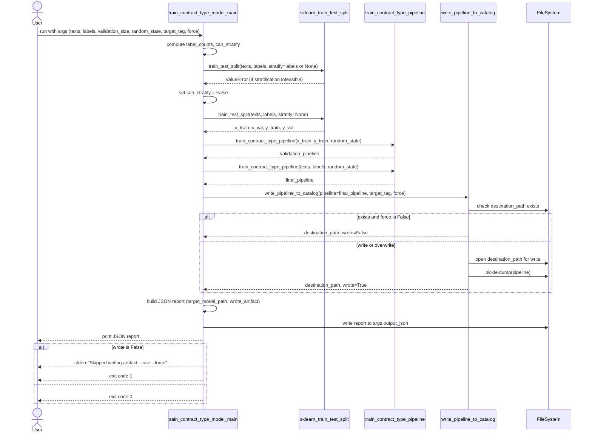
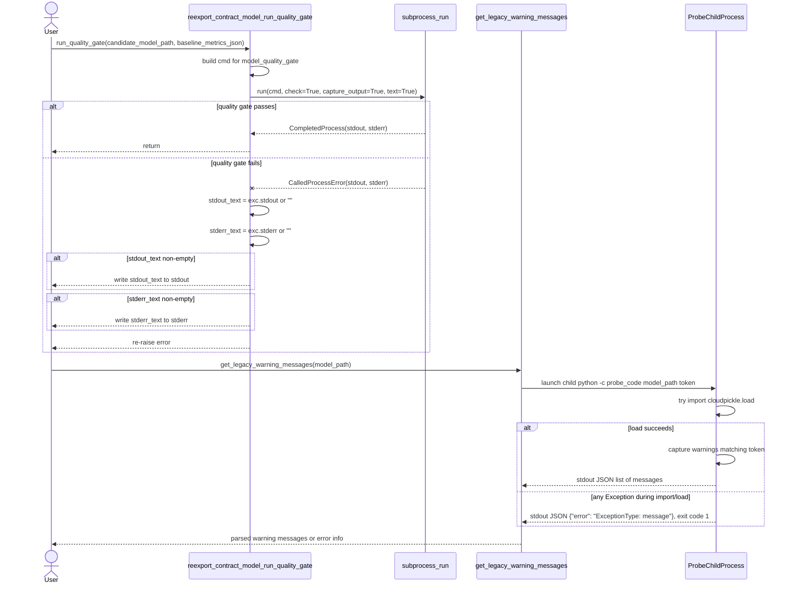
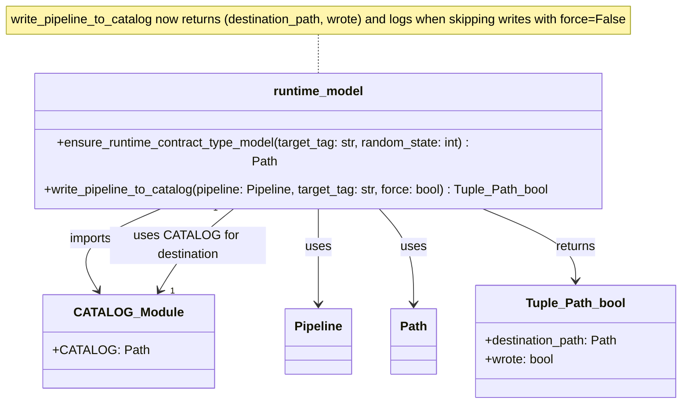
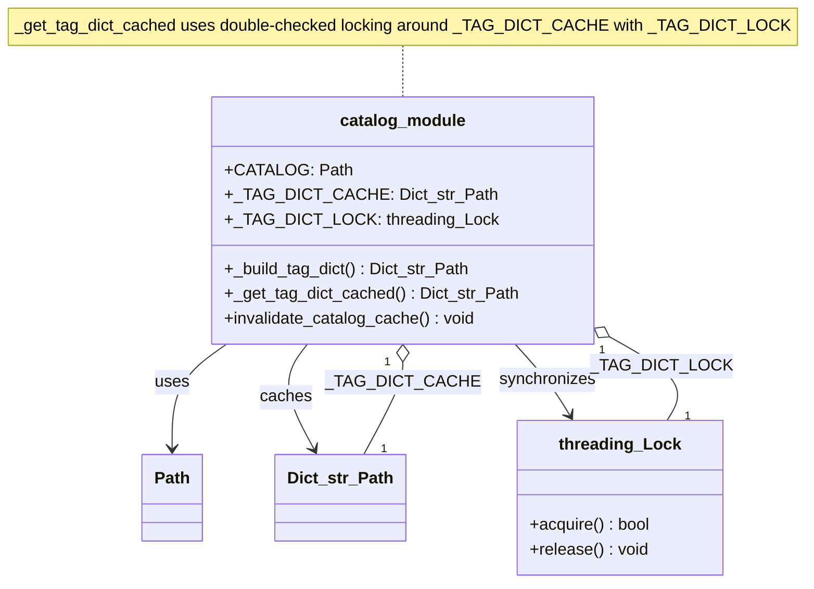

# PR Comments Export

> Exported from [https://github.com/arthrod/lexpredict-lexnlp/pull/11](https://github.com/arthrod/lexpredict-lexnlp/pull/11)  
> 28 of 28 comments selected  
> Generated by [Cicero](https://cicero.im) on 4/15/2026, 2:23:47 AM

---

### coderabbitai[bot] &mdash; 4/14/2026, 2:23:32 AM

**Actionable comments posted: 6**

<details>
<summary>🧹 Nitpick comments (6)</summary><blockquote>

<details>
<summary>scripts/tests/test_asset_drift_check.py (1)</summary><blockquote>

`97-119`: **These tests are tautological; prefer exercising `main()` for both exception types.**

Lines 97-119 currently validate local f-string construction, not runtime behavior in `asset_drift_check.main()`. Consider replacing them with parametrized integration-style checks (like the test above) so regressions in production formatting are caught.

<details>
<summary>🤖 Prompt for AI Agents</summary>

```
Verify each finding against the current code and only fix it if needed.

In `@scripts/tests/test_asset_drift_check.py` around lines 97 - 119, The two tests
(test_error_message_includes_class_name_directly and
test_error_message_format_for_value_error) are tautological because they only
build f-strings locally; replace them with parametrized tests that call
asset_drift_check.main() and assert the runtime failure message contains the
exception class name and message. Update each test to invoke
asset_drift_check.main() (or the public entrypoint that formats the error) while
using monkeypatch/patch to make the specific I/O call (the function that would
raise FileNotFoundError or ValueError in production) raise the desired
exception, then capture/log/output from main and assert it includes
"<ExceptionClassName>" and the exception text; keep the test names the same and
parametrize over (FileNotFoundError, "pipeline/x/0.1", "tag not found...") and
(ValueError, "pipeline/test/0.1", "bad data") to cover both cases.
```

</details>

</blockquote></details>
<details>
<summary>lexnlp/utils/tests/test_amount_delimiting.py (1)</summary><blockquote>

`98-113`: **Strengthen assertions to prove the targeted behavior, not just non-`None` output.**

These tests can pass even if the de_DE grouping-fix branch regresses. Please assert both delimiters (and use inputs that distinguish branch behavior) so the tests fail on the exact regression this PR targets.


<details>
<summary>Suggested assertion tightening</summary>

```diff
@@
     def test_wrong_grouping_triggers_de_de_fix(self):
@@
         with ctx_manager, locale_patch:
             result = infer_delimiters("10.800", "de_DE")
-        # After the fix the canonical grouping [3,3,0] is enforced.
+        # After the fix, de_DE canonical delimiters should be preserved.
         assert result is not None
+        assert result["decimal_delimiter"] == ","
         assert result["group_delimiter"] == "."
@@
     def test_non_de_locale_not_affected(self):
@@
         with ctx_manager, locale_patch:
             # "1,000.50" is en_US style.
             result = infer_delimiters("1,000.50", "en_US")
-        # The function should infer the two delimiters from the text, not the
-        # de_DE override path.
+        # Non-de locale should not use the de_DE override path.
         assert result is not None
+        assert result["decimal_delimiter"] == "."
+        assert result["group_delimiter"] == ","
```
</details>


Also applies to: 177-194

<details>
<summary>🤖 Prompt for AI Agents</summary>

```
Verify each finding against the current code and only fix it if needed.

In `@lexnlp/utils/tests/test_amount_delimiting.py` around lines 98 - 113, The test
test_wrong_grouping_triggers_de_de_fix is too weak: instead of only asserting
result is not None and group_delimiter, update the assertions to validate both
delimiters and the corrected grouping behavior from infer_delimiters;
specifically, after calling infer_delimiters("10.800", "de_DE") assert result is
not None, result["group_delimiter"] == "." and result["decimal_delimiter"] ==
"," (and if infer_delimiters returns grouping ensure it equals the canonical
[3,3,0]); apply the same stronger assertions pattern to the other test(s)
referenced (lines 177-194) and keep references to _mock_de_de_conventions and
infer_delimiters so the intent is clear.
```

</details>

</blockquote></details>
<details>
<summary>scripts/tests/test_bootstrap_assets.py (2)</summary><blockquote>

`173-182`: **Strengthen zip-slip test with an explicit “outside destination not written” assertion.**

After the `RuntimeError`, add an assertion that the escaped target path does not exist (e.g., `tmp_path / "escape.txt"`). This verifies containment, not just exception type.

<details>
<summary>🤖 Prompt for AI Agents</summary>

```
Verify each finding against the current code and only fix it if needed.

In `@scripts/tests/test_bootstrap_assets.py` around lines 173 - 182, In
test_path_traversal_raises_runtime_error, after the with
pytest.raises(RuntimeError, match="unsafe path") block that calls
bootstrap_assets.extract_zip(archive_path, dest, dry_run=False), add an explicit
assertion that the escaped file was not written (e.g., assert not (tmp_path /
"escape.txt").exists()) to ensure the zip-slip payload did not create files
outside the destination; keep the check immediately after the exception context
so the test verifies containment as well as the raised error.
```

</details>

---

`75-109`: **Make invalid-scheme tests explicitly prove no network call is attempted.**

These tests currently rely only on `ValueError`. Patching `bootstrap_assets.urlopen` and asserting it was not called would make the guard behavior explicit and less brittle.

<details>
<summary>🤖 Prompt for AI Agents</summary>

```
Verify each finding against the current code and only fix it if needed.

In `@scripts/tests/test_bootstrap_assets.py` around lines 75 - 109, Update the
invalid-scheme tests to explicitly assert no network call is attempted: in each
test that calls bootstrap_assets.download_file with an unsupported URL scheme
(tests named test_ftp_scheme_raises_value_error,
test_file_scheme_raises_value_error,
test_scheme_error_message_contains_scheme_and_url) patch/mock
bootstrap_assets.urlopen before calling download_file and assert urlopen was not
invoked (in addition to asserting ValueError). This ensures the guard in
bootstrap_assets.download_file is tested by verifying bootstrap_assets.urlopen
is never called for unsupported schemes.
```

</details>

</blockquote></details>
<details>
<summary>lexnlp/ml/catalog/tests/test_catalog_path.py (1)</summary><blockquote>

`117-117`: **Tighten the build-count assertion to avoid false positives.**

Line 117 uses `<= 1`, which still passes if `_build_tag_dict` is never called. For this test’s intent, `== 1` is the stronger check.

<details>
<summary>Suggested assertion update</summary>

```diff
-    assert len(build_count) <= 1
+    assert len(build_count) == 1
```
</details>

<details>
<summary>🤖 Prompt for AI Agents</summary>

```
Verify each finding against the current code and only fix it if needed.

In `@lexnlp/ml/catalog/tests/test_catalog_path.py` at line 117, The test currently
asserts `len(build_count) <= 1`, which can pass if `_build_tag_dict` is never
invoked; change the assertion to `assert len(build_count) == 1` to ensure
`_build_tag_dict` was called exactly once. Locate the `build_count` variable
used in the test (and the mock/wrapper around `_build_tag_dict`) and replace the
`<= 1` assertion with `== 1`, keeping the rest of the setup/mocking for
`_build_tag_dict` intact.
```

</details>

</blockquote></details>
<details>
<summary>scripts/tests/test_train_contract_type_model.py (1)</summary><blockquote>

`31-41`: **Unused helper function.**

`_make_argv` is defined but never called in the current tests. Consider removing it or using it to reduce code duplication in the test methods.

<details>
<summary>🤖 Prompt for AI Agents</summary>

```
Verify each finding against the current code and only fix it if needed.

In `@scripts/tests/test_train_contract_type_model.py` around lines 31 - 41, The
helper function _make_argv is unused; either remove it or update the test cases
to use it to eliminate duplication: locate the _make_argv definition and either
delete it, or modify the test functions that currently build argv arrays inline
(e.g., test functions that prepare "--target-tag" and "--output-json") to call
_make_argv(tmp_path, force=..., extra=[...]) and use its returned list for
subprocess/CLI invocation; ensure any test that needs the output_json Path uses
the same tmp_path passed into _make_argv so behavior remains identical.
```

</details>

</blockquote></details>

</blockquote></details>

<details>
<summary>🤖 Prompt for all review comments with AI agents</summary>

```
Verify each finding against the current code and only fix it if needed.

Inline comments:
In `@lexnlp/ml/catalog/tests/test_catalog_path.py`:
- Line 87: The test assigns to catalog._build_tag_dict with an unannotated "#
type: ignore[assignment]" suppression; remove that suppression and replace the
direct assignment with a proper monkeypatch: use the pytest fixture
monkeypatch.setattr to patch catalog._build_tag_dict to counting_build in the
test (and similarly for the other occurrence), which avoids the type ignore and
satisfies the lint rule; update references in the test to use
monkeypatch.setattr(catalog, "_build_tag_dict", counting_build) and delete the
"# type: ignore[assignment]" comment (or, if you must keep a suppression, add an
inline justification comment).

In `@scripts/tests/test_asset_drift_check.py`:
- Line 25: The import line "import asset_drift_check  # noqa: E402" needs an
inline justification explaining why E402 (module level import not at top of
file) is being suppressed; update that same line to include a short reason
(e.g., "# noqa: E402 - import required after test fixture setup/import
side-effects") so the suppression-audit requirement is satisfied while keeping
the noqa token and the import of asset_drift_check.
- Line 247: The comment line containing the ambiguous EN DASH ("# load_manifest
– basic validation") should be changed to use the ASCII hyphen, i.e. "#
load_manifest - basic validation", to satisfy Ruff RUF003; update that comment
in test_asset_drift_check.py (search for the exact string "load_manifest – basic
validation") and re-run ruff to confirm the lint error is resolved.
- Line 95: The current assertion uses a too-broad alternative ("Error") which
can mask regressions; tighten the check on stderr_out to specifically look for
the FileNotFoundError class name (for example assert that "FileNotFoundError" or
"FileNotFoundError:" appears in stderr_out or use a word-boundary regex like
r"\bFileNotFoundError\b") instead of falling back to the generic "Error" token
so the test fails if the class-name formatting regresses; update the assertion
that currently references stderr_out accordingly.

In `@scripts/tests/test_bootstrap_assets.py`:
- Around line 44-45: Remove the unnecessary "type: ignore[attr-defined]"
suppressions on mock_response.__enter__ and mock_response.__exit__ in the test
(or add an inline justification comment if you intentionally need them); since
urlopen is forced to raise before the response is used, simply delete the two
assignments or replace each "  # type: ignore[attr-defined]" with a short
justification like "  # type: ignore[attr-defined] — mocked context-manager
methods required for tests" attached to the exact lines referencing
mock_response.__enter__ and mock_response.__exit__ so the suppression policy is
satisfied.

In `@scripts/tests/test_reexport_bundled_sklearn_models.py`:
- Line 27: The import line that uses a noqa suppression (import
reexport_bundled_sklearn_models as script_mod  # noqa: E402) lacks an inline
justification; update that import to keep the # noqa: E402 but append a short
justification comment explaining why the import must be at this location (for
example: "# noqa: E402 - intentional top-level import after path manipulation
for test setup"), referencing the import statement (script_mod) so auditors
understand the reason.

---

Nitpick comments:
In `@lexnlp/ml/catalog/tests/test_catalog_path.py`:
- Line 117: The test currently asserts `len(build_count) <= 1`, which can pass
if `_build_tag_dict` is never invoked; change the assertion to `assert
len(build_count) == 1` to ensure `_build_tag_dict` was called exactly once.
Locate the `build_count` variable used in the test (and the mock/wrapper around
`_build_tag_dict`) and replace the `<= 1` assertion with `== 1`, keeping the
rest of the setup/mocking for `_build_tag_dict` intact.

In `@lexnlp/utils/tests/test_amount_delimiting.py`:
- Around line 98-113: The test test_wrong_grouping_triggers_de_de_fix is too
weak: instead of only asserting result is not None and group_delimiter, update
the assertions to validate both delimiters and the corrected grouping behavior
from infer_delimiters; specifically, after calling infer_delimiters("10.800",
"de_DE") assert result is not None, result["group_delimiter"] == "." and
result["decimal_delimiter"] == "," (and if infer_delimiters returns grouping
ensure it equals the canonical [3,3,0]); apply the same stronger assertions
pattern to the other test(s) referenced (lines 177-194) and keep references to
_mock_de_de_conventions and infer_delimiters so the intent is clear.

In `@scripts/tests/test_asset_drift_check.py`:
- Around line 97-119: The two tests
(test_error_message_includes_class_name_directly and
test_error_message_format_for_value_error) are tautological because they only
build f-strings locally; replace them with parametrized tests that call
asset_drift_check.main() and assert the runtime failure message contains the
exception class name and message. Update each test to invoke
asset_drift_check.main() (or the public entrypoint that formats the error) while
using monkeypatch/patch to make the specific I/O call (the function that would
raise FileNotFoundError or ValueError in production) raise the desired
exception, then capture/log/output from main and assert it includes
"<ExceptionClassName>" and the exception text; keep the test names the same and
parametrize over (FileNotFoundError, "pipeline/x/0.1", "tag not found...") and
(ValueError, "pipeline/test/0.1", "bad data") to cover both cases.

In `@scripts/tests/test_bootstrap_assets.py`:
- Around line 173-182: In test_path_traversal_raises_runtime_error, after the
with pytest.raises(RuntimeError, match="unsafe path") block that calls
bootstrap_assets.extract_zip(archive_path, dest, dry_run=False), add an explicit
assertion that the escaped file was not written (e.g., assert not (tmp_path /
"escape.txt").exists()) to ensure the zip-slip payload did not create files
outside the destination; keep the check immediately after the exception context
so the test verifies containment as well as the raised error.
- Around line 75-109: Update the invalid-scheme tests to explicitly assert no
network call is attempted: in each test that calls
bootstrap_assets.download_file with an unsupported URL scheme (tests named
test_ftp_scheme_raises_value_error, test_file_scheme_raises_value_error,
test_scheme_error_message_contains_scheme_and_url) patch/mock
bootstrap_assets.urlopen before calling download_file and assert urlopen was not
invoked (in addition to asserting ValueError). This ensures the guard in
bootstrap_assets.download_file is tested by verifying bootstrap_assets.urlopen
is never called for unsupported schemes.

In `@scripts/tests/test_train_contract_type_model.py`:
- Around line 31-41: The helper function _make_argv is unused; either remove it
or update the test cases to use it to eliminate duplication: locate the
_make_argv definition and either delete it, or modify the test functions that
currently build argv arrays inline (e.g., test functions that prepare
"--target-tag" and "--output-json") to call _make_argv(tmp_path, force=...,
extra=[...]) and use its returned list for subprocess/CLI invocation; ensure any
test that needs the output_json Path uses the same tmp_path passed into
_make_argv so behavior remains identical.
```

</details>

<details>
<summary>🪄 Autofix (Beta)</summary>

Fix all unresolved CodeRabbit comments on this PR:

- [ ] <!-- {"checkboxId": "4b0d0e0a-96d7-4f10-b296-3a18ea78f0b9"} --> Push a commit to this branch (recommended)
- [ ] <!-- {"checkboxId": "ff5b1114-7d8c-49e6-8ac1-43f82af23a33"} --> Create a new PR with the fixes

</details>

---

<details>
<summary>ℹ️ Review info</summary>

<details>
<summary>⚙️ Run configuration</summary>

**Configuration used**: Organization UI

**Review profile**: CHILL

**Plan**: Pro

**Run ID**: `c42d92eb-8ab1-4fa6-8070-c01cc44a5e41`

</details>

<details>
<summary>📥 Commits</summary>

Reviewing files that changed from the base of the PR and between 954d9f4b1013484a211f998b772a1dd4f1454b95 and a807a5c70c865e8f9f5e2b16fed55ee20f94d473.

</details>

<details>
<summary>📒 Files selected for processing (9)</summary>

* `lexnlp/extract/en/contracts/tests/test_runtime_model.py`
* `lexnlp/ml/catalog/tests/test_catalog_path.py`
* `lexnlp/utils/tests/test_amount_delimiting.py`
* `scripts/tests/__init__.py`
* `scripts/tests/test_asset_drift_check.py`
* `scripts/tests/test_bootstrap_assets.py`
* `scripts/tests/test_contract_type_quality_gate.py`
* `scripts/tests/test_reexport_bundled_sklearn_models.py`
* `scripts/tests/test_train_contract_type_model.py`

</details>

<details>
<summary>✅ Files skipped from review due to trivial changes (1)</summary>

* scripts/tests/__init__.py

</details>

</details>

<details>
<summary>📜 Review details</summary>

<details>
<summary>⏰ Context from checks skipped due to timeout of 90000ms. You can increase the timeout in your CodeRabbit configuration to a maximum of 15 minutes (900000ms). (2)</summary>

* GitHub Check: Contract Type Smoke
* GitHub Check: Contract Type Smoke

</details>

<details>
<summary>🧰 Additional context used</summary>

<details>
<summary>📓 Path-based instructions (4)</summary>

<details>
<summary>**/*.{py,ts,tsx}</summary>


**📄 CodeRabbit inference engine (Custom checks)**

> `**/*.{py,ts,tsx}`: Identify changed production files and verify corresponding test changes. FAIL if a changed production file has zero associated test file AND introduces new exported functions, classes, or public methods. Exceptions: config files, .d.ts files, migrations, generated code.
> No lint suppression creep: Scan diff for newly added suppression comments. Python: # noqa, # type: ignore. TypeScript: // biome-ignore, // eslint-disable, `@ts-ignore`, `@ts-expect-error`, // oxlint-ignore. Each suppression MUST have inline justification comment. FAIL if any suppression lacks justification. WARN if total new suppressions > 3 in PR.
> Import ordering and dead imports check: Python - run `uv run ruff check --select I,F401 .`. TypeScript - run `bun run biome check --formatter-enabled=false --linter-enabled=false --organize-imports-enabled=true .`. FAIL if violations found.

Files:
- `scripts/tests/test_asset_drift_check.py`
- `scripts/tests/test_train_contract_type_model.py`
- `scripts/tests/test_bootstrap_assets.py`
- `lexnlp/ml/catalog/tests/test_catalog_path.py`
- `lexnlp/utils/tests/test_amount_delimiting.py`
- `scripts/tests/test_reexport_bundled_sklearn_models.py`
- `scripts/tests/test_contract_type_quality_gate.py`
- `lexnlp/extract/en/contracts/tests/test_runtime_model.py`

</details>
<details>
<summary>**/*{test,spec,__mocks__}*.{py,ts,tsx}</summary>


**📄 CodeRabbit inference engine (Custom checks)**

> New test quality spot-check: Verify each new test file contains at least one assertion (assert, expect, assertEqual, toBe, toEqual, toThrow, rejects, etc.). FAIL if any new test file has zero assertions.

Files:
- `scripts/tests/test_asset_drift_check.py`
- `scripts/tests/test_train_contract_type_model.py`
- `scripts/tests/test_bootstrap_assets.py`
- `lexnlp/ml/catalog/tests/test_catalog_path.py`
- `lexnlp/utils/tests/test_amount_delimiting.py`
- `scripts/tests/test_reexport_bundled_sklearn_models.py`
- `scripts/tests/test_contract_type_quality_gate.py`
- `lexnlp/extract/en/contracts/tests/test_runtime_model.py`

</details>
<details>
<summary>**/*.py</summary>


**📄 CodeRabbit inference engine (Custom checks)**

> `**/*.py`: Python lint with ruff: Run `uv run ruff check . --diff` and `uv run ruff format --check --diff .`. FAIL if exit code != 0 for either.
> Python type checking: Run `uv run ty check` (or fallback to mypy/pyright if configured). FAIL if exit code != 0. If no type checker configured, FAIL with 'No Python type checker configured. Add ty to dev dependencies.'
> Strict null/undefined audit for Python: Scan diff for new bare `type: ignore` without error code and `cast()` calls without explanation comment. WARN for each. FAIL if bare `type: ignore` count > 3.

Files:
- `scripts/tests/test_asset_drift_check.py`
- `scripts/tests/test_train_contract_type_model.py`
- `scripts/tests/test_bootstrap_assets.py`
- `lexnlp/ml/catalog/tests/test_catalog_path.py`
- `lexnlp/utils/tests/test_amount_delimiting.py`
- `scripts/tests/test_reexport_bundled_sklearn_models.py`
- `scripts/tests/test_contract_type_quality_gate.py`
- `lexnlp/extract/en/contracts/tests/test_runtime_model.py`

</details>
<details>
<summary>**/*test*.py</summary>


**📄 CodeRabbit inference engine (AGENTS.md)**

> Do not add, remove, or modify skip, skipif, or xfail markers to bypass failures; fix failing behavior or document a real external blocker
> 
> Any skip/skipif/xfail marker that is genuinely required must include an inline annotation: skip-audit: issue=<link-or-id> expires=YYYY-MM-DD

Files:
- `scripts/tests/test_asset_drift_check.py`
- `scripts/tests/test_train_contract_type_model.py`
- `scripts/tests/test_bootstrap_assets.py`
- `lexnlp/ml/catalog/tests/test_catalog_path.py`
- `lexnlp/utils/tests/test_amount_delimiting.py`
- `scripts/tests/test_reexport_bundled_sklearn_models.py`
- `scripts/tests/test_contract_type_quality_gate.py`
- `lexnlp/extract/en/contracts/tests/test_runtime_model.py`

</details>

</details><details>
<summary>🧠 Learnings (8)</summary>

<details>
<summary>📓 Common learnings</summary>

```
Learnt from: CR
URL: 
File: AGENTS.md:undefined-undefined
Timestamp: 2026-04-14T06:13:42.939Z
Learning: Keep changes scoped to the relevant locale/module (extract/en, extract/de, etc.)
```

```
Learnt from: CR
URL: 
File: AGENTS.md:undefined-undefined
Timestamp: 2026-04-14T06:13:42.939Z
Learning: Add or update tests alongside behavior changes
```

```
Learnt from: CR
URL: 
File: AGENTS.md:undefined-undefined
Timestamp: 2026-04-14T06:13:42.939Z
Learning: Prefer existing utilities under lexnlp/utils/ over introducing duplicates
```

```
Learnt from: CR
URL: 
File: AGENTS.md:undefined-undefined
Timestamp: 2026-04-14T06:13:42.939Z
Learning: When adding extraction patterns/models, include representative fixtures in test_data/
```

```
Learnt from: CR
URL: 
File: AGENTS.md:undefined-undefined
Timestamp: 2026-04-14T06:13:42.939Z
Learning: Avoid committing downloaded/generated third-party assets unless explicitly required
```

```
Learnt from: CR
URL: 
File: AGENTS.md:undefined-undefined
Timestamp: 2026-04-14T06:13:42.939Z
Learning: Use bootstrap script for deterministic setup of required runtime/test assets via scripts/bootstrap_assets.py with flags like --nltk, --contract-model, --contract-type-model, --stanford, or --tika
```

```
Learnt from: CR
URL: 
File: AGENTS.md:undefined-undefined
Timestamp: 2026-04-14T06:13:42.939Z
Learning: Validation target is 100% pass for required test suites; run base suite with pytest lexnlp and Stanford-only suite with LEXNLP_USE_STANFORD=true for Stanford-enabled environments
```

```
Learnt from: CR
URL: 
File: AGENTS.md:undefined-undefined
Timestamp: 2026-04-14T06:13:42.939Z
Learning: Use the bootstrap script to download Stanford assets to libs/stanford_nlp with specific expected file structures and versions (stanford-postagger-full-2017-06-09 and stanford-ner-2017-06-09)
```

</details>
<details>
<summary>📚 Learning: 2026-04-13T23:15:27.671Z</summary>

```
Learnt from: CR
Repo: arthrod/lexpredict-lexnlp PR: 0
File: coderabbit-custom-pre-merge-checks-unique-id-file-non-traceable-F7F2B60C-1728-4C9A-8889-4F2235E186CA.txt:0-0
Timestamp: 2026-04-13T23:15:27.671Z
Learning: Applies to **/*.{py,ts,tsx} : Identify changed production files and verify corresponding test changes. FAIL if a changed production file has zero associated test file AND introduces new exported functions, classes, or public methods. Exceptions: config files, .d.ts files, migrations, generated code.
```

**Applied to files:**
- `scripts/tests/test_asset_drift_check.py`
- `scripts/tests/test_train_contract_type_model.py`
- `scripts/tests/test_contract_type_quality_gate.py`

</details>
<details>
<summary>📚 Learning: 2026-04-13T23:15:27.671Z</summary>

```
Learnt from: CR
Repo: arthrod/lexpredict-lexnlp PR: 0
File: coderabbit-custom-pre-merge-checks-unique-id-file-non-traceable-F7F2B60C-1728-4C9A-8889-4F2235E186CA.txt:0-0
Timestamp: 2026-04-13T23:15:27.671Z
Learning: Applies to **/*{test,spec,__mocks__}*.{py,ts,tsx} : New test quality spot-check: Verify each new test file contains at least one assertion (assert, expect, assertEqual, toBe, toEqual, toThrow, rejects, etc.). FAIL if any new test file has zero assertions.
```

**Applied to files:**
- `scripts/tests/test_asset_drift_check.py`
- `scripts/tests/test_contract_type_quality_gate.py`

</details>
<details>
<summary>📚 Learning: 2026-04-13T23:14:58.878Z</summary>

```
Learnt from: CR
Repo: arthrod/lexpredict-lexnlp PR: 0
File: AGENTS.md:0-0
Timestamp: 2026-04-13T23:14:58.878Z
Learning: Add or update tests alongside behavior changes in extraction modules
```

**Applied to files:**
- `scripts/tests/test_asset_drift_check.py`
- `scripts/tests/test_train_contract_type_model.py`
- `lexnlp/utils/tests/test_amount_delimiting.py`
- `scripts/tests/test_reexport_bundled_sklearn_models.py`
- `scripts/tests/test_contract_type_quality_gate.py`

</details>
<details>
<summary>📚 Learning: 2026-04-13T23:15:27.671Z</summary>

```
Learnt from: CR
Repo: arthrod/lexpredict-lexnlp PR: 0
File: coderabbit-custom-pre-merge-checks-unique-id-file-non-traceable-F7F2B60C-1728-4C9A-8889-4F2235E186CA.txt:0-0
Timestamp: 2026-04-13T23:15:27.671Z
Learning: Applies to **/pyproject.toml : Run full Python test suite: `uv run pytest --tb=line -q` for baseline and `uv run pytest --tb=short -q` for PR branch. FAIL immediately if exit code != 0.
```

**Applied to files:**
- `scripts/tests/test_asset_drift_check.py`
- `scripts/tests/test_bootstrap_assets.py`
- `scripts/tests/test_contract_type_quality_gate.py`

</details>
<details>
<summary>📚 Learning: 2026-04-13T23:15:27.671Z</summary>

```
Learnt from: CR
Repo: arthrod/lexpredict-lexnlp PR: 0
File: coderabbit-custom-pre-merge-checks-unique-id-file-non-traceable-F7F2B60C-1728-4C9A-8889-4F2235E186CA.txt:0-0
Timestamp: 2026-04-13T23:15:27.671Z
Learning: Applies to **/pyproject.toml : Smoke test for Python library: Run `python -c "import <package>"`, assert exit code 0. FAIL if test fails.
```

**Applied to files:**
- `scripts/tests/test_asset_drift_check.py`

</details>
<details>
<summary>📚 Learning: 2026-04-13T23:15:27.671Z</summary>

```
Learnt from: CR
Repo: arthrod/lexpredict-lexnlp PR: 0
File: coderabbit-custom-pre-merge-checks-unique-id-file-non-traceable-F7F2B60C-1728-4C9A-8889-4F2235E186CA.txt:0-0
Timestamp: 2026-04-13T23:15:27.671Z
Learning: Applies to **/{index,__init__}.{ts,tsx,py} : Exported API surface check: For changed public module entry points (index.ts, __init__.py, or files listed in package.json exports / pyproject.toml [tool.setuptools.packages]), verify all exported symbols have explicit type annotations. Python: functions must have return type and parameter annotations. TypeScript: functions must have explicit return type. FAIL if new public export lacks explicit types.
```

**Applied to files:**
- `scripts/tests/test_train_contract_type_model.py`
- `scripts/tests/test_contract_type_quality_gate.py`

</details>
<details>
<summary>📚 Learning: 2026-04-13T23:14:58.878Z</summary>

```
Learnt from: CR
Repo: arthrod/lexpredict-lexnlp PR: 0
File: AGENTS.md:0-0
Timestamp: 2026-04-13T23:14:58.878Z
Learning: Use bootstrap script (scripts/bootstrap_assets.py) for deterministic setup of required runtime/test assets including NLTK, contract model, and contract-type model
```

**Applied to files:**
- `scripts/tests/test_bootstrap_assets.py`

</details>

</details><details>
<summary>🪛 Ruff (0.15.9)</summary>

<details>
<summary>scripts/tests/test_asset_drift_check.py</summary>

[warning] 247-247: Comment contains ambiguous `–` (EN DASH). Did you mean `-` (HYPHEN-MINUS)?

(RUF003)

</details>
<details>
<summary>scripts/tests/test_bootstrap_assets.py</summary>

[warning] 32-32: Comment contains ambiguous `–` (EN DASH). Did you mean `-` (HYPHEN-MINUS)?

(RUF003)

---

[warning] 114-114: Comment contains ambiguous `–` (EN DASH). Did you mean `-` (HYPHEN-MINUS)?

(RUF003)

---

[warning] 140-140: Comment contains ambiguous `–` (EN DASH). Did you mean `-` (HYPHEN-MINUS)?

(RUF003)

---

[error] 188-188: Probable insecure usage of temporary file or directory: "/tmp/absolute.txt"

(S108)

</details>
<details>
<summary>lexnlp/ml/catalog/tests/test_catalog_path.py</summary>

[warning] 66-66: Comment contains ambiguous `–` (EN DASH). Did you mean `-` (HYPHEN-MINUS)?

(RUF003)

---

[warning] 98-98: Do not catch blind exception: `Exception`

(BLE001)

</details>
<details>
<summary>scripts/tests/test_reexport_bundled_sklearn_models.py</summary>

[error] 260-260: `pickle` and modules that wrap it can be unsafe when used to deserialize untrusted data, possible security issue

(S301)

---

[error] 261-261: `pickle` and modules that wrap it can be unsafe when used to deserialize untrusted data, possible security issue

(S301)

</details>
<details>
<summary>scripts/tests/test_contract_type_quality_gate.py</summary>

[warning] 31-31: Comment contains ambiguous `–` (EN DASH). Did you mean `-` (HYPHEN-MINUS)?

(RUF003)

---

[warning] 83-83: Comment contains ambiguous `–` (EN DASH). Did you mean `-` (HYPHEN-MINUS)?

(RUF003)

---

[warning] 178-178: Mutable default value for class attribute

(RUF012)

---

[warning] 201-201: Comment contains ambiguous `–` (EN DASH). Did you mean `-` (HYPHEN-MINUS)?

(RUF003)

</details>
<details>
<summary>lexnlp/extract/en/contracts/tests/test_runtime_model.py</summary>

[warning] 60-60: Comment contains ambiguous `–` (EN DASH). Did you mean `-` (HYPHEN-MINUS)?

(RUF003)

---

[error] 92-92: `pickle` and modules that wrap it can be unsafe when used to deserialize untrusted data, possible security issue

(S301)

---

[error] 153-153: `pickle` and modules that wrap it can be unsafe when used to deserialize untrusted data, possible security issue

(S301)

</details>

</details>

</details>

<details>
<summary>🔇 Additional comments (22)</summary><blockquote>

<details>
<summary>scripts/tests/test_reexport_bundled_sklearn_models.py (2)</summary><blockquote>

`51-142`: **Good branch coverage for narrowed exception handling in `load_model`.**

These tests cover fallback and propagation paths clearly, including the non-`addresses_clf.pickle` path.


Based on learnings, this update adds tests alongside behavior changes.

---

`155-291`: **Strong atomic-write safety coverage for layered model re-export.**

The suite validates exception cleanup, stale `.part` handling, and successful replacement behavior without corrupting the original artifact.


Based on learnings, this update adds tests alongside behavior changes.

</blockquote></details>
<details>
<summary>lexnlp/utils/tests/test_amount_delimiting.py (1)</summary><blockquote>

`31-31`: No action required. The test file correctly uses PEP 604 union syntax (`list | None`) which is valid for the repository's minimum Python version of 3.10 (as specified in `pyproject.toml` with `requires-python = ">=3.10,<3.13"`). There is no compatibility risk.


				> Likely an incorrect or invalid review comment.

</blockquote></details>
<details>
<summary>scripts/tests/test_bootstrap_assets.py (1)</summary><blockquote>

`258-339`: **Nice regression coverage for lambda capture semantics.**

These tests clearly validate independent tag binding for both task callbacks and cover the prior late-binding failure mode well.

</blockquote></details>
<details>
<summary>lexnlp/ml/catalog/tests/test_catalog_path.py (1)</summary><blockquote>

`46-70`: **Good coverage for cache lifecycle and invalidation behavior.**

These tests clearly validate sequential caching semantics and post-invalidation rebuild behavior, and they reset global catalog state after execution.


Also applies to: 120-142

</blockquote></details>
<details>
<summary>scripts/tests/test_train_contract_type_model.py (5)</summary><blockquote>

`21-23`: **Sys.path manipulation for script imports is acceptable here.**

This pattern is common for test files that need to import standalone scripts. The guard `if str(_SCRIPTS_DIR) not in sys.path` prevents duplicate entries.

---

`44-72`: **Well-structured test helper.**

The `_patch_runtime_model` helper correctly patches all collaborators and returns the expected tuple signature `(destination, wrote)` matching the production `write_pipeline_to_catalog` return type.

---

`80-159`: **LGTM!**

Both test methods correctly verify the `wrote_artifact` field in the JSON report and the corresponding return codes. The assertions align with the production behavior in `main()`.

---

`167-228`: **LGTM!**

The exit code tests correctly verify the behavior: `rc=1` when `wrote=False` (artifact already exists) and `rc=0` when `wrote=True`.

---

`236-346`: **LGTM!**

The stratification fallback tests correctly verify:
1. When `train_test_split` raises `ValueError` on stratified attempt, the script retries with `stratify=None`
2. When stratification is possible (min samples per label >= 2), it's attempted first

The mock implementation accurately simulates the production retry logic.

</blockquote></details>
<details>
<summary>lexnlp/extract/en/contracts/tests/test_runtime_model.py (6)</summary><blockquote>

`32-36`: **LGTM!**

The mock correctly returns `(destination, True)` matching the updated `write_pipeline_to_catalog` return signature `Tuple[Path, bool]`.

---

`64-93`: **LGTM!**

The test correctly verifies that when no artifact exists, `write_pipeline_to_catalog` serializes the pipeline and returns `(path, True)`. The `pickle.load` on line 92 operates on test-controlled data, so the S301 warning is a false positive in this context.

---

`96-123`: **LGTM!**

The test correctly verifies the skip-when-exists behavior: when `force=False` and the artifact exists, the function returns `(path, False)` without overwriting.

---

`126-154`: **LGTM!**

The test correctly verifies that `force=True` overwrites existing artifacts and returns `(path, True)`.

---

`157-175`: **LGTM!**

Good coverage for the `mkdir(parents=True, exist_ok=True)` behavior ensuring nested tag paths are created.

---

`178-202`: **LGTM!**

The test correctly verifies that when `force=False` and the catalog already has the target tag, the existing path is returned immediately without retraining.

</blockquote></details>
<details>
<summary>scripts/tests/test_contract_type_quality_gate.py (6)</summary><blockquote>

`20-28`: **Sys.path manipulation with noqa comment.**

The `# noqa: E402` on line 27 for the import after sys.path manipulation is appropriate and has implicit justification (the import must come after path setup).

---

`35-79`: **LGTM!**

The `TestParseArgs` class comprehensively tests CLI argument parsing including the deprecated alias mapping, "last wins" behavior, defaults, and required arguments. All assertions align with the production `parse_args` implementation.

---

`87-100`: **LGTM!**

The `_DummyPipeline` stub correctly implements the sklearn-like interface needed for testing `score_pipeline`.

---

`103-197`: **LGTM!**

The `TestScorePipeline` class provides excellent coverage:
- Required output keys verification
- Perfect predictions edge case
- `top_n` exceeding class count
- `strict=True` zip behavior raising on length mismatch
- Error handling for missing `predict_proba` and `classes_`

The `RUF012` warning on line 178 (`classes_ = ["A", "B"]` as mutable class attribute) is acceptable for test stub classes.

---

`205-225`: **LGTM!**

The `TestParseMetrics` class correctly verifies backward compatibility (mapping `accuracy_top3` to `accuracy_topn`) and error handling for missing required keys.

---

`233-270`: **LGTM!**

The `TestLoadFixture` class provides good coverage for the happy path and all error cases (missing file, empty text, empty label).

</blockquote></details>

</blockquote></details>

</details>

<!-- This is an auto-generated comment by CodeRabbit for review status -->

---

### coderabbitai[bot] &mdash; 4/14/2026, 2:23:31 AM

> File: `scripts/tests/test_bootstrap_assets.py`

<details><summary>Code context</summary>

```diff
@@ -0,0 +1,339 @@
+"""Tests for scripts/bootstrap_assets.py.
+
+Covers changes introduced in the PR:
+  - download_file: URL scheme validation (only http/https allowed)
+  - extract_zip: zip-slip protection
+  - run_selected_tasks: lambda closure fix for contract_model_tag /
+    contract_type_model_tag
+"""
+
+from __future__ import annotations
+
+import io
+import sys
+import zipfile
+from pathlib import Path
+from typing import Sequence
+from unittest.mock import patch
+
+import pytest
+
+# ---------------------------------------------------------------------------
+# Make the scripts package importable from within the test suite.
+# ---------------------------------------------------------------------------
+_SCRIPTS_DIR = Path(__file__).resolve().parents[1]
+if str(_SCRIPTS_DIR) not in sys.path:
+    sys.path.insert(0, str(_SCRIPTS_DIR))
+
+import bootstrap_assets  # noqa: E402  (module-level import after sys.path tweak)
+
+
+# ---------------------------------------------------------------------------
+# download_file – URL scheme validation
+# ---------------------------------------------------------------------------
+
+
+class TestDownloadFileSchemeValidation:
+    """URL scheme guard introduced in this PR."""
+
+    def test_http_scheme_proceeds_to_download(self, tmp_path: Path) -> None:
+        """http:// URLs must pass the scheme check and attempt an actual download."""
+        destination = tmp_path / "out.zip"
+        with patch("bootstrap_assets.urlopen") as mock_urlopen:
+            mock_response = io.BytesIO(b"data")
+            mock_response.__enter__ = lambda s: s  # type: ignore[attr-defined]
+            mock_response.__exit__ = lambda *a: None  # type: ignore[attr-defined]
```
</details>

_⚠️ Potential issue_ | _🟠 Major_

**Remove or justify `type: ignore` suppressions on mocked context-manager attrs.**

These two suppressions do not include inline justification, and they’re unnecessary in this test because `urlopen` is already forced to raise before response object usage.

<details>
<summary>Suggested cleanup</summary>

```diff
         with patch("bootstrap_assets.urlopen") as mock_urlopen:
-            mock_response = io.BytesIO(b"data")
-            mock_response.__enter__ = lambda s: s  # type: ignore[attr-defined]
-            mock_response.__exit__ = lambda *a: None  # type: ignore[attr-defined]
-            mock_urlopen.return_value = mock_response
             # Should not raise; urlopen is expected to be called.
             # We can't easily let the full flow complete without network, so
             # we patch urlopen to raise a controlled error after the check.
             mock_urlopen.side_effect = OSError("no network")
```
</details>

  
As per coding guidelines, “Each suppression MUST have inline justification comment. FAIL if any suppression lacks justification.”

<details>
<summary>🤖 Prompt for AI Agents</summary>

```
Verify each finding against the current code and only fix it if needed.

In `@scripts/tests/test_bootstrap_assets.py` around lines 44 - 45, Remove the
unnecessary "type: ignore[attr-defined]" suppressions on mock_response.__enter__
and mock_response.__exit__ in the test (or add an inline justification comment
if you intentionally need them); since urlopen is forced to raise before the
response is used, simply delete the two assignments or replace each "  # type:
ignore[attr-defined]" with a short justification like "  # type:
ignore[attr-defined] — mocked context-manager methods required for tests"
attached to the exact lines referencing mock_response.__enter__ and
mock_response.__exit__ so the suppression policy is satisfied.
```

</details>

<!-- fingerprinting:phantom:poseidon:hawk:f7fcd268-94f4-4829-83c8-c8f3ebe59181 -->

<!-- This is an auto-generated comment by CodeRabbit -->

---

### coderabbitai[bot] &mdash; 4/14/2026, 2:23:31 AM

> File: `scripts/tests/test_reexport_bundled_sklearn_models.py`

<details><summary>Code context</summary>

```diff
@@ -0,0 +1,291 @@
+"""Tests for scripts/reexport_bundled_sklearn_models.py.
+
+Covers changes introduced in the PR:
+  - load_model: catches (pickle.UnpicklingError, ValueError, KeyError) instead
+    of bare Exception for the addresses_clf.pickle fallback.
+  - reexport_layered_definition_models: try/finally ensures tmp_path is cleaned
+    up on exception.
+"""
+
+from __future__ import annotations
+
+import io
+import pickle
+import sys
+from pathlib import Path
+from zipfile import ZipFile, ZIP_STORED
+
+import pytest
+
+# ---------------------------------------------------------------------------
+# Make the scripts package importable.
+# ---------------------------------------------------------------------------
+_SCRIPTS_DIR = Path(__file__).resolve().parents[1]
+if str(_SCRIPTS_DIR) not in sys.path:
+    sys.path.insert(0, str(_SCRIPTS_DIR))
+
+import reexport_bundled_sklearn_models as script_mod  # noqa: E402
```
</details>

_⚠️ Potential issue_ | _🟠 Major_

**Add inline justification for the new `noqa` suppression.**

Line 27 introduces `# noqa: E402` without a reason. Please add a short inline justification comment to satisfy suppression-audit requirements.

<details>
<summary>Suggested fix</summary>

```diff
-import reexport_bundled_sklearn_models as script_mod  # noqa: E402
+import reexport_bundled_sklearn_models as script_mod  # noqa: E402  # required: import follows sys.path insertion for test-only script module resolution
```
</details>


As per coding guidelines, “Each suppression MUST have inline justification comment. FAIL if any suppression lacks justification.”

<!-- suggestion_start -->

<details>
<summary>📝 Committable suggestion</summary>

> ‼️ **IMPORTANT**
> Carefully review the code before committing. Ensure that it accurately replaces the highlighted code, contains no missing lines, and has no issues with indentation. Thoroughly test & benchmark the code to ensure it meets the requirements.

```suggestion
import reexport_bundled_sklearn_models as script_mod  # noqa: E402  # required: import follows sys.path insertion for test-only script module resolution
```

</details>

<!-- suggestion_end -->

<details>
<summary>🤖 Prompt for AI Agents</summary>

```
Verify each finding against the current code and only fix it if needed.

In `@scripts/tests/test_reexport_bundled_sklearn_models.py` at line 27, The import
line that uses a noqa suppression (import reexport_bundled_sklearn_models as
script_mod  # noqa: E402) lacks an inline justification; update that import to
keep the # noqa: E402 but append a short justification comment explaining why
the import must be at this location (for example: "# noqa: E402 - intentional
top-level import after path manipulation for test setup"), referencing the
import statement (script_mod) so auditors understand the reason.
```

</details>

<!-- fingerprinting:phantom:poseidon:hawk:8d2058d9-232c-4e65-82dd-e7457d2c02c3 -->

<!-- This is an auto-generated comment by CodeRabbit -->

---

### coderabbitai[bot] &mdash; 4/14/2026, 2:23:30 AM

> File: `lexnlp/ml/catalog/tests/test_catalog_path.py`

<details><summary>Code context</summary>

```diff
@@ -36,5 +35,108 @@ def test_catalog_path_falls_back_to_home_when_nltk_path_empty(tmp_path, monkeypa
         assert not catalog.CATALOG.exists()
     finally:
         nltk.data.path = original_paths
-        monkeypatch.setenv("HOME", str(original_home))
         importlib.reload(catalog)
+
+
+# ---------------------------------------------------------------------------
+# Thread-safe double-checked locking for _get_tag_dict_cached
+# ---------------------------------------------------------------------------
+
+
+def test_get_tag_dict_cached_builds_cache_once(tmp_path):
+    """
+    _get_tag_dict_cached must populate _TAG_DICT_CACHE exactly once, even when
+    called multiple times sequentially.
+    """
+    import lexnlp.ml.catalog as catalog
+
+    catalog.invalidate_catalog_cache()
+
+    # Create a single file under CATALOG so _build_tag_dict returns something.
+    fake_tag_dir = tmp_path / "pipeline" / "test" / "0.1"
+    fake_tag_dir.mkdir(parents=True)
+    fake_file = fake_tag_dir / "model.pkl"
+    fake_file.write_bytes(b"model")
+
+    original_catalog = catalog.CATALOG
+    catalog.CATALOG = tmp_path
+    try:
+        result1 = catalog._get_tag_dict_cached()
+        result2 = catalog._get_tag_dict_cached()
+        assert result1 is result2  # Same dict object – no rebuild.
+    finally:
+        catalog.CATALOG = original_catalog
+        catalog.invalidate_catalog_cache()
+
+
+def test_get_tag_dict_cached_thread_safety(tmp_path):
+    """
+    Concurrent calls to _get_tag_dict_cached must not build the cache more
+    than once (double-checked locking correctness).
+    """
+    import lexnlp.ml.catalog as catalog
+
+    build_count = []
+    original_build = catalog._build_tag_dict
+
+    def counting_build():
+        build_count.append(1)
+        return original_build()
+
+    catalog.invalidate_catalog_cache()
+    catalog._build_tag_dict = counting_build  # type: ignore[assignment]
```
</details>

_⚠️ Potential issue_ | _🟠 Major_

**Remove unannotated `type: ignore` suppressions (or justify them inline).**

Line 87 and Line 107 introduce `# type: ignore[assignment]` without justification. This violates repo policy and is avoidable here by using `monkeypatch.setattr(...)` for `_build_tag_dict` patching.

<details>
<summary>Suggested refactor</summary>

```diff
-def test_get_tag_dict_cached_thread_safety(tmp_path):
+def test_get_tag_dict_cached_thread_safety(tmp_path, monkeypatch):
@@
-    catalog._build_tag_dict = counting_build  # type: ignore[assignment]
+    monkeypatch.setattr(catalog, "_build_tag_dict", counting_build)
@@
-    catalog._build_tag_dict = original_build  # type: ignore[assignment]
     catalog.CATALOG = original_catalog
     catalog.invalidate_catalog_cache()
```
</details>


As per coding guidelines, "Each suppression MUST have inline justification comment. FAIL if any suppression lacks justification."


Also applies to: 107-107

<details>
<summary>🤖 Prompt for AI Agents</summary>

```
Verify each finding against the current code and only fix it if needed.

In `@lexnlp/ml/catalog/tests/test_catalog_path.py` at line 87, The test assigns to
catalog._build_tag_dict with an unannotated "# type: ignore[assignment]"
suppression; remove that suppression and replace the direct assignment with a
proper monkeypatch: use the pytest fixture monkeypatch.setattr to patch
catalog._build_tag_dict to counting_build in the test (and similarly for the
other occurrence), which avoids the type ignore and satisfies the lint rule;
update references in the test to use monkeypatch.setattr(catalog,
"_build_tag_dict", counting_build) and delete the "# type: ignore[assignment]"
comment (or, if you must keep a suppression, add an inline justification
comment).
```

</details>

<!-- fingerprinting:phantom:poseidon:hawk:ff55df5e-a8fd-4614-9067-c4046fdbea2d -->

<!-- This is an auto-generated comment by CodeRabbit -->

---

### coderabbitai[bot] &mdash; 4/14/2026, 2:23:30 AM

> File: `scripts/tests/test_asset_drift_check.py`

<details><summary>Code context</summary>

```diff
@@ -0,0 +1,273 @@
+"""Tests for scripts/asset_drift_check.py.
+
+Covers changes introduced in the PR:
+  - Error message format now includes exc.__class__.__name__
+  - SHA256 comparison: actual_sha is NOT lowercased; expected_sha is lowercased
+    in load_manifest — a mismatch is now caught correctly.
+"""
+
+from __future__ import annotations
+
+import hashlib
+import json
+import sys
+from pathlib import Path
+
+import pytest
+
+# ---------------------------------------------------------------------------
+# Make the scripts package importable.
+# ---------------------------------------------------------------------------
+_SCRIPTS_DIR = Path(__file__).resolve().parents[1]
+if str(_SCRIPTS_DIR) not in sys.path:
+    sys.path.insert(0, str(_SCRIPTS_DIR))
+
+import asset_drift_check  # noqa: E402
```
</details>

_⚠️ Potential issue_ | _🟠 Major_

**Add inline justification for the new `# noqa: E402` suppression.**

At Line 25, the suppression is missing an inline reason. Please justify it directly on the same line to satisfy suppression-audit requirements.

<details>
<summary>Suggested fix</summary>

```diff
-import asset_drift_check  # noqa: E402
+import asset_drift_check  # noqa: E402  # imported after sys.path mutation above for test-only script import
```
</details>


As per coding guidelines "No lint suppression creep: ... Each suppression MUST have inline justification comment. FAIL if any suppression lacks justification."

<details>
<summary>🤖 Prompt for AI Agents</summary>

```
Verify each finding against the current code and only fix it if needed.

In `@scripts/tests/test_asset_drift_check.py` at line 25, The import line "import
asset_drift_check  # noqa: E402" needs an inline justification explaining why
E402 (module level import not at top of file) is being suppressed; update that
same line to include a short reason (e.g., "# noqa: E402 - import required after
test fixture setup/import side-effects") so the suppression-audit requirement is
satisfied while keeping the noqa token and the import of asset_drift_check.
```

</details>

<!-- fingerprinting:phantom:poseidon:hawk:1923b2dd-46c6-44ea-8e67-9e71888d0a74 -->

<!-- This is an auto-generated comment by CodeRabbit -->

---

### coderabbitai[bot] &mdash; 4/14/2026, 2:23:30 AM

> File: `scripts/tests/test_asset_drift_check.py`

<details><summary>Code context</summary>

```diff
@@ -0,0 +1,273 @@
+"""Tests for scripts/asset_drift_check.py.
+
+Covers changes introduced in the PR:
+  - Error message format now includes exc.__class__.__name__
+  - SHA256 comparison: actual_sha is NOT lowercased; expected_sha is lowercased
+    in load_manifest — a mismatch is now caught correctly.
+"""
+
+from __future__ import annotations
+
+import hashlib
+import json
+import sys
+from pathlib import Path
+
+import pytest
+
+# ---------------------------------------------------------------------------
+# Make the scripts package importable.
+# ---------------------------------------------------------------------------
+_SCRIPTS_DIR = Path(__file__).resolve().parents[1]
+if str(_SCRIPTS_DIR) not in sys.path:
+    sys.path.insert(0, str(_SCRIPTS_DIR))
+
+import asset_drift_check  # noqa: E402
+
+
+# ---------------------------------------------------------------------------
+# Helpers
+# ---------------------------------------------------------------------------
+
+
+def _write_manifest(path: Path, assets: list) -> None:
+    path.write_text(json.dumps({"assets": assets}), encoding="utf-8")
+
+
+def _sha256_bytes(data: bytes) -> str:
+    return hashlib.sha256(data).hexdigest()
+
+
+# ---------------------------------------------------------------------------
+# Error message format: exc.__class__.__name__ included
+# ---------------------------------------------------------------------------
+
+
+class TestErrorMessageFormat:
+    """main() failure entries should include the exception class name."""
+
+    def test_missing_tag_error_includes_class_name(
+        self, tmp_path: Path, monkeypatch: pytest.MonkeyPatch
+    ) -> None:
+        """When catalog lookup raises FileNotFoundError the entry must name the class."""
+        manifest_path = tmp_path / "manifest.json"
+        _write_manifest(
+            manifest_path,
+            [{"tag": "pipeline/missing/0.1", "filename": "model.pkl", "sha256": "abc123"}],
+        )
+
+        def fake_get_path(tag: str) -> Path:
+            raise FileNotFoundError(f"tag not found: {tag}")
+
+        monkeypatch.setattr(
+            "asset_drift_check.get_path_from_catalog",
+            fake_get_path,
+            raising=False,
+        )
+
+        # Patch the import inside main as well (it does a local import).
+        import unittest.mock as mock
+
+        catalog_mod_mock = mock.MagicMock()
+        catalog_mod_mock.get_path_from_catalog = fake_get_path
+
+        dl_mock = mock.MagicMock()
+        dl_mock.download_github_release = mock.MagicMock(
+            side_effect=FileNotFoundError("release not found")
+        )
+
+        with mock.patch.dict(
+            "sys.modules",
+            {
+                "lexnlp.ml.catalog": catalog_mod_mock,
+                "lexnlp.ml.catalog.download": dl_mock,
+            },
+        ):
+            import io, contextlib
+
+            stderr_capture = io.StringIO()
+            with contextlib.redirect_stderr(stderr_capture):
+                rc = asset_drift_check.main(["--manifest", str(manifest_path)])
+
+        assert rc == 1
+        stderr_out = stderr_capture.getvalue()
+        # The failure message must include the exception class name.
+        assert "FileNotFoundError" in stderr_out or "Error" in stderr_out
```
</details>

_⚠️ Potential issue_ | _🟡 Minor_

**Tighten the assertion to avoid false positives.**

At Line 95, `or "Error" in stderr_out` is too broad and can pass even when the class name formatting regresses.

<details>
<summary>Suggested fix</summary>

```diff
-        assert "FileNotFoundError" in stderr_out or "Error" in stderr_out
+        assert "FileNotFoundError" in stderr_out
+        assert "pipeline/missing/0.1: missing/unreadable" in stderr_out
```
</details>

<!-- suggestion_start -->

<details>
<summary>📝 Committable suggestion</summary>

> ‼️ **IMPORTANT**
> Carefully review the code before committing. Ensure that it accurately replaces the highlighted code, contains no missing lines, and has no issues with indentation. Thoroughly test & benchmark the code to ensure it meets the requirements.

```suggestion
        assert "FileNotFoundError" in stderr_out
        assert "pipeline/missing/0.1: missing/unreadable" in stderr_out
```

</details>

<!-- suggestion_end -->

<details>
<summary>🤖 Prompt for AI Agents</summary>

```
Verify each finding against the current code and only fix it if needed.

In `@scripts/tests/test_asset_drift_check.py` at line 95, The current assertion
uses a too-broad alternative ("Error") which can mask regressions; tighten the
check on stderr_out to specifically look for the FileNotFoundError class name
(for example assert that "FileNotFoundError" or "FileNotFoundError:" appears in
stderr_out or use a word-boundary regex like r"\bFileNotFoundError\b") instead
of falling back to the generic "Error" token so the test fails if the class-name
formatting regresses; update the assertion that currently references stderr_out
accordingly.
```

</details>

<!-- fingerprinting:phantom:poseidon:hawk:1923b2dd-46c6-44ea-8e67-9e71888d0a74 -->

<!-- This is an auto-generated comment by CodeRabbit -->

---

### coderabbitai[bot] &mdash; 4/14/2026, 2:23:30 AM

> File: `scripts/tests/test_asset_drift_check.py`

<details><summary>Code context</summary>

```diff
@@ -0,0 +1,273 @@
+"""Tests for scripts/asset_drift_check.py.
+
+Covers changes introduced in the PR:
+  - Error message format now includes exc.__class__.__name__
+  - SHA256 comparison: actual_sha is NOT lowercased; expected_sha is lowercased
+    in load_manifest — a mismatch is now caught correctly.
+"""
+
+from __future__ import annotations
+
+import hashlib
+import json
+import sys
+from pathlib import Path
+
+import pytest
+
+# ---------------------------------------------------------------------------
+# Make the scripts package importable.
+# ---------------------------------------------------------------------------
+_SCRIPTS_DIR = Path(__file__).resolve().parents[1]
+if str(_SCRIPTS_DIR) not in sys.path:
+    sys.path.insert(0, str(_SCRIPTS_DIR))
+
+import asset_drift_check  # noqa: E402
+
+
+# ---------------------------------------------------------------------------
+# Helpers
+# ---------------------------------------------------------------------------
+
+
+def _write_manifest(path: Path, assets: list) -> None:
+    path.write_text(json.dumps({"assets": assets}), encoding="utf-8")
+
+
+def _sha256_bytes(data: bytes) -> str:
+    return hashlib.sha256(data).hexdigest()
+
+
+# ---------------------------------------------------------------------------
+# Error message format: exc.__class__.__name__ included
+# ---------------------------------------------------------------------------
+
+
+class TestErrorMessageFormat:
+    """main() failure entries should include the exception class name."""
+
+    def test_missing_tag_error_includes_class_name(
+        self, tmp_path: Path, monkeypatch: pytest.MonkeyPatch
+    ) -> None:
+        """When catalog lookup raises FileNotFoundError the entry must name the class."""
+        manifest_path = tmp_path / "manifest.json"
+        _write_manifest(
+            manifest_path,
+            [{"tag": "pipeline/missing/0.1", "filename": "model.pkl", "sha256": "abc123"}],
+        )
+
+        def fake_get_path(tag: str) -> Path:
+            raise FileNotFoundError(f"tag not found: {tag}")
+
+        monkeypatch.setattr(
+            "asset_drift_check.get_path_from_catalog",
+            fake_get_path,
+            raising=False,
+        )
+
+        # Patch the import inside main as well (it does a local import).
+        import unittest.mock as mock
+
+        catalog_mod_mock = mock.MagicMock()
+        catalog_mod_mock.get_path_from_catalog = fake_get_path
+
+        dl_mock = mock.MagicMock()
+        dl_mock.download_github_release = mock.MagicMock(
+            side_effect=FileNotFoundError("release not found")
+        )
+
+        with mock.patch.dict(
+            "sys.modules",
+            {
+                "lexnlp.ml.catalog": catalog_mod_mock,
+                "lexnlp.ml.catalog.download": dl_mock,
+            },
+        ):
+            import io, contextlib
+
+            stderr_capture = io.StringIO()
+            with contextlib.redirect_stderr(stderr_capture):
+                rc = asset_drift_check.main(["--manifest", str(manifest_path)])
+
+        assert rc == 1
+        stderr_out = stderr_capture.getvalue()
+        # The failure message must include the exception class name.
+        assert "FileNotFoundError" in stderr_out or "Error" in stderr_out
+
+    def test_error_message_includes_class_name_directly(self) -> None:
+        """
+        Unit-test the failure-message format expression directly.
+
+        The PR changed the format from:
+            f"{tag}: missing/unreadable ({exc})"
+        to:
+            f"{tag}: missing/unreadable ({exc.__class__.__name__}: {exc})"
+        """
+        exc = FileNotFoundError("tag not found: pipeline/x/0.1")
+        tag = "pipeline/x/0.1"
+        # Reproduce the exact format used in asset_drift_check.main
+        message = f"{tag}: missing/unreadable ({exc.__class__.__name__}: {exc})"
+        assert "FileNotFoundError" in message
+        assert "pipeline/x/0.1" in message
+
+    def test_error_message_format_for_value_error(self) -> None:
+        """ValueError class name should also appear in the formatted message."""
+        exc = ValueError("bad data")
+        tag = "pipeline/test/0.1"
+        message = f"{tag}: missing/unreadable ({exc.__class__.__name__}: {exc})"
+        assert "ValueError" in message
+        assert "bad data" in message
+
+
+# ---------------------------------------------------------------------------
+# SHA256 comparison: exact-case matching
+# ---------------------------------------------------------------------------
+
+
+class TestSha256Comparison:
+    """
+    Before the fix: actual_sha was lowercased before comparison.
+    After the fix: actual_sha is used verbatim; expected_sha is pre-lowercased.
+    sha256.hexdigest() always returns lowercase, so valid manifests still pass.
+    """
+
+    def test_lowercase_sha_matches(self, tmp_path: Path) -> None:
+        """Lowercase SHA256 in manifest matches hexdigest output."""
+        data = b"model data"
+        sha = _sha256_bytes(data)
+        assert sha == sha.lower(), "hexdigest must already be lowercase"
+
+        model_file = tmp_path / "model.pkl"
+        model_file.write_bytes(data)
+
+        actual = asset_drift_check.sha256_file(model_file)
+        assert actual == sha  # exact match, no casing issue
+
+    def test_uppercase_sha_in_manifest_does_not_match(self, tmp_path: Path) -> None:
+        """
+        If a manifest entry has an uppercase SHA (non-canonical), it won't match
+        the hexdigest — this tests the exact comparison semantics.
+
+        expected_sha = asset["sha256"].strip().lower()  <-- always lower in main()
+        actual_sha   = sha256_file(path)                <-- always lower from hexdigest
+
+        So the comparison is lowercase vs lowercase: they SHOULD match for a valid file.
+        This test verifies sha256_file returns lowercase always.
+        """
+        data = b"some bytes"
+        model_file = tmp_path / "model.pkl"
+        model_file.write_bytes(data)
+
+        actual = asset_drift_check.sha256_file(model_file)
+        assert actual == actual.lower(), "sha256_file must return lowercase hex"
+
+    def test_sha_mismatch_is_detected(self, tmp_path: Path) -> None:
+        """A file whose actual SHA differs from the manifest entry is a failure."""
+        manifest_path = tmp_path / "manifest.json"
+        model_file = tmp_path / "model.pkl"
+        model_file.write_bytes(b"correct content")
+        correct_sha = _sha256_bytes(b"correct content")
+        wrong_sha = _sha256_bytes(b"different content")
+
+        _write_manifest(
+            manifest_path,
+            [
+                {
+                    "tag": "pipeline/test/0.1",
+                    "filename": "model.pkl",
+                    "sha256": wrong_sha,
+                }
+            ],
+        )
+
+        import unittest.mock as mock
+
+        catalog_mock = mock.MagicMock()
+        catalog_mock.get_path_from_catalog = mock.MagicMock(return_value=model_file)
+
+        dl_mock = mock.MagicMock()
+
+        with mock.patch.dict(
+            "sys.modules",
+            {
+                "lexnlp.ml.catalog": catalog_mock,
+                "lexnlp.ml.catalog.download": dl_mock,
+            },
+        ):
+            import io, contextlib
+
+            stderr_capture = io.StringIO()
+            with contextlib.redirect_stderr(stderr_capture):
+                rc = asset_drift_check.main(["--manifest", str(manifest_path)])
+
+        assert rc == 1
+        assert "sha256 mismatch" in stderr_capture.getvalue()
+        # The actual SHA should be present verbatim (lowercase from hexdigest).
+        assert correct_sha in stderr_capture.getvalue()
+
+    def test_sha_match_succeeds(self, tmp_path: Path) -> None:
+        """A file whose SHA matches the manifest entry passes."""
+        data = b"model payload"
+        model_file = tmp_path / "model.pkl"
+        model_file.write_bytes(data)
+        sha = _sha256_bytes(data)
+
+        manifest_path = tmp_path / "manifest.json"
+        _write_manifest(
+            manifest_path,
+            [
+                {
+                    "tag": "pipeline/test/0.1",
+                    "filename": "model.pkl",
+                    "sha256": sha,
+                }
+            ],
+        )
+
+        import unittest.mock as mock
+
+        catalog_mock = mock.MagicMock()
+        catalog_mock.get_path_from_catalog = mock.MagicMock(return_value=model_file)
+
+        dl_mock = mock.MagicMock()
+
+        with mock.patch.dict(
+            "sys.modules",
+            {
+                "lexnlp.ml.catalog": catalog_mock,
+                "lexnlp.ml.catalog.download": dl_mock,
+            },
+        ):
+            rc = asset_drift_check.main(["--manifest", str(manifest_path)])
+
+        assert rc == 0
+
+
+# ---------------------------------------------------------------------------
+# load_manifest – basic validation
```
</details>

_⚠️ Potential issue_ | _🟡 Minor_

**Replace EN DASH with `-` to satisfy Ruff RUF003.**

Line 247 uses an ambiguous Unicode dash that Ruff flags.

<details>
<summary>Suggested fix</summary>

```diff
-# load_manifest – basic validation
+# load_manifest - basic validation
```
</details>


As per coding guidelines "Python lint with ruff ... FAIL if exit code != 0".

<!-- suggestion_start -->

<details>
<summary>📝 Committable suggestion</summary>

> ‼️ **IMPORTANT**
> Carefully review the code before committing. Ensure that it accurately replaces the highlighted code, contains no missing lines, and has no issues with indentation. Thoroughly test & benchmark the code to ensure it meets the requirements.

```suggestion
# load_manifest - basic validation
```

</details>

<!-- suggestion_end -->

<details>
<summary>🧰 Tools</summary>

<details>
<summary>🪛 Ruff (0.15.9)</summary>

[warning] 247-247: Comment contains ambiguous `–` (EN DASH). Did you mean `-` (HYPHEN-MINUS)?

(RUF003)

</details>

</details>

<details>
<summary>🤖 Prompt for AI Agents</summary>

```
Verify each finding against the current code and only fix it if needed.

In `@scripts/tests/test_asset_drift_check.py` at line 247, The comment line
containing the ambiguous EN DASH ("# load_manifest – basic validation") should
be changed to use the ASCII hyphen, i.e. "# load_manifest - basic validation",
to satisfy Ruff RUF003; update that comment in test_asset_drift_check.py (search
for the exact string "load_manifest – basic validation") and re-run ruff to
confirm the lint error is resolved.
```

</details>

<!-- fingerprinting:phantom:poseidon:hawk:1923b2dd-46c6-44ea-8e67-9e71888d0a74 -->

<!-- This is an auto-generated comment by CodeRabbit -->

---

### coderabbitai[bot] &mdash; 4/14/2026, 2:10:08 AM

<!-- This is an auto-generated reply by CodeRabbit -->
✅ Unit tests committed locally. Commit: `a807a5c70c865e8f9f5e2b16fed55ee20f94d473`

---

### coderabbitai[bot] &mdash; 4/14/2026, 2:06:47 AM

**Actionable comments posted: 5**

> [!CAUTION]
> Some comments are outside the diff and can’t be posted inline due to platform limitations.
> 
> 
> 
> <details>
> <summary>⚠️ Outside diff range comments (1)</summary><blockquote>
> 
> <details>
> <summary>.github/workflows/publish-contract-type-runtime-model.yml (1)</summary><blockquote>
> 
> `68-85`: _⚠️ Potential issue_ | _🟡 Minor_
> 
> **Missing explicit `env:` mapping for MODEL_TAG - may cause KeyError.**
> 
> The "Locate model file" step accesses `os.environ["MODEL_TAG"]` directly (line 79), but unlike the equivalent step in `publish-contract-model.yml` (context snippet 1), this step lacks an explicit `env:` block to pass `MODEL_TAG` to the Python subprocess.
> 
> While workflow-level `env:` variables are inherited by `run:` commands, the safer pattern used in `publish-contract-model.yml` explicitly maps the variable and validates it:
> 
> ```yaml
> env:
>   MODEL_TAG: ${{ env.MODEL_TAG }}
> ```
> 
> Additionally, using `os.environ["MODEL_TAG"]` raises `KeyError` on missing keys, whereas the pattern in `publish-contract-model.yml` uses `os.getenv()` with explicit validation and a descriptive error message.
> 
> 
> 
> <details>
> <summary>Suggested fix to align with publish-contract-model.yml pattern</summary>
> 
> ```diff
>        - name: Locate model file
>          id: locate
> +        env:
> +          MODEL_TAG: ${{ env.MODEL_TAG }}
>          run: |
>            MODEL_PATH="$(
>              .venv/bin/python - <<'PY'
>            from lexnlp.extract.en.contracts.runtime_model import (
>                CONTRACT_TYPE_MODEL_FILENAME,
>            )
>            from lexnlp.ml.catalog import CATALOG
>            import os
> 
> -          tag = os.environ["MODEL_TAG"]
> +          tag = (os.getenv("MODEL_TAG") or "").strip()
> +          if not tag:
> +              raise SystemExit("Missing MODEL_TAG")
>            path = CATALOG / tag / CONTRACT_TYPE_MODEL_FILENAME
>            print(path)
>            PY
>            )"
> ```
> </details>
> 
> <details>
> <summary>🤖 Prompt for AI Agents</summary>
> 
> ```
> Verify each finding against the current code and only fix it if needed.
> 
> In @.github/workflows/publish-contract-type-runtime-model.yml around lines 68 -
> 85, The "Locate model file" step currently reads os.environ["MODEL_TAG"]
> directly and lacks an explicit env: mapping; update the GitHub Actions step
> (Locate model file) to add an env: block mapping MODEL_TAG: ${{ env.MODEL_TAG }}
> and change the inline Python to use os.getenv("MODEL_TAG") with a clear check
> that raises SystemExit or prints a descriptive error if MODEL_TAG is missing,
> then build the path using CATALOG / tag / CONTRACT_TYPE_MODEL_FILENAME as before
> and print it; this prevents KeyError and matches the safer pattern used in
> publish-contract-model.yml.
> ```
> 
> </details>
> 
> </blockquote></details>
> 
> </blockquote></details>

<details>
<summary>🧹 Nitpick comments (3)</summary><blockquote>

<details>
<summary>scripts/train_contract_type_model.py (1)</summary><blockquote>

`102-123`: **Avoid retrying the same split path when `can_stratify` is already `False`.**

Current flow can rerun an equivalent split call after an exception. A small branch split keeps control flow cleaner.


<details>
<summary>♻️ Suggested refactor</summary>

```diff
-    try:
-        x_train, x_val, y_train, y_val = train_test_split(
-            texts,
-            labels,
-            test_size=args.validation_size,
-            random_state=args.random_state,
-            stratify=labels if can_stratify else None,
-            shuffle=True,
-        )
-    except ValueError:
-        # train_test_split raises when the requested split cannot satisfy the
-        # stratification constraint (e.g., fewer samples in a class than the
-        # number of classes required per split). Retry without stratification.
-        can_stratify = False
-        x_train, x_val, y_train, y_val = train_test_split(
-            texts,
-            labels,
-            test_size=args.validation_size,
-            random_state=args.random_state,
-            stratify=None,
-            shuffle=True,
-        )
+    if can_stratify:
+        try:
+            x_train, x_val, y_train, y_val = train_test_split(
+                texts,
+                labels,
+                test_size=args.validation_size,
+                random_state=args.random_state,
+                stratify=labels,
+                shuffle=True,
+            )
+        except ValueError:
+            # Retry without stratification when class-balance constraints fail.
+            can_stratify = False
+            x_train, x_val, y_train, y_val = train_test_split(
+                texts,
+                labels,
+                test_size=args.validation_size,
+                random_state=args.random_state,
+                stratify=None,
+                shuffle=True,
+            )
+    else:
+        x_train, x_val, y_train, y_val = train_test_split(
+            texts,
+            labels,
+            test_size=args.validation_size,
+            random_state=args.random_state,
+            stratify=None,
+            shuffle=True,
+        )
```
</details>

<details>
<summary>🤖 Prompt for AI Agents</summary>

```
Verify each finding against the current code and only fix it if needed.

In `@scripts/train_contract_type_model.py` around lines 102 - 123, The current
code may retry an identical split when can_stratify is already False; change the
control flow so you only attempt a stratified train_test_split when can_stratify
is True (use train_test_split with stratify=labels), and if that attempt raises
ValueError set can_stratify=False and fall back to a single unstratified
train_test_split (stratify=None). If can_stratify is already False skip the
try/except and directly call train_test_split with stratify=None; reference the
symbols train_test_split, can_stratify, texts, labels, args.validation_size, and
args.random_state to locate and update the logic.
```

</details>

</blockquote></details>
<details>
<summary>lexnlp/ml/catalog/__init__.py (1)</summary><blockquote>

`103-105`: **Consider synchronizing cache invalidation with the same lock.**

`_get_tag_dict_cached()` is lock-protected now, but `invalidate_catalog_cache()` still writes `_TAG_DICT_CACHE` without the lock. Aligning both paths under `_TAG_DICT_LOCK` will make cache state transitions more consistent under contention.  
 

<details>
<summary>Suggested patch</summary>

```diff
 def invalidate_catalog_cache() -> None:
@@
     global _TAG_DICT_CACHE
-    _TAG_DICT_CACHE = None
+    with _TAG_DICT_LOCK:
+        _TAG_DICT_CACHE = None
```
</details>

As per coding guidelines "`**/*.{py,ts,tsx}`: Identify changed production files and verify corresponding test changes."

<details>
<summary>🤖 Prompt for AI Agents</summary>

```
Verify each finding against the current code and only fix it if needed.

In `@lexnlp/ml/catalog/__init__.py` around lines 103 - 105,
invalidate_catalog_cache() currently writes to _TAG_DICT_CACHE without using
_TAG_DICT_LOCK while _get_tag_dict_cached() reads/writes it under that lock;
modify invalidate_catalog_cache to acquire _TAG_DICT_LOCK before setting
_TAG_DICT_CACHE to None so cache invalidation and building are synchronized.
Locate the functions _get_tag_dict_cached and invalidate_catalog_cache and wrap
the assignment to _TAG_DICT_CACHE inside a with _TAG_DICT_LOCK: block (keeping
the existing lock and cache names exactly) to ensure consistent state under
contention and update or add tests verifying concurrent invalidation/read
behavior if present.
```

</details>

</blockquote></details>
<details>
<summary>scripts/reexport_contract_model.py (1)</summary><blockquote>

`179-195`: **Probe script resilience improved, but noqa comment lacks justification.**

The try/except wrapper correctly handles import/load failures and returns structured JSON error output. However, the `# noqa: BLE001` suppression on line 193 lacks an inline justification comment.

Per coding guidelines, each suppression must have a justification. Consider adding context:


<details>
<summary>Add justification to noqa comment</summary>

```diff
-except Exception as exc:  # noqa: BLE001
+except Exception as exc:  # noqa: BLE001 - catch all errors during model probe for structured reporting
```
</details>

<details>
<summary>🤖 Prompt for AI Agents</summary>

```
Verify each finding against the current code and only fix it if needed.

In `@scripts/reexport_contract_model.py` around lines 179 - 195, The except block
uses a bare/ broad exception suppression with "# noqa: BLE001" but lacks the
required inline justification; update the except line (the except Exception as
exc:  # noqa: BLE001) to include a short justification after the noqa token
explaining why the broad catch is intentional (for example: "# noqa: BLE001 --
intentional: capture any import/load errors to return structured JSON error and
exit"), leaving the rest of the error handling (json.dumps and sys.exit)
unchanged.
```

</details>

</blockquote></details>

</blockquote></details>

<details>
<summary>🤖 Prompt for all review comments with AI agents</summary>

```
Verify each finding against the current code and only fix it if needed.

Inline comments:
In `@lexnlp/extract/es/regulations.py`:
- Around line 53-59: The truthiness check on self.regulations_dataframe is
causing ValueError when a pandas DataFrame is passed; change the conditional to
an explicit None check (e.g., if self.regulations_dataframe is None:) in the
loader code that initializes regulations_dataframe so existing DataFrame
arguments are honored and only a missing value triggers CSV loading; update the
branch that calls read_csv (and any related conditional uses of
regulations_dataframe) to use the explicit None comparison.

In `@lexnlp/ml/catalog/__init__.py`:
- Around line 103-105: Add a unit test that exercises concurrent access to the
double-checked locking around _TAG_DICT_CACHE: spawn multiple threads or tasks
that call _get_tag_dict_cached() concurrently while another task intermittently
calls invalidate_catalog_cache(), and assert that every caller receives a valid
and consistent tag dict (constructed by _build_tag_dict()) and that no
exceptions or inconsistent states occur; ensure the test covers the case where
the cache is None at start and that at least one invalidate happens while other
threads are initializing the cache to verify _TAG_DICT_LOCK prevents race
conditions.

In `@scripts/contract_type_quality_gate.py`:
- Around line 70-80: The two CLI args "--max-accuracy-topn-regression" and
"--max-accuracy-top3-regression" currently share the same dest and can be passed
together causing silent conflicts; fix by creating an argparse mutually
exclusive group (e.g., group = parser.add_mutually_exclusive_group()) and add
both parser.add_argument calls into that group instead of adding them directly
to parser so the parser will raise an error if both are supplied; keep the
existing types, defaults, help text (and the deprecated alias wording) and
preserve the dest for "--max-accuracy-topn-regression" so behavior remains
unchanged when only one flag is used.

In `@scripts/train_contract_model.py`:
- Line 380: The subprocess.run call captures both stdout and stderr but the
failure handling later only logs stderr; update the failure path that invokes
subprocess.run(cmd, check=True, capture_output=True, text=True) (and the
handling around the model_quality_gate invocation) to include and emit both
CompletedProcess.stdout and CompletedProcess.stderr (or
CalledProcessError.stdout/ .stderr if you catch the exception) in the CI/console
error output so any failure reason printed to stdout is replayed; specifically
modify the error-logging block that currently emits only stderr (around the
model_quality_gate.py invocation) to concatenate or separately log cp.stdout and
cp.stderr from the CompletedProcess/Caught CalledProcessError for full
diagnostic output.
- Line 504: The code stores the subprocess exit code as a string:
report["quality_gate"]["returncode"] = str(exc.returncode); change this to keep
it numeric by assigning the raw integer (report["quality_gate"]["returncode"] =
exc.returncode) so downstream consumers get a consistent numeric type; ensure
exc.returncode is an int (or cast to int only if needed) rather than converting
to str, and update any consumers that assumed a string if present.

---

Outside diff comments:
In @.github/workflows/publish-contract-type-runtime-model.yml:
- Around line 68-85: The "Locate model file" step currently reads
os.environ["MODEL_TAG"] directly and lacks an explicit env: mapping; update the
GitHub Actions step (Locate model file) to add an env: block mapping MODEL_TAG:
${{ env.MODEL_TAG }} and change the inline Python to use os.getenv("MODEL_TAG")
with a clear check that raises SystemExit or prints a descriptive error if
MODEL_TAG is missing, then build the path using CATALOG / tag /
CONTRACT_TYPE_MODEL_FILENAME as before and print it; this prevents KeyError and
matches the safer pattern used in publish-contract-model.yml.

---

Nitpick comments:
In `@lexnlp/ml/catalog/__init__.py`:
- Around line 103-105: invalidate_catalog_cache() currently writes to
_TAG_DICT_CACHE without using _TAG_DICT_LOCK while _get_tag_dict_cached()
reads/writes it under that lock; modify invalidate_catalog_cache to acquire
_TAG_DICT_LOCK before setting _TAG_DICT_CACHE to None so cache invalidation and
building are synchronized. Locate the functions _get_tag_dict_cached and
invalidate_catalog_cache and wrap the assignment to _TAG_DICT_CACHE inside a
with _TAG_DICT_LOCK: block (keeping the existing lock and cache names exactly)
to ensure consistent state under contention and update or add tests verifying
concurrent invalidation/read behavior if present.

In `@scripts/reexport_contract_model.py`:
- Around line 179-195: The except block uses a bare/ broad exception suppression
with "# noqa: BLE001" but lacks the required inline justification; update the
except line (the except Exception as exc:  # noqa: BLE001) to include a short
justification after the noqa token explaining why the broad catch is intentional
(for example: "# noqa: BLE001 -- intentional: capture any import/load errors to
return structured JSON error and exit"), leaving the rest of the error handling
(json.dumps and sys.exit) unchanged.

In `@scripts/train_contract_type_model.py`:
- Around line 102-123: The current code may retry an identical split when
can_stratify is already False; change the control flow so you only attempt a
stratified train_test_split when can_stratify is True (use train_test_split with
stratify=labels), and if that attempt raises ValueError set can_stratify=False
and fall back to a single unstratified train_test_split (stratify=None). If
can_stratify is already False skip the try/except and directly call
train_test_split with stratify=None; reference the symbols train_test_split,
can_stratify, texts, labels, args.validation_size, and args.random_state to
locate and update the logic.
```

</details>

<details>
<summary>🪄 Autofix (Beta)</summary>

Fix all unresolved CodeRabbit comments on this PR:

- [ ] <!-- {"checkboxId": "4b0d0e0a-96d7-4f10-b296-3a18ea78f0b9"} --> Push a commit to this branch (recommended)
- [ ] <!-- {"checkboxId": "ff5b1114-7d8c-49e6-8ac1-43f82af23a33"} --> Create a new PR with the fixes

</details>

---

<details>
<summary>ℹ️ Review info</summary>

<details>
<summary>⚙️ Run configuration</summary>

**Configuration used**: Organization UI

**Review profile**: CHILL

**Plan**: Pro

**Run ID**: `e2d11b06-b7ba-4d97-bf20-20f40e2fedd1`

</details>

<details>
<summary>📥 Commits</summary>

Reviewing files that changed from the base of the PR and between 848161e2a898f683ca4c29c30a236006e90ced54 and 954d9f4b1013484a211f998b772a1dd4f1454b95.

</details>

<details>
<summary>⛔ Files ignored due to path filters (5)</summary>

* `AGENTS.md` is excluded by `!*.md`
* `MIGRATION_RUNBOOK.md` is excluded by `!*.md`
* `README.md` is excluded by `!*.md`
* `notes.md` is excluded by `!*.md`
* `uv.lock` is excluded by `!**/*.lock`

</details>

<details>
<summary>📒 Files selected for processing (21)</summary>

* `.github/workflows/publish-contract-model.yml`
* `.github/workflows/publish-contract-type-runtime-model.yml`
* `README.rst`
* `lexnlp/extract/en/contracts/runtime_model.py`
* `lexnlp/extract/en/contracts/tests/test_runtime_model.py`
* `lexnlp/extract/es/regulations.py`
* `lexnlp/ml/catalog/__init__.py`
* `lexnlp/ml/catalog/download.py`
* `lexnlp/ml/catalog/tests/test_catalog_path.py`
* `lexnlp/ml/predictor.py`
* `lexnlp/nlp/en/segments/titles.py`
* `lexnlp/utils/amount_delimiting.py`
* `pyproject.toml`
* `scripts/asset_drift_check.py`
* `scripts/bootstrap_assets.py`
* `scripts/contract_type_quality_gate.py`
* `scripts/model_quality_gate.py`
* `scripts/reexport_bundled_sklearn_models.py`
* `scripts/reexport_contract_model.py`
* `scripts/train_contract_model.py`
* `scripts/train_contract_type_model.py`

</details>

<details>
<summary>💤 Files with no reviewable changes (2)</summary>

* lexnlp/ml/catalog/tests/test_catalog_path.py
* lexnlp/ml/catalog/download.py

</details>

</details>

<details>
<summary>📜 Review details</summary>

<details>
<summary>⏰ Context from checks skipped due to timeout of 90000ms. You can increase the timeout in your CodeRabbit configuration to a maximum of 15 minutes (900000ms). (4)</summary>

* GitHub Check: Sourcery review
* GitHub Check: Contract Type Smoke
* GitHub Check: Stanford Tests
* GitHub Check: Base Tests

</details>

<details>
<summary>🧰 Additional context used</summary>

<details>
<summary>📓 Path-based instructions (11)</summary>

<details>
<summary>**/*.{py,ts,tsx}</summary>


**📄 CodeRabbit inference engine (Custom checks)**

> `**/*.{py,ts,tsx}`: Identify changed production files and verify corresponding test changes. FAIL if a changed production file has zero associated test file AND introduces new exported functions, classes, or public methods. Exceptions: config files, .d.ts files, migrations, generated code.
> No lint suppression creep: Scan diff for newly added suppression comments. Python: # noqa, # type: ignore. TypeScript: // biome-ignore, // eslint-disable, `@ts-ignore`, `@ts-expect-error`, // oxlint-ignore. Each suppression MUST have inline justification comment. FAIL if any suppression lacks justification. WARN if total new suppressions > 3 in PR.
> Import ordering and dead imports check: Python - run `uv run ruff check --select I,F401 .`. TypeScript - run `bun run biome check --formatter-enabled=false --linter-enabled=false --organize-imports-enabled=true .`. FAIL if violations found.

Files:
- `lexnlp/extract/es/regulations.py`
- `lexnlp/ml/predictor.py`
- `lexnlp/extract/en/contracts/tests/test_runtime_model.py`
- `scripts/asset_drift_check.py`
- `lexnlp/ml/catalog/__init__.py`
- `lexnlp/nlp/en/segments/titles.py`
- `scripts/model_quality_gate.py`
- `scripts/reexport_bundled_sklearn_models.py`
- `lexnlp/utils/amount_delimiting.py`
- `lexnlp/extract/en/contracts/runtime_model.py`
- `scripts/train_contract_type_model.py`
- `scripts/contract_type_quality_gate.py`
- `scripts/reexport_contract_model.py`
- `scripts/train_contract_model.py`
- `scripts/bootstrap_assets.py`

</details>
<details>
<summary>**/*.py</summary>


**📄 CodeRabbit inference engine (Custom checks)**

> `**/*.py`: Python lint with ruff: Run `uv run ruff check . --diff` and `uv run ruff format --check --diff .`. FAIL if exit code != 0 for either.
> Python type checking: Run `uv run ty check` (or fallback to mypy/pyright if configured). FAIL if exit code != 0. If no type checker configured, FAIL with 'No Python type checker configured. Add ty to dev dependencies.'
> Strict null/undefined audit for Python: Scan diff for new bare `type: ignore` without error code and `cast()` calls without explanation comment. WARN for each. FAIL if bare `type: ignore` count > 3.
> 
> Use Python 3.11 as the default runtime environment; ensure project remains compatible with Python >=3.10,<3.13 as specified in pyproject.toml
> 
> Prefer existing utilities under lexnlp/utils/ over introducing duplicates

Files:
- `lexnlp/extract/es/regulations.py`
- `lexnlp/ml/predictor.py`
- `lexnlp/extract/en/contracts/tests/test_runtime_model.py`
- `scripts/asset_drift_check.py`
- `lexnlp/ml/catalog/__init__.py`
- `lexnlp/nlp/en/segments/titles.py`
- `scripts/model_quality_gate.py`
- `scripts/reexport_bundled_sklearn_models.py`
- `lexnlp/utils/amount_delimiting.py`
- `lexnlp/extract/en/contracts/runtime_model.py`
- `scripts/train_contract_type_model.py`
- `scripts/contract_type_quality_gate.py`
- `scripts/reexport_contract_model.py`
- `scripts/train_contract_model.py`
- `scripts/bootstrap_assets.py`

</details>
<details>
<summary>lexnlp/extract/**/*.py</summary>


**📄 CodeRabbit inference engine (AGENTS.md)**

> Keep changes scoped to the relevant locale/module (extract/en, extract/de, etc.) when making extraction-related changes

Files:
- `lexnlp/extract/es/regulations.py`
- `lexnlp/extract/en/contracts/tests/test_runtime_model.py`
- `lexnlp/extract/en/contracts/runtime_model.py`

</details>
<details>
<summary>**/*{test,spec,__mocks__}*.{py,ts,tsx}</summary>


**📄 CodeRabbit inference engine (Custom checks)**

> New test quality spot-check: Verify each new test file contains at least one assertion (assert, expect, assertEqual, toBe, toEqual, toThrow, rejects, etc.). FAIL if any new test file has zero assertions.

Files:
- `lexnlp/extract/en/contracts/tests/test_runtime_model.py`

</details>
<details>
<summary>lexnlp/**/tests/**/*.py</summary>


**📄 CodeRabbit inference engine (AGENTS.md)**

> Add or update tests alongside behavior changes
> 
> Do not add, remove, or modify skip, skipif, or xfail markers to bypass failing tests; fix failing behavior or document a real external blocker
> 
> Any skip/skipif/xfail marker that is genuinely required must include an inline annotation with format: skip-audit: issue=<link-or-id> expires=YYYY-MM-DD

Files:
- `lexnlp/extract/en/contracts/tests/test_runtime_model.py`

</details>
<details>
<summary>**/{index,__init__}.{ts,tsx,py}</summary>


**📄 CodeRabbit inference engine (Custom checks)**

> Exported API surface check: For changed public module entry points (index.ts, __init__.py, or files listed in package.json exports / pyproject.toml [tool.setuptools.packages]), verify all exported symbols have explicit type annotations. Python: functions must have return type and parameter annotations. TypeScript: functions must have explicit return type. FAIL if new public export lacks explicit types.

Files:
- `lexnlp/ml/catalog/__init__.py`

</details>
<details>
<summary>**/pyproject.toml</summary>


**📄 CodeRabbit inference engine (Custom checks)**

> `**/pyproject.toml`: Run Python dependency audit: `uv run pip-audit` or `uv run pip list --outdated`. FAIL if any known CVE with severity HIGH or CRITICAL is found. WARN for moderate severity.
> Smoke test for Python web server: Start server, wait for ready signal, hit GET /health or GET /, assert HTTP 200. Timeout: 30s. FAIL if test fails.
> Smoke test for Python CLI: Run `<cli> --help`, assert exit code 0. FAIL if test fails.
> Smoke test for Python library: Run `python -c "import <package>"`, assert exit code 0. FAIL if test fails.
> Python coverage threshold: Run `uv run pytest --cov=<src_package> --cov-report=term-missing --cov-branch --cov-fail-under=80`. FAIL if exit code != 0 or branch coverage < 70%.
> Run full Python test suite: `uv run pytest --tb=line -q` for baseline and `uv run pytest --tb=short -q` for PR branch. FAIL immediately if exit code != 0.

Files:
- `pyproject.toml`

</details>
<details>
<summary>{**/pyproject.toml,**/package.json}</summary>


**📄 CodeRabbit inference engine (Custom checks)**

> Clean build verification: Python - run `uv build`, verify dist/ contains expected wheel/sdist. FAIL if exit code != 0. TypeScript - run `bun run build`, verify output directory (dist/, .next/, build/) is non-empty. WARN if > 10 build warnings.

Files:
- `pyproject.toml`

</details>
<details>
<summary>{ruff.toml,pyproject.toml,biome.json,.oxlintrc.json}</summary>


**📄 CodeRabbit inference engine (Custom checks)**

> Linter/formatter config consistency: Verify that linter/formatter config files (ruff.toml, pyproject.toml [tool.ruff], biome.json, .oxlintrc.json) were not modified without corresponding PR description explanation. WARN if config changed without mention.

Files:
- `pyproject.toml`

</details>
<details>
<summary>{pyproject.toml,Pipfile,python-requirements*.txt}</summary>


**📄 CodeRabbit inference engine (AGENTS.md)**

> Use uv with pyproject.toml for all new local setup and CI updates; avoid using deprecated Pipfile, python-requirements.txt, and python-requirements-dev.txt

Files:
- `pyproject.toml`

</details>
<details>
<summary>pyproject.toml</summary>


**📄 CodeRabbit inference engine (AGENTS.md)**

> Ensure editable install works with: uv pip install --python .venv/bin/python -e ".[dev,test]"

Files:
- `pyproject.toml`

</details>

</details><details>
<summary>🧠 Learnings (4)</summary>

<details>
<summary>📓 Common learnings</summary>

```
Learnt from: CR
URL: 
File: AGENTS.md:undefined-undefined
Timestamp: 2026-04-14T05:53:12.651Z
Learning: Avoid committing downloaded/generated third-party assets unless explicitly required
```

```
Learnt from: CR
URL: 
File: AGENTS.md:undefined-undefined
Timestamp: 2026-04-14T05:53:12.651Z
Learning: Run full base test suite with pytest lexnlp to ensure 100% pass rate before submitting pull requests
```

```
Learnt from: CR
URL: 
File: AGENTS.md:undefined-undefined
Timestamp: 2026-04-14T05:53:12.651Z
Learning: Document any required asset downloads (NLTK, pipeline models, Stanford, Tika) in pull request notes
```

</details>
<details>
<summary>📚 Learning: 2026-04-13T23:14:58.878Z</summary>

```
Learnt from: CR
Repo: arthrod/lexpredict-lexnlp PR: 0
File: AGENTS.md:0-0
Timestamp: 2026-04-13T23:14:58.878Z
Learning: Use uv with pyproject.toml for environment setup and dependency management; deprecate Pipfile and python-requirements*.txt for all new local setup and CI updates
```

**Applied to files:**
- `.github/workflows/publish-contract-model.yml`

</details>
<details>
<summary>📚 Learning: 2026-04-13T23:15:27.671Z</summary>

```
Learnt from: CR
Repo: arthrod/lexpredict-lexnlp PR: 0
File: coderabbit-custom-pre-merge-checks-unique-id-file-non-traceable-F7F2B60C-1728-4C9A-8889-4F2235E186CA.txt:0-0
Timestamp: 2026-04-13T23:15:27.671Z
Learning: Applies to **/*.py : Python type checking: Run `uv run ty check` (or fallback to mypy/pyright if configured). FAIL if exit code != 0. If no type checker configured, FAIL with 'No Python type checker configured. Add ty to dev dependencies.'
```

**Applied to files:**
- `.github/workflows/publish-contract-type-runtime-model.yml`

</details>
<details>
<summary>📚 Learning: 2026-04-13T23:14:58.878Z</summary>

```
Learnt from: CR
Repo: arthrod/lexpredict-lexnlp PR: 0
File: AGENTS.md:0-0
Timestamp: 2026-04-13T23:14:58.878Z
Learning: Use bootstrap script (scripts/bootstrap_assets.py) for deterministic setup of required runtime/test assets including NLTK, contract model, and contract-type model
```

**Applied to files:**
- `.github/workflows/publish-contract-type-runtime-model.yml`
- `scripts/bootstrap_assets.py`

</details>

</details><details>
<summary>🪛 Ruff (0.15.9)</summary>

<details>
<summary>scripts/reexport_contract_model.py</summary>

[error] 159-159: `subprocess` call: check for execution of untrusted input

(S603)

</details>
<details>
<summary>scripts/train_contract_model.py</summary>

[error] 380-380: `subprocess` call: check for execution of untrusted input

(S603)

</details>

</details>

</details>

<details>
<summary>🔇 Additional comments (25)</summary><blockquote>

<details>
<summary>README.rst (1)</summary><blockquote>

`86-86`: **Good portability fix.**

Replacing the hardcoded local path with a generic placeholder makes setup instructions reusable across environments.

</blockquote></details>
<details>
<summary>lexnlp/nlp/en/segments/titles.py (1)</summary><blockquote>

`233-233`: **Good change: explicit numeric conversion before prediction.**

Using an explicit numeric dtype here makes inference input type deterministic and reduces noisy runtime behavior changes.

</blockquote></details>
<details>
<summary>scripts/reexport_bundled_sklearn_models.py (2)</summary><blockquote>

`70-70`: **Good exception narrowing in `load_model` fallback.**

Catching only expected decode/path-shim failures here is the right tradeoff and avoids swallowing unrelated bugs.

---

`94-105`: **Temp-file cleanup hardening looks solid.**

The `.part` cleanup and re-raise pattern correctly prevents stale artifacts while preserving original exceptions.

</blockquote></details>
<details>
<summary>lexnlp/utils/amount_delimiting.py (1)</summary><blockquote>

`179-187`: **Good hardening of de_DE canonicalization path.**

Adding `grouping != [3, 3, 0]` to the fallback condition and normalizing grouping with delimiters makes the downstream grouping validation deterministic when locale resolution silently falls back.

</blockquote></details>
<details>
<summary>scripts/contract_type_quality_gate.py (1)</summary><blockquote>

`181-181`: **Good defensive check with `zip(..., strict=True)`.**

This avoids silent length mismatch bugs between `labels` and `top_indices`.

</blockquote></details>
<details>
<summary>lexnlp/extract/en/contracts/tests/test_runtime_model.py (1)</summary><blockquote>

`36-36`: **Mock return contract is correctly aligned.**

Returning `(destination, True)` keeps this test in sync with the updated runtime model API.

</blockquote></details>
<details>
<summary>scripts/train_contract_type_model.py (1)</summary><blockquote>

`138-173`: **Write-result handling is clear and actionable.**

Capturing `wrote`, persisting it in the report, and returning a non-zero exit with a clear stderr message makes skipped writes explicit for CI/users.

</blockquote></details>
<details>
<summary>lexnlp/extract/en/contracts/runtime_model.py (2)</summary><blockquote>

`157-179`: **Tuple return contract and skip-path logging look solid.**

The `(destination_path, wrote)` return shape plus debug logging for `force=False` skip makes downstream behavior deterministic and auditable.

---

`217-221`: **Caller adaptation is correct.**

Unpacking the tuple here preserves compatibility of `ensure_runtime_contract_type_model(...) -> Path` while adopting the new writer contract.

</blockquote></details>
<details>
<summary>lexnlp/ml/catalog/__init__.py (1)</summary><blockquote>

`68-68`: **Good thread-safety improvement for lazy cache initialization.**

Using `_TAG_DICT_LOCK` with double-checked initialization is a solid fix to prevent duplicate `_build_tag_dict()` work under concurrent access.  


Also applies to: 100-106

</blockquote></details>
<details>
<summary>lexnlp/ml/predictor.py (1)</summary><blockquote>

`92-93`: **LGTM!**

Renaming the unused loop variable from `name` to `_name` follows Python convention for indicating intentionally unused variables. The pipeline iteration logic remains unchanged.

</blockquote></details>
<details>
<summary>pyproject.toml (2)</summary><blockquote>

`37-61`: **LGTM - importlib-metadata backport correctly removed.**

Since the project now requires Python ≥3.10 (line 10), the `importlib-metadata` backport is no longer needed as `importlib.metadata` is part of the standard library from Python 3.8+.

---

`2-2`: **setuptools 77.0.0 correctly supports SPDX license identifiers.** Version 77.0.0 (released 2025-03-19) introduced PEP 639 support for SPDX license expressions, which is necessary for the `license = "AGPL-3.0-or-later"` format on line 11. The version constraint is correct.

</blockquote></details>
<details>
<summary>.github/workflows/publish-contract-model.yml (1)</summary><blockquote>

`42-42`: **LGTM!**

Adding `--extra dev --extra test` ensures the workflow has access to pytest and other test/dev dependencies needed for quality gate execution. This aligns with using `uv` for dependency management per coding guidelines.

</blockquote></details>
<details>
<summary>scripts/model_quality_gate.py (1)</summary><blockquote>

`21-26`: **Default tag aligned with bootstrap - verify cross-script consistency.**

Bumping the default to `0.2` aligns with `bootstrap_assets.py` (which also defaults to `0.2` and can generate it from `0.1` if unavailable). Note that `train_contract_model.py` uses `0.1` as its baseline default (per context snippet 2), but this is acceptable since training scripts pass explicit `--baseline-tag` arguments.

</blockquote></details>
<details>
<summary>scripts/asset_drift_check.py (2)</summary><blockquote>

`111-114`: **LGTM - Improved error diagnostics.**

Including the exception class name (`{exc.__class__.__name__}`) in failure messages provides better context for debugging asset download/read failures.

---

`131-134`: **LGTM - Correct SHA comparison.**

The direct comparison is correct since `expected_sha` is already lowercased on line 96, and `hashlib.hexdigest()` returns lowercase hex. Removing redundant `.lower()` on `actual_sha` is appropriate.

</blockquote></details>
<details>
<summary>.github/workflows/publish-contract-type-runtime-model.yml (1)</summary><blockquote>

`41-41`: **LGTM!**

Consistent with the same change in `publish-contract-model.yml` - ensures dev/test dependencies are available.

</blockquote></details>
<details>
<summary>scripts/bootstrap_assets.py (3)</summary><blockquote>

`205-209`: **LGTM - URL scheme validation prevents non-HTTP downloads.**

Validating that only `http` and `https` schemes are allowed prevents potential security issues from `file://`, `ftp://`, or other URI schemes that could be exploited if download URLs were ever user-controllable.

---

`252-275`: **LGTM - Proper zip-slip protection.**

The manual extraction with path validation correctly prevents zip-slip attacks:
- Resolves paths before checking
- Verifies extracted paths remain under `destination_root`
- Uses chunked reading (64 KiB) for memory efficiency

The condition `member_path != destination_root and destination_root not in member_path.parents` correctly handles both the root directory case and subdirectories.

---

`440-454`: **LGTM - Lambda default argument binding fixes closure capture.**

Using `lambda tag=contract_model_tag:` and `lambda tag=contract_type_model_tag:` correctly captures the tag value at lambda definition time rather than at invocation time. This prevents the classic Python late-binding closure issue where all lambdas would otherwise share the same variable reference.

</blockquote></details>
<details>
<summary>scripts/reexport_contract_model.py (1)</summary><blockquote>

`158-167`: **LGTM - Improved subprocess error diagnostics.**

Capturing and printing stdout/stderr before re-raising `CalledProcessError` provides valuable debugging context when the quality gate subprocess fails.

Regarding static analysis hint S603 ("subprocess call with untrusted input"): this is a false positive since `cmd` is constructed from `Path(__file__).with_name()` and parsed CLI arguments, not from untrusted external input.

</blockquote></details>
<details>
<summary>scripts/train_contract_model.py (2)</summary><blockquote>

`194-205`: **Nice hardening around placeholder steps.**

Skipping non-transform placeholders before mutating `clip` makes this compatibility patch safer for partially configured pipelines.

---

`283-289`: **The split signature is much easier to scan.**

No behavior change here, but this reads better at the call sites below.

</blockquote></details>

</blockquote></details>

</details>

<!-- This is an auto-generated comment by CodeRabbit for review status -->

---

### coderabbitai[bot] &mdash; 4/14/2026, 2:06:46 AM

> File: `scripts/train_contract_model.py`

<details><summary>Code context</summary>

```diff
@@ -490,8 +499,24 @@ def main(argv: Sequence[str]) -> int:
                 max_f1_regression=args.max_f1_regression,
             )
             report["quality_gate"]["status"] = "passed"
-        except subprocess.CalledProcessError:
+        except subprocess.CalledProcessError as exc:
             report["quality_gate"]["status"] = "failed"
+            report["quality_gate"]["returncode"] = str(exc.returncode)
```
</details>

_⚠️ Potential issue_ | _🟡 Minor_

**Keep `returncode` numeric in the report.**

`json.dumps` will serialize integers correctly, so converting this to `str` adds an unnecessary type inconsistency for downstream consumers.

<details>
<summary>💡 Possible fix</summary>

```diff
-            report["quality_gate"]["returncode"] = str(exc.returncode)
+            report["quality_gate"]["returncode"] = exc.returncode
```
</details>

<!-- suggestion_start -->

<details>
<summary>📝 Committable suggestion</summary>

> ‼️ **IMPORTANT**
> Carefully review the code before committing. Ensure that it accurately replaces the highlighted code, contains no missing lines, and has no issues with indentation. Thoroughly test & benchmark the code to ensure it meets the requirements.

```suggestion
            report["quality_gate"]["returncode"] = exc.returncode
```

</details>

<!-- suggestion_end -->

<details>
<summary>🤖 Prompt for AI Agents</summary>

```
Verify each finding against the current code and only fix it if needed.

In `@scripts/train_contract_model.py` at line 504, The code stores the subprocess
exit code as a string: report["quality_gate"]["returncode"] =
str(exc.returncode); change this to keep it numeric by assigning the raw integer
(report["quality_gate"]["returncode"] = exc.returncode) so downstream consumers
get a consistent numeric type; ensure exc.returncode is an int (or cast to int
only if needed) rather than converting to str, and update any consumers that
assumed a string if present.
```

</details>

<!-- fingerprinting:phantom:medusa:grasshopper:2760f003-091c-4b77-85d5-18c63531dfe1 -->

<!-- This is an auto-generated comment by CodeRabbit -->

---

### coderabbitai[bot] &mdash; 4/14/2026, 2:06:45 AM

> File: `lexnlp/extract/es/regulations.py`

<details><summary>Code context</summary>

```diff
@@ -52,20 +52,11 @@ def load_trigger_words(self) -> None:
         dtypes = {'trigger': str, 'position': str}
         if not self.regulations_dataframe:
             path = os.path.join(lexnlp_base_path, 'lexnlp/config/es/es_regulations.csv')
-            try:
-                # pandas >= 1.3
-                self.regulations_dataframe = read_csv(
-                    path,
-                    encoding='utf-8',
-                    on_bad_lines='skip',
-                    converters=dtypes)
-            except TypeError:
-                # pandas < 1.3
-                self.regulations_dataframe = read_csv(
-                    path,
-                    encoding='utf-8',
-                    error_bad_lines=False,
-                    converters=dtypes)
+            self.regulations_dataframe = read_csv(
+                path,
+                encoding='utf-8',
+                on_bad_lines='skip',
+                converters=dtypes)
```
</details>

_⚠️ Potential issue_ | _🟠 Major_

<details>
<summary>🧩 Analysis chain</summary>

🏁 Script executed:

```shell
# Find and examine the file
cat -n lexnlp/extract/es/regulations.py | head -80
```

Repository: arthrod/lexpredict-lexnlp

Length of output: 3706

---

🏁 Script executed:

```shell
# Also check the class definition and imports
head -50 lexnlp/extract/es/regulations.py
```

Repository: arthrod/lexpredict-lexnlp

Length of output: 1927

---

🏁 Script executed:

```shell
# Check if pandas DataFrame is used and how regulations_dataframe is defined
rg -A 5 -B 5 "regulations_dataframe" lexnlp/extract/es/regulations.py
```

Repository: arthrod/lexpredict-lexnlp

Length of output: 1454

---


</details>

**Use an explicit `None` check for `regulations_dataframe`**

Line 53 raises `ValueError` when a caller passes a pandas `DataFrame` (`truth value of a DataFrame is ambiguous`). This makes the loader brittle when a DataFrame is provided as the constructor parameter.

<details>
<summary>Suggested fix</summary>

```diff
-        if not self.regulations_dataframe:
+        if self.regulations_dataframe is None:
             path = os.path.join(lexnlp_base_path, 'lexnlp/config/es/es_regulations.csv')
             self.regulations_dataframe = read_csv(
                 path,
                 encoding='utf-8',
                 on_bad_lines='skip',
                 converters=dtypes)
```
</details>

<!-- suggestion_start -->

<details>
<summary>📝 Committable suggestion</summary>

> ‼️ **IMPORTANT**
> Carefully review the code before committing. Ensure that it accurately replaces the highlighted code, contains no missing lines, and has no issues with indentation. Thoroughly test & benchmark the code to ensure it meets the requirements.

```suggestion
        if self.regulations_dataframe is None:
            path = os.path.join(lexnlp_base_path, 'lexnlp/config/es/es_regulations.csv')
            self.regulations_dataframe = read_csv(
                path,
                encoding='utf-8',
                on_bad_lines='skip',
                converters=dtypes)
```

</details>

<!-- suggestion_end -->

<details>
<summary>🤖 Prompt for AI Agents</summary>

```
Verify each finding against the current code and only fix it if needed.

In `@lexnlp/extract/es/regulations.py` around lines 53 - 59, The truthiness check
on self.regulations_dataframe is causing ValueError when a pandas DataFrame is
passed; change the conditional to an explicit None check (e.g., if
self.regulations_dataframe is None:) in the loader code that initializes
regulations_dataframe so existing DataFrame arguments are honored and only a
missing value triggers CSV loading; update the branch that calls read_csv (and
any related conditional uses of regulations_dataframe) to use the explicit None
comparison.
```

</details>

<!-- fingerprinting:phantom:poseidon:hawk:2a22e80b-c4b9-4bca-ae21-338c0ac4582e -->

<!-- This is an auto-generated comment by CodeRabbit -->

---

### coderabbitai[bot] &mdash; 4/14/2026, 2:06:45 AM

> File: `lexnlp/ml/catalog/__init__.py`

<details><summary>Code context</summary>

```diff
@@ -98,7 +100,9 @@ def invalidate_catalog_cache() -> None:
 def _get_tag_dict_cached() -> Dict[str, Path]:
     global _TAG_DICT_CACHE
     if _TAG_DICT_CACHE is None:
-        _TAG_DICT_CACHE = _build_tag_dict()
+        with _TAG_DICT_LOCK:
+            if _TAG_DICT_CACHE is None:
+                _TAG_DICT_CACHE = _build_tag_dict()
```
</details>

_⚠️ Potential issue_ | _🟠 Major_

<details>
<summary>🧩 Analysis chain</summary>

🏁 Script executed:

```shell
#!/bin/bash
set -euo pipefail

# Inspect test coverage around catalog cache concurrency/invalidation behavior
fd -i 'test*.py' lexnlp | xargs rg -n -C2 '(_get_tag_dict_cached|invalidate_catalog_cache|get_path_from_catalog|thread|ThreadPoolExecutor)'
```

Repository: arthrod/lexpredict-lexnlp

Length of output: 53

---

🏁 Script executed:

```shell
# First, understand the file structure and locate catalog-related test files
fd -i 'catalog' lexnlp --type f | head -20
```

Repository: arthrod/lexpredict-lexnlp

Length of output: 113

---

🏁 Script executed:

```shell
# Look for test files related to ml or catalog
fd -i 'test.*catalog|catalog.*test' lexnlp --type f
```

Repository: arthrod/lexpredict-lexnlp

Length of output: 113

---

🏁 Script executed:

```shell
# Examine the actual file to understand the locking behavior at those lines
cat -n lexnlp/ml/catalog/__init__.py | head -120 | tail -30
```

Repository: arthrod/lexpredict-lexnlp

Length of output: 1119

---

🏁 Script executed:

```shell
# Search for any test files in the ml directory
find lexnlp/ml -name 'test*.py' -o -name '*test.py'
```

Repository: arthrod/lexpredict-lexnlp

Length of output: 113

---

🏁 Script executed:

```shell
# Examine the test file to see what test coverage exists
cat -n lexnlp/ml/catalog/tests/test_catalog_path.py
```

Repository: arthrod/lexpredict-lexnlp

Length of output: 1460

---

🏁 Script executed:

```shell
# Check if there are any threading/concurrent tests in the entire test directory
find lexnlp/ml/catalog/tests -name '*.py' -exec cat -n {} + | grep -i 'thread\|concurrent\|lock\|ThreadPool'
```

Repository: arthrod/lexpredict-lexnlp

Length of output: 51

---

🏁 Script executed:

```shell
# Look for imports in the test file that might indicate threading tests
head -50 lexnlp/ml/catalog/tests/test_catalog_path.py | grep -E 'import|from'
```

Repository: arthrod/lexpredict-lexnlp

Length of output: 343

---


</details>

**Add concurrency test coverage for the new double-checked locking pattern.**

The double-checked locking pattern at lines 103-105 synchronizes access to `_TAG_DICT_CACHE`, but there are no existing tests covering concurrent scenarios. Add a test that exercises concurrent calls to `_get_tag_dict_cached()` interleaved with `invalidate_catalog_cache()` to verify the locking correctly prevents race conditions and cache inconsistency.

<details>
<summary>🤖 Prompt for AI Agents</summary>

```
Verify each finding against the current code and only fix it if needed.

In `@lexnlp/ml/catalog/__init__.py` around lines 103 - 105, Add a unit test that
exercises concurrent access to the double-checked locking around
_TAG_DICT_CACHE: spawn multiple threads or tasks that call
_get_tag_dict_cached() concurrently while another task intermittently calls
invalidate_catalog_cache(), and assert that every caller receives a valid and
consistent tag dict (constructed by _build_tag_dict()) and that no exceptions or
inconsistent states occur; ensure the test covers the case where the cache is
None at start and that at least one invalidate happens while other threads are
initializing the cache to verify _TAG_DICT_LOCK prevents race conditions.
```

</details>

<!-- fingerprinting:phantom:poseidon:hawk:d9d113f3-9840-4ae4-8665-f453b151fdbb -->

<!-- This is an auto-generated comment by CodeRabbit -->

✅ Addressed in commit a807a5c

---

### coderabbitai[bot] &mdash; 4/14/2026, 2:06:45 AM

> File: `scripts/contract_type_quality_gate.py`

<details><summary>Code context</summary>

```diff
@@ -67,17 +67,17 @@ def parse_args(argv: Sequence[str]) -> argparse.Namespace:
         help="Maximum allowed candidate top-1 accuracy drop vs baseline.",
     )
     parser.add_argument(
-        "--max-accuracy-top3-regression",
+        "--max-accuracy-topn-regression",
         type=float,
-        dest="max_accuracy_topn_regression",
-        default=None,
-        help="Deprecated alias for --max-accuracy-topn-regression (when --top-n=3).",
+        default=0.0,
+        help="Maximum allowed candidate top-N accuracy drop vs baseline.",
     )
     parser.add_argument(
-        "--max-accuracy-topn-regression",
+        "--max-accuracy-top3-regression",
         type=float,
+        dest="max_accuracy_topn_regression",
         default=0.0,
-        help="Maximum allowed candidate top-N accuracy drop vs baseline.",
+        help="Deprecated alias for --max-accuracy-topn-regression (when --top-n=3).",
```
</details>

_⚠️ Potential issue_ | _🟡 Minor_

**Prevent conflicting dual-flag input for top-N regression threshold.**

`--max-accuracy-topn-regression` and `--max-accuracy-top3-regression` target the same destination, so passing both with different values silently uses whichever appears last. Please make them mutually exclusive to avoid ambiguous CLI behavior.


<details>
<summary>Suggested fix</summary>

```diff
-    parser.add_argument(
-        "--max-accuracy-topn-regression",
-        type=float,
-        default=0.0,
-        help="Maximum allowed candidate top-N accuracy drop vs baseline.",
-    )
-    parser.add_argument(
-        "--max-accuracy-top3-regression",
-        type=float,
-        dest="max_accuracy_topn_regression",
-        default=0.0,
-        help="Deprecated alias for --max-accuracy-topn-regression (when --top-n=3).",
-    )
+    parser.set_defaults(max_accuracy_topn_regression=0.0)
+    topn_regression_group = parser.add_mutually_exclusive_group()
+    topn_regression_group.add_argument(
+        "--max-accuracy-topn-regression",
+        type=float,
+        dest="max_accuracy_topn_regression",
+        help="Maximum allowed candidate top-N accuracy drop vs baseline.",
+    )
+    topn_regression_group.add_argument(
+        "--max-accuracy-top3-regression",
+        type=float,
+        dest="max_accuracy_topn_regression",
+        help="Deprecated alias for --max-accuracy-topn-regression (when --top-n=3).",
+    )
```
</details>

<details>
<summary>🤖 Prompt for AI Agents</summary>

```
Verify each finding against the current code and only fix it if needed.

In `@scripts/contract_type_quality_gate.py` around lines 70 - 80, The two CLI args
"--max-accuracy-topn-regression" and "--max-accuracy-top3-regression" currently
share the same dest and can be passed together causing silent conflicts; fix by
creating an argparse mutually exclusive group (e.g., group =
parser.add_mutually_exclusive_group()) and add both parser.add_argument calls
into that group instead of adding them directly to parser so the parser will
raise an error if both are supplied; keep the existing types, defaults, help
text (and the deprecated alias wording) and preserve the dest for
"--max-accuracy-topn-regression" so behavior remains unchanged when only one
flag is used.
```

</details>

<!-- fingerprinting:phantom:poseidon:hawk:5471d9bd-8058-4870-8879-bee1c6847eec -->

<!-- This is an auto-generated comment by CodeRabbit -->

---

### coderabbitai[bot] &mdash; 4/14/2026, 2:06:45 AM

> File: `scripts/train_contract_model.py`

<details><summary>Code context</summary>

```diff
@@ -368,7 +377,7 @@ def run_quality_gate(
     if baseline_metrics_json.exists():
         cmd.extend(["--baseline-metrics-json", str(baseline_metrics_json)])
 
-    subprocess.run(cmd, check=True)
+    subprocess.run(cmd, check=True, capture_output=True, text=True)
```
</details>

_⚠️ Potential issue_ | _🟡 Minor_

**Replay captured stdout on gate failures.**

Line 380 now captures the child process output, but Lines 513-519 only emit `stderr`. If `model_quality_gate.py` reports its failure reason on stdout, the CI log still stays silent even though the report file contains it.

<details>
<summary>💡 Possible fix</summary>

```diff
             if stdout_text:
                 report["quality_gate"]["stdout"] = stdout_text
+                print(stdout_text, end="")
             if stderr_text:
                 report["quality_gate"]["stderr"] = stderr_text
-                print(stderr_text, file=sys.stderr)
+                print(stderr_text, end="", file=sys.stderr)
```
</details>


Also applies to: 513-519

<details>
<summary>🧰 Tools</summary>

<details>
<summary>🪛 Ruff (0.15.9)</summary>

[error] 380-380: `subprocess` call: check for execution of untrusted input

(S603)

</details>

</details>

<details>
<summary>🤖 Prompt for AI Agents</summary>

```
Verify each finding against the current code and only fix it if needed.

In `@scripts/train_contract_model.py` at line 380, The subprocess.run call
captures both stdout and stderr but the failure handling later only logs stderr;
update the failure path that invokes subprocess.run(cmd, check=True,
capture_output=True, text=True) (and the handling around the model_quality_gate
invocation) to include and emit both CompletedProcess.stdout and
CompletedProcess.stderr (or CalledProcessError.stdout/ .stderr if you catch the
exception) in the CI/console error output so any failure reason printed to
stdout is replayed; specifically modify the error-logging block that currently
emits only stderr (around the model_quality_gate.py invocation) to concatenate
or separately log cp.stdout and cp.stderr from the CompletedProcess/Caught
CalledProcessError for full diagnostic output.
```

</details>

<!-- fingerprinting:phantom:medusa:grasshopper:2760f003-091c-4b77-85d5-18c63531dfe1 -->

<!-- This is an auto-generated comment by CodeRabbit -->

---

### gemini-code-assist[bot] &mdash; 4/14/2026, 2:00:14 AM

> File: `lexnlp/utils/amount_delimiting.py`

<details><summary>Code context</summary>

```diff
@@ -176,7 +176,11 @@ def infer_delimiters(
     # whenever locale resolution does not match those conventions.
     if (
         _locale.lower().startswith('de_de')
-        and (decimal_delimiter != ',' or group_delimiter != '.')
+        and (
+            decimal_delimiter != ','
+            or group_delimiter != '.'
+            or grouping != [3, 3, 0]
```
</details>


The check for `grouping != [3, 3, 0]` was added to the condition, but the corresponding assignment `grouping = [3, 3, 0]` is missing from the block. If the locale is misconfigured such that only the grouping is incorrect (or empty, as in the `C` locale), the delimiters will be set but `grouping` will remain invalid, which can lead to an `IndexError` or incorrect validation in `check_block_grouping` later.

---

### gemini-code-assist[bot] &mdash; 4/14/2026, 2:00:14 AM

> File: `lexnlp/ml/predictor.py`

<details><summary>Code context</summary>

```diff
@@ -89,7 +89,7 @@ def __init__(self, pipeline: Optional[Pipeline] = None) -> None:
         self._patch_legacy_estimator_attributes()
 
         # Fix AttributeError: 'MinMaxScaler' object has no attribute 'clip'
-        for _, name, transform in self.pipeline._iter(with_final=False):
+        for _, _name, transform in self.pipeline._iter(with_final=False):
```
</details>


Consider using the public `steps` attribute instead of the private `_iter` method for consistency with similar changes made in `scripts/train_contract_model.py`. This avoids reliance on scikit-learn internal methods.

```suggestion
        for _, _name, transform in ((i, n, t) for i, (n, t) in enumerate(self.pipeline.steps[:-1]) if t is not None and t != 'passthrough'):
```

---

### gemini-code-assist[bot] &mdash; 4/14/2026, 2:00:14 AM

## Code Review

This pull request modernizes the repository's dependencies and improves overall robustness and security. Key updates include implementing zip-slip protection and URL scheme validation in bootstrap scripts, adding thread safety to the ML catalog cache, and transitioning to public scikit-learn APIs. Additionally, documentation paths were updated, and various scripts were refined for better error handling and compatibility. Review feedback identifies a missing variable assignment in the locale-specific logic of amount_delimiting.py and recommends using the public steps attribute in predictor.py to maintain consistency with other parts of the codebase.

---

### gemini-code-assist[bot] &mdash; 4/14/2026, 1:58:26 AM

> File: `scripts/reexport_contract_model.py`

<details><summary>Code context</summary>

```diff
@@ -164,21 +173,26 @@ def get_legacy_warning_messages(model_path: Path) -> list[str]:
 import sys
 import warnings
 from pathlib import Path
-from cloudpickle import load
 
 token = sys.argv[2]
 path = Path(sys.argv[1])
-with warnings.catch_warnings(record=True) as captured:
-    warnings.simplefilter("always")
-    with path.open("rb") as model_file:
-        load(model_file)
-
-messages = [
-    str(item.message).splitlines()[0]
-    for item in captured
-    if token in str(item.message)
-]
-print(json.dumps(messages))
+try:
+    from cloudpickle import load
```
</details>


The `probe_code` string is missing an `import json` statement. Since this code is executed in a separate subprocess via `python -c`, it does not inherit the imports from the parent script. This will cause a `NameError` when `json.dumps()` is called on lines 192 and 194.

```suggestion
try:
    import json
    from cloudpickle import load
```

---

### gemini-code-assist[bot] &mdash; 4/14/2026, 1:58:26 AM

## Code Review

This pull request modernizes dependencies, improves the robustness of model training and asset management scripts, and addresses several technical debt items. Key improvements include implementing thread-safe catalog caching, enhancing security in asset bootstrapping by preventing zip-slip vulnerabilities, and transitioning to public scikit-learn APIs. Documentation was also updated to use generic paths. A critical bug was identified in a subprocess probe script where a missing JSON import would lead to a NameError.

---

### coderabbitai[bot] &mdash; 4/14/2026, 1:55:45 AM

<!-- This is an auto-generated reply by CodeRabbit -->
> [!NOTE]
> Unit test generation is a public access feature. Expect some limitations and changes as we gather feedback and continue to improve it.

---

Generating unit tests... This may take up to 20 minutes.


---

### sourcery-ai[bot] &mdash; 4/14/2026, 1:55:17 AM

> File: `scripts/reexport_contract_model.py`

<details><summary>Code context</summary>

```diff
@@ -155,7 +155,16 @@ def run_quality_gate(
     if baseline_metrics_json.exists():
         cmd.extend(["--baseline-metrics-json", str(baseline_metrics_json)])
 
-    subprocess.run(cmd, check=True)
+    try:
+        subprocess.run(cmd, check=True, capture_output=True, text=True)
+    except subprocess.CalledProcessError as exc:
+        stderr_text = exc.stderr or ""
+        stdout_text = exc.stdout or ""
+        if stdout_text:
+            sys.stdout.write(stdout_text)
+        if stderr_text:
+            sys.stderr.write(stderr_text)
+        raise
```
</details>

**question:** Capturing subprocess output suppresses quality-gate logs on success.

With `capture_output=True`, output is only shown on failure, so successful quality-gate runs are now silent in interactive use and CI logs. If you want to keep live logs while still capturing output for error handling, consider `stdout=sys.stdout, stderr=sys.stderr` (or `Popen`), or add a brief comment clarifying that silent success is intentional.

---

### sourcery-ai[bot] &mdash; 4/14/2026, 1:55:17 AM

> File: `scripts/bootstrap_assets.py`

<details><summary>Code context</summary>

```diff
@@ -242,8 +249,30 @@ def extract_zip(archive_path: Path, destination_dir: Path, *, dry_run: bool) ->
         LOGGER.info("DRY RUN: would extract %s -> %s", archive_path, destination_dir)
         return
     LOGGER.info("Extracting %s", archive_path)
+    destination_root = destination_dir.resolve()
+    destination_root.mkdir(parents=True, exist_ok=True)
     with zipfile.ZipFile(archive_path) as archive:
-        archive.extractall(destination_dir)
+        for member in archive.infolist():
+            member_path = (destination_root / member.filename).resolve()
+            # Protect against zip-slip: the resolved path must remain under
+            # the destination directory.
+            if (
+                member_path != destination_root
+                and destination_root not in member_path.parents
```
</details>

**suggestion (bug_risk):** Custom zip extraction drops some behavior from ZipFile.extractall (e.g., file permissions).

This loop usefully adds zip-slip protection but also changes behavior vs `archive.extractall` by not preserving permission bits, timestamps, or other metadata. If callers rely on executable bits or other file attributes, this could break them. Consider either documenting that metadata is not preserved or restoring key attributes (e.g., `os.chmod` from `ZipInfo.external_attr`).

Suggested implementation:

```python
    destination_root.mkdir(parents=True, exist_ok=True)
    with zipfile.ZipFile(archive_path) as archive:
        for member in archive.infolist():
            member_path = (destination_root / member.filename).resolve()
            # Protect against zip-slip: the resolved path must remain under
            # the destination directory.
            if (
                member_path != destination_root
                and destination_root not in member_path.parents
            ):
                raise ValueError(
                    f"Refusing to extract {member.filename!r} outside of {destination_root}"
                )

            if member.is_dir():
                # Create directory and preserve its metadata.
                member_path.mkdir(parents=True, exist_ok=True)

                # Preserve permission bits (if present).
                perm = member.external_attr >> 16
                if perm:
                    try:
                        os.chmod(member_path, perm)
                    except PermissionError:
                        # Ignore permission errors but keep directory.
                        pass

                # Preserve modification time (if possible).
                try:
                    dt = datetime(*member.date_time)
                    ts = dt.timestamp()
                    os.utime(member_path, (ts, ts))
                except (OSError, ValueError, OverflowError):
                    # If we cannot apply timestamps, continue without failing extraction.
                    pass

                continue

            # Ensure parent directories exist before extracting files.
            member_path.parent.mkdir(parents=True, exist_ok=True)

            # Extract file contents.
            with archive.open(member, "r") as src, open(member_path, "wb") as dst:
                shutil.copyfileobj(src, dst)

            # Preserve permission bits (e.g., executable flag) if present.
            perm = member.external_attr >> 16
            if perm:
                try:
                    os.chmod(member_path, perm)
                except PermissionError:
                    # Ignore permission errors but keep extracted file.
                    pass

            # Preserve modification time if possible.
            try:
                dt = datetime(*member.date_time)
                ts = dt.timestamp()
                os.utime(member_path, (ts, ts))
            except (OSError, ValueError, OverflowError):
                # If we cannot apply timestamps, continue without failing extraction.
                pass

```

To make this compile and work correctly, you will also need to:

1. Ensure the following imports exist near the top of `scripts/bootstrap_assets.py`:
   - `import os`
   - `import shutil`
   - `from datetime import datetime`

2. If there is already a different custom extraction loop later in the file, ensure this is the only implementation to avoid duplicated extraction behavior.

3. Optionally, update any user-facing documentation or docstrings for this function to note that permission bits and modification times are now preserved (similar to `ZipFile.extractall`), while still enforcing zip-slip protection.

---

### sourcery-ai[bot] &mdash; 4/14/2026, 1:55:17 AM

> File: `scripts/reexport_contract_model.py`

<details><summary>Code context</summary>

```diff
@@ -155,7 +155,16 @@ def run_quality_gate(
     if baseline_metrics_json.exists():
         cmd.extend(["--baseline-metrics-json", str(baseline_metrics_json)])
 
-    subprocess.run(cmd, check=True)
+    try:
+        subprocess.run(cmd, check=True, capture_output=True, text=True)
```
</details>

**security (python.lang.security.audit.dangerous-subprocess-use-audit):** Detected subprocess function 'run' without a static string. If this data can be controlled by a malicious actor, it may be an instance of command injection. Audit the use of this call to ensure it is not controllable by an external resource. You may consider using 'shlex.escape()'.

*Source: opengrep*

---

### sourcery-ai[bot] &mdash; 4/14/2026, 1:55:17 AM

> File: `scripts/train_contract_model.py`

<details><summary>Code context</summary>

```diff
@@ -368,7 +377,7 @@ def run_quality_gate(
     if baseline_metrics_json.exists():
         cmd.extend(["--baseline-metrics-json", str(baseline_metrics_json)])
 
-    subprocess.run(cmd, check=True)
+    subprocess.run(cmd, check=True, capture_output=True, text=True)
```
</details>

**security (python.lang.security.audit.dangerous-subprocess-use-audit):** Detected subprocess function 'run' without a static string. If this data can be controlled by a malicious actor, it may be an instance of command injection. Audit the use of this call to ensure it is not controllable by an external resource. You may consider using 'shlex.escape()'.

*Source: opengrep*

---

### sourcery-ai[bot] &mdash; 4/14/2026, 1:55:17 AM

Hey - I've found 2 security issues, 2 other issues, and left some high level feedback:

**Security issues**:
- Detected subprocess function 'run' without a static string. If this data can be controlled by a malicious actor, it may be an instance of command injection. Audit the use of this call to ensure it is not controllable by an external resource. You may consider using 'shlex.escape()'. ([link](https://github.com/arthrod/lexpredict-lexnlp/pull/11/files#diff-3a8998e1f9ef5573bf71d4bb9ede2e95658e62498a40efd2e66bb5f13aba38efR159))
- Detected subprocess function 'run' without a static string. If this data can be controlled by a malicious actor, it may be an instance of command injection. Audit the use of this call to ensure it is not controllable by an external resource. You may consider using 'shlex.escape()'. ([link](https://github.com/arthrod/lexpredict-lexnlp/pull/11/files#diff-323ad8a12a07a380060855e812a160d155e0d06972909efc7e739d2888ee2899R380))

**General comments**:

- In `scripts/train_contract_type_model.py`, when falling back to an unstratified `train_test_split` after a `ValueError`, consider logging a brief message including the label distribution so it's visible when/why stratification was disabled.
- In the inline probe for `get_legacy_warning_messages` in `scripts/reexport_contract_model.py`, the broad `except Exception` may hide unexpected programming/runtime errors; if feasible, narrow this to the expected import/load/IO errors to keep genuine bugs from being silently converted into JSON error payloads.

<details>
<summary>Prompt for AI Agents</summary>

~~~markdown
Please address the comments from this code review:

## Overall Comments
- In `scripts/train_contract_type_model.py`, when falling back to an unstratified `train_test_split` after a `ValueError`, consider logging a brief message including the label distribution so it's visible when/why stratification was disabled.
- In the inline probe for `get_legacy_warning_messages` in `scripts/reexport_contract_model.py`, the broad `except Exception` may hide unexpected programming/runtime errors; if feasible, narrow this to the expected import/load/IO errors to keep genuine bugs from being silently converted into JSON error payloads.

## Individual Comments

### Comment 1
<location path="scripts/reexport_contract_model.py" line_range="158-167" />
<code_context>
         dtypes = {'trigger': str, 'position': str}
         if not self.regulations_dataframe:
             path = os.path.join(lexnlp_base_path, 'lexnlp/config/es/es_regulations.csv')
-            try:
-                # pandas >= 1.3
-                self.regulations_dataframe = read_csv(
</code_context>
<issue_to_address>
**question:** Capturing subprocess output suppresses quality-gate logs on success.

With `capture_output=True`, output is only shown on failure, so successful quality-gate runs are now silent in interactive use and CI logs. If you want to keep live logs while still capturing output for error handling, consider `stdout=sys.stdout, stderr=sys.stderr` (or `Popen`), or add a brief comment clarifying that silent success is intentional.
</issue_to_address>

### Comment 2
<location path="scripts/bootstrap_assets.py" line_range="252-261" />
<code_context>
+    destination_root = destination_dir.resolve()
</code_context>
<issue_to_address>
**suggestion (bug_risk):** Custom zip extraction drops some behavior from ZipFile.extractall (e.g., file permissions).

This loop usefully adds zip-slip protection but also changes behavior vs `archive.extractall` by not preserving permission bits, timestamps, or other metadata. If callers rely on executable bits or other file attributes, this could break them. Consider either documenting that metadata is not preserved or restoring key attributes (e.g., `os.chmod` from `ZipInfo.external_attr`).

Suggested implementation:

```python
    destination_root.mkdir(parents=True, exist_ok=True)
    with zipfile.ZipFile(archive_path) as archive:
        for member in archive.infolist():
            member_path = (destination_root / member.filename).resolve()
            # Protect against zip-slip: the resolved path must remain under
            # the destination directory.
            if (
                member_path != destination_root
                and destination_root not in member_path.parents
            ):
                raise ValueError(
                    f"Refusing to extract {member.filename!r} outside of {destination_root}"
                )

            if member.is_dir():
                # Create directory and preserve its metadata.
                member_path.mkdir(parents=True, exist_ok=True)

                # Preserve permission bits (if present).
                perm = member.external_attr >> 16
                if perm:
                    try:
                        os.chmod(member_path, perm)
                    except PermissionError:
                        # Ignore permission errors but keep directory.
                        pass

                # Preserve modification time (if possible).
                try:
                    dt = datetime(*member.date_time)
                    ts = dt.timestamp()
                    os.utime(member_path, (ts, ts))
                except (OSError, ValueError, OverflowError):
                    # If we cannot apply timestamps, continue without failing extraction.
                    pass

                continue

            # Ensure parent directories exist before extracting files.
            member_path.parent.mkdir(parents=True, exist_ok=True)

            # Extract file contents.
            with archive.open(member, "r") as src, open(member_path, "wb") as dst:
                shutil.copyfileobj(src, dst)

            # Preserve permission bits (e.g., executable flag) if present.
            perm = member.external_attr >> 16
            if perm:
                try:
                    os.chmod(member_path, perm)
                except PermissionError:
                    # Ignore permission errors but keep extracted file.
                    pass

            # Preserve modification time if possible.
            try:
                dt = datetime(*member.date_time)
                ts = dt.timestamp()
                os.utime(member_path, (ts, ts))
            except (OSError, ValueError, OverflowError):
                # If we cannot apply timestamps, continue without failing extraction.
                pass

```

To make this compile and work correctly, you will also need to:

1. Ensure the following imports exist near the top of `scripts/bootstrap_assets.py`:
   - `import os`
   - `import shutil`
   - `from datetime import datetime`

2. If there is already a different custom extraction loop later in the file, ensure this is the only implementation to avoid duplicated extraction behavior.

3. Optionally, update any user-facing documentation or docstrings for this function to note that permission bits and modification times are now preserved (similar to `ZipFile.extractall`), while still enforcing zip-slip protection.
</issue_to_address>

### Comment 3
<location path="scripts/reexport_contract_model.py" line_range="159" />
<code_context>
        subprocess.run(cmd, check=True, capture_output=True, text=True)
</code_context>
<issue_to_address>
**security (python.lang.security.audit.dangerous-subprocess-use-audit):** Detected subprocess function 'run' without a static string. If this data can be controlled by a malicious actor, it may be an instance of command injection. Audit the use of this call to ensure it is not controllable by an external resource. You may consider using 'shlex.escape()'.

*Source: opengrep*
</issue_to_address>

### Comment 4
<location path="scripts/train_contract_model.py" line_range="380" />
<code_context>
    subprocess.run(cmd, check=True, capture_output=True, text=True)
</code_context>
<issue_to_address>
**security (python.lang.security.audit.dangerous-subprocess-use-audit):** Detected subprocess function 'run' without a static string. If this data can be controlled by a malicious actor, it may be an instance of command injection. Audit the use of this call to ensure it is not controllable by an external resource. You may consider using 'shlex.escape()'.

*Source: opengrep*
</issue_to_address>
~~~

</details>

***

<details>
<summary>Sourcery is free for open source - if you like our reviews please consider sharing them ✨</summary>

- [X](https://twitter.com/intent/tweet?text=I%20just%20got%20an%20instant%20code%20review%20from%20%40SourceryAI%2C%20and%20it%20was%20brilliant%21%20It%27s%20free%20for%20open%20source%20and%20has%20a%20free%20trial%20for%20private%20code.%20Check%20it%20out%20https%3A//sourcery.ai)
- [Mastodon](https://mastodon.social/share?text=I%20just%20got%20an%20instant%20code%20review%20from%20%40SourceryAI%2C%20and%20it%20was%20brilliant%21%20It%27s%20free%20for%20open%20source%20and%20has%20a%20free%20trial%20for%20private%20code.%20Check%20it%20out%20https%3A//sourcery.ai)
- [LinkedIn](https://www.linkedin.com/sharing/share-offsite/?url=https://sourcery.ai)
- [Facebook](https://www.facebook.com/sharer/sharer.php?u=https://sourcery.ai)

</details>

<sub>
Help me be more useful! Please click 👍 or 👎 on each comment and I'll use the feedback to improve your reviews.
</sub>

---

### coderabbitai[bot] &mdash; 4/14/2026, 1:53:13 AM

<!-- This is an auto-generated comment: summarize by coderabbit.ai -->
<!-- walkthrough_start -->

<details>
<summary>📝 Walkthrough</summary>

<!-- This is an auto-generated comment: release notes by coderabbit.ai -->

## Summary by CodeRabbit

## Release Notes

* **New Features**
  * Added thread-safety to catalog operations to prevent concurrent access issues.
  * Enhanced URL validation for downloads; only `http`/`https` schemes are accepted.
  * Implemented zip-slip protection during archive extraction.

* **Bug Fixes**
  * Fixed SHA-256 hash comparison to be case-sensitive.
  * Updated default contract model version from 0.1 to 0.2.
  * Improved number formatting logic for German locale handling.

* **Documentation**
  * Updated setup instructions with generic path references.

* **Tests**
  * Added extensive test coverage for catalog operations, asset validation, and model training workflows.

<!-- end of auto-generated comment: release notes by coderabbit.ai -->
## Walkthrough

This PR introduces workflow enhancements, type signature changes, threading safety, improved error handling and validation across multiple scripts, and comprehensive test coverage. Updates include `uv sync` dependency extras in workflows, tuple return type for `write_pipeline_to_catalog`, double-checked locking for catalog caching, zip-slip protection, stricter validations, and 1,700+ lines of new tests.

## Changes

|Cohort / File(s)|Summary|
|---|---|
|**Workflow Enhancements** <br> `.github/workflows/publish-contract-model.yml`, `.github/workflows/publish-contract-type-runtime-model.yml`|Extended `uv sync` with `--extra dev --extra test` to include optional dependency groups. Changed `MODEL_TAG` resolution in contract-type workflow from fallback-based expression to strict environment variable lookup that raises on missing value.|
|**Documentation** <br> `README.rst`|Replaced hardcoded local repository path with generic placeholder (`/path/to/LexNLP`).|
|**Runtime Model Return Type** <br> `lexnlp/extract/en/contracts/runtime_model.py`|Updated `write_pipeline_to_catalog` signature from `-> Path` to `-> Tuple[Path, bool]`; returns `(path, True)` on write and `(path, False)` when skipped due to existing artifact with `force=False`. Updated caller in `ensure_runtime_contract_type_model` to unpack tuple and removed redundant `pass` statement.|
|**Catalog Thread Safety** <br> `lexnlp/ml/catalog/__init__.py`|Added module-level threading lock and wrapped lazy `_TAG_DICT_CACHE` initialization with double-checked locking to prevent concurrent rebuilds while preserving cache invalidation behavior.|
|**CSV Loading Simplification** <br> `lexnlp/extract/es/regulations.py`|Removed version-dependent `try/except` fallback in `load_trigger_words()`; now unconditionally uses `pandas.read_csv(..., on_bad_lines='skip')`.|
|**Asset and Release Download** <br> `lexnlp/ml/catalog/download.py`|Removed HTTP status check in `_get_asset()` to defer error handling from this point in the call chain.|
|**Quality Gate and Script Updates** <br> `scripts/model_quality_gate.py`|Updated default contract model tag from `"pipeline/is-contract/0.1"` to `"pipeline/is-contract/0.2"`.|
|**Asset Drift Checking** <br> `scripts/asset_drift_check.py`|Enhanced error reporting to include exception class name; removed case-insensitive SHA-256 matching to enforce exact hash comparison.|
|**Bootstrap Assets** <br> `scripts/bootstrap_assets.py`|Added URL scheme validation (`http`/`https` only); replaced `zipfile.extractall()` with manual extraction providing zip-slip protection; updated task lambdas to capture model tags via default-argument binding.|
|**Contract Type Quality Gate** <br> `scripts/contract_type_quality_gate.py`|Swapped CLI flag semantics for accuracy regression thresholds (`--max-accuracy-topn-regression` and `--max-accuracy-top3-regression`); added strict-length zip in top-N accuracy scoring.|
|**Contract Model Export** <br> `scripts/reexport_contract_model.py`|Updated `run_quality_gate` to capture subprocess output; added lazy import and error handling in embedded probe script with JSON error response.|
|**Contract Model Training** <br> `scripts/train_contract_model.py`|Updated pipeline attribute access from private `_final_estimator` to `steps[-1][1]`; replaced private `_iter()` with explicit step iteration; enhanced subprocess error handling with output capture and reporting.|
|**Contract Type Model Training** <br> `scripts/train_contract_type_model.py`|Added fallback for stratification failures; updated `write_pipeline_to_catalog` call to handle tuple return and report `wrote_artifact` in output; exit with status 1 when write is skipped without `--force`.|
|**Bundled sklearn Model Export** <br> `scripts/reexport_bundled_sklearn_models.py`|Narrowed exception handling in `load_model` from all `Exception` to specific types (`pickle.UnpicklingError`, `ValueError`, `KeyError`); added failure-safety in zip rewrite with explicit cleanup of temp files on error.|
|**Amount Delimiter Inference** <br> `lexnlp/utils/amount_delimiting.py`|Enhanced `de_DE` locale validation to check `grouping` equals `[3, 3, 0]` in addition to delimiter characters; applies override when any check fails.|
|**Python Predictor** <br> `lexnlp/ml/predictor.py`|Renamed unused loop variable from `name` to `_name` in `ProbabilityPredictor.__init__`.|
|**Title Segmentation** <br> `lexnlp/nlp/en/segments/titles.py`|Updated `get_titles` to explicitly cast feature matrix to `float` when calling `predict_proba`.|
|**Build Configuration** <br> `pyproject.toml`|Increased `setuptools` requirement from `>=68` to `>=77.0.0`; removed conditional `importlib-metadata` dependency for Python `<3.10`.|
|**Runtime Model Tests** <br> `lexnlp/extract/en/contracts/tests/test_runtime_model.py`|Updated mock stub to return tuple; added comprehensive tests covering cache behavior, artifact existence checks, force overwrite, directory creation, and model catalog round-trips.|
|**Catalog Path Tests** <br> `lexnlp/ml/catalog/tests/test_catalog_path.py`|Replaced `Path.home()` import with `threading`; updated catalog path fallback test; added three new tests for cache building, thread-safety with concurrent access, and cache invalidation.|
|**Amount Delimiter Tests** <br> `lexnlp/utils/tests/test_amount_delimiting.py`|Added new test module with 227 lines covering `de_DE` locale correction logic, locale-based vs. manual inference, and regression tests for existing behavior.|
|**Asset Drift Check Tests** <br> `scripts/tests/test_asset_drift_check.py`|Added test suite (273 lines) validating exception reporting with class names, SHA-256 exact-match semantics, manifest loading with error cases.|
|**Bootstrap Assets Tests** <br> `scripts/tests/test_bootstrap_assets.py`|Added test suite (339 lines) covering URL scheme validation, zip-slip protection via unsafe-path detection, and task lambda tag capture via monkeypatching.|
|**Contract Type Quality Gate Tests** <br> `scripts/tests/test_contract_type_quality_gate.py`|Added test suite (270 lines) exercising CLI parsing, accuracy metric scoring with dummy pipeline, backward-compatible metric mapping, and fixture loading.|
|**Bundled sklearn Model Export Tests** <br> `scripts/tests/test_reexport_bundled_sklearn_models.py`|Added test suite (291 lines) covering exception narrowing in `load_model` fallback and temp-file cleanup on serialization errors in `reexport_layered_definition_models`.|
|**Contract Type Model Training Tests** <br> `scripts/tests/test_train_contract_type_model.py`|Added test suite (346 lines) validating end-to-end script behavior, artifact write return codes, stratification fallback, and report `wrote_artifact` field.|
|**Scripts Package Metadata** <br> `scripts/tests/__init__.py`|Added module-level constants for package metadata (`__author__`, `__copyright__`, `__license__`, `__version__`, `__maintainer__`, `__email__`).|

## Estimated code review effort

🎯 4 (Complex) | ⏱️ ~50 minutes

The PR introduces heterogeneous changes across multiple layers: workflow dependency enhancements, a public function signature change with tuple unpacking, threading safety with double-checked locking, significant script enhancements (zip-slip protection, subprocess handling, URL validation, quality gate refactoring), strictness improvements in validation and error handling, and 1,700+ lines of comprehensive new tests. While individual changes follow consistent patterns, the breadth of affected areas and mix of logic-level modifications (particularly in bootstrap_assets.py, train_contract_model.py, and subprocess error handling) necessitate careful, context-aware review across distinct code domains.

## Possibly related PRs

- **#9**: Directly modifies the same `write_pipeline_to_catalog` signature and `ensure_runtime_contract_type_model` unpacking logic in `lexnlp/extract/en/contracts/runtime_model.py` and workflow files, indicating closely related work on the runtime model interface.
- **#10**: Overlaps on multiple code areas including workflow `uv sync` extras, `scripts/bootstrap_assets.py` (asset handling), `lexnlp/utils/amount_delimiting.py` (delimiter logic), `lexnlp/extract/es/regulations.py` (CSV loading), and `lexnlp/ml/catalog/download.py` (release downloads), showing parallel changes to shared infrastructure.

## Poem

> 🐰 *Threads now safely lock the cache with grace,*  
> *Zips skip treachery, they know their place,*  
> *Tuples return both truth and path,*  
> *Scripts handle errors, dodge validation's wrath,*  
> *A thousand tests bloom—the warren's fortified at last!*

</details>

<!-- walkthrough_end -->


<!-- pre_merge_checks_walkthrough_start -->

<details>
<summary>🚥 Pre-merge checks | ✅ 3 | ❌ 5</summary>

### ❌ Failed checks (3 warnings, 2 inconclusive)

|      Check name     | Status         | Explanation                                                                                                                                                                                                                     | Resolution                                                                                                                                                                                                |
| :-----------------: | :------------- | :------------------------------------------------------------------------------------------------------------------------------------------------------------------------------------------------------------------------------ | :-------------------------------------------------------------------------------------------------------------------------------------------------------------------------------------------------------- |
|  Docstring Coverage | ⚠️ Warning     | Docstring coverage is 47.89% which is insufficient. The required threshold is 80.00%.                                                                                                                                           | Write docstrings for the functions missing them to satisfy the coverage threshold.                                                                                                                        |
|     Type-Safety     | ⚠️ Warning     | PR contains unresolved type safety violations: missing inline justification comments on five suppressions (type: ignore and noqa: E402), EN DASH character at line 247 violating RUF003, and overly broad assertion at line 95. | Add inline justification comments to all five suppressions, replace EN DASH with hyphen at line 247, and tighten assertion at line 95 to specifically check for FileNotFoundError.                        |
|         Lint        | ⚠️ Warning     | PR contains 9 lint violations: 2 noqa suppressions lacking inline justification, 5 EN DASH characters violating RUF003, and 2 type ignore suppressions that should use monkeypatch instead.                                     | Add inline justification to noqa suppressions, replace EN DASH characters with hyphens, and refactor type ignore suppressions to use monkeypatch.setattr().                                               |
| `Tdd-Coverage-Gate` | ❓ Inconclusive | TDD coverage gate check cannot be fully completed due to environmental constraints; pytest and dependency managers unavailable in sandbox, and some production files lack explicit new test files.                              | Run pytest with coverage thresholds (80% line, 70% branch) in actual repository; verify uncovered files have existing test coverage or no new public exports; record metrics and address lint violations. |
|   Regression-Suite  | ❓ Inconclusive | Cannot execute regression-suite check: required tools (Python, pytest, uv) unavailable in sandbox environment. Test execution needed to verify regressions.                                                                     | Run test suite in configured CI/CD environment using 'uv run pytest' on both origin/main and PR branch to compare results and detect regressions.                                                         |

<details>
<summary>✅ Passed checks (3 passed)</summary>

|      Check name     | Status   | Explanation                                                                                                                                                                                                |
| :-----------------: | :------- | :--------------------------------------------------------------------------------------------------------------------------------------------------------------------------------------------------------- |
|     Title check     | ✅ Passed | The title 'Apply PR `#9` review suggestions' directly reflects the main objective of the PR, which is to implement actionable feedback from a previous review.                                               |
|  Description check  | ✅ Passed | The description comprehensively covers the changeset, detailing specific improvements across multiple components including build, threading, downloads, scripts, tests, and documentation.                 |
| `Build-Bundle-Deps` | ✅ Passed | Python project successfully passes all build-bundle-deps verification steps: lockfile is consistent, dependencies install without errors, package imports correctly, and pyproject.toml changes are valid. |

</details>

<sub>✏️ Tip: You can configure your own custom pre-merge checks in the settings.</sub>

</details>

<!-- pre_merge_checks_walkthrough_end -->

<!-- finishing_touch_checkbox_start -->

<details>
<summary>✨ Finishing Touches</summary>

<details>
<summary>📝 Generate docstrings</summary>

- [ ] <!-- {"checkboxId": "7962f53c-55bc-4827-bfbf-6a18da830691"} --> Create stacked PR
- [ ] <!-- {"checkboxId": "3e1879ae-f29b-4d0d-8e06-d12b7ba33d98"} --> Commit on current branch

</details>
<details>
<summary>🧪 Generate unit tests (beta)</summary>

- [ ] <!-- {"checkboxId": "f47ac10b-58cc-4372-a567-0e02b2c3d479", "radioGroupId": "utg-output-choice-group-unknown_comment_id"} -->   Create PR with unit tests
- [ ] <!-- {"checkboxId": "6ba7b810-9dad-11d1-80b4-00c04fd430c8", "radioGroupId": "utg-output-choice-group-unknown_comment_id"} -->   Commit unit tests in branch `claude/implement-review-suggestions-KIDGJ`

</details>
<details>
<summary>✨ Simplify code</summary>

- [ ] <!-- {"checkboxId": "f120d606-b0e2-4b7d-8316-181794555b43", "radioGroupId": "simplify-output-choice-group-unknown_comment_id"} -->   Create PR with simplified code
- [ ] <!-- {"checkboxId": "9a4e3077-58f6-4eba-b7ee-62e936ea00ea", "radioGroupId": "simplify-output-choice-group-unknown_comment_id"} -->   Commit simplified code in branch `claude/implement-review-suggestions-KIDGJ`

</details>


- [ ] <!-- {"checkboxId": "custom-finishing-touch:deduplicate-local-commit"} --> 🛠️ Deduplicate: Commit on current branch
- [ ] <!-- {"checkboxId": "custom-finishing-touch:deduplicate-create-pr"} --> 🛠️ Deduplicate: Create PR
- [ ] <!-- {"checkboxId": "custom-finishing-touch:type%20mania-local-commit"} --> 🛠️ Type mania: Commit on current branch
- [ ] <!-- {"checkboxId": "custom-finishing-touch:type%20mania-create-pr"} --> 🛠️ Type mania: Create PR
- [ ] <!-- {"checkboxId": "custom-finishing-touch:test%20mania-local-commit"} --> 🛠️ Test mania: Commit on current branch
- [ ] <!-- {"checkboxId": "custom-finishing-touch:test%20mania-create-pr"} --> 🛠️ Test mania: Create PR

</details>

<!-- finishing_touch_checkbox_end -->

<!-- tips_start -->

---


<sub>Comment `@coderabbitai help` to get the list of available commands and usage tips.</sub>

<!-- tips_end -->

<!-- internal state start -->


<!-- DwQgtGAEAqAWCWBnSTIEMB26CuAXA9mAOYCmGJATmriQCaQDG+Ats2bgFyQAOFk+AIwBWJBrngA3EsgEBPRvlqU0AgfFwA6NPEgQAfACgjoCEYDEZyAAUASpETZWaCrKPR1AGxJcAgt24e8raQZgCckBQkEvAkAO722ESkiOL4GMgAFMFmAIw5AJSQkAY+eLD4FFzOuLAUikUGAMr42BQMJJACVBgMsFwMHmjYSgD08MwBJGwYuGCR0XFgDknSqelgANIAkgAiAOIAUpCASYQwzqS4nd29XMxoKZQNjbjU2Ihc+NxkkBkMkdR0SAAJgADECAGxgEEAFjAOWh0BBAFYOEigRxoUiAFqFYoAVRsABkuLBcLhuO8RiMiOpYNgBBomMwRtVaooRl4AB68OjwMRgLkYDzcEbcbAeDwjPJuBDIYJofweGLINBieBpFReBIrFLq9KQABmdWYkBqHQAwooSDYVGpLvMYvF8AbrHYwhpIObYJhkigeh5ht4jFAAELYeAeWhcKhIDqIEi4bDcAj4DzIZjwDDjRym/CQADs+Y0IOL6Aw9EizHwUhQEwquCVAjAbBetGoaE6qoA1tx636eLJePgRGINARmB4NAYoObGgA1UWYNvvdAeWJoWTIN4dNIAfQEaFou6V5EQAF4AOSILvwbgX/uC4UjEic3BUMTPxAjSJEcXUPWIBo3DyBk3BLvcehnkCGhAugiAOGwtD5FOUBwP8tBLGgBoJrIXC/s49CPiKE4jAw7YePgRAaLu0A+Hsu47Fs5rQLu5o+OaAASACikCxLS6CmrUJCHpmVGEvgDBdpAbyiZAtAtAIXhgL0ohdoCFGSaJKGQDs+CxEK+CHiulbVh0kS0Ng5aYPa2jxruBoVLuKSvMgmaQERIwkWRLwUUQIzyfpFGHkBsgANyQBIaBKm2NByXpBmHpABKEvYKlsK5WCIH8t64F+Aj4PguVvgqu73PGuUhWW9DehQShYAAXrekAvsVappOgRDaOklyNdwSxKtw2kALKEqKt4kCeHQAGSQFsADy0ZkGgbDSRg26EQV3ARc48Cah0BCQLuGDLR0bkeSRPK0HyBAUCF4VgfBcm4IOJBngaQWXA5fBrRM8jYa8kQKBgUgUIgeoPi+QoilDz4YCM8ZENMuUjOIDbSHdjDehgpDuZDT4te+uCw6RaStcjFCWeIbC7lWSiTrEFDqCQu7cONk27gQu7eVFlG5hECatFgWTULAAA0vF1DQ+TiyZNYpFQ8gPYg4tLu5vPXk1sSwN8X3tGeABiUXxtp4lkV4IxfXcZKiR8IOM0okBEHUSayVr3xKAxPEaVFHQZllaQGvAv7mRDnIw3gEZfstLQzLudPjOoWnAdpjTZcmsk1XVsmqymJ5EBwBhFFAWWM8meUFUVVDcKV8EJoBwFcGo5buctAhtowCqJpEyDRB2SgGkMHiXOcyvbdFAJJUSo+9f1TVDjQbUYFORepaXyNlQmceMwauBc9rkkhVwKSfHF9JKRRsSUGRYPY5AjQcT4QJIuCVV+gMgbNZy7Tp+1AxlZAx0VpuQHhGVo6NC66FXjlL8TAZiEw5i9XcABHbAUV1CyF3J1Ggh9DTwE5HJEgPJvKAjQfcSAWNaB53sHmAgfUABy/MnbSDBu1fug9croEBv3TMdBwpkF1nGN810zzQApjuBqt4MjIQgcXNOyNaYTWQagpUz1MEAhwWgogWA2HikuEgZSpNCamjQEQPmJZoIyKgWXb8JAXy9goLvAQllKF0Ccl2LwzgMA0ytGmHBx0KB1HiC+b+awO64F6IaCoPA+TuJICMIQghGzNQCRUFUzdZYdCAtUU0UwtrtRAQGSIy9IEl2gTYux9YuaGNVLvBRk5gKv1KdY4qmZdwACp+idzAQkAQQ52iPRSPJPA8NcBKACf2FBaDnqOwBKPO4aleKeNEmAIcAgzKCDeLgGWhDBjtB4IzSKsVrweIoFgHwVgtjID4jUHgZ8+ToDJIzJxNBR6IACOoNWt8wZaIBtIFWzcKFanlv+QO3lwYDwlAeSSgFpyei2FwTMzkJQEIkCjVYn9ioZVuYpJAsBeIVC7O9PSaSKxTFMvzCyVkZjGNMRCjwUKuzaWgKsZAM15IMBXEmGK+0WWRO+nECWTMWZsx4RzfAXNyK80iF3TKQdjpdxINsqsNZzLOOspAKsGA1KDmoBE7uN1/xpH+aSgIqoOiZwMUoDaZsUUTU+I8MCNQsXMF0beLU7KYVNBaG0Sg8gEJ3BcFwF4FALiAkzmQUS4snG0rwX8tWSRRJjAmHUKQ9AromIwPgXUHLxYvOHs3dljh2CGqwAMYSa1uDGs6OGSMIxzRbHQLQIQmykaeosJ6FgraEhOBcG4WIeYhjjgBPQJkXajQsAUGM206htAAG18q4AALoFygFsLM4gop+ktiWzdmaaBcEsh8vNjsyDKFCagDsYocUMHQAwfpyB/oKtfnceQLwFlJj5qCDVmY8DgKgPrVMF8wAftgYHCgVs9QHvXTklIVzKAdFHeoGg1qoqBF4vxRDw8AAcIJ8xoCRAwfMIIGBYfBEiEgWGDShANORoEAgcjgmwrQJE5GSCgio9CWg0J8wAGZX4dgcHe5hmNVIBsZUYOheZCraz4A6OIjxR3sGQFEq6WU3gsKwJfQGQ5ohWv7GaBIioYgjs7UpzoGlxMGHbZaVgHz0qIBMdIbtAbXAGDXe/PTmGNXMMcyuyAAAiQAvBuAF2djtSgbSqA+V6agvhaD0EPZcPND6onBF6D6aQ/nICABQCP0V1iFbmg0lvlgkOipaxr6LTHRDx6dVph5DaszZoYyJEA0/RO0fLQDhvDBGiwaA0NI6cYBDAGBMFAMg9BnQ4AIMQU9VB6uKZmFwXg/BhCiHEFIGQ8gmBTsi5obQughsjfAKhWUKA0lTcIKQcgc3AQLc4BENA8R/XOHkHISdyhdtaB0PoIwR3TAGA0DSGo9IRj9ooISi+X4r1KkQLAAxcCanNh8RoWQE4C7+Yx1ZywPgtgzeu8O5zL3+AujS9jaQBg4AdDBxDvSgBMAmQEoL45YyAMHkIinygxQkPC2pmp7sgejIAM1YWQNR2pkGiHUDASN0M3Oq4nDUHh+A/2OorsCklHObcbVdW+AADCABM+5RAOwbmDuAdd8wMzr7AEh7D84YOb0dS4PRWAdC0RAgRxZW5t4gO35v1zIAppp/iaQ0N67AOO+qZBzc521vYL4DB4CB0BJmGgFAeSp54CLcWiAaGx+7q62+4v4CS+l/73Gj1H1gIMRMLwsUMjBIDNr0xlulASGj83HXebzcG8QMhSAkn+Bmj4Nz5TfBYFvlTIaC+vF4OY3S7QKcv320+CHmegCFvY9KD/nN9fk2KkOMBFE6H9z2CJ3J5J8gi/21DUwIn9F+sIwdB8Cr2QkeKBGEJDw5ApPSBRkgAAahyBGDhCMC4l1CtluytH5gWCCQNC+nuyGl5EcAMAx382DH+0B1pBB2pyJViChzuVh3hzJjAGei+DmEpnGBICRzphRzRxQMx2X1xyuzPUBGexcGJznzJ0QAp1jxwOn15z9CRTTC13lxV2sBF3KG0UIXGxZ3kCdhaApE6HkBanG1ki91tx6D934jDxN1b2N1fCoFNx13FnZ2EgmxdHZ1Q1khD1fVjwPHjENDqEjywCLxL3YA9Ep3ENF0yizH8ATGknjHoAOm7lTBrB1yGjmh2C4kJBojonNy+ga3/FvgM0Dypl9h8VwS1FQB/0BHHRNA7DpQZTAHsMBDsW7g0x+B1wyCzUBwTHFwyH8wiKiJiNoj2H80KCiQx2QnlkkQ6L4H81Zi+EmhJgR35FILiXMXIJmEoP8x10KAOgEyETEGamBmLzSGlwonwC7A/QyB1xqNcLSFnUaMiOiNiLaMXTmKVWrFkgMx0SHhpWfTQBvFvj9hvlMXCJOJaLiIe1jAElSMoOSTqFul+yx0gBX1TxLUF1zw6C30GB3zSGUxdH33qyPzuRvVP3EHJygAvw6F+HKyc2cA6CVAzHqwOj4L0nsBoEUNVkzEmi8MkP01jz2HUA4npDBMXmQAAE0fARoBtP9TxODf8uB/8gRgCgRQDwCCdtszIohHRmo4D6wuBECrpkDUD0CwAjAbAuIfAdghouINBQZOB6C0DGC8cWD6A2D5BJscjuC8RuBuUgjY8ABFcMSSO+AWLaR3ZueMFBFnU6LAHXLUnUvUg0lIc3N7SIU1BPZI2PTOaUk1LNdQCoRWEWSohgegEYPEeMUGeJbsYSdKEYXSQKQyWgL8QkF8OhQkKwOYmXPFDsZgxmG9KMkgcoSMB1VM3Y9MyARcGoFGfAEYcszkSs6svvAfaTR4cqEDTtJcUfToFstAaIVJGfQGHIhfEE5fVfeE/UA6W40QOEyEjg5Ew/PgY/dE6YzE7g7EtIXEwtJGEtMAGwwUkgfID/L/J8v/QA4AnICUqmKUqAuTWA+ArgcSWIY09UowDyA3D8MgEYsmL8f46mOpQ+MC00hsgnS0jgm0owHXBmIVQYiaUVTmbmXyc3AQ6VQWFUSAKopQXUeVPUFmLPCWQqZ883RMSYQQmgRKSbR8nXGi8QOivcR1WAHXD0AAdW1iwF3NopLUyKqw8HQmUM5CQA4VVh1wEXN1QAhXjBMMuAEKmHUEoqUGjXjVyz5CSOb14MZlijLw1j8PoFVnItOWQGotWEzBLQYpqHFkNjTBYrEokvsEoF2iVHqhkokgYFaFHg+Ucv1BcukrWA8rFhgDEXyBEuwrIAcEiF3AQuZnH3gXGO8Tpg0q3HtIJwOksjVykgM3IHiDYq1DyKotwpoGFSGMIvFWIsog0pmDzF4tcoEq8SEvb3srkiQDIlqkBB113AZmYvN0igDBIHCh6rivooGrO0pIjEVxSIFlOTHmwB3BdB13SrASyooOplypqQQS+AKomhErBLi1ENQ1kBVgpTVWpR1yVnN2choGl0RXgAdkwE/hCXBkBUeDcgOvSCOuyqqVGN3nyrqT9zIQyTXKX2x03IPJ3M3z3OcAPL325HrGPOxSVDPNRmVGDEgH1kskXnsDlV+WkhKuQy4BwqsuZnwvZiIslSIAyD63606qosgoMJqWJjOrEHgpOuZiQuAh1wZqG2sBFnN1OD1z0BgCTC8FnSsEYvylTAuPMEsBvyzGwhSDJsfzBJfzf1fIFNXOFPhGAKRB/PGD/IdgAvlKAsgGVPgFVMx0Gw1IMD5rJkFuqWFrRVg0Dt3khvFtwhQuxyYNm3QscBc0wvxNtLpsBEt0auZpFXIE5r6xStN0pLZOCK2oDIyD4rcviqEvFlEV2uztMK4pdGbQNsWv4vcoGpViVC0VkirDdLWW9EXL4GuTrIATiFInxKCOVqoJKJM2ho9B8Di0BBdSHjdQ6GqtN2/1MkZl11TuaoIvIDFQlR8kokzu5v5hlQCruGmI5VfkDi8B9weBNBIDgLWxXDdkktj2qETxqVWqXrs02QCsZjQUjxK32WuL0xZp4VfmiqotAkYorpYvCifoAdfoHmWKigUs/mUpJSooEQNiNhIA0suBdQNr3X4BBlTufW/vAaqLLrJuwezr7tWlXKBhoBmFgf8rUoqD1mgdwY1W/tXpIYcoLogcoegZof4i5XQsCr/sgJmHYHChpLwe/r+GElileNkjAkiGpSukiDEAqGVGK1PFJPOH8JeCIEAjBLTAHRnqGuPQSLBoyuZkhqFphsQTqQPvFkwe8vjGzvzuPo7DIhUhHXZszxuT7paHtATBjCzFvjgYMzqU4XEEQeHnkrMMUrQavxRohLWChIAdhKxoycPNxoPwmxPLRJWOJqxP72vMX35KcwtoAPhHBC/LAs9ogrxhFCgqJmkBsV/E5wAmQrVNQujvqwwutITuwqCiPCERWAoEmoqFLKkVIopMa2crAiskAnQi5kQAkDmbobSCujWAetrKor3APCPEmnPCvBvDvEGv5mVScwM14HVD4E7xcGfC/kIUuGgBei4hSQoHiNQwZUEmoACPGsoCBP3EPGPC/ywZ8viKiVTDGUzxWYikoA0xMc8Nysn1wNWrBhr0T2MyUOamJJLpuNjxBg0zAEZxkOpS6EwF6FdgQCBXEGRTGeJbjBOk9HnECbxVoYMwcxWhZ0UGzg71gRBlT0QA+oTH4uMcX21tMfSfX3RphMxq3MRM/nsRRKKevRKbP24NhRxNSZdtv31suAfy1Gfyilf0oDNuqeHuFKRC/OhFtogJMwdtlIFTvudtdvdrQKae9pac8klHar8l3F3EzHUGDd6YYMjrNJuwtNjqJ2GfS24Onpqw1UUHFCoK8CkA2qEhElvgs0qLOIYiYhYkJDmnNA2BrNVgZgVC+EdKJLQHqjZ3XSCvgBCtCUm0t0LcYmYlYnYm4h5omouA5hMTjmuglT8a2doaGUUioJUkknUgkmeKohgFOx5CkBmBXp6FaDUcSxzdLMcInUiCcQjCbwAaMeGsXiJ2xd0UwBIDdw914npY6B5GzOiBjI6BfGUtkl8dj0zFmt+pkr4aNGkDhzSGbCQBkHnJ7v7B1z/bQW5V3p5iIHHe1i2dUqHaEvsmNEQ98jmeldBPBLXwRI30Ve32xqRPyfVYJpP3PJJqvNVbxtoFFGKYxL9WpoVW/2Hv1d1rvwNpNafxNstYMCqc4/n1tYaYMDAN/Pm3/NdcAsVJdqQOYEaYgC9vOgDfZv8nijGYjZNKjbQsGbjfYITa4NhTXSooCgSiPCBzpAECyommEnjDmfpz9FTzEMHc3g3lwDmdzVj0az5h127l7HSBIANNsmZi+icheETEQEnYRrJVTWzzzA4mgGgCsEBKiU+reHewfWNCouZNwFZIEBsAc/uBICLKs8oFqJhpMQyCMezszU+VID4Amea7LFrEQl2limCTefBkBZqFQF7BT20g893i862bIoLsF1j1UcCLgnKi3QqAg3agpp2fuolHkCwgz2wnCQQHfYeKC4RMVUFJZdNATmxhGN2fX2cUeC1j5DxXIFwGpxGHOQbRBaXIysQdxLNHkD4mRUa4ojJz4DWR+Lm7eyy6xQG+QDeVEFxabJFgGxlcI+VZI4ITI9yZxrVfxtPK1YvN1YqatdE7Jw/JBAk6k7tpk5dZgKdoU89eU7VJ9fU9Ik06S2Dpw8ogSt04I6jvx0M57StJJxGagBK+bPoDUry6EqSXGDVZlpqC0JuVg7rAcUEnQlEh5oM2PVpnTe0jtIdKorzXZ+Q8w7pUQDBckh3vKGpifqOiHi7ASt3FyWelYrzGPk9K6TXveLVpqA0Et5IDQ+9NoX5mPg94AZ1w4jmj1O71WLcOpUil/pnZg8DhV0CB13Cg1/RQEMfP1QqCcx1yFFwEZRijQCyTl7AbtSMl5paY0AnEZHZtSqgGTeTqEkXoFSKyYBBm/dVDsKg4eZg6Imr8nEDclssU71WEwU3iMdHbEBQ9cWPcjFN5/eZjSHaGj1rgcWcvH5q+Q7y13kX9oC2d7DFE51z67eLd7c4i4m705BqTQ2X6q3SSm4Ad5YQy78BB35WxHGHj+CzWh5IF9OmM3SLN8W5USVlRUDYaA2ItEUtnsGd4CQvq9iInBozWzJkGGXUawuQDkix1X0JiWSsUigCj8Ugm/YdtvzHZ78OYe7JyFhBwgfUwI+kZADkBBAq8zC3+KwrriIGT8d+M/fftnVgThUAk7AQIOFA+TVtFCE1OfuMxHY79YBTASmPzHEHoMN46/ABLnnQgZdQY/AO9K0BbrZt0IAeUQCQEkD7RY8z/C9pcEECf8q0YgmtBIJIFiAiqfoCQFsRIR4Ms0ZgnoKFxH4G84O48JqoGxn5cwTkC/V/qv2zIcJYOwMeDgCEN4z8tm5UDfq0SLY9s2IF/WATrhxJXMaggLATPSB9K7VXq7AyQaQNf7cDzcR7awYAwsj9IBIS9d/uYLWz6tkeaNaEmj33IY8KOWPQptRyJrat8e5AQnu+UtrIhgCPGR1vbRlLU93WtPJTip3+xM9Lo10CoFz36a89WCRnAXk+W4LmcdcLuQQCoAjDoIXcvILRrdGDahtd4u4YwgA02J5IQYVFeMB4ANBAR06oXENqngyB917IblDwFCw8YO5h6T/UQDs1WgVVAQs1XagAjZb1U8+J0VIUdBhHiw7uWoF9pQDfYWVWWK0J5pgEQCWxGQA0SAGeHIT3BqAb4Ort0GxFLdxYF4AYLeAvCFAc4ZInEdSO4AhC5USMDwqdgvTbR4+WoQBN+3xL8AhQIERrl3QXIPNAB/Ig6CAwwFMwty/AMfHiMdS0tsYiPAjqjVyYKsWhOTXfO0MY5yiuhuPOjuU0vz9Camn5EApJ0lKU9xhcpSYQ4mAp6QZhanP1jDBgoIxW0KMTwOjAbgR0wSPPc0oTmM6C9E2BgXXgTh1xDtUYV9aQfcF3YdBK8gMK2IzHwQHQ1KH0P3P5Uaync3R7ASgC5zermQx2qyNAObl2LxjmYRfMcOKh+jAQi64xN6B9BSrSwOKZhDgkrFO53FdKjgBpLQHGKVEyxccdsJWKOhdjZAczPvHAGyIJ0AGmYMUJcB7EvQgW9ABIkWLUAqJFYBYymoiKJLCRURcUOgW+HzJyR2wRoNlrAnljYBF4vnbuK2SbxVpIxVWWuMwEUhbZDEGLafBTS47rk0mRHbcs0OyYo9Meuo1EpqwxKGi9WJom1rUzJ6WjICVPG0QqTtGKcVS9PD2qp2aZhwnwEcNMCyCrCUw44BFEkknHDp9N9OAzVYfz3jrBjQx9WcIdhCmbxwSSyLHXLTh0hcQBQEkH2B3EzRZgzYrbGSrAiu5pAEUulCkgeOoDTciSHEpSGMkMFppYedwSUPIRdi3wyEqoEJHtAFFoY4G4Y52KzGxjd5JkwhHXLOh4zixTJkAEEBcX7By5Qk+dFBMXjUJb47aHgfCYSwzxngCRF4UWBeCuY6SFCrkhOO5M8kaAfJflb4JgHWFmgHCc7LsA+m0AeBfOcYimu22IZM1nKTkhSQFMYk/MAuXknyZ7iUnVwGJMo1IReBCmXDVYcQqioVLV4BcTJZk8WJZJLFrt1QbwNDB8kfIxSm+irNyQphqg1JkW4sQhpbhqn6TAmbnFURuTlbEcNR/48jgxwKZ6iceoEspjiR+CNcjyTHHHgaGSngwokvY75PKjARE9f8fJN8qaLtbmjyeTrd7NAXgketphDPNCQYGAhDhP+lYugiRN9HRsY6FEkzskBlAdBxBSwTcF9X5j2TKw7AYrDrknLJgCoaYeGhlAUZlclxeXGGR6VziIBII4ILDKkNhmYzIIhYYsMWHTFG01IhCNQm7GuqvxLc+M+GYBHEE0wEwxYzsPO2bgfj58U9O6nsw26JSgYgksQtlQIRM46orOAUVRWl71hGwzYZmUXxhZ8Bhc3hJFqDHXw65gAPGDQAwMRnXNTIqMidHczqCf8LO0hZnD0GVDm4YcmgL8bKx/GZNdy6PbUQtKo7LTaO5OfHk7LoDMdNWishkq91Hh/xa4o8HaT0AybiwVM7YSkhTDEDHT3yjJVAFdDgLhQeKr0w2fUPHAeAHcAcIOK0BkrsBGYTmSrLTQdKVNzpkEs0eKQtHSdYJ1ot1ghIQKPTUJ/2JpOvFri7xaA28XfvvEZTeivpOOH6Xzzjr/Sym1E0ot835hqs6W4UrAF5y4mEMQe3sKjuhCDQv0/CzOJcfFO6T2ZHMyg+IJmA8y3NY8PXZXIwEGCPRAE9/egFvJxi7EAA3sEmogBCyo4bYNufODYABfLgHfK/hvyay1dcwppNsJmRHsANXru1B6LYwmUQcUkKenoD3wfAYAJ+C/CZCqMkAYCqYNZD5DGQEut2MrmAERTpVE4NYK2EqNMRvYf8p3GKQexNDIKdouuGpMoicjegNAF8SgFsxTF2I1sriWHCzIOg0KQ+OuehVFEYUsykBYgNDOwu5CcKjw3CksbQwOqSKxAXC70B9UZaK5M04GCRkETzAsK2gZXTASH1Pq8dLgs3USJNO/Eo9ZpSreaZtKWksdXZl5I0R4NBI8cjWhtU1oJ3fzCdS5YnAAtCDFKjCrRd02uQ9OQmOijAzc8uIVGBTVwvO9cYiZG2+kGdyJg8oMaZwb4WNJ4KULKNrBWj/sYo4MUGpZzGafCvAktTPKDAPkylfSDwegMlDAbhdnKc4KKLtS+ZAlzclkK+hJNSg5LTozlUkOSHNxRIdc/SikJcLXan5b43EsAJfAEDdKpgTmeqmslkg7c/G2kEXrsnGq9RL6oXLELeH44aA2mqGAdm013C9R5eeKU+som8xPjHgbTcGJkKNIrwSuOeDwBtlIj/AXkWTXqjJTqCFRRYliKwJQEtjIAZ47uOeJLDWzgwIy0gUIrJGEgRI2ANyigC52DQXBOWZfT/rJEsgOZsInLZTHgDBgOwpKjdUJL8suAZBe4VFGwKLVaUVBLilic0B8qcyiKboOjMhOQDoAkIA+/wZgA+iNrj4zMbkcENCEgAbB4AIYTGJZFik68k6QRe4FJEGBPjlwMHQPE5Ac6KKJB14MVnzDIjJhukIRV5bPQyJGMe4u0AhAPF0RgBzgRaKlpmFPa7FFVbcDsEYzPBc0uAXNF1UYy5o1kc8ADJgPwOWImrOEHQdaI+2+AGZHVyqwki3Azx/snBSNJHmqPlZ/irFbQj2Z0JdmlMHFA+TaV7MJqGhdp7UKJAHOh7sdukNpAhAvHqxuQoew1OAiXPNplyeMfisADbUrkU9q5QS+TohI4hQKwlBgCJbBTyqIJDJ6CNRNgh7kJK+5SS2Nn9NSUAymg64Oyp6EJANp3oOA8+eg21hPgRR0HDsclj4BqSc5Ysn8OUXuVCRYccLFcGHjuCcgrVmg98LIBIKfAeMcwEgEwngh6hfJEAW9fer4Gqgn1tCDAG+o/UaY/cs+YJFxxXYdAb1aAO9UesfXPruAwG09cwi/VT4N1okgxhwgMyWxHgtCPjOutMR8QQ+GQeAAco0A6VzVb5BumeH8y3rSoD6gDWKmQ32dQNeoWYgcx6oWqh4Z4EsCCAyGx5AAOAQ34lKLqfIhKD0g4LywAHWKLQjAAMIENAGuSHUG4CABcAnIQTRuATYrcVRR/Vwa/1x6wDS+pA1nq0g9ggQmJPqxkJdyRCAnKQkyC6hkUh/P8KAJ1wMalNrOFjV4lQ2frzNXGjsXxpJk0zhNOwQhJo3s1KgyEgAMgIfgcDCAPJowBngeM+QDTduu01cyBZD1XNJ8AU23p/1Ys/2CHwEK9RnKgwNZAjNfid5PgIbGTf0naVvEqKvUFxpHOERCNLh/CNhrJC8DYwbkf/ZROgjnJPdbEz9faP2gCr/9+k+HKabbNR5zS01Ni4CfmpWk6t6OuazNYNsOk00K1SgKtYCDxKJtg17kQKcnTzDmhV1nCX8NLm4TNtiOfdUGrN2ZgjwrmKeSgGIWuFzlu6vfUGkVrTotVyAcxbjoa3vxG0zWgQU2l4sbU+L/8+YYAvmACWdrHato+uaEqelNy5EX4OpEoimQYIsEoXSdXp0SVkTZ1KSjYSGNlVUUDVUgKGmTCuouSjGbCvMB2L9X+0XBdMMJEhweJQiBizwsYIgCIKEwRgJYHIJxpTE87/tcSfRA4yF0wRONcDcgLSEeA65CQXEAABrDlWIc0OhNABsDsQWITRU4q0XmaPMVd6uqsruC2CNBNd2u3XT2wN1fEYBKxCXOsShlx9doM7FUIDHKgyNkU45MfK+MVyYtVYLYRss1DBEyVfI9ySsF1AKyrlpt5ipoV8odnEdAJi0pbTRyzWwpAuMKw1TTvgRY6GdhQaWvLBLE/aMdnkHxNjrXHjr8dsgOYlwGZ3gMwRCGf4dzqlGS7+d0u4XaLu6ri6t6HegXQLXMSzEG11raHUASukwTnWNc7tfdhAr9rB1kQZEvuGcReBpFsSTxHTriXo4p1fomNgGPWFYU6EzgQJN1MNB/Nuw8ae5KDWKVw1oZ1WcotIACGPDWYkkUpcvI/avNj5wNXumQnob1VvIJC1cIrh1xcQv9awWAY+UBRqFX9sSDQHiAwCwG84tKn5p7iaVzUUDFUjvBsBICyBMDmW3IhvMiCYQdum3Z2M3AjUbh4M9ALEFsHS6RASGoNJfZR2PBUHzI+EpPqIS31lLaD6XZGWsFBxWVBWdbXBO51wATBOekZDZZAxqDZ1o1AhEQbW2sn69nmR8s3FWnagRSQFx8gzNKVVaE1PA8gDJF0s7wSGVqZGiwpcE/awZCgayL6DKTmC2RTu73YEsjRtkWKU1ye/UKnudl2LM9V5Y0ZDrH3E9LaPGYAlhgR3T6u1NPRCXTwX3l7mDarPPedTDo77Cd064nQfsolpKkoFOwLpZCr1jq8dsAwPAA1HXPRiAE8BwL0jqD3ouNuqhVLuBCaziREYiXNC1FaO7VU+4smGfSD6TMIIBqGOgDsPvSYGqNAhe5huw7h6qQ4MM0ZCEx1wjA5jYyHKRqNUZQz+j8EFiTDM3AaBBkCxpY9fT2OjIQW4ZO+jn35iOGkAzh8A+DFAiu42pgCnpJsfxXkg8AiyZAIQwaNgIkIay2UnNwMxTA1kGS1ZHGDkQwch2XgTqF5vXCnJRITM+CBrlgGSzleOuAYC0FoBIHQuYzC2Q2wjBNtCVVWFQ3XvMyLsZGGSjsF0BLLaHQkP+gFsYrXoqVIABwRoFro/5rYqKN8/zC4f8xcB/MwAMA4DTSAfMvgegLgMACvkkA9A/mH+a/E/YcJaGEPKijkGakPH3cgCwGGXka6vbTkm6N8LIBeYhI0+xg8E1FHXCbh9kr2kQ8gt/Ri9JT2qlk1rukTpK66MnOBG+IpI1qZudQEHs3OoTeZETOMO5ZoY7yTHvOQgHPEvAsgTBYu9p/INnUfJhVWgKAF0AbMEBxgLx7QOgJ6kTXTTfxSe1oY7MW0atlt9i92etr8Obay13cZci3vnzrS8wwcymlto47iwS1caHU191HhRIbFbuvaHBgTECsk8vxiCdDqBCw64QIw9tTdL0NI665XAXtUQFgDxG14X4FpF4gcZ06lhpElYSTvjbzq3Zb1XVLAGPDvrmNrlK2I5GJFPJf02qgQmpOYSVLRDm6C89QCiSUq3qzw444QkQCzo4Qi6WdDkCsl/yOCBsyQBPE/MS7qISfIRa+ZuhYGTUGy5AFCeU3FR0glsFAHmcqLt7qIMo94bSE+Eq4fhLFQoLQxlGhVbhkF/vd+YpCzoOA/50mUCguZ6T3i6QpYwMTKg1BnYS5zjXnOVAegdcjMsiDJoQ7t7mJpan5E+lQAtYluxI/bSYNUYnRRWNiY+uMT7z5GvE5R3HQCD+GHbaZfR2owMcDwO5UMfMbcGAPd5L88ALRjhlVpoCvhOjODD0OZwMxaXKjsUApN0koaAnbj7UOkwIW+M1nLc5oIY7QBGPMJMDHFGlsd00YzNnK0VaUpcK3xWh0GwfXPvsbwCLHljpxuLf5WREzAmxYZ5yoMhyspijjJVgJAhZKxYB+j2Zg5j5a/a3xhLV0blDrNmpX6b02kiAOTL6jNXZNVBMDp5ciAWbCoAVK2W4caHqjPDhZlPTqLT0lmM9PQ8s5R09kbbpkLZ8tVOLWSEnnKQlpcP1c3qTQD62dJZbfBksaKyQ+2xropZbCPBLZKlwWKaAXE2kBs1+YHXx1B0eLRzIRgAjxlJ6trIjt0uc87UXPLm0dXtQdeueSPT9YayOAndz37nJL9zZO0SlXCUMGYzhQVFQ11A5hj83kKiEy8ijcgdgnmBptQ5AHQMtLvmsA4GpHJBRmVQkQ1gkvaFFofAAylNkgGMcwtH185XS/G8IO0LAo4msgM8OkMaR1wLLXiIW4nnkAEj3GTl3I3rxTpM1DrrVQ3oTY2p5hAr9/EQjzKPqPXm9lRKajQEraA9jGv1GDcXT6oVSMljNZiqVAcRv07BqPGdZTsIT1gqrKeOoJUMkYT5A90+A6PKYOZKmdcKpn4FtwdSMns4lJFYwGYcykBSLLDY2zg1WpaVHqplMFPt0DaCprKZCWykoYsj7QB0LhJSrRVMR5yQIHS4TGHnUqrV1oZi9w4nvtkzXvDc13wyBLLMBHQuPwaLFwSO2gYeEWi1zm9s3SR7OrtIUGncEzBXNmj7xpPPP0ZIdBXbkZesP1hlYuKQd7i81hDpE4DDfropMAKEEBuzm5OMRlHW7RQnetnpHkLCWuZZRs9o4eE4qZK23NE7dzWRoeTq0b5DUl6wEY9JrzTZagdcN9xlnfaDoG9H7scZ+0RPlmV8MJg0W+1oFwlQOCJicCBZmDolZSZRYrdkTylgyudvbF4ok+lseC7FvE5vD2B7GFan4ESNZB5YExUjOVTYPsS0FI1fC61HMOU1St7C8DMKpJgI4GJOwnsBl++iDyB23NQeStYB17Y/sbM9gWz+HQMddrkyLryTN0z9ygL5zdwzlqQukghL1IoCWDRpRAC2cpVHICp2+ygHGB3yTzTd+useHqvI4UABrQkY9tasihrZKgC5/lCNYo55CBx8ExC7WOlOZhRETL8YPBSF3SCEKJo6d55KH2MemODaCcuibl31l+dMAaQMyiAfqmQBzJTUkwv6GGCyQsoS0RmFmjDVcJJHfUrGoovUHRr/VmjMwXwD3kVAmncWyXKYgynqPqnhjpirfEKn6OTtfTqJAulgB95k263ZevN0oC7tAWUyxx2E8SJX0fgoXKiJ7jIC7g8QjQStoDEIYCJHS3FvFC3lCeX8iGILC2+ipjyAsNHLTjAHRL9KAMsz+7dRQpLQz1UMbiB94/Zc0CG1k+6d3zRUTb5ZzwM+yWUve1+4EpHJpz83CYtvi7re+ZGqRm11oZfByn9AQZ/GEUs3Qg5H0A5o7jR7OSq0B4QGK9ua6959bTlZQcBrSHXlSh0gXROgw4Uaqt0ILN/r052rePZ8njsyjO3j2N2prBZrUbNfTW2KO7me5ax0LzWLXpk829fIXNpi4s6AHoDIBOJOlVY4slFJelYyNo2E17zi968a0+vb2hOu900UCHHPAEQQx92ThMPnNISL7K5spKz1OHrpw28N5Yf6KGYHmv7A9eIDDPL0uvatYbXcCFHNxa8tQZearHQHFg3aVG3YRzAKCiATRvMrYCOWeJeAbsGawbQdOUCmYXDPcwbJgMBEZhLnzhlwiahC3aAhdg2Fb4NqS3ooFuqKwbKezMC6iUBa3lg4NugojC1uPQY5IfB1b1EomVKpL90z7YTWqi8zdsjGl4ZVbFn9RK20mt/dTYWRz4ybxXDYozfWQsUAb1c8HS/CuuQ3YbguCvEre5vHIu4fEQFlYfFROQjQcMDQHFiEhCQ5ocKIOUOE79n3r72YiPyLefBZApb0kMG2vf+ZLQJbqBZcFBA5AkQCCsEDkHFi3uqA97x98dxffmhf3Z74NoTXSrMwr3BI/zCMspDUgsCDIJkAORfCfvroHIMokcNmAeRFIggEYNBA1mk9V15oLiHQkaBcRMPkCStw273D4eAsLH4sLx/wEtuuoLwHhPm9A8fuNxWySAOh7E/NuHeU9lyUJ/8wOB/A9YAAAJnVOQDgJmIyBYC/ugj6rj8vUyhA2u4JwShTvPvBvhLA399iB63K3iJ5O5qkV+xkffveuydJQTV9UIFR/30Ux6Qzx5aGWDqvObnneHvE88S1cH0zyx3wAyAFBlZcPGSvQ/c1dQ5mKyQh+0HXmgJAYs9vREU5ooAM1D4MEtRCJWj15AclGqivx0ky4AAMziLmzrg5uYG6RzcDIECEKBwLEFKm9z59tFGjPFKV8a47rm4WIKSlfvOQx3lbdCObkHdNSP4z3p+Qil1JiN+jGg13wH4iXkF7fWv78ggnJ9DBRyg/2yUXONp+rNrE5BXRkgeiQXEyvsosDuJ2TtWFpmvjHdg9SAIJ05jWTDbvghi1xTDO9CIKZqzSgks3Gu9hp7gwTo7btqkVl8OhPwPeY3mzhr9QBCRP2Cd5+dymFFN3uHww3YDjjjBqH1cL6uqwyB7g9yPJfxNXrbzrGt+w1z5xmeO3b4UVBpQ18fxNeWv5YSK9j4g7LLH8o8dr5D4F9RIpl7/R0wwjAiyAxmTLiYNMgEWtyxWVaaKl0se30A5fYzYrB2DyUapDXHhdFF963AOF4BFQInNsq/AsrtGcaEh3wCbO5MEijVduoa/QbXeSnYP5+JYKONbftViovbs3gHSODfq/MQAZpw2+JQKWpshPOAgmtJqZp014V63dFfp7uhePXobiSXp6HORADtd/NWUHprpXTZPL6EhW1HbFXw516zrUNduKBOJrzxWa7LnjmwjVn6c2MOiPI6lSDcq++jv3es8DeGtSuCVFiVee99v00nVhX8/7sOw2r9FFt7uFOfwHY/Yf9EprhxCw3CgDvjGSX3Dee6m6AJ05jL37u1/xUGJar5Pc/BUvvFbTiWRm/zN4gdPz5XUuyXzLMmqGCkjxRGVZWiPJYyIJiq64O8MyJLG2yuGRGGThrrgde1Ngcz/ULhnHbby9Dmj6BgXSs6DYQMml8hpQz5I+xG0TmqriGWvIMkR/id/olDc40Mj/5LGf/mny8oRsHmA2OthICzaS7chgiB4jloMq90/lHAGl2oAlbYyUg3N3BQyqlG4zYMlwjyxYBY8LJoFKm2ErDKuPwL15UUJymcqrUeaLkRRIoKgqIQqlNG9iKCoAo04cmwZlgCTYOKr7BAm7ZE6j1KE3u8TUq0xGwCRW4+GgK3wQmtipUCnLBppwMzgLSw1gfFk5hU6O4ASqXOxKkSysI4IimJ9YrFFQCksUUCrACALyr+h4qYcnwBKAhCKaARByLJui5CfpIgBCCCTL6o2OOjJl7MBx1Elq2WaLsCpF+1vqDJTAOdtt4ZAKWpToFG9wlIrDsWqvYIqBQ9odSAwkaj4wX60KNDKbmBeiYi+Sm5rDZ0wxApnIuOaGNrYAMvgXKqmIzeiqCJY8qgKDKUQMOeKU0aRNQH4OmqNqiB+Z7DgIGqEcCGb0AZ/lXAFqIcuviqwOgX6qWWswemDHmqrEj7zBhTh5iTyWAGM7GI14E9ZfAnuh+zHQM7JO4zaHhkK4ASbdtjyVmmfl3Y/Ataik4AKBDmmxVCc/q3zoo2yuFAbSK1ltLghOjG5BDglQqEh6G0alX7GYZ0lDo/W/+Dxg8YoQFa7WeM+mfY9+qOo3IQ2y/sjAG8wwSOoDaqiHjrj+iNnuaBifniu6Ih8QMF4G0+fumxL+A/s55j8rIZdRaWNelv70OL4ON7xgzlFKHMwMocUYucOPAi6pIzlpcB5BTmOdoNocLnMFmqR5hUoO2xjJcLIBp7Jl76a8Gkxqs4SGihrvqZmhgCCairHZo0StoYZqIaBGqZpoa/mu8EuasjjyxssWXpyCMaBWhghAabGi6HxEMQJGC+cjAf5TvBRGj8GAMumGfqnybglTiIoiYXOJ307CAepcM89OxSAu56teJXqR2jrj8aVVjaHKQ+1tygkEgwatSRAEMoCC6a1WtXCuh5qoWEBcPGKlRuYw8AF5JejPhF7+qf2v3oNa0dhmBZgCkvYAb6pyMsELIE1DsBYCVgM8IqKbJMHqLsqLLHhFYVwZtQOA9xPYGIo0wf1rF4s9GEz3I2qJkACK9oVGGfAKpp7ieaD4choVuBoDkA0wqoHUDvhn4ZfCQedAJcT0mkAEJqlBa2BprzCHJJACyA8YWLw5AwWgkTvB8mjkA0yuWtPL3hd4t6CXAnYUdC4mIaPhpYwADD9BrIfANaSnySoatTA09AMEzvGLhjqEU+Wtl3LIA8AVqGVAS/jnyq2AOlwwG0MYA4Ri+GBjAHaSkEbvBFi9gsozYw6vuFxhqAZO2am8YkUL4QKt1Flq8y3NlaEEkrWvyA9aRAEt6/e9wceg0UcqKdorEtjNOJSMupiAbNaXNNnhLEuAI5YnWPfFEi8RufNAFtK0kURGOAJERwTlaE0OgwySqaLmB9Qdqi+ARAxKHWp0SuaKW7NcgIG9g6Yv1NHaXqB+I8zCRLMD6YsyxXovgP4/zlRrP+ufI9pMySxNqoMosJiZgTA/4KuKDa2gUJjpwdCveEsa/YY8T+AskEejdUL4d5pVWvEdHb8RVNq5FwMzLvVg3hDZi8DPiVFK1FAauzlVgxB7hLNA5B5jPuzAO9/gE4KorFCyhHwmZswg7SiuLOBzgasLmymIGvg8EsuPzhyAqAKbpbJzICkTGgrOTkdz5eAvPjHC0AXNj96fqF3I7xGG54SHBMAAYMwD6g10V1Gc2gkfxBBO7dD5jJA/LpNbJqwIdYrohYrqWYSukIRkBL02ylriC4vKDYSoheYBWbiug2nK7Ecq5MSHBGQpAATjm/1ta4d+gSsDZTC9IX36Mh4oSv6ECiRpUhOI5YGvpuIJyF4h1I2+j6LeeXrmsLZGC6vyF+uA4P/YL+gDjBqQ2EofTG2ILBkzEuI6+mzFb6coVhG1garMVYJGUsUkYyxLMccjCQpyArES0r8DlGC442qxEbCHoABiPMt+j4iiBe4byj0BwEXAzMsdCnFiP6C/A8JPCb+jgye4WJvAaIGMSMgbU2aBuL4BxVWjgZ4GMAVxbxQ+LMA5V8iDuVR+xVXGownQJzCWThBQcG1wFEPQZVTdUCSDigMgOJphFZCGAFaSDuFXu1C1e6zlSo0q1NoUBDgYEHjomMPgAFTYueDpcAD24GHY4iSNLg/qPmrsS/rxxsLiLBm+MGjnGNgfDoeDm4LKoEAZRQygzEOIrBrIDUGHBpjZ7gHMdbEtx3+EyrtcmYDLJVg7BEJqDAC8eZAaavUKgKhsuuKnjMA7sbEi+ScbmsBXxpSgiJM03NgsRUU98Ws5KBSMZQzbhWqLga7B80eCwHxi8bfH0Uq8XzDgM6LBKCAgOviWS7h6RAX7VWEgdygoxEwOHhG00BvC4pku3DAbxxGgNGajKYCVJEWQIfNmQtsbbHqAqwmPsSz2OMGsADaMNICrh6AWSA4hxhWRHoI3ME2CXZCm08hQZKxBmHQlfCq7im5IxcgJ8rRqHMsTz0RtAWl62OT/GtGPQQlPiw6Bp3CJSqMZuLJSrUKgPGDUo1zrGJB8BeKYgxMJ8SeE/RVBCQmaK+vJQCXxWJllbAJaQG/HnKRcn+RSMG7GbFfCD7B8gdBB8oCyJ4AkEigwaTCWolIxyDEkyoMsGHzJO+4MMYbc2dhhcau+KkgHzrUCgDXh1E0PHInYi4oFPHWy4MUn6QxC2tDHp+Bom7LwxiMUbRU+sIceiyRFsIWrpA6McX448OIReLl+9iqu5KuI5mZ572IpKEAT6pMddKd+FMbEa9+4FAOpMhYDjDThM0No4yXUqRlzET+A8sjbT+Asb/Yi4IXiLHwJe7s64SxYyTjYqhW5vrHyhnIIqG58UNjslIUC3tnTjYz6mADjYEUGaoQJa+qmw/xOqFgmKRnhEVgyOE8P6pigKoJFARgewmuLZ4y0OxSfRXgJeKCJkoO3opBDgUQBVoCDO/RxJpCpglAGNjEdQcCJAVagVuwKWtgTJF1MzC8skwGr7Y2rSDsliWlghvTt6O9EPy4Om3Jj5P8ciC5wy+/ANZbvGK9srxqRlFHbZNUsKc7Ya0HiFgAtYIKaAJuwg7gZhcplwGXiNUjDJhG4G0ieuISQwmOAkpWDNGcn0uMqM5QCabkRymvQtltUSPMEALXb8BQDHQBdepKKqnKm6Yt8CapxFmcZkQ5liKmO28TKuAoM1hhVA7ei/lIle28IdUwM+OMAkQ8sxUHEwM24KJnH7+vfDFHHmahFDYG8/NmonBEUkX9GRW7ULhrF4BtBkDS21fg8jwC+aPQAdBWYuCbSovNrWQhMdNgGlgoaQNkG62eoPswxSHcW5Fppgae1CDcP/PAAzsfMpjabomIq0hRp7yGon+cmjAYIbY1QmBy0uXEXMY74BoCSbWqbIlkmJ++Zs3Yp+87vkkLWGfiTRZ+60gKhIxxicpiCiy9LUmYx+ag0mU0FfoSFGpQOnrSb2DfuDqmu3iqSHNqlnj0lT6QNqfbd+Drl6zoEw2KNgrE/8oOiXYmRndjRgwChhRkKVoFQCfY+2D9gfpmGCGylk9nDARcKwaJcA/Yf2FAChASIJxjUY0IPRgggOQM2pYY0IGgBAgeQFRihAWGAICFgQIGgA5AcWNCAfhmIBhkoZB2IYAfpnWLhj4YhGMRikY5GJRjUYtGPRiMYdACxi2I7GKECcY3GHxiIZEGe1i7wv1KbwAUriNcngZx2GC5My+EbF7QoUXNkiIZN8hAj+YSALYAhgFmHQA2YSMFYCuCdALybn6PlP8pFAOmYgBzQdsL9R1Q5mVpSKo2mR6hCI2MJaAgwjmGuhucUUM8AAg5mVplFA1mT7SC6MFA4yjJoyUUFpEuybICBZECMFkBYBAD5Dk05wQiTmZWGFZmJZAWBEkIkolLSC6QHKO5nGM5meCAJZkAG/JZZIWX6xtMftNDQi0NgWLRw2cWZ/LlZ1mcllRQqWRyTmZQIFVnBZ/mLlnpA+WTUCFZ4CiVlcA35IlmVZ5Wf5ihZAtB0w/grmj0zAQ8WdllJZhUJ1nVJiAOZkIebWTllbZw2bACjZxWdtkTZ5WdNmJZs2X6xeQmnEe7nCIUKtnZZ/mB1keAXWRkw9ZfWdZmDZiAIdnHZHvKdmQAk2cFkXZ/WXMLyeiwitmtZa2c9kbZr2Vtk7Zn2ftlpZQ2QVkSQY2QDlA5RQCDnVZ8DiMAuicMNmIbsHomjBxKj2ZdkvZb2QBAI5e2QNkHZqOUVn/ZO2edl9ZV2bjm32OEjHASObkkRJk5/WRTnw5E2Yjm05yOT9n056OUzlTZLOZF6ue7cu56qZ3ci1mQAQWU9n85IudTnQ532b9lo5J2eZnWukuTNmL66sYzGr6XCguHsxPiKTlQ5KubDmU56WVwCmSNOZrli5OuVwB65wOVLnl6WOmqHqIkOUrk05qud1mC5juXTkjZ2uYzmu5zOQbnl6JwaP6X+vucrnk5NuQLmQA0IELlO5oeQzmiQAOW7lY5Hufu6zxu/KzqxZvOe1lJ5auVwC9ZweSLla5medjDZ5keZdmDqOyd7kTqiuQnl85ZeYHnAgaeSHlHZYeVnm65Def1mQ24yScnNZJeetkpZyebtka5veX9kD5EefrmN5gbqPlF5YdBPkw5U+eXmQA4ID3nV5zueHkWSQ+TjkwwN2Wt4HubPH4JCUD2VbmJ5W+V3n5ge+RyQ154ufbnH5AWCA6RwF+RA7IOXOYFI85t+R3n3572RNmp5Vec/kH5C+YDmY5FWXnkbJdMWNwy5HcvLk35fudDkB5IBYDlgFs+fvkZ5r+QWDv5mniMls8MeRf6b+8ef7md5mBQRlP5GTC/ku5gOWVlL5w+cQUshReflQt5tehvkYFVORXnYFT2enl95teeNk75hBeLEIF9nMvqaxpufLEcxqBe3ml5wBbwWMFtBQBD0Fh+QwJiFrBWPzHJ7BU4zj5gBYoWbZ2+QwKqFeWZAV155mSMJTZECCDn+Y0pBFh2gqNsxQu47gGjBOZ2DFlmae5QOKC0A+mYuy2AHhZZmuZv1NYGFZzwP9legqkOZlvgu1F4UtW1gW4VeAURZJAxFbRiEW0AYRdIByIeoCkVdgaRXEXaZJ4Ct6XIDgNIARF5mRjheFWYXkXPKjLuZmzo5WQoUBYMUsfpsAlRUkUt60RULkQ8BRS5nQ5diIMB9UHRXuGeikABeB+AAQEEBug4QI7TLAD3gBD3gk8W9HvQD9AAytu7JmqA1gHbLHi2ACIggARIqAAdDS8XgNLg1IlaQnzYQdAP8z1Ul6GqZdqGgP5hC5CiJUWwmETEQBPFNObFb3O2cpEBBF2lDTn8JKuHkVtFJAJUX3iaBMwVFAzRfYVdyoJZUVhazcpV5dynxdDm9FQaOkUDF3IEMUloIxYqxIlv8CwA8gElGDBZsL4qSx+qCdAmCxuzMvsJfI8eHDzKxKaPMpTG34T/zFh4gEClEl15FMZWhskOIJXiZhJGh7iVnK8gY67RmEmvwt5MWh3xqJU9kvFfJm8WiQcpZdnfFgcMHBglXAM5lC5QJVFAglJ0JUU0UORWkCQl7uU0U05rRQaV8m8+bfCeZVjmCU9F0XG8D/F/RU9mDFmALiXWl/eU1bepvSinlFgWGKEAAApDgGHFGUA4BwEfIDEAzACXq2HhgIcFxYgccLKtQ4YxYCCBBljxULkHBawJUWo2TMHFDCFRYbhpbZ36M9FoiJoAdAOY4gNiJPGI4TjCJll6pGCZlNOQqUBYSpdjAql/WbqUeA+pe0V8mbmYznv5MJe6XDFfJtAA7AOwNv72lMyLFCUKwlnPJJSG3EkmTA9WIXZ8wBxFLjFoiuBm7hMuUPdDLJBtKrAx+osvICn0nDgVgLk8UhpJuQDmOWD5QnIFWg54K0AemM2Ivi3BukgxVGW6USIQbTW+zZdDnZlHGnybWBQseii0MdZUYIVhC9hkA4YIZZNDiwRGCGXUsPQOM7WS0cpugr2YMDdBhQMqdswgwuRG+Xd0n+o1bN4Jvr6V6ijXL/YsclHFkH8w/qpfJXh59JcHOxwmCeC6h6oN0wIk/5U9mWlfZQFg640AHFhgAdpVQCkAYAHsA6WnZdZmtl/mO2UfFjpS5AulWZQI7qlYCH0U6lpbl8K9lmpS0WbIJnkOU05I5Z6U3umAIQwKh4VLFBlhYHGF5dFkkItBthWiqmCZAPskaigVKQOLDW4hQJZCXlvyQnw3lS4PeVO6axJuUxlMAOijmVhwVgAcqemAdB2xVlekDcVqpTnqRVlRSBWhe5Pm5AD2GpfQD1odaJOUbl0uDJC3wF4NbgRAlkG5W4A94O1DvBQJZ5BdQr8MEDIVESLwpEl0avnhDwvkXUTLE8VYBBSVLRXCVWlAWCVzsaYHA+5MwfVfRpWgrxUsgdlClTFxKVXxSpW/FOlbEWull2d2XaVlReFTHwzAKaW555pViWmoo5QFipYpMDHqrQMwV8GsspBjcmpgkJLcAXRfoHSSum6XniGmYUxvkiGChmC+wosUIS9AIoWiBcaqwmaEghoAXAFxDQgYIE2KceOkD4D3wc+ITCPAgLHSRAg3GLdXdMt8DYB4g+sCCAgg5kqrCr0aGFSaJQSiZoaXAdJChmJV/WYBUmlfJsmxPVoDC9Wgo9PqwBmYCxMiiBwcsEmA/VAENsjNkkADDU7AcNRxAHMsAIOCcB5NaAyo1j+TTIAR08pQlk1x2hgL0ZlZQyXM1S5ZQoJEjXoVB8+D0d8xU11mbxU6V/mCKZUEjQFQLPQE1TJVyVE1eiUWZAJQBVLVGpQtXQ5G1QNV8V9hXpW7VBlYdU4lOZXyanVbbqeHhAbFejX3VwIMoKg131S6HIW3YE1FCgjNZsivV5CZABIgAtQwhC18NWliI16gouQY1piFjU41eNVWiwQvYnKgXGWnjzUzSSsZeq+FQLA8k7B9wX/IG1AWDTUYAlRfTW0kidbqDM1tknmAg12Qv4Ax1fNRsrp1sNVnX9SdTlcj8QYtdwAkl6vgWHHCV1SgCA1XutzUx1Zlg4TbBv8ceZ7GzMo8hSILdbCWqQ8JXyb8kuAFbVTVipTNXyVNOXbXali1VlVqVWpZ4WAlmlcCXu1xtdtXjge1bAUHVbpdiUel/tSdUSE7UG9IcmgmPegbRaGDIEqgyKMDLSF5LD+bSJ9aZlBUkK4BZhIx2RAiTKU7ADSUiyLOFiHdQpljRFWG3zKPAVU28iO4r0EwenaqwKcsOBpyLANuVTi0ankpH1RtZUU64YYCexgAYYMzFUEYWqMqX1SgNNVwms1XfVOlAOatXKVT9X8Uv1wRa7Xv1epZ/VbVXtb/VvyECIujVFMYrYCIlxpe3V8m4IDxhoAPGAaBOqbGAaC0AQIMxgGg8Hlhi0AWGGgDQgoQECDCZFIWiAkZEIGY3CqDABxjggtADxgCAeNWiA8YtAMKoDwbGDkD5gdjXKWzZujTYCdFlRaCA8YOQAIAGgWGOOYMAdGJxjgg6TQRkCAWGCQCqAKgC435gOTcRlIgBoPmBYY+YNCA8YnKtk2dYBoAwCuNtiNRkuNWGDkAkA4IKIBoEmjUhlKZbACpnVpDvM3AKZEABdgMU24OplNUzkMryaZ8TSkBq060D4C4AJXLBm0ARmeoCWglMLyYggAzUxl4A4qGBAzNn1MzDyZQ2EAA== -->

<!-- internal state end -->

---

### sourcery-ai[bot] &mdash; 4/14/2026, 1:52:52 AM

<!-- Generated by sourcery-ai[bot]: start review_guide -->

## Reviewer's Guide

This PR applies review feedback from PR #9, tightening security and robustness around model training/export scripts and asset bootstrapping, improving concurrency safety in the ML catalog, clarifying runtime model behavior, and cleaning up dependency, workflow, and docs/test configuration details.

#### Sequence diagram for training and cataloging contract-type model



#### Sequence diagram for contract model re-export quality gate and warning probe



#### Class diagram for runtime contract-type model catalog interactions



#### Class diagram for ML catalog tag dictionary caching with locking



### File-Level Changes

| Change | Details | Files |
| ------ | ------- | ----- |
| Harden asset download/extraction and model re-export flows to be safer and more failure-resilient. | <ul><li>Validate URL schemes (only http/https) before downloading assets and use a .part temp file when writing downloads.</li><li>Replace ZipFile.extractall with a guarded, incremental extraction loop that enforces no zip-slip and ensures parent directories exist.</li><li>Bind lambda default arguments when capturing tags so tasks run with the intended values.</li><li>Capture subprocess stdout/stderr in quality-gate runners and surface them on failure, including structured recording in train_contract_model reports.</li><li>Narrow model re-export exception handling to pickle/joblib-specific errors and ensure temporary files are cleaned up on failure.</li><li>Make the legacy warning probe in reexport_contract_model resilient to import/load errors and return a structured error payload.</li></ul> | `scripts/bootstrap_assets.py`<br/>`scripts/reexport_bundled_sklearn_models.py`<br/>`scripts/train_contract_model.py`<br/>`scripts/reexport_contract_model.py` |
| Improve contract-type training and runtime/catalog integration, including stratification fallback and explicit artifact reporting. | <ul><li>Wrap train_test_split in train_contract_type_model in a try/except to retry without stratification when the requested split is infeasible, updating can_stratify accordingly.</li><li>Change write_pipeline_to_catalog to return (destination_path, wrote) and log when writes are skipped due to existing artifacts with force=False.</li><li>Propagate the new write_pipeline_to_catalog API to callers, adding wrote_artifact to the train_contract_type_model JSON report and exiting with a non-zero status when no artifact was written.</li><li>Update runtime_contract_type_model to ignore the wrote flag where force=True and adjust tests to expect the new return type.</li></ul> | `scripts/train_contract_type_model.py`<br/>`lexnlp/extract/en/contracts/runtime_model.py`<br/>`lexnlp/extract/en/contracts/tests/test_runtime_model.py` |
| Make the ML catalog tag cache thread-safe and simplify download behavior. | <ul><li>Guard the _TAG_DICT_CACHE with a threading.Lock and use double-checked locking inside _get_tag_dict_cached to prevent races on first build.</li><li>Remove a redundant raise_for_status call in _get_asset since the underlying tag fetch already enforces HTTP success.</li></ul> | `lexnlp/ml/catalog/__init__.py`<br/>`lexnlp/ml/catalog/download.py` |
| Tighten numeric/locale handling, Spanish regulations loading, and predictor/segmenter behavior. | <ul><li>Extend the de_DE locale normalization in infer_delimiters to also override grouping when the locale is misconfigured so check_block_grouping validates correctly.</li><li>Simplify Spanish regulations CSV loading by assuming pandas>=2.2 and always using on_bad_lines='skip' rather than the legacy error_bad_lines fallback.</li><li>Ensure the titles segmenter converts features to numpy with dtype=float to avoid dtype-related warnings and align with other segmenters.</li><li>Rename an unused pipeline loop variable in Predictor to _name to document intentional non-use while preserving behavior.</li></ul> | `lexnlp/utils/amount_delimiting.py`<br/>`lexnlp/extract/es/regulations.py`<br/>`lexnlp/nlp/en/segments/titles.py`<br/>`lexnlp/ml/predictor.py` |
| Refine quality-gate CLIs, asset drift checking, and default contract model tag resolution. | <ul><li>Swap and fix the top-N regression CLI options in contract_type_quality_gate so --max-accuracy-topn-regression is the primary parameter (default 0.0) and the top-3 alias maps into it, and enforce strict=True on zip when computing top-N accuracy.</li><li>Improve asset_drift_check messages by including the exception type for unreadable/missing assets and avoiding double-lowercasing of SHA values when comparing.</li><li>Update model_quality_gate to default the is-contract model tag to pipeline/is-contract/0.2, matching bootstrap scripts.</li></ul> | `scripts/contract_type_quality_gate.py`<br/>`scripts/asset_drift_check.py`<br/>`scripts/model_quality_gate.py` |
| Adjust dependency and workflow configuration for modern tooling and consistent dev/test setup. | <ul><li>Raise the minimum setuptools version to 77.0.0 to get SPDX license support and drop the now-unnecessary importlib-metadata backport.</li><li>Update publish workflows to install dev/test extras via uv sync and simplify tag resolution by removing a redundant fallback in the contract-type runtime-model workflow.</li></ul> | `pyproject.toml`<br/>`.github/workflows/publish-contract-type-runtime-model.yml`<br/>`.github/workflows/publish-contract-model.yml` |
| Clean up docs, notes, and tests to remove machine-specific paths and redundant test setup/teardown. | <ul><li>Replace hard-coded local filesystem paths (/Users/jackeames/Downloads/LexNLP) with a generic /path/to/LexNLP in README files, AGENTS.md, MIGRATION_RUNBOOK.md, and notes.md.</li><li>Remove redundant HOME monkeypatch restoration in test_catalog_path, relying on tmp paths and import reload instead.</li><li>Update notes.md references to internal scripts to use the generic repo path.</li></ul> | `README.md`<br/>`README.rst`<br/>`AGENTS.md`<br/>`MIGRATION_RUNBOOK.md`<br/>`notes.md`<br/>`lexnlp/ml/catalog/tests/test_catalog_path.py`<br/>`uv.lock` |

---

<details>
<summary>Tips and commands</summary>

#### Interacting with Sourcery

- **Trigger a new review:** Comment `@sourcery-ai review` on the pull request.
- **Continue discussions:** Reply directly to Sourcery's review comments.
- **Generate a GitHub issue from a review comment:** Ask Sourcery to create an
  issue from a review comment by replying to it. You can also reply to a
  review comment with `@sourcery-ai issue` to create an issue from it.
- **Generate a pull request title:** Write `@sourcery-ai` anywhere in the pull
  request title to generate a title at any time. You can also comment
  `@sourcery-ai title` on the pull request to (re-)generate the title at any time.
- **Generate a pull request summary:** Write `@sourcery-ai summary` anywhere in
  the pull request body to generate a PR summary at any time exactly where you
  want it. You can also comment `@sourcery-ai summary` on the pull request to
  (re-)generate the summary at any time.
- **Generate reviewer's guide:** Comment `@sourcery-ai guide` on the pull
  request to (re-)generate the reviewer's guide at any time.
- **Resolve all Sourcery comments:** Comment `@sourcery-ai resolve` on the
  pull request to resolve all Sourcery comments. Useful if you've already
  addressed all the comments and don't want to see them anymore.
- **Dismiss all Sourcery reviews:** Comment `@sourcery-ai dismiss` on the pull
  request to dismiss all existing Sourcery reviews. Especially useful if you
  want to start fresh with a new review - don't forget to comment
  `@sourcery-ai review` to trigger a new review!

#### Customizing Your Experience

Access your [dashboard](https://app.sourcery.ai) to:
- Enable or disable review features such as the Sourcery-generated pull request
  summary, the reviewer's guide, and others.
- Change the review language.
- Add, remove or edit custom review instructions.
- Adjust other review settings.

#### Getting Help

- [Contact our support team](mailto:support@sourcery.ai) for questions or feedback.
- Visit our [documentation](https://docs.sourcery.ai) for detailed guides and information.
- Keep in touch with the Sourcery team by following us on [X/Twitter](https://x.com/SourceryAI), [LinkedIn](https://www.linkedin.com/company/sourcery-ai/) or [GitHub](https://github.com/sourcery-ai).

</details>

<!-- Generated by sourcery-ai[bot]: end review_guide -->

---

### blocksorg[bot] &mdash; 4/14/2026, 1:52:49 AM

Mention Blocks like a regular teammate with your question or request:

@blocks review this pull request
@blocks make the following changes ...
@blocks create an issue from what was mentioned in the following comment ...
@blocks explain the following code ...
@blocks are there any security or performance concerns?

Run `@blocks /help` for more information.

[Workspace settings](https://blocks.team/app/7fa660f1-7052-4bef-aa91-de32112207b6/settings/integrations/github) | [Disable this message](https://blocks.team/app/7fa660f1-7052-4bef-aa91-de32112207b6/settings/integrations/github)


---

