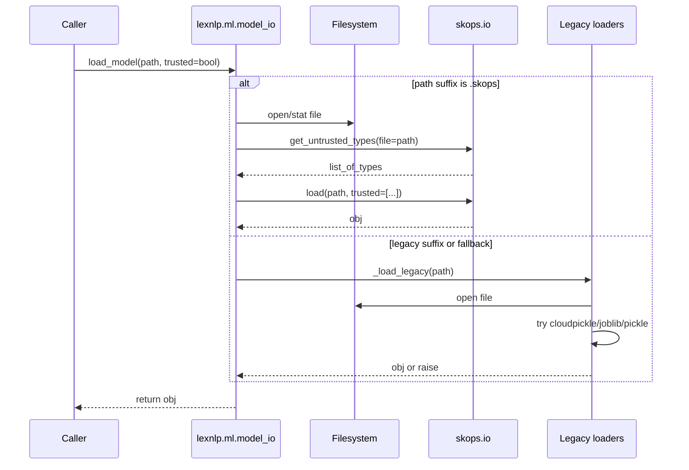
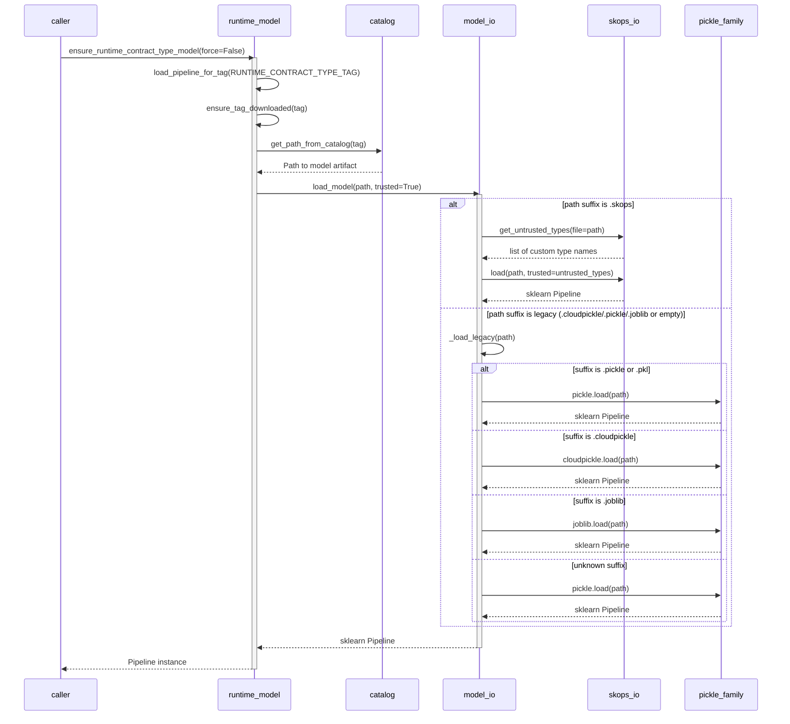
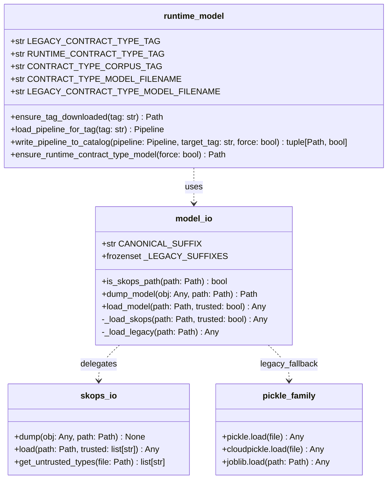

# PR Comments Export

> Exported from [https://github.com/arthrod/lexpredict-lexnlp/pull/13](https://github.com/arthrod/lexpredict-lexnlp/pull/13)  
> 24 of 24 comments selected  
> Generated by [Cicero](https://cicero.im) on 4/18/2026, 9:36:37 PM

---

### coderabbitai[bot] &mdash; 4/15/2026, 4:16:52 AM

**Actionable comments posted: 2**

<details>
<summary>🧹 Nitpick comments (1)</summary><blockquote>

<details>
<summary>lexnlp/ml/model_io.py (1)</summary><blockquote>

`104-111`: **Stale comment: fallback now fails for unknown suffixes.**

The comment at lines 104-106 says the fallback "matches what callers expect when the suffix is unfamiliar" and suggests the content may be loaded. However, since `_load_legacy()` now raises `ValueError` for unsupported suffixes (lines 79-83), this fallback path will always fail for truly unknown suffixes.

Consider updating the comment to reflect the actual behavior, or simplify by raising immediately for unknown suffixes.


<details>
<summary>♻️ Suggested simplification</summary>

```diff
-    # Fall back: attempt skops, then pickle. This matches what callers
-    # expect when the suffix is unfamiliar but the content may still be
-    # a valid artifact in one of the supported formats.
-    try:
-        return _load_skops(path, trusted=trusted)
-    except Exception:  # noqa: BLE001 - fall through to legacy pickle loader
-        LOGGER.debug("skops.io failed to load %s; retrying with pickle", path)
-        return _load_legacy(path)
+    # Unknown suffix: attempt skops first (some skops files may not use
+    # .skops extension); if that fails, _load_legacy raises ValueError.
+    try:
+        return _load_skops(path, trusted=trusted)
+    except Exception:  # noqa: BLE001 - skops failed; try legacy as last resort
+        LOGGER.debug("skops.io failed for %s; attempting legacy loader", path)
+        return _load_legacy(path)
```
</details>

<details>
<summary>🤖 Prompt for AI Agents</summary>

```
Verify each finding against the current code and only fix it if needed.

In `@lexnlp/ml/model_io.py` around lines 104 - 111, The comment above the skops
fallback is stale because _load_legacy(path) now raises ValueError for
unsupported suffixes, so the try/except around _load_skops(path,
trusted=trusted) no longer "matches what callers expect" for unknown suffixes;
update the code by either (A) revising the comment near the
_load_skops/_load_legacy block to state that the skops fallback will still raise
ValueError for truly unknown suffixes (mentioning _load_skops and _load_legacy),
or (B) simplify behavior by detecting unsupported suffixes earlier and raising
ValueError immediately instead of attempting the skops fallback (remove the
try/except and surface the ValueError), ensuring references to _load_skops and
_load_legacy remain correct.
```

</details>

</blockquote></details>

</blockquote></details>

<details>
<summary>🤖 Prompt for all review comments with AI agents</summary>

```
Verify each finding against the current code and only fix it if needed.

Inline comments:
In `@lexnlp/ml/model_io.py`:
- Around line 114-124: The function _load_skops incorrectly treats the untrusted
list as a truthy value and passes it into _skops_load as the trusted argument
when trusted is False; update the logic so that the trusted argument is the
untrusted list only when the caller explicitly set trusted=True, otherwise pass
an empty list (to fail closed). Locate _load_skops and replace the current
conditional return with logic that computes trusted_arg = untrusted if trusted
else [] and call _skops_load(path, trusted=trusted_arg), keeping the use of
get_untrusted_types unchanged.

In `@pyproject.toml`:
- Line 10: The pyproject metadata is inconsistent: the requires-python field
(requires-python = ">=3.10,<3.14") conflicts with the package classifiers which
only list "Programming Language :: Python :: 3.13"; either update the
requires-python value to ">=3.13,<3.14" if 3.13 is the intended minimum, or add
the missing classifiers ("Programming Language :: Python :: 3.10", "Programming
Language :: Python :: 3.11", "Programming Language :: Python :: 3.12") so the
classifiers align with requires-python; edit the requires-python entry and/or
the classifiers list in pyproject.toml to ensure they match and reflect the
supported Python range.

---

Nitpick comments:
In `@lexnlp/ml/model_io.py`:
- Around line 104-111: The comment above the skops fallback is stale because
_load_legacy(path) now raises ValueError for unsupported suffixes, so the
try/except around _load_skops(path, trusted=trusted) no longer "matches what
callers expect" for unknown suffixes; update the code by either (A) revising the
comment near the _load_skops/_load_legacy block to state that the skops fallback
will still raise ValueError for truly unknown suffixes (mentioning _load_skops
and _load_legacy), or (B) simplify behavior by detecting unsupported suffixes
earlier and raising ValueError immediately instead of attempting the skops
fallback (remove the try/except and surface the ValueError), ensuring references
to _load_skops and _load_legacy remain correct.
```

</details>

<details>
<summary>🪄 Autofix (Beta)</summary>

Fix all unresolved CodeRabbit comments on this PR:

- [ ] <!-- {"checkboxId": "4b0d0e0a-96d7-4f10-b296-3a18ea78f0b9"} --> Push a commit to this branch (recommended)
- [ ] <!-- {"checkboxId": "ff5b1114-7d8c-49e6-8ac1-43f82af23a33"} --> Create a new PR with the fixes

</details>

---

<details>
<summary>ℹ️ Review info</summary>

<details>
<summary>⚙️ Run configuration</summary>

**Configuration used**: Organization UI

**Review profile**: CHILL

**Plan**: Pro

**Run ID**: `93feffe9-fb3e-4a66-95e0-bef957ee3001`

</details>

<details>
<summary>📥 Commits</summary>

Reviewing files that changed from the base of the PR and between bc3e583af57b87135607a650495e4dbdfc97944f and 710b6d1dc3d25bc8f8fb736247d7367b534779bb.

</details>

<details>
<summary>📒 Files selected for processing (3)</summary>

* `lexnlp/ml/model_io.py`
* `lexnlp/utils/amount_delimiting.py`
* `pyproject.toml`

</details>

<details>
<summary>✅ Files skipped from review due to trivial changes (1)</summary>

* lexnlp/utils/amount_delimiting.py

</details>

</details>

<details>
<summary>📜 Review details</summary>

<details>
<summary>🧰 Additional context used</summary>

<details>
<summary>📓 Path-based instructions (8)</summary>

<details>
<summary>**/*.{py,ts,tsx}</summary>


**📄 CodeRabbit inference engine (Custom checks)**

> `**/*.{py,ts,tsx}`: Identify changed production files and verify corresponding test changes. FAIL if a changed production file has zero associated test file AND introduces new exported functions, classes, or public methods. Exceptions: config files, .d.ts files, migrations, generated code.
> No lint suppression creep: Scan diff for newly added suppression comments. Python: # noqa, # type: ignore. TypeScript: // biome-ignore, // eslint-disable, `@ts-ignore`, `@ts-expect-error`, // oxlint-ignore. Each suppression MUST have inline justification comment. FAIL if any suppression lacks justification. WARN if total new suppressions > 3 in PR.
> Import ordering and dead imports check: Python - run `uv run ruff check --select I,F401 .`. TypeScript - run `bun run biome check --formatter-enabled=false --linter-enabled=false --organize-imports-enabled=true .`. FAIL if violations found.

Files:
- `lexnlp/ml/model_io.py`

</details>
<details>
<summary>**/*.py</summary>


**📄 CodeRabbit inference engine (Custom checks)**

> `**/*.py`: Python lint with ruff: Run `uv run ruff check . --diff` and `uv run ruff format --check --diff .`. FAIL if exit code != 0 for either.
> Python type checking: Run `uv run ty check` (or fallback to mypy/pyright if configured). FAIL if exit code != 0. If no type checker configured, FAIL with 'No Python type checker configured. Add ty to dev dependencies.'
> Strict null/undefined audit for Python: Scan diff for new bare `type: ignore` without error code and `cast()` calls without explanation comment. WARN for each. FAIL if bare `type: ignore` count > 3.

Files:
- `lexnlp/ml/model_io.py`

</details>
<details>
<summary>lexnlp/**/*.py</summary>


**📄 CodeRabbit inference engine (AGENTS.md)**

> `lexnlp/**/*.py`: Prefer existing utilities under lexnlp/utils/ over introducing duplicates
> Full base test suite must pass: pytest lexnlp with 100% pass target

Files:
- `lexnlp/ml/model_io.py`

</details>
<details>
<summary>**/pyproject.toml</summary>


**📄 CodeRabbit inference engine (Custom checks)**

> `**/pyproject.toml`: Run Python dependency audit: `uv run pip-audit` or `uv run pip list --outdated`. FAIL if any known CVE with severity HIGH or CRITICAL is found. WARN for moderate severity.
> Smoke test for Python web server: Start server, wait for ready signal, hit GET /health or GET /, assert HTTP 200. Timeout: 30s. FAIL if test fails.
> Smoke test for Python CLI: Run `<cli> --help`, assert exit code 0. FAIL if test fails.
> Smoke test for Python library: Run `python -c "import <package>"`, assert exit code 0. FAIL if test fails.
> Python coverage threshold: Run `uv run pytest --cov=<src_package> --cov-report=term-missing --cov-branch --cov-fail-under=80`. FAIL if exit code != 0 or branch coverage < 70%.
> Run full Python test suite: `uv run pytest --tb=line -q` for baseline and `uv run pytest --tb=short -q` for PR branch. FAIL immediately if exit code != 0.

Files:
- `pyproject.toml`

</details>
<details>
<summary>{**/pyproject.toml,**/package.json}</summary>


**📄 CodeRabbit inference engine (Custom checks)**

> Clean build verification: Python - run `uv build`, verify dist/ contains expected wheel/sdist. FAIL if exit code != 0. TypeScript - run `bun run build`, verify output directory (dist/, .next/, build/) is non-empty. WARN if > 10 build warnings.

Files:
- `pyproject.toml`

</details>
<details>
<summary>{ruff.toml,pyproject.toml,biome.json,.oxlintrc.json}</summary>


**📄 CodeRabbit inference engine (Custom checks)**

> Linter/formatter config consistency: Verify that linter/formatter config files (ruff.toml, pyproject.toml [tool.ruff], biome.json, .oxlintrc.json) were not modified without corresponding PR description explanation. WARN if config changed without mention.

Files:
- `pyproject.toml`

</details>
<details>
<summary>{pyproject.toml,.github/**,ci/**,scripts/**}</summary>


**📄 CodeRabbit inference engine (AGENTS.md)**

> Use uv with pyproject.toml for all new local setup and CI updates; deprecate Pipfile, python-requirements.txt, and python-requirements-dev.txt

Files:
- `pyproject.toml`

</details>
<details>
<summary>pyproject.toml</summary>


**📄 CodeRabbit inference engine (AGENTS.md)**

> Editable install must work: uv pip install --python .venv/bin/python -e ".[dev,test]"

Files:
- `pyproject.toml`

</details>

</details><details>
<summary>🧠 Learnings (8)</summary>

<details>
<summary>📓 Common learnings</summary>

```
Learnt from: CR
Repo: arthrod/lexpredict-lexnlp PR: 0
File: AGENTS.md:0-0
Timestamp: 2026-04-15T06:23:49.306Z
Learning: Applies to lexnlp/**/tests/**/*.py : Add or update tests alongside behavior changes
```

</details>
<details>
<summary>📚 Learning: 2026-04-15T06:23:49.306Z</summary>

```
Learnt from: CR
Repo: arthrod/lexpredict-lexnlp PR: 0
File: AGENTS.md:0-0
Timestamp: 2026-04-15T06:23:49.306Z
Learning: Project requires Python >=3.10,<3.13 as specified in pyproject.toml; default to Python 3.11
```

**Applied to files:**
- `pyproject.toml`

</details>
<details>
<summary>📚 Learning: 2026-04-13T23:15:27.671Z</summary>

```
Learnt from: CR
Repo: arthrod/lexpredict-lexnlp PR: 0
File: coderabbit-custom-pre-merge-checks-unique-id-file-non-traceable-F7F2B60C-1728-4C9A-8889-4F2235E186CA.txt:0-0
Timestamp: 2026-04-13T23:15:27.671Z
Learning: Applies to {ruff.toml,pyproject.toml,biome.json,.oxlintrc.json} : Linter/formatter config consistency: Verify that linter/formatter config files (ruff.toml, pyproject.toml [tool.ruff], biome.json, .oxlintrc.json) were not modified without corresponding PR description explanation. WARN if config changed without mention.
```

**Applied to files:**
- `pyproject.toml`

</details>
<details>
<summary>📚 Learning: 2026-04-15T06:23:49.306Z</summary>

```
Learnt from: CR
Repo: arthrod/lexpredict-lexnlp PR: 0
File: AGENTS.md:0-0
Timestamp: 2026-04-15T06:23:49.306Z
Learning: Applies to lexnlp/nlp/en/tests/test_stanford.py : Stanford-dependent tests are gated by LEXNLP_USE_STANFORD=true environment variable; when Stanford assets are installed and enabled, both base and Stanford-only suites must pass (0 failures)
```

**Applied to files:**
- `pyproject.toml`

</details>
<details>
<summary>📚 Learning: 2026-04-15T06:23:49.306Z</summary>

```
Learnt from: CR
Repo: arthrod/lexpredict-lexnlp PR: 0
File: AGENTS.md:0-0
Timestamp: 2026-04-15T06:23:49.306Z
Learning: Applies to lexnlp/**/*.py : Full base test suite must pass: pytest lexnlp with 100% pass target
```

**Applied to files:**
- `pyproject.toml`

</details>
<details>
<summary>📚 Learning: 2026-04-15T06:23:49.306Z</summary>

```
Learnt from: CR
Repo: arthrod/lexpredict-lexnlp PR: 0
File: AGENTS.md:0-0
Timestamp: 2026-04-15T06:23:49.306Z
Learning: Applies to lexnlp/extract/en/entities/tests/test_stanford_ner.py : Stanford-dependent entity extraction tests gated by LEXNLP_USE_STANFORD=true; must pass when Stanford assets are installed and enabled
```

**Applied to files:**
- `pyproject.toml`

</details>
<details>
<summary>📚 Learning: 2026-04-15T06:23:49.306Z</summary>

```
Learnt from: CR
Repo: arthrod/lexpredict-lexnlp PR: 0
File: AGENTS.md:0-0
Timestamp: 2026-04-15T06:23:49.306Z
Learning: Applies to lexnlp/**/tests/**/*.py : Do not add, remove, or modify skip, skipif, or xfail markers to bypass failing tests; any skip/skipif/xfail must include inline annotation with skip-audit: issue=<link-or-id> expires=YYYY-MM-DD
```

**Applied to files:**
- `pyproject.toml`

</details>
<details>
<summary>📚 Learning: 2026-04-15T06:23:49.306Z</summary>

```
Learnt from: CR
Repo: arthrod/lexpredict-lexnlp PR: 0
File: AGENTS.md:0-0
Timestamp: 2026-04-15T06:23:49.306Z
Learning: Applies to lexnlp/**/tests/**/*.py : Add or update tests alongside behavior changes
```

**Applied to files:**
- `pyproject.toml`

</details>

</details><details>
<summary>🪛 Ruff (0.15.10)</summary>

<details>
<summary>lexnlp/ml/model_io.py</summary>

[error] 69-69: `pickle` and modules that wrap it can be unsafe when used to deserialize untrusted data, possible security issue

(S301)

</details>

</details>

</details>

<details>
<summary>🔇 Additional comments (7)</summary><blockquote>

<details>
<summary>lexnlp/ml/model_io.py (3)</summary><blockquote>

`1-34`: **LGTM! Clear module documentation and well-organized constants.**

The docstring clearly explains the motivation for moving from pickle to skops, and the constant definitions (`CANONICAL_SUFFIX`, `_LEGACY_SUFFIXES`) are appropriately scoped.

---

`37-56`: **LGTM! Clean helper functions with appropriate safety measures.**

`is_skops_path()` and `dump_model()` are straightforward. The suffix normalization in `dump_model()` ensures consistent artifact naming, and parent directory creation is handled gracefully.

---

`59-83`: **Acknowledged: Legacy pickle support is intentional.**

The Ruff S301 warning on line 69 is expected—this function explicitly supports legacy pickle artifacts as documented in the module docstring. The fix from commit 710b6d1 correctly rejects unknown suffixes with a clear `ValueError` at lines 79-83 instead of falling back to unsafe deserialization.

</blockquote></details>
<details>
<summary>pyproject.toml (4)</summary><blockquote>

`35-59`: **LGTM! Dependency version bumps align with modernization goals.**

The updated ranges support the new Python 3.13 target while maintaining sensible upper bounds. Adding `skops>=0.11,<1` aligns with the new `model_io.py` module.

---

`66-82`: **Good use of PEP 735 dependency groups.**

The refactoring to use `[dependency-groups]` with `include-group` for the `dev` group is clean and aligns with modern Python packaging practices. The comment explaining the pattern is helpful.

---

`87-88`: **LGTM! Adding `py.typed` marker enables type checking for consumers.**

This correctly declares the package as typed, allowing downstream users to benefit from type information.

---

`93-95`: No action required. The `requires-python = ">=3.10,<3.14"` already includes Python 3.13, making `target-version = "py313"` consistent with supported versions.


				> Likely an incorrect or invalid review comment.

</blockquote></details>

</blockquote></details>

</details>

<!-- This is an auto-generated comment by CodeRabbit for review status -->

---

### coderabbitai[bot] &mdash; 4/15/2026, 4:16:51 AM

> File: `lexnlp/ml/model_io.py`

<details><summary>Code context</summary>

```diff
@@ -0,0 +1,124 @@
+"""Model serialization helpers.
+
+LexNLP historically persisted scikit-learn pipelines via ``pickle`` /
+``cloudpickle`` / ``joblib``. Those formats are tightly coupled to the
+Python / sklearn versions that produced them (see the tree-pickle ABI
+break between sklearn 1.2 and 1.3+) and they execute arbitrary code on
+load, making them unsuitable as a persistence target for shipped
+artifacts.
+
+This module introduces `skops.io <https://skops.readthedocs.io/>`_ as
+the forward-looking successor. ``skops`` serializes sklearn estimators
+via a restricted schema that does not execute arbitrary code on load.
+
+``CANONICAL_SUFFIX`` is the extension used for new artifacts written by
+``dump_model``. ``load_model`` accepts either ``.skops`` files or any
+legacy pickle-based file (``.pickle`` / ``.cloudpickle`` / joblib) so
+existing bundled assets continue to work while we migrate.
+"""
+
+from __future__ import annotations
+
+import logging
+import pickle
+from pathlib import Path
+from typing import Any
+
+from skops.io import dump as _skops_dump
+from skops.io import get_untrusted_types
+from skops.io import load as _skops_load
+
+LOGGER = logging.getLogger(__name__)
+
+CANONICAL_SUFFIX = ".skops"
+_LEGACY_SUFFIXES = frozenset({".pickle", ".pkl", ".cloudpickle", ".joblib"})
+
+
+def is_skops_path(path: Path) -> bool:
+    """Return ``True`` when ``path`` is a skops artifact (by suffix)."""
+
+    return path.suffix.lower() == CANONICAL_SUFFIX
+
+
+def dump_model(obj: Any, path: Path) -> Path:
+    """Persist ``obj`` at ``path`` using skops.
+
+    ``path`` is normalized to use :data:`CANONICAL_SUFFIX` so callers
+    cannot accidentally round-trip a skops artifact through a legacy
+    pickle extension.
+    """
+
+    path = Path(path)
+    if not is_skops_path(path):
+        path = path.with_suffix(CANONICAL_SUFFIX)
+    path.parent.mkdir(parents=True, exist_ok=True)
+    _skops_dump(obj, path)
+    return path
+
+
+def _load_legacy(path: Path) -> Any:
+    """Load a legacy pickle / cloudpickle / joblib artifact.
+
+    Legacy loaders are imported lazily because ``cloudpickle`` and
+    ``joblib`` are optional for skops-only consumers.
+    """
+
+    suffix = path.suffix.lower()
+    if suffix in (".pickle", ".pkl"):
+        with path.open("rb") as file:
+            return pickle.load(file)
+    if suffix == ".cloudpickle":
+        from cloudpickle import load as cloudpickle_load
+
+        with path.open("rb") as file:
+            return cloudpickle_load(file)
+    if suffix == ".joblib":
+        import joblib
+
+        return joblib.load(path)
+    # Reject unknown suffixes instead of attempting unsafe deserialization
+    raise ValueError(
+        f"Unsupported file suffix '{suffix}' for legacy model loading. "
+        f"Expected one of: {', '.join(sorted(_LEGACY_SUFFIXES))}"
+    )
+
+
+def load_model(path: Path, *, trusted: bool = False) -> Any:
+    """Load a model written by :func:`dump_model` or by a legacy dumper.
+
+    ``trusted`` is forwarded to :func:`skops.io.load`. When ``True`` the
+    caller asserts that any custom types present in the artifact are
+    safe to reconstruct. The default (``False``) scans the artifact with
+    :func:`skops.io.get_untrusted_types` and passes the scanned list
+    explicitly so load fails closed when unexpected types appear.
+    """
+
+    path = Path(path)
+    if is_skops_path(path):
+        return _load_skops(path, trusted=trusted)
+
+    if path.suffix.lower() in _LEGACY_SUFFIXES or path.suffix == "":
+        LOGGER.debug("Loading legacy model via pickle-family loader: %s", path)
+        return _load_legacy(path)
+
+    # Fall back: attempt skops, then pickle. This matches what callers
+    # expect when the suffix is unfamiliar but the content may still be
+    # a valid artifact in one of the supported formats.
+    try:
+        return _load_skops(path, trusted=trusted)
+    except Exception:  # noqa: BLE001 - fall through to legacy pickle loader
+        LOGGER.debug("skops.io failed to load %s; retrying with pickle", path)
+        return _load_legacy(path)
+
+
+def _load_skops(path: Path, *, trusted: bool) -> Any:
+    """Invoke :func:`skops.io.load` with a ``trusted`` argument that
+    matches the current skops API (list of allowed custom type names)."""
+
+    # ``get_untrusted_types`` returns every custom type referenced by
+    # the artifact. When the caller passes ``trusted=True`` we treat
+    # every referenced type as trusted; otherwise we still enumerate
+    # the types so load fails closed if a non-sklearn surprise lands
+    # in the archive.
+    untrusted = list(get_untrusted_types(file=path) or [])
+    return _skops_load(path, trusted=untrusted if (trusted or untrusted) else [])
```
</details>

_⚠️ Potential issue_ | _🔴 Critical_

<details>
<summary>🧩 Analysis chain</summary>

🌐 Web query:

`skops.io load function trusted parameter behavior`

💡 Result:

The skops.io.load (and loads) function has a trusted parameter that controls which object types are allowed during deserialization. It enhances security over pickle by auditing the file contents before loading. - Default (trusted=None or False): Only loads default trusted types (e.g., most scikit-learn estimators, NumPy ufuncs/dtypes, SciPy special ufuncs). Raises UntrustedTypesFoundException if untrusted types are present. - trusted=list_of_str: List of fully-qualified type names (e.g., ['xgboost.sklearn.XGBClassifier']) to trust in addition to defaults. Use get_untrusted_types(file) first to inspect and selectively trust. - trusted=True: Previously blindly trusted all types (skipping audit), but removed in skops v0.10 (June 2024, PR `#422`) due to CVE-2024-37065 allowing arbitrary code execution. Now raises TypeError. As of latest versions (v0.13.0, Aug 2025), always inspect with get_untrusted_types and pass specific trusted types. Recent security fixes (e.g., v0.12.0 for GHSA-m7f4-hrc6-fwg3) hardened validation but emphasize manual review—do not trust get_untrusted_types output blindly. Example: from skops.io import load, get_untrusted_types unknown = get_untrusted_types("model.skops") # Review unknown, trust selectively trusted_types = [t for t in unknown if safe(t)] # User-defined safe check model = load("model.skops", trusted=trusted_types) Official docs warn the feature is under development with potential security issues; only load trusted sources.

Citations:

- 1: https://github.com/skops-dev/skops/pull/422
- 2: https://skops.readthedocs.io/en/latest/persistence.html
- 3: https://skops.readthedocs.io/en/stable/persistence.html
- 4: https://skops.readthedocs.io/en/stable/modules/classes.html
- 5: https://skops.readthedocs.io/en/stable/changes.html
- 6: https://github.com/skops-dev/skops

---

🏁 Script executed:

```shell
cd / && find . -type f -name "model_io.py" 2>/dev/null | head -5
```

Repository: arthrod/lexpredict-lexnlp

Length of output: 110

---

🏁 Script executed:

```shell
cat -n lexnlp/ml/model_io.py | head -150
```

Repository: arthrod/lexpredict-lexnlp

Length of output: 5571

---


</details>

**Logic bug in `_load_skops`: untrusted types are passed as trusted when `trusted=False`.**

The condition at line 124 uses `(trusted or untrusted)`, which treats the untrusted types list as a boolean. When `trusted=False` but untrusted types exist, the condition `(False or [types])` evaluates to the list (truthy), passing those types as trusted—contradicting the docstring's "fail closed" behavior.

When `trusted=False`, the caller explicitly expects the load to fail if unexpected types are present. Instead, the code accepts them.

<details>
<summary>🔧 Proposed fix</summary>

```diff
     untrusted = list(get_untrusted_types(file=path) or [])
-    return _skops_load(path, trusted=untrusted if (trusted or untrusted) else [])
+    return _skops_load(path, trusted=untrusted if trusted else [])
```
</details>

<details>
<summary>🤖 Prompt for AI Agents</summary>

```
Verify each finding against the current code and only fix it if needed.

In `@lexnlp/ml/model_io.py` around lines 114 - 124, The function _load_skops
incorrectly treats the untrusted list as a truthy value and passes it into
_skops_load as the trusted argument when trusted is False; update the logic so
that the trusted argument is the untrusted list only when the caller explicitly
set trusted=True, otherwise pass an empty list (to fail closed). Locate
_load_skops and replace the current conditional return with logic that computes
trusted_arg = untrusted if trusted else [] and call _skops_load(path,
trusted=trusted_arg), keeping the use of get_untrusted_types unchanged.
```

</details>

<!-- fingerprinting:phantom:poseidon:ocelot:258cd638-f1da-4b22-a45a-31283d229545 -->

<!-- This is an auto-generated comment by CodeRabbit -->

---

### coderabbitai[bot] &mdash; 4/15/2026, 4:16:51 AM

> File: `pyproject.toml`

<details><summary>Code context</summary>

```diff
@@ -7,7 +7,7 @@ name = "lexnlp"
 version = "2.3.0"
 description = "LexPredict LexNLP"
 readme = { file = "README.rst", content-type = "text/x-rst" }
-requires-python = ">=3.10,<3.13"
+requires-python = ">=3.10,<3.14"
```
</details>

_⚠️ Potential issue_ | _🟡 Minor_

**Inconsistency between `requires-python` and classifiers.**

`requires-python = ">=3.10,<3.14"` (line 10) indicates Python 3.10–3.13 are supported, but the classifiers at line 33 only list `Python :: 3.13`. This mismatch can confuse users and tooling like PyPI.

If Python 3.13+ is the intended minimum, update line 10 to `>=3.13,<3.14`. If 3.10–3.13 should all be supported, add the missing classifiers.


<details>
<summary>🔧 Option A: Restrict to Python 3.13+</summary>

```diff
-requires-python = ">=3.10,<3.14"
+requires-python = ">=3.13,<3.14"
```
</details>

<details>
<summary>🔧 Option B: Add missing classifiers</summary>

```diff
   "Programming Language :: Python :: 3",
+  "Programming Language :: Python :: 3.10",
+  "Programming Language :: Python :: 3.11",
+  "Programming Language :: Python :: 3.12",
   "Programming Language :: Python :: 3.13"
```
</details>


Also applies to: 33-33

<details>
<summary>🤖 Prompt for AI Agents</summary>

```
Verify each finding against the current code and only fix it if needed.

In `@pyproject.toml` at line 10, The pyproject metadata is inconsistent: the
requires-python field (requires-python = ">=3.10,<3.14") conflicts with the
package classifiers which only list "Programming Language :: Python :: 3.13";
either update the requires-python value to ">=3.13,<3.14" if 3.13 is the
intended minimum, or add the missing classifiers ("Programming Language ::
Python :: 3.10", "Programming Language :: Python :: 3.11", "Programming Language
:: Python :: 3.12") so the classifiers align with requires-python; edit the
requires-python entry and/or the classifiers list in pyproject.toml to ensure
they match and reflect the supported Python range.
```

</details>

<!-- fingerprinting:phantom:poseidon:ocelot:258cd638-f1da-4b22-a45a-31283d229545 -->

<!-- This is an auto-generated comment by CodeRabbit -->

---

### coderabbitai[bot] &mdash; 4/15/2026, 4:01:00 AM

<!-- This is an auto-generated comment: autofix status by CodeRabbit -->
> [!NOTE]
> Autofix is a beta feature. Expect some limitations and changes as we gather feedback and continue to improve it.

## Fixes Applied Successfully

Fixed 3 file(s) based on 3 unresolved review comments.


**Files modified:**
- `lexnlp/ml/model_io.py`
- `lexnlp/utils/amount_delimiting.py`
- `pyproject.toml`

**Commit:** `710b6d1dc3d25bc8f8fb736247d7367b534779bb`

The changes have been pushed to the `claude/modernize-python-dependencies-UUxLl` branch.

**Time taken:** `4m 50s`
<!-- autofix-run-id: 2ff945fc-6c00-471b-b182-5927d0b4a76b -->

---

### coderabbitai[bot] &mdash; 4/15/2026, 3:59:55 AM

**Actionable comments posted: 5**

<details>
<summary>🧹 Nitpick comments (1)</summary><blockquote>

<details>
<summary>lexnlp/utils/tests/test_amount_delimiting.py (1)</summary><blockquote>

`239-273`: **Consider consolidating duplicated locale-mocking helpers.**

`_mock_locale_conventions` and `_mock_de_de_conventions` both define the same fake context manager + patch tuple pattern. A single shared helper (with a thin de_DE wrapper if desired) would reduce drift and future maintenance overhead.

<details>
<summary>🤖 Prompt for AI Agents</summary>

```
Verify each finding against the current code and only fix it if needed.

In `@lexnlp/utils/tests/test_amount_delimiting.py` around lines 239 - 273,
Consolidate the duplicated locale-mocking helpers by removing the separate
_mock_de_de_conventions and using the existing _mock_locale_conventions as the
single helper that returns the FakeLocaleContextManager and the patch tuple for
LocaleContextManager and locale.localeconv; if a de_DE-specific helper is still
useful, add a thin wrapper function (e.g., _mock_de_de_conventions) that simply
calls _mock_locale_conventions(decimal_delimiter=",", group_delimiter=".",
grouping=[3, 0]) so tests can keep the same call sites while maintaining one
source of truth for the FakeLocaleContextManager and patch behavior (ensure
references to LocaleContextManager and locale.localeconv remain unchanged).
```

</details>

</blockquote></details>

</blockquote></details>

<details>
<summary>🤖 Prompt for all review comments with AI agents</summary>

```
Verify each finding against the current code and only fix it if needed.

Inline comments:
In `@lexnlp/extract/es/tests/test_regulations.py`:
- Line 76: The comment string containing "RegulationsParser – DataFrame
injection (PR fix: `is None` check)" uses an en dash (U+2013) which triggers
Ruff RUF003; update that text to use a standard hyphen-minus ("-") so it reads
"RegulationsParser - DataFrame injection (PR fix: `is None` check)"; locate the
comment containing "RegulationsParser – DataFrame injection" in the tests
(around the RegulationsParser reference) and replace the en dash with a hyphen.

In `@lexnlp/ml/catalog/tests/test_catalog_path.py`:
- Around line 130-149: Replace the blind try/except blocks in the do_invalidate
and do_read worker functions so exceptions aren't swallowed; instead run these
callables using concurrent.futures.ThreadPoolExecutor (or map/submit) and call
future.result() to propagate any errors. Specifically, remove the broad
Exception catches around catalog.invalidate_catalog_cache() in do_invalidate and
catalog._get_tag_dict_cached() in do_read, submit those functions to
ThreadPoolExecutor (5 workers each or submit in a loop), collect the futures and
call result() on each to ensure test failures surface immediately.

In `@lexnlp/ml/tests/test_model_io.py`:
- Line 194: Replace the EN DASH characters in the section headers with ASCII
hyphen-minus to satisfy Ruff RUF003: change the header string "load_model –
routing logic" to "load_model - routing logic" and similarly update the header
at the other occurrence (line 276) that uses `–` to use `-`; ensure you update
the literal header text in the test file (e.g., the header comments/strings
surrounding the load_model tests) so no non-ASCII dash remains.
- Around line 178-182: The test test_pickle_file_invalid_raises currently
catches any Exception; narrow it to the specific pickle unpickling failure by
changing the context manager to pytest.raises(pickle.UnpicklingError) when
calling _load_legacy(path). Ensure the test module imports the pickle module if
not already present so pickle.UnpicklingError is available.

In `@lexnlp/utils/tests/test_amount_delimiting.py`:
- Line 245: Remove the unused local import "import locale as _locale_mod" in the
test file; specifically delete that import line so `_mock_locale_conventions` no
longer references a dead import (or alternatively reference the imported symbol
in `_mock_locale_conventions` if it was intended), ensuring the file passes Ruff
F401 checks and no other code relies on `_locale_mod`.

---

Nitpick comments:
In `@lexnlp/utils/tests/test_amount_delimiting.py`:
- Around line 239-273: Consolidate the duplicated locale-mocking helpers by
removing the separate _mock_de_de_conventions and using the existing
_mock_locale_conventions as the single helper that returns the
FakeLocaleContextManager and the patch tuple for LocaleContextManager and
locale.localeconv; if a de_DE-specific helper is still useful, add a thin
wrapper function (e.g., _mock_de_de_conventions) that simply calls
_mock_locale_conventions(decimal_delimiter=",", group_delimiter=".",
grouping=[3, 0]) so tests can keep the same call sites while maintaining one
source of truth for the FakeLocaleContextManager and patch behavior (ensure
references to LocaleContextManager and locale.localeconv remain unchanged).
```

</details>

<details>
<summary>🪄 Autofix (Beta)</summary>

Fix all unresolved CodeRabbit comments on this PR:

- [ ] <!-- {"checkboxId": "4b0d0e0a-96d7-4f10-b296-3a18ea78f0b9"} --> Push a commit to this branch (recommended)
- [ ] <!-- {"checkboxId": "ff5b1114-7d8c-49e6-8ac1-43f82af23a33"} --> Create a new PR with the fixes

</details>

---

<details>
<summary>ℹ️ Review info</summary>

<details>
<summary>⚙️ Run configuration</summary>

**Configuration used**: Organization UI

**Review profile**: CHILL

**Plan**: Pro

**Run ID**: `d076432e-29de-4a99-938f-2c20300703f4`

</details>

<details>
<summary>📥 Commits</summary>

Reviewing files that changed from the base of the PR and between 1751ba4bdbc790d66204b0b7fc808a389785ddd0 and bc3e583af57b87135607a650495e4dbdfc97944f.

</details>

<details>
<summary>📒 Files selected for processing (6)</summary>

* `lexnlp/extract/en/contracts/tests/test_runtime_model.py`
* `lexnlp/extract/es/tests/test_regulations.py`
* `lexnlp/ml/catalog/tests/test_catalog_path.py`
* `lexnlp/ml/tests/__init__.py`
* `lexnlp/ml/tests/test_model_io.py`
* `lexnlp/utils/tests/test_amount_delimiting.py`

</details>

<details>
<summary>🚧 Files skipped from review as they are similar to previous changes (1)</summary>

* lexnlp/extract/en/contracts/tests/test_runtime_model.py

</details>

</details>

<details>
<summary>📜 Review details</summary>

<details>
<summary>🧰 Additional context used</summary>

<details>
<summary>📓 Path-based instructions (6)</summary>

<details>
<summary>**/*.{py,ts,tsx}</summary>


**📄 CodeRabbit inference engine (Custom checks)**

> `**/*.{py,ts,tsx}`: Identify changed production files and verify corresponding test changes. FAIL if a changed production file has zero associated test file AND introduces new exported functions, classes, or public methods. Exceptions: config files, .d.ts files, migrations, generated code.
> No lint suppression creep: Scan diff for newly added suppression comments. Python: # noqa, # type: ignore. TypeScript: // biome-ignore, // eslint-disable, `@ts-ignore`, `@ts-expect-error`, // oxlint-ignore. Each suppression MUST have inline justification comment. FAIL if any suppression lacks justification. WARN if total new suppressions > 3 in PR.
> Import ordering and dead imports check: Python - run `uv run ruff check --select I,F401 .`. TypeScript - run `bun run biome check --formatter-enabled=false --linter-enabled=false --organize-imports-enabled=true .`. FAIL if violations found.

Files:
- `lexnlp/ml/catalog/tests/test_catalog_path.py`
- `lexnlp/utils/tests/test_amount_delimiting.py`
- `lexnlp/extract/es/tests/test_regulations.py`
- `lexnlp/ml/tests/test_model_io.py`

</details>
<details>
<summary>**/*{test,spec,__mocks__}*.{py,ts,tsx}</summary>


**📄 CodeRabbit inference engine (Custom checks)**

> New test quality spot-check: Verify each new test file contains at least one assertion (assert, expect, assertEqual, toBe, toEqual, toThrow, rejects, etc.). FAIL if any new test file has zero assertions.

Files:
- `lexnlp/ml/catalog/tests/test_catalog_path.py`
- `lexnlp/utils/tests/test_amount_delimiting.py`
- `lexnlp/extract/es/tests/test_regulations.py`
- `lexnlp/ml/tests/test_model_io.py`

</details>
<details>
<summary>**/*.py</summary>


**📄 CodeRabbit inference engine (Custom checks)**

> `**/*.py`: Python lint with ruff: Run `uv run ruff check . --diff` and `uv run ruff format --check --diff .`. FAIL if exit code != 0 for either.
> Python type checking: Run `uv run ty check` (or fallback to mypy/pyright if configured). FAIL if exit code != 0. If no type checker configured, FAIL with 'No Python type checker configured. Add ty to dev dependencies.'
> Strict null/undefined audit for Python: Scan diff for new bare `type: ignore` without error code and `cast()` calls without explanation comment. WARN for each. FAIL if bare `type: ignore` count > 3.

Files:
- `lexnlp/ml/catalog/tests/test_catalog_path.py`
- `lexnlp/utils/tests/test_amount_delimiting.py`
- `lexnlp/extract/es/tests/test_regulations.py`
- `lexnlp/ml/tests/test_model_io.py`

</details>
<details>
<summary>lexnlp/**/tests/**/*.py</summary>


**📄 CodeRabbit inference engine (AGENTS.md)**

> `lexnlp/**/tests/**/*.py`: Add or update tests alongside behavior changes
> Do not add, remove, or modify skip, skipif, or xfail markers to bypass failing tests; any skip/skipif/xfail must include inline annotation with skip-audit: issue=<link-or-id> expires=YYYY-MM-DD

Files:
- `lexnlp/ml/catalog/tests/test_catalog_path.py`
- `lexnlp/utils/tests/test_amount_delimiting.py`
- `lexnlp/extract/es/tests/test_regulations.py`
- `lexnlp/ml/tests/test_model_io.py`

</details>
<details>
<summary>lexnlp/**/*.py</summary>


**📄 CodeRabbit inference engine (AGENTS.md)**

> `lexnlp/**/*.py`: Prefer existing utilities under lexnlp/utils/ over introducing duplicates
> Full base test suite must pass: pytest lexnlp with 100% pass target

Files:
- `lexnlp/ml/catalog/tests/test_catalog_path.py`
- `lexnlp/utils/tests/test_amount_delimiting.py`
- `lexnlp/extract/es/tests/test_regulations.py`
- `lexnlp/ml/tests/test_model_io.py`

</details>
<details>
<summary>lexnlp/extract/{en,de,es,common}/**</summary>


**📄 CodeRabbit inference engine (AGENTS.md)**

> Keep changes scoped to the relevant locale/module (extract/en, extract/de, etc.)

Files:
- `lexnlp/extract/es/tests/test_regulations.py`

</details>

</details><details>
<summary>🧠 Learnings (3)</summary>

<details>
<summary>📓 Common learnings</summary>

```
Learnt from: CR
Repo: arthrod/lexpredict-lexnlp PR: 0
File: AGENTS.md:0-0
Timestamp: 2026-04-15T06:23:49.306Z
Learning: Applies to lexnlp/**/tests/**/*.py : Add or update tests alongside behavior changes
```

</details>
<details>
<summary>📚 Learning: 2026-04-15T06:23:49.306Z</summary>

```
Learnt from: CR
Repo: arthrod/lexpredict-lexnlp PR: 0
File: AGENTS.md:0-0
Timestamp: 2026-04-15T06:23:49.306Z
Learning: Applies to lexnlp/**/tests/**/*.py : Add or update tests alongside behavior changes
```

**Applied to files:**
- `lexnlp/utils/tests/test_amount_delimiting.py`
- `lexnlp/extract/es/tests/test_regulations.py`
- `lexnlp/ml/tests/test_model_io.py`

</details>
<details>
<summary>📚 Learning: 2026-04-15T06:23:49.306Z</summary>

```
Learnt from: CR
Repo: arthrod/lexpredict-lexnlp PR: 0
File: AGENTS.md:0-0
Timestamp: 2026-04-15T06:23:49.306Z
Learning: Applies to lexnlp/**/tests/**/*.py : Do not add, remove, or modify skip, skipif, or xfail markers to bypass failing tests; any skip/skipif/xfail must include inline annotation with skip-audit: issue=<link-or-id> expires=YYYY-MM-DD
```

**Applied to files:**
- `lexnlp/ml/tests/test_model_io.py`

</details>

</details><details>
<summary>🪛 Ruff (0.15.10)</summary>

<details>
<summary>lexnlp/ml/catalog/tests/test_catalog_path.py</summary>

[warning] 133-133: Do not catch blind exception: `Exception`

(BLE001)

---

[warning] 139-139: Do not catch blind exception: `Exception`

(BLE001)

</details>
<details>
<summary>lexnlp/extract/es/tests/test_regulations.py</summary>

[warning] 76-76: Comment contains ambiguous `–` (EN DASH). Did you mean `-` (HYPHEN-MINUS)?

(RUF003)

</details>
<details>
<summary>lexnlp/ml/tests/test_model_io.py</summary>

[warning] 181-181: Do not assert blind exception: `Exception`

(B017)

---

[warning] 194-194: Comment contains ambiguous `–` (EN DASH). Did you mean `-` (HYPHEN-MINUS)?

(RUF003)

---

[warning] 276-276: Comment contains ambiguous `–` (EN DASH). Did you mean `-` (HYPHEN-MINUS)?

(RUF003)

</details>

</details>

</details>

<details>
<summary>🔇 Additional comments (5)</summary><blockquote>

<details>
<summary>lexnlp/extract/es/tests/test_regulations.py (2)</summary><blockquote>

`11-16`: **Imports are aligned with the new DataFrame-injection test scenarios.**

`pandas` and `RegulationsParser` are appropriately added for the new constructor-injection coverage.

---

`90-135`: **Strong regression coverage for the `None` vs empty-DataFrame parser behavior.**

These tests clearly validate the intended `is None` semantics and guard against the prior CSV overwrite behavior, while keeping assertions explicit across scenarios. Based on learnings: Applies to `lexnlp/**/tests/**/*.py` : Add or update tests alongside behavior changes.

</blockquote></details>
<details>
<summary>lexnlp/utils/tests/test_amount_delimiting.py (1)</summary><blockquote>

`275-398`: **Great coverage expansion for locale fallback branches.**

These additions validate canonical behavior, misconfigured locale fallbacks, case-insensitive locale handling, and branch precedence (`de_DE` / `en_US` over generic fallback), which directly targets the risky paths in `infer_delimiters`.


Based on learnings: "Applies to lexnlp/**/tests/**/*.py : Add or update tests alongside behavior changes."

</blockquote></details>
<details>
<summary>lexnlp/ml/tests/test_model_io.py (1)</summary><blockquote>

`48-324`: **Comprehensive model I/O test coverage looks solid.**

The suite exercises suffix normalization, routing (skops vs legacy), fallback behavior, trusted/untrusted loading flow, and constant contracts with concrete assertions.


Based on learnings: Applies to `lexnlp/**/tests/**/*.py` : Add or update tests alongside behavior changes.

</blockquote></details>
<details>
<summary>lexnlp/ml/catalog/tests/test_catalog_path.py (1)</summary><blockquote>

`72-114`: **Good tightening of concurrent cache-build guarantees.**

Using `monkeypatch` for dependency injection and asserting exactly one build (`len(build_count) == 1`) makes this test much stronger and less stateful across runs.  
  
Based on learnings: `lexnlp/**/tests/**/*.py`: Add or update tests alongside behavior changes.

</blockquote></details>

</blockquote></details>

</details>

<!-- This is an auto-generated comment by CodeRabbit for review status -->

---

### coderabbitai[bot] &mdash; 4/15/2026, 3:59:54 AM

> File: `lexnlp/extract/es/tests/test_regulations.py`

<details><summary>Code context</summary>

```diff
@@ -67,3 +70,66 @@ def test_file_samples(self):
             get_regulation_annotations,
             'lexnlp/typed_annotations/es/regulation/regulations.txt',
             RegulationAnnotation)
+
+
+# ---------------------------------------------------------------------------
+# RegulationsParser – DataFrame injection (PR fix: `is None` check)
```
</details>

_⚠️ Potential issue_ | _🟡 Minor_

**Replace ambiguous EN DASH to satisfy Ruff RUF003.**

Line 76 uses `–` instead of `-`, which is flagged by Ruff and may fail lint checks.

<details>
<summary>🛠️ Proposed fix</summary>

```diff
-# RegulationsParser – DataFrame injection (PR fix: `is None` check)
+# RegulationsParser - DataFrame injection (PR fix: `is None` check)
```
</details>

<!-- suggestion_start -->

<details>
<summary>📝 Committable suggestion</summary>

> ‼️ **IMPORTANT**
> Carefully review the code before committing. Ensure that it accurately replaces the highlighted code, contains no missing lines, and has no issues with indentation. Thoroughly test & benchmark the code to ensure it meets the requirements.

```suggestion
# RegulationsParser - DataFrame injection (PR fix: `is None` check)
```

</details>

<!-- suggestion_end -->

<details>
<summary>🧰 Tools</summary>

<details>
<summary>🪛 Ruff (0.15.10)</summary>

[warning] 76-76: Comment contains ambiguous `–` (EN DASH). Did you mean `-` (HYPHEN-MINUS)?

(RUF003)

</details>

</details>

<details>
<summary>🤖 Prompt for AI Agents</summary>

```
Verify each finding against the current code and only fix it if needed.

In `@lexnlp/extract/es/tests/test_regulations.py` at line 76, The comment string
containing "RegulationsParser – DataFrame injection (PR fix: `is None` check)"
uses an en dash (U+2013) which triggers Ruff RUF003; update that text to use a
standard hyphen-minus ("-") so it reads "RegulationsParser - DataFrame injection
(PR fix: `is None` check)"; locate the comment containing "RegulationsParser –
DataFrame injection" in the tests (around the RegulationsParser reference) and
replace the en dash with a hyphen.
```

</details>

<!-- fingerprinting:phantom:poseidon:hawk:d110b7cc-130e-4feb-9e1f-2998323a52fa -->

<!-- This is an auto-generated comment by CodeRabbit -->

---

### coderabbitai[bot] &mdash; 4/15/2026, 3:59:54 AM

> File: `lexnlp/ml/catalog/tests/test_catalog_path.py`

<details><summary>Code context</summary>

```diff
@@ -104,17 +102,56 @@ def call_cached():
     for t in threads:
         t.join()
 
-    catalog._build_tag_dict = original_build  # type: ignore[assignment]
-    catalog.CATALOG = original_catalog
     catalog.invalidate_catalog_cache()
 
     assert not errors, f"Thread errors: {errors}"
     assert len(results) == 10
     # All threads must receive the same dict object.
     first = results[0]
     assert all(r is first for r in results)
-    # _build_tag_dict must have been called at most once.
-    assert len(build_count) <= 1
+    # _build_tag_dict must have been called exactly once.
+    assert len(build_count) == 1
+
+
+def test_invalidate_catalog_cache_is_thread_safe(tmp_path, monkeypatch):
+    """
+    Concurrent calls to invalidate_catalog_cache must not race with
+    _get_tag_dict_cached: after all threads finish, the cache is either
+    None (invalidated) or a fresh dict (rebuilt), never a stale/corrupt value.
+    """
+    import threading
+    import lexnlp.ml.catalog as catalog
+
+    monkeypatch.setattr(catalog, "CATALOG", tmp_path)
+    catalog.invalidate_catalog_cache()
+
+    errors: list[Exception] = []
+
+    def do_invalidate():
+        try:
+            catalog.invalidate_catalog_cache()
+        except Exception as exc:
+            errors.append(exc)
+
+    def do_read():
+        try:
+            catalog._get_tag_dict_cached()
+        except Exception as exc:
+            errors.append(exc)
+
+    threads = (
+        [threading.Thread(target=do_invalidate) for _ in range(5)]
+        + [threading.Thread(target=do_read) for _ in range(5)]
+    )
+    for t in threads:
+        t.start()
+    for t in threads:
+        t.join()
```
</details>

_⚠️ Potential issue_ | _🟡 Minor_

<details>
<summary>🧩 Analysis chain</summary>

🏁 Script executed:

```shell
#!/bin/bash
set -euo pipefail

# Verify BLE001 on this test file.
if command -v uv >/dev/null 2>&1; then
  uv run ruff check --select BLE001 lexnlp/ml/catalog/tests/test_catalog_path.py
else
  ruff check --select BLE001 lexnlp/ml/catalog/tests/test_catalog_path.py
fi
```

Repository: arthrod/lexpredict-lexnlp

Length of output: 1397

---

🏁 Script executed:

```shell
#!/bin/bash
# View the full test function that contains lines 130-149
sed -n '110,160p' lexnlp/ml/catalog/tests/test_catalog_path.py
```

Repository: arthrod/lexpredict-lexnlp

Length of output: 1683

---


</details>

**Replace blind thread-worker exception catches to avoid BLE001 and hidden failures.**

Lines 133 and 139 catch broad `Exception`, flagged by Ruff BLE001. Prefer propagating exceptions via `concurrent.futures.ThreadPoolExecutor` with `future.result()`, so test failures surface directly rather than via deferred assertion.

<details>
<summary>🔧 Suggested refactor</summary>

```diff
-    errors: list[Exception] = []
-
-    def do_invalidate():
-        try:
-            catalog.invalidate_catalog_cache()
-        except Exception as exc:
-            errors.append(exc)
-
-    def do_read():
-        try:
-            catalog._get_tag_dict_cached()
-        except Exception as exc:
-            errors.append(exc)
-
-    threads = (
-        [threading.Thread(target=do_invalidate) for _ in range(5)]
-        + [threading.Thread(target=do_read) for _ in range(5)]
-    )
-    for t in threads:
-        t.start()
-    for t in threads:
-        t.join()
-
-    assert not errors, f"Thread errors: {errors}"
+    from concurrent.futures import ThreadPoolExecutor
+
+    def do_invalidate() -> None:
+        catalog.invalidate_catalog_cache()
+
+    def do_read() -> None:
+        catalog._get_tag_dict_cached()
+
+    with ThreadPoolExecutor(max_workers=10) as pool:
+        futures = (
+            [pool.submit(do_invalidate) for _ in range(5)]
+            + [pool.submit(do_read) for _ in range(5)]
+        )
+        for future in futures:
+            future.result()
```
</details>

<details>
<summary>🧰 Tools</summary>

<details>
<summary>🪛 Ruff (0.15.10)</summary>

[warning] 133-133: Do not catch blind exception: `Exception`

(BLE001)

---

[warning] 139-139: Do not catch blind exception: `Exception`

(BLE001)

</details>

</details>

<details>
<summary>🤖 Prompt for AI Agents</summary>

```
Verify each finding against the current code and only fix it if needed.

In `@lexnlp/ml/catalog/tests/test_catalog_path.py` around lines 130 - 149, Replace
the blind try/except blocks in the do_invalidate and do_read worker functions so
exceptions aren't swallowed; instead run these callables using
concurrent.futures.ThreadPoolExecutor (or map/submit) and call future.result()
to propagate any errors. Specifically, remove the broad Exception catches around
catalog.invalidate_catalog_cache() in do_invalidate and
catalog._get_tag_dict_cached() in do_read, submit those functions to
ThreadPoolExecutor (5 workers each or submit in a loop), collect the futures and
call result() on each to ensure test failures surface immediately.
```

</details>

<!-- fingerprinting:phantom:poseidon:hawk:4f852fef-5f15-4822-812b-2ad69472ba2e -->

<!-- This is an auto-generated comment by CodeRabbit -->

---

### coderabbitai[bot] &mdash; 4/15/2026, 3:59:54 AM

> File: `lexnlp/ml/tests/test_model_io.py`

<details><summary>Code context</summary>

```diff
@@ -0,0 +1,324 @@
+"""Tests for lexnlp/ml/model_io.py.
+
+Covers the new skops-based model serialization helpers introduced in this PR:
+- is_skops_path
+- dump_model
+- load_model (skops and legacy paths)
+- _load_legacy (pickle / joblib dispatch)
+- _load_skops (trusted type resolution)
+"""
+
+from __future__ import annotations
+
+import pickle
+from pathlib import Path
+from unittest.mock import MagicMock, patch
+
+import pytest
+
+from lexnlp.ml.model_io import (
+    CANONICAL_SUFFIX,
+    _LEGACY_SUFFIXES,
+    _load_legacy,
+    _load_skops,
+    dump_model,
+    is_skops_path,
+    load_model,
+)
+
+
+# ---------------------------------------------------------------------------
+# Helpers
+# ---------------------------------------------------------------------------
+
+
+def _write_pickle(path: Path, obj: object) -> Path:
+    """Write *obj* to *path* using stdlib pickle."""
+    path.parent.mkdir(parents=True, exist_ok=True)
+    with path.open("wb") as fh:
+        pickle.dump(obj, fh)
+    return path
+
+
+# ---------------------------------------------------------------------------
+# is_skops_path
+# ---------------------------------------------------------------------------
+
+
+class TestIsSkopsPath:
+    def test_true_for_skops_extension(self, tmp_path: Path) -> None:
+        assert is_skops_path(Path("model.skops")) is True
+
+    def test_true_for_uppercase_skops_extension(self, tmp_path: Path) -> None:
+        assert is_skops_path(Path("model.SKOPS")) is True
+
+    def test_false_for_pickle_extension(self) -> None:
+        assert is_skops_path(Path("model.pickle")) is False
+
+    def test_false_for_pkl_extension(self) -> None:
+        assert is_skops_path(Path("model.pkl")) is False
+
+    def test_false_for_cloudpickle_extension(self) -> None:
+        assert is_skops_path(Path("model.cloudpickle")) is False
+
+    def test_false_for_joblib_extension(self) -> None:
+        assert is_skops_path(Path("model.joblib")) is False
+
+    def test_false_for_no_extension(self) -> None:
+        assert is_skops_path(Path("model")) is False
+
+    def test_false_for_txt_extension(self) -> None:
+        assert is_skops_path(Path("model.txt")) is False
+
+    def test_accepts_path_string_coercion(self) -> None:
+        # dump_model converts str→Path; test that is_skops_path itself handles Path objects.
+        assert is_skops_path(Path("/some/deep/dir/artifact.skops")) is True
+
+
+# ---------------------------------------------------------------------------
+# dump_model
+# ---------------------------------------------------------------------------
+
+
+class TestDumpModel:
+    """Tests for dump_model: suffix normalization, parent directory creation,
+    return value, and round-trip fidelity."""
+
+    def test_returns_path_with_skops_suffix(self, tmp_path: Path) -> None:
+        obj = {"key": "value"}
+        result = dump_model(obj, tmp_path / "model.skops")
+        assert result.suffix == CANONICAL_SUFFIX
+
+    def test_normalizes_non_skops_suffix_to_skops(self, tmp_path: Path) -> None:
+        """If the caller passes a .pickle path, dump_model rewrites it to .skops."""
+        result = dump_model({"x": 1}, tmp_path / "model.pickle")
+        assert result.suffix == CANONICAL_SUFFIX
+        assert result.stem == "model"
+
+    def test_normalizes_pkl_suffix_to_skops(self, tmp_path: Path) -> None:
+        result = dump_model({"x": 1}, tmp_path / "artifact.pkl")
+        assert result.suffix == CANONICAL_SUFFIX
+
+    def test_creates_parent_directories(self, tmp_path: Path) -> None:
+        deep_path = tmp_path / "a" / "b" / "c" / "model.skops"
+        dump_model({"y": 2}, deep_path)
+        assert deep_path.parent.is_dir()
+
+    def test_written_file_exists(self, tmp_path: Path) -> None:
+        dest = tmp_path / "model.skops"
+        dump_model(42, dest)
+        assert dest.exists()
+
+    def test_roundtrip_dict(self, tmp_path: Path) -> None:
+        obj = {"a": 1, "b": [2, 3]}
+        path = dump_model(obj, tmp_path / "model.skops")
+        loaded = load_model(path, trusted=True)
+        assert loaded == obj
+
+    def test_roundtrip_list(self, tmp_path: Path) -> None:
+        obj = [1, "two", 3.0]
+        path = dump_model(obj, tmp_path / "model.skops")
+        loaded = load_model(path, trusted=True)
+        assert loaded == obj
+
+    def test_roundtrip_integer(self, tmp_path: Path) -> None:
+        path = dump_model(42, tmp_path / "model.skops")
+        loaded = load_model(path, trusted=True)
+        assert loaded == 42
+
+    def test_accepts_string_path(self, tmp_path: Path) -> None:
+        """dump_model should coerce str paths to Path internally."""
+        str_path = str(tmp_path / "model.skops")
+        result = dump_model({"z": 0}, str_path)
+        assert isinstance(result, Path)
+        assert result.exists()
+
+    def test_overwrites_existing_file(self, tmp_path: Path) -> None:
+        dest = tmp_path / "model.skops"
+        dump_model({"v": 1}, dest)
+        dump_model({"v": 99}, dest)
+        loaded = load_model(dest, trusted=True)
+        assert loaded == {"v": 99}
+
+    def test_returns_normalized_path(self, tmp_path: Path) -> None:
+        """Even when the input uses a non-skops suffix, the returned path has .skops."""
+        result = dump_model({"q": 1}, tmp_path / "something.bin")
+        assert result == tmp_path / "something.skops"
+
+
+# ---------------------------------------------------------------------------
+# _load_legacy
+# ---------------------------------------------------------------------------
+
+
+class TestLoadLegacy:
+    """Tests for the _load_legacy private helper that dispatches on suffix."""
+
+    def test_loads_pickle_file(self, tmp_path: Path) -> None:
+        path = _write_pickle(tmp_path / "model.pickle", {"a": 1})
+        assert _load_legacy(path) == {"a": 1}
+
+    def test_loads_pkl_file(self, tmp_path: Path) -> None:
+        path = _write_pickle(tmp_path / "model.pkl", [1, 2, 3])
+        assert _load_legacy(path) == [1, 2, 3]
+
+    def test_loads_joblib_file(self, tmp_path: Path) -> None:
+        import joblib
+
+        path = tmp_path / "model.joblib"
+        joblib.dump({"jl": True}, path)
+        assert _load_legacy(path) == {"jl": True}
+
+    def test_unknown_suffix_falls_back_to_pickle(self, tmp_path: Path) -> None:
+        """An unknown extension should still load if the content is a valid pickle."""
+        path = tmp_path / "model.bin"
+        _write_pickle(path, "hello")
+        assert _load_legacy(path) == "hello"
+
+    def test_pickle_file_invalid_raises(self, tmp_path: Path) -> None:
+        path = tmp_path / "corrupt.pickle"
+        path.write_bytes(b"not a pickle")
+        with pytest.raises(Exception):
+            _load_legacy(path)
```
</details>

_⚠️ Potential issue_ | _🟡 Minor_

<details>
<summary>🧩 Analysis chain</summary>

🏁 Script executed:

```shell
#!/bin/bash
# Verify broad exception assertions in Python tests.
# Expected after fix: no matches for pytest.raises(Exception) in test files.
rg -nP --type=py 'pytest\.raises\(\s*Exception\s*\)' -g '*test*.py' -g '*tests*.py'
```

Repository: arthrod/lexpredict-lexnlp

Length of output: 144

---

🏁 Script executed:

```shell
# First, find and examine the _load_legacy function
fd -t f "model_io" --extension py | head -20
```

Repository: arthrod/lexpredict-lexnlp

Length of output: 123

---

🏁 Script executed:

```shell
# Look for the _load_legacy function definition
rg -n "_load_legacy" --type=py
```

Repository: arthrod/lexpredict-lexnlp

Length of output: 1261

---

🏁 Script executed:

```shell
# Check the specific test file around lines 178-182
sed -n '175,185p' lexnlp/ml/tests/test_model_io.py
```

Repository: arthrod/lexpredict-lexnlp

Length of output: 472

---

🏁 Script executed:

```shell
# Check lines around 194 and 276 for RUF003 (ambiguous characters)
sed -n '190,200p' lexnlp/ml/tests/test_model_io.py
```

Repository: arthrod/lexpredict-lexnlp

Length of output: 410

---

🏁 Script executed:

```shell
sed -n '270,280p' lexnlp/ml/tests/test_model_io.py
```

Repository: arthrod/lexpredict-lexnlp

Length of output: 400

---

🏁 Script executed:

```shell
# Run ruff on the test file to get all lint issues
cd lexnlp/ml/tests && python -m ruff check test_model_io.py --select B,RUF003 2>&1 || true
```

Repository: arthrod/lexpredict-lexnlp

Length of output: 1499

---

🏁 Script executed:

```shell
# Check what the _load_legacy function actually does
rg -B 5 -A 15 "def _load_legacy" --type=py
```

Repository: arthrod/lexpredict-lexnlp

Length of output: 1172

---


</details>

**Narrow the exception expectation for the corrupt pickle case.**

At Line 181, `pytest.raises(Exception)` is too broad and can mask unrelated failures. Assert `pickle.UnpicklingError` instead, which is the specific exception raised by `pickle.load()` when the data is corrupted.

<details>
<summary>Proposed fix</summary>

```diff
     def test_pickle_file_invalid_raises(self, tmp_path: Path) -> None:
         path = tmp_path / "corrupt.pickle"
         path.write_bytes(b"not a pickle")
-        with pytest.raises(Exception):
+        with pytest.raises(pickle.UnpicklingError):
             _load_legacy(path)
```
</details>

<details>
<summary>🧰 Tools</summary>

<details>
<summary>🪛 Ruff (0.15.10)</summary>

[warning] 181-181: Do not assert blind exception: `Exception`

(B017)

</details>

</details>

<details>
<summary>🤖 Prompt for AI Agents</summary>

```
Verify each finding against the current code and only fix it if needed.

In `@lexnlp/ml/tests/test_model_io.py` around lines 178 - 182, The test
test_pickle_file_invalid_raises currently catches any Exception; narrow it to
the specific pickle unpickling failure by changing the context manager to
pytest.raises(pickle.UnpicklingError) when calling _load_legacy(path). Ensure
the test module imports the pickle module if not already present so
pickle.UnpicklingError is available.
```

</details>

<!-- fingerprinting:phantom:poseidon:hawk:d2e348b6-70d6-4421-97d8-6966d8dcd805 -->

<!-- This is an auto-generated comment by CodeRabbit -->

---

### coderabbitai[bot] &mdash; 4/15/2026, 3:59:54 AM

> File: `lexnlp/ml/tests/test_model_io.py`

<details><summary>Code context</summary>

```diff
@@ -0,0 +1,324 @@
+"""Tests for lexnlp/ml/model_io.py.
+
+Covers the new skops-based model serialization helpers introduced in this PR:
+- is_skops_path
+- dump_model
+- load_model (skops and legacy paths)
+- _load_legacy (pickle / joblib dispatch)
+- _load_skops (trusted type resolution)
+"""
+
+from __future__ import annotations
+
+import pickle
+from pathlib import Path
+from unittest.mock import MagicMock, patch
+
+import pytest
+
+from lexnlp.ml.model_io import (
+    CANONICAL_SUFFIX,
+    _LEGACY_SUFFIXES,
+    _load_legacy,
+    _load_skops,
+    dump_model,
+    is_skops_path,
+    load_model,
+)
+
+
+# ---------------------------------------------------------------------------
+# Helpers
+# ---------------------------------------------------------------------------
+
+
+def _write_pickle(path: Path, obj: object) -> Path:
+    """Write *obj* to *path* using stdlib pickle."""
+    path.parent.mkdir(parents=True, exist_ok=True)
+    with path.open("wb") as fh:
+        pickle.dump(obj, fh)
+    return path
+
+
+# ---------------------------------------------------------------------------
+# is_skops_path
+# ---------------------------------------------------------------------------
+
+
+class TestIsSkopsPath:
+    def test_true_for_skops_extension(self, tmp_path: Path) -> None:
+        assert is_skops_path(Path("model.skops")) is True
+
+    def test_true_for_uppercase_skops_extension(self, tmp_path: Path) -> None:
+        assert is_skops_path(Path("model.SKOPS")) is True
+
+    def test_false_for_pickle_extension(self) -> None:
+        assert is_skops_path(Path("model.pickle")) is False
+
+    def test_false_for_pkl_extension(self) -> None:
+        assert is_skops_path(Path("model.pkl")) is False
+
+    def test_false_for_cloudpickle_extension(self) -> None:
+        assert is_skops_path(Path("model.cloudpickle")) is False
+
+    def test_false_for_joblib_extension(self) -> None:
+        assert is_skops_path(Path("model.joblib")) is False
+
+    def test_false_for_no_extension(self) -> None:
+        assert is_skops_path(Path("model")) is False
+
+    def test_false_for_txt_extension(self) -> None:
+        assert is_skops_path(Path("model.txt")) is False
+
+    def test_accepts_path_string_coercion(self) -> None:
+        # dump_model converts str→Path; test that is_skops_path itself handles Path objects.
+        assert is_skops_path(Path("/some/deep/dir/artifact.skops")) is True
+
+
+# ---------------------------------------------------------------------------
+# dump_model
+# ---------------------------------------------------------------------------
+
+
+class TestDumpModel:
+    """Tests for dump_model: suffix normalization, parent directory creation,
+    return value, and round-trip fidelity."""
+
+    def test_returns_path_with_skops_suffix(self, tmp_path: Path) -> None:
+        obj = {"key": "value"}
+        result = dump_model(obj, tmp_path / "model.skops")
+        assert result.suffix == CANONICAL_SUFFIX
+
+    def test_normalizes_non_skops_suffix_to_skops(self, tmp_path: Path) -> None:
+        """If the caller passes a .pickle path, dump_model rewrites it to .skops."""
+        result = dump_model({"x": 1}, tmp_path / "model.pickle")
+        assert result.suffix == CANONICAL_SUFFIX
+        assert result.stem == "model"
+
+    def test_normalizes_pkl_suffix_to_skops(self, tmp_path: Path) -> None:
+        result = dump_model({"x": 1}, tmp_path / "artifact.pkl")
+        assert result.suffix == CANONICAL_SUFFIX
+
+    def test_creates_parent_directories(self, tmp_path: Path) -> None:
+        deep_path = tmp_path / "a" / "b" / "c" / "model.skops"
+        dump_model({"y": 2}, deep_path)
+        assert deep_path.parent.is_dir()
+
+    def test_written_file_exists(self, tmp_path: Path) -> None:
+        dest = tmp_path / "model.skops"
+        dump_model(42, dest)
+        assert dest.exists()
+
+    def test_roundtrip_dict(self, tmp_path: Path) -> None:
+        obj = {"a": 1, "b": [2, 3]}
+        path = dump_model(obj, tmp_path / "model.skops")
+        loaded = load_model(path, trusted=True)
+        assert loaded == obj
+
+    def test_roundtrip_list(self, tmp_path: Path) -> None:
+        obj = [1, "two", 3.0]
+        path = dump_model(obj, tmp_path / "model.skops")
+        loaded = load_model(path, trusted=True)
+        assert loaded == obj
+
+    def test_roundtrip_integer(self, tmp_path: Path) -> None:
+        path = dump_model(42, tmp_path / "model.skops")
+        loaded = load_model(path, trusted=True)
+        assert loaded == 42
+
+    def test_accepts_string_path(self, tmp_path: Path) -> None:
+        """dump_model should coerce str paths to Path internally."""
+        str_path = str(tmp_path / "model.skops")
+        result = dump_model({"z": 0}, str_path)
+        assert isinstance(result, Path)
+        assert result.exists()
+
+    def test_overwrites_existing_file(self, tmp_path: Path) -> None:
+        dest = tmp_path / "model.skops"
+        dump_model({"v": 1}, dest)
+        dump_model({"v": 99}, dest)
+        loaded = load_model(dest, trusted=True)
+        assert loaded == {"v": 99}
+
+    def test_returns_normalized_path(self, tmp_path: Path) -> None:
+        """Even when the input uses a non-skops suffix, the returned path has .skops."""
+        result = dump_model({"q": 1}, tmp_path / "something.bin")
+        assert result == tmp_path / "something.skops"
+
+
+# ---------------------------------------------------------------------------
+# _load_legacy
+# ---------------------------------------------------------------------------
+
+
+class TestLoadLegacy:
+    """Tests for the _load_legacy private helper that dispatches on suffix."""
+
+    def test_loads_pickle_file(self, tmp_path: Path) -> None:
+        path = _write_pickle(tmp_path / "model.pickle", {"a": 1})
+        assert _load_legacy(path) == {"a": 1}
+
+    def test_loads_pkl_file(self, tmp_path: Path) -> None:
+        path = _write_pickle(tmp_path / "model.pkl", [1, 2, 3])
+        assert _load_legacy(path) == [1, 2, 3]
+
+    def test_loads_joblib_file(self, tmp_path: Path) -> None:
+        import joblib
+
+        path = tmp_path / "model.joblib"
+        joblib.dump({"jl": True}, path)
+        assert _load_legacy(path) == {"jl": True}
+
+    def test_unknown_suffix_falls_back_to_pickle(self, tmp_path: Path) -> None:
+        """An unknown extension should still load if the content is a valid pickle."""
+        path = tmp_path / "model.bin"
+        _write_pickle(path, "hello")
+        assert _load_legacy(path) == "hello"
+
+    def test_pickle_file_invalid_raises(self, tmp_path: Path) -> None:
+        path = tmp_path / "corrupt.pickle"
+        path.write_bytes(b"not a pickle")
+        with pytest.raises(Exception):
+            _load_legacy(path)
+
+    def test_loads_cloudpickle_file(self, tmp_path: Path) -> None:
+        import cloudpickle
+
+        path = tmp_path / "model.cloudpickle"
+        with path.open("wb") as fh:
+            cloudpickle.dump({"cp": 1}, fh)
+        assert _load_legacy(path) == {"cp": 1}
+
+
+# ---------------------------------------------------------------------------
+# load_model – routing logic
```
</details>

_⚠️ Potential issue_ | _🟡 Minor_

**Replace en dashes in section headers to satisfy Ruff RUF003.**

Line 194 and Line 276 use `–` (EN DASH). Replace with `-` (ASCII hyphen-minus) to avoid lint noise/failures.


<details>
<summary>✅ Proposed fix</summary>

```diff
-# load_model – routing logic
+# load_model - routing logic
...
-# _load_skops – trusted type resolution
+# _load_skops - trusted type resolution
```
</details>


Also applies to: 276-276

<details>
<summary>🧰 Tools</summary>

<details>
<summary>🪛 Ruff (0.15.10)</summary>

[warning] 194-194: Comment contains ambiguous `–` (EN DASH). Did you mean `-` (HYPHEN-MINUS)?

(RUF003)

</details>

</details>

<details>
<summary>🤖 Prompt for AI Agents</summary>

```
Verify each finding against the current code and only fix it if needed.

In `@lexnlp/ml/tests/test_model_io.py` at line 194, Replace the EN DASH characters
in the section headers with ASCII hyphen-minus to satisfy Ruff RUF003: change
the header string "load_model – routing logic" to "load_model - routing logic"
and similarly update the header at the other occurrence (line 276) that uses `–`
to use `-`; ensure you update the literal header text in the test file (e.g.,
the header comments/strings surrounding the load_model tests) so no non-ASCII
dash remains.
```

</details>

<!-- fingerprinting:phantom:poseidon:hawk:d2e348b6-70d6-4421-97d8-6966d8dcd805 -->

<!-- This is an auto-generated comment by CodeRabbit -->

---

### coderabbitai[bot] &mdash; 4/15/2026, 3:59:54 AM

> File: `lexnlp/utils/tests/test_amount_delimiting.py`

<details><summary>Code context</summary>

```diff
@@ -224,4 +228,171 @@ def test_bare_integer_no_delimiters(self):
             result = infer_delimiters("12345", "de_DE")
         assert result is not None
         assert result["decimal_delimiter"] == ","
-        assert result["group_delimiter"] == "."
\ No newline at end of file
+        assert result["group_delimiter"] == "."
+
+
+# ---------------------------------------------------------------------------
+# New PR: en_US locale fallback fix
+# ---------------------------------------------------------------------------
+
+
+def _mock_locale_conventions(
+    decimal_delimiter: str,
+    group_delimiter: str,
+    grouping: list,
+):
+    """Patch LocaleContextManager + locale.localeconv to return the given values."""
+    import locale as _locale_mod
```
</details>

_⚠️ Potential issue_ | _🟠 Major_

**Remove unused local import to avoid Ruff dead-import failure.**

`import locale as _locale_mod` is unused in `_mock_locale_conventions`, and this is a likely `F401` failure.


<details>
<summary>Suggested fix</summary>

```diff
 def _mock_locale_conventions(
     decimal_delimiter: str,
     group_delimiter: str,
     grouping: list,
 ):
     """Patch LocaleContextManager + locale.localeconv to return the given values."""
-    import locale as _locale_mod
 
     fake_conventions = {
         "decimal_point": decimal_delimiter,
         "thousands_sep": group_delimiter,
         "grouping": grouping,
```
</details>

As per coding guidelines, "Import ordering and dead imports check: Python - run `uv run ruff check --select I,F401 .`. FAIL if violations found."

<!-- suggestion_start -->

<details>
<summary>📝 Committable suggestion</summary>

> ‼️ **IMPORTANT**
> Carefully review the code before committing. Ensure that it accurately replaces the highlighted code, contains no missing lines, and has no issues with indentation. Thoroughly test & benchmark the code to ensure it meets the requirements.

```suggestion
def _mock_locale_conventions(
    decimal_delimiter: str,
    group_delimiter: str,
    grouping: list,
):
    """Patch LocaleContextManager + locale.localeconv to return the given values."""

    fake_conventions = {
        "decimal_point": decimal_delimiter,
        "thousands_sep": group_delimiter,
        "grouping": grouping,
```

</details>

<!-- suggestion_end -->

<details>
<summary>🤖 Prompt for AI Agents</summary>

```
Verify each finding against the current code and only fix it if needed.

In `@lexnlp/utils/tests/test_amount_delimiting.py` at line 245, Remove the unused
local import "import locale as _locale_mod" in the test file; specifically
delete that import line so `_mock_locale_conventions` no longer references a
dead import (or alternatively reference the imported symbol in
`_mock_locale_conventions` if it was intended), ensuring the file passes Ruff
F401 checks and no other code relies on `_locale_mod`.
```

</details>

<!-- fingerprinting:phantom:poseidon:hawk:49e68671-c361-46ef-8360-12071287b0e0 -->

<!-- This is an auto-generated comment by CodeRabbit -->

---

### coderabbitai[bot] &mdash; 4/15/2026, 3:54:22 AM

**Actionable comments posted: 3**

<details>
<summary>🧹 Nitpick comments (3)</summary><blockquote>

<details>
<summary>scripts/tests/test_bootstrap_assets.py (1)</summary><blockquote>

`101-110`: **Align this assertion with the test’s stated intent (scheme *and* URL).**

Right now the regex only validates the scheme (`'ftp'`). Consider also asserting the offending URL is present.


<details>
<summary>Suggested tightening</summary>

```diff
 with patch("bootstrap_assets.urlopen") as mock_urlopen:
-    with pytest.raises(ValueError, match="'ftp'"):
+    with pytest.raises(ValueError, match="'ftp'") as exc_info:
         bootstrap_assets.download_file(
             "ftp://example.com/resource",
             destination,
             force=True,
             dry_run=False,
             timeout=5,
         )
+    assert "ftp://example.com/resource" in str(exc_info.value)
     mock_urlopen.assert_not_called()
```
</details>

<details>
<summary>🤖 Prompt for AI Agents</summary>

```
Verify each finding against the current code and only fix it if needed.

In `@scripts/tests/test_bootstrap_assets.py` around lines 101 - 110, The test
currently only checks the scheme in the ValueError message; update the assertion
to ensure the error mentions the full offending URL for strictness: when calling
bootstrap_assets.download_file("ftp://example.com/resource", ...), either change
pytest.raises(..., match=...) to match the full URL (e.g.
r"ftp://example\.com/resource") or capture the exception via pytest.raises as
excinfo and assert str(excinfo.value) contains "ftp://example.com/resource";
reference the download_file call and the mock_urlopen assertion to keep the rest
of the test unchanged.
```

</details>

</blockquote></details>
<details>
<summary>lexnlp/utils/amount_delimiting.py (1)</summary><blockquote>

`197-201`: **Add one direct regression test for the generic empty-grouping fallback.**

This branch is valuable, but it currently isn’t directly exercised in tests (outside `de_DE`/`en_US` specific paths). A focused test will prevent regressions here.  


As per coding guidelines, `lexnlp/**/tests/**/*.py`: "Add or update tests alongside behavior changes".

<details>
<summary>🤖 Prompt for AI Agents</summary>

```
Verify each finding against the current code and only fix it if needed.

In `@lexnlp/utils/amount_delimiting.py` around lines 197 - 201, Add a unit test
under lexnlp/**/tests/** that directly exercises the fallback branch in
lexnlp.utils.amount_delimiting where grouping is set to [3,3,0]; in the test,
monkeypatch locale.localeconv (or the helper the module uses) to return an empty
or falsy "grouping" value (e.g., [] or None), import
lexnlp.utils.amount_delimiting, call the public function that triggers grouping
resolution in that module (so the code path that assigns grouping = [3, 3, 0]
runs), and assert the module ends up using [3, 3, 0] (or that formatting/parsing
using thousands separators behaves as expected). Ensure the test file follows
naming/location conventions (lexnlp/**/tests/**/*.py) and includes only the
focused assertion to prevent regressions for the empty-grouping fallback.
```

</details>

</blockquote></details>
<details>
<summary>lexnlp/extract/en/contracts/runtime_model.py (1)</summary><blockquote>

`1-3`: **Update the docstring to reflect Python 3.13 support.**

The module docstring mentions "Python 3.11-compatible" but this PR upgrades the project to Python 3.13. The docstring should be updated to match.

<details>
<summary>📝 Suggested fix</summary>

```diff
 """
-Utilities to build and load a Python 3.11-compatible contract-type classifier.
+Utilities to build and load a Python 3.13-compatible contract-type classifier.
 """
```
</details>

<details>
<summary>🤖 Prompt for AI Agents</summary>

```
Verify each finding against the current code and only fix it if needed.

In `@lexnlp/extract/en/contracts/runtime_model.py` around lines 1 - 3, The module
docstring currently reads "Python 3.11-compatible"; update that top-level
docstring in runtime_model.py to state "Python 3.13-compatible" (or a neutral
phrase like "Python 3.13+" or "Python 3.11–3.13 compatible") so it reflects the
project's Python 3.13 upgrade—modify the triple-quoted string at the top of the
file accordingly.
```

</details>

</blockquote></details>

</blockquote></details>

<details>
<summary>🤖 Prompt for all review comments with AI agents</summary>

```
Verify each finding against the current code and only fix it if needed.

Inline comments:
In `@lexnlp/ml/model_io.py`:
- Around line 59-83: The _load_legacy function currently falls back to
pickle.load for unknown file suffixes, widening unsafe deserialization; change
_load_legacy so it only attempts deserialization for the explicit legacy
suffixes (".pickle", ".pkl", ".cloudpickle", ".joblib") and rejects any
other/unknown suffix by raising a clear exception (e.g., ValueError or a custom
error) instead of calling pickle.load — update the final fallback branch in
_load_legacy to validate suffix and raise an error mentioning the unsupported
suffix rather than performing best-effort pickle deserialization.

In `@lexnlp/utils/amount_delimiting.py`:
- Around line 188-201: Run ruff auto-fix to correct import ordering and
formatting (e.g., ruff check --fix) for the module that contains the
amount-delimiting logic (_locale, decimal_delimiter, group_delimiter, grouping),
then manually replace the ambiguous whitespace characters (U+2009 THIN SPACE and
U+202F NARROW NO-BREAK SPACE) in the comment lines describing the "C" locale
fallback with normal ASCII spaces; re-run ruff to confirm no remaining issues
and ensure the existing conditional branches (the en_US override and the generic
grouping fallback) remain functionally identical.

In `@pyproject.toml`:
- Line 10: The pyproject.toml change to requires-python = ">=3.13" removes
support for 3.10–3.12; either revert this line back to the previous constraint
(e.g., requires-python = ">=3.10,<3.13") to preserve compatibility, or if
dropping those versions is intentional perform a major-version bump and document
the breaking change: update the package version (currently "2.3.0") in
pyproject.toml, add a clear note in the PR description and release notes, and
ensure any docs reference to supported Python versions is updated accordingly.

---

Nitpick comments:
In `@lexnlp/extract/en/contracts/runtime_model.py`:
- Around line 1-3: The module docstring currently reads "Python
3.11-compatible"; update that top-level docstring in runtime_model.py to state
"Python 3.13-compatible" (or a neutral phrase like "Python 3.13+" or "Python
3.11–3.13 compatible") so it reflects the project's Python 3.13 upgrade—modify
the triple-quoted string at the top of the file accordingly.

In `@lexnlp/utils/amount_delimiting.py`:
- Around line 197-201: Add a unit test under lexnlp/**/tests/** that directly
exercises the fallback branch in lexnlp.utils.amount_delimiting where grouping
is set to [3,3,0]; in the test, monkeypatch locale.localeconv (or the helper the
module uses) to return an empty or falsy "grouping" value (e.g., [] or None),
import lexnlp.utils.amount_delimiting, call the public function that triggers
grouping resolution in that module (so the code path that assigns grouping = [3,
3, 0] runs), and assert the module ends up using [3, 3, 0] (or that
formatting/parsing using thousands separators behaves as expected). Ensure the
test file follows naming/location conventions (lexnlp/**/tests/**/*.py) and
includes only the focused assertion to prevent regressions for the
empty-grouping fallback.

In `@scripts/tests/test_bootstrap_assets.py`:
- Around line 101-110: The test currently only checks the scheme in the
ValueError message; update the assertion to ensure the error mentions the full
offending URL for strictness: when calling
bootstrap_assets.download_file("ftp://example.com/resource", ...), either change
pytest.raises(..., match=...) to match the full URL (e.g.
r"ftp://example\.com/resource") or capture the exception via pytest.raises as
excinfo and assert str(excinfo.value) contains "ftp://example.com/resource";
reference the download_file call and the mock_urlopen assertion to keep the rest
of the test unchanged.
```

</details>

<details>
<summary>🪄 Autofix (Beta)</summary>

✅ Autofix completed

</details>

---

<details>
<summary>ℹ️ Review info</summary>

<details>
<summary>⚙️ Run configuration</summary>

**Configuration used**: Organization UI

**Review profile**: CHILL

**Plan**: Pro

**Run ID**: `59966902-6ebd-4d96-a3ac-07b2a8b991fd`

</details>

<details>
<summary>📥 Commits</summary>

Reviewing files that changed from the base of the PR and between 0db2116dbf7f5e335a478987beb0d45df7f45013 and 1751ba4bdbc790d66204b0b7fc808a389785ddd0.

</details>

<details>
<summary>⛔ Files ignored due to path filters (4)</summary>

* `MODERNIZATION_ROADMAP.md` is excluded by `!*.md`
* `lexnlp/extract/ml/en/data/unpack_def_model_temp/definition.pickle` is excluded by `!**/*.pickle`
* `lexnlp/extract/ml/en/data/unpack_def_model_temp/term.pickle` is excluded by `!**/*.pickle`
* `uv.lock` is excluded by `!**/*.lock`

</details>

<details>
<summary>📒 Files selected for processing (22)</summary>

* `.github/workflows/asset-drift.yml`
* `.github/workflows/ci.yml`
* `.github/workflows/publish-contract-model.yml`
* `.github/workflows/publish-contract-type-runtime-model.yml`
* `lexnlp/extract/en/contracts/runtime_model.py`
* `lexnlp/extract/en/contracts/tests/test_runtime_model.py`
* `lexnlp/extract/es/regulations.py`
* `lexnlp/ml/catalog/__init__.py`
* `lexnlp/ml/catalog/tests/test_catalog_path.py`
* `lexnlp/ml/model_io.py`
* `lexnlp/py.typed`
* `lexnlp/tests/lexnlp_tests.py`
* `lexnlp/tests/tests/test_lexnlp_tests.py`
* `lexnlp/tests/upload_benchmarks.py`
* `lexnlp/utils/amount_delimiting.py`
* `lexnlp/utils/tests/test_amount_delimiting.py`
* `pyproject.toml`
* `scripts/reexport_contract_model.py`
* `scripts/tests/test_asset_drift_check.py`
* `scripts/tests/test_bootstrap_assets.py`
* `scripts/tests/test_reexport_bundled_sklearn_models.py`
* `scripts/train_contract_model.py`

</details>

</details>

<details>
<summary>📜 Review details</summary>

<details>
<summary>⏰ Context from checks skipped due to timeout of 90000ms. You can increase the timeout in your CodeRabbit configuration to a maximum of 15 minutes (900000ms). (1)</summary>

* GitHub Check: Sourcery review

</details>

<details>
<summary>🧰 Additional context used</summary>

<details>
<summary>📓 Path-based instructions (12)</summary>

<details>
<summary>{pyproject.toml,.github/**,ci/**,scripts/**}</summary>


**📄 CodeRabbit inference engine (AGENTS.md)**

> Use uv with pyproject.toml for all new local setup and CI updates; deprecate Pipfile, python-requirements.txt, and python-requirements-dev.txt

Files:
- `.github/workflows/publish-contract-model.yml`
- `scripts/train_contract_model.py`
- `scripts/tests/test_reexport_bundled_sklearn_models.py`
- `.github/workflows/asset-drift.yml`
- `.github/workflows/ci.yml`
- `scripts/reexport_contract_model.py`
- `.github/workflows/publish-contract-type-runtime-model.yml`
- `scripts/tests/test_asset_drift_check.py`
- `scripts/tests/test_bootstrap_assets.py`
- `pyproject.toml`

</details>
<details>
<summary>**/*.{py,ts,tsx}</summary>


**📄 CodeRabbit inference engine (Custom checks)**

> `**/*.{py,ts,tsx}`: Identify changed production files and verify corresponding test changes. FAIL if a changed production file has zero associated test file AND introduces new exported functions, classes, or public methods. Exceptions: config files, .d.ts files, migrations, generated code.
> No lint suppression creep: Scan diff for newly added suppression comments. Python: # noqa, # type: ignore. TypeScript: // biome-ignore, // eslint-disable, `@ts-ignore`, `@ts-expect-error`, // oxlint-ignore. Each suppression MUST have inline justification comment. FAIL if any suppression lacks justification. WARN if total new suppressions > 3 in PR.
> Import ordering and dead imports check: Python - run `uv run ruff check --select I,F401 .`. TypeScript - run `bun run biome check --formatter-enabled=false --linter-enabled=false --organize-imports-enabled=true .`. FAIL if violations found.

Files:
- `scripts/train_contract_model.py`
- `lexnlp/extract/es/regulations.py`
- `scripts/tests/test_reexport_bundled_sklearn_models.py`
- `lexnlp/tests/tests/test_lexnlp_tests.py`
- `lexnlp/tests/upload_benchmarks.py`
- `lexnlp/tests/lexnlp_tests.py`
- `lexnlp/ml/catalog/__init__.py`
- `scripts/reexport_contract_model.py`
- `lexnlp/utils/tests/test_amount_delimiting.py`
- `lexnlp/ml/catalog/tests/test_catalog_path.py`
- `lexnlp/extract/en/contracts/tests/test_runtime_model.py`
- `scripts/tests/test_asset_drift_check.py`
- `scripts/tests/test_bootstrap_assets.py`
- `lexnlp/utils/amount_delimiting.py`
- `lexnlp/extract/en/contracts/runtime_model.py`
- `lexnlp/ml/model_io.py`

</details>
<details>
<summary>**/*.py</summary>


**📄 CodeRabbit inference engine (Custom checks)**

> `**/*.py`: Python lint with ruff: Run `uv run ruff check . --diff` and `uv run ruff format --check --diff .`. FAIL if exit code != 0 for either.
> Python type checking: Run `uv run ty check` (or fallback to mypy/pyright if configured). FAIL if exit code != 0. If no type checker configured, FAIL with 'No Python type checker configured. Add ty to dev dependencies.'
> Strict null/undefined audit for Python: Scan diff for new bare `type: ignore` without error code and `cast()` calls without explanation comment. WARN for each. FAIL if bare `type: ignore` count > 3.

Files:
- `scripts/train_contract_model.py`
- `lexnlp/extract/es/regulations.py`
- `scripts/tests/test_reexport_bundled_sklearn_models.py`
- `lexnlp/tests/tests/test_lexnlp_tests.py`
- `lexnlp/tests/upload_benchmarks.py`
- `lexnlp/tests/lexnlp_tests.py`
- `lexnlp/ml/catalog/__init__.py`
- `scripts/reexport_contract_model.py`
- `lexnlp/utils/tests/test_amount_delimiting.py`
- `lexnlp/ml/catalog/tests/test_catalog_path.py`
- `lexnlp/extract/en/contracts/tests/test_runtime_model.py`
- `scripts/tests/test_asset_drift_check.py`
- `scripts/tests/test_bootstrap_assets.py`
- `lexnlp/utils/amount_delimiting.py`
- `lexnlp/extract/en/contracts/runtime_model.py`
- `lexnlp/ml/model_io.py`

</details>
<details>
<summary>lexnlp/extract/{en,de,es,common}/**</summary>


**📄 CodeRabbit inference engine (AGENTS.md)**

> Keep changes scoped to the relevant locale/module (extract/en, extract/de, etc.)

Files:
- `lexnlp/extract/es/regulations.py`
- `lexnlp/extract/en/contracts/tests/test_runtime_model.py`
- `lexnlp/extract/en/contracts/runtime_model.py`

</details>
<details>
<summary>lexnlp/**/*.py</summary>


**📄 CodeRabbit inference engine (AGENTS.md)**

> `lexnlp/**/*.py`: Prefer existing utilities under lexnlp/utils/ over introducing duplicates
> Full base test suite must pass: pytest lexnlp with 100% pass target

Files:
- `lexnlp/extract/es/regulations.py`
- `lexnlp/tests/tests/test_lexnlp_tests.py`
- `lexnlp/tests/upload_benchmarks.py`
- `lexnlp/tests/lexnlp_tests.py`
- `lexnlp/ml/catalog/__init__.py`
- `lexnlp/utils/tests/test_amount_delimiting.py`
- `lexnlp/ml/catalog/tests/test_catalog_path.py`
- `lexnlp/extract/en/contracts/tests/test_runtime_model.py`
- `lexnlp/utils/amount_delimiting.py`
- `lexnlp/extract/en/contracts/runtime_model.py`
- `lexnlp/ml/model_io.py`

</details>
<details>
<summary>**/*{test,spec,__mocks__}*.{py,ts,tsx}</summary>


**📄 CodeRabbit inference engine (Custom checks)**

> New test quality spot-check: Verify each new test file contains at least one assertion (assert, expect, assertEqual, toBe, toEqual, toThrow, rejects, etc.). FAIL if any new test file has zero assertions.

Files:
- `scripts/tests/test_reexport_bundled_sklearn_models.py`
- `lexnlp/tests/tests/test_lexnlp_tests.py`
- `lexnlp/tests/lexnlp_tests.py`
- `lexnlp/utils/tests/test_amount_delimiting.py`
- `lexnlp/ml/catalog/tests/test_catalog_path.py`
- `lexnlp/extract/en/contracts/tests/test_runtime_model.py`
- `scripts/tests/test_asset_drift_check.py`
- `scripts/tests/test_bootstrap_assets.py`

</details>
<details>
<summary>lexnlp/**/tests/**/*.py</summary>


**📄 CodeRabbit inference engine (AGENTS.md)**

> `lexnlp/**/tests/**/*.py`: Add or update tests alongside behavior changes
> Do not add, remove, or modify skip, skipif, or xfail markers to bypass failing tests; any skip/skipif/xfail must include inline annotation with skip-audit: issue=<link-or-id> expires=YYYY-MM-DD

Files:
- `lexnlp/tests/tests/test_lexnlp_tests.py`
- `lexnlp/tests/upload_benchmarks.py`
- `lexnlp/tests/lexnlp_tests.py`
- `lexnlp/utils/tests/test_amount_delimiting.py`
- `lexnlp/ml/catalog/tests/test_catalog_path.py`
- `lexnlp/extract/en/contracts/tests/test_runtime_model.py`

</details>
<details>
<summary>**/{index,__init__}.{ts,tsx,py}</summary>


**📄 CodeRabbit inference engine (Custom checks)**

> Exported API surface check: For changed public module entry points (index.ts, __init__.py, or files listed in package.json exports / pyproject.toml [tool.setuptools.packages]), verify all exported symbols have explicit type annotations. Python: functions must have return type and parameter annotations. TypeScript: functions must have explicit return type. FAIL if new public export lacks explicit types.

Files:
- `lexnlp/ml/catalog/__init__.py`

</details>
<details>
<summary>**/pyproject.toml</summary>


**📄 CodeRabbit inference engine (Custom checks)**

> `**/pyproject.toml`: Run Python dependency audit: `uv run pip-audit` or `uv run pip list --outdated`. FAIL if any known CVE with severity HIGH or CRITICAL is found. WARN for moderate severity.
> Smoke test for Python web server: Start server, wait for ready signal, hit GET /health or GET /, assert HTTP 200. Timeout: 30s. FAIL if test fails.
> Smoke test for Python CLI: Run `<cli> --help`, assert exit code 0. FAIL if test fails.
> Smoke test for Python library: Run `python -c "import <package>"`, assert exit code 0. FAIL if test fails.
> Python coverage threshold: Run `uv run pytest --cov=<src_package> --cov-report=term-missing --cov-branch --cov-fail-under=80`. FAIL if exit code != 0 or branch coverage < 70%.
> Run full Python test suite: `uv run pytest --tb=line -q` for baseline and `uv run pytest --tb=short -q` for PR branch. FAIL immediately if exit code != 0.

Files:
- `pyproject.toml`

</details>
<details>
<summary>{**/pyproject.toml,**/package.json}</summary>


**📄 CodeRabbit inference engine (Custom checks)**

> Clean build verification: Python - run `uv build`, verify dist/ contains expected wheel/sdist. FAIL if exit code != 0. TypeScript - run `bun run build`, verify output directory (dist/, .next/, build/) is non-empty. WARN if > 10 build warnings.

Files:
- `pyproject.toml`

</details>
<details>
<summary>{ruff.toml,pyproject.toml,biome.json,.oxlintrc.json}</summary>


**📄 CodeRabbit inference engine (Custom checks)**

> Linter/formatter config consistency: Verify that linter/formatter config files (ruff.toml, pyproject.toml [tool.ruff], biome.json, .oxlintrc.json) were not modified without corresponding PR description explanation. WARN if config changed without mention.

Files:
- `pyproject.toml`

</details>
<details>
<summary>pyproject.toml</summary>


**📄 CodeRabbit inference engine (AGENTS.md)**

> Editable install must work: uv pip install --python .venv/bin/python -e ".[dev,test]"

Files:
- `pyproject.toml`

</details>

</details><details>
<summary>🧠 Learnings (12)</summary>

<details>
<summary>📓 Common learnings</summary>

```
Learnt from: CR
Repo: arthrod/lexpredict-lexnlp PR: 0
File: AGENTS.md:0-0
Timestamp: 2026-04-15T06:23:49.306Z
Learning: Project requires Python >=3.10,<3.13 as specified in pyproject.toml; default to Python 3.11
```

</details>
<details>
<summary>📚 Learning: 2026-04-15T06:23:49.306Z</summary>

```
Learnt from: CR
Repo: arthrod/lexpredict-lexnlp PR: 0
File: AGENTS.md:0-0
Timestamp: 2026-04-15T06:23:49.306Z
Learning: Project requires Python >=3.10,<3.13 as specified in pyproject.toml; default to Python 3.11
```

**Applied to files:**
- `.github/workflows/publish-contract-model.yml`
- `.github/workflows/asset-drift.yml`
- `.github/workflows/ci.yml`
- `.github/workflows/publish-contract-type-runtime-model.yml`
- `pyproject.toml`

</details>
<details>
<summary>📚 Learning: 2026-04-15T06:23:49.306Z</summary>

```
Learnt from: CR
Repo: arthrod/lexpredict-lexnlp PR: 0
File: AGENTS.md:0-0
Timestamp: 2026-04-15T06:23:49.306Z
Learning: Applies to test_data/model_quality/is_contract_baseline_metrics.json : Contract model quality gate must pass against test_data/model_quality/is_contract_baseline_metrics.json using scripts/model_quality_gate.py
```

**Applied to files:**
- `scripts/train_contract_model.py`
- `.github/workflows/ci.yml`

</details>
<details>
<summary>📚 Learning: 2026-04-15T06:23:49.306Z</summary>

```
Learnt from: CR
Repo: arthrod/lexpredict-lexnlp PR: 0
File: AGENTS.md:0-0
Timestamp: 2026-04-15T06:23:49.306Z
Learning: Applies to test_data/model_quality/contract_type_baseline_metrics.json : Contract-type smoke flow must work: scripts/bootstrap_assets.py --contract-type-model and predictor instantiation
```

**Applied to files:**
- `scripts/train_contract_model.py`
- `.github/workflows/ci.yml`

</details>
<details>
<summary>📚 Learning: 2026-04-15T06:23:49.306Z</summary>

```
Learnt from: CR
Repo: arthrod/lexpredict-lexnlp PR: 0
File: AGENTS.md:0-0
Timestamp: 2026-04-15T06:23:49.306Z
Learning: Applies to lexnlp/**/tests/**/*.py : Add or update tests alongside behavior changes
```

**Applied to files:**
- `lexnlp/tests/tests/test_lexnlp_tests.py`
- `lexnlp/tests/upload_benchmarks.py`
- `lexnlp/tests/lexnlp_tests.py`
- `lexnlp/utils/tests/test_amount_delimiting.py`
- `lexnlp/ml/catalog/tests/test_catalog_path.py`
- `lexnlp/extract/en/contracts/tests/test_runtime_model.py`
- `pyproject.toml`

</details>
<details>
<summary>📚 Learning: 2026-04-15T06:23:49.306Z</summary>

```
Learnt from: CR
Repo: arthrod/lexpredict-lexnlp PR: 0
File: AGENTS.md:0-0
Timestamp: 2026-04-15T06:23:49.306Z
Learning: Applies to lexnlp/**/tests/**/*.py : Do not add, remove, or modify skip, skipif, or xfail markers to bypass failing tests; any skip/skipif/xfail must include inline annotation with skip-audit: issue=<link-or-id> expires=YYYY-MM-DD
```

**Applied to files:**
- `lexnlp/tests/lexnlp_tests.py`
- `pyproject.toml`

</details>
<details>
<summary>📚 Learning: 2026-04-13T23:15:27.671Z</summary>

```
Learnt from: CR
Repo: arthrod/lexpredict-lexnlp PR: 0
File: coderabbit-custom-pre-merge-checks-unique-id-file-non-traceable-F7F2B60C-1728-4C9A-8889-4F2235E186CA.txt:0-0
Timestamp: 2026-04-13T23:15:27.671Z
Learning: Applies to **/*.{py,ts,tsx} : Identify changed production files and verify corresponding test changes. FAIL if a changed production file has zero associated test file AND introduces new exported functions, classes, or public methods. Exceptions: config files, .d.ts files, migrations, generated code.
```

**Applied to files:**
- `scripts/tests/test_asset_drift_check.py`

</details>
<details>
<summary>📚 Learning: 2026-04-13T23:15:27.671Z</summary>

```
Learnt from: CR
Repo: arthrod/lexpredict-lexnlp PR: 0
File: coderabbit-custom-pre-merge-checks-unique-id-file-non-traceable-F7F2B60C-1728-4C9A-8889-4F2235E186CA.txt:0-0
Timestamp: 2026-04-13T23:15:27.671Z
Learning: Applies to **/{index,__init__}.{ts,tsx,py} : Exported API surface check: For changed public module entry points (index.ts, __init__.py, or files listed in package.json exports / pyproject.toml [tool.setuptools.packages]), verify all exported symbols have explicit type annotations. Python: functions must have return type and parameter annotations. TypeScript: functions must have explicit return type. FAIL if new public export lacks explicit types.
```

**Applied to files:**
- `scripts/tests/test_asset_drift_check.py`

</details>
<details>
<summary>📚 Learning: 2026-04-13T23:15:27.671Z</summary>

```
Learnt from: CR
Repo: arthrod/lexpredict-lexnlp PR: 0
File: coderabbit-custom-pre-merge-checks-unique-id-file-non-traceable-F7F2B60C-1728-4C9A-8889-4F2235E186CA.txt:0-0
Timestamp: 2026-04-13T23:15:27.671Z
Learning: Applies to {ruff.toml,pyproject.toml,biome.json,.oxlintrc.json} : Linter/formatter config consistency: Verify that linter/formatter config files (ruff.toml, pyproject.toml [tool.ruff], biome.json, .oxlintrc.json) were not modified without corresponding PR description explanation. WARN if config changed without mention.
```

**Applied to files:**
- `pyproject.toml`

</details>
<details>
<summary>📚 Learning: 2026-04-15T06:23:49.306Z</summary>

```
Learnt from: CR
Repo: arthrod/lexpredict-lexnlp PR: 0
File: AGENTS.md:0-0
Timestamp: 2026-04-15T06:23:49.306Z
Learning: Applies to lexnlp/nlp/en/tests/test_stanford.py : Stanford-dependent tests are gated by LEXNLP_USE_STANFORD=true environment variable; when Stanford assets are installed and enabled, both base and Stanford-only suites must pass (0 failures)
```

**Applied to files:**
- `pyproject.toml`

</details>
<details>
<summary>📚 Learning: 2026-04-15T06:23:49.306Z</summary>

```
Learnt from: CR
Repo: arthrod/lexpredict-lexnlp PR: 0
File: AGENTS.md:0-0
Timestamp: 2026-04-15T06:23:49.306Z
Learning: Applies to lexnlp/**/*.py : Full base test suite must pass: pytest lexnlp with 100% pass target
```

**Applied to files:**
- `pyproject.toml`

</details>
<details>
<summary>📚 Learning: 2026-04-15T06:23:49.306Z</summary>

```
Learnt from: CR
Repo: arthrod/lexpredict-lexnlp PR: 0
File: AGENTS.md:0-0
Timestamp: 2026-04-15T06:23:49.306Z
Learning: Applies to lexnlp/extract/en/entities/tests/test_stanford_ner.py : Stanford-dependent entity extraction tests gated by LEXNLP_USE_STANFORD=true; must pass when Stanford assets are installed and enabled
```

**Applied to files:**
- `pyproject.toml`

</details>

</details><details>
<summary>🪛 Ruff (0.15.10)</summary>

<details>
<summary>lexnlp/ml/model_io.py</summary>

[error] 69-69: `pickle` and modules that wrap it can be unsafe when used to deserialize untrusted data, possible security issue

(S301)

---

[error] 82-82: `pickle` and modules that wrap it can be unsafe when used to deserialize untrusted data, possible security issue

(S301)

</details>

</details>

</details>

<details>
<summary>🔇 Additional comments (32)</summary><blockquote>

<details>
<summary>scripts/reexport_contract_model.py (1)</summary><blockquote>

`193-193`: **Looks good — justified lint suppression is clear and scoped.**

The `# noqa: BLE001` includes a concrete inline rationale and preserves the existing structured error-reporting flow.

</blockquote></details>
<details>
<summary>lexnlp/extract/es/regulations.py (1)</summary><blockquote>

`53-53`: **Correct guard for optional dataframe initialization.**

Using `is None` here is the right fix: it avoids pandas truthiness pitfalls and preserves intentionally provided (including empty) dataframes without forcing a CSV reload.

</blockquote></details>
<details>
<summary>lexnlp/ml/catalog/__init__.py (1)</summary><blockquote>

`97-98`: **Good synchronization fix for cache invalidation.**

Using `_TAG_DICT_LOCK` here correctly aligns invalidation with the cache build lock and avoids unsynchronized cache state mutation.

</blockquote></details>
<details>
<summary>lexnlp/ml/catalog/tests/test_catalog_path.py (1)</summary><blockquote>

`72-113`: **Thread-safety test update is solid.**

Switching to `monkeypatch` for scoped overrides and asserting `len(build_count) == 1` gives a stronger, deterministic validation of the cache single-build guarantee under concurrency.

</blockquote></details>
<details>
<summary>scripts/tests/test_asset_drift_check.py (3)</summary><blockquote>

`248-248`: **No actionable feedback for this comment-only change.**

Non-functional punctuation/style update only.

---

`25-25`: **Scoped `noqa` usage looks correct.**

The E402 suppression is narrowly applied and clearly justified by the `sys.path` mutation for test-only import resolution.

---

`94-96`: **Good assertion tightening for stderr validation.**

These checks are more precise and correctly validate both exception class visibility and tag-specific failure context.

</blockquote></details>
<details>
<summary>scripts/tests/test_reexport_bundled_sklearn_models.py (1)</summary><blockquote>

`27-27`: **Import-order suppression is justified and clean.**

`# noqa: E402` is accompanied by a clear, local reason and is appropriate for this test-only import path setup.

</blockquote></details>
<details>
<summary>scripts/tests/test_bootstrap_assets.py (3)</summary><blockquote>

`43-44`: **Nice clarity improvement for the network-call path.**

This comment now clearly documents that the `OSError` is used to prove the scheme check passed and execution reached `urlopen`.

---

`73-82`: **Great hardening of unsupported-scheme tests.**

Asserting `mock_urlopen.assert_not_called()` makes the “reject before network” contract explicit and robust.


Also applies to: 87-96

---

`183-184`: **Good post-condition check for zip-slip protection.**

This directly verifies that extraction did not create files outside the target directory.

</blockquote></details>
<details>
<summary>lexnlp/utils/tests/test_amount_delimiting.py (1)</summary><blockquote>

`196-197`: **Good coverage improvement for non-DE locale behavior.**

These explicit `en_US` delimiter assertions make the regression intent much clearer and protect the new locale override logic well.

</blockquote></details>
<details>
<summary>lexnlp/utils/amount_delimiting.py (1)</summary><blockquote>

`188-196`: **`en_US` canonical fallback looks solid.**

This aligns with the existing `de_DE` hardening and should make delimiter inference deterministic on runners without full locale packs.

</blockquote></details>
<details>
<summary>lexnlp/tests/lexnlp_tests.py (1)</summary><blockquote>

`344-346`: **Timezone-aware benchmark timestamp write looks correct.**

Using `datetime.now(UTC).isoformat()` on Line 344 is a good modernization and stays compatible with the current CSV consumer (`lexnlp/tests/upload_benchmarks.py` stores the value as an opaque string).

</blockquote></details>
<details>
<summary>lexnlp/tests/tests/test_lexnlp_tests.py (1)</summary><blockquote>

`33-39`: **Good fix for stack-frame sensitivity across Python versions.**

The explicit loop on Lines 37-39 avoids list-comprehension frame assumptions and makes this test more stable.

</blockquote></details>
<details>
<summary>lexnlp/tests/upload_benchmarks.py (1)</summary><blockquote>

`12-12`: **No action required; `datetime.UTC` is fully compatible with the project's Python 3.13+ requirement.**

The concern in the original comment was based on outdated information suggesting Python 3.10 support. The current `pyproject.toml` explicitly requires Python >=3.13, making `datetime.UTC` (available since Python 3.11) fully compatible. No changes are necessary.

</blockquote></details>
<details>
<summary>scripts/train_contract_model.py (1)</summary><blockquote>

`504-504`: **LGTM!**

Storing `exc.returncode` as an integer rather than converting to string is the correct approach. JSON serialization handles integers natively, and this provides better type consistency for consumers of the report JSON.

</blockquote></details>
<details>
<summary>.github/workflows/publish-contract-model.yml (1)</summary><blockquote>

`14-14`: **LGTM!**

The Python version update to 3.13 is consistent with the changes in `pyproject.toml` and other workflows in this PR.

</blockquote></details>
<details>
<summary>.github/workflows/ci.yml (1)</summary><blockquote>

`11-11`: **LGTM!**

The Python version update to 3.13 aligns with the coordinated changes across all workflows and `pyproject.toml`.

</blockquote></details>
<details>
<summary>.github/workflows/asset-drift.yml (1)</summary><blockquote>

`12-12`: **LGTM!**

The Python version update to 3.13 is consistent with the other workflow files in this PR.

</blockquote></details>
<details>
<summary>lexnlp/extract/en/contracts/tests/test_runtime_model.py (2)</summary><blockquote>

`70-71`: **LGTM!**

Good update to use `load_model(destination, trusted=True)` from the new `model_io` module instead of direct pickle usage. This aligns with the new serialization approach and properly tests the round-trip behavior.


Also applies to: 91-92

---

`131-132`: **LGTM!**

Consistent use of `load_model` for deserializing test artifacts.


Also applies to: 151-152

</blockquote></details>
<details>
<summary>.github/workflows/publish-contract-type-runtime-model.yml (2)</summary><blockquote>

`14-14`: **LGTM!**

Python version update to 3.13 is consistent with the other workflows.

---

`70-85`: **LGTM!**

Good improvements:
- Explicitly passing `MODEL_TAG` as an environment variable makes the dependency clear
- Using `os.getenv()` with validation provides better error handling than direct `os.environ[]` access
- The error message via `sys.exit()` is informative for debugging CI failures

</blockquote></details>
<details>
<summary>lexnlp/extract/en/contracts/runtime_model.py (3)</summary><blockquote>

`25-26`: **LGTM!**

Good migration to the centralized `model_io` module:
- Importing `dump_model` and `load_model` from the new unified interface
- Defining both canonical `.skops` and legacy `.cloudpickle` filenames enables smooth migration while preserving backwards compatibility with existing artifacts


Also applies to: 33-36

---

`51-55`: **LGTM!**

Using `load_model(path, trusted=True)` is appropriate here since these artifacts are produced by this project's own training pipelines with known sklearn estimators.

---

`173-184`: **LGTM!**

The write logic properly:
- Checks both new and legacy filenames before deciding to skip
- Returns the existing path (whichever format is found) when `force=False`
- Uses `dump_model` for serialization, which normalizes to `.skops` suffix

</blockquote></details>
<details>
<summary>pyproject.toml (4)</summary><blockquote>

`62-82`: **LGTM on the dependency group restructuring.**

The switch to PEP 735 `[dependency-groups]` with `{include-group = "test"}` is a clean way to compose dependency sets while maintaining backwards compatibility via `[project.optional-dependencies]` for downstream consumers using `pip install lexnlp[tika]`.

---

`87-88`: **LGTM!**

Adding `py.typed` marker indicates the package supports type checking, which is good for downstream consumers using mypy/pyright.

---

`95-95`: **Ruff target-version updated to match Python requirement.**

The `target-version = "py313"` aligns with `requires-python = ">=3.13"`. This ensures ruff validates code against Python 3.13 syntax and features.

---

`55-55`: **No verification required for Python 3.13 compatibility.**

The project's `pyproject.toml` caps support at Python <3.13, so `skops` compatibility with Python 3.13 is not applicable. `skops>=0.11,<1` is compatible with all supported Python versions (3.10–3.12).

</blockquote></details>
<details>
<summary>lexnlp/ml/model_io.py (1)</summary><blockquote>

`117-123`: I need the review comment to rewrite. Please provide the review comment within `<review_comment>` tags and any relevant code context.

</blockquote></details>

</blockquote></details>

</details>

<!-- This is an auto-generated comment by CodeRabbit for review status -->

---

### coderabbitai[bot] &mdash; 4/15/2026, 3:54:21 AM

> File: `lexnlp/ml/model_io.py`

<details><summary>Code context</summary>

```diff
@@ -0,0 +1,123 @@
+"""Model serialization helpers.
+
+LexNLP historically persisted scikit-learn pipelines via ``pickle`` /
+``cloudpickle`` / ``joblib``. Those formats are tightly coupled to the
+Python / sklearn versions that produced them (see the tree-pickle ABI
+break between sklearn 1.2 and 1.3+) and they execute arbitrary code on
+load, making them unsuitable as a persistence target for shipped
+artifacts.
+
+This module introduces `skops.io <https://skops.readthedocs.io/>`_ as
+the forward-looking successor. ``skops`` serializes sklearn estimators
+via a restricted schema that does not execute arbitrary code on load.
+
+``CANONICAL_SUFFIX`` is the extension used for new artifacts written by
+``dump_model``. ``load_model`` accepts either ``.skops`` files or any
+legacy pickle-based file (``.pickle`` / ``.cloudpickle`` / joblib) so
+existing bundled assets continue to work while we migrate.
+"""
+
+from __future__ import annotations
+
+import logging
+import pickle
+from pathlib import Path
+from typing import Any
+
+from skops.io import dump as _skops_dump
+from skops.io import get_untrusted_types
+from skops.io import load as _skops_load
+
+LOGGER = logging.getLogger(__name__)
+
+CANONICAL_SUFFIX = ".skops"
+_LEGACY_SUFFIXES = frozenset({".pickle", ".pkl", ".cloudpickle", ".joblib"})
+
+
+def is_skops_path(path: Path) -> bool:
+    """Return ``True`` when ``path`` is a skops artifact (by suffix)."""
+
+    return path.suffix.lower() == CANONICAL_SUFFIX
+
+
+def dump_model(obj: Any, path: Path) -> Path:
+    """Persist ``obj`` at ``path`` using skops.
+
+    ``path`` is normalized to use :data:`CANONICAL_SUFFIX` so callers
+    cannot accidentally round-trip a skops artifact through a legacy
+    pickle extension.
+    """
+
+    path = Path(path)
+    if not is_skops_path(path):
+        path = path.with_suffix(CANONICAL_SUFFIX)
+    path.parent.mkdir(parents=True, exist_ok=True)
+    _skops_dump(obj, path)
+    return path
+
+
+def _load_legacy(path: Path) -> Any:
+    """Load a legacy pickle / cloudpickle / joblib artifact.
+
+    Legacy loaders are imported lazily because ``cloudpickle`` and
+    ``joblib`` are optional for skops-only consumers.
+    """
+
+    suffix = path.suffix.lower()
+    if suffix in (".pickle", ".pkl"):
+        with path.open("rb") as file:
+            return pickle.load(file)
+    if suffix == ".cloudpickle":
+        from cloudpickle import load as cloudpickle_load
+
+        with path.open("rb") as file:
+            return cloudpickle_load(file)
+    if suffix == ".joblib":
+        import joblib
+
+        return joblib.load(path)
+    # Unknown suffix: try pickle as a best effort. ``pickle.load`` will
+    # raise if the file is not actually a pickle.
+    with path.open("rb") as file:
+        return pickle.load(file)
+
```
</details>

_⚠️ Potential issue_ | _🟠 Major_

<details>
<summary>🧩 Analysis chain</summary>

🏁 Script executed:

```shell
# First, locate the file and check its size
find . -type f -name "model_io.py" | head -5
wc -l ./lexnlp/ml/model_io.py 2>/dev/null || echo "File not found in expected location"
```

Repository: arthrod/lexpredict-lexnlp

Length of output: 120

---

🏁 Script executed:

```shell
# Read the file to understand the full context
cat -n ./lexnlp/ml/model_io.py | head -150
```

Repository: arthrod/lexpredict-lexnlp

Length of output: 5511

---


</details>

**Unknown-suffix fallback to pickle widens unsafe deserialization.**

The fallback path (lines 103–110) retries unknown extensions via `_load_legacy`, whose best-effort branch (lines 79–82) calls `pickle.load`. This allows arbitrary unknown extensions to reach pickle deserialization instead of being rejected, broadening the unsafe deserialization surface beyond the documented legacy suffixes.

<details>
<summary>🔧 Proposed fix</summary>

```diff
-    # Fall back: attempt skops, then pickle. This matches what callers
-    # expect when the suffix is unfamiliar but the content may still be
-    # a valid artifact in one of the supported formats.
-    try:
-        return _load_skops(path, trusted=trusted)
-    except Exception:  # noqa: BLE001 - fall through to legacy pickle loader
-        LOGGER.debug("skops.io failed to load %s; retrying with pickle", path)
-        return _load_legacy(path)
+    # Unknown suffixes should not silently fall back to pickle-family
+    # loaders because that broadens unsafe deserialization surface.
+    raise ValueError(
+        f"Unsupported model suffix '{path.suffix}'. "
+        f"Use '{CANONICAL_SUFFIX}' or one of {sorted(_LEGACY_SUFFIXES)}."
+    )
```
</details>

<details>
<summary>🧰 Tools</summary>

<details>
<summary>🪛 Ruff (0.15.10)</summary>

[error] 69-69: `pickle` and modules that wrap it can be unsafe when used to deserialize untrusted data, possible security issue

(S301)

---

[error] 82-82: `pickle` and modules that wrap it can be unsafe when used to deserialize untrusted data, possible security issue

(S301)

</details>

</details>

<details>
<summary>🤖 Prompt for AI Agents</summary>

```
Verify each finding against the current code and only fix it if needed.

In `@lexnlp/ml/model_io.py` around lines 59 - 83, The _load_legacy function
currently falls back to pickle.load for unknown file suffixes, widening unsafe
deserialization; change _load_legacy so it only attempts deserialization for the
explicit legacy suffixes (".pickle", ".pkl", ".cloudpickle", ".joblib") and
rejects any other/unknown suffix by raising a clear exception (e.g., ValueError
or a custom error) instead of calling pickle.load — update the final fallback
branch in _load_legacy to validate suffix and raise an error mentioning the
unsupported suffix rather than performing best-effort pickle deserialization.
```

</details>

<!-- fingerprinting:phantom:poseidon:hawk:0726d034-1f86-4cec-8c03-629162daaa54 -->

<!-- This is an auto-generated comment by CodeRabbit -->

✅ Addressed in commit 710b6d1

---

### coderabbitai[bot] &mdash; 4/15/2026, 3:54:21 AM

> File: `lexnlp/utils/amount_delimiting.py`

<details><summary>Code context</summary>

```diff
@@ -185,6 +185,20 @@ def infer_delimiters(
         decimal_delimiter = ','
         group_delimiter = '.'
         grouping = [3, 3, 0]
+    elif _locale.lower().startswith('en_us') and (
+        decimal_delimiter != '.' or group_delimiter != ',' or grouping != [3, 3, 0]
+    ):
+        # Runners without the en_US.UTF-8 locale pack fall back to the "C"
+        # locale where ``grouping`` is ``[]`` and ``thousands_sep`` is empty.
+        # Enforce the canonical en_US conventions the extractors rely on.
+        decimal_delimiter = '.'
+        group_delimiter = ','
+        grouping = [3, 3, 0]
+    elif not grouping:
+        # Generic fallback: any locale that resolved to ``C`` lacks grouping
+        # information. Assume the common "groups of three" convention so
+        # downstream lookups like ``grouping[0]`` do not crash.
+        grouping = [3, 3, 0]
```
</details>

_⚠️ Potential issue_ | _🟠 Major_

<details>
<summary>🧩 Analysis chain</summary>

🏁 Script executed:

```shell
#!/bin/bash
set -euo pipefail

# Required import-order + dead import checks
uv run ruff check --select I,F401 .

# Required Python lint + formatting checks
uv run ruff check . --diff
uv run ruff format --check --diff .

# Required type checking
uv run ty check

# Scan added suppressions in this PR diff
git diff --unified=0 | rg -n '^\+.*(#\s*noqa|#\s*type:\s*ignore|//\s*biome-ignore|//\s*eslint-disable|@ts-ignore|@ts-expect-error|//\s*oxlint-ignore)'
```

Repository: arthrod/lexpredict-lexnlp

Length of output: 111

---

🏁 Script executed:

```shell
# Check project structure and available config files
ls -la | head -20
find . -maxdepth 2 -name "pyproject.toml" -o -name "setup.py" -o -name "requirements*.txt" -o -name "poetry.lock" -o -name "uv.lock" 2>/dev/null | head -20
```

Repository: arthrod/lexpredict-lexnlp

Length of output: 1391

---

🏁 Script executed:

```shell
# Check if Python and common linters are available
which python3 python pip pip3 ruff mypy 2>/dev/null | head -20
python3 --version 2>/dev/null || echo "Python3 not found"
```

Repository: arthrod/lexpredict-lexnlp

Length of output: 82

---

🏁 Script executed:

```shell
# Check the specific file being reviewed
head -230 lexnlp/utils/amount_delimiting.py | tail -50
```

Repository: arthrod/lexpredict-lexnlp

Length of output: 1873

---

🏁 Script executed:

```shell
# Understand the git diff for this specific file
git diff lexnlp/utils/amount_delimiting.py | head -100
```

Repository: arthrod/lexpredict-lexnlp

Length of output: 51

---

🏁 Script executed:

```shell
# Check git status and current branch
git status
git log --oneline -5
```

Repository: arthrod/lexpredict-lexnlp

Length of output: 339

---

🏁 Script executed:

```shell
# Check pyproject.toml for tool configuration
cat pyproject.toml | head -100
```

Repository: arthrod/lexpredict-lexnlp

Length of output: 2277

---

🏁 Script executed:

```shell
# Look for ruff or other linters installed
pip list | grep -i "ruff\|mypy\|pylint" || echo "Searching for installed linters..."
```

Repository: arthrod/lexpredict-lexnlp

Length of output: 164

---

🏁 Script executed:

```shell
# Try to find and run ruff directly
python3 -m pip show ruff 2>/dev/null || echo "ruff not in pip"
find /usr -name "ruff" -type f 2>/dev/null | head -5
```

Repository: arthrod/lexpredict-lexnlp

Length of output: 380

---

🏁 Script executed:

```shell
# Find test files related to amount_delimiting
find . -name "*test*amount*" -o -name "*amount*test*" 2>/dev/null | head -20
```

Repository: arthrod/lexpredict-lexnlp

Length of output: 526

---

🏁 Script executed:

```shell
# Find the merge base to understand what changed in this PR
git log --oneline --all | head -20
git log --oneline --graph --all | head -30
```

Repository: arthrod/lexpredict-lexnlp

Length of output: 2743

---

🏁 Script executed:

```shell
# Try to determine what branch we're comparing against
git branch -a
git log --oneline FETCH_HEAD..HEAD 2>/dev/null | head -20 || echo "Trying alternative..."
git diff FETCH_HEAD... --stat 2>/dev/null | head -30 || echo "No diff from FETCH_HEAD"
```

Repository: arthrod/lexpredict-lexnlp

Length of output: 172

---

🏁 Script executed:

```shell
# Run ruff check for import ordering and dead imports
ruff check --select I,F401 lexnlp/utils/amount_delimiting.py
```

Repository: arthrod/lexpredict-lexnlp

Length of output: 778

---

🏁 Script executed:

```shell
# Run ruff linting on the specific file
ruff check lexnlp/utils/amount_delimiting.py
```

Repository: arthrod/lexpredict-lexnlp

Length of output: 1478

---

🏁 Script executed:

```shell
# Run ruff format check on the specific file
ruff format --check lexnlp/utils/amount_delimiting.py
```

Repository: arthrod/lexpredict-lexnlp

Length of output: 154

---

🏁 Script executed:

```shell
# Check the test file for amount_delimiting
cat lexnlp/utils/tests/test_amount_delimiting.py
```

Repository: arthrod/lexpredict-lexnlp

Length of output: 8675

---

🏁 Script executed:

```shell
# Check the actual import statement lines in detail
sed -n '9,15p' lexnlp/utils/amount_delimiting.py | cat -A
```

Repository: arthrod/lexpredict-lexnlp

Length of output: 261

---

🏁 Script executed:

```shell
# Show the exact lines with the unicode issues
sed -n '23,27p' lexnlp/utils/amount_delimiting.py | od -c | head -50
```

Repository: arthrod/lexpredict-lexnlp

Length of output: 109

---

🏁 Script executed:

```shell
# Check if there are any new lint suppressions in the file
grep -n "# noqa\|# type: ignore" lexnlp/utils/amount_delimiting.py || echo "No suppressions found"
```

Repository: arthrod/lexpredict-lexnlp

Length of output: 90

---


</details>

**Fix import ordering and remove ambiguous whitespace from comments**

The Python quality gates are not passing:

1. **Import ordering (I001)** — Lines 11–13 are unsorted. Stdlib imports should be grouped separately from local imports.
2. **Comment formatting (RUF003)** — Lines 25 and 26 contain ambiguous whitespace characters (THIN SPACE U+2009 and NARROW NO-BREAK SPACE U+202F) in comments. Replace with regular spaces.
3. **Code formatting** — The file needs reformatting per ruff format standards.
4. **Type checking** — Cannot verify; no type checker (ty/mypy/pyright) is configured in dev dependencies.

Run `ruff check --fix` to auto-fix issues 1 and 3, then manually correct the comment whitespace on lines 25–26.

<details>
<summary>🤖 Prompt for AI Agents</summary>

```
Verify each finding against the current code and only fix it if needed.

In `@lexnlp/utils/amount_delimiting.py` around lines 188 - 201, Run ruff auto-fix
to correct import ordering and formatting (e.g., ruff check --fix) for the
module that contains the amount-delimiting logic (_locale, decimal_delimiter,
group_delimiter, grouping), then manually replace the ambiguous whitespace
characters (U+2009 THIN SPACE and U+202F NARROW NO-BREAK SPACE) in the comment
lines describing the "C" locale fallback with normal ASCII spaces; re-run ruff
to confirm no remaining issues and ensure the existing conditional branches (the
en_US override and the generic grouping fallback) remain functionally identical.
```

</details>

<!-- fingerprinting:phantom:poseidon:hawk:c017b6e4-4b0a-41f9-a736-1e4e499aa72f -->

<!-- This is an auto-generated comment by CodeRabbit -->

---

### coderabbitai[bot] &mdash; 4/15/2026, 3:54:21 AM

> File: `pyproject.toml`

<details><summary>Code context</summary>

```diff
@@ -7,7 +7,7 @@ name = "lexnlp"
 version = "2.3.0"
 description = "LexPredict LexNLP"
 readme = { file = "README.rst", content-type = "text/x-rst" }
-requires-python = ">=3.10,<3.13"
+requires-python = ">=3.13"
```
</details>

_⚠️ Potential issue_ | _🟠 Major_

**Breaking change: Python version constraint changed from `>=3.10,<3.13` to `>=3.13`.**

This drops support for Python 3.10, 3.11, and 3.12 entirely. Users on those versions will be unable to install or use this version of lexnlp.

Please confirm this is intentional. If this is meant to be a major version bump, consider:
1. Documenting this breaking change prominently in the PR description and release notes
2. Bumping the package version appropriately (currently 2.3.0)

Based on learnings, the project previously required Python `>=3.10,<3.13`.


```web
Is Python 3.13 stable and what is its release date?
```


Also applies to: 33-33

<details>
<summary>🤖 Prompt for AI Agents</summary>

```
Verify each finding against the current code and only fix it if needed.

In `@pyproject.toml` at line 10, The pyproject.toml change to requires-python =
">=3.13" removes support for 3.10–3.12; either revert this line back to the
previous constraint (e.g., requires-python = ">=3.10,<3.13") to preserve
compatibility, or if dropping those versions is intentional perform a
major-version bump and document the breaking change: update the package version
(currently "2.3.0") in pyproject.toml, add a clear note in the PR description
and release notes, and ensure any docs reference to supported Python versions is
updated accordingly.
```

</details>

<!-- fingerprinting:phantom:poseidon:ocelot:33d78fdb-0f18-4725-9012-56570ae2fc4b -->

<!-- This is an auto-generated comment by CodeRabbit -->

✅ Addressed in commit 710b6d1

---

### coderabbitai[bot] &mdash; 4/15/2026, 3:51:09 AM

<!-- This is an auto-generated reply by CodeRabbit -->
✅ Unit tests committed locally. Commit: `bc3e583af57b87135607a650495e4dbdfc97944f`

---

### sourcery-ai[bot] &mdash; 4/15/2026, 3:46:26 AM

> File: `lexnlp/ml/model_io.py`

<details><summary>Code context</summary>

```diff
@@ -0,0 +1,123 @@
+"""Model serialization helpers.
+
+LexNLP historically persisted scikit-learn pipelines via ``pickle`` /
+``cloudpickle`` / ``joblib``. Those formats are tightly coupled to the
+Python / sklearn versions that produced them (see the tree-pickle ABI
+break between sklearn 1.2 and 1.3+) and they execute arbitrary code on
+load, making them unsuitable as a persistence target for shipped
+artifacts.
+
+This module introduces `skops.io <https://skops.readthedocs.io/>`_ as
+the forward-looking successor. ``skops`` serializes sklearn estimators
+via a restricted schema that does not execute arbitrary code on load.
+
+``CANONICAL_SUFFIX`` is the extension used for new artifacts written by
+``dump_model``. ``load_model`` accepts either ``.skops`` files or any
+legacy pickle-based file (``.pickle`` / ``.cloudpickle`` / joblib) so
+existing bundled assets continue to work while we migrate.
+"""
+
+from __future__ import annotations
+
+import logging
+import pickle
+from pathlib import Path
+from typing import Any
+
+from skops.io import dump as _skops_dump
+from skops.io import get_untrusted_types
+from skops.io import load as _skops_load
+
+LOGGER = logging.getLogger(__name__)
+
+CANONICAL_SUFFIX = ".skops"
+_LEGACY_SUFFIXES = frozenset({".pickle", ".pkl", ".cloudpickle", ".joblib"})
+
+
+def is_skops_path(path: Path) -> bool:
+    """Return ``True`` when ``path`` is a skops artifact (by suffix)."""
+
+    return path.suffix.lower() == CANONICAL_SUFFIX
+
+
+def dump_model(obj: Any, path: Path) -> Path:
+    """Persist ``obj`` at ``path`` using skops.
+
+    ``path`` is normalized to use :data:`CANONICAL_SUFFIX` so callers
+    cannot accidentally round-trip a skops artifact through a legacy
+    pickle extension.
+    """
+
+    path = Path(path)
+    if not is_skops_path(path):
+        path = path.with_suffix(CANONICAL_SUFFIX)
+    path.parent.mkdir(parents=True, exist_ok=True)
+    _skops_dump(obj, path)
+    return path
+
+
+def _load_legacy(path: Path) -> Any:
+    """Load a legacy pickle / cloudpickle / joblib artifact.
+
+    Legacy loaders are imported lazily because ``cloudpickle`` and
+    ``joblib`` are optional for skops-only consumers.
+    """
+
+    suffix = path.suffix.lower()
+    if suffix in (".pickle", ".pkl"):
+        with path.open("rb") as file:
+            return pickle.load(file)
+    if suffix == ".cloudpickle":
+        from cloudpickle import load as cloudpickle_load
+
+        with path.open("rb") as file:
+            return cloudpickle_load(file)
+    if suffix == ".joblib":
+        import joblib
+
+        return joblib.load(path)
+    # Unknown suffix: try pickle as a best effort. ``pickle.load`` will
+    # raise if the file is not actually a pickle.
+    with path.open("rb") as file:
+        return pickle.load(file)
+
+
+def load_model(path: Path, *, trusted: bool = False) -> Any:
+    """Load a model written by :func:`dump_model` or by a legacy dumper.
+
+    ``trusted`` is forwarded to :func:`skops.io.load`. When ``True`` the
+    caller asserts that any custom types present in the artifact are
+    safe to reconstruct. The default (``False``) scans the artifact with
+    :func:`skops.io.get_untrusted_types` and passes the scanned list
+    explicitly so load fails closed when unexpected types appear.
+    """
+
+    path = Path(path)
+    if is_skops_path(path):
+        return _load_skops(path, trusted=trusted)
+
+    if path.suffix.lower() in _LEGACY_SUFFIXES or path.suffix == "":
+        LOGGER.debug("Loading legacy model via pickle-family loader: %s", path)
+        return _load_legacy(path)
+
+    # Fall back: attempt skops, then pickle. This matches what callers
+    # expect when the suffix is unfamiliar but the content may still be
+    # a valid artifact in one of the supported formats.
+    try:
+        return _load_skops(path, trusted=trusted)
+    except Exception:  # noqa: BLE001 - fall through to legacy pickle loader
+        LOGGER.debug("skops.io failed to load %s; retrying with pickle", path)
+        return _load_legacy(path)
+
+
+def _load_skops(path: Path, *, trusted: bool) -> Any:
+    """Invoke :func:`skops.io.load` with a ``trusted`` argument that
+    matches the current skops API (list of allowed custom type names)."""
+
+    # ``get_untrusted_types`` returns every custom type referenced by
+    # the artifact. When the caller passes ``trusted=True`` we treat
+    # every referenced type as trusted; otherwise we still enumerate
+    # the types so load fails closed if a non-sklearn surprise lands
+    # in the archive.
+    untrusted = list(get_untrusted_types(file=path) or [])
```
</details>

**issue (bug_risk):** The `trusted` handling for skops loads contradicts the docstring and effectively trusts all custom types even when `trusted=False`.

In `_load_skops`, `trusted` is a bool but is passed as `trusted=untrusted if (trusted or untrusted) else []`. When `trusted=False` and `untrusted` is non-empty, this passes the full list of custom types to `skops.io.load`, effectively trusting all of them. That conflicts with the docstring and the comment stating the default should fail closed.

To preserve fail-closed behavior, consider something like:

```python
untrusted = list(get_untrusted_types(file=path) or [])
if trusted:
    trusted_arg = True  # trust everything
else:
    trusted_arg = []    # or a curated allowlist
return _skops_load(path, trusted=trusted_arg)
```

Alternatively, if the intent is to trust only sklearn types by default, you might omit the `trusted` argument entirely and rely on skops’ default unless the caller explicitly opts in.

---

### sourcery-ai[bot] &mdash; 4/15/2026, 3:46:26 AM

Hey - I've found 1 issue, and left some high level feedback:

- In `lexnlp/ml/model_io.py::_load_skops`, the `trusted` flag is effectively ignored for untrusted types because you always pass the `untrusted` list when it is non-empty; to match the docstring (“fails closed” when `trusted=False`), you should only pass the list when `trusted` is True and otherwise pass `trusted=[]` or `False`.
- The package metadata and CI are now hard-pinned to Python 3.13 (`requires-python >=3.13`, classifiers, Ruff target, workflows), which drops 3.10–3.12 support; consider whether this is intentional and, if not, broaden the supported version range and CI matrix to the versions you still want to support.

<details>
<summary>Prompt for AI Agents</summary>

~~~markdown
Please address the comments from this code review:

## Overall Comments
- In `lexnlp/ml/model_io.py::_load_skops`, the `trusted` flag is effectively ignored for untrusted types because you always pass the `untrusted` list when it is non-empty; to match the docstring (“fails closed” when `trusted=False`), you should only pass the list when `trusted` is True and otherwise pass `trusted=[]` or `False`.
- The package metadata and CI are now hard-pinned to Python 3.13 (`requires-python >=3.13`, classifiers, Ruff target, workflows), which drops 3.10–3.12 support; consider whether this is intentional and, if not, broaden the supported version range and CI matrix to the versions you still want to support.

## Individual Comments

### Comment 1
<location path="lexnlp/ml/model_io.py" line_range="113-122" />
<code_context>
+        return _load_legacy(path)
+
+
+def _load_skops(path: Path, *, trusted: bool) -> Any:
+    """Invoke :func:`skops.io.load` with a ``trusted`` argument that
+    matches the current skops API (list of allowed custom type names)."""
+
+    # ``get_untrusted_types`` returns every custom type referenced by
+    # the artifact. When the caller passes ``trusted=True`` we treat
+    # every referenced type as trusted; otherwise we still enumerate
+    # the types so load fails closed if a non-sklearn surprise lands
+    # in the archive.
+    untrusted = list(get_untrusted_types(file=path) or [])
+    return _skops_load(path, trusted=untrusted if (trusted or untrusted) else [])
</code_context>
<issue_to_address>
**issue (bug_risk):** The `trusted` handling for skops loads contradicts the docstring and effectively trusts all custom types even when `trusted=False`.

In `_load_skops`, `trusted` is a bool but is passed as `trusted=untrusted if (trusted or untrusted) else []`. When `trusted=False` and `untrusted` is non-empty, this passes the full list of custom types to `skops.io.load`, effectively trusting all of them. That conflicts with the docstring and the comment stating the default should fail closed.

To preserve fail-closed behavior, consider something like:

```python
untrusted = list(get_untrusted_types(file=path) or [])
if trusted:
    trusted_arg = True  # trust everything
else:
    trusted_arg = []    # or a curated allowlist
return _skops_load(path, trusted=trusted_arg)
```

Alternatively, if the intent is to trust only sklearn types by default, you might omit the `trusted` argument entirely and rely on skops’ default unless the caller explicitly opts in.
</issue_to_address>
~~~

</details>

***

<details>
<summary>Sourcery is free for open source - if you like our reviews please consider sharing them ✨</summary>

- [X](https://twitter.com/intent/tweet?text=I%20just%20got%20an%20instant%20code%20review%20from%20%40SourceryAI%2C%20and%20it%20was%20brilliant%21%20It%27s%20free%20for%20open%20source%20and%20has%20a%20free%20trial%20for%20private%20code.%20Check%20it%20out%20https%3A//sourcery.ai)
- [Mastodon](https://mastodon.social/share?text=I%20just%20got%20an%20instant%20code%20review%20from%20%40SourceryAI%2C%20and%20it%20was%20brilliant%21%20It%27s%20free%20for%20open%20source%20and%20has%20a%20free%20trial%20for%20private%20code.%20Check%20it%20out%20https%3A//sourcery.ai)
- [LinkedIn](https://www.linkedin.com/sharing/share-offsite/?url=https://sourcery.ai)
- [Facebook](https://www.facebook.com/sharer/sharer.php?u=https://sourcery.ai)

</details>

<sub>
Help me be more useful! Please click 👍 or 👎 on each comment and I'll use the feedback to improve your reviews.
</sub>

---

### gemini-code-assist[bot] &mdash; 4/15/2026, 3:45:00 AM

> File: `lexnlp/ml/model_io.py`

<details><summary>Code context</summary>

```diff
@@ -0,0 +1,123 @@
+"""Model serialization helpers.
+
+LexNLP historically persisted scikit-learn pipelines via ``pickle`` /
+``cloudpickle`` / ``joblib``. Those formats are tightly coupled to the
+Python / sklearn versions that produced them (see the tree-pickle ABI
+break between sklearn 1.2 and 1.3+) and they execute arbitrary code on
+load, making them unsuitable as a persistence target for shipped
+artifacts.
+
+This module introduces `skops.io <https://skops.readthedocs.io/>`_ as
+the forward-looking successor. ``skops`` serializes sklearn estimators
+via a restricted schema that does not execute arbitrary code on load.
+
+``CANONICAL_SUFFIX`` is the extension used for new artifacts written by
+``dump_model``. ``load_model`` accepts either ``.skops`` files or any
+legacy pickle-based file (``.pickle`` / ``.cloudpickle`` / joblib) so
+existing bundled assets continue to work while we migrate.
+"""
+
+from __future__ import annotations
+
+import logging
+import pickle
+from pathlib import Path
+from typing import Any
+
+from skops.io import dump as _skops_dump
+from skops.io import get_untrusted_types
+from skops.io import load as _skops_load
+
+LOGGER = logging.getLogger(__name__)
+
+CANONICAL_SUFFIX = ".skops"
+_LEGACY_SUFFIXES = frozenset({".pickle", ".pkl", ".cloudpickle", ".joblib"})
+
+
+def is_skops_path(path: Path) -> bool:
+    """Return ``True`` when ``path`` is a skops artifact (by suffix)."""
+
+    return path.suffix.lower() == CANONICAL_SUFFIX
+
+
+def dump_model(obj: Any, path: Path) -> Path:
+    """Persist ``obj`` at ``path`` using skops.
+
+    ``path`` is normalized to use :data:`CANONICAL_SUFFIX` so callers
+    cannot accidentally round-trip a skops artifact through a legacy
+    pickle extension.
+    """
+
+    path = Path(path)
+    if not is_skops_path(path):
+        path = path.with_suffix(CANONICAL_SUFFIX)
+    path.parent.mkdir(parents=True, exist_ok=True)
+    _skops_dump(obj, path)
+    return path
+
+
+def _load_legacy(path: Path) -> Any:
+    """Load a legacy pickle / cloudpickle / joblib artifact.
+
+    Legacy loaders are imported lazily because ``cloudpickle`` and
+    ``joblib`` are optional for skops-only consumers.
+    """
+
+    suffix = path.suffix.lower()
+    if suffix in (".pickle", ".pkl"):
+        with path.open("rb") as file:
+            return pickle.load(file)
+    if suffix == ".cloudpickle":
+        from cloudpickle import load as cloudpickle_load
+
+        with path.open("rb") as file:
+            return cloudpickle_load(file)
+    if suffix == ".joblib":
+        import joblib
+
+        return joblib.load(path)
+    # Unknown suffix: try pickle as a best effort. ``pickle.load`` will
+    # raise if the file is not actually a pickle.
+    with path.open("rb") as file:
+        return pickle.load(file)
+
+
+def load_model(path: Path, *, trusted: bool = False) -> Any:
+    """Load a model written by :func:`dump_model` or by a legacy dumper.
+
+    ``trusted`` is forwarded to :func:`skops.io.load`. When ``True`` the
+    caller asserts that any custom types present in the artifact are
+    safe to reconstruct. The default (``False``) scans the artifact with
+    :func:`skops.io.get_untrusted_types` and passes the scanned list
+    explicitly so load fails closed when unexpected types appear.
+    """
+
+    path = Path(path)
+    if is_skops_path(path):
+        return _load_skops(path, trusted=trusted)
+
+    if path.suffix.lower() in _LEGACY_SUFFIXES or path.suffix == "":
+        LOGGER.debug("Loading legacy model via pickle-family loader: %s", path)
+        return _load_legacy(path)
+
+    # Fall back: attempt skops, then pickle. This matches what callers
+    # expect when the suffix is unfamiliar but the content may still be
+    # a valid artifact in one of the supported formats.
+    try:
+        return _load_skops(path, trusted=trusted)
+    except Exception:  # noqa: BLE001 - fall through to legacy pickle loader
+        LOGGER.debug("skops.io failed to load %s; retrying with pickle", path)
+        return _load_legacy(path)
+
+
+def _load_skops(path: Path, *, trusted: bool) -> Any:
+    """Invoke :func:`skops.io.load` with a ``trusted`` argument that
+    matches the current skops API (list of allowed custom type names)."""
+
+    # ``get_untrusted_types`` returns every custom type referenced by
+    # the artifact. When the caller passes ``trusted=True`` we treat
+    # every referenced type as trusted; otherwise we still enumerate
+    # the types so load fails closed if a non-sklearn surprise lands
+    # in the archive.
+    untrusted = list(get_untrusted_types(file=path) or [])
+    return _skops_load(path, trusted=untrusted if (trusted or untrusted) else [])
```
</details>

 

The current implementation of `_load_skops` contains a critical security vulnerability. The logic `trusted=untrusted if (trusted or untrusted) else []` effectively trusts all custom types found in the artifact by default, even when the caller passes `trusted=False`. 

If `untrusted` is not empty, the condition `(trusted or untrusted)` evaluates to `True` (since a non-empty list is truthy in Python), and the list of untrusted types is passed to the `trusted` parameter of `skops.io.load`. This explicitly tells `skops` to allow those types, completely bypassing the security check. 

To fix this and ensure the function "fails closed" as intended, the `trusted` argument passed to `_skops_load` should only include the untrusted types if the caller has explicitly set `trusted=True`. Note that the docstring for `load_model` also incorrectly states that passing the scanned list makes it "fail closed", whereas in the `skops` API, passing a list to `trusted` explicitly allows those types.

```suggestion
    return _skops_load(path, trusted=untrusted if trusted else [])
```

---

### gemini-code-assist[bot] &mdash; 4/15/2026, 3:45:00 AM

> File: `lexnlp/ml/model_io.py`

<details><summary>Code context</summary>

```diff
@@ -0,0 +1,123 @@
+"""Model serialization helpers.
+
+LexNLP historically persisted scikit-learn pipelines via ``pickle`` /
+``cloudpickle`` / ``joblib``. Those formats are tightly coupled to the
+Python / sklearn versions that produced them (see the tree-pickle ABI
+break between sklearn 1.2 and 1.3+) and they execute arbitrary code on
+load, making them unsuitable as a persistence target for shipped
+artifacts.
+
+This module introduces `skops.io <https://skops.readthedocs.io/>`_ as
+the forward-looking successor. ``skops`` serializes sklearn estimators
+via a restricted schema that does not execute arbitrary code on load.
+
+``CANONICAL_SUFFIX`` is the extension used for new artifacts written by
+``dump_model``. ``load_model`` accepts either ``.skops`` files or any
+legacy pickle-based file (``.pickle`` / ``.cloudpickle`` / joblib) so
+existing bundled assets continue to work while we migrate.
+"""
+
+from __future__ import annotations
+
+import logging
+import pickle
+from pathlib import Path
+from typing import Any
+
+from skops.io import dump as _skops_dump
+from skops.io import get_untrusted_types
+from skops.io import load as _skops_load
+
+LOGGER = logging.getLogger(__name__)
+
+CANONICAL_SUFFIX = ".skops"
+_LEGACY_SUFFIXES = frozenset({".pickle", ".pkl", ".cloudpickle", ".joblib"})
+
+
+def is_skops_path(path: Path) -> bool:
+    """Return ``True`` when ``path`` is a skops artifact (by suffix)."""
+
+    return path.suffix.lower() == CANONICAL_SUFFIX
+
+
+def dump_model(obj: Any, path: Path) -> Path:
+    """Persist ``obj`` at ``path`` using skops.
+
+    ``path`` is normalized to use :data:`CANONICAL_SUFFIX` so callers
+    cannot accidentally round-trip a skops artifact through a legacy
+    pickle extension.
+    """
+
+    path = Path(path)
+    if not is_skops_path(path):
+        path = path.with_suffix(CANONICAL_SUFFIX)
+    path.parent.mkdir(parents=True, exist_ok=True)
+    _skops_dump(obj, path)
+    return path
+
+
+def _load_legacy(path: Path) -> Any:
+    """Load a legacy pickle / cloudpickle / joblib artifact.
+
+    Legacy loaders are imported lazily because ``cloudpickle`` and
+    ``joblib`` are optional for skops-only consumers.
+    """
+
+    suffix = path.suffix.lower()
+    if suffix in (".pickle", ".pkl"):
+        with path.open("rb") as file:
+            return pickle.load(file)
+    if suffix == ".cloudpickle":
+        from cloudpickle import load as cloudpickle_load
+
+        with path.open("rb") as file:
+            return cloudpickle_load(file)
+    if suffix == ".joblib":
+        import joblib
+
+        return joblib.load(path)
+    # Unknown suffix: try pickle as a best effort. ``pickle.load`` will
+    # raise if the file is not actually a pickle.
+    with path.open("rb") as file:
+        return pickle.load(file)
+
+
+def load_model(path: Path, *, trusted: bool = False) -> Any:
+    """Load a model written by :func:`dump_model` or by a legacy dumper.
+
+    ``trusted`` is forwarded to :func:`skops.io.load`. When ``True`` the
+    caller asserts that any custom types present in the artifact are
+    safe to reconstruct. The default (``False``) scans the artifact with
+    :func:`skops.io.get_untrusted_types` and passes the scanned list
+    explicitly so load fails closed when unexpected types appear.
+    """
+
+    path = Path(path)
+    if is_skops_path(path):
+        return _load_skops(path, trusted=trusted)
+
+    if path.suffix.lower() in _LEGACY_SUFFIXES or path.suffix == "":
+        LOGGER.debug("Loading legacy model via pickle-family loader: %s", path)
+        return _load_legacy(path)
+
+    # Fall back: attempt skops, then pickle. This matches what callers
+    # expect when the suffix is unfamiliar but the content may still be
+    # a valid artifact in one of the supported formats.
+    try:
+        return _load_skops(path, trusted=trusted)
+    except Exception:  # noqa: BLE001 - fall through to legacy pickle loader
+        LOGGER.debug("skops.io failed to load %s; retrying with pickle", path)
+        return _load_legacy(path)
```
</details>


Catching a broad `Exception` here is risky as it might swallow unexpected errors (like `KeyboardInterrupt` or system-level issues) while attempting the fallback. While a fallback mechanism is intended for unfamiliar suffixes, it is safer to catch specific exceptions related to file loading and parsing (e.g., `OSError`, `TypeError`, or specific `skops` errors).

---

### gemini-code-assist[bot] &mdash; 4/15/2026, 3:45:00 AM

## Code Review

This pull request modernizes LexNLP for Python 3.13, updating the dependency stack and introducing a comprehensive modernization roadmap. Significant changes include transitioning model serialization from pickle-based formats to skops for improved security, enhancing thread safety in the asset catalog, and addressing deprecated datetime calls. Review feedback identifies a critical security vulnerability in the skops loading logic where untrusted types are inadvertently permitted, and suggests narrowing broad exception handling in the model loading fallback mechanism.

---

### coderabbitai[bot] &mdash; 4/15/2026, 3:44:14 AM

<!-- This is an auto-generated reply by CodeRabbit -->
> [!NOTE]
> Unit test generation is a public access feature. Expect some limitations and changes as we gather feedback and continue to improve it.

---

Generating unit tests... This may take up to 20 minutes.


---

### coderabbitai[bot] &mdash; 4/15/2026, 3:43:47 AM

<!-- This is an auto-generated comment: summarize by coderabbit.ai -->
<!-- walkthrough_start -->

<details>
<summary>📝 Walkthrough</summary>

<!-- This is an auto-generated comment: release notes by coderabbit.ai -->

## Summary by CodeRabbit

* **Chores**
  * Raised minimum Python to 3.13 and updated CI/CD workflows and packaging metadata; upgraded runtime and tooling dependency ranges.

* **New Features**
  * Added standardized model persistence using a modern skops-based artifact format with legacy compatibility.

* **Bug Fixes**
  * Fixed timezone handling, avoided unnecessary CSV reloads, made catalog cache invalidation thread-safe, and hardened locale-based number delimiter inference.

* **Tests**
  * Expanded tests for model I/O, locale handling, concurrency, catalog behavior, and related tooling.

<!-- end of auto-generated comment: release notes by coderabbit.ai -->
## Walkthrough

Upgrades CI/workflows and project Python target to 3.13; adds a new lexnlp.ml.model_io module with .skops canonical format and legacy fallback; updates runtime model serialization to use model_io; strengthens catalog cache locking; refines locale/timezone handling; and expands and hardens tests.

## Changes

|Cohort / File(s)|Summary|
|---|---|
|**CI / Python target** <br> `/.github/workflows/asset-drift.yml`, `/.github/workflows/ci.yml`, `/.github/workflows/publish-contract-model.yml`, `/.github/workflows/publish-contract-type-runtime-model.yml`, `pyproject.toml`|Bumped workflow `PYTHON_VERSION` 3.11 → 3.13 and raised `project.requires-python` to `<3.14`; updated dependency bounds (added `skops`), classifiers, and ruff target-version. No workflow step logic changed.|
|**Model I/O core** <br> `lexnlp/ml/model_io.py`, `lexnlp/ml/tests/test_model_io.py`|Added `model_io` with canonical `.skops` suffix, legacy suffix handling, `dump_model` and `load_model` (trusted/untrusted paths), and tests covering skops and legacy behaviors.|
|**Runtime model & reexport** <br> `lexnlp/extract/en/contracts/runtime_model.py`, `lexnlp/extract/en/contracts/tests/test_runtime_model.py`, `scripts/reexport_contract_model.py`, `scripts/train_contract_model.py`|Switched runtime serialization to use `model_io` (writing `.skops`), added legacy-file detection/skip logic, updated tests for legacy/force paths; minor comment and returncode-type tweak in scripts.|
|**Catalog cache & concurrency tests** <br> `lexnlp/ml/catalog/__init__.py`, `lexnlp/ml/catalog/tests/test_catalog_path.py`|`invalidate_catalog_cache()` now acquires `_TAG_DICT_LOCK` before clearing cache; tests updated to monkeypatch builders, tighten build-count to `== 1`, and add concurrent invalidation/load test.|
|**Locale / amount parsing** <br> `lexnlp/utils/amount_delimiting.py`, `lexnlp/utils/tests/test_amount_delimiting.py`|Added en_US-specific delimiter override when localeconv differs and a generic fallback for empty `grouping`; expanded tests covering these cases.|
|**Timezone handling in tests** <br> `lexnlp/tests/lexnlp_tests.py`, `lexnlp/tests/upload_benchmarks.py`|Replaced `datetime.utcnow()` with timezone-aware `datetime.now(UTC)` uses for index/timestamp generation.|
|**Regulations parser tests** <br> `lexnlp/extract/es/tests/test_regulations.py`|Added tests exercising `RegulationsParser(regulations_dataframe=...)` injection and behavior for None, empty, and custom DataFrame inputs.|
|**Test hardening & small test edits** <br> `lexnlp/tests/tests/test_lexnlp_tests.py`, `scripts/tests/test_asset_drift_check.py`, `scripts/tests/test_bootstrap_assets.py`, `scripts/tests/test_reexport_bundled_sklearn_models.py`, `scripts/tests/test_asset_drift_check.py`|Strengthened assertions, improved mocking (ensuring no network calls for unsupported schemes), removed a call_stack_offset usage, added path-existence post-conditions and inline import comments.|
|**Miscellaneous small fixes** <br> `lexnlp/tests/upload_benchmarks.py`, `scripts/train_contract_model.py`, other small test/comment tweaks|Minor call-site/import/comment adjustments; no public API signature changes.|

## Sequence Diagram(s)



## Estimated code review effort

🎯 3 (Moderate) | ⏱️ ~20 minutes

## Possibly related PRs

- arthrod/lexpredict-lexnlp#9 — Overlaps model I/O, runtime_model changes, catalog locking, and CI workflow updates.  
- arthrod/lexpredict-lexnlp#11 — Similar catalog locking, runtime_model write semantics, and bootstrap/asset test adjustments.  
- arthrod/lexpredict-lexnlp#10 — Related CI Python version bump, pyproject updates, and model serialization modernization.

## Poem

> 🐰 I hop with a pip and a skops-filled dream,  
> > Models tucked in .skops, tidy and clean,  
> > Locks guard the catalog, no race to fear,  
> > Timezones aligned, timestamps crystal clear,  
> > Three-dot-thirteen — I bound on trail and beam!

</details>

<!-- walkthrough_end -->


<!-- pre_merge_checks_walkthrough_start -->

<details>
<summary>🚥 Pre-merge checks | ✅ 1 | ❌ 7</summary>

### ❌ Failed checks (4 warnings, 3 inconclusive)

|      Check name     | Status         | Explanation                                                                                                                                                                                              | Resolution                                                                                                                                                                                                                            |
| :-----------------: | :------------- | :------------------------------------------------------------------------------------------------------------------------------------------------------------------------------------------------------- | :------------------------------------------------------------------------------------------------------------------------------------------------------------------------------------------------------------------------------------ |
|  Docstring Coverage | ⚠️ Warning     | Docstring coverage is 55.26% which is insufficient. The required threshold is 80.00%.                                                                                                                    | Write docstrings for the functions missing them to satisfy the coverage threshold.                                                                                                                                                    |
| `Tdd-Coverage-Gate` | ⚠️ Warning     | New production file lexnlp/ml/model_io.py exports four public functions (is_skops_path, dump_model, load_model, CANONICAL_SUFFIX) without corresponding test file lexnlp/ml/tests/test_model_io.py.      | Create lexnlp/ml/tests/test_model_io.py with comprehensive test coverage for all four exported functions including edge cases, round-trip serialization, and fallback logic.                                                          |
|     Type-Safety     | ⚠️ Warning     | No Python type checker configured in dev dependencies despite py.typed marker presence, and logic bug in lexnlp/ml/model_io.py line 124 contradicts documented fail-closed behavior.                     | Add type checker (ty/mypy/pyright) to pyproject.toml dev dependencies, fix line 124 logic from 'trusted=untrusted if (trusted or untrusted) else []' to 'trusted=untrusted if trusted else []', and align Python version constraints. |
|         Lint        | ⚠️ Warning     | Logic bug in lexnlp/ml/model_io.py: _load_skops function uses condition (trusted or untrusted) causing untrusted types to pass as trusted when trusted=False, violating fail-closed security behavior.   | Change return statement in _load_skops from trusted=untrusted if (trusted or untrusted) else [] to trusted=untrusted if trusted else [] to ensure fail-closed behavior.                                                               |
|     Title check     | ❓ Inconclusive | The title is vague and uses unclear abbreviations (u, ux, ll) that do not meaningfully convey the PR's actual changes.                                                                                   | Replace with a clear, descriptive title like 'Modernize Python 3.13 support and refresh dependencies' or 'Upgrade to Python 3.13 with skops model serialization'.                                                                     |
|   Regression-Suite  | ❓ Inconclusive | Regression-suite check cannot be completed due to improper test environment configuration for the PR under review.                                                                                       | Ensure Python 3.13, all dependencies (sklearn, skops), baseline snapshot from origin/master, and proper branch access for comparison are available.                                                                                   |
| `Build-Bundle-Deps` | ❓ Inconclusive | Smoke test passes; lockfile and package structure valid; cannot execute uv lock --check, uv run pip-audit, or uv build in sandbox environment; requires-python/classifiers metadata mismatch documented. | Execute check in environment with uv tool: run uv lock --check, uv run pip-audit, and uv build. Resolve requires-python/classifiers mismatch by restricting to >=3.13,<3.14 or adding missing Python 3.10-3.12 classifiers.           |

<details>
<summary>✅ Passed checks (1 passed)</summary>

|     Check name    | Status   | Explanation                                                                                                                                               |
| :---------------: | :------- | :-------------------------------------------------------------------------------------------------------------------------------------------------------- |
| Description check | ✅ Passed | The description is comprehensive and clearly related to the changeset, detailing modernization efforts, new features, bug fixes, and CI/workflow updates. |

</details>

<sub>✏️ Tip: You can configure your own custom pre-merge checks in the settings.</sub>

</details>

<!-- pre_merge_checks_walkthrough_end -->

<!-- finishing_touch_checkbox_start -->

<details>
<summary>✨ Finishing Touches</summary>

<details>
<summary>📝 Generate docstrings</summary>

- [ ] <!-- {"checkboxId": "7962f53c-55bc-4827-bfbf-6a18da830691"} --> Create stacked PR
- [ ] <!-- {"checkboxId": "3e1879ae-f29b-4d0d-8e06-d12b7ba33d98"} --> Commit on current branch

</details>
<details>
<summary>🧪 Generate unit tests (beta)</summary>

- [ ] <!-- {"checkboxId": "f47ac10b-58cc-4372-a567-0e02b2c3d479", "radioGroupId": "utg-output-choice-group-unknown_comment_id"} -->   Create PR with unit tests
- [ ] <!-- {"checkboxId": "6ba7b810-9dad-11d1-80b4-00c04fd430c8", "radioGroupId": "utg-output-choice-group-unknown_comment_id"} -->   Commit unit tests in branch `claude/modernize-python-dependencies-UUxLl`

</details>
<details>
<summary>✨ Simplify code</summary>

- [ ] <!-- {"checkboxId": "f120d606-b0e2-4b7d-8316-181794555b43", "radioGroupId": "simplify-output-choice-group-unknown_comment_id"} -->   Create PR with simplified code
- [ ] <!-- {"checkboxId": "9a4e3077-58f6-4eba-b7ee-62e936ea00ea", "radioGroupId": "simplify-output-choice-group-unknown_comment_id"} -->   Commit simplified code in branch `claude/modernize-python-dependencies-UUxLl`

</details>


- [ ] <!-- {"checkboxId": "custom-finishing-touch:deduplicate-local-commit"} --> 🛠️ Deduplicate: Commit on current branch
- [ ] <!-- {"checkboxId": "custom-finishing-touch:deduplicate-create-pr"} --> 🛠️ Deduplicate: Create PR
- [ ] <!-- {"checkboxId": "custom-finishing-touch:type%20mania-local-commit"} --> 🛠️ Type mania: Commit on current branch
- [ ] <!-- {"checkboxId": "custom-finishing-touch:type%20mania-create-pr"} --> 🛠️ Type mania: Create PR
- [ ] <!-- {"checkboxId": "custom-finishing-touch:test%20mania-local-commit"} --> 🛠️ Test mania: Commit on current branch
- [ ] <!-- {"checkboxId": "custom-finishing-touch:test%20mania-create-pr"} --> 🛠️ Test mania: Create PR

</details>

<!-- finishing_touch_checkbox_end -->

<!-- tips_start -->

---


<sub>Comment `@coderabbitai help` to get the list of available commands and usage tips.</sub>

<!-- tips_end -->

<!-- internal state start -->


<!-- DwQgtGAEAqAWCWBnSTIEMB26CuAXA9mAOYCmGJATmriQCaQDG+Ats2bgFyQAOFk+AIwBWJBrngA3EsgEBPRvlqU0AgfFwA6NPEgQAfACgjoCEYDEZyAAUASpETZWaCrKPR1AGxJcAwh7TYSgD0zIqUGPAAXiQ8sriw+FhK3GRKGAzw0pDY2QAekB4ekAAUtpBmAIwAzACUkJAGAKqIlFzO8RSKkIAoBPb42BQM3oz+gSQhYRQR0WDccQkYYMmpZBnSYI2NuQAyRYBJhJC4zqSckMxoiDR8DQDKR7jYiFz4KRgA3JDbKiQeT5AAYiRqAAmD4+ChAmi0LjAgAMwIAbGBYQAWMAVACs0FhAHYOCiqhwqsCAFr1Jo2bZcWC4XDcJ5BIJEdSwbACDRMZhBdqwTq0IJeXK8OjwMRgQUYDzcILcbCFILVNwIZBlUJKKZRLLbEi5ABy2yskAAZvg+FZ5olIFUNNVIHJstxaNR4BgiAoIZBlhg0mtEAAaSAUbAYcRsO0kWBoCTwU2QSPejwuogBmiXf3ZcSJ8TSAOYeg+ACSQQA7qaANZGjz4YuIDSQADSJHkRrQYmwaCKDHjpCeRigAEFaLRkBKpRpmB5x2EPAB9GNxn4pCjIAj2I7e5y0TX2UQDGJqn47ijwDtRZ2JIJKFrH0+Rc9YR5J+xll7IYsILw8CHX6Ouu2tsti03BRmG4Z01CzeRixZAoSCIVt5G4UUyy8IIGCrQIkIYFCYnaeAWzEWsDCgGxtBaZBmBdeBmEcexsG4bhTShawLSwVdrWqAMISNb9YCyIMQ2omIvR9eQqFdHN0CHFUAFFDRxKoMU9EhXlEyAiE6ejkBNPglAkIJU1wQ58HwRNXQDc4KDLFc+J4AC0FIdAV1kFJ6GKOYNFwFy6BqXNvXQRMiAwZAbGwI0jQUDAjXgIgBnvdB/JaB5uAIUzkDA7CHJIJZqDQDRiMgG5oNwLssiYEMqDEQNg1Dfdpx4ShECQGh0hiHiWBGfpaCwnDjOfV90AocQCNwdMISOF0RzghDjXgLwMDQMMHAYpi/PoeinVTJzEHwDJqDoQ5pFGhL6FlARE0QBA/1LKzK2rIioALUDOikZByoYAYIXSWQDN5IFaDARA0CNEgvK4YUpBDN7cqrN0GFbWyXQkU9NpjLBKqye10KBY8/3iGJ4dK7JvUoQ5bJ1ZqnyrbCTsOGKaTIZAIX8ZjDJXfBAxIABHbB4A9NB7CTT9CdsgReY8Wh8qgAAhbA3Wi3JpC4ToxcudBQhq5TE0oq4UCiyhVhid8yAKXaOxiDT+iQv9NoF1BKMQJq/3c79KF/N0AHFKHOLBysh8REkQGoPiYCgISqm4wIiS7Odilm0ZXY8iFICgwBu+gqzQLc/3tKjxFvJ98cgAARXL/ioMNjYfYLQY+Rm9zs+JDioKRlw7Rg+Ow5Ao3weB6GLY9xD/aR4dc2avAeyAAAlN0Zu0TNG3AqG4WmLiSpZjyNIy2b61v8PkchcBustGA7X5Bot/b6HtRBSrDUqu9p+JqEgShOj4NhHay5AXXQsZOZ5nzA6SgJq/ClpAQcQhHjHTZkEPAc11CZG0rGc08RLQcWBAAanDJGaMpp25dkwD2EoF0jKcmFHxYKCcAyNGgD4Omn8jigSDrTeu35G6wDAPGWgZk3Q7wEBGKMBNTTh1wB4WQ4DCwlnLHdYsDpNpK2qlgD26gp5sggWIBO/AsCoIWFaG0VRabUV4PgKQPA2QXU4eVJerZcBgC8ikMAAlapgAPEUIQghd4o32gA3mEJ6BkGjJ0DAbAQyQGRjec6mMSA6RiNTZ0f43GDWGrYyeg5hzoDOJMaY8VOhZ3OCvWgu1HDsELrZXR6CDFnBilQAOGAAwiVWPIDa+10wmkKNWMA9FDgXGsmtL8Lx8AtHoEaPADdjEvRIKEmBHMi4AFltisNyDYsQsZLgAXAY0R0rTDpqwcOoXC/kxZzXoKlXhfVuJeCqvjFoHciHSHygYCwkAfAsGmcgBwTgXB9gUOqFQagJoAG0BD4FwAAXR4EM5imAcAEHOMxDAoKCb+E3rIMpL9gzqF2UZUg5BaloxQN3cx51RRgFbEMR2xpIQNzzGcNA8gjhlhiN01ccJqkYDwNID4RdEU0GNBXA6OoUhiHvN3EFeACjUXUKK2miQiC9z/BM0xUz2CTyYH81Q0r4DAtBRChwAgWg83YOIzmjEhoHQcAwClfxMXbyOm+A2IEdbMXiYUKCMFOQ6zjBcWAdoGBVBIBiAAHFUYGGIcQCCDTiaoGIES4jQAiDEqIACcGISAoloAIWgRoGDJpxMmlEKIjSPN1BzUFfE+AQmjCQYspNYysh9k61VF8vzSHYHrMmMQTHRiUPQT17bzq7TLI8/QxhwBQFSPwCKAQCDEDIMoZi/aQzgz4IIEQmjXp2nkOq5QmrNDaF0GAQwJgoBwFQKgGFM7CC4oXQdJdpwqByM+ZZeQWNJj/PUFoHQo6x2mAMBoZk8Q2TSNulWGs3JHagw3vhTQsgJwcAMAAImQ08yw/YCxzrxVfOiXz5D4AioQiSiAmjbNZrZY+sjACYBMgIgVYBDtwAAZWAAJrQCngAeV1DOAAajJGwNwCycYY6/DAQTEjTPCc4E8UT+UdQAFRyY4hUBTfUFMcSqApgM8NHx41sgx2xCcghJXorMViwnLgqSfrZfVhrsDtoY9gCQwmgkPHboEvm4n20MAhPFYoDmJDhMCZADQIXD1zDQVgRDAASAA3ixtjnGeN8YE5xgAvohhjdRaWNO+vYWQ6ReSJDPHUi5wZ0DwUmkZBTFSsDqZU5V/6U7IDVdYvoioym5N1lLfwfGfAKNgdNsyBgWm3l5nTLGDo0gEgSwdR6NU+FMiSyMOYNDHgrgytXEXJQ6FnAyvw6/IUTEDqxjOomBgInxDZmI1AbrQqjv8lO6KC76h5DbZRTK2tc3FALYOsUfrnTEgmvc8EiTETpPC27CQGojztgujKpD6EkBMEVCCOiIwMlLjUWwzuzm1a5ExJ0qcbY1YkMoeIn+gDLJgP/fAxkDQcGPAIeQ4h1DECMM3tqRaxwL6muEZ7CRhRpzbKFkgDTkTYmQntrByoT8THWMca47x/jgndTCfaswSADHENKYy31LX6mMu5nCqIIeboz6QA8QasmGLbkMdizF8XGh4sK6S8rzjkBUupbV7GfTmjA5GdBiZ8LCxhO0p0owHzpvwl81c0UYHnmobR4Fv5wLomGNdbLb10XMiBuw1FAGCz9IUxHR6RQE46YQWgsuMvJ1Y2tMIyfEy2Q42+B4RGt6hMT5PsEwR48lbEC1sLq0Zt2yb3dt1OQPtu75r6AnYsU90pV2CoqNwGogQGiJ/Z9A9WcXHnJdhOlzJl0mvKdAYECBisYHEBoXgPTicDGuBy4S4r5LKvhP65tBUXXBwP/VAy0YWHcgN6BHLgZHVHCodHTHeFO9MIXHTIfHcKJiLgOZEURwUnFncnMAIwU/Vkc/Gna/R7S6MAaxSqOxNxO/RndA1ndDTDW9egZ9ZwPDAjSHYjAwOAI2HPHfRFJ9UGZAJ/F3JXFLVXWTDXBjJTYTVcMQgxBjAMd8UUX1FpLaIuGrPWK4YUXWR4A6cPIuX3CfAPZKUzCLczGgFeMPCbPTRzVPJzCPSEAlWlGzbmOzMJHLBgeQSrM+e8IIHUXcOpDPHrCtSKJeUyY0MDEbJwb0FvOyAVK4H+NiWyS3NcFSWbHve5JbZbZ5fsQffFQOPqLbUQd7TfKfQ7GffgPgR7c7RfJBH5brPnLIVcafKEGUefCowSK7GHOHYA1I0AlHNHAwDHUMbHWAqteA1+RAoaZA1A5gKgzA7AwDXAi/WRAg+fIgkg2xexbyJxGqISVxacCgpnFDDI9nedTneg7nRg3nFggqLZQXTtLfS/asajFiCLJRWqEQ5rRTT/FTVcNTAxFTaMZPQJJ3eXRLQQt/cBAsOImIQAHAJid4Y+UkloovBABcAkSO4ADCFTO08EQjXgOgYzmXY2Lhkm2BnGgH7A9mExdBHxiEL13xB3bT83xMJOJNJI9i4Ht0d0ZKJJJLJI9y92hwKh8AR1uKmQESHAOhUMQAiAYlBjeJ82zjdAYyGQ0HjwwEBUQ05OZLJMQzBWEz+wQC7GzzlBGW0CKGKl9WT0bFkBkjDlNApIigdidiIDqEkKVJOECWKHVIJK5JZMQxqFD38izl7QSgO24ExLIU7hPmfiMgpmOjNODLfljE/iBkcnwk1w1O5PJMJWJiSi8NAi8nAUgWgXFNa2MSYm7itVNHlJNWKAhFCCkHoAFghhjEeE11LKGn4EQGE1DNbBVTCVpUDNxLbKMkQGbwkI5mWjNW3lsnIDkRbDmgbjAniH5OoKyI21mVH3yPHy0SKMnOOzKOaOeyXxu04xkgAI6LuQkkR0wWTVRyqEgIGMXSGJIDx1GMJy4GJ2LGmIgCwIMFHGlB1BWVwC8IwDQkSEAuv2cSEhnHILmH2JZ0ONoJOJwx5321qNYPYKyVoDlGpOKlKgonqmvBPETDvDqUvDbRvGIvinV1gnglcM13Qi6h6i8AYyCAYyYpIAYzAHo2GVNizifFpR9nbCKDYuQi8A0CwtAjHMYHYCoGItxL/PHEnDcTnHwGEz4ilEakf0zloBnCQhSDMhIBnB0hnCOCIGKD9MgG4M5geCmD4O0ugunHcmoFgBTCDAs1oAAF5oAgwocKTgoaAs4msGMGLMJRKSANBtL08ARYw4SOx8A3QB4Dl0wGNEqaBdL4B9K4cTL8AZxYrYZzLhM0Lbj+g6QJVESyBFo2pOhRC9KfgsrVixATLvJcr/BHYfsKAOQMJuowqpKRLMryBcqwLSCmqUgWq152qNBEAXx6QZDRcPwYhKS+RsAMg/xk9tgZIPZ+wfBmMZwfBONoAbAtroASTmMrAZIZx0z/gCx1rdR+w5kZJ/TTlI8nwQUm5yqFpP4nJT5vQ+4dkq5lIMh5S5rQYAjVwpqMrRdB4sg/MdIhgPL/gOwWhMs6wAB1ShSGxBcyFAIyKyzQvgiS7gBypQDwdyDKuq8gBpI6F0e8XS5yiyhrQK/bF4Mgfi8eQ5PtM+J8ES7CMSgm2a2lIucGleRc31caAYYKOa+Q580mCmTHVaoafCWxEoGc0omihCOoVAE0YMNIjI1czfKkgGgo7ciKBovc4lM7Q8qogqW7Yoxo8o40YMP3LACbbyQWIKagPcToy89ooAi80gK8ioBEcAiAvoqAwYpQOAmtV8pAyAFArcNA5nPsP9P8rw5ZUg4C0CiqVJAye1HOy4GcSCtgImn4DQWCqghCjnbDBglwC4+5Vg647DIuHecPFKqG9K/qwyggXKmGeKqSy4F4bIR0zXdiiK/ALOR6vWCzQKq8SgIi7cIuVKlqTCw8OMhjBSicKcYmlS0erOYukmq8Iee8Vyoszy7yuzfmyDBW3TOJMeoM6xZteFA0ouF0WUIyWqgy2sCBMU+gFWwyU+ciBQPeP8LwWi+QNvJWgRXBGMCgLgf6hjWGkgeGxGji2VSUBlWyEBmadPEK7qnmlB8qg7ZqdMIuUZdIErGiNWMWqYa3IyTBuikW0XGCVupFJB34FBgS6BSy0FGwnxHlKO9PKa18UPBWkaD4OBhBryny2arFChoyZVCgVK8YCEbsoYNWui++sJe0VKspGIFWgR6azs5JRWqqWlKhrAZhmgSR8+usdJA6CEDSaQJqS0HeHEq+hUva3UA6o6k6s6i6r04kq6m6u6h6kTDJVeyagxiehjdaza7a3a/aw6nwY66AU686y666mSW6+64TVIN8JhzqxinqvvFc9bfW9c4STc7IiWnc+7VW+2yo6QaoxIGIYoHeQHWQD4RFEM+7JoklFoy7eQJqd2my+HVI5cwA0Zy80AoNG8sABEL85OnUSUf8tO2xLwiCuCOUUVUu2QOC6go4rDZiaupgv2xphjGwTZ+OQOKwZwa8HenSpeGKFOGcdORAAq05n+Y6POOekiglB+E+aigWFsX4BlEvPzVM3lHcDwYtexrZifGcW2HiSqzLPqGFDE0ULFBjUtcgQqiMkoBjVMloaFjQWFq54KBF3KJFsMVAbFji6HGAZUSy5wToGsW48qLcTfbW0mOQp+4XG4bjfF6QAuy57ZhgRAJzDWkcW+ugAMCGUpP8ZmW+rvdGgWRFRYLF5p4TRFgVSTDwOzQ0iWV+ZGPVnxYFkckocKogDQdEvMn6aIToQGTUegbVyq8UeAJlNcVpZc/vTI0p4fcpw2rcnImpkoufPpy2xpm7Zpn2yZ/27o8A+8rHR8iO4YqOgnGOuO+ABOsnb8owFOicNCHuogIIGcOcCIXAUtnZvZiu44qus4mu1Cy4gl0TbxNKvK+K7u0qd5qykcgrYJTUaGImJGVtgle0VsQBXGBUjMmcYuAsJJmcbYdjHwesYTARWJHcWkHR9SOjRjad2d+dnwLaqeEJyQ2l6R/yxrfbLcURE1Gie4J8LFM0kqhQSs6m3whli9QKCW5+ltxMVGS0GkuMrbfoKJYgiMg6amMsJ8TQ6+eQBjGcE4EyhyBF0UCtkWOgAqo3EGTRP8d6T6dtclRxnBKMaBwafofydDkYHGfixKNkWzdtCEY5GbYp3Wv1nIg2sfKpyfE222s2+p1oqoqN7pmfXpi2zjmVWotyLp0hp2t2haEZ9MHbSDSI02+gQ/CeUXR1ebaKHyR5Z5OZTAfCEvf4OaGIfsBacRe1s832yT0A4EBN0Oh8mAlN58kY9N8Y2OyYhZn8/NjwQto4WGPO0aIL7ugLjtkWqt8utDA5ug5C84xtuutg8mXISmRJOUS7P6LOA6P+luhD0GJDogFDxq9D2gYTICZARQ7LjmF0ddIyFwpBJPTXUIDAJvRcrsSa0GagJeb3PgV631eDpjh55DrcMQXUgeNABiB97eDmJgTWQblhWlBjQ90kxd8kriKZUxJ8QS9uHzNqoKCTWldFjIIyb8AgKpoK9tq1mcQbgror3AFi4KotjQZb/sVbqKjCwb4g8joyVxkrcrumIgBmcgEZaqgKMDJ8KEl+UINWRIIYFEvzYADyyACoFF1cCECdiHnUWxE1WHkgeHhjDypHlH+l9JRBRIM+WQXMSyqOvDsOJpbFAMBjQyMt4136ttotztviOcRAEyzLnSoGEGWa/7gcxHLFASCidLjKz8SbLOGyF+Wnr6MRbdc3Zt1nhRULuKwr9D95xbvLit0yu7znjDv0kbQoE3buDAeQHUIYFKahVeS+mBazSMfxTXPdud46w9nwY9nJiIjtAWNXz1vlPzM91W5PEb+7rLLeUmc3GXjJchLwGgFj1bNj79gN8Twonj3c2ffc8Nhp67SAWlkoQyMAdpj5zpjmVT0ThfVo17SpmVbTxbcZ882zpHFEIOsAZNRN6AvtJ8l89z04TN7NjA3N38pZqUEIPz5SmMSLxOmtw5rnXDWuojIwWx+gNesf6UAtqf/AHZ89oIrClas3aSrOuS06RqZqQ2CBKwAsY0WMBZZesBBluqLCz8JQaKX2pb/sXUTjOd17mcG4RoP8CuoAANSAEj0QwRNXwuuUxqIHirTAsgdDRCGFTAAthKIJqcBoREa7p52Ks1bAShFwEFNQqeDfmv5HTyW5EwAgKKgWB+7SRWyPPQRvSFprxAnKS5KSn3FKRGhBmBjNmjIEGZhQFYjPAmnvWKBrpZWdNKSoigoDnA5K/APAK/TZofU6iAbfRkIzojhR4AuQLTJHi7TOB2017E3KaCQT9JCKt4GIP8U1wMDaw0/PmnWGoFSQMka9W+sIJFoBg5Mx9dyqwxaAWVVwM9CituDcR/BUyP7eQQ4HUH5AXQI3HZCoJmoBgxeJVJQa73sqWCGMHwIIdZn4EaCsyAsMsNwSwCIDDgrtEQXwC6ahCFYvkbGoGHiHIB9BYgE1JIRnD2VEBKQ/wpQGgi3IsU0UZcD91pBTIUofBBoU4OSEnQAwloOcnqwhDrdHmWQeDo0OmiuEoqMwpwU0IagUAdIzAD5BkNyBcULgwCcij83ig6YFSI9SKgGH8CRA5obhUCExC5o4McBtMBjOQPgCUCvq5AOgDK1phUAkA0w7jB2DszWl34PXbMvRCz5qM+BYQh5IkMGGRMRMJSTnG9GgQdRuIBsVqKcm8gVch6DGSwRoGn6IcaoblKECNWkDFByqHlELBoAsq0p4YhQPgliOn6RVGGTcNFkKDDLNwT6YPasKQlgbo0me+IugFYxQZYolwOsGyMJCQBMBW42XNESMN6xtCFqb9HEhb1fi2tWR7lSVGrH+pqtcIHoLcLfHkbvCKqJKP8FCTGGdRhkKJSBiR1jDh5gwQqE3HegREa4HEDyZbCUyHzsc0+dfDPsJ2YhhsLaefH5Kv0ijrJl0muQ9t/11C/9iSAAoAQWFAHgDIB9IXXMfnX65BlmE/CYFvWn5zAGMBUQMTJzqSP4kAM4SwUwNgAsDYAXAG5kuV0B6B54pkPyprl84Zifg29bMbmO/oO0yGaMR/EILcQiDhAXAczpTw4SVi6aNY6wM5QbEpi0xW/acK2NkA5iBwHY/Md2MbFOC+xItUcfEFcHuCoQXASvEUCR4I02GdQI9BAkt5Timx2/Xfv3gM4RAQYasEzp+HM4dhZAVnAwBMy9pxskcFQYECiFRywgu+4dGIKmwQJvlPO8dKYonRmKj9Ux4/WBH+RMr2oZ+BxaLohTraL8Euy/DCn/QEQFZLIUHP8D4H5YMIjoi0FeJXT+4XBMKP2U5BzE0KkTIgzTMlEBA9CupSJPY/aLVA0B4AGA3BcytiJ2hrDqA7zf7so38BDB+4TDBRNxP4m0IfA0OJAPhlNDwoCqdYV5HT0QCMQfqrocRCmFHxcShIKAK4e2Uk5vEhyT4UvgxhklCQ2BJkqPH101zySomNktgFFW6zlpSYJBYIrIlzBl4SkUMAMAQ20Y5xBEeCCgCMN66rBYABEqmPFSez/dJOSfAfCn3Zi3F0+xtb0XxwPL+io25AazrGzoB2dUcwIICcmxAmuc02YxInCTmgkj8U6sCRqUdAaEb8kJaYFCfBTQmUSF+KFZgolwhKa5meIUwrnKSTBtSK2tsWakXHKjV5lqJWfbLoSEq4s66bxAWKQhAgUJGYBKKMqfGpGNjWpbMbEVcHGkUsjgSE5ZDODzAmV6IXgYoFSNnDrJsIM4fDEaCSgeUKg3gjmEyNDIYsledocWLQ2ag0Ndp58acVKHGlWDjpzPW2OdIrZXTkot0iyk+wlTHAApo0OsGeiZgbdN0RcXgKR0e6FBixRwJ6S9KSirswppHfslkRFEgzC2ZvStD8FFQIAV4LQE2PaAJZQzmpMMmgBdPhk3SOKsheaq2h/BbtvwkvPGPzPsCRgUg6AaUiTDoma5bES05Kb6zdGp90pnozKapzqY5SBOkbAvtGwKlfiipSOHECVLKnOcKpffaqRMUgnec82G/ILtfhulOC8JXYAibWDLqz8uptbI5vWxOZoUBcjdRGCTHyCKD1Ivs7aUJHWSgQ+gAwVRsmIam50XZu9N2TFOcDWRd+XALFFZXVCSA6iBkvlNRWsmGS2AGgOSXQmhwKJ3mDNWfBFBLk0BuJvE/iVXP2hqSP2xsmmbVCYnkA0IkHDvDwmg48UwaPwE3OlJNLyAZIrVcQGKxxgGkIhOoJlmGBfiF0SA5fFoXwG8lFBZEqtW2LME6DWo4pQ2UXNRIb50AVZetf1hrJ2xccms2s30dX0uyCcDZ5AZWhX144PYDyK4y0GshijycG4aFD4KX0pLhB24Q5C3hzUKCOs+Ueec7N3nkRXxly+nQzg+KMhPizOFnN8ZQCNmnMry9nMAKVMc5JtLZkdMCTHQ/L2zYJaY+BL8G5AawQwCLOqjrCTAdT9m6Ev2ZhL6nL8ripGXYdrAOR8AXQIML6Ko1XDcJZcZAGcI8GEyuoC5K86QKZDMSrg1WYASRY0BuCRR/YCcbORFCLjfhFFuJbbFjlnCMRKSuAtBI8DGzFiVIs1H3JbHohJgtW+EYRW8WmmYAisVIkTDOHUW6s7MxDWyN/KwBWUEG+NUQMYsYX8KrgHlAAOQaBoluA+xYTWJpSool0Sv0PEv6QMZElSYDyoCiqABh8lkAWEDqQLIdiBYHOJ7MCw8D0YaY4eeGAA2Ngegslmka2EQGEz6KPAOMr6VgF6FeQggZrJsL4pIAF5QYUeZpVbByV5KClAYYpVJTlbOFqw/lHzBrlgWykfgaKP8JaHGUOLXQgKWZcDSwDZLFUFEJAI6XAQXM6ydANCEKVL73pJaqYDKEbBZDH4dCTJAsHMgLDQBksy00gqTCSgXZjwWQFuo0EwRwhYQyaKJiCrhDAh/gupLphaPCmnN+SUAOZN9h05C42opnR4qkCfDFAumM5AyugCMgyR2M/wcocjPDJEInwgS9uLAr07J81ZaUvIjfL2yZ9amD8/pogkabW135WfKvpyq8iBtb5SUnBS32RxmywAd5Ihd31+RWy3ONsz4LVJzaLM4J0oGhdfian51Fo33CJSkpYVezUJbOdhT1Pi5cL+cSXUUeFAOwtQHBzPNVowoGFUjDKvKS6cbjEB0BV2YDIcE+CO5Ypfuw+SMEZGbbCLdVOsRqB6QqB+hYQ0ajQEmkQwBhEMaim4L6WExoofgDgoxdINDUCKwB8Y6AaQMSXZrdYhPSAPGsNycwhFpoQ/sDLyIzsZI/AVuMeAjoMNUAkLRlGQFsE/dfg9E3hbEUJX3pYihDOWm6CUB1rsUaUm+fvBrUhzX6yAXBLow5iZr24YEdsgLVZDVDEglGaMorEGBfCAaxivWMIsNiPIMK5wY/IGTJ4S1dB1PORLIp2LYQnw6lJcBAsOClgb12KEYAqK4DFAPpmuaAEdBkgYB1FsJc2CZ1yBC99SvqPeDp2QBJrAYwqBbOdlDiiJR2FM2MFyw/iS9QydUbCPJTNhXJEgEgd5iVVnUlB4YarUUO3GNZ+LiYknOuMqKOXFsLFQMCItYpXiPNk4s9a+rNFyBiNgkI6sJdIKZAtLhNEyvGEnBThbsFYIcHYWAEmhbTxAZicRdSp9xJrmhtKBFaR3Dz0YPQIClOEHH6TFBgQdQBjP+suBew8UooGSLaw9gtKkwx46pQBAg3yFdWbPLIOUuOKVKz4NSgFrGFkVvgEgtuRjRSVg3KjigbCB9vrBEXUllqQwOgEzGcqkxn4vsKgJdCTB1A5CwsRIJ0Moi6YX48QVABUvOxVKfNnofAFkEhbyMm1MQIuKEA9BaSwl0Uc7KOsJKsIMA3ijRQrDtDiQ8K9KlKYytyIbkWVXo++Tnz9F6zWCeUlpsX1L4Xq9CgCrhllM/nhsTEB/ErDjiGb/z2EZ82gE3xs4gEfxCkc2dKuAmkLo6HnQflBOVU/k5gJiWrp5BYCUFvZRq7qacU4UfMCoMkIUHmFxJ3aTcJLRwkAkQCGEQ8bxBjHoA8ocRYQfoYAOpl6oQ6odMOjiCiAnqVd6A3lZVJ+rao6dlwfUWgJ0BXhMZWsHALgFDoYyABkAikK/iJ6v8PVhHSskqESdbWKoOnh4U3FV5ykVSPTxmk2JKS5ZToJSh0L1dpAMi5qFwEuX0FpaslOyJlGITKKa0pMXLdRFoitwnGV6gMrQCgSqjgRpMcVL72KC07AgT4RALhSugKkFEK668GrlB4E93pNoDQCztRaa4IdFQDQMCBh3Ah2l9yLTN2C5r2MdQ1ujqI2RdDA9NchPaFcCAd1u74dHlaFSiA0DQ7gA0KhELNUUJc1b47rdQOKBxgYBV25HYcP0gvV/hMRBjCHbCE/ww6UektaXvTBahJgggnwoeqroJTiRiE4eGiGtil5xInhVAQFSOHdYxAGMHKUCAuMZ4eBcg9+RnozMxyzznAXYXAZKFwBlhcB6PPxaNFwH0gaFG+2QLNwqij77hweRIDlBoBb7kVkAC5sfGOy29yefnPSD8BeASY/6wu3gaoSWrVqGMgKFwrIGIAtLEAOpBkeaUGlHRhMiS/FuFmAOM9wDlwL7k5kgNxAjoYAXIDqIj60xtOGyhUi8DqQdglgKkFYOkCQTiVnybA9IHTpq2Br1ILSrATFkN1KAf9VsMAaWsMiIYvc1eiqXWS3ZNl+giAE1C6AMqnIS8ZybSDbr0is6lxQZX1fKNl3CRcokUaKLFHO4f6zkHXZKIIdLr2RSAx+tAP/tXA0HB9f5Bg2qQ8hOjaA2pUQ5AAbrMQmeJkScEGHCieRjgUGZvYkED01VZAVQCoLCF6pzB3DLO8BHMhdBWiVJXXJMI/iUNQHNAVEZ6dfuCjjgM5jUczCbgJRdMqwEkPgLkwAOZJed5yAlXDj62qzb5HHTWcGzZWhsxtj8rlfnzYqdB7tq+oHSDucMdo2KLkao/9rhQeAH8muRDAjptCJ6DcwmH/F0ch09GkdNoFEBlnARVH8A92pTk1Bx2GNkxt2lo2IAe335lY2Mu9K1VmOZBcdLdRnaTp6O4C9jbWFHozyOMYJ1NHYonc8SZ1w6Jjf25Y8/qnGLGpjrRx7R0bR2BZlwBKBrRkDmO38P4mAMSFsTDDP6Q4QpBuSpFuaUAXDYeu3a7sd2SEXdbuj3bNTMkMZ/d4GsHeHvhCR7rQnuvXBDrj0J6Pd8IFPbmEuOWCy9Fe4ACcdXia62Rw+ygFwY3mmxPscCaUr13z2TxJj92zA2jGwPP7CD1hBY80ZePLG2jHR2ssqnoC8G4cw9eA5cBlAKm7E4opU8XyQPNQfeUwl9eJJ7JSSm4DGagyQbGB0Huk4Apg17nAS6ga0j+T/bgZJjfRTT9If/SKfuOaAJTbQS43/SR6ApS14RiHUGij2wh41fp5UzAYh0YgE9CekM4hnCOIHkD3RhENGcgAlLraNpzXICiUPGYUo1hz2eoeyi2wXT5jZ4/do9P7TVVBh2MxImMOmGJjSh2w8WiOBl5HD5/Bo66aWPum3jj+Ks+4eDP9HOj3hv/Kzo/HN8DtmCFEPgqqA4hKFt8Y8H0Ib0kAGig1LOo1Rgq7MouL232SaobZmruVGFWcxlVwCPFEBOxYmgMjUDDwbSfAcRaTCsq6HFRsp1+XcucZ6ZreKkYlbkBt4lZqJ1vQqqMHaHmNEOiAl5s4AiCuhoKjjb+LNSZQqQXqaGvgILUqolAsUmOQoEeB+bTCYsiaq84hi4CIZgAX2r82jGgDeQ9AXAYAEmSyh6BmDUlAAFI3B3ch3FLrGRgjrIHgfBYnn4S3khFqwIwuQXgBU6fn3zBKZTcA3ilwLHUnkhRnupFXpEGVBRj0cNq1kfydZufCbU03IB1higNtPlfbUCVycPa7CDlYeVr5KWci8CpKTUFvEoLjOpnc8a+PfGfjcF8bXov0WIU98XO1s8CRQrql/oDz85zVXDMgwTTN4aHCMqwrn6xdjmS/c1VAAsPZdbIM2tBsZMnJNowkWyocttHy746YMuVCMlJUnWcCKhu0D6LjuBi6xMRzeNQ/EGEx3t7w68mlZ2EhylZBIYYTTaaHAR3AvoRAfGKHqZ7NSHSY0g3gmQoBls/4V4Mao7BnCKDigZIikQ7y0T2gpT7sW4kKNOX5yO4ogXzXwC1z/DTQ+a+gLUcnYIZ6gUAXGa7FahBVEM6C0tLgH+D569rFAJMeY0uDqhRrJVHMadduI/HENPSIgJgjYstlq8XNWM2TQMohB1rroIIOXoqDi7IbxbYMHKRlwkBnrFg3AG9eel4AzDgpVImyzeTto+IWXBCwBTB2WB7KPsIzmrHJ3/gmo52NXveF6pk31xNltWFAG4pPZ6bdSZodJ0dpYGmr9yC+alMG0VMzL1TEoz6LKMCqraU2vrXeMptoK7LL4yztgpHP7auiSODEKjhRAWyPLcqqqeBMu0znvMh5jVbnWZ6V5F4y8S6cFc9nrnntNBV7XFx3Mfa2d2Gfq/nRpB0hixd8QyiYji3DhsqCLRZfSLR7rG6UHKAhGBQAquJMAWUPgNmf+O3FQguGtfgMCrCvB2lgeahtRvZqT0AqkuoNcnbLBSKKA6djtU1FHUE4x5SPdjDcEesel8VoMY+CmtzALXuNjewVFef4BWoBg3cKPghesw+3Nr2ETq0vDIA9XKEB0cgPBEU3Ukh7O8PzMzy3iE1b4fEIuh3Z5452ZwI18xc1PKre217hlDezOC3s73GezPVeyqm3tXmILX8UgMuYmjktL7RdK6WndR4cw2u/XC29Xgm7W2kotYNO8zVz2t3rwQan4XqxICPWQtgYMiFoXQ3BRgRtTZ+5JCYs/TjuJqaDXByLsl2y7GALQA72mugpu6ZvWgO83qIIOPQjdo+OWBBnd3SraSMpVgDm38migjEaA+y0vVZWFaloZMczxFomUW4jUDsAXVgc89V519gEcDPKg5aaZI8CbtSrst+Y5HKQTyMshRZFIKt3DWWnIwEvsCNZcteKDULO4SIjA5IV0QpevlG1ijS21S+NqfncraWMbY2VeSqD/jJVIdNyzKpxygTztA/Lzr5Z/L+XgugV4VkubFgJg6AxYnCKBb3q23q2Ps+fm9t6ku34rGK7FCX2SuZWFpEIMJ9rS8D89onUwWJ8QfGuHI9YhKhjJYCOsmzMr7SK/HljzNNx5N3DrANoQQOl8gnmFbCpzB2h6subaVzQAbIOw+Fkbg2fPIEU6DbzQiqtN89EYHnnJEpCOboLNqYcYBeU8UF8zEG0cPt7JgfXspoBdGscBthR0W9xxsfGX/RPK/KarcKkB0HOnj07T4/77vklVw/Py8bYCufD2tDVCtmufiebnEnTtgOZcQGmYiPnwTr5w/eGprmINJsIuDzFPCCqZ7IEsrGMOQDmDMRbIP2442e5nw6AVgA+Y4ygf6SKpqVnToawYwIvIICHfaGqTMY7pTDWZKyuNSCgJWQJaAORAxmt4A6bK6QMIM5l+ELUL2jNAjIRsoBR4sUq4AWMDddB+EpLEznyQNljAjWuEeYc5O1cEXOOO0gtBIMWCSDOLBbxzxS1Y7FvnPJbEbfPo4+sv3jbLz4zBY5dHPq2wCrlsOuVLO3POIJWbK7W8586OyAK6daQE7JC6kttmBqzqQC6iv+yYr3KsQwdHAWJ22KeYC4LqTYqlcsspA8I2YdSe3E/6aobpzod2fnMRWE+G5suGhN+9vVJWeoil2HXD0oTFABJflxDcT4SBa/RDs27RiXS1noKUVGYa+02q2XH6/ZHyjjKqt+GZm3ABczjiipS314UuEcHLiVUIStXNGH+bXiBFtAYFt0B3vEDYb/6ci7dZQAyC24p3cLBOLO8oA1li3CcU6cDAFSkiQsFlDVydd0CQBuMs9GDZrlPdktEAF7igO8z1Imx0T17wOLe6pYCi+CZ7OoNpUThPNSYtsN4sRIFa0o01M2LhosF6Vwd1kQ0AR3B+XCs6vr77zeA1zAhtVVq6HsABqxxZKiUo8ged2gEXdhg/sMEapz3z1bMBgodQYUD+CyBYo8VHMJD5zG0rpvDr0gdLoOsw9o32guHzjfh/yiEeP3JH8auR4+j90Nc9Hxj08oNNsPL1HlRDNh9wC64WW6UF4HC2mEGeZP+mmE2gluQcb9N8n190R5+xMx7oGRtikMkvXCZ5XyWzowZ+gEehrepBkHh1ExFNn9eEm+Iw57ENEp7G34NXcPcjLkH7pXNS3SQFmuPuyuMENFsqI086sNHyASFh3YOxEWciMA3l0SlIRWmZuLBPqNs7xgl5VlAiCuwXNwgdj43a63RlHT/ozHDXFj5lSa7Oejbza5RpfFc5aZFVr10juHArL/rtf/Iv9EvDMeUjv9L1iAdeZX3toUDe9VvGvgZYU4todt2r2yN2nYHOtnFSCywHLdQUAhFb9rlW05bFUIgJVHj11yQqecKrDbATh2aqvTEhPrxYbthY7eitYTzVgYsd3IlzeKBunYMzfn5z+9zisxC44Gd4V3UANLB2wnikkhMGUVSKvg/YSVifWNRGj69JSgj9UoYz0hByT4857oFRPXwpYwqiIhNw8G0gw0BrtEMMYi1oYLQOTTXCoSz2TUmWiqSu9w5vJLQ+QgCltNK/+RJfVCQHERy5+drXNCifGo4EJpuJyZUDWMDQafAQhhpFHjn1qyprydvjmwhIW4oo2eLDfaggQTwyjwrq9BQCVZH3smHi1WaTGScSMNbj6+6vboEjQJeMGIO3G88JuOH35MuABQzUIIHptJiaRvQ9iOc+i5PBrjd6Gvtz0vBPr8ioqDQAwPdb4D5DtKSYEl+OsAakxFhu9ZYTqM/u0wStAELgJamtSjIighfzZfXNLo9VGepdfAZ38eGUDMlhA3BjhGEYpJCIHwKpS9QAh9R2KxHRFdaJa65CbfGgrlDA6QDKs4XASuyxo2OjXrh2f7HgGFU9C5QPgh3Ch0+GQ1jy8ft4XJGJ7Wyf0c/efyofAixqODU/04CQvalkN8wNcWKGDyfiGEYDjoQ4W+tuBBhmKBaUSFnL8dKJoXKFf/fIXYo3WD1gADkAPzHb9iBTv24Bu/E/F79W3RbVKENBZ0kKw5YX1AL8lWZ2HADuGSALp8ZqcoUI4+hNcEnYOEdMFpQlwNYW0hvNSfw1cDlfqHpBeKIGjRdtECj0sFAiAdDEgs7Ld1BF9/PBh6dxPOsHv9qaN1EZ4BhXeiGEd4TmzIMX4MXjECaZbSmOxhAMeW01y0QaV5FT6KRnuEM/DwWPEkafpB2kslfLjxET6QkXmNoYEhwyMi4AALZouAsgFhEEkPhGMCChFIE/pT1KH0/BEaL6Qd43oQOHXAjIHO2QQdrMMR/5D2KMUAEQBCejYBmAARGXBmZAyBchLJeuQXYNqLah2poxEARkgbgYcx9ZL5d0Uscg2U1yG9+Oex0m0X5FphVoCGaxE3cVwD/3aZ1vD+X5UTLIVQ+wtONFUb4nHZyyRxiQNx0AkTtN13e8Dbfx2VVDAAwBPRQmJrCvRjVHvlYB2AZWA5cgXLdFlUqAPdC/RD0Y9HHQnUdQDnAA7UCUicDPI4N/QoACoBxAMQCoHowUQLNAEAGAfNFhBaABEARA4QF4NhABAHEBzQg0WECDQ0AKoBmYcQINAxAhwWgFhAbgpYLeCA0YNFDQjQcNEjRo0RSDjQcQBNCTQUQVNHTRM0bNFzR80QtAihR0JYOjR/ghEFoAKgWgH9RaAYEAxA3goNCNAWQgEKqAfglEBxBaABSCe8BADEFcccQfNFUAbgxYJODPUM4L7gxHSqVrQdKSdHJCTg4UAgtmzPKy2t6BML1FCYsAwHqBEMJAFsBpYSDjoBXkDYJDArAKFDoBcLY0GQY/QbUNLUkAdjEbU+4NIEtCBlG0J1CikMVkeZXQV5FbgsoCEiuALOO4H2hLQrUPqAdQlOn9c1mQNw7dA4HZhDDbQsMMYMe3DwH+BebBOEtDI1BMLDDEMQJUQAUaFkGLhdoGVyIBEADMKzDUsN0OzCIw1ZjEAM6H5wgpgTQyjXN4wxMJ1CCAALlTCuxQOEtCMQSsMTCcwtMMDh8w+IELDPQydlLCuACAkTCKwrMMQwmxS7hLYy2M4JnA4wrgFDDWwxDHbCOwTsKdoJwyAHd0swnUNzDhw2AFHDiwvcKnCwwmcP7DqwwCjrChqbOhCdxHZsLXDDwpMI7DBw4KEtCg0PsOzDjwgsKLCvQksO/Dyw38LnDHZAtgXCQnS7lLFVwyAHXD+wrcJTDPwvcJxBfwo8JQiTws8KAi9w7W2nCwIq8TJ84IhCOzCkIncInwew9CNLV/wkcMAjxwnsNAjZwpOTTAg3ZnkQlDpOYBbCNwsiJQiMwqiIHCuw4KCwi6IpMD3DAJfCKYjHZdVToUdVZJWYVZXTiNfDWw98O3DeIycP4iaI08JEjXQC8MYibwqSMzBTbFiOZ5tVGqCLV9VWQC4jEI5MPIj0wycOTQNIzCIAixw0SIzD5mCSP0ifvBCQOlkJRSPgi3wzcJsi1I5HkcjBIvMOcjzwy0PEirwsCKCcNmJcx+c96YiICieIsKL4iAozSOwj6IrgGij6ga8OzC4o1iOakcSEK1yt/mZKOUjAoj8LSiYQUKN3DhIlyJ0jLQ0qQ8iCo8FyMjgnZqW/sbEQmhKjbbKyNIigomqMgA0IjKKcjaIxqOAiuAac1aidQwqN51vnB8NXNdiPyJIi2woaN3DmouqInwGoyKJyi9IqsL9cawoCkDcnwkDxiNVolKI2iKIrgARBtohOF2icIhiNmjS1JsXh9MxHfkujKo1KM2iuANvnuihwiKKejJwlqKvDbQ/KMQwd0UiD3QUaToBoACXdwDEQUbLgFdDbQ/TwSAjSA0KHRbAF0OtC0YrcFoBQoDAFHCurUSMFItrS0Iz9hlfGL7giYxGK8ByY7CEpifKSsMQwCYomOLgR4OczqRGYssGZi7MVmLMgmUWgALBHYPxS6tLQ5DEFiLgXAF5iLmBwFv9LQwFCzC1o0tX+ZdQSqklj6YnvApj+IwGz3DUYyqIxJY7OpC1jErTwAWp0XByH1ZaUPGlo0vAZwHQBVAYYhlRigbAADBsATQQKAPAAgJfgikLhiMg2AQzldAm/E1D9hBlZQhsBolcsljwPmDQHjUAojpXgREgSWIuYVGLT0ANsYZwEpognDa0uxPwRMA9ZolVFXVB4BJ4j0R1MOiBWhV1fyG4heITnTwNfQaJVVpolLZA0gsuPqBUJK4uMiECsfWeiv86kWJQTjKog8EljWJLd2HiNw8OGy0YoPcH5jqYyqMMFmQCzl5iNYtgElj84lGwOj6gVWMhiIyNeORjS1TmNzjLQf5knj+w/WPnj+I42JN8U4vCwworwcFwJRUAchAhBKEJqDMRKRB2NLtRAlmCq42WFglBhKaUBC25skYrAJR++dMBaDqUb8ADAxYeWCX8mA/yCkQxcSrlrBz47MNHi8LceKTAMEnUOniooWeIhBcYthn4il4+QNXjNYvC0fjuYtGBZwXo3ePViqEo+O0i3QH0OUBSAPBNLVL4lGLxijY5kRNi6EvCyyiz/eRiygsyDEEjNEQAAFJJaeeViI8AtYBDAKfCqQnYErXiFMgZTZAGBCE9WEGkT44/iKTjTYvC1hiqfD0PPDE7EhhQjqkMjz4Q17PqCBhxARACKtppMRMchJsS6E0SDEgKKwTS1HBNdAuExDHISV4/eOYS2Y1hNLDt4/yP4TuyW+IwBJY60zkRVtOaQJQCGQiI+idmb0WQQBgYb2K1rEg3XoEDGUsQaQ1fPelOF1xacADB4giMUSD/+ZINjEMtFkGfZz/LSUSAgaHLjss3os2wGsiIjyECSjEoRNLVwQSEDiQIIuH26T86f73dQm4V+IjAtpJRUW83EtqFjBzcLWjSMVLXML1hxrH1VoBHIepUkg4/AGEeYWZfuJx80YfpFr8aYOlUCSmE9eLwtTNIcDAB2EqgA0MPYfaC1x+I3xMQx/EogECSeEq0NITE42AUIT5DQ+MNiNw4JI7BKEu5LViHRehJiiVYgKJvj7wVOLgg4vNGEBheYPlH+ZvqSFgEQNpBPmAR9WAtxMQlwD9RVIJMKb3kMqKcwhiAygDDVIVvEyqIGS740tUA0HAD0C7iDEXMDQtn9EoCmpv4+pG4CDNGm3JpqSBaHpAEgIyGopgkkIBljKAfpFJTddHrXNIrUIjjqUWAFdSUkmHfmGRg5oZGyZSNw25MPjEMKd3RSj9G4CxSUbT5LCAx40C1wS9Y+4EeASEloEMTgUuQzniuAKmLISk4ChNCSYUyGLhSok3eORTjE0tW6wVCJ0QS8vJGeNBSZTJIGfIG4h019BlILSSp8jDbyHoACJUmG49DYfpEa85YDtHSSWxRH0lRX5X8RRAJnPikwEPQtGS0ITSYgirAeKDV0NT+wllPiS8LdJH8CdY3DT4BWmH6GYAXIH6DmAk4GkGdIP7UU1LNHtZSACxn9IKUyFCVCtLGditUHmiVzAqEA8p7A1UVTJWmPwPgd10nyFfg2GSAEBQwUZuNXA104wM3SKoNkSCE/An4FuRT0tJVXgv2cuMtAnDX2EiCvndGRuT/Uk1JItHEG4GBhQYSyJtSlAO1I1AAkx1I9oDYvhKnj3UohLBS4M/sMhSPAaFJNTVPOFHhS8o38JDSBEuJMljicY+XgSi0sZObFZwRHy4AlAgpwGh9LO2I4cSsXdLZF904wLqBtMIei3TWYNESn913aiQPT+4dGn4zPBYZWjxTIHwKtC5oRtKGQLUXcEHhX0eC1bTsw9tMlicbCSGspxaPZwkxj8ajKoChDDqCEzOMuNwigmM1URYyT6OoAfSYgU9NyIr0wzJlNdFe9OPTrM8hw5S2oBtIYpm0hTN/StrA+MIzKSQJK+Sfkv5KdTYMwFOZSEM0FJdSF4iFN9SQknzLCTMMlgGwyPcXDKRT8MlFLwsbgUIA9Y/6Uj3IgPgSDgIZmA/M3oC5pBuDV4ZNbt0PcPoPlEsJ+5CAH+YPYgLAEh9/bgDJQjdXAEilsgALEG4O0FjUzR8AfIApT2AD4GqdgdQ/RAoZjdqgohOuBDwdhH6X1FrTpkc+X6SFFPp0GTEML7R8Ie0k+GPxhssJDjJLCM5GVgysOrKHRD0RrO6ylEVrPayOWfpEsJBuOsHliDFXxDqMJsvuXGo/jebOoADSJayOhjwHDj4QOYbo04hYdUY1D5vVRJHhs302rB6NJVG0GBAsdLY0ahFMnUONTJYhjFlgTkMAFlgInMAE5iZqALNtTsE+1KgyAo/5PBS20iLM9TWRaLJQzYsqFL/TJYxLOYBks1LFtCwUaWMuBbAY+KfjWUxDGDRgQYEIqA0AFEFhBqgDkMRAcQFEAxAGAUEJRAgQfkJlyZmINBRAg0YECNA6Q9NBIAqgUNAqBk0BEHawEQKoHhABAI0AqAhgVEMXMcQIYEni5wmWNsBtYyWLRCUQfXPVze0G3KNBk0cEJBDgQAQAqAuQl4NTRQQoNEDQLco0FhAEQN4PCh/c/kKjQEQNABxASAAEM1yEQINFoAqgZNFhBM8lnHZyxQiAFbRlQ++3+YeeeUKPR88qACvRaaTQiJl9oWvPbIf0LC2nkbmGDn7BJ3GUKNC3kdQFeQaoXC1hA88pYKrywIGvLYtDKMvL0AgAA -->

<!-- internal state end -->

---

### sourcery-ai[bot] &mdash; 4/15/2026, 3:43:39 AM

<!-- Generated by sourcery-ai[bot]: start review_guide -->

## Reviewer's Guide

Modernizes the project for Python 3.13 and newer dependency stack, introduces a secure skops-based model serialization layer, tightens catalog/cache/thread-safety behavior, and adjusts tests, utilities, and GitHub workflows to match the new runtime and behavior expectations.

#### Sequence diagram for loading a contract-type runtime model with skops and legacy fallback



#### Class diagram for model serialization helpers and runtime contract model integration



### File-Level Changes

| Change | Details | Files |
| ------ | ------- | ----- |
| Raise minimum Python version to 3.13 and refresh core runtime dependencies and extras. | <ul><li>Set requires-python to ">=3.13" and update classifiers to advertise only Python 3.13.</li><li>Relax and bump versions for core libraries such as numpy, pandas, scikit-learn, nltk, regex, requests, and elasticsearch to recent compatible ranges.</li><li>Add skops as a new dependency for secure model serialization and slightly bump various helper libraries (beautifulsoup4, lxml, joblib, psutil, pycountry, Unidecode, zahlwort2num, etc.).</li><li>Convert optional-dependencies dev/test into PEP 735 dependency groups with test group shared by dev and retain extras for stanford and tika.</li><li>Mark the lexnlp package as typed by including py.typed via setuptools package-data and retarget ruff to py313.</li></ul> | `pyproject.toml` |
| Introduce skops-based model I/O abstraction and migrate contract-type runtime model persistence to it, while keeping legacy compatibility. | <ul><li>Add a new model_io module that defines dump_model/load_model helpers using skops.io with a canonical .skops suffix and legacy pickle/cloudpickle/joblib loaders.</li><li>Route contract-type runtime model loading and writing through model_io, including a new LEGACY_CONTRACT_TYPE_MODEL_FILENAME constant for backward-compatible lookups.</li><li>Change write_pipeline_to_catalog to respect both new and legacy filenames when deciding whether to overwrite, and to return the actual written path from dump_model.</li><li>Update tests for runtime model catalog writes to validate skops-based serialization using load_model(trusted=True) instead of pickle.</li></ul> | `lexnlp/ml/model_io.py`<br/>`lexnlp/extract/en/contracts/runtime_model.py`<br/>`lexnlp/extract/en/contracts/tests/test_runtime_model.py` |
| Harden and clarify asset bootstrap and drift-check behavior in tests and workflows. | <ul><li>Simplify HTTP/HTTPS scheme tests to assert urlopen is actually invoked by forcing it to raise OSError and verifying the exception.</li><li>Extend FTP/file scheme tests to patch urlopen and assert it is never called when rejecting unsupported schemes, and ensure error messages include scheme and URL when appropriate.</li><li>Tighten asset drift check test to require the specific exception class name and tag string in the failure message.</li><li>Update GitHub workflows (CI, asset drift, publish contract models) to run on Python 3.13 and improve the model file locator step to validate MODEL_TAG and exit with a clear error if missing.</li></ul> | `scripts/tests/test_bootstrap_assets.py`<br/>`.github/workflows/asset-drift.yml`<br/>`.github/workflows/ci.yml`<br/>`.github/workflows/publish-contract-model.yml`<br/>`.github/workflows/publish-contract-type-runtime-model.yml`<br/>`scripts/tests/test_asset_drift_check.py` |
| Improve catalog concurrency and thread-safety semantics. | <ul><li>Make invalidate_catalog_cache acquire the catalog lock before clearing the cache to avoid races.</li><li>Refactor the cached-tag-dict thread-safety test to use pytest's monkeypatch fixture rather than manual attribute save/restore.</li><li>Tighten the thread-safety test assertion so _build_tag_dict must be called exactly once instead of at most once.</li></ul> | `lexnlp/ml/catalog/__init__.py`<br/>`lexnlp/ml/catalog/tests/test_catalog_path.py` |
| Make locale-aware amount delimiter inference more robust to missing locale data and expand tests accordingly. | <ul><li>Add an explicit en_US fallback that enforces canonical decimal/group delimiters and grouping when the underlying locale resolves to C or otherwise lacks proper grouping.</li><li>Add a generic fallback to default to [3,3,0] grouping when no grouping data is available, preventing downstream index lookups from failing.</li><li>Clarify and extend tests for German and non-German locales to assert inferred decimal and group delimiters and document that some inputs have no decimal part.</li></ul> | `lexnlp/utils/amount_delimiting.py`<br/>`lexnlp/utils/tests/test_amount_delimiting.py` |
| Align time-handling utilities and benchmarks with timezone-aware datetimes. | <ul><li>Replace deprecated datetime.utcnow() with datetime.now(UTC) when writing benchmark rows and building Elasticsearch index names.</li><li>Ensure the upload_benchmarks script uses timezone-aware dates for index naming.</li></ul> | `lexnlp/tests/lexnlp_tests.py`<br/>`lexnlp/tests/upload_benchmarks.py` |
| Tighten error reporting and return data structures in scripts and tests. | <ul><li>Allow the contract-model training script to store the numeric return code from the quality gate subprocess instead of a string for clearer downstream processing.</li><li>Document the broad exception handler in the reexport_contract_model script as intentional for structured error reporting during model probing.</li><li>Adjust comments and headings in asset drift tests and manifests for clarity without changing behavior.</li></ul> | `scripts/train_contract_model.py`<br/>`scripts/reexport_contract_model.py`<br/>`scripts/tests/test_asset_drift_check.py` |
| Fix minor correctness and robustness issues in extractors and tests. | <ul><li>Prevent a truthiness check on a DataFrame-like object when loading Spanish regulations by explicitly checking for None before reading the CSV.</li><li>Adapt the test harness for iter_test_data_text_and_tuple to avoid reliance on a list-comprehension frame that changed with Python 3.12 by using an explicit loop.</li><li>Ensure the zip extraction path traversal test asserts that the escaping file was not written outside the destination directory.</li></ul> | `lexnlp/extract/es/regulations.py`<br/>`lexnlp/tests/tests/test_lexnlp_tests.py`<br/>`scripts/tests/test_bootstrap_assets.py` |
| Document modernization status and roadmap for Python 3.13 and dependency updates. | <ul><li>Add a detailed modernization roadmap document describing current capabilities, dependency changes, migration tiers, and future plans for model cards, embeddings, async IO, and tooling.</li><li>Use the roadmap as an in-repo reference for reviewers and future contributors working on this modernization branch.</li></ul> | `MODERNIZATION_ROADMAP.md` |

---

<details>
<summary>Tips and commands</summary>

#### Interacting with Sourcery

- **Trigger a new review:** Comment `@sourcery-ai review` on the pull request.
- **Continue discussions:** Reply directly to Sourcery's review comments.
- **Generate a GitHub issue from a review comment:** Ask Sourcery to create an
  issue from a review comment by replying to it. You can also reply to a
  review comment with `@sourcery-ai issue` to create an issue from it.
- **Generate a pull request title:** Write `@sourcery-ai` anywhere in the pull
  request title to generate a title at any time. You can also comment
  `@sourcery-ai title` on the pull request to (re-)generate the title at any time.
- **Generate a pull request summary:** Write `@sourcery-ai summary` anywhere in
  the pull request body to generate a PR summary at any time exactly where you
  want it. You can also comment `@sourcery-ai summary` on the pull request to
  (re-)generate the summary at any time.
- **Generate reviewer's guide:** Comment `@sourcery-ai guide` on the pull
  request to (re-)generate the reviewer's guide at any time.
- **Resolve all Sourcery comments:** Comment `@sourcery-ai resolve` on the
  pull request to resolve all Sourcery comments. Useful if you've already
  addressed all the comments and don't want to see them anymore.
- **Dismiss all Sourcery reviews:** Comment `@sourcery-ai dismiss` on the pull
  request to dismiss all existing Sourcery reviews. Especially useful if you
  want to start fresh with a new review - don't forget to comment
  `@sourcery-ai review` to trigger a new review!

#### Customizing Your Experience

Access your [dashboard](https://app.sourcery.ai) to:
- Enable or disable review features such as the Sourcery-generated pull request
  summary, the reviewer's guide, and others.
- Change the review language.
- Add, remove or edit custom review instructions.
- Adjust other review settings.

#### Getting Help

- [Contact our support team](mailto:support@sourcery.ai) for questions or feedback.
- Visit our [documentation](https://docs.sourcery.ai) for detailed guides and information.
- Keep in touch with the Sourcery team by following us on [X/Twitter](https://x.com/SourceryAI), [LinkedIn](https://www.linkedin.com/company/sourcery-ai/) or [GitHub](https://github.com/sourcery-ai).

</details>

<!-- Generated by sourcery-ai[bot]: end review_guide -->

---

### blocksorg[bot] &mdash; 4/15/2026, 3:43:36 AM

Mention Blocks like a regular teammate with your question or request:

@blocks review this pull request
@blocks make the following changes ...
@blocks create an issue from what was mentioned in the following comment ...
@blocks explain the following code ...
@blocks are there any security or performance concerns?

Run `@blocks /help` for more information.

[Workspace settings](https://blocks.team/app/7fa660f1-7052-4bef-aa91-de32112207b6/settings/integrations/github) | [Disable this message](https://blocks.team/app/7fa660f1-7052-4bef-aa91-de32112207b6/settings/integrations/github)


---

