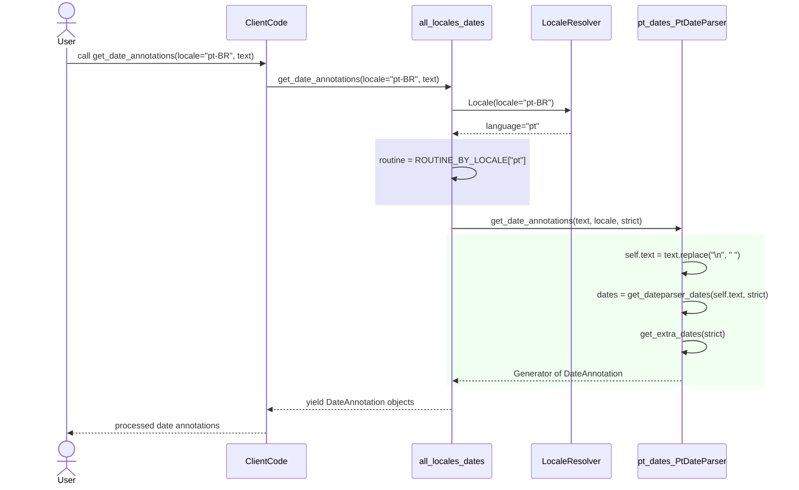
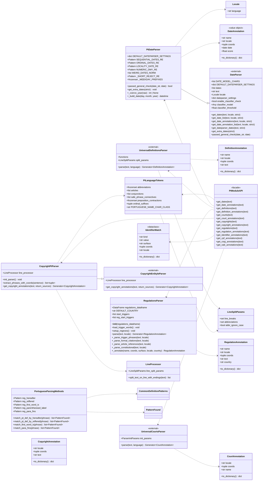

# PR Comments Export

> Exported from [https://github.com/arthrod/lexpredict-lexnlp/pull/19](https://github.com/arthrod/lexpredict-lexnlp/pull/19)  
> 64 of 64 comments selected  
> Generated by [Cicero](https://cicero.im) on 4/23/2026, 9:25:44 PM

---

### coderabbitai[bot] &mdash; 4/21/2026, 4:30:14 AM

**Actionable comments posted: 19**

<details>
<summary>🧹 Nitpick comments (11)</summary><blockquote>

<details>
<summary>lexnlp/extract/common/annotations/tests/test_pr16_annotation_ctors.py (1)</summary><blockquote>

`347-352`: **Make date cite-parts assertion less order-coupled**

`assert "2023-12-31" in parts[0]` can fail on harmless ordering changes. Prefer asserting membership across all parts.

<details>
<summary>Suggested tweak</summary>

```diff
     def test_get_cite_value_parts_with_date(self) -> None:
         d = date(2023, 12, 31)
         ann = DateAnnotation(coords=(0, 10), date=d)
         parts = ann.get_cite_value_parts()
-        assert "2023-12-31" in parts[0]
+        assert any("2023-12-31" in p for p in parts)
```
</details>

<details>
<summary>🤖 Prompt for AI Agents</summary>

```
Verify each finding against the current code and only fix it if needed.

In `@lexnlp/extract/common/annotations/tests/test_pr16_annotation_ctors.py` around
lines 347 - 352, The test test_get_cite_value_parts_with_date is brittle because
it asserts the date string appears specifically in parts[0]; update the
assertion to check membership across all returned parts from
ann.get_cite_value_parts() so ordering won't break the test — for example,
replace the parts[0] check with a predicate that asserts any part in parts
contains "2023-12-31" (reference DateAnnotation and get_cite_value_parts as the
affected symbols).
```

</details>

</blockquote></details>
<details>
<summary>lexnlp/extract/common/us_states.py (1)</summary><blockquote>

`74-91`: **Bound `lookup_state` cache size to avoid memory growth on noisy corpora.**

Using `@cache` here can retain every unique token forever. In extraction pipelines with many unique strings, this can become an unnecessary long-lived memory sink.


<details>
<summary>Proposed change</summary>

```diff
-from functools import cache, lru_cache
+from functools import lru_cache
...
-@cache
+@lru_cache(maxsize=4096)
 def lookup_state(text: str) -> StateInfo | None:
```
</details>

<details>
<summary>🤖 Prompt for AI Agents</summary>

```
Verify each finding against the current code and only fix it if needed.

In `@lexnlp/extract/common/us_states.py` around lines 74 - 91, The unbounded
`@cache` on lookup_state can grow indefinitely; replace it with a bounded LRU
cache (e.g., functools.lru_cache(maxsize=...) ) on the lookup_state function to
limit memory use while keeping caching behavior; update the decorator applied to
lookup_state and ensure the function signature and return type remain unchanged
(StateInfo | None) and that keys still normalize via key =
text.strip().upper().rstrip("."); pick a sensible maxsize (e.g., 1024 or
configurable) to balance hit-rate vs memory.
```

</details>

</blockquote></details>
<details>
<summary>lexnlp/extract/common/preprocessing/html_cleaner.py (1)</summary><blockquote>

`75-77`: **Consider extracting shared noise-tag stripping into one private helper.**

The same tag-decomposition loop appears twice; centralizing it reduces drift risk.


<details>
<summary>♻️ Proposed refactor</summary>

```diff
+def _drop_noise_tags(soup: BeautifulSoup, tags: Iterable[str] = _NOISE_TAGS) -> None:
+    for tag in soup.find_all(tuple(tags)):
+        tag.decompose()
+
+
 def html_to_text(
@@
     if not html:
         return ""
     soup = BeautifulSoup(html, parser or _DEFAULT_PARSER)
-    for tag in soup.find_all(_NOISE_TAGS):
-        tag.decompose()
+    _drop_noise_tags(soup)
     return soup.get_text(separator=separator, strip=strip)
@@
     if not html:
         return []
     soup = BeautifulSoup(html, parser or _DEFAULT_PARSER)
-    for tag in soup.find_all(_NOISE_TAGS):
-        tag.decompose()
+    _drop_noise_tags(soup)
     fragments: list[str] = []
```
</details>


Also applies to: 135-137

<details>
<summary>🤖 Prompt for AI Agents</summary>

```
Verify each finding against the current code and only fix it if needed.

In `@lexnlp/extract/common/preprocessing/html_cleaner.py` around lines 75 - 77,
Extract the repeated noise-tag removal into a single private helper (e.g.,
_strip_noise_tags) that accepts a BeautifulSoup object and runs the existing
loop over _NOISE_TAGS calling .decompose() on each tag; replace both inline
loops (the one after soup = BeautifulSoup(html, parser or _DEFAULT_PARSER) and
the other occurrence around lines 135–137) with calls to _strip_noise_tags(soup)
so all noise-stripping logic is centralized and reusable.
```

</details>

</blockquote></details>
<details>
<summary>lexnlp/ml/catalog/tests/test_download_path_normalization.py (1)</summary><blockquote>

`9-10`: **Stale docstring reference.**

The docstring mentions mocking `requests.get` but the tests now mock `_session`. Consider updating for accuracy.


<details>
<summary>📝 Suggested docstring update</summary>

```diff
-We mock out the network-touching ``requests.get`` so the test does not hit
+We mock out the network-touching ``_session`` so the test does not hit
 GitHub. The focus is on the filesystem branch.
```
</details>

<details>
<summary>🤖 Prompt for AI Agents</summary>

```
Verify each finding against the current code and only fix it if needed.

In `@lexnlp/ml/catalog/tests/test_download_path_normalization.py` around lines 9 -
10, Update the stale module-level docstring in
test_download_path_normalization.py: change the reference from mocking
`requests.get` to the current mock target `_session` (or explain that the
session object is mocked) so the docstring accurately describes the test setup;
ensure any explanatory sentence that mentions "network-touching requests.get" is
rewritten to mention the mocked `_session` used in the tests (or describe
mocking the HTTP session) and keep the intent that the test avoids hitting
GitHub and focuses on the filesystem branch.
```

</details>

</blockquote></details>
<details>
<summary>lexnlp/ml/catalog/download.py (1)</summary><blockquote>

`80-88`: **Consider thread-safety for the singleton pattern.**

The lazy initialization could allow concurrent threads to each create a session before one is assigned to `_SESSION`. While the impact is minimal (just an extra session object), adding a lock would make this more robust if the module is used in multi-threaded contexts.


<details>
<summary>🔧 Optional thread-safe implementation</summary>

```diff
+import threading
+
+_SESSION_LOCK = threading.Lock()
 _SESSION: Session | None = None


 def _session() -> Session:
     """Return a lazily-initialised, process-wide retry session."""
     global _SESSION
-    if _SESSION is None:
-        _SESSION = build_retry_session()
+    if _SESSION is None:
+        with _SESSION_LOCK:
+            if _SESSION is None:
+                _SESSION = build_retry_session()
     return _SESSION
```
</details>

<details>
<summary>🤖 Prompt for AI Agents</summary>

```
Verify each finding against the current code and only fix it if needed.

In `@lexnlp/ml/catalog/download.py` around lines 80 - 88, The lazy singleton
_session() can race across threads leading to multiple sessions being created;
make initialization thread-safe by introducing a module-level lock (e.g.,
threading.Lock) and use it around the creation path: check _SESSION, acquire the
lock, re-check _SESSION, and if still None call build_retry_session() and assign
to _SESSION, then release the lock; reference the _SESSION global, the
_session() function, and build_retry_session() when applying the change.
```

</details>

</blockquote></details>
<details>
<summary>lexnlp/extract/batch/pandas_output.py (1)</summary><blockquote>

`51-53`: **Docstring should match the stricter `coords` rule.**

Line 52-53 says fallback occurs when `coords` cannot be unpacked, but implementation now only accepts 2-element `tuple`/`list`. Please tighten wording so behavior is explicit.

<details>
<summary>🤖 Prompt for AI Agents</summary>

```
Verify each finding against the current code and only fix it if needed.

In `@lexnlp/extract/batch/pandas_output.py` around lines 51 - 53, Update the
docstring in pandas_output.py to explicitly state that coords must be a
2-element tuple or list (exactly two items) to be unpacked into start and end;
if coords is missing or is not a 2-element tuple/list, start and end will be set
to None. Mention the stricter acceptance (tuple/list of length 2) and that any
other types or lengths will fall back to None to match the current
implementation.
```

</details>

</blockquote></details>
<details>
<summary>lexnlp/extract/en/tests/test_citation_variations.py (1)</summary><blockquote>

`39-46`: **Add one deterministic positive-path assertion for known variations.**

Line 45 only checks tuple type; it won’t catch regressions where known variants resolve to empty tuples. Add one “known variant returns non-empty” assertion driven from `variation_map()`.


<details>
<summary>Patch suggestion</summary>

```diff
 class TestCanonicalFor:
@@
     def test_space_normalized_lookup(self) -> None:
@@
         assert isinstance(result, tuple)
+
+    def test_known_variant_resolves(self) -> None:
+        known_variant = next(iter(variation_map()))
+        assert canonical_for(known_variant) != ()
```
</details>

<details>
<summary>🤖 Prompt for AI Agents</summary>

```
Verify each finding against the current code and only fix it if needed.

In `@lexnlp/extract/en/tests/test_citation_variations.py` around lines 39 - 46,
Update test_space_normalized_lookup to include a deterministic positive-path
check: call variation_map() to pick a known canonical/variant pair and assert
that canonical_for(known_variant) returns a non-empty tuple (e.g., len(...) > 0)
in addition to the current isinstance check; this ensures canonical_for does not
regress to returning empty results for known variants — reference
variation_map(), canonical_for(), and the test_space_normalized_lookup function
when adding the assertion.
```

</details>

</blockquote></details>
<details>
<summary>lexnlp/extract/en/citation_variations.py (1)</summary><blockquote>

`75-79`: **Avoid linear scan for whitespace-normalized fallback lookups.**

Lines 77-79 perform an O(n) scan on every miss. A cached normalized index keeps behavior the same and reduces per-call overhead.


<details>
<summary>Patch suggestion</summary>

```diff
 `@lru_cache`(maxsize=1)
 def variation_map() -> dict[str, tuple[str, ...]]:
@@
     return result
+
+
+@lru_cache(maxsize=1)
+def _variation_map_no_spaces() -> dict[str, tuple[str, ...]]:
+    return {k.replace(" ", ""): v for k, v in variation_map().items()}
@@
 def canonical_for(variant: str) -> tuple[str, ...]:
@@
-    normalized = variant.replace(" ", "")
-    for variation, canons in variation_map().items():
-        if variation.replace(" ", "") == normalized:
-            return canons
-    return ()
+    return _variation_map_no_spaces().get(variant.replace(" ", ""), ())
```
</details>

<details>
<summary>🤖 Prompt for AI Agents</summary>

```
Verify each finding against the current code and only fix it if needed.

In `@lexnlp/extract/en/citation_variations.py` around lines 75 - 79, The current
fallback lookup does a linear scan over variation_map() comparing
variation.replace(" ", "") to normalized, causing O(n) work per miss; instead
build and cache a normalized index (e.g., a dict mapping variation.replace(" ",
"") -> canons) once and reuse it for lookups. Add a module-level or
variation_map()-adjacent cache (e.g., _normalized_variation_index) and populate
it by iterating variation_map().items() once, using the same normalization
(variant.replace(" ", "")) as in the existing code, then change the lookup to
consult the cached index (falling back to the original map only if needed).
Ensure cache is built lazily or at import time and update references to
normalized and variation_map() so callers get identical behavior but O(1)
normalized lookups.
```

</details>

</blockquote></details>
<details>
<summary>lexnlp/extract/common/tests/test_countries.py (1)</summary><blockquote>

`49-54`: **Tighten the `max_results` contract assertion.**

Consider asserting the returned tuple length is bounded (`len(matches) <= 3`) so the test verifies limit behavior, not just content presence.

<details>
<summary>🤖 Prompt for AI Agents</summary>

```
Verify each finding against the current code and only fix it if needed.

In `@lexnlp/extract/common/tests/test_countries.py` around lines 49 - 54, The test
test_multiple_matches_when_requested currently only checks content but not that
the max_results parameter is honored; update the test for fuzzy_country in that
function to also assert the result count is bounded by the requested limit
(e.g., assert len(matches) <= 3) while preserving the existing assertion that at
least one returned name contains "United". Ensure the additional assertion is
placed after matches is computed and before/after the existing name-content
check so the test verifies both limit behavior and content.
```

</details>

</blockquote></details>
<details>
<summary>lexnlp/extract/batch/async_extract.py (1)</summary><blockquote>

`292-298`: **`adaptive_max_workers` missing from `__all__`.**

The function `adaptive_max_workers` is defined in this module and imported by `__init__.py`, but it's not listed in this module's `__all__`. While not strictly required (since `__init__.py` handles re-export), adding it to `__all__` would make the module's public API self-documenting.


<details>
<summary>♻️ Suggested addition</summary>

```diff
 __all__ = [
     "BatchExtractionResult",
+    "adaptive_max_workers",
     "extract_batch",
     "extract_batch_async",
     "flatten",
     "group_successful",
 ]
```
</details>

<details>
<summary>🤖 Prompt for AI Agents</summary>

```
Verify each finding against the current code and only fix it if needed.

In `@lexnlp/extract/batch/async_extract.py` around lines 292 - 298, The module's
public API list is missing adaptive_max_workers; add the symbol
"adaptive_max_workers" to the __all__ list in
lexnlp/extract/batch/async_extract.py so the module self-documents that function
(update the existing __all__ list containing
"BatchExtractionResult","extract_batch","extract_batch_async","flatten","group_successful"
to include "adaptive_max_workers").
```

</details>

</blockquote></details>
<details>
<summary>lexnlp/extract/batch/tests/test_pr16_progress_supplementary.py (1)</summary><blockquote>

`31-34`: **Consider adding `skip-audit` annotation for version skip.**

The `skipif` marker for Python < 3.12 is legitimate (PEP 695 syntax requirement), but per coding guidelines, skip markers should include `skip-audit: issue=<link-or-id> expires=YYYY-MM-DD` for documentation. Since this is a permanent language requirement rather than a temporary blocker, consider adding a brief annotation:

```python
pytestmark = pytest.mark.skipif(
    sys.version_info < (3, 12),
    reason="progress.py uses PEP 695 syntax (Python 3.12+)",  # skip-audit: permanent language requirement
)
```

<details>
<summary>🤖 Prompt for AI Agents</summary>

```
Verify each finding against the current code and only fix it if needed.

In `@lexnlp/extract/batch/tests/test_pr16_progress_supplementary.py` around lines
31 - 34, The pytest skip marker (pytestmark using pytest.mark.skipif) for Python
< 3.12 needs a skip-audit annotation for traceability; update the pytestmark
skipif block (the pytestmark variable and its reason string) to include a
skip-audit note such as "skip-audit: permanent language requirement" appended to
the reason or as a trailing comment so the skip is documented with issue/id and
expiry info (use expires=YYYY-MM-DD or indicate permanent) per project
guidelines.
```

</details>

</blockquote></details>

</blockquote></details>

<details>
<summary>🤖 Prompt for all review comments with AI agents</summary>

```
Verify each finding against the current code and only fix it if needed.

Inline comments:
In `@lexnlp/extract/batch/__init__.py`:
- Around line 39-61: Remove the now-internal symbols from the package exports:
delete the imports of FuzzyPatternMatch, find_fuzzy_cusips, find_fuzzy_money,
and extract_batch_with_progress at the top of lexnlp.extract.batch.__init__ and
remove the entries "FuzzyPatternMatch", "find_fuzzy_cusips", "find_fuzzy_money",
and "extract_batch_with_progress" from the __all__ list; additionally remove
"adaptive_max_workers", "flatten", and "group_successful" from __all__ (and
their imports if present) so the module's public API matches TestRemovedExports
(keep only the intended public names like BatchExtractionResult, FuzzyDateMatch,
annotations_to_dataframe, extract_batch, extract_batch_async, find_fuzzy_dates).

In `@lexnlp/extract/batch/tests/test_batch_init.py`:
- Around line 98-109: The test expects several exports to be removed but they
still exist: update lexnlp.extract.batch.__all__ to remove the symbols
adaptive_max_workers, flatten, group_successful, FuzzyPatternMatch,
find_fuzzy_cusips, find_fuzzy_money, extract_batch_with_progress (or
alternatively update TestRemovedExports/test_all_contains_exactly_six_names to
reflect the true public API), and delete or stop importing the modules
fuzzy_patterns.py and progress.py (or adjust tests to allow them). Also add
inline justification comments next to each # noqa: F401 in the test methods
mentioned so the linter suppression documents why the unused imports are kept.
Ensure changes reference the TestRemovedExports class and
test_all_contains_exactly_six_names so tests and source stay consistent.

In `@lexnlp/extract/batch/tests/test_pr16_batch_init_supplementary.py`:
- Around line 176-177: The test sets m.start = 5 with a type ignore but lacks
the required inline justification; update the assignment line (the m.start = 5
statement in the test_pr16_batch_init_supplementary.py test) to keep type:
ignore[misc] but append a brief justification comment explaining why the
suppression is safe (e.g. "# type: ignore[misc]  # test intentionally assigns
int to trigger AttributeError/TypeError for negative-path validation"). Ensure
the justification mentions the intent to trigger the exception so linters have
context.
- Around line 32-35: The pytest skipif marker assigned to pytestmark currently
lacks the required inline skip-audit metadata; update the pytest.mark.skipif
usage (the pytestmark assignment) to include an inline annotation comment
following the project's format (e.g., "skip-audit: issue=<link-or-id>
expires=YYYY-MM-DD") so the skip reason and expiry are trackable—keep the
condition (sys.version_info < (3, 12)) and reason text, and add the audit
annotation directly adjacent to the marker declaration.

In `@lexnlp/extract/batch/tests/test_pr16_fuzzy_dates_pattern.py`:
- Around line 41-42: The newly added "# type: ignore[arg-type]" on the
importlib.module creation line and "# type: ignore[union-attr]" on the
_spec.loader.exec_module line need inline justifications per PR suppression
policy; update the two suppressions next to
importlib.util.module_from_spec(_spec) and _spec.loader.exec_module(_mod) to
include short reasons (e.g., why the type checker is wrong or unsafe cast is
intentional), so each "# type: ignore[...]" contains a concise explanatory
comment describing the specific false positive or intentional deviation.
- Around line 114-119: The current assertion in
test_space_separator_matched_with_budget is too weak; replace the no-op
isinstance check with a concrete expectation that find_fuzzy_dates actually
returned a match: assert that matches is non-empty (e.g., len(matches) > 0) and
optionally verify the first match contains the expected date substring (e.g.,
check that any(m.text for m in matches) or that the first match text includes
"2024" and "03" and "15"); update the assertion in
test_space_separator_matched_with_budget that calls find_fuzzy_dates to require
at least one candidate and/or validate the matched text to ensure the fuzzy
substitution ('-' → ' ') was recognized.

In `@lexnlp/extract/batch/tests/test_pr16_fuzzy_dates_supplementary.py`:
- Around line 32-33: The new "# type: ignore[arg-type]" and "# type:
ignore[union-attr]" suppressions on the importlib calls (module_from_spec and
_spec.loader.exec_module) lack the required inline justification; update those
comments to either remove the suppression if mypy/flake issues can be addressed
directly, or append a concise rationale after each suppression (for example: "#
type: ignore[arg-type]  # importlib API is dynamically typed here; see PEP 451"
and "# type: ignore[union-attr]  # loader may be None at type-check time but
checked at runtime"), and do the same for the other suppression at the location
around line with symbol(s) referenced in the test file; ensure every "# type:
ignore[...]" has a short inline justification or is eliminated.

In `@lexnlp/extract/batch/tests/test_pr16_pandas_isinstance.py`:
- Around line 39-45: The two unjustified "type: ignore" suppressions on the
dynamic import block should be removed and replaced with a runtime guard: check
that the result of importlib.util.spec_from_file_location (named _spec) is not
None and that _spec.loader exists before calling _spec.loader.exec_module on the
module created by importlib.util.module_from_spec (named _mod); if either is
missing, raise or fail the test with a clear error message so the type checker
no longer needs ignores and the runtime is safe. Ensure you update the lines
that call importlib.util.spec_from_file_location,
importlib.util.module_from_spec, and _spec.loader.exec_module to use that guard
and drop the inline "type: ignore" comments (or add a one-line justification
comment if you must keep a suppression).

In `@lexnlp/extract/batch/tests/test_pr16_pandas_supplementary.py`:
- Around line 32-40: The new noqa suppressions (e.g., the "noqa: E402" on the
import pandas as pd line and any other added "# noqa" tokens in this test such
as on the dynamic import block _spec/_mod) lack the required inline
justification and the PR now exceeds the >3-new-suppressions warning; update
each suppression to include a short inline justification comment (for example:
"# noqa: E402  # justification: dynamic import required for test to bypass
package __init__") and either remove/reduce unnecessary suppressions so the PR
stays within the allowed count or add equivalent justifications for every
remaining suppression across this PR, ensuring every "# noqa" contains a
one-line reason referencing the dynamic import/pandas usage where applicable.

In `@lexnlp/extract/batch/tests/test_progress.py`:
- Around line 13-14: The test import fails because lexnlp.extract.batch.progress
and lexnlp.extract.batch.async_extract use PEP 695 syntax (e.g., def func[T]:
and class Foo[T]:) which is invalid on Python 3.10/3.11; update those modules to
use Python 3.10-compatible typing (declare a TypeVar and use Generic or explicit
type parameters) or gate the new syntax behind a runtime/version check with from
__future__ import annotations and conditional definitions. Specifically, change
any occurrences in async_extract (e.g., adaptive_max_workers) and progress
(e.g., extract_batch_with_progress, any class Foo[T] or def func[T]) to use
TypeVar + Generic or non-PEP695 signatures so the files import cleanly on Python
>=3.10,<3.13.

In `@lexnlp/extract/common/countries.py`:
- Around line 81-103: In fuzzy_country, validate the max_results parameter (it
must be a positive integer) to avoid surprising slicing behavior; if max_results
is not an int or is <= 0 raise a ValueError with a clear message (e.g.,
"max_results must be a positive integer"), then proceed to call
pycountry.countries.search_fuzzy(text.strip()) and return
tuple(_country_to_info(m) for m in matches[:max_results]); ensure the function
signature and docstring reflect the constraint and keep references to
fuzzy_country, max_results, pycountry.countries.search_fuzzy, and
_country_to_info so the change is easy to locate.
- Around line 24-25: The code uses an unbounded decorator import (cache) which
can lead to unbounded memory growth for free-form inputs; replace the use of
`@cache` on lookup_country with `@lru_cache`(maxsize=4096) and replace `@cache` on
fuzzy_country with `@lru_cache`(maxsize=2048), update the import to remove cache
and keep lru_cache only (from functools import lru_cache), and ensure the
decorator names match exactly on the functions lookup_country and fuzzy_country
so the bounded LRU caches are applied.

In `@lexnlp/extract/common/tests/test_us_states.py`:
- Around line 50-51: The test contains a tautological assertion using
lookup_state("calif.") that always passes; replace it with a meaningful check by
either asserting the expected normalized result (e.g., assert
lookup_state("calif.") == <expected_value>) or, if the intent is only to ensure
no exception, call lookup_state("calif.") once without an assertion; update the
test in test_us_states.py to remove the always-true assert and use lookup_state
as described (reference: the lookup_state function and the test_us_states.py
test).

In `@lexnlp/extract/de/de_date_parser.py`:
- Around line 156-158: The code calls re.sub(CUSTOM_DATES_SEPARATOR, '\n',
self.text) without ensuring self.text is set, which causes a TypeError when text
is None and no prior buffer exists; in the method/initializer containing this
block (where self.text and CUSTOM_DATES_SEPARATOR are used) add a guard after
the optional assignment: if self.text is None raise a RuntimeError with a clear
message (or alternatively skip the re.sub when self.text is None), otherwise
call re.sub; reference self.text, CUSTOM_DATES_SEPARATOR and the re.sub call to
locate and fix the logic.

In `@lexnlp/extract/en/citation_variations.py`:
- Line 37: The import line that aliases VARIATIONS to _VARIATIONS_RAW currently
uses a bare suppression "# type: ignore[attr-defined]" without an inline
justification; update that exact import (the "from reporters_db import
VARIATIONS as _VARIATIONS_RAW" line) to keep the suppression but append a short
rationale on the same line (e.g. indicate backwards-compatibility with older
reporters_db releases that may not define VARIATIONS) so the "# type:
ignore[attr-defined]" has an inline justification explaining why the attr might
be missing.

In `@lexnlp/ml/model_io.py`:
- Around line 72-78: The current pickle fallback only tries joblib when
_looks_like_joblib_pickle(path) detects zlib-compressed payloads; change the
except block in the load routine that calls pickle.load(file) so that on any
caught exception (pickle.UnpicklingError, ValueError, EOFError, AttributeError)
it unconditionally attempts to load via joblib (call _load_legacy_joblib(path)
or joblib.load equivalent) and only re-raises the original exception if the
joblib load also fails; keep the existing debug log but remove the zlib-only
guard (update or remove _looks_like_joblib_pickle usage in that path) and add a
regression test that creates a model with joblib.dump(..., compress=0) and
verifies the loader recovers it.

In `@lexnlp/utils/caching.py`:
- Around line 58-67: Update the suppression comment on the return in the cache
decorator: add a short inline justification to the existing “# type:
ignore[return-value]” explaining that get_memory().cache(func) returns a wrapper
that may not preserve the exact callable signature (so the type checker cannot
verify the original generic F return type). Edit the return line in function
cache (the def cache[F: Callable[..., Any]] decorator) to append a brief
justification comment after the type ignore.

In `@lexnlp/utils/tests/test_caching.py`:
- Around line 53-56: The existing assertion allows too much slack (assert
calls.count(7) <= 2) so the test would pass even if caching never occurred;
change the assertion to assert calls.count(7) == 1 to require exactly one actual
execution of the function (the initial run) and ensure the second call came from
the cache; update the nearby comment in test_caching.py accordingly to reflect
the exact expectation and reference the calls list used in the test.

In `@lexnlp/utils/tests/test_pandas_config.py`:
- Around line 32-36: The two broad except blocks around the pandas config
restore (the try/except that sets pd.options.future.infer_string and the earlier
general except) must be fixed: either narrow them to specific exception types
(e.g., except AttributeError, KeyError) that you expect when reading/writing
pd.options.future.infer_string, or keep the broad except but add an inline
justification comment after each "# noqa: BLE001" explaining why a catch-all is
required (for example: "# noqa: BLE001  # ensure test teardown never fails if
pandas removes option or raises unexpected error"). Update the except clauses in
test_pandas_config.py (the blocks dealing with previous_infer and
pd.options.future.infer_string) accordingly.

---

Nitpick comments:
In `@lexnlp/extract/batch/async_extract.py`:
- Around line 292-298: The module's public API list is missing
adaptive_max_workers; add the symbol "adaptive_max_workers" to the __all__ list
in lexnlp/extract/batch/async_extract.py so the module self-documents that
function (update the existing __all__ list containing
"BatchExtractionResult","extract_batch","extract_batch_async","flatten","group_successful"
to include "adaptive_max_workers").

In `@lexnlp/extract/batch/pandas_output.py`:
- Around line 51-53: Update the docstring in pandas_output.py to explicitly
state that coords must be a 2-element tuple or list (exactly two items) to be
unpacked into start and end; if coords is missing or is not a 2-element
tuple/list, start and end will be set to None. Mention the stricter acceptance
(tuple/list of length 2) and that any other types or lengths will fall back to
None to match the current implementation.

In `@lexnlp/extract/batch/tests/test_pr16_progress_supplementary.py`:
- Around line 31-34: The pytest skip marker (pytestmark using
pytest.mark.skipif) for Python < 3.12 needs a skip-audit annotation for
traceability; update the pytestmark skipif block (the pytestmark variable and
its reason string) to include a skip-audit note such as "skip-audit: permanent
language requirement" appended to the reason or as a trailing comment so the
skip is documented with issue/id and expiry info (use expires=YYYY-MM-DD or
indicate permanent) per project guidelines.

In `@lexnlp/extract/common/annotations/tests/test_pr16_annotation_ctors.py`:
- Around line 347-352: The test test_get_cite_value_parts_with_date is brittle
because it asserts the date string appears specifically in parts[0]; update the
assertion to check membership across all returned parts from
ann.get_cite_value_parts() so ordering won't break the test — for example,
replace the parts[0] check with a predicate that asserts any part in parts
contains "2023-12-31" (reference DateAnnotation and get_cite_value_parts as the
affected symbols).

In `@lexnlp/extract/common/preprocessing/html_cleaner.py`:
- Around line 75-77: Extract the repeated noise-tag removal into a single
private helper (e.g., _strip_noise_tags) that accepts a BeautifulSoup object and
runs the existing loop over _NOISE_TAGS calling .decompose() on each tag;
replace both inline loops (the one after soup = BeautifulSoup(html, parser or
_DEFAULT_PARSER) and the other occurrence around lines 135–137) with calls to
_strip_noise_tags(soup) so all noise-stripping logic is centralized and
reusable.

In `@lexnlp/extract/common/tests/test_countries.py`:
- Around line 49-54: The test test_multiple_matches_when_requested currently
only checks content but not that the max_results parameter is honored; update
the test for fuzzy_country in that function to also assert the result count is
bounded by the requested limit (e.g., assert len(matches) <= 3) while preserving
the existing assertion that at least one returned name contains "United". Ensure
the additional assertion is placed after matches is computed and before/after
the existing name-content check so the test verifies both limit behavior and
content.

In `@lexnlp/extract/common/us_states.py`:
- Around line 74-91: The unbounded `@cache` on lookup_state can grow indefinitely;
replace it with a bounded LRU cache (e.g., functools.lru_cache(maxsize=...) ) on
the lookup_state function to limit memory use while keeping caching behavior;
update the decorator applied to lookup_state and ensure the function signature
and return type remain unchanged (StateInfo | None) and that keys still
normalize via key = text.strip().upper().rstrip("."); pick a sensible maxsize
(e.g., 1024 or configurable) to balance hit-rate vs memory.

In `@lexnlp/extract/en/citation_variations.py`:
- Around line 75-79: The current fallback lookup does a linear scan over
variation_map() comparing variation.replace(" ", "") to normalized, causing O(n)
work per miss; instead build and cache a normalized index (e.g., a dict mapping
variation.replace(" ", "") -> canons) once and reuse it for lookups. Add a
module-level or variation_map()-adjacent cache (e.g.,
_normalized_variation_index) and populate it by iterating
variation_map().items() once, using the same normalization (variant.replace(" ",
"")) as in the existing code, then change the lookup to consult the cached index
(falling back to the original map only if needed). Ensure cache is built lazily
or at import time and update references to normalized and variation_map() so
callers get identical behavior but O(1) normalized lookups.

In `@lexnlp/extract/en/tests/test_citation_variations.py`:
- Around line 39-46: Update test_space_normalized_lookup to include a
deterministic positive-path check: call variation_map() to pick a known
canonical/variant pair and assert that canonical_for(known_variant) returns a
non-empty tuple (e.g., len(...) > 0) in addition to the current isinstance
check; this ensures canonical_for does not regress to returning empty results
for known variants — reference variation_map(), canonical_for(), and the
test_space_normalized_lookup function when adding the assertion.

In `@lexnlp/ml/catalog/download.py`:
- Around line 80-88: The lazy singleton _session() can race across threads
leading to multiple sessions being created; make initialization thread-safe by
introducing a module-level lock (e.g., threading.Lock) and use it around the
creation path: check _SESSION, acquire the lock, re-check _SESSION, and if still
None call build_retry_session() and assign to _SESSION, then release the lock;
reference the _SESSION global, the _session() function, and
build_retry_session() when applying the change.

In `@lexnlp/ml/catalog/tests/test_download_path_normalization.py`:
- Around line 9-10: Update the stale module-level docstring in
test_download_path_normalization.py: change the reference from mocking
`requests.get` to the current mock target `_session` (or explain that the
session object is mocked) so the docstring accurately describes the test setup;
ensure any explanatory sentence that mentions "network-touching requests.get" is
rewritten to mention the mocked `_session` used in the tests (or describe
mocking the HTTP session) and keep the intent that the test avoids hitting
GitHub and focuses on the filesystem branch.
```

</details>

<details>
<summary>🪄 Autofix (Beta)</summary>

Fix all unresolved CodeRabbit comments on this PR:

- [ ] <!-- {"checkboxId": "4b0d0e0a-96d7-4f10-b296-3a18ea78f0b9"} --> Push a commit to this branch (recommended)
- [ ] <!-- {"checkboxId": "ff5b1114-7d8c-49e6-8ac1-43f82af23a33"} --> Create a new PR with the fixes

</details>

---

<details>
<summary>ℹ️ Review info</summary>

<details>
<summary>⚙️ Run configuration</summary>

**Configuration used**: Organization UI

**Review profile**: CHILL

**Plan**: Pro

**Run ID**: `bfc04e9b-eb25-4145-8350-50b412c09f25`

</details>

<details>
<summary>📥 Commits</summary>

Reviewing files that changed from the base of the PR and between 95e9791c76a8ea6fd662e39b6b22b5bc67e1709f and 4add4773836f37f5b873c21523cec423308b2d3a.

</details>

<details>
<summary>📒 Files selected for processing (51)</summary>

* `.github/workflows/ci.yml`
* `lexnlp/extract/batch/__init__.py`
* `lexnlp/extract/batch/async_extract.py`
* `lexnlp/extract/batch/fuzzy_dates.py`
* `lexnlp/extract/batch/fuzzy_patterns.py`
* `lexnlp/extract/batch/pandas_output.py`
* `lexnlp/extract/batch/progress.py`
* `lexnlp/extract/batch/tests/test_async_extras.py`
* `lexnlp/extract/batch/tests/test_batch_init.py`
* `lexnlp/extract/batch/tests/test_fuzzy_patterns.py`
* `lexnlp/extract/batch/tests/test_pr16_adaptive_workers.py`
* `lexnlp/extract/batch/tests/test_pr16_batch_init_supplementary.py`
* `lexnlp/extract/batch/tests/test_pr16_fuzzy_dates_pattern.py`
* `lexnlp/extract/batch/tests/test_pr16_fuzzy_dates_supplementary.py`
* `lexnlp/extract/batch/tests/test_pr16_fuzzy_patterns_supplementary.py`
* `lexnlp/extract/batch/tests/test_pr16_pandas_isinstance.py`
* `lexnlp/extract/batch/tests/test_pr16_pandas_supplementary.py`
* `lexnlp/extract/batch/tests/test_pr16_progress_supplementary.py`
* `lexnlp/extract/batch/tests/test_progress.py`
* `lexnlp/extract/common/annotations/tests/test_pr16_annotation_ctors.py`
* `lexnlp/extract/common/countries.py`
* `lexnlp/extract/common/dates.py`
* `lexnlp/extract/common/preprocessing/__init__.py`
* `lexnlp/extract/common/preprocessing/html_cleaner.py`
* `lexnlp/extract/common/preprocessing/tests/__init__.py`
* `lexnlp/extract/common/preprocessing/tests/test_html_cleaner.py`
* `lexnlp/extract/common/tests/test_countries.py`
* `lexnlp/extract/common/tests/test_us_states.py`
* `lexnlp/extract/common/us_states.py`
* `lexnlp/extract/de/dates.py`
* `lexnlp/extract/de/de_date_parser.py`
* `lexnlp/extract/en/citation_variations.py`
* `lexnlp/extract/en/date_model.py`
* `lexnlp/extract/en/tests/test_citation_variations.py`
* `lexnlp/ml/catalog/download.py`
* `lexnlp/ml/catalog/tests/test_download_path_normalization.py`
* `lexnlp/ml/model_io.py`
* `lexnlp/ml/sklearn_config.py`
* `lexnlp/ml/tests/test_download_retry.py`
* `lexnlp/ml/tests/test_model_io.py`
* `lexnlp/ml/tests/test_sklearn_config.py`
* `lexnlp/nlp/en/segments/pages.py`
* `lexnlp/nlp/en/segments/paragraphs.py`
* `lexnlp/nlp/en/segments/sections.py`
* `lexnlp/nlp/en/segments/sentences.py`
* `lexnlp/nlp/en/segments/titles.py`
* `lexnlp/nlp/train/en/train_section_segmanizer.py`
* `lexnlp/utils/caching.py`
* `lexnlp/utils/pandas_config.py`
* `lexnlp/utils/tests/test_caching.py`
* `lexnlp/utils/tests/test_pandas_config.py`

</details>

<details>
<summary>✅ Files skipped from review due to trivial changes (6)</summary>

* lexnlp/nlp/en/segments/pages.py
* lexnlp/nlp/train/en/train_section_segmanizer.py
* lexnlp/extract/common/preprocessing/__init__.py
* lexnlp/ml/tests/test_download_retry.py
* lexnlp/extract/common/preprocessing/tests/test_html_cleaner.py
* lexnlp/extract/batch/tests/test_pr16_fuzzy_patterns_supplementary.py

</details>

<details>
<summary>🚧 Files skipped from review as they are similar to previous changes (2)</summary>

* lexnlp/extract/batch/tests/test_async_extras.py
* lexnlp/extract/common/dates.py

</details>

</details>

<details>
<summary>📜 Review details</summary>

<details>
<summary>🧰 Additional context used</summary>

<details>
<summary>📓 Path-based instructions (9)</summary>

<details>
<summary>**/*.{py,ts,tsx}</summary>


**📄 CodeRabbit inference engine (Custom checks)**

> `**/*.{py,ts,tsx}`: Identify changed production files and verify corresponding test changes. FAIL if a changed production file has zero associated test file AND introduces new exported functions, classes, or public methods. Exceptions: config files, .d.ts files, migrations, generated code.
> No lint suppression creep: Scan diff for newly added suppression comments. Python: # noqa, # type: ignore. TypeScript: // biome-ignore, // eslint-disable, `@ts-ignore`, `@ts-expect-error`, // oxlint-ignore. Each suppression MUST have inline justification comment. FAIL if any suppression lacks justification. WARN if total new suppressions > 3 in PR.
> Import ordering and dead imports check: Python - run `uv run ruff check --select I,F401 .`. TypeScript - run `bun run biome check --formatter-enabled=false --linter-enabled=false --organize-imports-enabled=true .`. FAIL if violations found.

Files:
- `lexnlp/extract/batch/fuzzy_dates.py`
- `lexnlp/extract/batch/pandas_output.py`
- `lexnlp/nlp/en/segments/sentences.py`
- `lexnlp/ml/catalog/tests/test_download_path_normalization.py`
- `lexnlp/extract/de/dates.py`
- `lexnlp/nlp/en/segments/paragraphs.py`
- `lexnlp/nlp/en/segments/titles.py`
- `lexnlp/extract/en/tests/test_citation_variations.py`
- `lexnlp/extract/batch/tests/test_progress.py`
- `lexnlp/ml/tests/test_sklearn_config.py`
- `lexnlp/extract/en/date_model.py`
- `lexnlp/extract/batch/tests/test_pr16_adaptive_workers.py`
- `lexnlp/utils/tests/test_caching.py`
- `lexnlp/utils/tests/test_pandas_config.py`
- `lexnlp/extract/batch/tests/test_fuzzy_patterns.py`
- `lexnlp/extract/common/tests/test_countries.py`
- `lexnlp/ml/tests/test_model_io.py`
- `lexnlp/ml/model_io.py`
- `lexnlp/extract/batch/async_extract.py`
- `lexnlp/extract/common/tests/test_us_states.py`
- `lexnlp/ml/sklearn_config.py`
- `lexnlp/extract/de/de_date_parser.py`
- `lexnlp/extract/batch/__init__.py`
- `lexnlp/utils/pandas_config.py`
- `lexnlp/extract/en/citation_variations.py`
- `lexnlp/nlp/en/segments/sections.py`
- `lexnlp/extract/batch/tests/test_pr16_fuzzy_dates_supplementary.py`
- `lexnlp/ml/catalog/download.py`
- `lexnlp/extract/batch/tests/test_pr16_progress_supplementary.py`
- `lexnlp/extract/batch/tests/test_pr16_pandas_isinstance.py`
- `lexnlp/extract/batch/progress.py`
- `lexnlp/extract/batch/tests/test_pr16_batch_init_supplementary.py`
- `lexnlp/utils/caching.py`
- `lexnlp/extract/common/annotations/tests/test_pr16_annotation_ctors.py`
- `lexnlp/extract/batch/tests/test_pr16_pandas_supplementary.py`
- `lexnlp/extract/common/countries.py`
- `lexnlp/extract/batch/fuzzy_patterns.py`
- `lexnlp/extract/common/preprocessing/html_cleaner.py`
- `lexnlp/extract/common/us_states.py`
- `lexnlp/extract/batch/tests/test_pr16_fuzzy_dates_pattern.py`
- `lexnlp/extract/batch/tests/test_batch_init.py`

</details>
<details>
<summary>**/*.py</summary>


**📄 CodeRabbit inference engine (Custom checks)**

> `**/*.py`: Python lint with ruff: Run `uv run ruff check . --diff` and `uv run ruff format --check --diff .`. FAIL if exit code != 0 for either.
> Python type checking: Run `uv run ty check` (or fallback to mypy/pyright if configured). FAIL if exit code != 0. If no type checker configured, FAIL with 'No Python type checker configured. Add ty to dev dependencies.'
> Strict null/undefined audit for Python: Scan diff for new bare `type: ignore` without error code and `cast()` calls without explanation comment. WARN for each. FAIL if bare `type: ignore` count > 3.

Files:
- `lexnlp/extract/batch/fuzzy_dates.py`
- `lexnlp/extract/batch/pandas_output.py`
- `lexnlp/nlp/en/segments/sentences.py`
- `lexnlp/ml/catalog/tests/test_download_path_normalization.py`
- `lexnlp/extract/de/dates.py`
- `lexnlp/nlp/en/segments/paragraphs.py`
- `lexnlp/nlp/en/segments/titles.py`
- `lexnlp/extract/en/tests/test_citation_variations.py`
- `lexnlp/extract/batch/tests/test_progress.py`
- `lexnlp/ml/tests/test_sklearn_config.py`
- `lexnlp/extract/en/date_model.py`
- `lexnlp/extract/batch/tests/test_pr16_adaptive_workers.py`
- `lexnlp/utils/tests/test_caching.py`
- `lexnlp/utils/tests/test_pandas_config.py`
- `lexnlp/extract/batch/tests/test_fuzzy_patterns.py`
- `lexnlp/extract/common/tests/test_countries.py`
- `lexnlp/ml/tests/test_model_io.py`
- `lexnlp/ml/model_io.py`
- `lexnlp/extract/batch/async_extract.py`
- `lexnlp/extract/common/tests/test_us_states.py`
- `lexnlp/ml/sklearn_config.py`
- `lexnlp/extract/de/de_date_parser.py`
- `lexnlp/extract/batch/__init__.py`
- `lexnlp/utils/pandas_config.py`
- `lexnlp/extract/en/citation_variations.py`
- `lexnlp/nlp/en/segments/sections.py`
- `lexnlp/extract/batch/tests/test_pr16_fuzzy_dates_supplementary.py`
- `lexnlp/ml/catalog/download.py`
- `lexnlp/extract/batch/tests/test_pr16_progress_supplementary.py`
- `lexnlp/extract/batch/tests/test_pr16_pandas_isinstance.py`
- `lexnlp/extract/batch/progress.py`
- `lexnlp/extract/batch/tests/test_pr16_batch_init_supplementary.py`
- `lexnlp/utils/caching.py`
- `lexnlp/extract/common/annotations/tests/test_pr16_annotation_ctors.py`
- `lexnlp/extract/batch/tests/test_pr16_pandas_supplementary.py`
- `lexnlp/extract/common/countries.py`
- `lexnlp/extract/batch/fuzzy_patterns.py`
- `lexnlp/extract/common/preprocessing/html_cleaner.py`
- `lexnlp/extract/common/us_states.py`
- `lexnlp/extract/batch/tests/test_pr16_fuzzy_dates_pattern.py`
- `lexnlp/extract/batch/tests/test_batch_init.py`

</details>
<details>
<summary>**/*.{py,toml,txt,yml}</summary>


**📄 CodeRabbit inference engine (AGENTS.md)**

> Use Python 3.11 as the default Python version for development (project supports >=3.10,<3.13)

Files:
- `lexnlp/extract/batch/fuzzy_dates.py`
- `lexnlp/extract/batch/pandas_output.py`
- `lexnlp/nlp/en/segments/sentences.py`
- `lexnlp/ml/catalog/tests/test_download_path_normalization.py`
- `lexnlp/extract/de/dates.py`
- `lexnlp/nlp/en/segments/paragraphs.py`
- `lexnlp/nlp/en/segments/titles.py`
- `lexnlp/extract/en/tests/test_citation_variations.py`
- `lexnlp/extract/batch/tests/test_progress.py`
- `lexnlp/ml/tests/test_sklearn_config.py`
- `lexnlp/extract/en/date_model.py`
- `lexnlp/extract/batch/tests/test_pr16_adaptive_workers.py`
- `lexnlp/utils/tests/test_caching.py`
- `lexnlp/utils/tests/test_pandas_config.py`
- `lexnlp/extract/batch/tests/test_fuzzy_patterns.py`
- `lexnlp/extract/common/tests/test_countries.py`
- `lexnlp/ml/tests/test_model_io.py`
- `lexnlp/ml/model_io.py`
- `lexnlp/extract/batch/async_extract.py`
- `lexnlp/extract/common/tests/test_us_states.py`
- `lexnlp/ml/sklearn_config.py`
- `lexnlp/extract/de/de_date_parser.py`
- `lexnlp/extract/batch/__init__.py`
- `lexnlp/utils/pandas_config.py`
- `lexnlp/extract/en/citation_variations.py`
- `lexnlp/nlp/en/segments/sections.py`
- `lexnlp/extract/batch/tests/test_pr16_fuzzy_dates_supplementary.py`
- `lexnlp/ml/catalog/download.py`
- `lexnlp/extract/batch/tests/test_pr16_progress_supplementary.py`
- `lexnlp/extract/batch/tests/test_pr16_pandas_isinstance.py`
- `lexnlp/extract/batch/progress.py`
- `lexnlp/extract/batch/tests/test_pr16_batch_init_supplementary.py`
- `lexnlp/utils/caching.py`
- `lexnlp/extract/common/annotations/tests/test_pr16_annotation_ctors.py`
- `lexnlp/extract/batch/tests/test_pr16_pandas_supplementary.py`
- `lexnlp/extract/common/countries.py`
- `lexnlp/extract/batch/fuzzy_patterns.py`
- `lexnlp/extract/common/preprocessing/html_cleaner.py`
- `lexnlp/extract/common/us_states.py`
- `lexnlp/extract/batch/tests/test_pr16_fuzzy_dates_pattern.py`
- `lexnlp/extract/batch/tests/test_batch_init.py`

</details>
<details>
<summary>{lexnlp/extract/**/*.py,test_data/**}</summary>


**📄 CodeRabbit inference engine (AGENTS.md)**

> When adding extraction patterns/models, include representative fixtures in `test_data/`

Files:
- `lexnlp/extract/batch/fuzzy_dates.py`
- `lexnlp/extract/batch/pandas_output.py`
- `lexnlp/extract/de/dates.py`
- `lexnlp/extract/en/tests/test_citation_variations.py`
- `lexnlp/extract/batch/tests/test_progress.py`
- `lexnlp/extract/en/date_model.py`
- `lexnlp/extract/batch/tests/test_pr16_adaptive_workers.py`
- `lexnlp/extract/batch/tests/test_fuzzy_patterns.py`
- `lexnlp/extract/common/tests/test_countries.py`
- `lexnlp/extract/batch/async_extract.py`
- `lexnlp/extract/common/tests/test_us_states.py`
- `lexnlp/extract/de/de_date_parser.py`
- `lexnlp/extract/batch/__init__.py`
- `lexnlp/extract/en/citation_variations.py`
- `lexnlp/extract/batch/tests/test_pr16_fuzzy_dates_supplementary.py`
- `lexnlp/extract/batch/tests/test_pr16_progress_supplementary.py`
- `lexnlp/extract/batch/tests/test_pr16_pandas_isinstance.py`
- `lexnlp/extract/batch/progress.py`
- `lexnlp/extract/batch/tests/test_pr16_batch_init_supplementary.py`
- `lexnlp/extract/common/annotations/tests/test_pr16_annotation_ctors.py`
- `lexnlp/extract/batch/tests/test_pr16_pandas_supplementary.py`
- `lexnlp/extract/common/countries.py`
- `lexnlp/extract/batch/fuzzy_patterns.py`
- `lexnlp/extract/common/preprocessing/html_cleaner.py`
- `lexnlp/extract/common/us_states.py`
- `lexnlp/extract/batch/tests/test_pr16_fuzzy_dates_pattern.py`
- `lexnlp/extract/batch/tests/test_batch_init.py`

</details>
<details>
<summary>lexnlp/**/*.py</summary>


**📄 CodeRabbit inference engine (AGENTS.md)**

> Configure linting using `.pylintrc` and ensure all Python code passes pylint validation

Files:
- `lexnlp/extract/batch/fuzzy_dates.py`
- `lexnlp/extract/batch/pandas_output.py`
- `lexnlp/nlp/en/segments/sentences.py`
- `lexnlp/ml/catalog/tests/test_download_path_normalization.py`
- `lexnlp/extract/de/dates.py`
- `lexnlp/nlp/en/segments/paragraphs.py`
- `lexnlp/nlp/en/segments/titles.py`
- `lexnlp/extract/en/tests/test_citation_variations.py`
- `lexnlp/extract/batch/tests/test_progress.py`
- `lexnlp/ml/tests/test_sklearn_config.py`
- `lexnlp/extract/en/date_model.py`
- `lexnlp/extract/batch/tests/test_pr16_adaptive_workers.py`
- `lexnlp/utils/tests/test_caching.py`
- `lexnlp/utils/tests/test_pandas_config.py`
- `lexnlp/extract/batch/tests/test_fuzzy_patterns.py`
- `lexnlp/extract/common/tests/test_countries.py`
- `lexnlp/ml/tests/test_model_io.py`
- `lexnlp/ml/model_io.py`
- `lexnlp/extract/batch/async_extract.py`
- `lexnlp/extract/common/tests/test_us_states.py`
- `lexnlp/ml/sklearn_config.py`
- `lexnlp/extract/de/de_date_parser.py`
- `lexnlp/extract/batch/__init__.py`
- `lexnlp/utils/pandas_config.py`
- `lexnlp/extract/en/citation_variations.py`
- `lexnlp/nlp/en/segments/sections.py`
- `lexnlp/extract/batch/tests/test_pr16_fuzzy_dates_supplementary.py`
- `lexnlp/ml/catalog/download.py`
- `lexnlp/extract/batch/tests/test_pr16_progress_supplementary.py`
- `lexnlp/extract/batch/tests/test_pr16_pandas_isinstance.py`
- `lexnlp/extract/batch/progress.py`
- `lexnlp/extract/batch/tests/test_pr16_batch_init_supplementary.py`
- `lexnlp/utils/caching.py`
- `lexnlp/extract/common/annotations/tests/test_pr16_annotation_ctors.py`
- `lexnlp/extract/batch/tests/test_pr16_pandas_supplementary.py`
- `lexnlp/extract/common/countries.py`
- `lexnlp/extract/batch/fuzzy_patterns.py`
- `lexnlp/extract/common/preprocessing/html_cleaner.py`
- `lexnlp/extract/common/us_states.py`
- `lexnlp/extract/batch/tests/test_pr16_fuzzy_dates_pattern.py`
- `lexnlp/extract/batch/tests/test_batch_init.py`

</details>
<details>
<summary>**/*{test,spec,__mocks__}*.{py,ts,tsx}</summary>


**📄 CodeRabbit inference engine (Custom checks)**

> New test quality spot-check: Verify each new test file contains at least one assertion (assert, expect, assertEqual, toBe, toEqual, toThrow, rejects, etc.). FAIL if any new test file has zero assertions.

Files:
- `lexnlp/ml/catalog/tests/test_download_path_normalization.py`
- `lexnlp/extract/en/tests/test_citation_variations.py`
- `lexnlp/extract/batch/tests/test_progress.py`
- `lexnlp/ml/tests/test_sklearn_config.py`
- `lexnlp/extract/batch/tests/test_pr16_adaptive_workers.py`
- `lexnlp/utils/tests/test_caching.py`
- `lexnlp/utils/tests/test_pandas_config.py`
- `lexnlp/extract/batch/tests/test_fuzzy_patterns.py`
- `lexnlp/extract/common/tests/test_countries.py`
- `lexnlp/ml/tests/test_model_io.py`
- `lexnlp/extract/common/tests/test_us_states.py`
- `lexnlp/extract/batch/tests/test_pr16_fuzzy_dates_supplementary.py`
- `lexnlp/extract/batch/tests/test_pr16_progress_supplementary.py`
- `lexnlp/extract/batch/tests/test_pr16_pandas_isinstance.py`
- `lexnlp/extract/batch/tests/test_pr16_batch_init_supplementary.py`
- `lexnlp/extract/common/annotations/tests/test_pr16_annotation_ctors.py`
- `lexnlp/extract/batch/tests/test_pr16_pandas_supplementary.py`
- `lexnlp/extract/batch/tests/test_pr16_fuzzy_dates_pattern.py`
- `lexnlp/extract/batch/tests/test_batch_init.py`

</details>
<details>
<summary>**/lexnlp/**/tests/**/*.py</summary>


**📄 CodeRabbit inference engine (AGENTS.md)**

> Add or update tests alongside behavior changes in `lexnlp/tests/` or module-specific test directories

Files:
- `lexnlp/ml/catalog/tests/test_download_path_normalization.py`
- `lexnlp/extract/en/tests/test_citation_variations.py`
- `lexnlp/extract/batch/tests/test_progress.py`
- `lexnlp/ml/tests/test_sklearn_config.py`
- `lexnlp/extract/batch/tests/test_pr16_adaptive_workers.py`
- `lexnlp/utils/tests/test_caching.py`
- `lexnlp/utils/tests/test_pandas_config.py`
- `lexnlp/extract/batch/tests/test_fuzzy_patterns.py`
- `lexnlp/extract/common/tests/test_countries.py`
- `lexnlp/ml/tests/test_model_io.py`
- `lexnlp/extract/common/tests/test_us_states.py`
- `lexnlp/extract/batch/tests/test_pr16_fuzzy_dates_supplementary.py`
- `lexnlp/extract/batch/tests/test_pr16_progress_supplementary.py`
- `lexnlp/extract/batch/tests/test_pr16_pandas_isinstance.py`
- `lexnlp/extract/batch/tests/test_pr16_batch_init_supplementary.py`
- `lexnlp/extract/common/annotations/tests/test_pr16_annotation_ctors.py`
- `lexnlp/extract/batch/tests/test_pr16_pandas_supplementary.py`
- `lexnlp/extract/batch/tests/test_pr16_fuzzy_dates_pattern.py`
- `lexnlp/extract/batch/tests/test_batch_init.py`

</details>
<details>
<summary>**/tests/**/*.py</summary>


**📄 CodeRabbit inference engine (AGENTS.md)**

> `**/tests/**/*.py`: Do not add, remove, or modify `skip`, `skipif`, or `xfail` markers to bypass failing tests; fix failing behavior or document a real external blocker instead
> When using `skip`, `skipif`, or `xfail` markers for genuine external blockers, include an inline annotation with `skip-audit: issue=<link-or-id> expires=YYYY-MM-DD` format

Files:
- `lexnlp/ml/catalog/tests/test_download_path_normalization.py`
- `lexnlp/extract/en/tests/test_citation_variations.py`
- `lexnlp/extract/batch/tests/test_progress.py`
- `lexnlp/ml/tests/test_sklearn_config.py`
- `lexnlp/extract/batch/tests/test_pr16_adaptive_workers.py`
- `lexnlp/utils/tests/test_caching.py`
- `lexnlp/utils/tests/test_pandas_config.py`
- `lexnlp/extract/batch/tests/test_fuzzy_patterns.py`
- `lexnlp/extract/common/tests/test_countries.py`
- `lexnlp/ml/tests/test_model_io.py`
- `lexnlp/extract/common/tests/test_us_states.py`
- `lexnlp/extract/batch/tests/test_pr16_fuzzy_dates_supplementary.py`
- `lexnlp/extract/batch/tests/test_pr16_progress_supplementary.py`
- `lexnlp/extract/batch/tests/test_pr16_pandas_isinstance.py`
- `lexnlp/extract/batch/tests/test_pr16_batch_init_supplementary.py`
- `lexnlp/extract/common/annotations/tests/test_pr16_annotation_ctors.py`
- `lexnlp/extract/batch/tests/test_pr16_pandas_supplementary.py`
- `lexnlp/extract/batch/tests/test_pr16_fuzzy_dates_pattern.py`
- `lexnlp/extract/batch/tests/test_batch_init.py`

</details>
<details>
<summary>**/{index,__init__}.{ts,tsx,py}</summary>


**📄 CodeRabbit inference engine (Custom checks)**

> Exported API surface check: For changed public module entry points (index.ts, __init__.py, or files listed in package.json exports / pyproject.toml [tool.setuptools.packages]), verify all exported symbols have explicit type annotations. Python: functions must have return type and parameter annotations. TypeScript: functions must have explicit return type. FAIL if new public export lacks explicit types.

Files:
- `lexnlp/extract/batch/__init__.py`

</details>

</details><details>
<summary>🪛 Pylint (4.0.5)</summary>

<details>
<summary>lexnlp/extract/batch/tests/test_progress.py</summary>

[error] 13-13: Cannot import 'lexnlp.extract.batch.async_extract' due to 'invalid syntax (lexnlp.extract.batch.async_extract, line 72)'

(E0001)

---

[error] 13-13: No name 'async_extract' in module 'lexnlp.extract.batch'

(E0611)

---

[error] 14-14: Cannot import 'lexnlp.extract.batch.progress' due to 'expected '(' (lexnlp.extract.batch.progress, line 33)'

(E0001)

---

[error] 14-14: No name 'progress' in module 'lexnlp.extract.batch'

(E0611)

</details>
<details>
<summary>lexnlp/utils/tests/test_caching.py</summary>

[error] 18-18: Cannot import 'lexnlp.utils.caching' due to 'expected '(' (lexnlp.utils.caching, line 58)'

(E0001)

---

[error] 18-18: No name 'caching' in module 'lexnlp.utils'

(E0611)

---

[error] 19-19: Cannot import 'lexnlp.utils.caching' due to 'expected '(' (lexnlp.utils.caching, line 58)'

(E0001)

---

[error] 19-19: No name 'caching' in module 'lexnlp.utils'

(E0611)

</details>
<details>
<summary>lexnlp/extract/batch/__init__.py</summary>

[error] 45-45: Cannot import 'lexnlp.extract.batch.progress' due to 'expected '(' (lexnlp.extract.batch.progress, line 33)'

(E0001)

---

[error] 45-45: No name 'progress' in module 'lexnlp.extract.batch'

(E0611)

</details>
<details>
<summary>lexnlp/extract/batch/progress.py</summary>

[error] 33-33: Parsing failed: 'expected '(' (lexnlp.extract.batch.progress, line 33)'

(E0001)

</details>
<details>
<summary>lexnlp/utils/caching.py</summary>

[error] 58-58: Parsing failed: 'expected '(' (lexnlp.utils.caching, line 58)'

(E0001)

</details>
<details>
<summary>lexnlp/extract/batch/tests/test_batch_init.py</summary>

[error] 195-195: Cannot import 'lexnlp.extract.batch.progress' due to 'expected '(' (lexnlp.extract.batch.progress, line 33)'

(E0001)

---

[error] 195-195: No name 'progress' in module 'lexnlp.extract.batch'

(E0611)

</details>

</details>

</details>

</details>

<!-- This is an auto-generated comment by CodeRabbit for review status -->

---

### coderabbitai[bot] &mdash; 4/21/2026, 4:30:10 AM

> File: `lexnlp/extract/en/citation_variations.py`

<details><summary>Code context</summary>

```diff
@@ -0,0 +1,110 @@
+"""Citation-reporter variation normalization powered by ``reporters_db``.
+
+``reporters_db`` ships three dictionaries:
+
+* ``REPORTERS`` — canonical reporter definitions (already used).
+* ``EDITIONS`` — citation abbreviation → canonical reporter key
+  (already used).
+* ``VARIATIONS_ONLY`` — non-canonical abbreviations that should map
+  back to canonical reporters (e.g. ``"U.S."`` → ``"United States
+  Reports"``).
+
+The original :mod:`lexnlp.extract.en.citations` only imports the first
+two. This module adds variation-aware normalization so callers can map
+a legacy/typographic variant back to its canonical form before running
+citation extraction or comparison.
+"""
+
+from __future__ import annotations
+
+__author__ = "ContraxSuite, LLC; LexPredict, LLC"
+__copyright__ = "Copyright 2015-2021, ContraxSuite, LLC"
+__license__ = "https://github.com/LexPredict/lexpredict-lexnlp/blob/2.3.0/LICENSE"
+__version__ = "2.3.0"
+__maintainer__ = "LexPredict, LLC"
+__email__ = "support@contraxsuite.com"
+
+
+from functools import lru_cache
+
+# ``VARIATIONS_ONLY`` has existed in ``reporters_db`` for a long time,
+# but older releases expose the name differently. We accept both spellings
+# so LexNLP stays compatible across the supported pin range.
+try:
+    from reporters_db import VARIATIONS_ONLY as _VARIATIONS_RAW
+except ImportError:  # pragma: no cover
+    try:
+        from reporters_db import VARIATIONS as _VARIATIONS_RAW  # type: ignore[attr-defined]
```
</details>

_⚠️ Potential issue_ | _🟠 Major_

<details>
<summary>🧩 Analysis chain</summary>

🏁 Script executed:

```shell
#!/bin/bash
set -euo pipefail

python - <<'PY'
import pathlib, re

total = 0
missing_inline_reason = []

for path in pathlib.Path(".").rglob("*.py"):
    for i, line in enumerate(path.read_text(encoding="utf-8", errors="ignore").splitlines(), 1):
        if "# type: ignore" in line:
            total += 1
            m = re.search(r'#\s*type:\s*ignore(?:\[[^]]+\])?(.*)$', line)
            tail = (m.group(1) if m else "").strip()
            if not tail:
                missing_inline_reason.append((str(path), i, line.rstrip()))

print(f"total_type_ignore_comments={total}")
if missing_inline_reason:
    print("Missing inline justification:")
    for p, i, l in missing_inline_reason:
        print(f"{p}:{i}: {l}")
    raise SystemExit(1)
PY
```

Repository: arthrod/lexpredict-lexnlp

Length of output: 7015

---

🏁 Script executed:

```shell
cd lexnlp/extract/en && sed -n '25,50p' citation_variations.py
```

Repository: arthrod/lexpredict-lexnlp

Length of output: 993

---


</details>

**Add inline justification to the `# type: ignore[attr-defined]` suppression.**

Line 37 introduces a `# type: ignore[attr-defined]` suppression without inline justification text, violating the suppression-audit policy. While the surrounding comments document that this is a compatibility measure for older `reporters_db` releases, the justification must appear on the same line as the suppression itself.

<details>
<summary>Suggested fix</summary>

```diff
-        from reporters_db import VARIATIONS as _VARIATIONS_RAW  # type: ignore[attr-defined]
+        from reporters_db import VARIATIONS as _VARIATIONS_RAW  # type: ignore[attr-defined]  # compatibility with older reporters_db exports
```
</details>

<!-- suggestion_start -->

<details>
<summary>📝 Committable suggestion</summary>

> ‼️ **IMPORTANT**
> Carefully review the code before committing. Ensure that it accurately replaces the highlighted code, contains no missing lines, and has no issues with indentation. Thoroughly test & benchmark the code to ensure it meets the requirements.

```suggestion
        from reporters_db import VARIATIONS as _VARIATIONS_RAW  # type: ignore[attr-defined]  # compatibility with older reporters_db exports
```

</details>

<!-- suggestion_end -->

<details>
<summary>🤖 Prompt for AI Agents</summary>

```
Verify each finding against the current code and only fix it if needed.

In `@lexnlp/extract/en/citation_variations.py` at line 37, The import line that
aliases VARIATIONS to _VARIATIONS_RAW currently uses a bare suppression "# type:
ignore[attr-defined]" without an inline justification; update that exact import
(the "from reporters_db import VARIATIONS as _VARIATIONS_RAW" line) to keep the
suppression but append a short rationale on the same line (e.g. indicate
backwards-compatibility with older reporters_db releases that may not define
VARIATIONS) so the "# type: ignore[attr-defined]" has an inline justification
explaining why the attr might be missing.
```

</details>

<!-- fingerprinting:phantom:poseidon:hawk:036adc80-551e-4005-b622-86552b79fa1c -->

<!-- This is an auto-generated comment by CodeRabbit -->

---

### coderabbitai[bot] &mdash; 4/21/2026, 4:30:10 AM

> File: `lexnlp/ml/model_io.py`

<details><summary>Code context</summary>

```diff
@@ -66,23 +69,108 @@ def _load_legacy(path: Path) -> Any:
     suffix = path.suffix.lower()
     if suffix in (".pickle", ".pkl"):
         with path.open("rb") as file:
-            return pickle.load(file)
+            try:
+                return pickle.load(file)
+            except (pickle.UnpicklingError, ValueError, EOFError, AttributeError):
+                if not _looks_like_joblib_pickle(path):
+                    raise
+                LOGGER.debug("Falling back to joblib-compatible legacy loader: %s", path)
+        return _load_legacy_joblib(path)
```
</details>

_⚠️ Potential issue_ | _🟠 Major_

<details>
<summary>🧩 Analysis chain</summary>

🏁 Script executed:

```shell
#!/bin/bash
python - <<'PY'
import pickle
import tempfile
from pathlib import Path

import joblib
import numpy as np

with tempfile.TemporaryDirectory() as td:
    path = Path(td) / "legacy-model.pickle"
    obj = {"weights": np.arange(8)}
    joblib.dump(obj, path, compress=0)

    print("first_byte:", path.read_bytes()[:1])

    with path.open("rb") as fh:
        try:
            loaded = pickle.load(fh)
            equal = isinstance(loaded, dict) and np.array_equal(loaded.get("weights"), obj["weights"])
            print("pickle.load: success", type(loaded).__name__, "equal:", equal)
        except Exception as exc:
            print("pickle.load:", type(exc).__name__, exc)

    loaded = joblib.load(path)
    print("joblib.load equal:", np.array_equal(loaded["weights"], obj["weights"]))
PY
```

Repository: arthrod/lexpredict-lexnlp

Length of output: 187

---

🏁 Script executed:

```shell
# First, check if the file exists and understand its structure
git ls-files | grep -E "model_io|test_model_io"
```

Repository: arthrod/lexpredict-lexnlp

Length of output: 123

---

🏁 Script executed:

```shell
# Examine the actual implementation around lines 72-78
cat -n lexnlp/ml/model_io.py | sed -n '60,100p'
```

Repository: arthrod/lexpredict-lexnlp

Length of output: 1786

---

🏁 Script executed:

```shell
# Look at the complete _looks_like_joblib_pickle implementation
cat -n lexnlp/ml/model_io.py | grep -A 10 "_looks_like_joblib_pickle"
```

Repository: arthrod/lexpredict-lexnlp

Length of output: 1049

---

🏁 Script executed:

```shell
# Check the test file for existing test coverage
cat -n lexnlp/ml/tests/test_model_io.py | head -100
```

Repository: arthrod/lexpredict-lexnlp

Length of output: 4144

---

🏁 Script executed:

```shell
# Look at more of the test file - search for joblib-related tests
grep -n "joblib\|compress" lexnlp/ml/tests/test_model_io.py
```

Repository: arthrod/lexpredict-lexnlp

Length of output: 883

---

🏁 Script executed:

```shell
# Get more test coverage context around legacy loading
cat -n lexnlp/ml/tests/test_model_io.py | sed -n '100,250p'
```

Repository: arthrod/lexpredict-lexnlp

Length of output: 7005

---

🏁 Script executed:

```shell
# Check if joblib is in the dependencies (requirements, pyproject.toml, etc.)
find . -name "pyproject.toml" -o -name "setup.py" -o -name "requirements*.txt" | head -5
```

Repository: arthrod/lexpredict-lexnlp

Length of output: 123

---

🏁 Script executed:

```shell
# Check project dependencies
cat pyproject.toml | grep -A 20 "dependencies\|joblib"
```

Repository: arthrod/lexpredict-lexnlp

Length of output: 934

---

🏁 Script executed:

```shell
# Check git history and context around _looks_like_joblib_pickle
git log --oneline --all -- lexnlp/ml/model_io.py | head -10
```

Repository: arthrod/lexpredict-lexnlp

Length of output: 502

---

🏁 Script executed:

```shell
# Check if there are any comments in the code about why the heuristic was chosen
cat -n lexnlp/ml/model_io.py | sed -n '95,115p'
```

Repository: arthrod/lexpredict-lexnlp

Length of output: 820

---

🏁 Script executed:

```shell
# Verify: uncompressed joblib actually does NOT start with 0x78
# Check what joblib documentation or source says about compression
git log -p --all -- lexnlp/ml/model_io.py | grep -A 5 -B 5 "looks_like_joblib" | head -30
```

Repository: arthrod/lexpredict-lexnlp

Length of output: 51

---

🏁 Script executed:

```shell
# Check the commit that introduced this feature
git show 5ec3ff9 --stat | head -30
```

Repository: arthrod/lexpredict-lexnlp

Length of output: 1702

---

🏁 Script executed:

```shell
# Look for any discussion or reasoning in the commit message
git show 5ec3ff9 | head -100
```

Repository: arthrod/lexpredict-lexnlp

Length of output: 4418

---

🏁 Script executed:

```shell
# Verify what the actual first byte signature is for uncompressed joblib
# by checking joblib source or documentation references
grep -r "0x78\|compress=0" lexnlp/ml/ --include="*.py"
```

Repository: arthrod/lexpredict-lexnlp

Length of output: 51

---

🏁 Script executed:

```shell
# Check if there are any comments or documentation in the code about joblib format
cat -n lexnlp/ml/model_io.py | sed -n '1,50p'
```

Repository: arthrod/lexpredict-lexnlp

Length of output: 2175

---

🏁 Script executed:

```shell
# Look at the actual diff when the file was introduced to understand design intent
git show 5ec3ff9:lexnlp/ml/model_io.py | head -130
```

Repository: arthrod/lexpredict-lexnlp

Length of output: 4650

---

🏁 Script executed:

```shell
# Search for any related issue tracking or documentation
find . -name "*.md" -o -name "*.rst" | xargs grep -l "joblib\|model_io" 2>/dev/null | head -5
```

Repository: arthrod/lexpredict-lexnlp

Length of output: 106

---

🏁 Script executed:

```shell
# Check the current HEAD to see if there have been subsequent changes to model_io.py after the initial commit
git log --oneline -- lexnlp/ml/model_io.py | head -10
```

Repository: arthrod/lexpredict-lexnlp

Length of output: 129

---

🏁 Script executed:

```shell
# Look at the diff between the initial commit and current HEAD for model_io.py
git diff 5ec3ff9 HEAD -- lexnlp/ml/model_io.py | head -150
```

Repository: arthrod/lexpredict-lexnlp

Length of output: 5689

---

🏁 Script executed:

```shell
# Check joblib's default compression behavior in the dependencies/version
grep "joblib" pyproject.toml
```

Repository: arthrod/lexpredict-lexnlp

Length of output: 85

---

🏁 Script executed:

```shell
# Look for any sklearn tree loader context to understand the broader picture
cat -n lexnlp/ml/model_io.py | sed -n '135,170p'
```

Repository: arthrod/lexpredict-lexnlp

Length of output: 1495

---

🏁 Script executed:

```shell
# Verify the complete test coverage for joblib scenarios
grep -A 3 "def test_loads_joblib" lexnlp/ml/tests/test_model_io.py
```

Repository: arthrod/lexpredict-lexnlp

Length of output: 470

---


</details>

**Broaden the `.pickle` → joblib fallback heuristic.**

Line 75 only recognizes zlib-compressed joblib payloads (`0x78`). Legacy models created with `joblib.dump(..., compress=0)` will not match this heuristic and will fail even though `joblib.load()` could recover them. Please unconditionally retry `joblib.load()` after any pickle failure, and only re-raise the original exception if that also fails. Add a `compress=0` regression test to ensure this case is covered.

<details>
<summary>Proposed fix</summary>

```diff
     if suffix in (".pickle", ".pkl"):
         with path.open("rb") as file:
             try:
                 return pickle.load(file)
-            except (pickle.UnpicklingError, ValueError, EOFError, AttributeError):
-                if not _looks_like_joblib_pickle(path):
-                    raise
-                LOGGER.debug("Falling back to joblib-compatible legacy loader: %s", path)
-        return _load_legacy_joblib(path)
+            except (pickle.UnpicklingError, ValueError, EOFError, AttributeError) as pickle_exc:
+                LOGGER.debug("Retrying legacy load via joblib-compatible loader: %s", path)
+                try:
+                    return _load_legacy_joblib(path)
+                except Exception:
+                    raise pickle_exc
```
</details>

<!-- suggestion_start -->

<details>
<summary>📝 Committable suggestion</summary>

> ‼️ **IMPORTANT**
> Carefully review the code before committing. Ensure that it accurately replaces the highlighted code, contains no missing lines, and has no issues with indentation. Thoroughly test & benchmark the code to ensure it meets the requirements.

```suggestion
            try:
                return pickle.load(file)
            except (pickle.UnpicklingError, ValueError, EOFError, AttributeError) as pickle_exc:
                LOGGER.debug("Retrying legacy load via joblib-compatible loader: %s", path)
                try:
                    return _load_legacy_joblib(path)
                except Exception:
                    raise pickle_exc
```

</details>

<!-- suggestion_end -->

<details>
<summary>🤖 Prompt for AI Agents</summary>

```
Verify each finding against the current code and only fix it if needed.

In `@lexnlp/ml/model_io.py` around lines 72 - 78, The current pickle fallback only
tries joblib when _looks_like_joblib_pickle(path) detects zlib-compressed
payloads; change the except block in the load routine that calls
pickle.load(file) so that on any caught exception (pickle.UnpicklingError,
ValueError, EOFError, AttributeError) it unconditionally attempts to load via
joblib (call _load_legacy_joblib(path) or joblib.load equivalent) and only
re-raises the original exception if the joblib load also fails; keep the
existing debug log but remove the zlib-only guard (update or remove
_looks_like_joblib_pickle usage in that path) and add a regression test that
creates a model with joblib.dump(..., compress=0) and verifies the loader
recovers it.
```

</details>

<!-- fingerprinting:phantom:medusa:grasshopper:f789d4bb-0504-4cb1-b5c2-039e79e04645 -->

<!-- This is an auto-generated comment by CodeRabbit -->

---

### coderabbitai[bot] &mdash; 4/21/2026, 4:30:10 AM

> File: `lexnlp/utils/caching.py`

<details><summary>Code context</summary>

```diff
@@ -0,0 +1,74 @@
+"""Disk-backed caching helpers built on :mod:`joblib.Memory`.
+
+LexNLP loads several artefacts that are expensive to rebuild — compiled
+:mod:`regex` patterns, scikit-learn models, NLTK resources, gensim
+embeddings. The cost is borne by every script invocation even when the
+underlying inputs haven't changed. :class:`joblib.Memory` turns any
+pure callable into one whose first call persists its output to disk and
+subsequent calls replay that output without rerunning.
+
+Rather than forcing every module to instantiate its own ``Memory``, this
+helper centralises a single process-local cache rooted at
+``~/.cache/lexnlp`` (overridable via the ``LEXNLP_CACHE_DIR``
+environment variable). Modules that want to cache a function just wrap
+it with :func:`cache`.
+"""
+
+from __future__ import annotations
+
+__author__ = "ContraxSuite, LLC; LexPredict, LLC"
+__copyright__ = "Copyright 2015-2021, ContraxSuite, LLC"
+__license__ = "https://github.com/LexPredict/lexpredict-lexnlp/blob/2.3.0/LICENSE"
+__version__ = "2.3.0"
+__maintainer__ = "LexPredict, LLC"
+__email__ = "support@contraxsuite.com"
+
+
+import os
+from collections.abc import Callable
+from functools import lru_cache
+from pathlib import Path
+from typing import Any
+
+import joblib
+
+DEFAULT_CACHE_ENV = "LEXNLP_CACHE_DIR"
+
+
+def _default_cache_dir() -> Path:
+    override = os.environ.get(DEFAULT_CACHE_ENV)
+    if override:
+        return Path(override).expanduser()
+    return Path.home() / ".cache" / "lexnlp"
+
+
+@lru_cache(maxsize=1)
+def get_memory(verbose: int = 0) -> joblib.Memory:
+    """Return the process-local :class:`joblib.Memory` instance.
+
+    The returned object is cached so every module shares a single cache
+    root and thus a single on-disk footprint. The directory is created
+    lazily on first write (joblib does this internally), so importing
+    this module is free even on read-only filesystems.
+    """
+    cache_dir = _default_cache_dir()
+    return joblib.Memory(location=str(cache_dir), verbose=verbose)
+
+
+def cache[F: Callable[..., Any]](func: F) -> F:
+    """Decorate ``func`` with disk-backed memoisation.
+
+    Equivalent to ``get_memory().cache(func)`` but cleaner at call
+    sites. Mirrors the signature of ``functools.lru_cache`` so callers
+    can swap between in-memory and on-disk caching by changing one
+    decorator.
+    """
+    return get_memory().cache(func)  # type: ignore[return-value]
+
```
</details>

_⚠️ Potential issue_ | _🟠 Major_

<details>
<summary>🧩 Analysis chain</summary>

🏁 Script executed:

```shell
#!/bin/bash
set -euo pipefail

# Verify declared Python version constraints in repo metadata
rg -n --iglob 'pyproject.toml' --iglob 'setup.cfg' --iglob 'setup.py' 'requires-python|python_requires|3\.10|3\.11|3\.12|3\.13'

# Detect PEP 695 generic-function syntax in Python files
rg -nP --type=py 'def\s+\w+\[.*\]\s*\('
```

Repository: arthrod/lexpredict-lexnlp

Length of output: 900

---


</details>

**Add inline justification to suppression comment**

The new `# type: ignore[return-value]` at line 66 lacks the required inline justification per coding guidelines. Add a brief comment explaining why the type ignore is necessary—e.g., why `get_memory().cache(func)` does not preserve the exact function signature.

```python
return get_memory().cache(func)  # type: ignore[return-value]  # cached function wrapper may not preserve exact callable signature
```

Note: The PEP 695 generic syntax (`def cache[F: ...]`) is valid for this project, which requires Python 3.13+ per `pyproject.toml`.

<details>
<summary>🧰 Tools</summary>

<details>
<summary>🪛 Pylint (4.0.5)</summary>

[error] 58-58: Parsing failed: 'expected '(' (lexnlp.utils.caching, line 58)'

(E0001)

</details>

</details>

<details>
<summary>🤖 Prompt for AI Agents</summary>

```
Verify each finding against the current code and only fix it if needed.

In `@lexnlp/utils/caching.py` around lines 58 - 67, Update the suppression comment
on the return in the cache decorator: add a short inline justification to the
existing “# type: ignore[return-value]” explaining that get_memory().cache(func)
returns a wrapper that may not preserve the exact callable signature (so the
type checker cannot verify the original generic F return type). Edit the return
line in function cache (the def cache[F: Callable[..., Any]] decorator) to
append a brief justification comment after the type ignore.
```

</details>

<!-- fingerprinting:phantom:poseidon:hawk:2acaf1ac-6b74-4c76-a64a-a70917afe000 -->

<!-- This is an auto-generated comment by CodeRabbit -->

---

### coderabbitai[bot] &mdash; 4/21/2026, 4:30:10 AM

> File: `lexnlp/utils/tests/test_caching.py`

<details><summary>Code context</summary>

```diff
@@ -0,0 +1,66 @@
+"""Tests for :mod:`lexnlp.utils.caching`."""
+
+from __future__ import annotations
+
+__author__ = "ContraxSuite, LLC; LexPredict, LLC"
+__copyright__ = "Copyright 2015-2021, ContraxSuite, LLC"
+__license__ = "https://github.com/LexPredict/lexpredict-lexnlp/blob/2.3.0/LICENSE"
+__version__ = "2.3.0"
+__maintainer__ = "LexPredict, LLC"
+__email__ = "support@contraxsuite.com"
+
+
+import os
+from pathlib import Path
+
+import pytest
+
+import lexnlp.utils.caching as caching_module
+from lexnlp.utils.caching import DEFAULT_CACHE_ENV, cache, clear_cache, get_memory
+
+
+@pytest.fixture(autouse=True)
+def _reset_memory_cache(tmp_path: Path, monkeypatch: pytest.MonkeyPatch):
+    """Reset the module-level cache between tests."""
+    monkeypatch.setenv(DEFAULT_CACHE_ENV, str(tmp_path))
+    caching_module.get_memory.cache_clear()
+    yield
+    caching_module.get_memory.cache_clear()
+
+
+class TestGetMemory:
+    def test_uses_env_override(self, tmp_path: Path) -> None:
+        mem = get_memory()
+        assert Path(mem.location) == tmp_path
+
+    def test_is_cached(self) -> None:
+        a = get_memory()
+        b = get_memory()
+        assert a is b
+
+
+class TestCacheDecorator:
+    def test_memoises_on_disk(self) -> None:
+        calls: list[int] = []
+
+        @cache
+        def square(n: int) -> int:
+            calls.append(n)
+            return n * n
+
+        assert square(7) == 49
+        assert square(7) == 49
+        # The second call may still hit the function once because joblib
+        # decides based on the cache directory state; what we care about
+        # is that the result is correct and the helper does not raise.
+        assert calls.count(7) <= 2
```
</details>

_⚠️ Potential issue_ | _🟡 Minor_

**Memoization assertion is too permissive**

Allowing `calls.count(7) <= 2` means this test still passes if both calls execute the function (i.e., no cache hit). Tighten to an exact expectation for this deterministic case.

<details>
<summary>Suggested assertion tightening</summary>

```diff
-        assert calls.count(7) <= 2
+        assert calls.count(7) == 1
```
</details>

<details>
<summary>🤖 Prompt for AI Agents</summary>

```
Verify each finding against the current code and only fix it if needed.

In `@lexnlp/utils/tests/test_caching.py` around lines 53 - 56, The existing
assertion allows too much slack (assert calls.count(7) <= 2) so the test would
pass even if caching never occurred; change the assertion to assert
calls.count(7) == 1 to require exactly one actual execution of the function (the
initial run) and ensure the second call came from the cache; update the nearby
comment in test_caching.py accordingly to reflect the exact expectation and
reference the calls list used in the test.
```

</details>

<!-- fingerprinting:phantom:poseidon:hawk:2acaf1ac-6b74-4c76-a64a-a70917afe000 -->

<!-- This is an auto-generated comment by CodeRabbit -->

---

### coderabbitai[bot] &mdash; 4/21/2026, 4:30:10 AM

> File: `lexnlp/utils/tests/test_pandas_config.py`

<details><summary>Code context</summary>

```diff
@@ -0,0 +1,67 @@
+"""Tests for :mod:`lexnlp.utils.pandas_config`."""
+
+from __future__ import annotations
+
+__author__ = "ContraxSuite, LLC; LexPredict, LLC"
+__copyright__ = "Copyright 2015-2021, ContraxSuite, LLC"
+__license__ = "https://github.com/LexPredict/lexpredict-lexnlp/blob/2.3.0/LICENSE"
+__version__ = "2.3.0"
+__maintainer__ = "LexPredict, LLC"
+__email__ = "support@contraxsuite.com"
+
+
+import pytest
+
+pd = pytest.importorskip("pandas")
+
+from lexnlp.utils.pandas_config import (  # noqa: E402 - after pytest.importorskip
+    apply_default_options,
+    convert_to_arrow,
+    enable_copy_on_write,
+    enable_future_string_dtype,
+)
+
+
+@pytest.fixture(autouse=True)
+def _reset_pandas_options():
+    previous_cow = getattr(pd.options.mode, "copy_on_write", None)
+    previous_infer = getattr(pd.options.future, "infer_string", None)
+    yield
+    try:
+        pd.options.mode.copy_on_write = previous_cow
+    except Exception:  # noqa: BLE001
+        pass
+    try:
+        pd.options.future.infer_string = previous_infer
+    except Exception:  # noqa: BLE001
```
</details>

_⚠️ Potential issue_ | _🟠 Major_

**Add inline justification (or remove) for `BLE001` suppressions**

Line 32 and Line 36 add `# noqa: BLE001` without justification. Please either narrow exceptions to avoid suppression or annotate why broad catch is necessary.


<details>
<summary>Suggested fix</summary>

```diff
-    except Exception:  # noqa: BLE001
+    except Exception:  # noqa: BLE001 - best-effort option restore across pandas version/config differences
         pass
@@
-    except Exception:  # noqa: BLE001
+    except Exception:  # noqa: BLE001 - best-effort option restore across pandas version/config differences
         pass
```
</details>
As per coding guidelines, "No lint suppression creep: ... Each suppression MUST have inline justification comment. FAIL if any suppression lacks justification."

<!-- suggestion_start -->

<details>
<summary>📝 Committable suggestion</summary>

> ‼️ **IMPORTANT**
> Carefully review the code before committing. Ensure that it accurately replaces the highlighted code, contains no missing lines, and has no issues with indentation. Thoroughly test & benchmark the code to ensure it meets the requirements.

```suggestion
    except Exception:  # noqa: BLE001 - best-effort option restore across pandas version/config differences
        pass
    try:
        pd.options.future.infer_string = previous_infer
    except Exception:  # noqa: BLE001 - best-effort option restore across pandas version/config differences
```

</details>

<!-- suggestion_end -->

<details>
<summary>🤖 Prompt for AI Agents</summary>

```
Verify each finding against the current code and only fix it if needed.

In `@lexnlp/utils/tests/test_pandas_config.py` around lines 32 - 36, The two broad
except blocks around the pandas config restore (the try/except that sets
pd.options.future.infer_string and the earlier general except) must be fixed:
either narrow them to specific exception types (e.g., except AttributeError,
KeyError) that you expect when reading/writing pd.options.future.infer_string,
or keep the broad except but add an inline justification comment after each "#
noqa: BLE001" explaining why a catch-all is required (for example: "# noqa:
BLE001  # ensure test teardown never fails if pandas removes option or raises
unexpected error"). Update the except clauses in test_pandas_config.py (the
blocks dealing with previous_infer and pd.options.future.infer_string)
accordingly.
```

</details>

<!-- fingerprinting:phantom:poseidon:hawk:625fbe6c-b6c0-4e7f-aea2-926197d4c431 -->

<!-- This is an auto-generated comment by CodeRabbit -->

---

### coderabbitai[bot] &mdash; 4/21/2026, 4:30:09 AM

> File: `lexnlp/extract/batch/tests/test_pr16_batch_init_supplementary.py`

<details><summary>Code context</summary>

```diff
@@ -0,0 +1,263 @@
+"""Supplementary tests for the PR-16 additions to :mod:`lexnlp.extract.batch`.
+
+PR-16 added several new exports to the package ``__all__``:
+- ``adaptive_max_workers``
+- ``flatten``
+- ``group_successful``
+- ``FuzzyPatternMatch``
+- ``find_fuzzy_cusips``
+- ``find_fuzzy_money``
+- ``extract_batch_with_progress``
+
+These tests verify that all new exports are importable from the top-level
+package namespace and behave correctly when called.
+
+Note: The batch package uses PEP 695 syntax (Python 3.12+). Tests are
+automatically skipped on older runtimes.
+"""
+
+from __future__ import annotations
+
+__author__ = "ContraxSuite, LLC; LexPredict, LLC"
+__copyright__ = "Copyright 2015-2021, ContraxSuite, LLC"
+__license__ = "https://github.com/LexPredict/lexpredict-lexnlp/blob/2.3.0/LICENSE"
+__version__ = "2.3.0"
+__maintainer__ = "LexPredict, LLC"
+__email__ = "support@contraxsuite.com"
+
+import sys
+
+import pytest
+
+pytestmark = pytest.mark.skipif(
+    sys.version_info < (3, 12),
+    reason="lexnlp.extract.batch uses PEP 695 syntax (Python 3.12+)",
+)
+
+
+# ---------------------------------------------------------------------------
+# New exports are importable
+# ---------------------------------------------------------------------------
+
+
+class TestNewExportsImportable:
+    def test_adaptive_max_workers_importable(self) -> None:
+        from lexnlp.extract.batch import adaptive_max_workers
+
+        assert callable(adaptive_max_workers)
+
+    def test_flatten_importable(self) -> None:
+        from lexnlp.extract.batch import flatten
+
+        assert callable(flatten)
+
+    def test_group_successful_importable(self) -> None:
+        from lexnlp.extract.batch import group_successful
+
+        assert callable(group_successful)
+
+    def test_fuzzy_pattern_match_importable(self) -> None:
+        from lexnlp.extract.batch import FuzzyPatternMatch
+
+        m = FuzzyPatternMatch(start=0, end=9, matched_text="037833100", edit_distance=0)
+        assert m.matched_text == "037833100"
+
+    def test_find_fuzzy_cusips_importable(self) -> None:
+        from lexnlp.extract.batch import find_fuzzy_cusips
+
+        assert callable(find_fuzzy_cusips)
+
+    def test_find_fuzzy_money_importable(self) -> None:
+        from lexnlp.extract.batch import find_fuzzy_money
+
+        assert callable(find_fuzzy_money)
+
+    def test_extract_batch_with_progress_importable(self) -> None:
+        from lexnlp.extract.batch import extract_batch_with_progress
+
+        assert callable(extract_batch_with_progress)
+
+
+# ---------------------------------------------------------------------------
+# New exports are present in __all__
+# ---------------------------------------------------------------------------
+
+
+class TestNewExportsInAll:
+    def test_all_new_names_in_all(self) -> None:
+        import lexnlp.extract.batch as batch_pkg
+
+        new_names = {
+            "adaptive_max_workers",
+            "flatten",
+            "group_successful",
+            "FuzzyPatternMatch",
+            "find_fuzzy_cusips",
+            "find_fuzzy_money",
+            "extract_batch_with_progress",
+        }
+        assert new_names.issubset(set(batch_pkg.__all__))
+
+    def test_all_is_a_list(self) -> None:
+        import lexnlp.extract.batch as batch_pkg
+
+        assert isinstance(batch_pkg.__all__, list)
+
+    def test_no_duplicates_in_all(self) -> None:
+        import lexnlp.extract.batch as batch_pkg
+
+        assert len(batch_pkg.__all__) == len(set(batch_pkg.__all__))
+
+
+# ---------------------------------------------------------------------------
+# Functional smoke tests for each new export
+# ---------------------------------------------------------------------------
+
+
+class TestAdaptiveMaxWorkersFunctional:
+    def test_returns_positive_int(self) -> None:
+        from lexnlp.extract.batch import adaptive_max_workers
+
+        result = adaptive_max_workers()
+        assert isinstance(result, int)
+        assert result >= 1
+
+
+class TestFlattenFunctional:
+    def test_empty_input(self) -> None:
+        from lexnlp.extract.batch import flatten
+
+        assert flatten([]) == []
+
+    def test_flattens_successful_results(self) -> None:
+        from lexnlp.extract.batch import BatchExtractionResult, flatten
+
+        results = [
+            BatchExtractionResult(index=0, annotations=["a", "b"]),
+            BatchExtractionResult(index=1, annotations=["c"]),
+        ]
+        assert flatten(results) == ["a", "b", "c"]
+
+    def test_skips_failed_results(self) -> None:
+        from lexnlp.extract.batch import BatchExtractionResult, flatten
+
+        results = [
+            BatchExtractionResult(index=0, annotations=["x"]),
+            BatchExtractionResult(index=1, error=RuntimeError()),
+        ]
+        assert flatten(results) == ["x"]
+
+
+class TestGroupSuccessfulFunctional:
+    def test_partitions_correctly(self) -> None:
+        from lexnlp.extract.batch import BatchExtractionResult, group_successful
+
+        ok_r = BatchExtractionResult(index=0, annotations=["x"])
+        fail_r = BatchExtractionResult(index=1, error=ValueError())
+        ok, failed = group_successful([ok_r, fail_r])
+        assert len(ok) == 1
+        assert len(failed) == 1
+        assert ok[0].index == 0
+        assert failed[0].index == 1
+
+    def test_empty_input(self) -> None:
+        from lexnlp.extract.batch import group_successful
+
+        ok, failed = group_successful([])
+        assert ok == []
+        assert failed == []
+
+
+class TestFuzzyPatternMatchFunctional:
+    def test_immutable_field_assignment_raises(self) -> None:
+        from lexnlp.extract.batch import FuzzyPatternMatch
+
+        m = FuzzyPatternMatch(start=0, end=9, matched_text="037833100", edit_distance=0)
+        with pytest.raises((AttributeError, TypeError)):
+            m.start = 5  # type: ignore[misc]
```
</details>

_⚠️ Potential issue_ | _🟠 Major_

**New `type: ignore` suppression needs inline justification text.**

Line 177 adds a suppression code but no explicit justification comment.


<details>
<summary>🛠️ Minimal fix</summary>

```diff
-            m.start = 5  # type: ignore[misc]
+            m.start = 5  # type: ignore[misc]  # intentional mutation attempt to verify immutability behavior
```
</details>

As per coding guidelines, `**/*.{py,ts,tsx}`: "No lint suppression creep... Each suppression MUST have inline justification comment."

<!-- suggestion_start -->

<details>
<summary>📝 Committable suggestion</summary>

> ‼️ **IMPORTANT**
> Carefully review the code before committing. Ensure that it accurately replaces the highlighted code, contains no missing lines, and has no issues with indentation. Thoroughly test & benchmark the code to ensure it meets the requirements.

```suggestion
        with pytest.raises((AttributeError, TypeError)):
            m.start = 5  # type: ignore[misc]  # intentional mutation attempt to verify immutability behavior
```

</details>

<!-- suggestion_end -->

<details>
<summary>🤖 Prompt for AI Agents</summary>

```
Verify each finding against the current code and only fix it if needed.

In `@lexnlp/extract/batch/tests/test_pr16_batch_init_supplementary.py` around
lines 176 - 177, The test sets m.start = 5 with a type ignore but lacks the
required inline justification; update the assignment line (the m.start = 5
statement in the test_pr16_batch_init_supplementary.py test) to keep type:
ignore[misc] but append a brief justification comment explaining why the
suppression is safe (e.g. "# type: ignore[misc]  # test intentionally assigns
int to trigger AttributeError/TypeError for negative-path validation"). Ensure
the justification mentions the intent to trigger the exception so linters have
context.
```

</details>

<!-- fingerprinting:phantom:poseidon:hawk:8a7042ea-df23-4907-b827-43973c0ee4ac -->

<!-- This is an auto-generated comment by CodeRabbit -->

---

### coderabbitai[bot] &mdash; 4/21/2026, 4:30:09 AM

> File: `lexnlp/extract/batch/tests/test_pr16_fuzzy_dates_pattern.py`

<details><summary>Code context</summary>

```diff
@@ -0,0 +1,203 @@
+"""Tests targeting the PR-16 bug-fix in ``find_fuzzy_dates``.
+
+Before the fix, the fuzzy quantifier was appended directly to the base
+pattern string::
+
+    pattern = _BASE_PATTERN + f"{{e<={max_edits}}}"
+
+This caused ``{e<=N}`` to bind only to the *last atom* of the pattern
+(the ``(?P<d>...)`` day group), so substitution errors in the year or
+separator were NOT covered by the edit budget.
+
+The fix wraps the full pattern in a non-capturing group first::
+
+    pattern = f"(?:{_BASE_PATTERN}){{e<={max_edits}}}"
+
+Now the edit budget applies across the **entire** date expression. These
+tests demonstrate the corrected behaviour.
+
+The module is imported directly (bypassing the batch ``__init__.py``
+which requires Python 3.12+), so these tests run on Python 3.11+.
+"""
+
+from __future__ import annotations
+
+__author__ = "ContraxSuite, LLC; LexPredict, LLC"
+__copyright__ = "Copyright 2015-2021, ContraxSuite, LLC"
+__license__ = "https://github.com/LexPredict/lexpredict-lexnlp/blob/2.3.0/LICENSE"
+__version__ = "2.3.0"
+__maintainer__ = "LexPredict, LLC"
+__email__ = "support@contraxsuite.com"
+
+import importlib.util
+import pathlib
+from datetime import date
+
+# Import fuzzy_dates directly to stay compatible with Python < 3.12.
+_spec = importlib.util.spec_from_file_location(
+    "lexnlp.extract.batch.fuzzy_dates",
+    str(pathlib.Path(__file__).parent.parent / "fuzzy_dates.py"),
+)
+_mod = importlib.util.module_from_spec(_spec)  # type: ignore[arg-type]
+_spec.loader.exec_module(_mod)  # type: ignore[union-attr]
```
</details>

_⚠️ Potential issue_ | _🟠 Major_

**New `# type: ignore[...]` comments need inline justification.**

Line 41 and Line 42 add suppressions without inline rationale; this violates the PR suppression policy.


As per coding guidelines, "No lint suppression creep: Scan diff for newly added suppression comments. Python: # noqa, # type: ignore. ... Each suppression MUST have inline justification comment. FAIL if any suppression lacks justification."

<details>
<summary>🤖 Prompt for AI Agents</summary>

```
Verify each finding against the current code and only fix it if needed.

In `@lexnlp/extract/batch/tests/test_pr16_fuzzy_dates_pattern.py` around lines 41
- 42, The newly added "# type: ignore[arg-type]" on the importlib.module
creation line and "# type: ignore[union-attr]" on the _spec.loader.exec_module
line need inline justifications per PR suppression policy; update the two
suppressions next to importlib.util.module_from_spec(_spec) and
_spec.loader.exec_module(_mod) to include short reasons (e.g., why the type
checker is wrong or unsafe cast is intentional), so each "# type: ignore[...]"
contains a concise explanatory comment describing the specific false positive or
intentional deviation.
```

</details>

<!-- fingerprinting:phantom:poseidon:hawk:e5c53770-33b6-4793-a7bc-19f73eb47c31 -->

<!-- This is an auto-generated comment by CodeRabbit -->

---

### coderabbitai[bot] &mdash; 4/21/2026, 4:30:09 AM

> File: `lexnlp/extract/batch/tests/test_pr16_fuzzy_dates_pattern.py`

<details><summary>Code context</summary>

```diff
@@ -0,0 +1,203 @@
+"""Tests targeting the PR-16 bug-fix in ``find_fuzzy_dates``.
+
+Before the fix, the fuzzy quantifier was appended directly to the base
+pattern string::
+
+    pattern = _BASE_PATTERN + f"{{e<={max_edits}}}"
+
+This caused ``{e<=N}`` to bind only to the *last atom* of the pattern
+(the ``(?P<d>...)`` day group), so substitution errors in the year or
+separator were NOT covered by the edit budget.
+
+The fix wraps the full pattern in a non-capturing group first::
+
+    pattern = f"(?:{_BASE_PATTERN}){{e<={max_edits}}}"
+
+Now the edit budget applies across the **entire** date expression. These
+tests demonstrate the corrected behaviour.
+
+The module is imported directly (bypassing the batch ``__init__.py``
+which requires Python 3.12+), so these tests run on Python 3.11+.
+"""
+
+from __future__ import annotations
+
+__author__ = "ContraxSuite, LLC; LexPredict, LLC"
+__copyright__ = "Copyright 2015-2021, ContraxSuite, LLC"
+__license__ = "https://github.com/LexPredict/lexpredict-lexnlp/blob/2.3.0/LICENSE"
+__version__ = "2.3.0"
+__maintainer__ = "LexPredict, LLC"
+__email__ = "support@contraxsuite.com"
+
+import importlib.util
+import pathlib
+from datetime import date
+
+# Import fuzzy_dates directly to stay compatible with Python < 3.12.
+_spec = importlib.util.spec_from_file_location(
+    "lexnlp.extract.batch.fuzzy_dates",
+    str(pathlib.Path(__file__).parent.parent / "fuzzy_dates.py"),
+)
+_mod = importlib.util.module_from_spec(_spec)  # type: ignore[arg-type]
+_spec.loader.exec_module(_mod)  # type: ignore[union-attr]
+
+find_fuzzy_dates = _mod.find_fuzzy_dates
+FuzzyDateMatch = _mod.FuzzyDateMatch
+
+
+# ---------------------------------------------------------------------------
+# Exact match always works (regression guard)
+# ---------------------------------------------------------------------------
+
+
+class TestExactMatchUnaffected:
+    """The fix must not break exact ISO date detection."""
+
+    def test_exact_iso_date(self) -> None:
+        matches = list(find_fuzzy_dates("2024-03-15", max_edits=0))
+        assert len(matches) == 1
+        assert matches[0].parsed == date(2024, 3, 15)
+        assert matches[0].edit_distance == 0
+
+    def test_slash_separator_exact(self) -> None:
+        matches = list(find_fuzzy_dates("2024/03/15", max_edits=0))
+        assert len(matches) == 1
+        assert matches[0].parsed == date(2024, 3, 15)
+
+    def test_dot_separator_exact(self) -> None:
+        matches = list(find_fuzzy_dates("2024.03.15", max_edits=0))
+        assert len(matches) == 1
+        assert matches[0].parsed == date(2024, 3, 15)
+
+
+# ---------------------------------------------------------------------------
+# Budget = 0 means exact only — fuzzy strings must NOT match
+# ---------------------------------------------------------------------------
+
+
+class TestZeroBudgetStrict:
+    def test_zero_budget_rejects_digit_substitution(self) -> None:
+        # "2O24" has letter O instead of digit 0 — should not match with no budget.
+        matches = list(find_fuzzy_dates("2O24-03-15", max_edits=0))
+        assert matches == []
+
+    def test_zero_budget_rejects_missing_separator(self) -> None:
+        # No separator at all → not a valid ISO date surface form.
+        matches = list(find_fuzzy_dates("20240315", max_edits=0))
+        assert matches == []
+
+
+# ---------------------------------------------------------------------------
+# Budget = 1 — error in separator should be caught across full pattern
+# ---------------------------------------------------------------------------
+
+
+class TestBudget1SeparatorError:
+    """After the fix, the edit budget spans the whole pattern.
+
+    A substitution in the *separator* character (e.g. ``-`` → ``_``) is an
+    error that falls between the year/month/day groups — exactly the position
+    that the old buggy binding ``{e<=N}`` on just the day group would miss.
+    """
+
+    def test_underscore_separator_matched_with_budget(self) -> None:
+        # One separator substitution: '-' → '_'.
+        # Pattern: 2024_03-15 — one edit in the first separator.
+        matches = list(find_fuzzy_dates("2024_03-15", max_edits=1))
+        assert len(matches) >= 1
+        # The parsed date should resolve to 2024-03-15 if the fuzzy engine
+        # picks the right groups; allow parsed=None for backends that can't
+        # recover the named groups after a fuzzy substitution.
+        if matches[0].parsed is not None:
+            assert matches[0].parsed == date(2024, 3, 15)
+
+    def test_space_separator_matched_with_budget(self) -> None:
+        # One separator substitution: '-' → ' '.
+        matches = list(find_fuzzy_dates("2024 03-15 contract", max_edits=1))
+        # The fuzzy engine should find at least one candidate.
+        assert isinstance(matches, list)
+
```
</details>

_⚠️ Potential issue_ | _🟡 Minor_

**Strengthen this test assertion; current check is effectively a no-op.**

`assert isinstance(matches, list)` does not verify extraction behavior and can pass even when no match is found.

<details>
<summary>Suggested test tightening</summary>

```diff
     def test_space_separator_matched_with_budget(self) -> None:
         # One separator substitution: '-' → ' '.
         matches = list(find_fuzzy_dates("2024 03-15 contract", max_edits=1))
-        # The fuzzy engine should find at least one candidate.
-        assert isinstance(matches, list)
+        # The fuzzy engine should find at least one candidate.
+        assert len(matches) >= 1
+        assert all(m.edit_distance <= 1 for m in matches)
```
</details>

<details>
<summary>🤖 Prompt for AI Agents</summary>

```
Verify each finding against the current code and only fix it if needed.

In `@lexnlp/extract/batch/tests/test_pr16_fuzzy_dates_pattern.py` around lines 114
- 119, The current assertion in test_space_separator_matched_with_budget is too
weak; replace the no-op isinstance check with a concrete expectation that
find_fuzzy_dates actually returned a match: assert that matches is non-empty
(e.g., len(matches) > 0) and optionally verify the first match contains the
expected date substring (e.g., check that any(m.text for m in matches) or that
the first match text includes "2024" and "03" and "15"); update the assertion in
test_space_separator_matched_with_budget that calls find_fuzzy_dates to require
at least one candidate and/or validate the matched text to ensure the fuzzy
substitution ('-' → ' ') was recognized.
```

</details>

<!-- fingerprinting:phantom:poseidon:hawk:e5c53770-33b6-4793-a7bc-19f73eb47c31 -->

<!-- This is an auto-generated comment by CodeRabbit -->

---

### coderabbitai[bot] &mdash; 4/21/2026, 4:30:09 AM

> File: `lexnlp/extract/batch/tests/test_pr16_fuzzy_dates_supplementary.py`

<details><summary>Code context</summary>

```diff
@@ -0,0 +1,255 @@
+"""Supplementary tests for :mod:`lexnlp.extract.batch.fuzzy_dates`.
+
+Extends the existing test suite with:
+- Direct unit tests for ``_safe_parse`` (boundary and error cases)
+- Multi-date extraction
+- Immutability of FuzzyDateMatch
+- Pattern fix verifications for the PR-16 bug
+
+The module is imported directly to stay compatible with Python < 3.12.
+"""
+
+from __future__ import annotations
+
+__author__ = "ContraxSuite, LLC; LexPredict, LLC"
+__copyright__ = "Copyright 2015-2021, ContraxSuite, LLC"
+__license__ = "https://github.com/LexPredict/lexpredict-lexnlp/blob/2.3.0/LICENSE"
+__version__ = "2.3.0"
+__maintainer__ = "LexPredict, LLC"
+__email__ = "support@contraxsuite.com"
+
+import importlib.util
+import pathlib
+from datetime import date
+
+import pytest
+
+# Import directly to bypass the PEP-695 __init__.py.
+_spec = importlib.util.spec_from_file_location(
+    "lexnlp.extract.batch.fuzzy_dates",
+    str(pathlib.Path(__file__).parent.parent / "fuzzy_dates.py"),
+)
+_mod = importlib.util.module_from_spec(_spec)  # type: ignore[arg-type]
+_spec.loader.exec_module(_mod)  # type: ignore[union-attr]
```
</details>

_⚠️ Potential issue_ | _🟠 Major_

**Add inline justifications for new `# type: ignore[...]` suppressions (or remove them).**

Line 32, Line 33, and Line 154 add suppression comments without inline rationale, which fails the repo suppression policy.

<details>
<summary>Suggested fix</summary>

```diff
-_mod = importlib.util.module_from_spec(_spec)  # type: ignore[arg-type]
-_spec.loader.exec_module(_mod)  # type: ignore[union-attr]
+_mod = importlib.util.module_from_spec(_spec)  # type: ignore[arg-type]  # spec can be Optional in stubs; validated by test path and fixture layout
+_spec.loader.exec_module(_mod)  # type: ignore[union-attr]  # loader Optional in stubs; this test requires spec_from_file_location loader

...
-            m.start = 5  # type: ignore[misc]
+            m.start = 5  # type: ignore[misc]  # intentional mutation attempt to verify frozen dataclass immutability
```
</details>


As per coding guidelines, "No lint suppression creep: Scan diff for newly added suppression comments. Python: # noqa, # type: ignore. ... Each suppression MUST have inline justification comment. FAIL if any suppression lacks justification."


Also applies to: 154-154

<details>
<summary>🤖 Prompt for AI Agents</summary>

```
Verify each finding against the current code and only fix it if needed.

In `@lexnlp/extract/batch/tests/test_pr16_fuzzy_dates_supplementary.py` around
lines 32 - 33, The new "# type: ignore[arg-type]" and "# type:
ignore[union-attr]" suppressions on the importlib calls (module_from_spec and
_spec.loader.exec_module) lack the required inline justification; update those
comments to either remove the suppression if mypy/flake issues can be addressed
directly, or append a concise rationale after each suppression (for example: "#
type: ignore[arg-type]  # importlib API is dynamically typed here; see PEP 451"
and "# type: ignore[union-attr]  # loader may be None at type-check time but
checked at runtime"), and do the same for the other suppression at the location
around line with symbol(s) referenced in the test file; ensure every "# type:
ignore[...]" has a short inline justification or is eliminated.
```

</details>

<!-- fingerprinting:phantom:poseidon:hawk:e5c53770-33b6-4793-a7bc-19f73eb47c31 -->

<!-- This is an auto-generated comment by CodeRabbit -->

---

### coderabbitai[bot] &mdash; 4/21/2026, 4:30:09 AM

> File: `lexnlp/extract/batch/tests/test_pr16_pandas_isinstance.py`

<details><summary>Code context</summary>

```diff
@@ -0,0 +1,234 @@
+"""Tests targeting the PR-16 change to ``_row_from_annotation`` in
+:mod:`lexnlp.extract.batch.pandas_output`.
+
+The PR replaced a ``try/except (TypeError, ValueError)`` guard around
+``start, end = coords`` with an explicit ``isinstance(coords, (tuple, list))
+and len(coords) == 2`` check. Both should produce the same observable
+behaviour for the common cases, but the isinstance path additionally:
+
+* Accepts a **list** of length 2 (was silently accepted via tuple-unpack
+  before, but the intent is now explicit).
+* Rejects tuples or lists of length != 2 with ``None, None`` rather than
+  raising ``ValueError``.
+* Rejects non-sequence types (int, str, dict, …) with ``None, None``
+  rather than raising ``TypeError``.
+
+The module does not use PEP-695 syntax, so these tests run on Python 3.11+
+as long as pandas is installed.  We import the module directly to bypass
+the batch ``__init__.py`` which does require Python 3.12.
+"""
+
+from __future__ import annotations
+
+__author__ = "ContraxSuite, LLC; LexPredict, LLC"
+__copyright__ = "Copyright 2015-2021, ContraxSuite, LLC"
+__license__ = "https://github.com/LexPredict/lexpredict-lexnlp/blob/2.3.0/LICENSE"
+__version__ = "2.3.0"
+__maintainer__ = "LexPredict, LLC"
+__email__ = "support@contraxsuite.com"
+
+import importlib.util
+import pathlib
+
+import pytest
+
+# pandas is an optional runtime dependency for batch output helpers.
+pytest.importorskip("pandas")
+
+# Import pandas_output directly so we work on Python < 3.12 as well.
+_spec = importlib.util.spec_from_file_location(
+    "lexnlp.extract.batch.pandas_output",
+    str(pathlib.Path(__file__).parent.parent / "pandas_output.py"),
+)
+_mod = importlib.util.module_from_spec(_spec)  # type: ignore[arg-type]
+_spec.loader.exec_module(_mod)  # type: ignore[union-attr]
+
```
</details>

_⚠️ Potential issue_ | _🟠 Major_

**Unjustified `type: ignore` suppressions should be removed or justified.**

Line 43-44 introduce suppression comments without inline justification. Prefer a runtime guard for `_spec` / `_spec.loader` so the ignores are unnecessary.

<details>
<summary>Suggested fix</summary>

```diff
 _spec = importlib.util.spec_from_file_location(
     "lexnlp.extract.batch.pandas_output",
     str(pathlib.Path(__file__).parent.parent / "pandas_output.py"),
 )
-_mod = importlib.util.module_from_spec(_spec)  # type: ignore[arg-type]
-_spec.loader.exec_module(_mod)  # type: ignore[union-attr]
+if _spec is None or _spec.loader is None:
+    raise RuntimeError("Failed to load lexnlp.extract.batch.pandas_output")
+_mod = importlib.util.module_from_spec(_spec)
+_spec.loader.exec_module(_mod)
```
</details>


As per coding guidelines, "No lint suppression creep: ... Each suppression MUST have inline justification comment. FAIL if any suppression lacks justification."

<!-- suggestion_start -->

<details>
<summary>📝 Committable suggestion</summary>

> ‼️ **IMPORTANT**
> Carefully review the code before committing. Ensure that it accurately replaces the highlighted code, contains no missing lines, and has no issues with indentation. Thoroughly test & benchmark the code to ensure it meets the requirements.

```suggestion
_spec = importlib.util.spec_from_file_location(
    "lexnlp.extract.batch.pandas_output",
    str(pathlib.Path(__file__).parent.parent / "pandas_output.py"),
)
if _spec is None or _spec.loader is None:
    raise RuntimeError("Failed to load lexnlp.extract.batch.pandas_output")
_mod = importlib.util.module_from_spec(_spec)
_spec.loader.exec_module(_mod)
```

</details>

<!-- suggestion_end -->

<details>
<summary>🤖 Prompt for AI Agents</summary>

```
Verify each finding against the current code and only fix it if needed.

In `@lexnlp/extract/batch/tests/test_pr16_pandas_isinstance.py` around lines 39 -
45, The two unjustified "type: ignore" suppressions on the dynamic import block
should be removed and replaced with a runtime guard: check that the result of
importlib.util.spec_from_file_location (named _spec) is not None and that
_spec.loader exists before calling _spec.loader.exec_module on the module
created by importlib.util.module_from_spec (named _mod); if either is missing,
raise or fail the test with a clear error message so the type checker no longer
needs ignores and the runtime is safe. Ensure you update the lines that call
importlib.util.spec_from_file_location, importlib.util.module_from_spec, and
_spec.loader.exec_module to use that guard and drop the inline "type: ignore"
comments (or add a one-line justification comment if you must keep a
suppression).
```

</details>

<!-- fingerprinting:phantom:poseidon:hawk:0877b1de-3577-4d81-b35d-ea917a7c4789 -->

<!-- This is an auto-generated comment by CodeRabbit -->

---

### coderabbitai[bot] &mdash; 4/21/2026, 4:30:09 AM

> File: `lexnlp/extract/batch/tests/test_pr16_pandas_supplementary.py`

<details><summary>Code context</summary>

```diff
@@ -0,0 +1,309 @@
+"""Supplementary tests for :mod:`lexnlp.extract.batch.pandas_output`.
+
+Extends the existing test_pandas_output.py and test_pr16_pandas_isinstance.py
+with additional coverage of:
+- ``annotations_to_dataframe`` with multiple extra_columns
+- Generator input (not just list)
+- All-None annotation attributes
+- ``prefer_arrow=False`` explicit path
+- Column ordering guarantee
+- ``_maybe_convert_to_arrow`` with prefer_arrow=False
+- Row values correctly reflect annotation attributes
+
+The module is imported directly to stay compatible with Python < 3.12.
+"""
+
+from __future__ import annotations
+
+__author__ = "ContraxSuite, LLC; LexPredict, LLC"
+__copyright__ = "Copyright 2015-2021, ContraxSuite, LLC"
+__license__ = "https://github.com/LexPredict/lexpredict-lexnlp/blob/2.3.0/LICENSE"
+__version__ = "2.3.0"
+__maintainer__ = "LexPredict, LLC"
+__email__ = "support@contraxsuite.com"
+
+import importlib.util
+import pathlib
+
+import pytest
+
+# pandas is an optional runtime dependency.
+pytest.importorskip("pandas")
+import pandas as pd  # noqa: E402
+
+# Import pandas_output directly to bypass the PEP-695 __init__.py.
+_spec = importlib.util.spec_from_file_location(
+    "lexnlp.extract.batch.pandas_output",
+    str(pathlib.Path(__file__).parent.parent / "pandas_output.py"),
+)
+_mod = importlib.util.module_from_spec(_spec)  # type: ignore[arg-type]
+_spec.loader.exec_module(_mod)  # type: ignore[union-attr]
```
</details>

_⚠️ Potential issue_ | _🟠 Major_

**Multiple new suppressions lack inline justification (and suppression count is high).**

Line 32/39/40 add suppression comments without explicit inline justification. Also, this PR now exceeds the “>3 new suppressions” warning threshold.

<details>
<summary>Suggested fix</summary>

```diff
 pytest.importorskip("pandas")
-import pandas as pd  # noqa: E402
+import pandas as pd  # noqa: E402  # imported after importorskip to keep pandas optional at collection time
@@
 _spec = importlib.util.spec_from_file_location(
     "lexnlp.extract.batch.pandas_output",
     str(pathlib.Path(__file__).parent.parent / "pandas_output.py"),
 )
-_mod = importlib.util.module_from_spec(_spec)  # type: ignore[arg-type]
-_spec.loader.exec_module(_mod)  # type: ignore[union-attr]
+if _spec is None or _spec.loader is None:
+    raise RuntimeError("Failed to load lexnlp.extract.batch.pandas_output")
+_mod = importlib.util.module_from_spec(_spec)
+_spec.loader.exec_module(_mod)
```
</details>


As per coding guidelines, "No lint suppression creep: ... Each suppression MUST have inline justification comment. FAIL if any suppression lacks justification. WARN if total new suppressions > 3 in PR."

<!-- suggestion_start -->

<details>
<summary>📝 Committable suggestion</summary>

> ‼️ **IMPORTANT**
> Carefully review the code before committing. Ensure that it accurately replaces the highlighted code, contains no missing lines, and has no issues with indentation. Thoroughly test & benchmark the code to ensure it meets the requirements.

```suggestion
import pandas as pd  # noqa: E402  # imported after importorskip to keep pandas optional at collection time

# Import pandas_output directly to bypass the PEP-695 __init__.py.
_spec = importlib.util.spec_from_file_location(
    "lexnlp.extract.batch.pandas_output",
    str(pathlib.Path(__file__).parent.parent / "pandas_output.py"),
)
if _spec is None or _spec.loader is None:
    raise RuntimeError("Failed to load lexnlp.extract.batch.pandas_output")
_mod = importlib.util.module_from_spec(_spec)
_spec.loader.exec_module(_mod)
```

</details>

<!-- suggestion_end -->

<details>
<summary>🤖 Prompt for AI Agents</summary>

```
Verify each finding against the current code and only fix it if needed.

In `@lexnlp/extract/batch/tests/test_pr16_pandas_supplementary.py` around lines 32
- 40, The new noqa suppressions (e.g., the "noqa: E402" on the import pandas as
pd line and any other added "# noqa" tokens in this test such as on the dynamic
import block _spec/_mod) lack the required inline justification and the PR now
exceeds the >3-new-suppressions warning; update each suppression to include a
short inline justification comment (for example: "# noqa: E402  # justification:
dynamic import required for test to bypass package __init__") and either
remove/reduce unnecessary suppressions so the PR stays within the allowed count
or add equivalent justifications for every remaining suppression across this PR,
ensuring every "# noqa" contains a one-line reason referencing the dynamic
import/pandas usage where applicable.
```

</details>

<!-- fingerprinting:phantom:poseidon:hawk:0877b1de-3577-4d81-b35d-ea917a7c4789 -->

<!-- This is an auto-generated comment by CodeRabbit -->

---

### coderabbitai[bot] &mdash; 4/21/2026, 4:30:09 AM

> File: `lexnlp/extract/batch/tests/test_progress.py`

<details><summary>Code context</summary>

```diff
@@ -0,0 +1,49 @@
+"""Tests for :mod:`lexnlp.extract.batch.progress`."""
+
+from __future__ import annotations
+
+__author__ = "ContraxSuite, LLC; LexPredict, LLC"
+__copyright__ = "Copyright 2015-2021, ContraxSuite, LLC"
+__license__ = "https://github.com/LexPredict/lexpredict-lexnlp/blob/2.3.0/LICENSE"
+__version__ = "2.3.0"
+__maintainer__ = "LexPredict, LLC"
+__email__ = "support@contraxsuite.com"
+
+
+from lexnlp.extract.batch.async_extract import adaptive_max_workers
+from lexnlp.extract.batch.progress import extract_batch_with_progress
```
</details>

_⚠️ Potential issue_ | _🔴 Critical_

<details>
<summary>🧩 Analysis chain</summary>

🏁 Script executed:

```shell
#!/bin/bash
# Check if the modules parse correctly with Python 3.12+ syntax
echo "=== Checking progress.py syntax ==="
python3 -m py_compile lexnlp/extract/batch/progress.py 2>&1 || echo "Syntax error in progress.py"

echo ""
echo "=== Checking async_extract.py syntax ==="
python3 -m py_compile lexnlp/extract/batch/async_extract.py 2>&1 || echo "Syntax error in async_extract.py"

echo ""
echo "=== Lines around reported errors ==="
echo "progress.py line 33:"
sed -n '30,36p' lexnlp/extract/batch/progress.py 2>/dev/null || echo "File not found"

echo ""
echo "async_extract.py line 72:"
sed -n '69,75p' lexnlp/extract/batch/async_extract.py 2>/dev/null || echo "File not found"
```

Repository: arthrod/lexpredict-lexnlp

Length of output: 928

---


</details>

**Fix syntax errors in imported modules to support Python 3.10+.**

The modules `lexnlp.extract.batch.progress` and `lexnlp.extract.batch.async_extract` use Python 3.12+ PEP 695 type parameter syntax (`def func[T]:` and `class Foo[T]:`) which causes `SyntaxError` when compiled with Python 3.10 or 3.11. Since the project supports Python >=3.10,<3.13, this code must use compatible syntax (e.g., `TypeVar` with `Generic` from `typing` module) or guard PEP 695 syntax with `from __future__ import annotations` and appropriate version checks. This blocks the test file from being imported.

<details>
<summary>🧰 Tools</summary>

<details>
<summary>🪛 Pylint (4.0.5)</summary>

[error] 13-13: Cannot import 'lexnlp.extract.batch.async_extract' due to 'invalid syntax (lexnlp.extract.batch.async_extract, line 72)'

(E0001)

---

[error] 13-13: No name 'async_extract' in module 'lexnlp.extract.batch'

(E0611)

---

[error] 14-14: Cannot import 'lexnlp.extract.batch.progress' due to 'expected '(' (lexnlp.extract.batch.progress, line 33)'

(E0001)

---

[error] 14-14: No name 'progress' in module 'lexnlp.extract.batch'

(E0611)

</details>

</details>

<details>
<summary>🤖 Prompt for AI Agents</summary>

```
Verify each finding against the current code and only fix it if needed.

In `@lexnlp/extract/batch/tests/test_progress.py` around lines 13 - 14, The test
import fails because lexnlp.extract.batch.progress and
lexnlp.extract.batch.async_extract use PEP 695 syntax (e.g., def func[T]: and
class Foo[T]:) which is invalid on Python 3.10/3.11; update those modules to use
Python 3.10-compatible typing (declare a TypeVar and use Generic or explicit
type parameters) or gate the new syntax behind a runtime/version check with from
__future__ import annotations and conditional definitions. Specifically, change
any occurrences in async_extract (e.g., adaptive_max_workers) and progress
(e.g., extract_batch_with_progress, any class Foo[T] or def func[T]) to use
TypeVar + Generic or non-PEP695 signatures so the files import cleanly on Python
>=3.10,<3.13.
```

</details>

<!-- fingerprinting:phantom:poseidon:ocelot:84804202-85ee-41a2-9f71-a6de4e14935d -->

<!-- This is an auto-generated comment by CodeRabbit -->

---

### coderabbitai[bot] &mdash; 4/21/2026, 4:30:09 AM

> File: `lexnlp/extract/common/countries.py`

<details><summary>Code context</summary>

```diff
@@ -0,0 +1,141 @@
+"""Country / currency / language helpers backed by ``pycountry``.
+
+``pycountry`` was only imported in one address-feature helper before this
+module. It ships ISO 3166 country/subdivision metadata, ISO 4217
+currency metadata, and ISO 639 language codes — all directly useful to
+LexNLP's geoentity, money, and locale extractors.
+
+The helpers below keep a tight, caching layer over ``pycountry``'s
+lookups so hot paths (e.g. money extraction validating currency codes)
+don't re-iterate the full catalogue on every call.
+"""
+
+from __future__ import annotations
+
+__author__ = "ContraxSuite, LLC; LexPredict, LLC"
+__copyright__ = "Copyright 2015-2021, ContraxSuite, LLC"
+__license__ = "https://github.com/LexPredict/lexpredict-lexnlp/blob/2.3.0/LICENSE"
+__version__ = "2.3.0"
+__maintainer__ = "LexPredict, LLC"
+__email__ = "support@contraxsuite.com"
+
+
+from dataclasses import dataclass
+from functools import cache, lru_cache
+
```
</details>

_⚠️ Potential issue_ | _🟠 Major_

<details>
<summary>🧩 Analysis chain</summary>

🏁 Script executed:

```shell
#!/bin/bash
# Verify these APIs are used in non-test paths (indicates high-cardinality runtime inputs).
rg -n --type=py '\blookup_country\(|\bfuzzy_country\(' lexnlp -g '!**/tests/**'
```

Repository: arthrod/lexpredict-lexnlp

Length of output: 279

---

🏁 Script executed:

```shell
cat -n lexnlp/extract/common/countries.py | head -100
```

Repository: arthrod/lexpredict-lexnlp

Length of output: 4001

---

🏁 Script executed:

```shell
cat -n lexnlp/extract/common/countries.py | tail -50
```

Repository: arthrod/lexpredict-lexnlp

Length of output: 1857

---


</details>

**Use bounded cache for user-input lookups to prevent unbounded memory growth.**

`@cache` is unbounded. Both `lookup_country()` and `fuzzy_country()` accept free-form text input, so in long-running extraction workloads with high-cardinality inputs, the cache can grow indefinitely. Replace with `@lru_cache(maxsize=4096)` for `lookup_country` (line 48) and `@lru_cache(maxsize=2048)` for `fuzzy_country` (line 80), and remove the unused `cache` import.

<details>
<summary>Suggested patch</summary>

```diff
-from functools import cache, lru_cache
+from functools import lru_cache
@@
-@cache
+@lru_cache(maxsize=4096)
 def lookup_country(text: str) -> CountryInfo | None:
@@
-@cache
+@lru_cache(maxsize=2048)
 def fuzzy_country(text: str, *, max_results: int = 1) -> tuple[CountryInfo, ...]:
```
</details>

<!-- suggestion_start -->

<details>
<summary>📝 Committable suggestion</summary>

> ‼️ **IMPORTANT**
> Carefully review the code before committing. Ensure that it accurately replaces the highlighted code, contains no missing lines, and has no issues with indentation. Thoroughly test & benchmark the code to ensure it meets the requirements.

```suggestion
from functools import lru_cache
```

</details>

<!-- suggestion_end -->

<details>
<summary>🤖 Prompt for AI Agents</summary>

```
Verify each finding against the current code and only fix it if needed.

In `@lexnlp/extract/common/countries.py` around lines 24 - 25, The code uses an
unbounded decorator import (cache) which can lead to unbounded memory growth for
free-form inputs; replace the use of `@cache` on lookup_country with
`@lru_cache`(maxsize=4096) and replace `@cache` on fuzzy_country with
`@lru_cache`(maxsize=2048), update the import to remove cache and keep lru_cache
only (from functools import lru_cache), and ensure the decorator names match
exactly on the functions lookup_country and fuzzy_country so the bounded LRU
caches are applied.
```

</details>

<!-- fingerprinting:phantom:poseidon:hawk:83e330d1-7572-4f43-9364-7d0e82305d2d -->

<!-- This is an auto-generated comment by CodeRabbit -->

---

### coderabbitai[bot] &mdash; 4/21/2026, 4:30:09 AM

> File: `lexnlp/extract/common/countries.py`

<details><summary>Code context</summary>

```diff
@@ -0,0 +1,141 @@
+"""Country / currency / language helpers backed by ``pycountry``.
+
+``pycountry`` was only imported in one address-feature helper before this
+module. It ships ISO 3166 country/subdivision metadata, ISO 4217
+currency metadata, and ISO 639 language codes — all directly useful to
+LexNLP's geoentity, money, and locale extractors.
+
+The helpers below keep a tight, caching layer over ``pycountry``'s
+lookups so hot paths (e.g. money extraction validating currency codes)
+don't re-iterate the full catalogue on every call.
+"""
+
+from __future__ import annotations
+
+__author__ = "ContraxSuite, LLC; LexPredict, LLC"
+__copyright__ = "Copyright 2015-2021, ContraxSuite, LLC"
+__license__ = "https://github.com/LexPredict/lexpredict-lexnlp/blob/2.3.0/LICENSE"
+__version__ = "2.3.0"
+__maintainer__ = "LexPredict, LLC"
+__email__ = "support@contraxsuite.com"
+
+
+from dataclasses import dataclass
+from functools import cache, lru_cache
+
+import pycountry
+
+
+@dataclass(frozen=True, slots=True)
+class CountryInfo:
+    """Minimal projection of a ``pycountry.db.Country`` entry."""
+
+    alpha_2: str
+    alpha_3: str
+    name: str
+    official_name: str | None
+
+
+def _country_to_info(country: object) -> CountryInfo:
+    return CountryInfo(
+        alpha_2=getattr(country, "alpha_2", ""),
+        alpha_3=getattr(country, "alpha_3", ""),
+        name=getattr(country, "name", ""),
+        official_name=getattr(country, "official_name", None),
+    )
+
+
+@cache
+def lookup_country(text: str) -> CountryInfo | None:
+    """Look up a country by name, alpha-2, or alpha-3 code."""
+    if not text:
+        return None
+    key = text.strip()
+    country = None
+    # Try alpha-2 / alpha-3 / name directly.
+    for attr in ("alpha_2", "alpha_3", "name"):
+        try:
+            country = pycountry.countries.get(**{attr: key})
+        except LookupError:
+            country = None
+        if country is not None:
+            break
+    if country is None:
+        # Fall back to case-insensitive name match via iteration; pycountry
+        # name indexes are case-sensitive.
+        upper = key.upper()
+        for c in pycountry.countries:
+            if c.name.upper() == upper:
+                country = c
+                break
+            official = getattr(c, "official_name", None)
+            if official and official.upper() == upper:
+                country = c
+                break
+    if country is None:
+        return None
+    return _country_to_info(country)
+
+
+@cache
+def fuzzy_country(text: str, *, max_results: int = 1) -> tuple[CountryInfo, ...]:
+    """Fuzzy-match ``text`` against known country names.
+
+    Uses ``pycountry.countries.search_fuzzy`` which handles common OCR
+    errors and partial names (e.g. ``"Unitd States"`` → United States).
+
+    Args:
+        text: The candidate country string.
+        max_results: Number of candidate matches to return. Defaults to 1
+            to keep callers on the precision side; raise this to surface
+            alternative matches for disambiguation UIs.
+
+    Returns:
+        A tuple of :class:`CountryInfo` matches. Empty when ``pycountry``
+        reports no candidates.
+    """
+    if not text:
+        return ()
+    try:
+        matches = pycountry.countries.search_fuzzy(text.strip())
+    except (LookupError, KeyError):
+        return ()
+    return tuple(_country_to_info(m) for m in matches[:max_results])
```
</details>

_⚠️ Potential issue_ | _🟡 Minor_

<details>
<summary>🧩 Analysis chain</summary>

🏁 Script executed:

```shell
find . -type f -name "countries.py" | head -20
```

Repository: arthrod/lexpredict-lexnlp

Length of output: 105

---

🏁 Script executed:

```shell
# List test files that might test the countries module
find . -type f -name "*test*countries*" -o -name "*countries*test*" | head -20
```

Repository: arthrod/lexpredict-lexnlp

Length of output: 116

---

🏁 Script executed:

```shell
# Read the countries.py file
cat -n lexnlp/extract/common/countries.py
```

Repository: arthrod/lexpredict-lexnlp

Length of output: 5491

---

🏁 Script executed:

```shell
# Read the test file
cat -n lexnlp/extract/common/tests/test_countries.py
```

Repository: arthrod/lexpredict-lexnlp

Length of output: 2947

---

🏁 Script executed:

```shell
# Let's test Python slicing behavior with negative numbers to confirm the concern
python3 << 'EOF'
# Test how Python slicing behaves with negative max_results
matches = ['match1', 'match2', 'match3', 'match4', 'match5']

test_cases = [
    (1, "max_results=1"),
    (0, "max_results=0"),
    (-1, "max_results=-1"),
    (-2, "max_results=-2"),
    (10, "max_results=10 (exceeds list size)"),
]

for max_results, label in test_cases:
    result = matches[:max_results]
    print(f"{label:30} -> {result}")
EOF
```

Repository: arthrod/lexpredict-lexnlp

Length of output: 379

---


</details>

**Add validation for `max_results` to prevent unexpected slicing behavior.**

`matches[:max_results]` with `max_results <= 0` produces surprising results: `max_results=0` returns empty (by accident), and negative values (e.g., `-1`) return all-but-last elements instead of rejecting invalid input. Clamp or reject non-positive values. Tests currently lack coverage for this edge case.

<details>
<summary>Suggested patch</summary>

```diff
 def fuzzy_country(text: str, *, max_results: int = 1) -> tuple[CountryInfo, ...]:
     """Fuzzy-match ``text`` against known country names.
 
     Uses ``pycountry.countries.search_fuzzy`` which handles common OCR
     errors and partial names (e.g. ``"Unitd States"`` → United States).
 
     Args:
         text: The candidate country string.
         max_results: Number of candidate matches to return. Defaults to 1
             to keep callers on the precision side; raise this to surface
             alternative matches for disambiguation UIs.
 
     Returns:
         A tuple of :class:`CountryInfo` matches. Empty when ``pycountry``
         reports no candidates.
     """
-    if not text:
+    if not text or max_results <= 0:
         return ()
     try:
         matches = pycountry.countries.search_fuzzy(text.strip())
     except (LookupError, KeyError):
         return ()
     return tuple(_country_to_info(m) for m in matches[:max_results])
```
</details>

<details>
<summary>🤖 Prompt for AI Agents</summary>

```
Verify each finding against the current code and only fix it if needed.

In `@lexnlp/extract/common/countries.py` around lines 81 - 103, In fuzzy_country,
validate the max_results parameter (it must be a positive integer) to avoid
surprising slicing behavior; if max_results is not an int or is <= 0 raise a
ValueError with a clear message (e.g., "max_results must be a positive
integer"), then proceed to call pycountry.countries.search_fuzzy(text.strip())
and return tuple(_country_to_info(m) for m in matches[:max_results]); ensure the
function signature and docstring reflect the constraint and keep references to
fuzzy_country, max_results, pycountry.countries.search_fuzzy, and
_country_to_info so the change is easy to locate.
```

</details>

<!-- fingerprinting:phantom:poseidon:hawk:83e330d1-7572-4f43-9364-7d0e82305d2d -->

<!-- This is an auto-generated comment by CodeRabbit -->

---

### coderabbitai[bot] &mdash; 4/21/2026, 4:30:09 AM

> File: `lexnlp/extract/common/tests/test_us_states.py`

<details><summary>Code context</summary>

```diff
@@ -0,0 +1,94 @@
+"""Tests for :mod:`lexnlp.extract.common.us_states`."""
+
+from __future__ import annotations
+
+__author__ = "ContraxSuite, LLC; LexPredict, LLC"
+__copyright__ = "Copyright 2015-2021, ContraxSuite, LLC"
+__license__ = "https://github.com/LexPredict/lexpredict-lexnlp/blob/2.3.0/LICENSE"
+__version__ = "2.3.0"
+__maintainer__ = "LexPredict, LLC"
+__email__ = "support@contraxsuite.com"
+
+
+from lexnlp.extract.common.us_states import (
+    StateInfo,
+    all_state_abbreviations,
+    all_state_names,
+    is_us_state,
+    lookup_state,
+    normalize_state,
+    state_abbr_to_name,
+    state_name_to_abbr,
+)
+
+
+class TestLookupState:
+    def test_full_name(self) -> None:
+        info = lookup_state("California")
+        assert isinstance(info, StateInfo)
+        assert info.abbr == "CA"
+        assert info.fips == "06"
+        assert info.is_territory is False
+
+    def test_abbreviation_lowercase(self) -> None:
+        info = lookup_state("ca")
+        assert info is not None
+        assert info.name == "California"
+
+    def test_territory_flag(self) -> None:
+        info = lookup_state("Puerto Rico")
+        assert info is not None
+        assert info.is_territory is True
+
+    def test_unknown_returns_none(self) -> None:
+        assert lookup_state("Atlantis") is None
+
+    def test_empty_returns_none(self) -> None:
+        assert lookup_state("") is None
+
+    def test_strips_trailing_period(self) -> None:
+        assert lookup_state("calif.") is None or lookup_state("calif.") is not None
+        # The important contract is that trailing period doesn't crash.
```
</details>

_⚠️ Potential issue_ | _🟡 Minor_

**Remove tautological assertion; it always passes.**

This check does not validate behavior and can’t catch regressions. Assert the expected output directly (or just call once if the contract is “no crash”).


<details>
<summary>Proposed change</summary>

```diff
-        assert lookup_state("calif.") is None or lookup_state("calif.") is not None
-        # The important contract is that trailing period doesn't crash.
+        # Non-canonical truncation should not match; trailing period should still be safe.
+        assert lookup_state("calif.") is None
```
</details>

<!-- suggestion_start -->

<details>
<summary>📝 Committable suggestion</summary>

> ‼️ **IMPORTANT**
> Carefully review the code before committing. Ensure that it accurately replaces the highlighted code, contains no missing lines, and has no issues with indentation. Thoroughly test & benchmark the code to ensure it meets the requirements.

```suggestion
        # Non-canonical truncation should not match; trailing period should still be safe.
        assert lookup_state("calif.") is None
```

</details>

<!-- suggestion_end -->

<details>
<summary>🤖 Prompt for AI Agents</summary>

```
Verify each finding against the current code and only fix it if needed.

In `@lexnlp/extract/common/tests/test_us_states.py` around lines 50 - 51, The test
contains a tautological assertion using lookup_state("calif.") that always
passes; replace it with a meaningful check by either asserting the expected
normalized result (e.g., assert lookup_state("calif.") == <expected_value>) or,
if the intent is only to ensure no exception, call lookup_state("calif.") once
without an assertion; update the test in test_us_states.py to remove the
always-true assert and use lookup_state as described (reference: the
lookup_state function and the test_us_states.py test).
```

</details>

<!-- fingerprinting:phantom:poseidon:hawk:f13a83b0-5a44-4187-af03-793a050d412e -->

<!-- This is an auto-generated comment by CodeRabbit -->

---

### coderabbitai[bot] &mdash; 4/21/2026, 4:30:09 AM

> File: `lexnlp/extract/de/de_date_parser.py`

<details><summary>Code context</summary>

```diff
@@ -140,20 +140,21 @@ def get_date_annotations(self,
                              strict: bool = True) -> \
             Generator[DateAnnotation]:
         """
-                             Extracts date annotations from the provided text and yields validated DateAnnotation objects.
+                             Extract date mentions from the provided text and yield validated, non-overlapping DateAnnotation objects.
                              
                              Parameters:
-                                 text (str | None): Text to scan for dates. If None, the parser's existing text is used.
-                                 locale (Locale | None): Locale whose language, if provided, will be used for parsing; otherwise the parser's current locale language is used.
-                                 strict (bool): If True, apply stricter parsing rules when extracting candidate dates.
+                                 text (str | None): Text to scan; if None, the parser's current text is used.
+                                 locale (Locale | None): Locale whose `language` will be applied for parsing when provided; otherwise the parser's current locale language is used.
+                                 strict (bool): Apply stricter parsing rules when extracting candidate dates.
                              
                              Returns:
-                                 Generator[DateAnnotation]: An iterator that yields DateAnnotation objects for each validated, non-overlapping date occurrence found in the text.
+                                 Generator[DateAnnotation]: Yields one DateAnnotation for each validated, non-overlapping date occurrence.
                              
                              Raises:
                                  RuntimeError: If a text segment is empty or no language is defined for parsing.
                              """
-                             self.text = text.replace('\n', ' ') or self.text
+        if text is not None:
+            self.text = text.replace('\n', ' ')
         self.text = re.sub(CUSTOM_DATES_SEPARATOR, '\n', self.text)
```
</details>

_⚠️ Potential issue_ | _🟠 Major_

**Guard `self.text` before `re.sub` to avoid contract-breaking `TypeError`.**

If `text is None` and no prior buffer exists (`self.text is None`), Line 158 will fail with `TypeError` instead of the documented `RuntimeError`.


<details>
<summary>💡 Proposed fix</summary>

```diff
         if text is not None:
             self.text = text.replace('\n', ' ')
+        if self.text is None:
+            raise RuntimeError('Define text and language.')
         self.text = re.sub(CUSTOM_DATES_SEPARATOR, '\n', self.text)
```
</details>

<details>
<summary>🤖 Prompt for AI Agents</summary>

```
Verify each finding against the current code and only fix it if needed.

In `@lexnlp/extract/de/de_date_parser.py` around lines 156 - 158, The code calls
re.sub(CUSTOM_DATES_SEPARATOR, '\n', self.text) without ensuring self.text is
set, which causes a TypeError when text is None and no prior buffer exists; in
the method/initializer containing this block (where self.text and
CUSTOM_DATES_SEPARATOR are used) add a guard after the optional assignment: if
self.text is None raise a RuntimeError with a clear message (or alternatively
skip the re.sub when self.text is None), otherwise call re.sub; reference
self.text, CUSTOM_DATES_SEPARATOR and the re.sub call to locate and fix the
logic.
```

</details>

<!-- fingerprinting:phantom:poseidon:hawk:986890aa-38f7-4888-8f15-95021468f464 -->

<!-- This is an auto-generated comment by CodeRabbit -->

---

### coderabbitai[bot] &mdash; 4/21/2026, 4:30:08 AM

> File: `lexnlp/extract/batch/__init__.py`

<details><summary>Code context</summary>

```diff
@@ -29,17 +29,33 @@
 
 from lexnlp.extract.batch.async_extract import (
     BatchExtractionResult,
+    adaptive_max_workers,
     extract_batch,
     extract_batch_async,
+    flatten,
+    group_successful,
 )
 from lexnlp.extract.batch.fuzzy_dates import FuzzyDateMatch, find_fuzzy_dates
+from lexnlp.extract.batch.fuzzy_patterns import (
+    FuzzyPatternMatch,
+    find_fuzzy_cusips,
+    find_fuzzy_money,
+)
 from lexnlp.extract.batch.pandas_output import annotations_to_dataframe
+from lexnlp.extract.batch.progress import extract_batch_with_progress
 
 __all__ = [
     "BatchExtractionResult",
     "FuzzyDateMatch",
+    "FuzzyPatternMatch",
+    "adaptive_max_workers",
     "annotations_to_dataframe",
     "extract_batch",
     "extract_batch_async",
+    "extract_batch_with_progress",
+    "find_fuzzy_cusips",
     "find_fuzzy_dates",
+    "find_fuzzy_money",
+    "flatten",
+    "group_successful",
 ]
```
</details>

_⚠️ Potential issue_ | _🔴 Critical_

**Exports contradict test expectations in `test_batch_init.py`.**

This `__init__.py` exports `FuzzyPatternMatch`, `find_fuzzy_cusips`, `find_fuzzy_money`, `adaptive_max_workers`, `flatten`, `group_successful`, and `extract_batch_with_progress`. However, `TestRemovedExports` in `test_batch_init.py` asserts these symbols are **not** in `__all__` and **not** importable.

One of these files needs to be corrected to achieve consistency. If these symbols should be public (as implemented here), remove `TestRemovedExports` entirely. If they should be internal, remove them from imports and `__all__`.

<details>
<summary>🧰 Tools</summary>

<details>
<summary>🪛 Pylint (4.0.5)</summary>

[error] 45-45: Cannot import 'lexnlp.extract.batch.progress' due to 'expected '(' (lexnlp.extract.batch.progress, line 33)'

(E0001)

---

[error] 45-45: No name 'progress' in module 'lexnlp.extract.batch'

(E0611)

</details>

</details>

<details>
<summary>🤖 Prompt for AI Agents</summary>

```
Verify each finding against the current code and only fix it if needed.

In `@lexnlp/extract/batch/__init__.py` around lines 39 - 61, Remove the
now-internal symbols from the package exports: delete the imports of
FuzzyPatternMatch, find_fuzzy_cusips, find_fuzzy_money, and
extract_batch_with_progress at the top of lexnlp.extract.batch.__init__ and
remove the entries "FuzzyPatternMatch", "find_fuzzy_cusips", "find_fuzzy_money",
and "extract_batch_with_progress" from the __all__ list; additionally remove
"adaptive_max_workers", "flatten", and "group_successful" from __all__ (and
their imports if present) so the module's public API matches TestRemovedExports
(keep only the intended public names like BatchExtractionResult, FuzzyDateMatch,
annotations_to_dataframe, extract_batch, extract_batch_async, find_fuzzy_dates).
```

</details>

<!-- fingerprinting:phantom:poseidon:ocelot:84804202-85ee-41a2-9f71-a6de4e14935d -->

<!-- This is an auto-generated comment by CodeRabbit -->

---

### coderabbitai[bot] &mdash; 4/21/2026, 4:30:08 AM

> File: `lexnlp/extract/batch/tests/test_batch_init.py`

<details><summary>Code context</summary>

```diff
@@ -92,4 +92,109 @@ async def _run():
 
         assert [r.annotations for r in sync_results] == [
             r.annotations for r in async_results
-        ]
\ No newline at end of file
+        ]
+
+
+class TestRemovedExports:
+    """Verify that symbols removed in this PR are NOT importable from the package.
+
+    PR removed the following exports from ``lexnlp.extract.batch.__all__``:
+    - ``adaptive_max_workers``
+    - ``flatten``
+    - ``group_successful``
+    - ``FuzzyPatternMatch``
+    - ``find_fuzzy_cusips``
+    - ``find_fuzzy_money``
+    - ``extract_batch_with_progress``
+    """
```
</details>

_⚠️ Potential issue_ | _🔴 Critical_

<details>
<summary>🧩 Analysis chain</summary>

🏁 Script executed:

```shell
#!/bin/bash
# Verify what __init__.py actually exports
echo "=== Symbols in __all__ from __init__.py ==="
rg -A 20 '^__all__' lexnlp/extract/batch/__init__.py

echo ""
echo "=== Imports in __init__.py ==="
rg '^from lexnlp.extract.batch' lexnlp/extract/batch/__init__.py
```

Repository: arthrod/lexpredict-lexnlp

Length of output: 808

---

🏁 Script executed:

```shell
# View the actual test methods in TestRemovedExports class
sed -n '98,200p' lexnlp/extract/batch/tests/test_batch_init.py
```

Repository: arthrod/lexpredict-lexnlp

Length of output: 4266

---

🏁 Script executed:

```shell
#!/bin/bash
# Check if fuzzy_patterns.py and progress.py modules exist
echo "=== Checking for fuzzy_patterns.py ==="
find lexnlp/extract/batch -name "fuzzy_patterns.py" 2>/dev/null || echo "NOT FOUND"

echo ""
echo "=== Checking for progress.py ==="
find lexnlp/extract/batch -name "progress.py" 2>/dev/null || echo "NOT FOUND"

echo ""
echo "=== Current files in batch directory ==="
ls -la lexnlp/extract/batch/*.py 2>/dev/null | awk '{print $NF}'
```

Repository: arthrod/lexpredict-lexnlp

Length of output: 472

---


</details>

**Tests will fail—symbols and modules are still present despite test expectations.**

The `TestRemovedExports` class asserts that `FuzzyPatternMatch`, `adaptive_max_workers`, `extract_batch_with_progress`, `find_fuzzy_cusips`, `find_fuzzy_money`, `flatten`, `group_successful`, and the modules `fuzzy_patterns` and `progress` have been removed. However:

1. All seven symbols are still in `__all__` in `lexnlp/extract/batch/__init__.py` (lines 32–44)
2. Both `fuzzy_patterns.py` and `progress.py` still exist in the repository
3. `test_all_contains_exactly_six_names` asserts `len(__all__) == 6` but `__all__` contains 13 items

These tests will fail on execution. Either remove the symbols from `__all__` and delete the modules, or remove/update `TestRemovedExports` to match the actual public API.

Additionally, the `# noqa: F401` suppressions in the test methods lack inline justification comments (lines 159, 168, 172, 181, 190, 201, 205), violating the suppression justification requirement.

<details>
<summary>🤖 Prompt for AI Agents</summary>

```
Verify each finding against the current code and only fix it if needed.

In `@lexnlp/extract/batch/tests/test_batch_init.py` around lines 98 - 109, The
test expects several exports to be removed but they still exist: update
lexnlp.extract.batch.__all__ to remove the symbols adaptive_max_workers,
flatten, group_successful, FuzzyPatternMatch, find_fuzzy_cusips,
find_fuzzy_money, extract_batch_with_progress (or alternatively update
TestRemovedExports/test_all_contains_exactly_six_names to reflect the true
public API), and delete or stop importing the modules fuzzy_patterns.py and
progress.py (or adjust tests to allow them). Also add inline justification
comments next to each # noqa: F401 in the test methods mentioned so the linter
suppression documents why the unused imports are kept. Ensure changes reference
the TestRemovedExports class and test_all_contains_exactly_six_names so tests
and source stay consistent.
```

</details>

<!-- fingerprinting:phantom:poseidon:ocelot:84804202-85ee-41a2-9f71-a6de4e14935d -->

<!-- This is an auto-generated comment by CodeRabbit -->

---

### coderabbitai[bot] &mdash; 4/21/2026, 4:30:08 AM

> File: `lexnlp/extract/batch/tests/test_pr16_batch_init_supplementary.py`

<details><summary>Code context</summary>

```diff
@@ -0,0 +1,263 @@
+"""Supplementary tests for the PR-16 additions to :mod:`lexnlp.extract.batch`.
+
+PR-16 added several new exports to the package ``__all__``:
+- ``adaptive_max_workers``
+- ``flatten``
+- ``group_successful``
+- ``FuzzyPatternMatch``
+- ``find_fuzzy_cusips``
+- ``find_fuzzy_money``
+- ``extract_batch_with_progress``
+
+These tests verify that all new exports are importable from the top-level
+package namespace and behave correctly when called.
+
+Note: The batch package uses PEP 695 syntax (Python 3.12+). Tests are
+automatically skipped on older runtimes.
+"""
+
+from __future__ import annotations
+
+__author__ = "ContraxSuite, LLC; LexPredict, LLC"
+__copyright__ = "Copyright 2015-2021, ContraxSuite, LLC"
+__license__ = "https://github.com/LexPredict/lexpredict-lexnlp/blob/2.3.0/LICENSE"
+__version__ = "2.3.0"
+__maintainer__ = "LexPredict, LLC"
+__email__ = "support@contraxsuite.com"
+
+import sys
+
+import pytest
+
+pytestmark = pytest.mark.skipif(
+    sys.version_info < (3, 12),
+    reason="lexnlp.extract.batch uses PEP 695 syntax (Python 3.12+)",
+)
```
</details>

_⚠️ Potential issue_ | _🟠 Major_

**`skipif` marker is missing required `skip-audit` annotation.**

This adds a skip marker without the required inline audit metadata, so the reason and expiry are not trackable.


<details>
<summary>🧾 Minimal fix</summary>

```diff
+# skip-audit: issue=py312-compat expires=2026-12-31
 pytestmark = pytest.mark.skipif(
     sys.version_info < (3, 12),
     reason="lexnlp.extract.batch uses PEP 695 syntax (Python 3.12+)",
 )
```
</details>

As per coding guidelines, `**/tests/**/*.py`: "When using `skip`, `skipif`, or `xfail` markers for genuine external blockers, include an inline annotation with `skip-audit: issue=<link-or-id> expires=YYYY-MM-DD` format".

<!-- suggestion_start -->

<details>
<summary>📝 Committable suggestion</summary>

> ‼️ **IMPORTANT**
> Carefully review the code before committing. Ensure that it accurately replaces the highlighted code, contains no missing lines, and has no issues with indentation. Thoroughly test & benchmark the code to ensure it meets the requirements.

```suggestion
# skip-audit: issue=py312-compat expires=2026-12-31
pytestmark = pytest.mark.skipif(
    sys.version_info < (3, 12),
    reason="lexnlp.extract.batch uses PEP 695 syntax (Python 3.12+)",
)
```

</details>

<!-- suggestion_end -->

<details>
<summary>🤖 Prompt for AI Agents</summary>

```
Verify each finding against the current code and only fix it if needed.

In `@lexnlp/extract/batch/tests/test_pr16_batch_init_supplementary.py` around
lines 32 - 35, The pytest skipif marker assigned to pytestmark currently lacks
the required inline skip-audit metadata; update the pytest.mark.skipif usage
(the pytestmark assignment) to include an inline annotation comment following
the project's format (e.g., "skip-audit: issue=<link-or-id> expires=YYYY-MM-DD")
so the skip reason and expiry are trackable—keep the condition (sys.version_info
< (3, 12)) and reason text, and add the audit annotation directly adjacent to
the marker declaration.
```

</details>

<!-- fingerprinting:phantom:poseidon:hawk:8a7042ea-df23-4907-b827-43973c0ee4ac -->

<!-- This is an auto-generated comment by CodeRabbit -->

---

### Copilot &mdash; 4/21/2026, 4:19:04 AM


> @copilot resolve the merge conflicts in this pull request

Resolved and pushed in `4add477`. I merged `origin/master` into the branch, resolved the PR conflicts in favor of the correct newer branch changes where appropriate, and kept the safer merged date-parser behavior from master. Focused merged-area pytest passed locally (`52 passed`). No UI changes in this PR.

> [!WARNING]
>
> <details>
> <summary>Firewall rules blocked me from connecting to one or more addresses (expand for details)</summary>
>
> #### I tried to connect to the following addresses, but was blocked by firewall rules:
>
> - `releases.astral.sh`
>   - Triggering command: `/home/REDACTED/.local/bin/uv uv venv .venv --python 3.13` (dns block)
>
> If you need me to access, download, or install something from one of these locations, you can either:
>
> - Configure [Actions setup steps](https://gh.io/copilot/actions-setup-steps) to set up my environment, which run before the firewall is enabled
> - Add the appropriate URLs or hosts to the custom allowlist in this repository's [Copilot coding agent settings](https://github.com/arthrod/lexpredict-lexnlp/settings/copilot/coding_agent) (admins only)
>
> </details>


---

### coderabbitai[bot] &mdash; 4/21/2026, 4:09:55 AM

<!-- coderabbit-merge-conflict -->
❌ **Failed to resolve merge conflicts**

Unexpected error: Sandbox execution failed: failed

Please resolve conflicts manually.

---

### arthrod &mdash; 4/21/2026, 4:09:49 AM

@coderabbitai resolve merge conflict 

---

### arthrod &mdash; 4/21/2026, 4:09:42 AM

coderabbitai resolve merge conflict 

---

### arthrod &mdash; 4/21/2026, 4:09:12 AM

@copilot resolve the merge conflicts in this pull request

---

### coderabbitai[bot] &mdash; 4/21/2026, 4:08:21 AM

<!-- This is an auto-generated comment: autofix status by CodeRabbit -->
> [!NOTE]
> Autofix is a beta feature. Expect some limitations and changes as we gather feedback and continue to improve it.

❌ **Cannot run autofix: This PR has merge conflicts.**

Please resolve the conflicts with the base branch and try again.

Alternatively, use `@coderabbitai resolve merge conflict` to automatically resolve the conflicts.
<!-- autofix-run-id: 224ef95d-4211-4320-b318-ae10a54c3868 -->

---

### coderabbitai[bot] &mdash; 4/21/2026, 2:44:03 AM

**Actionable comments posted: 1**

<details>
<summary>♻️ Duplicate comments (1)</summary><blockquote>

<details>
<summary>lexnlp/extract/batch/tests/test_batch_init.py (1)</summary><blockquote>

`159-195`: _⚠️ Potential issue_ | _🟠 Major_

**Remove or justify new `# noqa: F401` suppressions (still unresolved).**

Line 159, Line 168, Line 172, Line 181, Line 185, Line 190, and Line 195 add new suppressions without inline justification comments. This is a policy fail, and there are 7 new suppressions (>3 warning threshold).

<details>
<summary>Suggested suppression-free rewrite</summary>

```diff
+import importlib
+import pytest
+
+@pytest.mark.parametrize(
+    "removed_name",
+    [
+        "adaptive_max_workers",
+        "FuzzyPatternMatch",
+        "find_fuzzy_cusips",
+        "find_fuzzy_money",
+        "extract_batch_with_progress",
+    ],
+)
+def test_removed_symbols_not_importable_from_batch(self, removed_name: str) -> None:
+    batch_pkg = importlib.import_module("lexnlp.extract.batch")
+    with pytest.raises(AttributeError):
+        getattr(batch_pkg, removed_name)
+
+@pytest.mark.parametrize(
+    "module_name",
+    [
+        "lexnlp.extract.batch.fuzzy_patterns",
+        "lexnlp.extract.batch.progress",
+    ],
+)
+def test_removed_modules_not_importable(self, module_name: str) -> None:
+    with pytest.raises(ModuleNotFoundError):
+        importlib.import_module(module_name)
```
</details>

   
As per coding guidelines, “No lint suppression creep: Scan diff for newly added suppression comments… Each suppression MUST have inline justification comment. FAIL if any suppression lacks justification. WARN if total new suppressions > 3 in PR.”

<details>
<summary>🤖 Prompt for AI Agents</summary>

```
Verify each finding against the current code and only fix it if needed.

In `@lexnlp/extract/batch/tests/test_batch_init.py` around lines 159 - 195, The
new `# noqa: F401` suppressions lack inline justifications and violate the lint
policy; for each suppressed import in tests (the import lines inside
test_fuzzy_pattern_match_not_importable_from_batch,
test_find_fuzzy_cusips_not_importable_from_batch,
test_find_fuzzy_money_not_importable_from_batch,
test_extract_batch_with_progress_not_importable_from_batch and the two import
checks in test_fuzzy_patterns_module_deleted and test_progress_module_deleted)
either remove the unnecessary `# noqa: F401` if the import is only used for the
ImportError assertion, or replace it with a justified suppression comment (e.g.,
`# noqa: F401 -- asserting import fails in this test`) immediately after each `#
noqa` so every added suppression has an inline rationale and the PR stays within
policy.
```

</details>

</blockquote></details>

</blockquote></details>

<details>
<summary>🧹 Nitpick comments (1)</summary><blockquote>

<details>
<summary>lexnlp/extract/batch/tests/test_batch_init.py (1)</summary><blockquote>

`197-200`: **`__all__` length-only assertion is redundant.**

Line 197 duplicates coverage already provided by the exact-set assertion in `test_all_exports_present`; keeping one source of truth will reduce maintenance noise.

<details>
<summary>🤖 Prompt for AI Agents</summary>

```
Verify each finding against the current code and only fix it if needed.

In `@lexnlp/extract/batch/tests/test_batch_init.py` around lines 197 - 200, The
test test_all_contains_exactly_six_names is redundant with
test_all_exports_present; remove the redundant test function
(test_all_contains_exactly_six_names) that only asserts len(batch_pkg.__all__)
== 6 so the canonical assertion in test_all_exports_present remains the single
source of truth for __all__ exports verification.
```

</details>

</blockquote></details>

</blockquote></details>

<details>
<summary>🤖 Prompt for all review comments with AI agents</summary>

```
Verify each finding against the current code and only fix it if needed.

Inline comments:
In `@lexnlp/extract/pt/tests/test_real_corpus.py`:
- Around line 74-84: The test uses a hard upper bound of 2025 for extracted date
years which will become stale; change the upper bound to be dynamic by computing
the current year (e.g., via datetime.date.today().year) and optionally adding a
small buffer (e.g., +0 or +1) and use that instead of the literal 2025 when
building the in_range filter that checks years from get_date_annotations (the
dates list and years list in the test); update the assertion to compare
len(dates) to the count of years within 1980 and the computed dynamic upper
bound.

---

Duplicate comments:
In `@lexnlp/extract/batch/tests/test_batch_init.py`:
- Around line 159-195: The new `# noqa: F401` suppressions lack inline
justifications and violate the lint policy; for each suppressed import in tests
(the import lines inside test_fuzzy_pattern_match_not_importable_from_batch,
test_find_fuzzy_cusips_not_importable_from_batch,
test_find_fuzzy_money_not_importable_from_batch,
test_extract_batch_with_progress_not_importable_from_batch and the two import
checks in test_fuzzy_patterns_module_deleted and test_progress_module_deleted)
either remove the unnecessary `# noqa: F401` if the import is only used for the
ImportError assertion, or replace it with a justified suppression comment (e.g.,
`# noqa: F401 -- asserting import fails in this test`) immediately after each `#
noqa` so every added suppression has an inline rationale and the PR stays within
policy.

---

Nitpick comments:
In `@lexnlp/extract/batch/tests/test_batch_init.py`:
- Around line 197-200: The test test_all_contains_exactly_six_names is redundant
with test_all_exports_present; remove the redundant test function
(test_all_contains_exactly_six_names) that only asserts len(batch_pkg.__all__)
== 6 so the canonical assertion in test_all_exports_present remains the single
source of truth for __all__ exports verification.
```

</details>

<details>
<summary>🪄 Autofix (Beta)</summary>

❌ Autofix failed (check again to retry)

Fix all unresolved CodeRabbit comments on this PR:

- [ ] <!-- {"checkboxId": "4b0d0e0a-96d7-4f10-b296-3a18ea78f0b9"} --> Push a commit to this branch (recommended)
- [ ] <!-- {"checkboxId": "ff5b1114-7d8c-49e6-8ac1-43f82af23a33"} --> Create a new PR with the fixes

</details>

---

<details>
<summary>ℹ️ Review info</summary>

<details>
<summary>⚙️ Run configuration</summary>

**Configuration used**: Organization UI

**Review profile**: CHILL

**Plan**: Pro

**Run ID**: `c968ca92-7ebe-4590-aa22-685e58e44c40`

</details>

<details>
<summary>📥 Commits</summary>

Reviewing files that changed from the base of the PR and between a279349dd61b21b7973b1a78e9a0fe317261c76e and 95e9791c76a8ea6fd662e39b6b22b5bc67e1709f.

</details>

<details>
<summary>⛔ Files ignored due to path filters (1)</summary>

* `uv.lock` is excluded by `!**/*.lock`

</details>

<details>
<summary>📒 Files selected for processing (15)</summary>

* `lexnlp/extract/all_locales/tests/test_pt_locale_routing.py`
* `lexnlp/extract/all_locales/tests/test_pt_routing.py`
* `lexnlp/extract/batch/tests/test_async_extras.py`
* `lexnlp/extract/batch/tests/test_batch_init.py`
* `lexnlp/extract/batch/tests/test_fuzzy_dates_extras.py`
* `lexnlp/extract/batch/tests/test_fuzzy_dates_pattern_regression.py`
* `lexnlp/extract/batch/tests/test_pandas_extras.py`
* `lexnlp/extract/en/dict_entities.py`
* `lexnlp/extract/ml/classifier/base_token_sequence_classifier_model.py`
* `lexnlp/extract/ml/classifier/tests/test_feature_mask_optional.py`
* `lexnlp/extract/pt/regulations.py`
* `lexnlp/extract/pt/tests/test_dates.py`
* `lexnlp/extract/pt/tests/test_real_corpus.py`
* `lexnlp/extract/pt/tests/test_regulations.py`
* `pyproject.toml`

</details>

<details>
<summary>💤 Files with no reviewable changes (2)</summary>

* lexnlp/extract/batch/tests/test_async_extras.py
* lexnlp/extract/batch/tests/test_fuzzy_dates_extras.py

</details>

<details>
<summary>✅ Files skipped from review due to trivial changes (4)</summary>

* lexnlp/extract/all_locales/tests/test_pt_locale_routing.py
* lexnlp/extract/all_locales/tests/test_pt_routing.py
* lexnlp/extract/batch/tests/test_fuzzy_dates_pattern_regression.py
* lexnlp/extract/pt/tests/test_regulations.py

</details>

<details>
<summary>🚧 Files skipped from review as they are similar to previous changes (6)</summary>

* lexnlp/extract/ml/classifier/base_token_sequence_classifier_model.py
* lexnlp/extract/en/dict_entities.py
* lexnlp/extract/pt/tests/test_dates.py
* lexnlp/extract/batch/tests/test_pandas_extras.py
* pyproject.toml
* lexnlp/extract/pt/regulations.py

</details>

</details>

<details>
<summary>📜 Review details</summary>

<details>
<summary>🧰 Additional context used</summary>

<details>
<summary>📓 Path-based instructions (8)</summary>

<details>
<summary>**/*.{py,ts,tsx}</summary>


**📄 CodeRabbit inference engine (Custom checks)**

> `**/*.{py,ts,tsx}`: Identify changed production files and verify corresponding test changes. FAIL if a changed production file has zero associated test file AND introduces new exported functions, classes, or public methods. Exceptions: config files, .d.ts files, migrations, generated code.
> No lint suppression creep: Scan diff for newly added suppression comments. Python: # noqa, # type: ignore. TypeScript: // biome-ignore, // eslint-disable, `@ts-ignore`, `@ts-expect-error`, // oxlint-ignore. Each suppression MUST have inline justification comment. FAIL if any suppression lacks justification. WARN if total new suppressions > 3 in PR.
> Import ordering and dead imports check: Python - run `uv run ruff check --select I,F401 .`. TypeScript - run `bun run biome check --formatter-enabled=false --linter-enabled=false --organize-imports-enabled=true .`. FAIL if violations found.

Files:
- `lexnlp/extract/ml/classifier/tests/test_feature_mask_optional.py`
- `lexnlp/extract/pt/tests/test_real_corpus.py`
- `lexnlp/extract/batch/tests/test_batch_init.py`

</details>
<details>
<summary>**/*{test,spec,__mocks__}*.{py,ts,tsx}</summary>


**📄 CodeRabbit inference engine (Custom checks)**

> New test quality spot-check: Verify each new test file contains at least one assertion (assert, expect, assertEqual, toBe, toEqual, toThrow, rejects, etc.). FAIL if any new test file has zero assertions.

Files:
- `lexnlp/extract/ml/classifier/tests/test_feature_mask_optional.py`
- `lexnlp/extract/pt/tests/test_real_corpus.py`
- `lexnlp/extract/batch/tests/test_batch_init.py`

</details>
<details>
<summary>**/*.py</summary>


**📄 CodeRabbit inference engine (Custom checks)**

> `**/*.py`: Python lint with ruff: Run `uv run ruff check . --diff` and `uv run ruff format --check --diff .`. FAIL if exit code != 0 for either.
> Python type checking: Run `uv run ty check` (or fallback to mypy/pyright if configured). FAIL if exit code != 0. If no type checker configured, FAIL with 'No Python type checker configured. Add ty to dev dependencies.'
> Strict null/undefined audit for Python: Scan diff for new bare `type: ignore` without error code and `cast()` calls without explanation comment. WARN for each. FAIL if bare `type: ignore` count > 3.

Files:
- `lexnlp/extract/ml/classifier/tests/test_feature_mask_optional.py`
- `lexnlp/extract/pt/tests/test_real_corpus.py`
- `lexnlp/extract/batch/tests/test_batch_init.py`

</details>
<details>
<summary>**/*.{py,toml,txt,yml}</summary>


**📄 CodeRabbit inference engine (AGENTS.md)**

> Use Python 3.11 as the default Python version for development (project supports >=3.10,<3.13)

Files:
- `lexnlp/extract/ml/classifier/tests/test_feature_mask_optional.py`
- `lexnlp/extract/pt/tests/test_real_corpus.py`
- `lexnlp/extract/batch/tests/test_batch_init.py`

</details>
<details>
<summary>**/lexnlp/**/tests/**/*.py</summary>


**📄 CodeRabbit inference engine (AGENTS.md)**

> Add or update tests alongside behavior changes in `lexnlp/tests/` or module-specific test directories

Files:
- `lexnlp/extract/ml/classifier/tests/test_feature_mask_optional.py`
- `lexnlp/extract/pt/tests/test_real_corpus.py`
- `lexnlp/extract/batch/tests/test_batch_init.py`

</details>
<details>
<summary>{lexnlp/extract/**/*.py,test_data/**}</summary>


**📄 CodeRabbit inference engine (AGENTS.md)**

> When adding extraction patterns/models, include representative fixtures in `test_data/`

Files:
- `lexnlp/extract/ml/classifier/tests/test_feature_mask_optional.py`
- `lexnlp/extract/pt/tests/test_real_corpus.py`
- `lexnlp/extract/batch/tests/test_batch_init.py`

</details>
<details>
<summary>**/tests/**/*.py</summary>


**📄 CodeRabbit inference engine (AGENTS.md)**

> `**/tests/**/*.py`: Do not add, remove, or modify `skip`, `skipif`, or `xfail` markers to bypass failing tests; fix failing behavior or document a real external blocker instead
> When using `skip`, `skipif`, or `xfail` markers for genuine external blockers, include an inline annotation with `skip-audit: issue=<link-or-id> expires=YYYY-MM-DD` format

Files:
- `lexnlp/extract/ml/classifier/tests/test_feature_mask_optional.py`
- `lexnlp/extract/pt/tests/test_real_corpus.py`
- `lexnlp/extract/batch/tests/test_batch_init.py`

</details>
<details>
<summary>lexnlp/**/*.py</summary>


**📄 CodeRabbit inference engine (AGENTS.md)**

> Configure linting using `.pylintrc` and ensure all Python code passes pylint validation

Files:
- `lexnlp/extract/ml/classifier/tests/test_feature_mask_optional.py`
- `lexnlp/extract/pt/tests/test_real_corpus.py`
- `lexnlp/extract/batch/tests/test_batch_init.py`

</details>

</details><details>
<summary>🪛 Pylint (4.0.5)</summary>

<details>
<summary>lexnlp/extract/batch/tests/test_batch_init.py</summary>

[error] 159-159: No name 'adaptive_max_workers' in module 'lexnlp.extract.batch'

(E0611)

---

[error] 168-168: No name 'FuzzyPatternMatch' in module 'lexnlp.extract.batch'

(E0611)

---

[error] 172-172: No name 'find_fuzzy_cusips' in module 'lexnlp.extract.batch'

(E0611)

---

[error] 181-181: No name 'find_fuzzy_money' in module 'lexnlp.extract.batch'

(E0611)

---

[error] 185-185: No name 'extract_batch_with_progress' in module 'lexnlp.extract.batch'

(E0611)

---

[error] 190-190: No name 'fuzzy_patterns' in module 'lexnlp.extract.batch'

(E0611)

---

[error] 195-195: No name 'progress' in module 'lexnlp.extract.batch'

(E0611)

</details>

</details>

</details>

<details>
<summary>🔇 Additional comments (5)</summary><blockquote>

<details>
<summary>lexnlp/extract/ml/classifier/tests/test_feature_mask_optional.py (3)</summary><blockquote>

`12-12`: **NumPy import is correctly scoped and used.**

`np` is used by both stubs, so this import is justified and clean.

---

`42-57`: **Well-constructed stubs for deterministic `run_model` behavior.**

The stubs isolate classifier output and token spans cleanly, making the edge-case test precise and stable.

---

`60-65`: **Good regression coverage for non-strict unmatched end-tag handling.**

This test directly protects against reintroducing negative-index span behavior when `strict=False`.

</blockquote></details>
<details>
<summary>lexnlp/extract/batch/tests/test_batch_init.py (1)</summary><blockquote>

`34-35`: **Good importability checks for retained public API symbols.**

Line 34 and Line 53 validate the intended package-level imports directly and keep the tests readable.


Also applies to: 53-54

</blockquote></details>
<details>
<summary>lexnlp/extract/pt/tests/test_real_corpus.py (1)</summary><blockquote>

`33-50`: **Solid real-corpus integration coverage.**

Good balance of conservative lower-bound assertions and broad extractor checks (dates/definitions/regulations/citations) across multiple corpora.


Also applies to: 52-176

</blockquote></details>

</blockquote></details>

</details>

<!-- This is an auto-generated comment by CodeRabbit for review status -->

---

### coderabbitai[bot] &mdash; 4/21/2026, 2:44:02 AM

> File: `lexnlp/extract/pt/tests/test_real_corpus.py`

<details><summary>Code context</summary>

```diff
@@ -0,0 +1,176 @@
+"""Integration tests against real Brazilian federal legislation.
+
+The corpus lives in ``test_data/lexnlp/extract/pt/corpus/`` and was downloaded
+from the jonasabreu/leis-federais mirror of planalto.gov.br. These tests do
+**not** pin exact counts — planalto occasionally republishes compiled texts
+with minor corrections. Instead we assert conservative lower bounds that would
+only drop if an extractor regresses.
+"""
+
+__author__ = "ContraxSuite, LLC; LexPredict, LLC"
+__copyright__ = "Copyright 2015-2021, ContraxSuite, LLC"
+__license__ = "https://github.com/LexPredict/lexpredict-lexnlp/blob/2.3.0/LICENSE"
+__version__ = "2.3.0"
+__maintainer__ = "LexPredict, LLC"
+__email__ = "support@contraxsuite.com"
+
+
+from pathlib import Path
+from unittest import TestCase
+
+import pytest
+
+from lexnlp.extract.pt.dates import get_date_annotations
+from lexnlp.extract.pt.definitions import get_definition_annotations
+from lexnlp.extract.pt.regulations import (
+    FORMAL_CITATION_RE,
+    get_regulation_annotations,
+)
+
+CORPUS_DIR = Path(__file__).resolve().parents[4] / "test_data" / "lexnlp" / "extract" / "pt" / "corpus"
+
+
+def _load(name: str) -> str:
+    """
+    Load the UTF-8 text of a corpus file located under CORPUS_DIR.
+    
+    Parameters:
+        name (str): Filename relative to CORPUS_DIR.
+    
+    Returns:
+        str: File contents decoded as UTF-8.
+    
+    Notes:
+        If the file does not exist, the current test is skipped by calling pytest.skip.
+    """
+    path = CORPUS_DIR / name
+    if not path.exists():
+        pytest.skip(f"corpus file missing: {path}")
+    return path.read_text(encoding="utf-8")
+
+
+class TestLeiAcessoInformacao(TestCase):
+    """Lei nº 12.527/2011 — Lei de Acesso à Informação."""
+
+    @classmethod
+    def setUpClass(cls):
+        """
+        Load the Lei nº 12.527/2011 (LAI) corpus into the class fixture for tests.
+        
+        Sets cls.text to the UTF-8 contents of "lei_12527_lai.txt". If the corpus file is missing, the test suite will be skipped.
+        """
+        cls.text = _load("lei_12527_lai.txt")
+
+    def test_non_trivial_length(self):
+        """
+        Assert that the loaded LAI corpus text is longer than 40,000 characters.
+        
+        This verifies the class fixture contains a non-trivial document suitable for downstream extraction tests.
+        """
+        self.assertGreater(len(self.text), 40_000)
+
+    def test_dates_extraction_is_sane(self):
+        """
+        Verify date extraction yields a sufficient number of annotations and that every extracted year is between 1980 and 2025 inclusive.
+        
+        Materializes date annotations from the LAI corpus with `strict=False`, asserts more than 10 annotations are found, and asserts all annotation `date.year` values are within the inclusive range 1980–2025.
+        """
+        dates = list(get_date_annotations(self.text, strict=False))
+        self.assertGreater(len(dates), 10)
+        years = [d.date.year for d in dates]
+        # LAI is from 2011 and cites laws back to the 80s/90s
+        in_range = [y for y in years if 1980 <= y <= 2025]
+        # All extracted dates should be in the realistic legislative range.
+        self.assertEqual(len(dates), len(in_range))
```
</details>

_⚠️ Potential issue_ | _🟡 Minor_

**Make the date-year upper bound dynamic to prevent time-based flakiness.**

As of **April 21, 2026**, the hard cap `<= 2025` is already stale and can fail on valid newer citations. Please derive the upper bound from the current year (optionally with a small buffer).


<details>
<summary>💡 Suggested patch</summary>

```diff
+from datetime import date
 from pathlib import Path
 from unittest import TestCase
@@
     def test_dates_extraction_is_sane(self):
@@
         dates = list(get_date_annotations(self.text, strict=False))
         self.assertGreater(len(dates), 10)
         years = [d.date.year for d in dates]
         # LAI is from 2011 and cites laws back to the 80s/90s
-        in_range = [y for y in years if 1980 <= y <= 2025]
+        max_year = date.today().year + 1
+        in_range = [y for y in years if 1980 <= y <= max_year]
         # All extracted dates should be in the realistic legislative range.
         self.assertEqual(len(dates), len(in_range))
```
</details>

<details>
<summary>🤖 Prompt for AI Agents</summary>

```
Verify each finding against the current code and only fix it if needed.

In `@lexnlp/extract/pt/tests/test_real_corpus.py` around lines 74 - 84, The test
uses a hard upper bound of 2025 for extracted date years which will become
stale; change the upper bound to be dynamic by computing the current year (e.g.,
via datetime.date.today().year) and optionally adding a small buffer (e.g., +0
or +1) and use that instead of the literal 2025 when building the in_range
filter that checks years from get_date_annotations (the dates list and years
list in the test); update the assertion to compare len(dates) to the count of
years within 1980 and the computed dynamic upper bound.
```

</details>

<!-- fingerprinting:phantom:poseidon:hawk:52d3463f-ce54-40fa-af6a-674f537b27d5 -->

<!-- This is an auto-generated comment by CodeRabbit -->

---

### Copilot &mdash; 4/21/2026, 2:37:34 AM


> @copilot+gpt-5.4 please merge conflicts favoring the new version when it's correct. Assess the comments and implement if they are also correct. Ensure to pay attention even to nitpicky comments. Then ...

Addressed in 95e9791 (with the main CI/review fixes in a81200a). I verified there are no merge conflicts against `origin/master`, fixed the failing CI install path by restoring working `dev`/`test` extras plus refreshing `uv.lock`, repaired the syntax/lint regressions in the new/edited files, and added the non-strict classifier regression guard. Targeted pytest and the full `ruff check --select I,F401 .` pass locally.

> [!WARNING]
>
> <details>
> <summary>Firewall rules blocked me from connecting to one or more addresses (expand for details)</summary>
>
> #### I tried to connect to the following addresses, but was blocked by firewall rules:
>
> - `releases.astral.sh`
>   - Triggering command: `/home/REDACTED/.local/bin/uv uv venv .venv --python 3.13` (dns block)
>
> If you need me to access, download, or install something from one of these locations, you can either:
>
> - Configure [Actions setup steps](https://gh.io/copilot/actions-setup-steps) to set up my environment, which run before the firewall is enabled
> - Add the appropriate URLs or hosts to the custom allowlist in this repository's [Copilot coding agent settings](https://github.com/arthrod/lexpredict-lexnlp/settings/copilot/coding_agent) (admins only)
>
> </details>


---

### arthrod &mdash; 4/21/2026, 2:27:09 AM

@copilot+gpt-5.4 please merge conflicts favoring the new version when it's correct. Assess the comments and implement if they are also correct. Ensure to pay attention even to nitpicky comments. Then fix all errors and push.

---

### coderabbitai[bot] &mdash; 4/21/2026, 2:26:37 AM

**Actionable comments posted: 18**

> [!NOTE]
> Due to the large number of review comments, Critical, Major severity comments were prioritized as inline comments.

> [!CAUTION]
> Some comments are outside the diff and can’t be posted inline due to platform limitations.
> 
> 
> 
> <details>
> <summary>⚠️ Outside diff range comments (5)</summary><blockquote>
> 
> <details>
> <summary>lexnlp/extract/batch/tests/test_pandas_extras.py (1)</summary><blockquote>
> 
> `24-27`: _⚠️ Potential issue_ | _🟠 Major_
> 
> **Remove unused imports to unblock Ruff F401 checks.**
> 
> Line 25 (`sys`) and Line 27 (`Any`) are unused, and CI is failing on these exact F401 violations.
> 
> <details>
> <summary>✂️ Proposed fix</summary>
> 
> ```diff
>  import importlib.util
> -import sys
>  from dataclasses import dataclass
> -from typing import Any
> ```
> </details>
> 
>   
> As per coding guidelines, "Import ordering and dead imports check: Python - run `uv run ruff check --select I,F401 .`. TypeScript - run `bun run biome check --formatter-enabled=false --linter-enabled=false --organize-imports-enabled=true .`. FAIL if violations found."
> 
> <details>
> <summary>🤖 Prompt for AI Agents</summary>
> 
> ```
> Verify each finding against the current code and only fix it if needed.
> 
> In `@lexnlp/extract/batch/tests/test_pandas_extras.py` around lines 24 - 27,
> Remove the unused imports causing Ruff F401 by deleting the "sys" and "Any"
> imports from the top of lexnlp/extract/batch/tests/test_pandas_extras.py (leave
> importlib.util, dataclass intact); then run the ruff check (uv run ruff check
> --select I,F401 .) to confirm there are no remaining F401 violations before
> pushing.
> ```
> 
> </details>
> 
> </blockquote></details>
> <details>
> <summary>lexnlp/extract/batch/tests/test_batch_init.py (1)</summary><blockquote>
> 
> `31-36`: _⚠️ Potential issue_ | _🟠 Major_
> 
> **Fix local import ordering to unblock Ruff I001.**
> 
> Line 32–34 and Line 51–53 have unsorted local import blocks, and CI is already failing on this. Reorder them with stdlib first, then package imports.
> 
> As per coding guidelines, “Import ordering and dead imports check: Python - run `uv run ruff check --select I,F401 .`. FAIL if violations found.”  
> 
> 
> 
> Also applies to: 50-54
> 
> <details>
> <summary>🤖 Prompt for AI Agents</summary>
> 
> ```
> Verify each finding against the current code and only fix it if needed.
> 
> In `@lexnlp/extract/batch/tests/test_batch_init.py` around lines 31 - 36, The test
> has unsorted local import blocks in test_extract_batch_async_importable (and the
> similar block at lines ~50–54); reorder each local import block so standard
> library imports (e.g., asyncio) come before package imports (e.g., from
> lexnlp.extract.batch import extract_batch_async / extract_batch), ensuring
> stdlib-first, then third-party/package imports to satisfy Ruff I001 import
> ordering rules.
> ```
> 
> </details>
> 
> </blockquote></details>
> <details>
> <summary>lexnlp/extract/common/annotations/ssn_annotation.py (1)</summary><blockquote>
> 
> `24-38`: _⚠️ Potential issue_ | _🟠 Major_
> 
> **Make `number` required in the constructor.**
> 
> The constructor accepts `number: str | None = None`, but `get_cite_value_parts()` returns `list[str]` directly from `[self.number]` with no None guard. This creates a type contract violation: if `number` is omitted, the method returns `[None]` instead of `list[str]`.
> 
> All existing call sites (`pii.py:74` and `test_annotation.py:187`) pass a non-None value, so making `number` required won't break current code. Change the parameter to `number: str` (required), update the docstring, and optionally add validation:
> 
> ```python
> def __init__(self,
>              coords: tuple[int, int],
>              locale: str = 'en',
>              text: str | None = None,
>              number: str):
>     """
>     Create an SsnAnnotation representing a detected Social Security Number within source text.
>     
>     Parameters:
>         coords (tuple[int, int]): Start and end character offsets of the annotation within the source text.
>         locale (str): Locale code for the annotation (default 'en').
>         text (str | None): The extracted display text for the annotation, if available.
>         number (str): The extracted Social Security Number value.
>     """
>     if not number:
>         raise ValueError("number is required for SsnAnnotation")
>     super().__init__(
>         name='',
>         locale=locale,
>         coords=coords,
>         text=text)
>     self.number = number
> ```
> 
> <details>
> <summary>🤖 Prompt for AI Agents</summary>
> 
> ```
> Verify each finding against the current code and only fix it if needed.
> 
> In `@lexnlp/extract/common/annotations/ssn_annotation.py` around lines 24 - 38,
> Change the SsnAnnotation __init__ to require number: str (instead of number: str
> | None = None), update the constructor docstring to reflect number is required,
> add a guard (e.g., if not number: raise ValueError("number is required for
> SsnAnnotation")) before calling super().__init__, and assign self.number =
> number so get_cite_value_parts (which returns [self.number]) always yields
> list[str]; refer to the SsnAnnotation.__init__ and get_cite_value_parts symbols
> when making this change.
> ```
> 
> </details>
> 
> </blockquote></details>
> <details>
> <summary>lexnlp/extract/common/annotations/citation_annotation.py (1)</summary><blockquote>
> 
> `120-123`: _⚠️ Potential issue_ | _🟠 Major_
> 
> **Incorrect condition checks for Court and Source tags.**
> 
> Both conditionals check `self.reporter` but should check the respective attributes being assigned:
> - Line 120 should check `self.court` before setting the "Court" tag
> - Line 122 should check `self.source` before setting the "Source" tag
> 
> This causes `court` and `source` values to only appear in the dictionary when `reporter` is set, regardless of whether `court`/`source` themselves have values.
> 
> 
> <details>
> <summary>🐛 Proposed fix</summary>
> 
> ```diff
>          if self.reporter:
>              df.tags["Extracted Entity Reporter"] = str(self.reporter)
>          if self.reporter_full_name:
>              df.tags["Extracted Entity Reporter Full Name"] = str(self.reporter_full_name)
> -        if self.reporter:
> +        if self.court:
>              df.tags["Extracted Entity Court"] = str(self.court)
> -        if self.reporter:
> +        if self.source:
>              df.tags["Extracted Entity Source"] = str(self.source)
> ```
> </details>
> 
> <details>
> <summary>🤖 Prompt for AI Agents</summary>
> 
> ```
> Verify each finding against the current code and only fix it if needed.
> 
> In `@lexnlp/extract/common/annotations/citation_annotation.py` around lines 120 -
> 123, The two if-checks in CitationAnnotation (in citation_annotation.py)
> incorrectly test self.reporter before setting df.tags["Extracted Entity Court"]
> and df.tags["Extracted Entity Source"]; change the first conditional to check
> self.court and the second to check self.source so the court and source values
> are added whenever present (independent of self.reporter), keeping the same tag
> keys and assignment logic in the method where these tags are populated.
> ```
> 
> </details>
> 
> </blockquote></details>
> <details>
> <summary>lexnlp/extract/en/dict_entities.py (1)</summary><blockquote>
> 
> `88-111`: _⚠️ Potential issue_ | _🔴 Critical_
> 
> **Critical: Syntax error breaks module import.**
> 
> Line 100 (`if not text_languages:`) is incorrectly indented at ~26 spaces (matching the over-indented docstring), while line 101 (`return False`) drops to 12 spaces. This causes a parsing failure confirmed by both Pylint and Ruff in the pipeline.
> 
> The entire `has_closer_locale` method body (lines 100-111) needs to be re-indented to 8 spaces to align with standard method body indentation.
> 
> 
> 
> <details>
> <summary>🐛 Proposed fix for indentation</summary>
> 
> ```diff
>                           Returns:
>                               `True` if `self.language` appears earlier in `text_languages` than `alias.language`, `False` otherwise.
>                           """
> -                          if not text_languages:
> +        if not text_languages:
>              return False
> -        if not alias.language and self.language:
> +        if not alias.language and self.language:
>              return False  # empty language means default language
> -        if alias.language and not self.language:
> +        if alias.language and not self.language:
>              return True
> -        for lang in text_languages:
> -            if self.language == lang and alias.language != lang:
> -                return True
> -            if alias.language == lang:
> -                return False
> -        return False
> +        for lang in text_languages:
> +            if self.language == lang and alias.language != lang:
> +                return True
> +            if alias.language == lang:
> +                return False
> +        return False
> ```
> 
> The method body should be uniformly indented at 8 spaces:
> 
> ```python
>     def has_closer_locale(self,
>                           alias: 'DictionaryEntryAlias',
>                           text_languages: list[str] | None) -> bool:
>         # does 'self' have its locale higher on the passed 'text_languages' list?
>         """
>         Determine whether this alias's language should be preferred...
>         ...
>         """
>         if not text_languages:
>             return False
>         if not alias.language and self.language:
>             return False
>         if alias.language and not self.language:
>             return True
>         for lang in text_languages:
>             if self.language == lang and alias.language != lang:
>                 return True
>             if alias.language == lang:
>                 return False
>         return False
> ```
> </details>
> 
> <details>
> <summary>🤖 Prompt for AI Agents</summary>
> 
> ```
> Verify each finding against the current code and only fix it if needed.
> 
> In `@lexnlp/extract/en/dict_entities.py` around lines 88 - 111, Re-indent the body
> of the has_closer_locale method so all statements inside the method are
> uniformly indented to one level (8 spaces) under the def line; specifically
> adjust the lines starting with "if not text_languages:", "return False", the
> alias.language checks, the for loop and its inner ifs to align with the method
> body, ensuring no lines remain over-indented to the docstring level or
> under-indented, so the checks using alias.language, self.language and the for
> lang in text_languages loop are all at the same method indentation level.
> ```
> 
> </details>
> 
> </blockquote></details>
> 
> </blockquote></details>

<details>
<summary>🟡 Minor comments (5)</summary><blockquote>

<details>
<summary>lexnlp/extract/batch/tests/test_fuzzy_dates_pattern.py-78-86 (1)</summary><blockquote>

`78-86`: _⚠️ Potential issue_ | _🟡 Minor_

**Strengthen the rejection assertion to avoid false positives.**

This test passes even if an unexpected match is returned (as long as `parsed` differs). For a strict zero-budget rejection case, assert no matches.

<details>
<summary>Suggested change</summary>

```diff
     def test_zero_budget_rejects_non_digit_in_year(self) -> None:
         # "2O24" has letter O in place of digit 0 — must NOT match with no budget.
         matches = list(find_fuzzy_dates("2O24-03-15", max_edits=0))
-        # Exact match fails because 'O' is not a digit
-        # The match (if any) should have no parsed date for a real ISO date
-        for m in matches:
-            # Any accidental match must not produce the spurious date 2024-03-15
-            assert m.parsed != date(2024, 3, 15)
+        assert matches == []
```
</details>

<details>
<summary>🤖 Prompt for AI Agents</summary>

```
Verify each finding against the current code and only fix it if needed.

In `@lexnlp/extract/batch/tests/test_fuzzy_dates_pattern.py` around lines 78 - 86,
The test test_zero_budget_rejects_non_digit_in_year currently allows spurious
matches as long as m.parsed != date(2024, 3, 15); change it to assert there are
no matches for a zero-edit budget: call find_fuzzy_dates("2O24-03-15",
max_edits=0) and assert that the returned sequence is empty (e.g. assert not
matches or assert len(matches) == 0) so that any accidental match is treated as
a test failure; update only the assertion in
test_zero_budget_rejects_non_digit_in_year that references find_fuzzy_dates.
```

</details>

</blockquote></details>
<details>
<summary>lexnlp/extract/common/annotations/date_annotation.py-25-26 (1)</summary><blockquote>

`25-26`: _⚠️ Potential issue_ | _🟡 Minor_

**Type hint missing `None` union for `date` parameter.**

The `date` parameter has a default value of `None` but the type hint is `_date` instead of `_date | None`. This creates a type inconsistency that type checkers will flag.


<details>
<summary>🔧 Proposed fix</summary>

```diff
                  text: str | None = None,
-                 date: _date = None,
+                 date: _date | None = None,
                  score: float | None = None):
```
</details>

<details>
<summary>🤖 Prompt for AI Agents</summary>

```
Verify each finding against the current code and only fix it if needed.

In `@lexnlp/extract/common/annotations/date_annotation.py` around lines 25 - 26,
The constructor signature for DateAnnotation (the parameter named date in
DateAnnotation.__init__) currently types date as _date while defaulting it to
None; update the type annotation to include the None union (e.g., _date | None
or Optional[_date]) so the declared type matches the default, and adjust imports
to include typing.Optional if you use that form.
```

</details>

</blockquote></details>
<details>
<summary>lexnlp/extract/pt/courts.py-16-16 (1)</summary><blockquote>

`16-16`: _⚠️ Potential issue_ | _🟡 Minor_

**Add justification for the pylint suppression.**

Per coding guidelines, lint suppressions must have inline justification comments explaining why the suppression is necessary.


<details>
<summary>🔧 Proposed fix</summary>

```diff
-# pylint: disable=unused-argument
+# pylint: disable=unused-argument  # API compatibility: language param reserved for future use
```
</details>

<details>
<summary>🤖 Prompt for AI Agents</summary>

```
Verify each finding against the current code and only fix it if needed.

In `@lexnlp/extract/pt/courts.py` at line 16, The module-level pylint suppression
"# pylint: disable=unused-argument" lacks the required inline justification;
update that line in lexnlp/extract/pt/courts.py to include a brief reason why
unused arguments are intentional (for example: function signatures required by
external API/framework, kept for compatibility, or expected by callbacks), e.g.
change the comment to "# pylint: disable=unused-argument  # justification:
<brief reason>" referencing the existing suppression so reviewers can see why
unused parameters are kept.
```

</details>

</blockquote></details>
<details>
<summary>lexnlp/extract/pt/copyrights.py-1-2 (1)</summary><blockquote>

`1-2`: _⚠️ Potential issue_ | _🟡 Minor_

**Remove the no-op pylint disable/enable pair.**

These two lines disable and immediately re-enable `unused-import` with no code between them, making them dead code. Additionally, per coding guidelines, suppressions should have justification comments.


<details>
<summary>🧹 Proposed fix</summary>

```diff
-# pylint: disable=unused-import
-# pylint: enable=unused-import
-
 __author__ = "ContraxSuite, LLC; LexPredict, LLC"
```
</details>

<details>
<summary>🤖 Prompt for AI Agents</summary>

```
Verify each finding against the current code and only fix it if needed.

In `@lexnlp/extract/pt/copyrights.py` around lines 1 - 2, Remove the no-op pylint
suppression pair that immediately disables and re-enables unused-import at the
top of the module: delete the two lines "# pylint: disable=unused-import" and "#
pylint: enable=unused-import"; if you actually need to suppress unused imports
for this module, replace them with a single, justified suppression comment
(e.g., keep "# pylint: disable=unused-import  # reason: <explain why>" at top)
so any lint suppression in this file is meaningful and documented.
```

</details>

</blockquote></details>
<details>
<summary>lexnlp/extract/pt/tests/test_real_corpus.py-18-28 (1)</summary><blockquote>

`18-28`: _⚠️ Potential issue_ | _🟡 Minor_

**Fix import ordering to resolve pipeline failure.**

The CI pipeline reports `Ruff I001: Import block is un-sorted or un-formatted`. Imports must be sorted per coding guidelines.


<details>
<summary>🔧 Proposed fix for import ordering</summary>

```diff
 from pathlib import Path
 from unittest import TestCase

 import pytest
+import regex as re

 from lexnlp.extract.pt.dates import get_date_annotations
 from lexnlp.extract.pt.definitions import get_definition_annotations
 from lexnlp.extract.pt.regulations import (
     FORMAL_CITATION_RE,
     get_regulation_annotations,
 )
```

Then remove the inline import at line 91:
```diff
     def test_formal_citations_include_lai(self):
-        import regex as re
         flat_text = re.sub(r"\s+", " ", self.text)
```
</details>

<details>
<summary>🤖 Prompt for AI Agents</summary>

```
Verify each finding against the current code and only fix it if needed.

In `@lexnlp/extract/pt/tests/test_real_corpus.py` around lines 18 - 28, Reorder
the import block so standard-library imports (Path, TestCase) come first, then
third-party (pytest), then local project imports; specifically group and sort:
pathlib.Path and unittest.TestCase, then pytest, then lexnlp.extract.pt imports
(get_date_annotations, get_definition_annotations, FORMAL_CITATION_RE,
get_regulation_annotations) and remove the remaining inline import referenced
later in the file (the inline import around line 91) to avoid duplicitous
unsorted imports—ensure all imports follow the project ordering and are
alphabetized within their groups.
```

</details>

</blockquote></details>

</blockquote></details>

<details>
<summary>🧹 Nitpick comments (7)</summary><blockquote>

<details>
<summary>lexnlp/utils/iterating_helpers.py (1)</summary><blockquote>

`16-26`: **Docstring content has excessive internal indentation.**

The docstring lines start with ~22 spaces of leading whitespace. While syntactically valid, this produces poorly formatted output in `help()`, IDE tooltips, and documentation generators. Standard convention is to align docstring content with the function body.


<details>
<summary>♻️ Proposed fix for docstring formatting</summary>

```diff
 def collapse_sequence(sequence: Iterable,
                       predicate: Callable[[Any, Any], Any],
                       accumulator: Any = 0.0) -> Any:
     """
-                      Reduce an iterable to a single value by applying a two-argument combining function to each item.
-                      
-                      Parameters:
-                          sequence (Iterable): Iterable of input items.
-                          predicate (Callable[[Any, Any], Any]): Function called as `predicate(item, accumulator)` for each item; its return value becomes the next accumulator.
-                          accumulator (Any): Initial accumulator value (default 0.0).
-                      
-                      Returns:
-                          Any: Final accumulator value after processing all items.
-                      """
+    Reduce an iterable to a single value by applying a two-argument combining function to each item.
+
+    Parameters:
+        sequence (Iterable): Iterable of input items.
+        predicate (Callable[[Any, Any], Any]): Function called as `predicate(item, accumulator)`
+            for each item; its return value becomes the next accumulator.
+        accumulator (Any): Initial accumulator value (default 0.0).
+
+    Returns:
+        Any: Final accumulator value after processing all items.
+    """
```
</details>

<details>
<summary>🤖 Prompt for AI Agents</summary>

```
Verify each finding against the current code and only fix it if needed.

In `@lexnlp/utils/iterating_helpers.py` around lines 16 - 26, The docstring in
iterating_helpers.py for the reduce-style function is over-indented causing poor
formatting in help() and docs; fix it by left-aligning the docstring content to
match normal function docstring indentation (remove the ~22 leading spaces on
each docstring line) so the opening triple-quote and subsequent lines line up
with the function body; update the docstring for the reduce helper (the function
whose docstring currently describes "Reduce an iterable... Parameters: sequence,
predicate, accumulator") accordingly.
```

</details>

</blockquote></details>
<details>
<summary>lexnlp/extract/batch/tests/test_batch_init.py (1)</summary><blockquote>

`111-200`: **Parametrize removed-export checks to reduce duplication and brittleness.**

`TestRemovedExports` repeats near-identical tests for each symbol. A `pytest.mark.parametrize` table for removed symbols/modules would make this much shorter and easier to maintain. Also, Line 197–200 (`len(__all__) == 6`) is brittle and duplicates the exact-set assertion style already used earlier.

<details>
<summary>🤖 Prompt for AI Agents</summary>

```
Verify each finding against the current code and only fix it if needed.

In `@lexnlp/extract/batch/tests/test_batch_init.py` around lines 111 - 200,
Replace the repetitive per-symbol tests (e.g.,
test_adaptive_max_workers_not_in_all, test_flatten_not_in_all,
test_group_successful_not_in_all, test_fuzzy_pattern_match_not_in_all,
test_find_fuzzy_cusips_not_in_all, test_find_fuzzy_money_not_in_all,
test_extract_batch_with_progress_not_in_all and the corresponding import-error
tests like test_adaptive_max_workers_not_importable_from_batch,
test_fuzzy_pattern_match_not_importable_from_batch, etc.) with
pytest.mark.parametrize tables: one parametrize asserting each symbol is not in
batch_pkg.__all__, another asserting ImportError for "from lexnlp.extract.batch
import {symbol}", and a third parametrize for removed submodules (covering
test_fuzzy_patterns_module_deleted and test_progress_module_deleted); also
remove or replace the brittle test_all_contains_exactly_six_names (len == 6)
with a deterministic assertion (e.g., explicit set equality) or delete it if
redundant.
```

</details>

</blockquote></details>
<details>
<summary>lexnlp/extract/ml/detector/artifact_detector.py (1)</summary><blockquote>

`56-66`: **Indentation fix is correct.**

Line 66 is now properly aligned with the method body, ensuring feature data extraction executes within `predict_text()`.

Same observation as `phrase_constructor.py`: the docstring content has excessive indentation. Consider normalizing for consistency.

,

<details>
<summary>🤖 Prompt for AI Agents</summary>

```
Verify each finding against the current code and only fix it if needed.

In `@lexnlp/extract/ml/detector/artifact_detector.py` around lines 56 - 66, The
docstring for predict_text() in ArtifactDetector (artifact_detector.py) contains
excessive leading indentation inside the triple quotes; normalize the docstring
by left-aligning its content to standard indentation for method docstrings (no
extra spaces before lines), keeping the same content and parameter descriptions
so the docstring is consistent with phrase_constructor.py and other project
docstrings; ensure predict_text()'s signature and the subsequent call to
self.model.get_feature_data(text, feature_mask) remain unchanged.
```

</details>

</blockquote></details>
<details>
<summary>lexnlp/extract/ml/detector/phrase_constructor.py (1)</summary><blockquote>

`63-76`: **Indentation fix is correct.**

Line 76 is now properly aligned with the method body, ensuring `settings` is initialized before the conditional check on `settings.method`.

Note: The docstring content (lines 64-75) has excessive indentation (aligned with parameters rather than standard docstring style). While valid Python, consider normalizing to standard 8-space indentation for consistency with the codebase.

,

<details>
<summary>🤖 Prompt for AI Agents</summary>

```
Verify each finding against the current code and only fix it if needed.

In `@lexnlp/extract/ml/detector/phrase_constructor.py` around lines 63 - 76, The
docstring for the phrase construction method is over-indented; normalize its
indentation to the standard docstring style (align opening triple-quote and
subsequent lines with the method body using a single consistent indentation
level, e.g., 8 spaces) so it no longer aligns with parameter names. Locate the
docstring immediately above the line that assigns settings = settings or
PhraseConstructor.DEFAULT_CONSTRUCTOR_SETTINGS and reformat the docstring text
(lines describing tokens, predicted_class, feature_mask, settings,
token_classes, and Returns) to use the standard indentation, leaving the code
references to PhraseConstructor.DEFAULT_CONSTRUCTOR_SETTINGS and checks of
settings.method unchanged.
```

</details>

</blockquote></details>
<details>
<summary>lexnlp/extract/all_locales/tests/test_pt_config_csv.py (1)</summary><blockquote>

`1-403`: **Consolidate overlapping PT CSV test suites.**

This file and `lexnlp/extract/all_locales/tests/test_pt_csv.py` validate nearly identical invariants. Keeping both will likely create drift and duplicate maintenance. Prefer one canonical suite (or shared helper assertions) for the CSV contract.

<details>
<summary>🤖 Prompt for AI Agents</summary>

```
Verify each finding against the current code and only fix it if needed.

In `@lexnlp/extract/all_locales/tests/test_pt_config_csv.py` around lines 1 - 403,
The PR adds a near-duplicate test module; consolidate by removing or merging
redundancy: pick one canonical test file (either this file's
TestPtCourtsCSV/TestPtRegulationsCSV or the existing
lexnlp/extract/all_locales/tests/test_pt_csv.py), and move any unique assertions
into shared helper functions used by the chosen suite (e.g., helpers for
_read_csv, required-column checks, and common fixtures), then delete the
duplicate file or update it to import and reuse the shared helpers so only one
authoritative test suite validates pt_courts.csv and pt_regulations.csv. Ensure
the unique symbols TestPtCourtsCSV, TestPtRegulationsCSV, _read_csv and
_find_config_dir are preserved or their logic moved into the shared helpers to
make tests non-duplicative.
```

</details>

</blockquote></details>
<details>
<summary>lexnlp/extract/pt/tests/test_definitions.py (1)</summary><blockquote>

`33-34`: **Consider using `self.assertEqual` instead of bare `assert` for consistent failure messages.**

Lines 34 and 48 use bare `assert len(ret) == 1` while other tests use `self.assertEqual`. Using unittest assertions provides better failure diagnostics.


<details>
<summary>♻️ Proposed fix for consistency</summary>

```diff
         ret = list(parser.parse(text))
-        assert len(ret) == 1
+        self.assertEqual(1, len(ret))
         name = ret[0].name
```

Similarly at line 48:
```diff
         ret = list(parser.parse(text))
-        assert len(ret) == 1
+        self.assertEqual(1, len(ret))
         name = ret[0].name
```
</details>

<details>
<summary>🤖 Prompt for AI Agents</summary>

```
Verify each finding against the current code and only fix it if needed.

In `@lexnlp/extract/pt/tests/test_definitions.py` around lines 33 - 34, Replace
the bare assertions that check list length with unittest's assertion methods for
consistent failure messages: instead of using "assert len(ret) == 1" after "ret
= list(parser.parse(text))" (and the similar usage later in the test), call
self.assertEqual(len(ret), 1) so the test methods (in the TestCase containing
parser.parse and variable ret) produce consistent, informative failure output.
```

</details>

</blockquote></details>
<details>
<summary>lexnlp/extract/pt/identifiers.py (1)</summary><blockquote>

`38-45`: **Consider tightening the OAB number pattern to avoid very short matches.**

The pattern `\d{1,3}(?:\.\d{3})+|\d{4,7}|\d{1,3}` at the end allows 1-3 digit numbers as standalone matches. Typical OAB registration numbers are at least 4-5 digits. This could lead to false positives on text like "OAB/SP 1" or "OAB/RJ 12".


<details>
<summary>♻️ Proposed fix to require minimum 4 digits</summary>

```diff
 _OAB_RE = re.compile(
     r"OAB"
     r"(?:\s*/\s*|\s+)"
     r"(?P<uf>AC|AL|AM|AP|BA|CE|DF|ES|GO|MA|MG|MS|MT|PA|PB|PE|PI|PR|RJ|RN|RO|RR|RS|SC|SE|SP|TO)"
     r"\s*(?:nº|n\.?º?|no\.?)?\s*"
-    r"(?P<number>\d{1,3}(?:\.\d{3})+|\d{4,7}|\d{1,3})",
+    r"(?P<number>\d{1,3}(?:\.\d{3})+|\d{4,7})",
     re.IGNORECASE,
 )
```
</details>

<details>
<summary>🤖 Prompt for AI Agents</summary>

```
Verify each finding against the current code and only fix it if needed.

In `@lexnlp/extract/pt/identifiers.py` around lines 38 - 45, The _OAB_RE currently
allows 1–3 digit standalone numbers which causes false positives; update the
final number alternation so standalone numbers require at least 4 digits (e.g.
remove the trailing |\d{1,3} alternative or change it to \d{4,7}), keeping the
existing dotted-group option (\d{1,3}(?:\.\d{3})+) and the \d{4,7} branch;
modify the regex in _OAB_RE accordingly and run/update any unit tests that
assert OAB number extraction.
```

</details>

</blockquote></details>

</blockquote></details>

<details>
<summary>🤖 Prompt for all review comments with AI agents</summary>

```
Verify each finding against the current code and only fix it if needed.

Inline comments:
In `@lexnlp/extract/all_locales/tests/test_pt_locale_routing.py`:
- Around line 25-31: The import block triggers Ruff I001 because
pytest.importorskip is placed between import statements; fix by grouping all
imports together (import pytest and from lexnlp.extract.all_locales.languages
import LANG_DE, LANG_EN, LANG_PT) and then call pytest.importorskip("nltk",
reason="NLTK required for all_locales dispatchers") immediately after the import
section so the real imports remain contiguous and Ruff passes.

In `@lexnlp/extract/all_locales/tests/test_pt_routing.py`:
- Around line 17-20: Remove the unused pytest import from the import block and
reformat imports into proper groups (standard library, third-party, local) so
ruff no longer reports an unused import and import-order violations;
specifically, in the test's import block remove "pytest" and ensure "from
unittest.mock import MagicMock, patch" is the only import line and properly
grouped/ordered per ruff/PEP8 rules.

In `@lexnlp/extract/batch/tests/test_batch_init.py`:
- Around line 159-195: The added `# noqa: F401` suppressions in tests (seen in
test_fuzzy_pattern_match_not_importable_from_batch,
test_find_fuzzy_cusips_not_importable_from_batch,
test_find_fuzzy_money_not_importable_from_batch,
test_extract_batch_with_progress_not_importable_from_batch,
test_fuzzy_patterns_module_deleted, test_progress_module_deleted and the earlier
adaptive_max_workers import) lack required inline justification; either remove
the suppressions and replace the static import checks with suppression-free
patterns (use importlib.import_module("lexnlp.extract.batch") plus getattr
checks or importlib.import_module("lexnlp.extract.batch.fuzzy_patterns") for
module existence) in those test functions, or keep the `# noqa: F401` but add an
inline reason comment after each (e.g., "# noqa: F401  # explicit test: ensure
ImportError when importing deprecated symbol") referencing the exact import line
(e.g., the attempted `from lexnlp.extract.batch import FuzzyPatternMatch` etc.)
so each suppression has an explicit justification.

In `@lexnlp/extract/batch/tests/test_fuzzy_dates_pattern_regression.py`:
- Around line 48-49: The two new "type: ignore" suppressions on the calls to
importlib.util.module_from_spec and _spec.loader.exec_module lack inline
justification; update those same-line comments to explain why static typing
can't verify types (e.g., "_spec" has a dynamic loader type at runtime) and add
a similar justification for the existing suppression at line 227—identify the
exact symbols module_from_spec, _spec.loader.exec_module, and the symbol at line
227 in that test file and append concise reasons like "# type: ignore[arg-type] 
-- dynamic import returns module spec at runtime" or "# type: ignore[union-attr]
-- loader attribute is dynamically set at runtime" so each ignore documents the
rationale.
- Line 73: Remove the unused import "regex as re" from the test file to fix the
Ruff F401 failure: locate the import statement that reads "import regex as re"
(in the test_fuzzy_dates_pattern_regression module) and delete it so there are
no unused imports; run the test linter to confirm the F401 error is resolved.

In `@lexnlp/extract/batch/tests/test_fuzzy_dates_pattern.py`:
- Around line 33-34: The two type: ignore suppressions on the dynamic import
lines using _spec (module_from_spec) and _spec.loader.exec_module (currently "#
type: ignore[arg-type]" and "# type: ignore[union-attr]") and the suppression at
the later occurrence must each get a short inline justification comment
explaining why the type checker is being silenced; update those lines to keep
the existing ignore tokens but append a brief rationale (e.g., "type comment:
dynamic loader from importlib; runtime-only attribute" or similar) so each
suppression documents why the static type checker cannot verify the call
(reference the symbols _spec, _mod, and _spec.loader.exec_module to locate the
exact sites).

In `@lexnlp/extract/common/dates.py`:
- Line 176: The line self.text = text.replace('\n', ' ') or self.text
incorrectly dereferences text and treats "" like None; update
get_date_annotations (or the method containing that assignment) to explicitly
check for None and only reuse existing self.text when text is None; otherwise
set self.text = text.replace('\n', ' ') (so an empty string is preserved).
Ensure you only call .replace when text is not None (and is a str) to avoid
AttributeError.

In `@lexnlp/extract/de/de_date_parser.py`:
- Line 156: The assignment self.text = text.replace('\n', ' ') or self.text is
unsafe: it calls .replace() on None and treats an empty string as a signal to
reuse a previous buffer. Change the logic so you only call .replace() when text
is not None, and when the caller passes an empty string you set self.text to
that empty string (not reuse the old value); in short, check if text is None
(leave self.text unchanged) else set self.text = text.replace('\n', ' ') —
remove the “or self.text” fallback. Use the variable name text and the attribute
self.text to locate and update this behavior.

In `@lexnlp/extract/pt/__init__.py`:
- Line 43: The re-export of get_regulation_annotations and get_regulations fails
because lexnlp.extract.pt.regulations.py contains an unexpected indent (around
line 173); open that module, locate the mis-indented block (around the
function/class/statement at or before line 173), correct the indentation so it
aligns with the surrounding scope (e.g., unindent to match the enclosing
def/class or indent to match its block), ensure the file parses (run python -m
py_compile or a linter), and then confirm that importing lexnlp.extract.pt
succeeds and the symbols get_regulation_annotations and get_regulations are
available.

In `@lexnlp/extract/pt/courts.py`:
- Around line 28-33: The has_closer_locale method in
lexnlp.extract.en.dict_entities has a mis-indented docstring and subsequent code
(causing an IndentationError at around line 100); fix by adjusting the
indentation so the docstring and the method body are aligned under the def
has_closer_locale(...): signature (ensure the docstring is directly inside the
function and the following logic is at the same indentation level as the
docstring), then run the module import to confirm the IndentationError is
resolved so imports like from lexnlp.extract.en.dict_entities import ...
succeed.

In `@lexnlp/extract/pt/definitions.py`:
- Around line 66-69: The compiled regex reg_parenthesised_label is never
used—register it with the module's label-extraction pipeline so parenthesised
standalone forms like (o "Contratante") are matched; find where other regexes
are aggregated (the label/extractor list or registration code near the other
label regexes and the block referenced around lines 159-180) and add
reg_parenthesised_label to that collection (or call the same register function
used for the other label regexes) so it is executed alongside the existing
extractors.

In `@lexnlp/extract/pt/regulations.py`:
- Around line 157-179: The _annotate function's docstring and return block are
over-indented causing a syntax/parse error; fix by aligning the triple-quoted
docstring and the return statement to the same indentation level as the def line
in the _annotate method so the docstring is the function's body string and the
return RegulationAnnotation(...) is directly under the docstring; locate the
_annotate method and adjust indentation for the docstring and the return using
the method name _annotate and the RegulationAnnotation constructor as anchors.
- Around line 65-72: ARTICLE_REFERENCE_RE currently only matches references that
begin with "art."/"artigo", so forms like "§ 2º do art. 12" or "inciso II do
art. 14" are missed; update the regex (or add an alternative regex) to accept
either article-first or modifier-first orders by allowing optional leading
para/inciso/alínea groups followed by connectors like "do" / "de" and then the
article token, e.g., make the pattern symmetrical so it can capture named groups
number, para, inc, alinea whether the article appears before or after the
modifier; keep the same group names (full, number, para, inc, alinea) so
downstream code can remain unchanged and keep re.UNICODE | re.IGNORECASE flags.

In `@lexnlp/extract/pt/tests/test_dates.py`:
- Line 16: The file has an unused top-level import "datetime" in test_dates.py
causing a Ruff F401; remove the import statement for datetime (delete the
"import datetime" line) so no unused symbols remain and re-run ruff/format
checks; ensure no other references to datetime exist in functions or tests such
as any test helper in this file.

In `@lexnlp/extract/pt/tests/test_real_corpus.py`:
- Around line 25-28: The _annotate method in lexnlp.extract.pt.regulations has
an indentation error: the docstring lines and the return statement are
over-indented (18 spaces) causing an IndentationError; fix this by re-indenting
the method body so the docstring and the return in _annotate are at the same
indentation level as the other statements inside the method (8 spaces), ensuring
the triple-quoted docstring and the `return annotations` line align with the
method body under def _annotate(...).

In `@lexnlp/extract/pt/tests/test_regulations.py`:
- Line 14: The import line in the test imports an unused symbol; remove
get_regulations from the import statement so it only imports the used symbols
(RegulationsParser, get_regulation_annotations, parser) to satisfy the F401 lint
failure; update the import in lexnlp.extract.pt.tests.test_regulations
accordingly.

In `@pyproject.toml`:
- Line 51: The numpy version spec "numpy>=2.1,<3" is incompatible with the
current pinned deps (pandas 2.2.0, scipy 1.11.0, gensim 4.3.3); either relax
numpy to a 1.x range that satisfies those packages (e.g., replace
"numpy>=2.1,<3" with "numpy>=1.25,<2") or, if you intend to use NumPy 2.x,
simultaneously update pandas, scipy, and gensim to versions that support NumPy
2.x (e.g., pandas ≥3.0.0, scipy ≥1.13.0, and a gensim release that declares
numpy>=2 support) so dependency resolution succeeds.

In `@test_data/lexnlp/typed_annotations/pt/regulation/regulations.txt`:
- Around line 18-33: The test fixtures currently mark overly broad spans: change
the first expectation "Comissão de Valores Mobiliários publicou uma nova
resolução hoje" to only capture the regulation mention (e.g., "resolução" or
"nova resolução" or the regulator plus instrument if you prefer "Comissão de
Valores Mobiliários — resolução") and split the second sentence into two precise
spans instead of one truncated span: replace "Lei do Imposto sobre a Renda foi
alterada pelo Decreto nº 10.000" / "Decreto nº 10.000" with exact,
representative spans "Lei do Imposto sobre a Renda" and "Decreto nº 10.000" so
the fixtures validate the regulation mentions rather than full sentences.

---

Outside diff comments:
In `@lexnlp/extract/batch/tests/test_batch_init.py`:
- Around line 31-36: The test has unsorted local import blocks in
test_extract_batch_async_importable (and the similar block at lines ~50–54);
reorder each local import block so standard library imports (e.g., asyncio) come
before package imports (e.g., from lexnlp.extract.batch import
extract_batch_async / extract_batch), ensuring stdlib-first, then
third-party/package imports to satisfy Ruff I001 import ordering rules.

In `@lexnlp/extract/batch/tests/test_pandas_extras.py`:
- Around line 24-27: Remove the unused imports causing Ruff F401 by deleting the
"sys" and "Any" imports from the top of
lexnlp/extract/batch/tests/test_pandas_extras.py (leave importlib.util,
dataclass intact); then run the ruff check (uv run ruff check --select I,F401 .)
to confirm there are no remaining F401 violations before pushing.

In `@lexnlp/extract/common/annotations/citation_annotation.py`:
- Around line 120-123: The two if-checks in CitationAnnotation (in
citation_annotation.py) incorrectly test self.reporter before setting
df.tags["Extracted Entity Court"] and df.tags["Extracted Entity Source"]; change
the first conditional to check self.court and the second to check self.source so
the court and source values are added whenever present (independent of
self.reporter), keeping the same tag keys and assignment logic in the method
where these tags are populated.

In `@lexnlp/extract/common/annotations/ssn_annotation.py`:
- Around line 24-38: Change the SsnAnnotation __init__ to require number: str
(instead of number: str | None = None), update the constructor docstring to
reflect number is required, add a guard (e.g., if not number: raise
ValueError("number is required for SsnAnnotation")) before calling
super().__init__, and assign self.number = number so get_cite_value_parts (which
returns [self.number]) always yields list[str]; refer to the
SsnAnnotation.__init__ and get_cite_value_parts symbols when making this change.

In `@lexnlp/extract/en/dict_entities.py`:
- Around line 88-111: Re-indent the body of the has_closer_locale method so all
statements inside the method are uniformly indented to one level (8 spaces)
under the def line; specifically adjust the lines starting with "if not
text_languages:", "return False", the alias.language checks, the for loop and
its inner ifs to align with the method body, ensuring no lines remain
over-indented to the docstring level or under-indented, so the checks using
alias.language, self.language and the for lang in text_languages loop are all at
the same method indentation level.

---

Minor comments:
In `@lexnlp/extract/batch/tests/test_fuzzy_dates_pattern.py`:
- Around line 78-86: The test test_zero_budget_rejects_non_digit_in_year
currently allows spurious matches as long as m.parsed != date(2024, 3, 15);
change it to assert there are no matches for a zero-edit budget: call
find_fuzzy_dates("2O24-03-15", max_edits=0) and assert that the returned
sequence is empty (e.g. assert not matches or assert len(matches) == 0) so that
any accidental match is treated as a test failure; update only the assertion in
test_zero_budget_rejects_non_digit_in_year that references find_fuzzy_dates.

In `@lexnlp/extract/common/annotations/date_annotation.py`:
- Around line 25-26: The constructor signature for DateAnnotation (the parameter
named date in DateAnnotation.__init__) currently types date as _date while
defaulting it to None; update the type annotation to include the None union
(e.g., _date | None or Optional[_date]) so the declared type matches the
default, and adjust imports to include typing.Optional if you use that form.

In `@lexnlp/extract/pt/copyrights.py`:
- Around line 1-2: Remove the no-op pylint suppression pair that immediately
disables and re-enables unused-import at the top of the module: delete the two
lines "# pylint: disable=unused-import" and "# pylint: enable=unused-import"; if
you actually need to suppress unused imports for this module, replace them with
a single, justified suppression comment (e.g., keep "# pylint:
disable=unused-import  # reason: <explain why>" at top) so any lint suppression
in this file is meaningful and documented.

In `@lexnlp/extract/pt/courts.py`:
- Line 16: The module-level pylint suppression "# pylint:
disable=unused-argument" lacks the required inline justification; update that
line in lexnlp/extract/pt/courts.py to include a brief reason why unused
arguments are intentional (for example: function signatures required by external
API/framework, kept for compatibility, or expected by callbacks), e.g. change
the comment to "# pylint: disable=unused-argument  # justification: <brief
reason>" referencing the existing suppression so reviewers can see why unused
parameters are kept.

In `@lexnlp/extract/pt/tests/test_real_corpus.py`:
- Around line 18-28: Reorder the import block so standard-library imports (Path,
TestCase) come first, then third-party (pytest), then local project imports;
specifically group and sort: pathlib.Path and unittest.TestCase, then pytest,
then lexnlp.extract.pt imports (get_date_annotations,
get_definition_annotations, FORMAL_CITATION_RE, get_regulation_annotations) and
remove the remaining inline import referenced later in the file (the inline
import around line 91) to avoid duplicitous unsorted imports—ensure all imports
follow the project ordering and are alphabetized within their groups.

---

Nitpick comments:
In `@lexnlp/extract/all_locales/tests/test_pt_config_csv.py`:
- Around line 1-403: The PR adds a near-duplicate test module; consolidate by
removing or merging redundancy: pick one canonical test file (either this file's
TestPtCourtsCSV/TestPtRegulationsCSV or the existing
lexnlp/extract/all_locales/tests/test_pt_csv.py), and move any unique assertions
into shared helper functions used by the chosen suite (e.g., helpers for
_read_csv, required-column checks, and common fixtures), then delete the
duplicate file or update it to import and reuse the shared helpers so only one
authoritative test suite validates pt_courts.csv and pt_regulations.csv. Ensure
the unique symbols TestPtCourtsCSV, TestPtRegulationsCSV, _read_csv and
_find_config_dir are preserved or their logic moved into the shared helpers to
make tests non-duplicative.

In `@lexnlp/extract/batch/tests/test_batch_init.py`:
- Around line 111-200: Replace the repetitive per-symbol tests (e.g.,
test_adaptive_max_workers_not_in_all, test_flatten_not_in_all,
test_group_successful_not_in_all, test_fuzzy_pattern_match_not_in_all,
test_find_fuzzy_cusips_not_in_all, test_find_fuzzy_money_not_in_all,
test_extract_batch_with_progress_not_in_all and the corresponding import-error
tests like test_adaptive_max_workers_not_importable_from_batch,
test_fuzzy_pattern_match_not_importable_from_batch, etc.) with
pytest.mark.parametrize tables: one parametrize asserting each symbol is not in
batch_pkg.__all__, another asserting ImportError for "from lexnlp.extract.batch
import {symbol}", and a third parametrize for removed submodules (covering
test_fuzzy_patterns_module_deleted and test_progress_module_deleted); also
remove or replace the brittle test_all_contains_exactly_six_names (len == 6)
with a deterministic assertion (e.g., explicit set equality) or delete it if
redundant.

In `@lexnlp/extract/ml/detector/artifact_detector.py`:
- Around line 56-66: The docstring for predict_text() in ArtifactDetector
(artifact_detector.py) contains excessive leading indentation inside the triple
quotes; normalize the docstring by left-aligning its content to standard
indentation for method docstrings (no extra spaces before lines), keeping the
same content and parameter descriptions so the docstring is consistent with
phrase_constructor.py and other project docstrings; ensure predict_text()'s
signature and the subsequent call to self.model.get_feature_data(text,
feature_mask) remain unchanged.

In `@lexnlp/extract/ml/detector/phrase_constructor.py`:
- Around line 63-76: The docstring for the phrase construction method is
over-indented; normalize its indentation to the standard docstring style (align
opening triple-quote and subsequent lines with the method body using a single
consistent indentation level, e.g., 8 spaces) so it no longer aligns with
parameter names. Locate the docstring immediately above the line that assigns
settings = settings or PhraseConstructor.DEFAULT_CONSTRUCTOR_SETTINGS and
reformat the docstring text (lines describing tokens, predicted_class,
feature_mask, settings, token_classes, and Returns) to use the standard
indentation, leaving the code references to
PhraseConstructor.DEFAULT_CONSTRUCTOR_SETTINGS and checks of settings.method
unchanged.

In `@lexnlp/extract/pt/identifiers.py`:
- Around line 38-45: The _OAB_RE currently allows 1–3 digit standalone numbers
which causes false positives; update the final number alternation so standalone
numbers require at least 4 digits (e.g. remove the trailing |\d{1,3} alternative
or change it to \d{4,7}), keeping the existing dotted-group option
(\d{1,3}(?:\.\d{3})+) and the \d{4,7} branch; modify the regex in _OAB_RE
accordingly and run/update any unit tests that assert OAB number extraction.

In `@lexnlp/extract/pt/tests/test_definitions.py`:
- Around line 33-34: Replace the bare assertions that check list length with
unittest's assertion methods for consistent failure messages: instead of using
"assert len(ret) == 1" after "ret = list(parser.parse(text))" (and the similar
usage later in the test), call self.assertEqual(len(ret), 1) so the test methods
(in the TestCase containing parser.parse and variable ret) produce consistent,
informative failure output.

In `@lexnlp/utils/iterating_helpers.py`:
- Around line 16-26: The docstring in iterating_helpers.py for the reduce-style
function is over-indented causing poor formatting in help() and docs; fix it by
left-aligning the docstring content to match normal function docstring
indentation (remove the ~22 leading spaces on each docstring line) so the
opening triple-quote and subsequent lines line up with the function body; update
the docstring for the reduce helper (the function whose docstring currently
describes "Reduce an iterable... Parameters: sequence, predicate, accumulator")
accordingly.
```

</details>

<details>
<summary>🪄 Autofix (Beta)</summary>

Fix all unresolved CodeRabbit comments on this PR:

- [ ] <!-- {"checkboxId": "4b0d0e0a-96d7-4f10-b296-3a18ea78f0b9"} --> Push a commit to this branch (recommended)
- [ ] <!-- {"checkboxId": "ff5b1114-7d8c-49e6-8ac1-43f82af23a33"} --> Create a new PR with the fixes

</details>

---

<details>
<summary>ℹ️ Review info</summary>

<details>
<summary>⚙️ Run configuration</summary>

**Configuration used**: Organization UI

**Review profile**: CHILL

**Plan**: Pro

**Run ID**: `acb59b33-c823-4677-9897-ceb22433e4eb`

</details>

<details>
<summary>📥 Commits</summary>

Reviewing files that changed from the base of the PR and between 5e7f12382ce606fbbfadaadc910f87c96d43f014 and a279349dd61b21b7973b1a78e9a0fe317261c76e.

</details>

<details>
<summary>⛔ Files ignored due to path filters (5)</summary>

* `MODERNIZATION_ROADMAP.md` is excluded by `!*.md`
* `TY_CHECK_TODO.md` is excluded by `!*.md`
* `lexnlp/config/pt/pt_courts.csv` is excluded by `!**/*.csv`
* `lexnlp/config/pt/pt_regulations.csv` is excluded by `!**/*.csv`
* `uv.lock` is excluded by `!**/*.lock`

</details>

<details>
<summary>📒 Files selected for processing (68)</summary>

* `lexnlp/extract/all_locales/copyrights.py`
* `lexnlp/extract/all_locales/court_citations.py`
* `lexnlp/extract/all_locales/courts.py`
* `lexnlp/extract/all_locales/dates.py`
* `lexnlp/extract/all_locales/definitions.py`
* `lexnlp/extract/all_locales/geoentities.py`
* `lexnlp/extract/all_locales/languages.py`
* `lexnlp/extract/all_locales/tests/test_languages_extras.py`
* `lexnlp/extract/all_locales/tests/test_pt_config_csv.py`
* `lexnlp/extract/all_locales/tests/test_pt_csv.py`
* `lexnlp/extract/all_locales/tests/test_pt_locale_routing.py`
* `lexnlp/extract/all_locales/tests/test_pt_routing.py`
* `lexnlp/extract/batch/tests/test_batch_init.py`
* `lexnlp/extract/batch/tests/test_fuzzy_dates_pattern.py`
* `lexnlp/extract/batch/tests/test_fuzzy_dates_pattern_regression.py`
* `lexnlp/extract/batch/tests/test_pandas_extras.py`
* `lexnlp/extract/common/annotations/act_annotation.py`
* `lexnlp/extract/common/annotations/citation_annotation.py`
* `lexnlp/extract/common/annotations/condition_annotation.py`
* `lexnlp/extract/common/annotations/constraint_annotation.py`
* `lexnlp/extract/common/annotations/court_citation_annotation.py`
* `lexnlp/extract/common/annotations/cusip_annotation.py`
* `lexnlp/extract/common/annotations/date_annotation.py`
* `lexnlp/extract/common/annotations/definition_annotation.py`
* `lexnlp/extract/common/annotations/geo_annotation.py`
* `lexnlp/extract/common/annotations/phone_annotation.py`
* `lexnlp/extract/common/annotations/regulation_annotation.py`
* `lexnlp/extract/common/annotations/ssn_annotation.py`
* `lexnlp/extract/common/annotations/trademark_annotation.py`
* `lexnlp/extract/common/annotations/url_annotation.py`
* `lexnlp/extract/common/dates.py`
* `lexnlp/extract/common/fact_extracting.py`
* `lexnlp/extract/de/de_date_parser.py`
* `lexnlp/extract/de/geoentities.py`
* `lexnlp/extract/en/dict_entities.py`
* `lexnlp/extract/ml/classifier/base_token_sequence_classifier_model.py`
* `lexnlp/extract/ml/detector/artifact_detector.py`
* `lexnlp/extract/ml/detector/phrase_constructor.py`
* `lexnlp/extract/pt/__init__.py`
* `lexnlp/extract/pt/copyrights.py`
* `lexnlp/extract/pt/courts.py`
* `lexnlp/extract/pt/dates.py`
* `lexnlp/extract/pt/definitions.py`
* `lexnlp/extract/pt/identifiers.py`
* `lexnlp/extract/pt/language_tokens.py`
* `lexnlp/extract/pt/regulations.py`
* `lexnlp/extract/pt/tests/__init__.py`
* `lexnlp/extract/pt/tests/test_copyrights.py`
* `lexnlp/extract/pt/tests/test_courts.py`
* `lexnlp/extract/pt/tests/test_dates.py`
* `lexnlp/extract/pt/tests/test_definitions.py`
* `lexnlp/extract/pt/tests/test_identifiers.py`
* `lexnlp/extract/pt/tests/test_real_corpus.py`
* `lexnlp/extract/pt/tests/test_regulations.py`
* `lexnlp/tests/lexnlp_tests.py`
* `lexnlp/tests/typed_annotations_tests.py`
* `lexnlp/utils/iterating_helpers.py`
* `pyproject.toml`
* `test_data/lexnlp/extract/pt/corpus/constituicao_federal.txt`
* `test_data/lexnlp/extract/pt/corpus/lei_10406_codigo_civil.txt`
* `test_data/lexnlp/extract/pt/corpus/lei_11105_biosseguranca.txt`
* `test_data/lexnlp/extract/pt/corpus/lei_12527_lai.txt`
* `test_data/lexnlp/extract/pt/corpus/lei_8078_cdc.txt`
* `test_data/lexnlp/typed_annotations/pt/copyright/copyrights.txt`
* `test_data/lexnlp/typed_annotations/pt/court/courts.txt`
* `test_data/lexnlp/typed_annotations/pt/date/dates.txt`
* `test_data/lexnlp/typed_annotations/pt/definition/definitions.txt`
* `test_data/lexnlp/typed_annotations/pt/regulation/regulations.txt`

</details>

</details>

<!-- This is an auto-generated comment by CodeRabbit for review status -->

---

### coderabbitai[bot] &mdash; 4/21/2026, 2:26:34 AM

> File: `lexnlp/extract/pt/courts.py`

<details><summary>Code context</summary>

```diff
@@ -0,0 +1,147 @@
+"""Court extraction for Portuguese.
+
+This module implements extraction functionality for Brazilian courts, including formal names, abbreviations,
+and aliases.
+
+"""
+
+__author__ = "ContraxSuite, LLC; LexPredict, LLC"
+__copyright__ = "Copyright 2015-2021, ContraxSuite, LLC"
+__license__ = "https://github.com/LexPredict/lexpredict-lexnlp/blob/2.3.0/LICENSE"
+__version__ = "2.3.0"
+__maintainer__ = "LexPredict, LLC"
+__email__ = "support@contraxsuite.com"
+
+
+# pylint: disable=unused-argument
+
+import os
+import re
+import warnings
+from collections.abc import Generator
+from typing import Any
+
+from lexnlp.extract.all_locales.languages import LANG_PT
+from lexnlp.extract.common.annotations.court_annotation import CourtAnnotation
+from lexnlp.extract.common.base_path import lexnlp_base_path
+from lexnlp.extract.common.universal_court_parser import ParserInitParams, UniversalCourtsParser
+from lexnlp.extract.en.dict_entities import (
+    DictionaryEntry,
+    DictionaryEntryAlias,
+    conflicts_take_first_by_id,
+    find_dict_entities,
+)
```
</details>

_⚠️ Potential issue_ | _🔴 Critical_

<details>
<summary>🧩 Analysis chain</summary>

🏁 Script executed:

```shell
#!/bin/bash
# Check if the dict_entities module has syntax errors
python3 -c "import ast; ast.parse(open('lexnlp/extract/en/dict_entities.py').read())" 2>&1 || echo "Syntax error found"

# Check the specific line mentioned
sed -n '97,105p' lexnlp/extract/en/dict_entities.py 2>/dev/null || echo "File not found or cannot read lines"
```

Repository: arthrod/lexpredict-lexnlp

Length of output: 869

---

🏁 Script executed:

```shell
# Read more context around the problematic line to understand the function structure
sed -n '75,120p' lexnlp/extract/en/dict_entities.py
```

Repository: arthrod/lexpredict-lexnlp

Length of output: 2807

---


</details>

**Fix indentation error in `lexnlp/extract/en/dict_entities.py` that prevents module import.**

The module has an `IndentationError` at line 100 in the `has_closer_locale` method. The docstring and following code block are incorrectly indented, causing a syntax error that will raise `ImportError` when attempting to import from this module (including the import in `lexnlp/extract/pt/courts.py`).

<details>
<summary>🧰 Tools</summary>

<details>
<summary>🪛 Pylint (4.0.5)</summary>

[error] 28-28: Cannot import 'lexnlp.extract.en.dict_entities' due to 'unexpected indent (lexnlp.extract.en.dict_entities, line 100)'

(E0001)

---

[error] 28-33: No name 'dict_entities' in module 'lexnlp.extract.en'

(E0611)

</details>

</details>

<details>
<summary>🤖 Prompt for AI Agents</summary>

```
Verify each finding against the current code and only fix it if needed.

In `@lexnlp/extract/pt/courts.py` around lines 28 - 33, The has_closer_locale
method in lexnlp.extract.en.dict_entities has a mis-indented docstring and
subsequent code (causing an IndentationError at around line 100); fix by
adjusting the indentation so the docstring and the method body are aligned under
the def has_closer_locale(...): signature (ensure the docstring is directly
inside the function and the following logic is at the same indentation level as
the docstring), then run the module import to confirm the IndentationError is
resolved so imports like from lexnlp.extract.en.dict_entities import ...
succeed.
```

</details>

<!-- fingerprinting:phantom:medusa:ocelot:afb31aef-9860-458d-bd24-caeebe158100 -->

<!-- This is an auto-generated comment by CodeRabbit -->

✅ Addressed in commit a81200a

---

### coderabbitai[bot] &mdash; 4/21/2026, 2:26:34 AM

> File: `lexnlp/extract/pt/definitions.py`

<details><summary>Code context</summary>

```diff
@@ -0,0 +1,253 @@
+"""Definition extraction for Portuguese (pt-BR).
+
+Recognises the most common Brazilian legal definitional patterns:
+
+- ``doravante denominado "X"`` / ``a seguir denominado "X"`` — hereinafter
+  aliases, typical of contracts.
+- ``X significa Y`` / ``X refere-se a Y`` / ``X é definido como Y`` — explicit
+  definitions.
+- ``X é Y`` / ``X são Y`` — copula sentences.
+- Quoted labels in parentheses (e.g. ``(o "Contratante")``).
+- Acronyms: ``Empresa Brasileira de Correios (ECT)`` captured by the common
+  acronym matcher.
+"""
+
+__author__ = "ContraxSuite, LLC; LexPredict, LLC"
+__copyright__ = "Copyright 2015-2021, ContraxSuite, LLC"
+__license__ = "https://github.com/LexPredict/lexpredict-lexnlp/blob/2.3.0/LICENSE"
+__version__ = "2.3.0"
+__maintainer__ = "LexPredict, LLC"
+__email__ = "support@contraxsuite.com"
+
+
+from collections.abc import Generator
+
+import regex as re
+
+from lexnlp.extract.common.annotations.definition_annotation import DefinitionAnnotation
+from lexnlp.extract.common.definitions.common_definition_patterns import CommonDefinitionPatterns
+from lexnlp.extract.common.definitions.universal_definition_parser import UniversalDefinitionsParser
+from lexnlp.extract.common.pattern_found import PatternFound
+from lexnlp.extract.pt.language_tokens import PtLanguageTokens
+from lexnlp.utils.lines_processing.line_processor import LineSplitParams
+
+
+class PortugueseParsingMethods:
+    """Portuguese definition-candidate matchers.
+
+    Each ``match_*`` method has the signature ``(phrase: str) -> list[PatternFound]``
+    and delegates to :class:`CommonDefinitionPatterns` for quoted-chunk logic.
+    """
+
+    # hereinafter: "doravante denominado 'X'" / "a seguir denominado 'X'" / "doravante X"
+    reg_hereafter = re.compile(
+        r"(?<=((?:doravante|a seguir denominad[oa]|a seguir denominadas?|"
+        r"doravante denominad[oa]s?|doravante designad[oa]s?)[,\s]+))"
+        r"[\w\s\"'*]+",
+        re.UNICODE | re.IGNORECASE,
+    )
+
+    # "X refere-se a Y" / "X significa Y" / "X é definido como Y" / "X quer dizer Y"
+    reg_reffered = re.compile(
+        r"^.+(?=(?:refere-se\s+a|refere-se\s+ao|significa|"
+        r"é\s+definid[oa]\s+como|quer\s+dizer|denota|compreende|"
+        r"corresponde\s+a|equivale\s+a))",
+        re.UNICODE | re.IGNORECASE,
+    )
+
+    # "X é Y" / "X são Y" — only captures when the RHS has at least two words
+    # so short copulas ("ele é alto") don't become definitions.
+    reg_first_word_is = re.compile(
+        r"^.+?(?=\bé\s+\w+\W+\w+|\bsão\s+\w+\W+\w+|\bé\s+um[ae]\s+\w+|\bé\s+aquil[oa]\s+\w+)",
+        re.UNICODE | re.IGNORECASE,
+    )
+
+    # Parenthesised quoted labels: ``(o "Contratante")``, ``(a "Contratada")``.
+    reg_parenthesised_label = re.compile(
+        r"\(\s*(?:o|a|os|as)\s+\"[^\"]+\"(?:\s+ou\s+\"[^\"]+\")*\s*\)",
+        re.UNICODE | re.IGNORECASE,
+    )
```
</details>

_⚠️ Potential issue_ | _🟠 Major_

**Register the parenthesized-label extractor.**

`reg_parenthesised_label` is compiled, but nothing ever calls it, so standalone forms like `(o "Contratante")` are silently skipped. 

<details>
<summary>Proposed fix</summary>

```diff
 class PortugueseParsingMethods:
@@
     `@staticmethod`
+    def match_parenthesised_label(phrase: str) -> list[PatternFound]:
+        return CommonDefinitionPatterns.collect_regex_matches_with_quoted_chunks(
+            phrase,
+            PortugueseParsingMethods.reg_parenthesised_label,
+            90,
+            lambda p, m, e: m.start() + e.start(),
+            lambda p, m, e: m.start() + e.end(),
+            lambda p, m: m.start(),
+            lambda p, m: m.end(),
+        )
+
+    `@staticmethod`
     def match_para_fins(phrase: str) -> list[PatternFound]:
@@
     functions = [
         CommonDefinitionPatterns.match_es_def_by_semicolon,
         CommonDefinitionPatterns.match_acronyms,
+        PortugueseParsingMethods.match_parenthesised_label,
         PortugueseParsingMethods.match_pt_def_by_hereafter,
         PortugueseParsingMethods.match_pt_def_by_reffered,
         PortugueseParsingMethods.match_first_word_is,
         PortugueseParsingMethods.match_para_fins,
     ]
```
</details>


Also applies to: 159-180

<details>
<summary>🤖 Prompt for AI Agents</summary>

```
Verify each finding against the current code and only fix it if needed.

In `@lexnlp/extract/pt/definitions.py` around lines 66 - 69, The compiled regex
reg_parenthesised_label is never used—register it with the module's
label-extraction pipeline so parenthesised standalone forms like (o
"Contratante") are matched; find where other regexes are aggregated (the
label/extractor list or registration code near the other label regexes and the
block referenced around lines 159-180) and add reg_parenthesised_label to that
collection (or call the same register function used for the other label regexes)
so it is executed alongside the existing extractors.
```

</details>

<!-- fingerprinting:phantom:medusa:grasshopper:12e959b9-6901-488e-bb4b-b75929850e59 -->

<!-- This is an auto-generated comment by CodeRabbit -->

---

### coderabbitai[bot] &mdash; 4/21/2026, 2:26:34 AM

> File: `lexnlp/extract/pt/regulations.py`

<details><summary>Code context</summary>

```diff
@@ -0,0 +1,342 @@
+"""Regulation extraction for Portuguese (pt-BR).
+
+Recognises Brazilian legal and administrative references:
+
+- Named acts / norms via a curated trigger list from
+  ``lexnlp/config/pt/pt_regulations.csv`` ("Lei nº ...", "Decreto ...",
+  "Resolução ...", "Ministério ...").
+- Formal Brazilian citation of federal norms in the format
+  ``Lei nº 12.527, de 18 de novembro de 2011`` / ``Decreto-Lei nº 4.657/1942``.
+- Article references such as ``art. 5º, inciso XXXIII`` and
+  ``§ 2º do art. 12``.
+- Constitutional references (``art. 5º da Constituição Federal``) produce a
+  dedicated ``country='Brazil'`` annotation with the act name set to
+  "Constituição Federal".
+"""
+
+__author__ = "ContraxSuite, LLC; LexPredict, LLC"
+__copyright__ = "Copyright 2015-2021, ContraxSuite, LLC"
+__license__ = "https://github.com/LexPredict/lexpredict-lexnlp/blob/2.3.0/LICENSE"
+__version__ = "2.3.0"
+__maintainer__ = "LexPredict, LLC"
+__email__ = "support@contraxsuite.com"
+
+
+import os
+from collections.abc import Generator
+from re import Pattern
+
+import regex as re
+from pandas import DataFrame, read_csv
+
+from lexnlp.extract.common.annotations.regulation_annotation import RegulationAnnotation
+from lexnlp.extract.common.base_path import lexnlp_base_path
+
+# --- formal Brazilian citation patterns -------------------------------------------------
+# "Lei nº 12.527, de 18 de novembro de 2011"
+# "Lei Complementar nº 101/2000"
+# "Decreto-Lei nº 4.657, de 4 de setembro de 1942"
+# "Medida Provisória nº 1.040/2021"
+_ACT_TYPE_RE = (
+    r"(?:"
+    r"Lei(?:\s+Complementar|\s+Orgânica|\s+Delegada|\s+Ordinária)?|"
+    r"Decreto(?:-Lei|\s+Legislativo)?|"
+    r"Medida\s+Provisória|"
+    r"Emenda\s+Constitucional|"
+    r"Resolução(?:\s+Conjunta)?|"
+    r"Portaria(?:\s+Interministerial|\s+Normativa)?|"
+    r"Instrução\s+Normativa|"
+    r"Ato\s+Normativo|"
+    r"Provimento|"
+    r"Súmula(?:\s+Vinculante)?|"
+    r"Circular|"
+    r"Deliberação"
+    r")"
+)
+FORMAL_CITATION_RE = re.compile(
+    rf"(?P<full>{_ACT_TYPE_RE}\s+"
+    r"(?:nº|n\.º|n°|n\.\s*[º°]|no\.|n\s+o\s*)?\s*"
+    r"(?P<number>\d{1,3}(?:\.\d{3})*)"
+    r"(?:[/,-]?\s*(?P<year>\d{4}))?"
+    r"(?:\s*,?\s*de\s+\d{1,2}\s+de\s+\p{L}+\s+de\s+\d{4})?)",
+    re.UNICODE | re.IGNORECASE,
+)
+
+# "art. 5º", "artigo 1º-A", "§ 2º", "inciso II do art. 14"
+ARTICLE_REFERENCE_RE = re.compile(
+    r"(?P<full>(?:art\.?|artigo)\s*"
+    r"(?P<number>\d+(?:[ºª°]|-[A-Z])?)"
+    r"(?:\s*,\s*(?:§|parágrafo)\s*(?P<para>\d+[ºª°]?|único))?"
+    r"(?:\s*,\s*inciso\s*(?P<inc>[IVXLCDM]+))?"
+    r"(?:\s*,\s*alínea\s*[\"']?(?P<alinea>[a-z])[\"']?)?)",
+    re.UNICODE | re.IGNORECASE,
```
</details>

_⚠️ Potential issue_ | _🟠 Major_

**Broaden `ARTICLE_REFERENCE_RE` beyond `art...`-leading forms.**

Right now this only matches references that start with `art.` / `artigo`, so common Brazilian forms like `§ 2º do art. 12` and `inciso II do art. 14` are skipped entirely. 

<details>
<summary>Possible direction</summary>

```diff
 ARTICLE_REFERENCE_RE = re.compile(
-    r"(?P<full>(?:art\.?|artigo)\s*"
-    r"(?P<number>\d+(?:[ºª°]|-[A-Z])?)"
-    r"(?:\s*,\s*(?:§|parágrafo)\s*(?P<para>\d+[ºª°]?|único))?"
-    r"(?:\s*,\s*inciso\s*(?P<inc>[IVXLCDM]+))?"
-    r"(?:\s*,\s*alínea\s*[\"']?(?P<alinea>[a-z])[\"']?)?)",
+    r"(?P<full>(?:"
+    r"(?:art\.?|artigo)\s*(?P<number>\d+(?:[ºª°]|-[A-Z])?)"
+    r"(?:\s*,\s*(?:§|parágrafo)\s*(?P<para>\d+[ºª°]?|único))?"
+    r"(?:\s*,\s*inciso\s*(?P<inc>[IVXLCDM]+))?"
+    r"(?:\s*,\s*alínea\s*[\"']?(?P<alinea>[a-z])[\"']?)?"
+    r"|(?:§|parágrafo)\s*\d+[ºª°]?(?:\s+do\s+(?:art\.?|artigo)\s*\d+(?:[ºª°]|-[A-Z])?)"
+    r"|inciso\s*[IVXLCDM]+(?:\s+do\s+(?:art\.?|artigo)\s*\d+(?:[ºª°]|-[A-Z])?)"
+    r"))",
     re.UNICODE | re.IGNORECASE,
 )
```
</details>

<details>
<summary>🤖 Prompt for AI Agents</summary>

```
Verify each finding against the current code and only fix it if needed.

In `@lexnlp/extract/pt/regulations.py` around lines 65 - 72, ARTICLE_REFERENCE_RE
currently only matches references that begin with "art."/"artigo", so forms like
"§ 2º do art. 12" or "inciso II do art. 14" are missed; update the regex (or add
an alternative regex) to accept either article-first or modifier-first orders by
allowing optional leading para/inciso/alínea groups followed by connectors like
"do" / "de" and then the article token, e.g., make the pattern symmetrical so it
can capture named groups number, para, inc, alinea whether the article appears
before or after the modifier; keep the same group names (full, number, para,
inc, alinea) so downstream code can remain unchanged and keep re.UNICODE |
re.IGNORECASE flags.
```

</details>

<!-- fingerprinting:phantom:medusa:grasshopper:12e959b9-6901-488e-bb4b-b75929850e59 -->

<!-- This is an auto-generated comment by CodeRabbit -->

---

### coderabbitai[bot] &mdash; 4/21/2026, 2:26:34 AM

> File: `lexnlp/extract/pt/regulations.py`

<details><summary>Code context</summary>

```diff
@@ -0,0 +1,342 @@
+"""Regulation extraction for Portuguese (pt-BR).
+
+Recognises Brazilian legal and administrative references:
+
+- Named acts / norms via a curated trigger list from
+  ``lexnlp/config/pt/pt_regulations.csv`` ("Lei nº ...", "Decreto ...",
+  "Resolução ...", "Ministério ...").
+- Formal Brazilian citation of federal norms in the format
+  ``Lei nº 12.527, de 18 de novembro de 2011`` / ``Decreto-Lei nº 4.657/1942``.
+- Article references such as ``art. 5º, inciso XXXIII`` and
+  ``§ 2º do art. 12``.
+- Constitutional references (``art. 5º da Constituição Federal``) produce a
+  dedicated ``country='Brazil'`` annotation with the act name set to
+  "Constituição Federal".
+"""
+
+__author__ = "ContraxSuite, LLC; LexPredict, LLC"
+__copyright__ = "Copyright 2015-2021, ContraxSuite, LLC"
+__license__ = "https://github.com/LexPredict/lexpredict-lexnlp/blob/2.3.0/LICENSE"
+__version__ = "2.3.0"
+__maintainer__ = "LexPredict, LLC"
+__email__ = "support@contraxsuite.com"
+
+
+import os
+from collections.abc import Generator
+from re import Pattern
+
+import regex as re
+from pandas import DataFrame, read_csv
+
+from lexnlp.extract.common.annotations.regulation_annotation import RegulationAnnotation
+from lexnlp.extract.common.base_path import lexnlp_base_path
+
+# --- formal Brazilian citation patterns -------------------------------------------------
+# "Lei nº 12.527, de 18 de novembro de 2011"
+# "Lei Complementar nº 101/2000"
+# "Decreto-Lei nº 4.657, de 4 de setembro de 1942"
+# "Medida Provisória nº 1.040/2021"
+_ACT_TYPE_RE = (
+    r"(?:"
+    r"Lei(?:\s+Complementar|\s+Orgânica|\s+Delegada|\s+Ordinária)?|"
+    r"Decreto(?:-Lei|\s+Legislativo)?|"
+    r"Medida\s+Provisória|"
+    r"Emenda\s+Constitucional|"
+    r"Resolução(?:\s+Conjunta)?|"
+    r"Portaria(?:\s+Interministerial|\s+Normativa)?|"
+    r"Instrução\s+Normativa|"
+    r"Ato\s+Normativo|"
+    r"Provimento|"
+    r"Súmula(?:\s+Vinculante)?|"
+    r"Circular|"
+    r"Deliberação"
+    r")"
+)
+FORMAL_CITATION_RE = re.compile(
+    rf"(?P<full>{_ACT_TYPE_RE}\s+"
+    r"(?:nº|n\.º|n°|n\.\s*[º°]|no\.|n\s+o\s*)?\s*"
+    r"(?P<number>\d{1,3}(?:\.\d{3})*)"
+    r"(?:[/,-]?\s*(?P<year>\d{4}))?"
+    r"(?:\s*,?\s*de\s+\d{1,2}\s+de\s+\p{L}+\s+de\s+\d{4})?)",
+    re.UNICODE | re.IGNORECASE,
+)
+
+# "art. 5º", "artigo 1º-A", "§ 2º", "inciso II do art. 14"
+ARTICLE_REFERENCE_RE = re.compile(
+    r"(?P<full>(?:art\.?|artigo)\s*"
+    r"(?P<number>\d+(?:[ºª°]|-[A-Z])?)"
+    r"(?:\s*,\s*(?:§|parágrafo)\s*(?P<para>\d+[ºª°]?|único))?"
+    r"(?:\s*,\s*inciso\s*(?P<inc>[IVXLCDM]+))?"
+    r"(?:\s*,\s*alínea\s*[\"']?(?P<alinea>[a-z])[\"']?)?)",
+    re.UNICODE | re.IGNORECASE,
+)
+
+# Constitutional references: "Constituição Federal", "CF/88", "CRFB", "CRFB/88"
+CONSTITUTIONAL_REF_RE = re.compile(
+    r"(?P<full>Constituição\s+(?:Federal|da\s+República(?:\s+Federativa\s+do\s+Brasil)?)|"
+    r"CRFB(?:/\d{2,4})?|CF(?:/\d{2,4})?)",
+    re.UNICODE,
+)
+
+
+class RegulationsParser:
+    """Parses Portuguese (Brazilian) legal references.
+
+    ``parse()`` yields :class:`RegulationAnnotation` objects for:
+
+    1. Trigger-word phrases listed in ``lexnlp/config/pt/pt_regulations.csv``
+       (backwards-compatible with the Spanish baseline).
+    2. Formal Brazilian act citations (``Lei nº 12.527/2011``,
+       ``Decreto-Lei nº 4.657/1942``).
+    3. Article references (``art. 5º``, ``§ 2º do art. 12``).
+    4. Constitutional references (``Constituição Federal``, ``CF/88``).
+    """
+
+    DEFAULT_COUNTRY = "Brazil"
+
+    def __init__(self, regulations_dataframe: DataFrame | None = None):
+        """
+        Initialize the RegulationsParser and prepare trigger phrases and compiled start-trigger regexes.
+        
+        Parameters:
+            regulations_dataframe (DataFrame | None): Optional DataFrame containing trigger rows to use as the source for trigger phrases; if omitted, the parser will load the default Portuguese trigger CSV.
+        """
+        self.regulations_dataframe = regulations_dataframe
+        self.start_triggers: list[str] = []
+        self.reg_start_triggers: list[Pattern] = []
+        self.load_trigger_words()
+        self.setup_regexes()
+
+    # --- initial setup -------------------------------------------------
+
+    def setup_regexes(self) -> None:
+        """
+        Compile and store regex patterns that detect configured regulation start triggers.
+        
+        If no start triggers are configured, sets `self.reg_start_triggers` to an empty list.
+        Otherwise, orders triggers from longest to shortest, escapes them for safe inclusion in a pattern,
+        and stores a single compiled regex (as a one-element list in `self.reg_start_triggers`)
+        that matches a trigger when preceded by whitespace or start-of-string and captures the trigger
+        plus following contiguous text up to common delimiters (comma, semicolon, period, or newline).
+        """
+        if not self.start_triggers:
+            self.reg_start_triggers = []
+            return
+        # Sort long-to-short so e.g. "lei complementar" matches before "lei".
+        triggers_ordered = sorted(self.start_triggers, key=len, reverse=True)
+        triggers_escaped = [re.escape(t) for t in triggers_ordered]
+        triggers_str = "|".join(triggers_escaped)
+        pattern = re.compile(
+            rf"(?:(?<=[\s\b])|(?<=^))({triggers_str})[^,\b;\.\n]+",
+            re.UNICODE | re.IGNORECASE,
+        )
+        self.reg_start_triggers = [pattern]
+
+    def load_trigger_words(self) -> None:
+        """
+        Populate the parser's start_triggers list from the provided DataFrame or, if none was provided, from the module's default pt-BR CSV.
+        
+        If no DataFrame was supplied at construction, the function loads lexnlp/config/pt/pt_regulations.csv (UTF-8) and expects rows with "trigger" and "position" columns; it selects and stores the "trigger" values whose "position" equals "start" in self.start_triggers. Malformed CSV lines are skipped.
+        """
+        dtypes = {"trigger": str, "position": str}
+        if self.regulations_dataframe is None:
+            path = os.path.join(lexnlp_base_path, "lexnlp/config/pt/pt_regulations.csv")
+            self.regulations_dataframe = read_csv(
+                path,
+                encoding="utf-8",
+                on_bad_lines="skip",
+                converters=dtypes,
+            )
+        subset = self.regulations_dataframe[["trigger", "position"]]
+        tuples = [tuple(x) for x in subset.values]
+        self.start_triggers = [t[0] for t in tuples if t[1] == "start"]
+
+    # --- extraction helpers --------------------------------------------
+
+    @staticmethod
+    def _annotate(name: str, coords: tuple[int, int], surface: str, locale: str,
+                  country: str = "Brazil") -> RegulationAnnotation:
+        """
+                  Create a RegulationAnnotation for a matched regulation fragment.
+                  
+                  Parameters:
+                      name (str): Canonical label for the regulation (e.g., act name or trigger phrase).
+                      coords (tuple[int, int]): Start and end character offsets of the match in the source text.
+                      surface (str): Exact matched text to store in the annotation's `text` field.
+                      locale (str): Locale or language code associated with the source text (e.g., "pt").
+                      country (str): Country associated with the regulation; defaults to "Brazil".
+                  
+                  Returns:
+                      RegulationAnnotation: Annotation populated with the provided name, coords, text, locale, and country.
+                  """
+                  return RegulationAnnotation(
+            name=name,
+            coords=coords,
+            text=surface,
+            locale=locale,
+            country=country,
+        )
```
</details>

_⚠️ Potential issue_ | _🔴 Critical_

**Fix `_annotate` indentation; the module does not parse.**

The docstring/`return` block is indented one level too deep, which matches the Pylint/Ruff failures and prevents this file from importing at all. 

<details>
<summary>Proposed fix</summary>

```diff
     `@staticmethod`
     def _annotate(name: str, coords: tuple[int, int], surface: str, locale: str,
                   country: str = "Brazil") -> RegulationAnnotation:
         """
-                  Create a RegulationAnnotation for a matched regulation fragment.
-                  
-                  Parameters:
-                      name (str): Canonical label for the regulation (e.g., act name or trigger phrase).
-                      coords (tuple[int, int]): Start and end character offsets of the match in the source text.
-                      surface (str): Exact matched text to store in the annotation's `text` field.
-                      locale (str): Locale or language code associated with the source text (e.g., "pt").
-                      country (str): Country associated with the regulation; defaults to "Brazil".
-                  
-                  Returns:
-                      RegulationAnnotation: Annotation populated with the provided name, coords, text, locale, and country.
-                  """
-                  return RegulationAnnotation(
+        Create a RegulationAnnotation for a matched regulation fragment.
+        
+        Parameters:
+            name (str): Canonical label for the regulation (e.g., act name or trigger phrase).
+            coords (tuple[int, int]): Start and end character offsets of the match in the source text.
+            surface (str): Exact matched text to store in the annotation's `text` field.
+            locale (str): Locale or language code associated with the source text (e.g., "pt").
+            country (str): Country associated with the regulation; defaults to "Brazil".
+        
+        Returns:
+            RegulationAnnotation: Annotation populated with the provided name, coords, text, locale, and country.
+        """
+        return RegulationAnnotation(
             name=name,
             coords=coords,
             text=surface,
             locale=locale,
             country=country,
         )
```
</details>

<!-- suggestion_start -->

<details>
<summary>📝 Committable suggestion</summary>

> ‼️ **IMPORTANT**
> Carefully review the code before committing. Ensure that it accurately replaces the highlighted code, contains no missing lines, and has no issues with indentation. Thoroughly test & benchmark the code to ensure it meets the requirements.

```suggestion
    `@staticmethod`
    def _annotate(name: str, coords: tuple[int, int], surface: str, locale: str,
                  country: str = "Brazil") -> RegulationAnnotation:
        """
        Create a RegulationAnnotation for a matched regulation fragment.
        
        Parameters:
            name (str): Canonical label for the regulation (e.g., act name or trigger phrase).
            coords (tuple[int, int]): Start and end character offsets of the match in the source text.
            surface (str): Exact matched text to store in the annotation's `text` field.
            locale (str): Locale or language code associated with the source text (e.g., "pt").
            country (str): Country associated with the regulation; defaults to "Brazil".
        
        Returns:
            RegulationAnnotation: Annotation populated with the provided name, coords, text, locale, and country.
        """
        return RegulationAnnotation(
            name=name,
            coords=coords,
            text=surface,
            locale=locale,
            country=country,
        )
```

</details>

<!-- suggestion_end -->

<details>
<summary>🧰 Tools</summary>

<details>
<summary>🪛 GitHub Actions: CI</summary>

[error] 173-175: Ruff invalid-syntax: Unexpected indentation

</details>
<details>
<summary>🪛 Pylint (4.0.5)</summary>

[error] 173-173: Parsing failed: 'unexpected indent (lexnlp.extract.pt.regulations, line 173)'

(E0001)

</details>

</details>

<details>
<summary>🤖 Prompt for AI Agents</summary>

```
Verify each finding against the current code and only fix it if needed.

In `@lexnlp/extract/pt/regulations.py` around lines 157 - 179, The _annotate
function's docstring and return block are over-indented causing a syntax/parse
error; fix by aligning the triple-quoted docstring and the return statement to
the same indentation level as the def line in the _annotate method so the
docstring is the function's body string and the return RegulationAnnotation(...)
is directly under the docstring; locate the _annotate method and adjust
indentation for the docstring and the return using the method name _annotate and
the RegulationAnnotation constructor as anchors.
```

</details>

<!-- fingerprinting:phantom:medusa:grasshopper:12e959b9-6901-488e-bb4b-b75929850e59 -->

<!-- This is an auto-generated comment by CodeRabbit -->

✅ Addressed in commits a81200a to 95e9791

---

### coderabbitai[bot] &mdash; 4/21/2026, 2:26:34 AM

> File: `lexnlp/extract/pt/tests/test_dates.py`

<details><summary>Code context</summary>

```diff
@@ -0,0 +1,50 @@
+#!/usr/bin/env python
+# -*- coding: UTF-8 -*-
+
+"""
+Multi-language unit tests for Portuguese Dates.
+"""
+
+__author__ = "ContraxSuite, LLC; LexPredict, LLC"
+__copyright__ = "Copyright 2015-2021, ContraxSuite, LLC"
+__license__ = "https://github.com/LexPredict/lexpredict-lexnlp/blob/2.3.0/LICENSE"
+__version__ = "2.3.0"
+__maintainer__ = "LexPredict, LLC"
+__email__ = "support@contraxsuite.com"
+
+
+import datetime
```
</details>

_⚠️ Potential issue_ | _🟠 Major_

**Remove the unused `datetime` import.**

CI is already failing on Ruff F401 here, and nothing in this file references `datetime`.

<details>
<summary>Suggested fix</summary>

```diff
-import datetime
 from functools import partial
 from unittest import TestCase
```
</details>


As per coding guidelines, `**/*.py`: Python lint with ruff: Run `uv run ruff check . --diff` and `uv run ruff format --check --diff .`. FAIL if exit code != 0 for either.

<!-- suggestion_start -->

<details>
<summary>📝 Committable suggestion</summary>

> ‼️ **IMPORTANT**
> Carefully review the code before committing. Ensure that it accurately replaces the highlighted code, contains no missing lines, and has no issues with indentation. Thoroughly test & benchmark the code to ensure it meets the requirements.

```suggestion
from functools import partial
from unittest import TestCase
```

</details>

<!-- suggestion_end -->

<details>
<summary>🧰 Tools</summary>

<details>
<summary>🪛 GitHub Actions: CI</summary>

[error] 16-16: Ruff F401: `datetime` imported but unused. Help: Remove unused import: `datetime`

</details>

</details>

<details>
<summary>🤖 Prompt for AI Agents</summary>

```
Verify each finding against the current code and only fix it if needed.

In `@lexnlp/extract/pt/tests/test_dates.py` at line 16, The file has an unused
top-level import "datetime" in test_dates.py causing a Ruff F401; remove the
import statement for datetime (delete the "import datetime" line) so no unused
symbols remain and re-run ruff/format checks; ensure no other references to
datetime exist in functions or tests such as any test helper in this file.
```

</details>

<!-- fingerprinting:phantom:medusa:grasshopper:1b9588c7-515c-4fb2-b38d-ad27c165e3f4 -->

<!-- This is an auto-generated comment by CodeRabbit -->

✅ Addressed in commit a81200a

---

### coderabbitai[bot] &mdash; 4/21/2026, 2:26:34 AM

> File: `lexnlp/extract/pt/tests/test_real_corpus.py`

<details><summary>Code context</summary>

```diff
@@ -0,0 +1,177 @@
+"""Integration tests against real Brazilian federal legislation.
+
+The corpus lives in ``test_data/lexnlp/extract/pt/corpus/`` and was downloaded
+from the jonasabreu/leis-federais mirror of planalto.gov.br. These tests do
+**not** pin exact counts — planalto occasionally republishes compiled texts
+with minor corrections. Instead we assert conservative lower bounds that would
+only drop if an extractor regresses.
+"""
+
+__author__ = "ContraxSuite, LLC; LexPredict, LLC"
+__copyright__ = "Copyright 2015-2021, ContraxSuite, LLC"
+__license__ = "https://github.com/LexPredict/lexpredict-lexnlp/blob/2.3.0/LICENSE"
+__version__ = "2.3.0"
+__maintainer__ = "LexPredict, LLC"
+__email__ = "support@contraxsuite.com"
+
+
+from pathlib import Path
+from unittest import TestCase
+
+import pytest
+
+from lexnlp.extract.pt.dates import get_date_annotations
+from lexnlp.extract.pt.definitions import get_definition_annotations
+from lexnlp.extract.pt.regulations import (
+    FORMAL_CITATION_RE,
+    get_regulation_annotations,
+)
```
</details>

_⚠️ Potential issue_ | _🔴 Critical_

<details>
<summary>🧩 Analysis chain</summary>

🏁 Script executed:

```shell
#!/bin/bash
# Check if the regulations module has syntax errors
python3 -c "import ast; ast.parse(open('lexnlp/extract/pt/regulations.py').read())" 2>&1 || echo "Syntax error found"

# Also check the specific line mentioned
sed -n '170,180p' lexnlp/extract/pt/regulations.py 2>/dev/null || echo "File not found or cannot read lines"
```

Repository: arthrod/lexpredict-lexnlp

Length of output: 777

---

🏁 Script executed:

```shell
#!/bin/bash
# Get more context around the problematic line
sed -n '160,185p' lexnlp/extract/pt/regulations.py | cat -A
```

Repository: arthrod/lexpredict-lexnlp

Length of output: 1387

---

🏁 Script executed:

```shell
#!/bin/bash
# Get broader context to see the function definition
sed -n '150,185p' lexnlp/extract/pt/regulations.py
```

Repository: arthrod/lexpredict-lexnlp

Length of output: 1810

---

🏁 Script executed:

```shell
#!/bin/bash
# Check how many spaces of indentation are used
sed -n '161,175p' lexnlp/extract/pt/regulations.py | sed 's/[^ ].*//' | od -c | head -20
```

Repository: arthrod/lexpredict-lexnlp

Length of output: 109

---

🏁 Script executed:

```shell
#!/bin/bash
# Check indentation using Python
python3 << 'EOF'
with open('lexnlp/extract/pt/regulations.py', 'r') as f:
    lines = f.readlines()
    for i in range(159, 175):  # Lines 160-175 (0-indexed)
        line = lines[i]
        # Count leading spaces
        stripped = line.lstrip(' ')
        indent = len(line) - len(stripped)
        print(f"Line {i+1}: indent={indent:2d} | {repr(line[:60])}")
EOF
```

Repository: arthrod/lexpredict-lexnlp

Length of output: 1123

---

🏁 Script executed:

```shell
#!/bin/bash
# Check the function definition and its context
python3 << 'EOF'
with open('lexnlp/extract/pt/regulations.py', 'r') as f:
    lines = f.readlines()
    for i in range(155, 177):  # Lines 156-177 (0-indexed)
        line = lines[i]
        stripped = line.lstrip(' ')
        indent = len(line) - len(stripped)
        # Show full line for context
        if len(line) > 80:
            print(f"Line {i+1}: indent={indent:2d} | {line[:80].rstrip()}")
        else:
            print(f"Line {i+1}: indent={indent:2d} | {line.rstrip()}")
EOF
```

Repository: arthrod/lexpredict-lexnlp

Length of output: 1527

---


</details>

**Fix the indentation error in `lexnlp/extract/pt/regulations.py`.**

The `_annotate` method (lines 157–179) has incorrect indentation. The docstring content (lines 161–172) and return statement (line 173) are indented with 18 spaces instead of 8, causing an `IndentationError: unexpected indent` at line 173. This prevents the module from being imported and will cause the test imports to fail.

The docstring and return statement must be indented to the method body level (8 spaces), not as a continuation of the function signature.

<details>
<summary>🧰 Tools</summary>

<details>
<summary>🪛 GitHub Actions: CI</summary>

[error] 18-28: Ruff I001: Import block is un-sorted or un-formatted. Help: Organize imports

</details>
<details>
<summary>🪛 Pylint (4.0.5)</summary>

[error] 25-25: Cannot import 'lexnlp.extract.pt.regulations' due to 'unexpected indent (lexnlp.extract.pt.regulations, line 173)'

(E0001)

---

[error] 25-28: No name 'regulations' in module 'lexnlp.extract.pt'

(E0611)

</details>

</details>

<details>
<summary>🤖 Prompt for AI Agents</summary>

```
Verify each finding against the current code and only fix it if needed.

In `@lexnlp/extract/pt/tests/test_real_corpus.py` around lines 25 - 28, The
_annotate method in lexnlp.extract.pt.regulations has an indentation error: the
docstring lines and the return statement are over-indented (18 spaces) causing
an IndentationError; fix this by re-indenting the method body so the docstring
and the return in _annotate are at the same indentation level as the other
statements inside the method (8 spaces), ensuring the triple-quoted docstring
and the `return annotations` line align with the method body under def
_annotate(...).
```

</details>

<!-- fingerprinting:phantom:medusa:ocelot:afb31aef-9860-458d-bd24-caeebe158100 -->

<!-- This is an auto-generated comment by CodeRabbit -->

---

### coderabbitai[bot] &mdash; 4/21/2026, 2:26:34 AM

> File: `lexnlp/extract/pt/tests/test_regulations.py`

<details><summary>Code context</summary>

```diff
@@ -0,0 +1,87 @@
+__author__ = "ContraxSuite, LLC; LexPredict, LLC"
+__copyright__ = "Copyright 2015-2021, ContraxSuite, LLC"
+__license__ = "https://github.com/LexPredict/lexpredict-lexnlp/blob/2.3.0/LICENSE"
+__version__ = "2.3.0"
+__maintainer__ = "LexPredict, LLC"
+__email__ = "support@contraxsuite.com"
+
+
+from unittest import TestCase
+
+import pandas as pd
+
+from lexnlp.extract.common.annotations.regulation_annotation import RegulationAnnotation
+from lexnlp.extract.pt.regulations import RegulationsParser, get_regulation_annotations, get_regulations, parser
```
</details>

_⚠️ Potential issue_ | _🟠 Major_

**Drop the unused `get_regulations` import.**

Ruff is failing this file on F401, and `get_regulations` is never referenced below.

<details>
<summary>Suggested fix</summary>

```diff
-from lexnlp.extract.pt.regulations import RegulationsParser, get_regulation_annotations, get_regulations, parser
+from lexnlp.extract.pt.regulations import RegulationsParser, get_regulation_annotations, parser
```
</details>


As per coding guidelines, `**/*.py`: Python lint with ruff: Run `uv run ruff check . --diff` and `uv run ruff format --check --diff .`. FAIL if exit code != 0 for either.

<!-- suggestion_start -->

<details>
<summary>📝 Committable suggestion</summary>

> ‼️ **IMPORTANT**
> Carefully review the code before committing. Ensure that it accurately replaces the highlighted code, contains no missing lines, and has no issues with indentation. Thoroughly test & benchmark the code to ensure it meets the requirements.

```suggestion
from lexnlp.extract.pt.regulations import RegulationsParser, get_regulation_annotations, parser
```

</details>

<!-- suggestion_end -->

<details>
<summary>🧰 Tools</summary>

<details>
<summary>🪛 GitHub Actions: CI</summary>

[error] 14-14: Ruff F401: `lexnlp.extract.pt.regulations.get_regulations` imported but unused. Help: Remove unused import: `lexnlp.extract.pt.regulations.get_regulations`

</details>
<details>
<summary>🪛 Pylint (4.0.5)</summary>

[error] 14-14: Cannot import 'lexnlp.extract.pt.regulations' due to 'unexpected indent (lexnlp.extract.pt.regulations, line 173)'

(E0001)

---

[error] 14-14: No name 'regulations' in module 'lexnlp.extract.pt'

(E0611)

</details>

</details>

<details>
<summary>🤖 Prompt for AI Agents</summary>

```
Verify each finding against the current code and only fix it if needed.

In `@lexnlp/extract/pt/tests/test_regulations.py` at line 14, The import line in
the test imports an unused symbol; remove get_regulations from the import
statement so it only imports the used symbols (RegulationsParser,
get_regulation_annotations, parser) to satisfy the F401 lint failure; update the
import in lexnlp.extract.pt.tests.test_regulations accordingly.
```

</details>

<!-- fingerprinting:phantom:medusa:grasshopper:1b9588c7-515c-4fb2-b38d-ad27c165e3f4 -->

<!-- This is an auto-generated comment by CodeRabbit -->

✅ Addressed in commit a81200a

---

### coderabbitai[bot] &mdash; 4/21/2026, 2:26:34 AM

> File: `pyproject.toml`

<details><summary>Code context</summary>

```diff
@@ -48,7 +48,7 @@ dependencies = [
   "lxml>=5.3",
   "nltk>=3.9",
   "num2words>=0.5.13",
-  "numpy>=1.26,<3",
+  "numpy>=2.1,<3",
```
</details>

_⚠️ Potential issue_ | _🔴 Critical_

<details>
<summary>🧩 Analysis chain</summary>

🏁 Script executed:

```shell
#!/bin/bash
# Description: Audit numpy and all dependencies for known CVEs
# Expected: No HIGH or CRITICAL CVEs; WARN for MODERATE

echo "=== Installing dependencies and running pip-audit ==="
uv pip install --quiet pip-audit
uv run pip-audit --desc --requirement <(echo "numpy>=2.1,<3")

echo -e "\n=== Checking for numpy 2.1.0 existence and validity ==="
curl -s https://pypi.org/pypi/numpy/2.1.0/json | jq -r '.info.version' || echo "ERROR: numpy 2.1.0 does not exist"

echo -e "\n=== Checking GitHub Security Advisories for numpy ==="
gh api graphql -f query='
{
  securityVulnerabilities(first: 10, ecosystem: PIP, package: "numpy") {
    nodes {
      advisory {
        summary
        severity
        publishedAt
      }
      vulnerableVersionRange
      firstPatchedVersion {
        identifier
      }
    }
  }
}'
```

Repository: arthrod/lexpredict-lexnlp

Length of output: 1987

---

🏁 Script executed:

```shell
#!/bin/bash
# Description: Check if all numpy-dependent packages support numpy 2.1+

echo "=== Checking pandas >=2.2.0 compatibility with numpy 2.1 ==="
curl -s https://pypi.org/pypi/pandas/2.2.0/json | jq -r '.info.requires_dist[] | select(contains("numpy"))'

echo -e "\n=== Checking scikit-learn >=1.5 compatibility with numpy 2.1 ==="
curl -s https://pypi.org/pypi/scikit-learn/1.5.0/json | jq -r '.info.requires_dist[] | select(contains("numpy"))'

echo -e "\n=== Checking scipy >=1.11.0 compatibility with numpy 2.1 ==="
curl -s https://pypi.org/pypi/scipy/1.11.0/json | jq -r '.info.requires_dist[] | select(contains("numpy"))'

echo -e "\n=== Checking gensim >=4.3.3 compatibility with numpy 2.1 ==="
curl -s https://pypi.org/pypi/gensim/4.3.3/json | jq -r '.info.requires_dist[] | select(contains("numpy"))'
```

Repository: arthrod/lexpredict-lexnlp

Length of output: 660

---

🏁 Script executed:

```shell
#!/bin/bash
# Description: Execute full test suite with numpy 2.1+
# Expected: Exit code 0

echo "=== Installing dependencies with numpy 2.1+ ==="
uv sync --frozen

echo -e "\n=== Running full test suite ==="
uv run pytest --tb=short -q

echo -e "\n=== Test suite exit code: $? ==="
```

Repository: arthrod/lexpredict-lexnlp

Length of output: 283

---

🏁 Script executed:

```shell
#!/bin/bash
# Description: Verify package imports correctly with numpy 2.1+
# Expected: Exit code 0

echo "=== Smoke test: importing lexnlp with numpy 2.1+ ==="
uv run python -c "import lexnlp; import numpy; print(f'lexnlp imported successfully with numpy {numpy.__version__}')"

echo -e "\n=== Import test exit code: $? ==="
```

Repository: arthrod/lexpredict-lexnlp

Length of output: 215

---

🏁 Script executed:

```shell
#!/bin/bash
# Description: Verify clean build with numpy 2.1+
# Expected: dist/ contains wheel and sdist, exit code 0

echo "=== Building package with numpy 2.1+ ==="
uv build

echo -e "\n=== Verifying dist/ artifacts ==="
ls -lh dist/
echo -e "\nExpected: .whl and .tar.gz files present"

echo -e "\n=== Build exit code: $? ==="
```

Repository: arthrod/lexpredict-lexnlp

Length of output: 325

---

🏁 Script executed:

```shell
#!/bin/bash
# Description: Verify test coverage meets 80% total, 70% branch threshold
# Expected: Exit code 0

echo "=== Running coverage analysis ==="
uv run pytest --cov=lexnlp --cov-report=term-missing --cov-branch --cov-fail-under=80

echo -e "\n=== Coverage check exit code: $? ==="
```

Repository: arthrod/lexpredict-lexnlp

Length of output: 199

---

🏁 Script executed:

```shell
cat pyproject.toml
```

Repository: arthrod/lexpredict-lexnlp

Length of output: 5219

---

🏁 Script executed:

```shell
# Check for pandas, scipy, gensim versions in pyproject.toml
rg -A 5 -B 5 'pandas|scipy|gensim' pyproject.toml
```

Repository: arthrod/lexpredict-lexnlp

Length of output: 568

---

🏁 Script executed:

```shell
# Check if there are newer versions of pandas, scipy, gensim that support numpy 2.x
echo "=== Checking PyPI for numpy 2.x compatible versions ==="

echo -e "\n=== Pandas versions supporting numpy 2.x ==="
curl -s https://pypi.org/pypi/pandas/json | jq -r '.releases | to_entries | .[] | select(.value[0].yanked == false) | .key' | sort -V | tail -5

echo -e "\n=== SciPy versions supporting numpy 2.x ==="
curl -s https://pypi.org/pypi/scipy/json | jq -r '.releases | to_entries | .[] | select(.value[0].yanked == false) | .key' | sort -V | tail -5

echo -e "\n=== Gensim versions supporting numpy 2.x ==="
curl -s https://pypi.org/pypi/gensim/json | jq -r '.releases | to_entries | .[] | select(.value[0].yanked == false) | .key' | sort -V | tail -5
```

Repository: arthrod/lexpredict-lexnlp

Length of output: 371

---

🏁 Script executed:

```shell
# Check pandas 3.x constraints on numpy
echo "=== Pandas 3.0+ requirements for numpy ==="
curl -s https://pypi.org/pypi/pandas/3.0.0/json | jq -r '.info.requires_dist[] | select(contains("numpy"))' 2>/dev/null || echo "pandas 3.0.0 may not exist yet"

echo -e "\n=== SciPy 1.13+ requirements for numpy ==="
curl -s https://pypi.org/pypi/scipy/1.13.0/json | jq -r '.info.requires_dist[] | select(contains("numpy"))'

echo -e "\n=== Gensim 4.4+ requirements for numpy ==="
curl -s https://pypi.org/pypi/gensim/4.4.0/json | jq -r '.info.requires_dist[] | select(contains("numpy"))'
```

Repository: arthrod/lexpredict-lexnlp

Length of output: 335

---


</details>

**NumPy 2.1+ upgrade introduces impossible dependency constraints that will break installation.**

The constraint `numpy>=2.1,<3` is incompatible with the currently specified versions of key dependencies:

- **pandas 2.2.0** explicitly requires `numpy<2` (no NumPy 2.x support)
- **scipy 1.11.0** requires `numpy<1.28.0` (no NumPy 2.x support)
- **gensim 4.3.3** explicitly requires `numpy<2.0` (no NumPy 2.x support)

Dependency resolution will fail. To use NumPy 2.1+, you must simultaneously update to compatible versions:
- pandas ≥ 3.0.0 (supports numpy ≥1.26.0)
- scipy ≥ 1.13.0 (supports numpy <2.3, >=1.22.4)
- gensim: verify 4.4.0+ support

<details>
<summary>🤖 Prompt for AI Agents</summary>

```
Verify each finding against the current code and only fix it if needed.

In `@pyproject.toml` at line 51, The numpy version spec "numpy>=2.1,<3" is
incompatible with the current pinned deps (pandas 2.2.0, scipy 1.11.0, gensim
4.3.3); either relax numpy to a 1.x range that satisfies those packages (e.g.,
replace "numpy>=2.1,<3" with "numpy>=1.25,<2") or, if you intend to use NumPy
2.x, simultaneously update pandas, scipy, and gensim to versions that support
NumPy 2.x (e.g., pandas ≥3.0.0, scipy ≥1.13.0, and a gensim release that
declares numpy>=2 support) so dependency resolution succeeds.
```

</details>

<!-- fingerprinting:phantom:triton:puma:0cc9ef9e-d778-43b6-9c3e-7da9ebda71ec -->

<!-- This is an auto-generated comment by CodeRabbit -->

---

### coderabbitai[bot] &mdash; 4/21/2026, 2:26:34 AM

> File: `test_data/lexnlp/typed_annotations/pt/regulation/regulations.txt`

<details><summary>Code context</summary>

```diff
@@ -0,0 +1,44 @@
+O Decreto nº 7.724 de 2012 regulamenta a Lei nº 12.527 conhecida como Lei de Acesso à Informação.
+-------------------------------------------------------------------------------
+total=5
+..)locale=pt
+0)name=Decreto nº 7
+
+1)name=Lei nº 12
+
+2)name=Lei de Acesso à Informação
+
+3)name=Decreto nº 7.724
+
+4)name=Lei nº 12.527
+
+
+
+-------------------------------------------------------------------------------
+A Comissão de Valores Mobiliários publicou uma nova resolução hoje.
+-------------------------------------------------------------------------------
+total=1
+..)locale=pt
+0)name=Comissão de Valores Mobiliários publicou uma nova resolução hoje
+
+
+
+-------------------------------------------------------------------------------
+A Lei do Imposto sobre a Renda foi alterada pelo Decreto nº 10.000.
+-------------------------------------------------------------------------------
+total=2
+..)locale=pt
+0)name=Lei do Imposto sobre a Renda foi alterada pelo Decreto nº 10
+
+1)name=Decreto nº 10.000
```
</details>

_⚠️ Potential issue_ | _🟠 Major_

**Tighten these expected spans to the actual regulation mentions.**

Both expectations here are overly broad: Line 22 captures the whole sentence, and Line 31 crosses the verb phrase into the next citation while also truncating the decree number. Keeping them this wide will bless over-greedy extractor output instead of validating representative PT regulation spans.  


As per coding guidelines, `When adding extraction patterns/models, include representative fixtures in test_data/`.

<details>
<summary>🧰 Tools</summary>

<details>
<summary>🪛 LanguageTool</summary>

[typographical] ~20-~20: Dois pontos consecutivos
Context: ...------------------------------- total=1 ..)locale=pt 0)name=Comissão de Valores Mo...

(DOUBLE_PUNCTUATION)

---

[typographical] ~21-~21: Símbolo sem par: “(“ aparentemente está ausente
Context: ...----------------------------- total=1 ..)locale=pt 0)name=Comissão de Valores Mob...

(UNPAIRED_BRACKETS)

---

[uncategorized] ~27-~27: As abreviaturas para número são: “n.º” ou “núm.”
Context: ...sobre a Renda foi alterada pelo Decreto nº 10.000. -------------------------------...

(NUMBER_ABREVIATION)

---

[typographical] ~29-~29: Dois pontos consecutivos
Context: ...------------------------------- total=2 ..)locale=pt 0)name=Lei do Imposto sobre a...

(DOUBLE_PUNCTUATION)

---

[typographical] ~30-~30: Símbolo sem par: “(“ aparentemente está ausente
Context: ...----------------------------- total=2 ..)locale=pt 0)name=Lei do Imposto sobre a ...

(UNPAIRED_BRACKETS)

---

[uncategorized] ~31-~31: As abreviaturas para número são: “n.º” ou “núm.”
Context: ...sobre a Renda foi alterada pelo Decreto nº 10  1)name=Decreto nº 10.000    -------...

(NUMBER_ABREVIATION)

---

[uncategorized] ~33-~33: As abreviaturas para número são: “n.º” ou “núm.”
Context: ...rada pelo Decreto nº 10  1)name=Decreto nº 10.000    -----------------------------...

(NUMBER_ABREVIATION)

</details>

</details>

<details>
<summary>🤖 Prompt for AI Agents</summary>

```
Verify each finding against the current code and only fix it if needed.

In `@test_data/lexnlp/typed_annotations/pt/regulation/regulations.txt` around
lines 18 - 33, The test fixtures currently mark overly broad spans: change the
first expectation "Comissão de Valores Mobiliários publicou uma nova resolução
hoje" to only capture the regulation mention (e.g., "resolução" or "nova
resolução" or the regulator plus instrument if you prefer "Comissão de Valores
Mobiliários — resolução") and split the second sentence into two precise spans
instead of one truncated span: replace "Lei do Imposto sobre a Renda foi
alterada pelo Decreto nº 10.000" / "Decreto nº 10.000" with exact,
representative spans "Lei do Imposto sobre a Renda" and "Decreto nº 10.000" so
the fixtures validate the regulation mentions rather than full sentences.
```

</details>

<!-- fingerprinting:phantom:medusa:grasshopper:23439570-26e4-4ccd-8f1a-9ca6de0dede4 -->

<!-- This is an auto-generated comment by CodeRabbit -->

---

### coderabbitai[bot] &mdash; 4/21/2026, 2:26:33 AM

> File: `lexnlp/extract/all_locales/tests/test_pt_locale_routing.py`

<details><summary>Code context</summary>

```diff
@@ -0,0 +1,190 @@
+"""Tests for Portuguese locale routing in all_locales dispatchers.
+
+PR added LANG_PT.code to ROUTINE_BY_LOCALE in:
+- lexnlp.extract.all_locales.copyrights
+- lexnlp.extract.all_locales.dates
+- lexnlp.extract.all_locales.definitions
+
+These tests verify the routing keys exist without running the full PT
+extraction stack (which requires language models / NLTK data).
+
+Requires NLTK (and the full LexNLP extraction stack) to import the locale
+dispatchers. Tests are skipped automatically when NLTK is not installed.
+"""
+
+from __future__ import annotations
+
+__author__ = "ContraxSuite, LLC; LexPredict, LLC"
+__copyright__ = "Copyright 2015-2021, ContraxSuite, LLC"
+__license__ = "https://github.com/LexPredict/lexpredict-lexnlp/blob/2.3.0/LICENSE"
+__version__ = "2.3.0"
+__maintainer__ = "LexPredict, LLC"
+__email__ = "support@contraxsuite.com"
+
+
+import pytest
+
+# The all_locales dispatcher modules import from lexnlp.extract.en, which
+# requires NLTK. Skip all tests in this file when NLTK is not installed.
+pytest.importorskip("nltk", reason="NLTK required for all_locales dispatchers")
+
+from lexnlp.extract.all_locales.languages import LANG_DE, LANG_EN, LANG_PT
```
</details>

_⚠️ Potential issue_ | _🟠 Major_

**Reorder this import block so Ruff passes.**

The current layout is already tripping I001. Keep the actual imports together, then run `pytest.importorskip(...)` after the import section.

<details>
<summary>Suggested fix</summary>

```diff
 import pytest
+from lexnlp.extract.all_locales.languages import LANG_DE, LANG_EN, LANG_PT
 
 # The all_locales dispatcher modules import from lexnlp.extract.en, which
 # requires NLTK. Skip all tests in this file when NLTK is not installed.
 pytest.importorskip("nltk", reason="NLTK required for all_locales dispatchers")
-
-from lexnlp.extract.all_locales.languages import LANG_DE, LANG_EN, LANG_PT
```
</details>


As per coding guidelines, `**/*.py`: Python lint with ruff: Run `uv run ruff check . --diff` and `uv run ruff format --check --diff .`. FAIL if exit code != 0 for either.

<details>
<summary>🧰 Tools</summary>

<details>
<summary>🪛 GitHub Actions: CI</summary>

[error] 31-31: Ruff I001: Import block is un-sorted or un-formatted. Help: Organize imports

</details>

</details>

<details>
<summary>🤖 Prompt for AI Agents</summary>

```
Verify each finding against the current code and only fix it if needed.

In `@lexnlp/extract/all_locales/tests/test_pt_locale_routing.py` around lines 25 -
31, The import block triggers Ruff I001 because pytest.importorskip is placed
between import statements; fix by grouping all imports together (import pytest
and from lexnlp.extract.all_locales.languages import LANG_DE, LANG_EN, LANG_PT)
and then call pytest.importorskip("nltk", reason="NLTK required for all_locales
dispatchers") immediately after the import section so the real imports remain
contiguous and Ruff passes.
```

</details>

<!-- fingerprinting:phantom:medusa:grasshopper:1b9588c7-515c-4fb2-b38d-ad27c165e3f4 -->

<!-- This is an auto-generated comment by CodeRabbit -->

---

### coderabbitai[bot] &mdash; 4/21/2026, 2:26:33 AM

> File: `lexnlp/extract/all_locales/tests/test_pt_routing.py`

<details><summary>Code context</summary>

```diff
@@ -0,0 +1,335 @@
+"""Tests for Portuguese (pt) locale routing in all_locales dispatchers.
+
+PR added ``LANG_PT`` to the ``ROUTINE_BY_LOCALE`` dictionaries in:
+- :mod:`lexnlp.extract.all_locales.copyrights`
+- :mod:`lexnlp.extract.all_locales.dates`
+- :mod:`lexnlp.extract.all_locales.definitions`
+
+These tests verify that:
+* The 'pt' key is present in each dispatcher's ``ROUTINE_BY_LOCALE``.
+* A 'pt' locale routes to the Portuguese extractor (not the fallback).
+* Unknown locales fall back to the English extractor.
+* The registered routines are callable.
+"""
+
+from __future__ import annotations
+
+from unittest.mock import MagicMock, patch
+
+import pytest
+
```
</details>

_⚠️ Potential issue_ | _🟠 Major_

**Remove the unused `pytest` import and reformat the import block.**

This block is failing Ruff twice right now: `pytest` is unused, and the import group is not formatted.

<details>
<summary>Suggested fix</summary>

```diff
 from unittest.mock import MagicMock, patch
-
-import pytest
```
</details>


As per coding guidelines, `**/*.py`: Python lint with ruff: Run `uv run ruff check . --diff` and `uv run ruff format --check --diff .`. FAIL if exit code != 0 for either.

<!-- suggestion_start -->

<details>
<summary>📝 Committable suggestion</summary>

> ‼️ **IMPORTANT**
> Carefully review the code before committing. Ensure that it accurately replaces the highlighted code, contains no missing lines, and has no issues with indentation. Thoroughly test & benchmark the code to ensure it meets the requirements.

```suggestion
from unittest.mock import MagicMock, patch
```

</details>

<!-- suggestion_end -->

<details>
<summary>🧰 Tools</summary>

<details>
<summary>🪛 GitHub Actions: CI</summary>

[error] 19-19: Ruff F401: `pytest` imported but unused. Help: Remove unused import: `pytest`

</details>

</details>

<details>
<summary>🤖 Prompt for AI Agents</summary>

```
Verify each finding against the current code and only fix it if needed.

In `@lexnlp/extract/all_locales/tests/test_pt_routing.py` around lines 17 - 20,
Remove the unused pytest import from the import block and reformat imports into
proper groups (standard library, third-party, local) so ruff no longer reports
an unused import and import-order violations; specifically, in the test's import
block remove "pytest" and ensure "from unittest.mock import MagicMock, patch" is
the only import line and properly grouped/ordered per ruff/PEP8 rules.
```

</details>

<!-- fingerprinting:phantom:medusa:grasshopper:1b9588c7-515c-4fb2-b38d-ad27c165e3f4 -->

<!-- This is an auto-generated comment by CodeRabbit -->

✅ Addressed in commit a81200a

---

### coderabbitai[bot] &mdash; 4/21/2026, 2:26:33 AM

> File: `lexnlp/extract/batch/tests/test_batch_init.py`

<details><summary>Code context</summary>

```diff
@@ -92,4 +92,109 @@ async def _run():
 
         assert [r.annotations for r in sync_results] == [
             r.annotations for r in async_results
-        ]
\ No newline at end of file
+        ]
+
+
+class TestRemovedExports:
+    """Verify that symbols removed in this PR are NOT importable from the package.
+
+    PR removed the following exports from ``lexnlp.extract.batch.__all__``:
+    - ``adaptive_max_workers``
+    - ``flatten``
+    - ``group_successful``
+    - ``FuzzyPatternMatch``
+    - ``find_fuzzy_cusips``
+    - ``find_fuzzy_money``
+    - ``extract_batch_with_progress``
+    """
+
+    def test_adaptive_max_workers_not_in_all(self) -> None:
+        """
+        Verify that 'adaptive_max_workers' is not included in the public exports of lexnlp.extract.batch.
+        """
+        import lexnlp.extract.batch as batch_pkg
+
+        assert "adaptive_max_workers" not in batch_pkg.__all__
+
+    def test_flatten_not_in_all(self) -> None:
+        import lexnlp.extract.batch as batch_pkg
+
+        assert "flatten" not in batch_pkg.__all__
+
+    def test_group_successful_not_in_all(self) -> None:
+        """
+        Verify that the symbol 'group_successful' is not listed in lexnlp.extract.batch.__all__.
+        """
+        import lexnlp.extract.batch as batch_pkg
+
+        assert "group_successful" not in batch_pkg.__all__
+
+    def test_fuzzy_pattern_match_not_in_all(self) -> None:
+        import lexnlp.extract.batch as batch_pkg
+
+        assert "FuzzyPatternMatch" not in batch_pkg.__all__
+
+    def test_find_fuzzy_cusips_not_in_all(self) -> None:
+        import lexnlp.extract.batch as batch_pkg
+
+        assert "find_fuzzy_cusips" not in batch_pkg.__all__
+
+    def test_find_fuzzy_money_not_in_all(self) -> None:
+        import lexnlp.extract.batch as batch_pkg
+
+        assert "find_fuzzy_money" not in batch_pkg.__all__
+
+    def test_extract_batch_with_progress_not_in_all(self) -> None:
+        import lexnlp.extract.batch as batch_pkg
+
+        assert "extract_batch_with_progress" not in batch_pkg.__all__
+
+    def test_adaptive_max_workers_not_importable_from_batch(self) -> None:
+        """
+        Verifies that importing `adaptive_max_workers` from `lexnlp.extract.batch` raises ImportError.
+        
+        This test ensures `adaptive_max_workers` is not exposed as a public import from the `lexnlp.extract.batch` package.
+        """
+        with pytest.raises(ImportError):
+            from lexnlp.extract.batch import adaptive_max_workers  # noqa: F401
+
+    def test_fuzzy_pattern_match_not_importable_from_batch(self) -> None:
+        """
+        Verifies that attempting to import `FuzzyPatternMatch` from `lexnlp.extract.batch` raises ImportError.
+        
+        The test asserts the public API no longer exposes `FuzzyPatternMatch` by expecting an ImportError when the import is attempted.
+        """
+        with pytest.raises(ImportError):
+            from lexnlp.extract.batch import FuzzyPatternMatch  # noqa: F401
+
+    def test_find_fuzzy_cusips_not_importable_from_batch(self) -> None:
+        with pytest.raises(ImportError):
+            from lexnlp.extract.batch import find_fuzzy_cusips  # noqa: F401
+
+    def test_find_fuzzy_money_not_importable_from_batch(self) -> None:
+        """
+        Verifies that `find_fuzzy_money` is not importable from `lexnlp.extract.batch`.
+        
+        Asserts that attempting to import `find_fuzzy_money` directly from the package raises ImportError.
+        """
+        with pytest.raises(ImportError):
+            from lexnlp.extract.batch import find_fuzzy_money  # noqa: F401
+
+    def test_extract_batch_with_progress_not_importable_from_batch(self) -> None:
+        with pytest.raises(ImportError):
+            from lexnlp.extract.batch import extract_batch_with_progress  # noqa: F401
+
+    def test_fuzzy_patterns_module_deleted(self) -> None:
+        """The fuzzy_patterns module was removed; importing it must fail."""
+        with pytest.raises(ImportError):
+            import lexnlp.extract.batch.fuzzy_patterns  # noqa: F401
+
+    def test_progress_module_deleted(self) -> None:
+        """The progress module was removed; importing it must fail."""
+        with pytest.raises(ImportError):
+            import lexnlp.extract.batch.progress  # noqa: F401
```
</details>

_⚠️ Potential issue_ | _🟠 Major_

**New `# noqa` suppressions need inline justification (or removal).**

All newly added `# noqa: F401` entries (Line 159, 168, 172, 181, 185, 190, 195) lack inline justification text, which violates the suppression policy. Prefer replacing these static imports with a suppression-free pattern (e.g., `importlib.import_module(...)` for module checks and parametrized attribute checks), or add explicit inline reasons per line.

As per coding guidelines, “No lint suppression creep… Each suppression MUST have inline justification comment. FAIL if any suppression lacks justification.”

<details>
<summary>🧰 Tools</summary>

<details>
<summary>🪛 Pylint (4.0.5)</summary>

[error] 159-159: No name 'adaptive_max_workers' in module 'lexnlp.extract.batch'

(E0611)

---

[error] 168-168: No name 'FuzzyPatternMatch' in module 'lexnlp.extract.batch'

(E0611)

---

[error] 172-172: No name 'find_fuzzy_cusips' in module 'lexnlp.extract.batch'

(E0611)

---

[error] 181-181: No name 'find_fuzzy_money' in module 'lexnlp.extract.batch'

(E0611)

---

[error] 185-185: No name 'extract_batch_with_progress' in module 'lexnlp.extract.batch'

(E0611)

---

[error] 190-190: No name 'fuzzy_patterns' in module 'lexnlp.extract.batch'

(E0611)

---

[error] 195-195: No name 'progress' in module 'lexnlp.extract.batch'

(E0611)

</details>

</details>

<details>
<summary>🤖 Prompt for AI Agents</summary>

```
Verify each finding against the current code and only fix it if needed.

In `@lexnlp/extract/batch/tests/test_batch_init.py` around lines 159 - 195, The
added `# noqa: F401` suppressions in tests (seen in
test_fuzzy_pattern_match_not_importable_from_batch,
test_find_fuzzy_cusips_not_importable_from_batch,
test_find_fuzzy_money_not_importable_from_batch,
test_extract_batch_with_progress_not_importable_from_batch,
test_fuzzy_patterns_module_deleted, test_progress_module_deleted and the earlier
adaptive_max_workers import) lack required inline justification; either remove
the suppressions and replace the static import checks with suppression-free
patterns (use importlib.import_module("lexnlp.extract.batch") plus getattr
checks or importlib.import_module("lexnlp.extract.batch.fuzzy_patterns") for
module existence) in those test functions, or keep the `# noqa: F401` but add an
inline reason comment after each (e.g., "# noqa: F401  # explicit test: ensure
ImportError when importing deprecated symbol") referencing the exact import line
(e.g., the attempted `from lexnlp.extract.batch import FuzzyPatternMatch` etc.)
so each suppression has an explicit justification.
```

</details>

<!-- fingerprinting:phantom:poseidon:hawk:534c0d04-3257-4294-afc7-12164b6fcb97 -->

<!-- This is an auto-generated comment by CodeRabbit -->

---

### coderabbitai[bot] &mdash; 4/21/2026, 2:26:33 AM

> File: `lexnlp/extract/batch/tests/test_fuzzy_dates_pattern_regression.py`

<details><summary>Code context</summary>

```diff
@@ -0,0 +1,260 @@
+"""Regression tests for the fuzzy_dates pattern change introduced in this PR.
+
+Before this PR, the pattern used a non-capturing group wrapper so the fuzzy
+quantifier applied to the entire date expression::
+
+    pattern = f"(?:{_BASE_PATTERN}){{e<={max_edits}}}"
+
+This PR reverted to appending the quantifier directly to the base pattern::
+
+    pattern = _BASE_PATTERN + f"{{e<={max_edits}}}"
+
+In ``regex`` semantics, ``{e<=N}`` binds only to the *preceding atom*. When
+appended to a multi-alternative verbose pattern that ends with
+``(?P<d>\\d{1,2})``, the quantifier applies to that day-group atom only —
+not to the entire year-separator-month-separator-day expression.
+
+These tests document and verify the CURRENT behaviour after the change:
+
+* Exact matches continue to work (no regression on the happy path).
+* The edit budget for the day group works correctly.
+* Zero-budget mode is strict (no matches on altered input).
+* The ValidationError paths (negative / too-large budgets) are unchanged.
+
+The module is imported directly to stay compatible with Python < 3.12.
+"""
+
+from __future__ import annotations
+
+__author__ = "ContraxSuite, LLC; LexPredict, LLC"
+__copyright__ = "Copyright 2015-2021, ContraxSuite, LLC"
+__license__ = "https://github.com/LexPredict/lexpredict-lexnlp/blob/2.3.0/LICENSE"
+__version__ = "2.3.0"
+__maintainer__ = "LexPredict, LLC"
+__email__ = "support@contraxsuite.com"
+
+
+import importlib.util
+import pathlib
+from datetime import date
+
+import pytest
+
+# Import fuzzy_dates directly, bypassing the PEP-695 batch __init__.py.
+_spec = importlib.util.spec_from_file_location(
+    "lexnlp.extract.batch.fuzzy_dates",
+    str(pathlib.Path(__file__).parent.parent / "fuzzy_dates.py"),
+)
+_mod = importlib.util.module_from_spec(_spec)  # type: ignore[arg-type]
+_spec.loader.exec_module(_mod)  # type: ignore[union-attr]
```
</details>

_⚠️ Potential issue_ | _🟠 Major_

**Add inline justification comments for new `type: ignore` directives.**

Line 48, Line 49, and Line 227 each add suppression without same-line rationale. Please annotate each ignore with a concise reason.


As per coding guidelines, "No lint suppression creep: ... Python: # noqa, # type: ignore ... Each suppression MUST have inline justification comment. FAIL if any suppression lacks justification."


Also applies to: 227-227

<details>
<summary>🤖 Prompt for AI Agents</summary>

```
Verify each finding against the current code and only fix it if needed.

In `@lexnlp/extract/batch/tests/test_fuzzy_dates_pattern_regression.py` around
lines 48 - 49, The two new "type: ignore" suppressions on the calls to
importlib.util.module_from_spec and _spec.loader.exec_module lack inline
justification; update those same-line comments to explain why static typing
can't verify types (e.g., "_spec" has a dynamic loader type at runtime) and add
a similar justification for the existing suppression at line 227—identify the
exact symbols module_from_spec, _spec.loader.exec_module, and the symbol at line
227 in that test file and append concise reasons like "# type: ignore[arg-type] 
-- dynamic import returns module spec at runtime" or "# type: ignore[union-attr]
-- loader attribute is dynamically set at runtime" so each ignore documents the
rationale.
```

</details>

<!-- fingerprinting:phantom:poseidon:hawk:69bf679a-548d-4024-8c3c-30ca63a24cc5 -->

<!-- This is an auto-generated comment by CodeRabbit -->

---

### coderabbitai[bot] &mdash; 4/21/2026, 2:26:33 AM

> File: `lexnlp/extract/batch/tests/test_fuzzy_dates_pattern_regression.py`

<details><summary>Code context</summary>

```diff
@@ -0,0 +1,260 @@
+"""Regression tests for the fuzzy_dates pattern change introduced in this PR.
+
+Before this PR, the pattern used a non-capturing group wrapper so the fuzzy
+quantifier applied to the entire date expression::
+
+    pattern = f"(?:{_BASE_PATTERN}){{e<={max_edits}}}"
+
+This PR reverted to appending the quantifier directly to the base pattern::
+
+    pattern = _BASE_PATTERN + f"{{e<={max_edits}}}"
+
+In ``regex`` semantics, ``{e<=N}`` binds only to the *preceding atom*. When
+appended to a multi-alternative verbose pattern that ends with
+``(?P<d>\\d{1,2})``, the quantifier applies to that day-group atom only —
+not to the entire year-separator-month-separator-day expression.
+
+These tests document and verify the CURRENT behaviour after the change:
+
+* Exact matches continue to work (no regression on the happy path).
+* The edit budget for the day group works correctly.
+* Zero-budget mode is strict (no matches on altered input).
+* The ValidationError paths (negative / too-large budgets) are unchanged.
+
+The module is imported directly to stay compatible with Python < 3.12.
+"""
+
+from __future__ import annotations
+
+__author__ = "ContraxSuite, LLC; LexPredict, LLC"
+__copyright__ = "Copyright 2015-2021, ContraxSuite, LLC"
+__license__ = "https://github.com/LexPredict/lexpredict-lexnlp/blob/2.3.0/LICENSE"
+__version__ = "2.3.0"
+__maintainer__ = "LexPredict, LLC"
+__email__ = "support@contraxsuite.com"
+
+
+import importlib.util
+import pathlib
+from datetime import date
+
+import pytest
+
+# Import fuzzy_dates directly, bypassing the PEP-695 batch __init__.py.
+_spec = importlib.util.spec_from_file_location(
+    "lexnlp.extract.batch.fuzzy_dates",
+    str(pathlib.Path(__file__).parent.parent / "fuzzy_dates.py"),
+)
+_mod = importlib.util.module_from_spec(_spec)  # type: ignore[arg-type]
+_spec.loader.exec_module(_mod)  # type: ignore[union-attr]
+
+find_fuzzy_dates = _mod.find_fuzzy_dates
+FuzzyDateMatch = _mod.FuzzyDateMatch
+_BASE_PATTERN = _mod._BASE_PATTERN
+
+
+# ---------------------------------------------------------------------------
+# Pattern structure: verify _BASE_PATTERN is not wrapped in non-capturing group
+# ---------------------------------------------------------------------------
+
+
+class TestPatternStructure:
+    def test_base_pattern_is_string(self) -> None:
+        assert isinstance(_BASE_PATTERN, str)
+
+    def test_base_pattern_contains_named_groups(self) -> None:
+        """The base pattern must define year, month, day named groups."""
+        assert "(?P<y>" in _BASE_PATTERN
+        assert "(?P<m>" in _BASE_PATTERN
+        assert "(?P<d>" in _BASE_PATTERN
+
+    def test_max_edits_zero_produces_exact_pattern(self) -> None:
+        """With max_edits=0, the pattern is _BASE_PATTERN unchanged (no fuzzy suffix)."""
+        import regex as re
```
</details>

_⚠️ Potential issue_ | _🟠 Major_

**Remove unused `regex` import (current CI failure).**

Line 73 imports `regex as re` but never uses it, which is already failing Ruff (`F401`).

<details>
<summary>Suggested change</summary>

```diff
-        import regex as re
-
         # max_edits=0 produces the base pattern without fuzzy quantifier
         matches_exact = list(find_fuzzy_dates("2024-03-15", max_edits=0))
```
</details>

<!-- suggestion_start -->

<details>
<summary>📝 Committable suggestion</summary>

> ‼️ **IMPORTANT**
> Carefully review the code before committing. Ensure that it accurately replaces the highlighted code, contains no missing lines, and has no issues with indentation. Thoroughly test & benchmark the code to ensure it meets the requirements.

```suggestion

```

</details>

<!-- suggestion_end -->

<details>
<summary>🧰 Tools</summary>

<details>
<summary>🪛 GitHub Actions: CI</summary>

[error] 73-73: Ruff F401: `regex` imported but unused. Help: Remove unused import: `regex`

</details>

</details>

<details>
<summary>🤖 Prompt for AI Agents</summary>

```
Verify each finding against the current code and only fix it if needed.

In `@lexnlp/extract/batch/tests/test_fuzzy_dates_pattern_regression.py` at line
73, Remove the unused import "regex as re" from the test file to fix the Ruff
F401 failure: locate the import statement that reads "import regex as re" (in
the test_fuzzy_dates_pattern_regression module) and delete it so there are no
unused imports; run the test linter to confirm the F401 error is resolved.
```

</details>

<!-- fingerprinting:phantom:poseidon:hawk:69bf679a-548d-4024-8c3c-30ca63a24cc5 -->

<!-- This is an auto-generated comment by CodeRabbit -->

✅ Addressed in commit a81200a

---

### coderabbitai[bot] &mdash; 4/21/2026, 2:26:33 AM

> File: `lexnlp/extract/batch/tests/test_fuzzy_dates_pattern.py`

<details><summary>Code context</summary>

```diff
@@ -0,0 +1,221 @@
+"""Tests for the ``find_fuzzy_dates`` pattern construction after PR change.
+
+The PR changed the fuzzy quantifier placement from:
+
+    ``f"(?:{_BASE_PATTERN}){{e<={max_edits}}}"``  (non-capturing group wrapper)
+
+to:
+
+    ``_BASE_PATTERN + f"{{e<={max_edits}}}"``       (appended directly)
+
+These tests verify the *current* behaviour: exact ISO dates are still found
+correctly, the edit-distance budget is applied, and the ``max_edits=0``
+path still uses the unmodified base pattern (no fuzzy quantifier at all).
+
+The module is imported directly (bypassing the batch ``__init__.py`` which
+requires Python 3.12+), so these tests run on Python 3.11+.
+"""
+
+from __future__ import annotations
+
+import importlib.util
+import pathlib
+from datetime import date
+
+# ---------------------------------------------------------------------------
+# Direct module import — compatible with Python 3.11+
+# ---------------------------------------------------------------------------
+
+_spec = importlib.util.spec_from_file_location(
+    "lexnlp.extract.batch.fuzzy_dates",
+    str(pathlib.Path(__file__).parent.parent / "fuzzy_dates.py"),
+)
+_mod = importlib.util.module_from_spec(_spec)  # type: ignore[arg-type]
+_spec.loader.exec_module(_mod)  # type: ignore[union-attr]
```
</details>

_⚠️ Potential issue_ | _🟠 Major_

**Add inline justifications to each new `type: ignore` suppression.**

Line 33, Line 34, and Line 183 introduce suppressions without inline rationale. Please append a short reason on the same line for each ignore.

<details>
<summary>Suggested change</summary>

```diff
-_mod = importlib.util.module_from_spec(_spec)  # type: ignore[arg-type]
-_spec.loader.exec_module(_mod)  # type: ignore[union-attr]
+_mod = importlib.util.module_from_spec(_spec)  # type: ignore[arg-type]  # _spec is validated by fixture setup
+_spec.loader.exec_module(_mod)  # type: ignore[union-attr]  # loader is guaranteed by spec_from_file_location here
...
-            m.start = 99  # type: ignore[misc]
+            m.start = 99  # type: ignore[misc]  # intentional mutation attempt to assert frozen dataclass immutability
```
</details>


As per coding guidelines, "No lint suppression creep: ... Python: # noqa, # type: ignore ... Each suppression MUST have inline justification comment. FAIL if any suppression lacks justification."


Also applies to: 183-183

<details>
<summary>🤖 Prompt for AI Agents</summary>

```
Verify each finding against the current code and only fix it if needed.

In `@lexnlp/extract/batch/tests/test_fuzzy_dates_pattern.py` around lines 33 - 34,
The two type: ignore suppressions on the dynamic import lines using _spec
(module_from_spec) and _spec.loader.exec_module (currently "# type:
ignore[arg-type]" and "# type: ignore[union-attr]") and the suppression at the
later occurrence must each get a short inline justification comment explaining
why the type checker is being silenced; update those lines to keep the existing
ignore tokens but append a brief rationale (e.g., "type comment: dynamic loader
from importlib; runtime-only attribute" or similar) so each suppression
documents why the static type checker cannot verify the call (reference the
symbols _spec, _mod, and _spec.loader.exec_module to locate the exact sites).
```

</details>

<!-- fingerprinting:phantom:poseidon:hawk:69bf679a-548d-4024-8c3c-30ca63a24cc5 -->

<!-- This is an auto-generated comment by CodeRabbit -->

---

### coderabbitai[bot] &mdash; 4/21/2026, 2:26:33 AM

> File: `lexnlp/extract/common/dates.py`

<details><summary>Code context</summary>

```diff
@@ -158,32 +158,32 @@ def get_date_annotations(self,
                              strict: bool = True) -> \
             Generator[DateAnnotation]:
         """
-                             Generate date annotations from the parser and optional custom extractors for the given text and locale.
+                             Generate DateAnnotation objects for each accepted date mention found in the input text.
+                             
+                             If `text` is provided, newlines are replaced with spaces before extraction. If `locale` is provided, its `language` overrides the parser's current language. Extraction results are filtered for unwanted patterns, suppressed for overlapping spans, and optionally validated by a classifier.
                              
                              Parameters:
-                                 text (str | None): Input text to search for dates. Newlines are replaced with spaces. If None, the parser uses the instance's existing `self.text`.
+                                 text (str | None): Text to search for dates; if None, uses the instance's existing `self.text`.
                                  locale (Locale | None): Locale to use for extraction; if provided, its `language` overrides the parser's current language.
-                                 strict (bool): If true, enable strict parsing behavior when calling the underlying date extraction.
+                                 strict (bool): Controls strictness of the underlying date extraction.
                              
                              Returns:
-                                 Generator[DateAnnotation]: Lazily yields DateAnnotation objects with coords, date, text, and locale for each accepted date mention.
+                                 Generator[DateAnnotation]: Yields DateAnnotation objects with `coords` (start,end), `date`, `text` (matched substring), and `locale` for each accepted date mention.
                              
                              Raises:
-                                 RuntimeError: If neither text nor locale language is defined.
-                             
-                             Notes:
-                                 - Extraction first uses the dateparser searcher, then any custom extractions from `get_extra_dates`.
-                                 - Candidate matches are filtered by general heuristics and, if enabled, by the classifier check; overlapping spans are suppressed.
+                                 RuntimeError: If neither `text` nor the parser's locale language is defined.
                              """
-                             self.text = text.replace('\n', ' ') or self.text
+        self.text = text.replace('\n', ' ') or self.text
```
</details>

_⚠️ Potential issue_ | _🔴 Critical_

**This newline-normalization path breaks the documented `text=None` case.**

`get_date_annotations()` accepts `text=None`, but this line dereferences `text` before the fallback happens. It also treats `""` as “reuse the previous text”, which can leak stale state across calls.


<details>
<summary>🐛 Proposed fix</summary>

```diff
-        self.text = text.replace('\n', ' ') or self.text
+        source_text = self.text if text is None else text
+        self.text = source_text.replace('\n', ' ') if source_text is not None else None
```
</details>

<details>
<summary>🤖 Prompt for AI Agents</summary>

```
Verify each finding against the current code and only fix it if needed.

In `@lexnlp/extract/common/dates.py` at line 176, The line self.text =
text.replace('\n', ' ') or self.text incorrectly dereferences text and treats ""
like None; update get_date_annotations (or the method containing that
assignment) to explicitly check for None and only reuse existing self.text when
text is None; otherwise set self.text = text.replace('\n', ' ') (so an empty
string is preserved). Ensure you only call .replace when text is not None (and
is a str) to avoid AttributeError.
```

</details>

<!-- fingerprinting:phantom:medusa:grasshopper:23439570-26e4-4ccd-8f1a-9ca6de0dede4 -->

<!-- This is an auto-generated comment by CodeRabbit -->

✅ Addressed in commit 4add477

---

### coderabbitai[bot] &mdash; 4/21/2026, 2:26:33 AM

> File: `lexnlp/extract/de/de_date_parser.py`

<details><summary>Code context</summary>

```diff
@@ -140,20 +140,20 @@ def get_date_annotations(self,
                              strict: bool = True) -> \
             Generator[DateAnnotation]:
         """
-                             Extracts date annotations from the provided text and yields validated DateAnnotation objects.
+                             Extract date mentions from the provided text and yield validated, non-overlapping DateAnnotation objects.
                              
                              Parameters:
-                                 text (str | None): Text to scan for dates. If None, the parser's existing text is used.
-                                 locale (Locale | None): Locale whose language, if provided, will be used for parsing; otherwise the parser's current locale language is used.
-                                 strict (bool): If True, apply stricter parsing rules when extracting candidate dates.
+                                 text (str | None): Text to scan; if None, the parser's current text is used.
+                                 locale (Locale | None): Locale whose `language` will be applied for parsing when provided; otherwise the parser's current locale language is used.
+                                 strict (bool): Apply stricter parsing rules when extracting candidate dates.
                              
                              Returns:
-                                 Generator[DateAnnotation]: An iterator that yields DateAnnotation objects for each validated, non-overlapping date occurrence found in the text.
+                                 Generator[DateAnnotation]: Yields one DateAnnotation for each validated, non-overlapping date occurrence.
                              
                              Raises:
                                  RuntimeError: If a text segment is empty or no language is defined for parsing.
                              """
-                             self.text = text.replace('\n', ' ') or self.text
+        self.text = text.replace('\n', ' ') or self.text
```
</details>

_⚠️ Potential issue_ | _🔴 Critical_

**Handle `text=None` and `text=""` explicitly here.**

`text` is optional, but this line calls `.replace()` unconditionally and will crash on `None`. It also reuses stale `self.text` when the caller passes an empty string, which changes the method contract from “use the provided text” to “reuse the previous parse buffer.”


<details>
<summary>🐛 Proposed fix</summary>

```diff
-        self.text = text.replace('\n', ' ') or self.text
+        source_text = self.text if text is None else text
+        self.text = source_text.replace('\n', ' ') if source_text is not None else None
```
</details>

<details>
<summary>🤖 Prompt for AI Agents</summary>

```
Verify each finding against the current code and only fix it if needed.

In `@lexnlp/extract/de/de_date_parser.py` at line 156, The assignment self.text =
text.replace('\n', ' ') or self.text is unsafe: it calls .replace() on None and
treats an empty string as a signal to reuse a previous buffer. Change the logic
so you only call .replace() when text is not None, and when the caller passes an
empty string you set self.text to that empty string (not reuse the old value);
in short, check if text is None (leave self.text unchanged) else set self.text =
text.replace('\n', ' ') — remove the “or self.text” fallback. Use the variable
name text and the attribute self.text to locate and update this behavior.
```

</details>

<!-- fingerprinting:phantom:medusa:grasshopper:23439570-26e4-4ccd-8f1a-9ca6de0dede4 -->

<!-- This is an auto-generated comment by CodeRabbit -->

✅ Addressed in commit 4add477

---

### coderabbitai[bot] &mdash; 4/21/2026, 2:26:33 AM

> File: `lexnlp/extract/pt/__init__.py`

<details><summary>Code context</summary>

```diff
@@ -0,0 +1,61 @@
+"""Portuguese (pt-BR) extraction support for LexNLP.
+
+Mirrors the Spanish (``lexnlp.extract.es``) module architecture and adds a few
+Brazilian-specific capabilities:
+
+- ``dates`` — dateparser 1.2+ with Brazilian DMY heuristics, ordinal-day
+  normalisation, Brasília/Rio legal-gazette date prefixes and a stricter false
+  positive filter.
+- ``definitions`` — ``doravante``, ``a seguir denominado``, ``refere-se a``,
+  ``significa``, ``é definido como``, ``para os fins desta lei …`` and the
+  common acronym matcher.
+- ``copyrights`` — EN-style copyright phrase extraction with the
+  Portuguese-specific line splitter.
+- ``courts`` — 98-row Brazilian court catalogue (STF, STJ, TST, TSE, STM, CNJ,
+  6 TRFs, 24 TRTs, 27 TREs, 27 TJs, TJMs).
+- ``regulations`` — trigger-based matcher + formal Brazilian act citation
+  (``Lei nº …, de … de … de …``) + article/paragraph/incision/alinea
+  references + constitutional references.
+- ``identifiers`` — checksum-validated CPF, CNPJ, OAB extractors.
+- ``language_tokens`` — curated Portuguese abbreviations, articles,
+  conjunctions and preposition-article contractions.
+"""
+
+__author__ = "ContraxSuite, LLC; LexPredict, LLC"
+__copyright__ = "Copyright 2015-2021, ContraxSuite, LLC"
+__license__ = "https://github.com/LexPredict/lexpredict-lexnlp/blob/2.3.0/LICENSE"
+__version__ = "2.3.0"
+__maintainer__ = "LexPredict, LLC"
+__email__ = "support@contraxsuite.com"
+
+
+from lexnlp.extract.pt.copyrights import get_copyright_annotations, get_copyrights
+from lexnlp.extract.pt.courts import get_court_annotations, get_courts
+from lexnlp.extract.pt.dates import get_date_annotations, get_dates
+from lexnlp.extract.pt.definitions import get_definition_annotations, get_definitions
+from lexnlp.extract.pt.identifiers import (
+    get_cnpj_annotations,
+    get_cpf_annotations,
+    get_identifier_annotations,
+    get_oab_annotations,
+)
+from lexnlp.extract.pt.language_tokens import PtLanguageTokens
+from lexnlp.extract.pt.regulations import get_regulation_annotations, get_regulations
```
</details>

_⚠️ Potential issue_ | _🔴 Critical_

**Fix `lexnlp.extract.pt.regulations` before re-exporting it here.**

Static analysis is still reporting an `unexpected indent` in `lexnlp/extract/pt/regulations.py` at Line 173. As written, `import lexnlp.extract.pt` will fail when it hits this re-export, which blocks the entire new PT package surface.

<details>
<summary>🧰 Tools</summary>

<details>
<summary>🪛 Pylint (4.0.5)</summary>

[error] 43-43: Cannot import 'lexnlp.extract.pt.regulations' due to 'unexpected indent (lexnlp.extract.pt.regulations, line 173)'

(E0001)

---

[error] 43-43: No name 'regulations' in module 'lexnlp.extract.pt'

(E0611)

</details>

</details>

<details>
<summary>🤖 Prompt for AI Agents</summary>

```
Verify each finding against the current code and only fix it if needed.

In `@lexnlp/extract/pt/__init__.py` at line 43, The re-export of
get_regulation_annotations and get_regulations fails because
lexnlp.extract.pt.regulations.py contains an unexpected indent (around line
173); open that module, locate the mis-indented block (around the
function/class/statement at or before line 173), correct the indentation so it
aligns with the surrounding scope (e.g., unindent to match the enclosing
def/class or indent to match its block), ensure the file parses (run python -m
py_compile or a linter), and then confirm that importing lexnlp.extract.pt
succeeds and the symbols get_regulation_annotations and get_regulations are
available.
```

</details>

<!-- fingerprinting:phantom:medusa:grasshopper:1b9588c7-515c-4fb2-b38d-ad27c165e3f4 -->

<!-- This is an auto-generated comment by CodeRabbit -->

✅ Addressed in commit a81200a

---

### coderabbitai[bot] &mdash; 4/21/2026, 2:12:35 AM

<!-- This is an auto-generated reply by CodeRabbit -->
✅ Unit tests committed locally. Commit: `e663eafc839b1da2ce4c81d4447bcefa46fe0e89`

---

### coderabbitai[bot] &mdash; 4/21/2026, 2:09:32 AM

<!-- This is an auto-generated reply by CodeRabbit -->
✅ Unit tests committed locally. Commit: `25e1907292bad2c2445d38f7bb0a6d9d57c81ea3`

---

### gemini-code-assist[bot] &mdash; 4/21/2026, 2:03:30 AM

> File: `lexnlp/extract/pt/regulations.py`

<details><summary>Code context</summary>

```diff
@@ -0,0 +1,340 @@
+"""Regulation extraction for Portuguese (pt-BR).
+
+Recognises Brazilian legal and administrative references:
+
+- Named acts / norms via a curated trigger list from
+  ``lexnlp/config/pt/pt_regulations.csv`` ("Lei nº ...", "Decreto ...",
+  "Resolução ...", "Ministério ...").
+- Formal Brazilian citation of federal norms in the format
+  ``Lei nº 12.527, de 18 de novembro de 2011`` / ``Decreto-Lei nº 4.657/1942``.
+- Article references such as ``art. 5º, inciso XXXIII`` and
+  ``§ 2º do art. 12``.
+- Constitutional references (``art. 5º da Constituição Federal``) produce a
+  dedicated ``country='Brazil'`` annotation with the act name set to
+  "Constituição Federal".
+"""
+
+__author__ = "ContraxSuite, LLC; LexPredict, LLC"
+__copyright__ = "Copyright 2015-2021, ContraxSuite, LLC"
+__license__ = "https://github.com/LexPredict/lexpredict-lexnlp/blob/2.3.0/LICENSE"
+__version__ = "2.3.0"
+__maintainer__ = "LexPredict, LLC"
+__email__ = "support@contraxsuite.com"
+
+
+import os
+from collections.abc import Generator
+from re import Pattern
+
+import regex as re
+from pandas import DataFrame, read_csv
+
+from lexnlp.extract.common.annotations.regulation_annotation import RegulationAnnotation
+from lexnlp.extract.common.base_path import lexnlp_base_path
+
+# --- formal Brazilian citation patterns -------------------------------------------------
+# "Lei nº 12.527, de 18 de novembro de 2011"
+# "Lei Complementar nº 101/2000"
+# "Decreto-Lei nº 4.657, de 4 de setembro de 1942"
+# "Medida Provisória nº 1.040/2021"
+_ACT_TYPE_RE = (
+    r"(?:"
+    r"Lei(?:\s+Complementar|\s+Orgânica|\s+Delegada|\s+Ordinária)?|"
+    r"Decreto(?:-Lei|\s+Legislativo)?|"
+    r"Medida\s+Provisória|"
+    r"Emenda\s+Constitucional|"
+    r"Resolução(?:\s+Conjunta)?|"
+    r"Portaria(?:\s+Interministerial|\s+Normativa)?|"
+    r"Instrução\s+Normativa|"
+    r"Ato\s+Normativo|"
+    r"Provimento|"
+    r"Súmula(?:\s+Vinculante)?|"
+    r"Circular|"
+    r"Deliberação"
+    r")"
+)
+FORMAL_CITATION_RE = re.compile(
+    rf"(?P<full>{_ACT_TYPE_RE}\s+"
+    r"(?:nº|n\.º|n°|n\.\s*[º°]|no\.|n\s+o\s*)?\s*"
+    r"(?P<number>\d{1,3}(?:\.\d{3})*)"
+    r"(?:[/,-]?\s*(?P<year>\d{4}))?"
+    r"(?:\s*,?\s*de\s+\d{1,2}\s+de\s+\p{L}+\s+de\s+\d{4})?)",
+    re.UNICODE | re.IGNORECASE,
+)
+
+# "art. 5º", "artigo 1º-A", "§ 2º", "inciso II do art. 14"
+ARTICLE_REFERENCE_RE = re.compile(
+    r"(?P<full>(?:art\.?|artigo)\s*"
+    r"(?P<number>\d+(?:[ºª°]|-[A-Z])?)"
+    r"(?:\s*,\s*(?:§|parágrafo)\s*(?P<para>\d+[ºª°]?|único))?"
+    r"(?:\s*,\s*inciso\s*(?P<inc>[IVXLCDM]+))?"
+    r"(?:\s*,\s*alínea\s*[\"']?(?P<alinea>[a-z])[\"']?)?)",
+    re.UNICODE | re.IGNORECASE,
+)
+
+# Constitutional references: "Constituição Federal", "CF/88", "CRFB", "CRFB/88"
+CONSTITUTIONAL_REF_RE = re.compile(
+    r"(?P<full>Constituição\s+(?:Federal|da\s+República(?:\s+Federativa\s+do\s+Brasil)?)|"
+    r"CRFB(?:/\d{2,4})?|CF(?:/\d{2,4})?)",
+    re.UNICODE,
+)
+
+
+class RegulationsParser:
+    """Parses Portuguese (Brazilian) legal references.
+
+    ``parse()`` yields :class:`RegulationAnnotation` objects for:
+
+    1. Trigger-word phrases listed in ``lexnlp/config/pt/pt_regulations.csv``
+       (backwards-compatible with the Spanish baseline).
+    2. Formal Brazilian act citations (``Lei nº 12.527/2011``,
+       ``Decreto-Lei nº 4.657/1942``).
+    3. Article references (``art. 5º``, ``§ 2º do art. 12``).
+    4. Constitutional references (``Constituição Federal``, ``CF/88``).
+    """
+
+    DEFAULT_COUNTRY = "Brazil"
+
+    def __init__(self, regulations_dataframe: DataFrame | None = None):
+        """
+        Initialize the RegulationsParser and prepare trigger phrases and compiled regexes.
+        
+        Parameters:
+            regulations_dataframe (pandas.DataFrame | None): Optional DataFrame containing regulation trigger rows.
+                If provided, it will be used as the source of trigger phrases; if omitted, the parser will load
+                the default Portuguese trigger CSV during initialization.
+        """
+        self.regulations_dataframe = regulations_dataframe
+        self.start_triggers: list[str] = []
+        self.reg_start_triggers: list[Pattern] = []
+        self.load_trigger_words()
+        self.setup_regexes()
+
+    # --- initial setup -------------------------------------------------
+
+    def setup_regexes(self) -> None:
+        """
+        Prepare and store compiled regex patterns that match configured regulation start trigger phrases.
```
</details>


The regex pattern for trigger phrases uses a negated character class `[^,\b;\.\n]+` where `\b` is intended to represent a word boundary. However, inside a character class `[]`, `\b` matches the backspace character (U+0008), not a word boundary. Furthermore, the inclusion of `.` in the exclusion list will cause the extractor to prematurely truncate Brazilian legal act numbers that use dots as thousands separators (e.g., "Lei nº 12.527" would be matched as "Lei nº 12").

---

### gemini-code-assist[bot] &mdash; 4/21/2026, 2:03:30 AM

> File: `lexnlp/extract/pt/regulations.py`

<details><summary>Code context</summary>

```diff
@@ -0,0 +1,340 @@
+"""Regulation extraction for Portuguese (pt-BR).
+
+Recognises Brazilian legal and administrative references:
+
+- Named acts / norms via a curated trigger list from
+  ``lexnlp/config/pt/pt_regulations.csv`` ("Lei nº ...", "Decreto ...",
+  "Resolução ...", "Ministério ...").
+- Formal Brazilian citation of federal norms in the format
+  ``Lei nº 12.527, de 18 de novembro de 2011`` / ``Decreto-Lei nº 4.657/1942``.
+- Article references such as ``art. 5º, inciso XXXIII`` and
+  ``§ 2º do art. 12``.
+- Constitutional references (``art. 5º da Constituição Federal``) produce a
+  dedicated ``country='Brazil'`` annotation with the act name set to
+  "Constituição Federal".
+"""
+
+__author__ = "ContraxSuite, LLC; LexPredict, LLC"
+__copyright__ = "Copyright 2015-2021, ContraxSuite, LLC"
+__license__ = "https://github.com/LexPredict/lexpredict-lexnlp/blob/2.3.0/LICENSE"
+__version__ = "2.3.0"
+__maintainer__ = "LexPredict, LLC"
+__email__ = "support@contraxsuite.com"
+
+
+import os
+from collections.abc import Generator
+from re import Pattern
+
+import regex as re
+from pandas import DataFrame, read_csv
+
+from lexnlp.extract.common.annotations.regulation_annotation import RegulationAnnotation
+from lexnlp.extract.common.base_path import lexnlp_base_path
+
+# --- formal Brazilian citation patterns -------------------------------------------------
+# "Lei nº 12.527, de 18 de novembro de 2011"
+# "Lei Complementar nº 101/2000"
+# "Decreto-Lei nº 4.657, de 4 de setembro de 1942"
+# "Medida Provisória nº 1.040/2021"
+_ACT_TYPE_RE = (
+    r"(?:"
+    r"Lei(?:\s+Complementar|\s+Orgânica|\s+Delegada|\s+Ordinária)?|"
+    r"Decreto(?:-Lei|\s+Legislativo)?|"
+    r"Medida\s+Provisória|"
+    r"Emenda\s+Constitucional|"
+    r"Resolução(?:\s+Conjunta)?|"
+    r"Portaria(?:\s+Interministerial|\s+Normativa)?|"
+    r"Instrução\s+Normativa|"
+    r"Ato\s+Normativo|"
+    r"Provimento|"
+    r"Súmula(?:\s+Vinculante)?|"
+    r"Circular|"
+    r"Deliberação"
+    r")"
+)
+FORMAL_CITATION_RE = re.compile(
+    rf"(?P<full>{_ACT_TYPE_RE}\s+"
+    r"(?:nº|n\.º|n°|n\.\s*[º°]|no\.|n\s+o\s*)?\s*"
+    r"(?P<number>\d{1,3}(?:\.\d{3})*)"
+    r"(?:[/,-]?\s*(?P<year>\d{4}))?"
+    r"(?:\s*,?\s*de\s+\d{1,2}\s+de\s+\p{L}+\s+de\s+\d{4})?)",
+    re.UNICODE | re.IGNORECASE,
+)
+
+# "art. 5º", "artigo 1º-A", "§ 2º", "inciso II do art. 14"
+ARTICLE_REFERENCE_RE = re.compile(
+    r"(?P<full>(?:art\.?|artigo)\s*"
+    r"(?P<number>\d+(?:[ºª°]|-[A-Z])?)"
+    r"(?:\s*,\s*(?:§|parágrafo)\s*(?P<para>\d+[ºª°]?|único))?"
+    r"(?:\s*,\s*inciso\s*(?P<inc>[IVXLCDM]+))?"
+    r"(?:\s*,\s*alínea\s*[\"']?(?P<alinea>[a-z])[\"']?)?)",
+    re.UNICODE | re.IGNORECASE,
+)
+
+# Constitutional references: "Constituição Federal", "CF/88", "CRFB", "CRFB/88"
+CONSTITUTIONAL_REF_RE = re.compile(
+    r"(?P<full>Constituição\s+(?:Federal|da\s+República(?:\s+Federativa\s+do\s+Brasil)?)|"
+    r"CRFB(?:/\d{2,4})?|CF(?:/\d{2,4})?)",
+    re.UNICODE,
+)
+
+
+class RegulationsParser:
+    """Parses Portuguese (Brazilian) legal references.
+
+    ``parse()`` yields :class:`RegulationAnnotation` objects for:
+
+    1. Trigger-word phrases listed in ``lexnlp/config/pt/pt_regulations.csv``
+       (backwards-compatible with the Spanish baseline).
+    2. Formal Brazilian act citations (``Lei nº 12.527/2011``,
+       ``Decreto-Lei nº 4.657/1942``).
+    3. Article references (``art. 5º``, ``§ 2º do art. 12``).
+    4. Constitutional references (``Constituição Federal``, ``CF/88``).
+    """
+
+    DEFAULT_COUNTRY = "Brazil"
+
+    def __init__(self, regulations_dataframe: DataFrame | None = None):
+        """
+        Initialize the RegulationsParser and prepare trigger phrases and compiled regexes.
+        
+        Parameters:
+            regulations_dataframe (pandas.DataFrame | None): Optional DataFrame containing regulation trigger rows.
+                If provided, it will be used as the source of trigger phrases; if omitted, the parser will load
+                the default Portuguese trigger CSV during initialization.
+        """
+        self.regulations_dataframe = regulations_dataframe
+        self.start_triggers: list[str] = []
+        self.reg_start_triggers: list[Pattern] = []
+        self.load_trigger_words()
+        self.setup_regexes()
+
+    # --- initial setup -------------------------------------------------
+
+    def setup_regexes(self) -> None:
+        """
+        Prepare and store compiled regex patterns that match configured regulation start trigger phrases.
+        
+        If no start triggers are configured, sets `reg_start_triggers` to an empty list. Otherwise compiles a single regex (stored as a one-element list in `reg_start_triggers`) that matches any configured trigger (longer triggers are prioritized) when preceded by whitespace or start-of-string and captures the trigger plus following contiguous text up to common delimiters (comma, semicolon, period, newline).
+        """
+        if not self.start_triggers:
+            self.reg_start_triggers = []
+            return
+        # Sort long-to-short so e.g. "lei complementar" matches before "lei".
+        triggers_ordered = sorted(self.start_triggers, key=len, reverse=True)
+        triggers_escaped = [re.escape(t) for t in triggers_ordered]
+        triggers_str = "|".join(triggers_escaped)
+        pattern = re.compile(
+            rf"(?:(?<=[\s\b])|(?<=^))({triggers_str})[^,\b;\.\n]+",
+            re.UNICODE | re.IGNORECASE,
+        )
+        self.reg_start_triggers = [pattern]
+
+    def load_trigger_words(self) -> None:
+        """
+        Load regulation trigger phrases into the instance's start_triggers list.
+        
+        If a DataFrame was provided to the parser instance, use it; otherwise read
+        lexnlp/config/pt/pt_regulations.csv (UTF-8) to obtain trigger entries. The
+        method selects rows with columns "trigger" and "position" and stores the
+        "trigger" values whose "position" equals "start" in self.start_triggers.
+        """
+        dtypes = {"trigger": str, "position": str}
+        if self.regulations_dataframe is None:
+            path = os.path.join(lexnlp_base_path, "lexnlp/config/pt/pt_regulations.csv")
+            self.regulations_dataframe = read_csv(
+                path,
+                encoding="utf-8",
+                on_bad_lines="skip",
+                converters=dtypes,
+            )
+        subset = self.regulations_dataframe[["trigger", "position"]]
+        tuples = [tuple(x) for x in subset.values]
+        self.start_triggers = [t[0] for t in tuples if t[1] == "start"]
+
+    # --- extraction helpers --------------------------------------------
+
+    @staticmethod
+    def _annotate(name: str, coords: tuple[int, int], surface: str, locale: str,
+                  country: str = "Brazil") -> RegulationAnnotation:
+        """
+                  Create a RegulationAnnotation for a matched regulation fragment.
+                  
+                  Parameters:
+                      name (str): Canonical name or label for the regulation (e.g., matched phrase or act name).
+                      coords (tuple[int, int]): Start and end character offsets of the match in the source text.
+                      surface (str): Exact matched text (surface form) to include in the annotation's `text` field.
+                      locale (str): Locale or language code associated with the source text (e.g., "pt").
+                      country (str): Country associated with the regulation; defaults to "Brazil".
+                  
+                  Returns:
+                      RegulationAnnotation: Annotation populated with the provided name, coords, text (surface), locale, and country.
+                  """
+                  return RegulationAnnotation(
+            name=name,
+            coords=coords,
+            text=surface,
+            locale=locale,
+            country=country,
+        )
+
+    def _parse_trigger_phrases(self, text: str, locale: str) -> Generator[RegulationAnnotation]:
```
</details>


The `parse` method yields annotations from multiple sub-parsers (`_parse_trigger_phrases`, `_parse_formal_citations`, etc.) without performing any overlap resolution. This will result in redundant or overlapping annotations for the same text span. For example, a formal citation like "Lei nº 12.527" will likely be matched by both the trigger-phrase scanner (as "Lei nº 12") and the formal citation regex. It is recommended to use a utility like `lexnlp.utils.misc.remove_overlapping_annotations` before yielding.

---

### gemini-code-assist[bot] &mdash; 4/21/2026, 2:03:29 AM

## Code Review

This pull request introduces a new Portuguese (pt-BR) extraction module for Brazilian legal text, including specialized parsers for dates, courts, regulations, and identifiers (CPF, CNPJ, OAB). It also upgrades the project to NumPy 2.4.4, resolves docstring indentation regressions, and establishes a type-checking diagnostic backlog. Review feedback identifies a regex error in the regulation parser where word boundaries are incorrectly handled inside character classes and act numbers are prematurely truncated. Additionally, the reviewer suggests implementing overlap resolution to ensure unique annotations when multiple sub-parsers match the same text span.

---

### sourcery-ai[bot] &mdash; 4/21/2026, 2:03:00 AM

> File: `TY_CHECK_TODO.md`

<details><summary>Code context</summary>

```diff
@@ -0,0 +1,189 @@
+# `ty check` Diagnostic Backlog
+
+Snapshot taken on branch `claude/mirror-spanish-module-architecture-cUI6Z`
+under Python 3.13.12 + numpy 2.4.4. Reproduce with:
+
+```bash
+uv run ty check .
+```
+
+**Total: 283 diagnostics** (269 errors + 14 warnings). Budget recorded in
+`MODERNIZATION_ROADMAP.md` was 558-562; this branch already burnt ~275
+down by fixing the over-indented docstrings and adding PT with clean
+types.
+
+Order reflects **blast radius × fix cost**: things that block other fixes
+or ship unsafe behaviour first, bulk typing chores last.
+
+---
+
+## Tier 1 — correctness blockers (fix first, small surface)
+
+- [ ] **`error[invalid-method-override]` (1)** — `DeDateParser.passed_general_check`
+      signature disagrees with base class
+      ([de_date_parser.py:46](lexnlp/extract/de/de_date_parser.py)). The
+      PT override is already correct; align DE with the base signature so
+      `DateParser` subclasses are interchangeable.
+- [ ] **`error[index-out-of-bounds]` (1)** — review the single case ty flags
+      and add a bounds guard.
```
</details>

**suggestion (typo):** Tighten the grammar around "the single case ty flags".

Consider rephrasing to something like: `review the single case that ty flags and add a bounds guard.`

```suggestion
- [ ] **`error[index-out-of-bounds]` (1)** — review the single case that ty flags
      and add a bounds guard.
```

---

### sourcery-ai[bot] &mdash; 4/21/2026, 2:03:00 AM

> File: `MODERNIZATION_ROADMAP.md`

<details><summary>Code context</summary>

```diff
@@ -195,6 +267,96 @@ Upper caps retained:
 
 ## 4. New functionality proposals (concrete designs)
 
+### 4.-1 `lexnlp.extract.pt` — Portuguese (pt-BR) extraction *(shipped on this branch)*
+
+New first-class language module mirroring the Spanish (`lexnlp.extract.es`)
+architecture and extended for Brazilian legal prose. The branch
+`claude/mirror-spanish-module-architecture-cUI6Z` added:
+
+* **`lexnlp/extract/pt/__init__.py`** — public API re-exports.
+* **`lexnlp/extract/pt/language_tokens.py`** — curated abbreviations (`art.`,
+  `nº`, `Ltda.`, `S.A.`, `Exmo.`, …), articles, conjunctions, preposition
+  contractions (`do`, `da`, `no`, `na`, `pelo`, `pela`, …), and ordinal
+  suffix markers (``º``, ``ª``, ``°``). Curated from Brazilian legal
+  writing conventions, not a carryover from another language.
+* **`lexnlp/extract/pt/dates.py`** — ``PtDateParser(DateParser)`` backed by
+  dateparser's `pt` locale with DMY ordering. Adds:
+  - Year inheritance across coordinated phrases
+    (``"15 de fev, 28 de abr e 17 de nov de 1995"`` → three dates in 1995).
+  - Ordinal-day normalisation (``1º de janeiro``, ``1.º de janeiro``,
+    ``1° de maio``).
+  - Brasília/Rio/São Paulo legal-gazette date prefixes.
+  - Brazilian numeric DMY (``15/02/2020``, ``15.02.2020``, ``15-02-2020``)
+    including 2-digit years with a 50-year pivot.
+  - Stricter ``passed_general_check`` that rejects dateparser's
+    over-matches on weekday abbreviations (``ter``, ``qui``) and stray
+    short tokens.
+* **`lexnlp/extract/pt/definitions.py`** — ``PortugueseParsingMethods``
+  with six matcher families:
+  - hereinafter aliases (``doravante``, ``a seguir denominado``,
+    ``doravante designado``);
+  - explicit definition verbs (``refere-se a``, ``significa``,
+    ``é definido como``, ``quer dizer``, ``denota``, ``compreende``,
+    ``corresponde a``, ``equivale a``);
+  - copula sentences (``X é Y``, ``X são Y``, ``X é uma Y``);
+  - ``para os fins desta lei / deste contrato, X significa Y`` (typical
+    of Brazilian statutes);
+  - parenthesised quoted labels (``(o "Contratante")``);
+  - the common acronym matcher (shared with ES/EN).
+* **`lexnlp/extract/pt/copyrights.py`** — ``CopyrightPtParser`` subclasses
+  ``CopyrightEnStyleParser`` with a Portuguese-tuned line splitter. Sets
+  ``locale='pt'`` on every yielded annotation.
+* **`lexnlp/extract/pt/courts.py`** — ``UniversalCourtsParser`` wired with
+  a **98-row** Brazilian court catalogue
+  (`lexnlp/config/pt/pt_courts.csv`) covering STF, STJ, TST, TSE, STM,
+  CNJ, CNMP, CJF, CSJT, all six TRFs, all 24 TRTs, all 27 TREs, all 27
+  TJs, the three state military justice tribunals (TJMs), TNU and TRU.
+  Each row includes a standard alias (``STF``, ``TJSP``, ``TRF5``, …)
+  so textual short forms are matched as precisely as formal names.
+  Pattern checker broadened to ``tribunal|juízo|vara|turma|câmara|seção|
+  plenário``. ``line_breaks`` intentionally excludes single-letter
+  conjunctions (``e``, ``o``, ``a``) to avoid shattering phrases.
+* **`lexnlp/extract/pt/regulations.py`** — Four extraction layers in one
+  parser:
+  1. Trigger-word scanner driven by **78-row**
+     `lexnlp/config/pt/pt_regulations.csv` (leis, decretos, medidas
+     provisórias, resoluções, portarias, instruções normativas, órgãos
+     reguladores, etc.).
+  2. Formal Brazilian act citation regex
+     (``Lei nº 12.527, de 18 de novembro de 2011``,
+     ``Decreto-Lei nº 4.657/1942``, ``Lei Complementar nº 101/2000``) —
+     tolerant of the planalto-mirror glitch where ``nº`` renders as
+     ``n o`` across a line break.
+  3. Article / paragraph / incision / alinea references
```
</details>

**suggestion (typo):** Use the standard accented Portuguese term "alínea".

For consistency with PT legal terminology and nearby examples that use accents, please change "alinea" to "alínea" here.

```suggestion
  3. Article / paragraph / incision / alínea references
```

---

### sourcery-ai[bot] &mdash; 4/21/2026, 2:02:59 AM

> File: `MODERNIZATION_ROADMAP.md`

<details><summary>Code context</summary>

```diff
@@ -37,7 +37,7 @@ freely pick up security / feature releases.
 | --- | --- | --- | --- | --- |
 | Python | `3.10.*` | **3.13.12** | `>=3.13,<3.15` | PEP 604 `X \| Y`, PEP 585 builtin generics, PEP 695 `type` alias, PEP 698 `@override`, PEP 701 multiline f-strings, PEP 709 inlined comprehensions, PEP 667 frame semantics, free-threaded build (`--disable-gil`), `tomllib` stdlib, `asyncio.TaskGroup`, `Self` type, JIT (experimental), better error messages and tracebacks, faster interpreter startup, improved `typing.override` |
 | scikit-learn | `0.24.0` | **1.8.0** | `>=1.5` | `set_config(transform_output="pandas")`, full metadata routing (SLEP006), `TunedThresholdClassifierCV`, `HistGradientBoosting` native categorical handling, `feature_names_out` standardised across all transformers, `__sklearn_tags__` API (1.6+), `ColumnTransformer.set_output`, `FrozenEstimator`, Array API support (GPU arrays), `roc_auc_score(multi_class="ovr", average="macro")` defaults, `PartialDependenceDisplay` categorical support, constrained linear models |
-| numpy | `1.23.4` | **1.26.4** | `>=1.26,<3` | NEP 50 scalar semantics (cleaner int/float promotion), `np.random.Generator`, strict type promotion, stable `numpy.typing.NDArray`, `np.exceptions` module, faster `np.isin`, improved `np.linalg` stability |
+| numpy | `1.23.4` | **2.4.4** | `>=2.1,<3` | **NumPy 2.0 (Jun 2024)**: NEP 50 default scalar promotion (cleaner int/float rules), removal of deprecated aliases (`np.int`, `np.float`, `np.NaN`, `np.product`, `np.trapz`, `np.in1d`, `np.round_`, `np.sometrue`, …), new `numpy.exceptions` namespace, strict type promotion, stable `numpy.typing.NDArray`, revamped C/Python ABI, `numpy.strings` unicode vectorised ops. **NumPy 2.1 (Aug 2024)**: default `np.dtype` repr, `matvec`/`vecmat`/`vecdot` generalised ufuncs, improved `__array_namespace__` for Array API, `numpy.dtypes.StringDType`, windows Py3.13 wheels. **NumPy 2.2 (Dec 2024)**: `numpy.lib.array_utils.normalize_axis_index`, nanquantile fast path, faster f-contiguous reductions, `out=` kwarg on `np.unique*`, `numpy.strings.slice()`. **NumPy 2.3 (Jun 2025)**: `np.random.Generator.spawn`, SIMD-accelerated string functions, free-threaded CPython support, extended Array API compliance. **NumPy 2.4 (Oct 2025)**: SVE/SME kernels on ARM, `out=` support in more ufuncs, faster `setdiff1d`, BLAS vendored wheels. Features the codebase specifically benefits from: stable `numpy.typing`, Array API passthrough for sklearn 1.8 GPU path, strict scalar promotion (eliminates silent float→int coercion), new `exceptions` namespace for precise error handling. |
```
</details>

**nitpick (typo):** Consider capitalizing proper nouns in the NumPy feature description.

In this row, use "Windows" (capital W) and consider "Unicode" for "unicode vectorised ops" to match typical capitalization.

```suggestion
| numpy | `1.23.4` | **2.4.4** | `>=2.1,<3` | **NumPy 2.0 (Jun 2024)**: NEP 50 default scalar promotion (cleaner int/float rules), removal of deprecated aliases (`np.int`, `np.float`, `np.NaN`, `np.product`, `np.trapz`, `np.in1d`, `np.round_`, `np.sometrue`, …), new `numpy.exceptions` namespace, strict type promotion, stable `numpy.typing.NDArray`, revamped C/Python ABI, `numpy.strings` Unicode vectorised ops. **NumPy 2.1 (Aug 2024)**: default `np.dtype` repr, `matvec`/`vecmat`/`vecdot` generalised ufuncs, improved `__array_namespace__` for Array API, `numpy.dtypes.StringDType`, Windows Py3.13 wheels. **NumPy 2.2 (Dec 2024)**: `numpy.lib.array_utils.normalize_axis_index`, nanquantile fast path, faster f-contiguous reductions, `out=` kwarg on `np.unique*`, `numpy.strings.slice()`. **NumPy 2.3 (Jun 2025)**: `np.random.Generator.spawn`, SIMD-accelerated string functions, free-threaded CPython support, extended Array API compliance. **NumPy 2.4 (Oct 2025)**: SVE/SME kernels on ARM, `out=` support in more ufuncs, faster `setdiff1d`, BLAS vendored wheels. Features the codebase specifically benefits from: stable `numpy.typing`, Array API passthrough for sklearn 1.8 GPU path, strict scalar promotion (eliminates silent float→int coercion), new `exceptions` namespace for precise error handling. |
```

---

### sourcery-ai[bot] &mdash; 4/21/2026, 2:02:59 AM

Hey - I've found 3 issues, and left some high level feedback:

- If Portuguese courts and regulations are intended to be available via the generic `lexnlp.extract.all_locales` dispatchers (similar to dates/definitions/copyrights), consider wiring the PT routines into `all_locales/courts.py` and any regulation dispatcher so multi-locale callers can use them without importing `lexnlp.extract.pt` directly.
- In `lexnlp/extract/pt/courts.py`, `_get_courts` is marked as deprecated but still publicly exposed; if it is only kept for backwards compatibility, consider either routing its implementation through `UniversalCourtsParser` or clearly isolating its use sites so it can be removed in a future breaking release.

<details>
<summary>Prompt for AI Agents</summary>

~~~markdown
Please address the comments from this code review:

## Overall Comments
- If Portuguese courts and regulations are intended to be available via the generic `lexnlp.extract.all_locales` dispatchers (similar to dates/definitions/copyrights), consider wiring the PT routines into `all_locales/courts.py` and any regulation dispatcher so multi-locale callers can use them without importing `lexnlp.extract.pt` directly.
- In `lexnlp/extract/pt/courts.py`, `_get_courts` is marked as deprecated but still publicly exposed; if it is only kept for backwards compatibility, consider either routing its implementation through `UniversalCourtsParser` or clearly isolating its use sites so it can be removed in a future breaking release.

## Individual Comments

### Comment 1
<location path="MODERNIZATION_ROADMAP.md" line_range="40" />
<code_context>
+| numpy | `1.23.4` | **2.4.4** | `>=2.1,<3` | **NumPy 2.0 (Jun 2024)**: NEP 50 default scalar promotion (cleaner int/float rules), removal of deprecated aliases (`np.int`, `np.float`, `np.NaN`, `np.product`, `np.trapz`, `np.in1d`, `np.round_`, `np.sometrue`, …), new `numpy.exceptions` namespace, strict type promotion, stable `numpy.typing.NDArray`, revamped C/Python ABI, `numpy.strings` unicode vectorised ops. **NumPy 2.1 (Aug 2024)**: default `np.dtype` repr, `matvec`/`vecmat`/`vecdot` generalised ufuncs, improved `__array_namespace__` for Array API, `numpy.dtypes.StringDType`, windows Py3.13 wheels. **NumPy 2.2 (Dec 2024)**: `numpy.lib.array_utils.normalize_axis_index`, nanquantile fast path, faster f-contiguous reductions, `out=` kwarg on `np.unique*`, `numpy.strings.slice()`. **NumPy 2.3 (Jun 2025)**: `np.random.Generator.spawn`, SIMD-accelerated string functions, free-threaded CPython support, extended Array API compliance. **NumPy 2.4 (Oct 2025)**: SVE/SME kernels on ARM, `out=` support in more ufuncs, faster `setdiff1d`, BLAS vendored wheels. Features the codebase specifically benefits from: stable `numpy.typing`, Array API passthrough for sklearn 1.8 GPU path, strict scalar promotion (eliminates silent float→int coercion), new `exceptions` namespace for precise error handling. |
</code_context>
<issue_to_address>
**nitpick (typo):** Consider capitalizing proper nouns in the NumPy feature description.

In this row, use "Windows" (capital W) and consider "Unicode" for "unicode vectorised ops" to match typical capitalization.

```suggestion
| numpy | `1.23.4` | **2.4.4** | `>=2.1,<3` | **NumPy 2.0 (Jun 2024)**: NEP 50 default scalar promotion (cleaner int/float rules), removal of deprecated aliases (`np.int`, `np.float`, `np.NaN`, `np.product`, `np.trapz`, `np.in1d`, `np.round_`, `np.sometrue`, …), new `numpy.exceptions` namespace, strict type promotion, stable `numpy.typing.NDArray`, revamped C/Python ABI, `numpy.strings` Unicode vectorised ops. **NumPy 2.1 (Aug 2024)**: default `np.dtype` repr, `matvec`/`vecmat`/`vecdot` generalised ufuncs, improved `__array_namespace__` for Array API, `numpy.dtypes.StringDType`, Windows Py3.13 wheels. **NumPy 2.2 (Dec 2024)**: `numpy.lib.array_utils.normalize_axis_index`, nanquantile fast path, faster f-contiguous reductions, `out=` kwarg on `np.unique*`, `numpy.strings.slice()`. **NumPy 2.3 (Jun 2025)**: `np.random.Generator.spawn`, SIMD-accelerated string functions, free-threaded CPython support, extended Array API compliance. **NumPy 2.4 (Oct 2025)**: SVE/SME kernels on ARM, `out=` support in more ufuncs, faster `setdiff1d`, BLAS vendored wheels. Features the codebase specifically benefits from: stable `numpy.typing`, Array API passthrough for sklearn 1.8 GPU path, strict scalar promotion (eliminates silent float→int coercion), new `exceptions` namespace for precise error handling. |
```
</issue_to_address>

### Comment 2
<location path="TY_CHECK_TODO.md" line_range="27-28" />
<code_context>
+      ([de_date_parser.py:46](lexnlp/extract/de/de_date_parser.py)). The
+      PT override is already correct; align DE with the base signature so
+      `DateParser` subclasses are interchangeable.
+- [ ] **`error[index-out-of-bounds]` (1)** — review the single case ty flags
+      and add a bounds guard.
+- [ ] **`error[call-non-callable]` (1)** — investigate; almost always a
</code_context>
<issue_to_address>
**suggestion (typo):** Tighten the grammar around "the single case ty flags".

Consider rephrasing to something like: `review the single case that ty flags and add a bounds guard.`

```suggestion
- [ ] **`error[index-out-of-bounds]` (1)** — review the single case that ty flags
      and add a bounds guard.
```
</issue_to_address>

### Comment 3
<location path="MODERNIZATION_ROADMAP.md" line_range="330" />
<code_context>
+     ``Decreto-Lei nº 4.657/1942``, ``Lei Complementar nº 101/2000``) —
+     tolerant of the planalto-mirror glitch where ``nº`` renders as
+     ``n o`` across a line break.
+  3. Article / paragraph / incision / alinea references
+     (``art. 5º, inciso XXXIII``, ``§ 2º do art. 12``).
+  4. Constitutional references (``Constituição Federal``,
</code_context>
<issue_to_address>
**suggestion (typo):** Use the standard accented Portuguese term "alínea".

For consistency with PT legal terminology and nearby examples that use accents, please change "alinea" to "alínea" here.

```suggestion
  3. Article / paragraph / incision / alínea references
```
</issue_to_address>
~~~

</details>

***

<details>
<summary>Sourcery is free for open source - if you like our reviews please consider sharing them ✨</summary>

- [X](https://twitter.com/intent/tweet?text=I%20just%20got%20an%20instant%20code%20review%20from%20%40SourceryAI%2C%20and%20it%20was%20brilliant%21%20It%27s%20free%20for%20open%20source%20and%20has%20a%20free%20trial%20for%20private%20code.%20Check%20it%20out%20https%3A//sourcery.ai)
- [Mastodon](https://mastodon.social/share?text=I%20just%20got%20an%20instant%20code%20review%20from%20%40SourceryAI%2C%20and%20it%20was%20brilliant%21%20It%27s%20free%20for%20open%20source%20and%20has%20a%20free%20trial%20for%20private%20code.%20Check%20it%20out%20https%3A//sourcery.ai)
- [LinkedIn](https://www.linkedin.com/sharing/share-offsite/?url=https://sourcery.ai)
- [Facebook](https://www.facebook.com/sharer/sharer.php?u=https://sourcery.ai)

</details>

<sub>
Help me be more useful! Please click 👍 or 👎 on each comment and I'll use the feedback to improve your reviews.
</sub>

---

### coderabbitai[bot] &mdash; 4/21/2026, 2:00:44 AM

<!-- This is an auto-generated reply by CodeRabbit -->
> [!NOTE]
> Unit test generation is a public access feature. Expect some limitations and changes as we gather feedback and continue to improve it.

---

Generating unit tests... This may take up to 20 minutes.


---

### coderabbitai[bot] &mdash; 4/21/2026, 2:00:43 AM

<!-- This is an auto-generated reply by CodeRabbit -->
> [!NOTE]
> Unit test generation is a public access feature. Expect some limitations and changes as we gather feedback and continue to improve it.

---

Generating unit tests... This may take up to 20 minutes.


---

### coderabbitai[bot] &mdash; 4/21/2026, 2:00:40 AM

> [!NOTE]
> Docstrings generation - SUCCESS
> Generated docstrings and committed to branch `claude/mirror-spanish-module-architecture-cUI6Z` (commit: `a279349dd61b21b7973b1a78e9a0fe317261c76e`)

<!--DOCSTRING_INTERNAL_START_STATE>N4Igxg9gtlCWAuBJAJiAXCApgNmwZkwEMAzMADjwE4AjARmUICYxMAWc+1rgdmpeMKtsxTAAZMZSiAA0IAE6YAbrEwB3APoBneIXgBXTenDQADgBtM8TKgC+QA== <!--DOCSTRING_INTERNAL_END_STATE>

---

### coderabbitai[bot] &mdash; 4/21/2026, 1:58:34 AM

<!-- This is an auto-generated comment: summarize by coderabbit.ai -->
<!-- walkthrough_start -->

<details>
<summary>📝 Walkthrough</summary>

<!-- This is an auto-generated comment: release notes by coderabbit.ai -->

## Summary by CodeRabbit

* **New Features**
  * Portuguese (pt-BR) extraction added across copyrights, courts, dates, definitions, identifiers (CPF/CNPJ/OAB), regulations, and language tokens; plus HTML preprocessing, country/state lookups, fuzzy CUSIP/money detection, and batch progress extraction.

* **Bug Fixes**
  * Fixed multiple initialization/indentation issues improving extractor reliability, model loading robustness, and date/fuzzy-match correctness.

* **Tests**
  * Large expansion of unit/integration tests covering PT extractors, routing, CSV configs, batch utilities, and regressions.

* **Chores**
  * Updated project extras, CI workflow, and dependency constraints; added caching and pandas/sklearn helper utilities.

<!-- end of auto-generated comment: release notes by coderabbit.ai -->
## Walkthrough

Adds Portuguese (pt) extraction support with new pt modules and tests, registers LANG_PT in all_locales dispatchers, fixes numerous mis-indented blocks (ensuring super().__init__ and routine selection execute), introduces batch fuzzy-patterns/progress utilities, model-loading and caching improvements, and bumps numpy minimum in pyproject.toml.

## Changes

|Cohort / File(s)|Summary|
|---|---|
|**Language registry & exports** <br> `lexnlp/extract/all_locales/languages.py`, `lexnlp/extract/pt/__init__.py`|Introduce `LANG_PT`, append to `LANGUAGES`, and add `lexnlp.extract.pt` package exporting Portuguese extractor entrypoints.|
|**New Portuguese extractors & tokens** <br> `lexnlp/extract/pt/...` <br> (`dates.py`, `definitions.py`, `courts.py`, `copyrights.py`, `identifiers.py`, `language_tokens.py`, `regulations.py`)|Add full Portuguese extraction implementations: parsers, regexes, language tokens, identifier validators, singleton parser instances, and public helper APIs.|
|**Locale routing registration** <br> `lexnlp/extract/all_locales/{dates,definitions,copyrights}.py`, `lexnlp/extract/all_locales/{court_citations,courts,geoentities}.py`|Register PT routines in `ROUTINE_BY_LOCALE` mappings and fix indentation so routine selection executes at runtime.|
|**Annotation constructors fixes** <br> `lexnlp/extract/common/annotations/...`|Correct mis-indented `super().__init__` calls and clarify docstrings across many annotation constructors so base-class initialization reliably runs.|
|**Parser / utility control-flow fixes** <br> `lexnlp/extract/common/dates.py`, `fact_extracting.py`, `de/...`, `en/dict_entities.py`, `ml/...`, `lexnlp/tests/lexnlp_tests.py`, `typed_annotations_tests.py`, `lexnlp/utils/iterating_helpers.py`|Dedent and correct variable/loop/guard scopes previously misaligned under docstrings; minor docstring clarifications accompanying control-flow fixes.|
|**Batch features & fuzzy patterns** <br> `lexnlp/extract/batch/{fuzzy_patterns.py,progress.py,async_extract.py,pandas_output.py}`, `lexnlp/extract/batch/__init__.py`|Add fuzzy-pattern matching module and progress-based batch runner, expose new batch exports, add adaptive worker selection, tighten exception handling, and adjust pandas row coord handling.|
|**Model loading & IO improvements** <br> `lexnlp/ml/{catalog/download.py,model_io.py}`, `lexnlp/ml/tests/*`, `lexnlp/nlp/**/segments/*`|Introduce retrying requests.Session for downloads; centralize/robustify legacy model loading with patched joblib fallback and estimator fixes; switch many modules from direct joblib.load to load_model.|
|**Utilities: caching & pandas config** <br> `lexnlp/utils/{caching.py,pandas_config.py}`|Add disk-backed joblib caching helpers and pandas configuration utilities (copy-on-write, future string dtype, Arrow conversion).|
|**Preprocessing / HTML utilities** <br> `lexnlp/extract/common/preprocessing/{__init__.py,html_cleaner.py}`|Add HTML cleaning/text extraction helpers using BeautifulSoup and re-export them from package init.|
|**Countries & US states** <br> `lexnlp/extract/common/{countries.py,us_states.py}`|Add ISO country lookups, fuzzy country search, currency/language code helpers, and US state normalization utilities.|
|**Tests & fixtures** <br> `lexnlp/extract/pt/tests/*`, `lexnlp/extract/all_locales/tests/*`, `lexnlp/extract/batch/tests/*`, many other test modules, `test_data/lexnlp/typed_annotations/pt/*`|Add comprehensive Portuguese unit/integration tests, CSV validators, many batch/fuzzy-date/pandas/progress tests, and new typed-annotation fixtures for pt.|
|**Configuration** <br> `pyproject.toml`, `.github/workflows/ci.yml`|Bump numpy minimum to `>=2.1,<3`; add `test` and `dev` optional dependency groups; change CI install groups to use lockfile group flags.|

## Sequence Diagram(s)

(omitted)

## Estimated code review effort

🎯 4 (Complex) | ⏱️ ~60 minutes

## Possibly related PRs

- arthrod/lexpredict-lexnlp#13 — overlaps model-loading, catalog download retry/session changes, and pyproject/CI updates.  
- arthrod/lexpredict-lexnlp#10 — related changes to load_model replacements and packaging/CI infrastructure.  
- arthrod/lexpredict-lexnlp#18 — broad, overlapping de-indentation, batch fuzzy-patterns/progress, and PT-related additions.

## Poem

> 🐇 Pulo entre linhas em cheiro de código,  
> Procuro datas, tribunais e um bom método.  
> Tokens em português, parsers alinhadinhos,  
> Testes saltitam — rabinho nos caminhos.  
> Viva pt — o coelho está contente!

</details>

<!-- walkthrough_end -->


<!-- finishing_touch_checkbox_start -->

<details>
<summary>✨ Finishing Touches</summary>

<details>
<summary>📝 Generate docstrings</summary>

- [ ] <!-- {"checkboxId": "7962f53c-55bc-4827-bfbf-6a18da830691"} --> Create stacked PR
- [ ] <!-- {"checkboxId": "3e1879ae-f29b-4d0d-8e06-d12b7ba33d98"} --> Commit on current branch

</details>
<details>
<summary>🧪 Generate unit tests (beta)</summary>

- [ ] <!-- {"checkboxId": "f47ac10b-58cc-4372-a567-0e02b2c3d479", "radioGroupId": "utg-output-choice-group-unknown_comment_id"} -->   Create PR with unit tests
- [ ] <!-- {"checkboxId": "6ba7b810-9dad-11d1-80b4-00c04fd430c8", "radioGroupId": "utg-output-choice-group-unknown_comment_id"} -->   Commit unit tests in branch `claude/mirror-spanish-module-architecture-cUI6Z`

</details>
<details open>
<summary>⚔️ Resolve merge conflicts</summary>

- [ ] <!-- {"checkboxId": "c3a5b2e1-4d7f-4a8c-b9d6-e1f2c3d4a5b6"} --> Resolve merge conflict in branch `claude/mirror-spanish-module-architecture-cUI6Z`

</details>
<details>
<summary>✨ Simplify code</summary>

- [ ] <!-- {"checkboxId": "f120d606-b0e2-4b7d-8316-181794555b43", "radioGroupId": "simplify-output-choice-group-unknown_comment_id"} -->   Create PR with simplified code
- [ ] <!-- {"checkboxId": "9a4e3077-58f6-4eba-b7ee-62e936ea00ea", "radioGroupId": "simplify-output-choice-group-unknown_comment_id"} -->   Commit simplified code in branch `claude/mirror-spanish-module-architecture-cUI6Z`

</details>


- [ ] <!-- {"checkboxId": "custom-finishing-touch:deduplicate-local-commit"} --> 🛠️ Deduplicate: Commit on current branch
- [ ] <!-- {"checkboxId": "custom-finishing-touch:deduplicate-create-pr"} --> 🛠️ Deduplicate: Create PR
- [ ] <!-- {"checkboxId": "custom-finishing-touch:type%20mania-local-commit"} --> 🛠️ Type mania: Commit on current branch
- [ ] <!-- {"checkboxId": "custom-finishing-touch:type%20mania-create-pr"} --> 🛠️ Type mania: Create PR
- [ ] <!-- {"checkboxId": "custom-finishing-touch:test%20mania-local-commit"} --> 🛠️ Test mania: Commit on current branch
- [ ] <!-- {"checkboxId": "custom-finishing-touch:test%20mania-create-pr"} --> 🛠️ Test mania: Create PR

</details>

<!-- finishing_touch_checkbox_end -->


<!-- internal state start -->


<!-- DwQgtGAEAqAWCWBnSTIEMB26CuAXA9mAOYCmGJATmriQCaQDG+Ats2bgFyQAOFk+AIwBWJBrngA3EsgEBPRvlqU0AgfFwA6NPEgQAfACgjoCEYDEZyAAUASpETZWaCrKPR1AGxJcAwh7TYSgD0zPAUFPh8iNyYSLCQzIrYXugUDAg0YtgUJIyQ2PAAbJAAXpAAFLaQZgCMAJwAlJCQBgCqiJRczriwEfSAKASQAMr42QzejP6BJCFhERRg0bGIsGCJtMkkYM7p6qK42VsMrQCShQBakIBJhDDOpJwJaIg0fC1DuNTYiFz43GSQAHbIAAZFQkDxcABiJGoACZAZAfDlqHQuLCAAywwpgdEAFjAsJq0HRAFYOCSABwcGoUy4tVo2YFcWC4XDcb5BIJEdSwbACDRMZhBbq9RRBLwAD14dHgYjAkowHm4QW4yQ8QXqRiGjmYzlkHAMUAAgrRaMg0JAAGZq6yRA5EbDSXLlbi4MAAIRsTRIEtwVDE8HwWHWmwqtBRiAANJAlJb4Bh1IGMFGFNxZBR4EQWSmmNlcCmcg7/OIgyn4EoMOI45REE1QuFInQrRFmJAerkhjEEytUrtMgccugMPQAO5hJvxgjoDweeX4BhoLzIWhIGK4dI1jSGyAms2QZGzpgUVXm4dt2R/WjbDAYfAfEtYGjPewFJ9WyJt2C5cgj20Ue2Oh0kA+n6aBiJEyBfPGRAJHMjb0O6VAlPAHjwJgkBeNyiDFkmCjHpEFqYPQca+ocYACE8TZPvmW5QO62AwSR0hcLeFC6qhJTSJAP6oeQkCwERvEwfGMYojwziINBbb4OgEj4OW9iqhmozIAwESIIg8rxrkurrl+iAANxWvAEpcfgUgLPGFY0PQAQEKQ5BUDZMbzs8GYYDBAgePOADWyA9NQjABB09CILIlZoBKQTwMw3B2sBDYUKe9Beb5TZGkM0DSfgQm0ZAACiGACRg4xsJW3z7toHTIAAco4VjyKECbMI40mQHoAC8sIaDUFTeQwPlUTJ3W4houINNGPpdnu6yUAmJTULhtDzo47CLUGkBjj0kB1cwDWQN1EqwUQTm4beT7RstDCreV9j3rKYC4BeUkrmgRC3s8sqQBRA3eTBRE8MpGbiNI0biFmNDJn+AFOhh86LrkX7ZEg4gMMljBfgNDithIi7lutj4yTkGzjFai5AXFkniFIiB5QAIitZX3UGXDYNw4ZvrNFDzQT+74GgtC6twQ62aayDQAAmgA+j4AAS+U+AA0lL0AAPJ06rGjMKOPLntwL1oe9+CfQw31gT5f0i22GZvSQeXQNI+ZdGL0MMYBuQgf6BB8NRyDlCRA5bBRIV63Q17nbzAOTiQJ28776BENoya4Og+4wh4kCIWgyGoehmFIDhG1HieDRbgY+USijUmCCIAY0y+TguBU2AlcVpC2WeOQfNptANAaUAALJwUlwxdnECRJCkOwZPshxtQL9Cuh6die2BD5hhGl0kHGCYPjmvzppm2bRrm/4FjHyQE2W1nwNWSVNADhYozWIJGjVADiUtWNAeW7sgS+ejToueUaBfzFy+FbaOsd16+yMkwZMlBcbUw9r6L2uEngdH/EmZAOQ4r/joHlSEJkuI8W0vxQSUlLQfg5rkGISUpIA3MpQMAVl2BNjsvgByyhnJXTctBWm256KxWQBgRwaYrTeQ/FOTq3VerlByIgHKUh6BThGmNBoRkro3XzBPJQ3N4ALXXgDJ6YANwDTNr9ThZcLCIhYEzZA2NdQuCMFAJgeiVBqG7gAbQEHeAAujwY2zlcAjhkuWdgspFwoAwFQtiBMonnVlFxAKKcW7qDbI7SAXDTobRHE8a2mZSDE2jIkjyWSyDcNwrqeQHxBr5GFqo9EsFRFvmMQJFO7YrQwkDigf+fJUKmy2vESmkkvK5FQqEZmyZ7Zfm+neT8/xcF2ioqEl8DBxgaWtBnfqUTBSTPNKaKS2SUT0DSR0x2FU9nqGQLCEkJB6jogAOywjqLCfkGgNBWxIIUQoABmGEloGAUl+XUd5Hzty6knEnSgQQ9nsGQJaFsqQeh9DTgAR0As5Dhul2EOR0VOBRSidKUFIAoGJAydHlBah4cQ3AUg5AxRcmM44xBDUgAAASYPrbyuBoyct+ChO8ABqIgS8SRjWjADNxyhVDqG0BNaJblsABjKVOS0aA5I+1mT+SAFlJK5K/FgI8OQxCSo0tIdGMU6UkCZgoVg8KKjxgYB4QIUld76wGvIIM0gFUkWnBnSg8wUwAxPLAMu+hjDgCgGQeg+BLQ4AIMQCpTkmxwsrFwXg/BhD7EkFxOQCh3Gys0NoXQYBDAmCgHAVAqB0IcKTY5E5dqmZcCoL+RxepvryGlVQItWgdARsjaYAwColRBFXmIYUM4pY7KXLCg+GYIa0zTAaAARGugwNijQnHrdwps7am5xoxpgUgiAjAnFisslRsyrB2jdrDGduR4HPEwCncoAADYEb9P7fzfQ/M8nSb3/jvUBLlh8IbAVQWvXCEQ8BkPffcKWoGF0silpgCOe8paul/Z8iukMlBXtyG+mwqtWjQBODVfKUt3TS2BKrHwRpgT5TfcypYelHjcH1qqmSGD5xoRoJAD9X6v4/2lcxoZCzrDQEWH8Bgt8vowfEOQT5NUZLpGPVxEclAdIC1yFOTpb6ENIaPrgVDN47xX2Y9aEqD5ACYBKpIMfocoSPwL+D81y4YLi8I9QgCmyEdC8AGDaAgSACQkIGPgwXZBBnoGQFQQlXYOlhr5jyZdzCWCNDSyppY2qdKUM65wV9+Dxqmpe/gfBVReS+hEkGp7twqb4uUW8EG8E2RVP0r6VnAtYEku9T4Ciyu6ucGhMZyBNODjUx5OgRkgweHkFau06N9PEdI+Ryj1Gpa0fo4x5jQtOMwXgZDFOY3chsxob3MuwJtKqTbqiSAQrcRBAJEYfKn0cX0GlWnMLJBfzb1iQ8YELmDBrpXS4odI7lTjtwJOjw074aztPiZ2TUyl36iB+uzd27jnOX3V6+NE2T1GFaOzRtBmSCI9GP+RDcqHymfQ9g5jIk33g7HZBidi4YcPsQHOvMVPkcaDTMx/N+OpKdNYRFdeh7OnJa2P5nNG0AZvtkPAcExEWzMb+rKLgb7peQA6pAZbZGKNUZo3Rhj+UND3HKADzzJBygPtLv4Dy2BbbRg+RoBozHbw/dMtdVpHTZmdfXr42gc3hxrXXl4KQGd4zPBhLG+NwW3WOybC3PREneF+ikqlcxYupmfKNOaNODgaVgwDy3Lr3EXPTjybIBx4J9j+VmTrgGSuVcIqRekjY7kYI+lELBoM0YnJfi1ehHIs3q6PlmdKMLKlonWV5pH8EZcMuKPQLQIQXweGuUz6qkCbUlCIDUvAYLEnW8eBXGU4LoXwul9yO/SguosDqpnD9Hykqzx0LQGwF49gbUvtlMgIkIOCuCargLNtGEMqMCnMLmUhQC3OIGwHDNyKbJFtFhJrnrzCRKlhuulpljklDHprMnlv4PgcgIeiVvgrGuVu1qbNVsrrVlACps1pem1pVrQZWOoPID1hgH1lxPjgQkYJduQNduprQFwEKoUI9oUM9q9o2h9jkF9j9paH9lwLLEfGjiDoaGDj6IqBDqzlDuzrDjblzgjijquujulpjsmo2jjkVkepNqelAETmdhJqTuTjzmhuZnvMxhnt3vvtIEfifmfhfjBG+j4BTrgEaGZlMsxjXA3u+HwDCOkAoHmAkBEvLv+qpiQbfDUrMt/gLNQBaHFKqMWBOFgEkfEMEewtEQTNGE6i6iEQoJEBfpvMBBwU9LCiiEQJELICqEDJwUEDwYgdWOfimG+qvIhjlI4MmDtmgBxmytQJngIHgKDAJnjE8G+u/vQEznDiQMxrLhXhrqbOUOscgI7g6LbJtIarJNoP4GMtNu2BQGOEBHormqriwAJg+thtuD4DdvQBgRLvGjsTblLDXLriCLsXbrsR7vYGEinKgE1t5JNnwLninmHlqrkIHrhMHqHhJisC5lgCuMoZKngSLmXtZkmHZmSo5rOJaN5COEEEqlkIOIFJ0nFJOFcVpgJtbgjFCTbjCagGpN0k2OUPABoHbHUfCSIjJEiUUuJP+HYWyUDHPmwilP1D5KXEYGljuHgYVoQbkMQQVnvHYRQc5B+BVgMm0eIDVnVt6p8vBmTpMR4TUXvOUG7jCdwbwV8lKCwRaV9IaaQakCdq3KIe7oIVdvYe3OITUDUI9nUDIQgXIYoLkAocrkoSoZAGoVmBoaDmAEYMzpDtDkYQjFzjQmYTmRjjuimqFDqB2oevwaenADpJPN+FXvNmfBJoBjDC8WJJ4VMnzLBg1m4VLDQrTl4dgphrgL+t6Xho3oRgbqtsbhtqbttixmuMkULPPBpLxmJABreolkBA+gWs6IJh/MJgKMmdOeJikgOYpnbAVJXJ9GUvlDVBUKeZ/C+ReUoNOQDHTPlG+Z+meX+V+XsXWHMXtjgn/iJOXn8WauEs2B8bErpIpjBJLkQbKA+B2uwE3Hsk8NgZurqcafqTGKICQYVuQT6ZQQNn6ewdafQbaUpuGcIZGbdvdo9rCAmTFEmUoJ9mmcBMoXaFwADiODmVoXmcOjoaOoWYYZzkELGPGImKWPzqjsDjgTuFYQ2tjrWQenjjdrVruE2F2cBuMrseQsOPFvmu2ShdyUJj+lbMOfJbvEmGOcjpOZsVbE/LHn4QBllDrozguUbutptmbsxqnpQDZWed/CBW+p8s4Y2ktiRobmtibltkxsyl1h2khYsVnvIAvAwtbLcVJLhegJaD/p0vfnEuUZWC4EZD6FXM+R5KhCsEEBVY/uxhBWnJCsGOBWyu2GEGVpmPGFEtLgIlqQRS8HqTJLlqRUadgiaZRWadQWwVaYmNIC4jtDJKaXQKwZadVlwZmDwYHKNlyesHJmUZ+KgESZaPaarIqHNheh2W0vOYlYuUFSuWlTRe1UVQ5g6sdvUmdmGQYEIXwX8eIQ9k9uXLIc5PISQIofxRmQPDKI4KJRAOJQWfoUWbJaQPgHQdIMpeYSDpWVjnutpbjixbVk2VaOXrZsuNvn4XkpBMTsEjJEAbQiakgOCPIAfoEbpu0igCnAcTohaA+tJqIHJrQfodBlAWQi3srqMUOPzdwh+Iem+vfvgFEXTkGLEdmmIGWCVA0VJKmSHJ/t/uFaEhQI0eUHbEQBoCfNkZaErmUm+vAnSRhVLISh4GFh5FLCMbQILiFhqjfgJrwOFpwSOSyg+MxiDORMiD5NBFscHbgs4HQKhrnIgFLBRBgNOijLMRxlJB0I/qjLWPnocphTOLILfh5gjN5mADroLbhLxIRjrnrgFclcualRbmTlbpCfbhoOcc7qQNGK3UucFYxl4n+ZCEaK0MCNABtl+q0EaO/ObtKn4jCQzfkAmGHpWHunCRBn3q0v/N0IqeSRXjiZVI8Z+OhInmUsIc5GFRiS5GjDvp5OqZNMmMjE7dLgzuaBpAdU2MFrEoRsEQha2NLm6R8jCXAdMlqWpRlhNURVNUQTNYGRRS1k2OaTQStTaQxc6E1ltbQDtV9J6UdQNk9H8CIZNudkxSDaIdGeiI9jUOiJxW9sebxd9vDYJZAIjSuMjapWJfmZJXoaBGzlOrJf3bbOWapUTdYVpY3GTQ2UYAZbZNxOw/g9ycegPXsWSs+pWBFd+tAAzk5XjJxDrNtEZQeSeVhkEG+ngm+tY+Y+7D+WeCBDGlRLMmo++QvUvUMOrijG1PUdMHo8JsxmgKVeFe+VLPlD49GKdotKqnkS2VSRqrcXFiZTbr/poBtfwBfQdhEBnHSVXtQtvAEDSsdeNn8W+RPVPTPXPR/F42lTkF1cgBEy+d8WNbgfA3NcRQGeRcVgteg0tbte0fRduAAFSjM1SqP9PvalgfDprjNBN2WM7o3CMGGiO7Fc7iMnrKXMY3ARPfzgmghO62zlAADkropz0Y5zkQlzkApzDjTopzHuYzozcVzkajTVnACznji9UThjnxgjLOqzmNGz4oGjEjOz1w6A8xYe2xgF+jzGjWbZ+t0wzT8LkTNU7lETf5WL6Lfz0Y+zBjDQ1DFDUZd2vyDDzD3FKZsNfFv2nD3D8AvD66/DElEouhQLXsc6rAQYwoLp2CwoYgLlBM+NFZlhVZNhpNdhCjbzbjhGRoYgGt45QYGgUsUsClJmUsPhdNUk5tjRU4rN6A6y2QKIs2JFh+GYJ+bJ2QlMuQUc29x4XcvMKtTAzRiAWLa8UsQxexBLHQXW7lCuX+agDoKkMVO4pdSY7OFdeEoBcrKp4uuEaFhGDgfwFA5QpcarGrar4D7uzGnmGcq+6SNaqE70TYvAvwlAZrQyIk+mmbu8arO2ZOsAigcyIeb9Dg3lsyb6DsvoSrMRZsHQpi/gGk0SiYxj4V1aGAckg0pj8QSp5k4S2x3rWLXxBLrrFt7rCdb6NAvoITh9Cph6rE7EaRPQLbvevuSY+FHTWWBBiDBpyDvTzBVFGDy1uNjhG1DWeD0zhDtFnB9gB1vBpLdAmpQNEZ/BYhd2khYA0hkNiZ0NyZbD6ZnDWZsAKN2h7LUlGNeyvLfZV8sK1OzluHD4orUj4rxNNZcj0relbQTNcbAJib8a+mKblA6bqr6r9bUsObMJ+biq8FYRBHQYfbIrdb6gDbJ8bcUk7mI4M8SwpMeM70tqiKHxSptLs+i+GcU4FoV1Wmuj9HG06nym3GFADotquMLqqxixlrKx6Av9Cn8KJ8DmeTzmI40YL7lpRoVgJw/7vWJDf1d4w+zxzZRJyutAV7OpnT2W3TD7xpqDpWbnVWwza1jB3qFQTWNFLOaDMW7R+1PnhwQHVDoHzF4H0ZlLsHXF8HPFqZqjAl/4qh6hfDqNAjGHQjXL2HGAfLmtyYc6w4ilWdRHl7y6Yr6lErsjTi8j1HsrBGj9fCZSB27ACRAm4RPXD4QnxHInmrUdRMJA3AvQlEEmbAsQZSSbQ46Ge6XYDny3SYCdvwZdidex1jlMU5GSvo+eHgq+4H8b/Zx3b6zHabGb7HonnH7peb7OXA6S690+gYXwZrqJs7NbsyT6foyq3sVJvhWe6p1Je+VKSA8n5AvckC0pv4uPvVCPszcB4EEWig8g6n4nx6ZJuQYUEUAYpsdKYENq8333v3rH63Db0SckC4688PmJ1N2JVPYXcDN7/kd7JF+WKDfTmX1FmDb7tpT7rWn1e13nh1eXm0XJ4HF2YHoNd2FIj2FIVLFXNLcN9LtXmZ9XLLjXbLHLhZbXHXyrXXiPVAk4wrxHg3pHw35HDcY3VH6mp6k3rhS3bkSckR/LKrPPWr03z9z3r6enWAAMer0ETQU43NlrhG67Zoe7R6Xs4VcaloHQQtZ4svZ1V6rJXbO7T3JtZOE7P93BJPdr0fGAVJ27IEITrIVnNAJdK4Zd4BG9sPrhXP/3WbQPEDIPM488JbWA15eRTbLbOJtPHk9Pn3vMTJPSx37vyPH4q+ouRjHEvMPHCJMpQYcpt9aJaeuWOrZSyf4vhFXT0vPTMX8vcXgzCXdFSXH7955QTB6vbLpr0A4lIv8qxKRBeBoaUNpsd1ePn4Tm66N7WLwHgtHi3pfdGOXbMfmxwn5cdp+GcP6qdWrChdiWhXKAWSyFTG8wApvMriwxhqW8auDwRlsy00L28VmrXOxDhzb4mEIivOAmF7wG4qULCfvGRiTUo71lqOBgSmmEQiI+ABOGAVbpe1j7asn69NfJLE2ZrmseaEmfrvLnswWR8qamQvlEC7DRI8SFOUmLXwToEptuu3ICPplr7MZ6+P+LPvAFdCXsYAmAtmCx3H4cdcBQUGcFSWT6bR8kxqfYE2CU6thr6wkNAdf3Cq38VB6PXyG1CiHTg/6s7bQVkCiRYkgsVPDfg+HbYf1QiPbKPp10MZjtj+68c9isX/gRBU2s2QztoyR4U9UgJnB1DEHNQqIZI3bECAoK1o69ymohKwbMgwQHV7EbUH7uCGur4lKcy7eyv5muqgRkwpRWgF6zAHMZGmScPEmAMf4Rdb26eaLnNVi7PtP+v7bBsl3JptRiG2vIprL0fb4Mf2WDegvryK6G82KYAXEGb1TQIcquSHa3kwOYBoc0agLJ3hwPa46C3eUEbgPwJVY+8hBW6EbqIMD7iDg+NHFwjNlyKPoyee/PgGj13y+g2ohraULJn8xc0Ai2fREK0CGAnArAJ3V3sZDbwVBrattSYENgdq6s+aztfAG63WHbcFE7ALeOqmSDWVgSCMfPm+lOZkBTmAbTuDYKoCSQnay7AltHG5iLgsWHGDAFi1wAURpR2xMxH5EcDYYdS73SILGym5BDOeXgv7tgN8HA9/BBbXelUL9wSZy2qbewFynGSw1wQm0HkIziUHn1h8l9LACkJH730Faq8DCHHkSEDQdhkvHLEg1uFv9VeAzHgEr0S7vsmC9wwAdaRy5a8BhDhEiv2AEKkD8uJXMADUE+EzNKutLargjSRoAjixLFCDkKkYYMMmGNA6lohw4Z/C6xgIpro7yw6giXeyOOSiiGhEYASOcIjSrugo5IjdKKIqQXTBRC9Dxxfo3ETBHXrqC2UuCWwbzXvYWtXBRiD/AVlNo+wseTI6MIABwCE4EfwMQkBAAZASABcAihYXibAvIp0JWEfEJ1CR7NICGnzKSxIBMufTdgJgcFbtD8jYQ0buF65RtK65ojAcm0tHc8AemrPwaf2TB8c/R69D7hEO+gkBJOMQ05OiXTx38YIU4FIaELEBmtie6QzpN/mbYpQqeBQvwj90Qk+DAejWMAR1FOa3MH0HUN3A5zdZ8SPkYMECEJNza9I96vudhPuxTjfc/RRxf0XEOKi4SpIoQeUdZCbBj5FoUgOMcSlPahcYG41WMVFwTGHD3+xwlMa+zTEq9MxqY7McAJIZ68SWjY8QlBxg4vY4OXwqsfQNrE8MARDXdDv2OBbO9wRpZbeBq0I5t8JxhNMjiIJnF1k5xDhVEfFVmRwTR+rE60exNtFoSBMdMcKU5UE5RS/ROE4MQRI3o38iCJE76BjzIl4TZuJo/YDDzKnV9heFJHISHgjFR5PkVaIDjgngIxRcgV+QOvv2l6/d8sI7CKeOxRL2Z0JseSsGa0dFNhpO/wN9HlJ3i9dlx39RVHM3ECNpRSycOPHYTiiHY0I5dFSWUkQBx15i9ADYLphZpIAWEaAgmKXA8EGkqptfYIeaDe7cZ18m+NlC4KtZ81n8YUECV3zJgzgZA5scYcuxjGBkTJZFRMWo3i6nD6KyXT9ptW/ZZi/2Vw/rOBxA7A0SxkHKQhWNYY/CuxjAnsQFKBHNdOWa8blokDBFcCuQJAfAGOOimwMpx1ZAPglPJoGBbqZrfTGrWXGZSNucAkXHviep5CGO6U1NkhJwHZT2c/QoLpX26meDZZApKdvDHXjr0lAj0jSZ0NSHvRvR20TpB2xgw9cykdEltsnwgI8goCkZSTkLWM7aIyCiRH3P3ifz0lVZtCY8Q3xxFkiDxc1P6jkBHDAxIYjIi3MyIr5sinaDgmzgoAsjbVIcdAQfPlN1bNFKEH4N9IqIEyKIxgPrATHtUQxdEei7lE4EMFVj0jRiBLWQDCAoA6i04O3OUVJHGLZdMM/RJ6L+mjDLEU4TWKBggRMrIEzU3BexK5z4C5MnMBTX8H9ScntNwuxkl/gcOyxHDFqlkoZt/3TEpdyg6IsWXiJTj2t58gJXORlNj6oS/iRkNLjQQy6lYNeOMjTCdUUCV98ZBvWhndhqCwgGGHFdseb07FW9/sgOKmX2Mw7BTBxoUlUM23IBszYRMU4QZpURE8yFGr4vVnGzfRWAIFJAYWauPeks1GwRra6CmjNYAzdxjQ8nt7HjlCk4m/0AvmvGYRLAU+bfY2fEBu6RsM4TAROQQ2TkqIJZZ4dCMwqDAJJIg7EW8YvHQXcRHAwWCgCXQ3yx5/iT09eABKY4nzkJ2bBWTPxKl1Toh+sxhUL13lEB6Z83bPD5GSEaLDZePRhftyX4MS22bRDtvnUtHjTkAk0iobhEWk/15Ssk+CSQuxGwzJq+w0ycvPMmrysZNpNGbgxkjpc1Gd8/Ls/JeGvyhUJIR7CSBJl0C6WDArgP8N7EO9gF7AnlozM65c5Cwl8GnOCPZnSM4F8UnSrzND7xCZupEvfABKIwXxC48goqcorj7WCm5e3aavuLcEbRjuTigxLzHjCqhKUufIak+EZImC/x/0ZxhKC/zWoEUWc5dtYzzlpBQK/faCeXVX7tx0Cci6WYovVkiyVFU/O0SA3OmaLVS2iyfGzVU4QI1x+ixAXP1tS1SGEc/L4eEEam5VC8IBfYHdBRC2pq21yk9vRNbayAGh/ncKk4JrDDzRhDqd9PMIvLwEXAWLBFasvGBdyBsXcbIO1wnn5N6SSsxsT4oQZ+KEZZkpMVQTXlf9Vqm89GZSoYDXyqKt8gDo5L+IxKyBrFcGh8O/leSLeqS3yUy38l29Ap2SumSFKZkaQ+uUU6BRzIREVLxuKI5KcEi7ZDBEALSzrkcrj5rjE+/hfcYDNb6dd45uCPkRwTKRacG+rKegCMFkxRIhgfeYGPIF2gSKE60ckLhYsO6oVPFnfXdvKTAE/58kK4aIP4BqQgQNlg/aNhROchBCFFas7wRqtQmKzC2UpdxcfUIx+irZVi+QEPiUlX0TFakvWZctDE1Ln6DynRIYqJXP8SVs1AJeSsV5WSN561erHbGcnFdyWj2X5Mku+HVjfhDwFDpkrYGirQFTM0CEoCcQ+QoFggmBfCP962FkRSUk0NIqVW5A0pBy2NafNUWoDJIPFbtlQBHXOAfImCtpW+i4ArqrRfowxRPGURnLSpWiwtZVISH1T7UujdTvPGZTKEdO8JPZfp09H4CfRWAN9EoNVmCk9KeJcKB8GZ48B/ApUdgMKG3LWqj5J69NngLTg4QdJxFM2aMAtkv0khW/Q4NGGOkRIo2JVS0DmjKTLSL6nSXfs0LPqTsXg0oeDh8som5UzwzbBkstKBXBxH0w7RxTeM4jTTJJKxAyXPIl5wzF5/iqGCvOTHBLUZv/Z4eyqbEJKwASS7lZWN5U1jkOtvFgcKpa4DrclQ4vDtkBhwlLpVZS6cdzMqUKN51f0s0Z+qwAq1WgFADwAeon77FpeLEw5WupOWn9kAi02yDJJTVeKqNuQrNSPiDEmKr+hEiqW9PvV6K00H6w+e4OqWk9k4pC6hO9L3xTho5uRQKJyO5GNzjV0BASEYKKwl8yco2X9WYPznaq2kLUgTAZq2nPB4I8ciYR4Gup1bwVF9BSb6MPUEtDMewKWGZ0dCYZugwErOQhhXAZUXA/WxcIBDEwhC/i5ayLqJtJXVqkZJwx4T/wzGYy7J2M5ldrxnnzaKg/MrmmlvxEHzw80st9PZsc2tLnNHfLAX6PzaA0CZLku7Jyo7XeS+VDLSmUKuplBSclDMkcU+FKWxTylZm+VUlIMBILmiTYByhGE26aDyRwRKSJwtEhvgcJ87MLPhlBm7sE6m4+gFiu5iPRIBj9bRHHAxl0pZQngLgveDtYCZ78mlSIF4nG24AvEbkaMFEVkB+I/EzGJHWUmZ2RsMwGmXWCKJpzPp/wK7LWc5RjRYsBtWjfJG+hoQDyNAiugaQ3J+7mC9iUiqzQJjG1w7YSuczPGIC2mCgRl51CjQ1LEBU02p3Wd0c3E3paKtJyCXSbotBUKonqWAdoSHCfTPx5poeKcLDpoBjj3WsVWjtsV12B7Qpyg0nTAhkhEKVGI4Ruo3Mg3s9dGQ0mfBQGjBHktmuQJhOEHCRDCUE9VRiChBeDQQggue/wMqAcVnU+AYEcYK6EwCkwp5nya8RJkhwN1OEsoHrY6RoR0JMEI5PXWfzATs4lpusTpKQnIBgAj247bYgirjn7TY8AsfzZEEGooDsdT3O4Nojd1nhmtCwsGagB3kT6tg0+jiEtOuJeqnuZ/FOG+kbVvojIPQIDcH34hV5e9EkcKiajwn1xhleAakknBbkAAdDUQtr2HTUxNZBQJZJu21nCZNza14bCA/kEhyxgCrJdponTO91UQrdvSlmM0g7TNM6xKQTkVUoLIQa8XDF7EiD8439UsOOVqumVtQcgdJX5VA03owRPKLwJsJDgghWwToowPbGnAHBmKMDpa+QG+mXHQBIB7lAJo0Uy3r966QWAOunoW7jF9CqdDwFiykMkBqDkA4CcoedTTAtD5DBufpktDMATMzOvNkGD1S4Q1wYaYYNtyNKc1tlZReLRtAP6pSj+nxY9G+jABmd8YQeDHu+lvgYRj0leD9ZABINiAyDa8Cg51gzqyBp0x6DgNOTP5wxkSKjGReVPCZ97NDDg1HlVJtkeUtgI/Ywx+BMNhGojFPV8cXlwCQhBF1AdXFyPZC8ct1ZADtpoeyMUBUMzs+xFLDIAhMd9rRw4ENqSiUAujrQ8qCOQLmJAvapE5toeUaNkEf9x3LVUEOfUnFfpT5WY3a0yGsLHOOUMAFPLdEVtj6xsQaeqWLralhNvi0A8tvE0QGKVUmtajg1k2EzmxCmmoO2uU2kyu15MurtmWQP9qJ0wQJQAPsD0dHgdsCvA1K1nUE5EthGcPZocj3ArFAeR6LRkjYjxgconCJjTdIDm9LCYacYjT7BkgXiaEaRDgqWCfEL6aAS+w9KSd7JcCHxf6d7PbVdWdIscH4NPeFnjm86YIF4lLouJoDLinxro3w2dhKRBgwAFe8CtXGNYfKSo95KCWGujDTG42R+qfXUecWuGaAwsVfLvo0AfS9ctfDQLgmT1nNADtzU5ncxhI7yoGo2c/XHNQDltMdIpYLYGOrxoBa80YMLBaAv0mntuZp90gNjn1d8FUMBLY9SSc6HHNOckBSKabAhJ4E9EZNjevokm36jIDgAQB0EZS6NA16gFCpntMojC7OlYPDRJHjr8ALIle4yKSQ8gJ1eTSBeTFBShgwVQysBuJY8mJlfGUlam7sX5L7XAiMawQbGm+whNTq4pYOoPklND5rjzQakY2IsuyB0qrdXWP2MORHNtzQpiGTfCwClil8UKOhhDBuezFB6sWR5lmW+23MNbmAe5snAebPOOljz1K6ch0p3E+qTxCOwOdlkfhk5sVv+QugAVDUsKh+H3Zde43dkfAxkrDGPHx3PM41NzXAq8wQBvP7n+ED5kzE+aeinmt2cFy89dGvO3nWQaFrgB0AshRJn0NAMYe+mwr0FwSbuLFk1FTpoR06XgLAHrnosJ1fTAEl9KYPotwxfg5ixXHLT9pNACBTCd4pEJMUhiiJRa7yjJBSHUTzFnSbIUGNyEFHFwpe+JrkAainsgxGPHDYOEd25pndWqkNHeAI1nTQmxGlVOuK/DkbSePFVAH6GFK+bk1x3FS6Ct1S0x+AeATdUus0CXGn+i2ytXLxrXIz1tNK50B5aiXelMuDw1/nNWTob08ZLxl7fdig64h3JUNHlb/LSU29/jP2oBagahxkA5KbtUczgchNcz8DvMgwKtIwoC7ZAhUP0LIAyzMXxSm5tOohtRO1LPp/1eKuEp/Gc1PzJ+FjQJhP3CKmLGxCSSboE1nK30pxdyuGd2UuHbNniteM7gzjZzNTk104uCQmucRqDIEPwcWYwC2pE1EkxS9pxyC+6rlFi/SaCs+T1WJtTV6qq1bToaABI6dZ1Kcc6MPpENaccYG8TDFSgiITYLVQDMdk1Dt4OnUmEcQgIIAUg+mII+dET4JHjmJ6FtL+e5jhHyYWjc9evRyD5rt6Bs3SMkXH3sN7lsWu6KQsODtaAxuKg4/iobK4Sos/6fSEups1BBDF2wJ5fNwFgLqxhSVycH0GVRm6EAy4W+NdXbOUNSxciU67amT7Mm35dQR7I8jDBVS8qe8aKGgOqlJDceTMEDoFd2FS8Qrdw6ZrWvXnUqG1dpGW+QPqBq33tqm7tekp7ENiW1zYygVlc8kqbcr/K5gbmSKu0yJ0zAdUNXrvjc3KI1B/AINCzrZnHQCpxDFxpr1SxZoHgMc5zMlZiCCDa1N9O6EojQAY7ZAW1TmfGB+ARhd8AeMmXTsIZiNvBbOs8D8Fe5KoHNOcgJhUy4Bz01qJmHQHyiJRLMSKQFRJg8tn1xMEaqWRtBdCpkVIZrPNSPyMuoaX+VUwxWGYk6kbrinSH0PXsF7+QF0RSdhCnH7kDSW9f6qBqneru4DK6t4DAGAB+6G6nuAgKgK3EvopxiotAJcIXOHBJ2MEsROUzdY2SV5fwwRQvHQv4CwCgjvpsXYji42bdY7gSKmLhC+u4TFkogaHfQHhUfBKclMdqHrnRAYrlpyIaGzPmh5zYjsowc/JAGAZQRY5Rd5MKzswcmZKY3O4CFIHn7n6oHmGY2LNuaZlj3K+GjgoRvLYkx8J49uhaNWNsLyzbiMi2+FeV7nCIlFtplbl36z7a2z7t14eDU+MeTyuOVsmX/L+OocATg54FqHbkrmrvYwoLBEIcmP9gKDlV8c6DpqsKMbGxMN2rX26u000TG40PW1Ey0v3+aKAG+NWH/hvmxHpgggLHfzVHQxlh1LiMYi247xiFLg/E+AYExCB5Icdu82hYJZ13A4qdp4D5CMOzIqi2xcoBw9YQSg36Kwipx6T/wcE0YQF/hVstcK5OhjHMNAGDFofIA9cCKtO53RMytOcgoJtAOUEsFdJ67uoS6TCUT06y6Alyi664vCek8GNKcEe7kPAl/BHUB02kwnikslQLdYBUPA7vBDaS7pxE6Lavbp6wF+piBXFc51wmANAYMoCvCGjfPpOFKKWIwF4g3wJhIge5zTH4lgZBWQD8Y246k9W3Lm5Hv/O26xQU1JKjHNMwsqY6UC2OKA4CuUZoco3ewM7sqyczCaeNEJTIsi1a6YNQU7jw+TQ7F+86zoRPWjLm3OVk48jdOMmB5gbGgoxcUuUtkiqptPVno+BVYNUTKDYFaA+A1YNgKWEMHyjQBDc78HxvxrfBD39M1L6O7HfdYrmg8uQpFh+ojVmsNnsQh+lqtr4KpBjzE1C0y62kDKTGDz3BRMKItMutYli43ZjBnYh6XCSrjJyq7pcu66DmfAOSfgDXrkEAl+DEWSjjAOhiYAW9eOmrtqsi2TsyAuv/jRh2E30gzzQ5M8KcVALxviIJKnAXA9caEVJcCTkCMie7f+++HHmMiZMEtaXWdBxdIERYXjdsIuGSLnozA8VYwJTDpLQ5ZETSgnyuJKFW6tgC3tdBO+fhnLKTlALxEsYS8gDvGKRMAiAJk8AdNs3Gq1dxsK2tuV7PGYX8mxJU7b9tfb+zCLv7XTNdBBBY+OL6ddCZzunojQ8e6wLIF0viQBolxS1+E0BNQ4z3F7gXBJJFtJBxgBsxytpf3LuwKgACL0BBlWa4QU2LWb2bolDCl9D6L70lPkXaeDYbYI2N8mqzsjNtOjWrAlmqyMwQwxOAmNVgMlaOaH8PpH/rTWGcpUf/1+TqFNpDw9Ys1WUFGHFqxeknB/c/wKyoXiYAzg5ca1hLO7FFqyY4wLPJXvoQ/DYULwGTnRDhMzMhgP7bCygN9TTDIZ8wDnPMCmDLICiIppYOon25fjlAfAVgSENGB8A1QrAAAKWjCqwjQ7oaMNki+jhIOCd8MMya2cjZ7pIqrt8lYFwBHMLipAQu6q4xU/miwV8T5EQhQFD9O8yDLiAx8MLtLydAyKnarwWRAQrKe6WQMwF8Rvd45tExJn0mWoecTgy7ky0vPXcQvHj77JRve7jApAmcxjrll+7aWQtTS0EA0M0CgCoLAv4LEL107fQGAevOux0gwAwDcAhA2Fsb4jm4CWgZvw5Nz1WH7eLeEM/MAQKeZG+6BZvkxDT8ZjW/jf50xmd1tt96+GYeBke7ve4TPjDfRvAexE1wPQugn63Z33b45V66HezDac7wm9+HKFLmlX392k0osw7vXJsZHEPu70d5XhKA5xFxjTPdEfswl7ic044kHXjHMJMOJ/e4eYgZjv4GdvRtGU+81AoQH5puEX28QwAvVgN/fXMmi+gY0Lcin2BhZCFR3gsgLwDT5GP1y4PHR0N5mG14WgHF8ob9dyW0hWAIgGyRRPXN1RoQBMWbDowDfEy4+ZcMmcWugFUCpleYb9+LO+gC9BfNGoX1o1oE1+0sLMJ8SiI9I6DoSndZNoN0QGVt5m7XrBzYJBHlEwQj9EGiBG11/zb0FTKY6zM7nXjvpPkRkEAJAAAD8ho7j2vj3DKHVmmGHcenSGSTE3WZTthAqZhJTgnf0SEZdqsnDhK3ziKN6ELZlECGBMLoHcUdd9DRhynYeSp20Wqf1+s/bMD+xxtjRAqP04vyXxakiCxE8AIyuD8T9Ha7TT9bdl2gL4jd8/AoVlNsMfcgAx/yYP0vcJ9WJ8i+o8/EcEKmwqjDkkfJmK77t739jiG7U5a73t5Z/5g1dF3ynyhk+buVpOsoeIEoEwi7lpeHRpJgwsJ8YBa/ZOYCGBHiDgiHfF8TjC5zLgBSi13PiaEaGhrCT5ykyuhDtOmiA1b8KLgGABCOyqFJBfgSoC/A8c27KzL86yAbIAA2AEhUS0ieeIZLXsImlI5kqNXlAYjMUAOMyTMv4I17eA3zB+4qgUOHv4o4w3vQETM7DGv7PqqHoUSq83wN8zYeeALh4keDHkf70eZHkkgIIkgWqxWGQYAoGMeEUMx4qB7Hg2wvMjAT24iBozItz4+LINT60+pnoYG4AbPk9Cc+tPs8yjeDAewwOK6AD3zH41nOUABkwHBwCsB2kO3LzgvfvXJvedgW2j3QpsOmoeB+gW+gK+JgTYE7eAQboHImYhN8yQ4ifhi7J+PIKn4bs5QM6gpg1vpDDjAJFn6BNAZaBhAowXiAcDWo9DhnrRIvKJUFc63AZAAxBajPwGi+KlnoF/e1/hf5B6oziBB5BFQaO57mGuogAdQJBm9wkABQXoCQA9OkrQUAXiMz6aey4tzqtBR3jf77+bfCf6dBvoN0GpyAhn0H5yAwUMEdAowUUHPA0wWYFzBd3jt67+ZgYgBrBDwGzr8G2KtsFrKuwXjYHBEwU5CM6zOvMH3ebQZp6rBtfBsF3B3MA8EbIgwc8G6AYwZ8xM6GFPMHqOcSjGQKabYto60Cnaj5KHuAqnD4nuE6Ij4REkjJOK4uaPgqr1eFoDqgq+KRB2Rf+8HlPDX6bAViE6eOzEP4tkgMAuwH4qcCr6mIQYGG6HA2xK0AJgeqIuDhEOnlz6YIguAUA0onaAy6lBk5MMaYIiGjEzu+LISB6wwphIiBDAAAGqo6lEKs5IoMQMh40saKqsQkhjdNJioQzvvuCu+qXN9iN0KoGp5igBdLKBYmOKnYhoACqCSEeIWvjHp+eY9pb4x4rRomA6SdvhWYAwQviwDcomkjHA+g4kKyBzQ/hP2CkhboI7pUQD+H7DnikABeJLELcIuAPil4hvgAAtyUD4AmYSmG4wVAAWGph2QLqAlhDAAABHTiGgAlhHQAADnAAMf5hl4tagYAAAIfKQS7q9IUhKCLazIAHJgsBWwnzORCUQi8Jgxlepttka5+P+h9I/m5fnhIX00gnmCbSWaLXCUoFwc6T5Kz3gjjH+d/k0DUISATwRNwRqu+LI4JxkBChSb5Bd46eO4TwL7hLevvLfSlQaLYAOZqkSIk4UsDeFnwfgpgGuiN5DajuYvpnlIfhD4AADqzgCwb9GuJi/6cw1ALsBcYAmDvArCzOr0Zpil9vwCQBllhxjj49UuSgYUReFMTrwPpoBLshFKOnS1ImhnGBJQJmHIDqsftJyR/qIdCvpPQHUNABwEmujuC9h6/l6I2MtPoYw6MpMJOzlCwivNal8bMJKGK+MJADBfA/9CG7q8ktBtDNBtsttAduQop4YY2JAFxIXMMVOQHzylAau6hWNAXWrW224PV46ow/s17w+wLDSFnwkLOJg6otkiZE1Y3XucGxgkAF+FHeOntcH/Bu4RP5EAJ/lwAQhdMEeF6gzVi4B+IeGh3L6gcyE5h64ewSQAiSvoOjbBezEIcEs6bkAEgAAPmW564jarX5WoqEEQJesO1oYhJgXANm4Zw8UaCGFBrwdQCM6pQV4Dj0oUS4DhR0bCFEvWbUW1ZPAkUTuAYA0bBzrMOrgW+IC8U2MBD7IuUiNEEwEEfogeQv6H97uR4kVCKugUod4JghkANyG5oSUHyHYhgoZQBnBvXnz49Ov5stGMOkQYiyNBG/nz4x4czOMDEs93u5Hfhywfko+RNNpnoDeEwG5DgkoAU8zrRdUd7DHBK4W3yfBbkdvDlIN3s9Gu8vwV0FvRwRppHdB30RcwHBEIfyH/gpwQtFgxT0VcF/BsMdnoIxeuD9EvBMjO8FQhB0QJiPRXkZTifMr0bcF4xNNojFgByMcUGoxJQq7zQhz2h7Y1AuIJ2aQ+3ZsiGfafZmiHHuIqpiFQ4ZZCj6OO17rVZ/wqcMSEKhQEC6BugnoE0Bkm5IZZHUhYsRGCQsN5H+5Y+zTAF6CmJAHtF0+qcKtIogxsfsR8gDgc6blgUkFnA5waEDfYv+s4NEBi0EnpB5oIG0HARLg9IRsApArxPXAMyPQFPpgCqQpRBrm38FLADwArtACywPjMrZBxqwKIh5e4VE25MuWHtHE1QscVLA1QrQAPDug+UDYDTkOEgroogHRg0bpM7Tvp7MUq0kaDQAlGNHF/kwIDLCywRoDYByuAEnm4rgZJjW6DK+QlbAm6KEFxCFgveKbYouvyuUA1ATQDE42EJADmaj+qOskh801SPYCFatOqBAoQUkLXLOA0YOUCwgB4RbRDUGcOGDyAWVDojiYRYY7E6Ih6AABdQQAABVQQAAAN9pL8hNAM6JwSoBDBsQj0AzsYvFnE8AHUgXiWcIgDZhucNGDvyJFI8AUA9YbHq5AGILCC4gBYQDDlA40GIpsAGYKbB0wA8BLD/xL4Bxh2gIuKEhQApRhThgAK4NyApw28SPAAwHQJ/jewa5hoB2M3hswnWML0i0B1WBsebH8RjADuahAnEPuxyhdetty3RuQCRF8RHQp5ENoMOHqLuUQamp5lIrIa7HieRDNkAYGWwEhRpw64YcIWQEmBxq5S3Cdz55szrmDyH2JAOuFkEVZlwS4eJVrFBPQQUPm4RgA8aCIiesMLnprA8EfpARyNtBAQkAJAD5AnxWkHUjSgTEK7Krx8UIuA7cYIKjC+erRqJaI2DPOIAz87OC5huoq0JgmQA2CRLBBJDPGols83lov7PhGhtxrICUSH+EvwGWjjRrKB0OQmDUVCXXIlJ3GIwDsA2QJmrqYVsGRIih9AGKYk4KumwDa0FiWconxIQA5iwAQQNQmfIHCcOQTEZZMxguMw4M0wIqsyZ2hcAJxE0Dxgw+ImCmqBVJvFlI1CUazqQdePPGnSTRIfGxON0mJBMw2CLvECATQAdbVwZyVEhEAs2DtzcajwHpADMLRMfFOJADLgpE2fehWYZB3oJLRHcsArlhiQLWLhA4SH8SYghJP8RGKJw3yQq4JJdqCMpSQPSTwgogA8sGhngrgcCkU6SOGaw6+aSRglfQWSe8kbgyACRFFefsSQBUkTAJQCyYvLMsQoQv8Z3oMA+eGEy16DEEzC1EATrrIbABKU4kKIQojIAiGZTnknjAl0FikDSa9CinSgmCDMaKolABLgW0lAL7GhgppPx7shk/nujQQXgAQBMRPCTdGN6tCC6gzSrDsrj++HlqcRcQDpGYZw6Z/qOR3+nFgwrlJ98IUZgAWqblJ1xDcerD5QzcXLBtx0TAJiRxmcbHEhpCuIbGbS1iBQHXGoLmu7guMjpu7WSZkaaBNgFkQyFWRGIZ+6axQOgLh1YUzArwOKWuFwk0AxseUCGxxsVEGME32EEB46y5li6RArkQ9Fgxp8vMJJRNwX6CQAOUY2rgk+UVXReAQlKZR64PJF4DlAK6OB4roCqK/rc+hFgeZcAzOuUHs6/UdlG5Rv/G/SpM39r/R3wiGCYmxRVUbjbDBMbjumreadlwAc6PaeukDp4dqt4oo0gM2zn4XAAUyBQuDhoAkgzzLWm/gl0V6L3CtqcRAi8pYK5HnePek4l644JgianeXwaBmB6nzOCQQZMGZoZ3+CwQ6kR6XAvBm0+/Ti95be0GahmPenXCf4YZ3Plhmjk4Iif61BOgT+kBoFtu74GpLMH95HR1gLgBVpJgcDyFp36S2Q8R1GQrzes3wH950wvqVHH+pgaa3HtxWLGGkxxcceJnMZhiUKEEs0aW3zDeMIbLbksJIBD4Ih2Vr7bQ+GZL2rCxxVuwFmO60nvASxUJtna1WGPq+HY+csUBgWMYHkrEQeH3pUKKRwYFmkaxhmQZ7TIAuBqn+x+Uol4q+godBCI0+ksBIP+yRDbHMhFFl9B2+qcZYqN4M/kE7yA9sZvF5wMcFEiOZLCpG5u+31LFBDx2xCPESgjgosRzQ6MNIK5Ka0h5k0+kYdzC0wAngFgmY+Wfk4fJKQT0BSwGKOZYrC6QC3B+Q8OtAFj4sNDxZtZWlAIDSYC7kP6eJ2AbnqrJU8Zv45AQ1FymLAlgXaxp0dqcmGkmBELjDb0woL/gOg/VBWAsAQ1MtCPi6ySiyNEfCmvqDZTYHcTggKYHvH4paXinDpZG0J0pyhusWLYpQNSF05FBQCQwZaYiwHax1hB1OLS1hl4gACXJFOtLLQdqC2HAQ64MyLlAb8amCXw4OR5mpOyloIophAABqQAYORLBPiQQJjn2AzYZAC45WSI2j5oFoDYBxxIvh5DbQSMBmAmwu8Wgl0I7APpCiRF2b/FggBXg4DJE8utvKQAK6EtygQO0iQDTpDcuUAfppOZxCRhC2Rz65AF4p/jGQUMAfgfAEYvABjoGKJIAaAIpsiB5ePsT2EeWb6LqCDQkoY9nJgq0X9wWGyWsjzow/kYL4CYm0byEeA5WQVLJgFseYqJ6TvtZRFwLiS8BNQ9UTQlngLoab4+mxpOUCehg7N6E2+xlq6Fm+68MSkeQ2+vjoxwz8CPC0S42XwDNBpghaDKJ6vsxH2qZWHoj543Ec+p8RRidtKmpM1siDOQ6OhLZkwFPGCrWAmDO6nquXTNcQlYQEOSEippTPHKDhYSZ8w7+Y2j96RS24U6lD5ygWRkup73mPkzEFQA2arS0+cLIEA4dC9aIaieVPlGZzlHf7eZS2avhuBzTNh5ToKXhl5sk5ZrNxca0YEIY9EKoLT4F6m/lgF8Ak4RV7wyiafNQK8sjqmlfpvYQCzWRrXmLHT5XAcIHAZO0PYFcaoafLFGxp+UQBBZ9ElBk7eOgQblG57Rt94b5pYObnps60Q7k1gi4M7m9ciABbFveOgc8mCAUSKXmYIXAJgXbRTuf/n4Fo3vAWAZf6oPkoFkqi9E4xtMR9H4x/Oa6DTpf0cTFTBOBStzAxZMXQXW66+R5l7hKMDTF+g70fDH0xeuJOm4A3BYUHBRC+YIUEF7DAbmMFKOZIUVBdMV9FyFXBUTEM6UwR8FCF6hfQWiFLudDHrBuMewWyFnBQoVMxRwSYVg+d2LcgUsvMYiEdi2maiEB2rLG5nLeNejiGTqmdqNwIK6PtVT/u7CDj7gFmcEhDJZhJIzDzcARXfAexUGET4Mh76P4XGeSUDswZ8fNOPG60XyBNEYpE4NkWkBhWABJmeFnoiDWednlbAOe7oGcrf65yC9wL+D2b5mQUpAKZCLKiRP/6BOESCkVkMuQOJgUJ6gORAYa4YE3CSIPkM4ATFptsTBi27iqdK1JlCeDJAQ0Wd5ZVFVsFZ62eqRRXhTyCKFZBpwXRRSn6QEpnEin6pxSTRZmz9GPF1JmkOiIJ0JRQsitg1DhGYKIMmE7p6iKxekiLg3RMDCwAzAIZBgOs9uNlxZKcKW4Yp6CIOAlOnyA0V7F68CaicI80FxDwlVydljiYFFrkCtAkIIUZYQQuWdDiK4VJfEvoSYZHKXiGAHfG3gT4owhYRAfpkIPgcAbJgJ55xUIoCJEmFAR5+/ujiVBAwAKMX5gegA3LAOVxWVqnsP+t8X8lg2KhAcw7gpTTD+C8IXhKcnEN/72APKJpDt+AmCcDZFA8J4k+EhRA4E3kC4HnpcQyRf26QAcdMOAW+19pEgZwsumPKr65FpKm6YIECqaeJpyS0QXQw4bsRGQvxc+HhZiXkvn4Bx4YQFZ+LNHMSZemJDO6VBTSToyTFSeUeChQAkH8DReR8XF4pw7eVxCDhLedliVF5npZ61F9no554a5qbm4sAagGYpLe2RR0FZ+fNMKVd5OiDorQ6FAL4DmeCyFgA7FNnm2WQADRd6Zy+QlirggMDcmT7UeyXpZhSIU+BOGecT+Utov5Emg8a0BTxsaDppuoqAValAxf246lekP8zZpIsbmnRQ2RQAWuB+pefkIUypbX5qlolrrCr+likAUK6YMYGUtRhAfMIHB5hmmlY6n1FmWZ5yzC16nuUOKaWbgAuLeUUxc3gt6hS2hYYWTBXiGuXueG5Z4kgxvXsBWIYk3tN5gVrBfkE8FRhVBXalcFWTF3l8aOt4qAHQWhUUAEFW8FTB0FSt6UAm5ekDwV5MZjGOk/5Z0aoVMMW5CkV/uVhXrlVFThUuFQqIgnuFGmT7bfGKIdby6ZhVigbB2e5dnqeunmROoyqV7mZkKMBgISE4+j7hApf5O5fplnuUlTW4AFN5MOUkhiscvDvxdVJ5jGQpEP1jEB0nuPLBh3qOVDb5L4ZEVIeMxSh5k4BRCrmI8pJVh6oY4gX84yB5/j8F+V5HvIF+VSgVnR+VXVN3COQGgZCgceTjMow6on1A4F9eBvrbBG+MxE9b6+H0WlVqub0CdCpZb4DkBfAqTLEk328YRckq5BlmlFcWEQMqWl8sRPGgx5IeXNTRwsLMYrWwLlvHLX2f2X77jAj0A/jjKzbn575ohoZ7lSQ8NulGpOJIQtZYIzqPW72U8CD86rmY5TiIEkbkDCCtgjXppZEAkqLnKhM7RlX7wI5AHXBzVcGQBLPZg0rHQBhSETVUUeT3CrTSglMJ965MaRTPkASseKwBl6a4MgLfQXSQGF/q47ouB7m2AMoTEIaro1GYkytI8nHx5jldxDuoaarA2A0AK0DvwrQFEyUYNUEaADwlGEGniuPgJ+hDAcrvlnUKrKAsAOBvVgBJnZUSC6LMI3rFKV+Gl7HpFXGxKoZHm2b+Smn1qb5U2DqxP5aLFgsmkdJUAFgge5WzMpJbeViBp7Hh6QA3QbhWEeZgWqxS1NNjLXZ04wMFUK1bkErWhV8tdLV/earBFXQoktdrX3ebHjFVa1itZzX0ACVZgxJVmVZpHZV25W5naVXTvZFXlVtaAWWczgU+C3ljVXxjYIz6TdUIIU5H97dAsoEuBBROdH94LV9BRVDIZ93ogB7VSQVHaHVOaDTBh1zwLhUPVxsE9WOcL1RVBKlt1bhUA1MOA4Ag13Rceqt+exH95WACNUjUo1aNTnGY12NaJkyw+NUMDa1ymeQKPI/FVD4/G+jhCQiUemRJUGZAPlF72OIRfArma4RZj5vZssewwGV4Hk0DD1jJT9n/2KCFB7pFtKd/k5pQ9SD7GZXmT2HD+w5femYiOWV4BJ5XRWlFvokIAjUDwDGDLAnA0AHXEnAArlLA2AaVABL+h/4pqaxF2cPEVGsUOEeyMAcgmMRtxZGHjWUYr9ZCCFxL5D4DgNb9R+Af1/0DNVeYzwLLmEmsNitnklaxP+BMJkAPjlvoAAOXMYeDU6hIA+AEQ2YRt3AtYeA2YeQBoA4Xjvr8ugrmRhI1ZGAK631EDS/VwNfAAg2NC6gB7LDUMNivVklPiQYHJwfDfABNhMkNCDuIahgSw+AkIEEAUgFIFiw+ANgJCDug0fvvIuwjSpF57wFsQjaP+cMALAzSHIRG4XiUDk+KZ4RAHKTnV7eB8QaV3XGG4GZK0YvXYIAoIgASAiLC3BLgheIKZoAkIFQCIETphEAumvcA5wn1XEFA6PQe9u/phh3RQXlaY72akYnoboImjTC1EAUjWNlAAnT+lzTNkbXBhZjbgdQ8haLn+OwpTo1FKSYKuFxEhRSJAWgTEPQDUo4gAtmXE8dmQC5BFQNNlWNRSKgFvmGxbvH7xCRMexI4vMP00VACOcHWzVaDSvUilCdKgnTxszHw23cy9e03aYTWdF4fgiPEs0ZZYzVeFJWB1myjZynEgLmLNBwBI1E50jcoAeAK6NBHRIehluq5gb1sU1JZ1zf8zzsWPtsSviujVU2KZ9lUv7l5Ajq0jF5ovrRlk4G0KQX7RsVqcbIAzeZnnZ+zll/jlFoef9471w+a7zusCqKO4vF8csLR+M9qcD7fN4+SsH7hY8gCGEkj5XlpnhhWPi2uNpYM960tWdA+FtFlKisCRN9eBarLmYUHl45QVKX2UH5sVdOVUBK2smmQuH+eGxY63NT/m/lQQAy0AFnXh5C3lIDScBgNnDZA2v1NUDA2cNXAJVnICuFYw2ZQ99SthsNzcRw2v12rUVncwuFVfU2AN9YGn31j9c/Vmt1gBa0aiEdaAVfNlTaWBu54mNeUpxSUIyS7aCiC2nnBPLjUz8urQFnE2AEsBwUroLzTc3beRtW0rp+LWqnKEtZue07F+bAFwB+NATaHG9pKXHlHeoUQbHUnRBLaPHJtloAcG36CbecHeQAsNQYxNnRnqxXBz5etHVtzQPd75NHaYnz/BD6DG0GFGFZBUetzSujGdttPlwDDtV8DQXnBCGAy1EVLFVIVwxqUf20OFg7WRVeIk7QIWdctFSi1pt4hY3bEV0hcu12FJTY4Us6m7T83btuFbO2otpYNoVHtmjCu2KFYwf9EkxYgDu03te7dTGHtS7Y+30x+bXxCFt5AGe2Qh77Upkcxrwr8i4gCBgJU6OWmT3V5WGSgPWFkZ7r7Dnu7XqPV4hUsYpU9SLFLH6AEnGc+rahzlXpJuVQYcnCeV/um5lod37rIDuUH3k7Ti1EgX5XSBrHsrUUevPCcSF4DIMCAKoDHprVx86fl24CY3UL8gaAeDnx261kfPrUkeCuMbW3EDbIK0s10jmzWitHNUuUSthHaL4klmHt+VStvNTR0YddHVrhMdvlWx2sdBHux3BVbHQJ1sdeteoF+VmgVqw8VUHLB1IhH2r2b/y/dWJXUdFyEEDUQ/lSd4mZ1Vth2T1lmYXjWZ3ZJiJLB8pHKEZNkrVvWodfnQF2cBdIcy3Dl3Qs8B7RAXjMEneiLG+hnI1EBoAOwzwD4CUQV5LrCqeVAKSixIU2d6B2JOJlcR7AsnFsA7yzRWS1SQvGltzVGvLb6bfBB3nf5GQt2bF35UoLVpB8Q51b/ofOVCheIAAlU+Jct+XlbD7JT9qSgF+EGGvBmsKXOCKckg4Irh1ye5gw6zETWW3pSgYQqFAMOlDnXJDdCOQCnbJF4rl3gYs3QdDog9QJACPiNNvhJTgPoJt1eofEDt3iYIoikAdQ+hQoUNy+gjHIRmg4aOEhwZXof6XBPOlGXZ5+qf5Y2oRkCgloJzBvlTMBMPXujzKSNpkhvFAmOIaXgy4ogAldLwAaaOwpmCsIe8HQL0aJQwEpg73ALcszhDFKwmApYhSwXOhLBtMLgDeqgYeahYIZSCjo1NTsoRiPdLIDGn71DIf80KlqcM3nDkFkL4j09R/sxXWFrFetEoxJwYIX+OocnMTNM/XcR7q9VQb0F6hAwexGOg0kWX7YqbdvWUMI6Gfki4tzwEp0JpRkSK21eDakWmlYsLeYULwqIChk0eFACr2YuctSb3dBIHZL2sxUyENEJdu5QZlodKXZcG5F7GcuYZNDgf71iEbrRggwAjsNl24AUfVcEU9ZXfsEXRrmTzV7lifdT2pdAuMSyf5VGSexkdjQp5WZ9Ytd5US1KgRZ3UeQVfT0hVtHsoHhV0nQ51sdTnWX0b1DjSh1Q4Vfc8CBdi6Cn3t1rFIUDg0bnV4UId/toKqaav2vH1JdzwFzhJ9tIZh3yVs4uZkRFesTPW/gJIQjgIluEPF3l9+nZX3Jd1fdiFpdMfhl0U9+fSzFqu4mFQhLmZyBki79/jr3hpAHNLGHX9G0LJ6BIk4Ib2UxJmJPmbht3jhYwDp5mcp7kNmaB5KhnBpIo9hDgHsA2cmCPih80NqK6CNdD/k+DahrXeA6Tes4V0JPR5GWS3IAXXUi1uNzLRD20WAESCmMQSKNnkZ+pMAdh/6ZSBeLsRzgWvo8UNnpvgSNWnDJAeSAsHAnDAROTT7JA+YZQ5RlP3YxpgOuoepElxWMUU41ao7tUSdcVJB8BEA3Gvc2EYK6BUbOQzVn+wsxO0GAI3NGTHGKBQWyLsapE3rI+H8+bEOCWpw2Qas3kmD4FJAXi2oNKCJAMAFZxr6lzVQAeA2uY5Ubdag9t0MKWg0gN3+glkeQg99hTc0plsXtGzpIqbEhT+QkAleA7dUJUFhdoWIjZamxJPXQBk9FPZC32s07C3IBdREO7RVQmhoGgQQ8Os8XwDkMcjghMicDdFbCsUCkDMBm9aOjs9QegZkI43OHZH89T3ET3LhaMYpmFe4Fp8X6DdIkMWu997GAav5H/Gp2mR9fbL3LlWuL5279/nU/0H9dHWoXe4CvELVoA3XDoxC0hwzW29epnSx5PD1Hqx1vDDHj32UeZwYm22dnw1J1MeUVc50dt5wfJ0oQWgbQXsMn1On1caWuO/1v6OXdiGIsmZg4Eq0hXY7DFdjsCX2gUbwzoHxdsWcG33eAXdka9GDXdX64AFbcW0dtvXiSNUGzg2hEtWVI78M0joMjP2kjzwJaDMjNbcSPU9zAXub490gNyML9TYj8iPYK/T/LeFgsb4WsCFfQn2P9M/eLGH9qPqF0Ehy5ef3D85yM+Bx9mlVP0KjeGQAWvZzJUUJ59iIzJlPgYbHKUMhfHu96jiB/mbFCmimVuyVDtANUPJ4PPul0dFbI4w4Gj9/ggDJEWLoXiFatANKj0AJIR9J8D03QkBCirgv7FiQU0Aoj6oyYBb4Qyto2hksFokvxKfdYgCCHDBHuBdwWQBA7kBZlmnOlGcWQvULQpwXgE8D+4OQIRgKZpQgC0AOf1GgEAe7g/80ZdAXfyNx1gw/W4GNyRCamAtiXi6NujXlLc12m3ozT3NDHNAz1BoYmLrBFEwdYRrgUqEDDoImHQXwg5jCUTaa6JyliZA9Iwww41jDnPXmkzA4sTMPuUEPY7SzGgUK2OrD54S7To5xFA6MYKiw0MUVA+aHT3I6jPWA6wQiABsVG2QLibaVeWw3OWW2VKtAbmR7DLCM59mXbgD59hsWq56diXXqMnDAXUqMXDo3vV7pqk4ytFlk3I1hPqjOE53wz93Y4KMttkws8wijYNKrYeFmmUJUCxFMke4+dcozv35gpw4qP/5wXVnbH9ilcpU6ot/eP3HD7E+hNcTP7kaMtyCIyMYq+/BfThtQzxSSGm53ms5lweOA/xiBj8oWgOwwSk7F3ElfZYgUm5/+WgXW93SWp7BOI3WUh3jbdlNDnd6CRIrJusk4VKNjewECULc3IKw4zhLRVp53NBtCL0cDqcOznI5LueiatgKZlQgzgLmHJGllSJIySARAnpKaoQdSKbkRhyAu2MVjXg3oMdwBqkc39JUpYBCnFzWLZPs5bIX74pwXJh+BzDfCNwBnMK6E8xhsSphlnxwPymoNADxIvCY960+fu1PclSTEhhArYEeQK27AFwApmwtEWbdG83FbSYNb6CuhwENzesk1CTISnISY9vaaroZRpU3A3kD6AnQpm+2ZGG0AhTQjDg5nbqbbTTXBfVMp885v1HMABxitAhwGTSa5cQd3f9DrIIiYXjU1Dml2hjhKYZUDYJDQCKYuthRoMmjTY2AuBAQJJbow3k+JMkAW18yCfjKidGtJKpwYpgclBguXkFO9cmTUUhweO8FEgZNskc0wjjXAjUOSKjQ1/Z09rQ4z3w6UDBYWfeSJm9BJwz4NnmCjNZieRs9BQ+MNnupue5ku5fPbuzK2rA2ZAD+P+oONvhe3Y5NqqrvJaMJMG9XL0uwsZc4DbELw531y1gVXIG99Nnf31hVdnUP3AjauuCOxVjfe04bDMvGC7bDFkp73m16lcJN791PUpPO120Jmm0pXGYbNCBOnaHU617fcx1K1Hw4m3fDkI2CNB9SY/7PPDqgZFWjGIIwHOj9ls5bXLUMExpDwjpo9JPgF4s0X3YjlEGvS6w6anxm8j7I1QZ4T28LeahA8UxgAET5wXSMjGhkwt4XZFEy1o1pk47HCbeC6q1nYA7WVLDNtpc7SPU9YEBEBXTHc5ONkTvYzXOVt4HS/IqZQqI8iUCEo7o5r9PhRv2B24lZP0cTIk9T2MVQRXJUqjClRIIyxRIdBOZIOo4PVsTNszP2rz9s3OyrIBXbvBFdxfeV26BeNMT3Yj83j4DIVKoXjAcw7Q3vTAD1ULsqlJrCs67YwdNW/MZ5UdaR4MA83uqzp0Yprc3/qE3lN7gLU2tKWhUcoXm5BgNpQAuIg5nkEAdln3Uy7DyKqZBTaJfSvGhbFzRTNKSQmxnYS4IHVfyXBo6C7iXiY6EE6gHOGMKIBGK/JQnTELVAwQOBQSVgQAyQ6TVs73NyOg13YLDvu2PPhGCHgtaJQngtxYLJC+YqULjaNQtWwlRbUWeTopXOyzIochfwRiNObYZTJFPRRU16Fg0mDMYJRW3aMVTA+ANWV0AyBVA+MCyhVPeiAyZgbep5u4N6iyk2vVP4SKOGP1KnJv5xDNRWR3CESZ8c5BbFAMABIhLTYB2W4Lwve8XY2Zijt2PN+8uzY1agAc0yy6W0gc3oO1C1KZ3UCqA/5NeHbOonHdlKcPZ1Ge09qrRqENXEgVLWxaDP3khSavgSLHZDrFTsr87QuYLqi7Lrmgg4AdSNa8iNIAxj9/FgCMDoUi9K1GfAD2UBOzSzogHWZOq4QZLQzfbkKNycRIrLVai19mEYDRUEBDANIu/JiduICSCFAODQrjwl+OTYCdllJZAB1AFII8iFAJIGGwxeMEpOOCg5ZSnSYDpi2ZNsDHIghiMVyA6O6ng+SgtyKyFixaV7g76KAuWgWLPYtYsG3leTXECqUkUp8/7I1TH1by1wo1+zCwNA5UsJFRRvoYK7pFCawLiu5u9rNTsMWz5wk5FW29iQlYYlD8sFxjRO8jvO/gGTcMPr0mfalacxTyOKPd1wlUxNCxLE/f3yjaE9T0HgkxMeBfA3E6EUT1ao1jo6oUCPgT/9DZX+rWzS88D6A14CLpWEDpkJ/PaWWUJgPmgfQ8nBAIGcC82OxXSDI0IpBcHHB74DWhG6hiJE6hm3DbmZqvWMJ9lPUAeqcA33/qdbbQAcSWbTTYHB6tXfn/hfNBpPm6Eq4cUpANhqnLGNG0dACQgVApjy3QKZoiulmVsBCpPEIA5dKuCbdlZa2T8cOIlpgRXTmvcAUs3WO1al85iPXzHQHmxcaj078BFKtOsL4l5ccgHBzwjOKXxE45dhpCILLcrDgCw7lCQHM9ZOPlTXW83JqsszRw3hJSw78iSCwgjyAkZikF4wSxeA8AFLAUgTyBSCIYIYwaY4681ac0FAC4KzLEaMjXutTkZcBMsSYn6F5yTr76BT3AgeEgqy9+14llTHrGKgJOZI9S03wqpEmL6sJh+IqxZEA20FvZ+Je4LiDogkYOiDQbxNS8DAlqsc5my+fXYhkdBWY5uO4AuY6X30DE8IOABQWAIwyWLUMIGEz8KOqXF981CaYvTaXEM/g/qD+vhs3L6IIADIBAgkkgRkFlSsKcgmANYAcw9a22td9Q/WsNNUJw2xEuiaQPSA5AxqYXFokR9LFJ6BGUXTT78u+kLrNzUZAMtXG0hu7ec7UiaRjUMIax4bkAL8hNIkzV5iJTNLESarN9pqcbjWawrhLcgUMID0ro3QBoA3N1jI5tYI3RPYMZBXoQghR5UgBohDuVYzCDPgKXGps7dsm9NMUu4jZI32DIkO5g5TmukYBXrnSD4B0wPgHhAngb5MX2Py3RGtLSAaAOHyOA5YH34Ko8cDMvaqQGyBsSg4wHQDIAjyJBvQbTSIYI0KSUPfpIMTBQiWjaHU0wXIDyEeaCBbNYwZvozh4kCspm1MxtB7jNES91QbMG01sk1wJRF6et5RIhvClem8pKMMTSKFvoZVS1TQz8xpolvjluQJFsHA68HetwTR20etoA+ABEOqiJW0yhlbH0hVvxAoGzVsGb0G9NuNbhWs1uLYfNGpvkhsm6tvoQBG1eHScVm/FuW5kVc0wnNYjWc3Rb9U7tt3bg4KWuXgjERJihC0QNFjfUkayzMSSaku77GztK9V4e9C5QwTitGaXwEMhh46qsBdYq5qs7M0c9COYMcc9VC3lD60+tS++AK+t1Gx6+UA1rIwbhVZbFCfgC5bcdQVuhAy0Gmy87dc2duHrkSFdtzOkQzztpzpffTssrvwM7O+91umLW+r/q59HoVhQcGtUoDIXq4kCEHbCF3LPK3zEedLtlwzfam/UHaLz0/fVm3tMlQTTrzksZvOyrEXbPUxFsrRZN1K2o3f0oTS80fNO7abVwHuDRo8OOJzHQCr6ggI4IgAXtdLf2PxAZi/46mya8dsTgm+TUa7MYWZQCuOBEYgNspcFTSO2LD1WhCVv6WU+i2MhHzWco9j1qCCB4SQQHlJCkemHvihYOfBhotWuuHIVxttzf7AHbjezoD17XgE0BA9uQGkMlNYbI0vL+zTF2NDxAo4PN+jhjROPdsBQ6OOU9pM7T0tDs4+/P0z/Q0ePszJ4zK3O7J+2Hvnr7lHMOfti28gMK4iexLP9sU4FeOhwhQwwobFdwz7oMAjXeTO/jakhsWNOWQ5KQOVZ/XBP37eBbT45tgTSQDXiBCxqLyTZkyIZgHbuZa68w5U3wCFgCsy3Kytwzpm17Ew09cRNYkB6HHBNi0/tMG63QA22FINYFtL/rElvsKCiooSyk0oj0jAHVJUcNKQ32RA09BGQI00tsEp6Xv6UxYwi0QdBNh9B0IVAgPd037RD3JnWR0CgC6jMAyYHx0cOUh0lD+0goIl5eIzDgrjYHGbVAfMYSDowMRA8ezwfXERIZKZcHXaHwmZJhRLm2iHjIaE1gwjbXY2tg7mMYfmg8xM4CkuKh84d36VsCmadIIh5iJqBUML4jbQ001A72DAMF1URHDDvYOPVe8K5ywC7h1cSg7CRyYvAQGKOTACYK6JEchMg4LJEGyxRE2vkHlOKofB6jNcSsgTps2BPv5HNX2mNY6hUPFTd4mmClfryZBfLk6vpJgyoQj9lhRACd8uTRsqrxrcsW7nhZKMzz1vLD4D1aHeDhHWu/VKvj14OrCb268zp6KRDetljCkubPX51zHvsJCxuGJAPICLSBe4fx4Y4QuYV6uikiFqZGbsqBCF7jRA/y2IJUF3Cc0YPH+oBdX/j7Tl47lMjbxoqNsFitwo6qsJZtZQqP59xuECkayk4VOFq3Hw9uYXUaNmlbDN2E4zq7yAvyYODWg/4AGLlsUvtBA+lf6jMuEWvRlkeyNbes4CzYtdPEtZIzuBbTy+/x/Mg2TFqsD49dyJ/MgbWgNfWXfAmS+fxpGc9gRLo9Z4CJBhH8QAtYVjxJ3PGbWUC0Sfxgvx12w+gR0EB1aMKBzvaV4yTeFQrAt8HfRES4Yk8eC5UZvipOWvIPZgrO4Qgdsd5FJ7IBeplcMktspplSqfWG1ALADBob6uUMBHJ9MaS4nYG747BhQ2IohEbw4OXoZ5txHPBLIsS/jtVeSaap2e9oSpyuQdtE7iDlilu87a/G+VoY6CrHLIn1H7iFvsfKj7u7xPUcThD476YLo0Qgq4vxCwsaqygr1a+uuqmIlUb6myXHFCq4dEfmW/jqDMoU1+fQj38fW5RaugB9qil+n42wNLo9Gxs5BQqaLu7U9ywxeO7ridsuKVr2LvhwSIEaB4QjwpQQozilnwlhWfRifonqYIqFTuCQVOW0qdaj6dG6jtlDZCmfRT2tythBHOlyowsrOZrAvZnOtEpYrGu79Ka6TCGgMecSSpfDGCFCI/qdIQnXsU6fZqoWqpIPSergQy7TNkBGegT9xuBMoyG2l0eUEDwko65icmnGdxKtE+/K8rjE67bMTdu+JWwYb3NFCdM3tO6lrzJmiF0e7EOnCYT2wniUYoklFqYJtNCpkkb8WwsEPaciM4Ab2aG7F+ioqmC7PfyahHxDBY8UsltBC82aQoxebHRisRRrOIeFSTvTclwZw7ghePWUEsdeo4BFKH4OBmuOo0aKSUWkqMazUo/uQKSE88ruDaAXewIqtum+m6VJon6RtqeRagMNyZBCc3K0Ur4P0gurg2VUnQYNKtWfxe3mpdlowTnBSvEt+wTWGge7IN2CgOzIRrrGn6R8aZsM1HiF3Ud7DWTFSsQTOYoBwEqs8qbtjzcLvheedBjpkppg5bOuEGmLABCBDcDjqZkFnCqq3o2MF4BEDVXyFmSdS4Nzvex/AW9F/skKkfEobJxP7oTYtDdB9nJiIsgJ1A1AGgFiCRgwAL8jw6k17FDTXXUD1ALXS1010pAg0Ntzr8bMK6K+IqeG+SLX05K2aUMcHm+heIVV/sAaAlNbOBKAfVxWCyY0gMw5+s2svkhTQYNgbILwbYKsiORkGAOEwY7INW6OwUC0oCeNk0H0VkA6SZQrB0j7mDcEsxa47BshkN/ZTI3zwGAASgAak9xh5wuhDchMEbE05NSgi1xg5QY1YAlN0wNVCvVudHQSxMHftASxsAQBFaflszASbGtXvEKf65yO3PGAFZW7CEjaQhopTTU2kNoon5QNIp3UkgJFE9ftN8gDwZswo2GoLFnCTnVmwQiUNXDwSePtVQe1kQAcYJmfOrDRLzqRd5Z3u6ptQBgA+UKrB0LTveqOhMP+AtamgN3My4rotdBaAQA6Gx4kUAg0ElAZDEjgZGkrKneSvE761CBGuMJUPIChVg1xyQtqK1+JNMRbV/gAdXtV7szjWU1zIgbXp1xIfy6I12tezX816dd193ZXSXhirfd6Pbl11+1e3X91+Qnbc4dy9eIAzDnswY3uAJ1AUgGgGJ14OSNwjeY3bCp1Dio6IOJ1qiPd26DY3KMJ1Bidxy3g7bgqsCXeQYsfrdh3lnjaS6V3Sd9XdYRtd7LclQ9BE3fw31EG3cd3Q993fUQqN/3fidR93vco3Y988AT3GgFPdYscBMoSdQg9zUAD3momteD3L92gAPL9N10kzXc13NcMWNqD0RfxcaEPEUAz93fezXXd/Ddc3t953coqvNxgASgnUI8hjQF99uxjg5AGfezXNQCPOxKY84SB7uyZwe7Sjc86yzoThROKCAsx40zJc9F/jz0X+vM5wD1XY9XKpTmhBmbfsMnIrz0X7Sq+qHY7NaHbfX6lDx8DUPNMrQ/5KEw2YGMPmnsw9SzkZSkA6b/kKsh0JDhqmAX+VpILopgJAc/4xQewEk24eBiA5jDUZoQDABkDQ+ZgeAHUHg/YzYQM+AQDOeeZPj7HUFhhrsvp/1EdQYESQBZmuA+6DugaWyAkoQWLNQmHd3QDY91AdQIUAhPB3TGhdQr3XUCIsC/IRgWAZgI4LfxR0ONtdsoT9LpFBwHZxaAN/ZL1a7+ewOmwdQ0j9z3ePvj/xj+PgT83Lqg9QFE8KPv+PAhZc3e04+0W8Wx1C1P0Kx4+yA3TwE8xPzgGE//g8T/UDSi40cQMCYOT8OANyQvpxvFPvWjQBlPFTww+1PQQBiDjP8F+lcbuuw9gyNq2F2PMO2dE4JU9m1u9MdiVoj86s0P2Z1I+2RHAc/0zDruzRc8TYRbKtRFkXcZQv74cHSJoeww9lpXP4j5me3P6LdI95gUwzRAXjLR0QlwJEyHZd/Z9CfeOoH5xjhh9F56h0/Y+uAR8DWPeD1vCy8iXrxJuPVsLk3qDKpES5aP8gO+jogHuJeXhHu4UMWIsREBfmD7frGgSyeBLBvj05QZYaLug/izRYmlJ2e1OI4pTzCTdLkAyaqkSfC5S6chhT7zA2GkEERJ2M9z0ED0WdjykCybG8fFhqPZFXk9xOXKX/485DCueq0J3sEvF2ssGnxiGUMRR9Ij7j0x/qNEJAWWqVHwE8/nu90ZyHc2SW2stQfYb7EGSEqHgo/qTYIJblQuwzK+qF6aMCPUpDxWuIC9szl4BzMPP4L6YQX7hz/baTzpV+c8AKlz7bNUPcbynTH7NCIDp40Tz6w9YddF5w9230RVpM9k/GOz0/P/ZBk1/PzRwC85vYj3m8c9dD6eNFv8j2q+c2Hq1xBNNsY86XPg719ckGvT/sgz5UWL6qIpE6a6NPpMo6uFQh+7uIS9Tk8SVyQrjkSGMgJ0Lk6JHZG5VTnpCzNEG0U2oDiGr4O0wEDyDhUzg4RGe0VEANLPowiBptkbWkRLBvv2SQPADwYAHTB0wkANBscA/79BuxE/shmCXqJurZU6I4iTQhawoyeDcogyup6YXRPVD9cOJKC6ZVI4PsttBzDAACQSw+UG3HYfhovlB9FLk9OCFsgr4XglPyz9M5kIN5DMvWTZ3Ry3ILCYOh+4D22/u+LxcHpn0bdg8wnLhUJIbmLAIPnmSa2N3icyIXir91AnEaicmEDQ5F4rCAUgUCSoAZgUQ5eI1A6tjxS3gUgHl4RAUCY08kgg7haCJxI4scdSgiY7hCTuuIFAkb4HgM2yGfZ4JEsW16SbKCMkCfGWRifBLOiAUsLYgglbXAMBJ/S3PFG9BBIsgwglIJgE0ZIB3aV7OUZX7NVlc1QArvlA8VvyK50ZvqZxc/EXsbzc/xvBb9PnczuBeevPPuBrRdNXEOvxPcPWXxI8gvw4pzN5fds1C/tr42CY9Rjg7w3veGqNB1+dfXX9189fvX31/9fA36jTeGej5Mjg20+S0/GZ+ufuMdrFH5pNRdvvjkH3s7WxAP0LIElY82PBh3HjhUgYVgAVOoYQmWKQbsdeOfEuxK4/c3XTyuiVymCPxCOAmAPgA3NAt6JKXfv+HwC8gj+Pd+swuoEOD1RoQEZ/JkKojd+P4dDWItNLobynxE3a+tO84v+xNIv0Lu3/X77fzRMNecSKW5CCIs4U/STr8H0heItgfwNgD8A/7B4AAAV9vfcY3AAADPdeP7KTIRWy5CIgmAGllSNKxEt2medMJCClw3YU8vNOvxS7AhIJJlYB2hJFHxdcMYQERA5QtYRN++1pL1D8bfFL4JbesHUFYDYJUC0BIdQ5QJBsvd+Y3DWsvZ4KO+5IwugQDYvHUHg4lUfqpv46YfAInoNKHqLC/+AIv0/bLQdvz9MDwHuJMn+3qVybMxfuzxbMHPyX/QwnPcHQxNlXfdZkqVfwLzl+dvZ+4ttR/zSsw9FfVVq88yrZX5W+fPtme+hYYC9c7uVL03yyQiPrb9c9VfEf3c9Q4DLTH9ReF4728tHi5v7JwvLwAi8OGi8BgiXEhijo99FRHGeeinhv4uAdQwABgCClO1TFQrvp31hjQJPtwU9dduPcS694v8X4wq0Cv3Mk63S8aT5+uq9YXwEM7PVgzU63eMI3MiKzQqam2Le3WNBAj6zoDWkS4DtU+AKoV+9lVC36s0FPWzcdsZZxm2ZvoNL0sR/JE56iS/jrujFD8WG8BH7AkgCBLRgWEDAAh+BvKdITuYNHZxQTDQODOf42bRujiOICaSOZTrUBInbOROgI7QRL48VXEDL9NL691DL7zzNgIyUUFiO7FKKaMdOirwai7FfRP7LHRcoPkaaAoKcHDikfQhaAdZjGEPugfRMGqZIG0ZTgaAJhvRKoi1H/7osH9C/wO24VjVvLZaeFj1MOVzN2DV7XoGIo+eD7CnTMHodJDkRSA35hyuZR6xDQ5yQAKz78vP2BswBK43KYhx3nJVb/0SiCJ6Q9CBQasbPgN9AAAbxXQZABXQkYBXQSgGcBjgMQAK6AAAvt8QoABZlIivFVuHg+tj0AF4o6F+tQClCUnaMICDGCpdMGFOdqhG+RRMO48QTEtdq3J4BQKPZQ1WG5ASPBP4MTJbIbUBIpNTsLBGcOoDvGEtYdUnkDhIEmpUbPphQ2rPRSgUxgE6Ca4W5KJhrGNKgpYFtdrrPNY8WJiwCWOiwcWFuw8WD4xRAVjp44A0ox0uFdICod8VEvmxT4h+ASQiQstcPIVl4J5sfPMoCHvoOlMRFupY2jYA5pvZQp9n1BTKEoCV0N/A5pts8vfsZFqVhgCKel/k8dNOshVsQDjCMHs1VtnoKAYDc6doRMsdLP4iqqShD2N70qKB5V00IswDGPNYmAZDhWARzgNmBwDNIhUdRvOUAu7PdlCpmIBnpCMNuAMwDVmBCDiyD7FXgZ7gq8N6lCWPONtoPEC3wIUcxQr7AtcNFQCWCBQOgViwDTOkC9Zod0WPB10naFPtkrjqUEwMRpnwEQgUgFERFwLIBeNDxUSQF3USHlKN+VjKMtNIPVHgSWRngSSNycL1MAomjAJAIsd2Hvi5b3Cn9oRiPd+HvvNpKGwDpQaQCVov5FEMB41tYnzRU9nz9XEtrdTGrzAfAKqEWZmuZ/Is40IYjVkPGir8dUnooz3C41nds6DPGi9IrRhvUdkG+ApcNtxZDj0RSIvKD2Aj4QI6KGCXzs7pWVkPFu5F0lzQFmYiIph9nTskJ/FjaCVQjikk8nGt2wDjA+yoqCNAB1FcAK+ILfvnxSMImtFPj61K9ub808L7ReMh5QX9C1EnhPts+ADYwnQe400bkWxT+mLZKPu/0C+tiFMwXWsc+t/0c/kv8qxvzApuJmCwHKTBXRBn1/0EygpDF15sdnVQ5pOMBaqHMpLdMYdZ3h4prlhSAS3MapSYIegGUAUAI3AJ5piGuYHYGxAISDbgsWFeDWwGV0aAP8U6bgYFUiCcA6YLixv1FiwxBly8jwio0IiDAAJDHI0AITVA1hASxuohi0CTuDMuFumULIJmoq8Eg5uhNeCJgT3t7CisCoFveD6fk+DQwZPszVuhBP+iptXwQqR3wZRtzOD0UmoFQp2LgvEoEBqdf/DUBGNjctOjpwdhFvMMU4KBDcpgrgIIX4cOnqbBTiIMRQ4u4slDDYMSIZAA5EKIY06KhCV0JlBIQFEcGGiBCbNloDAhmzBGmDJAhBssRwhvLsMwnx1hIR+CDoG+QIIZJDMoDZ45pluwdIcxhfkPpCJIZPtoAJlA5pgeD3xEeD5eLZNbUm8lxIcxYLDAocsAPesbPLss7wWo08Hoxtu2Go1onnI0aoDZ47wbnFwvMdRkktdgWFl4MP0F+CfJqiwUwkEMVISWFpBhsAMwgnQXxMnkmnA+JBTlXx95P1tgtnxA30D+CkANy8JJBeJrtlEMQftxh0psPwczBag7CC5DnEm+C6YKNQr1u2CCWottvQZIYP1P28+wXn0SwV6ChwbEFVvsL5oLmZUekFOBfVhJhpwcYhFwSdllwcMNVwYt8NwWvA+YGAgu9nYQJ5qptJTuOAZmJ5C59o20oFukctaExCvUixDVDn4cbGLIcMjpKdsjrEdugPYNiAnBCtoUZA0kE1CR2CrQbofZDrfI5Dpger5VDiIsd/qus8JFiw8sF3AyGu49odgUBJGhasrmkA9u4kUQQmkgByfjbB1DFbkEYdPpqYHQ1fWLFhIcqeskYUzcFKM8AQcspBRINCtyfoLtAGmFg1DP5syALEgoNBDM+aIrJt2KdC8pnE5BwPSRGUntxygCRFHocaEPsiBJG2n3RIphbl/Njt9tAVisFLnzRktraCkHKoMdAeaDzwYodRqJF8PfgTsozsHd0AT/woJiys95oHt4+lKDZ0PqC5QWG4jQUqCf3DptEzGn1wgRIt0YFRcgCvV4Dcj7QrIJMR5QeHQ/uOtEbDL0cNAJVlYAGTFXYeYV/1MiAOsh40XQE6cM0E6d/YYHCDguDUvEBCFMopnpigkulbgoNEagm956vElV+wZ/0xoeJhWvk14AuqMxG2MFkD1jp5hnJZgxwdnD1RrnDhoWAcC4ZnMYxm18S4WXCYCvZRCwOnR2nNXDzKiQBtSOyDb4JkhuQbkBeQbNgBQdRNXtF58xjvRMznqmckOhmcTYbqCzYfqNJQoWC8zo1c3nsn8sdPwDNQdqCMaKbDpADKDqegaDjQT+4byGaDVkCSFpwbblFVswE1zMzgHQR6COwYqCoFo/C3QY6CeobH9OwWdc5Qs7RjQcWDSwXohmnhk01Jkt8IyNnkM9iGs4hFtwl9CQFpwet0mcGnCMKMukabDUFb8B7pKAHkM6uhBhP9q3wYZsxCpnoJCAJCKc7QUN1BmofgvwF99ihhgB+gJf1sQtGNnwB3ttAQLJlhrZM8JOBg1YVgAvwBb9swccVeoYwjX7BqgUEL90BMA4DVDs4DOCvdCgwN4C/DvDkF6lXgklgAsCYP0AblrGEcEC5h0YBPN+Ec0otocCV5msmtoCGTxI+IgB+gEqEUji1BGZjPxmEUeR2wcvAlrCXIm4HnY4irnB2ysiMJTIQj7EqxDbBhxCd9FxCE6FRCTkjRC2wWZCuYS4dRIW1A1EQ5FY9K35IkPxgXIftCw9nojBEeQgdJHdCEHH0IhYeMIoHO5QuqpYdRYVQcZfN0sE6E1hBUgMhdyM4cCoRUAJcujsCtHFCFuD5AvcFVRM8NIAzEQwjLEdq4GiAzxz3l9BWoeJhlYURC2ITZsNih58BMNJCsWEZC7wZlAh1rDkFUHShvfF3sucJtUX4NxYJIV9VisplsbPKXDzFNYCgtinAF1vT5REQutieq/Vb7GHFqoI74ekabBfaHgMVUnNQ3quy0sUMtk1zOMjOpLxFUocA8JkdABwoW8itrEENrQhzdvkb5DfkQJgMoVKcrYJy8KoUeExkfIMSmGQ1xlh+BZWrX5jpLLCf1gqRUYXM5EnDP9gtoxxG2qDCJJGmtbTv45FZCDDalD0sTKCDNKIOcC3XrrCrgXQDNtHFZglKSIthh9xRnLXkrqMG98Ove50+ghxC4ZxkQ6EghgjvcMucFRdiXpqCmdkfDmgiBwbEIPDOQSnAR4X1E+QRPCiruQIQUPCE8AYh1bdoQC5RofCQ9iHtJQg+h3aNLRsDLJUXntKtaAbVh/AWf1d4YJNQwBP0D4cvCj4ebCsQZoZksDbRz4aaDX5k4kDKu2DpyEeQ3UccUUYIqtu5guZXCLqjIwaxgNwOgdk8nwghdGKV0yhBZ1+De8DmOSFn0NGIpvuq8HEFdJkdhEgx8PIAUzNnIaUBm4r9OXlBPN0k+yi3cfzg9QGEldIJ0oqBcAD5BRchHtq0WiwhMAMCgmK0xBgbZQQQeY8vRhKjwSsy82wTX0XwS+8uAluw7ZgLgYltfpogdFQCUflpTBCQFifB3xh6G9RUqHKdJAUJhPyKJh7KP0Dl6JeROqJsJCUUMIatERgXqIFQUqCFQvqGUhHthJJlYWaw30FtdiAn0VifHVDUUWnt5AdW8UyMaic9DrQk1PmxiquXtOyD7tv0a+oiTGKl+ikAIa8rkBCoM8lx4CgkCHOa98BsBxxgg/hR8CBixeqbdf8Ii9+Hg4FWpq3ZuSLsQeRIogXUA+AtcBMCJ0lOkYSAc1TbGsCDgQDARkYSxoqEZAP0JCRT2kRiiUDRiPojkczpu4MsThfQBZl4MgwcRjL1HYjPQOrguMYNBTPijA3kvphOAsxhT0Sthz0e3RL0WnEZlL5p8Bq2jIqCJh90agA70TUhVkLNs4Nsk1qUWStzZh69KVl69qVsyjTZqo5KGOaEmAs29efkyh0RMMc0rDSBaJlPN4Onyth0t51iLkQDHUXqi1Vi41jUe6jTUdQDzURw8njOV9fwC3ctQcbD9Mrqjj4eyN6siFjtYjJAFJjEV0/mu9NgbeQGEPOYR2Pphw0WuR08j0VSIrz1IYY6l7KEpMQEUyhcga2AAIn0UA3OnlYgctQFMUlQR6O9Rc6HwZwtiP8uOjrwYoZ/ZwbqBRS8NloV0Reix6CU1mHPoC/Xv+jt3qoCT0SP8dcGL1QMSsikUPpg+jFVitGEtjf0eosRICQEPisnUDSKuB08petEUSFjcJNfhIgJXRh/LJsmsR8kFgB5YxgTJ4+iqNFnwdeFFgu0F7RuuMvsV1sxCpHoXpO0AW5BiMXeokBoxIG5ldBhQ5TsO9r4hZA23M9RFMW3RR6GlRvup+c0mIdM5FiDDN7Ix9nINLglgWdNbyMkhXNItiQMVKh2cI4oE0aIigwOuDuMfZkojs+EFMITjXCMTjByM6ArxmNUPol/FwpEdB48g74B4mTiAnHpiZwSQBPoRgBGkQSQcsdKgwYTkcJQBKAXNtNMSgCUA9gTRsLEApdpeDBimqPEBqLBqIFESzi+cTPx0kILiqccLj9gU4D1hFARGceti4Ds3hy+PziDcZuCdAUbi/muIsXYPljNIHdio0doxP9l2g/5rcjYlv45fUQSw+jOOitGJJjyUU85sglnldtr0A/EsVj7sYgAbMAJgxscpjVyEGUhsHjR3fszVA7qgD3XnrCSdgyjujs5FrMS/kxLAyskmg/pJbMoRHULJJYBPL0w3rajR9qm9WKL8hfkDB0NURmQCAX4U5RhRA9IEljaIp4lkJMqC8XDe4lKmOcJwNWipTGqk0XGJsWugujHyNZRTSCwhq0SoBN4vYknsW2DEgt3j0gKhhGeAwAoFpCBsAArjZAIbFqKkHDGFPbJlrDMtmBqHxHVqoZejAtR06ISj4dPds2ERy1/zjWgXwFmZf/CrQwQSwDN8WGh+WrzwHLspITwWEBkdKSdOCP3wPnkEDHYK+JVTLQAK4C1guASO9XwCT5X0NNkBMdGMaUEO9OqOJZ7ALl58vGHiVABHiS4j/iMQX/i2OKOUBmg/AGoc1N4SC2iTSH0UVIZepFupPIkUBpV0QV7ANAH/j1hC0NNStWi+7PMB3KPIjfcUWMcCcwS+QMT5mmKQTOCeQTrQIfihtFVkZ8grhpCWvAuCZ4l+cBEA8qr2syYChB/GNWi5mmgl6PqiCOCaoTyCQAS4+Eg4b0ccsjRMv4qIB7x4sEfo+tm3ozwO5Zmjo0ckzBN1p7CQ4/xu752Es69kAVnjhWjni6UZFYKgCfcd5A2ROjuSp0LkAJtYbogn5I3imxDGQIfN7ZA/nPDe6gvC/MV3jPEr3jvjvISyyAoTUphvCSvlvCK3ljp7UcCw/8bkS5CSUB4jAUT1kdzAdmHUQewcaNU4LQTowDpYIFGAAxOjGQhUIOdxAFBZZ/CrQaiXUStYj+5xElZR/YaRcNAMokfaC2B3YV4BiyJHQ4PKAiUCUFBXQNrxOkA2kRieQkIUgDMsXNiQFDNyZ80GziFWp0113n+pdQBKBejAPwBgjA8msCMTIAFkcYKo3xoWLLcgljLDy5KrAcknglAerfYCWNYwt2Dg1tXv7kw8dFkPiRx80TuQiwKCd07xhFpwmFcSbidchjfgYdhEYXIB+OHRBIlpEUSanJ1wpXgb7JKUEBGEZOkPslJpiI030LCBVYIgkcQL8gyxA8s18li0msCMj3Tn2FbJmSYQSQwk/XkQSJpsmEKSZiAINr8hX7po0qaNidiSl6jAwUDIs5IiSZQAKUYHr6Y7ASQBgAB1AaoD4CqaIfinic7gXiXxpN3iTRybNqtNoe58krJ9A1FBMVU5Kyc83KkjCMDKTMSaIkQeib9FXLMhliLQB7gGWYRjAe8w8XCSFuMjMSFrflMpgJhwSRSMLDB8p0dgskWESLD9MPQ5ugBwAY0G9cuwD6UnwsaJepp4NMCbSg4xm+ALSf65zHOdRkeqitPJiIsADrjMmUA9N/SZFAkSZf5lEUHgjiYijmzN5oYkJEBPVo0dE4E7pyZs0wX5uZwBCX35vTFRskwUwg9IT/s30G2THQB2STYgrhpSbcSQerCATzi9N+zudhwjKmVshinAMCfph98Yfjj8bqUfLGyAf9JVU50U6AKAJepycuIDYCAdCI3MSCuIGtCwYNoYZsUwsGlDkjA8bM8mbuNkVhKBJ7KNaScbqaksWK+SUYO+SJJF1VyAE2Tc0K6U2MGE446uIBEABe877EfRgAI34G5Hb41wvERhbKwA8AMVUSIqeS8BrCpdGF+MnaEaAnAtOdhycB9iepAI8KSZig7mZjc8TbZP2E0clHs19WjgLILkFEScrqcIi8YGQS8QkSB4bEA5UXOSeQSgJ+QZQAeKvAZ1Mm3jZ5uiF4+lUTSASMSXvA/iXWgS1zPjCIwsQn8IsaqDFGOqMKiVyxRKavDxKfUSpKYWAZKeOJJ0SyFVKl7EY4DpS4sRvUdYvQSVKXTIqiRpSxiXR1mUKAQzWBMTq0VMSkkussTdItA1AMLDzFJ0SNoFBSeid1AewqsTcBguANibjJsgDdYyplWTa9Pq8hfPFcRIGNZ9MAqSlSSqTLMAfjaiRqT/8CkUa0DhFXVDopHiWSYiag0SvIacSIzPolCqeQhlJisMLamAJ6AArcmjOwdQjJtAqANdIs8sEIstGQ5oZnh1niZRUIsFZB0+GXAY/KntlYR4k2MGgcFuEXCDSGJAz4muZ33tklmEjNTrGNYwZqUwllbEPZ0NKnhvqNvR8RGM5BITeRYKcXxEPPZQAyXHJceEpYm8PEsYdDkjrGLk8xHOWMNMaUBKAIQAnSfcBdECeQxyciSJOn+d77GKEcgNolTVHgQyiCMo/YHRgbAD8TJSpmZPoI/9DPDGw2YDwh7iiqYkAHKEOSRBBcdBgAkSu9BRIkjTx5J9s5ti9IGpk04lVlSkEDsBAB+LUksSf+ZE3BVABkXIs7xuiTROG+T/fGkMYHuMQMSfTT0VD+T1jiox/yVIBXUpmpzqY003SohDPyWTSlSY8BriTKS1XCQjAgPcATBr5MYIExt/KZTQwEWR96oXdSL4eKSXFD+MAJPGBkZk9TStAejoKCGQ7MY2TTnD9VnSXrT+yYOSSAHhSEwWbShaL4hUNGdTc4B5S/2Pel8SBQ4LaVRs8KX4MkwAEMW4GPhhsF4BkEjvo3qfmAuoFOTt7MBxMhs8tfig1DlyalSj8SiAT8URj1IisA5iDSwmmJ7i5pK+gQCSeScKdUJpUmBpQCjFAWoJBYV8eidIqb6xLulBTpdFuwjqWDIb0Tw1W5PQAoADki18ukgMCeSEmysS8pge/UW4WmTqNhMUlnAzxiDpwt8yXxTCgP79PMUH9M3r5jtUUKs1KSKtc5sOAngHfjQIFQD5KUsdIsaehYCbgSW4KSCbRvCpa8FiwOdMXE2CXSNl6W8C16Wl0ECd9d75s8AB4H3SraZBhwiMdCqejP0+fqvSqAJMRjoYLgQ3o0QGFjfZG3gFcUUrtc+DKbJQ4pfjIuByIJiFwiBghOkJ/M9cRci4C9QqU16yqYIgjvIcLwdC8tLANQ7Nmlljyjn1ulpATAgb+Bpdm6xuQsR1oIFnBW4HNUmdoAMdVm1N98sYc5ibuZwRBYYAavxgecSjMR2ONTSIrlpU6eQwuAMjM30GU4GHJGAY0C34FlKnCABldcoHOIzhwNzoCWLfpJoA11y9JPp68EzB/OqshV4P51o8VsANGfNxwasgA58lA5lSd6hmEnE9lGW6JFwM4AdbE+DwmEBJEeirgW5LfoFuKQjfaHwjWBgLwb+hyJ1flBsTJsEZjON+BnPizxtADQlBwIis9yRwZ7cfUIbCWZU42MMMUcekILQJq9EzI3RUsJrDM8dF8aUaRSQiTgwwiSjcIiXpR6KZZivoHD04iYQIQuJqQNOgmFnwCWk76QODyGZN5zYFQyn7JSlCQfEBeGTfjtkVnNtjtkSe8fqCiICvTKAXSEeKh8YEDFo5Z4fzFg/pkS56VvUF6cvMZ+k8BwoAwBP6XhRiiTQCt6duBr8RT187B0AK4NvYkwBL5fgPTM5DppwKxv7jFYEcdfEArMMfIGgYaVAshgLXhKLBXB1AOk8TmU2TD3ruD4/F7AM6OuSboodJD0ORI5iIHBZFP7p87HpBjFkGAqjEKJxSP3Y8oK+JWeJ6tIGQQQORFycvEOiA/EHddi0c0wEorc0byNrhBlqUwMWViy2hjL4jTimRxrgJg9mU/TDmX0JMzO+NAepWiWyX4ImTnzhtwK+JvWFNwCRuXCS4gF1JMTcyLaOxwXgHAQVooNAVovGAWTkKJmEgF0woO9U78aJxxWSZhJWfWVlrvyzrmfzAhWcqJRWYw5ahKcz63NYxZWc8ybUAqzdWR8zKsQDAvrq1UKNKAVDXHAk6zs6I9Wf+TDKRrlGmOwBiKdnjaURBNpNL7855LKjh4c0cx4TxSKAGMz3jFPT0iZqiiLnMyRKTkSxKfHSJKWsz16Q1cSiUn8CcFAAd6Zep9MC3cGcNWjQQf0z0gNUT42QUSRmV5kVeJmtjyCJJnwONVNmnsY8VMixh7M0csJPNp/CVF9PfjkyglCHcLMYyioDExTCsLZidlNvIa8SZTNgM7NZ/EwTFwK5iPbP78v5OMdp5t5iQ/sh0MaKY5b0jCgxKd0ghjOm5QSFhFB8fiEkpJTR68a2RfwDaNdoPtAkBOF0/rlK8+QLfMd/BK4DgAIAq7M/5l9skR89g00doPVBcqOEBPTE84gyuEiXHM85ubnJ13gHyAS7AnZxgA+zwQAGxqWQXZaHCBzVmj2tJIJXZq7JbEBAAaU+aDB5Vxt5phFqm4BHoGF4maFAv8fGhRGd0AqnE0BQHL1SNkEXlP1nUy9uJucYCS3BwOR4B6sO8BMEhvpY6XzRRti3AWDAJgz7GnYOmQboWOZhstGBtB2utNMVAAwANgdnkVakNgZIAhiwxP+g3oG8SGkmfif9EGFgydADGiFA42wApzhSk1gwnGU4rkdHTFyV8txwWqc/yac4onPO5dvgtMPmhF840lky22aZiO2WRTQlBUBD9LvNMbhET61ujA68XvNLFASpM+iUzu2ctRejlQAm4HD0YrClY+Kem8RQZMcxQeQ97eBbgeQHyAggObQfIAcV8OBoBcvHVdfeMmzNmYpTKaD4AvOKlyp5Kjw67v1dQ8M+g+LuvBY8E0Y/qA2kpwLJF8gBIAUwrVSFuo8jITts548I6zbzimFV4G1y6su4JOwG7EbSnF4/1Bxo+qrv0UVHMxYkFeBfYAxZq7GABwCZ3It2M9U5QEMVFgIkBBoFixsAM1yd8aWg86nAdZARR1UxjvJDIk2BaqVrgIALVSSKMvcSEZRBXPpgAZuaaFkxvZQrucDclVuss07ItzNrAMRVuak1idP+Mi7M9zz4EiyW5BABwxBDdS0OGJqIFAtwefPcYeUXhPirmhYmUwRy2dm58wKBBdTDqYcwP/4KzDyinAAslSWsHUhDPUg5oQpJ+2UWIM8RWoUAUESvWchd0xFgDJ4W8IuVLOyvMQRcbdlGzO8fPScibR14/rlyFKcPiLKROgqibR1cQb+AibN6ktbBlk/8dAiH8p5wKoEWx6CYGFefl0JzCfJiCiG4IpAPk5rialzqDjk5iwJDAr/MDcgai9NNkMkAB7PY1lmSVA1mUbpRznH4VybUSdWnNAk6Tk4PYeJT8LLms1dMhE8ibUTz7OQBbKVBj73Cm542YVS1XMT4qkfL0fmZ6w/8W3NUguWwtCRLS2CfHzExmGwJfLedWEbDAWCQV4/qKjYMyuWiUmbXliOrbAWsZaRlROokPWbTzcmd6yf+OwTwQdwSKgMwF7gfMyeeUZ15oqN4ECRElDhmsRwwJry03KWTdeWocG+WwSVCWIA1CXpAtADvibeWu83vB3z0UV3yU3AbyNsf7Bh+YIwTCaPzyCVbzVmZDg2+Tt5Z+Vo18MFrhaqSbypfFsh0fivzmuGvzNABvzJ+dvz7orvyFqAvcIOJfV46U7zuYEnSh+fY0R+Vfz1CeJTQ+TvyoAHvzH+Vrhvee7zIRGq5l+Z/zV+XXyf+SHyXWhi0Z+Q/yy7im43efGyGZEccz+ZAKL+dALx+b/y4Bf/z6AZ3yD+YXIVDDHyU/MnyLUBgLWwLXzf8eoTyBb2sTdqPN7bKl8YufOzZmVzzm+T3jN+VPyd2aqMkpDUztiBrzkENry25pEAfblcEDgpOAn2fEBZrEC01IqKFDcv3zRBdQcB2OgwU+LjAUIMVUbAJjViXrABa8KgszPK0A8IJiJ4CM+92QKRd7/LrAaNq/hxhMo0UAECQzBS5SJJOmF1BXcQvAPbBjMBUgYsIlA9YPhIoOZCznMjCyaUEepC5P3ZGxPNYaWQcyRErhAAOlox/dJEL8TFelb9HlBr8e7QW4KCRyAKyyqtlEKNoDzisbEiyYdKBtXQJnBKIPEK5DkMhbyoUL95DvjAwBoAyugqYy0cOSW0C0N4dC6J9WVpzLpA4lxgFVykwH95KhQ+Q6WSnxlJgwBOLrNDOEF8gr3tGi3biAMw8ufpyZukLd9hQA2IhxFpyPvxTXqd0BhaS4IWekAoWRgBAhRettwEPBWIE10yBmzxcloQoqpCEsiqMBokWBdjhpBscrUGvAH4ObJRYFjovIJgAjFAgCK+YTtgidXy6vOqMVLFrhBBbmhhBQPzxBetFJBX0zueZwKb+SwCC0lAA/Gg4Ebke+NY7lsLYADsK9hV4hoAKSzEoFwAIhVkKEhTELU7nnZPEuiKiWSzosRXCz5gFwBShdELf+PbV82WMkuBeCCC0kzzEzgwxJmac9pmdbs2BbKMoRQWzrKfmk5KfzzN6YpTLNBkZzdFbkK8O5Z46YvFhqQhFWDHE18DitIQ6cgAxgjA8T8ooTAHI1SDes4TxAHt0qMBlBKMFYA64vXEbAJiwWqV1VgqQOAjkO9z3dG8SMOWIjFSR1AVRaqTiKLVSmJEmiZRTKTTac9Squm3Yb3m+gZqWABP3t+9dIQmMLUNBgwLjcdTucMJkLCgB7UK9AaAGawiRDKBRLvTZwqHc4p5K6S5QtWy+ACU4BMA7yE6TQB3+R4yCrs2yiVi68Zyu2zIDM5yYDEzyoOByK0iVyL54Vqj2BTGye8bgLFCUmy2HkPjpYuqNHZnai2AlZTYBV2LIWIVEU9NZRgad5gvAE/ZVnDKKeGgoptGUAIhihVAfAJSJqRMeR0YMnE1PMEFvULlREgP/97KsOUONInoCqXAKZFuuKrAGuYvEEaAwAOcB0QGAA6gH4g7ARSAvAf/oRLFbA0BfuLFkRUB8FP/YuCPgSnMPMjJbJQl1FhQ1Gps2wiqqGTMaejB7rjLwuKB4AuPANDz2f+oU/LrTKRqGV7RblRuOXE0UqeqTvRehLuGdZMOCIOA7fJ8gT8ZJx/4FgjBFE2BxEuqwXgI1lKUjKEmuskRU9goKxabcSLopvhcJAJhOoH+9xxuYl4iGK830GMFJyWGZgwkPE27GVTAevlk+1k7QC4plAb6tAA5YP1Dd0JYlwmMhE7LsxLZaAyJn+YfjX+RgB3+RhjsGaERbyZ/ZGbiWSPkk+Su+FuwhaaIlmnszS6aV+SFTMbpgwnNZ80I4gW5GRL3eYsixMGYcXBakxupKsgPyrwVsykRtBwHnzgBSgL5CR7z2QAU1RaWWSBglPEoFiALUBXuL4pSqKbHlr9SEXPlCxQZL3+VycFuH1Ro0cokndKHyncavh8QXlKXWi7ykItFLfebFLgJArhUpfISvxYSsqecFYaed8K6eRFZ1qK7DmjkLyocMOL5CeVLRrrrAY5paRtYUAUdAu04kqtVLFCSfiiOdbxJwFU53jlUE66Rr1F2nZLTUmtKYSBAKzyqqU7wLWBLhmFK6pV/ZQBZJA4pT+1RmK6UOJdcg1peCRpsoUFuPJBV5pcgIT8bRVhChXhkBedK0pf7z72nUFbpYlKHpXrgnpWMEXpeu03pc7zuKqN4H2ZqkH+XBkkvIflwSF4gV0FDK3+Z4lJESugWpQ1KwBVjKcZfEYvxSuhoQjKj2KQGyuKUqjeKUzzInjPDORVbsWxZzzeRRwKC2dNAV6ZyU8ADwLy3j/wWrkaiRwCwybzGwzU5PkKVEOXUwAC3BKGWUhxEi1YWcNvYKgJUNhydGBLacOSM5kSC+DoiCDLHFcWFj8AwUlXlmmI4ymtEtKqghIy/Jbx4k1L6ZwavhSkEWnU7CDejYQA8QAuNms9aRBTxdC+TZnuMIkhSrwVLHFcn9NdlvsMPhObOngpbKzY0CNPjyBiWoAliaERILOYKgJn0T9tMYokECzHcB8KrsEyUfUF8KdYVXz6ec8Y3yFuZAyoURcDlAs1eX69zru3AntIwLWKC2IyxOGzmxRkTWxUzL2xSzLNCYmNOZaV8yiVASOMkJMGRX0ROEM3KPUTP5exmMId8aKBbwBAgZeeSFxMHBLUIDpI6BZBRIUilgZehvUMys0wN8f3iyBU3KKBcns8FK9MFaFHyKeHgJiqrtSdRTmTnksmw/QE/i/1BDLUmPVVCNnwjuBmFdk3LXwwaoNYfAhpB3BvntfTBCFURaSLqjMw4oARjtEIiQF2ujJt6/DhhE0RtB8ZhUNo8QLAb0DlAK4PvQ+/P+wrXIuEAxOTk1ZZToISvdC0kYiTQRfhT80I7cQWcCLsFUoKkoEQFz+boRL+WPz0gBPyVmVPzmnpgMJJPr1mqZVK+igPzAbJ/pEvPtIlAA34c9uJB7HsS8UJV/KAhWSLOFT6B38PkoxJJNBEoGJItfvAhCxsjorKhuS8/Ot1nekSirRYBdMALkRjDktsBhW4pxiKEKCljSwBDA71JnvYkrwp8xPkHsKw8U2T/Zfnzg6FyJ07ELA/DgWj8SHzKZ5VtIkeIlF4TiIUisnYlTbIwr0CPAwPwJIc0UILAtAHgB8AAaYQlcwAqZq4xa9IyEE+WbA+AJId1vqxZrgrWBbmuR0rQVBY7yofh3KDRss8FDJiKK2hFaDq8gjNuwolVtJnBSkwxkBs0+AHkjhFj6TTfhmKcoANyB8EXhRUn69pfM5A8Fb+cpwJEydJCvo8GRnAmynjzriJlMKpahcdEEjKOPCjLHASQLV5XHz15RpBiZe1KkAa2y4ibUc4vpBN+xf8Dq8vQUm+UqAKFeQSZ5Zfy/mXpBY+S1kZ5ZiK/EFbQrKr4B2cKkwvEOUFeopfKxkNcreoo/KuALByFTM8rowDdKEpaCKHpTEL+0t6gt4IfgY2uDhrTqsxJES4rvAgnyKovYrwSJb0Rglr1igoIrPFhiKsRUNFkJg3Kxkicra+myCyZVyDA2dxTlUeXKmxFE9aZU2L6ZbXLGZRKDCyAsz9UZ2LkBN2Ky3q3K1qNFjh2U14hxbGz1KSOKWVZCwqupQgvRYhtFxeEoAZiuLm0YgSCxS/yapeuTgJWdKVhBdLPefZQCZX7z0BQnQ3+o7AYvLQBCxT4AwBRhDtVVZBCxVXZ/ecODzUGBK4wKhov1uHE4PGuKqRDSJC1kTSBkSMiraAPwWMKIk/3gqhRqat90jjpICJVLTf/CkksHjBApxaZsP8RDSPZEmFPzuvxYKR9IY0GBKscZVSXwCXUrYILSWac5LSYHxK8Hpi1t4EVUNOGGU2MNrT2loZiX4CyTiaekhCJagBGBgMsBDKeATFdTwUYGvkCWSqLSIflMVAL2T4QB7T2yfCyZev7yCabqgiaY78SCNsADxbowCioLxHwC6UbFHPBWeCJBVli/BIcqjZYKaGILQIwMA1bbSUdn+K5bngTuWgV4krDnSRSPkjPmGvlninR8m0BtBgaRGrrSB7JRkW+g5XACydnAJhCPvNMt5TOSUdhurnqamx9kOJwWFmSRAoOCTtVFoCk1bZNtxRklIUiqwW2VrDIzmbMnOXkyu2QXirMQ5zjSCxSiBANhuPjoorqISqOQeTLR4aSqqZSqjF+swLWedPSGZQKssiXyKxkvqCKADUBCgKhge+UILQRS3LSiVFj1QYbCA9p3LKNbkTeALRr6NQQqteUxr47h6tvqGRYauoPt8Fb3yQRcQqJafQUViUygz1fLCPTtBgorjvLJBSNj4SNUCOaT413TDUBj0WYk/gHIR+cUaTILCkAh7CkycoMoB/fIegAAI2zXcVqbKAdWg4oxQ2MBwCOCgWF9lOVkwfWlJquQNwO9JPLWnfegtyJkWwigPlIoZgIZ8OBK+5MmGowQjTP7AflshEwXBUvgxoHLGysnJKxJagc47cPQWmVAwVGC4NA8w/R7dK3KgBSqCxaCr94BxVNCLga6Cx/Ekg14SCjl+XZFF7PiCeiFPgpwIzYlalIBlahOjK46wVTgKz6prXQWSQdD64KJREe0euD+6JIVzkwA4K0BVYEwGXIE9KtmTgvJpLKgAq0EqiQ8KNjnZaFeXnKteU9yigVrIE/lqgeQBenC1XeDdiD4CZohGhfMwFKtjDzhW3oXs9pXd5QHox2GH5HYc/REK727KCktGCHD0U4MoEU6SVhVyGD3ROnW9EMMjmiCaDqUgubJmOcmsV5M/Jlsoy6hByplahvblGZIZgKBcxDW/C0wStjE7YIcJKyVMyOljMwoCt4lgXs8nkX0qjGiMqoLE0aujUx8rNjocicV6gZjWps1jXlEnlUDM1eE8a2nX94+nUHXLwC8pFwBNEjUaxYpWllObNGqCh9xPuXyk9QeEC3SNqBWACW6QAQoB1AaW4/AlFVq06UreokGm0as2BsYIvmkoLVJuLH3GQzFrXcotXbPqLPlrmf7V98nXnSarFh0kIrIaiHrTG87nKHask56Sx3lyqrcqu836UxSg1U+6pVV/SjVXEChPykCxZV7a+gV+vKyjFVEglQCmgVblPXGuC4Yr+y+0VbvLwB6amVX6Sr3XpAOZI+kL+boQNlkw6DaVPcWXRpTVWkc2biBgCMPEaGWRTOic2DF8/fK34uPifMdTUjlQ/InnMsbzYjTVV/NU5lIuJHp4yQQB4Zt5FJWb5eygtibc6HGlYkgKmkQEUMawhWKCz7UkKyBgqagBn2MvgCAAUyJRIcxiHdZGES5svq61WShRouckb5XXtlUG7q/BdsKhFdUYF/i0j7TM0ckdpQhbiKoLpAMxij+a7qLUFsgAbHQg6KNlhCpet0Y7F5YdCafUJqttcblIql8JONoX9ZnrPdQtL5VQoQHUIQ4R5Bzx40HFsckVXJ0HMXSkKWMgT9jINYBGgd/Nj9LA9X7rLpeIKnGfLRj5SkBYKdxZzSk0jxosFh1RvaqNxY/AWhq2TPaaEKtaW0tpSiWS7pZf5t9fVLCZelKYSL1tTYth8SQEB90AGOq3tcqLSyeLSUSR5QWDQJglZewaPwGZyndOxLEpbdDttVvjdtQnyAbPnsmyqGFWToD1fzh4zNgvdqrrsw5iAg0rOFs6oQWdrxKhfcjB7MQqwpeBjWxobQyRXBTCiou9XLOqhcsjsi/1GSzr5VLgqWQ4bxtpAIo6dz9OkclDXcWsAGQt7o1wd7j6kQSyd9ZDBblaHqFlZcqVtVxxuODZV89RVTnISktr9G/qz9R/rkgGkbfmX/jsjYVksEMaRfDS6hcZAc56hFBr7ORsrYvns8MAQ0cdUP88nMQAN0RBjq0LkyjkNXNQCdQVxSZThriVRTLx4QRryVeIQsQMKCSNRGz1+sJT9MlTqSRjTqfeaMSnwIUS5oMzqLUUpSd4ajqONYOKu5dRreNQKLpANsbGiTbDqKe4aE+eggzwEddl6RtMmUNttbAGWJigH6hGcGqrZknJqABnNDg+fkSbKZGD7KZHc+ypMTj8BoBpibMSIhAsSkMpLo+hDGZ5IP8Rq0evwZefrrnQPE5zSn4lhYG5SBiWXSvKQZSsAD0SagEKhfQfG41ia1DCDRsaJKXvj46WuSE9YHyQ8EMQRudTxJwVzUWyBgjB1RmBzJqNSQ0SOxSLFc03RLFhlIHxltwBXBNoTw1tKRGKNoBcQN2MNNhdJlKYHl8SfiXIs5hv8SBMICT7KMCT7DGRVACNxLgGIbi+ILBTAettKFTHaSzoZXs5kqSdndIXrtiH0k7YDQhdIlABzgA9TyIIGqBaPfZhCArzOFmBLS1QsALdXyBI1aHleSZSTEEvRYD4nzx2lkUs2eEM0/YLjt86DqbQSXWBuJTTSmSWCVCEDKLCJZu9vGZPZCJXQouOcpYbQIVS+4IJZMpbi8B1c/jAoJjTr1ds1ssGSTmRCwkrgP+pLZbfYrgC11lbPslwaTergzVNM8HE2bVYB0ydFNQlp4uhBjSRnAaaV3E/DHfMwIinqRkeeSJMPHB3eJsJHJWYZM1bEL5LK2Qb7IwMIljKKuzbWaAzmQcRIClx6lm/RmYYRh93jErhMa+d3DOccD3ijtkmBoKalduAJYHXIqTssIfRb/5a/t6bTBoXh7pjGr4mABqwSo6gGqv1FM/qVLXCKabSYCLTW1dHc53oUbUild0vDnubIaUrkZIKjYFwI1yUWUAa8uAiyPDctjKqkIzjOfVrsVFzU3SsZKMykiDxznEC86W+AMHN0APyfeTLJRuBrJfusIWhZKVzTaT3ycrZIZml4cGUAq98HgqoHGOg3ZULDmmMXq4du9xjdfqTLdGSjG5PFAOLazTsSSb9TdSNNAmXKR1DeLStpIIc8oG2T6ajkJU8GniKoEYSqTeca1XC2TFDWwbBCUoYVRZAAoKSb9RyTIbbie1ADoDoNr9JlLJydhtGtSVCREZbpjTcLpILUpbVlZkzqeYETupZnLepZ68guUhq4iahqQuK1tEdZXjkdXuAfOUcahho2zdYDOgcMV5zIEA6w19DaNhifwaaTfZRCxfSac9UVLHYNBBsNUPCJjXhrKZSGymeRiB5jVMyaVZGzyNdGyVjbyrF6bqyzjUWyIwEDUcIozrBdRsyBeX2KDjQlVxUUbDONczKqNZzr1jaZb+rd3Y1oENbbKXpUI6GaxfVlIS49WQSYBYCaLRs+9wTfyAoTTJh+ZbCaliSYt6fI9UnaN8bKsR7qixSQBapZLIBUWJB/1HHViNKtF1ltRBKrRmi+3ueyqEPhY0SOkg18aR5Xre0Y39BYZ9BJLL2lk9NhLpWAxkifE5kAZacKOHFM9DCBuAGAB9kmgdcSdItD2JKYwNa54fTUUUpnmSjowFwzD0F10dbMjNjPvDbikUO5pyZ6rD0NWNGiF10/YAqqLQNQkbHkFB9gu2MXcbnpLiA0prrXtbc9InwZpJFVVJI/TfibrAiwsd8YJVOj5FcmqOPnp4uTTkQGEOvg2eLowRkUur5kNKZhYELhsaT/h9qaVpnVM64s8JFTyrb6AwJaUinElbRhFlydHfCj1difxgv/O4Nhyn9yB1Q0oSrYnT1ySji2jPGKS6cvjPKScRIwnYlKEMJYgELZwzrPNxzLaIYaLVbT+7NYx5Zf3ZjXEtyuCHU4i6BUBZdJP9Mjj9ynoM0ShYX+wC0ReaVsffAL8qHbhEr/RnafYlVkRnBTyXwivrAJAK7Q3kY/HxiAxPHATLb1a9rRpbOJRWTyopzSTaWK9u1UOT9FQuMgYe7E2ABpAXcKnBeFiAggmVzCW7F/MByZZaEFeiUuOReI/aeCAA6SQAg6biYGDtZR/dGWayDTNB0zVNrDOSISMpnzSCpqt04nHPxSzY+TAyW4y+XvbjlFvOLkyHwiNXkWT/zTBB2IEhRwbE4kxzTXtFisyS5jIRhKDG6StpDfpzGaAaOSgugj4lcUMVmYkM6YSi3fhWKAidDqSKXBrfhTbZoiYMaYrfStK+Oj1Djas5G2bbd8MIkTZjSSB1UaTqZmXXKKdZUTOrYszurXRrmVcVkFrfzqlrWCphrSKLh8SPi2dScbZrT1aRpXAKWHYNb2HS+Cw3gzqBdcdrNQUrSGlF/zKFWGgmHdVlmnsMMNrUhF+VcVlIWGtrQTb6YDrZCakkjMTjrTCb+RgGCMjuUA5AJ7p1+ArqrANBwVdbrrkiAx4J+LkVIEPQTlRCgIHhJbq3yOjLDJbqUA9dSbGpfbrCrW1KCPGhL3Tax47LoxL9IA3JGDVYARkv2qyqYCD8wGSbJ9RWTvAOtRbrflL1ybNLQCn9zn0hTh0DWHjw4akxYJBR1/fKgADuTHKY7WhSSzKs5biLWBJoMnaJJBnb2/LfljJUlY67YFLtwKhLUguhL/aJdjmytwbEpbZbcHDyID9Z0hBlTA6yqbUoS3JgrBpO6bRsE1THWaQdjiuGE6mviTTEHYa/CNdzAeolTlSaqSdSQbJN7CRK+wjpS8oP+ownRsVSIXpaMAE0L8MQvae1VZaC0TBaESPlVjLB+A8qiiAbjnbK31VMr3LX4c7tdVk1TiMirDVM9+LS9wOnWqq/HbH4HNXQBSUN+suALwyonW8kUuB9Ix7EwtYKUkt0YIBrH5UZA9qcoQDqSdTknrgyYHbXwNob5agLcAwFLWubzTUxDHxpUCSqjotgNmmDloO3wU4Hb5PofMQ0gPdzeYRy6gIKNS2WdS0DrnzCOgNQ8qsv6gXMKak3klE74HLgVRIYxsKQJdA6kgXtGgEZBCJSzZ81qS69dYeCZgEksqkcWquDZ3brkDwSQBmSzgSvkiVDUGAeGh9IdOYWrKUic61VW1LIXbdxoXY+hw4nC7PEnljDkrwl5TANd3HeUBAADUE0YAAAxdGAAAKX+bLhm8Mr/A/io818QSZ0FTA206ICNRemoyAT/QiUuqt0rlNAK1UuhtV5kq13kAKCHtLfV3lk8mbo9WMyH2vSD5UCiAwlOuTKc/eSeu/8VPOEiAZmc7USGn8WQEH/R5YBCWAETxLTYOkoz4+24ZisKk7qrPkuQaQDMuue3G4hy08GgYIeWmtB02osTBWzqWhWjOXoOrOXw6ro2OYvcA8onih9GtU446lxSlMxilDG7LCRchq1L9KlXudFM74ArN4Ua6a3ca9Y2sy9OhIAEWZ2wDh0qgrh2cq2LH7w2h0c6rq3tyXjUPu8BbPuk0Gk+Na33UaVVhwlzAnWthl5srjUAe9mWaAH9zua+ppDxOcA5m3b7VoiLWyQJE16JN0rom6jzOadFCngqSDeUok0y6340C0NYnDlJqAISwjY/EutzowM0FdsXmVQexYajU143a64oA5aDdjVGnMXspMvWSLceyd0oEiXUpukfW8uoV+ORmN+AJkASRGWRk/8BVORRlJQpm0PUsJHDhO4A56XF2ladwZLk9jk9zIgDU5Bl1tgcupS4kRnQdSMBa/ERm6akAFvxLFir5fw56egz3bQfvJ3qrxCPIRT1XXKz2RgX5DuerQ7Tkcl2ac1ACuMhXAxoNMzmM19E7UvmhdVcGrigPxhcevPihwEz1qa/jm+MOpCicgQAbAhXSQ4rdi36TP7l+cB3kAaMCuMoAmj4KqBfWvGlr6Rc0VA+rHLxBGktArkTcexwJphfjD57fL2eKqxkEs//igq3/gayVOCwgL1KsOiGbl1GL3PgYJq7ky9Ty6VxlivG8lHdK6mMWwDHls7cGli99BIlIVkMvVdaEY0G58zP17FHd82sILe4O4vHD1elfxTA413py2DWw6jB0GATo2UUu1guwU7ntHJQD9GtXg9HY/Chc446xEmDUnusY3VW+VEkquq18UqDrnu1fqsC6h1b9Dq0/u+h1/uujUAe8R1sO3Y1bM7h3tyngB7wrNJrG/91DM9Oiw+iKDLWqOj5FUD3xi8D2yO45UY+0EhHvUxZgmpynH4J/Glu/D0ccMcX7OWKDuUlfG0WDaAke2y0GbMj0BUoskM+cvi82sTVtg3OV4BfOX6HAjzMMmE2CyzIHVIYLCewwsbR2LozGHQlaU0HVBK0tiWC+nA76HW4WKGJcFnE2U0vob05HgTESeQhJp+EZb2oOVb1AQk763gzb3nfMyWie8SUrOL03zUVZiaSKvBivKlAymI7hAkfWX+6ET25Pe1h6GJMYPyrvjWML4jWMFb1PkiQxr5eD2IKzOSU8Jz1+MAGBZlEhb8eskINdR6R5+Lhnvy8ojCLB902HD4B2HYI6i2+qRNfY6HNE0m6MQGTzCLXvL+Hfy2QYb+kXg95mhNfqn78jxY+hNJEwMqYjqw4xJxQjNCauuwgpceBri28MSwMhzgrOMyjv2dkT/AWtAMKSDR+QVOAng5PAxYee6oU25WfFZpiuMrOSgQzFgKoLxlxwbVb3HWBlckmFg7w/V4G+zBnqw51RMLURAzgIIBb+xkIxAZ1lsOf4Cl3Cp1ivJKytewlYz7N9ERAZYjPAR328HIFb462r1+TZNVn+mu0xymfhn+0sVQzChwn4a/3qgLf0rU8/T6ypBydILRaqoYnRIsR8BDek9W/a0yUze0T24SDQ5iKG/13+gxXZMAMSli8NUX6fI6JJFCDUZZ32CaLqEhJUYzOABX1AHDAl/sokzy+lzCCcs6HL1HgMjgJYWOgQXD+LLFoWgDBmoMWyaSQTiC1K0jxS+0PpTsFVJy+tgMuYfqHJO+KEsBpioNgIQN4swvb1wNDwlykUja+iv2JELDlQHWp2QOrgOsBnQPCBrbEr6vP3+NKA6XreclAHSPnMe8X1l7CH67IcOILcN420apUV/qfWXv4t9ByAGkyfs2ykfgSBxk4BnAJotf2lHKcizehiK1SduzmMnd5GIpMmuTG8iqG4ywzxWt7Gev14ItLFBUpdpa3KzaHOyxIOEBsV79KwnXIO9ZUwazZXtG+lFbydd1UUkI5kENo51Mjo5qnBilFBPo5hczzhHu+za68VlSkO8ljogDzGCUsh7LGweqrGk+H3ulbVCOiR3w+xSmI+khn4JRa3Y+yR0Hs1EGzBuh36ornVwqxMZLBuH19yhNGMpG51E+2gUra05Vh6zI0R6nKrs2Pt5zQEgptzJqlT8hBV8mvU1YEhvZoHXOrs4awVcMhpQfasQVmM8gAMWBfWghpmkghmsAbfBOgkEUlCsK9F1wIJhYnauUJvVe22kfP/ECvcv3rE0FkQYHRWXQtSBPAe3ya+7kzOKljRHBi1B2BvyXNHHOnuG6owxsfYCO+s7SZPSfH4nPmC/+3ACO+77jc0ao2+qCdjLQkXrCLKVDWHK7JvcabDshspC6+7ehnkj+1ktQw0dKo0mlYHpX1+T7kaKzaDSarvXy+NUPWMOmbX28TDtdc6HJgEXFjFZ9Q0I5NxvBuYgfBmXxvVEo1m8hgOexFUqhGwBk+YDw1qKnIAk2ihCe+sl4CYGB6WHLSDPgAFZNAtP29WEhYR88QFQMmrQEANG3PqOHqLgOrWeW9KJ2EMeWIbeso/EjDGV/WTatPBzUkenwyazRsymwSGZXSYiV6ioLihgHyl+U67hYAW+6QJJk1f4Fk0E+hbCJ0B4OQsQNgwijEHjEin0tYZykoQfR2iAE61GO+E1wHRE0KQSx1K6mx2z+BGmAQFSLxAZ4BXswaa3QACSLXGXVtQUBl+7ABZnexoMUrMtwI6ivENVFHVUcwh1eAJ73bUT6ghcjtDlMmDX46x+RECaVGWAf1k1WxVFTG+q2EapsQLrASmUO7kWg++3aU6/YPU61sOvu3sU4dWvL8ELlEpWll0U7LORXB8fluK521ejZHq9jEqq3iV75b+Jd4vWinTZYs9kxDP/rxwdgYXBoCASaoQUwhwfnBe+ZU7a8PUJ8mrEADSs3X6a3VSaxfWkGj0y14JMOy6FqHFQlOB2arqFaG2AAXK3iNuKyugq+oi3+OQqU1B3ZR5+Lum62v9VHkgQww6X85v+13G9eh8VYh9QnMtf5qp7Oo1zwLhn5oInpcWfwA+QWyn0Km8jmW30w2AHq5e08tURjaimQ7bNzMACTmHkm8YUe03lgU5ICK0VybMIt9Ax2GkPKLJ/X/ESiwwtNEmeRnyB8B06nOukKnRMjYXPuxr3/+Q5qBGiI1plN9E3kcLLGK/JHtdGXlZ+7N3mK5o0hW1B2es8K1buFzl7h0DGco2vEEO7HbRIzg4W2DJqioxaF1MrzmTsjRyTBr8Nka8UFg+wepiqKR6nGujVkZCnisqo/osa/ShsarlWEYNgIdR0F5dR4/y9RwVU3GvCJb8PW5/W0kG4Rl42D+n4NTwBhT0e1I6ERrBTRaMphmbcpaRqLAD+B6wmU0YYbDlfDD96rhR1Rx2FKGBVjR9AmAqNOQSbSYCGXcJyaSzZ6MR8ScBPRwZGyCKZBfRsIiQiVcJpG1xgzMSUVkKKrq2wPjoNjN6OTRJgp/RoWROjUNLoKP6P37L6MK4FVQP7e6OovcmwOwkdip7aj3DNS86HE3p2MieUNxenQzh+gwwFyXtE72y32iiVT1GkoNX5Gi1Q7+4SNyChTzK0OkpLeurFy22yYf+sdChhhPjAyUkQ72ywNSoKS23jEYQgBxEFNpWvTjTW6DOXHb1OJP+UwAmu2fIW1RkWDTh3bZ8J4YwiNLPTQyy6YYz5gAGw9TaiKtgf3gYfVAJH0eD0y0wJi2m1T37SXENkmS4WzcH3ENKKGMxEF6Qzmjd7ZUhcBzYyr26JF/zeutTzGMUZqxZTZZrfZfKYUSbSBxkMpQLB8or5LX6X4yyZ9+gGCSYoIBsRvl21Gwfaek1PHaPLcNtGncMGwqda7BkES6aMBQTRnqMMJD4E7eK1HT1I8PXssDyYMB0nlh0fbBtXrwU9W6PLiHwDewFkbtx7EaPRtvjdxvvyfDLLYvRjGMPgIeN+BUEZ9x0rrGIz6ODxnuMjx7EYyCAeOdcSeO9xhpn6qy6Vdx72C4YYGMbxuCbuxgmDrxpePPAcWY7x4ePTxhpnwxteOLxq+NwTNBTeoC+NTx1kagHZ3bPxg+MU9dGMfxtinjG372TG4NmCgikCfhhY01y1q2tR38MgKXTRJLPONAR3dlty9YNfu/7S8sGBNPCM4NBTPggxR+gCiogCRfEncEuAE+CDuiO7whrjE0I8UBciHyCGAuYZpgGBN0dCPYtEzF78hN6yc7C3nKldUIOBD0NBapUACQKWCTk7S7cJtAA0gglg5yWkqUNYviU6QGowyBeWhgEl47EGOwSRWhPXBFWUABFMnwABbLbcfiyUJrHkpoIgCUvWgmaJwwF4KyJI8JvhNrEARNCJrspg7Zl4RTTTBJNepZW+H0JO6Oy6RwI1a2A2YQK4cRPWqGHDLsXNVGKp2iuMlMxpmtjBrQgpIJk2faqOmKVd7FwAZS0slcnLKW0hgMb841q60JxFSL/WmAdAaeAbG8oFKBjsiFS/3RMJlqwsJpw7l4JxJ722JNkipqU29f50F64Rbg1X8a6uhSDtdD8DTFNmBvmxtAuh7yxXrbdXb3OJxngV4FuBl3FYJhwYM3F+DO0IhNf7SYgH4AGzKEj6KTJoUYBMyqIwgI1DOuUZNIAbcxeu+IzSoDILJkAJnhBFiyzJrZPSoGsqBQA5qc2/BFktAsV42dZapRn032Vb1LuYT6hw9OiVN6oK12cnKNDB5d0Xe1d38C7HaDS+mQoJqJNoJ2ykORBnbLUKaUnSzJ0YILXAFJlwCc7E4jmJ2ED/BYxOCJ35D/Bb1j/BTxOnSEE667PgAxCuuZfS0jEnfeRNQiRRPEVA4Iwp2QCc7RIXmMk6UAiiJMNSqJOEBa6VAyrk4gy0SEJw8uqAxZhN1k13AfIT6VmFTXaAScZObJl+3oFQoIHc0vjPK0wpMBfZXy+b6zCpuZPbJpQAR9daKVRaVNhSo4YHJ0VMHBCVNk4KVO0p2VN7JsgG2wRVPSoFVOFBNVNveUPjD+b1LPJ0cr+MQV7QpxlNFJoVMbJuZM6GHyVIqEdFrJ7pMTJpIFyp41OkAOZMrsLVMH4CXTEpp0hvWfB5yaaMhsigP4Xu0h5xcmYOlxgHQPVHvy/0DyDodBx1wJ3gUIJkuMDiXTRppl+Xu+LNN0+8+FhIBhPeDKBHSgUB54nSyb16lDwtkODwDinzKJOBxBzMOMrPuEjouzFXLvoJWYsdFWZsdP2Z99ehAD9bWZAjcOYj9E2qceT1LepGtNohqSCkXalQwe8hXggtrgaE3kTFpyq0sgUOxJ2JZP7RLXCzVTABSwHdPu6xIL5YfGZq6U9Ny+hwSvog6nTK3njfdKUD3ZBaR563cR2CPRkuGhbifUKyj5x737mY4Aody441YClgHrpotN1pogBHqBAXSqpD1t62Kolm52jVjLOinpj8kqGC9PVQLFjXppfIOCE6Wr+LTob+G4boeDe03sz2ZmdSzpd9L4ZqzH4aWdWzqWdezq6zSzpRzBq0k60BMtW9vHXu9q3tRwcTgZiMWZp69NHpxyArB991DRpBM6aVNNGqLdN8Z3AC7pgTPqpdBMkvI+qZkaAADwYEC1p3jM94N6zivHRBzDYLB2QW+DJAPOTcAXEB8cs1Q0xpnASgUOw8epd75Ky/CFKroSnpkB1ChOwWfECzNqGJwU8EDrUjBI8UIR2AEMnEAZGDNcw9KG32LZLFgfQI/BEvQ3KuVFdjxgQpx5FbhaGWYB77k4WOdua1wRS5zKxTG2BamccQCYLDOsyOOSyKyRboQWWDKZ4EAiLaMoQaTYRjOUdwtyNdDrLIWP8x4F02GsQluoeSB2CN6B8Ionq3w4qqY0lLkyccgafdPOjzyxDNLJk9PSZtzP57OOpOUK1zFZlTM4tMrP9u/2TgfJBZugk1hQWIwaV6se1hgYphDLSV4SYW8COy3AC+J7FQ1Z16GlGcmC9EG5OD+EPW/M9DNzVd+XJhw9BVTZHYfSYvxEAMYQ4SW8ARZR5G0SuXyZKyfzFVG0FDAX/B1ZD8DDRHe3NuH1SxwV5LSMjTWnvBOg8IkIiWB6rNO0Xz0LcerOXZvACpyaYwtZ/zPtZ4yA0RWvzZooRZTPFHSvZ0eRQtOUIxi3mgVrTPJ2p9vV/py4GXen5MtpkaNyjZ3g8ZjNN6KfjNIZuTOGRhahdeP7y5ZikblAU9P/Bf5WY0mNqAGGFWZ4bgAIquKKhDR0DZizoD/ta9JFtdaLq1N1ojZ09Mi5sbNi5y6C1CagztZrgCvKpqKZRcEg5xVWDlySjAP1WVxK5vp1fRYFVKnINZny3oVoZqYDVQHXOh2PXPA5/YDNpE9rcAVOEk23TX8QEAH8QX5Ak23EAk2wAH8QQoCSIjowIxR3Pde1FVHBTKJKZb70cUhVFBsslUEPe2yHLIH0THEH10qtqMpp3lgc5ktOkA7nP7pyRQ5prmVqgsa3ucyCNTW+Prs5iTMQZ3ImV5zAC85nwhpyf8Rjg77YVrDJq1U0rFvoDvOOQafZ0E8D1C558nDZ49MoZ2yVu54KBzVAGCMevCQRYU2377Y1aQI5Oj0AGbOlZ+9WY1KwDbYcj1oo/3DZaKfNgyJgmRNcLNEolBptBw7B3qxzYziykZTxWSHbEFdDxTZsrEwEyH8GBmaUWstjqQQv08kqaYroI0B5VCcUbAxW0AwODIuTUWNVJgM7Zu8mqV+xrNXZqQQCZ0bOWZgdXP7Q0o852NBHvGMC1CZpjAAILOCleyhEFxbIkFgLOQO/pUFKobVKZ2bPbk7nIABfdhvQJqkABPpN+MUj4BZy67np93O0M2rHOuds68F9TaybT/BQ5tgvYo2HOtgIkkbwGgAlTIv37YXgslZFdCYQu0hy45QsP4C9nObDFQZR49V+MIF32JXfMBIg67NhoXzWHZrS+5mXwTnehmrMLt3lukXoDe5VbG+0ZFYGUIiObV/M5HdL0W8qgVEFrsAkFgxnlQWzkpXFo0NBguOdsrJgs2J9NRW3K4fJsYPjzaLmsZy90w+DjNti/TLO8UgGoJvGg159lWDR+vPsaxvPAZreppF1eEZFgAq2wspBLRgAYyOra2cE9dMlF6iM6IHWO0ISconAHfwtJklOMp+3Xxs2hPQrBVOS49Qzypt1P+ppnChpvsb2UNZNSVUTBPWNouRplqxbSEorEQGtlj+5FMEgSdBRJbokGJkG5nJhxO+bb8ChxBBoJ0ZHOhEVxkASLrK0GpAv2JZP30pkVNepuYvikrcTUnFJniew9CAuqINLFKJCMoJuAOx2WlnJ+0wnUcW2FSg9WSnRf3cWrbgNa7P1TPOpP6Fr1B8ANe3CY4qqXFkW7CptT2aRWXlh46iBmnFEgosQP1SBpj4v2h/OUiOmAZexwEYAb/P2JyPIIOHSQWh6lJdsNZOjMYNPfs/vV8In6nY2+NCnF8XHnFrf78IBnNoAuHUIagY09sj5MEqEY3xW/cMlRw8MN5lmZVWjPN/el8M8VTdb55udlk6n8MLzAtMA6UgFfAMJ6Civnk9i+BOs6pH07Bv5NFF390alrEparQKCNFtuzUCjEHrpk0s06HzXNF4/N8fPp1yJrROal+wN+JqhT3qmnQsJ8xR2x72oEwIICQgakRA5xaF56b2CnxfwCmBmg3i4m94Ng+s2XiMrpFRSIAJgYHIphKwCOgf8AyQGwB2hQdyHF1IPghhbhslkcC2aMwPIF3yxWCCzWnQVVD2EqSCpsQMDgrZoECDejBa5W97ja7jB/qd4AogH0uA9V0KSQ+jBnA16S5UZ8KdDA5pulnp13CtHM2gBsGWsufEMIYPI+1Os31LSvBSbMqLjbGSACu7l0jBMw2zRI4sQOk4ui42g1EM+zW3cJ1XcmkQxrJ20sogHkRMAdGnslZGamlwGbxELqoPl+Mtplv06c/VwMLmzJBK0iL2AWwbMwQKi79ACCmB6b1gqBzXxTcu0aa+OX05yKhpF1GnSoYecvm+eyiGELErYp91j9AVM2SmTPA+mM6QyBxUPd5coCb6sQ1aPegjiSkI5/597B3fFj5RIVTFS4h7oMYE4DWtGqAnAI0BPiG4D0VksL0YNisphRMu3wZMtoQez6yKUwbomYGChg/0vGkRgvxyC8S2AJ8QORKvUKh2vUbl+pbcln4XfJ3cPl44qNJWr3Z5FlmanhghjYO68N5iHZQiQPd3e5JQD3hrhhEq/+O1W2UvUy3AHNR2lVtWlItcZ3TSXlrUulvfqMs6uvNI+0TNoGQcRuVzIsrWvmiR7ZACUiP5Q0AU4Zhl0MFzLdeBLpmrAq4qKadIB/QW0S2P/gEQxfAQrI6heCNtp1OBlOr0tdlusl6lQuk59ThPbJfGOLgS6CrVBFrXTRFBWpd+zHaqu5Sihqq1adJN2ljQCdlmgCIsb1iSoRCv9xIMtWAEMvtp7vBWCQNDqAUMEO60RbSJlIAM3etUuOqJBKVr6ZtF30OWVTaHesYUC9VpMCBl4MunFCsxmOyWOMQGUVLVtj1sEyVaml8WHEp1PmYMTPL+lLgALgZi1Ep10tYlJRPDO47NO0DqvQHQqsDYD/1NKupWlRfCQjKOBBDJ2itKGVCugVpfKuhaZM76VCuuhaCtgCRDSA1+6sHUqwHJJDavfmM8C8ZZjEXlzH006Z6sHpJZO3vD2RVI7awrlgS441nhV5lijRUV1BbiVxNhtggJPXEWEtEoULj0Atv3H1EZSFYfHXAPUSJzDDwBwEYuQbgZhJ3Vr8AWCh2alROV7US2l132DMBlrAlgbloww1ljyDkJeZDjsjOAYnEyjEplSs9SqFxFxyFPxzMZHelz6s4q1Iv+V7GtAmt7xlnUYha4dFOK1bS6a+aWqu89kD21gNMissasuAOXNqGN7zwckILXVXcxPVrEqswVqtaxd6sHBd6ssJlXbLmL8oqrNnMm1t0tcBW8rTFp6tkp9aKh1usnUp8EN/eUGtgCMCuP2MVNjBdOGLtVPMZ1+Csw1pfLesXOvpUDKIF1v0A7tFCvF11GvJgcuu6pyusUAGutToTOtj2xuv+1SVOF1+7xY1t0vgVVVP2K3CqjlxOsLtEirq57tKEi3+M/ezik2VwBNM8rmJNRhIuJpwi5OV+uX6ZYEw2U7UtsqgaNGARFnJ6RprV2c1jBxrLPzWdJyVYfkDa7W0SA9X1bn2Z/x+CbbYvvO+tL4D1AWwLRjDDI2uD1TeuCisNgZsuNj6Jt9Dn13o45slrBDudUY2jN2MkAFjJl5ZQmTg5+tkndQQT4DPkvU2cC+rVSSiAYqBIAUKYopasZKpE/Lc+SNz3Gpf22sWyDPI97G+jJ1KjiOAbfYxxZpjfDJQxfcLJWcsWQ6kla5RyvkruiK2xnZL6PYFnnNWxItLGxdnAsUqwjNGnAklXepCinUu5pvUsW1cnZN5/TLCNuQRTaG2DiNkBsOF9FJDYObWgIdLWcbMM4/4GKu4QOYa6NmsAjkAQDj5oxp7gMRtJgM4WNQD33GDcxSv4PJApV3E3H4dV70E99AqhNuIsVwTZDAKWACuYEASwPjlWCuzOKGzxsOtQVzC3aWahgGau5uIZNvoSxvKBIWDGxsNaWGSRaEstBhJQExtvoKkjxNjABXAZj6oLaAuVgJpI5Nq4B1JoWDuDWRP5NzzA+0SIACwjRuVgTCVYtKpu7ITjaSYspxNAag3uTf4DQQsv3fF3FoQwTTDGYY4XibU4X6NpSIAhqGR/OrjkiMuVL/AIsvtcSw6vokKsBpsXHFl4HzpNnXaYSidWckC+jZ5BPjv45psBoAfi4QSTFvkfKB0we+pP1cJsRmi0CrNrAA5Nrdijloxtpsb1iYSzcgWgHJv+MBTz2PaAhU19D5EQKc2uc6NHl+Q/h5+IwOjgAg5hlf8u4I3fqJOr/L4gw5s1Njm5rJu5vrN5ZAc3J5vBg/BAjknfQ5N/JxlrZ95q8zWv5RsVpFx4nwHK+Rs4qRRs5NrgKWzDywE7LXB4txJsvlFBG3BROG3BN3BZwn5P0tqryHpv5uA1WJB1Nm2BAgzXqFBdluLtTlu1BEOEiFBlsrNppFot7Fs67c1NjBS1Pct8wqyt4mtslV1FYtl4BKtwNYT1vwI/Jm1MIy2L3mE2ZWIt2JBYylFvyt55tYyzFvpNrGVMtuYgrKsZmVy6uVsZoSmCNrlilWUch9OLIu71v0GhgeMwAOABtANiE1X1k5Rp2Y+uZZkC7z8YXS31tOx+CbLwTXJgGh2LzXggdVgwwh2RlIMaxvoRuIBpKWACZeuIWuYp27SavJrY+NyhxGKhFveBv84WUBv1wrI9AQDRfSVfCX5y0tht0xsy3eu6nxCtulO+MGQO0Bnr8PNvCZQtu+pSjYYeNaN+RhxAa6FmZBAZgK01cFvEtjhtQufPH8lwvGClvXhvkfNvNxItsNMGslerfDNeiN2bDFMfSVtxAi01eql/22g7zWDQA1tv1v1trwAxUBgU551igIGGdl8Nlesc8tes0O71vtcdIvUtjRviN7eueVvY1rBjUYGltgKlWf9tTIJRsLlmSrg2hRKhEWR1kAAUAAd5Rv04R0sKa7LROt6qb76+7XmHTxE2N6Fsg7MGbdkwoPGe1vXO0flsw4QVt4d6pPgl1fHie/ct3NgbD5I55sbLENAS11yahy04UEAGcU8WNovqLe2SYUqMtyLagMroVoBqxrQsZ6o1Oot55t6GlTWX1K5MLcfJGtnHzZZeW5Nc+miPiLC5mat8dgKt3Vt0d1Fk56aB15W0engtwssHl8XHsd2S1TN+tX5I3qwpmLpv0KbN3NFJdtfJzhu7h1oOF+3/P3eroOPenoMHuzf4OSbXigWIFSmVrAAXhlwANRuJSFAEBMft0UGr1iBPiVZdmFEP6ByUAki+rITO8yfets8G6QR0HCWMoBY6W4ddRgS4Wg/1Sk5vuMg5ohsABjgLdQL+hY62qX+h9CW+EYlhNAsARaCmwLuDaPDTamF68wCYYrPQAY0UMayFpzDAzS9HMTrTE7rtgqV8SzF4hkCYBm7A+Fqy3mZrt76vjlsx/gxNwUanvoLv7WPVIELd82DF8H2jRGRYXQPOKqbdv7oFUdCTzcCiwLI5kKoJF5DRgMQ0a/MQ2h5sQ3h5yABiGtBINKJegGMaxjywI0Afg2cPCd0r2gpSoIP4GUBiQabuI80sB3zWuOerb1YSuKJhUiAVwg8DcCZA6qBJjaZPORq7FWwBtLvwdQCywK9nrZwjPEaW7Uba/85rVBsN86TLtLatqCNcl63SmvfX9OJNudc5Nwldk5RsorTC62q5z7YIMBHVREokATC1l+HCi1s+5zRqKzaDdmkQNdhJ3ud+cq1i31lvhsGg8xRsUJpxLtpnGYOpd7F6cIXInLQYsu31mwwlRFcsisf1teVwfWT6hPFS9ieDYrC6RC5GODe4p/Q4SXzVO0VNvp2AXiLgKxB69xUCTg/pwtCt10u91flpt93t/QZXS09gWCqsTHsmLT5DhENTn/y55LRsIrwDQUMLl+NiNCPPy4QcR9Vdcs1yhEJzWeRTQC9BRZaaOl9TqoOpAfFWHuV0eODN2f86G5XyB59/0xbBUvX3Aevv3BRZaKXNACl98Taw917gacT9M2GMABcM9Pq+Bg7DxgR0DyTO4v+4gnu4AInsCAV8Q2AqBth9wvJe92+sSLSkbX14GBmvCiudoVpDl8KvIkIRf3msRTC8wWgkr6VYgEu5XIDVeXByxxcmAduagbCKMbgMtgBlwZoAsN6o4XAnksYOrhv1irszL19Xvk6tqOmONOyZt7LsKMPeOtVGOMoN8xux+gTB1t36D3cGKjcAC2BQLDQAdt/I5VgNeDgYvKjbJDttshRn0DEoYYTN8xA2GFHY2MB9t2wX1aWYGp3mKXhk++A/An12NsJQINCqAxR5y5aYoAJQaBPiDtsCPUx1fTLJ6RlSbZhBrzPQDlAeQDm+hV4BnGN4GDBZgDUY+rOBsxxqWDCD5vKZ9uwhF9/NgtyDtviwwdburSzLKMe9ICwYgC0nLHReXFl0M/OUg3kPs4EQFT7HaoC0/cN+uQRA0x1jVVjOWO2B7pFhYlREExPGqgArW7jA2J/gDn4DU62DnGxODngCkD02wlFTiyVvR7hzgJfSBubNQYKkohOJeM0XSAIdYAI+yIEcAP6cNk0xYKGhcGL4uuoI8n4KSSA6SUm3xoZnTDeqfrGe2KbeTfWB/ABAGCWGYnY8huQUeXXIzAIIeVVYujPHGkj3OZuw5hsNQ8ALjsVQV+uUhPs4pwG4BBN8xB9Kx8mQATgdoNusxDuGfjTDunu5DdHIxDlRAVrC0MKqiq26QKIMVOk3QGpBmp1B6DUIXf9MK9u0gVADLDV25cqwoCpiZ5ZfMaNzDzC2XK2LgPoiSAV/y7BgAfV2IAdeZZ9sxpu7CvIHhtTBntQaaTjOmOS6TVjQEL+RYAdbzHZVAZ7lWAsEEfJDz2FhuYD3QEbCjjsBxCyYOOhugMEdGoFbN3wj8CSBo97owEl5C+ZOwpFS/KC6qas/WmIatyLdJweo94YRULLSCpJOgjuuTjiUviIjzMCjOJ+xgUwRSk+zckYbW0RTgIgoUQM6SxYNbPcj7+18AAkf8jrbPg5xCKnTDH0Dlr/2R8n8AnplGBfhHdRWpWiJciTYzbpBDn9ucoDjMHyCON4waYSrFyFGBrW5yZIcdWAug1KtQjPAd+Caj9gC8vIJDQQeDk16PjnSgIDzb246Z9QVkeG0FEC3SkpVXwLeCugWABQ3D6Z3QX4B7YQfBi/VsBYlOLO/NwTwjwC0mtueCgkRSTF6sFoQuyeKMLkhw7hIPWW4j9oyuCde2QKWJDq+qvUugEseN0OVKP+BGz/AE/LiHZbFIOaIPOLMn1xBZonTsRLzVD0sd2wdkfwerkcLuJCjFNB92lNOzvOiasdkICzuZrQLjeZnKsPpuPjytLYwfpmnNR1OXtIXTztkt+LEhAdUAsjyCIcj0LG56ueVEACoU8EMZBDaC+l8jkZSDj5MBIUK8d4AISjOJjwCoytmNYy0ccBIfQqKjqto0p+7yqjiWwYWJ0eVgDOg6jlCh6jmvSGj0ZjGju4AVQDnRS7VruYYScdljv5x6HSsc9jxugXpUC3rRE+nT16UsAJ7PM/DigT2Vn/uxcpLvxciUGmOUgFL9uBvTdyEcKqXDoco0qP1x/eYUT1eFUT+to0T9BMr5skPK0IEiLd6bsrdpMZeF4wlB9tLue9hftmN5Zu+mXZldJWbsuAJruCT8aGntgfM2q5nakvIwkEsvidk4SbSR9oMAKdg/W+mGXu0weScmLQU7lsnT2BQK3sAwKXshlkbvhM4I6mNCXVBg2SP4c1btihJOMRmQQWChrEnD5lkBsgDgCcgKBa+Tx2sBTv16Esors0QTyc5FKXsmgEFn7RCPkXUOk6/l6AjWHaHtdZ1U57OsUIUKayjcDVyfJK7F5Ld7R4dQB5b2UV/BHd8kfrXdUVjKyMQ4M6ydr4WKcUADviIk7rv0EJ/G6d2SdgqXbtYsdqdqEgaBlTk7uuWgTDQdRJ72Ud7u0BpT3nURpQtWeoefAdOhnmrfLZRxd1sNsK3LtsVqrt573rtgnYXCPbGzl+qRKAN36f5bo1EChxosT391sT2npaTkR3d59aRO0BwLST1lLtT4yd9CToIecvJbpitbThcwNpYXZL7xFhLskThdmLw5UAnTyH2ADmoWm90DucqwfsfpwKCcBgdYrCGOMg8brD2hlyNnSOaG+mdQcbAWKA5scJoKpAYI2e5FC3wTaEpmUOT5mBsdNJeAekD7wzF1V9nDDLjr4DdfgDIu1bg2R8ovSQ4VBKvrMxm/gjHqIfUpAZuwJqnZHx6RPQLZ1wgbYfKDvwI0A+AaWBDAHEpBljHJ/MU8q3VUOAiE/Ycv9114w6+Xu8l9SvOYu6h6VmIn2SOIknupXtG8UrjETwvPft//vqgUgF7j8Edug2ifbwpH2fu7cdAz/VFWz2tw2z640hHRdO7wN23QRwPvp2F2cHj+ot6CJSQVrNRh/BnBE0j88d0j/kcA2A6mH4QBJmh1kdUkYUckFRYQ8jtiD3jp7j+RcYSTpRUci1jRbGAqHgmNf7OC9xme2QfV5JVx2DQk8azfYNUcz9WOArgdgDAT10fe0FdkW5JMM2D7Ec2jgoFuC+0e4AR0cCwLUcujzYzuju+Drd7bOihXQWpsCK5vkREl2XVCEYgJml1yWbCHdaMeUShXPDYq2AweZsNpjxohsx3rriQcQ6ZjpH6b6Kiy8k2ecvAN+H+j72gpoX9A3dMfbwTtCdeBcscoTjuswkP20TKe7POdq0edzx+dKYAX41DoW5fIVHFSSxCe6YCUfo5aP3v43P0OjJwM2bLVypwE9kfszwdNAfNBxgE0LGIcBe0u7PLNujBmC9OmdHcPAvvjKVCd+j3R8iPckisHsK5+2hLJDze7h3LUbaZwiOVoqygQQK6Tw6UtYo7R6713WixJWKpWPmtwULTqHWCl7cMeva70OYu/O/5+OA7ur9hRF02D6z0YM4T3DXPh+euGziQg8xd1v8Nz1sAzwYhSUdrgdAN7Pwoa/LbMMGdbM3LuerGlLggKIeNENgATYLBtKGY0VL0JHvvwLGpZxQuJCZJuJCTwBuCAf2ERt8SRUdOBuJt20R43E2Rnt2hCkD7HY2GXNXY5nBmhtrxdU+rtvlcpsPYNOJnDucUUB4faOa3VwiLdh/2aGR+wwgMdSpuGTUiFQY524MhC5L9vtc4c0R5LWcNqnBNz1OC4S8AnRDTzvxYh4dceZXEJR1i9POKLrPPTGl9uijR2wOVpIuz05yuO8XRcxwexBdnFgtzEZ062zgnCmLuNhRtmYef2jBvLADapZyY0VaC9+BaCqwCywRxfOL00VuLgNLBCy/PbEdQc+LgUjVo+tJx1UlCtnX8AqOh/vnmgrBiF28z6Lh1gwDhtv4zknniJV3vptmHA1ChNsX2YHjd9lyDFlqnuvFK5cae0NJtxRehbLnZeSuJxcvkfZfbt9ZZ/s1CLlsCiB+CO/stmQ2ntwWvyqYMXuHGENCGXCPDspYuU8EV07FB+CiB8qNu0DmNurl9D2bBsgIHD4ItHDxnNZy2M6HaSgY/zYFoEZo+uLLxsRREz6gqWWFCgFGKwyeC2zHt+PEJe/iGbZvXjfD14xvtgEekTmYMjL2KYvL9iZ6/F3YeVjebZFvesBmPLt4kOgdWuBZeTg9Bs2L/8ZKGW1RdYW1RqrqirV2dqsKwQTa7LhFeuLpFdn12JeX1ycF+CPxf1tAJdT8aMCDtnBk9jILheiYYY2GV1w2EIII+Cz+rjyLjTOzPedihCSZO0eDkvzGXyhSLXCWrh8DWrnuwUABjkaASBp1xBkDo1BuoPqqy5uBVyxhELjQprpOHFBTKKKetGNCeR9ZR4Y2JFg/KCT0XlxI90VxXNqWCywE4CFxNuJywAJs/kl/QJectfJr5wDVrlPPV15hxKDqwHcbSsAFDWIKnkrXQZGG0Z16Wc5msT8aJZodvCDzhcJL5XmNECtcYIFNdR0Z6CWTEsr6Yf5ePsxJcBWJlfvJ1o3HDjWcONFVd6L8Zcar2lv3eBwIZrpMBZrthA5rpDmfDSVydr5+pwrvZcur4TLBC69viJU5eer42CUGJtvUucoCNxaehGiuuKywaMAroW9sar55fZrt5deAadIwkG4CQbvsqXr8EDbyJdBOnZAcZORDfqwZDdfwVDfobzDdCebDe/r3Dci5BoDUjXrz5rpGqv1eupY1Hxha4VHN7MLjeFr3jdRMXwCVr8dfJwqdcoyndqfrhtffqadr3eOoEdrx1c9rvtc2AAdfBC+AgLrjPoVOvZjKbwDeqb3tdaCjTeywaNqIgCTdTBKTct1kmUPhqyuz1pRf4T14wKaVIlq9v6d/9oOzPrsZcGLnwb7/GZdrUOZdTcXdfPXeQCkg0YVL6U2SGrvdA8DBnjebhNjr1cEBY2OAlpOd1cgNiJLl8CphRth05rl05Q7EH1cArk5Sx6i/lptkGdkNbaSAsoEjQbgWC4CODwrTUIiSuFxcatSjAgb51fiuV1eYryj7pl0XG4AW1Q9VEgBpVFCMNycGlAlxAT1198x+yfqytIVxPX6YYxf4WmCNVSmM5VAo7YrynlrKw4c7PVle9SvkvrT6K0NBqICfT3aOEqPiltqRVdft5LvM4LzdqrvfrpAvqPar3escsvVeerPlfHcM/6xbm1fcNI+slxKrd+rYAA2GPQCYSvLcrCRNu/bp07/bpayLnZ/SkMwzddrlrcuLtrfgbiSQ0r4C4mMHWwiRK1zkBgNcRmYbfzxaAdejt2horkZy2iNXVMNtsxQAGPumiHZIsGB22EQMy6LbW6sVMWCunWz4XzJP1byIFzCoykeHEyzPQdN5pOmCIx1XYAHeGEfnfCEdEExocoBs7kcAc7oeJc73V487y35kIESDC7n1BDrOF6HUfKhZlY9shxRAh/7N0o3C8tlrUmAEKSE90qzqsVqzjccFRusUqL9wrvtumUaL6YMD1TM4e8BZt/tp3e3mLrDYb2IC8afzck7UPguz69fgYpgktyF2czEiQDRKsBsHr4Pff4TBKPB2fTWjpwcBsOfiqSBkLBb9pq0WAl1wtPmgh0XRi3pND0nsaPcdJJ3dtEsWiB+pwd5QX4iiEQR67CUlyLdgpceLrpV0AEpeN2LDdlLsdTGh2mCh49Njsb5a717v1bN72OicODJFKHPhxkLvBshL4McS4XRKh4n6oC0QqLK2nBnhi1buiA9PvDNmfHNx0jyLdrRBMwG0m98DI5aqG4Vj6liiBFpmp3rkIsPrpnOW7mY13YBTS8N23eftjvHr1+tJJJEwi48k1HAdu7dm9pSr3ufeakXZ/fyiscUHIUYGZ7tGHMhANQ+QUcJJ9xppc1ulf5AJJLLppg7V4lLcX1jQCI0Fm5mN4cpC+GKN2Uiwu804jG3qx7F80CBX6YRjAY5GqDAgKwAywcWfywQtsnAIuJtEMLA9zUzh3D0zXXEUviucR4iBcI6YdK/3QAAPxVeQtZmA4OGaexrf7Cu3mZuPRAFhlABD6xvy1+Yh+k2oJb/MFBoZ4UCM8XSB5QPpcibGtCEhU6ab4RVHY3A/sHLwtY+SIeWAIgQLUEOdomKqBLtTpEbmfdKl1o8WdKCg8ou4nWA2VH2jSPTnRn4Pxsa24qpn9QDh6/AbTx671JaUP2+cQP/sLUPgurcPYeUgignO447ODuT9+MAkMUehWYI/5rwtacWqdmAeyKkJbLydaXWyowBW47kbj+5Qgv+/t81cbVbgqeHIYh+iTyvVOMbKepe60XUHYR8wmO3mlbXWD5beh86w9yr4ubyqzGg0XJTDyu6Pwkj6inOkRYLnlNgl9U6PSeq8QPR9XS+ApaPhKZnz7h5ij5dfbazR/VGkSkAlBXk+YJnSb15rZijWMrcPKR6QZ/OQQwlR9kALrbUoj4esrjm56XBE8eQRE9+nps/O3gLB/31+UvHEI+MXqwfh7VmVkbBRdHQLx4A97x6CrgUBVqoEDH84kAvp/PnDcmBBUN32EhUGPq5NSY28sgbdbTEZA12q5jagk8W9AZ4+jW8J+6gsID6JzPlyWYADAi6/fJp9Tn3nNjFC4Z2Vpgs0AvIaYHmFxM86rtfmMLfuN4UdJTfQjjazos0DYXW0D1JOegSFbEf90K6E5PGwOG6Yo5xPEJ87ufROtAPSF6stAHfG8YHM2/viLWVJ5ScGgBlPdNkVPoxlqUYuQmaQdqKFBWdHTwnlRhizspPRYNsOGvqnADUCNAOgfAPM7BjAK4vyAf8NwOF5ByTZhhXFrgSGKfzKT7w4BHHsgFUDI4BXQkAFd+PYU5Ebp5UDOgZSpIhSWHyZIfNdxHxNxC9wHx+HxN7i1MS2G1BbP+lwOJO7sxZSrTAAZ4RnAJyXU1aOTEQRglFUdzh6JkYIpfwCIpXEQKzCYF8GBuRXGdRPHnzixScANnzYbdnNBufrOyLLhfg44604BEV0bc+DiR7IkMa9kBPlh272dEyuECzoibyaEaAW1ugkHowCkHC49eTQRZP3LK/f7alfyPvx+VA/x5J9gJ6PHhCQVaQdRwizZ53tW7NdILLbEAqCMGiuFUNPJmHBrOgeX5YAgzQoXCCOBwXZg5p/z9+h16F2J9D69J+UCjJ9tw/ys5Pz9fdr4JG3GbbR/H5wXFPVETwAQxlqUI5CGKyx5pTFx/s3mefw1r4cv3FAmI1Dx6VLReaDsLx/SLL+9Cxb+/zO9264eOle/3T+9yJQtcqt4kwAPbKAU1g0lNt3+NX5P+4FApF4kns31rQ4Ssa5sWMa+qBMHR47yVWP/lEJ/B6wP9eWfeym/owcsEowL5BVCT+IyQD1A7QRA6lQYI7bsDfXjAawAyPn03R7cw3ov3tBfRJx70vXF43Ae6ecAANjVrQ7n1ew60yQUDEdLVXXDnpl5ZuANggUK+nn3U7Fk+Edt0YO88GkXynwXcS2cnvh7RxUbiAtGOkXYKl+Fgx/ZqoFQEGaFR70v1l9zUUB91JGi0CgCi2ho/OKxa9y88NH6ixJd89cI/B+7zR4H9yaRESABiAZDoqTwDRe9KvzkB+4WRxyAUZ4rw+e3HsCkY9dmV8q1qY3IDwaoYQkEe8tCFvvouEQOrIhW1pw4YAuZzn4cC8UkvsV+p08Y3JX821xSaCQWPhx+Sv+dD2qvjkVkbbsPsoPZ7wP4yFnkl+mxa0JyPTQbzxW8g0rHKK0r4HbR1Q8R1nBla2GsVtqDnS6fD3S+wvvS9ckeF9v3v/eVLzOGIvnOoPPbs4kbO9bN7H7omtqVuqWxhM4vAJ7dBQh7iNGO16HNoz4iF9JRGROd3wAAyCMvC6T1yth6HwFjA9zYdau+Z6cPz7wfPEZ4V9NbqkvOgPpDTtDzPkZ+yrECJT4/F6AgQl/8ccdXrg3SZTgNPghPyc+GVKTmstyZDpP8RiAv6/ZSlCF5yAP5xiQ2p+foUONa1ww/mKjsFwUeYJ+rol6K6WnYo9uA2KS4c7gv5/gZP6/chrU7YEwYF9mg3kbOystvn32ONolZHcZwX5+pP6bYFvOt72AciISvWt41PQziQv8p8gE2kocjwdFVPxmRdvdsC1PnRh1Pf51/8/umRVciIRyC1jPPkxgvP1J89vQV4CcLXocBoGHtvNABXQXAGRV6G79v4t+4DtSjTv6892d8FtIRyscaInN/DAZBF5vPC9D0VSIMRYZ9l9T5+MOL57YAica9vhZu8VHgETD92ZgXBfr45uV64RG2dWIGBwto2msPQZGgDEBN8jPv7mO5p9ROvMZy87N3p71W7vOTECrWhtZaurwCyK35CqhvAN/lBHTPPxEO+KlIXYUQFlcuPDm9evLnTUXp2/J1hgAMAFaEb8LUPCVuLli0TQrbQUrCFw/3w8Q6gD7QpaHLQUaCbQonHLA6dB+EKdE05A6FvvaAAXWdQCg6dQFNAcXYEAhIAEAjyDqAndQEANQDQAE8xIAdQDQA6IGI0gpOeQcXYYAdy1yAEaFvvKuowfiD5qABD8KAaAApAMIEKAloFoAPyFhAJABBQAgEKAcD7eQJIBQ5hQEeQ9yDq2dQHjQxD9/vuIAXg3MU7qwKDofvyEeQloE4fty1+QDAEJA86zkfogGg6zePRAFIDgftAF+Q7tzLQg6FcQdiH/vZoGB8ihHeWZ4EEfEACec6R6CZLg6xgIzxTgA6DsB23hXQSAFsA7oHVIdAHCIj6ngmQSDoAed+BkiUUcfSAFVgsOPLAFYF8feNkjAjj7XE4RFE1H1Z/m71bzvDj9BGK6H8xkIKeBfkSAaylASfPI35yu3f3xi57zvumuyf2MqjqYER5ADMB2jBT5raXgIifST5SfLqO4E5wyyfoI2aAK6FyfUdQKfNT+afxT8XPpT56A5T7JRlT9BG1T5rayT51RAWOZk8Fg3kmT64AiT66fbT/yfXAEKfzT/5yzQV6fsAH6ftxUGfHbWGftT7GfqT71Bq8NeBibOmfkAFmfST/mfq5gKfgAKKfqz7KfJEk8BXACYYQz86fLT7qfslGdRhqLdRJz7OfHbVafVjzyflz7RA4eZufJT7ufFT7RAVT5ef/OTefJAM51iODPhZx5mfRT4ufe8DzvgpKhfLT9uffT/ufed4XWkL5GfML6eBzqMNB68MRfpz+Rf/z/afXAETOGL5WfoL+xf4L4Og0hGefBL94dv7rp1u8G+fFL+xeAL9RfaIBABIL56fYL4GfXAFN4LL92fDwPGfzqK+faYCafcz8pfCz4M2kecFfq5jWfGz+3+BT4+E4r9+fo0cHUUj09YRmjJfPz5afKL+wQHT5Vfe8DVfOL8Wf+L4lft7rjZu1ouNhVK5fyz7+fPL6pfB0GBfrr6xf6z+tfSuttfOr7ZfkPvmthVOkpTPZdf8r/dfir4ORFr+wQVr8ZfzL+2fUL9GfQqzGjw4hEbaLTzwsr6Rfrr9NfpYHNf3r/pfvr8Zf5Ym1frz+jrZcaZkON6Ja6qmzf5L9zfCr8BfokNpf3T9Vfwr82fNr7Lf0L6DfBwZJ9JbKNf3L8XAvL7Nfiz8g2sb9LA8b5FfokKefSb9Zfqb71foL3SfMHcNfcr/Ofjb75fzb/HfyYEnfHb9EhAb/Lf878rfUj1il46lXfvz7zfyYALfXT59f6r/4QWz+aAOz8Dfh74B0YClIyUqgHfDb6jfTb6Wf176Lft76Zc978gAj74PfhRYXf6b7njQE5XfOb8jfQ749fP76SfN779fpb9nfdr+bzYH7w4puVPf0H7XfX743f8H9+fiH5Lf+7+7fz784EUj2xoWH/rfMH48Aw7/zfiz5bfhH6nfyH4ffyb91fR79BeO3G9QlH+NfOT/XfI783fhb6FfDL6Y/xH5TfoH/Y/w4glU3H8HfNH7g/DH7/fSH9E/bH5ffTMi02777PfJr74/dH4E/v76E/xb5E/Xb7E/aH4k/eHGHUf+G9u0n8/fsH8Vf+H8xfCn6I/hn+U/ZH9BeBmks/1H9o/l7/o/W78QAO741fnb5Q/T7/E/AOgwmGn94/uH/4/Ar8E/bb+E/u744ojn7lGwJk0Mo5Cz2H7/c/cn+8/vn7vf/n5Y/c76C/vLGscLhYjfOH+s/Tb69fun+i/+n93f7ani/Qq2HMF5jTERX/PfWn88/ugPk/en//fxgzzvWr4C/IH/j6yLnMckQEscaA6FYE6rscqX+K/sn5s/bX4q/HX4efe75q/W9WXZpI/7ckdnp6NblCuoHMxcy39GMfrfG/TX/C/2n7K/CH/s/U7+q/PX5I/W9R9b5Vga/db54/br5K/G78i/5X8tf7b78/B0CU/rEweevD1u/Mn48/c38KA035e/MX7e/ib5y/qH/0y/X9Rc6LkTql5zG/oX/u/k3+/fgP7jfr36y/83/O/Rn91GELxRw8P4vf/3+R/E79R/AH64AoP6A/rH8+/+X3EbuP+a/c37qABP+3fRP86/XAHjIC3+36p4xx/2H/2/D3/4/1z6i/QP8q/b36SUrP6x/J8x+/Vn8R/eH7HffP5R/wP7R/jDA+/Qq0Pmaq2HR1P4O/LX95/z35l/Av7l/Cv6D2lE5spqv+5/2n6e/x3/a/fr7i/GP7cysrUa/mn7V/c34+M9P58/jP/t/Z37B/gX7Z/dF+f6Yv7S/ir+Vf0v8J/sv+J/ugN1/fX7Ds237Rca7ImcBTkvPLCht/YX6N/LX4B/GX+d/ed5nfbv96/WP9IB1v+9/E37+/ed8eQjv8y/Qf9d/ZP9y/Hv6z/6cHFWJ4Dj/CP7z/iz79/mv4D/2v6D/eF2F/ewY7F7dsCrhv4l/EX8L/Kf4hfbf4ZVOROC1nYb2/tv4T/c37ldyf8D/TP8gAYr8t/XcoUdMlW7/df9a/0/+b/s/5L/wH4u/uKtePZd4znNf7x/aL77/M/7m/W//J/sHpuDOf65/Pf8O/J/43/c34t/6f53/4PoLZDr995o0rH/8f9v/LX4L/6/9m/qf4h/q/+M1q/uiP+coiH/jT+XX73/gABjz5AAe3+b/58Ot1Gc+oCatJqEAF2/gU+R34Efid+u77MfqX+4P7wASABkPqHBiG+LrRoARP+BT5J/v7+DP6n/oB+2/6Y/gQBd7q8ahy+onBY+pg4Ijor/h6+CnzQAX6+af54Ae7+wAGMAYw6ajrVZCcGWwZkAT/+Z/5//lQBTv40AQP+C/5cahNG81qsAUzq1/7j/hIBaL5T/tIBRf6z/rgBdAHs6ggBv7qHBgB6T7rFOuMA4gGr/rCAmAF2fmb+Dn7yAfa+s1qARl/+tf4evpQBjf7UAQ/+gAGD/n+GEPoHBve6JPrKActaHAHRvlIBbgEyAR4BJP5wASXmDoRIqECmQQFNviEBpv4zfn6+pP56AT2+1Or/uosGAQHsAZz+agEWAVYBdL42Aad+kQGqlqXmrebqZkEAo+a85nEBG775Aa2+/P4wAQZsxQFQJuJmm6Zt5hXmY2aWXoJmqgHf/qv+mgGhAdoBc368AakBpH5/tsUWgKZd/jkBPQFwfrUBjH67vkMBF/55fqMBxpam1oKK1QH8fq/c3AGMvvMBZf7G1q5WKwETAVR+uf4evnT+//5+viz+dgHGfip+nUaIAZNGVcbdAc4Bir7kOpsBU77bAfgBhZBQdsUWaHZwdhz+hwE3/qv+JwFaAf3+f7xNAb+2+HAwdjS25gEevg3+iQH1AX6+3X7P/vQBWvYe9noolE4L9goSvEZjNrpSTgFH/lwAMwHYAW9+rwH8ATuOjJAIjoCeawF3/qcBjL7n/jsBxIHB9jr2Z06QgY8BzwFVfnABTs5qrGdOBU7ZAb8BuQEevniBhQFzAayB6oClboyBTb59ATCBWv4NAY8ggoG5Ev7OZIGTAQ8BTb7QgVgB/IEEgXABl27jLtkuPwF3fjiBOn7igU3+DQG6AQsBo6BsgQF0woH3ATqBGv56ge4BBoFqgTouqq7jLq9uWoG/fpwBzIFvfk/+fAEZ/oUeZFxGXqFi5IEtfkqB1gFJAVSBcAH7nm8egN5+gXN+AYEFAUGBU77wgR6BL/5egYFiKXSkXiKBG74JAcqBMYE4ASGBtF6DMmGB8oKpgfx+rgFWgWEBDQGEgZ6Bju5JwMJa/nSu7lhuL66e7lUB8oE6gSb+GYGwgbYBD77beI++7+bJkDYAH964ACSe5lgS+O4AYBAi5M+k4T6OPjAGtACuPr5AtgBhPsekkT7lgGZGGADlPsxy/CA7nI2ix6gcRJ0+rgILgS3AQ4FeAGuBed4eKluB3cSLgXlIQWZJgAeBG4GK5o4+vEAzsC0WDgDSAMxyed5roFuBw7AF9M64lip53l4gNbR3fnqI7EIjgfzke4GPoM64zgJFPrd2c35+Pi2+U0CO4ATAz4H7sukCdzDl2NMAswDeCnQo48DylGkAM8DMkI+g+QBFAKUAVpioALjAiWBDuJ4cqeQbmqnAfRzP2LTUxXrIrG4e5NC/+Djgzto40NKQGQZSACG4XVApiPhAQECbNMBoOihVAJUAMRSpoiyeVQSILgdAGgBHQGzA9c6eKqEkpcCgQa6+HtAeyM+B4fDhIDCWQiQ4bHuI1+bGWK9u/jgIAFmAJbDZgI6yXFBNwKm4zJ485MgApzC7gBaCzoDz1Ops8pSdwLwSokEFMFIgw0DiQVaYH4CnMAiCE4pWQepsW84KkHyieiA8wLFWtHCIAKcwzmwtvrNAz4GcntBAckFdPkiU8oKHAIeBm4FFPmM6KAhrgf+Bz4GvbiDgXb6/gc646UFcACugZ4GaQUXAIEEtvuBBiUHXga6+0EEM/A+AcEETlDPwMvafmAkKxI6opDkAhqCFDrkkteZKenbCBS4VACSEasQtkN6qDEDxMtFcFoRkIDzizRIkuNOGPqBv0MVALMKUoKJBkkE7qFuWJOi8pEFBkBYLgozMEPyhJpMAS8680qUQrDb0QfvIikaKyLqA6TgZ5M0cr2In9gR0peJhQUU+EUH5QVFBHkAxQUk+cUEOTrOBHQAtvilBfIS5QXYM+UHJODVBxH45QSwseUH85B1+tiAxPs9Bvz5lQaOBc4GVQc+m1UFJgM+BYMHgxmt0yACSPuJ0hQAAAKQsSvEAk7BUzpTo7rI9hIeqV6AKII+k/xDIAJus4nTogJjBt0HyQdIARESIwflBJJ64DNHK22yZ5IkOWxj1Ynwsi0BgUiG4KMHU5g+kOUChcJDBLT73Qfzkj0FEACLB/ORfQR4AaUG/Qfzks5hZQed+QMEDQCDBK6BCEPae94H5THqIUsG5HPeAXwDlQf4+cMGs8GruMiL5QWuB9gDi6ilAogCL5mqct4ETgBpA+Ux/UD/0DnzjlE6YNoAy9rTBXT5iwcKekETRQZ9BpnbfQcDB8sHJPjFmdABawdIABeCY9kzASsHP/irBPkBqwarASxjxoEMAtujl7vmIOsGlQfrBc35HgUU+VUGmwSSW5sECFkjs/9A2wY1yiJBhweTBD4GHbi7BCxZaoO7B9UFAli70usE+wRLBusEywXLBbADPgVAQqsCWgKnBFbDpwSegUcEWoDHBgMF5wfDBBcHPgemWjcHhTuVSNNjaLDyiMT5Xop5A4pTWRowAwMCoLDyi1VADzuieN5BjgJAGtsHF0pD2/GCaRio4beQQWAQgusEKQTVB+UFVGESgF5zbwUGU4TjU9MwBCHronMccEwrNZmUgFPR/1vAS8R5ojNGiUS5Y7qbq7jo4SGa2IkC0dLPwB1CsMNeQmSCZxm40usF/gSHB3bCmgGAA0T7KAKQAYADvwFeWLcHJkJFBfsFPQVnBM07vQUbBsUGoOPFBOQAkIQHBDpSywT9BXcH5QfhYyFixwfGBd375wbBBt8FGUkz2iwBrEnqIDiSFnqikBqQ2XGc4R+AxaqrWbj5JQNq0iurK6tLcjPAfAEdAjCxJng3aBJpPuMSa8NKc5vEuz1z0EJf628GW6DPguiJRykl+o4gpfl7BL0H0wSRijMH85IS41gBSITY6siGRQFnkHYacEmmAJdrRONnUuiGBgPohhJCGIWCYmGTOIaWi1doz8CnuPSZMli3AO2yaxsgSuAw5CNtAKUEhADWM23yB5HYAlEHk2HiujPoJZj10JiG/Pkgh9CH85F80OlJgANqAewC4IW4CD0EEIZLBRCEHABBBY4F0wa12hsHUIUMqncEAQe/mfCTMIdv+rCETwewh/OTTwRnADUFaAtQOG8GmVOtyINr2JHohhWAmBtYhNIjSIXgSEUBHQNteVNA9IFeEspofEpJ8MHjGUrFoZxAtMkeSrrJNgAuoQOTEcFfBZiGKQflBlkGnMGAh3xx5OFLA1643ylaY5zI0KsyKjXQ+gcpQdvLRIInoOyESePMsisjLIQdcOlLAlM/szjZKIcr4hJoc+oww3RI9QL1Aj8ChIciKKyaSKIghdCGNIZUM+SF7VE9ARSGNIW3B5SEGwTDBH0FFPq9BuqRUIclBgcG0IcHB2SFNIdeYLSFQvm0hJsEdIScCdgDLNvAYfRIrIUz2TaC/UPOcZiRbIbIoLyHiDG8hiRyy+OL81lD0oa5OcUADIGCo+yG4HjfB/OSWQfGA7KGfQJyhuEBrIbPwBbBfIUz2UuKWALeAaKBoAL4A/qTNAJYAbCEPgMrYfqAZNFhap8ECvEqsZypb4hqwylAZIS0+WSGNIUIQChThQXghJSE7lrrB0MFrFKQhpiE1IRihrqG/Ph3BsKHPgYwhLACkoT+B48EUoaKhsbRdJN3arhhIzlsgQUS+QMMM8RqHYKGOXC5stPgonioCZj9UrKT/2qLMw37eTCCs9BIH7mMhJISSEhah/ORWoc+BedhdJB6AqeBeYCBE7rDIofghjqFooTnBSUHVIUWOuKGuvt6hhKGNIX6hdkZVPtt4kUQ3gTWMtgCFQdLWIaHf3GgAdD7QdBBsLyA0gLcglIATBtvAr3TqPil8XMQUQI8gPD7jAIUASjS3INZYm6whjHcgAgCZWPcsNQDBYKIADAAoPnUAMUHJPgOhiNTpAs+BaACJnBSAtABwPqIA/D7cPgusXnyroQ+hloBwPiSAmj4MAPw+FIAMALRqloBQdI8gAgB1AOiAtAD0Pusg0D4kAEo0dx4CAAw+G6G4gPQ+FEC4gCDgXgK6PhY+GCRBpu4saETN0jo+YD7hKkNoskRulrY+395GAA4Cb4EKDCFA2FKviMY+tAAePpMgBSZp3uiAGGE33r/eHCDEYfT0qFYhevoAQAA -->

<!-- internal state end -->

---

### sourcery-ai[bot] &mdash; 4/21/2026, 1:58:27 AM

<!-- Generated by sourcery-ai[bot]: start review_guide -->

## Reviewer's Guide

Raises the NumPy dependency floor to 2.1 (locking to 2.4.4), introduces a full Portuguese (pt-BR) extraction module mirroring the Spanish architecture (dates, definitions, copyrights, courts, regulations, identifiers) with real-corpus tests, wires PT into the multi-locale dispatchers, fixes a set of docstring-induced indentation/syntax issues, tightens date parsing behavior, and documents the typing backlog and NumPy migration work.

#### Sequence diagram for locale-dispatched date extraction including Portuguese



#### Class diagram for new Portuguese extraction module lexnlp.extract.pt



### File-Level Changes

| Change | Details | Files |
| ------ | ------- | ----- |
| Bump NumPy to the 2.x series and document migration/roadmap impacts. | <ul><li>Update pyproject to require numpy>=2.1,<3 and refresh uv.lock to resolve to 2.4.4.</li><li>Expand the modernization roadmap entry for NumPy with 2.0–2.4 feature notes and project-specific benefits.</li><li>Add NumPy 2.x migration notes describing alias usage audit, sklearn pickle incompatibility, dateparser interaction, and surfaced syntax issues.</li></ul> | `pyproject.toml`<br/>`uv.lock`<br/>`MODERNIZATION_ROADMAP.md` |
| Add a first-class Portuguese (pt-BR) extraction module parallel to the Spanish architecture, including courts, regulations, identifiers, and tests with real Brazilian legal corpora. | <ul><li>Introduce lexnlp.extract.pt package with dates, definitions, copyrights, courts, regulations, identifiers, language token configuration, and a public API __init__.</li><li>Implement PtDateParser extending the common DateParser with Brazilian-specific month maps, ordinal and locality formats, numeric DMY parsing, and stricter surface validation, plus associated tests and real-corpus checks.</li><li>Implement PortugueseDefinitions parser wired into UniversalDefinitionsParser with PT-specific regexes and language tokens, plus typed-annotation tests.</li><li>Implement CopyrightPtParser reusing the English copyright parser with PT-specific line splitting and tests.</li><li>Implement Brazilian court extraction via UniversalCourtsParser configured from a new pt_courts.csv catalogue and PT-specific line splitting and pattern checks, with tests and typed fixtures.</li><li>Implement RegulationsParser backed by pt_regulations.csv plus regex-based formal citation, article, and constitutional reference extraction and tests.</li><li>Implement checksum-validated CPF/CNPJ/OAB identifier extraction with pure-Python validators and tests.</li><li>Add PT-specific language tokens (abbreviations, articles, conjunctions, contractions, ordinal markers) for use by splitters and parsers.</li><li>Add PT typed-annotation fixtures (copyright, court, date, definition, regulation) and a ~1.5MB corpus of Brazilian federal legislation for integration tests.</li></ul> | `lexnlp/extract/pt/__init__.py`<br/>`lexnlp/extract/pt/dates.py`<br/>`lexnlp/extract/pt/definitions.py`<br/>`lexnlp/extract/pt/copyrights.py`<br/>`lexnlp/extract/pt/courts.py`<br/>`lexnlp/extract/pt/regulations.py`<br/>`lexnlp/extract/pt/identifiers.py`<br/>`lexnlp/extract/pt/language_tokens.py`<br/>`lexnlp/extract/pt/tests/test_dates.py`<br/>`lexnlp/extract/pt/tests/test_definitions.py`<br/>`lexnlp/extract/pt/tests/test_copyrights.py`<br/>`lexnlp/extract/pt/tests/test_courts.py`<br/>`lexnlp/extract/pt/tests/test_regulations.py`<br/>`lexnlp/extract/pt/tests/test_identifiers.py`<br/>`lexnlp/extract/pt/tests/test_real_corpus.py`<br/>`lexnlp/extract/pt/tests/__init__.py`<br/>`lexnlp/config/pt/pt_courts.csv`<br/>`lexnlp/config/pt/pt_regulations.csv`<br/>`test_data/lexnlp/extract/pt/corpus/constituicao_federal.txt`<br/>`test_data/lexnlp/extract/pt/corpus/lei_10406_codigo_civil.txt`<br/>`test_data/lexnlp/extract/pt/corpus/lei_11105_biosseguranca.txt`<br/>`test_data/lexnlp/extract/pt/corpus/lei_12527_lai.txt`<br/>`test_data/lexnlp/extract/pt/corpus/lei_8078_cdc.txt`<br/>`test_data/lexnlp/typed_annotations/pt/copyright/copyrights.txt`<br/>`test_data/lexnlp/typed_annotations/pt/court/courts.txt`<br/>`test_data/lexnlp/typed_annotations/pt/date/dates.txt`<br/>`test_data/lexnlp/typed_annotations/pt/definition/definitions.txt`<br/>`test_data/lexnlp/typed_annotations/pt/regulation/regulations.txt` |
| Wire Portuguese into existing multi-locale extraction dispatchers and language registry. | <ul><li>Register LANG_PT in the shared languages module and include it in the LANGUAGES list.</li><li>Extend all_locales dates, definitions, and copyrights dispatchers to route PT locale codes to the new PT extractors.</li><li>Ensure PT courts integrate via the shared UniversalCourtsParser using LANG_PT and PT-specific configuration.</li></ul> | `lexnlp/extract/all_locales/languages.py`<br/>`lexnlp/extract/all_locales/dates.py`<br/>`lexnlp/extract/all_locales/definitions.py`<br/>`lexnlp/extract/all_locales/copyrights.py`<br/>`lexnlp/extract/all_locales/courts.py` |
| Fix newline handling in common date parsing to reduce false annotations from dateparser and to normalise text for search. | <ul><li>Change DateParser.get_date_annotations to store a newline-normalised version of the input text on self.text and pass that into get_dateparser_dates, with comments explaining the coordinated-phrase issue.</li><li>Apply the same newline-normalisation fix in the German DeDateParser implementation so behaviour is consistent across locales.</li><li>Adjust strict flag retrieval indentation so it matches surrounding code and executes correctly.</li></ul> | `lexnlp/extract/common/dates.py`<br/>`lexnlp/extract/de/de_date_parser.py` |
| Repair widespread indentation and syntax issues introduced after docstrings and in helper functions so modules can be imported and type-checked cleanly. | <ul><li>Dedent mis-indented statements following docstrings across annotation classes so super().__init__ calls and field initialisation execute at the correct scope.</li><li>Fix indentation of control-flow and assignment lines in common helpers (fact_extracting, iterating_helpers, tests) so functions are defined correctly rather than nested under docstrings.</li><li>Correct indentation of logic in German geoentities helpers and in all_locales dispatchers (court_citations, geoentities, courts) to ensure they execute as top-level function bodies.</li><li>Align raise NotImplementedError and other core statements in ML classifier and detector utilities with the function indentation level.</li></ul> | `lexnlp/extract/common/dates.py`<br/>`lexnlp/extract/de/geoentities.py`<br/>`lexnlp/extract/common/fact_extracting.py`<br/>`lexnlp/extract/all_locales/court_citations.py`<br/>`lexnlp/extract/all_locales/courts.py`<br/>`lexnlp/extract/all_locales/geoentities.py`<br/>`lexnlp/extract/common/annotations/act_annotation.py`<br/>`lexnlp/extract/common/annotations/citation_annotation.py`<br/>`lexnlp/extract/common/annotations/condition_annotation.py`<br/>`lexnlp/extract/common/annotations/constraint_annotation.py`<br/>`lexnlp/extract/common/annotations/court_citation_annotation.py`<br/>`lexnlp/extract/common/annotations/cusip_annotation.py`<br/>`lexnlp/extract/common/annotations/date_annotation.py`<br/>`lexnlp/extract/common/annotations/definition_annotation.py`<br/>`lexnlp/extract/common/annotations/geo_annotation.py`<br/>`lexnlp/extract/common/annotations/phone_annotation.py`<br/>`lexnlp/extract/common/annotations/regulation_annotation.py`<br/>`lexnlp/extract/common/annotations/ssn_annotation.py`<br/>`lexnlp/extract/common/annotations/trademark_annotation.py`<br/>`lexnlp/extract/common/annotations/url_annotation.py`<br/>`lexnlp/extract/ml/classifier/base_token_sequence_classifier_model.py`<br/>`lexnlp/extract/ml/detector/artifact_detector.py`<br/>`lexnlp/extract/ml/detector/phrase_constructor.py`<br/>`lexnlp/extract/en/dict_entities.py`<br/>`lexnlp/tests/lexnlp_tests.py`<br/>`lexnlp/tests/typed_annotations_tests.py`<br/>`lexnlp/utils/iterating_helpers.py` |
| Document the current static-typing diagnostic backlog and prioritisation for future cleanup. | <ul><li>Add TY_CHECK_TODO.md summarising ty check diagnostics, grouped by severity and module hotspots, with concrete next steps and verification commands.</li><li>Cross-reference the backlog against the modernization roadmap to show how much debt was already reduced by this branch.</li></ul> | `TY_CHECK_TODO.md` |

---

<details>
<summary>Tips and commands</summary>

#### Interacting with Sourcery

- **Trigger a new review:** Comment `@sourcery-ai review` on the pull request.
- **Continue discussions:** Reply directly to Sourcery's review comments.
- **Generate a GitHub issue from a review comment:** Ask Sourcery to create an
  issue from a review comment by replying to it. You can also reply to a
  review comment with `@sourcery-ai issue` to create an issue from it.
- **Generate a pull request title:** Write `@sourcery-ai` anywhere in the pull
  request title to generate a title at any time. You can also comment
  `@sourcery-ai title` on the pull request to (re-)generate the title at any time.
- **Generate a pull request summary:** Write `@sourcery-ai summary` anywhere in
  the pull request body to generate a PR summary at any time exactly where you
  want it. You can also comment `@sourcery-ai summary` on the pull request to
  (re-)generate the summary at any time.
- **Generate reviewer's guide:** Comment `@sourcery-ai guide` on the pull
  request to (re-)generate the reviewer's guide at any time.
- **Resolve all Sourcery comments:** Comment `@sourcery-ai resolve` on the
  pull request to resolve all Sourcery comments. Useful if you've already
  addressed all the comments and don't want to see them anymore.
- **Dismiss all Sourcery reviews:** Comment `@sourcery-ai dismiss` on the pull
  request to dismiss all existing Sourcery reviews. Especially useful if you
  want to start fresh with a new review - don't forget to comment
  `@sourcery-ai review` to trigger a new review!

#### Customizing Your Experience

Access your [dashboard](https://app.sourcery.ai) to:
- Enable or disable review features such as the Sourcery-generated pull request
  summary, the reviewer's guide, and others.
- Change the review language.
- Add, remove or edit custom review instructions.
- Adjust other review settings.

#### Getting Help

- [Contact our support team](mailto:support@sourcery.ai) for questions or feedback.
- Visit our [documentation](https://docs.sourcery.ai) for detailed guides and information.
- Keep in touch with the Sourcery team by following us on [X/Twitter](https://x.com/SourceryAI), [LinkedIn](https://www.linkedin.com/company/sourcery-ai/) or [GitHub](https://github.com/sourcery-ai).

</details>

<!-- Generated by sourcery-ai[bot]: end review_guide -->

---

### blocksorg[bot] &mdash; 4/21/2026, 1:58:21 AM

Mention Blocks like a regular teammate with your question or request:

@blocks review this pull request
@blocks make the following changes ...
@blocks create an issue from what was mentioned in the following comment ...
@blocks explain the following code ...
@blocks are there any security or performance concerns?

Run `@blocks /help` for more information.

[Workspace settings](https://blocks.team/app/7fa660f1-7052-4bef-aa91-de32112207b6/settings/integrations/github) | [Disable this message](https://blocks.team/app/7fa660f1-7052-4bef-aa91-de32112207b6/settings/integrations/github)


---

