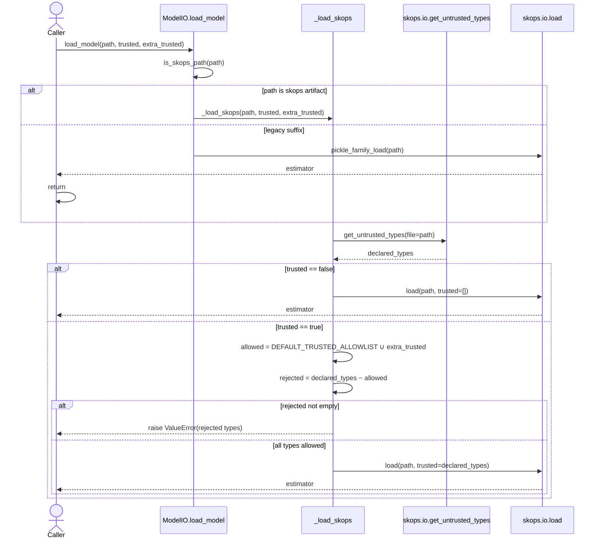
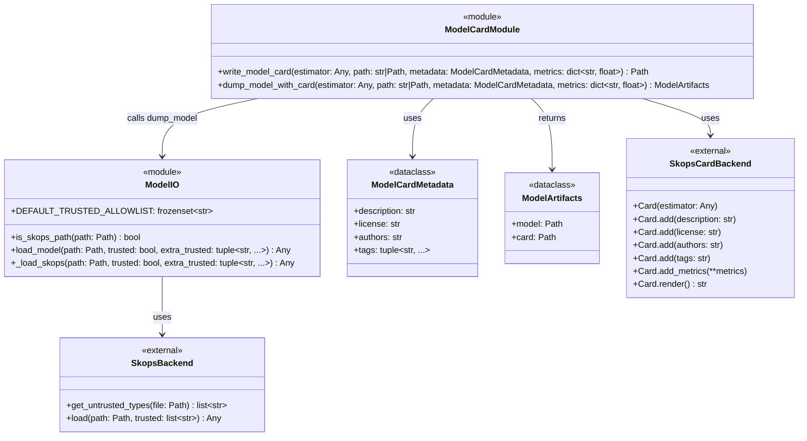
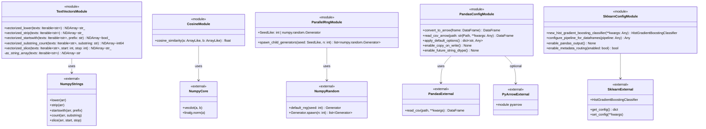

# PR Comments Export

> Exported from [https://github.com/arthrod/lexpredict-lexnlp/pull/21](https://github.com/arthrod/lexpredict-lexnlp/pull/21)  
> 27 of 27 comments selected  
> Generated by [Cicero](https://cicero.im) on 4/25/2026, 1:38:48 PM

---

### coderabbitai[bot] &mdash; 4/24/2026, 2:21:50 PM

**Actionable comments posted: 8**

<details>
<summary>🧹 Nitpick comments (2)</summary><blockquote>

<details>
<summary>lexnlp/extract/batch/tests/test_parallel_rng.py (1)</summary><blockquote>

`12-13`: **Consider adding one smoke test for the package-level import path.**

Since this PR also exposes the function via `lexnlp.extract.batch`, adding a tiny API-surface test would guard that contract.


<details>
<summary>Suggested test update</summary>

```diff
-from lexnlp.extract.batch.parallel_rng import spawn_child_generators
+from lexnlp.extract.batch import spawn_child_generators

 class TestSpawnChildGenerators(TestCase):
+    def test_public_reexport_imports(self):
+        children = spawn_child_generators(seed=5, n=1)
+        self.assertEqual(len(children), 1)
+
     def test_returns_n_generators(self):
         children = spawn_child_generators(seed=42, n=4)
         self.assertEqual(len(children), 4)
```
</details>

<details>
<summary>🤖 Prompt for AI Agents</summary>

```
Verify each finding against the current code and only fix it if needed.

In `@lexnlp/extract/batch/tests/test_parallel_rng.py` around lines 12 - 13, Add a
smoke test that verifies the function is importable via the package-level path
(lexnlp.extract.batch) in addition to the direct module import; specifically,
add an assertion that from lexnlp.extract.batch import spawn_child_generators
succeeds (or that getattr(importlib.import_module("lexnlp.extract.batch"),
"spawn_child_generators") is callable) to lock the public API surface and
prevent regressions to spawn_child_generators exposure.
```

</details>

</blockquote></details>
<details>
<summary>.github/workflows/ci.yml (1)</summary><blockquote>

`124-128`: **Add `--frozen` to line 127 for consistency with other CI jobs.**

Line 127 is the only `uv sync` invocation in this workflow without the `--frozen` flag. All other calls (lines 38, 81, 171, 214, 266) use `--frozen` to ensure reproducible builds. Adding it here will prevent dependency resolution drift and keep regression results consistent.

<details>
<summary>Suggested change</summary>

```diff
       - name: Install dependencies
         run: |
           uv venv .venv --python 3.14
-          uv sync --python .venv/bin/python --group dev
+          uv sync --frozen --python .venv/bin/python --group dev
```
</details>

<details>
<summary>🤖 Prompt for AI Agents</summary>

```
Verify each finding against the current code and only fix it if needed.

In @.github/workflows/ci.yml around lines 124 - 128, The uv sync invocation in
the "Install dependencies" step is missing the --frozen flag; update the command
that runs "uv sync --python .venv/bin/python --group dev" to include --frozen
(i.e., "uv sync --frozen ...") so it matches the other CI jobs and enforces
reproducible dependency resolution.
```

</details>

</blockquote></details>

</blockquote></details>

<details>
<summary>🤖 Prompt for all review comments with AI agents</summary>

```
Verify each finding against the current code and only fix it if needed.

Inline comments:
In @.pre-commit-config.yaml:
- Line 5: Update the bootstrap command so it runs pre-commit outside the
project's dependency groups: replace the current "uv run --group lint pre-commit
install" invocation with the uvx-based bootstrap pattern (i.e., use "uvx run
pre-commit install") so pre-commit is executed independently of the lint group
and works for fresh contributors without a global pre-commit installation.

In `@lexnlp/ml/catalog/tests/test_hub.py`:
- Line 33: The test adds several "type: ignore" suppressions (e.g., on
fake.hf_hub_download) without inline justifications; either remove the
suppressions by assigning the attribute on the test double properly (use setattr
on the ModuleType test double that represents fake, e.g., setattr(fake,
"hf_hub_download", <callable>) so mypy/typing doesn't require a suppression) or,
if a suppression is unavoidable, add an inline justification comment after each
"type: ignore" explaining why the type system cannot represent this test double;
update occurrences at fake.hf_hub_download and the other listed lines (54, 72,
87, 96, 108) accordingly.

In `@lexnlp/ml/tests/test_model_card.py`:
- Around line 98-104: The two type-ignore suppressions in test_frozen need
inline justification text: update the suppression on the ModelCardMetadata()
call (the # type: ignore[call-arg] in the test that expects a
TypeError/ValueError) and the suppression on md.description = "changed" (the #
type: ignore[misc] in test_frozen) to include a short rationale per policy
(e.g., why the check is intentionally bypassed), keeping the existing exception
assertions and retaining the references to ModelCardMetadata and the test_frozen
method.

In `@lexnlp/ml/tests/test_model_io.py`:
- Around line 325-336: The test test_load_rejects_type_outside_allowlist should
assert the specific rejection type instead of any Exception: change the context
manager that currently uses pytest.raises(Exception) to
pytest.raises(ValueError) so _load_skops(path, trusted=True) is required to
raise ValueError when get_untrusted_types returns
["evil.Module.RemoteCodeExecution"]; update the inline comment if needed to
reflect that skops will raise ValueError for untrusted types and keep references
to the patched get_untrusted_types and the _load_skops call to locate the
change.
- Around line 338-344: The test test_load_accepts_additional_allowed_type
currently never exercises the "extra_trusted" path because no untrusted type is
present; update the test so the serialized file created by dump_model (or by a
small custom payload) contains a value whose pickled type name is
"my.Custom.Class" (e.g., by pickling an object with __module__ or class name set
accordingly or by constructing a pickle protocol payload that references that
type), then call _load_skops(path, trusted=True,
extra_trusted=("my.Custom.Class",)) and assert the payload is successfully
loaded; this ensures _load_skops actually checks against extra_trusted rather
than passing trivially. Ensure to reference the existing helpers dump_model and
loader _load_skops when creating the test fixture.

In `@lexnlp/ml/tests/test_sklearn_config.py`:
- Around line 73-84: The test test_returns_previous_value mutates global sklearn
config by hard-setting enable_metadata_routing to False in the finally block;
capture the original value before any changes (call original =
enable_metadata_routing() or get current via set_config if appropriate), then in
the finally restore that original using
set_config(enable_metadata_routing=original) instead of unconditionally setting
False; ensure subsequent calls inside the test still exercise
enable_metadata_routing(enabled=True) as currently written but always restore
the saved original at the end.

In `@lexnlp/utils/cosine.py`:
- Around line 24-39: The cosine_similarity function accepts ArrayLike but
assumes 1-D vectors; add an explicit ndim validation after converting inputs (va
= np.asarray(a, dtype=np.float64) and vb = np.asarray(b, dtype=np.float64)) to
ensure va.ndim == 1 and vb.ndim == 1 and raise a ValueError with a clear message
like "expected 1-D vectors but got shapes X and Y" if not; keep the existing
shape/length check and zero-norm handling, and add a unit test that passes a
same-shaped 2-D array to cosine_similarity to assert it raises the new
ValueError.

In `@lexnlp/utils/tests/test_pandas_config_read_csv.py`:
- Around line 52-56: The test test_falls_back_when_pyarrow_missing currently
calls read_csv_arrow without forcing the pyarrow-unavailable path; update the
test to simulate pyarrow absence by temporarily faking
importlib.util.find_spec("pyarrow") to return None (or removing "pyarrow" from
sys.modules) before calling read_csv_arrow, then restore the original state
after the call; reference the test name test_falls_back_when_pyarrow_missing and
the helper read_csv_arrow and use importlib.util.find_spec and/or sys.modules
manipulation so the fallback branch is exercised reliably.

---

Nitpick comments:
In @.github/workflows/ci.yml:
- Around line 124-128: The uv sync invocation in the "Install dependencies" step
is missing the --frozen flag; update the command that runs "uv sync --python
.venv/bin/python --group dev" to include --frozen (i.e., "uv sync --frozen ...")
so it matches the other CI jobs and enforces reproducible dependency resolution.

In `@lexnlp/extract/batch/tests/test_parallel_rng.py`:
- Around line 12-13: Add a smoke test that verifies the function is importable
via the package-level path (lexnlp.extract.batch) in addition to the direct
module import; specifically, add an assertion that from lexnlp.extract.batch
import spawn_child_generators succeeds (or that
getattr(importlib.import_module("lexnlp.extract.batch"),
"spawn_child_generators") is callable) to lock the public API surface and
prevent regressions to spawn_child_generators exposure.
```

</details>

<details>
<summary>🪄 Autofix (Beta)</summary>

Fix all unresolved CodeRabbit comments on this PR:

- [ ] <!-- {"checkboxId": "4b0d0e0a-96d7-4f10-b296-3a18ea78f0b9"} --> Push a commit to this branch (recommended)
- [ ] <!-- {"checkboxId": "ff5b1114-7d8c-49e6-8ac1-43f82af23a33"} --> Create a new PR with the fixes

</details>

---

<details>
<summary>ℹ️ Review info</summary>

<details>
<summary>⚙️ Run configuration</summary>

**Configuration used**: Organization UI

**Review profile**: CHILL

**Plan**: Pro

**Run ID**: `1307df95-2e5c-430e-a208-18ce97dadb14`

</details>

<details>
<summary>📥 Commits</summary>

Reviewing files that changed from the base of the PR and between 207855d812777a1e3386516b279fd148780885dd and d82d1bc0a0d4c2b9fb0e5343f1bdc4763f63b42f.

</details>

<details>
<summary>⛔ Files ignored due to path filters (2)</summary>

* `MODERNIZATION_ROADMAP.md` is excluded by `!*.md`
* `uv.lock` is excluded by `!**/*.lock`

</details>

<details>
<summary>📒 Files selected for processing (21)</summary>

* `.github/workflows/ci.yml`
* `.pre-commit-config.yaml`
* `lexnlp/extract/batch/__init__.py`
* `lexnlp/extract/batch/parallel_rng.py`
* `lexnlp/extract/batch/tests/test_parallel_rng.py`
* `lexnlp/extract/common/ocr_rating/ocr_rating_calculator.py`
* `lexnlp/ml/catalog/hub.py`
* `lexnlp/ml/catalog/tests/test_hub.py`
* `lexnlp/ml/model_card.py`
* `lexnlp/ml/model_io.py`
* `lexnlp/ml/sklearn_config.py`
* `lexnlp/ml/tests/test_model_card.py`
* `lexnlp/ml/tests/test_model_io.py`
* `lexnlp/ml/tests/test_sklearn_config.py`
* `lexnlp/utils/cosine.py`
* `lexnlp/utils/pandas_config.py`
* `lexnlp/utils/tests/test_cosine.py`
* `lexnlp/utils/tests/test_pandas_config_read_csv.py`
* `lexnlp/utils/tests/test_text_vectors.py`
* `lexnlp/utils/text_vectors.py`
* `pyproject.toml`

</details>

</details>

<details>
<summary>📜 Review details</summary>

<details>
<summary>⏰ Context from checks skipped due to timeout of 90000ms. You can increase the timeout in your CodeRabbit configuration to a maximum of 15 minutes (900000ms). (5)</summary>

* GitHub Check: Sourcery review
* GitHub Check: Stanford Tests
* GitHub Check: Base Tests
* GitHub Check: Contract Type Smoke
* GitHub Check: Contract Type Smoke

</details>

<details>
<summary>🧰 Additional context used</summary>

<details>
<summary>📓 Path-based instructions (9)</summary>

<details>
<summary>**/*.{py,ts,tsx}</summary>


**📄 CodeRabbit inference engine (Custom checks)**

> `**/*.{py,ts,tsx}`: Identify changed production files and verify corresponding test changes. FAIL if a changed production file has zero associated test file AND introduces new exported functions, classes, or public methods. Exceptions: config files, .d.ts files, migrations, generated code.
> No lint suppression creep: Scan diff for newly added suppression comments. Python: # noqa, # type: ignore. TypeScript: // biome-ignore, // eslint-disable, `@ts-ignore`, `@ts-expect-error`, // oxlint-ignore. Each suppression MUST have inline justification comment. FAIL if any suppression lacks justification. WARN if total new suppressions > 3 in PR.
> Import ordering and dead imports check: Python - run `uv run ruff check --select I,F401 .`. TypeScript - run `bun run biome check --formatter-enabled=false --linter-enabled=false --organize-imports-enabled=true .`. FAIL if violations found.

Files:
- `lexnlp/extract/batch/__init__.py`
- `lexnlp/extract/common/ocr_rating/ocr_rating_calculator.py`
- `lexnlp/ml/tests/test_model_io.py`
- `lexnlp/extract/batch/tests/test_parallel_rng.py`
- `lexnlp/utils/tests/test_text_vectors.py`
- `lexnlp/utils/pandas_config.py`
- `lexnlp/utils/cosine.py`
- `lexnlp/utils/tests/test_cosine.py`
- `lexnlp/ml/sklearn_config.py`
- `lexnlp/ml/catalog/hub.py`
- `lexnlp/ml/model_card.py`
- `lexnlp/ml/model_io.py`
- `lexnlp/utils/text_vectors.py`
- `lexnlp/ml/tests/test_model_card.py`
- `lexnlp/ml/tests/test_sklearn_config.py`
- `lexnlp/extract/batch/parallel_rng.py`
- `lexnlp/utils/tests/test_pandas_config_read_csv.py`
- `lexnlp/ml/catalog/tests/test_hub.py`

</details>
<details>
<summary>**/*.py</summary>


**📄 CodeRabbit inference engine (Custom checks)**

> `**/*.py`: Python lint with ruff: Run `uv run ruff check . --diff` and `uv run ruff format --check --diff .`. FAIL if exit code != 0 for either.
> Python type checking: Run `uv run ty check` (or fallback to mypy/pyright if configured). FAIL if exit code != 0. If no type checker configured, FAIL with 'No Python type checker configured. Add ty to dev dependencies.'
> Strict null/undefined audit for Python: Scan diff for new bare `type: ignore` without error code and `cast()` calls without explanation comment. WARN for each. FAIL if bare `type: ignore` count > 3.
> 
> `**/*.py`: Python requirement: support versions >=3.10,<3.13 with default development on Python 3.11
> Use pylint with `.pylintrc` configuration for code quality checks

Files:
- `lexnlp/extract/batch/__init__.py`
- `lexnlp/extract/common/ocr_rating/ocr_rating_calculator.py`
- `lexnlp/ml/tests/test_model_io.py`
- `lexnlp/extract/batch/tests/test_parallel_rng.py`
- `lexnlp/utils/tests/test_text_vectors.py`
- `lexnlp/utils/pandas_config.py`
- `lexnlp/utils/cosine.py`
- `lexnlp/utils/tests/test_cosine.py`
- `lexnlp/ml/sklearn_config.py`
- `lexnlp/ml/catalog/hub.py`
- `lexnlp/ml/model_card.py`
- `lexnlp/ml/model_io.py`
- `lexnlp/utils/text_vectors.py`
- `lexnlp/ml/tests/test_model_card.py`
- `lexnlp/ml/tests/test_sklearn_config.py`
- `lexnlp/extract/batch/parallel_rng.py`
- `lexnlp/utils/tests/test_pandas_config_read_csv.py`
- `lexnlp/ml/catalog/tests/test_hub.py`

</details>
<details>
<summary>**/{index,__init__}.{ts,tsx,py}</summary>


**📄 CodeRabbit inference engine (Custom checks)**

> Exported API surface check: For changed public module entry points (index.ts, __init__.py, or files listed in package.json exports / pyproject.toml [tool.setuptools.packages]), verify all exported symbols have explicit type annotations. Python: functions must have return type and parameter annotations. TypeScript: functions must have explicit return type. FAIL if new public export lacks explicit types.

Files:
- `lexnlp/extract/batch/__init__.py`

</details>
<details>
<summary>**/*{test,spec,__mocks__}*.{py,ts,tsx}</summary>


**📄 CodeRabbit inference engine (Custom checks)**

> New test quality spot-check: Verify each new test file contains at least one assertion (assert, expect, assertEqual, toBe, toEqual, toThrow, rejects, etc.). FAIL if any new test file has zero assertions.

Files:
- `lexnlp/ml/tests/test_model_io.py`
- `lexnlp/extract/batch/tests/test_parallel_rng.py`
- `lexnlp/utils/tests/test_text_vectors.py`
- `lexnlp/utils/tests/test_cosine.py`
- `lexnlp/ml/tests/test_model_card.py`
- `lexnlp/ml/tests/test_sklearn_config.py`
- `lexnlp/utils/tests/test_pandas_config_read_csv.py`
- `lexnlp/ml/catalog/tests/test_hub.py`

</details>
<details>
<summary>**/*test*.py</summary>


**📄 CodeRabbit inference engine (AGENTS.md)**

> `**/*test*.py`: Do not add, remove, or modify `skip`, `skipif`, or `xfail` markers to bypass test failures; fix failing behavior or document a real external blocker
> All `skip`/`skipif`/`xfail` markers genuinely required (e.g., external dependency outage) must include inline annotation: `skip-audit: issue=<link-or-id> expires=YYYY-MM-DD`; CI enforces this via `ci/skip_audit.py`

Files:
- `lexnlp/ml/tests/test_model_io.py`
- `lexnlp/extract/batch/tests/test_parallel_rng.py`
- `lexnlp/utils/tests/test_text_vectors.py`
- `lexnlp/utils/tests/test_cosine.py`
- `lexnlp/ml/tests/test_model_card.py`
- `lexnlp/ml/tests/test_sklearn_config.py`
- `lexnlp/utils/tests/test_pandas_config_read_csv.py`
- `lexnlp/ml/catalog/tests/test_hub.py`

</details>
<details>
<summary>{pyproject.toml,.github/**/*.{yml,yaml},**/Pipfile*,**/python-requirements*.txt,**/setup.py}</summary>


**📄 CodeRabbit inference engine (AGENTS.md)**

> Use `uv` with `pyproject.toml` for all new local setup and CI updates; do not use deprecated `Pipfile`, `Pipfile.lock`, `python-requirements.txt`, or `python-requirements-dev.txt`

Files:
- `.github/workflows/ci.yml`
- `pyproject.toml`

</details>
<details>
<summary>**/pyproject.toml</summary>


**📄 CodeRabbit inference engine (Custom checks)**

> `**/pyproject.toml`: Run Python dependency audit: `uv run pip-audit` or `uv run pip list --outdated`. FAIL if any known CVE with severity HIGH or CRITICAL is found. WARN for moderate severity.
> Smoke test for Python web server: Start server, wait for ready signal, hit GET /health or GET /, assert HTTP 200. Timeout: 30s. FAIL if test fails.
> Smoke test for Python CLI: Run `<cli> --help`, assert exit code 0. FAIL if test fails.
> Smoke test for Python library: Run `python -c "import <package>"`, assert exit code 0. FAIL if test fails.
> Python coverage threshold: Run `uv run pytest --cov=<src_package> --cov-report=term-missing --cov-branch --cov-fail-under=80`. FAIL if exit code != 0 or branch coverage < 70%.
> Run full Python test suite: `uv run pytest --tb=line -q` for baseline and `uv run pytest --tb=short -q` for PR branch. FAIL immediately if exit code != 0.

Files:
- `pyproject.toml`

</details>
<details>
<summary>{**/pyproject.toml,**/package.json}</summary>


**📄 CodeRabbit inference engine (Custom checks)**

> Clean build verification: Python - run `uv build`, verify dist/ contains expected wheel/sdist. FAIL if exit code != 0. TypeScript - run `bun run build`, verify output directory (dist/, .next/, build/) is non-empty. WARN if > 10 build warnings.

Files:
- `pyproject.toml`

</details>
<details>
<summary>{ruff.toml,pyproject.toml,biome.json,.oxlintrc.json}</summary>


**📄 CodeRabbit inference engine (Custom checks)**

> Linter/formatter config consistency: Verify that linter/formatter config files (ruff.toml, pyproject.toml [tool.ruff], biome.json, .oxlintrc.json) were not modified without corresponding PR description explanation. WARN if config changed without mention.

Files:
- `pyproject.toml`

</details>

</details><details>
<summary>🪛 Pylint (4.0.5)</summary>

<details>
<summary>lexnlp/ml/tests/test_model_card.py</summary>

[error] 99-99: No value for argument 'description' in constructor call

(E1120)

</details>

</details>

</details>

<details>
<summary>🔇 Additional comments (17)</summary><blockquote>

<details>
<summary>lexnlp/ml/tests/test_sklearn_config.py (1)</summary><blockquote>

`15-20`: **Good coverage wiring for the new helper.**

Importing `enable_metadata_routing` here is correct and keeps test coverage aligned with the new API.

</blockquote></details>
<details>
<summary>lexnlp/ml/sklearn_config.py (2)</summary><blockquote>

`69-85`: **Solid helper behavior for temporary config toggling.**

Returning the previous value while applying the new state makes this API easy to use safely in tests and short-lived workflows.

---

`98-103`: **Public API export updated correctly.**

Adding `enable_metadata_routing` to `__all__` keeps the module’s exported surface explicit and consistent.

</blockquote></details>
<details>
<summary>lexnlp/extract/batch/parallel_rng.py (1)</summary><blockquote>

`24-41`: **Robust RNG spawning implementation.**

The validation and control flow are clean (`n < 0`, `n == 0`, then spawn), and the API is strongly typed for public use.

</blockquote></details>
<details>
<summary>lexnlp/extract/batch/__init__.py (1)</summary><blockquote>

`45-63`: **Public re-export wiring is correct.**

Import + `__all__` updates are aligned, so `spawn_child_generators` is available via `lexnlp.extract.batch`.

</blockquote></details>
<details>
<summary>lexnlp/extract/batch/tests/test_parallel_rng.py (1)</summary><blockquote>

`15-62`: **Test coverage is thorough for the new utility.**

Nice coverage across boundary cases, determinism, and stream independence.

</blockquote></details>
<details>
<summary>lexnlp/ml/model_io.py (1)</summary><blockquote>

`306-311`: **Avoid `get_untrusted_types()` work on the `trusted=False` path.**

When `trusted=False`, the function returns with `trusted=[]` anyway; scanning declared types first is avoidable overhead.

[ suggest_recommended_refactor ]
<details>
<summary>Suggested refactor</summary>

```diff
-    declared = list(get_untrusted_types(file=path) or [])
     if not trusted:
         # Fail-closed path: hand an empty list so skops enforces its own
         # default trusted set and raises UntrustedTypesFoundException.
         return _skops_load(path, trusted=[])
 
+    declared = list(get_untrusted_types(file=path) or [])
     allowed = DEFAULT_TRUSTED_ALLOWLIST | frozenset(extra_trusted)
```
</details>

</blockquote></details>
<details>
<summary>pyproject.toml (2)</summary><blockquote>

`51-51`: **NumPy floor bump is aligned with new runtime API usage.**

The `numpy>=2.3,<3` constraint matches the new `numpy.strings`/modern NumPy helpers introduced in this PR.

---

`88-89`: **Optional extras are cleanly scoped.**

Adding `hub` and `arrow` as extras keeps heavyweight integrations optional while supporting the new utility modules.

</blockquote></details>
<details>
<summary>lexnlp/utils/pandas_config.py (1)</summary><blockquote>

`71-89`: **`read_csv_arrow` is implemented defensively and exported correctly.**

The fallback logic is clear, and using `setdefault` for `dtype_backend` preserves caller-provided overrides.


Also applies to: 107-107

</blockquote></details>
<details>
<summary>lexnlp/utils/tests/test_text_vectors.py (1)</summary><blockquote>

`21-114`: **Great test coverage for the new text vector API surface.**

This suite hits functional behavior, dtype/shape checks, unicode handling, and iterable edge cases.

</blockquote></details>
<details>
<summary>lexnlp/utils/text_vectors.py (1)</summary><blockquote>

`27-30`: **Nice, focused utility module.**

The normalization helper + thin vectorized wrappers make the API predictable, and the public exports are clean.


Also applies to: 33-59, 62-68

</blockquote></details>
<details>
<summary>lexnlp/ml/catalog/hub.py (1)</summary><blockquote>

`42-49`: **Hub integration flow looks solid.**

Lazy import handling, explicit domain exceptions, and `Path` normalization are all implemented cleanly.


Also applies to: 51-79

</blockquote></details>
<details>
<summary>.github/workflows/ci.yml (1)</summary><blockquote>

`94-123`: **Nice addition of a non-blocking Python 3.14 forward-regression lane.**

This is a solid CI enhancement: isolated cache key, matching bootstrap flow, and advisory failure mode keep signal high without blocking merges.  


Also applies to: 129-135

</blockquote></details>
<details>
<summary>.pre-commit-config.yaml (1)</summary><blockquote>

`10-41`: **Pinned hooks and local CI-parity checks are well structured.**

Version pinning plus `ruff`, `ruff-format`, lockfile, hygiene hooks, and `ty-check` setup look consistent and maintainable.

</blockquote></details>
<details>
<summary>lexnlp/utils/tests/test_cosine.py (1)</summary><blockquote>

`16-56`: **Solid coverage for the new cosine utility.**

This test suite exercises core correctness paths and edge cases (including zero vectors and mismatched shapes) well.

</blockquote></details>
<details>
<summary>lexnlp/extract/common/ocr_rating/ocr_rating_calculator.py (1)</summary><blockquote>

`95-95`: **Good refactor to shared cosine implementation.**

Line 95 now reuses the centralized helper, which improves consistency and avoids duplicating numeric logic.

</blockquote></details>

</blockquote></details>

</details>

<!-- This is an auto-generated comment by CodeRabbit for review status -->

---

### coderabbitai[bot] &mdash; 4/24/2026, 2:21:48 PM

> File: `.pre-commit-config.yaml`

<details><summary>Code context</summary>

```diff
@@ -0,0 +1,41 @@
+# Pre-commit hooks for LexNLP.
+#
+# Install locally with::
+#
+#     uv run --group lint pre-commit install
```
</details>

_⚠️ Potential issue_ | _🟡 Minor_

<details>
<summary>🧩 Analysis chain</summary>

🏁 Script executed:

```shell
#!/bin/bash
set -euo pipefail

PYPROJECT="$(fd -HI '^pyproject\.toml$' | head -n1)"
echo "Inspecting: ${PYPROJECT}"

# Show dependency-group declarations and any pre-commit mentions.
rg -n -C3 '^\[dependency-groups\]|^\s*lint\s*=|^\s*dev\s*=|pre-commit' "${PYPROJECT}"
```

Repository: arthrod/lexpredict-lexnlp

Length of output: 638

---


</details>

**Bootstrap command requires `pre-commit` external availability.**

Line 5 uses `uv run --group lint pre-commit install`, but `pre-commit` is not included in the `lint` dependency group. This command will fail for fresh contributors unless `pre-commit` is available globally or via another mechanism.

<details>
<summary>🔧 Suggested adjustment (doc-only)</summary>

```diff
-#     uv run --group lint pre-commit install
+#     uvx pre-commit install
```
</details>

Using `uvx` is the appropriate pattern for bootstrap tooling not pinned to the project's dependency groups.

<!-- suggestion_start -->

<details>
<summary>📝 Committable suggestion</summary>

> ‼️ **IMPORTANT**
> Carefully review the code before committing. Ensure that it accurately replaces the highlighted code, contains no missing lines, and has no issues with indentation. Thoroughly test & benchmark the code to ensure it meets the requirements.

```suggestion
#     uvx pre-commit install
```

</details>

<!-- suggestion_end -->

<details>
<summary>🤖 Prompt for AI Agents</summary>

```
Verify each finding against the current code and only fix it if needed.

In @.pre-commit-config.yaml at line 5, Update the bootstrap command so it runs
pre-commit outside the project's dependency groups: replace the current "uv run
--group lint pre-commit install" invocation with the uvx-based bootstrap pattern
(i.e., use "uvx run pre-commit install") so pre-commit is executed independently
of the lint group and works for fresh contributors without a global pre-commit
installation.
```

</details>

<!-- fingerprinting:phantom:poseidon:hawk:533f1f3c-5258-4ada-842b-d7355a9aa16b -->

<!-- This is an auto-generated comment by CodeRabbit -->

---

### coderabbitai[bot] &mdash; 4/24/2026, 2:21:48 PM

> File: `lexnlp/ml/catalog/tests/test_hub.py`

<details><summary>Code context</summary>

```diff
@@ -0,0 +1,116 @@
+__author__ = "ContraxSuite, LLC; LexPredict, LLC"
+__copyright__ = "Copyright 2015-2021, ContraxSuite, LLC"
+__license__ = "https://github.com/LexPredict/lexpredict-lexnlp/blob/2.3.0/LICENSE"
+__version__ = "2.3.0"
+__maintainer__ = "LexPredict, LLC"
+__email__ = "support@contraxsuite.com"
+
+
+from pathlib import Path
+from unittest import TestCase
+from unittest.mock import patch
+
+from lexnlp.ml.catalog.hub import (
+    DEFAULT_HUB_REPO,
+    HubMirrorError,
+    HubUnavailableError,
+    get_path_from_hub,
+    hub_is_available,
+)
+
+
+class TestHubAvailability(TestCase):
+    def test_returns_false_when_huggingface_hub_missing(self) -> None:
+        """When huggingface_hub is not installed the probe reports False
+        rather than raising."""
+        with patch.dict("sys.modules", {"huggingface_hub": None}):
+            self.assertFalse(hub_is_available())
+
+    def test_returns_true_when_import_works(self) -> None:
+        import types
+
+        fake = types.ModuleType("huggingface_hub")
+        fake.hf_hub_download = lambda **kwargs: "/tmp/fake"  # type: ignore[attr-defined]
```
</details>

_⚠️ Potential issue_ | _🟠 Major_

**Add justification (or remove) new `type: ignore` suppressions.**

These new suppressions are missing inline justification. Prefer replacing them with `setattr(...)` on the `ModuleType` test double so no suppression is needed.

<details>
<summary>Suggested pattern</summary>

```diff
-        fake = types.ModuleType("huggingface_hub")
-        fake.hf_hub_download = fake_download  # type: ignore[attr-defined]
+        fake = types.ModuleType("huggingface_hub")
+        setattr(fake, "hf_hub_download", fake_download)  # test double hook
```
</details>


As per coding guidelines, "No lint suppression creep: ... Each suppression MUST have inline justification comment. FAIL if any suppression lacks justification."


Also applies to: 54-54, 72-72, 87-87, 96-96, 108-108

<details>
<summary>🤖 Prompt for AI Agents</summary>

```
Verify each finding against the current code and only fix it if needed.

In `@lexnlp/ml/catalog/tests/test_hub.py` at line 33, The test adds several "type:
ignore" suppressions (e.g., on fake.hf_hub_download) without inline
justifications; either remove the suppressions by assigning the attribute on the
test double properly (use setattr on the ModuleType test double that represents
fake, e.g., setattr(fake, "hf_hub_download", <callable>) so mypy/typing doesn't
require a suppression) or, if a suppression is unavoidable, add an inline
justification comment after each "type: ignore" explaining why the type system
cannot represent this test double; update occurrences at fake.hf_hub_download
and the other listed lines (54, 72, 87, 96, 108) accordingly.
```

</details>

<!-- fingerprinting:phantom:poseidon:hawk:9b92f35c-420d-40fc-a231-40a7c8b1718b -->

<!-- This is an auto-generated comment by CodeRabbit -->

---

### coderabbitai[bot] &mdash; 4/24/2026, 2:21:48 PM

> File: `lexnlp/ml/tests/test_model_card.py`

<details><summary>Code context</summary>

```diff
@@ -0,0 +1,104 @@
+__author__ = "ContraxSuite, LLC; LexPredict, LLC"
+__copyright__ = "Copyright 2015-2021, ContraxSuite, LLC"
+__license__ = "https://github.com/LexPredict/lexpredict-lexnlp/blob/2.3.0/LICENSE"
+__version__ = "2.3.0"
+__maintainer__ = "LexPredict, LLC"
+__email__ = "support@contraxsuite.com"
+
+
+from pathlib import Path
+from unittest import TestCase
+
+from sklearn.linear_model import LogisticRegression
+
+from lexnlp.ml.model_card import (
+    ModelCardMetadata,
+    dump_model_with_card,
+    write_model_card,
+)
+
+
+class TestWriteModelCard(TestCase):
+    def setUp(self) -> None:
+        import tempfile
+
+        self.tmp = tempfile.TemporaryDirectory()
+        self.addCleanup(self.tmp.cleanup)
+        self.tmpdir = Path(self.tmp.name)
+
+    def _fitted_estimator(self) -> LogisticRegression:
+        clf = LogisticRegression(max_iter=50, solver="lbfgs")
+        # tiny fixture so add_hyperparams works without errors
+        clf.fit([[0.0], [1.0]], [0, 1])
+        return clf
+
+    def test_returns_path_with_md_extension(self) -> None:
+        clf = self._fitted_estimator()
+        md = ModelCardMetadata(
+            description="LexNLP date classifier",
+            license="AGPL-3.0-or-later",
+            authors="ContraxSuite, LLC",
+        )
+        out = write_model_card(clf, self.tmpdir / "date_model", metadata=md)
+        self.assertEqual(out.suffix, ".md")
+        self.assertTrue(out.exists())
+
+    def test_card_contains_metadata(self) -> None:
+        clf = self._fitted_estimator()
+        md = ModelCardMetadata(
+            description="LexNLP date classifier",
+            license="AGPL-3.0-or-later",
+            authors="ContraxSuite, LLC",
+        )
+        out = write_model_card(clf, self.tmpdir / "date_model.md", metadata=md)
+        content = out.read_text(encoding="utf-8")
+        self.assertIn("LexNLP date classifier", content)
+
+    def test_card_metrics_table_included(self) -> None:
+        clf = self._fitted_estimator()
+        md = ModelCardMetadata(description="x", license="", authors="")
+        out = write_model_card(
+            clf,
+            self.tmpdir / "m.md",
+            metadata=md,
+            metrics={"accuracy": 0.91, "f1_macro": 0.87},
+        )
+        content = out.read_text(encoding="utf-8")
+        self.assertIn("accuracy", content)
+        self.assertIn("0.91", content)
+
+    def test_dump_model_with_card_writes_both_artifacts(self) -> None:
+        clf = self._fitted_estimator()
+        md = ModelCardMetadata(description="x", license="", authors="")
+        paths = dump_model_with_card(
+            clf,
+            self.tmpdir / "contract_type",
+            metadata=md,
+            metrics={"accuracy": 0.95},
+        )
+        self.assertTrue(paths.model.exists())
+        self.assertEqual(paths.model.suffix, ".skops")
+        self.assertTrue(paths.card.exists())
+        self.assertEqual(paths.card.suffix, ".md")
+
+    def test_dump_model_with_card_returns_sibling_paths(self) -> None:
+        clf = self._fitted_estimator()
+        md = ModelCardMetadata(description="x", license="", authors="")
+        paths = dump_model_with_card(
+            clf,
+            self.tmpdir / "x",
+            metadata=md,
+        )
+        self.assertEqual(paths.model.stem, paths.card.stem)
+        self.assertEqual(paths.model.parent, paths.card.parent)
+
+
+class TestModelCardMetadataValidation(TestCase):
+    def test_required_description(self) -> None:
+        with self.assertRaises((TypeError, ValueError)):
+            ModelCardMetadata()  # type: ignore[call-arg]
+
+    def test_frozen(self) -> None:
+        md = ModelCardMetadata(description="x", license="", authors="")
+        with self.assertRaises((AttributeError, Exception)):
+            md.description = "changed"  # type: ignore[misc]
```
</details>

_⚠️ Potential issue_ | _🟠 Major_

**Add inline justification to new `# type: ignore[...]` suppressions.**

Both suppressions are missing the required reason text and can fail policy enforcement.

<details>
<summary>Suggested compliant annotations</summary>

```diff
     def test_required_description(self) -> None:
         with self.assertRaises((TypeError, ValueError)):
-            ModelCardMetadata()  # type: ignore[call-arg]
+            ModelCardMetadata()  # type: ignore[call-arg]  # intentional: validate runtime failure when required field is missing
 
     def test_frozen(self) -> None:
         md = ModelCardMetadata(description="x", license="", authors="")
         with self.assertRaises((AttributeError, Exception)):
-            md.description = "changed"  # type: ignore[misc]
+            md.description = "changed"  # type: ignore[misc]  # intentional: mutate frozen dataclass to assert immutability
```
</details>


As per coding guidelines, "No lint suppression creep... Each suppression MUST have inline justification comment."

<!-- suggestion_start -->

<details>
<summary>📝 Committable suggestion</summary>

> ‼️ **IMPORTANT**
> Carefully review the code before committing. Ensure that it accurately replaces the highlighted code, contains no missing lines, and has no issues with indentation. Thoroughly test & benchmark the code to ensure it meets the requirements.

```suggestion
        with self.assertRaises((TypeError, ValueError)):
            ModelCardMetadata()  # type: ignore[call-arg]  # intentional: validate runtime failure when required field is missing

    def test_frozen(self) -> None:
        md = ModelCardMetadata(description="x", license="", authors="")
        with self.assertRaises((AttributeError, Exception)):
            md.description = "changed"  # type: ignore[misc]  # intentional: mutate frozen dataclass to assert immutability
```

</details>

<!-- suggestion_end -->

<details>
<summary>🧰 Tools</summary>

<details>
<summary>🪛 Pylint (4.0.5)</summary>

[error] 99-99: No value for argument 'description' in constructor call

(E1120)

</details>

</details>

<details>
<summary>🤖 Prompt for AI Agents</summary>

```
Verify each finding against the current code and only fix it if needed.

In `@lexnlp/ml/tests/test_model_card.py` around lines 98 - 104, The two
type-ignore suppressions in test_frozen need inline justification text: update
the suppression on the ModelCardMetadata() call (the # type: ignore[call-arg] in
the test that expects a TypeError/ValueError) and the suppression on
md.description = "changed" (the # type: ignore[misc] in test_frozen) to include
a short rationale per policy (e.g., why the check is intentionally bypassed),
keeping the existing exception assertions and retaining the references to
ModelCardMetadata and the test_frozen method.
```

</details>

<!-- fingerprinting:phantom:poseidon:hawk:d3efb93d-1a0f-4a46-bd28-1481d4c5679c -->

<!-- This is an auto-generated comment by CodeRabbit -->

---

### coderabbitai[bot] &mdash; 4/24/2026, 2:21:48 PM

> File: `lexnlp/ml/tests/test_model_io.py`

<details><summary>Code context</summary>

```diff
@@ -308,6 +309,41 @@ def test_get_untrusted_types_called(self, tmp_path: Path) -> None:
 # ---------------------------------------------------------------------------
 
 
+class TestTrustedAllowlist:
+    """Tests for the explicit allow-list-based trusted loading path."""
+
+    def test_default_allowlist_is_non_empty(self) -> None:
+        assert len(DEFAULT_TRUSTED_ALLOWLIST) > 0
+
+    def test_default_allowlist_includes_common_sklearn_types(self) -> None:
+        assert "sklearn.pipeline.Pipeline" in DEFAULT_TRUSTED_ALLOWLIST
+        assert "numpy.ndarray" in DEFAULT_TRUSTED_ALLOWLIST
+
+    def test_default_allowlist_is_frozenset(self) -> None:
+        assert isinstance(DEFAULT_TRUSTED_ALLOWLIST, frozenset)
+
+    def test_load_rejects_type_outside_allowlist(self, tmp_path: Path) -> None:
+        """trusted=True without override rejects artifacts containing a
+        type that is not in DEFAULT_TRUSTED_ALLOWLIST."""
+
+        path = dump_model({"x": 1}, tmp_path / "m.skops")
+        # Inject a fake untrusted type by patching get_untrusted_types.
+        with patch(
+            "lexnlp.ml.model_io.get_untrusted_types",
+            return_value=["evil.Module.RemoteCodeExecution"],
+        ):
+            with pytest.raises(Exception):  # noqa: B017 - skops raises its own
+                _load_skops(path, trusted=True)
```
</details>

_⚠️ Potential issue_ | _🟡 Minor_

**Assert the exact rejection contract (`ValueError`) instead of `Exception`.**

This test currently accepts any exception type, which can hide unrelated failures and weaken the trusted-load contract.

<details>
<summary>Suggested tightening</summary>

```diff
-        with patch(
-            "lexnlp.ml.model_io.get_untrusted_types",
-            return_value=["evil.Module.RemoteCodeExecution"],
-        ):
-            with pytest.raises(Exception):  # noqa: B017 - skops raises its own
-                _load_skops(path, trusted=True)
+        with patch(
+            "lexnlp.ml.model_io.get_untrusted_types",
+            return_value=["evil.Module.RemoteCodeExecution"],
+        ):
+            with pytest.raises(ValueError, match="outside the trusted allow-list"):
+                _load_skops(path, trusted=True)
```
</details>

<details>
<summary>🤖 Prompt for AI Agents</summary>

```
Verify each finding against the current code and only fix it if needed.

In `@lexnlp/ml/tests/test_model_io.py` around lines 325 - 336, The test
test_load_rejects_type_outside_allowlist should assert the specific rejection
type instead of any Exception: change the context manager that currently uses
pytest.raises(Exception) to pytest.raises(ValueError) so _load_skops(path,
trusted=True) is required to raise ValueError when get_untrusted_types returns
["evil.Module.RemoteCodeExecution"]; update the inline comment if needed to
reflect that skops will raise ValueError for untrusted types and keep references
to the patched get_untrusted_types and the _load_skops call to locate the
change.
```

</details>

<!-- fingerprinting:phantom:poseidon:hawk:d3efb93d-1a0f-4a46-bd28-1481d4c5679c -->

<!-- This is an auto-generated comment by CodeRabbit -->

---

### coderabbitai[bot] &mdash; 4/24/2026, 2:21:48 PM

> File: `lexnlp/ml/tests/test_model_io.py`

<details><summary>Code context</summary>

```diff
@@ -308,6 +309,41 @@ def test_get_untrusted_types_called(self, tmp_path: Path) -> None:
 # ---------------------------------------------------------------------------
 
 
+class TestTrustedAllowlist:
+    """Tests for the explicit allow-list-based trusted loading path."""
+
+    def test_default_allowlist_is_non_empty(self) -> None:
+        assert len(DEFAULT_TRUSTED_ALLOWLIST) > 0
+
+    def test_default_allowlist_includes_common_sklearn_types(self) -> None:
+        assert "sklearn.pipeline.Pipeline" in DEFAULT_TRUSTED_ALLOWLIST
+        assert "numpy.ndarray" in DEFAULT_TRUSTED_ALLOWLIST
+
+    def test_default_allowlist_is_frozenset(self) -> None:
+        assert isinstance(DEFAULT_TRUSTED_ALLOWLIST, frozenset)
+
+    def test_load_rejects_type_outside_allowlist(self, tmp_path: Path) -> None:
+        """trusted=True without override rejects artifacts containing a
+        type that is not in DEFAULT_TRUSTED_ALLOWLIST."""
+
+        path = dump_model({"x": 1}, tmp_path / "m.skops")
+        # Inject a fake untrusted type by patching get_untrusted_types.
+        with patch(
+            "lexnlp.ml.model_io.get_untrusted_types",
+            return_value=["evil.Module.RemoteCodeExecution"],
+        ):
+            with pytest.raises(Exception):  # noqa: B017 - skops raises its own
+                _load_skops(path, trusted=True)
+
+    def test_load_accepts_additional_allowed_type(self, tmp_path: Path) -> None:
+        """Callers may extend the allow-list with extra type names."""
+
+        path = dump_model({"x": 1}, tmp_path / "m.skops")
+        # No untrusted types are actually present; call should succeed.
+        result = _load_skops(path, trusted=True, extra_trusted=("my.Custom.Class",))
+        assert result == {"x": 1}
```
</details>

_⚠️ Potential issue_ | _🟡 Minor_

**`extra_trusted` test does not currently prove the extension path works.**

No untrusted type is injected here, so the test can pass even if `extra_trusted` is ignored.

<details>
<summary>Suggested test that exercises the real path</summary>

```diff
     def test_load_accepts_additional_allowed_type(self, tmp_path: Path) -> None:
         """Callers may extend the allow-list with extra type names."""
 
         path = dump_model({"x": 1}, tmp_path / "m.skops")
-        # No untrusted types are actually present; call should succeed.
-        result = _load_skops(path, trusted=True, extra_trusted=("my.Custom.Class",))
+        with patch(
+            "lexnlp.ml.model_io.get_untrusted_types",
+            return_value=["my.Custom.Class"],
+        ):
+            result = _load_skops(path, trusted=True, extra_trusted=("my.Custom.Class",))
         assert result == {"x": 1}
```
</details>

<!-- suggestion_start -->

<details>
<summary>📝 Committable suggestion</summary>

> ‼️ **IMPORTANT**
> Carefully review the code before committing. Ensure that it accurately replaces the highlighted code, contains no missing lines, and has no issues with indentation. Thoroughly test & benchmark the code to ensure it meets the requirements.

```suggestion
    def test_load_accepts_additional_allowed_type(self, tmp_path: Path) -> None:
        """Callers may extend the allow-list with extra type names."""

        path = dump_model({"x": 1}, tmp_path / "m.skops")
        with patch(
            "lexnlp.ml.model_io.get_untrusted_types",
            return_value=["my.Custom.Class"],
        ):
            result = _load_skops(path, trusted=True, extra_trusted=("my.Custom.Class",))
        assert result == {"x": 1}
```

</details>

<!-- suggestion_end -->

<details>
<summary>🤖 Prompt for AI Agents</summary>

```
Verify each finding against the current code and only fix it if needed.

In `@lexnlp/ml/tests/test_model_io.py` around lines 338 - 344, The test
test_load_accepts_additional_allowed_type currently never exercises the
"extra_trusted" path because no untrusted type is present; update the test so
the serialized file created by dump_model (or by a small custom payload)
contains a value whose pickled type name is "my.Custom.Class" (e.g., by pickling
an object with __module__ or class name set accordingly or by constructing a
pickle protocol payload that references that type), then call _load_skops(path,
trusted=True, extra_trusted=("my.Custom.Class",)) and assert the payload is
successfully loaded; this ensures _load_skops actually checks against
extra_trusted rather than passing trivially. Ensure to reference the existing
helpers dump_model and loader _load_skops when creating the test fixture.
```

</details>

<!-- fingerprinting:phantom:poseidon:hawk:d3efb93d-1a0f-4a46-bd28-1481d4c5679c -->

<!-- This is an auto-generated comment by CodeRabbit -->

---

### coderabbitai[bot] &mdash; 4/24/2026, 2:21:48 PM

> File: `lexnlp/ml/tests/test_sklearn_config.py`

<details><summary>Code context</summary>

```diff
@@ -47,6 +48,42 @@ def test_kwargs_override_defaults(self) -> None:
         assert clf.learning_rate == 0.05
 
 
+class TestEnableMetadataRouting:
+    def test_turns_routing_on(self) -> None:
+        from sklearn import get_config, set_config
+
+        previous = get_config().get("enable_metadata_routing", False)
+        try:
+            enable_metadata_routing()
+            assert get_config()["enable_metadata_routing"] is True
+        finally:
+            set_config(enable_metadata_routing=previous)
+
+    def test_turns_routing_off(self) -> None:
+        from sklearn import get_config, set_config
+
+        previous = get_config().get("enable_metadata_routing", False)
+        try:
+            enable_metadata_routing()
+            enable_metadata_routing(enabled=False)
+            assert get_config()["enable_metadata_routing"] is False
+        finally:
+            set_config(enable_metadata_routing=previous)
+
+    def test_returns_previous_value(self) -> None:
+        from sklearn import set_config
+
+        set_config(enable_metadata_routing=False)
+        try:
+            previous = enable_metadata_routing()
+            assert previous is False
+            next_prev = enable_metadata_routing(enabled=True)
+            # The call flipped True→True, so the "previous" now reports True
+            assert next_prev is True
+        finally:
+            set_config(enable_metadata_routing=False)
```
</details>

_⚠️ Potential issue_ | _🟡 Minor_

**Restore original global config in teardown.**

`test_returns_previous_value` currently hard-resets `enable_metadata_routing` to `False` at Line 84. That can leak global state into later tests when the pre-test value was `True`.

<details>
<summary>🔧 Suggested fix</summary>

```diff
     def test_returns_previous_value(self) -> None:
-        from sklearn import set_config
+        from sklearn import get_config, set_config
 
+        original = get_config().get("enable_metadata_routing", False)
         set_config(enable_metadata_routing=False)
         try:
             previous = enable_metadata_routing()
             assert previous is False
             next_prev = enable_metadata_routing(enabled=True)
             # The call flipped True→True, so the "previous" now reports True
             assert next_prev is True
         finally:
-            set_config(enable_metadata_routing=False)
+            set_config(enable_metadata_routing=original)
```
</details>

<!-- suggestion_start -->

<details>
<summary>📝 Committable suggestion</summary>

> ‼️ **IMPORTANT**
> Carefully review the code before committing. Ensure that it accurately replaces the highlighted code, contains no missing lines, and has no issues with indentation. Thoroughly test & benchmark the code to ensure it meets the requirements.

```suggestion
    def test_returns_previous_value(self) -> None:
        from sklearn import get_config, set_config

        original = get_config().get("enable_metadata_routing", False)
        set_config(enable_metadata_routing=False)
        try:
            previous = enable_metadata_routing()
            assert previous is False
            next_prev = enable_metadata_routing(enabled=True)
            # The call flipped True→True, so the "previous" now reports True
            assert next_prev is True
        finally:
            set_config(enable_metadata_routing=original)
```

</details>

<!-- suggestion_end -->

<details>
<summary>🤖 Prompt for AI Agents</summary>

```
Verify each finding against the current code and only fix it if needed.

In `@lexnlp/ml/tests/test_sklearn_config.py` around lines 73 - 84, The test
test_returns_previous_value mutates global sklearn config by hard-setting
enable_metadata_routing to False in the finally block; capture the original
value before any changes (call original = enable_metadata_routing() or get
current via set_config if appropriate), then in the finally restore that
original using set_config(enable_metadata_routing=original) instead of
unconditionally setting False; ensure subsequent calls inside the test still
exercise enable_metadata_routing(enabled=True) as currently written but always
restore the saved original at the end.
```

</details>

<!-- fingerprinting:phantom:poseidon:hawk:1be4a5f9-62d5-44b9-8e07-84a66f497e07 -->

<!-- This is an auto-generated comment by CodeRabbit -->

---

### coderabbitai[bot] &mdash; 4/24/2026, 2:21:48 PM

> File: `lexnlp/utils/cosine.py`

<details><summary>Code context</summary>

```diff
@@ -0,0 +1,42 @@
+"""Cosine similarity built on :func:`numpy.vecdot`.
+
+``numpy.vecdot`` is a generalised ufunc (NumPy 2.1+) that computes the
+dot product along the last axis in a single C call, so it replaces the
+multi-step ``dot / linalg.norm / linalg.norm`` idiom that used to live
+inside :mod:`lexnlp.extract.common.ocr_rating.ocr_rating_calculator`.
+"""
+
+from __future__ import annotations
+
+__author__ = "ContraxSuite, LLC; LexPredict, LLC"
+__copyright__ = "Copyright 2015-2021, ContraxSuite, LLC"
+__license__ = "https://github.com/LexPredict/lexpredict-lexnlp/blob/2.3.0/LICENSE"
+__version__ = "2.3.0"
+__maintainer__ = "LexPredict, LLC"
+__email__ = "support@contraxsuite.com"
+
+from collections.abc import Sequence
+
+import numpy as np
+from numpy.typing import ArrayLike, NDArray
+
+
+def cosine_similarity(a: ArrayLike | Sequence[float], b: ArrayLike | Sequence[float]) -> float:
+    """Return the cosine similarity between two 1-D vectors.
+
+    Returns ``0.0`` when either vector has zero magnitude rather than
+    raising or producing ``NaN``. Raises :class:`ValueError` if the two
+    vectors have different lengths.
+    """
+    va: NDArray[np.floating] = np.asarray(a, dtype=np.float64)
+    vb: NDArray[np.floating] = np.asarray(b, dtype=np.float64)
+    if va.shape != vb.shape:
+        raise ValueError(f"shape mismatch: {va.shape} vs {vb.shape}")
+    na = float(np.linalg.norm(va))
+    nb = float(np.linalg.norm(vb))
+    if na == 0.0 or nb == 0.0:
+        return 0.0
+    return float(np.vecdot(va, vb)) / (na * nb)
```
</details>

_⚠️ Potential issue_ | _🟠 Major_

<details>
<summary>🧩 Analysis chain</summary>

🏁 Script executed:

```shell
#!/bin/bash
# Verify NumPy vecdot behavior for non-1D inputs and float conversion risk.
python - <<'PY'
import numpy as np
a = np.ones((2, 2), dtype=np.float64)
b = np.ones((2, 2), dtype=np.float64)

v = np.vecdot(a, b)
print("vecdot value:", v)
print("vecdot type:", type(v))
print("vecdot shape:", getattr(v, "shape", None))

try:
    print("float(vecdot):", float(v))
except Exception as e:
    print("float(vecdot) failed:", type(e).__name__, str(e))
PY
```

Repository: arthrod/lexpredict-lexnlp

Length of output: 240

---

🏁 Script executed:

```shell
cat -n lexnlp/utils/cosine.py
```

Repository: arthrod/lexpredict-lexnlp

Length of output: 1901

---

🏁 Script executed:

```shell
python - <<'PY'
import numpy as np

# Test 1: Original code with 2D inputs
print("=== Test 1: Original code issue ===")
a = np.ones((2, 2), dtype=np.float64)
b = np.ones((2, 2), dtype=np.float64)
va = np.asarray(a, dtype=np.float64)
vb = np.asarray(b, dtype=np.float64)
na = float(np.linalg.norm(va))
nb = float(np.linalg.norm(vb))
print(f"na={na}, nb={nb}")

v = np.vecdot(va, vb)
print(f"vecdot result: {v}, shape: {v.shape}, type: {type(v)}")

try:
    result = float(v) / (na * nb)
    print(f"Result: {result}")
except Exception as e:
    print(f"Error: {type(e).__name__}: {e}")

# Test 2: Proposed fix - check ndim first, then use parentheses
print("\n=== Test 2: Proposed fix with ndim check ===")
a = np.ones((2, 2), dtype=np.float64)
b = np.ones((2, 2), dtype=np.float64)
va = np.asarray(a, dtype=np.float64)
vb = np.asarray(b, dtype=np.float64)

if va.ndim != 1 or vb.ndim != 1:
    print(f"Validation works: {va.ndim}D and {vb.ndim}D inputs rejected ✓")

# Test 3: Proposed fix with actual 1D inputs
print("\n=== Test 3: Proposed fix with 1D inputs ===")
a = np.array([1., 2., 3.], dtype=np.float64)
b = np.array([4., 5., 6.], dtype=np.float64)
va = np.asarray(a, dtype=np.float64)
vb = np.asarray(b, dtype=np.float64)
na = float(np.linalg.norm(va))
nb = float(np.linalg.norm(vb))
print(f"na={na:.4f}, nb={nb:.4f}")

v = np.vecdot(va, vb)
print(f"vecdot result: {v}, type: {type(v)}")

# Original code approach
try:
    result1 = float(v) / (na * nb)
    print(f"float(vecdot) / (na*nb) = {result1:.6f}")
except Exception as e:
    print(f"Error with float(vecdot) / (na*nb): {e}")

# Proposed fix approach
try:
    result2 = float(v / (na * nb))
    print(f"float(vecdot / (na*nb)) = {result2:.6f}")
except Exception as e:
    print(f"Error with float(vecdot / (na*nb)): {e}")
PY
```

Repository: arthrod/lexpredict-lexnlp

Length of output: 545

---

🏁 Script executed:

```shell
fd -i "test.*cosine\|cosine.*test" --type f
```

Repository: arthrod/lexpredict-lexnlp

Length of output: 51

---

🏁 Script executed:

```shell
git ls-files | grep -E "(test|spec)" | head -20
```

Repository: arthrod/lexpredict-lexnlp

Length of output: 1208

---

🏁 Script executed:

```shell
find . -path "*/test*" -name "*.py" -type f | grep -i cosine
```

Repository: arthrod/lexpredict-lexnlp

Length of output: 105

---

🏁 Script executed:

```shell
find . -path "*/tests" -name "*.py" -type f | head -5
```

Repository: arthrod/lexpredict-lexnlp

Length of output: 51

---

🏁 Script executed:

```shell
cat -n ./lexnlp/utils/tests/test_cosine.py
```

Repository: arthrod/lexpredict-lexnlp

Length of output: 2442

---

🏁 Script executed:

```shell
# Check if ruff/pyright/mypy is configured
if [ -f pyproject.toml ]; then echo "=== pyproject.toml (tools) ==="; grep -A 10 "\[tool\." pyproject.toml | head -30; fi

if [ -f ruff.toml ]; then echo "=== ruff.toml exists ==="; head -20 ruff.toml; fi

if [ -f .pylintrc ]; then echo "=== .pylintrc exists ==="; fi
```

Repository: arthrod/lexpredict-lexnlp

Length of output: 924

---

🏁 Script executed:

```shell
# Check imports and code quality
cd lexnlp/utils && python -m py_compile cosine.py && echo "✓ Syntax valid"
```

Repository: arthrod/lexpredict-lexnlp

Length of output: 84

---

🏁 Script executed:

```shell
# Run ruff checks on the cosine.py file
cd . && python -m ruff check lexnlp/utils/cosine.py --show-settings 2>&1 | head -20
python -m ruff check lexnlp/utils/cosine.py
python -m ruff format --check lexnlp/utils/cosine.py
```

Repository: arthrod/lexpredict-lexnlp

Length of output: 525

---

🏁 Script executed:

```shell
# Check if there's a type checker configured
grep -E "mypy|pyright|ty|type" pyproject.toml | head -10
```

Repository: arthrod/lexpredict-lexnlp

Length of output: 555

---

🏁 Script executed:

```shell
# Verify tests don't cover 2D input case
grep -n "ndim\|shape\|2D\|multi" lexnlp/utils/tests/test_cosine.py
```

Repository: arthrod/lexpredict-lexnlp

Length of output: 114

---

🏁 Script executed:

```shell
# Run the test suite to ensure current tests pass
python -m pytest lexnlp/utils/tests/test_cosine.py -v
```

Repository: arthrod/lexpredict-lexnlp

Length of output: 1208

---


</details>

**Add 1-D vector validation to prevent TypeError on non-1D inputs.**

The function contract specifies "1-D vectors" but type hints allow `ArrayLike` without dimension restrictions. When called with same-shaped non-1D inputs (e.g., 2D arrays), `np.vecdot` returns an array, causing `float()` conversion on line 39 to raise `TypeError: only 0-dimensional arrays can be converted to Python scalars`.

Add an `ndim` check after conversion (before the shape comparison) to fail fast with a clear error message. The parentheses adjustment is optional since valid 1-D inputs produce scalars from `vecdot`. Existing tests do not cover non-1D cases; consider adding a test for rejection of multi-dimensional inputs.

<details>
<summary>Proposed fix</summary>

```diff
 def cosine_similarity(a: ArrayLike | Sequence[float], b: ArrayLike | Sequence[float]) -> float:
     va: NDArray[np.floating] = np.asarray(a, dtype=np.float64)
     vb: NDArray[np.floating] = np.asarray(b, dtype=np.float64)
+    if va.ndim != 1 or vb.ndim != 1:
+        raise ValueError(f"expected 1-D vectors, got {va.ndim}D and {vb.ndim}D")
     if va.shape != vb.shape:
         raise ValueError(f"shape mismatch: {va.shape} vs {vb.shape}")
```

</details>

<details>
<summary>🤖 Prompt for AI Agents</summary>

```
Verify each finding against the current code and only fix it if needed.

In `@lexnlp/utils/cosine.py` around lines 24 - 39, The cosine_similarity function
accepts ArrayLike but assumes 1-D vectors; add an explicit ndim validation after
converting inputs (va = np.asarray(a, dtype=np.float64) and vb = np.asarray(b,
dtype=np.float64)) to ensure va.ndim == 1 and vb.ndim == 1 and raise a
ValueError with a clear message like "expected 1-D vectors but got shapes X and
Y" if not; keep the existing shape/length check and zero-norm handling, and add
a unit test that passes a same-shaped 2-D array to cosine_similarity to assert
it raises the new ValueError.
```

</details>

<!-- fingerprinting:phantom:poseidon:hawk:24c291a7-f813-44e4-aa20-b948d088fdb9 -->

<!-- This is an auto-generated comment by CodeRabbit -->

---

### coderabbitai[bot] &mdash; 4/24/2026, 2:21:48 PM

> File: `lexnlp/utils/tests/test_pandas_config_read_csv.py`

<details><summary>Code context</summary>

```diff
@@ -0,0 +1,56 @@
+__author__ = "ContraxSuite, LLC; LexPredict, LLC"
+__copyright__ = "Copyright 2015-2021, ContraxSuite, LLC"
+__license__ = "https://github.com/LexPredict/lexpredict-lexnlp/blob/2.3.0/LICENSE"
+__version__ = "2.3.0"
+__maintainer__ = "LexPredict, LLC"
+__email__ = "support@contraxsuite.com"
+
+
+from pathlib import Path
+from unittest import TestCase
+
+import pandas as pd
+
+from lexnlp.utils.pandas_config import read_csv_arrow
+
+
+class TestReadCsvArrow(TestCase):
+    def setUp(self) -> None:
+        import tempfile
+
+        self.tmp = tempfile.TemporaryDirectory()
+        self.addCleanup(self.tmp.cleanup)
+        self.path = Path(self.tmp.name) / "sample.csv"
+        self.path.write_text(
+            "alias,name,country\nSTF,Supremo Tribunal Federal,Brazil\n"
+            "TSE,Tribunal Superior Eleitoral,Brazil\n",
+            encoding="utf-8",
+        )
+
+    def test_returns_dataframe(self) -> None:
+        frame = read_csv_arrow(self.path)
+        self.assertIsInstance(frame, pd.DataFrame)
+
+    def test_parses_expected_shape(self) -> None:
+        frame = read_csv_arrow(self.path)
+        self.assertEqual(frame.shape, (2, 3))
+        self.assertEqual(list(frame.columns), ["alias", "name", "country"])
+
+    def test_parses_content(self) -> None:
+        frame = read_csv_arrow(self.path)
+        self.assertEqual(frame.iloc[0]["alias"], "STF")
+        self.assertEqual(frame.iloc[1]["alias"], "TSE")
+
+    def test_accepts_string_path(self) -> None:
+        frame = read_csv_arrow(str(self.path))
+        self.assertEqual(frame.shape, (2, 3))
+
+    def test_forwards_kwargs_to_read_csv(self) -> None:
+        frame = read_csv_arrow(self.path, usecols=["alias", "country"])
+        self.assertEqual(list(frame.columns), ["alias", "country"])
+
+    def test_falls_back_when_pyarrow_missing(self) -> None:
+        """When pyarrow is unavailable the helper still returns a valid
+        DataFrame (using the default pandas backend)."""
+        frame = read_csv_arrow(self.path)
+        self.assertEqual(frame.shape, (2, 3))
```
</details>

_⚠️ Potential issue_ | _🟡 Minor_

**`test_falls_back_when_pyarrow_missing` doesn’t currently exercise the fallback branch.**

At Line 55, the test only calls the normal path; if `pyarrow` is installed, this is not a fallback test.

<details>
<summary>Proposed fix</summary>

```diff
 from pathlib import Path
 from unittest import TestCase
+from unittest.mock import patch
@@
     def test_falls_back_when_pyarrow_missing(self) -> None:
         """When pyarrow is unavailable the helper still returns a valid
         DataFrame (using the default pandas backend)."""
-        frame = read_csv_arrow(self.path)
+        with patch.dict("sys.modules", {"pyarrow": None}):
+            frame = read_csv_arrow(self.path)
         self.assertEqual(frame.shape, (2, 3))
```
</details>

<!-- suggestion_start -->

<details>
<summary>📝 Committable suggestion</summary>

> ‼️ **IMPORTANT**
> Carefully review the code before committing. Ensure that it accurately replaces the highlighted code, contains no missing lines, and has no issues with indentation. Thoroughly test & benchmark the code to ensure it meets the requirements.

```suggestion
    def test_falls_back_when_pyarrow_missing(self) -> None:
        """When pyarrow is unavailable the helper still returns a valid
        DataFrame (using the default pandas backend)."""
        with patch.dict("sys.modules", {"pyarrow": None}):
            frame = read_csv_arrow(self.path)
        self.assertEqual(frame.shape, (2, 3))
```

</details>

<!-- suggestion_end -->

<details>
<summary>🤖 Prompt for AI Agents</summary>

```
Verify each finding against the current code and only fix it if needed.

In `@lexnlp/utils/tests/test_pandas_config_read_csv.py` around lines 52 - 56, The
test test_falls_back_when_pyarrow_missing currently calls read_csv_arrow without
forcing the pyarrow-unavailable path; update the test to simulate pyarrow
absence by temporarily faking importlib.util.find_spec("pyarrow") to return None
(or removing "pyarrow" from sys.modules) before calling read_csv_arrow, then
restore the original state after the call; reference the test name
test_falls_back_when_pyarrow_missing and the helper read_csv_arrow and use
importlib.util.find_spec and/or sys.modules manipulation so the fallback branch
is exercised reliably.
```

</details>

<!-- fingerprinting:phantom:poseidon:hawk:9b92f35c-420d-40fc-a231-40a7c8b1718b -->

<!-- This is an auto-generated comment by CodeRabbit -->

---

### gemini-code-assist[bot] &mdash; 4/24/2026, 2:14:27 PM

> File: `lexnlp/ml/model_card.py`

<details><summary>Code context</summary>

```diff
@@ -0,0 +1,105 @@
+"""Skops-based model-card generation for LexNLP artifacts.
+
+Every release pipeline that serialises an estimator with
+:func:`lexnlp.ml.model_io.dump_model` can now emit a sibling
+``.md`` model card so consumers see the description, license, metrics
+and hyperparameters inline with the artifact.
+
+The module is a thin, typed wrapper around :mod:`skops.card` — it does
+not add new dependencies (``skops`` is already a hard runtime
+dependency of LexNLP).
+"""
+
+from __future__ import annotations
+
+__author__ = "ContraxSuite, LLC; LexPredict, LLC"
+__copyright__ = "Copyright 2015-2021, ContraxSuite, LLC"
+__license__ = "https://github.com/LexPredict/lexpredict-lexnlp/blob/2.3.0/LICENSE"
+__version__ = "2.3.0"
+__maintainer__ = "LexPredict, LLC"
+__email__ = "support@contraxsuite.com"
+
+
+from dataclasses import dataclass, field
+from pathlib import Path
+from typing import Any
+
+from lexnlp.ml.model_io import dump_model
+
+
+@dataclass(frozen=True, slots=True)
+class ModelCardMetadata:
+    """Minimal metadata block used by :func:`write_model_card`."""
+
+    description: str
+    license: str = ""
+    authors: str = ""
+    tags: tuple[str, ...] = field(default_factory=tuple)
+
+
+@dataclass(frozen=True, slots=True)
+class ModelArtifacts:
+    """Pair of paths returned by :func:`dump_model_with_card`."""
+
+    model: Path
+    card: Path
+
+
+def write_model_card(
+    estimator: Any,
+    path: str | Path,
+    *,
+    metadata: ModelCardMetadata,
+    metrics: dict[str, float] | None = None,
+) -> Path:
+    """Render a skops model card for ``estimator`` and write it to ``path``.
+
+    ``path`` is normalised to end with ``.md``. Returns the path actually
+    written.
+    """
+    from skops import card
+
+    dest = Path(path)
+    if dest.suffix.lower() != ".md":
+        dest = dest.with_suffix(".md")
+    dest.parent.mkdir(parents=True, exist_ok=True)
+
+    c = card.Card(estimator)
+    c.add(description=metadata.description)
+    if metadata.license:
+        c.add(license=metadata.license)
+    if metadata.authors:
+        c.add(authors=metadata.authors)
+    if metadata.tags:
+        c.add(tags=", ".join(metadata.tags))
+    if metrics:
+        c.add_metrics(**{k: str(v) for k, v in metrics.items()})
```
</details>


Converting metric values to strings is unnecessary as `skops.card.Card.add_metrics` handles numeric values directly. Keeping them as numbers allows for better formatting and precision in the generated model card.

```suggestion
    if metrics:
        c.add_metrics(**metrics)
```

---

### gemini-code-assist[bot] &mdash; 4/24/2026, 2:14:27 PM

> File: `lexnlp/utils/text_vectors.py`

<details><summary>Code context</summary>

```diff
@@ -0,0 +1,68 @@
+"""Vectorised text helpers built on :mod:`numpy.strings` (NumPy ≥ 2.3).
+
+These are thin wrappers that pay off whenever the library has already
+gathered a batch of strings — extraction pipelines, corpus preprocessing,
+OCR post-processing, Arrow/pandas DataFrame columns — and would otherwise
+drop into a Python-level list comprehension.
+
+Every helper accepts any iterable of ``str`` and returns a NumPy array
+with the SIMD-accelerated implementation that shipped in NumPy 2.3.
+"""
+
+from __future__ import annotations
+
+__author__ = "ContraxSuite, LLC; LexPredict, LLC"
+__copyright__ = "Copyright 2015-2021, ContraxSuite, LLC"
+__license__ = "https://github.com/LexPredict/lexpredict-lexnlp/blob/2.3.0/LICENSE"
+__version__ = "2.3.0"
+__maintainer__ = "LexPredict, LLC"
+__email__ = "support@contraxsuite.com"
+
+from collections.abc import Iterable
+
+import numpy as np
+from numpy.typing import NDArray
+
+
+def _as_string_array(texts: Iterable[str]) -> NDArray[np.str_]:
+    if isinstance(texts, np.ndarray):
+        return texts.astype(np.str_, copy=False)
+    return np.asarray(list(texts), dtype=np.str_)
```
</details>


The implementation of `_as_string_array` uses `np.str_` (fixed-width Unicode), which contradicts the PR description stating that these utilities leverage `StringDType` (variable-width strings introduced in NumPy 2.1). `StringDType` is generally preferred for text data as it avoids truncation and optimizes memory usage for varying string lengths. Additionally, calling `list(texts)` on array-like objects (such as `pandas.Series` or existing `numpy` arrays) is inefficient as it forces a conversion to a Python list.

```suggestion
def _as_string_array(texts: Iterable[str]) -> NDArray:
    if not isinstance(texts, (list, tuple, np.ndarray)) and not hasattr(texts, "__array__"):
        texts = list(texts)
    return np.asarray(texts, dtype=np.dtypes.StringDType())
```

---

### gemini-code-assist[bot] &mdash; 4/24/2026, 2:14:26 PM

> File: `lexnlp/ml/model_card.py`

<details><summary>Code context</summary>

```diff
@@ -0,0 +1,105 @@
+"""Skops-based model-card generation for LexNLP artifacts.
+
+Every release pipeline that serialises an estimator with
+:func:`lexnlp.ml.model_io.dump_model` can now emit a sibling
+``.md`` model card so consumers see the description, license, metrics
+and hyperparameters inline with the artifact.
+
+The module is a thin, typed wrapper around :mod:`skops.card` — it does
+not add new dependencies (``skops`` is already a hard runtime
+dependency of LexNLP).
+"""
+
+from __future__ import annotations
+
+__author__ = "ContraxSuite, LLC; LexPredict, LLC"
+__copyright__ = "Copyright 2015-2021, ContraxSuite, LLC"
+__license__ = "https://github.com/LexPredict/lexpredict-lexnlp/blob/2.3.0/LICENSE"
+__version__ = "2.3.0"
+__maintainer__ = "LexPredict, LLC"
+__email__ = "support@contraxsuite.com"
+
+
+from dataclasses import dataclass, field
+from pathlib import Path
+from typing import Any
+
+from lexnlp.ml.model_io import dump_model
+
+
+@dataclass(frozen=True, slots=True)
+class ModelCardMetadata:
+    """Minimal metadata block used by :func:`write_model_card`."""
+
+    description: str
+    license: str = ""
+    authors: str = ""
+    tags: tuple[str, ...] = field(default_factory=tuple)
+
+
+@dataclass(frozen=True, slots=True)
+class ModelArtifacts:
+    """Pair of paths returned by :func:`dump_model_with_card`."""
+
+    model: Path
+    card: Path
+
+
+def write_model_card(
+    estimator: Any,
+    path: str | Path,
+    *,
+    metadata: ModelCardMetadata,
+    metrics: dict[str, float] | None = None,
+) -> Path:
+    """Render a skops model card for ``estimator`` and write it to ``path``.
+
+    ``path`` is normalised to end with ``.md``. Returns the path actually
+    written.
+    """
+    from skops import card
+
+    dest = Path(path)
+    if dest.suffix.lower() != ".md":
+        dest = dest.with_suffix(".md")
+    dest.parent.mkdir(parents=True, exist_ok=True)
+
+    c = card.Card(estimator)
+    c.add(description=metadata.description)
+    if metadata.license:
+        c.add(license=metadata.license)
+    if metadata.authors:
+        c.add(authors=metadata.authors)
+    if metadata.tags:
+        c.add(tags=", ".join(metadata.tags))
```
</details>


Joining tags into a single comma-separated string will cause `skops` (and downstream consumers like Hugging Face) to treat them as a single tag in the model metadata. It is better to pass the tags as a list to maintain individual tag metadata.

```suggestion
    if metadata.tags:
        c.add(tags=list(metadata.tags))
```

---

### gemini-code-assist[bot] &mdash; 4/24/2026, 2:14:26 PM

## Code Review

This pull request modernizes the library by bumping the NumPy floor to 2.3 and introducing performance-oriented features such as vectorized text helpers, deterministic parallel RNG spawning, and PyArrow-backed CSV loading. It also improves model management with Hugging Face Hub integration, skops-based model card generation, and a secure trusted-type allowlist for model loading. Feedback suggests improving model card metadata by passing tags as lists and metrics as numeric values, and optimizing string array conversions to use NumPy's StringDType while avoiding inefficient list conversions.

---

### sourcery-ai[bot] &mdash; 4/24/2026, 2:14:06 PM

> File: `lexnlp/ml/model_card.py`

<details><summary>Code context</summary>

```diff
@@ -0,0 +1,105 @@
+"""Skops-based model-card generation for LexNLP artifacts.
+
+Every release pipeline that serialises an estimator with
+:func:`lexnlp.ml.model_io.dump_model` can now emit a sibling
+``.md`` model card so consumers see the description, license, metrics
+and hyperparameters inline with the artifact.
+
+The module is a thin, typed wrapper around :mod:`skops.card` — it does
+not add new dependencies (``skops`` is already a hard runtime
+dependency of LexNLP).
+"""
+
+from __future__ import annotations
+
+__author__ = "ContraxSuite, LLC; LexPredict, LLC"
+__copyright__ = "Copyright 2015-2021, ContraxSuite, LLC"
+__license__ = "https://github.com/LexPredict/lexpredict-lexnlp/blob/2.3.0/LICENSE"
+__version__ = "2.3.0"
+__maintainer__ = "LexPredict, LLC"
+__email__ = "support@contraxsuite.com"
+
+
+from dataclasses import dataclass, field
+from pathlib import Path
+from typing import Any
+
+from lexnlp.ml.model_io import dump_model
+
+
+@dataclass(frozen=True, slots=True)
+class ModelCardMetadata:
+    """Minimal metadata block used by :func:`write_model_card`."""
+
+    description: str
+    license: str = ""
+    authors: str = ""
+    tags: tuple[str, ...] = field(default_factory=tuple)
+
+
+@dataclass(frozen=True, slots=True)
+class ModelArtifacts:
+    """Pair of paths returned by :func:`dump_model_with_card`."""
+
+    model: Path
+    card: Path
+
+
+def write_model_card(
+    estimator: Any,
+    path: str | Path,
+    *,
+    metadata: ModelCardMetadata,
+    metrics: dict[str, float] | None = None,
+) -> Path:
+    """Render a skops model card for ``estimator`` and write it to ``path``.
+
+    ``path`` is normalised to end with ``.md``. Returns the path actually
+    written.
+    """
+    from skops import card
+
+    dest = Path(path)
+    if dest.suffix.lower() != ".md":
+        dest = dest.with_suffix(".md")
+    dest.parent.mkdir(parents=True, exist_ok=True)
+
+    c = card.Card(estimator)
+    c.add(description=metadata.description)
+    if metadata.license:
+        c.add(license=metadata.license)
+    if metadata.authors:
+        c.add(authors=metadata.authors)
+    if metadata.tags:
+        c.add(tags=", ".join(metadata.tags))
```
</details>

**suggestion:** Pass tags as a sequence rather than a single comma-joined string to align with skops.card expectations.

Because `Card.add` expects `tags` as a collection, using a single comma-joined string discards that structure and can break tag introspection by tooling. Since `metadata.tags` is already a tuple of strings, you can pass it directly (e.g. `c.add(tags=list(metadata.tags))` or `c.add(tags=metadata.tags)`) instead of joining.

```suggestion
    if metadata.tags:
        c.add(tags=list(metadata.tags))
```

---

### sourcery-ai[bot] &mdash; 4/24/2026, 2:14:06 PM

> File: `lexnlp/utils/cosine.py`

<details><summary>Code context</summary>

```diff
@@ -0,0 +1,42 @@
+"""Cosine similarity built on :func:`numpy.vecdot`.
+
+``numpy.vecdot`` is a generalised ufunc (NumPy 2.1+) that computes the
+dot product along the last axis in a single C call, so it replaces the
+multi-step ``dot / linalg.norm / linalg.norm`` idiom that used to live
+inside :mod:`lexnlp.extract.common.ocr_rating.ocr_rating_calculator`.
+"""
+
+from __future__ import annotations
+
+__author__ = "ContraxSuite, LLC; LexPredict, LLC"
+__copyright__ = "Copyright 2015-2021, ContraxSuite, LLC"
+__license__ = "https://github.com/LexPredict/lexpredict-lexnlp/blob/2.3.0/LICENSE"
+__version__ = "2.3.0"
+__maintainer__ = "LexPredict, LLC"
+__email__ = "support@contraxsuite.com"
+
+from collections.abc import Sequence
+
+import numpy as np
+from numpy.typing import ArrayLike, NDArray
+
+
+def cosine_similarity(a: ArrayLike | Sequence[float], b: ArrayLike | Sequence[float]) -> float:
+    """Return the cosine similarity between two 1-D vectors.
+
+    Returns ``0.0`` when either vector has zero magnitude rather than
+    raising or producing ``NaN``. Raises :class:`ValueError` if the two
+    vectors have different lengths.
+    """
+    va: NDArray[np.floating] = np.asarray(a, dtype=np.float64)
+    vb: NDArray[np.floating] = np.asarray(b, dtype=np.float64)
+    if va.shape != vb.shape:
+        raise ValueError(f"shape mismatch: {va.shape} vs {vb.shape}")
+    na = float(np.linalg.norm(va))
+    nb = float(np.linalg.norm(vb))
+    if na == 0.0 or nb == 0.0:
+        return 0.0
+    return float(np.vecdot(va, vb)) / (na * nb)
```
</details>

**suggestion:** Either enforce 1-D inputs or relax the docstring, since the current implementation accepts arbitrary shapes.

The function is documented as operating on two 1-D vectors, but it only checks for equal shapes and then calls `np.vecdot`, which also supports higher-rank arrays. If you truly want only 1-D inputs, add an explicit `va.ndim == 1 and vb.ndim == 1` check and raise otherwise. If higher-dimensional inputs are allowed, update the docstring to say so and describe the intended semantics.

```suggestion
def cosine_similarity(a: ArrayLike | Sequence[float], b: ArrayLike | Sequence[float]) -> float:
    """Return the cosine similarity between two 1-D vectors.

    Returns ``0.0`` when either vector has zero magnitude rather than
    raising or producing ``NaN``. Raises :class:`ValueError` if the inputs
    are not 1-D or have different lengths.
    """
    va: NDArray[np.floating] = np.asarray(a, dtype=np.float64)
    vb: NDArray[np.floating] = np.asarray(b, dtype=np.float64)
    if va.ndim != 1 or vb.ndim != 1:
        raise ValueError(f"cosine_similarity expects 1-D vectors, got {va.ndim}D and {vb.ndim}D")
    if va.shape != vb.shape:
        raise ValueError(f"shape mismatch: {va.shape} vs {vb.shape}")
    na = float(np.linalg.norm(va))
    nb = float(np.linalg.norm(vb))
    if na == 0.0 or nb == 0.0:
        return 0.0
    return float(np.vecdot(va, vb)) / (na * nb)
```

---

### sourcery-ai[bot] &mdash; 4/24/2026, 2:14:06 PM

> File: `lexnlp/ml/model_io.py`

<details><summary>Code context</summary>

```diff
@@ -234,20 +281,41 @@ def load_model(path: Path, *, trusted: bool = False) -> Any:
     # (some skops artifacts may not use the canonical suffix); otherwise
     # surface a ValueError listing the supported suffixes.
     try:
-        return _load_skops(path, trusted=trusted)
+        return _load_skops(path, trusted=trusted, extra_trusted=extra_trusted)
     except Exception as exc:
         raise ValueError(
             f"Unsupported model suffix '{path.suffix}'. Use '{CANONICAL_SUFFIX}' or one of {sorted(_LEGACY_SUFFIXES)}."
         ) from exc
 
 
-def _load_skops(path: Path, *, trusted: bool) -> Any:
+def _load_skops(
+    path: Path,
+    *,
+    trusted: bool,
+    extra_trusted: tuple[str, ...] = (),
+) -> Any:
     """Invoke :func:`skops.io.load` with a ``trusted`` argument that
-    matches the current skops API (list of allowed custom type names)."""
-
-    # When the caller passes ``trusted=True`` we explicitly accept every
-    # custom type referenced by the artifact. Otherwise pass an empty
-    # list so skops enforces its own default trusted set and raises
-    # UntrustedTypesFoundException if unknown types appear.
-    untrusted = list(get_untrusted_types(file=path) or [])
-    return _skops_load(path, trusted=untrusted if trusted else [])
+    matches the current skops API (list of allowed custom type names).
+
+    When ``trusted=True`` we intersect the artifact's declared custom
+    types with :data:`DEFAULT_TRUSTED_ALLOWLIST` (plus ``extra_trusted``)
+    so an attacker-controlled artifact cannot smuggle unknown types
+    past the skops gate even with ``trusted=True``.
+    """
+
+    declared = list(get_untrusted_types(file=path) or [])
+    if not trusted:
+        # Fail-closed path: hand an empty list so skops enforces its own
+        # default trusted set and raises UntrustedTypesFoundException.
+        return _skops_load(path, trusted=[])
+
+    allowed = DEFAULT_TRUSTED_ALLOWLIST | frozenset(extra_trusted)
```
</details>

**suggestion (performance):** Avoid computing `declared` when `trusted=False` since it’s unused in that branch.

In the `trusted=False` path `declared` is unused and `_skops_load` is always called with `trusted=[]`. To avoid an unnecessary artifact scan on this common path, only call `get_untrusted_types` inside the `if trusted:` branch where its result is actually needed.

```suggestion
    """

    if not trusted:
        # Fail-closed path: hand an empty list so skops enforces its own
        # default trusted set and raises UntrustedTypesFoundException.
        return _skops_load(path, trusted=[])

    declared = list(get_untrusted_types(file=path) or [])
    allowed = DEFAULT_TRUSTED_ALLOWLIST | frozenset(extra_trusted)
```

---

### sourcery-ai[bot] &mdash; 4/24/2026, 2:14:06 PM

> File: `lexnlp/utils/tests/test_pandas_config_read_csv.py`

<details><summary>Code context</summary>

```diff
@@ -0,0 +1,56 @@
+__author__ = "ContraxSuite, LLC; LexPredict, LLC"
+__copyright__ = "Copyright 2015-2021, ContraxSuite, LLC"
+__license__ = "https://github.com/LexPredict/lexpredict-lexnlp/blob/2.3.0/LICENSE"
+__version__ = "2.3.0"
+__maintainer__ = "LexPredict, LLC"
+__email__ = "support@contraxsuite.com"
+
+
+from pathlib import Path
+from unittest import TestCase
+
+import pandas as pd
+
+from lexnlp.utils.pandas_config import read_csv_arrow
+
+
+class TestReadCsvArrow(TestCase):
+    def setUp(self) -> None:
+        import tempfile
+
+        self.tmp = tempfile.TemporaryDirectory()
+        self.addCleanup(self.tmp.cleanup)
+        self.path = Path(self.tmp.name) / "sample.csv"
+        self.path.write_text(
+            "alias,name,country\nSTF,Supremo Tribunal Federal,Brazil\n"
+            "TSE,Tribunal Superior Eleitoral,Brazil\n",
+            encoding="utf-8",
+        )
+
+    def test_returns_dataframe(self) -> None:
+        frame = read_csv_arrow(self.path)
```
</details>

**issue (testing):** The `test_falls_back_when_pyarrow_missing` test does not actually exercise the ImportError/fallback path.

In environments where `pyarrow` is installed, this test will still take the `dtype_backend="pyarrow"` path rather than the NumPy fallback. To actually cover the intended behavior, you’ll need to force the `pyarrow` import to fail (e.g., patch `importlib.import_module` or `__import__` for `"pyarrow"`), then assert that `read_csv_arrow` returns a valid DataFrame without using the `pyarrow` backend.

---

### sourcery-ai[bot] &mdash; 4/24/2026, 2:14:06 PM

> File: `lexnlp/ml/tests/test_model_io.py`

<details><summary>Code context</summary>

```diff
@@ -308,6 +309,41 @@ def test_get_untrusted_types_called(self, tmp_path: Path) -> None:
 # ---------------------------------------------------------------------------
 
 
+class TestTrustedAllowlist:
+    """Tests for the explicit allow-list-based trusted loading path."""
+
+    def test_default_allowlist_is_non_empty(self) -> None:
+        assert len(DEFAULT_TRUSTED_ALLOWLIST) > 0
+
+    def test_default_allowlist_includes_common_sklearn_types(self) -> None:
+        assert "sklearn.pipeline.Pipeline" in DEFAULT_TRUSTED_ALLOWLIST
+        assert "numpy.ndarray" in DEFAULT_TRUSTED_ALLOWLIST
+
+    def test_default_allowlist_is_frozenset(self) -> None:
+        assert isinstance(DEFAULT_TRUSTED_ALLOWLIST, frozenset)
+
+    def test_load_rejects_type_outside_allowlist(self, tmp_path: Path) -> None:
+        """trusted=True without override rejects artifacts containing a
+        type that is not in DEFAULT_TRUSTED_ALLOWLIST."""
+
+        path = dump_model({"x": 1}, tmp_path / "m.skops")
+        # Inject a fake untrusted type by patching get_untrusted_types.
+        with patch(
+            "lexnlp.ml.model_io.get_untrusted_types",
+            return_value=["evil.Module.RemoteCodeExecution"],
+        ):
+            with pytest.raises(Exception):  # noqa: B017 - skops raises its own
```
</details>

**suggestion (testing):** The allow-list rejection test should assert the specific exception type and behaviour of `_load_skops`.

Since `_load_skops` now raises a `ValueError` for rejected types, this test can use `pytest.raises(ValueError)` instead of a generic `Exception`, and optionally assert part of the error message. That will make the test stricter and catch any future changes where out-of-allow-list types are no longer rejected or fail differently.

Suggested implementation:

```python
    def test_default_allowlist_is_frozenset(self) -> None:
        assert isinstance(DEFAULT_TRUSTED_ALLOWLIST, frozenset)

    def test_load_rejects_type_outside_allowlist(self, tmp_path: Path) -> None:
        """trusted=True without override rejects artifacts containing a
        type that is not in DEFAULT_TRUSTED_ALLOWLIST."""

        path = dump_model({"x": 1}, tmp_path / "m.skops")
        # Inject a fake untrusted type by patching get_untrusted_types and
        # assert that _load_skops rejects it with a ValueError.
        with patch(
            "lexnlp.ml.model_io.get_untrusted_types",
            return_value=["evil.Module.RemoteCodeExecution"],
        ):
            with pytest.raises(ValueError) as excinfo:
                _load_skops(path, trusted=True)

        # Make sure the error message clearly mentions the rejected type.
        assert "evil.Module.RemoteCodeExecution" in str(excinfo.value)


class TestTrustedAllowlist:

```

If not already present at the top of `lexnlp/ml/tests/test_model_io.py`, you will also need:
1. `import pytest`
2. `from unittest.mock import patch`
so that `pytest.raises` and `patch` are available in this test module.

---

### sourcery-ai[bot] &mdash; 4/24/2026, 2:14:06 PM

> File: `lexnlp/ml/tests/test_model_io.py`

<details><summary>Code context</summary>

```diff
@@ -308,6 +309,41 @@ def test_get_untrusted_types_called(self, tmp_path: Path) -> None:
 # ---------------------------------------------------------------------------
 
 
+class TestTrustedAllowlist:
+    """Tests for the explicit allow-list-based trusted loading path."""
+
+    def test_default_allowlist_is_non_empty(self) -> None:
+        assert len(DEFAULT_TRUSTED_ALLOWLIST) > 0
+
+    def test_default_allowlist_includes_common_sklearn_types(self) -> None:
+        assert "sklearn.pipeline.Pipeline" in DEFAULT_TRUSTED_ALLOWLIST
+        assert "numpy.ndarray" in DEFAULT_TRUSTED_ALLOWLIST
+
+    def test_default_allowlist_is_frozenset(self) -> None:
+        assert isinstance(DEFAULT_TRUSTED_ALLOWLIST, frozenset)
+
+    def test_load_rejects_type_outside_allowlist(self, tmp_path: Path) -> None:
+        """trusted=True without override rejects artifacts containing a
+        type that is not in DEFAULT_TRUSTED_ALLOWLIST."""
+
+        path = dump_model({"x": 1}, tmp_path / "m.skops")
+        # Inject a fake untrusted type by patching get_untrusted_types.
+        with patch(
+            "lexnlp.ml.model_io.get_untrusted_types",
+            return_value=["evil.Module.RemoteCodeExecution"],
+        ):
+            with pytest.raises(Exception):  # noqa: B017 - skops raises its own
+                _load_skops(path, trusted=True)
+
+    def test_load_accepts_additional_allowed_type(self, tmp_path: Path) -> None:
+        """Callers may extend the allow-list with extra type names."""
+
+        path = dump_model({"x": 1}, tmp_path / "m.skops")
+        # No untrusted types are actually present; call should succeed.
+        result = _load_skops(path, trusted=True, extra_trusted=("my.Custom.Class",))
```
</details>

**issue (testing):** There is no test that `extra_trusted` actually permits a previously rejected custom type.

This test still uses an artifact with no untrusted types, so `extra_trusted` isn’t exercised. Please add/adjust a test that simulates `get_untrusted_types` returning something like `"my.Custom.Class"`, then calls `_load_skops(path, trusted=True, extra_trusted=("my.Custom.Class",))` and asserts the load succeeds (and optionally that `_skops_load` is invoked with `trusted=["my.Custom.Class"]`). That will confirm `extra_trusted` truly extends `DEFAULT_TRUSTED_ALLOWLIST`.

---

### sourcery-ai[bot] &mdash; 4/24/2026, 2:14:06 PM

> File: `MODERNIZATION_ROADMAP.md`

<details><summary>Code context</summary>

```diff
@@ -189,36 +209,46 @@ These remain open and are **not** blockers for shipping the PT module:
 
 ### Tier B — structural improvements (days to weeks)
 
-8. **Structured sklearn outputs**: adopt
-   `set_config(transform_output="pandas")` for the tfidf/logreg
-   pipelines so downstream users can reason about feature columns by
-   name, and so interpretability stack (e.g., `shap`, `ELI5`) plugs in
-   natively.
-9. **Sklearn metadata routing** (`enable_metadata_routing=True`):
-   lets training pipelines propagate `sample_weight` / `groups`
-   cleanly — replaces the current private `pipeline._final_estimator`
-   / `pipeline._iter()` patterns.
-10. **Emit skops model cards** for every release artifact. `skops.card`
-    automates: model description, input/output specs, metric tables,
-    license. The publish workflows already output
-    `contract_type_quality_gate.json`; wire that into card generation.
-11. **Trusted skops allow-list**: restrict `get_untrusted_types(...)`
-    in `lexnlp/ml/model_io.py` to an explicit allow-list of sklearn
-    estimator class names so an attacker-controlled artifact can't
-    smuggle unknown types even with `trusted=True`.
+8. **Structured sklearn outputs**: ✅ *Done —
+   `lexnlp.ml.sklearn_config.enable_pandas_output()` /
+   `configure_pipeline_for_dataframes()` set
+   `set_config(transform_output="pandas")` so tfidf/logreg pipelines
+   emit DataFrames.*
+9. **Sklearn metadata routing**: ✅ *Done on
+   `claude/numpy-upgrade-features-qVF34` —
+   `lexnlp.ml.sklearn_config.enable_metadata_routing()` flips
+   `enable_metadata_routing=True` and returns the previous value so
+   tests / scripts can restore it.*
+10. **Emit skops model cards**: ✅ *Done on
+    `claude/numpy-upgrade-features-qVF34` — new
+    `lexnlp.ml.model_card` module with `ModelCardMetadata`,
+    `write_model_card` and `dump_model_with_card` so every release
+    artifact ships a sibling ``.md`` card describing description,
+    license, authors, tags, metrics and hyper-parameters.*
```
</details>

**suggestion (typo):** Avoid the redundant wording "describing description" in the model card sentence.

The wording `card describing description, license, authors...` is redundant. Please rephrase, e.g. `card containing a description, license, authors, tags, metrics and hyper-parameters` or `card describing the model, license, authors, tags, metrics and hyper-parameters`.

---

### sourcery-ai[bot] &mdash; 4/24/2026, 2:14:06 PM

> File: `MODERNIZATION_ROADMAP.md`

<details><summary>Code context</summary>

```diff
@@ -435,6 +473,105 @@ def get_path_from_hub(tag: str, *, revision: str | None = None) -> Path:
 `get_path_from_catalog` falls back to the Hub if
 `download_github_release` 404s.
 
+### 4.4 NumPy 2.3+ feature uplift *(shipped on `claude/numpy-upgrade-features-qVF34`)*
+
+Three focused helpers convert the existing Python-loop idioms into
+vectorised calls that the NumPy ≥ 2.3 floor unlocks:
+
+* **`lexnlp.utils.text_vectors`** — a thin, typed wrapper around
+  `numpy.strings` so bulk text preprocessing (normalising whitespace,
+  lower-casing, prefix filtering, substring-counting, fixed-width
+  slicing) runs as a single SIMD-accelerated C call instead of a Python
+  listcomp. Signature is deliberately small and NumPy-native:
+
+  ```python
+  from lexnlp.utils.text_vectors import (
+      vectorized_lower, vectorized_strip, vectorized_startswith,
+      vectorized_substring_count, vectorized_slice,
+  )
+  ```
+
+  Inputs accept any iterable of strings; outputs are `numpy.ndarray`
+  with the `StringDType()` (NumPy 2.1+) or the matching boolean/integer
+  result dtype. Used by downstream extractors that currently run
+  `[t.lower().strip() for t in texts]` over tens of thousands of
+  snippets.
+
+* **`lexnlp.extract.batch.parallel_rng`** — deterministic child
+  `numpy.random.Generator` streams for parallel batch extraction. Built
+  on `Generator.spawn` (NumPy 2.3), which guarantees statistically
+  independent sub-streams from a single parent seed — the legacy
+  `RandomState(seed + worker_id)` idiom is known to collide. Returns
+  `n` fully-seeded `Generator` instances for use inside
+  `extract_batch_async`'s thread pool.
+
+* **`lexnlp.utils.cosine`** — single-line cosine-similarity helper built
+  on `numpy.vecdot` (NumPy 2.1+ generalised ufunc). Replaces the
+  three-term `dot / linalg.norm / linalg.norm` expression inside
+  `lexnlp.extract.common.ocr_rating.ocr_rating_calculator`; the OCR
+  rating path now calls the shared helper so the same numerics back
+  every cosine comparison in the library.
+
+All three helpers are **`slots=True`** / **`frozen=True`** where
+applicable and carry full `numpy.typing.NDArray` hints, so ty can
+verify shapes across the batch-extraction stack. Coverage: dedicated
+red-first / green tests under
+`lexnlp/utils/tests/` and
+`lexnlp/extract/batch/tests/`.
+
+### 4.5 Roadmap backlog shipped on `claude/numpy-upgrade-features-qVF34`
+
+The second pass of this branch closes several Tier-A / Tier-B / Tier-C
+roadmap items. Every item below was built red-first with a dedicated
+unittest module that reproduces the intended contract:
+
+* **Tier A.3 — Pre-commit hooks** — `.pre-commit-config.yaml` wires
+  `ruff` (with `--fix` + format), `uv-lock`, the standard
+  end-of-file / YAML / TOML / trailing-whitespace hooks, and a local
+  `ty check` step. Contributors can install it with
+  ``uv run --group lint pre-commit install``.
+
+* **Tier B.9 — `enable_metadata_routing(enabled=True)`** in
+  `lexnlp.ml.sklearn_config`. Flips
+  ``set_config(enable_metadata_routing=...)`` globally and returns the
+  previous value so tests / scripts can restore it (tested in
+  `lexnlp/ml/tests/test_sklearn_config.py::TestEnableMetadataRouting`).
+
+* **Tier B.10 — `lexnlp.ml.model_card`** — new module exposing
+  `ModelCardMetadata` (frozen, slotted dataclass), `write_model_card`,
+  and `dump_model_with_card` which writes the ``.skops`` plus a
+  sibling ``.md`` card in one call. Built on ``skops.card`` (already a
+  runtime dep). Coverage:
+  `lexnlp/ml/tests/test_model_card.py` (7 tests).
+
+* **Tier B.11 — `DEFAULT_TRUSTED_ALLOWLIST`** in
+  `lexnlp.ml.model_io`. An explicit frozenset of sklearn / numpy type
```
</details>

**nitpick (typo):** Use consistent capitalization for "NumPy" in "sklearn / numpy type names".

Here, update `sklearn / numpy type names` to `sklearn / NumPy type names` to match the rest of the document.

```suggestion
* **Tier B.11 — `DEFAULT_TRUSTED_ALLOWLIST`** in
  `lexnlp.ml.model_io`. An explicit frozenset of sklearn / NumPy type
```

---

### sourcery-ai[bot] &mdash; 4/24/2026, 2:14:06 PM

Hey - I've found 8 issues, and left some high level feedback:

- The hard-coded `DEFAULT_TRUSTED_ALLOWLIST` string names for sklearn/numpy types are quite brittle (they depend on private module paths like `sklearn.linear_model._logistic.LogisticRegression`); consider generating these names from the actual classes (`cls.__module__ + "." + cls.__qualname__`) in one place so they stay in sync with sklearn upgrades and are easier to extend.
- Given that `cosine_similarity` is now the central helper and already depends on `numpy.vecdot`, you may want to also support batched 2-D inputs (e.g. `(n, d)` vs `(d,)` or `(n, d)` vs `(n, d)`) so the OCR and future call sites can leverage the ufunc’s vectorization instead of looping in Python for many comparisons.

<details>
<summary>Prompt for AI Agents</summary>

~~~markdown
Please address the comments from this code review:

## Overall Comments
- The hard-coded `DEFAULT_TRUSTED_ALLOWLIST` string names for sklearn/numpy types are quite brittle (they depend on private module paths like `sklearn.linear_model._logistic.LogisticRegression`); consider generating these names from the actual classes (`cls.__module__ + "." + cls.__qualname__`) in one place so they stay in sync with sklearn upgrades and are easier to extend.
- Given that `cosine_similarity` is now the central helper and already depends on `numpy.vecdot`, you may want to also support batched 2-D inputs (e.g. `(n, d)` vs `(d,)` or `(n, d)` vs `(n, d)`) so the OCR and future call sites can leverage the ufunc’s vectorization instead of looping in Python for many comparisons.

## Individual Comments

### Comment 1
<location path="lexnlp/ml/model_card.py" line_range="73-74" />
<code_context>
+        c.add(license=metadata.license)
+    if metadata.authors:
+        c.add(authors=metadata.authors)
+    if metadata.tags:
+        c.add(tags=", ".join(metadata.tags))
+    if metrics:
+        c.add_metrics(**{k: str(v) for k, v in metrics.items()})
</code_context>
<issue_to_address>
**suggestion:** Pass tags as a sequence rather than a single comma-joined string to align with skops.card expectations.

Because `Card.add` expects `tags` as a collection, using a single comma-joined string discards that structure and can break tag introspection by tooling. Since `metadata.tags` is already a tuple of strings, you can pass it directly (e.g. `c.add(tags=list(metadata.tags))` or `c.add(tags=metadata.tags)`) instead of joining.

```suggestion
    if metadata.tags:
        c.add(tags=list(metadata.tags))
```
</issue_to_address>

### Comment 2
<location path="lexnlp/utils/cosine.py" line_range="24-39" />
<code_context>
+from numpy.typing import ArrayLike, NDArray
+
+
+def cosine_similarity(a: ArrayLike | Sequence[float], b: ArrayLike | Sequence[float]) -> float:
+    """Return the cosine similarity between two 1-D vectors.
+
+    Returns ``0.0`` when either vector has zero magnitude rather than
+    raising or producing ``NaN``. Raises :class:`ValueError` if the two
+    vectors have different lengths.
+    """
+    va: NDArray[np.floating] = np.asarray(a, dtype=np.float64)
+    vb: NDArray[np.floating] = np.asarray(b, dtype=np.float64)
+    if va.shape != vb.shape:
+        raise ValueError(f"shape mismatch: {va.shape} vs {vb.shape}")
+    na = float(np.linalg.norm(va))
</code_context>
<issue_to_address>
**suggestion:** Either enforce 1-D inputs or relax the docstring, since the current implementation accepts arbitrary shapes.

The function is documented as operating on two 1-D vectors, but it only checks for equal shapes and then calls `np.vecdot`, which also supports higher-rank arrays. If you truly want only 1-D inputs, add an explicit `va.ndim == 1 and vb.ndim == 1` check and raise otherwise. If higher-dimensional inputs are allowed, update the docstring to say so and describe the intended semantics.

```suggestion
def cosine_similarity(a: ArrayLike | Sequence[float], b: ArrayLike | Sequence[float]) -> float:
    """Return the cosine similarity between two 1-D vectors.

    Returns ``0.0`` when either vector has zero magnitude rather than
    raising or producing ``NaN``. Raises :class:`ValueError` if the inputs
    are not 1-D or have different lengths.
    """
    va: NDArray[np.floating] = np.asarray(a, dtype=np.float64)
    vb: NDArray[np.floating] = np.asarray(b, dtype=np.float64)
    if va.ndim != 1 or vb.ndim != 1:
        raise ValueError(f"cosine_similarity expects 1-D vectors, got {va.ndim}D and {vb.ndim}D")
    if va.shape != vb.shape:
        raise ValueError(f"shape mismatch: {va.shape} vs {vb.shape}")
    na = float(np.linalg.norm(va))
    nb = float(np.linalg.norm(vb))
    if na == 0.0 or nb == 0.0:
        return 0.0
    return float(np.vecdot(va, vb)) / (na * nb)
```
</issue_to_address>

### Comment 3
<location path="lexnlp/ml/model_io.py" line_range="304-312" />
<code_context>
+    past the skops gate even with ``trusted=True``.
+    """
+
+    declared = list(get_untrusted_types(file=path) or [])
+    if not trusted:
+        # Fail-closed path: hand an empty list so skops enforces its own
+        # default trusted set and raises UntrustedTypesFoundException.
</code_context>
<issue_to_address>
**suggestion (performance):** Avoid computing `declared` when `trusted=False` since it’s unused in that branch.

In the `trusted=False` path `declared` is unused and `_skops_load` is always called with `trusted=[]`. To avoid an unnecessary artifact scan on this common path, only call `get_untrusted_types` inside the `if trusted:` branch where its result is actually needed.

```suggestion
    """

    if not trusted:
        # Fail-closed path: hand an empty list so skops enforces its own
        # default trusted set and raises UntrustedTypesFoundException.
        return _skops_load(path, trusted=[])

    declared = list(get_untrusted_types(file=path) or [])
    allowed = DEFAULT_TRUSTED_ALLOWLIST | frozenset(extra_trusted)
```
</issue_to_address>

### Comment 4
<location path="lexnlp/utils/tests/test_pandas_config_read_csv.py" line_range="52-31" />
<code_context>
+        frame = read_csv_arrow(self.path, usecols=["alias", "country"])
+        self.assertEqual(list(frame.columns), ["alias", "country"])
+
+    def test_falls_back_when_pyarrow_missing(self) -> None:
+        """When pyarrow is unavailable the helper still returns a valid
+        DataFrame (using the default pandas backend)."""
+        frame = read_csv_arrow(self.path)
+        self.assertEqual(frame.shape, (2, 3))
</code_context>
<issue_to_address>
**issue (testing):** The `test_falls_back_when_pyarrow_missing` test does not actually exercise the ImportError/fallback path.

In environments where `pyarrow` is installed, this test will still take the `dtype_backend="pyarrow"` path rather than the NumPy fallback. To actually cover the intended behavior, you’ll need to force the `pyarrow` import to fail (e.g., patch `importlib.import_module` or `__import__` for `"pyarrow"`), then assert that `read_csv_arrow` returns a valid DataFrame without using the `pyarrow` backend.
</issue_to_address>

### Comment 5
<location path="lexnlp/ml/tests/test_model_io.py" line_range="331-335" />
<code_context>
+
+        path = dump_model({"x": 1}, tmp_path / "m.skops")
+        # Inject a fake untrusted type by patching get_untrusted_types.
+        with patch(
+            "lexnlp.ml.model_io.get_untrusted_types",
+            return_value=["evil.Module.RemoteCodeExecution"],
+        ):
+            with pytest.raises(Exception):  # noqa: B017 - skops raises its own
+                _load_skops(path, trusted=True)
+
</code_context>
<issue_to_address>
**suggestion (testing):** The allow-list rejection test should assert the specific exception type and behaviour of `_load_skops`.

Since `_load_skops` now raises a `ValueError` for rejected types, this test can use `pytest.raises(ValueError)` instead of a generic `Exception`, and optionally assert part of the error message. That will make the test stricter and catch any future changes where out-of-allow-list types are no longer rejected or fail differently.

Suggested implementation:

```python
    def test_default_allowlist_is_frozenset(self) -> None:
        assert isinstance(DEFAULT_TRUSTED_ALLOWLIST, frozenset)

    def test_load_rejects_type_outside_allowlist(self, tmp_path: Path) -> None:
        """trusted=True without override rejects artifacts containing a
        type that is not in DEFAULT_TRUSTED_ALLOWLIST."""

        path = dump_model({"x": 1}, tmp_path / "m.skops")
        # Inject a fake untrusted type by patching get_untrusted_types and
        # assert that _load_skops rejects it with a ValueError.
        with patch(
            "lexnlp.ml.model_io.get_untrusted_types",
            return_value=["evil.Module.RemoteCodeExecution"],
        ):
            with pytest.raises(ValueError) as excinfo:
                _load_skops(path, trusted=True)

        # Make sure the error message clearly mentions the rejected type.
        assert "evil.Module.RemoteCodeExecution" in str(excinfo.value)


class TestTrustedAllowlist:

```

If not already present at the top of `lexnlp/ml/tests/test_model_io.py`, you will also need:
1. `import pytest`
2. `from unittest.mock import patch`
so that `pytest.raises` and `patch` are available in this test module.
</issue_to_address>

### Comment 6
<location path="lexnlp/ml/tests/test_model_io.py" line_range="338-343" />
<code_context>
+            with pytest.raises(Exception):  # noqa: B017 - skops raises its own
+                _load_skops(path, trusted=True)
+
+    def test_load_accepts_additional_allowed_type(self, tmp_path: Path) -> None:
+        """Callers may extend the allow-list with extra type names."""
+
+        path = dump_model({"x": 1}, tmp_path / "m.skops")
+        # No untrusted types are actually present; call should succeed.
+        result = _load_skops(path, trusted=True, extra_trusted=("my.Custom.Class",))
+        assert result == {"x": 1}
+
</code_context>
<issue_to_address>
**issue (testing):** There is no test that `extra_trusted` actually permits a previously rejected custom type.

This test still uses an artifact with no untrusted types, so `extra_trusted` isn’t exercised. Please add/adjust a test that simulates `get_untrusted_types` returning something like `"my.Custom.Class"`, then calls `_load_skops(path, trusted=True, extra_trusted=("my.Custom.Class",))` and asserts the load succeeds (and optionally that `_skops_load` is invoked with `trusted=["my.Custom.Class"]`). That will confirm `extra_trusted` truly extends `DEFAULT_TRUSTED_ALLOWLIST`.
</issue_to_address>

### Comment 7
<location path="MODERNIZATION_ROADMAP.md" line_range="227" />
<code_context>
+  sibling ``.md`` card describing description,
</code_context>
<issue_to_address>
**suggestion (typo):** Avoid the redundant wording "describing description" in the model card sentence.

The wording `card describing description, license, authors...` is redundant. Please rephrase, e.g. `card containing a description, license, authors, tags, metrics and hyper-parameters` or `card describing the model, license, authors, tags, metrics and hyper-parameters`.
</issue_to_address>

### Comment 8
<location path="MODERNIZATION_ROADMAP.md" line_range="547-548" />
<code_context>
+  runtime dep). Coverage:
+  `lexnlp/ml/tests/test_model_card.py` (7 tests).
+
+* **Tier B.11 — `DEFAULT_TRUSTED_ALLOWLIST`** in
+  `lexnlp.ml.model_io`. An explicit frozenset of sklearn / numpy type
+  names is intersected against the artifact's declared untrusted
+  types before skops is asked to load — so ``trusted=True`` is no
</code_context>
<issue_to_address>
**nitpick (typo):** Use consistent capitalization for "NumPy" in "sklearn / numpy type names".

Here, update `sklearn / numpy type names` to `sklearn / NumPy type names` to match the rest of the document.

```suggestion
* **Tier B.11 — `DEFAULT_TRUSTED_ALLOWLIST`** in
  `lexnlp.ml.model_io`. An explicit frozenset of sklearn / NumPy type
```
</issue_to_address>
~~~

</details>

***

<details>
<summary>Sourcery is free for open source - if you like our reviews please consider sharing them ✨</summary>

- [X](https://twitter.com/intent/tweet?text=I%20just%20got%20an%20instant%20code%20review%20from%20%40SourceryAI%2C%20and%20it%20was%20brilliant%21%20It%27s%20free%20for%20open%20source%20and%20has%20a%20free%20trial%20for%20private%20code.%20Check%20it%20out%20https%3A//sourcery.ai)
- [Mastodon](https://mastodon.social/share?text=I%20just%20got%20an%20instant%20code%20review%20from%20%40SourceryAI%2C%20and%20it%20was%20brilliant%21%20It%27s%20free%20for%20open%20source%20and%20has%20a%20free%20trial%20for%20private%20code.%20Check%20it%20out%20https%3A//sourcery.ai)
- [LinkedIn](https://www.linkedin.com/sharing/share-offsite/?url=https://sourcery.ai)
- [Facebook](https://www.facebook.com/sharer/sharer.php?u=https://sourcery.ai)

</details>

<sub>
Help me be more useful! Please click 👍 or 👎 on each comment and I'll use the feedback to improve your reviews.
</sub>

---

### coderabbitai[bot] &mdash; 4/24/2026, 2:13:49 PM

<!-- This is an auto-generated reply by CodeRabbit -->
Agent ran but didn't generate any test files. Tests may already exist or changes don't require additional tests.

---

### coderabbitai[bot] &mdash; 4/24/2026, 2:13:05 PM

<!-- This is an auto-generated reply by CodeRabbit -->
> [!NOTE]
> Unit test generation is a public access feature. Expect some limitations and changes as we gather feedback and continue to improve it.

---

Generating unit tests... This may take up to 20 minutes.


---

### coderabbitai[bot] &mdash; 4/24/2026, 2:12:49 PM

<!-- This is an auto-generated comment: summarize by coderabbit.ai -->
<!-- walkthrough_start -->

<details>
<summary>📝 Walkthrough</summary>

<!-- This is an auto-generated comment: release notes by coderabbit.ai -->

## Summary by CodeRabbit

* **New Features**
  * Model card generation for trained models
  * Hugging Face Hub integration for downloading model artifacts
  * Vectorized text operations for efficient batch string processing
  * Cosine similarity calculations
  * PyArrow-backed CSV reading option
  * Deterministic parallel random number generation
  * Scikit-learn metadata routing configuration control

* **Dependencies**
  * Updated NumPy minimum version to 2.3
  * Added optional dependencies for Hugging Face Hub and PyArrow support

* **Infrastructure**
  * Added Python 3.14 compatibility testing
  * Enhanced pre-commit configuration

<!-- end of auto-generated comment: release notes by coderabbit.ai -->
## Walkthrough

This PR introduces comprehensive infrastructure improvements and new features: CI/pre-commit setup for consistent development, parallel RNG support for batch processing, HuggingFace hub integration for model artifacts, model card generation utilities, enhanced model IO with trusted-type allowlisting, and new utility functions for text vectorization and cosine similarity. Dependencies are updated to require NumPy ≥2.3 and optional groups for hub and arrow support are added.

## Changes

|Cohort / File(s)|Summary|
|---|---|
|**CI & Pre-commit Setup** <br> `.github/workflows/ci.yml`, `.pre-commit-config.yaml`|New Python 3.14 test job added to CI workflow; comprehensive pre-commit configuration introduced with `ruff`, `uv`, and repository hygiene hooks pinned to specific versions.|
|**Batch Processing RNG** <br> `lexnlp/extract/batch/__init__.py`, `lexnlp/extract/batch/parallel_rng.py`, `lexnlp/extract/batch/tests/test_parallel_rng.py`|New module providing `spawn_child_generators` for deterministic creation of independent NumPy RNG streams; includes `SeedLike` type alias; comprehensive test coverage for edge cases and reproducibility.|
|**Model Hub Integration** <br> `lexnlp/ml/catalog/hub.py`, `lexnlp/ml/catalog/tests/test_hub.py`|New module enabling model downloads from HuggingFace hub with `get_path_from_hub()`; lazy availability detection and custom exception hierarchy for missing dependencies and download failures.|
|**Model Card Generation** <br> `lexnlp/ml/model_card.py`, `lexnlp/ml/tests/test_model_card.py`|New module for creating human-readable model cards using `skops.card`; provides `write_model_card()` and `dump_model_with_card()` with metadata/metrics support; dataclass-based configuration.|
|**Model IO & sklearn Config** <br> `lexnlp/ml/model_io.py`, `lexnlp/ml/sklearn_config.py`, `lexnlp/ml/tests/test_model_io.py`, `lexnlp/ml/tests/test_sklearn_config.py`|Model IO now enforces trusted-type allowlist with `extra_trusted` parameter for extensibility; new `enable_metadata_routing()` helper toggles scikit-learn's metadata routing feature.|
|**Text Utilities** <br> `lexnlp/utils/cosine.py`, `lexnlp/utils/text_vectors.py`, `lexnlp/utils/pandas_config.py`, `lexnlp/utils/tests/test_cosine.py`, `lexnlp/utils/tests/test_pandas_config_read_csv.py`, `lexnlp/utils/tests/test_text_vectors.py`|New cosine similarity utility using NumPy; new text vectorization module providing SIMD-backed string operations (`lower`, `strip`, `startswith`, `substring_count`, `slice`); `read_csv_arrow()` helper with PyArrow backend fallback.|
|**Dependencies** <br> `pyproject.toml`|NumPy minimum version bumped to ≥2.3; new optional dependency groups for `huggingface_hub>=0.25` and `pyarrow>=17`.|

## Estimated code review effort

🎯 4 (Complex) | ⏱️ ~75 minutes

## Possibly related PRs

- **PR `#18`**: Overlapping modifications across multiple files including `.github/workflows/ci.yml`, `lexnlp/extract/batch/__init__.py`, and `lexnlp/utils/pandas_config.py`.
- **PR `#13`**: Direct code-level relationship with `lexnlp/ml/model_io.py` trusted-types allowlist changes.
- **PR `#16`**: Related to creation and exports of the batch package's `parallel_rng` module via `spawn_child_generators`.

## Suggested labels

`Feat2`

## Poem

> 🐰 *Hops of joy for hubs so grand,*  
> *Cards of models, newly fanned!*  
> *Vectors spinning, seeds that spawn,*  
> *From dusk of code to bright CI dawn—*  
> *Each utility a carrot's crown!*

</details>

<!-- walkthrough_end -->


<!-- pre_merge_checks_walkthrough_start -->

<details>
<summary>🚥 Pre-merge checks | ✅ 5 | ❌ 5</summary>

### ❌ Failed checks (4 warnings, 1 inconclusive)

|      Check name     | Status         | Explanation                                                                                                                                                                                                                                                            | Resolution                                                                                                                                                                                                            |
| :-----------------: | :------------- | :--------------------------------------------------------------------------------------------------------------------------------------------------------------------------------------------------------------------------------------------------------------------- | :-------------------------------------------------------------------------------------------------------------------------------------------------------------------------------------------------------------------- |
|  Docstring Coverage | ⚠️ Warning     | Docstring coverage is 28.00% which is insufficient. The required threshold is 80.00%.                                                                                                                                                                                  | Write docstrings for the functions missing them to satisfy the coverage threshold.                                                                                                                                    |
| `Tdd-Coverage-Gate` | ⚠️ Warning     | Multiple critical issues from review comments remain unresolved: type: ignore suppressions lack justification, cosine.py missing ndim validation, fallback test missing sys.modules mock, ValueError assertions not specific, and test cleanup missing finally blocks. | Fix type: ignore justifications, add ndim validation to cosine_similarity(), mock sys.modules in fallback test, use pytest.raises(ValueError, match=...), and add finally-block cleanup for global state restoration. |
|     Type-Safety     | ⚠️ Warning     | Pull request contains 8 type: ignore suppressions without required inline justification comments, cosine_similarity() lacks runtime dimension validation despite 1-D vector specification, and test coverage gaps exist.                                               | Add inline justification comments to all type: ignore suppressions, implement dimension validation in cosine_similarity(), and add test cases for non-1D input rejection.                                             |
|         Lint        | ⚠️ Warning     | Multiple lint suppressions lack required inline justification comments as per policy.                                                                                                                                                                                  | Add inline justification comments to all type: ignore and noqa directives in test files; for test_hub.py, use setattr() instead of suppressions or provide explicit justification text.                               |
|   Regression-Suite  | ❓ Inconclusive | Cannot compare test results against origin/main baseline due to sandboxed environment restrictions preventing remote git access and cached CI result retrieval.                                                                                                        | Integrate regression-suite check into CI/CD pipeline where origin/main is accessible, or maintain cached baseline snapshots with test metrics for comparison.                                                         |

<details>
<summary>✅ Passed checks (5 passed)</summary>

|         Check name         | Status   | Explanation                                                                                                                                                                               |
| :------------------------: | :------- | :---------------------------------------------------------------------------------------------------------------------------------------------------------------------------------------- |
|         Title check        | ✅ Passed | The title accurately summarizes the two main changes: upgrading NumPy floor to 2.3 and introducing modernization utilities as described throughout the changeset.                         |
|      Description check     | ✅ Passed | The description is comprehensive and directly related to the changeset, detailing the NumPy upgrade, new modules, enhancements, CI changes, and tests—all present in the file summaries.  |
|     Linked Issues check    | ✅ Passed | Check skipped because no linked issues were found for this pull request.                                                                                                                  |
| Out of Scope Changes check | ✅ Passed | Check skipped because no linked issues were found for this pull request.                                                                                                                  |
|     `Build-Bundle-Deps`    | ✅ Passed | All new Python modules have valid syntax, proper imports, and correct package structure. Dependency declarations in pyproject.toml are correctly configured with NumPy >=2.3 requirement. |

</details>

<sub>✏️ Tip: You can configure your own custom pre-merge checks in the settings.</sub>

</details>

<!-- pre_merge_checks_walkthrough_end -->

<!-- finishing_touch_checkbox_start -->

<details>
<summary>✨ Finishing Touches</summary>

<details>
<summary>📝 Generate docstrings</summary>

- [ ] <!-- {"checkboxId": "7962f53c-55bc-4827-bfbf-6a18da830691"} --> Create stacked PR
- [ ] <!-- {"checkboxId": "3e1879ae-f29b-4d0d-8e06-d12b7ba33d98"} --> Commit on current branch

</details>
<details>
<summary>🧪 Generate unit tests (beta)</summary>

- [ ] <!-- {"checkboxId": "f47ac10b-58cc-4372-a567-0e02b2c3d479", "radioGroupId": "utg-output-choice-group-unknown_comment_id"} -->   Create PR with unit tests
- [ ] <!-- {"checkboxId": "6ba7b810-9dad-11d1-80b4-00c04fd430c8", "radioGroupId": "utg-output-choice-group-unknown_comment_id"} -->   Commit unit tests in branch `claude/numpy-upgrade-features-qVF34`

</details>
<details>
<summary>✨ Simplify code</summary>

- [ ] <!-- {"checkboxId": "f120d606-b0e2-4b7d-8316-181794555b43", "radioGroupId": "simplify-output-choice-group-unknown_comment_id"} -->   Create PR with simplified code
- [ ] <!-- {"checkboxId": "9a4e3077-58f6-4eba-b7ee-62e936ea00ea", "radioGroupId": "simplify-output-choice-group-unknown_comment_id"} -->   Commit simplified code in branch `claude/numpy-upgrade-features-qVF34`

</details>


- [ ] <!-- {"checkboxId": "custom-finishing-touch:deduplicate-local-commit"} --> 🛠️ Deduplicate: Commit on current branch
- [ ] <!-- {"checkboxId": "custom-finishing-touch:deduplicate-create-pr"} --> 🛠️ Deduplicate: Create PR
- [ ] <!-- {"checkboxId": "custom-finishing-touch:type%20mania-local-commit"} --> 🛠️ Type mania: Commit on current branch
- [ ] <!-- {"checkboxId": "custom-finishing-touch:type%20mania-create-pr"} --> 🛠️ Type mania: Create PR
- [ ] <!-- {"checkboxId": "custom-finishing-touch:test%20mania-local-commit"} --> 🛠️ Test mania: Commit on current branch
- [ ] <!-- {"checkboxId": "custom-finishing-touch:test%20mania-create-pr"} --> 🛠️ Test mania: Create PR

</details>

<!-- finishing_touch_checkbox_end -->

<!-- tips_start -->

---


<sub>Comment `@coderabbitai help` to get the list of available commands and usage tips.</sub>

<!-- tips_end -->

<!-- internal state start -->


<!-- DwQgtGAEAqAWCWBnSTIEMB26CuAXA9mAOYCmGJATmriQCaQDG+Ats2bgFyQAOFk+AIwBWJBrngA3EsgEBPRvlqU0AgfFwA6NPEgQAfACgjoCEYDEZyAAUASpETZWaCrKPR1AGxJcAqtyJUSpAAco5W8gBmHvj4fASQAEwaAMzoGPRotPTMipQY8ABe1PD4WHjwHurw0pAAFLaQZgkAjACUbgjI3NgeHpAUJACO2NK4/dqINbiwJCFh8szw+cyO/UPY8ANsGGMRFCyQegC8Sc0ANMCp8cdJyRepmPRLuPu02Aw1Kx7i3F6QOUoKPkiuJSpBypVxDVHgoMBF4ERsFRQVh4MxePgpNtcIgNJAANIkeQMWCYUiIDhGKAAERI3DISgwDHkADJIABhACSBkgukgACFHNxkKFmOFIFEYnF8IkUpB4mQVH8AOJkZQECgaRDcNAAdwwZ0gGCFsi1LyWRGQAGVOQBZan8YWG43o02VARaChUWQAfQhuIwsWYaEqBRIPrQAA8kD6lkpI4aYS7uKapAxaPhNDy+QBBLLINBG0pgATRBgAawtHM5kCEgglsWssmmYOSGmaABYGxRdc5aGABgFpIgSlgaIhxBgiBpszTRB5nDV8NwUSHICRIy80MgIo2ABLYIhEKsAMTQH0gB4EdQA2rBsAIALqtNL0cI5r34XW35z7XXPmcDCgYISG/AEemhdJwXESFqkQWdIC8SMMA8bgAHp/TQmhNx9NMNVxFMuBte0wHPD4vGROhDTw2JCjoexzSnR1kFqaJdUoQ0JwoeBuE43BnBxXV1FgTiHy4i0fSYbAdk4yoPhfMi6UnIg0nkdRlFLWZ8AiBjuKnAsoIGXAkXyJjRXFX80FkXEEKQlD0MwpgR3IDRCIUZzZhHRYF243A1PRLxsXooTpiNE0NDTDNcAAbkgUl0i8ZAw32MBgyIfJjKCGiKBs3koDs1C0I3LcxDQgRqBJNCdSoXoSA8H0gWnNztT1DBJIQDxaB9UhyGRWJEFqF9sGclTVV66hYi1HV9W7SAlBoChFnyCd4AYQ04zpBl2EgGxgmVXSSDQZgd0baqQy8PpdVictKFyvkCvQ5gPDQgE6skvtXNkLhbVyDx2T7W0SH42hqELGEfqUDwP3ECJzxxObQYYBdEEmRBDV1Xzw1e+qGD7QbXzmoUfWxn0Qtgd6KFofH4npHKkDGbHIAAan+ZxywzGbGdxym6kQctl0QEttzoVoZzyxCN3sl7ntx/joiIND7w9NyDyPU9z1mK9/k2fY+BmVDbsgMnHVXPolHpdIyGZOLHkqJiYQYYaCGYddIw+FdRzu/LJcKp6Xt+2N8E+rgN1+Vb1EgakAFETxzHwABloB9aAbB8K1oCj6kfRzeP44AeQAdXjzl04J6JMmJ37ag0GvDReJ26COGuNENYqqB9euJ0b5uX3iAZxLEdBei/eiBPgWHB78+kTr4SZHYGex+eFRD8EyC0xfun3HuevmvGcNqmDhBFg/XDAlSxoHMlBhr8HKKdqZlAgjz+RAGHgStcDAPegX+S+Qf4gct9lKASgHnaYlAEJ5loF0AYYAmCsAjofeEiJkSjkNCmX8X4hYVnouyK0AA1NYmRKASnOuVCs0EKjqFkImKCGZHbYmKKUNC+xMjBm4OCbg/9pAbygLaTAxJ4rknQAweBOp8j0TkHNOgq1qD0WkhHccOJAIWA5CwRYDNhxoGEQ4JwLgjDsnUeoCk8orqsyWAoBB8NdHBm4gUKszxtowlfsuEgIC1FWMgM0Lggp0QinmBKaIjZrgnDlDCTI0D5SwAGLMCIh1jIL31rTFi2U6L0GwmMAWnFpoHw6l1Hq6p+qGickscMXkKjOGoeCEaYVXQRVEFFUWkA/DcOQKw2g7CCYROQEomyUBDGeISFwTkAUSDYmQF8H4fx2mdPUsdOovASBwKMWMWAMRyxo0Xt/LAbBgag36EAqsT8iBeE4kvCZv1GB9k2Z3Gg9A+YCyHmxL+9N0GyEwbqbBN16B4MIQMYhFBDR7hPJeB82tPyAqbC2LAbZOzVlrIIJpwRMxTFGAWLIo9DLYAiBENCE5ZB/HhJGaQsUBjcFiPDAArAAdmaPKNFPBtw1N3NKd4Mx0lopAWAQwBgTBQAZPwHSaA8CEAKZReg8DsRcF4PwYQohxBSBkMSXIVBVDqC0DofQvLwBQDgKgVAmAcAEGIGqcVlipXjG/DY5w8gpFMEBCoNQmhtC6G5UYbVpgDAaGPNMB8aEroUHLJKXUiA0Jvw0LIJ6lIABEsaDCqJzJyE1407n2EcLY+Q2lGBCOkEYHMRpQLwrrNeWoAADcqkwwC9LACmZInZS0vgNRi9JMoNyiDwLMcBkAK2dtGGm9SdRS0piURLZCqEG3gktnwcI0LICwo7HiOAsxi3gt1j0mYrt6ZVh7VWhlkxjIcNqNgCQkApAYBPQwf5KJDTBETviBG/ErkkgtLQjIKMgbdpiDiLc3BuAWhfAIPA1ToRQrWRgMAUg6bFm1KIceq0n0bpuvIZxQNkClsPpOEYYBiyUF1lweuJBS32BlLDCoSIahXQwIATAIxilnwBQrt/dMk6S7QGoNbE8TIv4OAvgxbkCNkQKSAYErSjIKREwrAi5/iKDg3QQC5hLA5m+OqT28pH4bqUEjZwEn+M6VDhS+ip0HxyVPuIKE8EgIhELfpigdyqrGfg+wKpFi2PBq4MqdQWscxiFUyuiJ9FAAoBJAUt3rhJ+tc2xUN4bI0eCI4AJMJgt8Y0Du6ttb611DPmwLggAcAn5MLGADL6jNjA3O9sHZWiAFwCQ0paKDSUFqULgD5pLGS/nIicpbqviDYEA1KSwO0mIAGwAAYOvBYw31pZOGIX4dq4Rw0tWMBoeHX2h6RG0ARAWp+zMXE0C/qrEy1DosFOQH4fkOJE5IAngqLMHMZ8PCyGSkYeOpTkAkjJHQLgTMOzJDQmAIbRgo4rWDKm+1swBgSGqN+EgOKKXfRkY4Awsbo1Uk9a5WBkr1DLKPtOd5UbEdxoTUmsVcj7npptYK7N734Kch2K8d4IHyDfkWcszxSCETiZRFE6g/Q6tRM8kdWYdtcBoRZcDgmEgQzwH/qOBidJkBlnOsh5Aod5X0QsVyRdG62cqT/YttT+A+iQZHKUFiNXsURBrejlZRGJBDfbJSjQQ3qvHst0sjHuAiN24AJyO+q8z93YA1n4A2Tbh3duhutETL+yoNQzc4qI8bYVxqiVVkVJpegZaIBEonbqDqnkYJ9FI3bFSueyASngMSgsC9dth0M3wJADgahbG0FgTPYANyY8DOB5KhBizZ8jzzvXceLei+oKN4n44MJcLa3zleFCIeFlLS7ss5ZRswlpqLtpdJ8Ajg1PIWAshjxqmzaIDZdRoB51tPHNCABNHMV/T2S+l6UQ0bAKCkFhFEVaYx5ryrQaffsbSMAeEQlCvF9eUKgKhJiXPdSFqC8Y2DcJGYaT2JpTkMYEMRAGUbpdARgJ2A4BXPoIPcsYLPyOBGYCsIjaYbnNtR2ccYLY9QfV1AIW+DhIXeUQRU/SADQBPYSIBRlFGKsEAxUNgGyd1BNZTVBE3NTWfTTHyHTCnGzVNIzUsRzHYKoXNYCPOYIKOOobXDnUcbDFCQRd7WKQMV2clWzOgezFQhgUzdQ5ACxUHdoeNSwU7cePtK7P4W7EMB7CBAwZ7cgV7HNWgT7DsZoX7f7AwQHLrEnBQIIcHSHdcGHWzOHWgeABHJHFHMAIwB6IqTcKgUqcqXASqH0WMDKUo4OfHZHQnZNdUeia1FwCnN7KcXNJdYLB6DQNuOGZLCqWAIjHUCsbRWYQMb8NECw+GUtFqfUdqCofJU1CaHKIjPYA4UtDorosQHo4o2AVybTWqeqRqNbKCJYJApQNDKY3JWY7qeY/CIjCxYxYLUo86UoojRQxCV5VmSsJiCOboGw+7ERD4AQzSCUfYF2VYreTo/I7oookkELd1FwyAJTBaeQ+ILtWQ7TFEXTcwgzegZQkzJzczSzKOSMcY9AZtLgSYnJGYzqK4lNfqW4rAAY8sIY9o8E9YzQaEvowdR43oZ4zhbhFtFAJkDwbAIIUtaNc4qkuY2knKaNBtFRVwzAdwi7Twm7O7XwigJ7F7SnFokI5mBICIgHIHWI0HNYCHazZIzgSAeOL8KorInIrePIkqYXDkqqXYi6BqKcSozImoifeosnRorNZo8kIwGnF4RQenAsAtMCcMv4KgsYDECHU46RBaJaLdWwifGXLNDaC2RkMYcyeQXafaLiQ6eZFlRlGqC6btXo12J00cPEKBSM0tK0EgOgZ7G6Sg2QekIeeAbcf4pSVPYSEhQ1RxUgWeFsnEvgQ1DvFaJiUtZMU0KgdIFgDQMaQpCgELSAEZX4MZdgM4yk59akifOk9GBAEkR/SoVpYLDAIjWoAYEQMQZAcgIgYoKQc8kYRAAfIyEyAydcdEPyN4i7UvLAOc24pKSgfAYpE3euB8nA6qbaUtVcvqdc09Hsq87gDQRcjMZgDQJQWGHoXAD0ogBPGYLAY8M9NIQUmgUc+wccuoTMGYHsJAWYYaKYDdBMqXeiI8igAfGEL8oENDa8wU82LaHYbNWYyALi17K9YKYSYLOCnYKaVqWoDAVoDcok8YtDZs1s9+QjAmCk1qSUmktcxAJYxsYqPINcFi+TeExElTKQlEjTecdE1TLNRQuvHgBzWw/EuCKkBE5taTN4LwL+EgKQPoKeWYSXbcckrS2gNs2YI4SiyAAAHyNHQswuXMQoWPpJZLHXQjZLKl6NdIrLekak+lLUsygXoh+JMwiGkh8wa2CwlIPKlOMtqEmA+0gBiriudC4GeBfG5QAtwBvAwDSseAyuuNiEfGyrBNysdIKOdMKrOj2MIrKuOzcPOzGBVIRLVMe38K1KDI6q+w7ANKiKNJB1yFNMSOhxZUtMBjSIyLjSAk9VyPypdN6SwlGB9CWvdNKsIltJ9OuL9L0UzR0gOup1p3DIBJwMZ3oIyiUUoL7QcAHTLP0umOaqMqQpMsFJyvsghKdM2JJB2OKv2KnA3LaN6VPUoHHnkDjNn1qqZE5z4r1w3Dhj+JArmDFHkDnNGqXOwsyo1HpInEwChtqEbCnL/PkEqEApIqvKOBG0/ImFj3wRDBGCjghVMr4CfJfNmBAvQTpyhq7zAA4rUNxj6EQCOm3JouGCtmhEvR32QBHBUKYkktfQksBocNzNkTNpeBLOQCAsFIkGD3okmR4ljLRAo1kq7XNrYEopIGovatoHrKyCqFKDXBJFP2V0W3IzmnHjiQGFEpHJIQTuQFkGqE6hzpxUoG2mju3JuVJHjKZX2ywGnOUnLPgpGowrGr5omuQoNVESUkxXoH7nwocOAsEuardulM2RhFponuLKOikviXomWJdijoF1jvjtoqkzJX1vgCBPPH2BRhorOhoCuV6FxF5DhPEKRIxOkNRKcskL11cuJOxP4D4GqtULMx8uAlbRfssNoGsLxLUP/LRMfqCPewzxhqENhH4iWH4yMPpQuxNPCUQbGFxkmEYGRk2UDDGDcvoHdCoEaJzCsE5A/PlJO0VI2su2u22p8N2oCJqAOt1KZgG3CL+0NJiPOviJCquotNSPSOYFtKeuyIMBeshNKklWYXowoAamKCnDQmkdkeUneg8EdgXA1C9IJ0UyJ0BtJ2BqaJzXgjaJKXIHsDRAqV8mVXRDwAk0FJHFFMMQ8itHMZ8moTzkvRsDkaIH+lUZ6AWO9SBkkixtQAGAng1A6q7UWQh1vgmUwGwDXFFz8eqSrDnPCiikOPoFSbqTthDGnEDEWlArWByCkFoFdq7V2TWXoBGOkS8GfLoPKVcf/NNrUdsfiBmtxv9A0BMbcW6Z9AacqT8iI2QKYnnPQC9CsmV3EdTRXtnzf1IHoH/nWyoBjqYGFOYEW3rN6G4wYpgf2ELzYjqDGRXFkF3U3BtgSnANSRBH/wXCnHiY/0Wb2HXsmC8HqoNAJiZuqWZIsVQSnBfGbzgcnSYY3mO1srAbvscq03BefvGPco/q8uAe/pCFKDcU1MCO1Pmc+31LAAGw4bRGNIuoSPNJuv4YeuR2EftNmr9llhDHwAViVk0eqO0dqLNQaJBoxdzVDP1oZ0LXadQg0Cei6dBnlg0CViI3AljPrp4H2ETJAy1kWAhVmnjg3FvSsACrqjGZhjhgvrQMQjQHsT+PTorAMieHRApTQ3vDVinAnnDDFZQsXyVljEQAjAlwqU0kGgyeC1IAIp1GmB9BXp9CVg9bxFLW9a+uoHJgDbtY5hQlXkiSjvpDfnhHolLX4iIuBIOC7T0OE2CzJXwFjFoBvNwuFW+CORlBmsWTSNKgelSl+hMqGhqVLVgAiEDYfB9BjfLkLcNGXFNj+N11MhUikRqx4eN2vLxE5B0ibcPGPGtY1lbYEEKcWAEKnHWjGEgNRmCyvB8DPldYXE0jVt1lLVinHhkK/FjcyFIQqE2QjnXdjyvFtB1liAPdiATyoD2yYi7WwGFB9qOldndhRE11mA7bjfogV05xCaBhMlHkbN9dgHdA0CsAjbXygnKZjJICoy6E8oRJIZQEmfJUmHSWiVviIFgAeIjB5J9FhLEMUwkORPUyA4fvkJhdftxM/vsIqv8olZ1o6MFZpZFbtYQL/tTUQEjQEANwpAQkMUW34h2HJOjljgTiTj3B8H5B9BsCjisDzi4C4kgASujSQkre/zQhrexkQFlIQiJP/Zly03fRMVLS3Z3e0D3a8GfYoFqBsGa3Dtc9Uuq3vcfYoFc/c887YG8/KvFhPDqpRHJMdZjDQF3fPnxgGrE4NzC75Ai4ZtHHJLDdg/9ZBPndqDTe05eENAACp5tt8C2iu+AEr5O45E4fRlPVP1PNPyuIdR2qvkrkXTGErkVyB+q9BGVph4PEPphyr4T1qPCaHvD7t6H9rgjPsAAOalE66I/FrhsHHh4l2HE7eHQRzIil0Rh06l4Vulj6icUNJRedxlmynRlNIGjNAxqnAwBs6GwtEdLj2aPl9C3jk76cO12miXC8mfJWdAeLtQSEeQX/N5gmEH4Di92DtYTA4UgDmADdCmnIChKdq1ogG1+dm3VCodXonC7/Nq6yAVtDj8ygmULyPx0+sT0KFQSYJkWYWoFXHzWcmL51uLpzhL1S6Qz50tM8DwSYT10NwJnLqNh8D1/nxWzdh8bd7nt1lz9WhSKCRZJni8WoWGG6YLZt+d9ts9ztojJmqsX/RaJYNMwb2AMh1HokSm7iCILm7LiN3LlgfLvn024X3Xltx1uHwto2SOxyvC74NYfD9QWIeQMtWrxThrlTtTjTvOCdGejdAYa2rudJbRdANDIQzLObbsXsSmH8nt0cNcYdtr0cUbMDfqHAx2CcFYvNgttfDwXsayNYBJPXRfWD4bpD12w+SDeGP3lhYL2JJz8jFiNxacarDztQkLlXyi8tvziFVzjc3VjArA99WzddHW6P+rxr+PzTojQ+IW0S0kH8tn1NUtYAWIIgPQNCYAPNvQDW4Hay6+uyvXByhjqFpjvTITuFrD7yjQsiyxL/1AGbHEBox1vrsQF4AIWTLQFijTBUAB1fgAg2wKFgYaI6aBsbBHQ2dUYIuSLp7HIYTdlSU3Han4QYbgMdSn2ZoM0AGwrczq9EE0kSyhx8Mdu91Pbo9QgAiNcifsEmNzETp/VvSzLX0nowe6BlDGz3fMK92/BfcBWHgcnpDApj+8PutNdikmULDhV6AGMGvCQjLIZkmI94YMOBn+QgwgSXMa5Mk1nIPJhQQrSmGTQ3QfdcKWpUtBDDqj/RKYgMPZPxA1rSJX43ED2MwjkhkBJgaEJPGshyhYRtEJrYLC4Khi2Zx42rbwSbw/ZsVbo9MYOpcgR6/Bhos+DGOoBoBYA+BVvENrkJoCVwFBfA6Xvk2DChhWKWkPAN0AbqhQFQUEY2CFmYBdtT4DgfuLPnko/5Ng8qCPpunO6GhAMsxRslYNxB8CNAbg/3jM0iYysOK9AUYGt1iCQV0gKdO7H8WwK7Ir4j6ZNp1CiG7JuIDAFiH30oCt0jh8GQHu+WkLiR9In5LaDlFnx8D0YmMBwugWQA+BoAJ4MAAt3pSbhXaTNLfiImMil8BW/vWDiGzeDogyhb0MmIoOl7m1FUs+ZYcDjFpxCwmFglSDIMFYkwSgOFImNjFGzgICh50NDCUKxgBwKhfPeIBSJwKO1i8rMQNDGyuSUxyu7fbdPRSt4Fg0MMQ6GPEIfJ2DZgH3RQryN+j8iwmJlarDEJmEeDdhaAUbKWmhHcBYR9UeEXwOQ6ZMKRqoxQVR1Ba0db6H/aRF/1vrMd/6b9DyjYTsIEkoAlVbIGhxxq+xnovAj6CmBeJCcLQlIcWOhiwYnZfosov+KDCLaIwsGhoZYmGBUpcB9hkSJUdIEvQ8QouukRUYEMWzeBdIunSALGkVGhD+oHXPTrKU6yRD8MX7LwDeC4iGhm4j4DMR6wQg+imUfoyGBKISF1BFmOAsMfsAjGtAoxZdGMdjC4Ajc+i1WPgf2KQ4IR0u0PUtNqJdGUxWeZ1WIFwFuw0IreHXFKgONK6v5Ax/Eb6P6IBibi0AG480CcK4BVshq5YwJKvFwBViUqvXeKl1xID9drAo48LvgLBBKjCRAcdUXjFRELEFxGAJcbBxXGPjpg643+J4LQDbjIYAYsCQeOOEmITxZY4rueOoBXi7xGYm8Q+L5EYiEhaLRhvN2ZjNAhslKOgZwwYGEtNuzAklqwIEZCNOBlLKWDwIDj4iBBWjBErdzqIiDycYgp7hIMiRTliSckCOMW3woQEG4GQYeJ8ilq7ABM5yXAnX2YBVpOywxAXFEOeDcsfypaLoh3Fqzp81s7+RwNtHiACB2kZedVLb3aJxtVRRGYhjWGqYsoC+MYzSbcjoD0k2mPoTtn03OQblS0bkiyRMMP6GNu0JAUkNEz4Ao0nJtAI4NAFmxLEQSkAbLOdC/BPJjRPkBgXgVXqKTEAFWaQvFPEnIC/ioDeiOFXXTc4pMFiLtAlIkn0wFkwpNDI5O0l3IG0rcYXiPwqAB9QopaZWsKRIDL9BqVYO8qrnSQZSNAWUk8I2FTb1TG4QvEXquxgYTYekJGJznAmiAEdu08gHUMuxUji1jmIk9PoNWkKTFzkGgfEUbxf40cb6qmI0aA2/7AClC79f/oi1zSWZxxnOEcOlGoDZ0v2/JcktwOdGMSg4bkdydjFqAASgJIkSAGVx2l3IuAyXPoAlSmn3j4s5kiuEDJBlrjwZdcCabqRhkZj4ZrcSElpNEnFjtyCEyFJWOrGtBVKhAyhpNy8KkCNSe1dFkw0W5ESwAzQalHi2BykTuGZpCidtzurUT9utEw7lSx3jlhtkkkUTMfGYlMtWJLLWImy0e4tF4IL3NAYWnhZxQ6otMLnGMGOSJR7Ab8D+MFX3gYdQJ8owBHfBUjZtbGZaNPF4GJh7ib4FsidFIiMjcQeGyQ2YPPHzpjB90rdVoWG21weso8vwUuh7KjJvlZgrQ/dBLOxys8z4mke2WBMdnKQm4NcHzh80g5AgjkbFbiI2BhmHQsAmBM+hRAu4MpcYWAJjLEFmCmSlMRcz6TPlQ6BV0OaGbkvVEo57SFQQnKJKgCgYviMAp0hEgaIun0dkpzlKQmaNumWigGX9QAR4MqZ4CMuYIfzLqQ0nxy7ZOwxZsnItC1AIZtsjqtjISpRSRgD4mGdNR+l4oxZh0IEDHOQSrUoA6lClHtPrlQyyOTxdudU2OLCkkyYpPeYnPlFbypwspbGl92lgXzxZ2uVauN2pnEDaZdDMgXNwgZUCvcxEtblzI248ykilE/mWSztLCz6Jz0d6pd2nH8Cvo/1IQbozTT6MuJSsvNOHJHRI1T6TaJQPQBRo8c5BxC0bEwEgwpMpxVIvsIqOVE6jPxtg12s4J3HuC9xQo1BovTkQ4EaAZrQhpEGuwicu4LsNIgMDEAR8MZLeHAqmWqHBZrSx4FaAwBsBx1+4o7F4nONCkV4EkJAV2twsd7azgsvC8ofwrb7fkCYFIyMvwmZFnty8fwLARunP4ptwR7o/IaOyNh55fyAgOgGkSYiqDg6e4rpKiCFIilElh4h2n/lKBJ00ipsaRZ/k2CglBFJMYRRCLUmfpQojMB2H2E1YCj4YxsJgF6HlQ1kghqmMtFqE8l6VQlqvQjtzkYyZzyA9AWDlXk8h71GRQhB2kJmzn84Y6qigmL0JzoaK98eIK7JsKXFiLIJu4sCYUyUTL1GwqfDYDm2jEsR12KTaAIpOX5oQOpKtbqerUiVl4l2I0HpbNDRArB+I4PKpLeUVrwN0AuAeRSuHmkBVqawWU4vGP8HXkjs1HQeedPsojyrppon/rCwnJTywBPlSzDeLqAIDkAaRHFHlOQySDsBuQUwr/SRWgDbCBDcnAAJGVArk2tASFeQI5bMMCJx1dhqdRIkiZuZvDLBbtxonPUjuBCtFGdwIp4j/ppCwQbLOEGULRBoNcQQYHJqI0Ngp9D+QoomI78k4KcNOBnCzg5x84RcEuNAE9aqTIaseaAKMCPnp8lMbESSVT3PJS5ZFXacKV/Djb7ZxJkkwKcFJKCahNyHwyYJv10jvAEka4DELTHMwU576wfdAq6qqnKUcMEtNYbAz1wwYk28GXeFfIwBoRRm7AN2de1GRBQ30OBUtOGKCFAw5S3qoeEXOwIYY9mwBA5hTRRo+SK4fkrgP7TF4EVmsmMjuBlMKa+t06ApT5oamkg14ZW9EcykCDXDhVDQnbKsK0PCmRTop/wJ2OMCYqxR/anvQ2A4Gjxc06poknggz0kzJ08lFUwqYpMnXOr4l+wD4HQAdrvAASiAWqr0Ej5JCVIqJIUIZjlRiBIV+omFe/zhUQCXKiKljndKtFUrfKwQLQlHDWrQLNqJAuBfTIZVMzmYyQWgaytW6cyOV6CrlXzJ5WCy+VIsoVaXInAeTwFkspqGKpYmJo5Zwnf0uyzBoGAuWxqx8m9z7RcLlAH+FGr/I3nXx9gFs6XhYhxFyDU1+8G+QiCkXoCGUxggmDAMcWvx34mObZCbJOSCBS+HGh2dxuUhEZfZVYBfI1Uvn7wAmBFQOapSuXRzDNa+DfjrKCXEkBpW2PeIXP4in11sm2W2RaDQhpFzaTtFSLUE/kilplwWPeRFPhmH9zoVvHilBAcU00N09NN5ibM+bXCNuUQeVMCN4CeqClKCCTAPLBZ0cZCf68eQBvNGscEWM8+CHwiBjzyotnOZedITGLmtsavSckipqTlqaLQhTRnH8Wq3miZm/GjpcRuxw3kzCYNaQngzJXWi4ItWzoBXR0hCFIVqiIgdBtgUzd4FjMvCUzGSDLcUN9A9DZdS24pEqJOCg7rkUcg75Sk13AGndw4kBkZV3ElWeHIhBVIPuqglJr036aWNag+47tHzzLLNAwADobKBfTaLlbrO24eGPT1I5LAGhgKwteXFwADYOwnC8gmfgB4DDZ4pIaeKzC2J1BTls5TqarTuUnscGA+MRP1iLCLQ/aslbmhoByYeA8mQYUbECOCzh5biemQcprSDC4dIAPeV2vRUoBCQMGdOrNkdtMbPaqkwzbER3UiiZgiMaRWVvQCkTzDIazGCpaRyqF/b7BDo0UXirGwC6ykLjAZrIEoJEdDwpHbyeRzbl6ibKQ82FdlpNH/qbpf/YDQ9Isy2j/KAOhquhi119MddL28CQiXGayA4qnXZstbWZ43hJQyEkYQuN93+6UqgekYMHtD2XiHx8es+Q6UO0eQ75flZhbbvuSicDcg1ckq3NKIZibw0aJ7Z7uoTRopqwCg7TBCixa7IFM2qDdQ3m3qkcJFAzFszA7DYtIiqGglpyu223VsNHA3DVLEwjiIQYzrCBdLJu6Ub7unEy7TQuu0w11ZSSEhMOwrgnCJAEYT8LqH13c5D4uSkvg+tPjnxgR74bfV8lwQEI5o4VK3qtOlaCBBCY0jBNvrWxrth+K6mWur22gRx90aGWgOFR9DkIbo6QI4NGmf1/ggFotBBnjszBDxjBa0hYcwueV2TzBwW8sAX0tD7Sx924DCodC6gb7NR9yyTAICZ5jBBJ/QsQIazJFyVHgOB4wUEwkC7q1kQGFlG/HthVkcE6QPEC0hnwfd2t8MeIIpBXDBYBxRGQQPeXhi8U46aQp4V2hX315gKBe9uWWVHV3ZgMGWi3T+qt1yEEVWei0erJA0laWwADF3fuuYXkl6DG+rfX+GBkRtAJaMkriV3QPOBLQv42QA+K4QaBqQoME8Ms10p8bq9V7V0ukG3DCbSN5Ve+V3LdXPyOqa+/A4gE30fI1s/lVySbt5IBGU9Ne4I+PrCP16FSZ2GmaqVg2t7GVWLLvRzN70Yb+9pLdgeSyFmBHhe+GoVRLLT1T7Tt7EqVXPo5YWZF9haBRDrL7QfcQFmEQhZ9W6ZlVpE8IAdsFlNUThHGpSZxt5F102rAedq0+jIM6bjHS9SxyxlIopoHZbMCgJpYPG6YRyZ4KAT2qbW7a2Y1kRAVOh4E52/ojtp9X7bFHC2I8R6aOs8l2lDgCSf8mYS3PLrQjIpFo3YL4GgFihs5QTXaUw32QBU8AFwFiSSTyMFLg7SU6wfoU4oETs7wKqUbRBlDSWomgMdO0tAzoyywHggaAYIK0EhPw6nFS7YHL2spqaLkdu2JvLL2uVdTl+sUGEEEOzr87rGwnMvf+VQBTGB0Iu4LMDm2JIAxTNAM3a/3BaXSctT9PLZPIMMO7fKdogKhBGCqhVYQx/eGBkdmojHBVl3cY26Pz0Rg8AYQ54tVlKJMAUw3EEjgRUo52m3Jq0YtbabI5G5RwXp43cGGeAt5KAfp0omMic7PEZwTuzPerOwFYNySsx3APMfICLGLG1CWoAmf+iTA+exsCpooDQyXdja4gU2rhCR1SiSCn1ClLcfuMlmWTZZ1NhWaeO75wwv2xUUQt6LSBiYcTEMP6yDB+NWzn1IQziC+qIm2oyJ/s4Rp7w1mNQDUAZc6x7zjmCKgmNk8TCQCMnyYt7OswWedaynCMVMgozAqKMLa4NCCygczEpTIbu9G2uIlUd5k7bsFtR3BQ0YI04hmj2BifSRpnPr6EjJ28hWds6MXbujPEyMjDX6OoNtThKMaR0U6ZvncjlhhI9Ya/B7GFVA6S9EvUjL/LYg5OX5OXk3DkY64MtVY5eVppxGGDCFnfe4v4oFq3zXhnw34dGzVQN2PxqzWIHqIo6IqUEVZo4CwCxBAQ4BB2LECWV/FjBbSRKXFp1aRqi5Di0bbTRhN9y4TwOrkaWlEMEw7hOuCNpshQOF8iEgISAM4ffzXqzyvZJfHPHE6EHxsxoKYDKAxBvALwhYQi5HFovr0W14BxC2zsHVg8/gWvMhOeGIKCGiw4GFy9+CAMMhP15u79YCvvrW7ctehgrSNsAFcYht6pszJD2VPUqpN1QOAd3OxW50NdqAuhcxt9GloEzpizIOyASMfg/wfW2A9VAV2FgKVjRdWdZPpUnn29TMc8ygrQ3Xmttt5gfWwN5VcDMjQR0Y4RoyRTn+oP5iVRQoVnULgyvR78O9wdGODpjS+OGqMA0AZnhYh/LBjUDLIh1LaGSCDEjsKC2Nbt5mQDvkoOMWbqC54UjqdfkB07Cw+ZK8iDF92jZ3jjSpZRAUwB3qgwtjIBODtmg5grQXIGsDCG3arQLqYOvACxDYiUB0G4BcSO+xLwIBxwAxe8a3CzoLxS0VzOgH034ib8yY/RcpYWHzmGpLI8gQJZ7IEvNL/9ik+ZaEwrxgAoejNaQCPTWHwhQT2No62GC6gOASDjEIgBLOazG9ZzFFQunwFptdlybbU0jmRA5yeQxIAthQM1nOMjQ/gMIEOmQW0wsXZ4itvSJaF750mubLJtJH00CGH9qbYgQIuccWREoXoUuWgC/AEkrt7A62WYPFEdvTqZadfDhIgXHIO0lbXgKcMBIJgfXmlS5rsioYlpEmswUKzLYaN/VRWVTMVoDdPPY4/1TGylQtNAwwwt4ekBVg7CpJVXwN7sxKrPcNvqvyAqVYzT2cEQ0DOF4Ny26gT9nW3squrTAzBVhr6s4aBrxprI6Nd+0TWKNkq6a/PuDL0abLPLaQU+Y+o4RB7bo8C52ilYJL3hGkIKj2lKYc1xQxEakBfvuRK3XE4LCU1kxTBmh9bWNWoE9cACmRLKGSCoE0GpQfvqPXgRHJioKAJEppEBWPWAk5OriO3OlvabvJoR1S9Yasg3k4u+AKXFWAdOjb/aZFMvHxK3QjMXr3oZ5fpg3amHAVsNigHAnyyqXNkiNyJbATRuQVBTswW2xXi+MzBTcQtAm8JEanK3RKfN1S/wFERIh86AJQEQMp4CUB28gUaukrcQCBCVdwoxa9DicFKGbVrxUoH8UiZYccb9AeQxKD7miEv1b/CK5Cx0M268G+h+6UVo46Z6l9WHTB1XsGuNGB7pZsql6L5DG2NQpt7BwV2KgmI0Ca9kgCTOfC6ABuwQakBVasjDV0Kf9qarWIUd42/BjjzcM44/uliuIHjgat498eyB/HZ9n0EE+9EhPaHgkYSOE5xDDIonbjmJ3rXEeRgquD4+J77qScwyUnqXKALY9og82+metiSFJB2DZPInrj9x6JH5v62SnnjkID4/Kcd1ngMO1JzY/SeBDWnuT9pwU4YgCReqMkBiMuDme4BSn/T70Ek8CdjcG9+5ubYeZb0MzcJiC5mANgW4dXKj3VzuztutK6h+rRgFMBiAkMaBnYHgGNORrYmstqNis4MgYB4N0E5dEhk2T2mkQ5krYyqaTpAR2BKpBSqF7cL5r0WrAN1SKq8iaBtypCwQnWm4O2BtWloMXyQG8itC2aX9cXTSWub/XyExibw9z+VBoGL73Gmbm0S2EyDgiV6pERqmy0cjMQw0uiElbjcKGi4PhRsMBM8rrgtbTsLQuPJWMcDtwJBKUhB0tEkZPKrRSOwruSu8m33HA2Z8ps6eo4haf8tH0VnR7FZA2WYfn9EYSgy+tg+mwQR/LcM8HJIUv9gEhx8DhXpeMg340gRGSfdkAYvzglwIjDEvgSx55yOL+4BEYz2GZwVa4M166/kDMEv2drylxsRpd3Y6XwLxl9ICdd2sEsWPGdjjznYSu5aGgaV6G61NJvI3LrkF9y5YLxuHXVL0tx4BTciU3XiAJ10kcgBZvAr6r6lJs/yNKkdntDI8yUYQ0rbfszQCo+t3OfXVtuVz3lTyj5QAEKcSeUVBQslTsAuAVAK1B87tQqpHU6qF1Fqjnfu4C2zrJgbjYyeupZ3OqOaAtwSC0BmgAgBgENjQBDZaAHYBgAkAEBe4IgAgIbCQEpTJBvsEQO97QAYAdhqUA2ZIBEHA8CBO9OkLVB6igCHupcx78ibjYFT7vL3iye2e/nDBGsNkeNgSOe6MAABvbMNGiQC2B+QK+OgAMmxBWAd8dyaNFGIwJ2LSPSAPOJBm4gYoMAjH0hM1LOCkf6EqlwxJBiGKhkLKHgK0PZpIA8eSPvIXkPpwdKvVFqbpEqp6RTAyfswcnzMQQDljPTPYPH84Jp7k/RpMHBcYSNSHoz4ODPRngAL78etPCn2akp62JNHLu31VT6Ro09af5POnkMHp5Nw8eFu9n7zyZ5UdmfpgFnk4QLbM5cAEgtn4L/J/Pl8dTuDLdT1wFk8hffPHgfz4th48JAEvxn0z+Z8s/Re8v8Xoz456lj5VJG6axRr8wVh1evGKjFphozS+QAMvDnrLzl5i+JACv8norxF5K/n2eP/2LT3Z4q9Jffurnz6ql9kBefMvmYPzyo4M93AjP/XsL8V6i/DeuAo7sbwV8q9Oj/YriymJ9Hm+dfFv2X5b7F76+ZiBvsASL1Z9i/leHP58wTdfMn1zf0va37Txd+688fVv3n27xt8G9beLQPX5IM9+M/nzhrwqvhSd7a8dfjPXXq75AC9w3fQvi8xbOF/u9DewfI3yH4l/5XTfCNb3g+CRtO9ffAf0aZH5j56+Up0fd3h76V64Cje5P43l72Y9r2tHPv7X779T9+8o/DPVPxn7j/0jWe9vE3onyKop+8+qfNPt5j147AM/gfOP0H2L64AdgCfmYmezBY+9nekfAv2n/9+V+0/sfTP7b3Oi18HeHI/d002Mbr0I++f8vjEoF5N8K+zfovy0OL7Z/7fofdvwjdL8d9y/DfCvnjwNjd8YkPfavr3094l8c++7Q1/3z61oPvnscn5+IxIBl+I+fPIfl31wGpQR/PYUfx714it8z2LHtZrP079z/6euA4fvnyL+j90+y/nP4nwRQr/4Qq/wf3Tyj4SBO4G/Kv833j5Z+2fsw7PzMaDk8ZqpcABcfYDQCsAUB3AuALwDx9hh8fSPgmW+J1Eo/0ZywtgVf8x+C/Ro0itAafpF8k/n32Q8OnjwRiP8n/p+S/rwFf9Pw3/Zsd/qXGf7jF+CUQz/isK/5GBH+dsN8ikMjeIgAX+PHrGiABQOr/7lgpig4DfAPXjeBGe2fhP7w6lJmwAQBj/rXYv+6PkLTGQPXrf58+vxpgASYmAWjyeAEVGw6UQfxA0R0QwIrgBmIAZgUKGMjWP4CBAVYE9aSgwSDKC3ABMKy7vAVYK9BZy1zGCCnWo2r2Sgq3EDEqEc3GiRx8EWbIYxAwGgNGjo+r0BAEF8A7CoF8+GiiRrkYB/uv5U+tEDOwhgMAegHSeXANT4UByOHH5yeKASXpoBAuBAG0gvggmLWc1/rgH2aw0P/4seVPsQFnwKIGQEMcLgeCps6YiAMAkUI4K+Qwg6ivKhCWdULERGiYNEDCGg80E5y+aT1l+wBAxCM6CFoXHJshkA8UB8DjIhoFyDdGZTGigBYwWl/oF0Y4JFo0MtATwhaBVPmoEWBGgRaBNBIXjoHY4egUx4GBIXkYFLAJgQ4EYBFgZIGuBpQNYE++yAXz64eZgU4Ge+aiCJ6kAHQQ554BXgb0GTA6Pn4GkBFgUP5MQLGlQAf4qAAkALcjuENgAApEQ5nk+qFnQ4o4cOwDnWByv0IyB0gGsjl0qAAtzh4FwcoHo+/cAbjlAEwRYGz+A6IJ7Res0LJa0+2sBtJ84q9NTzFAd6hFpU2SwUvb9wbwYnQrBxni0GZibQYAro+AwXdimBjgaMGe+ZnFr52BswUSGZiARN8ibkKMDcK4eGIfJ5rBBAW/5EB/EiQEBBFgTAGLwPEPSAy6ogMKgYMZhEAFq4dIRRhV0DYNJAsKwSONrdAWzAcprWjIZmJYh0aDiFEASodGj4hQwafhzBFgSKG0AIAe+Q5gtnIgDYgkwbyDj+vIOSHDB5gZmJ5wQGFmhWgDprMBX+VOCfh/+Hge9IshAAWyG/AHIaOAQB3IXzC8hkiAKEsURYG8QYANIQ3g3CUArEi3wUEGWRYqHlPKHrAioaoG5A6gfvDtBeIU6aDBf0DaEQBQCHnARAToa4iuhSssaGowpoewDmhkAJaGy+IXtsGchmYraD4UodJ7K+QXtLhygBGbC7Ad2K7hC5FMOitJB/BHgCUz4Yikr1TpQVcmmi/o5iqpgLgFCEIBOwcGLLD/45pgsAN4VYOsIuwhFhJhhi3lgxiDG24UxAqK8ghBAXIFYIaDY6tyrrBZ8vqrfQ4M9gImxrh5QUgy2aX7FCHMo+YX8R0YxrD8HaB0gP8Eth0aFdiRg7BPSDTh+TMuirh8IOuEm4iYFkBGgaRHuFP4rTDKDbGqZn5CDQr+Lv72AZPHkHY0a/h4BAGqDIaDhhy2BOCd0TFANC3hrnK/i9EqcvXau0ESOXhrKJYCviYMBcl+G6C0QOVDe0sipXKP0gEVT4UhIwZmJFWWQGADCerGksjKgciGKQZhSgFmFZyuIXz7Mh+gZsFAR2bLaFr+2kYYF5hBIYWEWBtfM7B1hDYXYHNhAYVyGYAz4WIhSYI6MPQIB6AM+RwMmSEZEvQOij2h2wQHCMC3CjwGJzEoSwueibApQNiCI8h4rfRRMTmExBbAKKBJQRwikEfTVKTJqUHORa7EDBuygPKJGdBwEcjw2RmYmJ5ZBp9IOALh0GIqrYBFCM8AygXIGhDsgDoH+j0gvkfcoLw+IV5F3EBYP3SAkpyBaJMBCaghiSIwsC1GIAZ8MKBrI9SpHSDGWUatDnGDkdxCYE/chqHiRtodGimKQ4AITFgVoJVEahKoWqEahmkRsE+BeUbpHeBuYQiD5hhIRJEl6aUhZEFeVkeyH+BhUdGhWAPQH0AKhSDKUAJqyAH8LhU0EbOEIu5UXrhkwfBE8E5sSwC1ErhK0PBG2Mg4TiCQUHkB7o7GaZi+BLhZ+AthdYQHOHSLYMuPuGc4pxH+in0X2j9pI6L4bBgwx16ATCEqyIRJS7YkzPTC5RDnmOEAh3HhYFQIgpJDFwRsiJzhwxX9lsx/RKADOELwgMcOCew60LmrbQqEa0pggeMTLiOE7ukLo4RoWhkDIR2AsLDnGhtM0AOgUNplESGdZMtEmRmYucr0gYAFaBu2fkLtGZhrQdmHqRVPodG8eBkSdG6BAwFpHHRDnlqEFhOoZSE3RckndHTBvgY9E7BrYe2GW0bBCLGbReuGjFrAwwM8EcxpSLWBcxCEQULqIu5Fnw8O79AbirQpoBqHMxoEezEQx8cVDEww3MdZwpxQ4YIb8xU4YLEwRBMIGCDAhYDEE+YyImVJ9oEyrFBJhM3g+CfQFERgz7o1AC8D4w7kXgYU44caOz8Y79IgazAvxuHBjARcWuGtMxUIzHGeK0RAEBEuAJbEqR1sWpHqhnofgGuxvwaIDOxekYf58+HsVdGrRZkSwB+xWng9F+hT0YCGZilquHIzoJWERHBSswPZYicOwFGB60h9igDF2vfJbYN0gxB/hcQAauRh4gtIKm7Ww8KqpgWIdzjW4bETzjXZHGglqC5iYObMbBPWOLtHGHKO5ApQGxXsddGlogoLMRgAgoAlBLIUCSZQbxq0ftG7x6wSJJuxxnl0EYJx8X0HuxRkdqEVguoRP63Ro/ryCPgUAROC2AzgWCqgRzQAkADYCQA+4MASGl+4kAzQGgDJAh0AIC0AA2ANgkAP7i+5oACQAkDJAAgAtxPuUiWgDUoyQMQgDYXuF7haJKidShoAXuAB5e41KENhDYHYANhu2HQfpxA6tgFgEQBVifYm0AlKOeAJAn7q4kMARiR2ARAoHrQBIaQ2NSjUoXuGgALclKM0ALcbiVkAJAJAM4nN2A2DSiJJlKAwBe4BiZSgkA7iQtwtkkSS+7I4NnsYAYeAwFh6kA7UBnQ+gaHm6hzui7uGwsU+HqUJnucHkR5eJIiYKF0AOYLgCmKPMtR4rIhiM1iMeQ2DUnweRqPmw6gXSXgHhgrSXoBAAA=== -->

<!-- internal state end -->

---

### sourcery-ai[bot] &mdash; 4/24/2026, 2:12:40 PM

<!-- Generated by sourcery-ai[bot]: start review_guide -->

## Reviewer's Guide

Raises the NumPy floor to 2.3 and adds a small set of modernization helpers around NumPy string SIMD ops, deterministic RNG spawning, cosine similarity, safer model loading, model-card generation, optional Hugging Face Hub catalog mirroring, PyArrow-friendly CSV loading, scikit-learn metadata routing, and 3.14 advisory CI; also wires in pre-commit and updates the modernization roadmap docs and OCR rating path to use the new utilities.

#### Sequence diagram for secure model loading with trusted allow-list



#### Class diagram for updated model I/O security and model card utilities



#### Class diagram for new utilities: text vectors, cosine similarity, parallel RNG, pandas config, sklearn config



### File-Level Changes

| Change | Details | Files |
| ------ | ------- | ----- |
| Upgrade the NumPy minimum version to 2.3 and document the rationale in the modernization roadmap. | <ul><li>Bump runtime NumPy dependency from >=2.1,<3 to >=2.3,<3 so NumPy 2.3 features can be used unconditionally.</li><li>Update MODERNIZATION_ROADMAP to reflect the new NumPy floor, list specific 2.2/2.3 features the code now relies on, and mark several roadmap items as completed on this branch.</li></ul> | `pyproject.toml`<br/>`MODERNIZATION_ROADMAP.md` |
| Introduce SIMD-accelerated text helpers and cosine-similarity utility and wire them into existing code. | <ul><li>Add lexnlp.utils.text_vectors with wrappers around numpy.strings lower/strip/startswith/count/slice to operate on batches of strings as NumPy arrays.</li><li>Add lexnlp.utils.cosine.cosine_similarity built on numpy.vecdot with guardrails for zero vectors and shape mismatches.</li><li>Refactor OCR rating calculator to call cosine_similarity instead of inlined dot/norm logic.</li><li>Add unit tests for the new text vector and cosine helpers.</li></ul> | `lexnlp/utils/text_vectors.py`<br/>`lexnlp/utils/cosine.py`<br/>`lexnlp/utils/tests/test_text_vectors.py`<br/>`lexnlp/utils/tests/test_cosine.py`<br/>`lexnlp/extract/common/ocr_rating/ocr_rating_calculator.py` |
| Add deterministic child RNG spawning for parallel batch extraction and expose it from the batch API. | <ul><li>Implement lexnlp.extract.batch.parallel_rng.spawn_child_generators using numpy.random.Generator.spawn with input validation and support for both integer seeds and parent Generator instances.</li><li>Export spawn_child_generators from the batch package __all__ for external use.</li><li>Add tests verifying generator count, independence, determinism for fixed seeds, and handling of edge cases like n=0 or negative values.</li></ul> | `lexnlp/extract/batch/parallel_rng.py`<br/>`lexnlp/extract/batch/__init__.py`<br/>`lexnlp/extract/batch/tests/test_parallel_rng.py` |
| Strengthen model loading security by introducing an explicit trusted-type allow-list and extra_trusted override. | <ul><li>Define DEFAULT_TRUSTED_ALLOWLIST as a frozenset of NumPy and scikit-learn types that are considered safe to reconstruct from skops artifacts.</li><li>Extend load_model and _load_skops signatures with extra_trusted, and change the trusted=True path to intersect declared custom types with the allow-list plus caller extensions, rejecting artifacts that reference unknown types.</li><li>Keep trusted=False behavior as a fail-closed path that passes an empty list to skops so its own defaults apply.</li><li>Add tests covering allow-list shape, basic contents, rejection of disallowed types, and acceptance when extra_trusted is supplied.</li></ul> | `lexnlp/ml/model_io.py`<br/>`lexnlp/ml/tests/test_model_io.py` |
| Add scikit-learn configuration helpers for metadata routing and ensure pipelines can be configured for structured outputs. | <ul><li>Introduce enable_metadata_routing(enabled=True) in sklearn_config to flip sklearn.set_config(enable_metadata_routing=...) and return the previous value so callers can restore it.</li><li>Export enable_metadata_routing from sklearn_config.__all__.</li><li>Add tests that metadata routing is turned on/off correctly and that the previous configuration value is returned.</li></ul> | `lexnlp/ml/sklearn_config.py`<br/>`lexnlp/ml/tests/test_sklearn_config.py` |
| Provide a skops-based model-card generation API and integrate it with existing model dumping. | <ul><li>Create ModelCardMetadata and ModelArtifacts dataclasses to describe card metadata and the pair of model/card paths returned by the combined helper.</li><li>Implement write_model_card to build a skops.card.Card from an estimator, attach description/license/authors/tags/metrics, and render it to a .md file.</li><li>Implement dump_model_with_card to call existing dump_model to write the .skops artifact and then write a sibling .md card, returning both paths.</li><li>Add unit tests for card writing, metadata presence, metrics rendering, and the combined dump_model_with_card behavior.</li></ul> | `lexnlp/ml/model_card.py`<br/>`lexnlp/ml/tests/test_model_card.py` |
| Add an optional Hugging Face Hub mirror layer for the model catalog with error handling and tests. | <ul><li>Implement lexnlp.ml.catalog.hub with DEFAULT_HUB_REPO, hub_is_available, get_path_from_hub, and custom HubUnavailableError/HubMirrorError classes, using lazy import of huggingface_hub.</li><li>Wire a new [hub] optional extra in pyproject.toml to declare huggingface_hub as an optional dependency.</li><li>Add tests that simulate missing and present huggingface_hub, check arguments passed to hf_hub_download, validate revision and repo_id propagation, and error wrapping behavior.</li></ul> | `lexnlp/ml/catalog/hub.py`<br/>`lexnlp/ml/catalog/tests/test_hub.py`<br/>`pyproject.toml` |
| Add a PyArrow-aware CSV reader helper for catalog-style data and export it from pandas_config. | <ul><li>Implement read_csv_arrow(path, **kwargs) that prefers dtype_backend="pyarrow" when pyarrow is importable, otherwise falls back to the default pandas backend.</li><li>Export read_csv_arrow in pandas_config.__all__.</li><li>Add tests verifying DataFrame shape/content, string-path support, kwargs forwarding, and fallback behavior when PyArrow is unavailable.</li></ul> | `lexnlp/utils/pandas_config.py`<br/>`lexnlp/utils/tests/test_pandas_config_read_csv.py` |
| Introduce pre-commit configuration mirroring CI tooling and add an advisory Python 3.14 CI job. | <ul><li>Add .pre-commit-config.yaml configuring ruff (lint+format), uv-lock, standard pre-commit-hooks, and a local ty check hook, with installation instructions.</li><li>Extend the GitHub Actions CI workflow with a non-blocking base-tests-py314 job that installs Python 3.14 prerelease, sets up the environment via uv, bootstraps assets, and runs the base test suite with continue-on-error: true.</li></ul> | `.pre-commit-config.yaml`<br/>`.github/workflows/ci.yml` |

---

<details>
<summary>Tips and commands</summary>

#### Interacting with Sourcery

- **Trigger a new review:** Comment `@sourcery-ai review` on the pull request.
- **Continue discussions:** Reply directly to Sourcery's review comments.
- **Generate a GitHub issue from a review comment:** Ask Sourcery to create an
  issue from a review comment by replying to it. You can also reply to a
  review comment with `@sourcery-ai issue` to create an issue from it.
- **Generate a pull request title:** Write `@sourcery-ai` anywhere in the pull
  request title to generate a title at any time. You can also comment
  `@sourcery-ai title` on the pull request to (re-)generate the title at any time.
- **Generate a pull request summary:** Write `@sourcery-ai summary` anywhere in
  the pull request body to generate a PR summary at any time exactly where you
  want it. You can also comment `@sourcery-ai summary` on the pull request to
  (re-)generate the summary at any time.
- **Generate reviewer's guide:** Comment `@sourcery-ai guide` on the pull
  request to (re-)generate the reviewer's guide at any time.
- **Resolve all Sourcery comments:** Comment `@sourcery-ai resolve` on the
  pull request to resolve all Sourcery comments. Useful if you've already
  addressed all the comments and don't want to see them anymore.
- **Dismiss all Sourcery reviews:** Comment `@sourcery-ai dismiss` on the pull
  request to dismiss all existing Sourcery reviews. Especially useful if you
  want to start fresh with a new review - don't forget to comment
  `@sourcery-ai review` to trigger a new review!

#### Customizing Your Experience

Access your [dashboard](https://app.sourcery.ai) to:
- Enable or disable review features such as the Sourcery-generated pull request
  summary, the reviewer's guide, and others.
- Change the review language.
- Add, remove or edit custom review instructions.
- Adjust other review settings.

#### Getting Help

- [Contact our support team](mailto:support@sourcery.ai) for questions or feedback.
- Visit our [documentation](https://docs.sourcery.ai) for detailed guides and information.
- Keep in touch with the Sourcery team by following us on [X/Twitter](https://x.com/SourceryAI), [LinkedIn](https://www.linkedin.com/company/sourcery-ai/) or [GitHub](https://github.com/sourcery-ai).

</details>

<!-- Generated by sourcery-ai[bot]: end review_guide -->

---

### blocksorg[bot] &mdash; 4/24/2026, 2:12:37 PM

Mention Blocks like a regular teammate with your question or request:

@blocks review this pull request
@blocks make the following changes ...
@blocks create an issue from what was mentioned in the following comment ...
@blocks explain the following code ...
@blocks are there any security or performance concerns?

Run `@blocks /help` for more information.

[Workspace settings](https://blocks.team/app/7fa660f1-7052-4bef-aa91-de32112207b6/settings/integrations/github) | [Disable this message](https://blocks.team/app/7fa660f1-7052-4bef-aa91-de32112207b6/settings/integrations/github)


---

