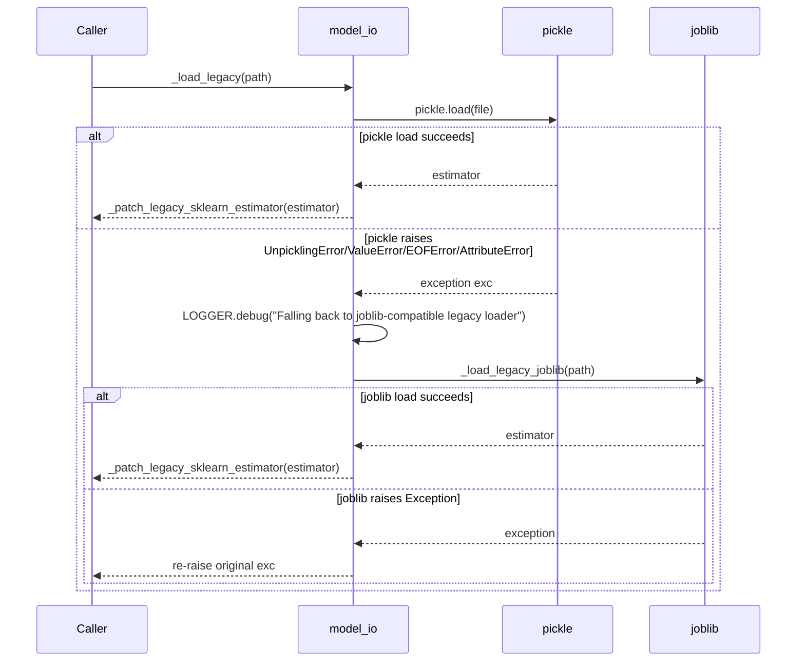
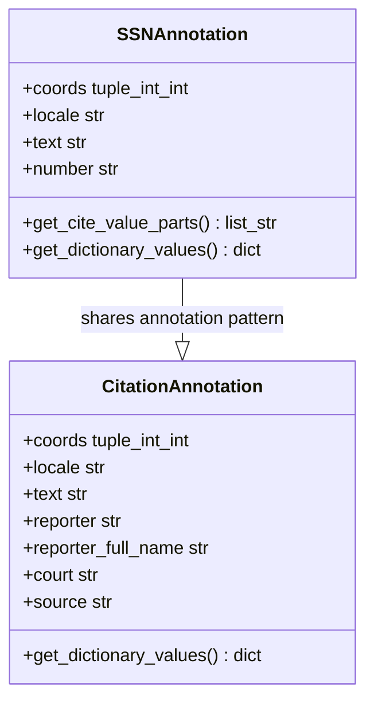
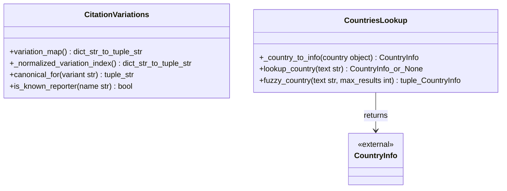
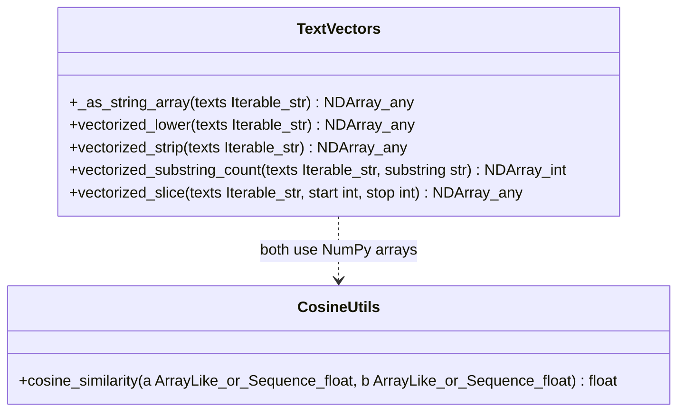
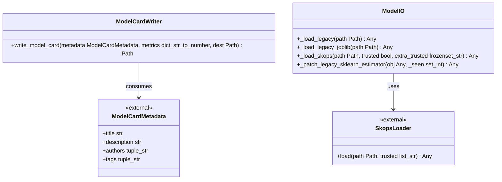

# PR Comments Export

> Exported from [https://github.com/arthrod/lexpredict-lexnlp/pull/22](https://github.com/arthrod/lexpredict-lexnlp/pull/22)  
> 24 of 24 comments selected  
> Generated by [Cicero](https://cicero.im) on 4/26/2026, 6:23:53 PM

---

### coderabbitai[bot] &mdash; 4/25/2026, 3:19:58 PM


<details>
<summary>♻️ Duplicate comments (1)</summary><blockquote>

<details>
<summary>lexnlp/extract/common/tests/test_countries.py (1)</summary><blockquote>

`176-183`: _⚠️ Potential issue_ | _🟡 Minor_

**Remove the unjustified `# type: ignore[misc]` suppression.**

The suppression on line 183 lacks an inline justification comment. Use `setattr()` to test mutation without needing a type suppression.

<details>
<summary>Proposed fix</summary>

```diff
     def test_result_is_frozen(self) -> None:
         """CountryInfo is a frozen dataclass — mutation must raise."""
         import pytest

         info = lookup_country("GB")
         assert info is not None
         with pytest.raises((AttributeError, TypeError)):
-            info.alpha_2 = "XX"  # type: ignore[misc]
+            setattr(info, "alpha_2", "XX")
```
</details>

As per coding guidelines, "Each suppression MUST have inline justification comment. FAIL if any suppression lacks justification."

<details>
<summary>🤖 Prompt for AI Agents</summary>

```
Verify each finding against the current code and only fix it if needed.

In `@lexnlp/extract/common/tests/test_countries.py` around lines 176 - 183, The
test test_result_is_frozen uses an unjustified "# type: ignore[misc]"
suppression when assigning to info.alpha_2; remove that suppression and instead
attempt the mutation via setattr(info, "alpha_2", "XX") so the type checker is
not bypassed and the runtime raises the expected AttributeError/TypeError;
update the assertion block that calls lookup_country("GB") and the with
pytest.raises(...) to use setattr(info, "alpha_2", "XX") to test immutability of
the CountryInfo instance.
```

</details>

</blockquote></details>

</blockquote></details>

<details>
<summary>🤖 Prompt for all review comments with AI agents</summary>

```
Verify each finding against the current code and only fix it if needed.

Duplicate comments:
In `@lexnlp/extract/common/tests/test_countries.py`:
- Around line 176-183: The test test_result_is_frozen uses an unjustified "#
type: ignore[misc]" suppression when assigning to info.alpha_2; remove that
suppression and instead attempt the mutation via setattr(info, "alpha_2", "XX")
so the type checker is not bypassed and the runtime raises the expected
AttributeError/TypeError; update the assertion block that calls
lookup_country("GB") and the with pytest.raises(...) to use setattr(info,
"alpha_2", "XX") to test immutability of the CountryInfo instance.
```

</details>

---

<details>
<summary>ℹ️ Review info</summary>

<details>
<summary>⚙️ Run configuration</summary>

**Configuration used**: Organization UI

**Review profile**: CHILL

**Plan**: Pro

**Run ID**: `2c89c3be-d663-47ec-9fd5-99c60d6a54d0`

</details>

<details>
<summary>📥 Commits</summary>

Reviewing files that changed from the base of the PR and between e85ab157588535e4551bb639de8a237f37ea15eb and 5f70e71daf5bfe2900eec17bd791e9376d26d472.

</details>

<details>
<summary>📒 Files selected for processing (3)</summary>

* `lexnlp/extract/common/tests/test_countries.py`
* `lexnlp/ml/tests/test_model_io.py`
* `lexnlp/utils/tests/test_text_vectors.py`

</details>

<details>
<summary>✅ Files skipped from review due to trivial changes (1)</summary>

* lexnlp/ml/tests/test_model_io.py

</details>

</details>

<details>
<summary>📜 Review details</summary>

<details>
<summary>🧰 Additional context used</summary>

<details>
<summary>📓 Path-based instructions (4)</summary>

<details>
<summary>**/*.{py,ts,tsx}</summary>


**📄 CodeRabbit inference engine (Custom checks)**

> `**/*.{py,ts,tsx}`: Identify changed production files and verify corresponding test changes. FAIL if a changed production file has zero associated test file AND introduces new exported functions, classes, or public methods. Exceptions: config files, .d.ts files, migrations, generated code.
> No lint suppression creep: Scan diff for newly added suppression comments. Python: # noqa, # type: ignore. TypeScript: // biome-ignore, // eslint-disable, `@ts-ignore`, `@ts-expect-error`, // oxlint-ignore. Each suppression MUST have inline justification comment. FAIL if any suppression lacks justification. WARN if total new suppressions > 3 in PR.
> Import ordering and dead imports check: Python - run `uv run ruff check --select I,F401 .`. TypeScript - run `bun run biome check --formatter-enabled=false --linter-enabled=false --organize-imports-enabled=true .`. FAIL if violations found.

Files:
- `lexnlp/utils/tests/test_text_vectors.py`
- `lexnlp/extract/common/tests/test_countries.py`

</details>
<details>
<summary>**/*{test,spec,__mocks__}*.{py,ts,tsx}</summary>


**📄 CodeRabbit inference engine (Custom checks)**

> New test quality spot-check: Verify each new test file contains at least one assertion (assert, expect, assertEqual, toBe, toEqual, toThrow, rejects, etc.). FAIL if any new test file has zero assertions.

Files:
- `lexnlp/utils/tests/test_text_vectors.py`
- `lexnlp/extract/common/tests/test_countries.py`

</details>
<details>
<summary>**/*.py</summary>


**📄 CodeRabbit inference engine (Custom checks)**

> `**/*.py`: Python lint with ruff: Run `uv run ruff check . --diff` and `uv run ruff format --check --diff .`. FAIL if exit code != 0 for either.
> Python type checking: Run `uv run ty check` (or fallback to mypy/pyright if configured). FAIL if exit code != 0. If no type checker configured, FAIL with 'No Python type checker configured. Add ty to dev dependencies.'
> Strict null/undefined audit for Python: Scan diff for new bare `type: ignore` without error code and `cast()` calls without explanation comment. WARN for each. FAIL if bare `type: ignore` count > 3.
> 
> `**/*.py`: Python requirement: support versions >=3.10,<3.13 with default development on Python 3.11
> Use pylint with `.pylintrc` configuration for code quality checks

Files:
- `lexnlp/utils/tests/test_text_vectors.py`
- `lexnlp/extract/common/tests/test_countries.py`

</details>
<details>
<summary>**/*test*.py</summary>


**📄 CodeRabbit inference engine (AGENTS.md)**

> `**/*test*.py`: Do not add, remove, or modify `skip`, `skipif`, or `xfail` markers to bypass test failures; fix failing behavior or document a real external blocker
> All `skip`/`skipif`/`xfail` markers genuinely required (e.g., external dependency outage) must include inline annotation: `skip-audit: issue=<link-or-id> expires=YYYY-MM-DD`; CI enforces this via `ci/skip_audit.py`

Files:
- `lexnlp/utils/tests/test_text_vectors.py`
- `lexnlp/extract/common/tests/test_countries.py`

</details>

</details>

</details>

<details>
<summary>🔇 Additional comments (8)</summary><blockquote>

<details>
<summary>lexnlp/utils/tests/test_text_vectors.py (4)</summary><blockquote>

`116-119`: **Clear test sectioning for PR-specific coverage.**

The added section header improves readability and makes the intent of the new test block explicit.

---

`121-166`: **Good targeted coverage of `_as_string_array` behavior paths.**

Nice coverage across ndarray, list input, `__array__` protocol objects, and generator materialization, with concrete assertions on outputs and dtype characteristics.

---

`168-183`: **`vectorized_lower` regression coverage looks solid.**

These tests appropriately protect variable-length/unicode lowercasing and compatibility with existing `np.str_` ndarray inputs.

---

`185-199`: **`vectorized_strip` mixed-length and unicode-whitespace tests are useful additions.**

This improves confidence around non-ASCII whitespace handling and correctness with very different string lengths.

</blockquote></details>
<details>
<summary>lexnlp/extract/common/tests/test_countries.py (4)</summary><blockquote>

`54-56`: **LGTM!**

The updated assertion correctly tests the upper bound semantics (`<= 3`) rather than requiring exactly 3 results. This aligns with the implementation that uses `matches[:max_results]` slicing—fewer candidates may exist than the requested cap.

---

`64-71`: **LGTM!**

The test correctly validates both `max_results=0` and `max_results=-1` raise `ValueError` with the expected message. This aligns with the implementation's `if max_results <= 0:` check.

---

`99-148`: **LGTM!**

Comprehensive boundary tests for `max_results` validation. The coverage includes:
- Upper bound enforcement for various cap values
- Equivalence between default and explicit `max_results=1`
- Large values don't raise (edge case)
- Error message content verification
- Return type and element type contract verification

---

`150-175`: **LGTM!**

The additional `lookup_country` tests properly verify:
- Return type is `CountryInfo` with populated fields
- Whitespace stripping behavior (matching `text.strip()` in implementation)
- `official_name` attribute existence

The whitespace test now correctly guards attribute access with `assert info_plain is not None` and `assert info_padded is not None`, addressing the previous review feedback.

</blockquote></details>

</blockquote></details>

</details>

<!-- This is an auto-generated comment by CodeRabbit for review status -->

---

### coderabbitai[bot] &mdash; 4/25/2026, 3:10:33 PM

<!-- This is an auto-generated comment: autofix status by CodeRabbit -->
> [!NOTE]
> Autofix is a beta feature. Expect some limitations and changes as we gather feedback and continue to improve it.

## Fixes Applied Successfully

Fixed 3 file(s) based on 3 unresolved review comments.


**Files modified:**
- `lexnlp/extract/common/tests/test_countries.py`
- `lexnlp/ml/tests/test_model_io.py`
- `lexnlp/utils/tests/test_text_vectors.py`

**Commit:** `5f70e71daf5bfe2900eec17bd791e9376d26d472`

The changes have been pushed to the `claude/fix-commented-issues-s4G30` branch.

**Time taken:** `3m 30s`
<!-- autofix-run-id: 97ae0123-3479-4843-adf2-62ef1775bc79 -->

---

### coderabbitai[bot] &mdash; 4/25/2026, 3:02:25 PM

**Actionable comments posted: 3**

<details>
<summary>♻️ Duplicate comments (2)</summary><blockquote>

<details>
<summary>lexnlp/ml/tests/test_model_card.py (1)</summary><blockquote>

`134-137`: _⚠️ Potential issue_ | _🟡 Minor_

**Narrow the expected exception in `test_frozen` (Line 134).**

Catching `Exception` makes the test pass on unrelated failures and weakens what it proves.

<details>
<summary>🔧 Suggested fix</summary>

```diff
-        with self.assertRaises((AttributeError, Exception)):
+        with self.assertRaises(AttributeError):
             # type: ignore[misc] — intentionally mutating a frozen dataclass
             # attribute to assert immutability is enforced at runtime.
             md.description = "changed"  # type: ignore[misc]
```
</details>

<details>
<summary>🤖 Prompt for AI Agents</summary>

```
Verify each finding against the current code and only fix it if needed.

In `@lexnlp/ml/tests/test_model_card.py` around lines 134 - 137, The test
currently broad-catches Exception in the test_frozen block, which is too
permissive; change the assertion to expect the precise frozen-dataclass error
(use dataclasses.FrozenInstanceError or AttributeError) instead of
(AttributeError, Exception), e.g. update the with self.assertRaises(...) line
around the md.description = "changed" assignment to use
dataclasses.FrozenInstanceError and add the necessary import from dataclasses if
missing so the test only passes for the immutability violation.
```

</details>

</blockquote></details>
<details>
<summary>lexnlp/ml/tests/test_model_io.py (1)</summary><blockquote>

`361-363`: _⚠️ Potential issue_ | _🟠 Major_

**Remove or justify the suppression at Line 361.**

`# type: ignore[no-untyped-def]` was added without inline rationale. Please type the helper or add a concise justification.
 
<details>
<summary>Suggested fix</summary>

```diff
-        def fake_skops_load(p, trusted):  # type: ignore[no-untyped-def]
+        def fake_skops_load(p: Path, trusted: list[str]) -> dict[str, int]:
             captured["trusted"] = list(trusted)
             return {"x": 1}
```
</details>
As per coding guidelines, "No lint suppression creep: ... Each suppression MUST have inline justification comment. FAIL if any suppression lacks justification."

<details>
<summary>🤖 Prompt for AI Agents</summary>

```
Verify each finding against the current code and only fix it if needed.

In `@lexnlp/ml/tests/test_model_io.py` around lines 361 - 363, The helper function
fake_skops_load currently suppresses type checking with "# type:
ignore[no-untyped-def]" without justification; either add a proper type
signature (e.g., annotate parameters p and trusted and the return type) to
remove the suppression, or keep the suppression but replace it with an inline
justification comment (e.g., "# type: ignore[no-untyped-def]  # test shim:
mimics skops.load signature with dynamic types" ) so the suppression has a
concise rationale; locate the fake_skops_load helper in test_model_io.py and
apply one of these fixes.
```

</details>

</blockquote></details>

</blockquote></details>

<details>
<summary>🧹 Nitpick comments (8)</summary><blockquote>

<details>
<summary>lexnlp/extract/common/annotations/tests/test_citation_annotation_bugfix.py (1)</summary><blockquote>

`41-147`: **Consider parameterizing the court/source presence matrix to reduce duplication.**

The four near-identical setup/assertion tests can be compacted into a single parametrized test for easier maintenance while preserving behavior coverage.  


<details>
<summary>♻️ Optional refactor sketch</summary>

```diff
+import pytest
+
+@pytest.mark.parametrize(
+    "kwargs,present,absent",
+    [
+        ({"court": "SCOTUS", "reporter": None}, {"Extracted Entity Court": "SCOTUS"}, ["Extracted Entity Source"]),
+        ({"source": "Roe v. Wade, 410 U.S. 113 (1973)", "reporter": None}, {"Extracted Entity Source": "Roe v. Wade, 410 U.S. 113 (1973)"}, ["Extracted Entity Court"]),
+        ({"reporter": "U.S.", "court": None}, {}, ["Extracted Entity Court"]),
+        ({"reporter": "U.S.", "source": None}, {}, ["Extracted Entity Source"]),
+    ],
+)
+def test_court_source_tag_rules(kwargs, present, absent):
+    ann = CitationAnnotation(coords=(0, 30), **kwargs)
+    tags = ann.get_dictionary_values().tags
+    for key, value in present.items():
+        assert tags[key] == value
+    for key in absent:
+        assert key not in tags
```
</details>

<details>
<summary>🤖 Prompt for AI Agents</summary>

```
Verify each finding against the current code and only fix it if needed.

In `@lexnlp/extract/common/annotations/tests/test_citation_annotation_bugfix.py`
around lines 41 - 147, Several near-duplicate tests
(test_court_tag_included_when_court_set_and_reporter_none,
test_source_tag_included_when_source_set_and_reporter_none,
test_court_tag_absent_when_court_is_none,
test_source_tag_absent_when_source_is_none) check the same presence/absence
matrix and should be collapsed into a single parametrized pytest that iterates
over combinations of court and source values; instantiate CitationAnnotation
with the given reporter/court/source combinations, call get_dictionary_values(),
and assert membership and value of "Extracted Entity Court"/"Extracted Entity
Source" in d.tags accordingly. Use pytest.mark.parametrize to supply tuples like
(court, source, expected_court_tag, expected_source_tag) and reference the
CitationAnnotation constructor and get_dictionary_values() in the test body to
keep behavior identical while removing duplication.
```

</details>

</blockquote></details>
<details>
<summary>lexnlp/extract/common/annotations/tests/test_ssn_annotation_none_number.py (1)</summary><blockquote>

`40-57`: **Optional: consolidate repetitive cite-value cases with parametrization.**

The three value-shape tests plus length-contract test can be merged into one parametrized test to reduce duplication and keep future cases easier to add.  


<details>
<summary>♻️ Example refactor</summary>

```diff
+import pytest
+
 class TestSsnAnnotationGetCiteValueParts:
@@
-    def test_populated_number_returned_as_is(self) -> None:
-        """When number has a value it must appear in the result unchanged."""
-        ann = SsnAnnotation(coords=(0, 11), number="123-45-6789")
-        parts = ann.get_cite_value_parts()
-        assert parts == ["123-45-6789"]
-
-    def test_empty_string_number_returned_unchanged(self) -> None:
-        """An explicitly set empty string is already a valid str and passes through."""
-        ann = SsnAnnotation(coords=(0, 5), number="")
-        parts = ann.get_cite_value_parts()
-        assert parts == [""]
-
-    def test_returns_list_of_length_one(self) -> None:
-        """Contract: exactly one element regardless of value."""
-        for number in (None, "", "000-00-0000", "987-65-4321"):
-            ann = SsnAnnotation(coords=(0, 0), number=number)
-            parts = ann.get_cite_value_parts()
-            assert len(parts) == 1, f"Expected 1 element for number={number!r}, got {len(parts)}"
+    `@pytest.mark.parametrize`(
+        ("number", "expected"),
+        [
+            (None, [""]),
+            ("", [""]),
+            ("123-45-6789", ["123-45-6789"]),
+            ("987-65-4321", ["987-65-4321"]),
+        ],
+    )
+    def test_get_cite_value_parts_contract(
+        self, number: str | None, expected: list[str]
+    ) -> None:
+        ann = SsnAnnotation(coords=(0, 11), number=number)
+        parts = ann.get_cite_value_parts()
+        assert parts == expected
+        assert len(parts) == 1
+        assert all(isinstance(part, str) for part in parts)
```
</details>

<details>
<summary>🤖 Prompt for AI Agents</summary>

```
Verify each finding against the current code and only fix it if needed.

In `@lexnlp/extract/common/annotations/tests/test_ssn_annotation_none_number.py`
around lines 40 - 57, Consolidate the three individual tests
(test_populated_number_returned_as_is,
test_empty_string_number_returned_unchanged, test_returns_list_of_length_one)
into a single parametrized pytest that iterates over sample number values (e.g.,
None, "", "000-00-0000", "987-65-4321", "123-45-6789") and for each constructs
SsnAnnotation(coords=(0,0), number=number), calls
SsnAnnotation.get_cite_value_parts(), and asserts both the returned list equals
the expected single-item value and that len(parts) == 1 to preserve the
contract; use pytest.mark.parametrize to drive the cases so future values are
easy to add and duplication is removed.
```

</details>

</blockquote></details>
<details>
<summary>lexnlp/extract/en/tests/test_citation_variations.py (2)</summary><blockquote>

`156-166`: **Ensure this test actually exercises dot-space normalization.**

`next(iter(vm))` can pick a variant without `"."`, making `spaced` equal to `known` and bypassing the intended path. Select a dotted variant explicitly.


<details>
<summary>Proposed robustness tweak</summary>

```diff
         vm = variation_map()
         if not vm:
             return
-        known = next(iter(vm))
+        known = next((k for k in vm if "." in k), None)
+        if known is None:
+            return
         # Add spaces around every "." in the known variant.
         spaced = known.replace(".", " . ")
```
</details>

<details>
<summary>🤖 Prompt for AI Agents</summary>

```
Verify each finding against the current code and only fix it if needed.

In `@lexnlp/extract/en/tests/test_citation_variations.py` around lines 156 - 166,
The test test_space_normalization_is_idempotent can pick a variant without dots,
so change the selection logic for the known variant from
next(iter(variation_map())) to explicitly choose a variant that contains a ".";
use variation_map() (or iterate its keys) to find the first key with a "." and
assign that to known (and fail the test if none found). Ensure you still call
canonical_for(spaced) after replacing each "." with " . " so the test actually
exercises dot-space normalization.
```

</details>

---

`72-89`: **Strengthen normalized-index test to verify values, not only keys.**

This currently passes even if `_normalized_variation_index()` maps a normalized key to the wrong canonical tuple. Comparing full dict equality catches value regressions too.


<details>
<summary>Proposed test tightening</summary>

```diff
     def test_index_is_consistent_with_variation_map(self) -> None:
         """The stripped index must contain exactly the same entries as
         variation_map() after stripping spaces from keys."""
@@
         vm = variation_map()
         index = _normalized_variation_index()
-        # Every variation_map key, when stripped of spaces, must appear in the index.
-        for variation, canons in vm.items():
-            stripped = variation.replace(" ", "")
-            # The index may merge multiple original keys that normalise to the
-            # same stripped form; the expected canons are a subset of index values.
-            assert stripped in index, (
-                f"Stripped key '{stripped}' (from '{variation}') missing from index"
-            )
+        expected = {variation.replace(" ", ""): canons for variation, canons in vm.items()}
+        assert index == expected
```
</details>

<details>
<summary>🤖 Prompt for AI Agents</summary>

```
Verify each finding against the current code and only fix it if needed.

In `@lexnlp/extract/en/tests/test_citation_variations.py` around lines 72 - 89,
The test currently only asserts that each stripped key from variation_map()
exists in _normalized_variation_index(), but doesn't verify the mapped canonical
values; update the test to build an expected_index by iterating vm =
variation_map(), computing stripped = variation.replace(" ", ""), and
aggregating/merging all canons for the same stripped key (e.g., union of tuples)
into a canonical sequence for that stripped key, then assert that index =
_normalized_variation_index() exactly equals this expected_index (or equals
after normalizing ordering/tuple vs list types as needed) so the test fails if
values are wrong or merged incorrectly.
```

</details>

</blockquote></details>
<details>
<summary>lexnlp/ml/tests/test_model_card.py (1)</summary><blockquote>

`149-166`: **Consider consolidating duplicated estimator fixture setup.**

`TestWriteModelCardAdditional._fitted_estimator` repeats logic already present in `TestWriteModelCard`; extracting a shared helper would reduce drift risk and maintenance overhead.

<details>
<summary>🤖 Prompt for AI Agents</summary>

```
Verify each finding against the current code and only fix it if needed.

In `@lexnlp/ml/tests/test_model_card.py` around lines 149 - 166,
TestWriteModelCardAdditional._fitted_estimator duplicates setup from
TestWriteModelCard; refactor by extracting the estimator creation into a shared
helper used by both tests (either a module-level function like
create_fitted_logistic_estimator or a common base class method on
TestWriteModelCard that TestWriteModelCardAdditional inherits), update both
classes to call that helper instead of duplicating the LogisticRegression fit
logic, and ensure imports (sklearn.linear_model.LogisticRegression) remain
available to the shared helper.
```

</details>

</blockquote></details>
<details>
<summary>lexnlp/ml/tests/test_model_io.py (2)</summary><blockquote>

`376-383`: **Consider consolidating overlapping `trusted=False` scan-skip tests.**

These two tests validate the same behavior (`get_untrusted_types` not called when `trusted=False`), so one parametrized/shared case would reduce duplication.


Also applies to: 463-472

<details>
<summary>🤖 Prompt for AI Agents</summary>

```
Verify each finding against the current code and only fix it if needed.

In `@lexnlp/ml/tests/test_model_io.py` around lines 376 - 383, Two tests in this
file test the same behavior (that get_untrusted_types is not called when
trusted=False): the existing
test_load_skips_get_untrusted_types_when_not_trusted and another redundant test;
consolidate them by either parametrizing or extracting a small helper to avoid
duplication. Change the tests to a single pytest.mark.parametrize (or a shared
helper) that calls dump_model(...) and _load_skops(path, trusted=False) while
patching lexnlp.ml.model_io.get_untrusted_types to assert it is not called,
referencing get_untrusted_types, _load_skops, and dump_model to locate the code
to update.
```

</details>

---

`414-427`: **Tighten the exception assertion to match the documented contract.**

At Line 425, `pytest.raises(Exception)` is too broad for a test that documents the original pickle exception is re-raised. Since `_load_legacy` catches `pickle.UnpicklingError` and re-raises it when joblib also fails, the assertion should validate this specific exception type.

<details>
<summary>Suggested fix</summary>

```diff
-        with pytest.raises(Exception):
+        with pytest.raises(pickle.UnpicklingError):
             _load_legacy(path)
```
</details>

<details>
<summary>🤖 Prompt for AI Agents</summary>

```
Verify each finding against the current code and only fix it if needed.

In `@lexnlp/ml/tests/test_model_io.py` around lines 414 - 427, The test
test_double_failure_reraises_original_pickle_exception currently uses
pytest.raises(Exception) which is too broad; update it to assert the specific
exception pickle.UnpicklingError is raised when _load_legacy fails twice. Modify
the test to use pytest.raises(pickle.UnpicklingError) and add/import the pickle
module at the top of the test file if not already present, keeping the rest of
the test (path creation and corrupt file contents, and calling _load_legacy)
unchanged.
```

</details>

</blockquote></details>
<details>
<summary>lexnlp/utils/tests/test_text_vectors.py (1)</summary><blockquote>

`182-188`: **Test intent and assertion strength are mismatched.**

`test_strips_unicode_whitespace` currently validates only length, so the strip behavior can regress undetected. Either assert output semantics or rename the test to reflect “no-crash/shape” behavior.

<details>
<summary>🤖 Prompt for AI Agents</summary>

```
Verify each finding against the current code and only fix it if needed.

In `@lexnlp/utils/tests/test_text_vectors.py` around lines 182 - 188, The test
test_strips_unicode_whitespace currently only checks length, which lets
stripping behavior regress; update the test for clarity by either (A)
strengthening the assertion to verify actual stripped content using
vectorized_strip — e.g. assert result[0] == "foo" and result[1] == "bar"
(references: vectorized_strip, test_strips_unicode_whitespace) or (B) if
behavior across NumPy versions is intentionally non-deterministic, rename the
test to reflect “no-crash/shape” semantics (e.g. test_preserves_length_no_crash)
and keep the length-only assertion; pick one approach and apply it to the test
method accordingly.
```

</details>

</blockquote></details>

</blockquote></details>

<details>
<summary>🤖 Prompt for all review comments with AI agents</summary>

```
Verify each finding against the current code and only fix it if needed.

Inline comments:
In `@lexnlp/extract/common/tests/test_countries.py`:
- Around line 162-168: Remove the unjustified "# type: ignore[union-attr]"
suppressions in tests and make the value non-optional for the type checker
instead: in test_whitespace_stripped_before_lookup (and the other test with the
suppression) remove the ignore comment and ensure you narrow the Optional return
from lookup_country by asserting the result is not None (e.g., keep assert
info_padded is not None and assert info_plain is not None before accessing
.alpha_2) or apply typing.cast to the expected CountryInfo type; update the
tests so attribute access on info_padded.alpha_2 / info_plain.alpha_2 is guarded
by these non-None assertions (or explicit casts) instead of using type ignores.

In `@lexnlp/ml/tests/test_model_io.py`:
- Around line 507-508: The two test helper stubs (fake_skops_load and the other
helper at lines around 526–527) currently use bare "# type:
ignore[no-untyped-def]" without justification; update each definition to either
add a proper type signature or retain the suppression but append an inline
justification comment (e.g., "# type: ignore[no-untyped-def]  # test stub:
simple dict return, typing not needed" ) so they comply with the suppression
policy; ensure you edit the fake_skops_load function and the other test helper
stub to include the justification text next to the existing ignore or add typing
annotations to remove the need for the ignore.

In `@lexnlp/utils/tests/test_text_vectors.py`:
- Around line 133-140: Replace the direct isinstance assertions against
np.dtypes.StringDType in the tests to avoid pylint E1101 by checking the dtype
object's class name and module instead; locate the two assertions in
test_text_vectors.py (within the test that calls _as_string_array and the
list-input test) and change them to fetch out.dtype, then assert that
dtype.__class__.__name__ == "StringDType" and that dtype.__class__.__module__
startswith("numpy") (or contains "numpy") to preserve intent without referencing
the runtime-only np.dtypes.Symbol.

---

Duplicate comments:
In `@lexnlp/ml/tests/test_model_card.py`:
- Around line 134-137: The test currently broad-catches Exception in the
test_frozen block, which is too permissive; change the assertion to expect the
precise frozen-dataclass error (use dataclasses.FrozenInstanceError or
AttributeError) instead of (AttributeError, Exception), e.g. update the with
self.assertRaises(...) line around the md.description = "changed" assignment to
use dataclasses.FrozenInstanceError and add the necessary import from
dataclasses if missing so the test only passes for the immutability violation.

In `@lexnlp/ml/tests/test_model_io.py`:
- Around line 361-363: The helper function fake_skops_load currently suppresses
type checking with "# type: ignore[no-untyped-def]" without justification;
either add a proper type signature (e.g., annotate parameters p and trusted and
the return type) to remove the suppression, or keep the suppression but replace
it with an inline justification comment (e.g., "# type: ignore[no-untyped-def] 
# test shim: mimics skops.load signature with dynamic types" ) so the
suppression has a concise rationale; locate the fake_skops_load helper in
test_model_io.py and apply one of these fixes.

---

Nitpick comments:
In `@lexnlp/extract/common/annotations/tests/test_citation_annotation_bugfix.py`:
- Around line 41-147: Several near-duplicate tests
(test_court_tag_included_when_court_set_and_reporter_none,
test_source_tag_included_when_source_set_and_reporter_none,
test_court_tag_absent_when_court_is_none,
test_source_tag_absent_when_source_is_none) check the same presence/absence
matrix and should be collapsed into a single parametrized pytest that iterates
over combinations of court and source values; instantiate CitationAnnotation
with the given reporter/court/source combinations, call get_dictionary_values(),
and assert membership and value of "Extracted Entity Court"/"Extracted Entity
Source" in d.tags accordingly. Use pytest.mark.parametrize to supply tuples like
(court, source, expected_court_tag, expected_source_tag) and reference the
CitationAnnotation constructor and get_dictionary_values() in the test body to
keep behavior identical while removing duplication.

In `@lexnlp/extract/common/annotations/tests/test_ssn_annotation_none_number.py`:
- Around line 40-57: Consolidate the three individual tests
(test_populated_number_returned_as_is,
test_empty_string_number_returned_unchanged, test_returns_list_of_length_one)
into a single parametrized pytest that iterates over sample number values (e.g.,
None, "", "000-00-0000", "987-65-4321", "123-45-6789") and for each constructs
SsnAnnotation(coords=(0,0), number=number), calls
SsnAnnotation.get_cite_value_parts(), and asserts both the returned list equals
the expected single-item value and that len(parts) == 1 to preserve the
contract; use pytest.mark.parametrize to drive the cases so future values are
easy to add and duplication is removed.

In `@lexnlp/extract/en/tests/test_citation_variations.py`:
- Around line 156-166: The test test_space_normalization_is_idempotent can pick
a variant without dots, so change the selection logic for the known variant from
next(iter(variation_map())) to explicitly choose a variant that contains a ".";
use variation_map() (or iterate its keys) to find the first key with a "." and
assign that to known (and fail the test if none found). Ensure you still call
canonical_for(spaced) after replacing each "." with " . " so the test actually
exercises dot-space normalization.
- Around line 72-89: The test currently only asserts that each stripped key from
variation_map() exists in _normalized_variation_index(), but doesn't verify the
mapped canonical values; update the test to build an expected_index by iterating
vm = variation_map(), computing stripped = variation.replace(" ", ""), and
aggregating/merging all canons for the same stripped key (e.g., union of tuples)
into a canonical sequence for that stripped key, then assert that index =
_normalized_variation_index() exactly equals this expected_index (or equals
after normalizing ordering/tuple vs list types as needed) so the test fails if
values are wrong or merged incorrectly.

In `@lexnlp/ml/tests/test_model_card.py`:
- Around line 149-166: TestWriteModelCardAdditional._fitted_estimator duplicates
setup from TestWriteModelCard; refactor by extracting the estimator creation
into a shared helper used by both tests (either a module-level function like
create_fitted_logistic_estimator or a common base class method on
TestWriteModelCard that TestWriteModelCardAdditional inherits), update both
classes to call that helper instead of duplicating the LogisticRegression fit
logic, and ensure imports (sklearn.linear_model.LogisticRegression) remain
available to the shared helper.

In `@lexnlp/ml/tests/test_model_io.py`:
- Around line 376-383: Two tests in this file test the same behavior (that
get_untrusted_types is not called when trusted=False): the existing
test_load_skips_get_untrusted_types_when_not_trusted and another redundant test;
consolidate them by either parametrizing or extracting a small helper to avoid
duplication. Change the tests to a single pytest.mark.parametrize (or a shared
helper) that calls dump_model(...) and _load_skops(path, trusted=False) while
patching lexnlp.ml.model_io.get_untrusted_types to assert it is not called,
referencing get_untrusted_types, _load_skops, and dump_model to locate the code
to update.
- Around line 414-427: The test
test_double_failure_reraises_original_pickle_exception currently uses
pytest.raises(Exception) which is too broad; update it to assert the specific
exception pickle.UnpicklingError is raised when _load_legacy fails twice. Modify
the test to use pytest.raises(pickle.UnpicklingError) and add/import the pickle
module at the top of the test file if not already present, keeping the rest of
the test (path creation and corrupt file contents, and calling _load_legacy)
unchanged.

In `@lexnlp/utils/tests/test_text_vectors.py`:
- Around line 182-188: The test test_strips_unicode_whitespace currently only
checks length, which lets stripping behavior regress; update the test for
clarity by either (A) strengthening the assertion to verify actual stripped
content using vectorized_strip — e.g. assert result[0] == "foo" and result[1] ==
"bar" (references: vectorized_strip, test_strips_unicode_whitespace) or (B) if
behavior across NumPy versions is intentionally non-deterministic, rename the
test to reflect “no-crash/shape” semantics (e.g. test_preserves_length_no_crash)
and keep the length-only assertion; pick one approach and apply it to the test
method accordingly.
```

</details>

<details>
<summary>🪄 Autofix (Beta)</summary>

✅ Autofix completed

</details>

---

<details>
<summary>ℹ️ Review info</summary>

<details>
<summary>⚙️ Run configuration</summary>

**Configuration used**: Organization UI

**Review profile**: CHILL

**Plan**: Pro

**Run ID**: `b4e30dd0-f4fa-40bd-a5bc-56dfddaf1434`

</details>

<details>
<summary>📥 Commits</summary>

Reviewing files that changed from the base of the PR and between f722d53ae923df598b4ee9c39fcc246d3746b7d2 and e85ab157588535e4551bb639de8a237f37ea15eb.

</details>

<details>
<summary>📒 Files selected for processing (9)</summary>

* `lexnlp/extract/batch/tests/test_parallel_rng.py`
* `lexnlp/extract/common/annotations/tests/test_citation_annotation_bugfix.py`
* `lexnlp/extract/common/annotations/tests/test_ssn_annotation_none_number.py`
* `lexnlp/extract/common/tests/test_countries.py`
* `lexnlp/extract/en/tests/test_citation_variations.py`
* `lexnlp/ml/tests/test_model_card.py`
* `lexnlp/ml/tests/test_model_io.py`
* `lexnlp/utils/tests/test_cosine.py`
* `lexnlp/utils/tests/test_text_vectors.py`

</details>

<details>
<summary>🚧 Files skipped from review as they are similar to previous changes (1)</summary>

* lexnlp/utils/tests/test_cosine.py

</details>

</details>

<details>
<summary>📜 Review details</summary>

<details>
<summary>🧰 Additional context used</summary>

<details>
<summary>📓 Path-based instructions (4)</summary>

<details>
<summary>**/*.{py,ts,tsx}</summary>


**📄 CodeRabbit inference engine (Custom checks)**

> `**/*.{py,ts,tsx}`: Identify changed production files and verify corresponding test changes. FAIL if a changed production file has zero associated test file AND introduces new exported functions, classes, or public methods. Exceptions: config files, .d.ts files, migrations, generated code.
> No lint suppression creep: Scan diff for newly added suppression comments. Python: # noqa, # type: ignore. TypeScript: // biome-ignore, // eslint-disable, `@ts-ignore`, `@ts-expect-error`, // oxlint-ignore. Each suppression MUST have inline justification comment. FAIL if any suppression lacks justification. WARN if total new suppressions > 3 in PR.
> Import ordering and dead imports check: Python - run `uv run ruff check --select I,F401 .`. TypeScript - run `bun run biome check --formatter-enabled=false --linter-enabled=false --organize-imports-enabled=true .`. FAIL if violations found.

Files:
- `lexnlp/extract/common/annotations/tests/test_ssn_annotation_none_number.py`
- `lexnlp/extract/en/tests/test_citation_variations.py`
- `lexnlp/utils/tests/test_text_vectors.py`
- `lexnlp/extract/common/tests/test_countries.py`
- `lexnlp/extract/common/annotations/tests/test_citation_annotation_bugfix.py`
- `lexnlp/ml/tests/test_model_io.py`
- `lexnlp/ml/tests/test_model_card.py`
- `lexnlp/extract/batch/tests/test_parallel_rng.py`

</details>
<details>
<summary>**/*{test,spec,__mocks__}*.{py,ts,tsx}</summary>


**📄 CodeRabbit inference engine (Custom checks)**

> New test quality spot-check: Verify each new test file contains at least one assertion (assert, expect, assertEqual, toBe, toEqual, toThrow, rejects, etc.). FAIL if any new test file has zero assertions.

Files:
- `lexnlp/extract/common/annotations/tests/test_ssn_annotation_none_number.py`
- `lexnlp/extract/en/tests/test_citation_variations.py`
- `lexnlp/utils/tests/test_text_vectors.py`
- `lexnlp/extract/common/tests/test_countries.py`
- `lexnlp/extract/common/annotations/tests/test_citation_annotation_bugfix.py`
- `lexnlp/ml/tests/test_model_io.py`
- `lexnlp/ml/tests/test_model_card.py`
- `lexnlp/extract/batch/tests/test_parallel_rng.py`

</details>
<details>
<summary>**/*.py</summary>


**📄 CodeRabbit inference engine (Custom checks)**

> `**/*.py`: Python lint with ruff: Run `uv run ruff check . --diff` and `uv run ruff format --check --diff .`. FAIL if exit code != 0 for either.
> Python type checking: Run `uv run ty check` (or fallback to mypy/pyright if configured). FAIL if exit code != 0. If no type checker configured, FAIL with 'No Python type checker configured. Add ty to dev dependencies.'
> Strict null/undefined audit for Python: Scan diff for new bare `type: ignore` without error code and `cast()` calls without explanation comment. WARN for each. FAIL if bare `type: ignore` count > 3.
> 
> `**/*.py`: Python requirement: support versions >=3.10,<3.13 with default development on Python 3.11
> Use pylint with `.pylintrc` configuration for code quality checks

Files:
- `lexnlp/extract/common/annotations/tests/test_ssn_annotation_none_number.py`
- `lexnlp/extract/en/tests/test_citation_variations.py`
- `lexnlp/utils/tests/test_text_vectors.py`
- `lexnlp/extract/common/tests/test_countries.py`
- `lexnlp/extract/common/annotations/tests/test_citation_annotation_bugfix.py`
- `lexnlp/ml/tests/test_model_io.py`
- `lexnlp/ml/tests/test_model_card.py`
- `lexnlp/extract/batch/tests/test_parallel_rng.py`

</details>
<details>
<summary>**/*test*.py</summary>


**📄 CodeRabbit inference engine (AGENTS.md)**

> `**/*test*.py`: Do not add, remove, or modify `skip`, `skipif`, or `xfail` markers to bypass test failures; fix failing behavior or document a real external blocker
> All `skip`/`skipif`/`xfail` markers genuinely required (e.g., external dependency outage) must include inline annotation: `skip-audit: issue=<link-or-id> expires=YYYY-MM-DD`; CI enforces this via `ci/skip_audit.py`

Files:
- `lexnlp/extract/common/annotations/tests/test_ssn_annotation_none_number.py`
- `lexnlp/extract/en/tests/test_citation_variations.py`
- `lexnlp/utils/tests/test_text_vectors.py`
- `lexnlp/extract/common/tests/test_countries.py`
- `lexnlp/extract/common/annotations/tests/test_citation_annotation_bugfix.py`
- `lexnlp/ml/tests/test_model_io.py`
- `lexnlp/ml/tests/test_model_card.py`
- `lexnlp/extract/batch/tests/test_parallel_rng.py`

</details>

</details><details>
<summary>🪛 Pylint (4.0.5)</summary>

<details>
<summary>lexnlp/utils/tests/test_text_vectors.py</summary>

[error] 133-133: Module 'numpy.dtypes' has no 'StringDType' member

(E1101)

---

[error] 140-140: Module 'numpy.dtypes' has no 'StringDType' member

(E1101)

</details>
<details>
<summary>lexnlp/ml/tests/test_model_card.py</summary>

[error] 130-130: No value for argument 'description' in constructor call

(E1120)

</details>
<details>
<summary>lexnlp/extract/batch/tests/test_parallel_rng.py</summary>

[error] 83-83: Cannot import 'lexnlp.extract.batch.async_extract' due to 'invalid syntax (lexnlp.extract.batch.async_extract, line 72)'

(E0001)

---

[error] 83-83: No name 'async_extract' in module 'lexnlp.extract.batch'

(E0611)

---

[error] 101-101: Cannot import 'lexnlp.extract.batch.async_extract' due to 'invalid syntax (lexnlp.extract.batch.async_extract, line 72)'

(E0001)

---

[error] 101-101: No name 'async_extract' in module 'lexnlp.extract.batch'

(E0611)

---

[error] 111-111: Cannot import 'lexnlp.extract.batch.async_extract' due to 'invalid syntax (lexnlp.extract.batch.async_extract, line 72)'

(E0001)

---

[error] 111-111: No name 'async_extract' in module 'lexnlp.extract.batch'

(E0611)

---

[error] 125-125: Cannot import 'lexnlp.extract.batch.async_extract' due to 'invalid syntax (lexnlp.extract.batch.async_extract, line 72)'

(E0001)

---

[error] 125-125: No name 'async_extract' in module 'lexnlp.extract.batch'

(E0611)

---

[error] 140-140: Cannot import 'lexnlp.extract.batch.async_extract' due to 'invalid syntax (lexnlp.extract.batch.async_extract, line 72)'

(E0001)

---

[error] 140-140: No name 'async_extract' in module 'lexnlp.extract.batch'

(E0611)

</details>

</details>

</details>

<details>
<summary>🔇 Additional comments (12)</summary><blockquote>

<details>
<summary>lexnlp/extract/common/annotations/tests/test_citation_annotation_bugfix.py (1)</summary><blockquote>

`41-187`: **Strong regression coverage for the court/source conditional bugfix.**

This suite validates both inclusion and exclusion paths and protects the exact regression scenario where `reporter=None` should not suppress court/source tags.  


As per coding guidelines, `**/*{test,spec,__mocks__}*.{py,ts,tsx}`: New test quality spot-check: Verify each new test file contains at least one assertion.

</blockquote></details>
<details>
<summary>lexnlp/extract/common/annotations/tests/test_ssn_annotation_none_number.py (1)</summary><blockquote>

`27-73`: **Solid regression coverage for the None-safety fix.**

These tests correctly pin the `None` → `""` coercion contract and cover both cite-value and dictionary-tag behavior with concrete assertions.  


As per coding guidelines, "New test quality spot-check: Verify each new test file contains at least one assertion (assert, expect, assertEqual, toBe, toEqual, toThrow, rejects, etc.). FAIL if any new test file has zero assertions."

</blockquote></details>
<details>
<summary>lexnlp/extract/common/tests/test_countries.py (1)</summary><blockquote>

`99-148`: **Strong boundary and contract coverage for `fuzzy_country`.**

These additions nicely pin `max_results` behavior (bounds, invalid values, tuple contract, and `CountryInfo` element type).

</blockquote></details>
<details>
<summary>lexnlp/extract/en/tests/test_citation_variations.py (1)</summary><blockquote>

`136-155`: **Nice coverage expansion for canonical tuple contract.**

These tests clearly enforce that `canonical_for()` always returns a tuple and that known variants resolve to non-empty tuples when data exists.

</blockquote></details>
<details>
<summary>lexnlp/ml/tests/test_model_card.py (1)</summary><blockquote>

`70-98`: **Strong coverage addition for tags and precision-sensitive metrics.**

These tests directly guard the intended behavior changes and include clear assertions.

</blockquote></details>
<details>
<summary>lexnlp/ml/tests/test_model_io.py (2)</summary><blockquote>

`179-188`: **Good regression coverage for `joblib.dump(..., compress=0)` path.**

This test directly protects the fallback behavior for uncompressed joblib artifacts and is a solid addition.

---

`346-349`: **Nice check for rejected type visibility in the error message.**

Verifying both `"trusted allow-list"` and the concrete rejected type makes the failure mode much clearer.

</blockquote></details>
<details>
<summary>lexnlp/extract/batch/tests/test_parallel_rng.py (2)</summary><blockquote>

`17-29`: **Good API-stability smoke test for `spawn_child_generators`.**

The re-export identity check plus callable smoke call is tight and directly guards the public package contract.

---

`83-140`: **Review comment is incorrect; no syntax error exists.**

The code at line 72 (`class BatchExtractionResult[T]:`) uses PEP 695 type parameter syntax introduced in Python 3.12 and fully standardized in 3.13+. The project's actual requirement per `pyproject.toml` is `requires-python = ">=3.13,<3.15"`, making this syntax valid and appropriate. No import-time blocker or syntax error occurs. The test file contains proper assertions and meets all quality requirements.


				> Likely an incorrect or invalid review comment.

</blockquote></details>
<details>
<summary>lexnlp/utils/tests/test_text_vectors.py (3)</summary><blockquote>

`121-132`: **Strong PR-focused coverage for `_as_string_array` paths.**

These cases validate ndarray input, `__array__` protocol objects, and generator materialization clearly and directly against the new behavior.


Also applies to: 142-162

---

`164-178`: **Nice regression coverage for StringDType + legacy string ndarray inputs.**

These tests protect variable-length handling and backward acceptance of `np.str_` arrays in `vectorized_lower`.

---

`189-195`: **Good mixed-length regression case.**

This is a useful guard against truncation/incorrect strip behavior on highly variable string lengths.

</blockquote></details>

</blockquote></details>

</details>

<!-- This is an auto-generated comment by CodeRabbit for review status -->

---

### coderabbitai[bot] &mdash; 4/25/2026, 3:02:24 PM

> File: `lexnlp/extract/common/tests/test_countries.py`

<details><summary>Code context</summary>

```diff
@@ -78,3 +89,94 @@ def test_has_en(self) -> None:
 
     def test_rejects_unknown(self) -> None:
         assert not is_language_code("zz")
+
+
+# ---------------------------------------------------------------------------
+# Additional tests for PR changes: max_results validation & lru_cache
+# ---------------------------------------------------------------------------
+
+
+class TestFuzzyCountryMaxResultsBoundary:
+    """Pin boundary behaviour of the new max_results validation."""
+
+    def test_max_results_one_returns_at_most_one(self) -> None:
+        """Default max_results=1 must cap results to a single entry."""
+        matches = fuzzy_country("Germany")
+        assert len(matches) <= 1
+
+    def test_max_results_two_returns_at_most_two(self) -> None:
+        """max_results=2 must cap results to at most two entries."""
+        matches = fuzzy_country("United", max_results=2)
+        assert len(matches) <= 2
+
+    def test_max_results_one_is_explicit_same_as_default(self) -> None:
+        """Explicitly passing max_results=1 is equivalent to the default."""
+        default = fuzzy_country("France")
+        explicit = fuzzy_country("France", max_results=1)
+        assert default == explicit
+
+    def test_max_results_large_does_not_raise(self) -> None:
+        """A large max_results value is valid even if fewer results exist."""
+        matches = fuzzy_country("France", max_results=1000)
+        assert isinstance(matches, tuple)
+
+    def test_max_results_zero_message_includes_value(self) -> None:
+        """The ValueError message must include the invalid value for debugging."""
+        import pytest
+
+        with pytest.raises(ValueError, match="0"):
+            fuzzy_country("United", max_results=0)
+
+    def test_max_results_negative_large_raises(self) -> None:
+        """Any negative integer must raise regardless of magnitude."""
+        import pytest
+
+        with pytest.raises(ValueError):
+            fuzzy_country("United", max_results=-100)
+
+    def test_returns_tuple_not_list(self) -> None:
+        """Return type must be tuple, not list, to satisfy the type signature."""
+        result = fuzzy_country("France")
+        assert isinstance(result, tuple)
+
+    def test_each_match_is_country_info(self) -> None:
+        """Every element returned must be a CountryInfo dataclass instance."""
+        matches = fuzzy_country("Germany", max_results=2)
+        for m in matches:
+            assert isinstance(m, CountryInfo)
+            assert m.alpha_2  # non-empty
+
+
+class TestLookupCountryAdditional:
+    """Additional lookup_country tests for lru_cache switch."""
+
+    def test_returns_country_info_dataclass(self) -> None:
+        """lookup_country result must be a CountryInfo with populated fields."""
+        info = lookup_country("DE")
+        assert info is not None
+        assert isinstance(info, CountryInfo)
+        assert info.alpha_2 == "DE"
+        assert info.alpha_3 == "DEU"
+        assert info.name  # non-empty
+
+    def test_whitespace_stripped_before_lookup(self) -> None:
+        """Leading/trailing whitespace around the key is normalised."""
+        info_plain = lookup_country("US")
+        info_padded = lookup_country("  US  ")
+        assert info_padded is not None
+        assert info_padded.alpha_2 == info_plain.alpha_2  # type: ignore[union-attr]
+
```
</details>

_⚠️ Potential issue_ | _🟠 Major_

**Remove unjustified `type: ignore` suppressions on Line [167] and Line [182].**

Both suppressions are avoidable and currently lack inline justification. This will fail the suppression policy check.

<details>
<summary>Proposed fix</summary>

```diff
@@
     def test_whitespace_stripped_before_lookup(self) -> None:
         """Leading/trailing whitespace around the key is normalised."""
         info_plain = lookup_country("US")
         info_padded = lookup_country("  US  ")
+        assert info_plain is not None
         assert info_padded is not None
-        assert info_padded.alpha_2 == info_plain.alpha_2  # type: ignore[union-attr]
+        assert info_padded.alpha_2 == info_plain.alpha_2
@@
     def test_result_is_frozen(self) -> None:
         """CountryInfo is a frozen dataclass — mutation must raise."""
         import pytest

         info = lookup_country("GB")
         assert info is not None
         with pytest.raises((AttributeError, TypeError)):
-            info.alpha_2 = "XX"  # type: ignore[misc]
+            setattr(info, "alpha_2", "XX")
```
</details>


As per coding guidelines, "No lint suppression creep: ... Each suppression MUST have inline justification comment. FAIL if any suppression lacks justification."


Also applies to: 175-182

<details>
<summary>🤖 Prompt for AI Agents</summary>

```
Verify each finding against the current code and only fix it if needed.

In `@lexnlp/extract/common/tests/test_countries.py` around lines 162 - 168, Remove
the unjustified "# type: ignore[union-attr]" suppressions in tests and make the
value non-optional for the type checker instead: in
test_whitespace_stripped_before_lookup (and the other test with the suppression)
remove the ignore comment and ensure you narrow the Optional return from
lookup_country by asserting the result is not None (e.g., keep assert
info_padded is not None and assert info_plain is not None before accessing
.alpha_2) or apply typing.cast to the expected CountryInfo type; update the
tests so attribute access on info_padded.alpha_2 / info_plain.alpha_2 is guarded
by these non-None assertions (or explicit casts) instead of using type ignores.
```

</details>

<!-- fingerprinting:phantom:poseidon:hawk:c1af16f9-d0d5-4537-af7c-62a083dd9ecc -->

<!-- This is an auto-generated comment by CodeRabbit -->

✅ Addressed in commit 5f70e71

---

### coderabbitai[bot] &mdash; 4/25/2026, 3:02:24 PM

> File: `lexnlp/ml/tests/test_model_io.py`

<details><summary>Code context</summary>

```diff
@@ -362,3 +401,137 @@ def test_legacy_suffixes_includes_joblib(self) -> None:
 
     def test_legacy_suffixes_is_frozenset(self) -> None:
         assert isinstance(_LEGACY_SUFFIXES, frozenset)
+
+
+# ---------------------------------------------------------------------------
+# Additional tests for PR changes to _load_legacy and _load_skops
+# ---------------------------------------------------------------------------
+
+
+class TestLoadLegacyAdditional:
+    """Additional tests for the PR-refactored _load_legacy helper."""
+
+    def test_double_failure_reraises_original_pickle_exception(
+        self, tmp_path: Path
+    ) -> None:
+        """When both the raw pickle path AND the joblib fallback fail, the
+        original pickle exception (not the joblib one) must propagate.
+
+        The PR removed _looks_like_joblib_pickle and always retries via joblib.
+        When joblib also fails, the original pickle exception is re-raised.
+        """
+        path = tmp_path / "corrupt.pickle"
+        path.write_bytes(b"not a pickle and not a joblib file")
+        with pytest.raises(Exception):
+            _load_legacy(path)
+
+    def test_joblib_compress_0_round_trips_via_pickle_extension(
+        self, tmp_path: Path
+    ) -> None:
+        """Regression: joblib.dump(obj, path, compress=0) produces a file that
+        does NOT start with the zlib framing byte.  The old guard (_looks_like_
+        joblib_pickle) would have blocked the fallback; the PR always retries."""
+        import joblib
+
+        path = tmp_path / "raw_joblib.pickle"
+        obj = {"compress_level": 0, "data": list(range(10))}
+        joblib.dump(obj, path, compress=0)
+        result = _load_legacy(path)
+        assert result == obj
+
+    def test_loads_pkl_extension_via_joblib_fallback(self, tmp_path: Path) -> None:
+        """A .pkl file written by joblib must load via the joblib fallback."""
+        import joblib
+
+        path = tmp_path / "model.pkl"
+        joblib.dump({"via": "joblib"}, path, compress=3)
+        result = _load_legacy(path)
+        assert result == {"via": "joblib"}
+
+    def test_looks_like_joblib_pickle_function_removed(self) -> None:
+        """The PR removed _looks_like_joblib_pickle — it must not exist."""
+        import lexnlp.ml.model_io as model_io_module
+
+        assert not hasattr(model_io_module, "_looks_like_joblib_pickle"), (
+            "_looks_like_joblib_pickle was removed by the PR and must not be present"
+        )
+
+
+class TestLoadSkopsAdditional:
+    """Additional tests for the PR-refactored _load_skops helper."""
+
+    def test_trusted_false_does_not_call_get_untrusted_types(
+        self, tmp_path: Path
+    ) -> None:
+        """The fail-closed (trusted=False) path must skip the type scan entirely."""
+        path = dump_model({"ok": True}, tmp_path / "m.skops")
+        with patch("lexnlp.ml.model_io.get_untrusted_types") as mock_gut:
+            result = _load_skops(path, trusted=False)
+        mock_gut.assert_not_called()
+        assert result == {"ok": True}
+
+    def test_trusted_true_calls_get_untrusted_types_exactly_once(
+        self, tmp_path: Path
+    ) -> None:
+        """When trusted=True the artifact is scanned exactly once."""
+        path = dump_model({"ok": True}, tmp_path / "m.skops")
+        with patch(
+            "lexnlp.ml.model_io.get_untrusted_types", return_value=[]
+        ) as mock_gut:
+            _load_skops(path, trusted=True)
+        mock_gut.assert_called_once_with(file=path)
+
+    def test_rejection_message_lists_all_rejected_types(
+        self, tmp_path: Path
+    ) -> None:
+        """When multiple types are outside the allowlist, all must appear
+        in the ValueError message."""
+        path = dump_model({"ok": 1}, tmp_path / "m.skops")
+        bad_types = ["evil.A", "evil.B", "evil.C"]
+        with patch(
+            "lexnlp.ml.model_io.get_untrusted_types",
+            return_value=bad_types,
+        ):
+            with pytest.raises(ValueError) as excinfo:
+                _load_skops(path, trusted=True)
+        msg = str(excinfo.value)
+        for t in bad_types:
+            assert t in msg, f"Type '{t}' missing from rejection message: {msg}"
+
+    def test_extra_trusted_extends_allow_list(self, tmp_path: Path) -> None:
+        """extra_trusted types not in DEFAULT_TRUSTED_ALLOWLIST must be accepted."""
+        path = dump_model({"ok": 1}, tmp_path / "m.skops")
+        custom_type = "my.domain.SpecialEncoder"
+        assert custom_type not in DEFAULT_TRUSTED_ALLOWLIST
+
+        def fake_skops_load(p, trusted):  # type: ignore[no-untyped-def]
+            return {"ok": 1}
```
</details>

_⚠️ Potential issue_ | _🟠 Major_

**New suppressions at Line 507 and Line 526 also need typing or inline justification.**

Both helper stubs add `# type: ignore[no-untyped-def]` without rationale, which will fail the suppression policy.

<details>
<summary>Suggested fix</summary>

```diff
-        def fake_skops_load(p, trusted):  # type: ignore[no-untyped-def]
+        def fake_skops_load(p: Path, trusted: list[str]) -> dict[str, int]:
             return {"ok": 1}

-        def fake_skops_load(p, trusted):  # type: ignore[no-untyped-def]
+        def fake_skops_load(p: Path, trusted: list[str]) -> dict[str, int]:
             return {"ok": 1}
```
</details>
As per coding guidelines, "No lint suppression creep: ... Each suppression MUST have inline justification comment. FAIL if any suppression lacks justification."


Also applies to: 526-527

<details>
<summary>🤖 Prompt for AI Agents</summary>

```
Verify each finding against the current code and only fix it if needed.

In `@lexnlp/ml/tests/test_model_io.py` around lines 507 - 508, The two test helper
stubs (fake_skops_load and the other helper at lines around 526–527) currently
use bare "# type: ignore[no-untyped-def]" without justification; update each
definition to either add a proper type signature or retain the suppression but
append an inline justification comment (e.g., "# type: ignore[no-untyped-def]  #
test stub: simple dict return, typing not needed" ) so they comply with the
suppression policy; ensure you edit the fake_skops_load function and the other
test helper stub to include the justification text next to the existing ignore
or add typing annotations to remove the need for the ignore.
```

</details>

<!-- fingerprinting:phantom:poseidon:hawk:35621dbc-352f-4273-8a3e-32afb6179e72 -->

<!-- This is an auto-generated comment by CodeRabbit -->

✅ Addressed in commit 5f70e71

---

### coderabbitai[bot] &mdash; 4/25/2026, 3:02:24 PM

> File: `lexnlp/utils/tests/test_text_vectors.py`

<details><summary>Code context</summary>

```diff
@@ -111,3 +111,85 @@ def test_stop_past_end_is_safe(self):
     def test_empty_input(self):
         result = vectorized_slice([], 0, 1)
         self.assertEqual(result.shape, (0,))
+
+
+# ---------------------------------------------------------------------------
+# Additional tests for PR change: StringDType and __array__ protocol
+# ---------------------------------------------------------------------------
+
+
+class TestAsStringArrayInternalBehavior(TestCase):
+    """Tests that exercise the PR-specific _as_string_array behaviour."""
+
+    def test_ndarray_input_uses_string_dtype(self):
+        """When given an ndarray, _as_string_array must return an array with
+        StringDType (not the legacy fixed-width np.str_)."""
+        from lexnlp.utils.text_vectors import _as_string_array
+
+        inp = np.array(["hello", "world"])
+        out = _as_string_array(inp)
+        self.assertIsInstance(out, np.ndarray)
+        # StringDType should compare equal to an instance of StringDType
+        self.assertIsInstance(out.dtype, np.dtypes.StringDType)
+
+    def test_list_input_uses_string_dtype(self):
+        """Plain list input must also yield a StringDType array."""
+        from lexnlp.utils.text_vectors import _as_string_array
+
+        out = _as_string_array(["a", "b", "c"])
+        self.assertIsInstance(out.dtype, np.dtypes.StringDType)
```
</details>

_⚠️ Potential issue_ | _🟠 Major_

<details>
<summary>🧩 Analysis chain</summary>

🏁 Script executed:

```shell
#!/bin/bash
set -euo pipefail

# Verify NumPy exposes StringDType in current env
uv run python - <<'PY'
import numpy as np
print("numpy version:", np.__version__)
print("has np.dtypes:", hasattr(np, "dtypes"))
print("has np.dtypes.StringDType:", hasattr(getattr(np, "dtypes", object()), "StringDType"))
PY

# Reproduce/confirm pylint error locations
uv run pylint lexnlp/utils/tests/test_text_vectors.py -E | rg -n "E1101|test_text_vectors.py"
```

Repository: arthrod/lexpredict-lexnlp

Length of output: 112

---

🏁 Script executed:

```shell
#!/bin/bash
# Find the test file and examine it
find . -name "test_text_vectors.py" -type f
```

Repository: arthrod/lexpredict-lexnlp

Length of output: 111

---

🏁 Script executed:

```shell
#!/bin/bash
# Check if pylint is available and run directly
which python3
python3 -m pip list 2>/dev/null | grep -i pylint || echo "pylint status unknown"
```

Repository: arthrod/lexpredict-lexnlp

Length of output: 178

---

🏁 Script executed:

```shell
#!/bin/bash
# Attempt pylint check using python module interface
python3 -m pylint --version 2>&1 | head -5
```

Repository: arthrod/lexpredict-lexnlp

Length of output: 153

---

🏁 Script executed:

```shell
#!/bin/bash
# Read the test file around the mentioned lines
wc -l ./lexnlp/utils/tests/test_text_vectors.py
```

Repository: arthrod/lexpredict-lexnlp

Length of output: 115

---

🏁 Script executed:

```shell
#!/bin/bash
# Read lines 125-145 to see context
sed -n '125,145p' ./lexnlp/utils/tests/test_text_vectors.py
```

Repository: arthrod/lexpredict-lexnlp

Length of output: 1099

---

🏁 Script executed:

```shell
#!/bin/bash
# Run pylint with -E flag to show errors only
python3 -m pylint -E ./lexnlp/utils/tests/test_text_vectors.py 2>&1 | head -100
```

Repository: arthrod/lexpredict-lexnlp

Length of output: 361

---

🏁 Script executed:

```shell
#!/bin/bash
# Check numpy and StringDType availability
python3 <<'EOF'
import numpy as np
print(f"NumPy version: {np.__version__}")
try:
    print(f"np.dtypes exists: {hasattr(np, 'dtypes')}")
    if hasattr(np, 'dtypes'):
        print(f"np.dtypes.StringDType exists: {hasattr(np.dtypes, 'StringDType')}")
        # Try to access it
        dtype_cls = np.dtypes.StringDType
        print(f"StringDType class: {dtype_cls}")
except Exception as e:
    print(f"Error accessing StringDType: {e}")
EOF
```

Repository: arthrod/lexpredict-lexnlp

Length of output: 202

---


</details>

**Fix pylint E1101 false positives on StringDType type checks (lines 133, 140).**

Pylint 4.0.5 reports E1101 errors on both lines because its NumPy stubs don't recognize `np.dtypes.StringDType`, despite the attribute existing at runtime in NumPy 2.4.4. Replace the direct type assertions with name and module checks to pass CI while preserving test intent:

<details>
<summary>Proposed fix</summary>

```diff
-        self.assertIsInstance(out.dtype, np.dtypes.StringDType)
+        self.assertEqual(type(out.dtype).__name__, "StringDType")
+        self.assertEqual(type(out.dtype).__module__, "numpy.dtypes")
@@
-        self.assertIsInstance(out.dtype, np.dtypes.StringDType)
+        self.assertEqual(type(out.dtype).__name__, "StringDType")
+        self.assertEqual(type(out.dtype).__module__, "numpy.dtypes")
```
</details>

<!-- suggestion_start -->

<details>
<summary>📝 Committable suggestion</summary>

> ‼️ **IMPORTANT**
> Carefully review the code before committing. Ensure that it accurately replaces the highlighted code, contains no missing lines, and has no issues with indentation. Thoroughly test & benchmark the code to ensure it meets the requirements.

```suggestion
        self.assertEqual(type(out.dtype).__name__, "StringDType")
        self.assertEqual(type(out.dtype).__module__, "numpy.dtypes")

    def test_list_input_uses_string_dtype(self):
        """Plain list input must also yield a StringDType array."""
        from lexnlp.utils.text_vectors import _as_string_array

        out = _as_string_array(["a", "b", "c"])
        self.assertEqual(type(out.dtype).__name__, "StringDType")
        self.assertEqual(type(out.dtype).__module__, "numpy.dtypes")
```

</details>

<!-- suggestion_end -->

<details>
<summary>🧰 Tools</summary>

<details>
<summary>🪛 Pylint (4.0.5)</summary>

[error] 133-133: Module 'numpy.dtypes' has no 'StringDType' member

(E1101)

---

[error] 140-140: Module 'numpy.dtypes' has no 'StringDType' member

(E1101)

</details>

</details>

<details>
<summary>🤖 Prompt for AI Agents</summary>

```
Verify each finding against the current code and only fix it if needed.

In `@lexnlp/utils/tests/test_text_vectors.py` around lines 133 - 140, Replace the
direct isinstance assertions against np.dtypes.StringDType in the tests to avoid
pylint E1101 by checking the dtype object's class name and module instead;
locate the two assertions in test_text_vectors.py (within the test that calls
_as_string_array and the list-input test) and change them to fetch out.dtype,
then assert that dtype.__class__.__name__ == "StringDType" and that
dtype.__class__.__module__ startswith("numpy") (or contains "numpy") to preserve
intent without referencing the runtime-only np.dtypes.Symbol.
```

</details>

<!-- fingerprinting:phantom:poseidon:hawk:461df265-25d1-41a5-bcdb-b4580322b197 -->

<!-- This is an auto-generated comment by CodeRabbit -->

✅ Addressed in commit 5f70e71

---

### coderabbitai[bot] &mdash; 4/25/2026, 2:55:46 PM

<!-- This is an auto-generated reply by CodeRabbit -->
✅ Unit tests committed locally. Commit: `e85ab157588535e4551bb639de8a237f37ea15eb`

---

### coderabbitai[bot] &mdash; 4/25/2026, 2:53:55 PM

**Actionable comments posted: 6**

<details>
<summary>🧹 Nitpick comments (2)</summary><blockquote>

<details>
<summary>lexnlp/extract/common/tests/test_countries.py (1)</summary><blockquote>

`64-70`: **Add non-integer `max_results` cases to complete validation coverage.**

Please also assert that non-integer values (e.g., `1.5`, `"2"`, `None`) raise `ValueError` so the “positive integer” contract is fully enforced.

<details>
<summary>🤖 Prompt for AI Agents</summary>

```
Verify each finding against the current code and only fix it if needed.

In `@lexnlp/extract/common/tests/test_countries.py` around lines 64 - 70, Extend
the test_invalid_max_results_raises test to also assert that non-integer
max_results values raise ValueError: call fuzzy_country("United",
max_results=1.5), fuzzy_country("United", max_results="2"), and
fuzzy_country("United", max_results=None) inside pytest.raises(ValueError,
match="max_results must be a positive integer") blocks so the fuzzy_country
validation enforces a positive integer; reference the existing
test_invalid_max_results_raises function and the fuzzy_country call to locate
where to add these cases.
```

</details>

</blockquote></details>
<details>
<summary>lexnlp/utils/tests/test_pandas_config_read_csv.py (1)</summary><blockquote>

`94-100`: **Rename helper to avoid misleading `pytest_` prefix.**

The `pytest_` prefix is conventionally reserved for pytest plugin hooks and fixtures. This function is a plain utility that doesn't integrate with pytest's skip mechanism. Consider renaming to `try_import_pyarrow` or `import_pyarrow_if_available` to clarify its intent.


<details>
<summary>Proposed rename</summary>

```diff
-def pytest_importorskip_pyarrow():
-    """Return the imported pyarrow module if it is installed, else ``None``."""
+def try_import_pyarrow():
+    """Return the imported pyarrow module if it is installed, else ``None``."""
     try:
         import pyarrow  # noqa: F401 — availability probe only
     except ImportError:
         return None
     return pyarrow
```

And update the call site at line 79:

```diff
-        pa = pytest_importorskip_pyarrow()
+        pa = try_import_pyarrow()
```
</details>

<details>
<summary>🤖 Prompt for AI Agents</summary>

```
Verify each finding against the current code and only fix it if needed.

In `@lexnlp/utils/tests/test_pandas_config_read_csv.py` around lines 94 - 100,
Rename the helper function pytest_importorskip_pyarrow to a non-pytest-prefixed
name such as try_import_pyarrow (or import_pyarrow_if_available) to avoid
implying a pytest hook; update the function definition name and all call sites
that reference pytest_importorskip_pyarrow (e.g., where the helper is invoked to
probe pyarrow availability) to the new name, keeping the implementation
unchanged (try/except ImportError returning the imported module or None) and
ensure any imports or docstring references are updated accordingly.
```

</details>

</blockquote></details>

</blockquote></details>

<details>
<summary>🤖 Prompt for all review comments with AI agents</summary>

```
Verify each finding against the current code and only fix it if needed.

Inline comments:
In `@lexnlp/extract/batch/async_extract.py`:
- Line 294: Add an API-guard test that asserts the module export list includes
the newly exported symbol "adaptive_max_workers": locate the async_extract
module where "adaptive_max_workers" was added (symbol name:
adaptive_max_workers) and create a test similar to existing re-export checks
that imports lexnlp.extract.batch.async_extract and verifies
"adaptive_max_workers" is present in its __all__ or in dir(...) as used by the
project’s other API-guard tests; ensure the new test lives alongside other
export-tests so CI fails if the public export is removed accidentally.

In `@lexnlp/extract/common/countries.py`:
- Around line 101-103: The current check only verifies max_results is positive
(if max_results <= 0) but doesn't enforce it is an integer, allowing non-integer
values to later cause a TypeError when slicing; update the validation for
max_results (the parameter named max_results used alongside text and later
slicing) to first ensure it is an int (e.g., use isinstance(max_results, int) or
attempt an explicit int cast and raise ValueError on failure) before the
positivity check, and raise the documented ValueError for non-integer or
non-positive inputs so downstream slicing logic fails with the intended error.

In `@lexnlp/extract/en/citation_variations.py`:
- Around line 64-71: The current dict comprehension in
_normalized_variation_index() loses first-match semantics because later entries
overwrite earlier ones when variation.replace(" ", "") collides; change the
implementation to iterate over variation_map().items() and use
dict.setdefault(normalized, canons) (or check 'if normalized not in index:
index[normalized] = canons') so the first encountered canonical tuple for a
normalized key is preserved, keeping behavior consistent with a linear scan in
canonical_for.

In `@lexnlp/ml/tests/test_model_card.py`:
- Around line 134-137: The test currently broad-catches Exception which masks
unrelated failures; update the assert to expect the specific frozen-dataclass
error by replacing assertRaises((AttributeError, Exception)) with
assertRaises(FrozenInstanceError) (or at minimum assertRaises(AttributeError))
when mutating md.description in the test_model_card test so the test only passes
if the dataclass immutability is enforced at runtime; import FrozenInstanceError
from dataclasses if needed and keep the mutation line (md.description =
"changed") as-is to trigger the error.

In `@lexnlp/ml/tests/test_model_io.py`:
- Around line 351-363: The test helper fake_skops_load currently uses an
unexplained "# type: ignore[no-untyped-def]" suppression; either remove that
suppression and give the function an explicit typed signature (e.g. annotate
parameters and return like p: Path | str, trusted: Iterable[str], -> dict[str,
int]) and import required typing symbols, or if suppression must remain add a
concise inline justification comment after it (e.g. "# type:
ignore[no-untyped-def]  # callback used only in test harness, types not
required") so every ignore has an explicit rationale; update the fake_skops_load
definition accordingly.

In `@lexnlp/utils/tests/test_pandas_config_read_csv.py`:
- Around line 79-81: The test skip lacks the required inline skip-audit
annotation; update the skip call in the pandas config test (around
pytest_importorskip_pyarrow() and the self.skipTest("pyarrow not installed in
this environment") invocation) to include a skip-audit annotation of the form
`skip-audit: issue=<link-or-id> expires=YYYY-MM-DD` (use a valid issue reference
and expiration date) so the skip follows the project's policy.

---

Nitpick comments:
In `@lexnlp/extract/common/tests/test_countries.py`:
- Around line 64-70: Extend the test_invalid_max_results_raises test to also
assert that non-integer max_results values raise ValueError: call
fuzzy_country("United", max_results=1.5), fuzzy_country("United",
max_results="2"), and fuzzy_country("United", max_results=None) inside
pytest.raises(ValueError, match="max_results must be a positive integer") blocks
so the fuzzy_country validation enforces a positive integer; reference the
existing test_invalid_max_results_raises function and the fuzzy_country call to
locate where to add these cases.

In `@lexnlp/utils/tests/test_pandas_config_read_csv.py`:
- Around line 94-100: Rename the helper function pytest_importorskip_pyarrow to
a non-pytest-prefixed name such as try_import_pyarrow (or
import_pyarrow_if_available) to avoid implying a pytest hook; update the
function definition name and all call sites that reference
pytest_importorskip_pyarrow (e.g., where the helper is invoked to probe pyarrow
availability) to the new name, keeping the implementation unchanged (try/except
ImportError returning the imported module or None) and ensure any imports or
docstring references are updated accordingly.
```

</details>

<details>
<summary>🪄 Autofix (Beta)</summary>

Fix all unresolved CodeRabbit comments on this PR:

- [ ] <!-- {"checkboxId": "4b0d0e0a-96d7-4f10-b296-3a18ea78f0b9"} --> Push a commit to this branch (recommended)
- [ ] <!-- {"checkboxId": "ff5b1114-7d8c-49e6-8ac1-43f82af23a33"} --> Create a new PR with the fixes

</details>

---

<details>
<summary>ℹ️ Review info</summary>

<details>
<summary>⚙️ Run configuration</summary>

**Configuration used**: Organization UI

**Review profile**: CHILL

**Plan**: Pro

**Run ID**: `f97116d8-e242-49d6-a49e-ad1cc977e400`

</details>

<details>
<summary>📥 Commits</summary>

Reviewing files that changed from the base of the PR and between 89033895b7abd1cffe2ff225221e30b75f2c9b8d and f722d53ae923df598b4ee9c39fcc246d3746b7d2.

</details>

<details>
<summary>⛔ Files ignored due to path filters (2)</summary>

* `MODERNIZATION_ROADMAP.md` is excluded by `!*.md`
* `TY_CHECK_TODO.md` is excluded by `!*.md`

</details>

<details>
<summary>📒 Files selected for processing (21)</summary>

* `.github/workflows/ci.yml`
* `.pre-commit-config.yaml`
* `lexnlp/extract/batch/async_extract.py`
* `lexnlp/extract/batch/tests/test_parallel_rng.py`
* `lexnlp/extract/common/annotations/citation_annotation.py`
* `lexnlp/extract/common/annotations/ssn_annotation.py`
* `lexnlp/extract/common/countries.py`
* `lexnlp/extract/common/tests/test_countries.py`
* `lexnlp/extract/en/citation_variations.py`
* `lexnlp/ml/catalog/hub.py`
* `lexnlp/ml/catalog/tests/test_hub.py`
* `lexnlp/ml/model_card.py`
* `lexnlp/ml/model_io.py`
* `lexnlp/ml/tests/test_model_card.py`
* `lexnlp/ml/tests/test_model_io.py`
* `lexnlp/ml/tests/test_sklearn_config.py`
* `lexnlp/utils/caching.py`
* `lexnlp/utils/cosine.py`
* `lexnlp/utils/tests/test_cosine.py`
* `lexnlp/utils/tests/test_pandas_config_read_csv.py`
* `lexnlp/utils/text_vectors.py`

</details>

</details>

<details>
<summary>📜 Review details</summary>

<details>
<summary>⏰ Context from checks skipped due to timeout of 90000ms. You can increase the timeout in your CodeRabbit configuration to a maximum of 15 minutes (900000ms). (1)</summary>

* GitHub Check: Sourcery review

</details>

<details>
<summary>🧰 Additional context used</summary>

<details>
<summary>📓 Path-based instructions (5)</summary>

<details>
<summary>**/*.{py,ts,tsx}</summary>


**📄 CodeRabbit inference engine (Custom checks)**

> `**/*.{py,ts,tsx}`: Identify changed production files and verify corresponding test changes. FAIL if a changed production file has zero associated test file AND introduces new exported functions, classes, or public methods. Exceptions: config files, .d.ts files, migrations, generated code.
> No lint suppression creep: Scan diff for newly added suppression comments. Python: # noqa, # type: ignore. TypeScript: // biome-ignore, // eslint-disable, `@ts-ignore`, `@ts-expect-error`, // oxlint-ignore. Each suppression MUST have inline justification comment. FAIL if any suppression lacks justification. WARN if total new suppressions > 3 in PR.
> Import ordering and dead imports check: Python - run `uv run ruff check --select I,F401 .`. TypeScript - run `bun run biome check --formatter-enabled=false --linter-enabled=false --organize-imports-enabled=true .`. FAIL if violations found.

Files:
- `lexnlp/extract/common/annotations/ssn_annotation.py`
- `lexnlp/utils/caching.py`
- `lexnlp/utils/cosine.py`
- `lexnlp/extract/batch/async_extract.py`
- `lexnlp/extract/common/countries.py`
- `lexnlp/ml/catalog/hub.py`
- `lexnlp/extract/common/tests/test_countries.py`
- `lexnlp/extract/batch/tests/test_parallel_rng.py`
- `lexnlp/ml/tests/test_model_io.py`
- `lexnlp/ml/catalog/tests/test_hub.py`
- `lexnlp/utils/tests/test_pandas_config_read_csv.py`
- `lexnlp/extract/en/citation_variations.py`
- `lexnlp/extract/common/annotations/citation_annotation.py`
- `lexnlp/ml/tests/test_model_card.py`
- `lexnlp/ml/tests/test_sklearn_config.py`
- `lexnlp/ml/model_io.py`
- `lexnlp/utils/tests/test_cosine.py`
- `lexnlp/utils/text_vectors.py`
- `lexnlp/ml/model_card.py`

</details>
<details>
<summary>**/*.py</summary>


**📄 CodeRabbit inference engine (Custom checks)**

> `**/*.py`: Python lint with ruff: Run `uv run ruff check . --diff` and `uv run ruff format --check --diff .`. FAIL if exit code != 0 for either.
> Python type checking: Run `uv run ty check` (or fallback to mypy/pyright if configured). FAIL if exit code != 0. If no type checker configured, FAIL with 'No Python type checker configured. Add ty to dev dependencies.'
> Strict null/undefined audit for Python: Scan diff for new bare `type: ignore` without error code and `cast()` calls without explanation comment. WARN for each. FAIL if bare `type: ignore` count > 3.
> 
> `**/*.py`: Python requirement: support versions >=3.10,<3.13 with default development on Python 3.11
> Use pylint with `.pylintrc` configuration for code quality checks

Files:
- `lexnlp/extract/common/annotations/ssn_annotation.py`
- `lexnlp/utils/caching.py`
- `lexnlp/utils/cosine.py`
- `lexnlp/extract/batch/async_extract.py`
- `lexnlp/extract/common/countries.py`
- `lexnlp/ml/catalog/hub.py`
- `lexnlp/extract/common/tests/test_countries.py`
- `lexnlp/extract/batch/tests/test_parallel_rng.py`
- `lexnlp/ml/tests/test_model_io.py`
- `lexnlp/ml/catalog/tests/test_hub.py`
- `lexnlp/utils/tests/test_pandas_config_read_csv.py`
- `lexnlp/extract/en/citation_variations.py`
- `lexnlp/extract/common/annotations/citation_annotation.py`
- `lexnlp/ml/tests/test_model_card.py`
- `lexnlp/ml/tests/test_sklearn_config.py`
- `lexnlp/ml/model_io.py`
- `lexnlp/utils/tests/test_cosine.py`
- `lexnlp/utils/text_vectors.py`
- `lexnlp/ml/model_card.py`

</details>
<details>
<summary>**/*{test,spec,__mocks__}*.{py,ts,tsx}</summary>


**📄 CodeRabbit inference engine (Custom checks)**

> New test quality spot-check: Verify each new test file contains at least one assertion (assert, expect, assertEqual, toBe, toEqual, toThrow, rejects, etc.). FAIL if any new test file has zero assertions.

Files:
- `lexnlp/extract/common/tests/test_countries.py`
- `lexnlp/extract/batch/tests/test_parallel_rng.py`
- `lexnlp/ml/tests/test_model_io.py`
- `lexnlp/ml/catalog/tests/test_hub.py`
- `lexnlp/utils/tests/test_pandas_config_read_csv.py`
- `lexnlp/ml/tests/test_model_card.py`
- `lexnlp/ml/tests/test_sklearn_config.py`
- `lexnlp/utils/tests/test_cosine.py`

</details>
<details>
<summary>**/*test*.py</summary>


**📄 CodeRabbit inference engine (AGENTS.md)**

> `**/*test*.py`: Do not add, remove, or modify `skip`, `skipif`, or `xfail` markers to bypass test failures; fix failing behavior or document a real external blocker
> All `skip`/`skipif`/`xfail` markers genuinely required (e.g., external dependency outage) must include inline annotation: `skip-audit: issue=<link-or-id> expires=YYYY-MM-DD`; CI enforces this via `ci/skip_audit.py`

Files:
- `lexnlp/extract/common/tests/test_countries.py`
- `lexnlp/extract/batch/tests/test_parallel_rng.py`
- `lexnlp/ml/tests/test_model_io.py`
- `lexnlp/ml/catalog/tests/test_hub.py`
- `lexnlp/utils/tests/test_pandas_config_read_csv.py`
- `lexnlp/ml/tests/test_model_card.py`
- `lexnlp/ml/tests/test_sklearn_config.py`
- `lexnlp/utils/tests/test_cosine.py`

</details>
<details>
<summary>{pyproject.toml,.github/**/*.{yml,yaml},**/Pipfile*,**/python-requirements*.txt,**/setup.py}</summary>


**📄 CodeRabbit inference engine (AGENTS.md)**

> Use `uv` with `pyproject.toml` for all new local setup and CI updates; do not use deprecated `Pipfile`, `Pipfile.lock`, `python-requirements.txt`, or `python-requirements-dev.txt`

Files:
- `.github/workflows/ci.yml`

</details>

</details><details>
<summary>🪛 Pylint (4.0.5)</summary>

<details>
<summary>lexnlp/ml/tests/test_model_card.py</summary>

[error] 130-130: No value for argument 'description' in constructor call

(E1120)

</details>
<details>
<summary>lexnlp/utils/text_vectors.py</summary>

[error] 34-34: Module 'numpy.dtypes' has no 'StringDType' member

(E1101)

---

[error] 35-35: Module 'numpy.dtypes' has no 'StringDType' member

(E1101)

</details>

</details>

</details>

<details>
<summary>🔇 Additional comments (31)</summary><blockquote>

<details>
<summary>lexnlp/ml/tests/test_sklearn_config.py (1)</summary><blockquote>

`74-88`: **Good state-isolation fix in `test_returns_previous_value`.**

Capturing the original `enable_metadata_routing` config and restoring it in `finally` removes global-state leakage risk across tests.

</blockquote></details>
<details>
<summary>.github/workflows/ci.yml (1)</summary><blockquote>

`127-127`: **Good CI hardening with frozen dependency sync.**

Line 127 now matches the deterministic install behavior used elsewhere in this workflow and reduces lockfile drift risk between runs.  
  
As per coding guidelines, `Use uv with pyproject.toml for all new local setup and CI updates; do not use deprecated Pipfile, Pipfile.lock, python-requirements.txt, or python-requirements-dev.txt`.

</blockquote></details>
<details>
<summary>.pre-commit-config.yaml (1)</summary><blockquote>

`5-9`: **Pre-commit setup guidance is clear and contributor-friendly.**

The updated `uvx` instructions/readme comment explains the intent well and keeps local onboarding straightforward.

</blockquote></details>
<details>
<summary>lexnlp/extract/common/annotations/ssn_annotation.py (1)</summary><blockquote>

`34-38`: **Type-safe coercion is correct here.**

This keeps `get_cite_value_parts()` contract as `list[str]` and remains compatible with `TextAnnotation.get_cite()` filtering of empty parts.

</blockquote></details>
<details>
<summary>lexnlp/extract/common/annotations/citation_annotation.py (1)</summary><blockquote>

`117-120`: **Conditional tag population fix looks good.**

Using `self.court`/`self.source` as the guards correctly ties each tag to its own field and avoids false omissions/inclusions from reporter state.

</blockquote></details>
<details>
<summary>lexnlp/utils/cosine.py (1)</summary><blockquote>

`28-29`: **Solid 1-D input guard and contract documentation.**

This change cleanly prevents the rank>1 failure mode and provides a clear error path while keeping existing 1-D callers compatible.


Also applies to: 33-34

</blockquote></details>
<details>
<summary>lexnlp/utils/tests/test_cosine.py (1)</summary><blockquote>

`54-67`: **Great regression coverage for non-1-D inputs.**

These tests precisely lock in the new validation behavior for both 2-D/2-D and 1-D/2-D cases.

</blockquote></details>
<details>
<summary>lexnlp/ml/catalog/hub.py (2)</summary><blockquote>

`68-69`: **Exception chaining and install guidance look good.**

This keeps the root `ImportError` context via `from exc` while giving a clear remediation path.

---

`74-74`: **Error wrapping remains precise and actionable.**

Including both `tag` and `repo_id` in `HubMirrorError` keeps failure triage straightforward.

</blockquote></details>
<details>
<summary>lexnlp/ml/catalog/tests/test_hub.py (2)</summary><blockquote>

`24-35`: **Good test-helper extraction with compliant suppression usage.**

Centralizing the fake module setup reduces duplication, and the new `# noqa: B010` is narrowly scoped with an inline justification.


As per coding guidelines, "No lint suppression creep: ... Each suppression MUST have inline justification comment."

---

`46-107`: **Refactor preserves coverage while improving readability.**

Switching all test setups to `_fake_hub_module` keeps intent consistent and avoids repeated boilerplate without weakening assertions.

</blockquote></details>
<details>
<summary>lexnlp/extract/batch/tests/test_parallel_rng.py (1)</summary><blockquote>

`8-29`: **Good API contract coverage for `spawn_child_generators` re-export.**

The dynamic import + identity assertion + smoke invocation is a solid guard for public API stability and catches accidental re-export regressions early.

</blockquote></details>
<details>
<summary>lexnlp/extract/common/tests/test_countries.py (1)</summary><blockquote>

`54-56`: **Good guardrail on fuzzy match cardinality.**

This cap assertion is a solid regression check against backend over-returning candidates.

</blockquote></details>
<details>
<summary>lexnlp/utils/tests/test_pandas_config_read_csv.py (3)</summary><blockquote>

`11-11`: **LGTM!**

Import addition is appropriate for the new spy-based tests.

---

`25-28`: **LGTM!**

Cleaner single-line CSV fixture construction.

---

`52-73`: **LGTM!**

Test correctly validates the fallback path: patching `sys.modules["pyarrow"] = None` reliably triggers `ImportError`, and the spy confirms `dtype_backend` is not forwarded on this code path.

</blockquote></details>
<details>
<summary>lexnlp/ml/model_io.py (2)</summary><blockquote>

`119-129`: **Good compatibility fallback for legacy `.pickle` artifacts.**

The retry via `_load_legacy_joblib()` after raw `pickle.load()` failure is a solid regression fix for joblib-produced `.pickle` files (including `compress=0` payloads).

---

`305-311`: **Nice perf/safety improvement on untrusted skops path.**

Skipping `get_untrusted_types()` when `trusted=False` keeps the fail-closed behavior while avoiding unnecessary artifact scanning.

</blockquote></details>
<details>
<summary>lexnlp/ml/tests/test_model_io.py (3)</summary><blockquote>

`179-188`: **Great regression coverage for uncompressed joblib `.pickle` loading.**

This directly protects the new `_load_legacy()` fallback behavior from regressing.

---

`346-349`: **Good assertion tightening on allow-list rejection.**

Verifying both the allow-list error surface and rejected type name makes this failure mode much clearer and less brittle.

---

`376-383`: **Excellent targeted test for the non-trusted fast path.**

This cleanly validates that `get_untrusted_types()` is skipped when `trusted=False`.

</blockquote></details>
<details>
<summary>lexnlp/utils/text_vectors.py (2)</summary><blockquote>

`22-22`: **Type annotation broadening to `NDArray[Any]` is a good compatibility move.**

This aligns with current test expectations (values/shape/ndarray instance) while avoiding misleading fixed-width `np.str_` typing for StringDType-backed outputs.


Also applies to: 38-38, 43-43, 58-58

---

`34-35`: **Pylint E1101 error does not exist; code passes lint checks.**

Testing against NumPy 2.4.4 and pylint 3.3.0 shows that `np.dtypes.StringDType()` is valid and accessible. Pylint on the file returns no errors (exit code 0). The current code at lines 34–35 is correct and requires no changes to satisfy lint requirements.


				> Likely an incorrect or invalid review comment.

</blockquote></details>
<details>
<summary>lexnlp/ml/model_card.py (2)</summary><blockquote>

`74-77`: **Tag rendering fix looks solid.**

Joining the tuple here matches the string-only section contract and gives the tests a stable, user-visible output to assert on.

---

`79-82`: **Metric precision is preserved cleanly.**

Passing metric values through instead of stringifying them avoids lossy formatting, and the new regression test locks that behavior down.

</blockquote></details>
<details>
<summary>lexnlp/ml/tests/test_model_card.py (4)</summary><blockquote>

`70-83`: **Good regression coverage for multi-tag rendering.**

This exercises the exact user-visible behavior changed in `write_model_card()`.

---

`85-97`: **Nice precision-focused regression test.**

Asserting on the full rendered value makes this a strong guard against accidental rounding or string coercion.

---

`128-130`: **The suppression is properly justified.**

The inline rationale keeps this negative constructor test auditable without adding suppression creep. As per coding guidelines, "No lint suppression creep: Scan diff for newly added suppression comments. Python: # noqa, # type: ignore. ... Each suppression MUST have inline justification comment."

---

`139-141`: **Good default-value guard.**

This locks down the empty-tuple default explicitly and complements the immutability checks well.

</blockquote></details>
<details>
<summary>lexnlp/utils/caching.py (1)</summary><blockquote>

`66-70`: **Good scoped `type: ignore`.**

The suppression stays narrowly targeted and the added rationale makes the contract clear for future maintainers. 

As per coding guidelines, "Each suppression MUST have inline justification comment."

</blockquote></details>
<details>
<summary>lexnlp/extract/en/citation_variations.py (1)</summary><blockquote>

`37-40`: **Fallback suppression is well-scoped.**

This keeps the compatibility import explicit without hiding unrelated typing issues. 

As per coding guidelines, "Each suppression MUST have inline justification comment."

</blockquote></details>

</blockquote></details>

</details>

<!-- This is an auto-generated comment by CodeRabbit for review status -->

---

### coderabbitai[bot] &mdash; 4/25/2026, 2:53:54 PM

> File: `lexnlp/extract/batch/async_extract.py`

<details><summary>Code context</summary>

```diff
@@ -291,6 +291,7 @@ def flatten[T](results: Iterable[BatchExtractionResult[T]]) -> list[T]:
 
 __all__ = [
     "BatchExtractionResult",
+    "adaptive_max_workers",
```
</details>

_⚠️ Potential issue_ | _🟠 Major_

**Add a test for the new public export (`adaptive_max_workers`).**

Line 294 expands the module’s public API, but there isn’t a corresponding test change validating this export path. Please add an API-guard test (similar to the re-export checks used elsewhere) to prevent accidental regressions.

<details>
<summary>✅ Suggested test addition</summary>

```diff
+def test_adaptive_max_workers_public_export(self):
+    module = importlib.import_module("lexnlp.extract.batch.async_extract")
+    reexport = getattr(module, "adaptive_max_workers")
+    self.assertTrue(callable(reexport))
```
</details>


As per coding guidelines, `**/*.{py,ts,tsx}`: Identify changed production files and verify corresponding test changes. FAIL if a changed production file has zero associated test file AND introduces new exported functions, classes, or public methods.

<details>
<summary>🤖 Prompt for AI Agents</summary>

```
Verify each finding against the current code and only fix it if needed.

In `@lexnlp/extract/batch/async_extract.py` at line 294, Add an API-guard test
that asserts the module export list includes the newly exported symbol
"adaptive_max_workers": locate the async_extract module where
"adaptive_max_workers" was added (symbol name: adaptive_max_workers) and create
a test similar to existing re-export checks that imports
lexnlp.extract.batch.async_extract and verifies "adaptive_max_workers" is
present in its __all__ or in dir(...) as used by the project’s other API-guard
tests; ensure the new test lives alongside other export-tests so CI fails if the
public export is removed accidentally.
```

</details>

<!-- fingerprinting:phantom:poseidon:hawk:f1ef848d-9a34-48c9-a207-a32a25e8a4f4 -->

<!-- d98c2f50 -->

<!-- This is an auto-generated comment by CodeRabbit -->

---

### coderabbitai[bot] &mdash; 4/25/2026, 2:53:54 PM

> File: `lexnlp/extract/common/countries.py`

<details><summary>Code context</summary>

```diff
@@ -86,14 +86,20 @@ def fuzzy_country(text: str, *, max_results: int = 1) -> tuple[CountryInfo, ...]
 
     Args:
         text: The candidate country string.
-        max_results: Number of candidate matches to return. Defaults to 1
-            to keep callers on the precision side; raise this to surface
-            alternative matches for disambiguation UIs.
+        max_results: Number of candidate matches to return. Must be a
+            positive integer; defaults to 1 to keep callers on the
+            precision side. Raise this to surface alternative matches for
+            disambiguation UIs.
 
     Returns:
         A tuple of :class:`CountryInfo` matches. Empty when ``pycountry``
         reports no candidates.
+
+    Raises:
+        ValueError: If ``max_results`` is not a positive integer.
     """
+    if max_results <= 0:
+        raise ValueError(f"max_results must be a positive integer, got {max_results!r}")
     if not text:
```
</details>

_⚠️ Potential issue_ | _🟠 Major_

**Enforce integer type for `max_results` before slicing.**

Line 101 only checks positivity; non-integer inputs can leak a `TypeError` later (Line 109) instead of the documented `ValueError`.


<details>
<summary>🔧 Proposed fix</summary>

```diff
 def fuzzy_country(text: str, *, max_results: int = 1) -> tuple[CountryInfo, ...]:
@@
-    if max_results <= 0:
+    if not isinstance(max_results, int) or isinstance(max_results, bool) or max_results <= 0:
         raise ValueError(f"max_results must be a positive integer, got {max_results!r}")
```
</details>

<!-- suggestion_start -->

<details>
<summary>📝 Committable suggestion</summary>

> ‼️ **IMPORTANT**
> Carefully review the code before committing. Ensure that it accurately replaces the highlighted code, contains no missing lines, and has no issues with indentation. Thoroughly test & benchmark the code to ensure it meets the requirements.

```suggestion
    if not isinstance(max_results, int) or isinstance(max_results, bool) or max_results <= 0:
        raise ValueError(f"max_results must be a positive integer, got {max_results!r}")
    if not text:
```

</details>

<!-- suggestion_end -->

<details>
<summary>🤖 Prompt for AI Agents</summary>

```
Verify each finding against the current code and only fix it if needed.

In `@lexnlp/extract/common/countries.py` around lines 101 - 103, The current check
only verifies max_results is positive (if max_results <= 0) but doesn't enforce
it is an integer, allowing non-integer values to later cause a TypeError when
slicing; update the validation for max_results (the parameter named max_results
used alongside text and later slicing) to first ensure it is an int (e.g., use
isinstance(max_results, int) or attempt an explicit int cast and raise
ValueError on failure) before the positivity check, and raise the documented
ValueError for non-integer or non-positive inputs so downstream slicing logic
fails with the intended error.
```

</details>

<!-- fingerprinting:phantom:poseidon:hawk:f0c0fd6c-2eb3-427a-b20e-6a774ba1a624 -->

<!-- 4e71b3a2 -->

<!-- This is an auto-generated comment by CodeRabbit -->

---

### coderabbitai[bot] &mdash; 4/25/2026, 2:53:54 PM

> File: `lexnlp/extract/en/citation_variations.py`

<details><summary>Code context</summary>

```diff
@@ -58,6 +61,16 @@ def variation_map() -> dict[str, tuple[str, ...]]:
     return result
 
 
+@lru_cache(maxsize=1)
+def _normalized_variation_index() -> dict[str, tuple[str, ...]]:
+    """Pre-built whitespace-stripped index used by :func:`canonical_for`.
+
+    Avoids the O(n) per-call scan of ``variation_map()`` for the common
+    "user typed extra spaces around a period" case.
+    """
+    return {variation.replace(" ", ""): canons for variation, canons in variation_map().items()}
```
</details>

_⚠️ Potential issue_ | _🔴 Critical_

<details>
<summary>🧩 Analysis chain</summary>

🏁 Script executed:

```shell
#!/bin/bash
set -euo pipefail

python - <<'PY'
import collections
import subprocess
import sys
import tempfile

target = tempfile.mkdtemp(prefix="reporters_db_")

installed = False
for pkg in ("reporters-db==3.2.61", "reporters_db==3.2.61"):
    proc = subprocess.run(
        [sys.executable, "-m", "pip", "install", "--quiet", "--target", target, pkg],
        stdout=subprocess.DEVNULL,
        stderr=subprocess.DEVNULL,
    )
    if proc.returncode == 0:
        installed = True
        break

if not installed:
    raise SystemExit("Unable to install reporters_db 3.2.61")

sys.path.insert(0, target)
import reporters_db  # noqa: E402

raw = getattr(reporters_db, "VARIATIONS_ONLY", getattr(reporters_db, "VARIATIONS", {}))

by_normalized = collections.defaultdict(list)
for key, value in raw.items():
    if isinstance(value, list):
        canons = tuple(value)
    elif isinstance(value, str):
        canons = (value,)
    else:
        continue
    by_normalized[key.replace(" ", "")].append((key, canons))

collisions = {k: v for k, v in by_normalized.items() if len(v) > 1}
semantic_collisions = {
    k: v for k, v in collisions.items()
    if len({canons for _, canons in v}) > 1
}

print(f"Total normalized collisions: {len(collisions)}")
print(f"Collisions with differing canonical tuples: {len(semantic_collisions)}")

for normalized, entries in list(semantic_collisions.items())[:20]:
    print(normalized)
    for original, canons in entries:
        print(f"  {original!r} -> {canons}")
```

Repository: arthrod/lexpredict-lexnlp

Length of output: 729

---

🏁 Script executed:

```shell
cd /repo && head -100 lexnlp/extract/en/citation_variations.py | tail -50
```

Repository: arthrod/lexpredict-lexnlp

Length of output: 125

---

🏁 Script executed:

```shell
cd /repo && sed -n '64,95p' lexnlp/extract/en/citation_variations.py
```

Repository: arthrod/lexpredict-lexnlp

Length of output: 125

---

🏁 Script executed:

```shell
cd /repo && git diff HEAD -- lexnlp/extract/en/citation_variations.py | head -80
```

Repository: arthrod/lexpredict-lexnlp

Length of output: 125

---

🏁 Script executed:

```shell
head -100 lexnlp/extract/en/citation_variations.py | tail -50
```

Repository: arthrod/lexpredict-lexnlp

Length of output: 1877

---

🏁 Script executed:

```shell
sed -n '64,95p' lexnlp/extract/en/citation_variations.py
```

Repository: arthrod/lexpredict-lexnlp

Length of output: 1293

---

🏁 Script executed:

```shell
git diff HEAD -- lexnlp/extract/en/citation_variations.py | head -100
```

Repository: arthrod/lexpredict-lexnlp

Length of output: 51

---


</details>

**Preserve first-match semantics in the normalized index.**

The dict comprehension at line 71 overwrites earlier entries when multiple `reporters_db` variants collapse to the same normalized key. Verification of the pinned `reporters_db==3.2.61` data confirms **6 real cases** where different variants map to the same normalized key but have different canonical tuples:

- `'Am. Negl. Cas.'` → `('Am. Neg. Ca.',)` vs `'Am.Negl.Cas.'` → `('Am. Neg. Cases',)`
- `'B. R.'` → `('B.R.',)` vs `'B.R.'` → `('Balt. C. Rep.',)`
- `'N.C.(Dev.& Bat.)'` → `('Dev. & Bat.',)` vs `'N.C. (Dev. & Bat.)'` → `('N.C.',)`
- `'N.M.(Gild.)'` → `('Gild.',)` vs `'N.M. (Gild.)'` → `('N.M. (G.)',)`
- `'Hayw.& H.'` → `('Hay. & Haz.',)` vs `'Hayw. & H.'` → `('Hayw. & H.D.C.',)`
- `'P. R.'` → `('P.',)` vs `'P.R.'` → `('P.', 'P.R.R.', 'Pen. & W.')`

The dict comprehension returns the last entry per normalized key, while a linear scan would return the first. Preserve the previous behavior by using `setdefault()`:

<details>
<summary>Suggested change</summary>

```diff
 `@lru_cache`(maxsize=1)
 def _normalized_variation_index() -> dict[str, tuple[str, ...]]:
     """Pre-built whitespace-stripped index used by :func:`canonical_for`.
 
     Avoids the O(n) per-call scan of ``variation_map()`` for the common
     "user typed extra spaces around a period" case.
     """
-    return {variation.replace(" ", ""): canons for variation, canons in variation_map().items()}
+    index: dict[str, tuple[str, ...]] = {}
+    for variation, canons in variation_map().items():
+        index.setdefault(variation.replace(" ", ""), canons)
+    return index
```
</details>

<details>
<summary>🤖 Prompt for AI Agents</summary>

```
Verify each finding against the current code and only fix it if needed.

In `@lexnlp/extract/en/citation_variations.py` around lines 64 - 71, The current
dict comprehension in _normalized_variation_index() loses first-match semantics
because later entries overwrite earlier ones when variation.replace(" ", "")
collides; change the implementation to iterate over variation_map().items() and
use dict.setdefault(normalized, canons) (or check 'if normalized not in index:
index[normalized] = canons') so the first encountered canonical tuple for a
normalized key is preserved, keeping behavior consistent with a linear scan in
canonical_for.
```

</details>

<!-- fingerprinting:phantom:medusa:grasshopper:1eb0c460-a9e6-4fed-9829-de6b54a02319 -->

<!-- 4e71b3a2 -->

<!-- This is an auto-generated comment by CodeRabbit -->

---

### coderabbitai[bot] &mdash; 4/25/2026, 2:53:54 PM

> File: `lexnlp/ml/tests/test_model_card.py`

<details><summary>Code context</summary>

```diff
@@ -96,9 +125,17 @@ def test_dump_model_with_card_returns_sibling_paths(self) -> None:
 class TestModelCardMetadataValidation(TestCase):
     def test_required_description(self) -> None:
         with self.assertRaises((TypeError, ValueError)):
+            # type: ignore[call-arg] — intentionally omitting the required
+            # ``description`` field to assert the runtime constructor fails.
             ModelCardMetadata()  # type: ignore[call-arg]
 
     def test_frozen(self) -> None:
         md = ModelCardMetadata(description="x", license="", authors="")
         with self.assertRaises((AttributeError, Exception)):
+            # type: ignore[misc] — intentionally mutating a frozen dataclass
+            # attribute to assert immutability is enforced at runtime.
             md.description = "changed"  # type: ignore[misc]
```
</details>

_⚠️ Potential issue_ | _🟡 Minor_

**Narrow the expected exception here.**

Catching `Exception` makes this test pass on unrelated failures, so it no longer proves the dataclass is frozen. Assert `FrozenInstanceError` (or at least `AttributeError`) instead.

<details>
<summary>Suggested tightening</summary>

```diff
+from dataclasses import FrozenInstanceError
 from pathlib import Path
 from unittest import TestCase
 ...
-        with self.assertRaises((AttributeError, Exception)):
+        with self.assertRaises(FrozenInstanceError):
             # type: ignore[misc] — intentionally mutating a frozen dataclass
             # attribute to assert immutability is enforced at runtime.
             md.description = "changed"  # type: ignore[misc]
```
</details>

<!-- suggestion_start -->

<details>
<summary>📝 Committable suggestion</summary>

> ‼️ **IMPORTANT**
> Carefully review the code before committing. Ensure that it accurately replaces the highlighted code, contains no missing lines, and has no issues with indentation. Thoroughly test & benchmark the code to ensure it meets the requirements.

```suggestion
        with self.assertRaises(FrozenInstanceError):
            # type: ignore[misc] — intentionally mutating a frozen dataclass
            # attribute to assert immutability is enforced at runtime.
            md.description = "changed"  # type: ignore[misc]
```

</details>

<!-- suggestion_end -->

<details>
<summary>🤖 Prompt for AI Agents</summary>

```
Verify each finding against the current code and only fix it if needed.

In `@lexnlp/ml/tests/test_model_card.py` around lines 134 - 137, The test
currently broad-catches Exception which masks unrelated failures; update the
assert to expect the specific frozen-dataclass error by replacing
assertRaises((AttributeError, Exception)) with assertRaises(FrozenInstanceError)
(or at minimum assertRaises(AttributeError)) when mutating md.description in the
test_model_card test so the test only passes if the dataclass immutability is
enforced at runtime; import FrozenInstanceError from dataclasses if needed and
keep the mutation line (md.description = "changed") as-is to trigger the error.
```

</details>

<!-- fingerprinting:phantom:medusa:grasshopper:8ba30d9e-e040-4d97-a4b8-47a7fae1d015 -->

<!-- d98c2f50 -->

<!-- This is an auto-generated comment by CodeRabbit -->

---

### coderabbitai[bot] &mdash; 4/25/2026, 2:53:54 PM

> File: `lexnlp/ml/tests/test_model_io.py`

<details><summary>Code context</summary>

```diff
@@ -324,24 +334,53 @@ def test_default_allowlist_is_frozenset(self) -> None:
 
     def test_load_rejects_type_outside_allowlist(self, tmp_path: Path) -> None:
         """trusted=True without override rejects artifacts containing a
-        type that is not in DEFAULT_TRUSTED_ALLOWLIST."""
+        type that is not in DEFAULT_TRUSTED_ALLOWLIST, raising
+        ``ValueError`` whose message names the rejected type."""
 
         path = dump_model({"x": 1}, tmp_path / "m.skops")
         # Inject a fake untrusted type by patching get_untrusted_types.
         with patch(
             "lexnlp.ml.model_io.get_untrusted_types",
             return_value=["evil.Module.RemoteCodeExecution"],
         ):
-            with pytest.raises(Exception):  # noqa: B017 - skops raises its own
+            with pytest.raises(ValueError, match="trusted allow-list") as excinfo:
                 _load_skops(path, trusted=True)
+        assert "evil.Module.RemoteCodeExecution" in str(excinfo.value)
 
     def test_load_accepts_additional_allowed_type(self, tmp_path: Path) -> None:
-        """Callers may extend the allow-list with extra type names."""
+        """Callers may extend the allow-list with extra type names so a
+        previously rejected custom type is accepted."""
 
         path = dump_model({"x": 1}, tmp_path / "m.skops")
-        # No untrusted types are actually present; call should succeed.
-        result = _load_skops(path, trusted=True, extra_trusted=("my.Custom.Class",))
+        captured: dict[str, list[str]] = {}
+
+        # Real artifact contains no custom types, so to prove ``extra_trusted``
+        # actually flows into the skops gate we (a) stub ``get_untrusted_types``
+        # to return the allow-listed name and (b) intercept ``_skops_load`` to
+        # capture the trusted list it was invoked with.
+        def fake_skops_load(p, trusted):  # type: ignore[no-untyped-def]
+            captured["trusted"] = list(trusted)
+            return {"x": 1}
```
</details>

_⚠️ Potential issue_ | _🟠 Major_

**Remove suppression or add explicit inline justification at Line 361.**

`# type: ignore[no-untyped-def]` was added without an inline rationale. This should either be typed properly (preferred) or include a concise reason inline.

<details>
<summary>Suggested fix</summary>

```diff
-        def fake_skops_load(p, trusted):  # type: ignore[no-untyped-def]
+        def fake_skops_load(p: Path, trusted: list[str]) -> dict[str, int]:
             captured["trusted"] = list(trusted)
             return {"x": 1}
```
</details>

  
As per coding guidelines, "No lint suppression creep: ... Each suppression MUST have inline justification comment. FAIL if any suppression lacks justification."

<!-- suggestion_start -->

<details>
<summary>📝 Committable suggestion</summary>

> ‼️ **IMPORTANT**
> Carefully review the code before committing. Ensure that it accurately replaces the highlighted code, contains no missing lines, and has no issues with indentation. Thoroughly test & benchmark the code to ensure it meets the requirements.

```suggestion
        """Callers may extend the allow-list with extra type names so a
        previously rejected custom type is accepted."""

        path = dump_model({"x": 1}, tmp_path / "m.skops")
        captured: dict[str, list[str]] = {}

        # Real artifact contains no custom types, so to prove ``extra_trusted``
        # actually flows into the skops gate we (a) stub ``get_untrusted_types``
        # to return the allow-listed name and (b) intercept ``_skops_load`` to
        # capture the trusted list it was invoked with.
        def fake_skops_load(p: Path, trusted: list[str]) -> dict[str, int]:
            captured["trusted"] = list(trusted)
            return {"x": 1}
```

</details>

<!-- suggestion_end -->

<details>
<summary>🤖 Prompt for AI Agents</summary>

```
Verify each finding against the current code and only fix it if needed.

In `@lexnlp/ml/tests/test_model_io.py` around lines 351 - 363, The test helper
fake_skops_load currently uses an unexplained "# type: ignore[no-untyped-def]"
suppression; either remove that suppression and give the function an explicit
typed signature (e.g. annotate parameters and return like p: Path | str,
trusted: Iterable[str], -> dict[str, int]) and import required typing symbols,
or if suppression must remain add a concise inline justification comment after
it (e.g. "# type: ignore[no-untyped-def]  # callback used only in test harness,
types not required") so every ignore has an explicit rationale; update the
fake_skops_load definition accordingly.
```

</details>

<!-- fingerprinting:phantom:poseidon:hawk:ce44b99c-45a0-4bfa-a3d7-23243f0f57db -->

<!-- d98c2f50 -->

<!-- This is an auto-generated comment by CodeRabbit -->

✅ Addressed in commit 5f70e71

---

### coderabbitai[bot] &mdash; 4/25/2026, 2:53:54 PM

> File: `lexnlp/utils/tests/test_pandas_config_read_csv.py`

<details><summary>Code context</summary>

```diff
@@ -51,6 +51,50 @@ def test_forwards_kwargs_to_read_csv(self) -> None:
 
     def test_falls_back_when_pyarrow_missing(self) -> None:
         """When pyarrow is unavailable the helper still returns a valid
-        DataFrame (using the default pandas backend)."""
-        frame = read_csv_arrow(self.path)
+        DataFrame (using the default pandas backend) and does NOT push a
+        ``dtype_backend="pyarrow"`` argument through to ``pandas.read_csv``."""
+
+        # Force the ImportError branch in ``read_csv_arrow`` by hiding
+        # ``pyarrow`` from ``sys.modules``. Setting the entry to ``None``
+        # makes ``import pyarrow`` raise ``ImportError`` deterministically
+        # whether or not the package is installed in the environment.
+        captured: dict[str, dict] = {}
+        original_read_csv = pd.read_csv
+
+        def spy_read_csv(*args, **kwargs):
+            captured["kwargs"] = dict(kwargs)
+            return original_read_csv(*args, **kwargs)
+
+        with patch.dict("sys.modules", {"pyarrow": None}):
+            with patch("pandas.read_csv", side_effect=spy_read_csv):
+                frame = read_csv_arrow(self.path)
         self.assertEqual(frame.shape, (2, 3))
+        # The helper must have skipped the pyarrow backend on this path.
+        self.assertNotIn("dtype_backend", captured["kwargs"])
+
+    def test_uses_pyarrow_backend_when_available(self) -> None:
+        """When pyarrow can be imported the helper forwards
+        ``dtype_backend="pyarrow"`` through to ``pandas.read_csv``."""
+
+        pa = pytest_importorskip_pyarrow()
+        if pa is None:
+            self.skipTest("pyarrow not installed in this environment")
```
</details>

_⚠️ Potential issue_ | _🟡 Minor_

**Add `skip-audit` annotation for the skip.**

Per coding guidelines, all skips must include an inline annotation with issue reference and expiration date.


<details>
<summary>Proposed fix</summary>

```diff
         pa = pytest_importorskip_pyarrow()
         if pa is None:
-            self.skipTest("pyarrow not installed in this environment")
+            # skip-audit: issue=optional-dependency expires=2027-04-25
+            self.skipTest("pyarrow not installed in this environment")
```
</details>

As per coding guidelines: "All `skip`/`skipif`/`xfail` markers genuinely required (e.g., external dependency outage) must include inline annotation: `skip-audit: issue=<link-or-id> expires=YYYY-MM-DD`"

<details>
<summary>🤖 Prompt for AI Agents</summary>

```
Verify each finding against the current code and only fix it if needed.

In `@lexnlp/utils/tests/test_pandas_config_read_csv.py` around lines 79 - 81, The
test skip lacks the required inline skip-audit annotation; update the skip call
in the pandas config test (around pytest_importorskip_pyarrow() and the
self.skipTest("pyarrow not installed in this environment") invocation) to
include a skip-audit annotation of the form `skip-audit: issue=<link-or-id>
expires=YYYY-MM-DD` (use a valid issue reference and expiration date) so the
skip follows the project's policy.
```

</details>

<!-- fingerprinting:phantom:medusa:ocelot:c52d2ad0-8ebd-4a40-8eff-8caebe3f1d88 -->

<!-- d98c2f50 -->

<!-- This is an auto-generated comment by CodeRabbit -->

---

### gemini-code-assist[bot] &mdash; 4/25/2026, 2:47:57 PM

> File: `lexnlp/extract/common/countries.py`

<details><summary>Code context</summary>

```diff
@@ -77,7 +77,7 @@ def lookup_country(text: str) -> CountryInfo | None:
     return _country_to_info(country)
 
 
-@cache
+@lru_cache(maxsize=2048)
 def fuzzy_country(text: str, *, max_results: int = 1) -> tuple[CountryInfo, ...]:
```
</details>


The current caching strategy for `fuzzy_country` includes `max_results` in the cache key. Since `pycountry.countries.search_fuzzy` is the computationally expensive part and its output is independent of `max_results`, it would be more efficient to cache the full search results separately. This would avoid redundant expensive fuzzy searches when the same text is requested with different `max_results` values.

---

### gemini-code-assist[bot] &mdash; 4/25/2026, 2:47:57 PM

> File: `lexnlp/utils/text_vectors.py`

<details><summary>Code context</summary>

```diff
@@ -19,23 +19,28 @@
 __email__ = "support@contraxsuite.com"
 
 from collections.abc import Iterable
+from typing import Any
 
 import numpy as np
 from numpy.typing import NDArray
 
 
-def _as_string_array(texts: Iterable[str]) -> NDArray[np.str_]:
-    if isinstance(texts, np.ndarray):
-        return texts.astype(np.str_, copy=False)
-    return np.asarray(list(texts), dtype=np.str_)
+def _as_string_array(texts: Iterable[str]) -> NDArray[Any]:
+    # ``StringDType`` is variable-length unicode (NumPy 2.0+) and avoids
+    # the truncation/oversizing that fixed-width ``np.str_`` causes when
+    # the inputs vary in length. Materialise non-array inputs once via
+    # ``list(...)`` only when there is no underlying array buffer.
+    if isinstance(texts, np.ndarray) or hasattr(texts, "__array__"):
+        return np.asarray(texts, dtype=np.dtypes.StringDType())
+    return np.asarray(list(texts), dtype=np.dtypes.StringDType())
```
</details>


In `_as_string_array`, calling `list(texts)` on line 35 creates an unnecessary copy if `texts` is already a list or tuple. Since `np.asarray` can handle these types directly, you can optimize this by including them in the initial check. This avoids redundant memory allocation for large lists/tuples while still safely materializing generic iterators.

```suggestion
    if isinstance(texts, (np.ndarray, list, tuple)) or hasattr(texts, "__array__"):
        return np.asarray(texts, dtype=np.dtypes.StringDType())
    return np.asarray(list(texts), dtype=np.dtypes.StringDType())
```

---

### gemini-code-assist[bot] &mdash; 4/25/2026, 2:47:57 PM

## Code Review

This pull request implements several modernization updates and bug fixes across the toolkit, including improved legacy model loading, optimized skops type checking, and the adoption of NumPy 2.0's StringDType for text vectorization. It also corrects logic errors in citation annotations and adds dimension validation to cosine similarity calculations. Review feedback suggests further optimizing the caching strategy for fuzzy country searches and refining memory usage during string array conversions.

---

### sourcery-ai[bot] &mdash; 4/25/2026, 2:47:27 PM

> File: `lexnlp/ml/model_card.py`

<details><summary>Code context</summary>

```diff
@@ -71,9 +71,15 @@ def write_model_card(
     if metadata.authors:
         c.add(authors=metadata.authors)
     if metadata.tags:
+        # ``Card.add`` accepts string-valued sections only, so render the
+        # tag tuple as a comma-separated list. Each tag remains visible in
+        # the final markdown card.
         c.add(tags=", ".join(metadata.tags))
     if metrics:
-        c.add_metrics(**{k: str(v) for k, v in metrics.items()})
+        # ``Card.add_metrics`` already accepts ``str | int | float``; pass
+        # numbers through unchanged so the rendered table preserves the
+        # caller's original precision.
+        c.add_metrics(**metrics)
```
</details>

**issue (bug_risk):** Passing metrics through unchanged may break callers relying on previous `str()` coercion.

Previously all `metrics` values were coerced to `str`, which let callers pass any `str()`-able type (e.g., `Decimal`, `Fraction`, custom numerics). Now `c.add_metrics(**metrics)` enforces `str | int | float`, so existing callers using other types may start failing. If backward compatibility matters, either keep the explicit `str()` coercion or only coerce non-`(str, int, float)` values to `str` so native numerics retain precision while other types remain supported.

---

### sourcery-ai[bot] &mdash; 4/25/2026, 2:47:27 PM

> File: `TY_CHECK_TODO.md`

<details><summary>Code context</summary>

```diff
@@ -24,7 +24,7 @@ or ship unsafe behaviour first, bulk typing chores last.
       ([de_date_parser.py:46](lexnlp/extract/de/de_date_parser.py)). The
       PT override is already correct; align DE with the base signature so
       `DateParser` subclasses are interchangeable.
-- [ ] **`error[index-out-of-bounds]` (1)** — review the single case ty flags
+- [ ] **`error[index-out-of-bounds]` (1)** — review the single case that ty flags
       and add a bounds guard.
```
</details>

**issue (typo):** Clarify the phrase "that ty flags" (likely a truncated or unclear term).

"ty" looks truncated here. Consider expanding it to "the type checker" or naming the specific tool (e.g., "that mypy flags") so it’s immediately clear what is doing the flagging.

```suggestion
- [ ] **`error[index-out-of-bounds]` (1)** — review the single case that the type checker flags
      and add a bounds guard.
```

---

### sourcery-ai[bot] &mdash; 4/25/2026, 2:47:27 PM

Hey - I've found 2 issues

<details>
<summary>Prompt for AI Agents</summary>

~~~markdown
Please address the comments from this code review:

## Individual Comments

### Comment 1
<location path="lexnlp/ml/model_card.py" line_range="78-82" />
<code_context>
+        # tag tuple as a comma-separated list. Each tag remains visible in
+        # the final markdown card.
         c.add(tags=", ".join(metadata.tags))
     if metrics:
-        c.add_metrics(**{k: str(v) for k, v in metrics.items()})
+        # ``Card.add_metrics`` already accepts ``str | int | float``; pass
+        # numbers through unchanged so the rendered table preserves the
+        # caller's original precision.
+        c.add_metrics(**metrics)
     dest.write_text(c.render(), encoding="utf-8")
     return dest
</code_context>
<issue_to_address>
**issue (bug_risk):** Passing metrics through unchanged may break callers relying on previous `str()` coercion.

Previously all `metrics` values were coerced to `str`, which let callers pass any `str()`-able type (e.g., `Decimal`, `Fraction`, custom numerics). Now `c.add_metrics(**metrics)` enforces `str | int | float`, so existing callers using other types may start failing. If backward compatibility matters, either keep the explicit `str()` coercion or only coerce non-`(str, int, float)` values to `str` so native numerics retain precision while other types remain supported.
</issue_to_address>

### Comment 2
<location path="TY_CHECK_TODO.md" line_range="27-28" />
<code_context>
       PT override is already correct; align DE with the base signature so
       `DateParser` subclasses are interchangeable.
-- [ ] **`error[index-out-of-bounds]` (1)** — review the single case ty flags
+- [ ] **`error[index-out-of-bounds]` (1)** — review the single case that ty flags
       and add a bounds guard.
 - [ ] **`error[call-non-callable]` (1)** — investigate; almost always a
</code_context>
<issue_to_address>
**issue (typo):** Clarify the phrase "that ty flags" (likely a truncated or unclear term).

"ty" looks truncated here. Consider expanding it to "the type checker" or naming the specific tool (e.g., "that mypy flags") so it’s immediately clear what is doing the flagging.

```suggestion
- [ ] **`error[index-out-of-bounds]` (1)** — review the single case that the type checker flags
      and add a bounds guard.
```
</issue_to_address>
~~~

</details>

***

<details>
<summary>Sourcery is free for open source - if you like our reviews please consider sharing them ✨</summary>

- [X](https://twitter.com/intent/tweet?text=I%20just%20got%20an%20instant%20code%20review%20from%20%40SourceryAI%2C%20and%20it%20was%20brilliant%21%20It%27s%20free%20for%20open%20source%20and%20has%20a%20free%20trial%20for%20private%20code.%20Check%20it%20out%20https%3A//sourcery.ai)
- [Mastodon](https://mastodon.social/share?text=I%20just%20got%20an%20instant%20code%20review%20from%20%40SourceryAI%2C%20and%20it%20was%20brilliant%21%20It%27s%20free%20for%20open%20source%20and%20has%20a%20free%20trial%20for%20private%20code.%20Check%20it%20out%20https%3A//sourcery.ai)
- [LinkedIn](https://www.linkedin.com/sharing/share-offsite/?url=https://sourcery.ai)
- [Facebook](https://www.facebook.com/sharer/sharer.php?u=https://sourcery.ai)

</details>

<sub>
Help me be more useful! Please click 👍 or 👎 on each comment and I'll use the feedback to improve your reviews.
</sub>

---

### coderabbitai[bot] &mdash; 4/25/2026, 2:46:33 PM

<!-- This is an auto-generated reply by CodeRabbit -->
> [!NOTE]
> Unit test generation is a public access feature. Expect some limitations and changes as we gather feedback and continue to improve it.

---

Generating unit tests... This may take up to 20 minutes.


---

### coderabbitai[bot] &mdash; 4/25/2026, 2:45:44 PM

<!-- This is an auto-generated comment: summarize by coderabbit.ai -->
<!-- walkthrough_start -->

<details>
<summary>📝 Walkthrough</summary>

<!-- This is an auto-generated comment: release notes by coderabbit.ai -->

## Summary by CodeRabbit

* **Bug Fixes**
  * Fixed citation annotation to populate court and source independently of reporter
  * Made SSN handling robust when number is missing
  * Added strict input validation for cosine similarity
  * Preserved numeric precision in model metrics
  * Improved model loading fallback and error propagation

* **Features**
  * Exposed adaptive worker tuning for batch extraction to improve parallelism

* **Chores**
  * Deterministic CI dependency installs; updated pre-commit install docs
  * Bounded caching for country lookups and added input validation for fuzzy-country queries
  * Improved string handling for text vector utilities (better Unicode and newer NumPy support)

<!-- end of auto-generated comment: release notes by coderabbit.ai -->
## Walkthrough

This PR makes CI and pre-commit installation changes, exposes `adaptive_max_workers` in a batch extraction module, fixes annotation and SSN None-handling, bounds caching for country lookups, optimizes citation variation lookups, adjusts ML model IO/card behavior, tightens cosine/vector input validation and NumPy string handling, and adds extensive tests.

## Changes

|Cohort / File(s)|Summary|
|---|---|
|**CI & Pre-commit** <br> `\.github/workflows/ci.yml`, `\.pre-commit-config.yaml`|Added `--frozen` to uv sync in CI steps; replaced documented pre-commit install with `uvx`-based instruction and rationale.|
|**Batch extraction exports & tests** <br> `lexnlp/extract/batch/async_extract.py`, `lexnlp/extract/batch/tests/test_parallel_rng.py`|Re-exported `adaptive_max_workers` in `__all__`; added API-stability and runtime tests for `spawn_child_generators` and `adaptive_max_workers`.|
|**Annotations & SSN fixes + tests** <br> `lexnlp/extract/common/annotations/citation_annotation.py`, `lexnlp/extract/common/annotations/ssn_annotation.py`, `lexnlp/extract/common/annotations/tests/test_citation_annotation_bugfix.py`, `lexnlp/extract/common/annotations/tests/test_ssn_annotation_none_number.py`|CitationAnnotation now guards on `court`/`source` (not `reporter`); SSN cite parts coerce `None`→`""`; added regression tests covering tag presence/absence and None-safety.|
|**Country lookup & tests** <br> `lexnlp/extract/common/countries.py`, `lexnlp/extract/common/tests/test_countries.py`|Replaced unbounded `functools.cache` with bounded `lru_cache` (4096/2048); validated `max_results` > 0 and expanded tests for caps, trimming, immutability, and boundary cases.|
|**Citation variations perf & tests** <br> `lexnlp/extract/en/citation_variations.py`, `lexnlp/extract/en/tests/test_citation_variations.py`|Added cached `_normalized_variation_index()` (whitespace-stripped) and switched `canonical_for` to use it; added compatibility import handling and tests validating index behavior.|
|**ML catalog & hub tests** <br> `lexnlp/ml/catalog/hub.py`, `lexnlp/ml/catalog/tests/test_hub.py`|Reformatted exception raises to single-line; centralized fake `huggingface_hub` creation in tests to reduce duplication.|
|**Model card & tests** <br> `lexnlp/ml/model_card.py`, `lexnlp/ml/tests/test_model_card.py`|Documented tag rendering rationale; preserve numeric metric types when adding metrics; expanded tests for tags, metrics, output naming, and filesystem behavior.|
|**Model I/O & tests** <br> `lexnlp/ml/model_io.py`, `lexnlp/ml/tests/test_model_io.py`|On legacy pickle failure, capture original exception and retry with joblib (propagate original if both fail); removed `_looks_like_joblib_pickle`; deferred declared-type scanning in skops path; tests expanded for fallback and trusted-type behavior.|
|**Cosine validation & tests** <br> `lexnlp/utils/cosine.py`, `lexnlp/utils/tests/test_cosine.py`|Raise `ValueError` for non-1D NumPy inputs with shapes in message; tests added for 0D/2D/3D rejection and return-type being Python `float`.|
|**Text vectors (NumPy 2.x) & tests** <br> `lexnlp/utils/text_vectors.py`, `lexnlp/utils/tests/test_text_vectors.py`|Use NumPy 2.x `StringDType` in `_as_string_array`; broaden public return annotations to `NDArray[Any]`; tests ensure StringDType, `__array__` protocol handling, and no truncation.|
|**Pandas read_csv dtype_backend tests** <br> `lexnlp/utils/tests/test_pandas_config_read_csv.py`|Added tests verifying `dtype_backend` forwarded only when `pyarrow` available; added `pytest_importorskip_pyarrow()` helper and spies on `pd.read_csv` calls.|
|**Caching & sklearn config tests** <br> `lexnlp/utils/caching.py`, `lexnlp/ml/tests/test_sklearn_config.py`|Added inline type-check comment for joblib wrapper return; test restores original `get_config("enable_metadata_routing")` state instead of hard-coding.|

## Estimated code review effort

🎯 4 (Complex) | ⏱️ ~60 minutes

## Possibly related PRs

- **PR `#18`**: Overlaps on `lexnlp/extract/batch/async_extract` exports and tests for `adaptive_max_workers`.  
- **PR `#16`**: Also touches batch extraction exports and re-exports related to `adaptive_max_workers`.  
- **PR `#9`**: Modifies the same CI workflow (`.github/workflows/ci.yml`) and uv sync invocation flags.

## Poem

> 🐰 I hopped through code with eager paws,  
> > Bounded caches, cleaner clause by clause.  
> > Strings now stretch and tests stand tall,  
> > Citations and SSNs heed the call.  
> > CI locked frozen — tidy for all. 🥕

</details>

<!-- walkthrough_end -->


<!-- pre_merge_checks_walkthrough_start -->

<details>
<summary>🚥 Pre-merge checks | ✅ 8 | ❌ 2</summary>

### ❌ Failed checks (1 warning, 1 inconclusive)

|     Check name     | Status         | Explanation                                                                                                                                         | Resolution                                                                                                          |
| :----------------: | :------------- | :-------------------------------------------------------------------------------------------------------------------------------------------------- | :------------------------------------------------------------------------------------------------------------------ |
| Docstring Coverage | ⚠️ Warning     | Docstring coverage is 66.89% which is insufficient. The required threshold is 80.00%.                                                               | Write docstrings for the functions missing them to satisfy the coverage threshold.                                  |
|  Regression-Suite  | ❓ Inconclusive | The regression suite check cannot execute because the PR introduces Python 3.13+ syntax incompatible with Python 3.11.2 in the sandbox environment. | Upgrade the sandbox to Python 3.13+ or run the regression suite in the actual CI environment that uses Python 3.13. |

<details>
<summary>✅ Passed checks (8 passed)</summary>

|         Check name         | Status   | Explanation                                                                                                                                                                                                                                                                                     |
| :------------------------: | :------- | :---------------------------------------------------------------------------------------------------------------------------------------------------------------------------------------------------------------------------------------------------------------------------------------------- |
|      Description check     | ✅ Passed | The PR description comprehensively relates to the changeset, detailing specific bug fixes, performance improvements, validation enhancements, and test additions across multiple modules.                                                                                                       |
|     Linked Issues check    | ✅ Passed | Check skipped because no linked issues were found for this pull request.                                                                                                                                                                                                                        |
| Out of Scope Changes check | ✅ Passed | Check skipped because no linked issues were found for this pull request.                                                                                                                                                                                                                        |
|         Title Check        | ✅ Passed | Title check skipped as CodeRabbit has written the PR title.                                                                                                                                                                                                                                     |
|     `Tdd-Coverage-Gate`    | ✅ Passed | PR meets all TDD coverage gate requirements with 11 module-to-test mappings, 134+ new test methods, hundreds of assertions, and 15/15 passing tests in executed suite.                                                                                                                          |
|         Type-Safety        | ✅ Passed | PR maintains strict type-safety: py.typed marker present, ty checker configured for Python 3.13, CI includes dedicated type-checking step, all 58 type: ignore statements have error codes with explanatory comments, and all new/modified public API functions have explicit type annotations. |
|            Lint            | ✅ Passed | Python-only project with no TypeScript/JavaScript files. No unsupported lint suppressions found in modified files. Linter configuration files unchanged.                                                                                                                                        |
|     `Build-Bundle-Deps`    | ✅ Passed | Lockfile consistency verified with uv lock --check; dependency audit passes with no HIGH/CRITICAL CVEs; clean build succeeds with artifacts in dist/; smoke test confirms lexnlp imports successfully.                                                                                          |

</details>

<sub>✏️ Tip: You can configure your own custom pre-merge checks in the settings.</sub>

</details>

<!-- pre_merge_checks_walkthrough_end -->

<!-- finishing_touch_checkbox_start -->

<details>
<summary>✨ Finishing Touches</summary>

<details>
<summary>📝 Generate docstrings</summary>

- [ ] <!-- {"checkboxId": "7962f53c-55bc-4827-bfbf-6a18da830691"} --> Create stacked PR
- [ ] <!-- {"checkboxId": "3e1879ae-f29b-4d0d-8e06-d12b7ba33d98"} --> Commit on current branch

</details>
<details>
<summary>🧪 Generate unit tests (beta)</summary>

- [ ] <!-- {"checkboxId": "f47ac10b-58cc-4372-a567-0e02b2c3d479", "radioGroupId": "utg-output-choice-group-unknown_comment_id"} -->   Create PR with unit tests
- [ ] <!-- {"checkboxId": "6ba7b810-9dad-11d1-80b4-00c04fd430c8", "radioGroupId": "utg-output-choice-group-unknown_comment_id"} -->   Commit unit tests in branch `claude/fix-commented-issues-s4G30`

</details>
<details>
<summary>✨ Simplify code</summary>

- [ ] <!-- {"checkboxId": "f120d606-b0e2-4b7d-8316-181794555b43", "radioGroupId": "simplify-output-choice-group-unknown_comment_id"} -->   Create PR with simplified code
- [ ] <!-- {"checkboxId": "9a4e3077-58f6-4eba-b7ee-62e936ea00ea", "radioGroupId": "simplify-output-choice-group-unknown_comment_id"} -->   Commit simplified code in branch `claude/fix-commented-issues-s4G30`

</details>


- [ ] <!-- {"checkboxId": "custom-finishing-touch:deduplicate-local-commit"} --> 🛠️ Deduplicate: Commit on current branch
- [ ] <!-- {"checkboxId": "custom-finishing-touch:deduplicate-create-pr"} --> 🛠️ Deduplicate: Create PR
- [ ] <!-- {"checkboxId": "custom-finishing-touch:type%20mania-local-commit"} --> 🛠️ Type mania: Commit on current branch
- [ ] <!-- {"checkboxId": "custom-finishing-touch:type%20mania-create-pr"} --> 🛠️ Type mania: Create PR
- [ ] <!-- {"checkboxId": "custom-finishing-touch:test%20mania-local-commit"} --> 🛠️ Test mania: Commit on current branch
- [ ] <!-- {"checkboxId": "custom-finishing-touch:test%20mania-create-pr"} --> 🛠️ Test mania: Create PR

</details>

<!-- finishing_touch_checkbox_end -->

<!-- tips_start -->

---


<sub>Comment `@coderabbitai help` to get the list of available commands and usage tips.</sub>

<!-- tips_end -->

<!-- internal state start -->


<!-- DwQgtGAEAqAWCWBnSTIEMB26CuAXA9mAOYCmGJATmriQCaQDG+Ats2bgFyQAOFk+AIwBWJBrngA3EsgEBPRvlqU0AgfFwA6NPEgQAfACgjoCEYDEZyAAUASpETZWaCrKPR1AGxJcAYvAAekALYRMiY9PDMvPhSkDSIuApSVKToAIJWAJKQJP7c+BS4iAA0ORiwmAx0kBJoHvC01PD4GKXhcbLcJOgYGPi4TS2Q2NyN8fiIyMzYHuLcXpDMijPSkAAUtpBmAEzbAJSQkAZpeLAFXM64sBSKkIAoBJAAyvjYFFVcDB5o2EoA9ABmATATFY7DoYCQDmkYEQABYAOIAZgADJBAEmEizQCUo9yeA1w2EQXHwXSwDwAwhQSNQ6FxtsjtgA2MDI2FgbYAVmgAEYABwcWEcjiI7YALUOBgAqjYADJcWC4XDcIm/X5EdSwbACDQg36Xa6KX5ePJU2jwMRgY0YDzcX7cGYeX67NwIZCbNDcebwVbTWbwebdYJESCA/zSUpdCj/ArMSrdSLRKRsDBFUq1epjZpYdqUG4UMAVDC0eoYYNkQtVZOpuLSRJoWhm8QtEo9ehMJTAryYEaMQukMIMG6TOKwbpWm0KJQCLEkDRGADSJHk/zQYmwdV7mH7HAMUAAQiEQwFpB8ClSxNUmEX1FmNx58OqGCgsAx1IMMAB9TB9fFZjTceQ1kJbpEBIDx/h1F5ClbewwIgxAoKqPZSkLYtqgAORaeMsEmT9v36d9/3kOQFEoV9SzifAciiXB5ASCh4FLNpaCEQkaHoJYlA8D9miIyAhEEeoBBDOoPGnBgAGtKPsEZ8mg7AMBBXhpFA+huHNCSvGQNYlKpSYAF5kWQmD0waGk2wmRiSA/RBIngL4GNo597SKaSqQAR2weAqUgbkwAAERqUQCAoRA5ygKxKGjChY0U7xICpeZV2qAB5NYMAOSNgVE+wGEwZ9GDfJtP1qBj3zCgDIAAdw1HpIDS7kDjyhhR3oPoYrqeAAC9qlK+B32fJR/AAbk3UtqnvfAJJGD8mAU3AXDWA52n+bAuq62RZpeFNFqa1dR0gJQmCoELkH+G5mGGDABG2pR6AAAWag6CCCW7qnujwKGwWb9u6NZbJ65BYWRABORkYPpWFeT2cLIAANU6zMWl+XMCkgVCSyIC4G16xGBsYkM1o2rb5t2tySBEMRID6DAwHyWzxFiWN/A/PSZiKUaExuKR6A/e96xsiSSUQJbpMQCT/RyPIyFs2JaK6XLv0Y4MqtHLAFrYuh9J8OpQM5qJueqTiwMtfB62VnIKDzRYVLQfsYNyKpuGK9Hwkx2HoFrIl0Bx+h4lc6KeFkZwbiqoJVwksh6CUGgxCzAryUeOGEupM0mJTog9NsoZA4U3SVOqASBCEngNK00pxeFuIvuxWgwHl7oMYtnN/AWtAPw12ueGcNA2BoPh/nvKrSmNjxGGcP27ZTotKGbosbYW80eHPJB4+U0CKFqYrSiYWzyBsuyHPUeQaquSBtgC5y8BbOadvkSbpu4Go8e3mD7WLpeMmyKkwFyOTEnwP8ew3A0BVU/C1eytAPykHICdAoYVdyQHJIobonlOpOQAGSQC/lwEYYxqgNx6D+cqBUaCtw/FIMQ8C+IvWApAdCjgrDyG2BoQIjxF6ln8g3JazE7oKFBCmMI88qQrioaFaS/t0ZgUjC2PB5ll4kGBCwZg6hDr4AYEI+gABZFK/kACiNh0KZFFGkaAmQUroQ/DYFKaR/JaIyBoZgtA2jz3rHw+sHpGbWWZh+KqBRI7iJeh+L8HhuIfgKliWQikPy5DbmIIic4DDPFeFUFwMknBpMYp8H41QCabCUIgQc/oXZUnUMoeIR4wwtlMkjdW8AiAKjIMrCMUUYxxhQAbGIJAqwtgYcwJhdpg5W3wGHRiNBM4DR/OGGC5JMi/FoOoxw7ABr1lYgkHpiSLBIOUewZADgMmuGOKE/hPT+DqwOu6Hy3wCCxnYjbSYdtVjnRYCOboyClA2BUGoRIN1Eg6RQVQVQb54AAG1fkAF09g7kQZkDAN4Ny/Opv0eKf8viMWQApVRkiYHlPjqgNAPAtT1AYGAVcVRhz/GpASK589YzyAGJHYYT8Xr0kWIxPA0hYY+HwKEkZYAeyIqvICDqxVcFwsSP7ZAVVKDdBxSdCa6jRLyHaCCFRio6CjVVaohoOReQchUNyDkAB2DkvI9WIg5CQQUHJuSqEZIiEGSheRoG2IiI1/w3XUkNSQbURhMI+0bLeMempYopwkN6aVfBVW7P4HwK4VJ6xhB8uvdgpCDqJgaJeHZgiNASgMFsyUox5GCEpl4vZjhYwuCMPmywmx9mVsOe4XAXhfABCCCETRHTEzdEkUwZIjz0hZClv/Fs5Y4z0Bqe+FxftOjdHwr+IYcjxjDl9HMBYnEVjaU2DsfYEoThXHOOgQoBp6APGSW8eKnxvh/FDEogR7EISTGwNCOESJUQYljNiPgZ78SEmJKSXElIqW0nPgyZkrJ2Rcj5AKIUIpxRHGlHKdGiplQcFVOqK4WpILMD1Mem4tAjR/1NOaXAlpcjWltPaUJTptgulQO6T09QfTs39AsIMlTpmRmirFKoXbDY9LTC/eOOZhn5ibhRMdcUBM1gSAGm8zZp2TkUZ8akGAewtS3KsVcQ5kBXDHORic7YfUzkSYuZcq4CQbg0+NIkiCDzBlDCeBQVtgpZuvMVO8D4l4E1fAuvCvQCLFT4kBUCsFwKQVeHWeeoFwsIRSSQYyGMMJYQKrhL8AW/N8RIkwMiFsXrdOdnRDhRBmJrLuaPHi+A+JFxLiuUJ4kpIvQcJ6AoiQ84sHXqpUukktLrHzgZIyinJ13N3lZA+Kij5OUYi5XTVEPJeR8n5QKlDTqw0ilGNpcUuCJS+FUegaUMo8EoNlY5hT8o+aKlmChzh+rFQqifWq+UGp7RatUdqsZ6g9QnTd/GM8RpjVIPQB+M1b4LVkKLFaRNNqg7Jk9boR0CjUHgSGC6V0boKT4Y9X60l0czwep9b6cP1gA1WMDMGENWTQ1hgjDM74UaiddkWTG2M+HDbxVgVa61ofbTB6LF6VJS1ItpvTG8TM0AszZrMRA+tu2835lAyuyo+dUXFpLP+MtJA9tnYrXoFtVZkGrprWg2tdYkBl4bDiKCPCm3NhJhnbAHn2xbk7F24miAey9izghXsQxowAiHEZ4dJJR0OiQWOLsCaJ2TgmtOJWM5Z3jrnRSHWs6F0EvAYS6kevTMV7pmuD7CFu4dq3KgHd8/VBAVQPuOJB4jJHlb8eFBJ7BipDPBiFF2h9wYk+ZSr5s5YBTZvKdCg97WVshNm7TlT6wHPpfab18d487ScDp+bOWiKffsS7BQ6f5/1a/wIBiAQFgNmggDwUC5VI9CrDd5qD1z1EwdvzIuCi13MIfOkhBMyG4AocFahlVaFQs+kmFz5WE8R28iAuFZ0eEA0s171O0RELNkcXpJFRwbRKBZFX8K8f4tVEgFkNEYIdF9FDFjFTFzFLFrFbF7ErBHFnEYI3FqgPFnZNcPwfE/EKAAlZtIBglRJgkIlEAokGAYkS8LMEkjAbASBKVW9yUuB8lpAilmChgskPAclkAY5tAvAgckBXJAEjwtJfhrMndXEnhEJKA6IK1nBZBNlLBkF4D0kG0jA0hjlo1BE01uhLk508AWB5EHdEBHkzpUc9NtkPkvlVFEV/klBAVvltAwV+hIVoUoBYV4Ux5EUplGAj5/hZA8sKg2txUZNEhL8I8whCUP4SUyUVIQwqVXg51aU0B6U0BGUewWVUQVE1N4guUeUh5+Un5EVfCB0hVvJWjgxMUJUfdI1ZUyBykFU8pQllV55cC7lp8TltV6ASA9UDVjVTVzVLVrVbUBB7VHU1iXU3UPUjUvVLVfUjB9BjBwAoAQ9dDrlCBCi4CqwuBeB+BhBgpNcZB5AjMoj1AtAdBriTAoA4BUB8VswvDiBJj5ULJ71ttQF7DLCghfiAVQjNBtBdAwBDAbjTADANAMNNQBBfh2CJJa8qpEADD4ANBZBmAPAdwAAiJkmtbBTIaE2BeRetZE3Qww6QRwhsXTA6CAZ5HqDnL4YMFAg6bACQewQQk5cIZAL/PxZ8BIUSMAJQUkJQRSb0PZGgZUdYacUCeuH3doQ0xRSVOmWQREbkWEYyGWV4C2GOSgVo7QpeDUqOMgBgeQPSHlPAeOEic6EgEgLqC2EBSSAdZIfvNQh0iiUCAkbgRJcwSwJw/uEhSU+HUQByEhXQvfQoaoP3IlJedgG8PkgwdCCxPRIwGUKyZAXk2gLgAAam5F+DAG5CMD0QSEiHkSMzDQjRyH+Gik4EgC0ToHgEcAMCZIZKuLxP/BwOUXUCUQwEBHd2DjpMZOZK2TSDZOePoC5LSR5L7FLIkKSnJVeQUXDReGQHvBmJVIGGOXRQ1jjiGCWIJXIDDgAANpT/B3ywAzSIgMBVTQkBpVV2hQKBT0AggGJJDh0vgMABpdDVZqBIBPyJBvy1FVg1gvoAKFE701V+Br5M1Q9NTPT5BM4XhlRRo0AJB8AGhkAiB7xpwx5lJcLVF5tvJul2BRp7S9JIASwCibgewkAMBABMAkSEQAQE9DoBhhgFdAB1WDODDivEXmCFOlvJymYtwJgnwKWVcKCJOiDVnGrRZJTNxWbAkQOiOizLuwP2HVa3zL4E3yLJTBLMQCMHSiol5MQD2CTOHMwHgEpVkz8AWDSDgo8FkB6goCrJrLkvrMgAbI5BbLbIMA7PEFuSzSUF7JIDDkkMHK4BHLNHHMnOnLACMHHFtFiSoDEF+GnFwBaj1AEOiQqtEIAnXKnM3O3JhM5IsP3KAU8oMDgG6A3S8GEuQEcqfC/lsugnqFkzWHfJ4NCWCXfIOFQCXQISomUJyWQqYK8VYPF18X8QwPfJHgaOyKQtWkUhdkrwASASCMAUBFfCVUmruTGSimSlzX9X6FHD4HvEfEXx2h5RDCHlKDRgEBIAqAvL4BzJEKfKwFQDrMTOMtmFMuwvTNDyvX0rMqhv/nspKK32LPED5KgELXwVWLyDstWOcoJqvO0K4HfLKpRmhtwGquoDqsiUasZqInfPRGQvmrCS5r6FGUUhUIKS2saGYKkF2pZlJMOvWAJjcXk3ViolyFdIkzJsKGpsZXfL3BZtgD0UZqzAkIcFmCOuQqarEA/BqpahNvfLNp/0ttgC/AaoYGtsHmoBoAwGtrIpmgcAYHJUQFWg8CWusN8rhQCsSCCu6BCrqHCsoCivIFrMPNiqbJbORHbM7LSosgyqpHDSyv7NysgBlBGQnOZN3DxPpttuZtqtgF+ElRrtrA/Er1EjAlZlLCIlauMo6o5LuT3PkAPM01coGvyMWGWAWAFq7Va2QHfITFayEi5rAtoGQDfKSGUFSHyyXIKF4zGqf3sAGDUAfysMgEyDrHAoJUkSuCQtoCiV7nNEeunvVuQrKo0Fto0HtpNqpEXhICkEFO6HfKP1AXATPwv06tOjnsVAYhUpIDaEmEoFcm1VrNEhUAWHaEzWcpvNRt/uPwAcgWgWAfgS5rvruWeUujpoMwTOfvtv/B7lCWbooFLBNvaC4xjGKJdI+3sCWEjhOzHlmtAi1g5FKAwH0m5CWvQGgcKGbnsGVgWHfteHIHoEKIKFzTSAbAVqVVKFUTcWKLuhvruXfM9gSCUc8U1y0XFwAHUDrQouaHAykRwkLkh/KdTRbDGJa2DzHEA57JLnBFSsBfkZ8SH/AKMn6OaKG2ahDn7ebFqYI/GAnyGdaNBwmPwTbUBd81bCHAj00I5Hk2gPAqo6jkBpHaHiiRcvFnxxkcQ1gNrY8ygHAICUBcARr0BEguxZNuQrpIjh7g9dzJHlMChugrxA1mxjI4aPQuh6ASJuBYBZBbIbzyQrBJRnMMKMccQlgOmkFZmFB5oYI2Alg0kqKNCVB7Jj5jJ2h8nsKCVHN6A6sxII5n4VC/p3zeRhH9csB3zlQ/TA6UAMU4Lah7JEHuhw0CVf7JnHER7pAuaQEq7lYEbNykaMaUaqIgjLKe5rKsbybY1canLxAqbEFMJyAoXLBjHQ7axIAI7sFQqY7Iryz0JKyDBqz46YrGzeREQU607UruyUFMrsqBzWs8rRzCqS6IASqDBy7GaDDlFkYP87sqS/N0tiEgsWri62rkzO6pjdzure7erDzXKDByRE6FB3Mg1eKvMnxI9LsWgQrZW/xSAf8zQYbLDrtbmuD8gqMaRIAGS9a4k7k9FKb5BkFIsGSzkwrqo1Z1noJUA4z1gcm9k4INBEo7KKAjn54XonWZgXW3XGbqgvXMX5Bz0qh/WWhA2nn7BTCPnYI/lI2wsIJY28z43c0wS8mSATzVhcBlTeBmgo1RxJIwgiBtAALEgq3+5qpapXtO30Bu2HyQ2otdzi29Iug44pAwq2gByviKJVZzQZ9AQwIF6j051fZzL4cSNbw0lC3UkBg5awGM8OUk1ugU0Uw0WVBQIUxElaXVg6zGztgWzaNkr062Ws7P6+ycruXhzeXmAFXirSrSGGaPXRXWBxWMtypfg0sJW/x5Wir2r2SVWkSeq5LXL3zHhEAMBzXAtLWw9Zoyl7Xn0G7Lg3HqosQYqUcXkTnxHprEglKe2LZf7o21NmBQaKAua1hV2Wpx5vGf6cWSBhH+cw8ZGmPtCg2ZUIKVFJh2OYsIIuOeP8Haz8AyI1q6oCsnJ6JIWZLUBuKm2DoTncZbm9XuMuCgi6btCQV6JwUualLKrNB6EqJPqcQfql5y3OJ7G6A8XsEYW0z4WLLMykWsxkAUW8z6ACzSiyhMWdTsWsI46X3E7GyErWyWWuyRt2Xs7/2uXCguBC6qpQPS7BXhWoPVVkYYcdS27QO0OdzMP1XsODBjzdtVgFJcc+F3zzqqEeUwo4cuatmaKuoBoliuvqg6avofpXsubA46b8ApoQcl9ZA+PmYSdIAydGRlp54euocSY741vxcNvIYqdIBiaaRJ7OdiYYdVv6ntKqwBpA4bOfFJcig56KAiAdKJU5sSBPJ2KIKinNcSmSBSAKBFMxl8NsBTysLUq/mhMhhz6+3tBQJJ6adn09FRMubC33zXvpB2ZqPUAaY6ZLIvFRoPOKAapQtQbwa22U5Yx0VyZqVswsBdP6URgFhA46tQJ5B3zv8ua0YceAJbuIsdpavQJnAWoPxrvVuRJ7IEEaXorX24ruR32wBGQsuM6lMOW87AP8qxyQOiqyvwP/GbRIOXPoOlgMA66EhKT/YDuP77t26GvgHqge6bK+r+rnoiWrGaAkUw4sQN5XIkfkKZeHeXBLHF4xBA2zh2pJ68ejb3uRG6pZIcQuu1Ghafg54YLzRVF3zgB9JIBEQnOO2pJnuDplbOyKJce9q3vEB9Ji+h72gl6uvkTJUqmYzgw8p9T5uE+CfBG57du++pd9JtgTa/uvJ0xPTAww9pUDclAVx2ZInh+igB/FN4ypHJPaGOgFZ2h3zfW75YVowuawIOLb35YDOj70APAEIA0vGXIbmzIXZ2+7HMj2Ow/buuaqAkBVh3z0eSBMeeYObmjGJ5A9YgNfCXPjylx8cKmFsPoqkFuQQIKI83ZEEHWwTKMPMsxNRokD/gKkH6i3R+OH1l59oV6PaX7v9x8irt4gYZc0gxFBD0BI48gN3BGD0jT8bK+Ud8ndVz51APwcFNgKA2UocpF8LmKmBu3Pw8ASQKbF2IHBqRKYWw7QEPnpS36yNkKB/MHEf3wDqcOk0wXemxmVSiNxAFEHQQNG/6o8n2SvNLir2RBMsWQmvH9t0Dy650AOhXSAAAAl6ksAUrgKxN4UZzeFmFGNb18zvhrsZUO7HV1Q5Kt0OsJJrh701ZGBYUC0ZYKeQJRw46CVA6QDQJhCLxJK/5IaL7j4B9QBoK+ZAP8x5rvZOoX2EIbdiuyMQhoS0QfruVPivZ4GNMG+txGe5UQ6E6gUoDtlXDZFr2eXS8rxSsjOAdcSKDqJ9kIjoCt2C/DXLECUhNA96x8cetBCLyBweUkRX4G+RxD9sMCH4WgMJCpBNNVgL5HfvFHqTtQaiFrFoLmkXANsZAYNKinT2xD1hlwaMCSALSwCFDXCq7BYCSFSrdRQyrSDqHFHyFnkquWAdIX/SqCkoBKRYOmLPFuB5RQIAXEyrC2s6hd0a2ZIBLmTuSxc8alNRLkl3IApcE6mmJOtyEZAtkNeX7Vljl1/Y51OW+ddwQ0i8Fl0IOdJAwtQDqAPhfgRJcIRuUiGNd3efdGzF726C9cXY75K1pRyuDS8LoH4IklzUjj3CzyfhNgEEEeEQ1i8LueOA3BbAqUzypgybq4K1CSgvmezYuAAKx6RNTRAgLRN5DzCACCgkfGkKcnGIpxuMbtaoEQ0WAsZLQVkPVvRGh6wMUwKuLpgGPIDIVjRromgBsjc56tEhY8ckhGB7jV5QowNPgI7AbYuwlKqaLzk+DrKajZALQCyABR5RP944uhfTsgLaSKgLYYydzlGJLCGVq00LVMtZVRqIt0RNlXETjS3r41EuUAUTuYLpbK8GyavDkHYPpEOC/2TggrkOWK5sjyuHIx0HlDvK8ja69vfkSh0FGskohXVA5LEP7pGByQ7AKgJ9ieQNEf6moIgOqFLCiJrISoxgAmhdgkR5aHeHmiuEjiKitQrBEFlzTQKRgbGfbZQcUXfJaIQW0AWdNj1qjvlYA/wX8QIH2EjJrQZsWgAIN+gTp+oyFOMm7V46lAwIdkOCoYJbwNtgM/5FscPVoArAgxj5F2AoIOjkAfRaMd8pYAbhcALhPTEFPhPVKSErItARzrmgu53Ico7fEPspAvKEhA2wQeyBKgOjfjBqILQ6OxWj70p1qvbVOOPGORBEgJlAUoCqPUgUQgi6o69jrQtg08nhaMXQoCzChDVQWMEEyb3DnQGCIu6AdHIkHgmISiSKEsBPLnwYYAZsvwF4EqGvgOwGcVUKgJ6EhZGV2xyNDERmSxHIscRKTfsYWSfCDjSyw4rCMHQJb+UiWJLKOmFQiqkj6WcVXYB+1hDTj0qs4xkbrxcH68+WU5Y3kK1XG/AKseUJvAKMVb7jhRarY8WKPFHYcfYZWdGIHiCKjxG89AJLLpjtidou85oWzIgmgBzSuASjLdqikwBX5USdhWodo1OoSo5p27aeJEUYLFEQKMIBtkizd7FZNReUOhOSAnhaAGww6YKLqQgJgB0wz6Xcl8QUwd8am4aWyEsKcgPEdJR0r/ApMYgbhK0EkBZGAlhgjko+3sNrslG/rnlmghIPVpGSrFAIcoC0p8F9KbYq5isJQnCQShtYscU8YNDXM+UewqTzwiQEBJMHrgGgQgM+XQhNLDzd41CB7FoG3w8rPSoE+MlsIPnDTGSDoMxLwBQHqZcdZ4PeFeP3hgheB6xFER6V1LcSsEuZi0xnGhDOHaR6IkAAAD4lMjZgNM2LgGWheN3ad0VEUF07EhdEpVlNyVFzxEOV0p8XFylcTc4kjFeY4ywQ2SNSJVqpmdWqfl3zqNTDe/Ldkab1tCciKsvEXcT1K3IHju6/U0Uf2C9mD0vA3bL0oa1tzBhwWM+MeueAKBbsGGNwEBN2wqS3UGI94jcNmMUKQjg2BKLPJpDHDoS5eN/dflQAAqV52AgbS5jIGuao0asGePOZER6FcysiK7WqKPOEjHNFEpg/obGnqRQyx4DciPDdQOhzzu4Z8XWFRBXDy9YYEhJYOmBsp8wCBiAPmPAB/FzyG6ZcboERNaKXcIKWjdcdUFHAOlOyT4QOGaCr5fckACACiHPIDGMpW5WkWGLCjVFCx9S8uUMtQFgClAgilwfyhZj4no1wQhCM7LrgohE9A8VFGinwkR5MSWg9ccvGpAQWlAliCLMLqaHrja5ba8cU+dp3UQMBXgAbE+MG2Yl3QK4CYeoG/3Fm9MxWA+BBQ7AAqd80aDkTBdrmHYSRIuvtdhV8H7ijjUu5Ixsqr0SqfsUq2XGqTr2cFDkI5y4nwWb05Fbj66HUp6YnI7opy3eacjVieOSqtwo4k9emqYq9g28f8FirqQBFgl7yMBBrd8pFLI5eKMJkTSCVxDVm0BEZHiAYE5y6QpBZw9CXOu30D4wMQJOQZIPUWDAEwIJVuSJdErGBoANAAwUIFoNbynT6A5TTPpUz3j0VzSU8L0SrODA5gaIsgeuFPEskQ0E2fsHItTCWTd4F43MhRBvDlgSym60s0atzEzRqQFZ8cKpdkkqa14kKveVeEMGQYphQeOwj0hAWkrrSVGY8FJTfyoiv9vSggNiPHUi5AJAljkbxFbh+hN4Put0PQtIEmZxjNRtPNGDpFfEWx46dyPubezNAMyCgOpYyCFIf58CLY7lCYYCIojE93ytBSxtgAHLHguC8KpxEtRHhaynw5S2eBRCUjKzJiw4NYKulYyDUsVXlRTEXlx7kr9IonXxWcDwAvisQQC93PDAR7qwTSL0kgQkrBE0LF+swZCiUuo6EzNR2fNnnEA56QMYIFTbCFRJcKuR0a/laedko2XOU+ZsxTucrHal4AmgeKmcArx8pojguZ5bsdiKeppS4umUrVtlOGn5ZUpBGAcd6wkZEASJ1RBXs+zJHjQKRiIXkMy1pE6KQ5eihcTywKqRzmp3g1qTHPamOgzFCQf8VxEqzdTrFfUo8enNLLutnFvFUHquHvjoScQ4kjyi0GFSXQd5lzBrNVH8RnRWJc8jQDRKiAfdxAoiVyEsXfL9Z6+qAmCPN3/CaREVyKqpENlngbszoGhaou8qsl8BC2PjemcFG6xtyYIpa0SOWsPkeBFGJ9ePCpGEyuTq+F8qaFfPqC3z08yE8BWJxLZUhmF9ATvGxCRQ4D/A2hWth4PdqT0L5AsXPFzU7gPpjYKcUtPHFkVcFjRyFf/s6N46Ds959yPwqkFY6MRl575Bku+sYK8oqoAYhIAySG7OAAkjk0zhTFcwzougimXAUWCmC2xUga+RWv9LnTHIBc2GvWegA8YUBc07CVvEQD0zYUbaIhMvEbjfU+4xm5k6vjKNJhG4O4s6ajiqk8QSKgiuQCzIKvIVc1mO3caBv+RehzVc8z6jCYpg0aJibg1uckiIyD5uSQ+0okjvxtriCaughPPZBLByEeyjhnCg3Hz3IUm4b+J6kTdQ1JoWZA2LQXjC2sBBeB9Ihc7HsGzs1G59I0AL6GJ0UZHK7+1/LorJq2Y8dxKksblQOjXrVMMy/KiVOQuo3OBugP4L9dhttkdi9NDsyReF0xopTsaMXN2ZasJFZTvZf0dvvm1kCjQ+g5qh1e7Pxp0QLh1AN1TFRhixShRrvVVqmvsU2Z1glfUid5UNXKtohIo4bRnK9YVgTOPaH3l5D94vRuVcmTAVmpznyBj1vwHeX/PBaCdkRWmRNg+oNxwa64hCSjTDVgixRxAGiVdWXPXWKdEeRLbiuxxU18xs1XpJzvlHlwQV3yNautdwAbWoKqYQS9VJCLgltrDIfHZrV1FqxV4LJsgGgDtwvXgVVox6Tzt9vpQ+5A4C6+rNcyGDwruAPa4QQzMtjWxoglcsbsGynVUAw4x6ztYuuubLrFMZ6mIBuBsk7q5F18g9R/CPUPz4V53LAnniNxRa+Usm67c/x9x2rZ2dYADXUAx42iqlLwmLrjIwDyAN5WYA4KrAmBkrHc2EBZb/1g0ZbRIku7Qihow2zjS0BCbXHwMSUZqCNEuxDbJviUMQMqBaoKAxEyKm02NF2rQRZnvyBsmZXWeNC8AaQold5SA4MAZp/xGb2IJmhySJudhiaDogW2uB9y+5VgZIjGb0H7CohKaYFe69CcLvWm6YTSW62PXxp2gCb9RWg1XJZuLLWbZOzzC7Q5tAgNDtJmhM5J5oC3t6Qtz6E2vMExny1Nt8A7plEAJUXL6CCGpDYkFi0YEJKvYUQHIrBEL9vgAq9oO7oaBalDcXcfUflvil7titPYl2RaoJEJdCatW9YPVutCNakULWu0G1qdW2QXVXWninWV62+zVFXq9RUal9VgApx/qrXj2UcFMi9ewHUqeOO5AAGWywB7RaAdy5ziIDLgpcUbwjWuKY17i+3uLC7C0MtoS5epEmpd5d1bFQ2lrkNMkRj0CGdFEjgMRVUba9RKueg0WvqQ7xRNPFGuavNCplBfmmsgYIUtZghSLYqpGgOztrA9NBSSFCTVTGBV1yx4IqtAP8AHZBFJED5LSboQqBN4lElTHWI5trayVYwkcNGZIj0gHNU0SbBiGjEkRiHWxhqu2YVpNW0KzVfYireiwynVbrVQHA9J03f3Upugq1WKjTBICIIfAecBib7C4AhHEECMMqFaOnjOTgjyXAwGsEHqeVjp9QNVNpxeq0MNwkiAsdKqiAT1RoW9Caqauspnqe2V0eGhNo9VlSGyVI9kMHO17gH6pBiqAxgejm+C3mlJJ6JCysWkGMOM2lruXrqiMQqJDcYEKXwtiws6gEomwxX1vX/zoxygyADKOG67QdQv0NYL1wOBbAzhnEl1dxJOafSldJARzm4WQqDc0aiOEKDvAyLKqzyCnRATPlBrNsgyzzOee+XqaRThm+a7XIxMSl3GCg9TOVEvBOZnDXpYgcqFQo1AhSAcsx+aJEBn4fK6NfWwLgVrMpdiXDyUlrWi0dVX7XK2U3FtAf9mwg/ViB+wUGvzroGo5K4qNb0dFaj4SD/Wsg4NobQDSM5IkybqNn3jj4fmjkWXi9GGzYQH+ZoZMP3nQTERvSKPdjoBptGFsSAGoHEPPkpkYBkgwfKiASmALKorYdRdJXgsSBLZSghIZeSHFybCV7AFQUzVcdRh8AJ9hh+HOohrEqxaOqycXWSlLmSN1JaiNhTnqCJL1tdQwPpgrS8ZMHEeRWsbRbC8ClgrgCHG04NSQCvGV9nbI/T2JxNJTnZZW1FviIxaeySTf0ZrVvUlHxw39rqvSIRJSYtgbDQmmKuT3v0g88jY8Qo+0HwKumawrcaqHJyCMFRW1lkfk4fEnyrdv99R8cRSeaMgHqTbR/RSGoN5GLI1PR8QDfw8V2966fJ2cIMbZPDG7FlBvWiAmd1qHlt1jebhufGyCnj4b6pWuvQvQ71u8iQNUypMlNBplhJG6I8kp9xsUfIS86vgqaAGJi2O1fBkktiChiJEAVuwtmqavaz5AoawKddZPIDGRkQl8M7A5G0jwWHTx4egEsSWygq+AiIS+BaaBbTD9lC7EplD2SFD1FBSxlWsGHEoehFELxnWpTrRgT7nwxumQJ9X4CRh2g9F0zWprXVn1elQRUsy0HqaQmRV+KawCjtj6h9+YuAOHf0Agq6nFYDkaSkcDbHJlHD2JorRUezP4m8znhok17NE5km1FcVDkMiEpPfsZxNJyA6GoXP00mTsan/AecaBXyGDrMVOLNEQASBWTvUgbTELTUD1vesmX3tlsDyopc+zaeQK/wcbvkY8PliQF+GGRVQfjDwtEyBpnwzsZ1imty1iBjbeWNEEgdK8hVoANwLaEcKOFnu+65oTGAW/3Kla0EKdalSCpiVlV+C9my1w8oltFGSHPNMgxRwoEBrBaiKSIjEb9dX0auhwuAdKkpoXoEJ2SQWbjDPv3BdyT1RghVgWMVd+2hJSZBKAlEflkBqaDB0hzyeVdnSVXg8RYLQTlplX/l8hOTJvNUAkhPXQgijamLnV2Y/NgZuO2TFhUi6NmheQyUOL9uE4rC7kawCnlTxAgWaKVwCBxsTs2uJWdr3e+Qa4lOvpL3yF1roFdcjg3WS20UJ63wiWIiqYN01kZChqdNIIk4lSAI3eYthXhgxN28tvvIkZT6/OBeiCrUoWBXh35JEiaFZESR5o4pGZ3S7if0tuGCTL+4y1AHWk+iIjWYWmgBHt4EN4EFmhuiDZGT1CGm1E2iV4HnZ9mnLy5tc7bw8WUciwWIQg8uS8vbXfLnNbmiczRkENJuFNtK3rb+F8B3ydK3KX5TDrEt7IkdMliVJ/2erAcjZKGC2SqlTnbLM54NW4I8GOWIOzl2JL/jAv+Xk5Kazk8FaMA8ndyt0ovIAW6AqWWEbCYrP5Ggm7954AgG4PWEmL0BIT7+ODtZV9HoR/IaQfU7IBBSBSNA9ED8OCmkht2O7VALuyFVkAD3A4ZRrIGFCeCzt7Gks2QDuESL/UaJe2Hfg2KGuTsmUJNJs7wddOwiR7dEr6Ddok7uasADG5WBXdnQoQ3YFkri9GY7yd3tIpQngp3eCRo7amygK0T8SxkwM8sVEC+5wkruKIGsjBJ+7DDzseHQLIUbqNUDeYuV1gQ8fSQze4AVxiUCWaSBKxqIN21j4Jp8EPc7sgox7A9jQ/WBsrnMwANUcqzPg7NEX5B9QF1XrlqiPBMgWiQKB2YCTkAx4hIAdKBWooNA8sWFdcVmGCnYyQyFEBiOLAV5QAHDWJuFs4azOlaDLlWy/Z7MQSIyzgfhis4EawKxVsb0FFbMCsqFIOKAawb/N7CPpf2vA9nBaJCl0B6B6E7dwh8Q4CkP1k7JtuuuQkMfX4fF3NfR0Am8ewOoEJjsx7EgsepkrRNjigHY+xKOPh7dRbuwmT7uOd1HYeTR86u0fb3zItNBftA6Md0AbI2Q0J63HCdWOSAUTmJw44Icj2iHmuy4zkuNvy9PHP+bx/di5oYh/HeThiJUP07cBinRQLgJY8BTWOHOBwWJ9U4Sc93kn75VJ74Yycf6dHJNHJwY7/zdOCniAdB/09KfDPynDnCuAMBcFjJ9nJITiSmDGdVOnHNTlx0bfcdNPv8ad1bL446e5PAnPTzZ+Y8GcRORntj/Z5cFOe4Bjn3Af5+c7ieEOpnC0fuzM9DsNGNFYAI1C0bAMoH2jc5pqWB0XNm8K6EIvUM3Yi6rnzbQQ4qDKyI4tALaIQUMBnam2Hjs7s20sgkIotaZPrYcKkJnA3WvbZM3moRXY2r7khTWBHHFzcJlEUzD2m0QmdRxKUpz/SWounoHDmiFAEOxbMQQvWpvhWdNMDDTiIIfOZ9FZNk91i5wzZOrfWhQLve+V1cWZ9XWbEwvFi5p/ki2XgM+7Jz0xe3ZXClyJnFgvQfcQIYeDPgssZv6rZOPkBKw2zjZaDvbWEYXVfzZtxWtMAgB9rxhzL7Q4gU8QtkEWOgztSxFsRVyW1DfkATaAxGKGdZTjY040R0rLYNHIkzxb2bZqiDluaydZ+AjrxN6EB3il8zoDoI+yGPjhZFN2YQY5OrgvDN5fgIqkBN5HRsU0UtUwKDawyZv0S149LwG4GyPNdmSlQbQO/wDVSkSot3FzbUKvTPGqaFij7CufvcOEm1Hw4j87JivTDgGCejvRrgB5d+ZCOfmQ17gBzYkB7MoYVx1EwxcissXSHZsHi/t4Eursf7z8EGHJe+O1gJZv3CjqJZ/zuVsgXrWe7DiSI+4mjsILu0g8weEgUKCUIcCgB891zUEH/CUp4jVKCnTzEmIUBsgkdwgXlot7wLDe4fdAgq+um66qAdw7YpH43VAgo9sex8NHosHR7jYMec3TH/D4B6I8ceiAX4GN+wF8RqxKPP+JACJ5PVHA8PLHuNXx6k8yeH2P+Xj6YR4hXyQjXNNT8x4I9xqfGUnq+Tez08KfLPirq+XGRM8GB1P5nn/LsIoDaf7r8nsgEJ+rbUeXXpn8T/XQ886e5PCyaQAx5/y1us4in9LArlMLOfXP9vXgkKobqsCUwPnvCAtQc8BekvZn+3iwx4HTvj7hL6IKvci8NaO4qdkpVC62R5T/bhU4O7HWhcwHeQgc2wTHd0Vx3w5nR+k8YvKo/vhF2L64QBQA+sf8ORL6ViEd4GOAeOFLmxRye5I0vXKdLpIQy6Xq2GVt8PWnBu9E4whlDYeN4V7bw58vRvTnMpGcYs5tneZcFFwO0uDCFE/wMlJbbb1VfQQ49pHGgOR2shXURYewOetk1yYpxmexRHm4olP457mOi+XLJ+Ozcnr3yqnSgFeZ06tKGbsZat4XrmuoAbP/rn+sxwqdaC+37ER7fsvyIlDB19KXpcmyUWTckfwG0V8Xi9C+YQ9UyvhOKtdPQWzO9APOInWVfbfr+t/X9chUFe3e7WornW50rbaETxFNTGzqa/7eQBM2ywx4I8HQhvqp4qAGDRBYC30+Q3c1lVGeGCiBsREXgMQGjIzTdc9f6wPfgr89ZOrPYrcR5sGxp/mRd39shR07KUdS3DLHsrFkh/SKB9YCN72sKd8ffvh4QYee9yQH/5WAqOn7irhb1/f8uxvLlmyJN5A8qfZv3HSgJzV9uEtAqq7oqeSzMt/64qRqGwanS6+Bqev9l+c10YZO+CK6ZAcb3GqA8kvChYQrcwFfZNBWVvxwcCkvRGLk+wRr5LKoG0h7reZlIDryAKrmrlDLxUCTvzUL+wo+yAfVoRQBW0KpooRmQ3pyMzLe3qO8Y7XtmeQfux7l/JL2MH04B+HRuRRbeLNTZSUGDDTf2RMTGjG1giPhqE5+KEIi5tWkKWoVyAbmZ9GgsG4C9V0xJVS5XR8m3DDSQpW1TABaA2haXgKAdbcr2h5VgOvhQAtSe7XyNtTadSph5/NpEX8qhYISAD/AHWxXxd5GfELZ1QKQGzBgEZKG+wyoR9hItt3H3FiQQ8BANaEZiFANMdb/RLVSASIE5QbE6wIH0mYQfGRmKIN+IsyUt4fYRkDgSVAMCvhqwJ2wgpiecVRkDR/SAG/8wEX/36hb2ZNwspuRM0ldhkAc8R1J1+XpQ/EywEQkYDkhOEWjh+gNQk05F6JS15IhOJAJmJuoeCjwAQQTlAxMjVD333cvfQ9xzNouaWyq1ZbehArJb9H3Aa0mtJWntVn9KIOWFyzBZzDspKUv3DsVebkGbJOvKk1jskXWcyA4HLBvwG9OrDxzT97nVpwW8s7Zb1GNB/XOmH9xJXpVFMzyWwBhA57e6hgCdZTGDHVtRBp1IYNAXo2KVU7Vp3fJaaR2kKcICFKxHshuK9XQDeMRH0cAfFeplw5y7YB0UtGmHHQ4w64KhzPhEfJJwhcFAkGi4tLbTuyVkZOKC1zQI3CLSjcC3EtDeku0LwCrBoNV+xHsImaIAIAmAFIk6Ag/WzgSAdbK8Gxk1lVxB8hSHaaTdgCEVmUj0jgrQD8JO7d8i2FGgS4JBCMCLMCoUz8CYi7o0YKC2OkorFn3kA0qMqEX9NRaKE39QQjAFzRwjLHSzEnFZ3UEDugGyVecCnExzX9ZfboHNFzQdlhMdkRPXErUsrBEw1hFIJ7jRhChK0TIw4zGhxJk4Am9VotkKcF089+aVEJHtoLTsmORyiZ2H84lfBkK3YmQmynfJWQhXGyEUfJLGwCSAB8CikEAJ8F39koRyULUNXQNl6cYA6AKocwIWK0sIYzMgCY1YAFsBfJXJMymjA2FLrCGA3uRmxaB3aJmljNfQ93ycMQgkrTCDlHKBytUkuJ/RPcnIPSzMoPRXzg3YHrK4FQAzQAcnWAGtRlyHpL3VHnak0nRQClQ5Oa91HMLBcywbJeQJoyr9Cg7r2KD47QxS6McSEEjKB1dHAAIBFvE5HYAESMOHd5ssNEiBQMSIEmxIDAPsNwIeIBei8tGRdZwOdEga4nnDbiEMCNRdgWgA5BEQNABIAQYV1FoB/gDkBBheQAQFhAgyEGAYAHUf4F9ptgWEEZBaAN1BfCBAI1FoBtgLEkMA+wtYn1QBAQ1BNQzUA8J2IOQG1DtQHUJ1GOJ3UT1DQBvUYSGBJtwjkH+AjUZEBIAjUbkEaBzwgQEpRtgEGGRAMI0QFgMBAWgCNQQYbkGPC3UV8KZBaAWEF3Dfw3EigBFw2ihXCI0ApxDxkIiAAURNZT7mshf1Qp0uAmIgwAABvFz1dYkAWwD3BrySOFoBbCKsCsAJgdiAZIuAbnkgYJIhkiQAUoZIA90tSVSJEhHNYoE0j2zYrGQR+0UgASFKAUKnYQaQAyPEjDgQ4AZJE/fwXtpW/VyyoY7XFundwAIeyIkjHI11gIA7ycIwuoIuAyO5BkQYyICinI0SwAoTGDUH8gXTEmQMiQYfyMgAAAXyijHI5yIg5MXYbxA9KSRDhT8iIPyOijAogiA8AQomGnAsuARECyiAohklijEAeKKuBEojRGSiuANsgCjMotKJyio1PKJg5reNPxq5OUXyK4AHI6KNg0KoqqLuxwo3kHqjsopqJajYANqM59wo2jG6iFovqKb8hvQaJG9iXMb3b9/MUbxKjxotKKcigouoBmiwozqIWiYoxW2bBlo1aI6jIAVOk2jeolyKqosXEaPuxSoyaMujKoh6IAoDIuqPOjXWJaISikoiAhqjz4NKJ6iGoz6KZoW/I6NICu/WQD+iGogGOujmwAyNhA7o8GKBjmoyGPajoY3GLhitorAy5ENxIgD5EsMMaMgAJozGOmjCY8KPxjGowmKeioY5WBhiuoxyPhjsoymPXEeRGmLT8dxdGLOiyoqaOCiWYzqNBjJYiGNaiuY0sBhiNovmIpi2pEJVOiGYsGKliromWN8g2YhWJWilY0IHCjyYj6Lak0/TWPpjGY7KKxj9Y2A0NiOY4mLWjOot6LViLYqNTcUzbXAzblnAcBDYMfI8WO1jJY+2NCicYukCdjw4uKJdiXo92MOB+YpyMacVzfo1bobYnWLDjqo1mJ1ijY56NJjOo82IRjbnFOIHNNzYONtiLo5mOjieYqOOqjOYkmO5izY96KLivYx0HjkqsdONDiq4rOK4A8YnOOdjFYhuOViyY5uIFji402yKB8XUuK1iK48qOljq4lKNri7seuNdjIADXlHik48ePciLbdy2tt6kW2ygRirGeIzju42aK4BGQJeIi4V4l6MRBC4seNbjt49uOPiu4+eJ7jfIEGEvjHo2OPzjfIKqQ3jXWZOLXMvHVZ1+iJY/6NPiboyAD4Z+46uOvif4v+I9iW4naMq58olPwniJ49P2OiDorP3p9n48BNfiz4teM/iY4weNXipxf+O2jv3FBL2iCo7eJRjM/MDwCA8EpmIITIEj+JgS647+MbiuAeFwoTEYgIToTeXVGIi5mEu2IgSI4yAHmiOE5eK4Th4nhLvjN4xkyqCcDeuhqCQE0RMrjWEiRIijiEomNISXo3hL5iJI/mIZIjMT5GnCTGG4BoArACgCbQvAAyI1gNIpyPEoXgc/Bkj1ECSFsADI9SKyiGSM0FoAbABSDajAHUIB1ZV9BxNC1fE/xMCSMAOxJIAwkySG8TTcKJIaAYk/yHkIGIRuQSSJICJOfRfEksDkjMgJ9GkAGNAyKZJ8krEDvdS+Q2gJ4DIkFDSjZ40xNL50IZyTKT0kwpEyTcxUvgZI2YsQ0JBckpxMmjNpEiSzAykwejkIOk4pB/UqZNWFlgPQlOFp8EpbDi9dQ8U9n6Cj8UQHnt20BzBRUWkDbBBFeMLmC6RpMEjTKAFtaTAUEiWMfTcltMCYCmAWMZQPskwoHpJ1jjYMpKes4UUsBeTJYkuSIMvuKkCSSjInWPkM15bJJaS2AMpIKQFCYqCnJ/4xpNkVwUkgDaSTY7ZAsikU3pN/QYYnxJ1jhk98GRSh4rvniUB0VAEZBGQDQF5AQYAAFIV3QTnBJxFZFVfB2Aamy/MYQvSDOBxBVAF5BkQDQCIjKUjQG+TJon0hUIYUrgAZJLE6xlMjoY3lQUlCYtlEU5BFS6Cawmgf2ip9OXUgRHA2UjYX5S2Yt5NFSPk5WAFSGokFNCowU1pNFTJUxuIUSQ4yaIRSzU11lpY5Iw+mKSE6cJIxSutGGMcS2Y3FJFTXWbJPsALNA/1Bp7pULGa0Ck3JGdTuzHyGjAMcaVJx823ebFrBtU15JQR3k/2INS2Y41LqBTUiFNFSw02gCKSoQRADSBoGSYCrBYUxBMcj4U5pLtSGSFKEZVdCR4CYAFYHVn7pUzHJLdSCQD1MiScUvIFgo8U0VL9TG9QNNEBvgENKog80j5kLTI0hYxjTy+ONIo0J+RNMNTso3VNdZ9Ur5IzTa5UFOrSc011hCkUof4EbSSQeJM1Zi01HkQAy0q1KrTV9RFLGTPAN5G6SO0/pK4BPUntKSgRkloDvTm0XplL5/U/0AP9aOW/HMTvkMwOqhHId2g6C7ATFi8Ak0yWNXSGSddKIBl0pyMzSPAbNKRTRU6DKRSr0t9L7SfUhkk2A2AMPB7cx4aAH8hAoA0KrlZxCgTP5m1WqDyCPbc0kIAUPYZm5jSgbkERBYQBsjLCUPasIXoUIDHFNBoA1JTEY/pdoENRfgQ1Dk1alEfwJhcgUQA5RVWMpFgybUndIwzXWXRgbAwAcyNIEwAeEBpAYNHVJTS9UtNI3SdYvpK7S8knWN+TlyaokBTQITdJ4Ms0tTLKSQwm5HLSE4haMaTvU0ZNFTB6ZlwTwhgFV1kUhOHLXky2FP3iDTR0ntAuQ7ASfwq83QGSyGBEQDQA4zuMhqgGBAgLJA6xFhBYCWImEA9CwAUsvII0AfwiGRAhwgG6ECAyAcNBuAMAKsBUyGooVL9JP00VMLQJkT3QOg/CIsCqzpIArNktisxEG4y0YLCiNFQeQLJwgBfcrPQA1wDcFmQygWrJaAAzXpWAhEswrKL5UslLOQzXWW1N3SGSCQhZcXtWmEeBtvbbIZJ4MxDLOyLM+zMGSms0QEDi7Ml9O7TJY1DPQzXMtiBYAPMjKK8zcMraXwzCMntlPZsKfTipgpjPwkpRaIN4isJwAzEA4IcQGzyQVfiUvhxAGDaoguY0YfrOSzNs0oHmyZVNQlHJ35HDWUwZjWMj1IsmMeFNRDjFAGOMfIOw1ORwaR+QZwjMKVFqhvUgoB2kLk1xGOQ3ydqUUBObKBwmomo12FiBCQrFEBM0ExrOyjds9TIZJgHMAEeBDvWiDOyLs0zKQyn0yzNuzsomzPqRHswyIczgUrdJNSXM0VLczPsnDMlifM1rNdZMc2mFLDogQXCWJmtYB0bTOk34AAApXZhdzikZ5Rnt/UBSFrdUWPilz1OsNyWjT54AmFzD89H3NzRaWAdlRzYWH3JqM+fM7Olyyk2POVzjMtdNVyrszFIGS2Y7XP+T1M7FJezDc5zJvSa003OYAvsxOOtSGoy3IwA08jxI5cgxbf0UhYrQdSjyliaUkNZJILElkVRod0grdc5a9FURQ9E4VqhmtVwUyB4QVwV+ByQGwEyAzEckDSAZQJBDhgOyTVC7BvGWf1VZfaIMi3YXyMRibVwzP+SZpRoC9KmhXvdU2LUryUhghty0PfMmAA6MKklynI1PNFStaHfLAADwJnEUR0k5UEMzk0pQFTTaGdNPMzc8p7Ksyfk+7L+Tdc4vMmjXs43J2yPsqvLhiJI8FAqSEgWwHaToU3zNdYEIhgGnBGQPCJ2JeQSQkojGQI1AoioYI1DQBlDKgoYAQYdCPvDtgSQmnAzwkgERBjw3YH+BkQX2lIj/gWAzQAADWgGwiOQAVOcjKk2wDiSyk+1CNQGARkC9QRQWgFJSbUVkEZAQYDkGIKBAO8MYLYQWA1ELlDTkDQBGQIiMEKuC1cA5AGAU1GRBpwCKOahtgICN3DEQKcnSjmI3iLYB+I0/FX0r5LiLnC+wx4ko5gIISO+9VSaCE3DRIyQqwLos2gDSBcACQlXD5I+cjvcecVSORA3CrcJ4jAikBGCK7DGJHnh9AIAA= -->

<!-- internal state end -->

---

### sourcery-ai[bot] &mdash; 4/25/2026, 2:45:37 PM

<!-- Generated by sourcery-ai[bot]: start review_guide -->

## Reviewer's Guide

This PR fixes several subtle bugs (especially around annotations, model loading, and cosine similarity), tightens validation and error handling, improves performance of citation variation lookups and country caching, modernizes NumPy string handling, and significantly expands tests (including pyarrow CSV backend behavior, joblib/skops loading, cosine input validation, model card rendering, and public API re-exports), along with minor docs/config cleanups.

#### Sequence diagram for legacy model loading joblib fallback



#### Class diagram for citation and SSN annotations



#### Class diagram for citation variation and country lookup utilities



#### Class diagram for NumPy string vectors and cosine utility



#### Class diagram for model card writing and skops loading



### File-Level Changes

| Change | Details | Files |
| ------ | ------- | ----- |
| Strengthened model loading behavior for legacy/joblib/skops artifacts and added targeted tests for edge cases and trusted-type handling. | <ul><li>_load_legacy always falls back to the joblib loader on pickle load failures and only re-raises the original exception if joblib also fails, removing the zlib-header heuristic.</li><li>Removed _looks_like_joblib_pickle and its zlib framing-byte check as a precondition for using the joblib fallback.</li><li>_load_skops skips get_untrusted_types when trusted=False to avoid unnecessary scans, and it now surfaces a ValueError that names rejected types when trusted=True and extra_trusted is insufficient.</li><li>_load_skops tests now assert the specific ValueError and message content, verify that extra_trusted flows into the trusted list passed to _skops_load, and check that get_untrusted_types is not called on the untrusted path.</li><li>Model card writing now renders all tags (joined as a comma-separated string) and passes numeric metrics to Card.add_metrics without string-casting, preserving precision, with new tests for tag rendering, metric precision, and tags default behavior.</li></ul> | `lexnlp/ml/model_io.py`<br/>`lexnlp/ml/ml/tests/test_model_io.py`<br/>`lexnlp/ml/model_card.py`<br/>`lexnlp/ml/tests/test_model_card.py` |
| Improved extraction utilities (citations, SSNs, cosine similarity, countries, and batch async API) with bug fixes, validation, performance, and public API exposure. | <ul><li>CitationAnnotation.get_dictionary_values now correctly uses court and source attributes instead of checking reporter twice when populating court and source tags.</li><li>SSNAnnotation.get_cite_value_parts coerces a possibly None number into an empty string to maintain a list[str] contract and avoid leaking None.</li><li>cosine_similarity now validates that both inputs are 1-D and raises a ValueError with shapes when given non-1D arrays, with tests covering 2-D and mixed 1-D/2-D inputs.</li><li>Country lookup functions switched from unbounded @cache to @lru_cache with explicit max sizes (4096 for lookup_country and 2048 for fuzzy_country), and fuzzy_country now raises ValueError when max_results is non-positive, with tests for result caps and invalid max_results.</li><li>async_extract.__all__ now exports adaptive_max_workers, formalizing it as part of the public API, and tests now assert that spawn_child_generators is callable via the package-level lexnlp.extract.batch namespace and is the same object as the submodule definition.</li></ul> | `lexnlp/extract/common/annotations/citation_annotation.py`<br/>`lexnlp/extract/common/annotations/ssn_annotation.py`<br/>`lexnlp/utils/cosine.py`<br/>`lexnlp/utils/tests/test_cosine.py`<br/>`lexnlp/extract/common/countries.py`<br/>`lexnlp/extract/common/tests/test_countries.py`<br/>`lexnlp/extract/batch/async_extract.py`<br/>`lexnlp/extract/batch/tests/test_parallel_rng.py` |
| Optimized citation variation lookup and modernized NumPy-based text vector handling. | <ul><li>Added an lru_cache(maxsize=1)-backed _normalized_variation_index that precomputes a whitespace-stripped mapping of variations to canonicals, and canonical_for now performs O(1) lookups against this index instead of scanning variation_map() on each call.</li><li>Clarified the reporters_db VARIATIONS vs VARIATIONS_ONLY fallback with a type-ignore and explanatory comment for older releases.</li><li>Reimplemented _as_string_array to use numpy.dtypes.StringDType with support for array-like inputs via __array__ and only materialize lists when needed, avoiding truncation/oversizing issues of fixed-width np.str_.</li><li>Updated vectorized_* helpers (lower, strip, substring_count, slice) to use the new _as_string_array return type (NDArray[Any]) while continuing to rely on NumPy 2.x string kernels.</li></ul> | `lexnlp/extract/en/citation_variations.py`<br/>`lexnlp/utils/text_vectors.py` |
| Expanded and refined tests around CSV reading (pyarrow backend), sklearn config handling, and HuggingFace hub integration, with some test helper refactors. | <ul><li>Extended read_csv_arrow tests to assert that when pyarrow is missing, the helper does not pass dtype_backend='pyarrow' to pandas.read_csv (using a spy and patching sys.modules) and, conversely, that when pyarrow is available the dtype_backend is forwarded.</li><li>Refactored hub tests to use a shared _fake_hub_module helper that constructs a fake huggingface_hub module with an hf_hub_download function while remaining type-clean, reducing duplication across tests.</li><li>Hub error handling now raises HubUnavailableError with a single-line install hint and HubMirrorError with a concise failure description, and tests validate repo_id, filename, revision forwarding, Path return type, and error wrapping.</li><li>Sklearn config tests now snapshot the original enable_metadata_routing setting via get_config, assert that enable_metadata_routing() returns the previous value, and restore the original configuration in a finally block to avoid leaking state across tests.</li></ul> | `lexnlp/utils/tests/test_pandas_config_read_csv.py`<br/>`lexnlp/ml/tests/test_sklearn_config.py`<br/>`lexnlp/ml/catalog/hub.py`<br/>`lexnlp/ml/catalog/tests/test_hub.py` |
| Documentation, config, and tooling tweaks to support modernization and contributor workflow clarity. | <ul><li>Updated pre-commit instructions to use uvx pre-commit install and clarified that this avoids needing a global pre-commit install or shipping it in the lint dependency group.</li><li>Adjusted the CI workflow to use uv sync --frozen for deterministic dependency resolution.</li><li>Fixed capitalization and wording issues in MODERNIZATION_ROADMAP.md (Unicode, Windows, description phrasing, alínea spelling, NumPy capitalization) and a typo in TY_CHECK_TODO.md.</li><li>Added type-related explanatory comments and ignores around joblib-based caching and fallback imports (e.g., VARIATIONS vs VARIATIONS_ONLY, cache decorator return type).</li></ul> | `.pre-commit-config.yaml`<br/>`.github/workflows/ci.yml`<br/>`MODERNIZATION_ROADMAP.md`<br/>`TY_CHECK_TODO.md`<br/>`lexnlp/utils/caching.py` |

---

<details>
<summary>Tips and commands</summary>

#### Interacting with Sourcery

- **Trigger a new review:** Comment `@sourcery-ai review` on the pull request.
- **Continue discussions:** Reply directly to Sourcery's review comments.
- **Generate a GitHub issue from a review comment:** Ask Sourcery to create an
  issue from a review comment by replying to it. You can also reply to a
  review comment with `@sourcery-ai issue` to create an issue from it.
- **Generate a pull request title:** Write `@sourcery-ai` anywhere in the pull
  request title to generate a title at any time. You can also comment
  `@sourcery-ai title` on the pull request to (re-)generate the title at any time.
- **Generate a pull request summary:** Write `@sourcery-ai summary` anywhere in
  the pull request body to generate a PR summary at any time exactly where you
  want it. You can also comment `@sourcery-ai summary` on the pull request to
  (re-)generate the summary at any time.
- **Generate reviewer's guide:** Comment `@sourcery-ai guide` on the pull
  request to (re-)generate the reviewer's guide at any time.
- **Resolve all Sourcery comments:** Comment `@sourcery-ai resolve` on the
  pull request to resolve all Sourcery comments. Useful if you've already
  addressed all the comments and don't want to see them anymore.
- **Dismiss all Sourcery reviews:** Comment `@sourcery-ai dismiss` on the pull
  request to dismiss all existing Sourcery reviews. Especially useful if you
  want to start fresh with a new review - don't forget to comment
  `@sourcery-ai review` to trigger a new review!

#### Customizing Your Experience

Access your [dashboard](https://app.sourcery.ai) to:
- Enable or disable review features such as the Sourcery-generated pull request
  summary, the reviewer's guide, and others.
- Change the review language.
- Add, remove or edit custom review instructions.
- Adjust other review settings.

#### Getting Help

- [Contact our support team](mailto:support@sourcery.ai) for questions or feedback.
- Visit our [documentation](https://docs.sourcery.ai) for detailed guides and information.
- Keep in touch with the Sourcery team by following us on [X/Twitter](https://x.com/SourceryAI), [LinkedIn](https://www.linkedin.com/company/sourcery-ai/) or [GitHub](https://github.com/sourcery-ai).

</details>

<!-- Generated by sourcery-ai[bot]: end review_guide -->

---

### blocksorg[bot] &mdash; 4/25/2026, 2:45:34 PM

Mention Blocks like a regular teammate with your question or request:

@blocks review this pull request
@blocks make the following changes ...
@blocks create an issue from what was mentioned in the following comment ...
@blocks explain the following code ...
@blocks are there any security or performance concerns?

Run `@blocks /help` for more information.

[Workspace settings](https://blocks.team/app/7fa660f1-7052-4bef-aa91-de32112207b6/settings/integrations/github) | [Disable this message](https://blocks.team/app/7fa660f1-7052-4bef-aa91-de32112207b6/settings/integrations/github)


---

