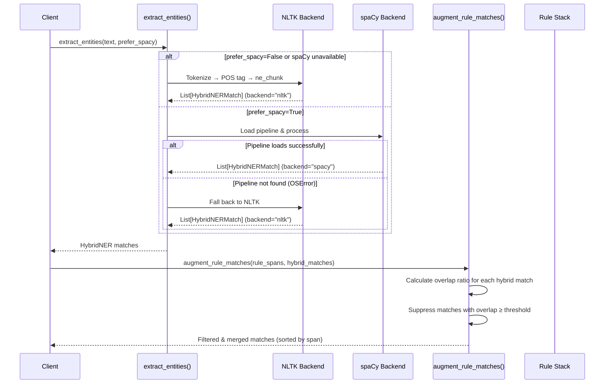

# PR Comments Export

> Exported from [https://github.com/arthrod/lexpredict-lexnlp/pull/23](https://github.com/arthrod/lexpredict-lexnlp/pull/23)  
> 11 of 11 comments selected  
> Generated by [Cicero](https://cicero.im) on 5/9/2026, 12:20:02 AM

---

### coderabbitai[bot] &mdash; 4/26/2026, 8:08:23 PM

**Actionable comments posted: 5**

> [!CAUTION]
> Some comments are outside the diff and can’t be posted inline due to platform limitations.
> 
> 
> 
> <details>
> <summary>⚠️ Outside diff range comments (2)</summary><blockquote>
> 
> <details>
> <summary>lexnlp/extract/pt/regulations.py (1)</summary><blockquote>
> 
> `385-396`: _⚠️ Potential issue_ | _🟡 Minor_
> 
> **Add test cases for the new `PARAGRAPH_LEADING_REFERENCE_RE` pattern to the test fixture.**
> 
> The test fixture at `test_data/lexnlp/typed_annotations/pt/regulation/regulations.txt` contains no examples of paragraph-leading citation patterns (e.g., `§ 2º do art. 14`, `inciso II do art. 5º`, `alínea a do art. 12`). Since `PARAGRAPH_LEADING_REFERENCE_RE` is newly exported in `__all__`, the test fixture must include test cases that validate this pattern works correctly.
> 
> <details>
> <summary>🤖 Prompt for AI Agents</summary>
> 
> ```
> Verify each finding against the current code and only fix it if needed.
> 
> In `@lexnlp/extract/pt/regulations.py` around lines 385 - 396, Add test cases
> exercising the new PARAGRAPH_LEADING_REFERENCE_RE by inserting sample
> paragraph-leading citation strings (e.g., "§ 2º do art. 14", "inciso II do art.
> 5º", "alínea a do art. 12") into the regulations test fixture used by the suite
> and update the expected annotation outputs accordingly so that
> get_regulation_annotations / get_regulation_list (and RegulationsParser) are
> asserted to capture these patterns; ensure the fixture includes both standalone
> and sentence-embedded variants to validate PARAGRAPH_LEADING_REFERENCE_RE
> matching.
> ```
> 
> </details>
> 
> </blockquote></details>
> <details>
> <summary>lexnlp/extract/pt/tests/test_real_corpus.py (1)</summary><blockquote>
> 
> `74-88`: _⚠️ Potential issue_ | _🟡 Minor_
> 
> **Docstring mentions hardcoded 2025 but implementation is now dynamic.**
> 
> The docstring at lines 76-78 states "every extracted year is between 1980 and 2025 inclusive" but the implementation now uses a dynamic upper bound. Consider updating the docstring to reflect the dynamic behavior.
> 
> 
> <details>
> <summary>📝 Suggested docstring update</summary>
> 
> ```diff
>      def test_dates_extraction_is_sane(self):
>          """
> -        Verify date extraction yields a sufficient number of annotations and that every extracted year is between 1980 and 2025 inclusive.
> +        Verify date extraction yields a sufficient number of annotations and that every extracted year is between 1980 and the current calendar year (inclusive).
> 
> -        Materializes date annotations from the LAI corpus with `strict=False`, asserts more than 10 annotations are found, and asserts all annotation `date.year` values are within the inclusive range 1980–2025.
> +        Materializes date annotations from the LAI corpus with `strict=False`, asserts more than 10 annotations are found, and asserts all annotation `date.year` values are within the inclusive range 1980–(current year + 1).
>          """
> ```
> </details>
> 
> <details>
> <summary>🤖 Prompt for AI Agents</summary>
> 
> ```
> Verify each finding against the current code and only fix it if needed.
> 
> In `@lexnlp/extract/pt/tests/test_real_corpus.py` around lines 74 - 88, Update the
> test_dates_extraction_is_sane docstring to remove the hardcoded "2025" and
> describe the dynamic upper bound behavior used in the test (it computes
> upper_year = datetime.date.today().year + 1); mention that the test asserts
> years are between 1980 and a dynamically computed current-year-plus-one, and
> reference get_date_annotations and the test_dates_extraction_is_sane method so
> reviewers can find the implementation easily.
> ```
> 
> </details>
> 
> </blockquote></details>
> 
> </blockquote></details>

<details>
<summary>🧹 Nitpick comments (4)</summary><blockquote>

<details>
<summary>lexnlp/extract/ml/classifier/spacy_token_sequence_model.py (2)</summary><blockquote>

`68-68`: **Add justification to `# noqa: E731` suppression.**

Per coding guidelines, each lint suppression must have an inline justification comment explaining why it's necessary.


<details>
<summary>♻️ Proposed fix</summary>

```diff
-NLP_EN = lambda text: _load_spacy_pipeline(DEFAULT_SPACY_MODEL)(text)  # noqa: E731
+NLP_EN = lambda text: _load_spacy_pipeline(DEFAULT_SPACY_MODEL)(text)  # noqa: E731 - preserves historical callable attribute for backwards compat
```
</details>

<details>
<summary>🤖 Prompt for AI Agents</summary>

```
Verify each finding against the current code and only fix it if needed.

In `@lexnlp/extract/ml/classifier/spacy_token_sequence_model.py` at line 68, The
lambda assigned to NLP_EN uses a noqa: E731 suppression without justification;
replace the bare noqa with an inline comment explaining why a lambda is required
here (for example: "using small one-line callable for lazy spaCy pipeline
instantiation; keeps API as a callable rather than defining a named function")
or refactor to a named function; update the line with the justification next to
# noqa: E731 (referencing NLP_EN and _load_spacy_pipeline/DEFAULT_SPACY_MODEL)
so the lint suppression documents the reason.
```

</details>

---

`33-52`: **Add return type annotation to `_load_spacy_pipeline`.**

The function lacks a return type annotation. Since this is a public-facing helper (called from `lexnlp/extract/ner/__init__.py`), it should have explicit type hints. The return type should be the spaCy `Language` object.


<details>
<summary>♻️ Proposed fix</summary>

```diff
+from typing import TYPE_CHECKING
+
+if TYPE_CHECKING:
+    from spacy.language import Language
+
+
 `@lru_cache`(maxsize=4)
-def _load_spacy_pipeline(model_name: str | None = None):
+def _load_spacy_pipeline(model_name: str | None = None) -> "Language":
     """Return a cached spaCy ``Language`` pipeline.
```
</details>

<details>
<summary>🤖 Prompt for AI Agents</summary>

```
Verify each finding against the current code and only fix it if needed.

In `@lexnlp/extract/ml/classifier/spacy_token_sequence_model.py` around lines 33 -
52, Add an explicit return type for _load_spacy_pipeline: import Language from
spacy.language only under a TYPE_CHECKING guard (from typing import
TYPE_CHECKING; if TYPE_CHECKING: from spacy.language import Language) and
annotate the function as def _load_spacy_pipeline(model_name: str | None = None)
-> "Language": so you get a spaCy Language return type without forcing a runtime
import of spaCy.
```

</details>

</blockquote></details>
<details>
<summary>scripts/reexport_bundled_sklearn_models.py (2)</summary><blockquote>

`208-259`: **`_sanitize_pandas_indices` doesn't handle `tuple` elements.**

The function handles `dict`, `list`, and `set` but not `tuple`. Pipeline steps are stored as `list[tuple[str, estimator]]` (line 257 handles `obj.steps`), but if any estimator contains a nested `tuple` with a `pandas.Index`, it won't be sanitized. Since tuples are immutable, they can't be modified in-place anyway, but the function silently skips them.

Consider adding a note or raising if a `pandas.Index` is found inside a tuple, or documenting this limitation.


<details>
<summary>♻️ Proposed documentation fix</summary>

```diff
 def _sanitize_pandas_indices(obj, _seen: set[int] | None = None):
     """Replace ``pandas.Index`` attributes with plain ``list[str]``.
 
     Some legacy pipelines pickled a ``pandas.Index`` directly on the
     estimator (e.g. ``MODEL_DATE.columns``). Pandas 2 stores a Cython
     ``BlockValuesRefs`` inside that Index that can't be reduced through
     ``skops.io``. We don't need the Index semantics — runtime code only
     iterates with ``for i, col in enumerate(MODEL_DATE.columns)`` — so the
     safest fix is to replace the Index with a plain Python list before
     serialization. This walks dicts/lists/tuples/dataclasses/objects and
-    rewrites any pandas Index it encounters in place.
+    rewrites any pandas Index it encounters in place.
+
+    Note: Tuples are immutable and cannot be modified in-place. If a
+    ``pandas.Index`` is nested inside a tuple, it will not be sanitized.
+    In practice, sklearn pipelines don't store Index objects in tuples.
     """
```
</details>

<details>
<summary>🤖 Prompt for AI Agents</summary>

```
Verify each finding against the current code and only fix it if needed.

In `@scripts/reexport_bundled_sklearn_models.py` around lines 208 - 259, The
_sanitize_pandas_indices function currently walks dicts/lists/sets and object
attrs but ignores tuple containers, so any pandas.Index nested inside a tuple
will not be replaced (and tuples are immutable so in-place mutation is
impossible); update _sanitize_pandas_indices to detect tuple instances (e.g. in
the branch alongside list/set) and replace tuples containing Indexes with a new
tuple where any pandas.Index elements are converted to plain lists (or else
raise/log when an Index is found inside a tuple), and ensure recursion still
uses the _seen set; reference the function name _sanitize_pandas_indices and the
obj.steps handling (which yields list[tuple[str, estimator]]) to locate where to
add tuple handling.
```

</details>

---

`291-294`: **Consider adding a safety check before `--remove-legacy` deletion.**

The `path.unlink()` on line 293 deletes the original pickle unconditionally after a successful skops export. However, if the export succeeded but produced an unexpected file (e.g., wrong path), the original data would be lost. Consider verifying that `target.exists()` before unlinking.


<details>
<summary>🛡️ Proposed fix</summary>

```diff
             extra = ""
             if args.remove_legacy:
-                path.unlink()
-                extra = " removed-legacy=yes"
+                if target.exists():
+                    path.unlink()
+                    extra = " removed-legacy=yes"
+                else:
+                    extra = " removed-legacy=SKIPPED (target missing)"
```
</details>

<details>
<summary>🤖 Prompt for AI Agents</summary>

```
Verify each finding against the current code and only fix it if needed.

In `@scripts/reexport_bundled_sklearn_models.py` around lines 291 - 294, Before
calling path.unlink() when args.remove_legacy is set, add a safety check that
the exported file actually exists (e.g., check target.exists() or
target.is_file()) and only perform path.unlink() if that check passes; if the
target is missing, do not delete the original and log or raise an error/ warning
instead. Update the block around the path, target, and args.remove_legacy
handling so extra is only set to " removed-legacy=yes" when the unlink occurs
successfully, and ensure any logging reflects whether the legacy file was
removed or retained.
```

</details>

</blockquote></details>

</blockquote></details>

<details>
<summary>🤖 Prompt for all review comments with AI agents</summary>

```
Verify each finding against the current code and only fix it if needed.

Inline comments:
In `@lexnlp/extract/common/tests/test_countries.py`:
- Around line 137-149: The test test_max_results_non_int_raises_type_error uses
three inline suppressions on calls to fuzzy_country (max_results=1.5, "1",
True); remove the # type: ignore[arg-type] comments or replace each with a short
inline justification (e.g. "# type: ignore[arg-type] - testing runtime TypeError
for non-int max_results") so every suppression has an explicit rationale; ensure
total new suppressions in the PR stays ≤3 by removing unnecessary ignores
(prefer removing them entirely since the test asserts runtime TypeError) and
apply the same cleanup to the other occurrences around lines 196-198.

In `@lexnlp/extract/en/contracts/tests/test_runtime_model_sklearn18.py`:
- Around line 83-94: The test sets runtime_model.CATALOG = tmp_path but only
restores catalog_mod.CATALOG in the finally block, risking state leakage; update
the finally block to also restore runtime_model.CATALOG to its original value
(capture the original before assignment) so both catalog_mod.CATALOG and
runtime_model.CATALOG are reset after calling write_pipeline_to_catalog, and
replace the bare “# type: ignore[attr-defined]” with a short explanatory comment
clarifying why the ignore is needed (e.g., runtime_model may not declare CATALOG
in type stubs) next to the runtime_model.CATALOG assignment.

In `@lexnlp/extract/ner/__init__.py`:
- Around line 166-187: The _nltk_extract loop can append a HybridNERMatch even
when some entity_tokens aren't found, producing incorrect spans; modify the
logic in _nltk_extract so that if any token search inside the for tok in
entity_tokens loop fails (i.e., idx == -1) you mark the match as invalid (via a
boolean like token_missing) and skip appending the HybridNERMatch for that
entity (continue to next entity); ensure you reference the variables start, end,
local_cursor and the HybridNERMatch creation so the early-failure path avoids
using partial end values.

In `@lexnlp/extract/pt/definitions.py`:
- Around line 141-158: Add unit tests for the newly exported matcher
match_pt_def_by_parenthesised_label and its integration with the parser: create
test cases that feed a phrase containing a single parenthesised quoted label
(e.g., (o "Contratante")) and verify the PatternFound result(s) include name
"parenthesised_label", correct start/end spans and probability, and another test
for an `ou`-joined label (e.g., (o "Locador" ou "Locatário")) asserting that the
parser/matcher (via PortugueseParsingMethods.reg_parenthesised_label) returns a
single definition cue with multiple quoted names sharing the same coordinates;
add these tests to the appropriate test module alongside other pt extractors so
the new public function is covered.
- Around line 141-158: The function match_pt_def_by_parenthesised_label
currently sets PatternFound.name to the constant "parenthesised_label"; change
it to extract the quoted label(s) from each match returned by
PortugueseParsingMethods.reg_parenthesised_label, split any "ou" alternatives
into separate label strings, and emit a distinct PatternFound per label with
entry.name set to the actual quoted label (keep entry.start/entry.end as the
match span, entry.probability as before); use the matched group's text to
parse/remove surrounding quotes and whitespace so each alternative becomes its
own PatternFound instead of a single constant token.

---

Outside diff comments:
In `@lexnlp/extract/pt/regulations.py`:
- Around line 385-396: Add test cases exercising the new
PARAGRAPH_LEADING_REFERENCE_RE by inserting sample paragraph-leading citation
strings (e.g., "§ 2º do art. 14", "inciso II do art. 5º", "alínea a do art. 12")
into the regulations test fixture used by the suite and update the expected
annotation outputs accordingly so that get_regulation_annotations /
get_regulation_list (and RegulationsParser) are asserted to capture these
patterns; ensure the fixture includes both standalone and sentence-embedded
variants to validate PARAGRAPH_LEADING_REFERENCE_RE matching.

In `@lexnlp/extract/pt/tests/test_real_corpus.py`:
- Around line 74-88: Update the test_dates_extraction_is_sane docstring to
remove the hardcoded "2025" and describe the dynamic upper bound behavior used
in the test (it computes upper_year = datetime.date.today().year + 1); mention
that the test asserts years are between 1980 and a dynamically computed
current-year-plus-one, and reference get_date_annotations and the
test_dates_extraction_is_sane method so reviewers can find the implementation
easily.

---

Nitpick comments:
In `@lexnlp/extract/ml/classifier/spacy_token_sequence_model.py`:
- Line 68: The lambda assigned to NLP_EN uses a noqa: E731 suppression without
justification; replace the bare noqa with an inline comment explaining why a
lambda is required here (for example: "using small one-line callable for lazy
spaCy pipeline instantiation; keeps API as a callable rather than defining a
named function") or refactor to a named function; update the line with the
justification next to # noqa: E731 (referencing NLP_EN and
_load_spacy_pipeline/DEFAULT_SPACY_MODEL) so the lint suppression documents the
reason.
- Around line 33-52: Add an explicit return type for _load_spacy_pipeline:
import Language from spacy.language only under a TYPE_CHECKING guard (from
typing import TYPE_CHECKING; if TYPE_CHECKING: from spacy.language import
Language) and annotate the function as def _load_spacy_pipeline(model_name: str
| None = None) -> "Language": so you get a spaCy Language return type without
forcing a runtime import of spaCy.

In `@scripts/reexport_bundled_sklearn_models.py`:
- Around line 208-259: The _sanitize_pandas_indices function currently walks
dicts/lists/sets and object attrs but ignores tuple containers, so any
pandas.Index nested inside a tuple will not be replaced (and tuples are
immutable so in-place mutation is impossible); update _sanitize_pandas_indices
to detect tuple instances (e.g. in the branch alongside list/set) and replace
tuples containing Indexes with a new tuple where any pandas.Index elements are
converted to plain lists (or else raise/log when an Index is found inside a
tuple), and ensure recursion still uses the _seen set; reference the function
name _sanitize_pandas_indices and the obj.steps handling (which yields
list[tuple[str, estimator]]) to locate where to add tuple handling.
- Around line 291-294: Before calling path.unlink() when args.remove_legacy is
set, add a safety check that the exported file actually exists (e.g., check
target.exists() or target.is_file()) and only perform path.unlink() if that
check passes; if the target is missing, do not delete the original and log or
raise an error/ warning instead. Update the block around the path, target, and
args.remove_legacy handling so extra is only set to " removed-legacy=yes" when
the unlink occurs successfully, and ensure any logging reflects whether the
legacy file was removed or retained.
```

</details>

<details>
<summary>🪄 Autofix (Beta)</summary>

Fix all unresolved CodeRabbit comments on this PR:

- [ ] <!-- {"checkboxId": "4b0d0e0a-96d7-4f10-b296-3a18ea78f0b9"} --> Push a commit to this branch (recommended)
- [ ] <!-- {"checkboxId": "ff5b1114-7d8c-49e6-8ac1-43f82af23a33"} --> Create a new PR with the fixes

</details>

---

<details>
<summary>ℹ️ Review info</summary>

<details>
<summary>⚙️ Run configuration</summary>

**Configuration used**: Organization UI

**Review profile**: CHILL

**Plan**: Pro

**Run ID**: `bfc1a0c0-e136-4916-ac55-4de7fc84adbe`

</details>

<details>
<summary>📥 Commits</summary>

Reviewing files that changed from the base of the PR and between 407323f6e25e33010a2abfd1f9db3b719dd74840 and fa64f28b2302c9731b3106643563718db205e413.

</details>

<details>
<summary>⛔ Files ignored due to path filters (17)</summary>

* `AGENTS.md` is excluded by `!*.md`
* `DEPENDENCY_MODERNIZATION_PLAN.md` is excluded by `!*.md`
* `MIGRATION_RUNBOOK.md` is excluded by `!*.md`
* `MODERNIZATION_ROADMAP.md` is excluded by `!*.md`
* `README.md` is excluded by `!*.md`
* `TY_CHECK_TODO.md` is excluded by `!*.md`
* `lexnlp/extract/de/date_model.pickle` is excluded by `!**/*.pickle`
* `lexnlp/extract/de/model.pickle` is excluded by `!**/*.pickle`
* `lexnlp/extract/en/addresses/addresses_clf.pickle` is excluded by `!**/*.pickle`
* `lexnlp/extract/en/date_model.pickle` is excluded by `!**/*.pickle`
* `lexnlp/extract/ml/en/data/definition_model_layered.skops.zip` is excluded by `!**/*.zip`
* `lexnlp/nlp/en/segments/page_segmenter.pickle` is excluded by `!**/*.pickle`
* `lexnlp/nlp/en/segments/paragraph_segmenter.pickle` is excluded by `!**/*.pickle`
* `lexnlp/nlp/en/segments/section_segmenter.pickle` is excluded by `!**/*.pickle`
* `lexnlp/nlp/en/segments/sentence_segmenter.pickle` is excluded by `!**/*.pickle`
* `lexnlp/nlp/en/segments/title_locator.pickle` is excluded by `!**/*.pickle`
* `notes.md` is excluded by `!*.md`

</details>

<details>
<summary>📒 Files selected for processing (38)</summary>

* `README.rst`
* `index.rst`
* `lexnlp/extract/common/countries.py`
* `lexnlp/extract/common/tests/test_countries.py`
* `lexnlp/extract/common/tests/test_us_states.py`
* `lexnlp/extract/de/date_model.skops`
* `lexnlp/extract/de/dates.py`
* `lexnlp/extract/de/de_date_parser.py`
* `lexnlp/extract/de/model.skops`
* `lexnlp/extract/en/addresses/addresses.py`
* `lexnlp/extract/en/addresses/addresses_clf.skops`
* `lexnlp/extract/en/contracts/tests/test_runtime_model_sklearn18.py`
* `lexnlp/extract/en/date_model.py`
* `lexnlp/extract/en/date_model.skops`
* `lexnlp/extract/ml/classifier/spacy_token_sequence_model.py`
* `lexnlp/extract/ml/en/data/definition_model_layered.pickle.gzip`
* `lexnlp/extract/ner/__init__.py`
* `lexnlp/extract/ner/tests/__init__.py`
* `lexnlp/extract/ner/tests/test_hybrid_ner.py`
* `lexnlp/extract/pt/definitions.py`
* `lexnlp/extract/pt/regulations.py`
* `lexnlp/extract/pt/tests/test_real_corpus.py`
* `lexnlp/ml/model_io.py`
* `lexnlp/ml/tests/test_model_io.py`
* `lexnlp/nlp/en/segments/page_segmenter.skops`
* `lexnlp/nlp/en/segments/pages.py`
* `lexnlp/nlp/en/segments/paragraph_segmenter.skops`
* `lexnlp/nlp/en/segments/paragraphs.py`
* `lexnlp/nlp/en/segments/section_segmenter.skops`
* `lexnlp/nlp/en/segments/sections.py`
* `lexnlp/nlp/en/segments/sentence_segmenter.skops`
* `lexnlp/nlp/en/segments/sentences.py`
* `lexnlp/nlp/en/segments/title_locator.skops`
* `lexnlp/nlp/en/segments/titles.py`
* `lexnlp/utils/tests/test_pandas_config.py`
* `pyproject.toml`
* `scripts/reexport_bundled_sklearn_models.py`
* `test_data/lexnlp/typed_annotations/pt/regulation/regulations.txt`

</details>

</details>

<details>
<summary>📜 Review details</summary>

<details>
<summary>🧰 Additional context used</summary>

<details>
<summary>📓 Path-based instructions (11)</summary>

<details>
<summary>**/*.{py,ts,tsx}</summary>


**📄 CodeRabbit inference engine (Custom checks)**

> `**/*.{py,ts,tsx}`: Identify changed production files and verify corresponding test changes. FAIL if a changed production file has zero associated test file AND introduces new exported functions, classes, or public methods. Exceptions: config files, .d.ts files, migrations, generated code.
> No lint suppression creep: Scan diff for newly added suppression comments. Python: # noqa, # type: ignore. TypeScript: // biome-ignore, // eslint-disable, `@ts-ignore`, `@ts-expect-error`, // oxlint-ignore. Each suppression MUST have inline justification comment. FAIL if any suppression lacks justification. WARN if total new suppressions > 3 in PR.
> Import ordering and dead imports check: Python - run `uv run ruff check --select I,F401 .`. TypeScript - run `bun run biome check --formatter-enabled=false --linter-enabled=false --organize-imports-enabled=true .`. FAIL if violations found.

Files:
- `lexnlp/extract/ner/tests/__init__.py`
- `lexnlp/extract/common/tests/test_us_states.py`
- `lexnlp/nlp/en/segments/titles.py`
- `lexnlp/utils/tests/test_pandas_config.py`
- `lexnlp/extract/en/date_model.py`
- `lexnlp/extract/en/addresses/addresses.py`
- `lexnlp/extract/de/dates.py`
- `lexnlp/nlp/en/segments/pages.py`
- `lexnlp/extract/common/countries.py`
- `lexnlp/extract/de/de_date_parser.py`
- `lexnlp/nlp/en/segments/sentences.py`
- `lexnlp/extract/common/tests/test_countries.py`
- `lexnlp/extract/pt/tests/test_real_corpus.py`
- `lexnlp/nlp/en/segments/sections.py`
- `lexnlp/extract/ner/tests/test_hybrid_ner.py`
- `lexnlp/extract/pt/definitions.py`
- `lexnlp/ml/tests/test_model_io.py`
- `lexnlp/extract/en/contracts/tests/test_runtime_model_sklearn18.py`
- `lexnlp/extract/ml/classifier/spacy_token_sequence_model.py`
- `lexnlp/nlp/en/segments/paragraphs.py`
- `lexnlp/ml/model_io.py`
- `lexnlp/extract/pt/regulations.py`
- `lexnlp/extract/ner/__init__.py`
- `scripts/reexport_bundled_sklearn_models.py`

</details>
<details>
<summary>**/*.py</summary>


**📄 CodeRabbit inference engine (Custom checks)**

> `**/*.py`: Python lint with ruff: Run `uv run ruff check . --diff` and `uv run ruff format --check --diff .`. FAIL if exit code != 0 for either.
> Python type checking: Run `uv run ty check` (or fallback to mypy/pyright if configured). FAIL if exit code != 0. If no type checker configured, FAIL with 'No Python type checker configured. Add ty to dev dependencies.'
> Strict null/undefined audit for Python: Scan diff for new bare `type: ignore` without error code and `cast()` calls without explanation comment. WARN for each. FAIL if bare `type: ignore` count > 3.
> 
> Use Python 3.13 as the minimum version (declared in pyproject.toml as >=3.13,<3.15)
> 
> Ensure all Python code passes pylint validation using .pylintrc configuration

Files:
- `lexnlp/extract/ner/tests/__init__.py`
- `lexnlp/extract/common/tests/test_us_states.py`
- `lexnlp/nlp/en/segments/titles.py`
- `lexnlp/utils/tests/test_pandas_config.py`
- `lexnlp/extract/en/date_model.py`
- `lexnlp/extract/en/addresses/addresses.py`
- `lexnlp/extract/de/dates.py`
- `lexnlp/nlp/en/segments/pages.py`
- `lexnlp/extract/common/countries.py`
- `lexnlp/extract/de/de_date_parser.py`
- `lexnlp/nlp/en/segments/sentences.py`
- `lexnlp/extract/common/tests/test_countries.py`
- `lexnlp/extract/pt/tests/test_real_corpus.py`
- `lexnlp/nlp/en/segments/sections.py`
- `lexnlp/extract/ner/tests/test_hybrid_ner.py`
- `lexnlp/extract/pt/definitions.py`
- `lexnlp/ml/tests/test_model_io.py`
- `lexnlp/extract/en/contracts/tests/test_runtime_model_sklearn18.py`
- `lexnlp/extract/ml/classifier/spacy_token_sequence_model.py`
- `lexnlp/nlp/en/segments/paragraphs.py`
- `lexnlp/ml/model_io.py`
- `lexnlp/extract/pt/regulations.py`
- `lexnlp/extract/ner/__init__.py`
- `scripts/reexport_bundled_sklearn_models.py`

</details>
<details>
<summary>**/{index,__init__}.{ts,tsx,py}</summary>


**📄 CodeRabbit inference engine (Custom checks)**

> Exported API surface check: For changed public module entry points (index.ts, __init__.py, or files listed in package.json exports / pyproject.toml [tool.setuptools.packages]), verify all exported symbols have explicit type annotations. Python: functions must have return type and parameter annotations. TypeScript: functions must have explicit return type. FAIL if new public export lacks explicit types.

Files:
- `lexnlp/extract/ner/tests/__init__.py`
- `lexnlp/extract/ner/__init__.py`

</details>
<details>
<summary>lexnlp/**/tests/**/*.py</summary>


**📄 CodeRabbit inference engine (AGENTS.md)**

> Do not add, remove, or modify skip, skipif, or xfail markers to bypass test failures without documenting blockers with skip-audit annotations (issue=<link-or-id> expires=YYYY-MM-DD) or entries in ci/skip_audit_allowlist.txt

Files:
- `lexnlp/extract/ner/tests/__init__.py`
- `lexnlp/extract/common/tests/test_us_states.py`
- `lexnlp/utils/tests/test_pandas_config.py`
- `lexnlp/extract/common/tests/test_countries.py`
- `lexnlp/extract/pt/tests/test_real_corpus.py`
- `lexnlp/extract/ner/tests/test_hybrid_ner.py`
- `lexnlp/ml/tests/test_model_io.py`
- `lexnlp/extract/en/contracts/tests/test_runtime_model_sklearn18.py`

</details>
<details>
<summary>**/*{test,spec,__mocks__}*.{py,ts,tsx}</summary>


**📄 CodeRabbit inference engine (Custom checks)**

> New test quality spot-check: Verify each new test file contains at least one assertion (assert, expect, assertEqual, toBe, toEqual, toThrow, rejects, etc.). FAIL if any new test file has zero assertions.

Files:
- `lexnlp/extract/common/tests/test_us_states.py`
- `lexnlp/utils/tests/test_pandas_config.py`
- `lexnlp/extract/common/tests/test_countries.py`
- `lexnlp/extract/pt/tests/test_real_corpus.py`
- `lexnlp/extract/ner/tests/test_hybrid_ner.py`
- `lexnlp/ml/tests/test_model_io.py`
- `lexnlp/extract/en/contracts/tests/test_runtime_model_sklearn18.py`

</details>
<details>
<summary>lexnlp/extract/{en,de,es,common,ml}/**/*.py</summary>


**📄 CodeRabbit inference engine (AGENTS.md)**

> Keep changes scoped to the relevant locale/module (extract/en, extract/de, extract/es, etc.) when modifying extraction functionality

Files:
- `lexnlp/extract/common/tests/test_us_states.py`
- `lexnlp/extract/en/date_model.py`
- `lexnlp/extract/en/addresses/addresses.py`
- `lexnlp/extract/de/dates.py`
- `lexnlp/extract/common/countries.py`
- `lexnlp/extract/de/de_date_parser.py`
- `lexnlp/extract/common/tests/test_countries.py`
- `lexnlp/extract/en/contracts/tests/test_runtime_model_sklearn18.py`
- `lexnlp/extract/ml/classifier/spacy_token_sequence_model.py`

</details>
<details>
<summary>**/pyproject.toml</summary>


**📄 CodeRabbit inference engine (Custom checks)**

> `**/pyproject.toml`: Run Python dependency audit: `uv run pip-audit` or `uv run pip list --outdated`. FAIL if any known CVE with severity HIGH or CRITICAL is found. WARN for moderate severity.
> Smoke test for Python web server: Start server, wait for ready signal, hit GET /health or GET /, assert HTTP 200. Timeout: 30s. FAIL if test fails.
> Smoke test for Python CLI: Run `<cli> --help`, assert exit code 0. FAIL if test fails.
> Smoke test for Python library: Run `python -c "import <package>"`, assert exit code 0. FAIL if test fails.
> Python coverage threshold: Run `uv run pytest --cov=<src_package> --cov-report=term-missing --cov-branch --cov-fail-under=80`. FAIL if exit code != 0 or branch coverage < 70%.
> Run full Python test suite: `uv run pytest --tb=line -q` for baseline and `uv run pytest --tb=short -q` for PR branch. FAIL immediately if exit code != 0.

Files:
- `pyproject.toml`

</details>
<details>
<summary>{**/pyproject.toml,**/package.json}</summary>


**📄 CodeRabbit inference engine (Custom checks)**

> Clean build verification: Python - run `uv build`, verify dist/ contains expected wheel/sdist. FAIL if exit code != 0. TypeScript - run `bun run build`, verify output directory (dist/, .next/, build/) is non-empty. WARN if > 10 build warnings.

Files:
- `pyproject.toml`

</details>
<details>
<summary>{ruff.toml,pyproject.toml,biome.json,.oxlintrc.json}</summary>


**📄 CodeRabbit inference engine (Custom checks)**

> Linter/formatter config consistency: Verify that linter/formatter config files (ruff.toml, pyproject.toml [tool.ruff], biome.json, .oxlintrc.json) were not modified without corresponding PR description explanation. WARN if config changed without mention.

Files:
- `pyproject.toml`

</details>
<details>
<summary>{pyproject.toml,Pipfile,Pipfile.lock,python-requirements*.txt}</summary>


**📄 CodeRabbit inference engine (AGENTS.md)**

> Use uv with pyproject.toml for dependency management and environment setup; avoid Pipfile/Pipfile.lock and deprecated python-requirements.txt files

Files:
- `pyproject.toml`

</details>
<details>
<summary>pyproject.toml</summary>


**📄 CodeRabbit inference engine (AGENTS.md)**

> Use the uv build backend in pyproject.toml for packaging

Files:
- `pyproject.toml`

</details>

</details><details>
<summary>🧠 Learnings (1)</summary>

<details>
<summary>📓 Common learnings</summary>

```
Learnt from: CR
Repo: arthrod/lexpredict-lexnlp

Timestamp: 2026-04-26T23:58:19.786Z
Learning: Add or update tests alongside behavior changes
```

```
Learnt from: CR
Repo: arthrod/lexpredict-lexnlp

Timestamp: 2026-04-26T23:58:19.786Z
Learning: Prefer existing utilities under lexnlp/utils/ over introducing duplicates
```

```
Learnt from: CR
Repo: arthrod/lexpredict-lexnlp

Timestamp: 2026-04-26T23:58:19.786Z
Learning: When adding extraction patterns/models, include representative fixtures in test_data/
```

```
Learnt from: CR
Repo: arthrod/lexpredict-lexnlp

Timestamp: 2026-04-26T23:58:19.786Z
Learning: Do not commit downloaded/generated third-party assets; they should be bootstrapped via scripts/bootstrap_assets.py
```

```
Learnt from: CR
Repo: arthrod/lexpredict-lexnlp

Timestamp: 2026-04-26T23:58:19.786Z
Learning: Validation target for required test suites is 100% pass (0 failures) for both base suite and Stanford-only suite when Stanford assets are enabled
```

</details>

</details><details>
<summary>🪛 LanguageTool</summary>

<details>
<summary>test_data/lexnlp/typed_annotations/pt/regulation/regulations.txt</summary>

[typographical] ~3-~3: Dois pontos consecutivos
Context: ...------------------------------- total=2 ..)locale=pt 0)name=Decreto nº 7.724  1)na...

(DOUBLE_PUNCTUATION)

---

[typographical] ~4-~4: Símbolo sem par: “(“ aparentemente está ausente
Context: ...----------------------------- total=2 ..)locale=pt 0)name=Decreto nº 7.724  1)nam...

(UNPAIRED_BRACKETS)

---

[uncategorized] ~5-~5: As abreviaturas para número são: “n.º” ou “núm.”
Context: ...--- total=2 ..)locale=pt 0)name=Decreto nº 7.724  1)name=Lei nº 12.527    --------...

(NUMBER_ABREVIATION)

---

[uncategorized] ~7-~7: As abreviaturas para número são: “n.º” ou “núm.”
Context: ...=pt 0)name=Decreto nº 7.724  1)name=Lei nº 12.527    -----------------------------...

(NUMBER_ABREVIATION)

---

[typographical] ~23-~23: Dois pontos consecutivos
Context: ...------------------------------- total=1 ..)locale=pt 0)name=Decreto nº 10.000    -...

(DOUBLE_PUNCTUATION)

---

[typographical] ~24-~24: Símbolo sem par: “(“ aparentemente está ausente
Context: ...----------------------------- total=1 ..)locale=pt 0)name=Decreto nº 10.000    --...

(UNPAIRED_BRACKETS)

---

[uncategorized] ~25-~25: As abreviaturas para número são: “n.º” ou “núm.”
Context: ...--- total=1 ..)locale=pt 0)name=Decreto nº 10.000    -----------------------------...

(NUMBER_ABREVIATION)

</details>

</details>

</details>

<details>
<summary>🔇 Additional comments (36)</summary><blockquote>

<details>
<summary>lexnlp/extract/common/tests/test_us_states.py (1)</summary><blockquote>

`49-53`: **Nice test hardening for trailing-period inputs.**

This change turns the case into a concrete behavioral assertion (`"CA."` resolves correctly), which improves regression safety.

</blockquote></details>
<details>
<summary>lexnlp/extract/common/countries.py (1)</summary><blockquote>

`100-106`: **`max_results` type guard is clean and correctly handles the `bool` edge case.**

Nice hardening here—this makes the failure mode explicit and avoids silent `True -> 1` behavior.

</blockquote></details>
<details>
<summary>lexnlp/utils/tests/test_pandas_config.py (1)</summary><blockquote>

`32-32`: **BLE001 suppressions are properly justified and all linting checks pass.**

The newly added `# noqa: BLE001` suppressions on lines 32 and 36 have inline justification ("best-effort option restore across pandas versions") and comply with suppression creep guidelines. Automated verification confirms:
- Ruff import ordering and dead imports (I,F401): ✓ pass
- Ruff lint check: ✓ pass
- Ruff format check: ✓ pass
- Pylint validation: ✓ pass (exit code 0)

The broad `Exception` catches in fixture teardown are acceptable for cleanup code where failing to restore is non-critical.

</blockquote></details>
<details>
<summary>test_data/lexnlp/typed_annotations/pt/regulation/regulations.txt (1)</summary><blockquote>

`1-37`: **LGTM - Test fixture correctly updated to match new parsing behavior.**

The consolidated annotations (5→2 and 2→1) align with the regex changes in `regulations.py` that now extract formal citations like `Decreto nº 7.724` and `Lei nº 12.527` as complete canonical forms rather than fragmented trigger-phrase matches. The static analysis hints about punctuation, brackets, and "nº" abbreviation are false positives—this is a structured test fixture format, and "nº" is the standard abbreviation in Brazilian legal documents.

</blockquote></details>
<details>
<summary>lexnlp/extract/pt/regulations.py (4)</summary><blockquote>

`65-89`: **Well-designed regex with consistent named groups.**

The `PARAGRAPH_LEADING_REFERENCE_RE` pattern correctly captures paragraph-leading article citations and maintains consistent named groups (`full`, `para`, `inc`, `alinea`, `number`) with `ARTICLE_REFERENCE_RE`, enabling uniform downstream handling.

---

`150-156`: **LGTM - Smart handling of periods in Brazilian act numbers.**

The alternation `(?:[^,;.\n]|\.(?=\d))+` correctly preserves thousands-separator dots in act numbers like `7.724` while terminating on sentence-ending periods (which are followed by space, not digits).

---

`250-266`: **LGTM - Clean deduplication with O(1) span lookups.**

The `seen_spans` set prevents duplicate annotations when both regexes match the same exact span. The approach is efficient and appropriate given the two patterns target distinct citation styles (article-leading vs. paragraph-leading).

---

`305-322`: **LGTM - Effective deduplication between trigger phrases and formal citations.**

The span-containment check correctly filters trigger phrases that greedily swallow formal citations, ensuring canonical citations like `Decreto nº 7.724` are emitted instead of over-matched trigger phrases. The comment clearly explains the rationale.

</blockquote></details>
<details>
<summary>lexnlp/extract/de/de_date_parser.py (1)</summary><blockquote>

`150-153`: **LGTM! Defensive early return prevents downstream errors.**

The guard correctly handles the edge case where `self.text` is empty or `None`, avoiding the `RuntimeError` and regex operations on invalid input. The generator simply yields nothing, which is the expected behavior for empty input.

</blockquote></details>
<details>
<summary>lexnlp/extract/ner/tests/__init__.py (1)</summary><blockquote>

`1-6`: **LGTM! Standard package initializer.**

</blockquote></details>
<details>
<summary>pyproject.toml (1)</summary><blockquote>

`90-100`: **LGTM! Well-documented optional spaCy NER dependency.**

The `ner` extra is clearly documented with rationale for the version constraint (`spacy>=3.7` for Python 3.13 support), opt-in usage pattern, and model installation instructions. This aligns with the PR's hybrid NER design where NLTK remains the default.

</blockquote></details>
<details>
<summary>lexnlp/ml/model_io.py (2)</summary><blockquote>

`73-86`: **LGTM! Allowlist extensions for bundled artifact types.**

The additions cover:
- `ExtraTreesClassifier` used in title segmentation models
- Feature selection types for ML pipelines
- NLTK Punkt tokenizer types embedded in bundled sentence segmenter artifacts

These are appropriate for the bundled models being migrated to `.skops` format.

---

`96-114`: **LGTM! Clean helper for preferring .skops siblings.**

The `load_bundled_model` function correctly:
1. Checks for a `.skops` sibling of the legacy path
2. Loads with `trusted=True` when the `.skops` exists (safe for bundled artifacts)
3. Falls back gracefully to legacy loading for development setups

This enables a smooth migration path where callers can keep referencing the original `.pickle` path while automatically getting the safer `.skops` artifact when available.

</blockquote></details>
<details>
<summary>lexnlp/ml/tests/test_model_io.py (1)</summary><blockquote>

`501-529`: **LGTM! Test now verifies complete extra_trusted data flow.**

The strengthened test validates both:
1. The allow-list validation accepts `extra_trusted` types
2. These types are actually forwarded to `skops.io.load`

This catches potential bugs where types might pass validation but get filtered before reaching the loader.

</blockquote></details>
<details>
<summary>lexnlp/nlp/en/segments/sentences.py (1)</summary><blockquote>

`29-37`: **LGTM! Migration to load_bundled_model for sentence segmenter.**

The change correctly switches to `load_bundled_model`, which will prefer the `.skops` sibling (if present) over the legacy `.pickle` file. The NLTK Punkt tokenizer types (`PunktSentenceTokenizer`, `PunktParameters`, etc.) are already added to `DEFAULT_TRUSTED_ALLOWLIST` in `model_io.py`, so the `.skops` artifacts will load correctly with `trusted=True`.

</blockquote></details>
<details>
<summary>lexnlp/nlp/en/segments/titles.py (1)</summary><blockquote>

`27-38`: **LGTM! Migration to load_bundled_model for title segmenter.**

The change correctly switches to `load_bundled_model`. The `ExtraTreesClassifier` type (used in title models, as shown in `build_model` at line 211) is included in `DEFAULT_TRUSTED_ALLOWLIST`, ensuring the `.skops` artifact will load correctly.

</blockquote></details>
<details>
<summary>lexnlp/extract/en/date_model.py (1)</summary><blockquote>

`20-20`: **`load_bundled_model` migration here looks correct.**

This keeps the legacy path while enabling `.skops`-first resolution through the shared loader.


Also applies to: 28-28

</blockquote></details>
<details>
<summary>lexnlp/nlp/en/segments/pages.py (1)</summary><blockquote>

`27-27`: **Page segmenter loader update is clean.**

Using `load_bundled_model(...)` here is aligned with the skops migration and keeps call-site behavior simple.


Also applies to: 36-36

</blockquote></details>
<details>
<summary>lexnlp/extract/de/dates.py (1)</summary><blockquote>

`14-14`: **DE date model loader migration looks good.**

This is a focused, low-risk switch to the shared bundled-model loader.


Also applies to: 21-21

</blockquote></details>
<details>
<summary>lexnlp/nlp/en/segments/paragraphs.py (1)</summary><blockquote>

`31-31`: **Paragraph segmenter loading change is solid.**

Good use of the shared bundled loader while keeping the rest of the segmentation path untouched.


Also applies to: 40-40

</blockquote></details>
<details>
<summary>lexnlp/nlp/en/segments/sections.py (1)</summary><blockquote>

`28-28`: **Section segmenter model-loader migration is consistent and correct.**

No concerns on this call-site update.


Also applies to: 43-43

</blockquote></details>
<details>
<summary>lexnlp/extract/en/addresses/addresses.py (1)</summary><blockquote>

`91-104`: **`load_classifier()` skops-first logic is clear and well documented.**

The lazy import plus trusted skops path is a good fit for the migration.

</blockquote></details>
<details>
<summary>index.rst (1)</summary><blockquote>

`78-113`: **Docs update in `index.rst` is aligned with the feature/migration scope.**

The new requirements, extras table, and skops migration notes read consistent.

</blockquote></details>
<details>
<summary>README.rst (1)</summary><blockquote>

`92-146`: **The README modernization section is otherwise in good shape.**

Optional extras, NER overview, and `.skops` migration guidance are clear and useful.

</blockquote></details>
<details>
<summary>lexnlp/extract/ml/classifier/spacy_token_sequence_model.py (1)</summary><blockquote>

`17-68`: **LGTM on the lazy loading architecture.**

The deferred import pattern with `lru_cache` is well-designed: it avoids import-time failures when spaCy isn't installed, provides clear error messaging, honors the `LEXNLP_SPACY_MODEL` env var for model override, and preserves the historical `NLP_EN(text)` call pattern. Good documentation of the rationale in lines 18-25.

</blockquote></details>
<details>
<summary>lexnlp/extract/en/contracts/tests/test_runtime_model_sklearn18.py (2)</summary><blockquote>

`44-58`: **LGTM on the sklearn deprecation smoke test.**

Good use of `warnings.catch_warnings()` with `simplefilter("error", DeprecationWarning)` to catch sklearn API drift early. The assertion on line 56-58 correctly validates that predictions are within the expected label set.

---

`95-101`: **LGTM on the skops round-trip validation.**

The test properly validates that: the artifact was written (`wrote is True`), exists on disk, has `.skops` suffix, uses the expected filename, and that reloaded predictions match the original. Good coverage of the migration path.

</blockquote></details>
<details>
<summary>lexnlp/extract/ner/tests/test_hybrid_ner.py (3)</summary><blockquote>

`25-49`: **LGTM on the NLTK data availability guard.**

The `_nltk_data_available()` helper and `_REQUIRES_NLTK_DATA` skip marker are well-designed. They probe for all required NLTK data packages and skip tests gracefully in CI environments that haven't run `nltk.download()`, rather than failing with confusing errors.

---

`119-158`: **LGTM on the `augment_rule_matches` tests.**

Good coverage of the overlap suppression logic: exact overlap (line 120-128), no overlap (line 130-138), partial overlap below threshold (line 140-148), and configurable threshold (line 150-158). The test comments clearly document the expected math.

---

`64-98`: **LGTM on `extract_entities` type and contract tests.**

The tests validate: type checking (line 65-68), return type (line 71-74), dataclass field presence and types (line 77-90), and offset round-tripping (line 93-98). Good defensive coverage for the public API contract.

</blockquote></details>
<details>
<summary>scripts/reexport_bundled_sklearn_models.py (2)</summary><blockquote>

`156-182`: **LGTM on the layered skops export.**

The `.skops.zip` archive approach correctly handles the compound payload with two internal entries (`term.skops`, `definition.skops`). The atomic write pattern using `.part` suffix with cleanup on failure is good practice.

---

`92-122`: **LGTM on the unified loading dispatcher.**

`_load_for_reexport` correctly routes to the appropriate loader based on filename: `addresses_clf.pickle` uses `RenameUnpickler` for legacy module-path compatibility, `definition_model_layered.pickle.gzip` loads the compound zip, and everything else goes through `load_model` which applies the patched tree loader.

</blockquote></details>
<details>
<summary>lexnlp/extract/ner/__init__.py (4)</summary><blockquote>

`60-83`: **LGTM on the `HybridNERMatch` dataclass.**

Well-designed with `frozen=True` for immutability and `slots=True` for memory efficiency. The docstring clearly documents each field's semantics, including that `score` is optional since spaCy's pretrained pipelines don't expose calibrated probabilities.

---

`198-226`: **LGTM on `extract_entities` with graceful degradation.**

The function correctly handles the fallback chain: validates input type, checks `prefer_spacy` flag, catches `OSError` when spaCy model files are missing, and degrades to NLTK. This ensures callers never get unexpected exceptions from missing optional dependencies.

---

`239-265`: **LGTM on `augment_rule_matches`.**

The overlap suppression logic is clean: it materializes rule spans once, checks each hybrid match against all rule spans using `_overlap_ratio`, and sorts the output by document order. The O(n*m) complexity is acceptable for typical document sizes.

---

`268-273`: **LGTM on `__all__` exports.**

All four public symbols are explicitly listed and have proper type annotations, satisfying the exported API surface check requirement.

</blockquote></details>

</blockquote></details>

</details>

<!-- This is an auto-generated comment by CodeRabbit for review status -->

---

### coderabbitai[bot] &mdash; 4/26/2026, 8:08:22 PM

> File: `lexnlp/extract/common/tests/test_countries.py`

<details><summary>Code context</summary>

```diff
@@ -134,6 +134,19 @@ def test_max_results_negative_large_raises(self) -> None:
         with pytest.raises(ValueError):
             fuzzy_country("United", max_results=-100)
 
+    def test_max_results_non_int_raises_type_error(self) -> None:
+        """Non-int values for max_results must raise TypeError, not silently slice."""
+        import pytest
+
+        with pytest.raises(TypeError, match="max_results must be an int"):
+            fuzzy_country("United", max_results=1.5)  # type: ignore[arg-type]
+        with pytest.raises(TypeError, match="max_results must be an int"):
+            fuzzy_country("United", max_results="1")  # type: ignore[arg-type]
+        with pytest.raises(TypeError, match="max_results must be an int"):
+            # ``bool`` is a subclass of ``int``; reject it explicitly so callers
+            # don't accidentally pass ``True`` and silently slice to 1.
+            fuzzy_country("United", max_results=True)  # type: ignore[arg-type]
+
```
</details>

_⚠️ Potential issue_ | _🟠 Major_

**Reduce suppression creep: add missing justifications or remove ignores entirely.**

Line 142 and Line 144 add `# type: ignore[arg-type]` without inline justification. Also, this patch adds 4 new suppressions total (3 `type: ignore` + 1 `noqa`), which crosses the PR warning threshold.

<details>
<summary>Suggested cleanup (keep runtime intent, drop suppressions)</summary>

```diff
+from typing import Any, cast
@@
         with pytest.raises(TypeError, match="max_results must be an int"):
-            fuzzy_country("United", max_results=1.5)  # type: ignore[arg-type]
+            fuzzy_country("United", max_results=cast(Any, 1.5))
         with pytest.raises(TypeError, match="max_results must be an int"):
-            fuzzy_country("United", max_results="1")  # type: ignore[arg-type]
+            fuzzy_country("United", max_results=cast(Any, "1"))
         with pytest.raises(TypeError, match="max_results must be an int"):
             # ``bool`` is a subclass of ``int``; reject it explicitly so callers
             # don't accidentally pass ``True`` and silently slice to 1.
-            fuzzy_country("United", max_results=True)  # type: ignore[arg-type]
+            fuzzy_country("United", max_results=cast(Any, True))
```
</details>

   
As per coding guidelines: “Each suppression MUST have inline justification comment. FAIL if any suppression lacks justification. WARN if total new suppressions > 3 in PR.”


Also applies to: 196-198

<details>
<summary>🤖 Prompt for AI Agents</summary>

```
Verify each finding against the current code and only fix it if needed.

In `@lexnlp/extract/common/tests/test_countries.py` around lines 137 - 149, The
test test_max_results_non_int_raises_type_error uses three inline suppressions
on calls to fuzzy_country (max_results=1.5, "1", True); remove the # type:
ignore[arg-type] comments or replace each with a short inline justification
(e.g. "# type: ignore[arg-type] - testing runtime TypeError for non-int
max_results") so every suppression has an explicit rationale; ensure total new
suppressions in the PR stays ≤3 by removing unnecessary ignores (prefer removing
them entirely since the test asserts runtime TypeError) and apply the same
cleanup to the other occurrences around lines 196-198.
```

</details>

<!-- fingerprinting:phantom:poseidon:hawk:f422becc-f526-4d43-8ee4-97c08a75c142 -->

<!-- d98c2f50 -->

<!-- This is an auto-generated comment by CodeRabbit -->

---

### coderabbitai[bot] &mdash; 4/26/2026, 8:08:22 PM

> File: `lexnlp/extract/en/contracts/tests/test_runtime_model_sklearn18.py`

<details><summary>Code context</summary>

```diff
@@ -0,0 +1,101 @@
+"""Smoke tests for ``contract-type/0.2-runtime`` under sklearn >=1.8 + skops.
+
+These exercise the real ``train_contract_type_pipeline`` /
+``write_pipeline_to_catalog`` / ``load_model`` round-trip on a tiny
+synthetic corpus so we catch sklearn API drift (e.g. the 1.7 deprecation
+of ``LogisticRegression.multi_class``) without depending on the corpus
+GitHub release.
+"""
+
+from __future__ import annotations
+
+__author__ = "ContraxSuite, LLC; LexPredict, LLC"
+__copyright__ = "Copyright 2015-2021, ContraxSuite, LLC"
+__license__ = "https://github.com/LexPredict/lexpredict-lexnlp/blob/2.3.0/LICENSE"
+__version__ = "2.3.0"
+__maintainer__ = "LexPredict, LLC"
+__email__ = "support@contraxsuite.com"
+
+
+from pathlib import Path
+
+import pytest
+
+
+@pytest.fixture()
+def tiny_corpus() -> tuple[list[str], list[str]]:
+    """Three labels, three docs each — just enough to fit + predict."""
+
+    texts = [
+        "This master service agreement governs delivery of professional services.",
+        "The parties agree to the terms of services rendered under this MSA.",
+        "Statement of work for the consulting engagement and its deliverables.",
+        "This non-disclosure agreement protects confidential information.",
+        "Confidentiality and non-disclosure obligations of the receiving party.",
+        "Each party agrees to keep the trade secrets in strict confidence.",
+        "This software license agreement permits use of the licensed product.",
+        "The licensee may use the software subject to the licensing terms.",
+        "End user license agreement and product license grant.",
+    ]
+    labels = ["MSA"] * 3 + ["NDA"] * 3 + ["LICENSE"] * 3
+    return texts, labels
+
+
+def test_pipeline_fits_under_sklearn_18(tiny_corpus: tuple[list[str], list[str]]) -> None:
+    """``train_contract_type_pipeline`` must fit without sklearn deprecations."""
+    import warnings
+
+    from lexnlp.extract.en.contracts.runtime_model import train_contract_type_pipeline
+
+    texts, labels = tiny_corpus
+    with warnings.catch_warnings():
+        warnings.simplefilter("error", DeprecationWarning)
+        pipeline = train_contract_type_pipeline(texts, labels, random_state=7)
+    # Smoke-prediction: make sure the trained pipeline can score a doc.
+    predictions = pipeline.predict(texts)
+    assert set(predictions) <= set(labels), (
+        f"Pipeline emitted unexpected labels: {set(predictions) - set(labels)}"
+    )
+
+
+def test_pipeline_round_trips_via_skops(
+    tmp_path: Path, tiny_corpus: tuple[list[str], list[str]]
+) -> None:
+    """``write_pipeline_to_catalog`` + ``load_model`` must preserve predictions."""
+
+    from lexnlp.extract.en.contracts import runtime_model
+    from lexnlp.extract.en.contracts.runtime_model import (
+        CONTRACT_TYPE_MODEL_FILENAME,
+        train_contract_type_pipeline,
+        write_pipeline_to_catalog,
+    )
+    from lexnlp.ml import catalog as catalog_mod
+    from lexnlp.ml.model_io import load_model
+
+    texts, labels = tiny_corpus
+    pipeline = train_contract_type_pipeline(texts, labels, random_state=7)
+    expected = list(pipeline.predict(texts))
+
+    target_tag = "pipeline/contract-type/0.2-runtime-test"
+
+    # Redirect the catalog to a writable temp dir so we don't touch the user's
+    # ``~/.lexnlp/`` cache during tests.
+    catalog_mod.CATALOG = tmp_path
+    runtime_model.CATALOG = tmp_path  # type: ignore[attr-defined]
+    try:
+        destination, wrote = write_pipeline_to_catalog(
+            pipeline=pipeline,
+            target_tag=target_tag,
+            force=True,
+        )
+    finally:
+        # Restore by reloading the module-level CATALOG resolution.
+        catalog_mod.CATALOG = catalog_mod._resolve_catalog_dir()
+
```
</details>

_⚠️ Potential issue_ | _🟡 Minor_

**Incomplete cleanup: `runtime_model.CATALOG` is not restored in the `finally` block.**

The test sets `runtime_model.CATALOG = tmp_path` on line 84 but only restores `catalog_mod.CATALOG` in the `finally` block. This could leak state to subsequent tests if they import `runtime_model` before the module is reloaded.

Also, the `# type: ignore[attr-defined]` on line 84 lacks an explanation comment per coding guidelines.


<details>
<summary>🛡️ Proposed fix</summary>

```diff
     # Redirect the catalog to a writable temp dir so we don't touch the user's
     # ``~/.lexnlp/`` cache during tests.
     catalog_mod.CATALOG = tmp_path
-    runtime_model.CATALOG = tmp_path  # type: ignore[attr-defined]
+    runtime_model.CATALOG = tmp_path  # type: ignore[attr-defined] - CATALOG set dynamically at module load
+    original_runtime_catalog = getattr(runtime_model, "CATALOG", None)
     try:
         destination, wrote = write_pipeline_to_catalog(
             pipeline=pipeline,
             target_tag=target_tag,
             force=True,
         )
     finally:
         # Restore by reloading the module-level CATALOG resolution.
         catalog_mod.CATALOG = catalog_mod._resolve_catalog_dir()
+        if original_runtime_catalog is not None:
+            runtime_model.CATALOG = original_runtime_catalog
```
</details>

<details>
<summary>🤖 Prompt for AI Agents</summary>

```
Verify each finding against the current code and only fix it if needed.

In `@lexnlp/extract/en/contracts/tests/test_runtime_model_sklearn18.py` around
lines 83 - 94, The test sets runtime_model.CATALOG = tmp_path but only restores
catalog_mod.CATALOG in the finally block, risking state leakage; update the
finally block to also restore runtime_model.CATALOG to its original value
(capture the original before assignment) so both catalog_mod.CATALOG and
runtime_model.CATALOG are reset after calling write_pipeline_to_catalog, and
replace the bare “# type: ignore[attr-defined]” with a short explanatory comment
clarifying why the ignore is needed (e.g., runtime_model may not declare CATALOG
in type stubs) next to the runtime_model.CATALOG assignment.
```

</details>

<!-- fingerprinting:phantom:medusa:ocelot:24371ce2-20d3-4d89-b6d3-56daff8365fd -->

<!-- 4e71b3a2 -->

<!-- This is an auto-generated comment by CodeRabbit -->

---

### coderabbitai[bot] &mdash; 4/26/2026, 8:08:22 PM

> File: `lexnlp/extract/ner/__init__.py`

<details><summary>Code context</summary>

```diff
@@ -0,0 +1,273 @@
+"""Hybrid NER fallback for entities the rule stack misses.
+
+LexNLP's rule-based extractors (``lexnlp.extract.en.entities`` /
+``lexnlp.extract.common``) cover most legal-domain entities (parties,
+agreement types, dates, money, …) but their precision/recall trade-off is
+tuned for surface-level pattern matching. For the long tail —
+non-canonical party-name spellings, novel agreement types, OCR-ed proper
+nouns — a small on-device statistical model recovers significant recall
+without rewriting the pipeline.
+
+**Default backend = NLTK.** NLTK's ``averaged_perceptron_tagger_eng`` +
+``maxent_ne_chunker_tab`` provides equivalent capability (PERSON / ORG /
+GPE / LOC labels) to spaCy's ``en_core_web_sm`` without the latter's
+gated install path (spaCy models are not on PyPI; they ship via
+``python -m spacy download <name>`` against a separate model CDN). NLTK
+is already a hard dependency of LexNLP and its data is fetched once via
+``nltk.download(...)`` and then persisted to ``~/nltk_data``, so the
+default extractor works out-of-the-box wherever NLTK already does.
+
+The spaCy backend remains available for callers who want it: install
+the optional ``[ner]`` extra (``spacy>=3.7``), run
+``python -m spacy download en_core_web_sm`` (or override the model name
+via ``LEXNLP_SPACY_MODEL``), then pass ``prefer_spacy=True`` to
+:func:`extract_entities`.
+
+This module provides:
+
+* :func:`spacy_is_available` — boolean probe for the optional ``[ner]``
+  extra.
+* :func:`extract_entities` — main entry point. Returns a list of
+  :class:`HybridNERMatch` records produced by NLTK by default (or by
+  spaCy if ``prefer_spacy=True`` and the optional extra is installed).
+  Both backends emit the same dataclass so consumers don't branch on
+  the backend.
+* :func:`augment_rule_matches` — merges hybrid matches with an existing
+  iterable of ``(start, end, label)`` annotations from the rule stack,
+  dropping spans that overlap a rule annotation by ≥50 % so the rule
+  stack remains the source of truth.
+
+Either backend feeds ``lexnlp.extract.ml`` CRF features through the
+existing ``feature_data`` pipeline — no consumer code changes required.
+"""
+
+from __future__ import annotations
+
+__author__ = "ContraxSuite, LLC; LexPredict, LLC"
+__copyright__ = "Copyright 2015-2021, ContraxSuite, LLC"
+__license__ = "https://github.com/LexPredict/lexpredict-lexnlp/blob/2.3.0/LICENSE"
+__version__ = "2.3.0"
+__maintainer__ = "LexPredict, LLC"
+__email__ = "support@contraxsuite.com"
+
+
+import importlib
+import os
+from collections.abc import Iterable
+from dataclasses import dataclass
+
+
+@dataclass(frozen=True, slots=True)
+class HybridNERMatch:
+    """A single hybrid-NER match.
+
+    Attributes:
+        start: Inclusive character offset of the match.
+        end: Exclusive character offset.
+        text: Surface form, ``text == source[start:end]``.
+        label: Backend-specific entity label (e.g. ``"PERSON"`` /
+            ``"ORG"``). Both backends emit the spaCy-style upper-case label
+            namespace.
+        backend: ``"spacy"`` or ``"nltk"``; lets callers down-weight the
+            fallback if they want strict spaCy semantics.
+        score: Optional confidence in [0, 1]. spaCy's pretrained pipelines
+            do not expose calibrated probabilities, so this is ``None``
+            unless the caller plugged in a scorer.
+    """
+
+    start: int
+    end: int
+    text: str
+    label: str
+    backend: str
+    score: float | None = None
+
+
+def spacy_is_available() -> bool:
+    """Return ``True`` when the ``[ner]`` extra (``spacy>=3.7``) is importable."""
+
+    try:
+        importlib.import_module("spacy")
+    except ImportError:
+        return False
+    return True
+
+
+def _resolve_spacy_model_name() -> str:
+    """Return the spaCy model identifier, honouring ``LEXNLP_SPACY_MODEL``."""
+
+    return os.getenv("LEXNLP_SPACY_MODEL", "en_core_web_sm")
+
+
+def _spacy_extract(text: str) -> list[HybridNERMatch]:
+    """spaCy backend: defers ``import spacy`` to first use to keep the
+    optional dependency truly optional."""
+
+    from lexnlp.extract.ml.classifier.spacy_token_sequence_model import (
+        _load_spacy_pipeline,
+    )
+
+    pipeline = _load_spacy_pipeline(_resolve_spacy_model_name())
+    doc = pipeline(text)
+    matches: list[HybridNERMatch] = []
+    for ent in doc.ents:
+        matches.append(
+            HybridNERMatch(
+                start=ent.start_char,
+                end=ent.end_char,
+                text=ent.text,
+                label=ent.label_,
+                backend="spacy",
+            )
+        )
+    return matches
+
+
+# spaCy entity labels we surface from the NLTK fallback. NLTK chunk types
+# differ ("PERSON" / "ORGANIZATION" / "GPE" / "FACILITY" / "GSP" / "LOCATION")
+# from spaCy's slightly broader set, so we map onto the spaCy namespace to
+# keep the contract uniform across backends.
+_NLTK_TO_SPACY_LABEL = {
+    "PERSON": "PERSON",
+    "ORGANIZATION": "ORG",
+    "GPE": "GPE",
+    "FACILITY": "FAC",
+    "GSP": "GPE",
+    "LOCATION": "LOC",
+}
+
+
+def _nltk_extract(text: str) -> list[HybridNERMatch]:
+    """NLTK fallback backend (``averaged_perceptron_tagger`` + ``ne_chunk``).
+
+    NLTK is already a hard dependency of LexNLP, so this path costs no extra
+    install. The on-device tagger has lower accuracy than ``en_core_web_sm``
+    but is enough to recover obvious party / org spans missed by the rule
+    stack.
+    """
+
+    from nltk import ne_chunk, pos_tag, word_tokenize  # local: keep import-free top
+
+    tokens = list(word_tokenize(text))
+    if not tokens:
+        return []
+    tagged = pos_tag(tokens)
+    tree = ne_chunk(tagged, binary=False)
+
+    matches: list[HybridNERMatch] = []
+    cursor = 0
+    for chunk in tree:
+        # Sub-tree => named entity (label_, [(token, pos), ...])
+        if hasattr(chunk, "label"):
+            entity_tokens = [tok for tok, _pos in chunk.leaves()]
+            if not entity_tokens:
+                continue
+            # Walk forward from the cursor to find the surface span.
+            start = text.find(entity_tokens[0], cursor)
+            if start == -1:
+                continue
+            end = start
+            local_cursor = start
+            for tok in entity_tokens:
+                idx = text.find(tok, local_cursor)
+                if idx == -1:
+                    end = local_cursor
+                    break
+                local_cursor = idx + len(tok)
+                end = local_cursor
+            cursor = end
+            matches.append(
+                HybridNERMatch(
+                    start=start,
+                    end=end,
+                    text=text[start:end],
+                    label=_NLTK_TO_SPACY_LABEL.get(chunk.label(), chunk.label()),
+                    backend="nltk",
+                )
+            )
```
</details>

_⚠️ Potential issue_ | _🟡 Minor_

**Edge case: `_nltk_extract` may produce incorrect spans when tokens aren't found.**

Lines 172-177 handle the case where a token isn't found after `local_cursor` by breaking the loop, but the match is still appended with whatever `end` value was computed. This could produce a `HybridNERMatch` where `text[start:end]` doesn't match the actual entity text.

Consider skipping the match entirely if any token search fails:


<details>
<summary>🛡️ Proposed fix</summary>

```diff
             end = start
             local_cursor = start
+            valid = True
             for tok in entity_tokens:
                 idx = text.find(tok, local_cursor)
                 if idx == -1:
-                    end = local_cursor
-                    break
+                    valid = False
+                    break
                 local_cursor = idx + len(tok)
                 end = local_cursor
+            if not valid:
+                continue
             cursor = end
             matches.append(
```
</details>

<details>
<summary>🤖 Prompt for AI Agents</summary>

```
Verify each finding against the current code and only fix it if needed.

In `@lexnlp/extract/ner/__init__.py` around lines 166 - 187, The _nltk_extract
loop can append a HybridNERMatch even when some entity_tokens aren't found,
producing incorrect spans; modify the logic in _nltk_extract so that if any
token search inside the for tok in entity_tokens loop fails (i.e., idx == -1)
you mark the match as invalid (via a boolean like token_missing) and skip
appending the HybridNERMatch for that entity (continue to next entity); ensure
you reference the variables start, end, local_cursor and the HybridNERMatch
creation so the early-failure path avoids using partial end values.
```

</details>

<!-- fingerprinting:phantom:medusa:ocelot:24371ce2-20d3-4d89-b6d3-56daff8365fd -->

<!-- 4e71b3a2 -->

<!-- This is an auto-generated comment by CodeRabbit -->

---

### coderabbitai[bot] &mdash; 4/26/2026, 8:08:22 PM

> File: `lexnlp/extract/pt/definitions.py`

<details><summary>Code context</summary>

```diff
@@ -137,6 +137,26 @@ def match_first_word_is(phrase: str) -> list[PatternFound]:
             lambda p, m: len(p),
         )
 
+    @staticmethod
+    def match_pt_def_by_parenthesised_label(phrase: str) -> list[PatternFound]:
+        """Match Brazilian-contract parenthesised quoted labels like ``(o "Contratante")``.
+
+        Each match is reported with the quoted label as the defined name and
+        the surrounding parenthesised group as the surface form. ``ou``-joined
+        alternatives (``(o "Locador" ou "Locatário")``) all share the same
+        coordinates because they belong to the same definition cue.
+        """
+        results: list[PatternFound] = []
+        for match in PortugueseParsingMethods.reg_parenthesised_label.finditer(phrase):
+            start, end = match.span()
+            entry = PatternFound()
+            entry.name = "parenthesised_label"
+            entry.start = start
+            entry.end = end
+            entry.probability = 85
+            results.append(entry)
+        return results
```
</details>

_⚠️ Potential issue_ | _🟠 Major_

**Add/adjust tests for the new public matcher and parser integration.**

This PR adds a new public extraction method and wires it into the parser, but no associated test changes are present in the provided diff. Please add representative fixtures/assertions for single-label and `ou`-joined parenthesised labels.


As per coding guidelines `**/*.{py,ts,tsx}`: “FAIL if a changed production file has zero associated test file AND introduces new exported functions, classes, or public methods.”  
Based on learnings “Add or update tests alongside behavior changes”.


Also applies to: 200-200

<details>
<summary>🤖 Prompt for AI Agents</summary>

```
Verify each finding against the current code and only fix it if needed.

In `@lexnlp/extract/pt/definitions.py` around lines 141 - 158, Add unit tests for
the newly exported matcher match_pt_def_by_parenthesised_label and its
integration with the parser: create test cases that feed a phrase containing a
single parenthesised quoted label (e.g., (o "Contratante")) and verify the
PatternFound result(s) include name "parenthesised_label", correct start/end
spans and probability, and another test for an `ou`-joined label (e.g., (o
"Locador" ou "Locatário")) asserting that the parser/matcher (via
PortugueseParsingMethods.reg_parenthesised_label) returns a single definition
cue with multiple quoted names sharing the same coordinates; add these tests to
the appropriate test module alongside other pt extractors so the new public
function is covered.
```

</details>

<!-- fingerprinting:phantom:poseidon:hawk:07abe2fe-5e93-4387-bec8-6eb5dabb112a -->

<!-- d98c2f50 -->

---

_⚠️ Potential issue_ | _🟠 Major_

**Populate `PatternFound.name` with the quoted label(s), not a constant token.**

The method currently emits `"parenthesised_label"` for every match, which contradicts its own contract and collapses distinct terms into one label. It also doesn’t emit separate entries for `ou` alternatives.


<details>
<summary>💡 Suggested fix</summary>

```diff
 `@staticmethod`
 def match_pt_def_by_parenthesised_label(phrase: str) -> list[PatternFound]:
@@
     results: list[PatternFound] = []
     for match in PortugueseParsingMethods.reg_parenthesised_label.finditer(phrase):
         start, end = match.span()
-        entry = PatternFound()
-        entry.name = "parenthesised_label"
-        entry.start = start
-        entry.end = end
-        entry.probability = 85
-        results.append(entry)
+        labels = re.findall(r'"([^"]+)"', match.group(0))
+        for label in labels:
+            entry = PatternFound()
+            entry.name = label
+            entry.start = start
+            entry.end = end
+            entry.probability = 85
+            results.append(entry)
     return results
```
</details>

<!-- suggestion_start -->

<details>
<summary>📝 Committable suggestion</summary>

> ‼️ **IMPORTANT**
> Carefully review the code before committing. Ensure that it accurately replaces the highlighted code, contains no missing lines, and has no issues with indentation. Thoroughly test & benchmark the code to ensure it meets the requirements.

```suggestion
    def match_pt_def_by_parenthesised_label(phrase: str) -> list[PatternFound]:
        """Match Brazilian-contract parenthesised quoted labels like ``(o "Contratante")``.

        Each match is reported with the quoted label as the defined name and
        the surrounding parenthesised group as the surface form. ``ou``-joined
        alternatives (``(o "Locador" ou "Locatário")``) all share the same
        coordinates because they belong to the same definition cue.
        """
        results: list[PatternFound] = []
        for match in PortugueseParsingMethods.reg_parenthesised_label.finditer(phrase):
            start, end = match.span()
            labels = re.findall(r'"([^"]+)"', match.group(0))
            for label in labels:
                entry = PatternFound()
                entry.name = label
                entry.start = start
                entry.end = end
                entry.probability = 85
                results.append(entry)
        return results
```

</details>

<!-- suggestion_end -->

<details>
<summary>🤖 Prompt for AI Agents</summary>

```
Verify each finding against the current code and only fix it if needed.

In `@lexnlp/extract/pt/definitions.py` around lines 141 - 158, The function
match_pt_def_by_parenthesised_label currently sets PatternFound.name to the
constant "parenthesised_label"; change it to extract the quoted label(s) from
each match returned by PortugueseParsingMethods.reg_parenthesised_label, split
any "ou" alternatives into separate label strings, and emit a distinct
PatternFound per label with entry.name set to the actual quoted label (keep
entry.start/entry.end as the match span, entry.probability as before); use the
matched group's text to parse/remove surrounding quotes and whitespace so each
alternative becomes its own PatternFound instead of a single constant token.
```

</details>

<!-- fingerprinting:phantom:poseidon:hawk:07abe2fe-5e93-4387-bec8-6eb5dabb112a -->

<!-- 4e71b3a2 -->

<!-- This is an auto-generated comment by CodeRabbit -->

---

### gemini-code-assist[bot] &mdash; 4/26/2026, 7:59:54 PM

> File: `lexnlp/extract/ner/__init__.py`

<details><summary>Code context</summary>

```diff
@@ -0,0 +1,273 @@
+"""Hybrid NER fallback for entities the rule stack misses.
+
+LexNLP's rule-based extractors (``lexnlp.extract.en.entities`` /
+``lexnlp.extract.common``) cover most legal-domain entities (parties,
+agreement types, dates, money, …) but their precision/recall trade-off is
+tuned for surface-level pattern matching. For the long tail —
+non-canonical party-name spellings, novel agreement types, OCR-ed proper
+nouns — a small on-device statistical model recovers significant recall
+without rewriting the pipeline.
+
+**Default backend = NLTK.** NLTK's ``averaged_perceptron_tagger_eng`` +
+``maxent_ne_chunker_tab`` provides equivalent capability (PERSON / ORG /
+GPE / LOC labels) to spaCy's ``en_core_web_sm`` without the latter's
+gated install path (spaCy models are not on PyPI; they ship via
+``python -m spacy download <name>`` against a separate model CDN). NLTK
+is already a hard dependency of LexNLP and its data is fetched once via
+``nltk.download(...)`` and then persisted to ``~/nltk_data``, so the
+default extractor works out-of-the-box wherever NLTK already does.
+
+The spaCy backend remains available for callers who want it: install
+the optional ``[ner]`` extra (``spacy>=3.7``), run
+``python -m spacy download en_core_web_sm`` (or override the model name
+via ``LEXNLP_SPACY_MODEL``), then pass ``prefer_spacy=True`` to
+:func:`extract_entities`.
+
+This module provides:
+
+* :func:`spacy_is_available` — boolean probe for the optional ``[ner]``
+  extra.
+* :func:`extract_entities` — main entry point. Returns a list of
+  :class:`HybridNERMatch` records produced by NLTK by default (or by
+  spaCy if ``prefer_spacy=True`` and the optional extra is installed).
+  Both backends emit the same dataclass so consumers don't branch on
+  the backend.
+* :func:`augment_rule_matches` — merges hybrid matches with an existing
+  iterable of ``(start, end, label)`` annotations from the rule stack,
+  dropping spans that overlap a rule annotation by ≥50 % so the rule
+  stack remains the source of truth.
+
+Either backend feeds ``lexnlp.extract.ml`` CRF features through the
+existing ``feature_data`` pipeline — no consumer code changes required.
+"""
+
+from __future__ import annotations
+
+__author__ = "ContraxSuite, LLC; LexPredict, LLC"
+__copyright__ = "Copyright 2015-2021, ContraxSuite, LLC"
+__license__ = "https://github.com/LexPredict/lexpredict-lexnlp/blob/2.3.0/LICENSE"
+__version__ = "2.3.0"
+__maintainer__ = "LexPredict, LLC"
+__email__ = "support@contraxsuite.com"
+
+
+import importlib
+import os
+from collections.abc import Iterable
+from dataclasses import dataclass
+
+
+@dataclass(frozen=True, slots=True)
+class HybridNERMatch:
+    """A single hybrid-NER match.
+
+    Attributes:
+        start: Inclusive character offset of the match.
+        end: Exclusive character offset.
+        text: Surface form, ``text == source[start:end]``.
+        label: Backend-specific entity label (e.g. ``"PERSON"`` /
+            ``"ORG"``). Both backends emit the spaCy-style upper-case label
+            namespace.
+        backend: ``"spacy"`` or ``"nltk"``; lets callers down-weight the
+            fallback if they want strict spaCy semantics.
+        score: Optional confidence in [0, 1]. spaCy's pretrained pipelines
+            do not expose calibrated probabilities, so this is ``None``
+            unless the caller plugged in a scorer.
+    """
+
+    start: int
+    end: int
+    text: str
+    label: str
+    backend: str
+    score: float | None = None
+
+
+def spacy_is_available() -> bool:
+    """Return ``True`` when the ``[ner]`` extra (``spacy>=3.7``) is importable."""
+
+    try:
+        importlib.import_module("spacy")
+    except ImportError:
+        return False
+    return True
+
+
+def _resolve_spacy_model_name() -> str:
+    """Return the spaCy model identifier, honouring ``LEXNLP_SPACY_MODEL``."""
+
+    return os.getenv("LEXNLP_SPACY_MODEL", "en_core_web_sm")
+
+
+def _spacy_extract(text: str) -> list[HybridNERMatch]:
+    """spaCy backend: defers ``import spacy`` to first use to keep the
+    optional dependency truly optional."""
+
+    from lexnlp.extract.ml.classifier.spacy_token_sequence_model import (
+        _load_spacy_pipeline,
+    )
+
+    pipeline = _load_spacy_pipeline(_resolve_spacy_model_name())
+    doc = pipeline(text)
+    matches: list[HybridNERMatch] = []
+    for ent in doc.ents:
+        matches.append(
+            HybridNERMatch(
+                start=ent.start_char,
+                end=ent.end_char,
+                text=ent.text,
+                label=ent.label_,
+                backend="spacy",
+            )
+        )
+    return matches
+
+
+# spaCy entity labels we surface from the NLTK fallback. NLTK chunk types
+# differ ("PERSON" / "ORGANIZATION" / "GPE" / "FACILITY" / "GSP" / "LOCATION")
+# from spaCy's slightly broader set, so we map onto the spaCy namespace to
+# keep the contract uniform across backends.
+_NLTK_TO_SPACY_LABEL = {
+    "PERSON": "PERSON",
+    "ORGANIZATION": "ORG",
+    "GPE": "GPE",
+    "FACILITY": "FAC",
+    "GSP": "GPE",
+    "LOCATION": "LOC",
+}
+
+
+def _nltk_extract(text: str) -> list[HybridNERMatch]:
+    """NLTK fallback backend (``averaged_perceptron_tagger`` + ``ne_chunk``).
+
+    NLTK is already a hard dependency of LexNLP, so this path costs no extra
+    install. The on-device tagger has lower accuracy than ``en_core_web_sm``
+    but is enough to recover obvious party / org spans missed by the rule
+    stack.
+    """
+
+    from nltk import ne_chunk, pos_tag, word_tokenize  # local: keep import-free top
+
+    tokens = list(word_tokenize(text))
+    if not tokens:
+        return []
+    tagged = pos_tag(tokens)
+    tree = ne_chunk(tagged, binary=False)
+
+    matches: list[HybridNERMatch] = []
+    cursor = 0
+    for chunk in tree:
+        # Sub-tree => named entity (label_, [(token, pos), ...])
+        if hasattr(chunk, "label"):
+            entity_tokens = [tok for tok, _pos in chunk.leaves()]
+            if not entity_tokens:
+                continue
+            # Walk forward from the cursor to find the surface span.
+            start = text.find(entity_tokens[0], cursor)
+            if start == -1:
+                continue
+            end = start
+            local_cursor = start
+            for tok in entity_tokens:
+                idx = text.find(tok, local_cursor)
+                if idx == -1:
+                    end = local_cursor
+                    break
+                local_cursor = idx + len(tok)
+                end = local_cursor
+            cursor = end
+            matches.append(
+                HybridNERMatch(
+                    start=start,
+                    end=end,
+                    text=text[start:end],
+                    label=_NLTK_TO_SPACY_LABEL.get(chunk.label(), chunk.label()),
+                    backend="nltk",
+                )
+            )
+        else:
+            # Plain tagged token; advance the cursor past it so the next NE
+            # search starts at or after this token's surface form.
+            tok = chunk[0]
+            idx = text.find(tok, cursor)
+            if idx != -1:
+                cursor = idx + len(tok)
+    return matches
```
</details>


The `_nltk_extract` function relies on `text.find()` to map tokens back to character offsets. This is problematic because `nltk.word_tokenize` (and the underlying tokenizers) often normalize characters (e.g., converting double quotes to ` `` ` or `''`, or splitting contractions). When normalization occurs, `text.find()` will fail to locate the token in the original text, causing entities to be skipped or spans to be incorrectly calculated. 

A more robust approach is to use a tokenizer that provides spans directly, such as `nltk.tokenize.TreebankWordTokenizer().span_tokenize(text)`, and then align the POS tags and NE chunks to these spans.

```python
def _nltk_extract(text: str) -> list[HybridNERMatch]:
    """NLTK fallback backend (``averaged_perceptron_tagger`` + ``ne_chunk``).

    NLTK is already a hard dependency of LexNLP, so this path costs no extra
    install. The on-device tagger has lower accuracy than ``en_core_web_sm``
    but is enough to recover obvious party / org spans missed by the rule
    stack.
    """

    from nltk import ne_chunk, pos_tag
    from nltk.tokenize import TreebankWordTokenizer

    tokenizer = TreebankWordTokenizer()
    spans = list(tokenizer.span_tokenize(text))
    if not spans:
        return []

    tokens = [text[s:e] for s, e in spans]
    tagged = pos_tag(tokens)
    tree = ne_chunk(tagged, binary=False)

    matches: list[HybridNERMatch] = []
    token_idx = 0
    for chunk in tree:
        if hasattr(chunk, "label"):
            # Sub-tree => named entity.
            num_leaves = len(chunk.leaves())
            start = spans[token_idx][0]
            end = spans[token_idx + num_leaves - 1][1]
            matches.append(
                HybridNERMatch(
                    start=start,
                    end=end,
                    text=text[start:end],
                    label=_NLTK_TO_SPACY_LABEL.get(chunk.label(), chunk.label()),
                    backend="nltk",
                )
            )
            token_idx += num_leaves
        else:
            # Plain tagged token.
            token_idx += 1
    return matches
```

---

### gemini-code-assist[bot] &mdash; 4/26/2026, 7:59:54 PM

> File: `scripts/reexport_bundled_sklearn_models.py`

<details><summary>Code context</summary>

```diff
@@ -104,16 +153,120 @@ def reexport_layered_definition_models(path: Path) -> None:
         raise
 
 
+def reexport_layered_definition_models_skops(path: Path) -> Path:
+    """Write a ``.skops.zip`` sibling holding two ``.skops`` payloads.
+
+    Returns the path that was written.
+    """
+
+    from skops.io import dump as _skops_dump
+
+    payload = load_layered_definition_models(path)
+    target = path.with_name("definition_model_layered.skops.zip")
+    tmp_path = target.with_name(target.name + ".part")
+    if tmp_path.exists():
+        tmp_path.unlink()
+    try:
+        with ZipFile(tmp_path, mode="w", compression=ZIP_STORED) as archive:
+            for src_name, obj in payload.items():
+                # ``term.pickle`` -> ``term.skops``; same for definition.
+                target_name = src_name.replace(".pickle", ".skops")
+                buffer = io.BytesIO()
+                _skops_dump(obj, buffer)
+                archive.writestr(target_name, buffer.getvalue())
+        tmp_path.replace(target)
+        return target
+    except Exception:
+        if tmp_path.exists():
+            tmp_path.unlink()
+        raise
+
+
 def legacy_warning_count_for_load(path: Path) -> int:
     with warnings.catch_warnings(record=True) as captured:
         warnings.simplefilter("always")
-        if path.name == "definition_model_layered.pickle.gzip":
-            _ = load_layered_definition_models(path)
-        else:
-            _ = load_model(path)
+        try:
+            _ = _load_for_reexport(path)
+        except Exception:  # noqa: BLE001 - report load failures as 0 baseline warns
+            return 0
     return sum(1 for item in captured if LEGACY_WARNING_TOKEN in str(item.message))
 
 
+def _reexport_single_pickle(path: Path, compress: int) -> Path:
+    """Re-pickle ``path`` in place via joblib (or plain pickle for addresses)."""
+    obj = _load_for_reexport(path)
+    if path.name == "addresses_clf.pickle":
+        # Keep as a plain pickle so lexnlp.extract.en.addresses can keep using
+        # RenameUnpickler for older module-path compatibility.
+        with path.open("wb") as f:
+            pickle.dump(obj, f, protocol=pickle.HIGHEST_PROTOCOL)
+    else:
+        joblib.dump(obj, path, compress=compress)
+    return path
+
+
+def _sanitize_pandas_indices(obj, _seen: set[int] | None = None):
+    """Replace ``pandas.Index`` attributes with plain ``list[str]``.
+
+    Some legacy pipelines pickled a ``pandas.Index`` directly on the
+    estimator (e.g. ``MODEL_DATE.columns``). Pandas 2 stores a Cython
+    ``BlockValuesRefs`` inside that Index that can't be reduced through
+    ``skops.io``. We don't need the Index semantics — runtime code only
+    iterates with ``for i, col in enumerate(MODEL_DATE.columns)`` — so the
+    safest fix is to replace the Index with a plain Python list before
+    serialization. This walks dicts/lists/tuples/dataclasses/objects and
+    rewrites any pandas Index it encounters in place.
+    """
+
+    try:
+        import pandas as _pd
+    except ImportError:  # pragma: no cover - pandas is a hard dep at runtime
+        return obj
+
+    if _seen is None:
+        _seen = set()
+    oid = id(obj)
+    if oid in _seen:
+        return obj
+    _seen.add(oid)
+
+    if isinstance(obj, dict):
+        for key, value in list(obj.items()):
+            if isinstance(value, _pd.Index):
+                obj[key] = list(value)
+            else:
+                _sanitize_pandas_indices(value, _seen)
+        return obj
+    if isinstance(obj, (list, set)):
+        for item in list(obj):
+            _sanitize_pandas_indices(item, _seen)
+        return obj
+
+    if hasattr(obj, "__dict__") and not isinstance(obj, type):
+        try:
+            attrs = vars(obj)
+        except TypeError:  # pragma: no cover
+            attrs = None
+        if attrs is not None:
+            for key, value in list(attrs.items()):
+                if isinstance(value, _pd.Index):
+                    setattr(obj, key, list(value))
+                else:
+                    _sanitize_pandas_indices(value, _seen)
+    if hasattr(obj, "steps"):
+        for _, step in obj.steps:
+            _sanitize_pandas_indices(step, _seen)
+    return obj
```
</details>


The `_sanitize_pandas_indices` function has several issues with recursion and in-place modification:
1. It does not handle `tuple` objects. Since scikit-learn pipelines store steps as a list of `(name, estimator)` tuples, the recursion stops at the tuple, and the nested estimators are never sanitized.
2. For `list` and `set` objects, it recurses into items but does not replace them if they are `pd.Index` instances (unlike the `dict` implementation).
3. The recursion into `obj.steps` (lines 256-258) is redundant if tuples are handled correctly in the main recursion logic, and as currently implemented, it also fails to sanitize the estimator because it passes the `step` tuple to the function which doesn't handle it.

```python
def _sanitize_pandas_indices(obj, _seen: set[int] | None = None):
    """Replace ``pandas.Index`` attributes with plain ``list[str]``.

    Some legacy pipelines pickled a ``pandas.Index`` directly on the
    estimator (e.g. ``MODEL_DATE.columns``). Pandas 2 stores a Cython
    ``BlockValuesRefs`` inside that Index that can't be reduced through
    ``skops.io``. We don't need the Index semantics — runtime code only
    iterates with ``for i, col in enumerate(MODEL_DATE.columns)`` — so the
    safest fix is to replace the Index with a plain Python list before
    serialization. This walks dicts/lists/tuples/dataclasses/objects and
    rewrites any pandas Index it encounters in place.
    """

    try:
        import pandas as _pd
    except ImportError:  # pragma: no cover - pandas is a hard dep at runtime
        return obj

    if _seen is None:
        _seen = set()
    oid = id(obj)
    if oid in _seen:
        return obj
    _seen.add(oid)

    if isinstance(obj, dict):
        for key, value in list(obj.items()):
            if isinstance(value, _pd.Index):
                obj[key] = list(value)
            else:
                _sanitize_pandas_indices(value, _seen)
        return obj
    if isinstance(obj, list):
        for i, item in enumerate(obj):
            if isinstance(item, _pd.Index):
                obj[i] = list(item)
            else:
                _sanitize_pandas_indices(item, _seen)
        return obj
    if isinstance(obj, (set, tuple)):
        for item in obj:
            _sanitize_pandas_indices(item, _seen)
        return obj

    if hasattr(obj, "__dict__") and not isinstance(obj, type):
        try:
            attrs = vars(obj)
        except TypeError:  # pragma: no cover
            attrs = None
        if attrs is not None:
            for key, value in list(attrs.items()):
                if isinstance(value, _pd.Index):
                    setattr(obj, key, list(value))
                else:
                    _sanitize_pandas_indices(value, _seen)
    return obj
```

---

### gemini-code-assist[bot] &mdash; 4/26/2026, 7:59:54 PM

## Code Review

This pull request modernizes LexNLP by upgrading to Python 3.13, adopting the uv build system, and migrating bundled scikit-learn artifacts to the .skops format. It introduces a hybrid NER fallback module using NLTK by default and enhances Portuguese legal extraction. Feedback identifies a bug in the NLTK NER offset mapping due to tokenization normalization and recursion issues in the model sanitization script that prevent processing of nested pipeline components.

---

### coderabbitai[bot] &mdash; 4/26/2026, 7:58:20 PM

<!-- This is an auto-generated comment: summarize by coderabbit.ai -->
<!-- walkthrough_start -->

<details>
<summary>📝 Walkthrough</summary>

<!-- This is an auto-generated comment: release notes by coderabbit.ai -->

## Summary by CodeRabbit

## Release Notes

* **New Features**
  * Introduced new `lexnlp.extract.ner` module with hybrid NER fallback—defaults to NLTK-based extraction with optional spaCy backend when `prefer_spacy=True` is set.
  * Added Portuguese definition and regulation extraction improvements.
  * Lazy-loading support for optional spaCy integration.

* **Bug Fixes**
  * Enhanced input validation for `fuzzy_country` to reject non-integer arguments.
  * Improved empty text handling in German date parser.

* **Documentation**
  * Updated documentation for Python 3.13 support and optional dependency extras (ner, arrow, hub, tika, stanford).
  * Documented bundled model format migration from `.pickle` to `.skops`.

* **Tests**
  * Added compatibility tests for sklearn 1.8 and numpy 2.4.

<!-- end of auto-generated comment: release notes by coderabbit.ai -->
## Walkthrough

This pull request introduces a new hybrid NER module (NLTK-default with optional spaCy fallback), refactors model loading across multiple extraction and segmentation modules to prefer `.skops` bundled artifacts with legacy `.pickle` fallback, adds optional dependency extras, improves runtime validation and error handling, implements lazy spaCy loading to avoid import-time failures, enhances Portuguese language parsing capabilities, and updates documentation to reflect these changes.

## Changes

|Cohort / File(s)|Summary|
|---|---|
|**Documentation Updates** <br> `README.rst`, `index.rst`|Documented new `lexnlp.extract.ner` module with usage examples (NLTK default, spaCy opt-in via `prefer_spacy=True`), optional dependency extras (`arrow`, `hub`, `ner`, `tika`, `stanford`), and bundled model artifact migration from `.pickle` to `.skops` format.|
|**NER Module (New Feature)** <br> `lexnlp/extract/ner/__init__.py`, `lexnlp/extract/ner/tests/test_hybrid_ner.py`, `lexnlp/extract/ner/tests/__init__.py`|Introduces `HybridNERMatch` dataclass and hybrid NER implementation with NLTK as default backend and optional spaCy fallback; `extract_entities` returns character-offset spans with backend attribution; `augment_rule_matches` merges rule-stack spans by suppressing overlapping hybrid matches; `spacy_is_available` checks optional backend presence. Comprehensive test coverage for type safety, backend selection, offset validation, and rule/hybrid merging.|
|**Model Loading Refactoring** <br> `lexnlp/ml/model_io.py`, `lexnlp/extract/de/dates.py`, `lexnlp/extract/de/de_date_parser.py`, `lexnlp/extract/en/date_model.py`, `lexnlp/extract/en/addresses/addresses.py`, `lexnlp/nlp/en/segments/pages.py`, `lexnlp/nlp/en/segments/paragraphs.py`, `lexnlp/nlp/en/segments/sections.py`, `lexnlp/nlp/en/segments/sentences.py`, `lexnlp/nlp/en/segments/titles.py`|Introduces `load_bundled_model` helper to prefer `.skops` sibling artifacts with fallback to legacy `.pickle` files; migrates model loading across multiple modules to use the new helper; expands trusted-type allowlist in `skops.io.load` to include `ExtraTreesClassifier`, univariate feature-selection components, and NLTK Punkt tokenizer types.|
|**spaCy Lazy Loading** <br> `lexnlp/extract/ml/classifier/spacy_token_sequence_model.py`|Defers spaCy import and pipeline loading from module initialization to runtime via `_load_spacy_pipeline` cached loader; raises actionable `ImportError` if spaCy is not installed via optional `[ner]` extra; preserves historical `NLP_EN(text)` call pattern through lambda proxy; supports configurable model name via `LEXNLP_SPACY_MODEL` environment variable.|
|**Input Validation & Error Handling** <br> `lexnlp/extract/common/countries.py`, `lexnlp/extract/common/tests/test_countries.py`, `lexnlp/extract/common/tests/test_us_states.py`, `lexnlp/extract/de/de_date_parser.py`|Adds `TypeError` validation in `fuzzy_country` to reject non-integer `max_results` (explicitly including `bool`); tightens frozen-dataclass mutation test using `setattr`; enforces concrete behavior for US state trailing-period handling; adds early-return check for empty text in German date parser.|
|**Portuguese Language Enhancements** <br> `lexnlp/extract/pt/definitions.py`, `lexnlp/extract/pt/regulations.py`|Adds `match_pt_def_by_parenthesised_label` method for Portuguese definitions extraction matching `(o "Contratante")` patterns; enhances regulation citation parsing to support `§`, `parágrafo`, `inciso`, `alínea` prefixes; improves period-handling in trigger phrases to allow thousands-separated dots while preserving sentence termination; refactors citation ordering to filter overlapping formal acts upfront.|
|**Testing & Quality Assurance** <br> `lexnlp/extract/en/contracts/tests/test_runtime_model_sklearn18.py`, `lexnlp/ml/tests/test_model_io.py`, `lexnlp/extract/pt/tests/test_real_corpus.py`, `lexnlp/utils/tests/test_pandas_config.py`|Adds contract-type pipeline smoke tests for sklearn 1.8+ compatibility with model training, serialization, and round-trip loading validation; enhances `test_extra_trusted_extends_allow_list` to verify trusted-type list propagation; makes date corpus test year bounds dynamic using current calendar year; adds lint-ignore suppressions for best-effort exception handlers.|
|**Configuration & Tooling** <br> `pyproject.toml`, `scripts/reexport_bundled_sklearn_models.py`, `test_data/lexnlp/typed_annotations/pt/regulation/regulations.txt`|Adds optional `ner` extra for spaCy dependency; refactors bundled model re-export script with `--format` option (skops vs. pickle), sanitizes pandas indices, implements `.skops` and `.skops.zip` serialization, adds `--remove-legacy` flag; adjusts Portuguese regulation test data annotations to reflect improved parsing accuracy.|

## Sequence Diagram(s)



## Estimated code review effort

🎯 4 (Complex) | ⏱️ ~45 minutes

## Possibly related PRs

- **arthrod/lexpredict-lexnlp#13**: Both PRs expand `lexnlp.ml.model_io` with skops support and legacy pickle fallback, switching model load paths to prefer `.skops` artifacts across multiple modules with matching CI Python version updates.
- **arthrod/lexpredict-lexnlp#9**: Both PRs modify model bundling/loading infrastructure and the `scripts/reexport_bundled_sklearn_models.py` reexport tooling, adding/altering `load_bundled_model` behavior and skops serialization.
- **arthrod/lexpredict-lexnlp#22**: Both PRs modify overlapping code paths including `fuzzy_country` validation in `lexnlp/extract/common/countries.py`, model loading helpers in `lexnlp/ml/model_io.py`, and related test expectations.

## Suggested labels

`feature`, `model-persistence`, `documentation`, `language-support`

## Poem

> 🐰 *A bundled path to models new,*  
> *With spaCy lazy-loaded true,*  
> *NER hybrid doth merge with grace,*  
> *Skops artifacts find their place!*  
> *Portuguese gains wisdom bright,*  
> *Our lexnlp takes smoother flight.*

</details>

<!-- walkthrough_end -->


<!-- pre_merge_checks_walkthrough_start -->

<details>
<summary>🚥 Pre-merge checks | ✅ 5 | ❌ 5</summary>

### ❌ Failed checks (4 warnings, 1 inconclusive)

|      Check name     | Status         | Explanation                                                                                                                                                    | Resolution                                                                                                                                                                                       |
| :-----------------: | :------------- | :------------------------------------------------------------------------------------------------------------------------------------------------------------- | :----------------------------------------------------------------------------------------------------------------------------------------------------------------------------------------------- |
| `Tdd-Coverage-Gate` | ⚠️ Warning     | Production file introduces new public method match_pt_def_by_parenthesised_label() with no corresponding test coverage in test_definitions.py.                 | Add test cases to lexnlp/extract/pt/tests/test_definitions.py covering the new method with parenthesized Portuguese labels and ou-joined alternatives.                                           |
|     Type-Safety     | ⚠️ Warning     | PR includes 4 type-checking suppressions lacking required inline justification comments, violating suppression guidelines.                                     | Add inline explanation comments to each suppression or eliminate suppressions using cast(Any, value) patterns to preserve test intent.                                                           |
|         Lint        | ⚠️ Warning     | PR introduces 6 new suppression comments exceeding the 3-comment threshold; multiple suppressions lack inline justifications as required by guidelines.        | Replace type: ignore suppressions with cast(Any, value) patterns; add inline justification comments to remaining suppressions; fix code quality issues in new Portuguese matcher and NER module. |
| `Build-Bundle-Deps` | ⚠️ Warning     | The `build-bundle-deps` check fails because the `uv.lock` file is out of sync with `pyproject.toml` due to new dependencies from the `spacy>=3.7` requirement. | Regenerate the `uv.lock` file by running `uv lock` in the repository root, then commit the updated lockfile.                                                                                     |
|   Regression-Suite  | ❓ Inconclusive | The regression-suite check cannot be executed in this sandbox environment due to unavailable Python runtime and dependencies.                                  | Run the check in a full CI environment with Python installed, or provide pre-computed baseline test results from origin/main for comparison.                                                     |

<details>
<summary>✅ Passed checks (5 passed)</summary>

|         Check name         | Status   | Explanation                                                                                                                                                                                                                           |
| :------------------------: | :------- | :------------------------------------------------------------------------------------------------------------------------------------------------------------------------------------------------------------------------------------ |
|         Title check        | ✅ Passed | The title 'Add hybrid NER fallback and migrate sklearn models to skops' directly and clearly summarizes the two main objectives of the changeset: introducing a new NER module and migrating models to skops format.                  |
|      Description check     | ✅ Passed | The description is comprehensive and well-related to the changeset, detailing the hybrid NER module implementation, sklearn model migration, and optional dependency extras with specific technical information about each component. |
|     Docstring Coverage     | ✅ Passed | Docstring coverage is 83.33% which is sufficient. The required threshold is 80.00%.                                                                                                                                                   |
|     Linked Issues check    | ✅ Passed | Check skipped because no linked issues were found for this pull request.                                                                                                                                                              |
| Out of Scope Changes check | ✅ Passed | Check skipped because no linked issues were found for this pull request.                                                                                                                                                              |

</details>

<sub>✏️ Tip: You can configure your own custom pre-merge checks in the settings.</sub>

</details>

<!-- pre_merge_checks_walkthrough_end -->

<!-- finishing_touch_checkbox_start -->

<details>
<summary>✨ Finishing Touches</summary>

<details>
<summary>📝 Generate docstrings</summary>

- [ ] <!-- {"checkboxId": "7962f53c-55bc-4827-bfbf-6a18da830691"} --> Create stacked PR
- [ ] <!-- {"checkboxId": "3e1879ae-f29b-4d0d-8e06-d12b7ba33d98"} --> Commit on current branch

</details>
<details>
<summary>🧪 Generate unit tests (beta)</summary>

- [ ] <!-- {"checkboxId": "f47ac10b-58cc-4372-a567-0e02b2c3d479", "radioGroupId": "utg-output-choice-group-unknown_comment_id"} -->   Create PR with unit tests
- [ ] <!-- {"checkboxId": "6ba7b810-9dad-11d1-80b4-00c04fd430c8", "radioGroupId": "utg-output-choice-group-unknown_comment_id"} -->   Commit unit tests in branch `claude/review-pr-comments-HTZkT`

</details>
<details>
<summary>✨ Simplify code</summary>

- [ ] <!-- {"checkboxId": "f120d606-b0e2-4b7d-8316-181794555b43", "radioGroupId": "simplify-output-choice-group-unknown_comment_id"} -->   Create PR with simplified code
- [ ] <!-- {"checkboxId": "9a4e3077-58f6-4eba-b7ee-62e936ea00ea", "radioGroupId": "simplify-output-choice-group-unknown_comment_id"} -->   Commit simplified code in branch `claude/review-pr-comments-HTZkT`

</details>


- [ ] <!-- {"checkboxId": "custom-finishing-touch:deduplicate-local-commit"} --> 🛠️ Deduplicate: Commit on current branch
- [ ] <!-- {"checkboxId": "custom-finishing-touch:deduplicate-create-pr"} --> 🛠️ Deduplicate: Create PR
- [ ] <!-- {"checkboxId": "custom-finishing-touch:type%20mania-local-commit"} --> 🛠️ Type mania: Commit on current branch
- [ ] <!-- {"checkboxId": "custom-finishing-touch:type%20mania-create-pr"} --> 🛠️ Type mania: Create PR
- [ ] <!-- {"checkboxId": "custom-finishing-touch:test%20mania-local-commit"} --> 🛠️ Test mania: Commit on current branch
- [ ] <!-- {"checkboxId": "custom-finishing-touch:test%20mania-create-pr"} --> 🛠️ Test mania: Create PR

</details>

<!-- finishing_touch_checkbox_end -->

<!-- tips_start -->

---


<sub>Comment `@coderabbitai help` to get the list of available commands and usage tips.</sub>

<!-- tips_end -->

<!-- internal state start -->


<!-- DwQgtGAEAqAWCWBnSTIEMB26CuAXA9mAOYCmGJATmriQCaQDG+Ats2bgFyQAOFk+AIwBWJBrngA3EsgEBPRvlqU0AgfFwA6NPEgQAfACgjoCEYDEZyAAUASpETZWaCrKPR1AGxJcAgrXqwsgIU8PQAcgCidgBmaB4eAmgMANboGPTM8ERUNPbJXs5YzIokHsgEefjcyAAUtpBmAEwAzACUbgjI9Wj+yGiQ5ADukIHBoZCRMXEJSamYGVk50pAC2Ole9IgM8MnqYAUUWM7isWLI0RQsPPApXpAViMlV5/h8jwdYAIwaABwA1ApmNxqPA1B51LINEYANIkeTcfDwDC4RAcAxQMIkYbFWjYO5eAAeGA83AA9CQCbgqGJSeQKKSUECvGxkX0RkEQuEopBYvFEil7vhIBRRPgpHx2Op4MtMohEHQVvIKHiSGBEvL6BSqUkCBRasCKOJpAAadDZEgkFm4e6ybgmyAAeQAwjYwMxMEQNjxLna+Bh8GtEK0NJAACIkWJ46385JkejYeXIMIAGWg0MgNTQ4rQpFoAH1fQwSNwqfgMHncDnSBQ82QiJAAe6Cew8+Q8wxYGtYzXKwJWgBufgl+BluL2YFO+QxuPoCTaDwqO4SeD9fpDSAAbTpAF1IFqqGl6LwI5Q84hgQxZABeaDKkghiIEhGJyAACQ5oUmAFlqB3ILRqCSBc5UPHhsAEcEGEgHwrAASS4fcdVrZEpWkGoaEpU1j2iU9zySa8ADE4nlVpTTwy88yQPMs3nRcSBqUicCIK082VLw83dXAOzQjDcFNNiSA439YGkYNxzQSdGQRQ0+nSSAcVKf98EGYl8B6PoRUgBcAC95HmeSSg8AY0DYFBkDFShOToyBBnUWBIGTCIAA0UysPMAGUrB8J0AE08y/B1QwiZMQ2gaQUXQfwFVs3B7JTNMwAAytZ1osEIUgIhsGcWhEChKAv0WEEy34aJIE+AAGFY1loL13hIQp0ENeBTgii4rg0bgbnyEhBUgDRHmeGy7LSPcMFgTAi02BgQhLRBSRFClpNwPNVnWOgz26woOMM3LuHkGp1wgaJXk40CIBFYopH2EgiHwnkFyIIMQ2TNScuFAMaHoWLLmwIh7P6YEuJEr6Fq017KF66J4AJLSbruqkLTAf0lEaqhZEQQcHG4JbkAXWRKAVbT4G4Hg0FkDxXtqfqnmqDQie4MTMWGESSQhimehW6qNm2pQPBqLxboowHYFab0Tz1PqBuqexQXBDAiEHBhpkoZBsG4JKFSSJgKFoJFPUhSAbGkfAPCkZA6oa74fgbAZHD2yBGg0AAWQFAdBeBwVweRECFGhEAi2LqDF5cA0QDx5Es14FX9YYmHiURcFJYE5TyiYsSHcRRyMxDkFofAGEcdgFRqLdKG3U0N2cS5BnLzdOwEbdRf0vOC6tIqMFJGwIh8UMvwiUkv1ggBxGwfGgWCHTCPMbAAVTCAAhB0HXTNWNdz6Rpvd+X7hE+TCszo45MmDOwCRf8SErD3cqMeo2ErJK0C4BMIeOWBLloU1ggm+yGAXbAlHmiQZcWIwC8DAEwVg7BEBgFfNAAAWskaAug9DyTQP7SgpoqhkFNNNeqn0HblUaAANjAOVJ2YBiFQgMBYSAToWCZGtGwOUOZlgOCcC4IwdDWDqHXpfIy8AmSWnYO3UCE0PYLhcDyaGywBBwjLF9Xe9QlBbBmgfNEUAjZgEWq8fBFUqprU2JtQ4jUTg6j6MgamzxMabxLGLfYlNIDLn6ISYk3ANDMA8O4wylF8AaALMJdaFtDgVgWnmdmSg+APEwFKbSPUBbwwWrSEoqMyaySPPMNBGhYLpApOgXAVJQR4GkIOJEpZcSTTBhzVaNV1oKSMhUbCENLHS30tMZS9g0A4WFJaMUY58ClXiZea4txpCpz8Eoeg/REDFFjPccK9hsDqB6sdN4Rivi/GFGscQpkmDZlIKBEU2okSa2uHaOWPUKhKBoGIaCcF/whGiJodEkB3IxW4vQJQkYPDWmPtOOSFR4rphqLdfBZB2xRzzIMEgAgzzMAWQIf26gim0FFjFeyeFJJVFwKfDAg4egTPQHM/2CgMBQwoJkbegKzLny+dafSZAHAinoCKAAjosplExUzpm1tJVcmk84qXCQqM+fsUSpy/FGYmdxRWgQpa8HkawxAjgwGOKGzZahMC2SEaQpJ/bUB6gaeUepTQa1JnqCGmVsqICwtaEUmUFwHzmp8pEUoyzWrDBEAiPgZ6pjzNAWe7loARFDHmHwyZkwOgAOrJlgoGvclIGXKqDKBFuhdkQiNXvq5AIpoheCVdvKWyBMjZHbpg4cWd43andfpZUGABD4HwMkear13Qkz1bgBMVD9DGHAFAGc/ScAEGIGQZQ+CIFWi4LwfgwgE6SBkfIJgESVBqE0NoXQYBDAmCgHAVAqBMCDsIKQOk+r6DjvYFwKgww2HukkXIBQS7VDqC0DobtPbTAGC7j3PuGg9ScAMAAIkA9QywPhYLDuPfg69zh5ADo7B6aQHQeqft7hEAY7TU1WnMuWlV/CMB6viCIwAOAQ50ALgEGY0Xxu4JBdQjiVbKpJf7KgpTk0rOghQauapZgKmiIqg+cQISmlfL9IgetIBESLCMcCe92OvD1qafdWKcXiUnJxlICpflcfSKaHwF5d7uGSP0Fmvpq1yQBguIssATYRJeZWUlrx6ClJujkejlnG0hlgnSsoQpSnv2wEWNk64AAGLiSQaEQmIDQdJAv2FncVCjCYWHxpMlR5YuzKCic+WgKMnKErqnU1EMiE4YMliU04yAgXGk1nIteW82ASDRZqIMESWBAulwoNuaLAJAtgu1oJKFMLpnRecD1JE+GNiMX0pZ4YFQ2AUH2cfD63A8BDVijvHqAl7CVgFAmUTFkKALm4JxjU7IxgZGEvcqonV5YhgIkiaYshTQ0czX7ExzUdQZUWQBDAEm73ttE4HaMXMFRBKKDtRqPUY72AQNjTWyBAvNMQA1ijgz5Dw86iM6LUMvDry8J9Ju/zxrWmC69TmBiealGi5V8ou94eFui4gWWesSnWn9C9gHwcRwJnDjyec/35lxzzQfNDV6/NFjoKrHJqyPhlQ2QCDAdt5COydlQ8wIHvmjqTb1WKPUlC/2cO3cypVtGGgVPKpbEEbijXEEaRARgMST1QzUZDfclKt2EULuD8tlhlnDu0YDkAfwYGavM27dwfA4dkLEigRhkzHOQJ73MXA/gAFZk+klIUYCIiLOIKkXetoB0phgRhWZwByykANAfRO+pESgCQ/v9miQD/7/egfA6O4Hjgb0wdKgnhDcAdf5zTZWIXz3lja5QHhysBGhesvZUI1kWvnCkGtFYWQsVirNA0J8Zo5Hhr7sWtR60WMloKioF7/Hmw3kiXOJcOFFXiZkAkNFiogXsBP/c3S3ohL1yEYdNhscSgdoOS32EclIVAiAZG8oSqxUZAhczm28iE58QBSgIBGUP00sNQgWVcykgWpogW9cuB5WUWeB4gBmhBgWeqdmOsgWqKw0FKAijg1weGoE7aCoCWpAH+6AXmruQ+yA64PG32fGnsekpmcoF8YAKyp0veqI3+6cwWFIriYWYBOokWlA0WOIKoUkzIko28hmH4XIUwfIswK2cUXK6A1OOuEYWW3yKwmmkyckGKekWG2KSI8mpm+iNSGQhkr2LUe8JaQubUd+HUXUXgmOHsY+QotONMiOj232Hg/8omU2lSESyAlWa25WCO9OjO12Rgqu0E6uzmbqWuu8uuEiBuJUlGOipufA5ukEVuqEtu9ukQMecejA40XutASezQRC6ejQme2eJ696+ewCRe0QJeXAL0gwFezeVeYARgIWZI4Wic46ZYpImqyI2qu0sgjeQGNCreR67emwne0GFR0hBggWPG2kuk4KWqsg0WkOc44Ia8O8QcgWTYrE0gUYiO1K/QIoY4gWpSQ2ckIoIgZw5W9aJs0WsiKyPUQCcQWU4g28bxaABIHxDg3yyAwAV4kA5UQJ9A0JUc9g1GSJnE3EiAG4HA7xIo6JKIHWoUnQE+ZSfmywa4ch0AtoJAEQMmFAlO1A9krGSIjx4w/oGAOKNA1YE+S2KIpo4gf0NAQe28ta2yPUsi40IcfAECBoCoFQIo4comPsXg3OxU4+z4UoV0jmEp3EKQKuLeBR5RFQ4+pR+ujqFRxu+CZu4EdRkoNuzyYQQobpdAScnplu3p3sWQKqHa1J/AfATphRzBUKmkvetAVCNCgewexKoePU4ecQkelALR5A8e7RieDYPRGeBgWe2ygxee3SIxe4YxOiXAX4dA8Ajg0xdu76Cx5IyhNIKxHcoqc0oqNxGx0oWxOxzeexYGBxSwRx7C3ebR8Gtuzyj48pb0Fx2AVxsgQ5VIdxqCBIYA1JXxkpy2QpSU9GaWVA+yd6+Kom/QMq7Os+8AUZ/QgW7JdoXJlwPJu+q2TCiAiWpJIsNkzW5WVJnxGJ0WqArOI0FpGClGh+3OSIv8CRSJEJHg0WyinUuQsiN5LWgJ8KeuKczyfgQgCYAcu8AizAeAKgHsEIpIbUsSopD8+FRalFQud5Qoz85W8ow+VINQGgfFrQ4Fk+9U9AA6usIoNyaCDORAGAVo/EPSy4284+Xsdo4CIkambwasx4co9G9KeG2AIQilu8SpAisJBIRY2GpMq2rGdFZAE+lB/m1KiK8Q8alA2wGoNpexdpLpDpJRogZRLpA6AZIlNRwZUE3pI5duEwDuGY/Z/AxIsgg4/olRJutAQZFuUEMEsE58eucZhZ8GKK+ZqWRZdASenwpZnw/RlZY6ySIotZxeDZAezZrZTe7ZcxBgnZSxax9Cqx/ZpIg5CYZ4w+oye0Y5Lek5I605Cys5pxxVtu/eRKROg5jGxMiAISvO8sBY6Wig4F5QWQsA8p2p/pVBEm/QTA32hyKpJAapI4FAXAo2NAPQFRbStkCBdkEMgWfp5A0W8qvxxspsCojxdWPIP19wTGcsRAoCW1DmGAUpGYgW/6Ss4I0QGg/6NBj2LO7SkllApFrx/6ToPgKN0WupK4EESoF8+lzBa4ZYYAH1ZY9W5W7kQ12Sx00WTW+A8o6AqgtVK4QuqA8N+NqNpoTW4Rm24iJKZKFK9Y7O7RNUN5oN619YvoI4Hy+AywkF00aCsAHlauNAuVxRlhOV5RgVT4VRwVYE6V9RPpGIdNhVeVHRpVvRlVAiVZNVBe6c9VhojZTVzAbZsx8xChJIXZ2oNIACa8HU2xbZE5bek1UGkisGs1Bgry6gZJ6RpqTFzU0ofAdSyRombAnuSAcKZ88hRIgdnVodWa4dgWXA4+GhdwkOAiOMoEz8cO4SpOnh5OqFdlD1IlpUxOHMdSz+3mQe4g/GsS5WAUQUyYeYoYY8EQmOt+5WGsHdwRGOQtCA+I9UClUtJRykk+fxd+4YoY+qVgzgRq0WZ1jGfmQu+kBoJkF8KskAiqxVyZuRtput9pvsvlhtAVRuJtKV0Z5tXpKEVtEwdNGYPu8gjmhwY4DdOioEgWE9wU09s9glUoo9IiSZfuseBZ859tDYjQjt5ZAx1VKM3N7t9ZntjVuszVleEAbVHV3ZicodgkS9hqlA4do1UdU5gxsdc5ZxgWy+eYS9mArOBu9x7SVpyQcO8oHgyNvEmO8qlow4BZfQjyL82l0lomFBpQcjWokA2JvEP6xY5m9E/6AAOhgP+qaP+pAP+gJYBbZYFvI9SrwGKKEHQO5r3TI7o5SDtXuECF7LRcRHCDKbvHfJZsyuTYcMgORc2fquHFhLVTofWA4AiiQGyuwN0qQDDKk4ih2gfKaAuPLFlPslxWrG4UePgPKSPUZIFjYFsiZe+a8DUP+uGFDOQHMpSKBEU5ahwXY6zUBUlUiLDbxPGkgGKkYJAJAHkT4F5Zrj5Qbf5ZrsbSfmbbUSGcAxFdbeQFQtg0VflUnk7OnuVE7Tnqeq7XVRQ6Xk2dQz7S1X7e1QHYsYw+SB3PitSYmKSO89IImBw5HSBuNRBh3tNfHQueca3enVDJQAxOI8MGSsShTI2i8HwP0NUl6Fgf4B89IO2LI5kQZLzFIncD0EIEkJkws/iyqCUqVFpewOjckdTkHNnWVsXYoR4l4rzD4hoK3XUrxXxTKcqOgrQDeHePYzWlE8wU+pALBKVOPlEc8GEXcHnGrVU2M/7KE8srxvRryGULYQKOS8eCHAmCsFdVmDdRUeEv9rvCjuVt82Iatb/Mjejt1NFjtkiSKCqmwPmOEvDtBAMOnC3MtdvBhlAjvKgJVmQCdXJKzmPrvJqSCGlF7MKO3HEPng6odY/TDSEXrNrfke/d5Z/Ys86cs7/aswA+s2FZswhtbclZ9GlUA9bvILGeUUmbs60UmaVc0Mc6cy7aQ27aMeMVQy2Xc7Qx2U80HdSInGQF1RsWYn1eFAOeFKxA02wB3RtB8J8D8H8y1VwxNTw8cXHT3gneMgFunHtDKljj1GdZfAqVLYMEKNMo2hcvO8DZEjTlexO2AMpSQKSOVBoI0Pucu/TZ1GcscvScso+cSneUxswePsZTsmWMHdil+6cqUMcnFYSoid7LIMiCJOIFBDyka8LdKn8YifWNMOVuGMeErAfJGoUHrBQeYXuNye6trlgOKBnTGz1HUoAJgEqRTKNwAV8Vj9HNC4siOrgR6RRyN7MWmgMAu8UB8iC1PAlAkhsko0tAn7hAM4P0/yM0d11oUnbIwHqH5AQtIQL2NGFQp1gEFMitfJGb1m/QEyNwgxd5OYwnWjgw5ngkxn5yFY+A7YNn+ARArNw0FxrwRYwrdWhB/H4lpFl7QX9YYlCcrw8gL+uAQI/isUg9s4iIX0AYHYlrPUz8GpSQIk8mYhMk6Ri2y2F7qr0pIwaChKcr1Q9O2AYx0MFTqCQMywgWTok8/q3k0AfqPkVgEQ/kgUSDBEsEjkYQPgfchBrH3S4SFh+LikFGfd+YPLfFGg/LJFdAUXJAorckkjDLtqpQ4MR4/H0BzBFIOo3O/51XIQImOGa3HgvHYsusN318uRnleb8zBb2VSzRRKzptZboVltWzoDHT6EDJusYxcV3O+KfB6c57mrbqtF0MkZPUaKZ8t58ytdJAiV/pf9tb5bWkoIVAkimVMs0l1A+lLJmkOIHHKKKZlgaZOEGZIt2Z4cUettuDxZfwFUnwXbRDVVueFzhedZA7NzQ7vtdD/tJdzziHrzpIS9dSW7uxAL0de7ILh7YL81hPwu9L6RgW6vhkK9zrHnSJrdaLtShkgl6Cj1A6m3HdPrO6dtpAq3sDhooEsriDU9M9QaqDNT8A2kGD0w8mBRiR7SNd3hqAhy2qUgqVF9VIV90U69PUsYxYRXHSpk2ddXwsoiGj5A9ACDk3gfKDjizgJNXgObsz/3RR5LTbP9Nb1RgDGz1uUPfpbfqV5PoZtPEZDP5kMZflRbRRCZl7z9rbOD7b+DhDFZztJDwxUvHt1z3t8vo7Sv47OopIHiaxwEDOUL9I1W/nsY5Y8oGT32gkGvI1/z0EgLhxU1XeM1BvYTigmhkOnyD9PvpHymIh9AC1oZR6gRB5Y4IRAPZF85ocGmRkODveClbndLonHDnKHD3AsI+AFBC8DuV/6gRYmusfVOVh6wQp+ssKaLOEjyRSQ4GypOSlRiSCiYaMFGazu8i0hoBdIyRCGJgTCQk5T+UAr6qLHZw1BPgosJjC+H3Q6hlU1kQLLBCBA6Immn5ZqP/zMgYBuO1oe6srHoBlZx8WKCQbUwWJtYOslaKgKaBqCNBRYK3QlNnQ9aWFdaFKBUHekCyOQXIyYNyJ5G8h+QA+DWTLJKkUqREiBIoSFNClIETY5INQNoIwDK7LA1YvUF2LwNGRyceonQXUC51qauQ8wEQMIOhC1D2NEaRkQGLrSwBhtqSlAZPoqG6SSVwyWjVIekJy7WcCMEEA1JcAJDyAFwzAAQABBeIGdnu1YVbjpGaGvR6+czJvoDxb7Fte+4PC2uFSraQAAAajX2shz8PqzgtIWEEErlYGGKvffpC0zq6osBZ/MFJfzqzX9l6e0QLAYCmZQB54EYKOFwEWFuR0h+jcSJeC5avQWmfgvrIEOmT9MMwjhFDucmnSglcA7Qc4dBDUa3VysVQsIA8JaFtD8elILgFwI5g8CH85yGoEFC9Q+phurg3yBN0nqtBMhlIexjUByHWRXGTQ5ThQEkKiZeh4Q5gbEJzryw/cqZaJJz2tCZloIEePngYD2ae8SqDYZPJ2woTdtl+NZVflcy9q3NN+9DMdp1TpCkg8wlEYevKM17jlte3DSDPuz4ZHsv8rJYYCy1CxLFVCn5I3g3W0IoRdCJ2TkBMG5DasYwYHCloqwjCtEpk40DlIFnfCnZvwwkNCoBCYrhCSw+lfUsCCwD9JogXFd1IylOBPtMIaGclKPQVCidSgn8OwvYADAUAJMmBf9NVlRqkh4axIXAMkFRrBCRK/+IyFsCjicFXGy4ZRIQMYbIQu+0gQgsLT/BeCMSvUfdICiOz5Y7AdI9CI+yDxj1AASYTWAHQ7ke4O5yHGBY2wHYLsGjVQTYxRMVKacRgFSAJidWpSIUFMiKz7AdgcSFQIpC4qgRXG5SUTHBgnaUAwAIYg8XhDwwhhI0QFCrDmlwhYDDuhBGjK41kTItFBv/KisIVET5IlGEUH4UsXoyaDd4FIcZoGIkjwhkRaHIVBQCpbpEfh2dCCiqxpbIgwYOQ/aCIK0Yji5Bs4mjAzi8DIhuc2rGQMYQBRcoQwPgR+uIF/FYFfoLEASEJB67fFZsXvTZF4DAB6oBQ145ABRlGCWj/y86bpJdGwryABJ4wR7mzQ5p7YDsSbTOCYTSBKhNC14n4taAKDEpAssktANwArBvxpAlmDwLQE8FWFssv7ZPIxCW6HIKaq3C6NoGk5CTzYYPewTUD1SGhTQcYASlRO4JulpGuwqiDRA9h0QFGpXeOBLAqCSMM4Og3Vuf0mRzggpCbSEK/T+4a4hhqdMfnrVB7/0PSEwyto0WghRRNQpPBUIxUP43D3RnIT0UDFcmVhKGpSDyekDurIgZSWoLgIxkKZ7iPAbUqkEmLUyNTNsFAMiL1i4C5o1I1oAAD7Q8eo2JT6kd1WF6jleE7WkJQDlEKj1ASok4YRUKljCBCN3G4afwCnxTROXgBiMghWANpO6RddYUtNlHyiXUy0PMJXS2kEogqCqQQsqhuFLE6xDRfEaXnamQAAAVIk3FhngsBXAFCg8KIhlAjuZ08AbgA3AVTPwUQH8EDAMFXTpRLzW6WtIelPSoA4yBUK9N2lqIbWDElsExMck1AmJvErgB5mUD1CNwHaFLBuHqmMkyIVIbcLXAklbcAkMhWmVQHpmIzaAVUjsLXCBn8BxQB2PSdSUMmdF7oY0h4eZNFgboKe/sBGfoWFmwA0ZLWa6bvyxn3SNpdxfnnPz+CNAAA7AKJOZi8l+EvXtpcxl4b97mCvR5tvxlErTeqd0xUY9Lv7btVRu7dUXrwF4IZskTJBygtJ340hZR7s7GQbNC6rYLwBmUgHvw/53A74PQQCFIlKBvRzwogZqLIBvJ4BLMg0hQHtGe77VSQkEBlD1Bng2BkwpocUAzmKiBZHYm+XEqaHdClJ7JMFfSMfjgaWh5wAwxvjB2GEZSjaJbMHjlPrYNFfS6cQntdCkC5CIeqfTABFHxTCptZGMlXpHPnarT9ZXsu4jcPlFZZ18NYPMOQXlFMAS5e1B6WfLCQ3BK58om+fXOVQPy8C8o9uemmOQnyb5fcj2A/LZ4B5mRIebnhyLzJci22z9JPKWUtmL8zmQxEUeQwHaTFJRivVxOHMThbz/YC7f2HmC5mth2G3srXg/x17+yX+oLL3IuWDm+YHKOongGvnCidivo8yBwEshfZrCnmShRDoaOixcyrRhhGYNaXiELVkA7HaIGl0JycV/Jq1QKcdPoiisPAgwVJN0kjKU1zpJseqIfEibKK4cUM+UAM1so/DUACAKKGxxXCcV0Y7LFUKxPzi7BrsYmeVN1lrGTCYiiExZLkFO42g7QHSHCImwOjU0KCVIQSrDREG9dXynJbkrOLOoS1kAIKdTGYTjCactEckVUqa3lTWTomhKM6rglyDBZxmhBVpJVwij1Q/wSyQumyDdHqzkZXoxSSeU4q1TcAgWHMXGEErikIYl4i+O6hFJaIAm3sApDb06l5L3CgWP5MZNdJvUMBmYrAajQAa5jvkBYn1h5i4I+xq+TxLNCVFDEXx3o1UT9jNCuz1hMCvEDcG5M4BxhdwV4bEv+Q0DyMxI88ZMTI1iwFDyg4UDvH+HZwPiQZ1WK8DovporJQ5/6PMXMu65kkuujpUyTYWGU/ECl6bWROVj+WzKpldqbKNjkNyKC0JRYG7KkpVCkgeFbEuTJJ2fYUhXKSAHqPROYhkyVQzEskjlwZQM8LRkknmeLMoAHZdlCyDrtsHYDc4KMG2XiRmEACmRMnnKgABSUoS2MBHg4Fk2MLFh/DQyiltJ847eI5LFU0sKAJQs+PZhgoGgamDK/bDpONYUxpsvlWlDvGllWZIA2faWI5K656r0sSJWVVLIMlWY2uEqn5jKHpXFBNIVYD5nOnDgDzUpQ89Kd/VGGvSJ5nfKeb6TAaw9UA8PUqBA0ihvQaFMqQnsT1751tLc4IL+JIicVirmeULVnkbIgUNhPgyeH4KLxgU9sV+CChqrLxoYzEnZOsmkCWDV6Ojh6SaZUWNWIXAtSF+vchQYGPayFhgVgHRL9Dqwc1nUza6mkrHSChACBQk19kHC2CYBPxWpHDtICJX0A2UVTU/GovLmdTLK+Q3GDuPKw1AhQeNBDjkGXkkAvhrrbeqZQglusbo/id1trgZwagwk/SrJhSDkrKKtGJ9f8YcAIgBh0g31GdGCQoxqoFQ74n8elECw/Bk8eJdIkJPSSPrr8ywbIAGG4AfcmA9mO7H7DtHrgZ11KJbghXiIEoRUu8NYHOj1BjgB1hoIddIEsLtNXUzBNhhQA+5qqOURM+jHDJTFrYOaCq4bN6A/4VJcQBlJLk2sY2GDxBZYH1XrWb4jzW+QakKrlPrH5Smy6+SZIVJuHUaO0mUOjSfT1B6xVNETXKP+QLDLRPkK0TckuqfWrrX1YnGoNwDfhoJvAA0pWSgjhkbgf1+Q/9dVC1lsKXZLzBtaOsY1bFThUAPTUanFpZB9KGadWCehuHuhYwpmoRmJsdQPqjUMLY3kRv/i9ctNtG+UOFoM0XwjN7iYSElvM1yAH17Aa/DZtXGrCeE5WDjW6jIHjM8iHPIBWHhAXR4wFs/fNSbJF5llS1woshv20rUOyR2Uo/zSrwbV2o8QBuVtTuyBYzlO1gcxcr2p7m+9WMuWnTRzWOA3A7g2wYfPM3EVHLFJgWAAOXkEDQAAQ5LQs08CCFJAPgEIL2K4gAAW/IBoAoSkDDYoJu/U+BR4I8GCK+DzCOQe4sEMIEPGnieoog6Qp0ONy7hwbLQ6gP/gqok4MDM+58RKGrEggghdCt0e6uVn+3jwnQjkKHQRBh1hA4dUOl1gzm3hKx/RHKXiVRNoDEVMFm2Y4NsqyASkHN4BUyoh3oxLL2cStRQPOTPESx+NMa56mvIZwoxx89O7HiDC53nj60tAeQE1lsrHR4gykOwXpH/BZB1AwMqQGaLI43J5crQh+hRnXwJZ0g0CeULfXwR5wIoNQe8EQF27lZTZGgU2Y0Cdg0EeQC9LCgWiozo6RaSqrejFmRARtVQcYPnOSmw3KoQwToWauVjYYZa2N2Fc5j9qMijThgd6AXLOm3iSExw72A7eUTVhtRmpa2LAFjl1q7ZlsmANLl0PPE86nNgK6/IBXZo9RuVPGeIBHDiId6X27oIyCXsdRdd2m92SAHnMzmiZC9Q+9QOUQJLuqmov8HqPpFT5IohC3SHCO638wPgTaL4cfOuDtS5JmWh8+IH/OSk61fV5QYeQGpB5jzspimyeT6WenA5ZArQk2GMPRmTalp02m6LNsdSV1NN/2nwIDqsDA7QdoYcHZDq7jk6u4lO+HXPQzBZaSNLWU/R4AfnBhWtgCrnh1pzKcjuRgc2WSniOZgBk8Qom2eWpG2UNXwe1ZBc7NQWdUG1vVQcn8XQMEdRy9/fYn7I7UnEyFXvAwPNVNS/lh6aXeZF/3SxmwUAEUTShDHrTVR/w2HEyMkJIkL05d+lR9eEKIkAQ+A+MZwF3WEoVEr1hKF0Rpzzxl9GghCWDRTwYQhh3IdobYFDEwl0tf+cODWMqUIKakikcOGQzWF0N8ADGigMmBoD8M2xPgAy+MPvoZKA0ceQFO5fmnrBLEFQfh91NSpE14riUdk0bMsvGBNdlSAm80Ha0Aoi0nKsA9JuyhvLOVEjZfDWMEfqifloj1+nnM5Vx5YAQV7TeMTdCQAOo50Q0dIMpGk0f1/VwPZgllPdKP6Q1IDWaXmoOZ8iF+xDCg/AqoPr8JRjsrfqgv351JOWBClUUQrVE8GD2K255PNTT6CtP2HJLgnqu3HEpn49AVjBQWiIaARwzwnoLyzd0nHPoh3exqgEWjzB02yBlff4EY1jgtgOwPYNLk1J00F8NQZclQFvAWhEAToQ/hxxRYOEgEygIyORrnAhACBOEeniKC4mlB7lb077gfyxrJp9IVKKwF2AM59iw+EML9k5J3j97LQsibaQXH9gsAzjniqwRpANSUAGEDugMYpQFb4IgBruwin62ZilBfQawknHby24O9qUPmQTemzSKosgcZfPFgzgtzbwB0/QETEbthiCw9ITUXwvzFej0DrQG3d4wd1qz1ZGIRHLPhaGZX9AbR5EwHrJhe5jhrWRfMU8a2uryp1drRmnFqeyL1g90aTZEAMfzZDHx+Ix+/WMY74VtlNL+24+jwwA3DbeGpjuvzDhhCw+S3UvgJNJ/WwBTQAMgGa3WSAKK5sMhcPLIFc3sjsB687fhse8RPHNp3W/Zngz+DNB+t0C+Y+c1tmij7ZKx8bSgsDr79mDi7TY+2Yjo+zdj3Bpbbwa7X8GnGi7RCCEn275gtQcYKRVrsGC3z/YsLWjA8hHJoZrQMa15QiPzB050ADAcyivJawbmbTIy5Dh9Bl3Eq0R3qX1P6hniBpg0oacNFGhjSBpCCqwTzILvEXj4sspKiPSDC3MeK4k4zH4mICyg96BNwIGJfl0QnRF6RdnVbLnp0mRlc+TjEU3QCGxzYh8pMMQthcCwbRng1593rvBlRY0qugWdkwQGYAVgOSfjK9p3OhrpF5dDPeC4KxVl8Q/ezF+ZAG16XhnkAPxnJNhZzSC50i15DfSsmrO6x5Y5ci04qTKOPl58TyX7pfpk037hjyKhTUmch5TDZpMVehTGukImEv96xjwHO0wWuXloM53xCcMwP+42tOBrMp1umPdnt8cx8XoOcoPS9Rto5mtWscDoMGO48oWCyiCTgsIOD85rg4tuf7LnDjhvZOSQA+6YXVQiVtuELmzp+nEAV+ZYBJ1d4D1eorveU271YWytCrZ4G6FaHwUhF6aWNWTh7xW2CXkkRfG471FT7Kgbk4+T0IIH+JeQh443dyBECHh9wwgQaGwDiOCiNiMdBQMPQKj3r1Q4UuJ7HlVA9iaWyOckN5V92WgQayBwXS3E/XyrRmAesZzKQmfb7988pYamHjGqgavccB+kCa4kFwxoNwQ4fIXLZ0tyYMZ+XZwXgQ0FFWzYF1ZYbZFcoZVrh2MVibagviu6o2rUCFKxeSoAOa0rhCjK0/14av9u181W+iWgc0xYkrIiI3pDnMH1b5TZqHMHjfRRY2I9WdbwsyyzNk5tu/FR3t3QqI1XDIrxryXJz3RjEE43vZtegyFwu8vIAO0eGAY8jzXFry11a8mHWsi1HSu9RjLtc+4CcdKckCm6zfEhYBgJxUUG1BEyPMFbrHRKhNMzfpX79aQPOM+ZeKlrMIeTi96z1F8XJryejWjuExT6rnGpKQ/KMkmUHCfWOb31mQb730hlWdL4ZmW0DYwbP0fLBB42dDb6Kw2y1ixxG8sbl6rG0bcV0uglfZvJWoCAB7Y22r2NLmDjZxXK7iDrrtJzBJpEUPHJYSbAiTxVouJzYJbc25T2Z2qzkBEizrtZJOAevSVQCj5vecd/BHUnsQ9Bp96ZlgpVdW6BZ3I9yre0lcoBfgLec1p0OPEngq2Fr6Q9Wx4InyA2w+IiCoBxXHxM3E7PQGCptYyy62EYJkYTolmd0aBXdeBY8OdYLCXBEg80wRlXaTS+67buYe62lJBW374zYw4NcmannVsgqKa5B4mxGET8CYhB8BkJ33RfWxwxo+e6BF9HUACk4FkbCnZvtC4fY+lCTODaCtQ3Qr1s8K/nbX7iii7Y5+g6XcWLl2krc0eUBHuv4E2djRNmOhqNJv8GjYtAhykI/lISZe7HNt7nhfkiiB2iBdUoRVeToIAC9C9YW7zBy71Xh7ip0jVxzyuUD47ckMxwzXPuw7Zrqtuxytcvv3SVwqdj3NMDtHUkLzMrRRNSeZt3wIYs9lgkXGv5cSgxYMETNbZ/lYAoHHjC/bm2duyb4H7t0tkg6sv5SbLfttB+TywfxkcHjDzszyKIPZ3yDbDhGxw8HbVrWq45skBjaUfJXrc2Oebb7Mysk2+Dfed/s3Yhyt2HE9Wpp53oru03vCRh4x7zdMdCVnevdbloqaDNX3Q+RMYAfaNVBeB55tjo+xPCnhzWz7S1qIBrfnpXAnGngQSBTGo6vBLeoREMD3yqZj3InNwYGeda1Z6rMEfAfazSs8OHbio1ZYWHxIKfT8EnDfJJ6ZbduukPb4wp/d33DVJUcnXt4BmGTp7Y8R+rtvWoU8zu9bSnudobX2wLucPqnDzTsngCvjuWsFF1jJPazLBQxXdNdhbcTckcdO5qu8IMQBGcKa4ih1oNVAdchwH4bgngb2JpSxZw554jkcqOVDCMU90J1Zm9uZCwD1oCL9CtfvGgfMuZ5gXgCWENZ1LhRCSFWZMtoLdTst7wF8zcmWEhTec4N2rjQLq5vE8Zsejx0lLhBks+se+Dlyfqgll2A9vHrwERFbYAbvsP92e41rIEU7QXATctgZKUlPjSVCSZ6VkDA79VwOzLoLtJ+MYweQvyATD3kSbJYdw3JeFayhkguLtGA9orjAEZcpYBdTODj/CRwHLOJQBlyu55PbaEuAlvOLndS1wAWLBxgI2oBKtKUOVPHjzRQWKLBJo6Fd1pgfk/CHoCvCb5TZ8OZ5NkkQrVitYLAIMXnIQJPgim1AVLoCCtCMAJEucy1kHDaPWEfk3IE0QZZEQ22kwZhNYEis0OqvnCjJe9kVkcSmK3lW+0GfhBfEAN77u8R+94WS5iAEmoEaNubGLDOkqHY2ERC7zeEBCBszAWd0ZcScmXHro8xB8m4yepmopFaRCDcOLcJwLXJYxKB2+AJsrcodIB4RuAmUTup3nu/9L5oqyNv8Azbstwh7RczGhefZsp3Aoqdiiy8UxAtwYBUTExkrC0Unm3W5gg4O6oj2u4uaysN2E6c7n7eUhZLlYjoJ0agN9QsqW672/APALDQUgyF7j8rGyN5xR66i8WmYU6wjjpjEwQp6RPGATA+QpadKppnUKLG1Pg0+JGO+/BjlNXOns0qoXEECHoGilZHPUMrEIEEBpqk4C4M+E6zr7PIjYLUV4BpFMQ3I/T648rNebzArIPibpQgueE9h/9bWL4DL8iEiLZeSv2LB1oQQc8coyvL+VunV/WhBaD4Un8IzSmPeqPvoAYP6H5tZaeJPLzxhU4Y7bHYxucJpAJIYmlwIw4k4MCgGMi/yFoa2foyDTbhuGielor6/GEymS0Ma2vdSVareaNRuO6TPQsmI59JjkxXojHXADp5a7fF2AmxOyu42a7Wf6YHXui5t50Rng9Y7EW875LQF/gbnEMbOk12fKhmdT4pvGV/mPAEnsT7jgXdEnEDA36MnA4QzEh85kuFRX3BsfwPEVnVxQj51HEy8yTZJa8Q2fJCEEodyXvsAG3WmvMa+5K2xEgPLpUGlhMor69GJAA4FGRLkxoE0ZAda0le516ojKAy71A4p0XW6uX774aDg1pKWsuJdDuQNiAewGeXXYJ7Zxe5EBSQNXa0D896hKWE4glyzEI4H3UBU4dbm3ekSZuG+uNFQf4yNFUvRTQBnoJAPZFNTZ14vK+9wvI8j3U32rNRTq4t9XLnR5KKzvMzuQqBtv0LvMe+k9312vc0cnVhViyVBELJ7zPzbvez7kuk9Y3jR+NyC9GMvXYXKZsNf7bL8NFcHEamJmyCE8lgk15PNNVT3kA08w7eJ5YC6+zXShc1RTwg6VQACcxasAM0GaBcf4b2LypzQb+h0HByD8cuWOy/b5gRGVTA3EnETgzbujqxLf3NtwBwiK37a+u5qLBZEUELy/sAKv8+dYA4Zn4u70KF38Hx9ypQVznowgjWKYmWALbcOuc2c+Kk0FjAFEZ8EEpQUAtkWoCcY1/VClFgJOZPAHFGgJq13hCMcMCyUhQDAAAAuyAA90vdF2AZBkwEgB0B0AsqEdhk8M2UgIiTVfTdQTYKdQXtJUFLD90cwdqzL4rBK8GiwnvM80y97/BVEqNhyZYEwJkAw5FQCMArAO91yCPAIICMAz4GICzZGglsMBEIKX2wHsbpGU8y+AgCnwDnOFEaABxT4AQCeoQjDEClIKVhkEOTFMWCAV9Q2DjA0AQADICMgJu5ShC6DcZzRDVTcciCO+hYCDkC+HsldsITjl1l3XHE/NRAAQIGAJA39hFdcSAvxds8nVJ3Hl0Pb2yaIIgdNyIM08MAG3wJ/HNyWMJicvFWNDAAwC3R1OJ6jwBD0WT2jdS8S9Dk8pwBdBKB+ZFdGfR10TdF7Rt3daVCBVqYbUCQ6lWoLfQoAWICIQnYaIEaAfgAQBaBCEBgEH9zZT4AEBezcqCIRug5oGTwiEZoFNkN2WgAGDyoZPBIAnYbfHaCcg+oPHRGgnKA+IRidaBnBu0XIOPAOISgFIB2wNSikZBqY4E2CAAbzOFbGJAFsB54U51jBaALhCtAB1QVn/QRpYJmNBHg/9CQAHQcUE5AUCX4KaN5QAEKmZ/0aSxE06EPZBIBg5SgBwxGafVAhCHgqZhhC61ZYm6og7en02Jw6DEMeCsQ2xlUC4gAiHTNEACEM+BoQ0kNsZA7RAEjQ7IUMHzhA2R6BpCSQyAAABfOkOxCN5JaV7JiXdyzzABqVgi2JiQ+kLJDIAykPek3UCEMaA+QrEP/RGQ5kNihWQhgHZDqQrgBOZSQ3kK5D/0HEK6pWAHqm3lBydYgKRhqWQElD6Q/9HJCPAWUO+4IQp2CVCYQ1UJZC2QmS21DIAJ2C5D9Q0kMNCBQ3fmYYhGfVDS18Fa0K4BMQ20PtDHQx1BpDXQhkKpC1Q2AA1CtQzkL1ClQwMO/1d+Kdiq85ofMKJCowrkJhDYwqkITCSwpMLlC8MFMLTCvQjMKxD/Q5UKNCp2d9lnYpzbBTgFV2EHA3YiwyAGjCAwssOrDvQ5oETCVQ5MI9DNQ+sK4Bx/TMINCjQjBUadF2XBTpA+wgcOVChwp0K4Bt8McPdD1Qz0JE1vQlILnCAwhcJWkPZdaT3kbQwcJlDywrgFNldwicP3Cpww8IhDTZP0KzCjQzYSRNj+HYXwg9hC/jKNI9Y4UjD+wysLtDbw4cIhDRw8CL3DUwg8L1hvQvohPDmwoMPrUmGZzz1c9oa8I3DIIrcJ9DHw4cNrCEI+WG9DfQlCP5Ccw9CMAR7UObWwjiwqUIgip8OMKTRnQwiO+5iIl8MQjnQj8PnC0IxOCYMzQxdlYNwUCgCWwJQhiJjC8I+MO3D2Ix1E4j0w7cN4jTwsdlbMOWWcxwjSw6SNYiZwuSKTQFI6cMgBZwxsM/Cx2epwrs5oQqwkiwIxiM3CZIsqD0i3UAyNfClIiiNsZOyScyEjsFIb3oibIqSOYi7wgiNginw+CK4jSI6COUjUI7fkJcygYUMHJSfcl1JQsgNcPAi7InSIcjgooiMnDFInEkijKI9GzLtMbARz6pjnayPXCtIgKKgjZIzKI4jsowyIqo3IzMRsQRPC0DE8GrST0O8Uo2yO0j5Q7cMVCao+SLqiXIyACIQ/Qx4KbCEaEoBsBl0dQEjRLgGgCsAKAdwFwAvACEN5AoQwEIgEAwIyVeDrFWwDWj/gwEN1haAepgwANQxmkPDE9UQALFq6O8DpDYQ0IFOjlorwCuiUgCELT4SAe6OOjTo8MAb8D4V6JujQaOrHui5Yd4Ngg5QYdQuiIQwDBBi0EXAABijYGkm9CNwLkPKjbGSRjCA76aGOeip+a6KsZwI9tATB3ou6PAiD8TAHbhsY5i2OdIAAAHJxkWlQMImjfhTmA5IYtCWA8gaXEO9eoQtBpi9dOLiR4TuA4G5xY6M70k4dPd+X+FZ0SQwHQ5dWagvgmpEOTlp1wY+CN4E7feFzowcB4FwtC9TQHxjGIhSGhiRfeWD1jbQ8SgpcotEUAOjoZMcM9M7sDwABjMYtgGhiBnZvDci0YhGiuDHYi9S4BWmDeFUQzyK4JNiAwwmO9CPoscLJiIyZVEpjLCP6O5948ZdxFBmsBnCkBQIKFHiBn/NNmwtZYhcgvgTUDwOoolnHhRViLHM9xKtlUMiDWQVHNmNLRQIWPyQJO3VAhzhFJbOQcNLca5FgAg8RGgnwdYnSjkNrQIpR/hl3SE11ixwg2J9ijYogCDjlQs2KSjMoS2L+DrY8CNticMB2KxifY5RGaio4vKL8iAwjGLXjbGOsLSMEQ5QFIAp4mEJDjiY4GNJj13cmIPhoYw+JPE9sRLFQAfgTfDH8hVJsXshUABwFZVpQKM0EUHyDlG+h7VIyWpQfgEIMFUUaUeJKBDYujmNibY57jtjV4p2PXiSIjkO3j3YveJQTbGbBneCpWCGKKo8YscIvjboq+MYiI4imJ9iAYvIGJg7QfElEAssDmiSpQY4VAITfnTSGOh5DVjFigw2PEFKMMmf2CgTwIseNsYJ4s+NsZl4uIGQTvY9yKRAwYthJ8A7WaZHYBXYkyNRjwIrBJkT/0B0GWwB0dyAvkeoRPQXI2iIhIJjh8ImNITPo6+NoFI4ssGhjqEx4FoS7BBhI4pmEuRNYTefdhOWQANW43lQeE1Ij4TukARJHjhEmBPHi4EyeIQSk/KRM9j94/9A+gHQaIH0SsEIxPIVFExMGUTkQVRKmYmwqZndiKEu+J9jFowTQCIRaPt2ZIzPSy3CYRdEzRLA9vCzUq1l1Z9XWhVxU6QowkqbWGpIEQSdUUp+cJ+P2QRURdla8W1PaCETGI6khNhCXOxJ9j6YmVCVh99IUCNDBIty3n9MIm8XthzyXPjw0itEXQowrNarViR6Ab/zo0WBMTjSRdPMAEi9jkSZAKJI4s2DGTbQzROhiXyfwDABj4i8lVAh4fVHhpoEpQFgTDgPWHETMxcxO9D1oqxPGTRQWeIZ4rYjaMYjJE+2NiTsEhGhIoWAbJJ5ClQ/JJvjbEyxh9j5qO1E9VqaZhTcUrg8IUACVWaFQJUC4YAODNv4+YHrQYYR/EfIywHd1xALkdihVQjpayFXx18LADgEU0YjxQJSPB5IDCJk+IkKTbGU6NN9roifEJRu9IyCdAsqRlMuAZKTJgoxuUyzAKFJ8dQRecBNKsQaFVQD5zsEnNP4RlQDyVsQk5l4vfnslWFONhCAfYDAGFTlQp5J9ijYAowblRSdyFcUL1X5K0SxE4hJBSYU8FNNjIUyl2hTLEqJK9MEU66K9joYji1RSME6xI3dxU/9HqB/jZABdgv2VSmuj9Sflx+ZNcczBsV6wQBLXk/hVnROAXOD3HoQoEOuRHBujAtFzTtKYqEyh3Gc5FyggU0VKmScU2xnpikQP4QKSzyKtIXwKgAePFUtKd1IAZUOClAIFj8AlNttadesHmTcAGoDrM65eEhhk8hFEMaNQ9J9mJRHMKMyBTnU2xlCUwAdyE6QL4a0J9T/km9iBSSEyEKDSRUkNItiZEsFIjSkExFK0S405gDRTckneOVD+06ZNsZU0pTwqSRoyU1HTZ07dxDYKQMXGOt0iZoHARB0gzn0ktooyUHAKKb5ClRO9BtPdTcYYwl7S0OMtIzpqOTXCa5i0/EnkBm03mDjxHUmEI7Tk0mRxMZELO6kjdNIGdLzSJ+YaEXTl0jAEUDojUWA3TomPFH8AJ8UtJIoiMjBkQzGjG2xzSnVRtLwxBwNVDgU2UfjETYefYdRlT1wY5N40AkFE0ZjCeGjPRj306GOwZcAIFJET/0P1LMT6eUFMOiIUyJSfTA019JXijMn2M/Tv0jFMTTb4qONxSacVYCOs1QIHCI9WuExIFA1fHVlkQlYH92JU38Z4RSA0/alA+gKiRAGw4oIDbiLcm3fDxbc0KIGgqB1wQAgbjSPP3SuBZWarEndp3Imj0sLodgAMz/0OjO8yJUm6G4NTeGLLeD4su9FrRpOV/AkAMJZIFWFYOYsHZp1ALd0uAqmdViwAdgpDOK5YtUU2sUL2GrMPTUaeeEWQjJMACWy1oMAEo5EcMzLCTREiJJvSA0heNhTg0+zLnjn02zNtD4U6RNjSUUr9LGipmcuEBDgIXAFsBfozeIAyEaQfxFcBABgBICnYaFCdhyoAQCIQzZV+OTwAcrWCIRogZoEH8nYJ2BGCiEcqBIBPgBgHNlRAHCF6CfgWgCIRZEAQEH9aAQf1TwnYIhDQAKoJ2EaATYw0LhjbAHGOhiiEGDS91ugwfwYBaAU2SdhezH4DWDogLHJaAGAZoAYAEc5PEH9B/VQFxy+c2HJGC0ADnJ+BB/NADhzPgaIGTxTZH4E+BPshHKhzoc02QvUDAbkI6CxYM4LmxBIU7mQh6AY4PqCj5ALmBBn4G4JoAbg33lfQ7gynP9gT6G4x8BcAI2AOCPg+hHUA6ELZF+DyoHXK2CIAA9H8Qrc1gmNzagoAA -->

<!-- internal state end -->

---

### sourcery-ai[bot] &mdash; 4/26/2026, 7:58:01 PM

Sorry @arthrod, you have reached your weekly rate limit of 500000 diff characters.

Please try again later or [upgrade](https://app.sourcery.ai/login?connection=github&git_namespace_id=89408329&utm_source=github&utm_medium=bot&utm_campaign=rate_limited) to continue using Sourcery

---

### blocksorg[bot] &mdash; 4/26/2026, 7:57:59 PM

Mention Blocks like a regular teammate with your question or request:

@blocks review this pull request
@blocks make the following changes ...
@blocks create an issue from what was mentioned in the following comment ...
@blocks explain the following code ...
@blocks are there any security or performance concerns?

Run `@blocks /help` for more information.

[Workspace settings](https://blocks.team/app/7fa660f1-7052-4bef-aa91-de32112207b6/settings/integrations/github) | [Disable this message](https://blocks.team/app/7fa660f1-7052-4bef-aa91-de32112207b6/settings/integrations/github)


---

